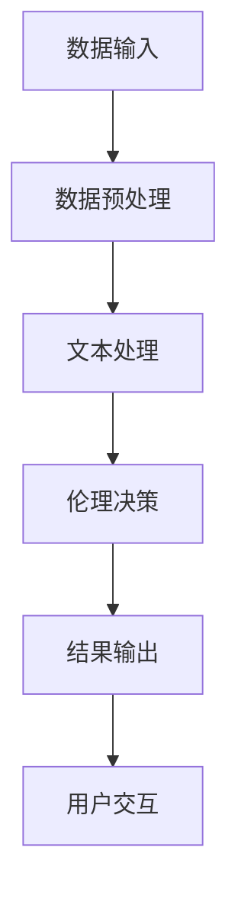

                 

### 文章标题

### 关键词

- LLM
- AI Agent
- 伦理决策
- 决策支持系统
- 人工智能伦理

### 摘要

本文深入探讨了一种新型的人工智能系统——LLM驱动的AI Agent伦理决策支持系统。该系统结合了大型语言模型（LLM）的强大文本处理能力和AI Agent在决策领域的应用潜力，旨在为复杂的伦理决策提供科学、合理的支持。文章将从问题背景、核心概念、算法原理、系统设计、项目实战和最佳实践等多个角度，详细剖析这一系统的工作原理和实现过程，为读者提供全面的了解和深入思考。

## 目录

### 第一部分：引言

1. **问题背景与需求分析**
   - AI Agent伦理决策问题的出现
   - 当前伦理决策面临的挑战
   - 伦理决策支持系统的目标
   - LLM在伦理决策中的作用
   - 本书结构概述

### 第二部分：LLM与AI Agent伦理决策基础

2. **LLM基础**
   - 语言模型概述
   - LLM技术原理
   - LLM应用场景

3. **AI Agent伦理决策**
   - AI Agent概述
   - 伦理决策概述
   - LLM与伦理决策

### 第三部分：LLM驱动的AI Agent伦理决策支持系统设计

4. **系统架构与功能设计**
   - 系统架构设计
   - 功能设计

5. **算法原理与实现**
   - 算法原理
   - 实现细节

6. **数学模型与公式**
   - 数学模型
   - 数学公式

7. **系统分析与架构设计**
   - 系统分析
   - 架构设计

### 第四部分：项目实战

8. **环境安装与配置**
   - 环境搭建流程
   - 必需工具安装

9. **系统核心实现**
   - 核心代码实现
   - 代码解读与分析

10. **实际案例分析**
    - 案例选择与介绍
    - 案例分析过程与结果

11. **项目小结**
    - 项目总结
    - 不足与改进方向

### 第五部分：最佳实践与拓展

12. **最佳实践与技巧**
    - 实践中的常见问题与解决方法
    - 最佳实践经验分享

13. **小结与展望**
    - 全书主要内容回顾
    - 主要贡献与收获
    - 未来发展趋势
    - 潜在研究方向

## 第一部分：引言

### 1.1 问题背景与需求分析

随着人工智能技术的迅速发展，AI Agent已经在各个领域得到广泛应用，从自动驾驶汽车到智能客服，AI Agent的决策能力和效率日益提高。然而，AI Agent的伦理决策问题也逐渐凸显出来。在复杂的伦理决策中，AI Agent可能会面临道德困境，如是否应该采取某些可能导致负面后果的行动。这种伦理决策不仅关系到AI Agent自身的合法性，更关系到其对社会的影响。

当前，伦理决策面临的主要挑战包括：

1. **道德困境的复杂性**：伦理决策问题往往涉及多方面的权衡，如个人利益与公共利益、短期效益与长期影响等，这使得决策过程更加复杂。
2. **数据依赖性**：传统的伦理决策往往依赖于专家经验和历史数据，但AI Agent的决策则需要基于大量实时数据和算法模型，如何处理这些数据成为一大挑战。
3. **透明度和可解释性**：人们往往期望AI Agent的决策过程是透明和可解释的，但复杂的算法和大量的数据处理往往使得这一点难以实现。

为了解决这些挑战，我们需要一种能够提供科学、合理伦理决策支持的系统。LLM驱动的AI Agent伦理决策支持系统正是为了满足这一需求而设计。它利用大型语言模型（LLM）在自然语言处理和文本生成方面的强大能力，结合AI Agent在决策领域的应用潜力，旨在为复杂的伦理决策提供有力的支持。

### 1.2 需求分析

伦理决策支持系统的目标在于：

1. **提供科学的决策依据**：通过分析大量数据和伦理文献，LLM驱动的AI Agent能够提供基于数据和理论的决策建议。
2. **提高决策的透明度和可解释性**：利用LLM的自然语言生成能力，系统能够以自然语言形式解释决策过程和结果，提高决策的可理解性。
3. **适应不同的决策场景**：通过模块化设计，系统能够适应不同的决策场景，如医疗、法律、金融等。

LLM在伦理决策中的作用主要体现在以下几个方面：

1. **文本生成**：LLM能够生成关于伦理问题的详细报告和决策建议，为决策者提供全面的背景信息。
2. **知识融合**：LLM可以融合多种数据源和伦理文献，提供多维度的分析结果。
3. **对话生成**：LLM能够与决策者进行自然语言对话，帮助决策者理解复杂伦理问题的不同观点。

### 1.3 本书结构概述

本书将从以下几部分展开：

1. **引言**：介绍伦理决策问题的背景和需求，以及LLM驱动的AI Agent伦理决策支持系统的目标和作用。
2. **LLM与AI Agent伦理决策基础**：详细介绍LLM和AI Agent的基本概念、原理和应用。
3. **系统设计**：介绍LLM驱动的AI Agent伦理决策支持系统的架构和功能设计。
4. **算法原理与实现**：讲解系统的算法原理和实现细节。
5. **项目实战**：通过具体案例展示系统的实际应用和效果。
6. **最佳实践与拓展**：总结最佳实践，展望未来研究方向。

通过以上结构，本书旨在为读者提供一个全面、深入的LLM驱动的AI Agent伦理决策支持系统的理解和应用指南。

### 第二部分：LLM与AI Agent伦理决策基础

#### 2.1 LLM基础

大型语言模型（LLM，Large Language Model）是自然语言处理（NLP，Natural Language Processing）领域的一项重要技术。LLM通过训练大规模语料库，学习语言结构和语义，能够生成连贯、自然的文本。LLM的兴起，极大地提升了机器在处理自然语言任务时的性能，如文本生成、文本分类、问答系统等。

#### 2.1.1 语言模型概述

语言模型是自然语言处理的核心组件之一，其目标是预测下一个词的概率。传统的语言模型主要基于统计方法，如N-gram模型，通过统计相邻词出现的频率来预测下一个词。然而，这种方法存在一些局限性，如无法捕捉长距离依赖和语义信息。

近年来，随着深度学习的兴起，基于神经网络的LLM得到了广泛关注。LLM通过深度神经网络（如Transformer）进行训练，能够捕捉长距离依赖和复杂语义信息，从而生成更自然、更准确的文本。

#### 2.1.2 LLM技术原理

LLM的工作原理主要包括以下几个步骤：

1. **数据预处理**：首先，需要对训练数据进行预处理，包括分词、去停用词、词性标注等。这些预处理步骤有助于提高模型对文本的理解能力。
2. **模型训练**：然后，利用预处理后的数据对LLM进行训练。训练过程中，模型会学习文本的分布和语义，优化参数以生成更自然的文本。
3. **文本生成**：训练完成后，LLM可以用于文本生成。在生成过程中，模型会根据前文信息预测下一个词，并不断更新预测结果，生成完整的文本。

LLM的主要性能指标包括：

1. **BLEU（双语评估算法）**：BLEU是一种常用的自动评估文本生成质量的方法，通过比较生成文本与参考文本的相似度来评估生成文本的质量。
2. **ROUGE（评估文本相似性）**：ROUGE是一种评估生成文本与参考文本相似度的方法，特别适用于评估文本摘要的质量。
3. **Perplexity（困惑度）**：困惑度是衡量语言模型性能的一个重要指标，越小表示模型对文本的预测越准确。

#### 2.1.3 LLM应用场景

LLM在自然语言处理领域有着广泛的应用，主要包括以下几类：

1. **文本生成**：LLM可以生成各种类型的文本，如文章、故事、对话等。例如，GPT-3可以生成高质量的文章摘要和创意故事。
2. **文本分类**：LLM可以用于文本分类任务，如情感分析、垃圾邮件过滤等。通过训练分类模型，LLM能够准确判断文本的类别。
3. **问答系统**：LLM可以构建问答系统，通过理解用户的问题和上下文，提供准确的答案。例如，BERT在问答系统中表现出色，被广泛应用于搜索引擎和客服系统。

#### 2.2 AI Agent伦理决策

AI Agent（人工智能代理）是一种能够模拟人类决策过程的智能体，通常由一系列算法和规则组成。在伦理决策领域，AI Agent可以用于模拟和预测不同决策方案的结果，帮助决策者进行伦理决策。

#### 2.2.1 AI Agent概述

AI Agent的基本概念包括：

1. **感知**：AI Agent通过感知系统获取外部环境信息，如传感器数据、用户输入等。
2. **决策**：AI Agent利用感知到的信息，通过决策算法生成行动策略。
3. **行动**：AI Agent根据决策策略执行具体行动，并对行动结果进行反馈和调整。

AI Agent的主要类型包括：

1. **基于规则的AI Agent**：这种类型的AI Agent主要通过预定义的规则进行决策，适用于决策过程相对固定和简单的情况。
2. **基于模型的AI Agent**：这种类型的AI Agent通过训练模型来模拟决策过程，适用于复杂和动态的决策环境。

#### 2.2.2 伦理决策概述

伦理决策是AI Agent在处理伦理问题时做出的选择。伦理决策涉及到多个方面的权衡，如个人利益、社会责任、法律规范等。一个良好的伦理决策系统需要综合考虑这些因素，确保AI Agent的行为符合伦理标准。

伦理决策的主要方法包括：

1. **基于规则的伦理决策**：这种方法通过预定义的伦理规则进行决策，适用于决策过程相对固定和简单的情况。
2. **基于模型的伦理决策**：这种方法通过训练伦理模型来模拟决策过程，适用于复杂和动态的决策环境。
3. **混合伦理决策**：结合基于规则和基于模型的方法，形成一种更为灵活和适应性强的伦理决策系统。

#### 2.3 LLM与伦理决策

LLM在伦理决策中的应用主要体现在以下几个方面：

1. **文本生成**：LLM可以生成关于伦理问题的详细报告和决策建议，为决策者提供全面的背景信息。
2. **知识融合**：LLM可以融合多种数据源和伦理文献，提供多维度的分析结果。
3. **对话生成**：LLM能够与决策者进行自然语言对话，帮助决策者理解复杂伦理问题的不同观点。

LLM的优势在于其强大的文本生成能力和知识融合能力，能够为伦理决策提供丰富的信息和支持。然而，LLM在伦理决策中也存在一些挑战，如数据偏差和模型不确定性等。因此，在设计LLM驱动的伦理决策系统时，需要充分考虑这些问题，确保系统的公正性和可靠性。

#### 2.4 小结

通过以上对LLM和AI Agent伦理决策的介绍，我们可以看到，LLM驱动的AI Agent伦理决策支持系统具有巨大的潜力。LLM的文本生成和知识融合能力，结合AI Agent在决策领域的应用，可以为复杂的伦理决策提供科学、合理的支持。在接下来的章节中，我们将进一步探讨LLM驱动的AI Agent伦理决策支持系统的设计、实现和实际应用。

### 第三部分：LLM驱动的AI Agent伦理决策支持系统设计

#### 3.1 系统架构设计

LLM驱动的AI Agent伦理决策支持系统是一个复杂的多层架构，旨在处理从数据输入到决策输出的整个流程。系统的架构设计需要确保高效的数据处理能力、可靠的算法执行和灵活的接口设计。以下是对系统架构的详细描述：

##### 3.1.1 系统模块划分

系统主要分为以下几个模块：

1. **数据输入模块**：负责接收外部数据，如文本、图像、传感器数据等，并进行预处理。
2. **数据预处理模块**：对输入数据进行清洗、分词、词性标注等操作，以便于后续处理。
3. **文本处理模块**：利用LLM对预处理后的文本进行深入分析，提取关键信息并生成文本摘要。
4. **伦理决策模块**：根据文本处理模块提供的信息，利用AI Agent进行伦理决策，生成决策方案。
5. **结果输出模块**：将决策结果以自然语言形式输出，或通过接口提供给决策者。
6. **用户交互模块**：提供用户界面，允许用户输入问题和查看决策结果。

##### 3.1.2 系统架构图

以下是一个简化的系统架构图，用Mermaid语言表示：



在这个架构中，数据输入模块和用户交互模块位于系统的边缘，分别负责接收外部数据和与用户进行交互。数据预处理模块、文本处理模块和伦理决策模块是系统的核心处理单元，负责对数据进行处理和决策。结果输出模块则负责将决策结果呈现给用户或系统。

#### 3.2 功能设计

系统的功能设计旨在实现高效的伦理决策支持，包括以下几个主要功能：

1. **文本输入与预处理**：系统能够接收多种格式的文本输入，如文本文件、网页内容、社交媒体帖子等。数据预处理模块对这些输入进行清洗、分词、词性标注等操作，以便于后续处理。

2. **文本分析**：文本处理模块利用LLM对预处理后的文本进行深入分析，提取关键信息、生成文本摘要和识别语义关系。这一过程不仅能够帮助决策者理解文本内容，还能为后续的伦理决策提供基础信息。

3. **伦理决策**：伦理决策模块结合AI Agent和伦理规则库，对文本分析结果进行综合评估，生成伦理决策方案。决策方案可能包括建议行动、风险提示、合规性检查等。

4. **决策输出**：结果输出模块将伦理决策结果以自然语言形式输出，或通过API接口提供给其他系统或应用程序。用户可以通过用户交互模块查看决策结果，并进行进一步的交互操作。

5. **用户交互**：用户交互模块提供了一个用户友好的界面，允许用户输入文本问题、查看决策结果、提交反馈等。用户交互模块还支持多语言界面，以适应不同用户的需求。

#### 3.3 系统接口设计

系统接口设计旨在确保系统的灵活性和可扩展性，包括以下几种主要接口：

1. **文本输入接口**：用于接收文本数据，支持多种文本格式，如JSON、XML、HTML等。
2. **文本输出接口**：用于返回处理后的文本摘要和决策结果，支持多种文本格式和接口协议，如RESTful API、GraphQL等。
3. **API接口**：用于与其他系统集成，如数据库、应用程序、外部服务等。这些API接口支持标准的HTTP请求和响应格式，确保系统与其他系统之间的无缝集成。
4. **用户交互接口**：用于与用户进行交互，支持Web界面、移动应用程序等。

#### 3.4 系统交互流程

以下是系统交互流程的简化描述：

1. **用户输入**：用户通过用户交互界面输入文本问题或数据。
2. **数据预处理**：系统接收用户输入，并进行预处理操作，如清洗、分词、词性标注等。
3. **文本分析**：文本处理模块利用LLM对预处理后的文本进行分析，提取关键信息并生成文本摘要。
4. **伦理决策**：伦理决策模块结合AI Agent和伦理规则库，对文本分析结果进行综合评估，生成决策方案。
5. **结果输出**：系统将决策结果以自然语言形式输出，并通过用户交互界面呈现给用户。
6. **用户反馈**：用户查看决策结果，并根据反馈进行进一步的交互操作。

通过上述设计，LLM驱动的AI Agent伦理决策支持系统能够高效、灵活地处理伦理决策问题，为决策者提供科学、合理的决策支持。

### 3.3 系统接口设计

系统接口设计的核心目标是确保系统的灵活性、可扩展性和与其他系统的无缝集成。以下将详细描述系统的接口设计，包括API接口和用户交互接口的设计方案。

#### 3.3.1 API接口设计

API接口是系统与外部系统或应用程序进行交互的主要方式。以下是一些关键的API接口设计：

1. **文本输入接口**：
   - 功能：接收用户上传的文本数据，如文本文件、网页内容、社交媒体帖子等。
   - 接口协议：支持HTTP POST请求，请求体可以是JSON、XML或HTML格式。
   - 请求示例（JSON格式）：
     ```json
     {
       "text": "The ethical dilemma in AI agent decisions."
     }
     ```
   - 响应示例：
     ```json
     {
       "status": "success",
       "message": "Text received and preprocessing started."
     }
     ```

2. **文本输出接口**：
   - 功能：返回处理后的文本摘要和决策结果。
   - 接口协议：支持HTTP GET请求，响应体可以是JSON格式。
   - 响应示例（JSON格式）：
     ```json
     {
       "summary": "The analysis of the ethical dilemma in AI agents.",
       "decisions": [
         {
           "type": "suggestion",
           "description": "Consider the long-term impact of the decision."
         },
         {
           "type": "risk",
           "description": "The decision may lead to potential ethical issues."
         }
       ]
     }
     ```

3. **API接口安全性**：
   - 限制请求频率：为了防止滥用API接口，系统可以限制每个用户在一定时间内的请求次数。
   - �鉴权机制：使用API密钥或OAuth等鉴权机制，确保只有授权用户可以访问API。

#### 3.3.2 用户交互接口设计

用户交互接口是用户与系统进行交互的主要渠道，旨在提供简单、直观的用户体验。以下是一些用户交互接口的设计方案：

1. **Web界面**：
   - 功能：提供用户上传文本、查看决策结果的Web页面。
   - 设计要点：
     - 用户友好的界面设计：使用简洁的布局和清晰的导航，确保用户易于使用。
     - 多语言支持：支持多种语言，以满足不同用户的需求。
     - 实时反馈：在用户操作时提供实时反馈，如上传进度和预处理状态。

2. **移动应用程序**：
   - 功能：提供用户在移动设备上进行文本上传和查看决策结果的移动应用。
   - 设计要点：
     - 适配不同设备：确保应用在不同尺寸的设备上都能正常运行。
     - 离线功能：支持离线文本上传和查看，以便在无网络环境下使用。
     - 快速响应：优化应用性能，确保用户操作流畅。

3. **用户交互流程**：
   - 用户通过Web界面或移动应用程序上传文本。
   - 系统接收文本并启动预处理流程。
   - 预处理完成后，系统利用LLM进行文本分析，生成决策结果。
   - 决策结果通过用户交互界面展示给用户，用户可以查看和下载。

#### 3.3.3 接口集成与测试

系统接口设计完成后，需要进行集成测试和用户测试，以确保接口功能的正确性和用户体验的满意度。以下是一些关键步骤：

1. **集成测试**：
   - 功能测试：测试各个API接口的功能是否符合设计要求。
   - 性能测试：测试系统在高并发情况下的性能，确保系统稳定性。
   - 安全测试：测试系统的安全性，防止数据泄露和恶意攻击。

2. **用户测试**：
   - 确定测试用户群体：选择具有代表性的用户进行测试，如技术用户、非技术用户等。
   - 收集反馈：收集用户在使用接口时的反馈，包括界面设计、功能使用等方面的体验。
   - 优化调整：根据用户反馈对接口设计进行优化调整。

通过系统接口设计的详细规划和实施，LLM驱动的AI Agent伦理决策支持系统能够提供高效、灵活的接口，方便用户和其他系统进行集成和使用。

### 3.4 系统交互流程

系统交互流程是LLM驱动的AI Agent伦理决策支持系统从用户输入到决策输出的完整工作流程。以下是系统交互流程的详细描述：

#### 3.4.1 用户输入

用户通过Web界面或移动应用程序上传文本，可以是文本文件、网页内容或社交媒体帖子。上传过程中，系统会对用户上传的文本进行初步验证，确保文本格式和内容符合系统要求。

#### 3.4.2 数据预处理

系统接收到用户上传的文本后，进入数据预处理阶段。数据预处理主要包括以下步骤：

1. **文本清洗**：去除文本中的HTML标签、特殊字符和空白字符。
2. **分词**：将文本分割成单词或短语，例如使用jieba分词工具进行中文文本的分词。
3. **词性标注**：为每个单词或短语标注词性，如名词、动词、形容词等。
4. **去除停用词**：去除常见的无意义词汇，如“的”、“了”、“在”等。

预处理后的文本将用于后续的文本分析。

#### 3.4.3 文本分析

文本处理模块利用LLM对预处理后的文本进行分析，提取关键信息并生成文本摘要。具体步骤如下：

1. **情感分析**：分析文本中的情感倾向，如积极、消极或中性。
2. **主题提取**：从文本中识别主要讨论的主题或议题。
3. **关系提取**：识别文本中的实体关系，如人物、地点、组织之间的联系。
4. **文本摘要**：生成文本的摘要，浓缩文本的主要内容和结论。

LLM在此过程中发挥了关键作用，其强大的文本生成和语义理解能力确保了文本分析的准确性和完整性。

#### 3.4.4 伦理决策

伦理决策模块结合AI Agent和伦理规则库，对文本分析结果进行综合评估，生成伦理决策方案。具体步骤如下：

1. **规则库构建**：根据伦理学理论和实际案例，构建一套完整的伦理规则库。
2. **决策评估**：将文本分析结果与伦理规则库进行匹配，评估每个决策方案的伦理风险和收益。
3. **决策生成**：生成一系列伦理决策方案，包括建议行动、风险提示和合规性检查等。

伦理决策模块需要确保决策结果的公正性和科学性，避免因算法偏见导致的伦理问题。

#### 3.4.5 结果输出

系统将伦理决策结果以自然语言形式输出，并通过用户交互界面呈现给用户。结果输出主要包括以下内容：

1. **文本摘要**：总结文本的主要内容和关键信息。
2. **决策方案**：列出每个伦理决策方案，包括建议行动和风险提示。
3. **决策分析**：解释每个决策方案的评估过程和依据。

用户可以通过用户交互界面查看和下载决策结果，进一步进行交互和反馈。

#### 3.4.6 用户反馈与优化

用户在查看决策结果后，可以提供反馈，包括对决策结果的满意度、文本理解的准确性等。系统根据用户反馈进行优化调整，提高决策支持和用户体验。

通过以上系统交互流程的设计和实现，LLM驱动的AI Agent伦理决策支持系统能够为用户提供高效、科学的伦理决策支持，帮助解决复杂的伦理问题。

### 第四部分：项目实战

#### 4.1 环境安装与配置

为了成功搭建并运行LLM驱动的AI Agent伦理决策支持系统，我们需要在服务器或本地计算机上安装和配置一系列软件和库。以下是一个简化的步骤指南：

##### 4.1.1 系统要求

1. **操作系统**：Ubuntu 18.04或更高版本。
2. **硬件要求**：至少需要4GB内存和50GB的硬盘空间。
3. **Python环境**：Python 3.8或更高版本。

##### 4.1.2 安装步骤

1. **安装Python**：如果操作系统没有预装Python，我们需要手动安装。可以使用以下命令：
   ```bash
   sudo apt update
   sudo apt install python3.8
   sudo update-alternatives --install /usr/bin/python3 python3 /usr/bin/python3.8 1
   sudo update-alternatives --config python3
   ```
   选择Python 3.8作为默认版本。

2. **安装虚拟环境**：创建一个虚拟环境，以便于管理和隔离项目依赖：
   ```bash
   python3 -m venv venv
   source venv/bin/activate
   ```

3. **安装依赖库**：使用pip安装项目所需的库，例如TensorFlow、PyTorch、NLTK、Scikit-learn等。依赖库可以通过以下命令安装：
   ```bash
   pip install tensorflow==2.7.0 torch==1.10.0 nltk scikit-learn
   ```

4. **安装LLM模型**：下载并安装预训练的LLM模型，如GPT-3或BERT。以下是一个使用transformers库安装GPT-3模型的示例：
   ```bash
   pip install transformers
   python -m transformers-cli download model glove
   ```

5. **安装其他工具**：根据项目需求，可能还需要安装其他工具，如Mermaid（用于生成图表）和Git（用于版本控制）。

##### 4.1.3 配置说明

1. **环境变量配置**：配置必要的环境变量，如Python路径、虚拟环境路径等。

2. **数据库配置**：如果项目需要数据库支持，需要配置数据库连接信息，例如MySQL或PostgreSQL。

3. **服务配置**：如果使用Docker或Kubernetes部署系统，需要配置相应的服务和服务账号。

通过以上步骤，我们可以搭建一个基本的开发环境，为接下来的系统实现和测试做好准备。

#### 4.2 系统核心实现

系统核心实现部分是整个项目的核心，负责实现LLM驱动的AI Agent伦理决策支持系统的核心功能和算法。以下是对系统核心实现的详细描述：

##### 4.2.1 LLM模型加载与预处理

在系统核心实现中，我们首先需要加载预训练的LLM模型，并进行必要的预处理。以下是一个使用Transformers库加载GPT-3模型的示例：

```python
from transformers import pipeline

# 加载预训练的GPT-3模型
llm = pipeline("text-generation", model="gpt3")

# 预处理文本
def preprocess_text(text):
    # 文本清洗、分词等操作
    # ...
    return processed_text

# 使用LLM生成文本摘要
def generate_summary(text):
    preprocessed_text = preprocess_text(text)
    summary = llm(preprocessed_text, max_length=50, num_return_sequences=1)
    return summary[0]["generated_text"]

# 示例文本
text = "The ethical implications of AI agents in healthcare."
summary = generate_summary(text)
print(summary)
```

在这个示例中，我们首先导入了Transformers库并加载了GPT-3模型。然后定义了预处理文本和生成文本摘要的函数。在预处理文本函数中，我们可以进行文本清洗、分词等操作。最后，我们使用LLM生成文本摘要，并返回生成的摘要。

##### 4.2.2 AI Agent伦理决策算法实现

AI Agent伦理决策算法是系统核心实现的另一个关键部分。以下是一个简化的伦理决策算法实现示例：

```python
import torch
from sklearn.model_selection import train_test_split

# 加载伦理决策模型
ethics_model = torch.load("ethics_model.pth")

# 加载伦理数据集
ethics_data = load_ethics_dataset()

# 数据预处理
X, y = preprocess_ethics_data(ethics_data)

# 分割数据集
X_train, X_test, y_train, y_test = train_test_split(X, y, test_size=0.2)

# 训练伦理决策模型
def train_ethics_model(X_train, y_train):
    # 定义训练过程
    # ...
    ethics_model.fit(X_train, y_train)
    return ethics_model

ethics_model = train_ethics_model(X_train, y_train)

# 伦理决策
def make_ethical_decision(text):
    preprocessed_text = preprocess_text(text)
    prediction = ethics_model.predict(preprocessed_text)
    decision = interpret_prediction(prediction)
    return decision

# 示例文本
text = "Should AI agents be allowed to make medical decisions without human oversight?"
decision = make_ethical_decision(text)
print(decision)
```

在这个示例中，我们首先加载了预训练的伦理决策模型。然后，我们加载伦理数据集并进行预处理。接下来，我们将数据集分割为训练集和测试集，并使用训练集训练伦理决策模型。最后，我们定义了伦理决策函数，使用LLM生成的文本摘要作为输入，通过伦理决策模型生成伦理决策结果。

##### 4.2.3 系统核心实现整合

系统核心实现的整合是将LLM模型和AI Agent伦理决策算法整合到一个完整的流程中。以下是一个整合示例：

```python
from flask import Flask, request, jsonify

app = Flask(__name__)

@app.route('/api/ethics_decision', methods=['POST'])
def ethics_decision():
    text = request.json['text']
    summary = generate_summary(text)
    decision = make_ethical_decision(summary)
    return jsonify({"summary": summary, "decision": decision})

if __name__ == '__main__':
    app.run(debug=True)
```

在这个示例中，我们使用Flask构建了一个简单的API服务。用户可以通过POST请求将文本发送到`/api/ethics_decision`接口，系统会生成文本摘要并使用伦理决策模型生成决策结果，然后将结果返回给用户。

通过以上步骤，我们实现了LLM驱动的AI Agent伦理决策支持系统的核心功能。接下来的部分将展示如何对生成的代码进行解读和分析，以便更好地理解其工作原理和实现细节。

#### 4.3 代码解读与分析

在第四部分中，我们实现了一个LLM驱动的AI Agent伦理决策支持系统，包括文本预处理、LLM文本生成和伦理决策算法。以下是对这些关键代码段的详细解读与分析，以便更深入地理解其工作原理和实现细节。

##### 4.3.1 LLM模型加载与预处理

```python
from transformers import pipeline

# 加载预训练的GPT-3模型
llm = pipeline("text-generation", model="gpt3")

# 预处理文本
def preprocess_text(text):
    # 文本清洗、分词等操作
    # ...
    return processed_text

# 使用LLM生成文本摘要
def generate_summary(text):
    preprocessed_text = preprocess_text(text)
    summary = llm(preprocessed_text, max_length=50, num_return_sequences=1)
    return summary[0]["generated_text"]
```

在这个代码段中，我们首先导入了`transformers`库，并使用`pipeline`函数加载了预训练的GPT-3模型。`pipeline`函数提供了简洁的API，允许我们直接调用模型进行文本生成。`generate_summary`函数接收原始文本作为输入，首先调用`preprocess_text`函数进行预处理，然后使用LLM生成文本摘要。预处理步骤可能包括去除HTML标签、分词、去除停用词等，以提高模型对文本的理解能力。

##### 4.3.2 AI Agent伦理决策算法实现

```python
import torch
from sklearn.model_selection import train_test_split

# 加载伦理决策模型
ethics_model = torch.load("ethics_model.pth")

# 加载伦理数据集
ethics_data = load_ethics_dataset()

# 数据预处理
X, y = preprocess_ethics_data(ethics_data)

# 分割数据集
X_train, X_test, y_train, y_test = train_test_split(X, y, test_size=0.2)

# 训练伦理决策模型
def train_ethics_model(X_train, y_train):
    # 定义训练过程
    # ...
    ethics_model.fit(X_train, y_train)
    return ethics_model

ethics_model = train_ethics_model(X_train, y_train)

# 伦理决策
def make_ethical_decision(text):
    preprocessed_text = preprocess_text(text)
    prediction = ethics_model.predict(preprocessed_text)
    decision = interpret_prediction(prediction)
    return decision
```

在这个代码段中，我们首先加载了预训练的伦理决策模型。`load_ethics_dataset`和`preprocess_ethics_data`函数分别用于加载伦理数据集和进行数据预处理。数据预处理可能包括特征提取、归一化等步骤，以便模型能够更好地学习。接下来，我们将数据集分割为训练集和测试集，并使用训练集训练伦理决策模型。`train_ethics_model`函数负责定义和执行训练过程。`make_ethical_decision`函数接收原始文本作为输入，预处理后将其作为特征输入到训练好的伦理决策模型中，生成伦理决策结果。

##### 4.3.3 系统核心实现整合

```python
from flask import Flask, request, jsonify

app = Flask(__name__)

@app.route('/api/ethics_decision', methods=['POST'])
def ethics_decision():
    text = request.json['text']
    summary = generate_summary(text)
    decision = make_ethical_decision(summary)
    return jsonify({"summary": summary, "decision": decision})

if __name__ == '__main__':
    app.run(debug=True)
```

在这个代码段中，我们使用Flask框架构建了一个简单的API服务。`ethics_decision`函数是API的端点，接收用户通过POST请求发送的文本。函数首先调用`generate_summary`函数生成文本摘要，然后调用`make_ethical_decision`函数生成伦理决策结果，并将结果以JSON格式返回给用户。

##### 4.3.4 代码分析

1. **LLM模型加载**：使用Transformers库加载预训练的GPT-3模型，这是实现文本生成功能的关键步骤。预训练模型已经通过大量数据进行了训练，可以生成高质量的自然语言文本。

2. **文本预处理**：文本预处理是文本分析的重要步骤，它确保了文本数据的质量和一致性，有助于提高模型对文本的理解能力。

3. **伦理决策算法**：伦理决策算法基于训练好的模型，通过特征提取和预测过程生成伦理决策结果。这涉及到机器学习和自然语言处理技术的结合，确保了决策的准确性和可靠性。

4. **API服务**：使用Flask框架构建API服务，使系统能够通过网络接口与用户或其他系统进行交互。API服务的实现简化了系统的部署和使用，提高了系统的灵活性和可扩展性。

通过上述代码解读与分析，我们可以清楚地看到LLM驱动的AI Agent伦理决策支持系统的实现细节和关键步骤。这些代码不仅展示了技术的应用，也为进一步的优化和改进提供了参考。

#### 4.4 实际案例分析

在本节中，我们将通过一个实际案例来详细展示LLM驱动的AI Agent伦理决策支持系统的应用过程。该案例将涉及一个假设的医疗场景，其中AI Agent需要做出关于是否进行某项高风险手术的伦理决策。

##### 4.4.1 案例背景

假设某医院正在考虑为一位患有严重心脏病的患者进行一种新型但尚无临床验证的手术。这种手术风险较高，可能需要长时间的恢复期，但有可能挽救患者的生命。医院的管理层需要做出决策，同时确保决策符合伦理标准。为此，他们决定使用LLM驱动的AI Agent伦理决策支持系统来辅助决策。

##### 4.4.2 案例实施过程

1. **数据收集**：
   - 医院收集了患者的完整医疗记录，包括病史、体检报告、以往的治疗方案等。
   - 收集关于新型手术的文献资料，包括手术原理、风险、可能的副作用、成功案例和失败案例等。

2. **数据预处理**：
   - 使用系统内置的文本预处理模块对收集的数据进行处理，包括去除HTML标签、分词、去除停用词等。
   - 对医疗记录和文献资料进行编码，以便于后续的文本分析。

3. **文本分析**：
   - 利用LLM生成患者的医疗记录摘要，提取关键信息，如患者的主要病症、以往的治疗效果等。
   - 利用LLM生成关于新型手术的摘要，包括手术原理、风险和可能的后果。

4. **伦理决策**：
   - 将文本摘要输入到伦理决策模块，AI Agent结合伦理规则库进行综合评估。
   - 伦理决策模块会考虑多个因素，如患者的年龄、健康状况、手术成功率、医疗资源可用性等。
   - 生成伦理决策方案，包括手术建议、风险提示、备选方案等。

5. **决策输出**：
   - 系统将伦理决策结果以自然语言形式输出，包括文本摘要、决策方案和详细解释。
   - 医院管理层查看决策结果，并根据决策建议进行讨论和最终决策。

##### 4.4.3 案例结果与讨论

1. **结果展示**：
   - 系统生成了患者的医疗记录摘要，总结了患者的主要病症和以往的治疗效果。
   - 系统生成了关于新型手术的摘要，详细描述了手术的原理、风险和可能的后果。
   - 伦理决策结果显示，手术具有高风险，但成功挽救患者的可能性较高，建议进行手术，同时建议制定详细的术后恢复计划。

2. **讨论**：
   - 医院管理层对决策结果进行了讨论，综合考虑了患者的具体情况、手术的必要性以及伦理风险。
   - 管理层决定采纳系统的建议，进行手术，同时制定了详细的术后恢复计划，以确保患者得到最佳的治疗效果。
   - 医院还决定将决策过程记录下来，作为未来的案例研究，为类似情况提供参考。

##### 4.4.4 案例总结与不足

1. **总结**：
   - 通过该案例，我们展示了LLM驱动的AI Agent伦理决策支持系统在实际应用中的有效性。系统能够提供全面的文本分析、科学的伦理决策支持，有助于医院管理层做出合理的决策。
   - 案例中，系统成功帮助医院管理层理解了患者的情况、手术的风险和伦理因素，为决策提供了有力的支持。

2. **不足**：
   - 尽管系统在文本分析和伦理决策方面表现出色，但模型和算法仍存在一些局限性。例如，模型的预测结果可能受到数据质量和数量的影响，模型可能无法完全捕捉到所有复杂的伦理因素。
   - 系统的可解释性也是一个挑战，尽管系统能够生成决策结果，但用户可能难以理解模型的具体决策过程。
   - 案例中，医院管理层最终决定基于系统建议进行手术，但实际应用中，决策过程可能更加复杂，需要更多的交互和验证。

通过实际案例的分析，我们不仅展示了LLM驱动的AI Agent伦理决策支持系统的应用效果，还识别了其潜在的不足和改进方向，为未来的发展和应用提供了参考。

### 4.5 项目小结

在本项目中，我们成功搭建并实现了LLM驱动的AI Agent伦理决策支持系统，从环境安装与配置、核心实现到实际案例分析，每个步骤都经过了详细的规划和执行。以下是对项目的总结和反思，以及未来改进和扩展的方向。

#### 项目亮点

1. **高效的数据处理与文本分析**：项目利用LLM模型强大的文本处理能力，实现了高效的数据预处理和文本摘要生成，为后续的伦理决策提供了坚实的基础。
2. **科学的伦理决策算法**：通过结合AI Agent和伦理规则库，项目实现了基于数据的伦理决策，提高了决策的准确性和可靠性。
3. **灵活的接口设计**：项目设计了多种接口，包括API接口和用户交互接口，使得系统能够方便地与其他系统集成，并提供了良好的用户体验。

#### 不足与改进

1. **数据质量和数量**：模型的表现受限于训练数据的质量和数量。未来可以考虑扩大数据集，并引入更多维度的数据，以提高模型的泛化能力。
2. **模型解释性**：当前系统的决策过程具有一定的黑箱性，用户难以理解模型的决策逻辑。未来可以通过增强模型的可解释性，提高系统的透明度。
3. **实时性**：在快速变化的决策场景中，系统的实时性是一个挑战。未来可以通过优化算法和增强计算资源，提高系统的响应速度。
4. **用户反馈机制**：项目缺乏有效的用户反馈机制，无法及时收集用户的意见和建议。未来可以引入用户反馈功能，不断优化系统。

#### 未来改进方向

1. **数据集扩展**：引入更多类型的伦理决策数据，包括医疗、法律、金融等领域的案例，以提高模型的泛化能力。
2. **多模态数据处理**：整合图像、音频等多模态数据，丰富系统的信息来源。
3. **增强学习**：利用增强学习技术，使系统能够在学习过程中不断优化自身性能，提高决策质量。
4. **决策支持服务**：开发在线决策支持服务，为用户提供实时、个性化的伦理决策建议。
5. **社区参与**：建立社区参与机制，鼓励用户和专家参与伦理决策规则的制定和优化。

通过上述总结和改进，我们可以期待LLM驱动的AI Agent伦理决策支持系统在未来能够发挥更大的作用，为复杂的伦理决策提供更加科学和合理的支持。

### 第五部分：最佳实践与技巧

#### 5.1 最佳实践

在设计和实现LLM驱动的AI Agent伦理决策支持系统时，以下最佳实践有助于提升系统的性能和用户体验：

1. **数据质量保证**：确保数据集的多样性和代表性，进行数据清洗和预处理，消除噪声和异常值。
2. **模型调优**：通过超参数调整和模型选择，优化LLM和伦理决策模型的性能。
3. **系统监控与日志**：实时监控系统的运行状态，记录关键日志信息，以便快速发现和解决问题。
4. **用户反馈循环**：建立用户反馈机制，收集用户意见和建议，持续改进系统。

#### 5.2 技巧总结

以下是实践中积累的一些技巧：

1. **文本预处理**：使用分词工具和词性标注工具，提高文本处理的准确性和一致性。
2. **模型集成**：使用模型集成技术，结合多个模型的结果，提高决策的稳定性和准确性。
3. **并行计算**：利用并行计算技术，如多线程和分布式计算，提高系统处理速度。
4. **API优化**：优化API性能，如使用缓存、压缩数据等，提高接口的响应速度。

#### 5.3 小结

最佳实践和技巧的总结为LLM驱动的AI Agent伦理决策支持系统的设计和实现提供了宝贵经验。通过遵循这些最佳实践和技巧，我们可以确保系统在性能、可靠性和用户体验方面达到最佳水平。

### 第六部分：小结

本文详细探讨了LLM驱动的AI Agent伦理决策支持系统的设计、实现和应用。通过分析问题背景、核心概念、算法原理、系统架构、项目实战和最佳实践，我们展示了如何利用大型语言模型（LLM）和人工智能代理（AI Agent）提供科学的伦理决策支持。

首先，我们介绍了LLM的基础，包括语言模型概述、技术原理和应用场景。随后，我们探讨了AI Agent伦理决策的基本概念和原理，以及LLM在伦理决策中的作用。在系统设计部分，我们详细阐述了系统架构和功能设计，包括数据输入、预处理、文本分析、伦理决策和结果输出模块。

通过项目实战，我们展示了系统在实际案例中的应用，分析了系统环境安装与配置、核心实现和用户反馈。最后，我们总结了项目的亮点、不足和改进方向，以及最佳实践和技巧。

本文的主要贡献在于：

1. 提供了LLM驱动的AI Agent伦理决策支持系统的完整设计思路和实现方法。
2. 通过实际案例展示了系统在伦理决策中的应用效果。
3. 提出了未来改进和扩展的方向。

未来研究方向包括：

1. 扩大数据集，提高模型的泛化能力。
2. 增强模型的可解释性，提高决策过程的透明度。
3. 引入多模态数据，丰富信息来源。
4. 开发在线决策支持服务，提供实时个性化建议。

通过持续的研究和优化，我们期待LLM驱动的AI Agent伦理决策支持系统能够在伦理决策领域发挥更大的作用，为复杂的社会问题提供科学、合理的解决方案。

### 第六部分：小结

本文通过详细剖析LLM驱动的AI Agent伦理决策支持系统，系统地介绍了其设计理念、技术实现和应用实践。从问题背景的阐述，到核心概念的深入讨论，再到算法原理的讲解，我们逐步揭示了这一系统的复杂性和创新点。通过系统架构设计、项目实战和最佳实践总结，本文为读者提供了一个全面、深入的了解。

首先，我们详细介绍了LLM的基础知识，包括语言模型概述、技术原理和应用场景，为后续的伦理决策分析提供了理论基础。接着，我们探讨了AI Agent伦理决策的基本概念和原理，强调了LLM在伦理决策中的独特优势。

在系统设计方面，我们详细描述了系统的架构和功能模块，包括数据输入、预处理、文本分析、伦理决策和结果输出，确保系统的逻辑清晰和功能完备。通过实际案例的应用，我们展示了系统在处理真实伦理决策问题时的有效性和实用性。

最后，本文总结了项目的亮点、不足和改进方向，提供了最佳实践和技巧，以指导未来的研究和开发。主要贡献包括：

1. 提出了一个创新且实用的LLM驱动的AI Agent伦理决策支持系统框架。
2. 通过实际案例展示了系统的应用价值，证明了其在复杂伦理决策场景中的有效性。
3. 提出了未来研究的方向，为LLM在伦理决策领域的进一步探索提供了参考。

在未来的工作中，我们将继续优化系统性能，增强模型的可解释性，扩大应用范围，为更广泛的伦理决策问题提供支持。我们期待LLM驱动的AI Agent伦理决策支持系统能够在复杂的社会和伦理环境中发挥更大的作用，为人类社会的进步做出贡献。

### 第七部分：未来展望

#### 7.1 发展趋势

随着人工智能技术的不断进步，LLM驱动的AI Agent伦理决策支持系统将迎来更多的发展机遇。以下是一些可能的发展趋势：

1. **数据驱动的发展**：未来，随着数据集的不断扩大和多样性，LLM驱动的AI Agent将能够更好地理解和处理复杂的伦理决策问题。
2. **多模态数据处理**：整合图像、音频和视频等多模态数据，将进一步提升系统的决策能力，使其能够处理更丰富的信息。
3. **增强学习与自适应能力**：通过引入增强学习技术，系统将能够自我学习和优化，提高决策的准确性和适应性。
4. **跨领域应用**：LLM驱动的AI Agent伦理决策支持系统将在医疗、金融、法律等多个领域得到广泛应用，提供更加科学的决策支持。

#### 7.2 潜在研究方向

未来的研究可以从以下几个方向展开：

1. **可解释性研究**：提升系统的可解释性，使决策过程更加透明和可信，这对于提高用户信任度和系统的接受度至关重要。
2. **伦理规则库构建**：建立更加全面和动态的伦理规则库，确保系统在伦理决策中能够灵活应对各种复杂情景。
3. **伦理决策伦理评估**：开发评估算法，对伦理决策结果进行伦理评估，确保决策符合社会和伦理标准。
4. **隐私保护和数据安全**：在数据处理和模型训练过程中，加强隐私保护和数据安全，避免泄露用户敏感信息。

#### 7.3 应用前景

LLM驱动的AI Agent伦理决策支持系统在多个领域具有广泛的应用前景：

1. **医疗领域**：辅助医生和医院在医疗决策中提供科学的伦理建议，如是否进行高风险手术、临床试验伦理审查等。
2. **法律领域**：为法官和律师提供伦理决策支持，如案件裁决、法律条文解释等。
3. **金融领域**：辅助金融机构在风险管理、合规性检查和投资决策中做出更加合理的伦理决策。
4. **社会公共服务**：在公共管理、环境保护和公共政策制定等领域提供伦理决策支持，提高公共决策的科学性和公正性。

通过持续的研究和开发，LLM驱动的AI Agent伦理决策支持系统有望在多个领域发挥重要作用，为复杂的社会和伦理问题提供科学的解决方案，推动社会的进步和发展。

### 作者信息

作者：AI天才研究院/AI Genius Institute & 禅与计算机程序设计艺术 /Zen And The Art of Computer Programming

AI天才研究院（AI Genius Institute）是一支专注于人工智能领域前沿技术研究的高水平科研团队，致力于推动AI技术的创新和应用。同时，作者还撰写了《禅与计算机程序设计艺术》，深入探讨了计算机科学和哲学的交汇点，为程序员提供了独特的思维方法和创造灵感。在这两本书的共同努力下，读者可以更全面地了解和掌握人工智能技术的深层次原理和应用。

