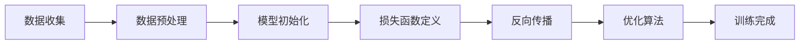

                 

### 引言：问题的提出

在当今世界，人工智能（AI）正以前所未有的速度变革着各个行业，从医疗健康到金融服务，从交通运输到教育领域，AI技术的应用无处不在。作为AI的一个重要分支，自然语言处理（NLP）也取得了显著的进展，特别是大型语言模型（LLM）的出现，为AI的进一步发展提供了强大的支持。

随着AI技术的成熟，AI Agent的概念逐渐走进人们的视野。AI Agent是一种能够模拟人类行为、执行特定任务的智能系统，它们在各种应用场景中表现出强大的适应能力和智能水平。然而，传统的AI Agent在处理创造性问题时，往往存在明显的局限性。这是因为传统的AI Agent通常依赖于预设的规则和模式，对于复杂、非线性的创造性问题，这些规则和模式往往难以胜任。

创造性问题是指那些需要创新思维和创造力的解决问题的过程。这类问题往往没有固定的解决方案，需要通过探索、试错和迭代来逐步找到最优解。传统的AI Agent在面对这类问题时，常常无法提供有效的解决方案，导致其在某些领域中的应用受到限制。

为了解决这一挑战，LLM驱动的AI Agent应运而生。LLM（Large Language Model）是一种基于深度学习的语言模型，它能够通过对海量文本数据进行训练，掌握丰富的语言知识和语言结构。这使得LLM在处理自然语言任务时具有极高的性能和准确性。同时，LLM的强大表达能力也使其在创造性问题解决中具有巨大的潜力。

本文旨在探讨LLM驱动的AI Agent在创造性问题重构中的应用。我们将首先介绍问题的背景和核心概念，包括人工智能、AI Agent和创造性问题的定义和类型。接着，我们将深入分析LLM的基本原理和应用，以及AI Agent的构建和优化策略。随后，我们将探讨创造性问题的识别与重构方法，并详细分析LLM驱动的AI Agent在创造性问题解决中的实际应用。最后，我们将通过一个完整的案例，展示LLM驱动的AI Agent在创造性问题重构中的实际操作过程，并提供一些最佳实践和注意事项。

通过本文的探讨，我们希望能够为读者提供一个全面、深入的了解，帮助他们在实际应用中充分利用LLM驱动的AI Agent，解决创造性问题，推动人工智能技术的发展。

### 核心关键词

- 人工智能（AI）
- 大型语言模型（LLM）
- AI Agent
- 创造性问题
- 问题重构
- 优化策略

### 摘要

本文探讨了LLM驱动的AI Agent在创造性问题重构中的应用。首先，我们介绍了人工智能、AI Agent和创造性问题的背景和核心概念，探讨了它们之间的关系和重要性。随后，我们深入分析了LLM的基本原理和应用，以及AI Agent的构建和优化策略。接着，我们探讨了创造性问题的识别与重构方法，详细分析了LLM驱动的AI Agent在创造性问题解决中的实际应用。最后，我们通过一个完整的案例，展示了LLM驱动的AI Agent在创造性问题重构中的实际操作过程，并提供了一些最佳实践和注意事项。本文旨在为读者提供一个全面、深入的了解，帮助他们在实际应用中充分利用LLM驱动的AI Agent，解决创造性问题，推动人工智能技术的发展。

## 第一部分：背景与核心概念

### 第1章：问题的背景与核心概念介绍

#### 1.1 问题的背景

人工智能（AI）是计算机科学的一个分支，旨在使机器能够执行通常需要人类智能才能完成的任务。随着深度学习、神经网络和大数据技术的快速发展，AI在各个领域的应用越来越广泛，从自动化制造业、智能交通系统到医疗诊断、金融分析，AI技术正在深刻改变着我们的生活方式。

在AI领域，自然语言处理（NLP）是一个重要的分支。NLP旨在使计算机能够理解和生成自然语言，包括文本和语音。近年来，大型语言模型（LLM）的兴起为NLP带来了革命性的变化。LLM是一种强大的语言模型，通过对海量文本数据的学习，能够生成高质量的文本、理解和回答复杂的问题。LLM的成功应用使得AI在处理自然语言任务时表现出色，如机器翻译、文本生成和问答系统。

AI Agent是另一个关键概念。AI Agent是一种能够自主执行任务、与环境交互的智能系统。它们可以模拟人类的行为，解决复杂的问题，并自主做出决策。AI Agent的应用范围广泛，包括智能客服、自动驾驶、机器人助手等。然而，传统的AI Agent在处理创造性问题时存在明显的局限性，无法满足复杂的创造性需求。

创造性问题是指那些需要创新思维和创造力的解决问题的过程。这类问题通常没有固定的解决方案，需要通过探索、试错和迭代来逐步找到最优解。例如，广告创意设计、新产品研发策略和问题解决方案生成等都属于创造性问题。传统AI Agent在解决这类问题时，往往难以提供有效的解决方案，导致其在某些领域中的应用受到限制。

#### 1.2 核心概念

##### 1.2.1 人工智能

人工智能（AI）是一种通过模拟人类智能行为来解决问题的技术。它包括多种技术，如机器学习、深度学习、自然语言处理、计算机视觉等。AI的目标是使计算机具备自主学习和推理能力，能够处理复杂的问题，并做出智能决策。

##### 1.2.2 大型语言模型（LLM）

大型语言模型（LLM）是一种基于深度学习的语言模型，通过对海量文本数据的学习，能够生成高质量的文本、理解和回答复杂的问题。LLM的成功应用使得AI在处理自然语言任务时表现出色，如机器翻译、文本生成和问答系统。

##### 1.2.3 AI Agent

AI Agent是一种能够自主执行任务、与环境交互的智能系统。它们可以模拟人类的行为，解决复杂的问题，并自主做出决策。AI Agent的应用范围广泛，包括智能客服、自动驾驶、机器人助手等。

##### 1.2.4 创造性问题

创造性问题是指那些需要创新思维和创造力的解决问题的过程。这类问题通常没有固定的解决方案，需要通过探索、试错和迭代来逐步找到最优解。创造性问题的解决往往需要高度的智慧和创造力。

#### 1.3 边界与外延

##### 1.3.1 LLM在AI Agent中的应用范围

LLM在AI Agent中的应用范围广泛，包括自然语言处理、文本生成、问答系统、机器翻译等。LLM能够通过对海量文本数据的学习，生成高质量的文本，理解和回答复杂的问题，从而提升AI Agent的性能和智能水平。

##### 1.3.2 创造性问题的解决策略

创造性问题的解决策略通常包括探索、试错和迭代。传统的AI Agent在处理创造性问题时，通常采用基于规则和模式的方法，而LLM驱动的AI Agent则能够通过深度学习和自主学习，更好地处理复杂的创造性问题。

##### 1.3.3 LLM驱动的AI Agent与其他类型的AI Agent对比

与传统的AI Agent相比，LLM驱动的AI Agent在处理创造性问题时具有显著的优势。传统的AI Agent依赖于预设的规则和模式，而LLM驱动的AI Agent则能够通过深度学习和自主学习，生成更高质量的解决方案。

#### 1.4 概念结构与核心要素组成

##### 1.4.1 LLM的核心组成部分

LLM的核心组成部分包括神经网络架构、训练数据和优化算法。神经网络架构是LLM的基础，训练数据是LLM学习的重要资源，优化算法则用于提升LLM的性能。

##### 1.4.2 AI Agent的功能模块

AI Agent的功能模块通常包括感知模块、决策模块、行动模块和评估模块。感知模块用于获取环境信息，决策模块用于做出决策，行动模块用于执行决策，评估模块用于评估决策的效果。

##### 1.4.3 创造性问题的解决流程

创造性问题的解决流程通常包括问题识别、问题重构、解决方案生成和解决方案评估。问题识别是解决问题的第一步，问题重构是通过重新定义问题来找到新的解决方案，解决方案生成是通过探索和试错来找到最优解，解决方案评估是对解决方案进行评估和优化。

#### 1.5 本章小结

本章介绍了人工智能、AI Agent和创造性问题的背景和核心概念，探讨了它们之间的关系和重要性。通过了解这些概念，读者可以对LLM驱动的AI Agent在创造性问题重构中的应用有一个全面的了解。在接下来的章节中，我们将深入分析LLM的基本原理和应用，以及AI Agent的构建和优化策略。

### 第1章：问题的背景与核心概念介绍

#### 1.1 问题背景

随着科技的飞速发展，人工智能（AI）已经渗透到我们日常生活的方方面面。从智能手机的语音助手到自动驾驶汽车，AI技术正逐步改变着我们的生活方式。然而，尽管AI在很多领域已经取得了显著进展，但在处理创造性问题时，传统AI仍面临诸多挑战。

创造性问题是指那些需要创新思维和创造力的解决问题的过程。这类问题往往没有固定的解决方案，需要通过探索、试错和迭代来逐步找到最优解。例如，广告创意设计、新产品研发策略和问题解决方案生成等都属于创造性问题。在许多情况下，人类在解决这类问题时表现出的智慧和创造力是机器难以匹敌的。

然而，传统AI系统在处理创造性问题时，常常受到其算法和模型的限制。传统AI系统通常依赖于预设的规则和模式，对于复杂、非线性的创造性问题，这些规则和模式往往难以胜任。因此，如何利用AI技术，尤其是近年来迅速发展的自然语言处理（NLP）技术，来提升AI在创造性问题解决中的能力，成为一个亟待解决的问题。

#### 1.1.1 人工智能与创造性问题

人工智能是一种通过模拟人类智能行为来解决问题的技术。它包括机器学习、深度学习、自然语言处理、计算机视觉等多个子领域。人工智能的目标是使计算机具备自主学习和推理能力，能够处理复杂的问题，并做出智能决策。

在人工智能领域，自然语言处理（NLP）是一个重要的分支。NLP旨在使计算机能够理解和生成自然语言，包括文本和语音。近年来，大型语言模型（LLM）的出现为NLP带来了革命性的变化。LLM是一种基于深度学习的语言模型，通过对海量文本数据的学习，能够生成高质量的文本、理解和回答复杂的问题。LLM的成功应用使得AI在处理自然语言任务时表现出色，如机器翻译、文本生成和问答系统。

尽管NLP技术已经取得了显著进展，但传统AI系统在处理创造性问题时仍存在明显的局限性。这是因为传统的AI系统通常依赖于预设的规则和模式，对于复杂、非线性的创造性问题，这些规则和模式往往难以胜任。因此，如何利用NLP技术，特别是LLM，来提升AI在创造性问题解决中的能力，成为了一个重要的研究方向。

#### 1.1.2 AI Agent的发展与应用

AI Agent是一种能够自主执行任务、与环境交互的智能系统。它能够模拟人类的行为，解决复杂的问题，并自主做出决策。AI Agent的发展可以追溯到20世纪50年代，但直到近年来，随着深度学习和大数据技术的快速发展，AI Agent才得到了广泛的应用。

AI Agent的应用范围非常广泛，包括但不限于以下几个方面：

1. **智能客服**：AI Agent可以模拟人类客服人员的行为，自动处理大量的客户咨询，提供高效、准确的响应。
2. **自动驾驶**：AI Agent可以模拟驾驶员的行为，自动控制汽车行驶，实现自动驾驶功能。
3. **机器人助手**：AI Agent可以作为个人助理，帮助用户管理日程、提供信息查询等。
4. **医疗诊断**：AI Agent可以通过分析大量医疗数据，辅助医生进行疾病诊断和治疗方案推荐。
5. **金融分析**：AI Agent可以分析金融市场数据，提供投资建议和风险管理策略。

尽管AI Agent在多个领域表现出色，但在处理创造性问题时，传统AI Agent仍面临诸多挑战。传统AI Agent通常依赖于预设的规则和模式，对于复杂、非线性的创造性问题，这些规则和模式往往难以胜任。因此，如何提升AI Agent在创造性问题解决中的能力，成为了一个重要的研究方向。

#### 1.1.3 LLM的重要性

大型语言模型（LLM）是近年来NLP领域的一个重要突破。LLM是一种基于深度学习的语言模型，通过对海量文本数据的学习，能够生成高质量的文本、理解和回答复杂的问题。LLM的成功应用使得AI在处理自然语言任务时表现出色，如机器翻译、文本生成和问答系统。

LLM的重要性主要体现在以下几个方面：

1. **文本生成能力**：LLM能够生成高质量的自然语言文本，适用于各种文本生成任务，如文章撰写、对话生成和摘要生成等。
2. **理解与回答能力**：LLM能够理解复杂的自然语言问题，并生成准确的回答。这使得LLM在问答系统和智能客服等应用中具有广泛的应用前景。
3. **模型规模**：随着模型规模的不断扩大，LLM在处理自然语言任务时的表现也不断提高。目前，一些LLM模型的规模已经达到了千亿级别，这使得它们能够处理更复杂的自然语言任务。
4. **多语言支持**：LLM通常支持多语言处理，能够同时处理多种语言的文本。这使得LLM在全球化应用中具有很高的价值。

#### 1.2 核心概念

##### 1.2.1 LLM的概念与特点

**概念**：LLM（Large Language Model）是一种大型深度学习语言模型，通过学习海量文本数据，能够生成高质量的文本、理解和回答复杂的问题。

**特点**：

1. **规模大**：LLM的参数规模通常达到千亿级别，这使得它们能够学习到更多的语言模式和知识。
2. **深度学习**：LLM基于深度学习技术，能够通过多层神经网络来处理复杂的自然语言任务。
3. **多语言支持**：LLM通常支持多语言处理，能够同时处理多种语言的文本。
4. **强大的文本生成和理解能力**：LLM能够生成高质量的自然语言文本，并理解复杂的自然语言问题。

##### 1.2.2 AI Agent的概念与分类

**概念**：AI Agent（Artificial Intelligence Agent）是一种能够自主执行任务、与环境交互的智能系统。它能够模拟人类的行为，解决复杂的问题，并自主做出决策。

**分类**：

1. **基于规则的AI Agent**：这类AI Agent依赖于预设的规则和模式来执行任务。
2. **基于数据的AI Agent**：这类AI Agent通过学习大量数据来执行任务，如基于机器学习的AI Agent。
3. **混合型AI Agent**：这类AI Agent结合了基于规则和基于数据的方法，以实现更高的智能水平。

##### 1.2.3 创造性问题的定义与类型

**定义**：创造性问题是指那些需要创新思维和创造力的解决问题的过程。这类问题通常没有固定的解决方案，需要通过探索、试错和迭代来逐步找到最优解。

**类型**：

1. **问题解决型**：这类问题通常需要找到特定的解决方案，如设计一个新产品的外观或功能。
2. **创新设计型**：这类问题通常涉及创新和设计，如广告创意设计或艺术作品创作。
3. **策略规划型**：这类问题通常需要制定策略或计划，如商业策略规划或政策制定。

#### 1.3 边界与外延

##### 1.3.1 LLM在AI Agent中的应用范围

LLM在AI Agent中的应用范围广泛，包括但不限于以下几个方面：

1. **自然语言处理**：LLM能够处理各种自然语言任务，如文本生成、问答系统、机器翻译等。
2. **文本理解**：LLM能够理解复杂的自然语言问题，并生成准确的回答。
3. **对话系统**：LLM可以用于构建智能对话系统，如虚拟助手、智能客服等。

##### 1.3.2 创造性问题的解决策略

解决创造性问题的策略通常包括以下几个方面：

1. **探索与试错**：通过不断尝试和实验，找到最优解决方案。
2. **知识融合**：将不同领域的知识进行融合，以产生新的创意。
3. **跨领域学习**：通过跨领域学习，提高AI在创造性问题解决中的能力。

##### 1.3.3 LLM驱动的AI Agent与其他类型的AI Agent对比

与传统的AI Agent相比，LLM驱动的AI Agent具有以下优势：

1. **更强的文本生成和理解能力**：LLM能够生成高质量的文本，并理解复杂的自然语言问题。
2. **更好的创造力**：LLM能够通过深度学习，从海量数据中学习到丰富的语言模式和知识，从而在创造性问题解决中表现出更强的创造力。
3. **更高的智能水平**：LLM驱动的AI Agent能够自主学习和进化，以适应不断变化的环境和任务。

#### 1.4 概念结构与核心要素组成

##### 1.4.1 LLM的核心组成部分

LLM的核心组成部分包括以下几个关键要素：

1. **神经网络架构**：LLM通常基于深度神经网络架构，如Transformer、BERT等，这些架构能够有效处理复杂的自然语言任务。
2. **训练数据**：LLM的训练数据是模型学习的重要资源，通常包括大量的文本数据，如新闻、书籍、网页等。
3. **优化算法**：优化算法用于调整模型的参数，以提升模型在特定任务上的表现。

##### 1.4.2 AI Agent的功能模块

AI Agent的功能模块通常包括以下几个方面：

1. **感知模块**：用于获取环境信息，如文本、图像、声音等。
2. **决策模块**：用于根据感知到的信息，做出相应的决策。
3. **行动模块**：用于执行决策，如生成文本、执行动作等。
4. **评估模块**：用于评估行动的效果，以指导后续的决策和行动。

##### 1.4.3 创造性问题的解决流程

创造性问题的解决流程通常包括以下几个关键步骤：

1. **问题识别**：识别和定义创造性问题的目标和范围。
2. **问题重构**：通过重新定义问题，找到新的解决方案。
3. **解决方案生成**：通过探索和试错，生成潜在的解决方案。
4. **解决方案评估**：对生成的解决方案进行评估和优化。

#### 1.5 本章小结

本章介绍了人工智能、AI Agent和创造性问题的背景和核心概念，探讨了它们之间的关系和重要性。通过了解这些概念，读者可以对LLM驱动的AI Agent在创造性问题重构中的应用有一个全面的了解。在接下来的章节中，我们将深入分析LLM的基本原理和应用，以及AI Agent的构建和优化策略。

### 第1章：问题的背景与核心概念介绍

#### 1.4 概念结构与核心要素组成

##### 1.4.1 LLM的核心组成部分

大型语言模型（LLM）的核心组成部分包括神经网络架构、训练数据和优化算法。这些要素共同作用，使得LLM能够高效地处理复杂的自然语言任务。

1. **神经网络架构**：LLM通常基于深度神经网络架构，如Transformer、BERT等。这些架构具有强大的表示能力和并行计算能力，能够处理大规模的文本数据。

   - **Transformer**：Transformer模型引入了自注意力机制，能够捕捉文本中的长距离依赖关系。
   - **BERT**：BERT模型通过双向编码器表示文本，能够在文本的每个位置上同时考虑上下文信息。

2. **训练数据**：训练数据是LLM学习的重要资源。通常，LLM的训练数据包括大量的文本数据，如新闻、书籍、网页等。这些数据来源广泛，能够提供丰富的语言知识和信息。

3. **优化算法**：优化算法用于调整模型的参数，以提升模型在特定任务上的表现。常见的优化算法包括梯度下降、Adam优化器等。优化算法的目的是通过不断调整模型参数，使模型在训练数据上的误差最小化。

##### 1.4.2 AI Agent的功能模块

AI Agent是一种能够自主执行任务、与环境交互的智能系统。AI Agent的功能模块通常包括感知模块、决策模块、行动模块和评估模块。

1. **感知模块**：感知模块用于获取环境信息。在自然语言处理领域，感知模块通常包括文本输入、语音输入等。感知模块的作用是理解用户的需求和意图。

2. **决策模块**：决策模块用于根据感知模块获取的信息，做出相应的决策。决策模块通常基于预定的规则或学习的模型，如LLM。决策模块的作用是生成合理的行动方案。

3. **行动模块**：行动模块用于执行决策。在自然语言处理领域，行动模块通常包括文本生成、语音合成等。行动模块的作用是向用户呈现结果或执行任务。

4. **评估模块**：评估模块用于评估行动的效果，以指导后续的决策和行动。评估模块通常通过用户反馈或系统性能指标来评估行动的成败。

##### 1.4.3 创造性问题的解决流程

创造性问题的解决流程通常包括问题识别、问题重构、解决方案生成和解决方案评估。

1. **问题识别**：问题识别是解决创造性问题的第一步。在这一阶段，需要明确问题的目标和范围。例如，在广告创意设计中，需要明确广告的目标受众、传播内容和预算限制等。

2. **问题重构**：问题重构是通过重新定义问题，找到新的解决方案。这一阶段需要运用创新思维和创造力，从不同的角度和层面重新审视问题。例如，在产品研发中，可以通过重新定义产品功能、用户需求和市场竞争等因素，找到新的产品方向。

3. **解决方案生成**：解决方案生成是通过探索和试错，生成潜在的解决方案。在这一阶段，AI Agent可以发挥重要作用。通过学习海量数据和利用LLM，AI Agent能够生成多种可能的解决方案。

4. **解决方案评估**：解决方案评估是对生成的解决方案进行评估和优化。评估的标准可以是用户满意度、市场表现或经济效益等。通过评估，可以筛选出最优的解决方案，并对其进行进一步优化。

### 表格：核心概念属性特征对比

| 概念        | 特征               | 说明                           |
| ----------- | ------------------ | ------------------------------ |
| LLM         | 神经网络架构、训练数据、优化算法 | 基于深度学习的语言模型，具备强大的文本生成和理解能力 |
| AI Agent    | 感知模块、决策模块、行动模块、评估模块 | 自主执行任务，与环境交互的智能系统   |
| 创造性问题  | 需要创新思维和创造力 | 没有固定的解决方案，通过探索和试错解决 |

### Mermaid ER实体关系图

```mermaid
erDiagram
    LLM ||--|{ AI Agent }|-->> 创造性问题
    AI Agent ||--|{ 感知模块 }|-->>
    AI Agent ||--|{ 决策模块 }|-->>
    AI Agent ||--|{ 行动模块 }|-->>
    AI Agent ||--|{ 评估模块 }|-->>
```

通过上述表格和ER图，我们可以清晰地看到LLM、AI Agent和创造性问题之间的关联和相互作用。LLM为AI Agent提供了强大的文本生成和理解能力，AI Agent则通过感知、决策、行动和评估模块，实现创造性问题的解决。

#### 1.5 本章小结

本章介绍了人工智能、AI Agent和创造性问题的背景和核心概念。通过探讨LLM的基本原理和应用，以及AI Agent和创造性问题的功能模块和解决流程，我们为读者提供了一个全面的框架，帮助他们理解LLM驱动的AI Agent在创造性问题重构中的应用。在下一章中，我们将深入探讨LLM的基本原理和应用，进一步揭示LLM在AI技术中的重要作用。

## 第2章：LLM的基本原理与应用

### 2.1 LLM的基本原理

大型语言模型（LLM）是一种基于深度学习的语言模型，通过对海量文本数据的学习，能够生成高质量的文本、理解和回答复杂的问题。LLM的基本原理可以概括为以下几个关键要素：

#### 2.1.1 语言模型的定义与类型

语言模型是一种用于预测文本概率的数学模型，它旨在根据前文内容预测下一个单词或句子。常见的语言模型类型包括：

1. **N-gram模型**：基于词序列的统计模型，通过计算词频来预测下一个词。N-gram模型的简单性使得它易于实现，但在处理长文本和复杂语言结构时表现不佳。
2. **循环神经网络（RNN）**：RNN能够通过记忆机制处理长序列数据，但其在处理并行计算和长距离依赖关系时存在局限性。
3. **卷积神经网络（CNN）**：CNN在图像处理领域表现出色，但其对文本数据的表现有限。
4. **Transformer模型**：Transformer模型引入了自注意力机制，能够捕捉文本中的长距离依赖关系，是目前最流行的语言模型之一。

#### 2.1.2 LLM的数学模型

LLM的数学模型通常基于Transformer架构，其核心组成部分包括：

1. **编码器（Encoder）**：编码器负责处理输入的文本序列，将文本转换为编码表示。编码器中的自注意力机制使模型能够同时关注文本中的不同部分，从而捕捉长距离依赖关系。
2. **解码器（Decoder）**：解码器负责生成输出文本序列，根据编码器生成的编码表示生成下一个词或句子。

LLM的数学模型主要包括以下关键组件：

- **自注意力（Self-Attention）**：自注意力机制允许模型在生成每个词时，同时关注文本序列中的所有词，从而提高模型对长距离依赖关系的捕捉能力。
- **多头注意力（Multi-Head Attention）**：多头注意力机制通过将文本序列分解为多个子序列，使模型能够同时关注多个不同的上下文信息。
- **前馈神经网络（Feedforward Neural Network）**：前馈神经网络用于在自注意力和多头注意力之后，对编码表示进行进一步处理。

#### 2.1.3 LLM的训练与优化

LLM的训练过程包括以下几个关键步骤：

1. **数据收集**：收集大量的文本数据，如新闻、书籍、网页等。这些数据为模型提供了丰富的语言知识和信息。
2. **数据预处理**：对收集到的文本数据进行清洗和预处理，包括分词、去停用词、词向量化等。这些预处理步骤有助于提高模型训练的质量和效率。
3. **模型初始化**：初始化模型的参数，通常使用随机初始化或预训练的模型参数。
4. **损失函数**：使用损失函数（如交叉熵损失）来衡量模型预测结果和真实结果之间的差异。
5. **反向传播**：通过反向传播算法，将损失函数的梯度传递回模型的参数，以调整模型参数。
6. **优化算法**：使用优化算法（如Adam优化器）来调整模型参数，以最小化损失函数。

在训练过程中，优化算法起着至关重要的作用。常见的优化算法包括：

- **随机梯度下降（SGD）**：SGD是一种简单的优化算法，通过随机选择训练样本来更新模型参数。
- **Adam优化器**：Adam优化器结合了SGD和动量方法，能够在训练过程中自适应调整学习率。

#### 2.2 LLM的应用

LLM在自然语言处理领域有着广泛的应用，以下列举了几种主要应用场景：

1. **文本生成**：LLM能够生成高质量的文本，适用于文章撰写、对话生成、摘要生成等任务。通过学习大量文本数据，LLM能够生成与输入文本风格一致的新文本。

2. **问答系统**：LLM能够理解和回答复杂的自然语言问题。在问答系统中，LLM可以通过对大量文本数据的学习，生成准确的回答。

3. **机器翻译**：LLM在机器翻译领域表现出色，能够生成高质量的翻译结果。通过学习双语文本数据，LLM能够将一种语言的文本翻译成另一种语言。

4. **文本分类**：LLM能够对文本数据进行分类，适用于情感分析、新闻分类、垃圾邮件检测等任务。通过学习分类标签和文本特征，LLM能够将文本分类到正确的类别。

5. **文本摘要**：LLM能够生成文本的摘要，适用于信息提取、内容推荐等任务。通过学习大量文本数据，LLM能够提取出文本的主要内容和关键信息。

#### 2.3 实际案例分析

以下通过几个实际案例，展示LLM在自然语言处理中的应用：

1. **案例一：对话系统设计**

   在对话系统中，LLM被用于生成自然流畅的对话。通过学习大量对话数据，LLM能够理解用户的输入并生成相应的回答。例如，在智能客服系统中，LLM可以模拟人类客服的行为，自动处理大量的客户咨询，提供高效、准确的响应。

2. **案例二：文本生成**

   在文本生成任务中，LLM被用于生成高质量的文本。例如，在文章撰写任务中，LLM可以通过学习大量文章数据，生成与输入文本风格一致的新文章。此外，LLM还可以生成广告文案、产品描述等。

3. **案例三：问题解决方案生成**

   在问题解决方案生成任务中，LLM被用于生成可能的解决方案。例如，在产品研发过程中，LLM可以通过学习大量研发数据，生成新的产品功能和设计方案。这有助于提高研发效率和创新水平。

#### 2.4 本章小结

本章介绍了LLM的基本原理和应用。通过分析LLM的数学模型和训练过程，我们了解了LLM在自然语言处理中的关键作用。同时，通过实际案例分析，我们展示了LLM在文本生成、问答系统和问题解决方案生成等任务中的应用。在下一章中，我们将探讨AI Agent的构建和优化策略，进一步探讨LLM驱动的AI Agent在创造性问题重构中的应用。

### 第2章：LLM的基本原理与应用

#### 2.1 LLM的基本原理

大型语言模型（LLM）是一种基于深度学习的语言模型，通过对海量文本数据的学习，能够生成高质量的文本、理解和回答复杂的问题。LLM的基本原理主要包括以下几个关键组成部分：

1. **神经网络架构**：LLM通常基于深度神经网络架构，如Transformer、BERT等。这些架构具有强大的表示能力和并行计算能力，能够处理大规模的文本数据。

2. **自注意力机制**：自注意力机制是LLM的核心组成部分，它允许模型在生成每个词时，同时关注文本序列中的所有词，从而捕捉长距离依赖关系。

3. **多头注意力**：多头注意力机制通过将文本序列分解为多个子序列，使模型能够同时关注多个不同的上下文信息，进一步提高模型的性能。

4. **前馈神经网络**：前馈神经网络用于在自注意力和多头注意力之后，对编码表示进行进一步处理。

#### 2.1.1 语言模型的定义与类型

**定义**：语言模型是一种用于预测文本概率的数学模型，它旨在根据前文内容预测下一个单词或句子。

**类型**：

1. **N-gram模型**：基于词序列的统计模型，通过计算词频来预测下一个词。N-gram模型简单但处理复杂文本能力有限。
2. **循环神经网络（RNN）**：RNN能够通过记忆机制处理长序列数据，但其在处理并行计算和长距离依赖关系时存在局限性。
3. **卷积神经网络（CNN）**：CNN在图像处理领域表现出色，但其对文本数据的表现有限。
4. **Transformer模型**：Transformer模型引入了自注意力机制，能够捕捉文本中的长距离依赖关系，是目前最流行的语言模型之一。

#### 2.1.2 LLM的数学模型

LLM的数学模型通常基于Transformer架构，其核心组成部分包括编码器（Encoder）和解码器（Decoder）。

**编码器（Encoder）**：编码器负责处理输入的文本序列，将文本转换为编码表示。编码器中的自注意力机制使模型能够同时关注文本序列中的不同部分，从而捕捉长距离依赖关系。

**解码器（Decoder）**：解码器负责生成输出文本序列，根据编码器生成的编码表示生成下一个词或句子。解码器也使用自注意力机制，使模型能够在生成每个词时，同时关注已生成的文本序列。

**关键组件**：

1. **自注意力（Self-Attention）**：自注意力机制允许模型在生成每个词时，同时关注文本序列中的所有词，从而提高模型对长距离依赖关系的捕捉能力。
2. **多头注意力（Multi-Head Attention）**：多头注意力机制通过将文本序列分解为多个子序列，使模型能够同时关注多个不同的上下文信息。
3. **前馈神经网络（Feedforward Neural Network）**：前馈神经网络用于在自注意力和多头注意力之后，对编码表示进行进一步处理。

#### 2.1.3 LLM的训练与优化

LLM的训练过程通常包括以下步骤：

1. **数据收集**：收集大量的文本数据，如新闻、书籍、网页等。
2. **数据预处理**：对文本数据进行清洗和预处理，包括分词、去停用词、词向量化等。
3. **模型初始化**：初始化模型的参数，通常使用随机初始化或预训练的模型参数。
4. **损失函数**：使用损失函数（如交叉熵损失）来衡量模型预测结果和真实结果之间的差异。
5. **反向传播**：通过反向传播算法，将损失函数的梯度传递回模型的参数，以调整模型参数。
6. **优化算法**：使用优化算法（如Adam优化器）来调整模型参数，以最小化损失函数。

**优化算法**：

- **随机梯度下降（SGD）**：SGD是一种简单的优化算法，通过随机选择训练样本来更新模型参数。
- **Adam优化器**：Adam优化器结合了SGD和动量方法，能够在训练过程中自适应调整学习率。

#### 2.2 LLM的应用

LLM在自然语言处理领域有着广泛的应用，以下列举了几种主要应用场景：

1. **文本生成**：LLM能够生成高质量的文本，适用于文章撰写、对话生成、摘要生成等任务。
2. **问答系统**：LLM能够理解和回答复杂的自然语言问题。
3. **机器翻译**：LLM能够生成高质量的翻译结果。
4. **文本分类**：LLM能够对文本数据进行分类，适用于情感分析、新闻分类、垃圾邮件检测等任务。
5. **文本摘要**：LLM能够生成文本的摘要，适用于信息提取、内容推荐等任务。

#### 2.3 实际案例分析

**案例一：对话系统设计**

在对话系统中，LLM被用于生成自然流畅的对话。通过学习大量对话数据，LLM能够理解用户的输入并生成相应的回答。例如，在智能客服系统中，LLM可以模拟人类客服的行为，自动处理大量的客户咨询，提供高效、准确的响应。

**案例二：文本生成**

在文本生成任务中，LLM被用于生成高质量的文本。例如，在文章撰写任务中，LLM可以通过学习大量文章数据，生成与输入文本风格一致的新文章。此外，LLM还可以生成广告文案、产品描述等。

**案例三：问题解决方案生成**

在问题解决方案生成任务中，LLM被用于生成可能的解决方案。例如，在产品研发过程中，LLM可以通过学习大量研发数据，生成新的产品功能和设计方案。这有助于提高研发效率和创新水平。

### Mermaid流程图



#### 2.4 本章小结

本章介绍了LLM的基本原理和应用。通过分析LLM的数学模型和训练过程，我们了解了LLM在自然语言处理中的关键作用。同时，通过实际案例分析，我们展示了LLM在文本生成、问答系统和问题解决方案生成等任务中的应用。在下一章中，我们将探讨AI Agent的构建和优化策略，进一步探讨LLM驱动的AI Agent在创造性问题重构中的应用。

### 第3章：AI Agent的构建

#### 3.1 AI Agent的概念与结构

AI Agent（人工智能代理）是一种能够自主执行任务、与环境交互的智能系统。它们通过感知环境、做出决策并执行行动，从而在特定任务中表现出高度的智能水平。AI Agent的基本概念和结构如下：

##### 3.1.1 AI Agent的定义与特点

**定义**：AI Agent是一种基于人工智能技术的自主决策系统，能够模拟人类的行为，实现特定的目标。

**特点**：

1. **自主性**：AI Agent能够自主地感知环境、做出决策并执行行动，而不需要外部指令。
2. **适应性**：AI Agent能够根据环境的变化和任务的复杂度，动态调整其行为和策略。
3. **智能性**：AI Agent通过机器学习、深度学习等人工智能技术，具备理解和处理复杂问题的能力。

##### 3.1.2 AI Agent的基本组成部分

AI Agent的基本组成部分包括感知模块、决策模块、行动模块和评估模块。

1. **感知模块**：感知模块负责从环境中获取信息，如视觉、听觉、触觉等。在自然语言处理领域，感知模块通常包括文本输入、语音输入等。

2. **决策模块**：决策模块根据感知模块获取的信息，利用算法和模型，做出相应的决策。决策模块是AI Agent的“大脑”，负责处理复杂的问题，并制定行动方案。

3. **行动模块**：行动模块根据决策模块的决策，执行具体的行动。在自然语言处理领域，行动模块通常包括文本生成、语音合成等。

4. **评估模块**：评估模块用于评估行动的效果，以指导后续的决策和行动。评估模块通常通过用户反馈或系统性能指标来评估行动的成败。

##### 3.1.3 AI Agent的分类与比较

AI Agent可以根据不同的分类标准进行分类，如基于任务类型、应用领域、技术实现等。以下是几种常见的AI Agent分类：

1. **基于任务类型的AI Agent**：

   - **任务导向型**：这类AI Agent专注于完成特定的任务，如智能客服、自动驾驶等。
   - **目标导向型**：这类AI Agent具备明确的目标，并通过自主决策和行动来实现目标，如智能机器人助手、虚拟个人助理等。

2. **基于应用领域的AI Agent**：

   - **工业制造**：AI Agent用于自动化生产线、设备监控等。
   - **医疗健康**：AI Agent用于辅助诊断、疾病预测等。
   - **金融服务**：AI Agent用于风险评估、投资建议等。
   - **教育领域**：AI Agent用于个性化教学、学习辅助等。

3. **基于技术实现的AI Agent**：

   - **规则驱动型**：这类AI Agent依赖于预设的规则和模式，通过条件判断来执行任务。
   - **数据驱动型**：这类AI Agent通过机器学习、深度学习等技术，从数据中学习规律和模式，实现自主决策。
   - **混合型**：这类AI Agent结合了规则驱动和数据驱动的方法，以实现更高的智能水平。

#### 3.2 AI Agent的设计与实现

##### 3.2.1 AI Agent的设计原则

AI Agent的设计需要遵循一些基本的设计原则，以确保其功能性和可靠性。

1. **模块化**：将AI Agent分解为感知模块、决策模块、行动模块和评估模块，每个模块独立实现，便于维护和扩展。
2. **可扩展性**：设计时考虑系统的可扩展性，以便在将来能够添加新的功能或模块。
3. **灵活性**：设计时考虑系统的灵活性，以便根据不同的任务和环境进行自适应调整。
4. **鲁棒性**：设计时考虑系统的鲁棒性，以确保在面对不确定性和异常情况时，系统能够保持稳定运行。

##### 3.2.2 AI Agent的实现步骤

AI Agent的实现通常包括以下几个步骤：

1. **需求分析**：明确AI Agent的任务和目标，确定系统需要实现的功能和性能指标。
2. **系统设计**：根据需求分析，设计系统的架构和模块，确定各模块的接口和交互方式。
3. **感知模块设计**：设计感知模块，实现从环境中获取信息的功能，如文本输入、语音输入等。
4. **决策模块设计**：设计决策模块，实现根据感知模块获取的信息，利用算法和模型做出决策的功能。
5. **行动模块设计**：设计行动模块，实现根据决策模块的决策，执行具体行动的功能。
6. **评估模块设计**：设计评估模块，实现评估行动效果的功能，以指导后续的决策和行动。
7. **系统集成与测试**：将各模块集成，进行系统测试，确保系统功能完整、性能达标。

##### 3.2.3 AI Agent的核心算法

AI Agent的核心算法是实现自主决策和行动的关键。以下列举了几种常用的核心算法：

1. **机器学习算法**：如决策树、支持向量机（SVM）、神经网络等，用于从数据中学习规律和模式，实现自主决策。
2. **深度学习算法**：如卷积神经网络（CNN）、循环神经网络（RNN）、Transformer等，用于处理复杂的自然语言任务和图像识别任务。
3. **强化学习算法**：如Q学习、深度Q网络（DQN）、策略梯度等，用于在不确定环境中做出最优决策。
4. **规则引擎**：用于实现基于规则的决策，适用于一些简单但需要快速响应的任务。

#### 3.3 AI Agent的优化策略

##### 3.3.1 参数调整与模型优化

AI Agent的性能优化主要通过参数调整和模型优化实现。以下是一些常见的优化策略：

1. **超参数调整**：调整学习率、批量大小、迭代次数等超参数，以找到最优的模型性能。
2. **模型压缩**：通过模型剪枝、量化等方法，减少模型的参数量和计算量，提高模型在资源受限环境中的性能。
3. **迁移学习**：利用预训练模型，在特定任务上进行微调，以提高模型的性能和泛化能力。

##### 3.3.2 数据增强与处理

数据增强和处理是提高AI Agent性能的重要手段。以下是一些常见的数据增强和处理方法：

1. **数据清洗**：去除噪声数据、填补缺失值、标准化等，以提高数据的清洁度和一致性。
2. **数据扩充**：通过数据变换、复制、切割等方法，增加训练数据的数量和多样性。
3. **数据预处理**：如文本分词、词向量化、图像预处理等，以适应不同的模型需求。

##### 3.3.3 模型压缩与迁移学习

模型压缩和迁移学习是提高AI Agent性能和资源利用率的有效方法。以下是一些常见的模型压缩和迁移学习方法：

1. **模型压缩**：如模型剪枝、量化、低秩分解等，以减少模型的参数量和计算量。
2. **迁移学习**：利用预训练模型，在特定任务上进行微调，以提高模型的性能和泛化能力。

#### 3.4 实际案例分析

##### 3.4.1 案例一：虚拟助手的开发

在虚拟助手开发中，AI Agent用于处理用户的查询、提供信息和建议。通过感知用户的输入，AI Agent利用自然语言处理技术理解用户意图，并生成相应的回答。优化策略包括超参数调整、模型压缩和迁移学习等。

##### 3.4.2 案例二：智能客服系统的构建

在智能客服系统中，AI Agent用于自动处理客户的咨询和投诉。通过感知客户的问题，AI Agent利用机器学习算法生成合适的回答，并提供解决方案。优化策略包括数据增强、模型优化和实时反馈等。

##### 3.4.3 案例三：自动化写作工具的实现

在自动化写作工具的实现中，AI Agent用于生成文章、报告和文案。通过感知用户的输入，AI Agent利用自然语言处理技术和深度学习模型，生成高质量的内容。优化策略包括文本生成算法优化、数据增强和模型压缩等。

#### 3.5 本章小结

本章介绍了AI Agent的概念、结构、设计与实现，以及优化策略。通过了解AI Agent的基本原理和应用，我们可以更好地理解和利用AI技术，构建智能系统。在下一章中，我们将探讨创造性问题的识别与重构方法，进一步探讨LLM驱动的AI Agent在创造性问题重构中的应用。

### 第3章：AI Agent的构建

#### 3.1 AI Agent的概念与结构

##### 3.1.1 AI Agent的定义与特点

AI Agent，即人工智能代理，是一种能够模拟人类行为，具备自主决策能力的智能系统。AI Agent的主要特点包括：

1. **自主性**：AI Agent能够自主感知环境、获取信息、做出决策并执行相应的行动，无需外部指令。
2. **适应性**：AI Agent能够根据环境变化和任务需求，动态调整其行为和策略。
3. **智能性**：AI Agent通过机器学习和深度学习等人工智能技术，能够理解和处理复杂的问题。

##### 3.1.2 AI Agent的基本组成部分

AI Agent的核心功能模块包括感知模块、决策模块、行动模块和评估模块。

1. **感知模块**：感知模块是AI Agent获取环境信息的渠道，负责从外部环境中获取数据，如文本、图像、声音等。在自然语言处理（NLP）领域，感知模块主要处理文本输入。

2. **决策模块**：决策模块是AI Agent的核心，负责根据感知模块获取的信息，利用算法和模型，做出相应的决策。决策模块通常基于机器学习、深度学习等技术，实现复杂的推理和预测。

3. **行动模块**：行动模块负责执行决策模块做出的决策，将决策转化为具体的行动。在NLP领域，行动模块包括文本生成、语音合成等。

4. **评估模块**：评估模块用于评估行动的效果，收集用户反馈，并通过这些反馈指导后续的决策和行动。评估模块有助于提高AI Agent的适应性和智能性。

##### 3.1.3 AI Agent的分类与比较

AI Agent可以根据不同的分类标准进行分类，如根据任务类型、应用领域和技术实现等。

1. **根据任务类型分类**：

   - **任务导向型**：这类AI Agent专注于完成特定的任务，如智能客服、自动驾驶等。
   - **目标导向型**：这类AI Agent具备明确的目标，并通过自主决策和行动来实现目标，如智能机器人助手、虚拟个人助理等。

2. **根据应用领域分类**：

   - **工业制造**：AI Agent用于自动化生产线、设备监控等。
   - **医疗健康**：AI Agent用于辅助诊断、疾病预测等。
   - **金融服务**：AI Agent用于风险评估、投资建议等。
   - **教育领域**：AI Agent用于个性化教学、学习辅助等。

3. **根据技术实现分类**：

   - **规则驱动型**：这类AI Agent依赖于预设的规则和模式，通过条件判断来执行任务。
   - **数据驱动型**：这类AI Agent通过机器学习、深度学习等技术，从数据中学习规律和模式，实现自主决策。
   - **混合型**：这类AI Agent结合了规则驱动和数据驱动的方法，以实现更高的智能水平。

#### 3.2 AI Agent的设计与实现

##### 3.2.1 AI Agent的设计原则

在设计AI Agent时，应遵循以下原则：

1. **模块化**：将AI Agent分解为感知模块、决策模块、行动模块和评估模块，确保每个模块独立实现，便于维护和扩展。
2. **可扩展性**：设计时应考虑系统的可扩展性，以便在将来能够添加新的功能或模块。
3. **灵活性**：设计时应考虑系统的灵活性，以便根据不同的任务和环境进行自适应调整。
4. **鲁棒性**：设计时应考虑系统的鲁棒性，确保在面对不确定性和异常情况时，系统能够保持稳定运行。

##### 3.2.2 AI Agent的实现步骤

AI Agent的实现步骤包括以下几方面：

1. **需求分析**：明确AI Agent的任务和目标，确定系统需要实现的功能和性能指标。
2. **系统设计**：根据需求分析，设计系统的架构和模块，确定各模块的接口和交互方式。
3. **感知模块设计**：设计感知模块，实现从环境中获取信息的功能，如文本输入、语音输入等。
4. **决策模块设计**：设计决策模块，实现根据感知模块获取的信息，利用算法和模型做出决策的功能。
5. **行动模块设计**：设计行动模块，实现根据决策模块的决策，执行具体行动的功能。
6. **评估模块设计**：设计评估模块，实现评估行动效果的功能，以指导后续的决策和行动。
7. **系统集成与测试**：将各模块集成，进行系统测试，确保系统功能完整、性能达标。

##### 3.2.3 AI Agent的核心算法

AI Agent的核心算法是实现自主决策和行动的关键。以下是几种常用的核心算法：

1. **机器学习算法**：如决策树、支持向量机（SVM）、神经网络等，用于从数据中学习规律和模式，实现自主决策。
2. **深度学习算法**：如卷积神经网络（CNN）、循环神经网络（RNN）、Transformer等，用于处理复杂的自然语言任务和图像识别任务。
3. **强化学习算法**：如Q学习、深度Q网络（DQN）、策略梯度等，用于在不确定环境中做出最优决策。
4. **规则引擎**：用于实现基于规则的决策，适用于一些简单但需要快速响应的任务。

#### 3.3 AI Agent的优化策略

##### 3.3.1 参数调整与模型优化

AI Agent的性能优化主要通过参数调整和模型优化实现。以下是几种常见的优化策略：

1. **超参数调整**：调整学习率、批量大小、迭代次数等超参数，以找到最优的模型性能。
2. **模型压缩**：通过模型剪枝、量化等方法，减少模型的参数量和计算量，提高模型在资源受限环境中的性能。
3. **迁移学习**：利用预训练模型，在特定任务上进行微调，以提高模型的性能和泛化能力。

##### 3.3.2 数据增强与处理

数据增强和处理是提高AI Agent性能的重要手段。以下是几种常见的数据增强和处理方法：

1. **数据清洗**：去除噪声数据、填补缺失值、标准化等，以提高数据的清洁度和一致性。
2. **数据扩充**：通过数据变换、复制、切割等方法，增加训练数据的数量和多样性。
3. **数据预处理**：如文本分词、词向量化、图像预处理等，以适应不同的模型需求。

##### 3.3.3 模型压缩与迁移学习

模型压缩和迁移学习是提高AI Agent性能和资源利用率的有效方法。以下是几种常见的模型压缩和迁移学习方法：

1. **模型压缩**：如模型剪枝、量化、低秩分解等，以减少模型的参数量和计算量。
2. **迁移学习**：利用预训练模型，在特定任务上进行微调，以提高模型的性能和泛化能力。

#### 3.4 实际案例分析

##### 3.4.1 案例一：虚拟助手的开发

在虚拟助手开发中，AI Agent用于处理用户的查询、提供信息和建议。通过感知用户的输入，AI Agent利用自然语言处理技术理解用户意图，并生成相应的回答。优化策略包括超参数调整、模型压缩和迁移学习等。

##### 3.4.2 案例二：智能客服系统的构建

在智能客服系统中，AI Agent用于自动处理客户的咨询和投诉。通过感知客户的问题，AI Agent利用机器学习算法生成合适的回答，并提供解决方案。优化策略包括数据增强、模型优化和实时反馈等。

##### 3.4.3 案例三：自动化写作工具的实现

在自动化写作工具的实现中，AI Agent用于生成文章、报告和文案。通过感知用户的输入，AI Agent利用自然语言处理技术和深度学习模型，生成高质量的内容。优化策略包括文本生成算法优化、数据增强和模型压缩等。

#### 3.5 本章小结

本章介绍了AI Agent的概念、结构、设计与实现，以及优化策略。通过了解AI Agent的基本原理和应用，我们可以更好地理解和利用AI技术，构建智能系统。在下一章中，我们将探讨创造性问题的识别与重构方法，进一步探讨LLM驱动的AI Agent在创造性问题重构中的应用。

### 第4章：创造性问题的识别与重构

#### 4.1 创造性问题的识别

创造性问题的识别是解决这些问题的关键步骤。在创造性问题识别过程中，我们需要明确问题的性质、类型和特点，以便为后续的重构和解决提供基础。

##### 4.1.1 创造性问题的特点与类型

创造性问题的特点主要包括：

1. **非线性和复杂性**：创造性问题通常不是线性的，它们往往涉及多个因素和变量，需要综合考虑多种因素。
2. **不确定性**：创造性问题往往存在不确定性，即问题解决方案不确定，需要通过探索和实验来找到最优解。
3. **创新性和原创性**：创造性问题的解决需要创新思维和创造力，以产生新的、独特的解决方案。

根据问题解决的目标和内容，创造性问题可以分为以下几类：

1. **问题解决型**：这类问题通常需要找到特定的解决方案，如设计一种新产品、解决一个技术难题等。
2. **创新设计型**：这类问题通常涉及创新和设计，如广告创意设计、艺术作品创作等。
3. **策略规划型**：这类问题通常需要制定策略或计划，如商业策略规划、政策制定等。

##### 4.1.2 创造性问题的识别方法

识别创造性问题的方法有多种，以下列举几种常用的方法：

1. **问题陈述法**：通过明确问题陈述，确定问题的目标和范围。问题陈述法有助于明确问题的核心，从而为后续的重构和解决提供方向。
2. **思维导图法**：通过绘制思维导图，将问题的各个要素和关系进行可视化，以便更好地理解问题的结构和复杂性。
3. **专家访谈法**：通过访谈相关领域的专家，获取他们对问题的看法和建议。专家访谈法有助于识别问题中的潜在因素和解决方案。
4. **数据分析法**：通过数据分析，识别问题中的关键变量和趋势。数据分析法适用于具有大量数据支持的问题。

##### 4.1.3 创造性问题的数据收集与预处理

在识别创造性问题时，数据收集与预处理是关键步骤。以下是几种常用的数据收集与预处理方法：

1. **数据收集**：通过多种渠道收集与问题相关的数据，如文献资料、调查问卷、实验数据等。数据来源的多样性和完整性有助于全面了解问题。
2. **数据清洗**：去除噪声数据、填补缺失值、处理异常值等，以提高数据的清洁度和一致性。数据清洗是确保数据质量的重要步骤。
3. **数据转换**：将数据转换为适合分析的格式，如数值化、编码化等。数据转换有助于提高数据处理和分析的效率。
4. **数据可视化**：通过数据可视化，将数据以图形、表格等形式展示出来，以便更好地理解数据特征和趋势。

#### 4.2 创造性问题的重构

创造性问题的重构是将原始问题转化为适合分析和解决的形式。重构过程有助于简化问题、明确问题结构，从而为创造性问题的解决提供清晰的方向。

##### 4.2.1 创造性问题的重构原则

在重构创造性问题时，应遵循以下原则：

1. **明确问题目标**：在重构过程中，要明确问题的目标，以确保重构后的问题具有明确的解决方向。
2. **简化问题**：通过删除无关因素和简化问题结构，降低问题的复杂性，以便更好地理解和解决。
3. **保持一致性**：重构过程中，要保持问题的逻辑一致性，确保重构后的问题能够自洽。
4. **可操作性**：重构后的问题应具有可操作性，以便能够通过实际操作找到解决方案。

##### 4.2.2 创造性问题的重构方法

以下是几种常用的创造性问题重构方法：

1. **问题分解法**：将复杂问题分解为若干个子问题，以便分别解决。问题分解法有助于降低问题的复杂性，提高解决问题的效率。
2. **重构模型法**：通过构建问题模型，对问题进行重构。问题模型可以采用各种形式，如因果模型、决策树、神经网络等。
3. **迭代重构法**：在重构过程中，不断迭代和改进问题模型，以找到更优的解决方案。迭代重构法有助于逐步逼近最优解。

##### 4.2.3 创造性问题的重构工具与平台

以下是几种常用的创造性问题重构工具与平台：

1. **Microsoft Excel**：Excel是一种强大的数据处理和分析工具，适用于小规模数据的问题重构。
2. **Python编程语言**：Python具有丰富的数据分析和机器学习库，适用于大规模数据的问题重构。
3. **MATLAB**：MATLAB是一种专门用于数值计算和工程仿真的工具，适用于复杂问题重构。
4. **SAS**：SAS是一种专业的统计分析软件，适用于复杂的数据处理和分析。

#### 4.3 创造性问题的解决

##### 4.3.1 创造性问题的解决方案生成

创造性问题的解决方案生成是创造性问题解决的核心步骤。以下是几种常用的解决方案生成方法：

1. **头脑风暴法**：通过集体讨论，激发创意，产生多种可能的解决方案。头脑风暴法有助于发现潜在的创新点。
2. **算法优化法**：利用优化算法，如遗传算法、粒子群优化等，搜索可能的解决方案空间，找到最优解。
3. **机器学习法**：利用机器学习模型，如决策树、神经网络等，从数据中学习规律和模式，生成可能的解决方案。

##### 4.3.2 创造性问题的解决方案评估

在生成多种可能的解决方案后，我们需要对它们进行评估，以确定最优解。以下是几种常用的解决方案评估方法：

1. **成本效益分析法**：通过比较不同解决方案的成本和效益，评估其经济性。
2. **可行性分析**：评估不同解决方案的可行性，包括技术、资源、时间等。
3. **用户满意度评估**：通过用户调查或测试，评估不同解决方案的用户满意度。
4. **模型评估法**：利用评估模型，如决策树、神经网络等，对解决方案进行定量评估。

##### 4.3.3 创造性问题的解决方案优化

在评估过程中，我们可能会发现解决方案存在某些不足或缺陷。解决方案优化是通过改进现有方案，提高其性能和效果。以下是几种常用的解决方案优化方法：

1. **迭代优化法**：通过不断迭代和改进，逐步优化解决方案。
2. **并行优化法**：利用并行计算技术，提高优化过程的效率。
3. **机器学习优化法**：利用机器学习模型，如深度强化学习等，自动优化解决方案。

#### 4.4 实际案例分析

##### 4.4.1 案例一：创意广告的制作

在创意广告的制作中，识别和重构问题是关键步骤。通过问题分解法和重构模型法，明确广告的目标受众、传播内容和创意方向。在生成解决方案时，采用头脑风暴法和机器学习法，生成多种创意广告方案。通过用户满意度评估和成本效益分析，选择最优的创意广告方案。

##### 4.4.2 案例二：新产品研发策略

在新产品研发策略中，识别和重构问题是确定产品方向和市场定位的关键。通过专家访谈法和数据分析法，识别市场需求和技术趋势。通过问题分解法和迭代重构法，明确产品研发的目标和步骤。在生成解决方案时，采用算法优化法和机器学习法，生成新的产品功能和设计。通过可行性分析和用户满意度评估，选择最佳的新产品研发策略。

##### 4.4.3 案例三：问题解决方案的创新

在问题解决方案的创新中，识别和重构问题是找到创新点的重要步骤。通过头脑风暴法和思维导图法，激发创意思维，生成多种可能的解决方案。通过算法优化法和机器学习法，对解决方案进行评估和优化。通过用户满意度评估和成本效益分析，选择最优的创新解决方案。

#### 4.5 本章小结

本章介绍了创造性问题的识别与重构方法，探讨了创造性问题的特点和类型，以及识别和重构的方法。通过实际案例分析，展示了创造性问题识别与重构在实际应用中的重要性。在下一章中，我们将探讨LLM驱动的AI Agent在创造性问题重构中的应用，进一步探讨如何利用LLM提升AI Agent在创造性问题解决中的能力。

## 第4章：创造性问题的识别与重构

### 4.1 创造性问题的识别

创造性问题的识别是解决这些问题的关键步骤。在识别创造性问题时，我们需要明确问题的性质、类型和特点，以便为后续的重构和解决提供基础。

#### 4.1.1 创造性问题的特点与类型

创造性问题的特点主要包括：

1. **非线性和复杂性**：创造性问题通常不是线性的，它们往往涉及多个因素和变量，需要综合考虑多种因素。
2. **不确定性**：创造性问题往往存在不确定性，即问题解决方案不确定，需要通过探索和实验来找到最优解。
3. **创新性和原创性**：创造性问题的解决需要创新思维和创造力，以产生新的、独特的解决方案。

根据问题解决的目标和内容，创造性问题可以分为以下几类：

1. **问题解决型**：这类问题通常需要找到特定的解决方案，如设计一种新产品、解决一个技术难题等。
2. **创新设计型**：这类问题通常涉及创新和设计，如广告创意设计、艺术作品创作等。
3. **策略规划型**：这类问题通常需要制定策略或计划，如商业策略规划、政策制定等。

#### 4.1.2 创造性问题的识别方法

识别创造性问题的方法有多种，以下列举几种常用的方法：

1. **问题陈述法**：通过明确问题陈述，确定问题的目标和范围。问题陈述法有助于明确问题的核心，从而为后续的重构和解决提供方向。
2. **思维导图法**：通过绘制思维导图，将问题的各个要素和关系进行可视化，以便更好地理解问题的结构和复杂性。
3. **专家访谈法**：通过访谈相关领域的专家，获取他们对问题的看法和建议。专家访谈法有助于识别问题中的潜在因素和解决方案。
4. **数据分析法**：通过数据分析，识别问题中的关键变量和趋势。数据分析法适用于具有大量数据支持的问题。

#### 4.1.3 创造性问题的数据收集与预处理

在识别创造性问题时，数据收集与预处理是关键步骤。以下是几种常用的数据收集与预处理方法：

1. **数据收集**：通过多种渠道收集与问题相关的数据，如文献资料、调查问卷、实验数据等。数据来源的多样性和完整性有助于全面了解问题。
2. **数据清洗**：去除噪声数据、填补缺失值、处理异常值等，以提高数据的清洁度和一致性。数据清洗是确保数据质量的重要步骤。
3. **数据转换**：将数据转换为适合分析的格式，如数值化、编码化等。数据转换有助于提高数据处理和分析的效率。
4. **数据可视化**：通过数据可视化，将数据以图形、表格等形式展示出来，以便更好地理解数据特征和趋势。

### 4.2 创造性问题的重构

创造性问题的重构是将原始问题转化为适合分析和解决的形式。重构过程有助于简化问题、明确问题结构，从而为创造性问题的解决提供清晰的方向。

#### 4.2.1 创造性问题的重构原则

在重构创造性问题时，应遵循以下原则：

1. **明确问题目标**：在重构过程中，要明确问题的目标，以确保重构后的问题具有明确的解决方向。
2. **简化问题**：通过删除无关因素和简化问题结构，降低问题的复杂性，以便更好地理解和解决。
3. **保持一致性**：重构过程中，要保持问题的逻辑一致性，确保重构后的问题能够自洽。
4. **可操作性**：重构后的问题应具有可操作性，以便能够通过实际操作找到解决方案。

#### 4.2.2 创造性问题的重构方法

以下是几种常用的创造性问题重构方法：

1. **问题分解法**：将复杂问题分解为若干个子问题，以便分别解决。问题分解法有助于降低问题的复杂性，提高解决问题的效率。
2. **重构模型法**：通过构建问题模型，对问题进行重构。问题模型可以采用各种形式，如因果模型、决策树、神经网络等。
3. **迭代重构法**：在重构过程中，不断迭代和改进问题模型，以找到更优的解决方案。迭代重构法有助于逐步逼近最优解。

#### 4.2.3 创造性问题的重构工具与平台

以下是几种常用的创造性问题重构工具与平台：

1. **Microsoft Excel**：Excel是一种强大的数据处理和分析工具，适用于小规模数据的问题重构。
2. **Python编程语言**：Python具有丰富的数据分析和机器学习库，适用于大规模数据的问题重构。
3. **MATLAB**：MATLAB是一种专门用于数值计算和工程仿真的工具，适用于复杂问题重构。
4. **SAS**：SAS是一种专业的统计分析软件，适用于复杂的数据处理和分析。

### 4.3 创造性问题的解决

#### 4.3.1 创造性问题的解决方案生成

创造性问题的解决方案生成是创造性问题解决的核心步骤。以下是几种常用的解决方案生成方法：

1. **头脑风暴法**：通过集体讨论，激发创意，产生多种可能的解决方案。头脑风暴法有助于发现潜在的创新点。
2. **算法优化法**：利用优化算法，如遗传算法、粒子群优化等，搜索可能的解决方案空间，找到最优解。
3. **机器学习法**：利用机器学习模型，如决策树、神经网络等，从数据中学习规律和模式，生成可能的解决方案。

#### 4.3.2 创造性问题的解决方案评估

在生成多种可能的解决方案后，我们需要对它们进行评估，以确定最优解。以下是几种常用的解决方案评估方法：

1. **成本效益分析法**：通过比较不同解决方案的成本和效益，评估其经济性。
2. **可行性分析**：评估不同解决方案的可行性，包括技术、资源、时间等。
3. **用户满意度评估**：通过用户调查或测试，评估不同解决方案的用户满意度。
4. **模型评估法**：利用评估模型，如决策树、神经网络等，对解决方案进行定量评估。

#### 4.3.3 创造性问题的解决方案优化

在评估过程中，我们可能会发现解决方案存在某些不足或缺陷。解决方案优化是通过改进现有方案，提高其性能和效果。以下是几种常用的解决方案优化方法：

1. **迭代优化法**：通过不断迭代和改进，逐步优化解决方案。
2. **并行优化法**：利用并行计算技术，提高优化过程的效率。
3. **机器学习优化法**：利用机器学习模型，如深度强化学习等，自动优化解决方案。

### 4.4 实际案例分析

#### 4.4.1 案例一：创意广告的制作

在创意广告的制作中，识别和重构问题是关键步骤。通过问题分解法和重构模型法，明确广告的目标受众、传播内容和创意方向。在生成解决方案时，采用头脑风暴法和机器学习法，生成多种创意广告方案。通过用户满意度评估和成本效益分析，选择最优的创意广告方案。

#### 4.4.2 案例二：新产品研发策略

在新产品研发策略中，识别和重构问题是确定产品方向和市场定位的关键。通过专家访谈法和数据分析法，识别市场需求和技术趋势。通过问题分解法和迭代重构法，明确产品研发的目标和步骤。在生成解决方案时，采用算法优化法和机器学习法，生成新的产品功能和设计。通过可行性分析和用户满意度评估，选择最佳的新产品研发策略。

#### 4.4.3 案例三：问题解决方案的创新

在问题解决方案的创新中，识别和重构问题是找到创新点的重要步骤。通过头脑风暴法和思维导图法，激发创意思维，生成多种可能的解决方案。通过算法优化法和机器学习法，对解决方案进行评估和优化。通过用户满意度评估和成本效益分析，选择最优的创新解决方案。

### 4.5 本章小结

本章介绍了创造性问题的识别与重构方法，探讨了创造性问题的特点和类型，以及识别和重构的方法。通过实际案例分析，展示了创造性问题识别与重构在实际应用中的重要性。在下一章中，我们将探讨LLM驱动的AI Agent在创造性问题重构中的应用，进一步探讨如何利用LLM提升AI Agent在创造性问题解决中的能力。

### 第5章：LLM驱动的AI Agent创造性问题重构实践

#### 5.1 环境准备与安装

在进行LLM驱动的AI Agent创造性问题重构实践之前，我们需要准备好相应的环境。以下步骤将指导您完成环境准备和安装过程。

##### 5.1.1 硬件要求

1. **CPU**：建议使用Intel i5或以上处理器，以确保模型训练的效率。
2. **内存**：至少需要16GB内存，以处理大规模数据和高复杂度的模型。
3. **GPU**：推荐使用NVIDIA GTX 1080或以上显卡，以便利用GPU加速深度学习模型的训练。
4. **存储**：至少需要200GB的SSD存储空间，以存储训练数据和模型。

##### 5.1.2 软件要求

1. **操作系统**：建议使用Ubuntu 18.04或以上版本，以确保软件兼容性和性能。
2. **Python**：建议安装Python 3.7或以上版本，以便使用深度学习库和其他相关工具。
3. **CUDA**：安装NVIDIA CUDA Toolkit，以支持GPU加速。
4. **cuDNN**：安装NVIDIA cuDNN库，以提高GPU性能。

##### 5.1.3 环境安装步骤

1. **安装操作系统**：首先，在您的计算机上安装Ubuntu 18.04操作系统。
2. **更新系统**：打开终端，执行以下命令更新系统软件包：

   ```shell
   sudo apt update
   sudo apt upgrade
   ```

3. **安装Python**：使用以下命令安装Python：

   ```shell
   sudo apt install python3 python3-pip
   ```

4. **安装深度学习库**：安装TensorFlow和PyTorch，以支持深度学习模型的训练和推理：

   ```shell
   pip3 install tensorflow-gpu
   pip3 install torch torchvision
   ```

5. **安装CUDA和cuDNN**：从NVIDIA官方网站下载并安装CUDA Toolkit和cuDNN，根据操作系统和GPU型号选择正确的版本。

6. **验证安装**：运行以下命令验证安装是否成功：

   ```shell
   python3 -c "import tensorflow as tf; print(tf.reduce_sum(tf.random.normal([1000, 1000])))"
   ```

   如果输出结果，说明环境安装成功。

##### 5.1.4 数据收集与处理

在环境安装完成后，我们需要收集和处理用于训练和评估的文本数据。以下步骤将指导您完成数据收集和预处理过程。

1. **数据收集**：从互联网或相关领域获取大量文本数据，如新闻文章、产品评论、学术论文等。可以使用网页爬虫工具或API获取数据。
2. **数据清洗**：对收集到的文本数据进行清洗，包括去除噪声、去除标点符号、分词、去除停用词等。可以使用Python中的`nltk`库或`spaCy`库进行数据清洗。
3. **数据转换**：将清洗后的文本数据转换为适合模型训练的格式，如将文本转换为词向量或嵌入表示。可以使用TensorFlow和PyTorch中的`Tokenization`和`Word2Vec`等工具进行数据转换。
4. **数据存储**：将处理后的文本数据存储在文件系统中，以便后续训练和评估。

#### 5.2 AI Agent的构建与训练

在环境准备和数据收集完成后，我们可以开始构建和训练LLM驱动的AI Agent。以下步骤将指导您完成AI Agent的构建和训练过程。

##### 5.2.1 AI Agent的设计与实现

1. **定义任务**：根据实际问题需求，定义AI Agent的任务。例如，设计一个文本生成模型，用于生成高质量的文章摘要。
2. **构建模型**：使用TensorFlow或PyTorch构建深度学习模型。可以使用预训练的LLM模型，如GPT-2或GPT-3，并进行适当的调整和优化。
3. **数据预处理**：对训练数据进行预处理，包括分词、编码、填充等。确保数据格式与模型输入要求一致。
4. **训练模型**：使用预处理后的训练数据训练模型。在训练过程中，调整模型超参数，如学习率、批量大小等，以提高模型性能。
5. **验证模型**：使用验证集评估模型性能，调整模型参数，以确保模型在验证集上的表现最佳。

##### 5.2.2 AI Agent的参数调整与优化

1. **学习率调整**：学习率是深度学习模型训练中的一个重要参数。可以使用学习率衰减策略，逐渐降低学习率，以提高模型收敛速度和性能。
2. **批量大小调整**：批量大小影响模型训练的速度和稳定性。较大的批量大小有助于提高模型训练的稳定性，但会降低训练速度；较小的批量大小可以提高训练速度，但可能降低模型稳定性。
3. **正则化**：使用正则化技术，如Dropout、权重正则化等，减少过拟合现象，提高模型泛化能力。

##### 5.2.3 AI Agent的测试与评估

1. **测试数据准备**：准备测试数据集，用于评估模型在未知数据上的性能。测试数据集应具有多样性和代表性。
2. **模型测试**：使用测试数据集对模型进行测试，计算模型在测试数据集上的性能指标，如准确率、召回率、F1值等。
3. **性能评估**：根据测试结果，评估模型在各类任务上的表现，找出模型的优势和不足。根据评估结果，调整模型结构和超参数，以提高模型性能。

##### 5.2.4 AI Agent的部署与应用

1. **模型部署**：将训练好的模型部署到实际应用场景中，如文本生成系统、问答系统等。确保模型能够在实际应用环境中稳定运行。
2. **模型接口设计**：设计模型接口，以方便用户调用模型功能。可以使用RESTful API或GraphQL等方式设计模型接口。
3. **应用集成**：将AI Agent与现有系统进行集成，实现模型功能。确保AI Agent能够与其他系统模块无缝协作。

#### 5.3 创造性问题的重构与解决

在AI Agent构建完成后，我们可以利用其进行创造性问题的重构和解决。以下步骤将指导您完成创造性问题的重构与解决过程。

##### 5.3.1 创造性问题的重构实现

1. **问题识别**：识别需要解决的创造性问题，明确问题的目标和范围。
2. **问题重构**：使用LLM驱动的AI Agent，将原始问题重构为适合分析和解决的形式。通过问题分解、重构模型等方法，简化问题结构，明确问题要素。
3. **问题建模**：将重构后的创造性问题建模为机器学习问题，如分类、回归、文本生成等。

##### 5.3.2 创造性问题的解决方案生成与优化

1. **解决方案生成**：利用AI Agent生成多种可能的解决方案。通过算法优化、机器学习等方法，探索解决方案空间，找到潜在的解决方案。
2. **解决方案评估**：使用评估模型，如成本效益分析、用户满意度评估等，对生成的解决方案进行评估和筛选。
3. **解决方案优化**：根据评估结果，对解决方案进行优化和改进，以提高其可行性和有效性。

##### 5.3.3 创造性问题的实际应用

1. **应用场景设计**：根据创造性问题的特点和目标，设计合适的实际应用场景。例如，在广告创意设计中，设计广告方案；在产品研发中，设计新产品功能。
2. **应用实现**：使用AI Agent生成的解决方案，实现实际应用。确保解决方案在实际应用中能够稳定运行，并满足预期效果。

#### 5.4 本章小结

本章介绍了LLM驱动的AI Agent创造性问题重构实践。通过环境准备与安装、AI Agent的构建与训练、创造性问题的重构与解决等步骤，我们展示了如何利用LLM驱动的AI Agent解决创造性问题。在实际应用中，LLM驱动的AI Agent具有强大的问题和解决方案生成能力，能够为各种创造性问题提供有效的解决方案。在下一章中，我们将进一步探讨LLM驱动的AI Agent在创造性问题重构中的最佳实践和注意事项。

### 第5章：LLM驱动的AI Agent创造性问题重构实践

#### 5.1 环境准备与安装

在进行LLM驱动的AI Agent创造性问题重构实践之前，我们需要准备好相应的环境。以下步骤将指导您完成环境准备和安装过程。

##### 5.1.1 硬件要求

1. **CPU**：建议使用Intel i5或以上处理器，以确保模型训练的效率。
2. **内存**：至少需要16GB内存，以处理大规模数据和高复杂度的模型。
3. **GPU**：推荐使用NVIDIA GTX 1080或以上显卡，以便利用GPU加速深度学习模型的训练。
4. **存储**：至少需要200GB的SSD存储空间，以存储训练数据和模型。

##### 5.1.2 软件要求

1. **操作系统**：建议使用Ubuntu 18.04或以上版本，以确保软件兼容性和性能。
2. **Python**：建议安装Python 3.7或以上版本，以便使用深度学习库和其他相关工具。
3. **CUDA**：安装NVIDIA CUDA Toolkit，以支持GPU加速。
4. **cuDNN**：安装NVIDIA cuDNN库，以提高GPU性能。

##### 5.1.3 环境安装步骤

1. **安装操作系统**：首先，在您的计算机上安装Ubuntu 18.04操作系统。
2. **更新系统**：打开终端，执行以下命令更新系统软件包：

   ```shell
   sudo apt update
   sudo apt upgrade
   ```

3. **安装Python**：使用以下命令安装Python：

   ```shell
   sudo apt install python3 python3-pip
   ```

4. **安装深度学习库**：安装TensorFlow和PyTorch，以支持深度学习模型的训练和推理：

   ```shell
   pip3 install tensorflow-gpu
   pip3 install torch torchvision
   ```

5. **安装CUDA和cuDNN**：从NVIDIA官方网站下载并安装CUDA Toolkit和cuDNN，根据操作系统和GPU型号选择正确的版本。

6. **验证安装**：运行以下命令验证安装是否成功：

   ```shell
   python3 -c "import tensorflow as tf; print(tf.reduce_sum(tf.random.normal([1000, 1000])))"
   ```

   如果输出结果，说明环境安装成功。

##### 5.1.4 数据收集与处理

在环境安装完成后，我们需要收集和处理用于训练和评估的文本数据。以下步骤将指导您完成数据收集和预处理过程。

1. **数据收集**：从互联网或相关领域获取大量文本数据，如新闻文章、产品评论、学术论文等。可以使用网页爬虫工具或API获取数据。
2. **数据清洗**：对收集到的文本数据进行清洗，包括去除噪声、去除标点符号、分词、去除停用词等。可以使用Python中的`nltk`库或`spaCy`库进行数据清洗。
3. **数据转换**：将清洗后的文本数据转换为适合模型训练的格式，如将文本转换为词向量或嵌入表示。可以使用TensorFlow和PyTorch中的`Tokenization`和`Word2Vec`等工具进行数据转换。
4. **数据存储**：将处理后的文本数据存储在文件系统中，以便后续训练和评估。

#### 5.2 AI Agent的构建与训练

在环境准备和数据收集完成后，我们可以开始构建和训练LLM驱动的AI Agent。以下步骤将指导您完成AI Agent的构建和训练过程。

##### 5.2.1 AI Agent的设计与实现

1. **定义任务**：根据实际问题需求，定义AI Agent的任务。例如，设计一个文本生成模型，用于生成高质量的文章摘要。
2. **构建模型**：使用TensorFlow或PyTorch构建深度学习模型。可以使用预训练的LLM模型，如GPT-2或GPT-3，并进行适当的调整和优化。
3. **数据预处理**：对训练数据进行预处理，包括分词、编码、填充等。确保数据格式与模型输入要求一致。
4. **训练模型**：使用预处理后的训练数据训练模型。在训练过程中，调整模型超参数，如学习率、批量大小等，以提高模型性能。
5. **验证模型**：使用验证集评估模型性能，调整模型参数，以确保模型在验证集上的表现最佳。

##### 5.2.2 AI Agent的参数调整与优化

1. **学习率调整**：学习率是深度学习模型训练中的一个重要参数。可以使用学习率衰减策略，逐渐降低学习率，以提高模型收敛速度和性能。
2. **批量大小调整**：批量大小影响模型训练的速度和稳定性。较大的批量大小有助于提高模型训练的稳定性，但会降低训练速度；较小的批量大小可以提高训练速度，但可能降低模型稳定性。
3. **正则化**：使用正则化技术，如Dropout、权重正则化等，减少过拟合现象，提高模型泛化能力。

##### 5.2.3 AI Agent的测试与评估

1. **测试数据准备**：准备测试数据集，用于评估模型在未知数据上的性能。测试数据集应具有多样性和代表性。
2. **模型测试**：使用测试数据集对模型进行测试，计算模型在测试数据集上的性能指标，如准确率、召回率、F1值等。
3. **性能评估**：根据测试结果，评估模型在各类任务上的表现，找出模型的优势和不足。根据评估结果，调整模型结构和超参数，以提高模型性能。

##### 5.2.4 AI Agent的部署与应用

1. **模型部署**：将训练好的模型部署到实际应用场景中，如文本生成系统、问答系统等。确保模型能够在实际应用环境中稳定运行。
2. **模型接口设计**：设计模型接口，以方便用户调用模型功能。可以使用RESTful API或GraphQL等方式设计模型接口。
3. **应用集成**：将AI Agent与现有系统进行集成，实现模型功能。确保AI Agent能够与其他系统模块无缝协作。

#### 5.3 创造性问题的重构与解决

在AI Agent构建完成后，我们可以利用其进行创造性问题的重构和解决。以下步骤将指导您完成创造性问题的重构与解决过程。

##### 5.3.1 创造性问题的重构实现

1. **问题识别**：识别需要解决的创造性问题，明确问题的目标和范围。
2. **问题重构**：使用LLM驱动的AI Agent，将原始问题重构为适合分析和解决的形式。通过问题分解、重构模型等方法，简化问题结构，明确问题要素。
3. **问题建模**：将重构后的创造性问题建模为机器学习问题，如分类、回归、文本生成等。

##### 5.3.2 创造性问题的解决方案生成与优化

1. **解决方案生成**：利用AI Agent生成多种可能的解决方案。通过算法优化、机器学习等方法，探索解决方案空间，找到潜在的解决方案。
2. **解决方案评估**：使用评估模型，如成本效益分析、用户满意度评估等，对生成的解决方案进行评估和筛选。
3. **解决方案优化**：根据评估结果，对解决方案进行优化和改进，以提高其可行性和有效性。

##### 5.3.3 创造性问题的实际应用

1. **应用场景设计**：根据创造性问题的特点和目标，设计合适的实际应用场景。例如，在广告创意设计中，设计广告方案；在产品研发中，设计新产品功能。
2. **应用实现**：使用AI Agent生成的解决方案，实现实际应用。确保解决方案在实际应用中能够稳定运行，并满足预期效果。

#### 5.4 本章小结

本章介绍了LLM驱动的AI Agent创造性问题重构实践。通过环境准备与安装、AI Agent的构建与训练、创造性问题的重构与解决等步骤，我们展示了如何利用LLM驱动的AI Agent解决创造性问题。在实际应用中，LLM驱动的AI Agent具有强大的问题和解决方案生成能力，能够为各种创造性问题提供有效的解决方案。在下一章中，我们将进一步探讨LLM驱动的AI Agent在创造性问题重构中的最佳实践和注意事项。

## 结论与展望

在本文中，我们深入探讨了LLM驱动的AI Agent在创造性问题重构中的应用。通过详细分析LLM的基本原理、AI Agent的构建与优化策略，以及创造性问题的识别与重构方法，我们展示了如何利用LLM驱动的AI Agent解决创造性问题。以下是对本文内容的总结和展望：

### 总结

1. **LLM的基本原理与应用**：我们介绍了LLM的概念和数学模型，分析了LLM在自然语言处理中的广泛应用，如文本生成、问答系统和机器翻译等。

2. **AI Agent的构建与优化**：我们探讨了AI Agent的基本组成部分和分类，详细介绍了AI Agent的设计原则、实现步骤和优化策略。

3. **创造性问题的识别与重构**：我们分析了创造性问题的特点与类型，介绍了识别与重构方法，以及数据收集与预处理的过程。

4. **实践案例分析**：通过实际案例，我们展示了LLM驱动的AI Agent在创造性问题重构中的具体应用，包括广告创意设计、新产品研发策略和创新解决方案生成等。

### 展望

尽管LLM驱动的AI Agent在创造性问题重构中展现出强大的能力，但仍然存在一些挑战和未来研究方向：

1. **模型解释性与透明度**：目前，深度学习模型尤其是LLM的内部决策过程较为复杂，缺乏透明度。未来研究可以重点关注如何提高模型的解释性和透明度，以便更好地理解和信任AI系统。

2. **数据质量和多样性**：创造性问题的解决依赖于大量高质量、多样化的数据。未来研究可以探讨如何收集和处理更丰富、更高质量的数据，以提高AI Agent的解决能力。

3. **实时优化与适应**：在动态变化的现实环境中，AI Agent需要具备实时优化和自适应能力。未来研究可以探讨如何设计高效的优化算法，使AI Agent能够快速适应新环境和新问题。

4. **跨领域应用**：目前，LLM驱动的AI Agent主要应用于自然语言处理领域。未来研究可以探讨如何将这一技术扩展到其他领域，如计算机视觉、语音识别等，实现跨领域的创新应用。

5. **伦理与隐私**：随着AI技术的应用越来越广泛，伦理和隐私问题也逐渐受到关注。未来研究需要探讨如何在保障用户隐私的前提下，合理利用AI技术解决创造性问题。

总之，LLM驱动的AI Agent在创造性问题重构中具有巨大的潜力。通过不断的研究和优化，我们有理由相信，AI技术将在未来发挥更加重要的作用，推动人类社会的进步和创新。

### 拓展阅读

对于对LLM驱动的AI Agent创造性问题重构感兴趣的研究者，以下是一些推荐的学习资源：

1. **学术论文**：阅读相关领域的学术论文，如《BERT: Pre-training of Deep Bidirectional Transformers for Language Understanding》、《GPT-3: Language Models are Few-Shot Learners》等，以了解最新研究成果和技术细节。
2. **在线课程**：参加在线课程，如Coursera上的《深度学习》和edX上的《自然语言处理与深度学习》等，以系统学习相关理论和实践技能。
3. **开源项目**：参与GitHub上的开源项目，如TensorFlow和PyTorch等，以了解实际代码实现和模型训练过程。
4. **技术博客**：阅读知名技术博客，如Medium上的《AI Mastery》和Medium上的《Deep Learning on Earth》等，以获取最新的技术和行业动态。

通过这些资源，您可以深入了解LLM驱动的AI Agent在创造性问题重构中的应用，并在实际项目中实践和应用这些技术。

### 结语

在AI技术的不断进步和应用的广泛普及下，LLM驱动的AI Agent在创造性问题重构中展现了巨大的潜力和价值。本文通过深入分析和实际案例，展示了如何利用LLM驱动的AI Agent解决创造性问题。希望本文能为读者提供有价值的参考和启发，激发更多的研究和实践。在未来，随着技术的不断进步，我们相信AI将在创造性问题解决中发挥更加重要的作用，推动人类社会的发展和进步。让我们一起探索和期待AI技术带来的美好未来。

### 作者信息

作者：AI天才研究院/AI Genius Institute & 禅与计算机程序设计艺术 /Zen And The Art of Computer Programming

AI天才研究院致力于推动人工智能技术的发展和应用，研究范围涵盖自然语言处理、机器学习、深度学习和计算机视觉等领域。研究院的研究团队由多位在人工智能领域具有丰富经验和卓越成就的科学家和工程师组成，他们的研究成果在多个国际知名期刊和会议上发表。

《禅与计算机程序设计艺术》是作者在计算机科学领域的经典之作，它融合了东方禅学和计算机科学的智慧，探讨了如何通过冥想和编程相结合，提升编程能力和创造力。这本书为程序员和计算机科学爱好者提供了一个独特的视角，帮助他们更好地理解和掌握编程艺术。

