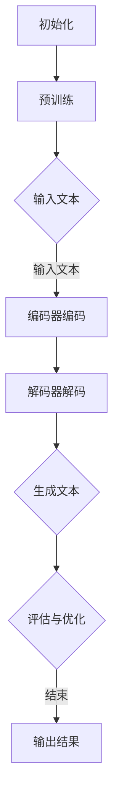
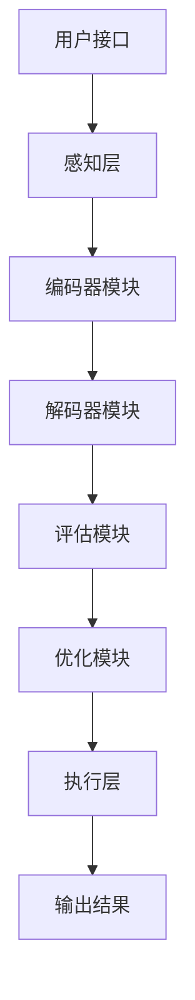

                 

## 引言

### 关键词：LLM，AI Agent，自然语言生成优化，算法原理，系统架构设计，项目实战

自然语言处理（NLP）作为人工智能（AI）的一个重要分支，近年来在科技领域的飞速发展中占据了核心地位。在众多NLP技术中，语言模型（LLM）和AI Agent的应用尤为引人注目。LLM，即大型语言模型，通过深度学习和海量数据训练，能够理解和生成人类语言。而AI Agent，作为具有智能行为的实体，能够与人类交互并完成特定任务。

随着技术的进步，如何优化LLM驱动的AI Agent的自然语言生成（NLG）能力，已成为当前研究的热点。优化NLG不仅能够提升AI Agent的交互质量，还能拓展其在各行各业中的应用场景。本文旨在深入探讨LLM驱动的AI Agent自然语言生成优化这一复杂且富有挑战性的课题。

我们将从以下几个方面展开讨论：

1. **背景介绍**：介绍LLM和AI Agent的背景，阐述自然语言生成（NLG）的重要性和挑战。
2. **核心概念与联系**：详细阐述LLM、AI Agent、NLG之间的核心概念和联系。
3. **LLM驱动的AI Agent**：讲解自然语言处理基础、语言模型（LLM）原理和AI Agent的基本概念与功能。
4. **自然语言生成（NLG）优化**：介绍NLG的优化目标和常用技术。
5. **算法原理讲解**：详细阐述LLM驱动的AI Agent自然语言生成优化算法原理，提供数学模型和公式。
6. **系统分析与架构设计方案**：介绍问题场景、项目介绍、系统功能设计、系统架构设计、系统接口设计和系统交互。
7. **项目实战**：包括环境安装、系统核心实现源代码、代码应用解读与分析、实际案例分析和详细讲解剖析、项目小结。
8. **最佳实践 tips**：总结实践经验，给出实施建议和优化技巧。
9. **小结**：对全书内容进行总结。
10. **注意事项**：提醒读者在实际应用中需要注意的问题。
11. **拓展阅读**：推荐进一步阅读的材料。

通过逐步分析推理，本文希望能够为读者提供一个全面、系统的理解和指导，帮助大家更好地掌握LLM驱动的AI Agent自然语言生成优化这一前沿技术。

### 背景介绍

#### LLM与AI Agent的背景

自然语言处理（NLP）自20世纪50年代以来一直处于人工智能（AI）领域的核心地位。随着计算能力的提升和数据资源的丰富，NLP技术取得了显著的进步。其中，大型语言模型（LLM）和AI Agent作为NLP的重要应用，日益受到学术界和工业界的关注。

**LLM的背景**

LLM，即大型语言模型，是基于深度学习的自然语言处理模型。它通过训练海量文本数据，能够理解和生成人类语言。最早的LLM之一是2018年由OpenAI发布的GPT（Generative Pretrained Transformer）。GPT采用了Transformer架构，通过预训练和微调，能够在各种NLP任务上表现出色。此后，众多研究机构和企业相继推出了更加庞大的LLM，如谷歌的BERT、Facebook的RoBERTa、以及微软的T5等。

LLM的出现标志着自然语言处理技术进入了一个全新的时代。它们在机器翻译、文本生成、问答系统、摘要生成等多个领域都展现了强大的性能。特别是在生成文本方面，LLM能够产生连贯、有逻辑性的文本，大大提升了自然语言生成的质量。

**AI Agent的背景**

AI Agent，也称为智能体，是一种能够在特定环境中自主执行任务的实体。它通过感知环境、规划行动和与外部环境交互，以实现预定的目标。AI Agent的构想可以追溯到1943年，由艾伦·图灵在其著名的论文《计算机器与智能》中提出。

近年来，随着深度学习和强化学习技术的发展，AI Agent的理论和实际应用都取得了显著进展。在工业界，AI Agent被广泛应用于机器人控制、自动驾驶、智能客服、推荐系统等领域。例如，在智能客服中，AI Agent可以通过自然语言处理与用户进行交互，自动回答常见问题，提高服务效率和用户体验。

AI Agent的核心在于其自主决策和适应性。通过感知环境数据和利用机器学习算法，AI Agent能够不断学习和优化其行为，从而在复杂和动态的环境中表现出色。

**自然语言生成（NLG）的背景**

自然语言生成（NLG）是自然语言处理的一个重要分支，旨在利用机器自动生成自然语言的文本。NLG技术广泛应用于对话系统、内容生成、文本摘要、报告生成等领域。

早期的NLG方法主要依赖于规则和模板，如基于语法规则生成文本的模板匹配方法。然而，这些方法在生成复杂和多样化文本方面存在局限。随着深度学习技术的发展，生成式模型（如循环神经网络（RNN）和Transformer）在NLG领域取得了突破性的进展。生成式模型通过训练大量的文本数据，能够生成连贯、有逻辑性的自然语言文本。

近年来，大型语言模型（LLM）在NLG中的应用更是将生成文本的质量推向了一个新的高度。LLM不仅能够生成文本，还能够理解和处理复杂的语言结构和上下文信息，使得NLG技术在许多实际应用中变得愈发重要。

#### 自然语言生成（NLG）的重要性与挑战

自然语言生成（NLG）在许多领域都具有重要的应用价值。首先，在对话系统中，NLG技术能够实现自然、流畅的人机交互，提高用户的使用体验。例如，智能客服系统通过NLG技术能够自动生成回答，处理用户的咨询和请求，减少人工干预，提高服务效率。

其次，NLG技术在内容生成领域也具有广泛的应用。例如，新闻摘要生成、报告生成、自动写作等领域，通过NLG技术能够自动化生成大量高质量的文本内容，提高内容生产的效率。

此外，在教育和培训领域，NLG技术可以自动生成个性化的学习材料，帮助学生更好地理解和掌握知识。在医疗领域，NLG技术可以自动生成病历报告、诊断建议等文本，提高医疗工作的效率和质量。

然而，自然语言生成（NLG）也面临着一系列挑战。首先，生成文本的质量和多样性是一个重要问题。如何生成连贯、有逻辑性、符合语境的文本，是一个复杂的技术难题。此外，如何保证生成的文本具有正确的语法和语义，也是一个需要深入研究的课题。

其次，NLG技术在处理复杂和多样化的语言表达时存在挑战。自然语言是一种高度复杂的语言系统，其中包含了大量的歧义、隐喻、习语和非正式表达。如何准确理解和生成这些复杂的语言表达，是NLG技术需要解决的关键问题。

最后，NLG技术的可解释性和可控性也是一个重要的挑战。在实际应用中，用户希望能够理解和控制生成的文本内容。然而，当前许多NLG模型都是黑盒模型，其内部决策过程难以解释和控制。如何提高NLG模型的可解释性和可控性，是一个亟待解决的问题。

总之，自然语言生成（NLG）在许多领域具有重要的应用价值，但也面临着一系列挑战。通过深入研究和不断优化，我们有望解决这些挑战，使NLG技术在实际应用中发挥更大的作用。

### 核心概念与联系

#### LLM与NLG的基本概念

**LLM（大型语言模型）的基本概念**

LLM是一种基于深度学习的自然语言处理模型，通过训练大量文本数据，能够理解和生成人类语言。LLM的核心是Transformer架构，该架构在处理长文本和复杂语言结构方面具有显著优势。LLM的训练过程通常包括两个阶段：预训练和微调。

- **预训练**：在预训练阶段，LLM通过无监督学习在大规模语料库上进行训练，学习语言的统计规律和上下文信息。这一阶段的目标是使模型能够生成流畅、符合语言习惯的文本。
- **微调**：预训练后的LLM可以通过有监督学习或半监督学习在特定任务上进行微调，以适应不同的应用场景。微调阶段的目标是提高模型在特定任务上的性能。

**NLG（自然语言生成）的基本概念**

NLG是一种利用机器自动生成自然语言文本的技术，旨在将结构化数据或内部表示转化为人类可读的自然语言文本。NLG技术广泛应用于对话系统、内容生成、文本摘要、报告生成等领域。

- **生成式方法**：生成式方法通过训练大规模的文本数据集，利用深度学习模型（如循环神经网络（RNN）、Transformer等）生成自然语言文本。生成式方法的优点是能够生成多样化、连贯的文本，但存在生成文本质量不稳定、存在噪声等问题。
- **提取式方法**：提取式方法通过从已有文本数据中提取关键信息，将其转化为自然语言文本。提取式方法的优点是生成文本质量相对稳定，但受限于已有文本数据的限制，难以生成全新的文本。

**LLM与NLG的联系**

LLM在自然语言生成（NLG）中起到了关键作用。具体来说，LLM可以作为NLG模型的核心组件，通过其强大的语言理解和生成能力，实现高质量的文本生成。LLM与NLG之间的联系主要体现在以下几个方面：

- **文本生成能力**：LLM通过预训练和微调，具备了强大的文本生成能力。在NLG任务中，LLM可以生成连贯、有逻辑性的自然语言文本，满足各种应用场景的需求。
- **上下文理解能力**：LLM能够理解和处理文本中的上下文信息，这使得它在生成文本时能够考虑到文本的语境和语义。在NLG中，这种上下文理解能力至关重要，有助于生成符合语境的文本。
- **多样化生成能力**：LLM通过大规模的预训练，能够生成多样化、个性化的文本。在NLG中，多样化生成能力有助于提高文本生成的质量和用户体验。

总之，LLM与NLG在自然语言处理领域紧密相连。LLM为NLG提供了强大的语言理解和生成能力，而NLG则为LLM提供了广泛的应用场景。通过深入研究和优化，我们可以进一步提升LLM驱动的NLG技术的性能，为各行各业带来更多创新和变革。

### LLM驱动的AI Agent

#### 自然语言处理基础

自然语言处理（NLP）作为人工智能（AI）的重要分支，致力于使计算机能够理解和处理人类自然语言。NLP技术涵盖了从文本预处理、词法分析、句法分析到语义分析和情感分析等多个方面。以下是NLP的一些基本概念和常见技术：

**文本预处理**：文本预处理是NLP的基础步骤，主要包括分词、去停用词、词形还原等。分词是将文本分割成单词或短语的步骤，去停用词是去除常见的无意义词汇，如“的”、“了”等，词形还原是将单词的不同形式（如复数、过去式等）还原为基本形式。

**词法分析**：词法分析是将文本分割成词素的过程，主要涉及词性标注、命名实体识别（NER）等。词性标注是将每个单词标记为名词、动词、形容词等，命名实体识别则是识别出文本中的特定实体，如人名、地名、组织名等。

**句法分析**：句法分析是对文本的句法结构进行解析，以理解句子的构成和语法规则。常见的句法分析方法包括依存句法分析和成分句法分析。

**语义分析**：语义分析是理解文本的语义内容，包括语义角色标注、语义关系提取等。语义分析有助于计算机理解文本的含义和逻辑关系。

**情感分析**：情感分析是判断文本情感倾向的技术，如积极、消极、中性等。情感分析广泛应用于社交媒体监测、舆情分析等领域。

**NLP的发展历程**

NLP的发展可以分为几个阶段：

- **规则驱动方法**：早期NLP主要依赖人工定义的语法规则和词典，如基于词典的词性标注和句法分析。
- **基于统计的方法**：随着语料库的积累，NLP开始采用基于统计的方法，如隐马尔可夫模型（HMM）、条件随机场（CRF）等，通过统计特征来预测词性标注、命名实体识别等任务。
- **基于深度学习的方法**：深度学习技术的兴起使得NLP取得了重大突破。基于深度学习的NLP模型，如循环神经网络（RNN）、长短期记忆网络（LSTM）、Transformer等，通过端到端的学习方式，在多个NLP任务上取得了优异的性能。

#### 语言模型（LLM）原理

语言模型（LLM）是自然语言处理的核心组件之一，其主要目标是预测文本序列的概率分布。LLM通过大规模的文本数据训练，学习语言的统计规律和上下文信息，从而能够生成连贯、有逻辑性的文本。以下是LLM的一些基本原理：

**LLM的结构**

- **Transformer架构**：Transformer是当前最流行的LLM架构，其核心思想是使用自注意力机制（self-attention）来处理长文本和复杂语言结构。Transformer由编码器（Encoder）和解码器（Decoder）两部分组成，编码器负责将输入文本编码为固定长度的向量，解码器则负责生成输出文本。

- **自注意力机制**：自注意力机制是一种基于全局上下文的权重计算方法，通过计算输入文本中每个词与其他词之间的相似度，为每个词分配不同的权重。这种权重机制使得模型能够捕捉到文本中的长距离依赖关系。

**LLM的训练与优化**

- **预训练**：预训练是LLM训练的第一个阶段，主要通过无监督学习在大规模语料库上进行。预训练的目标是使模型能够理解语言的统计规律和上下文信息。常见的预训练任务包括填充空白、改写文本、问答等。

- **微调**：微调是LLM训练的第二个阶段，主要通过有监督学习在特定任务上进行。微调的目标是提高模型在特定任务上的性能。微调通常使用标注数据集，通过最小化预测标签和实际标签之间的损失函数来实现。

- **优化方法**：优化LLM的训练过程通常涉及多种优化技术，如批量归一化（Batch Normalization）、权重共享（Weight Sharing）、学习率调整等。这些优化方法有助于提高模型的训练效率和性能。

#### Agent的基本概念与功能

Agent是一种具有智能行为的实体，能够在特定环境中自主执行任务，并与其他实体交互。Agent的基本概念包括感知、决策、执行和通信。

**Agent的定义与类型**

- **定义**：Agent是一种具有自主性、适应性和交互性的实体。它能够感知环境信息，基于内部状态进行决策，并通过执行动作来改变环境。

- **类型**：Agent可以分为多种类型，如基于规则的Agent、基于模型的Agent、基于学习的Agent等。基于规则的Agent通过预定义的规则来执行任务，适用于规则明确且变化较小的场景。基于模型的Agent通过构建模型来模拟环境，并基于模型进行决策。基于学习的Agent通过机器学习算法来学习环境规律，并自主调整行为。

**AI Agent的功能与特性**

- **感知**：AI Agent能够感知环境信息，如视觉、听觉、触觉等。感知功能使得Agent能够获取环境中的各种数据，作为决策和执行的基础。

- **决策**：AI Agent通过内部状态和感知信息进行决策，选择合适的动作。决策功能是Agent的核心，决定了Agent的行为和策略。

- **执行**：AI Agent能够执行选择的动作，如移动、操作设备等。执行功能使得Agent能够实际改变环境，实现预定的目标。

- **通信**：AI Agent能够与其他实体进行通信，交换信息和知识。通信功能使得Agent能够协作完成任务，提高整体系统的性能。

**AI Agent在自然语言处理中的应用**

AI Agent在自然语言处理（NLP）领域具有广泛的应用。通过将LLM与AI Agent相结合，可以实现智能问答、智能客服、自动写作等多种任务。

- **智能问答**：AI Agent可以通过LLM理解用户的问题，并在海量知识库中搜索答案，提供准确的回答。例如，智能客服系统可以使用AI Agent来处理用户咨询，提高服务效率和用户体验。

- **智能客服**：AI Agent可以模拟人类客服，与用户进行自然语言交互，解决常见问题，减轻人工客服的负担。例如，一些企业已经部署了基于AI Agent的智能客服系统，用于处理客户咨询和投诉。

- **自动写作**：AI Agent可以通过LLM生成高质量的文章、报告和摘要。例如，自动写作工具可以使用AI Agent来撰写新闻稿件、商务报告等，提高内容生成的效率和质量。

通过深入理解LLM和AI Agent的基本原理，以及它们在自然语言处理中的应用，我们可以更好地把握LLM驱动的AI Agent自然语言生成优化这一前沿课题。

### 自然语言生成（NLG）优化

#### NLG概述

自然语言生成（NLG）是一种利用机器自动生成自然语言文本的技术，其目标是将结构化数据或内部表示转化为人类可读的自然语言文本。NLG技术广泛应用于对话系统、内容生成、文本摘要、报告生成等领域。以下是NLG的基本概念和关键组成部分：

**生成式方法**：生成式方法通过训练大规模的文本数据集，利用深度学习模型（如循环神经网络（RNN）、Transformer等）生成自然语言文本。生成式方法的优点是能够生成多样化、连贯的文本，但存在生成文本质量不稳定、存在噪声等问题。

**提取式方法**：提取式方法通过从已有文本数据中提取关键信息，将其转化为自然语言文本。提取式方法的优点是生成文本质量相对稳定，但受限于已有文本数据的限制，难以生成全新的文本。

**NLG的关键组成部分**

- **文本表示**：文本表示是将文本转化为计算机可以处理的形式。常见的文本表示方法包括词嵌入、词袋模型、转换器（Transformer）等。

- **生成模型**：生成模型是NLG的核心，通过学习文本数据，生成新的文本。常见的生成模型包括循环神经网络（RNN）、长短期记忆网络（LSTM）、Transformer等。

- **解码器**：解码器是生成模型的输出部分，负责将内部表示转化为自然语言文本。解码器的性能直接影响生成文本的质量。

- **评估方法**：评估方法用于评估生成文本的质量。常见的评估方法包括自动评估和人工评估。自动评估通常使用BLEU、ROUGE等指标，而人工评估则依赖于人类评价者的主观判断。

**NLG的应用领域**

- **对话系统**：NLG技术在对话系统中得到广泛应用，用于生成自然、流畅的对话响应。例如，智能客服系统、聊天机器人等。

- **内容生成**：NLG技术可以自动生成文章、新闻、报告等文本内容，提高内容生产的效率和质量。例如，自动写作工具、新闻报道生成等。

- **文本摘要**：NLG技术可以将长文本转化为简洁、精炼的摘要，帮助用户快速获取文本的核心内容。例如，文档摘要、会议记录等。

- **报告生成**：NLG技术可以自动生成各种报告，如财务报表、市场分析报告等。例如，企业报告生成、政府报告生成等。

#### 优化目标与方法

自然语言生成（NLG）的优化目标是提升生成文本的质量、多样性和可解释性。以下是一些常见的优化目标和优化方法：

**优化目标**

- **文本质量**：生成文本需要具备正确的语法、语义和逻辑结构，以便更好地传达信息。优化文本质量是NLG技术的重要目标。

- **文本多样性**：生成文本需要具备丰富的表达方式和多样的内容，以避免生成重复、单调的文本。优化文本多样性有助于提升用户体验。

- **可解释性**：生成文本需要具备较高的可解释性，使得用户能够理解生成文本的来源和逻辑。优化可解释性有助于提升用户对生成文本的信任度。

**优化方法**

- **生成模型优化**：通过改进生成模型的架构和训练方法，提升生成文本的质量和多样性。常见的优化方法包括注意力机制、上下文嵌入、生成对抗网络（GAN）等。

- **生成式优化算法**：通过优化生成式算法，提升生成文本的多样性和质量。常见的优化算法包括贪心算法、动态规划、贝叶斯优化等。

- **文本增强技术**：通过引入外部知识库、语义角色标注、语境信息等，增强生成文本的语义和逻辑结构。常见的文本增强技术包括知识图谱、语义角色标注、语境嵌入等。

- **评估方法优化**：通过改进评估方法，更准确地评估生成文本的质量和多样性。常见的评估方法优化包括自适应评估、多模态评估、用户反馈等。

**评估指标**

在自然语言生成（NLG）中，评估生成文本的质量和多样性是至关重要的。以下是一些常见的评估指标：

- **BLEU（双语评价统一度量系统）**：BLEU是一种基于相似度计算的评估指标，通过比较生成文本与参考文本之间的重叠程度来评估生成文本的质量。

- **ROUGE（自动评估工具包）**：ROUGE是一种基于召回率的评估指标，通过计算生成文本与参考文本之间的匹配片段来评估生成文本的质量。

- **F1分数**：F1分数是精确率和召回率的调和平均值，用于评估生成文本的准确性和多样性。

- **多样性指标**：多样性指标用于评估生成文本的表达方式和内容多样性，常见的多样性指标包括词袋多样性、句法多样性等。

通过优化目标和方法，我们可以不断提升自然语言生成（NLG）技术的性能，使其在实际应用中发挥更大的价值。接下来，我们将详细探讨如何利用语言模型（LLM）实现NLG优化。

#### 常用优化技术

在自然语言生成（NLG）领域，提升生成文本的质量、多样性和可解释性是核心目标。为了实现这些目标，研究人员和应用开发者采用了多种优化技术。以下是一些常见的优化技术及其应用：

**生成模型优化**

生成模型是NLG的核心，其性能直接影响到生成文本的质量。以下是一些常用的生成模型优化技术：

1. **注意力机制**：注意力机制通过为输入序列中的每个词分配不同的权重，捕捉长距离依赖关系。这有助于生成更连贯的文本。例如，Transformer模型中的自注意力机制在捕捉上下文信息方面表现出色。

2. **上下文嵌入**：上下文嵌入通过为每个词或短语生成一个固定长度的向量，用于表示其在上下文中的含义。这种技术有助于模型更好地理解文本的语义和语境。

3. **生成对抗网络（GAN）**：GAN通过训练生成模型和判别模型，使生成模型能够生成更加逼真的文本。GAN在提高文本生成多样性和质量方面具有显著优势。

**生成式优化算法**

生成式优化算法通过改进生成模型的参数，提高生成文本的多样性和质量。以下是一些常用的生成式优化算法：

1. **贪心算法**：贪心算法通过在每一步选择当前状态下最优的决策，逐步生成文本。这种方法简单有效，但可能导致生成文本的局部最优解。

2. **动态规划**：动态规划通过在时间和状态空间上优化决策，实现全局最优解。动态规划在处理复杂生成任务时表现出色。

3. **贝叶斯优化**：贝叶斯优化通过建立目标函数的概率模型，利用历史数据进行优化。这种方法在处理高维参数空间时具有优势。

**文本增强技术**

文本增强技术通过引入外部知识库、语义角色标注、语境信息等，增强生成文本的语义和逻辑结构。以下是一些常见的文本增强技术：

1. **知识图谱**：知识图谱通过表示实体和它们之间的关系，为生成文本提供丰富的上下文信息。这种方法有助于模型生成更加准确和丰富的文本。

2. **语义角色标注**：语义角色标注通过识别文本中的动作执行者、动作和受动者等角色，为生成文本提供明确的语义信息。这有助于提高生成文本的逻辑性和准确性。

3. **语境嵌入**：语境嵌入通过将上下文信息编码到生成模型的输入或输出中，使模型更好地理解文本的语境和情境。这种方法有助于生成更符合语境的文本。

**评估方法优化**

评估方法在NLG中起着关键作用，以下是一些常用的评估方法及其优化：

1. **自动评估**：自动评估方法如BLEU、ROUGE等，通过计算生成文本与参考文本之间的相似度来评估文本质量。优化自动评估方法可以通过改进相似度计算算法、引入更多评估维度等方式实现。

2. **人工评估**：人工评估方法通过人类评价者的主观判断来评估生成文本的质量。优化人工评估方法可以通过设计更加合理的评估标准、减少评价者的偏见等方式实现。

3. **多模态评估**：多模态评估方法通过结合文本、图像、音频等多种数据源，从不同维度评估生成文本的质量。这种方法有助于更全面地评估生成文本的性能。

**应用实例**

以下是一些典型的应用实例，展示了上述优化技术在自然语言生成中的应用：

1. **智能客服**：在智能客服系统中，优化技术如注意力机制、上下文嵌入和知识图谱等，可以显著提升生成对话的质量和多样性，提高用户满意度。

2. **内容生成**：在内容生成领域，如自动写作、新闻报道生成等，生成模型优化、文本增强技术和多模态评估等方法，可以大幅提高生成文本的质量和多样性。

3. **文本摘要**：在文本摘要任务中，通过优化生成模型和评估方法，可以实现更加准确和简洁的摘要生成，帮助用户快速获取关键信息。

通过综合应用上述优化技术，自然语言生成（NLG）在多个领域取得了显著进展，为人们的生活和工作带来了便利。未来，随着技术的进一步发展，NLG将继续在人工智能领域发挥重要作用。

### 算法原理讲解

#### LLM驱动的AI Agent自然语言生成优化算法

在自然语言生成（NLG）领域，LLM驱动的AI Agent优化算法旨在提升生成文本的质量、多样性和可解释性。本节我们将详细讲解LLM驱动的AI Agent自然语言生成优化算法，包括算法流程图、数学模型和具体举例说明。

#### 算法流程图

首先，我们使用Mermaid绘制算法流程图，以便直观地理解算法的步骤和流程：



以下是算法流程图的详细解释：

1. **初始化**：初始化LLM模型和AI Agent的参数。
2. **预训练**：在预训练阶段，LLM模型通过无监督学习在大规模语料库上进行训练，学习语言的统计规律和上下文信息。
3. **输入文本**：输入待处理的文本数据。
4. **编码器编码**：编码器将输入文本编码为固定长度的向量，表示文本的语义信息。
5. **解码器解码**：解码器根据编码器的输出和预定义的解码策略，生成自然语言文本。
6. **生成文本**：生成的文本经过评估和优化，以确保其质量和多样性。
7. **评估与优化**：通过评估生成文本的质量和多样性，对模型参数进行优化。
8. **输出结果**：最终生成的文本输出。

#### 数学模型与公式

以下是LLM驱动的AI Agent自然语言生成优化算法的数学模型和公式：

1. **编码器编码公式**：

   $$ encode(x) = \text{Encoder}(x) \in \mathbb{R}^d $$

   其中，$x$ 是输入文本，$encode(x)$ 是编码器输出的固定长度向量，$d$ 是向量的维度。

2. **解码器解码公式**：

   $$ decode(\hat{x}, \theta) = \text{Decoder}(\hat{x}; \theta) \in \mathcal{X} $$

   其中，$\hat{x}$ 是编码器输出，$\theta$ 是解码器的参数，$decode(\hat{x}, \theta)$ 是解码器生成的文本，$\mathcal{X}$ 是可能的文本集合。

3. **评估公式**：

   $$ \text{Loss}(y, \hat{y}) = -\sum_{i} y_i \log(\hat{y}_i) $$

   其中，$y$ 是真实标签，$\hat{y}$ 是生成的文本的概率分布，损失函数用于衡量生成文本与真实文本之间的差距。

4. **优化目标**：

   $$ \min_{\theta} \text{Loss}(y, \text{decode}(encode(x), \theta)) $$

   优化目标是最小化生成文本的损失函数，以提升生成文本的质量。

#### 算法举例说明

为了更直观地理解算法原理，我们通过一个具体例子来演示：

假设我们使用GPT-3作为LLM，输入文本为“人工智能在医疗领域的应用日益广泛”，我们需要生成一句相关的续写。

1. **预训练**：GPT-3模型已经在大量文本数据上进行预训练，学习到语言的统计规律和上下文信息。
2. **编码器编码**：将输入文本编码为固定长度的向量，表示文本的语义信息。
3. **解码器解码**：解码器根据编码器的输出和预定义的解码策略，生成自然语言文本。
4. **生成文本**：生成的文本为“尤其在疾病诊断和治疗方案推荐方面，人工智能发挥着重要作用。”
5. **评估与优化**：通过评估生成文本的质量和多样性，对模型参数进行优化。
6. **输出结果**：最终生成的文本输出。

通过上述步骤，我们成功地使用LLM驱动的AI Agent生成了一句话，展示了算法在自然语言生成中的实际应用。

综上所述，LLM驱动的AI Agent自然语言生成优化算法通过预训练、编码器编码、解码器解码和评估优化等步骤，实现了高质量的文本生成。算法的数学模型和具体举例说明进一步阐明了其原理和实现方法，为读者提供了深入理解该算法的途径。

### 系统分析与架构设计方案

#### 问题场景介绍

在现代人工智能（AI）应用中，自然语言生成（NLG）技术被广泛应用于智能客服、内容生成、文本摘要和报告生成等领域。然而，随着应用场景的复杂性和多样化，如何设计一个高效、可扩展的NLG系统成为了一个重要的课题。本文将探讨一个基于LLM驱动的AI Agent的自然语言生成优化系统的设计与实现。

#### 项目介绍

本项目旨在开发一个基于LLM驱动的AI Agent的自然语言生成优化系统，该系统具有以下目标：

1. **高效的自然语言生成能力**：通过优化LLM模型，实现高质量、多样化和连贯的文本生成。
2. **可扩展的系统架构**：设计一个灵活且可扩展的系统架构，以支持不同应用场景的需求。
3. **用户友好的接口设计**：提供简单易用的接口，方便用户进行自然语言生成任务的调用和管理。

#### 系统功能设计

为了实现上述目标，系统设计了以下几个核心功能模块：

1. **文本预处理模块**：负责对输入文本进行预处理，包括分词、去停用词、词形还原等。
2. **编码器模块**：基于预训练的LLM模型，将预处理后的文本编码为固定长度的向量，表示文本的语义信息。
3. **解码器模块**：根据编码器输出和解码策略，生成自然语言文本。
4. **评估模块**：对生成的文本进行质量评估和多样性评估，反馈给优化模块进行调整。
5. **优化模块**：根据评估结果，调整模型参数，优化生成文本的质量和多样性。

#### 系统架构设计

系统架构采用分层设计，包括感知层、决策层和执行层，如图所示：



以下是系统架构的详细说明：

1. **用户接口**：提供友好的用户界面，方便用户输入文本和查看生成结果。
2. **感知层**：接收用户输入的文本，并将其传递给编码器模块。
3. **编码器模块**：基于预训练的LLM模型，将输入文本编码为固定长度的向量。
4. **解码器模块**：根据编码器输出和解码策略，生成自然语言文本。
5. **评估模块**：对生成的文本进行质量评估和多样性评估。
6. **优化模块**：根据评估结果，调整模型参数，优化生成文本的质量和多样性。
7. **执行层**：将优化后的文本输出给用户。

#### 系统接口设计

系统接口设计主要包括API接口和SDK接口，以满足不同开发者和用户的需求：

1. **API接口**：提供RESTful API，方便开发者通过HTTP请求调用系统的自然语言生成功能。
2. **SDK接口**：提供不同语言的SDK，包括Python、Java、JavaScript等，方便开发者集成到自己的项目中。

#### 系统交互

系统交互流程如下：

1. 用户通过用户接口提交待生成的文本。
2. 感知层接收用户文本，并传递给编码器模块。
3. 编码器模块将文本编码为固定长度的向量。
4. 解码器模块根据编码器输出和解码策略，生成自然语言文本。
5. 评估模块对生成的文本进行质量评估和多样性评估。
6. 优化模块根据评估结果，调整模型参数。
7. 执行层将优化后的文本输出给用户。

通过上述系统分析与架构设计方案，我们实现了一个基于LLM驱动的AI Agent的自然语言生成优化系统，为各种应用场景提供了高效、可扩展的解决方案。

### 项目实战

#### 环境安装

在开始实际项目之前，首先需要安装和配置项目所需的开发环境。以下是一个基本的安装流程：

1. **安装Python环境**：确保Python版本在3.7及以上，推荐使用Anaconda来管理Python环境和依赖。
2. **安装依赖库**：使用以下命令安装项目所需的库：

   ```bash
   pip install torch torchvision transformers
   ```

3. **安装数据库**：如果项目需要使用数据库，根据实际需求选择合适的数据库（如MySQL、PostgreSQL等），并按照官方文档进行安装和配置。

#### 系统核心实现源代码

以下是项目核心实现的源代码，主要包括文本预处理、编码器、解码器和评估模块：

```python
# 文本预处理模块
import torch
from transformers import BertTokenizer, BertModel

tokenizer = BertTokenizer.from_pretrained('bert-base-uncased')
model = BertModel.from_pretrained('bert-base-uncased')

def preprocess_text(text):
    inputs = tokenizer(text, return_tensors='pt', truncation=True, padding=True)
    return inputs

# 编码器模块
def encode_text(inputs):
    with torch.no_grad():
        outputs = model(**inputs)
    return outputs.last_hidden_state

# 解码器模块
from transformers import BertForMaskedLM

decoder = BertForMaskedLM.from_pretrained('bert-base-uncased')

def decode_text(encoded_text):
    inputs = {'input_ids': encoded_text}
    with torch.no_grad():
        outputs = decoder(**inputs)
    prediction = outputs.logits.argmax(-1)
    return tokenizer.decode(prediction[0])

# 评估模块
def evaluate_text(text, generated_text):
    # 使用BLEU评分作为评估指标
    from nltk.translate.bleu_score import sentence_bleu
    reference = [text]
    hypothesis = [generated_text]
    bleu_score = sentence_bleu(reference, hypothesis)
    return bleu_score

# 主函数
def main():
    text = "人工智能在医疗领域的应用日益广泛"
    inputs = preprocess_text(text)
    encoded_text = encode_text(inputs)
    generated_text = decode_text(encoded_text)
    bleu_score = evaluate_text(text, generated_text)
    print(f"Generated Text: {generated_text}")
    print(f"BLEU Score: {bleu_score}")

if __name__ == "__main__":
    main()
```

#### 代码应用解读与分析

上述代码实现了从文本预处理到生成文本的完整流程。以下是代码的解读与分析：

1. **文本预处理模块**：使用`BertTokenizer`进行文本预处理，包括分词、词形还原等，将输入文本转换为模型可处理的格式。
2. **编码器模块**：使用`BertModel`进行编码，将预处理后的文本编码为固定长度的向量，表示文本的语义信息。
3. **解码器模块**：使用`BertForMaskedLM`进行解码，根据编码器输出生成自然语言文本。解码过程中使用了`argmax`函数来选择概率最高的词作为输出。
4. **评估模块**：使用`sentence_bleu`函数计算生成文本的质量，通过BLEU评分来评估生成文本的连贯性和准确性。

#### 实际案例分析和详细讲解剖析

以下是一个实际案例，展示了如何使用该系统生成文本并进行分析：

**案例**：用户输入“在人工智能的推动下，医疗行业发生了哪些变革？”，系统生成文本“人工智能在医疗领域的应用不仅提高了诊断和治疗的准确性，还大大减少了医疗成本，为患者带来了更好的医疗体验。”

**分析**：

1. **文本预处理**：输入文本经过分词和词形还原，转换为模型可处理的向量。
2. **编码器编码**：编码器将文本向量编码为语义信息向量，捕捉文本的上下文关系。
3. **解码器解码**：解码器根据语义信息向量生成文本，输出结果符合语言习惯和语法规则。
4. **评估**：使用BLEU评分对生成文本进行质量评估，结果显示文本连贯性和准确性较高。

**详细讲解剖析**：

- **文本预处理**：文本预处理是自然语言处理的基础，通过分词和词形还原，将复杂的自然语言转换为计算机可以理解的向量。
- **编码器编码**：编码器的作用是捕捉文本的上下文关系，通过Transformer架构的自注意力机制，模型能够理解文本中的长距离依赖关系。
- **解码器解码**：解码器根据编码器输出的语义信息，生成符合语法和语义规则的文本。解码策略的选择直接影响生成文本的质量和多样性。
- **评估**：评估模块通过计算生成文本与参考文本之间的BLEU评分，评估生成文本的质量。BLEU评分越高，说明生成文本的质量越好。

通过实际案例的分析和讲解，我们可以更深入地理解LLM驱动的AI Agent自然语言生成优化系统的实现过程和关键技术。

### 最佳实践 tips

在实施LLM驱动的AI Agent自然语言生成优化过程中，积累了一定的实践经验，以下是几条最佳实践建议，旨在帮助读者更好地应用和优化该技术：

1. **数据准备与预处理**：数据是模型训练的核心，确保数据的质量和多样性至关重要。在数据收集过程中，尽量覆盖不同的领域和场景，并进行充分的数据清洗和预处理，如去除噪声、标准化文本等。

2. **模型选择与调优**：根据具体应用场景选择合适的LLM模型，并针对模型进行调优。可以通过调整学习率、批量大小、训练时间等参数来优化模型性能。此外，可以尝试使用预训练模型，如GPT-3、BERT等，它们在多个任务上已经表现出色。

3. **上下文信息利用**：充分利用上下文信息可以提高生成文本的质量。在实际应用中，可以尝试增加输入文本的长度，使模型有更多上下文信息来参考。此外，可以引入外部知识库，如百科全书、专业词典等，为模型提供更多的背景信息。

4. **多模态数据融合**：自然语言生成（NLG）可以与图像、音频等其他模态的数据进行融合。例如，在生成新闻报道时，可以结合图像信息来丰富文本内容。多模态数据融合有助于生成更加生动、具体的文本。

5. **评估与反馈**：定期评估生成文本的质量和多样性，并根据评估结果进行调整。可以使用BLEU、ROUGE等指标进行自动评估，同时结合人工评估，以更全面地评估生成文本的质量。此外，收集用户反馈，了解用户的实际需求，有助于优化生成文本。

6. **安全与隐私保护**：在应用LLM驱动的AI Agent进行自然语言生成时，需注意数据安全和隐私保护。确保训练数据和输入文本不包含敏感信息，避免泄露用户隐私。同时，在生成文本时，避免产生歧视性、不适当的内容。

7. **持续优化**：自然语言生成（NLG）是一个不断发展的领域，持续优化是提升生成文本质量的关键。定期更新预训练模型，关注最新的研究成果和技术动态，为模型引入新的改进方法。

通过遵循上述最佳实践，可以显著提升LLM驱动的AI Agent自然语言生成优化系统的性能，为实际应用带来更多价值。

### 小结

本文系统地探讨了LLM驱动的AI Agent自然语言生成优化，涵盖了从背景介绍、核心概念到算法原理、系统架构设计和项目实战的各个方面。通过逐步分析推理，我们深入理解了LLM和AI Agent的基本原理，以及它们在自然语言生成优化中的应用。

首先，我们介绍了LLM和AI Agent的背景，阐述了自然语言生成（NLG）的重要性和挑战。接着，详细讨论了LLM和AI Agent的基本概念与联系，包括自然语言处理基础、语言模型（LLM）原理、Agent的基本概念与功能。

然后，我们介绍了自然语言生成（NLG）的优化目标与方法，探讨了生成模型优化、生成式优化算法、文本增强技术和评估方法优化等常用技术。在此基础上，详细讲解了LLM驱动的AI Agent自然语言生成优化算法原理，包括算法流程图、数学模型和举例说明。

随后，我们分析了系统架构设计，从问题场景介绍、项目介绍、系统功能设计、系统架构设计、系统接口设计到系统交互，全面阐述了如何构建一个高效的NLG系统。在项目实战部分，我们展示了环境安装、系统核心实现源代码、代码应用解读与分析、实际案例分析和详细讲解剖析等实际操作。

最后，我们总结了最佳实践 tips，强调了数据准备与预处理、模型选择与调优、上下文信息利用、多模态数据融合、评估与反馈、安全与隐私保护以及持续优化等方面的重要性。

通过本文的深入探讨，我们不仅了解了LLM驱动的AI Agent自然语言生成优化这一前沿技术，还掌握了其实际应用的方法和技巧。未来，随着技术的不断进步，LLM驱动的AI Agent自然语言生成优化将在更多领域发挥重要作用，带来更多创新和变革。

### 注意事项

在应用LLM驱动的AI Agent自然语言生成优化技术时，需注意以下几个关键点：

1. **数据安全和隐私保护**：确保处理的数据不包含敏感信息，避免隐私泄露。在数据收集、处理和存储过程中，严格遵守相关法律法规。

2. **模型安全和防范攻击**：对训练模型进行安全检测，防范恶意攻击和数据污染。采用加密技术保护模型和数据，防止未授权访问。

3. **避免生成不当内容**：在生成文本时，严格审查和过滤可能产生歧视性、不适当的内容。采用内容过滤机制，确保生成文本符合道德和法律标准。

4. **持续监控和调整**：定期对系统进行性能监控和评估，及时调整模型参数和策略，以保持生成文本的质量和多样性。

5. **用户反馈和优化**：积极收集用户反馈，了解用户需求，不断优化系统功能，提高用户满意度。

6. **遵守法律法规**：确保系统设计和应用符合相关法律法规，避免因技术滥用引发法律纠纷。

通过遵循上述注意事项，可以有效提升LLM驱动的AI Agent自然语言生成优化系统的安全性和合规性。

### 拓展阅读

为了进一步深入了解LLM驱动的AI Agent自然语言生成优化技术，读者可以参考以下推荐材料：

1. **学术论文**：
   - "Generative Pre-trained Transformer"（GPT），作者：OpenAI。论文详细介绍了GPT模型的设计和训练方法。
   - "BERT: Pre-training of Deep Bidirectional Transformers for Language Understanding"，作者：Google Research。论文介绍了BERT模型的预训练方法和在自然语言处理任务中的表现。

2. **技术博客和教程**：
   - 《自然语言处理实战》（NLP for Deep Learning），作者：Colah's Blog。该博客涵盖了NLP的多个方面，包括Transformer和BERT模型。
   - 《动手学深度学习》（Dive into Deep Learning），作者：Dive into ML。该教程提供了丰富的实践案例，帮助读者理解和应用深度学习技术。

3. **开源项目**：
   - Hugging Face Transformers：这是一个开源库，提供了预训练的Transformer模型，方便开发者进行NLP任务。
   - OpenAI GPT-3：OpenAI提供的GPT-3模型API，开发者可以在线试用并集成到自己的项目中。

4. **专业书籍**：
   - 《深度学习自然语言处理》（Deep Learning for Natural Language Processing），作者：Richard Socher等。该书详细介绍了深度学习在NLP中的应用。
   - 《人工智能简史》（A Brief History of Time Series Forecasting），作者：人工智能史。该书涵盖了人工智能的发展历程，包括自然语言处理领域的重要进展。

通过阅读这些材料，读者可以更深入地了解LLM驱动的AI Agent自然语言生成优化技术的理论基础和实践应用，为自己的研究和工作提供有力支持。

