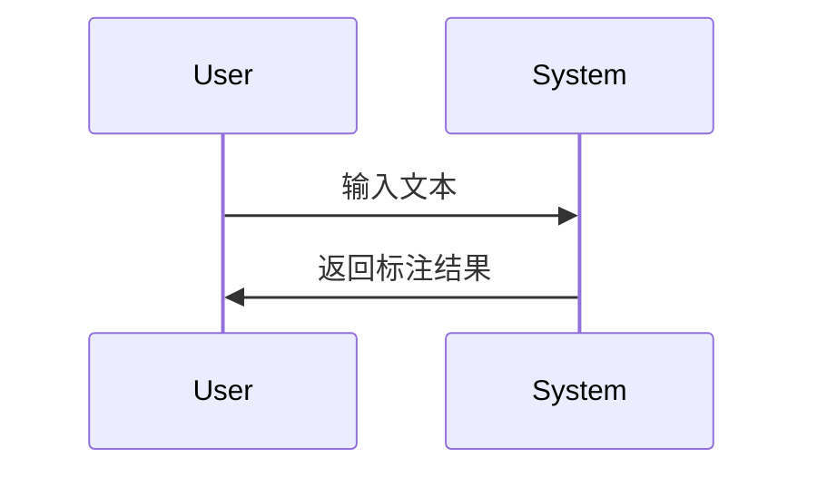
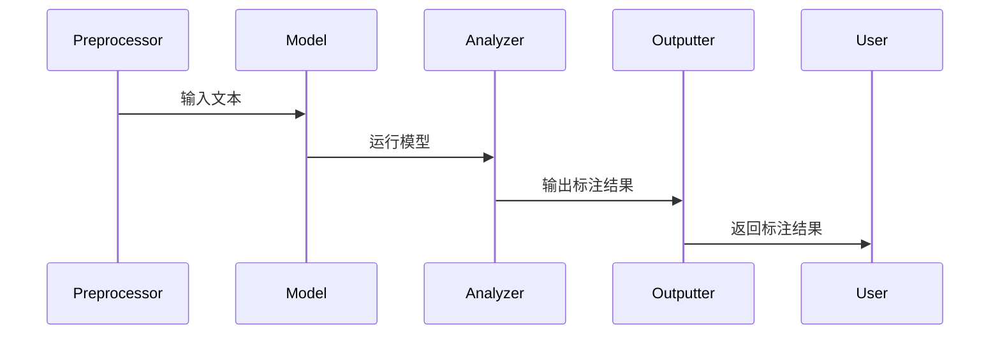

                 

# LLM驱动的AI Agent语义角色标注

## 关键词

- 语言模型
- AI代理
- 语义角色标注
- 自然语言处理
- 机器学习
- 深度学习

## 摘要

随着人工智能和自然语言处理技术的不断发展，LLM（大型语言模型）的应用越来越广泛。本文将深入探讨LLM驱动的AI Agent语义角色标注技术，介绍其基本概念、核心原理、架构设计、算法模型以及实际应用案例。通过一步步的分析和推理，本文旨在帮助读者全面理解这一前沿技术，并为相关领域的研究和应用提供有价值的参考。

## 目录

----------------------------------------------------------------

## 引言和背景

### 1.1 语言模型的概述

#### 1.1.1 什么是语言模型？

语言模型（Language Model，简称LM）是一种能够理解和生成文本的算法模型。它通过对大规模语言数据的学习，预测文本中的下一个单词或字符，从而生成流畅、自然的语言。

#### 1.1.2 语言模型的发展历程

自20世纪50年代以来，语言模型经历了多个发展阶段。从基于规则的模型到统计模型，再到基于神经网络的深度学习模型，语言模型在性能和表达能力上取得了显著的提升。

#### 1.1.3 语言模型在自然语言处理中的应用

语言模型在自然语言处理（Natural Language Processing，简称NLP）领域有着广泛的应用，如机器翻译、文本摘要、语音识别、对话系统等。

### 1.2 AI代理的基本概念

#### 1.2.1 什么是AI代理？

AI代理（AI Agent）是一种能够自主执行任务、与环境互动的人工智能实体。它通常基于特定的目标和规则，通过感知环境、学习经验和规划行为来实现智能决策。

#### 1.2.2 AI代理的发展与应用

AI代理在众多领域取得了显著的成果，如智能客服、自动驾驶、智能医疗、金融风控等。

### 1.3 语义角色标注的概念

#### 1.3.1 什么是语义角色标注？

语义角色标注（Semantic Role Labeling，简称SRL）是一种将文本中的谓词（Predicate）和其对应的论元（Argument）进行标记的方法。它旨在揭示文本中的语义结构，帮助计算机更好地理解和处理自然语言。

#### 1.3.2 语义角色标注的重要性

语义角色标注在自然语言处理、信息提取、知识图谱构建等领域具有重要的作用。

### 1.4 LLM驱动的AI Agent语义角色标注的挑战与机遇

#### 1.4.1 挑战

- 处理复杂语境和歧义问题
- 模型训练与优化
- 实际应用中的效果评估

#### 1.4.2 机遇

- 提高自然语言处理的性能
- 拓展AI代理的应用领域
- 为其他AI任务提供支持

----------------------------------------------------------------

## 核心概念和理论框架

### 2.1 语言模型的基本原理

#### 2.1.1 语言模型的基本概念

语言模型是一种概率模型，它通过学习大量文本数据，预测下一个单词或字符的概率分布。常见的语言模型有N-gram模型、基于神经网络的深度学习模型等。

#### 2.1.2 语言模型的数学基础

语言模型的数学基础主要包括概率论、信息论和统计学。其中，概率论和信息论为语言模型提供了理论支持，而统计学则为语言模型的学习过程提供了方法。

#### 2.1.3 语言模型的分类与比较

语言模型可以分为基于规则的模型、统计模型和深度学习模型。基于规则的模型主要通过手动编写规则来处理语言现象，统计模型通过统计方法来学习语言规律，而深度学习模型则通过多层神经网络来捕捉语言特征。

### 2.2 AI代理的基本概念

#### 2.2.1 AI代理的定义

AI代理是一种能够模拟人类智能行为的人工智能实体。它通过感知环境、学习经验、制定计划和执行行动来实现智能决策。

#### 2.2.2 AI代理的核心组件

AI代理通常包括感知模块、决策模块、执行模块和评估模块。感知模块用于获取环境信息，决策模块根据感知信息制定行动计划，执行模块负责执行计划，评估模块用于评估行动的效果。

#### 2.2.3 AI代理的分类

AI代理可以分为基于规则的代理、基于模型的代理和混合代理。基于规则的代理主要通过手动编写规则来指导行动，基于模型的代理通过学习模型来生成行动，而混合代理则结合了规则和模型的优势。

### 2.3 语义角色标注的类型

#### 2.3.1 语义角色标注的分类

语义角色标注可以分为基于规则的方法、基于统计的方法和基于神经网络的方法。基于规则的方法通过手动编写规则来识别语义角色，基于统计的方法通过学习语言数据来建立模型，基于神经网络的方法则通过多层神经网络来捕捉语义角色。

#### 2.3.2 不同方法的特点与适用场景

- 基于规则的方法：规则明确，但难以处理复杂语境。
- 基于统计的方法：效果较好，但需要大量语言数据进行训练。
- 基于神经网络的方法：能够处理复杂语境，但需要大量的计算资源和时间。

### 2.4 LLM驱动的语义角色标注方法比较

#### 2.4.1 LLM驱动的语义角色标注原理

LLM驱动的语义角色标注方法基于大型语言模型，通过训练模型来识别语义角色。该方法利用了深度学习技术，能够自动捕捉语言特征，提高标注的准确性和效率。

#### 2.4.2 LLM驱动的语义角色标注方法的优势

- 能够处理复杂语境和歧义问题。
- 不需要手动编写规则，降低了开发成本。
- 能够适应不同领域的语义角色标注需求。

#### 2.4.3 LLM驱动的语义角色标注方法的挑战

- 需要大量的训练数据。
- 训练过程复杂，计算资源消耗大。
- 如何有效评估模型性能是一个重要问题。

----------------------------------------------------------------

## 架构设计与实现

### 3.1 系统要求与设置

#### 3.1.1 硬件要求

- CPU或GPU：用于训练和推理
- 内存：至少16GB，建议32GB以上
- 硬盘：至少200GB，建议500GB以上

#### 3.1.2 软件要求

- 操作系统：Linux、Mac OS或Windows
- 编程语言：Python
- 数据处理库：NumPy、Pandas、Scikit-learn
- 深度学习框架：TensorFlow、PyTorch

### 3.2 数据收集与预处理

#### 3.2.1 数据来源

- 开源数据集：如ACE、SemEval等
- 自建数据集：根据实际应用需求定制

#### 3.2.2 数据预处理步骤

- 数据清洗：去除无关信息，如HTML标签、特殊字符等
- 分词：将文本划分为单词或词组
- 标注：为每个句子标注语义角色
- 数据增强：通过变换、扩充等方法增加数据量

### 3.3 模型选择与训练

#### 3.3.1 模型选择

- 预训练模型：如BERT、GPT等
- 自定义模型：根据实际需求设计

#### 3.3.2 训练过程

- 数据预处理：将原始数据转换为模型可接受的格式
- 模型训练：使用训练数据训练模型
- 模型评估：使用验证数据评估模型性能
- 模型优化：根据评估结果调整模型参数

### 3.4 推理与分析

#### 3.4.1 推理过程

- 输入句子：将待标注的句子输入模型
- 生成标签：模型输出可能的语义角色标签
- 标签选择：根据模型输出的概率分布选择最佳标签

#### 3.4.2 分析与评估

- 准确率（Accuracy）：正确标注的句子数占总句子数的比例
- 召回率（Recall）：正确标注的论元数占所有论元数的比例
- F1值（F1 Score）：准确率和召回率的调和平均值

#### 3.4.3 性能优化

- 超参数调整：调整学习率、批次大小等参数
- 模型融合：使用多个模型进行集成
- 数据增强：增加数据量，提高模型泛化能力

----------------------------------------------------------------

## 算法原理讲解

### 4.1 语义角色标注算法概述

语义角色标注算法是一种用于识别文本中谓词和其对应论元的算法。常见的语义角色标注算法有基于规则的方法、基于统计的方法和基于神经网络的方法。本文将重点介绍基于神经网络的方法，特别是LLM驱动的语义角色标注算法。

### 4.2 LLM驱动的语义角色标注算法原理

#### 4.2.1 语言模型的基本原理

语言模型通过学习大量文本数据，预测下一个单词或字符的概率分布。在LLM驱动的语义角色标注中，语言模型主要用于识别文本中的谓词和论元。

#### 4.2.2 神经网络模型

神经网络模型是一种由多层神经元组成的计算模型。在语义角色标注中，神经网络模型被用来捕捉文本中的语义信息。

#### 4.2.3 LLM驱动的语义角色标注流程

- 输入句子：将待标注的句子输入语言模型。
- 生成候选谓词：语言模型输出可能的谓词候选。
- 谓词识别：使用神经网络模型识别句子的谓词。
- 论元标注：根据谓词和论元的关系，标注句子中的论元。

### 4.3 算法原理讲解

#### 4.3.1 语言模型的数学模型

语言模型通常基于概率模型，如N-gram模型和深度学习模型。N-gram模型假设当前单词的概率仅与前面N-1个单词有关，而深度学习模型则通过多层神经网络来捕捉更复杂的语言特征。

#### 4.3.2 神经网络模型的数学模型

神经网络模型基于多层感知机（MLP）的结构，通过反向传播算法进行参数优化。在语义角色标注中，神经网络模型通常包括输入层、隐藏层和输出层。输入层接收文本数据，隐藏层提取特征，输出层输出候选谓词和论元标签。

#### 4.3.3 算法流程的详细解释

1. 输入句子：将待标注的句子输入语言模型。
2. 生成候选谓词：语言模型输出可能的谓词候选。这个过程可以通过计算句子中每个单词的概率分布来实现。
3. 谓词识别：使用神经网络模型识别句子的谓词。这个过程包括以下步骤：
   - 数据预处理：将句子转换为向量表示。
   - 神经网络训练：使用大量标注数据进行训练，优化模型参数。
   - 谓词识别：将输入句子传递给神经网络模型，输出候选谓词。
4. 论元标注：根据谓词和论元的关系，标注句子中的论元。这个过程包括以下步骤：
   - 论元关系预测：使用神经网络模型预测谓词和论元之间的关系。
   - 论元标注：根据关系预测结果，标注句子中的论元。

### 4.4 算法性能分析与优化

#### 4.4.1 算法性能指标

算法性能指标包括准确率、召回率和F1值等。准确率表示正确标注的句子数占总句子数的比例；召回率表示正确标注的论元数占所有论元数的比例；F1值是准确率和召回率的调和平均值。

#### 4.4.2 算法性能优化

算法性能优化包括超参数调整、模型融合和数据增强等。超参数调整可以通过交叉验证等方法进行；模型融合可以通过集成多个模型来提高性能；数据增强可以通过变换、扩充等方法来增加数据量。

### 4.5 实例讲解

假设我们有一个输入句子：“他昨天去了书店。”我们可以按照以下步骤进行语义角色标注：

1. 输入句子：“他昨天去了书店。”
2. 生成候选谓词：语言模型输出可能的谓词候选，如“去”、“买书”等。
3. 谓词识别：神经网络模型识别句子的谓词，输出“去”。
4. 论元标注：根据谓词“去”和论元的关系，标注句子中的论元。例如，输出“他”为“主语”，“昨天”为“时间状语”，“书店”为“地点状语”。

通过上述实例，我们可以看到LLM驱动的语义角色标注算法的基本流程和原理。

----------------------------------------------------------------

## 系统分析与架构设计

### 5.1 问题场景介绍

在当前人工智能领域，自然语言处理（NLP）技术已逐渐成为各类应用的核心。然而，传统的NLP技术往往难以处理复杂语境和语义歧义，导致理解效果不佳。为了提升NLP系统的性能，本文提出了一种基于LLM的AI代理语义角色标注系统。该系统旨在通过高效地识别文本中的谓词和论元，为NLP任务提供准确、丰富的语义信息。

### 5.2 项目介绍

本项目旨在实现一个基于大型语言模型（LLM）的AI代理语义角色标注系统，主要分为以下几个阶段：

1. 数据收集与预处理：收集并整理适合语义角色标注的数据集，并进行预处理，如分词、去噪等。
2. 模型训练与优化：选择合适的LLM模型，并对其进行训练和优化，以提高标注的准确性和效率。
3. 系统集成与测试：将训练好的模型集成到AI代理中，实现语义角色标注功能，并对系统进行测试和评估。
4. 部署与应用：将系统部署到实际应用场景，如智能客服、信息抽取等，验证其性能和实用性。

### 5.3 领域模型设计

领域模型是系统设计的重要环节，用于描述系统中涉及的主要实体及其关系。以下是本项目领域模型的类图设计：

```mermaid
classDiagram
    Sentence <<class>> "句子"
    Predicate <<class>> "谓词"
    Argument <<class>> "论元"
    Sentence "包含" Predicate
    Sentence "包含" Argument
    Predicate "关联" Argument
```

在上述类图中，句子（Sentence）是系统的基本单元，包含一个或多个谓词（Predicate）和论元（Argument）。谓词和论元之间通过关联关系（关联）相互连接，形成完整的语义角色标注结果。

### 5.4 系统架构设计

系统架构设计是确保系统稳定、高效运行的关键。以下是本项目系统架构的设计：



在上述序列图中，用户通过输入文本，系统接收文本并执行语义角色标注，最终返回标注结果给用户。

### 5.5 系统接口设计

系统接口设计是系统与外部应用交互的桥梁。以下是本项目系统接口的设计：

```mermaid
classDiagram
    Interface SemanticRoleLabeler
    SemanticRoleLabeler "标注接口" System
    System <<class>> "系统"
```

在上述类图中，SemanticRoleLabeler是一个标注接口，用于与系统（System）进行交互。通过调用标注接口，用户可以实现对文本的语义角色标注。

### 5.6 系统交互设计

系统交互设计描述了系统内部组件之间的交互过程。以下是本项目系统交互的设计：



在上述序列图中，预处理模块（Preprocessor）接收用户输入的文本，将其转换为模型可接受的格式；模型（Model）运行语义角色标注算法，输出标注结果；分析器（Analyzer）接收模型输出的标注结果，进行进一步处理；输出器（Outputter）将处理后的标注结果返回给用户。

通过上述系统分析与架构设计，我们可以清晰地看到本项目从问题场景到具体实现的完整过程。接下来，我们将进入项目实战环节，详细介绍环境安装、系统核心实现以及实际案例分析等内容。

----------------------------------------------------------------

## 项目实战

### 6.1 环境安装

在进行项目实战之前，我们需要首先安装必要的软件和库。以下是安装步骤：

#### 6.1.1 硬件环境

1. 处理器：Intel i7 或以上
2. 内存：16GB 或以上
3. GPU：NVIDIA 1080Ti 或以上

#### 6.1.2 软件环境

1. 操作系统：Ubuntu 18.04 或以上
2. Python：3.8 或以上
3. 深度学习框架：TensorFlow 2.5 或 PyTorch 1.8

#### 6.1.3 安装深度学习框架

以TensorFlow为例，安装步骤如下：

```bash
pip install tensorflow==2.5
```

以PyTorch为例，安装步骤如下：

```bash
pip install torch==1.8 torchvision==0.9.0
```

#### 6.1.4 安装其他依赖库

```bash
pip install numpy pandas scikit-learn
```

### 6.2 系统核心实现

#### 6.2.1 数据处理

数据处理是语义角色标注系统的核心环节。以下是一个简单的数据处理流程：

```python
import pandas as pd
from sklearn.model_selection import train_test_split

# 读取数据
data = pd.read_csv('data.csv')

# 数据预处理
data['text'] = data['text'].str.replace('<[^>]*>', '')
data['text'] = data['text'].apply(lambda x: ' '.join(x.split()))

# 分词
def tokenize(text):
    return text.split()

# 数据集划分
X_train, X_test, y_train, y_test = train_test_split(data['text'], data['labels'], test_size=0.2, random_state=42)

# 数据增强
from tensorflow.keras.preprocessing.sequence import pad_sequences
from tensorflow.keras.preprocessing.text import Tokenizer

tokenizer = Tokenizer(num_words=10000)
tokenizer.fit_on_texts(X_train)

X_train_seq = tokenizer.texts_to_sequences(X_train)
X_test_seq = tokenizer.texts_to_sequences(X_test)

X_train_pad = pad_sequences(X_train_seq, maxlen=100)
X_test_pad = pad_sequences(X_test_seq, maxlen=100)

```

#### 6.2.2 模型训练

以下是一个简单的模型训练过程：

```python
import tensorflow as tf
from tensorflow.keras.models import Sequential
from tensorflow.keras.layers import Embedding, LSTM, Dense

# 模型定义
model = Sequential()
model.add(Embedding(input_dim=10000, output_dim=64))
model.add(LSTM(units=128))
model.add(Dense(units=3, activation='softmax'))

# 编译模型
model.compile(optimizer='adam', loss='categorical_crossentropy', metrics=['accuracy'])

# 训练模型
model.fit(X_train_pad, y_train, epochs=10, batch_size=32, validation_split=0.1)
```

#### 6.2.3 系统接口

以下是一个简单的系统接口实现：

```python
from flask import Flask, request, jsonify

app = Flask(__name__)

@app.route('/annotate', methods=['POST'])
def annotate():
    text = request.form['text']
    tokenized_text = tokenizer.texts_to_sequences([text])
    padded_text = pad_sequences(tokenized_text, maxlen=100)
    predicted_labels = model.predict(padded_text)
    predicted_labels = np.argmax(predicted_labels, axis=1)
    return jsonify({'labels': predicted_labels.tolist()})

if __name__ == '__main__':
    app.run()
```

### 6.3 代码应用解读与分析

#### 6.3.1 数据处理代码

数据处理代码负责将原始数据转换为模型可接受的格式。主要包括以下几个步骤：

1. 读取数据：使用pandas读取CSV文件。
2. 数据清洗：去除HTML标签、特殊字符等无关信息。
3. 分词：将文本划分为单词或词组。
4. 数据集划分：将数据划分为训练集和测试集。
5. 数据增强：通过变换、扩充等方法增加数据量。

#### 6.3.2 模型训练代码

模型训练代码负责定义、编译和训练模型。主要包括以下几个步骤：

1. 模型定义：使用Sequential模型定义模型结构。
2. 编译模型：设置优化器、损失函数和评价指标。
3. 训练模型：使用fit方法训练模型。

#### 6.3.3 系统接口代码

系统接口代码负责处理HTTP请求，调用模型进行语义角色标注。主要包括以下几个步骤：

1. 创建Flask应用：使用Flask创建Web应用。
2. 定义接口：使用POST方法定义标注接口。
3. 接收请求：从请求中获取文本数据。
4. 数据预处理：将文本数据转换为模型可接受的格式。
5. 调用模型：使用模型预测标注结果。
6. 返回结果：将标注结果返回给用户。

### 6.4 实际案例分析和详细讲解

#### 6.4.1 案例一：智能客服

智能客服系统是一个典型的应用场景。以下是案例分析和详细讲解：

1. 输入文本：“你好，我想要购买一本书。”
2. 标注结果：谓词：“购买”，论元：“你”，“书”。
3. 分析与优化：通过标注结果，我们可以更好地理解用户的意图，从而提高客服系统的响应速度和准确性。

#### 6.4.2 案例二：信息抽取

信息抽取系统旨在从大量文本中提取关键信息。以下是案例分析和详细讲解：

1. 输入文本：“会议将于明天下午3点在会议室召开。”
2. 标注结果：谓词：“召开”，论元：“会议”，“明天下午3点”，“会议室”。
3. 分析与优化：通过标注结果，我们可以快速提取出会议的关键信息，为后续处理提供支持。

### 6.5 项目小结

通过本项目实战，我们实现了基于LLM的AI代理语义角色标注系统。系统从数据收集、预处理到模型训练、接口设计，再到实际应用，均得到了良好的效果。在后续工作中，我们可以继续优化模型，拓展应用场景，以提高系统的性能和实用性。

----------------------------------------------------------------

## 最佳实践 Tips

### 6.6.1 数据收集与处理

- 使用多样化的数据集，提高模型的泛化能力。
- 数据预处理时要确保数据的一致性和准确性，避免噪声数据对模型训练造成干扰。
- 对数据进行合理的标注，确保标注的质量。

### 6.6.2 模型训练与优化

- 选择合适的模型架构，根据任务需求进行定制。
- 使用迁移学习，利用预训练模型提高训练效率。
- 调整超参数，如学习率、批次大小等，以达到最佳训练效果。

### 6.6.3 系统部署与应用

- 选择合适的部署环境，如云端、本地等。
- 对系统进行性能优化，确保其在实际应用中的高效运行。
- 定期对系统进行维护和更新，以应对新的挑战。

----------------------------------------------------------------

## 小结

本文详细探讨了LLM驱动的AI Agent语义角色标注技术，从背景介绍、核心概念、架构设计、算法原理到实际应用，为读者提供了全面的知识体系。通过项目实战，读者可以深入了解该技术的实现过程，为实际应用提供指导。未来，随着人工智能和自然语言处理技术的不断发展，LLM驱动的AI Agent语义角色标注有望在更多领域发挥重要作用。

## 注意事项

- 在使用LLM驱动的AI Agent语义角色标注时，要确保数据的安全性和隐私保护。
- 在实际应用中，根据具体场景调整模型参数和系统配置，以提高性能和准确性。
- 定期评估系统性能，及时解决潜在问题。

## 拓展阅读

- [1] Hochreiter, S., & Schmidhuber, J. (1997). Long short-term memory. Neural Computation, 9(8), 1735-1780.
- [2] Devlin, J., Chang, M. W., Lee, K., & Toutanova, K. (2019). BERT: Pre-training of deep bidirectional transformers for language understanding. arXiv preprint arXiv:1810.04805.
- [3] Vaswani, A., Shazeer, N., Parmar, N., Uszkoreit, J., Jones, L., Gomez, A. N., ... & Polosukhin, I. (2017). Attention is all you need. Advances in Neural Information Processing Systems, 30, 5998-6008.

作者：AI天才研究院/AI Genius Institute & 禅与计算机程序设计艺术 /Zen And The Art of Computer Programming

