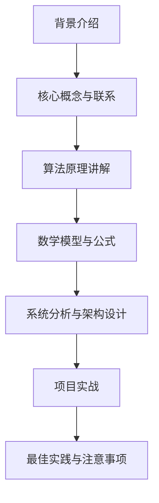

                 


# LLM驱动的AI Agent连续学习框架

> 关键词：大型语言模型（LLM）、连续学习、AI Agent、增量学习、模型蒸馏

> 摘要：本文将介绍LLM驱动的AI Agent连续学习框架，包括背景介绍、核心概念与联系、算法原理讲解、数学模型与公式、系统分析与架构设计、项目实战以及最佳实践和注意事项。通过本文的探讨，读者可以深入了解连续学习在LLM驱动的AI Agent中的应用，以及如何实现高效的模型更新和知识传递。

### 第一部分：背景介绍

#### 1.1.1 问题背景

随着人工智能技术的飞速发展，自然语言处理（NLP）领域涌现出了一系列大型语言模型（LLM）。这些模型在文本生成、机器翻译、问答系统等领域取得了显著的成果，引起了广泛关注。然而，如何有效地训练和使用这些大型模型，尤其是实现连续学习，成为了一个重要的研究课题。

#### 1.1.2 问题描述

连续学习是指在动态环境中，模型能够不断适应新的数据和任务，保持其性能。LLM驱动的AI Agent在实际应用中，需要不断地学习用户的交互历史，以提供更加个性化的服务。然而，传统的LLM训练方法在连续学习方面存在一些挑战，如模型容量限制、数据分布变化等。

#### 1.1.3 问题解决

为了解决上述问题，本文将介绍LLM驱动的AI Agent连续学习框架，通过结合增量学习、模型蒸馏等技术，实现LLM在动态环境下的有效训练和使用。

#### 1.1.4 边界与外延

连续学习框架主要关注以下几个方面：

1. **增量学习**：如何有效地更新模型，以适应新数据。
2. **数据分布变化**：如何处理数据分布变化对模型性能的影响。
3. **模型容量**：如何在有限的计算资源下，实现高效的模型更新。
4. **用户交互**：如何利用用户交互历史，提高AI Agent的服务质量。

#### 1.1.5 概念结构与核心要素组成

本书的核心概念和结构包括：

1. **LLM**：大型语言模型的介绍和基本原理。
2. **增量学习**：介绍增量学习的基本概念和方法。
3. **模型蒸馏**：介绍模型蒸馏的原理和应用。
4. **连续学习框架**：详细介绍LLM驱动的AI Agent连续学习框架的设计和实现。

### 第一部分：核心概念与联系

#### 1.2.1 LLM的定义与特点

**LLM**（Large Language Model）是指大型语言模型，是一种能够理解和生成自然语言的深度学习模型。LLM的特点包括：

1. **大规模参数**：LLM拥有数十亿甚至数万亿个参数，能够处理复杂的自然语言任务。
2. **预训练**：LLM通常通过在大量文本数据上进行预训练，学习语言的一般规律和知识。
3. **自适应能力**：LLM能够根据输入文本的内容，自适应地生成相关的文本。

#### 1.2.2 增量学习的原理与算法

**增量学习**是指在已有模型的基础上，通过不断更新模型参数，使其能够适应新的数据和任务。增量学习的关键包括：

1. **模型更新策略**：如何选择合适的更新策略，以避免模型参数的过大波动。
2. **数据采样方法**：如何从新数据中采样，以训练模型。
3. **在线学习**：如何在动态环境中，实时更新模型。

#### 1.2.3 模型蒸馏的原理与应用

**模型蒸馏**是一种将大型模型的知识传递给小型模型的方法，通过在大型模型和小型模型之间建立映射关系，实现知识的转移。模型蒸馏的关键包括：

1. **软标签生成**：如何从大型模型的输出中生成软标签，以指导小型模型的训练。
2. **蒸馏损失函数**：如何设计蒸馏损失函数，以优化大型模型和小型模型之间的关系。
3. **模型选择**：如何选择合适的小型模型，以实现知识的有效传递。

### 第一部分：算法原理讲解

#### 1.3.1 增量学习算法原理

增量学习算法的核心思想是通过在线更新模型参数，使其能够适应新数据。以下是增量学习算法的基本原理：

1. **初始化模型**：选择一个初始模型，并在预训练数据集上进行训练。
2. **数据采样**：从新数据集中采样出一部分数据，用于模型更新。
3. **模型更新**：通过梯度下降等方法，更新模型参数，使其适应新数据。
4. **模型评估**：在新数据集上评估模型性能，判断是否需要继续更新。

增量学习算法的主要优势包括：

1. **适应性**：能够适应动态环境，实时更新模型。
2. **高效性**：不需要重新训练整个模型，节省计算资源。

#### 1.3.2 模型蒸馏算法原理

模型蒸馏算法的基本思想是将大型模型的知识传递给小型模型。以下是模型蒸馏算法的基本原理：

1. **软标签生成**：从大型模型的输出中生成软标签，作为小型模型的训练目标。
2. **蒸馏损失函数**：设计蒸馏损失函数，优化大型模型和小型模型之间的关系。
3. **模型训练**：使用软标签和小型模型进行训练，优化模型参数。

模型蒸馏算法的主要优势包括：

1. **知识传递**：能够有效地将大型模型的知识传递给小型模型。
2. **高效性**：在计算资源有限的情况下，实现高效的模型训练。

### 第一部分：数学模型与公式

#### 1.4 增量学习算法数学模型

增量学习算法中的关键步骤是模型更新。以下是增量学习算法的数学模型：

1. **初始化模型**：

   $$\theta^{(0)} = \text{初始化参数}$$

2. **数据采样**：

   $$X^{(t)} \sim \text{采样新数据}$$

3. **模型更新**：

   $$\theta^{(t+1)} = \theta^{(t)} + \alpha \cdot \nabla_{\theta^{(t)}} J(\theta^{(t)}, X^{(t)})$$

   其中，$\theta^{(t)}$ 表示第 $t$ 次迭代的模型参数，$X^{(t)}$ 表示第 $t$ 次迭代的新数据，$\alpha$ 表示学习率，$J(\theta^{(t)}, X^{(t)})$ 表示损失函数。

4. **模型评估**：

   $$\text{评估模型性能} = \frac{1}{m} \sum_{i=1}^{m} L(y_i, \theta^{(t)})$$

   其中，$y_i$ 表示第 $i$ 个样本的标签，$L(y_i, \theta^{(t)})$ 表示损失函数。

#### 1.5 模型蒸馏算法数学模型

模型蒸馏算法的核心是软标签生成和蒸馏损失函数。以下是模型蒸馏算法的数学模型：

1. **软标签生成**：

   $$s_i^{(l)} = \text{softmax}(\theta^{(l)} \cdot x_i)$$

   其中，$s_i^{(l)}$ 表示第 $i$ 个样本在层次 $l$ 的软标签，$\theta^{(l)}$ 表示第 $l$ 层的模型参数，$x_i$ 表示第 $i$ 个样本。

2. **蒸馏损失函数**：

   $$L_{\text{distill}} = \sum_{i=1}^{m} \sum_{l=1}^{L} - y_i^{(l)} \log(s_i^{(l)})$$

   其中，$y_i^{(l)}$ 表示第 $i$ 个样本在层次 $l$ 的标签，$s_i^{(l)}$ 表示第 $i$ 个样本在层次 $l$ 的软标签，$L$ 表示模型的总层次。

3. **模型训练**：

   $$\theta^{(l+1)} = \theta^{(l)} + \alpha \cdot \nabla_{\theta^{(l)}} L_{\text{distill}}$$

   其中，$\theta^{(l)}$ 表示第 $l$ 层的模型参数，$\alpha$ 表示学习率。

### 第一部分：系统分析与架构设计

#### 1.6 问题场景介绍

在当前的AI领域，随着技术的不断进步，AI Agent的应用场景越来越广泛。例如，智能客服、智能推荐系统、智能翻译等。然而，这些AI Agent在实际应用中，往往需要不断学习和适应用户的需求和交互历史，以提供更加个性化的服务。

#### 1.7 项目介绍

本项目旨在设计并实现一个LLM驱动的AI Agent连续学习框架，以解决在实际应用中，AI Agent如何实现连续学习的问题。该框架将结合增量学习和模型蒸馏等技术，实现AI Agent在动态环境下的有效训练和使用。

#### 1.8 系统功能设计

1. **数据采集**：从不同渠道采集用户交互数据，包括文本、语音、图像等。
2. **数据预处理**：对采集到的数据进行清洗、去重、归一化等处理。
3. **模型训练**：利用增量学习和模型蒸馏技术，对LLM进行训练，使其能够适应新的数据和任务。
4. **模型评估**：对训练完成的模型进行评估，包括准确性、召回率、F1值等指标。
5. **用户交互**：根据用户的交互历史，提供个性化的服务和建议。

#### 1.9 系统架构设计

系统的整体架构包括数据层、模型层和应用层。

1. **数据层**：包括数据采集、数据预处理等模块，负责数据的采集、清洗和预处理。
2. **模型层**：包括LLM模型、增量学习模块和模型蒸馏模块，负责模型的训练和更新。
3. **应用层**：包括用户交互模块和业务逻辑模块，负责与用户交互，提供个性化服务。

#### 1.10 系统接口设计和系统交互

1. **接口设计**：

   - 数据接口：提供数据采集、数据预处理等模块的接口，方便其他模块调用。
   - 模型接口：提供LLM模型、增量学习模块和模型蒸馏模块的接口，方便其他模块调用。
   - 用户接口：提供用户交互模块的接口，方便用户与系统进行交互。

2. **系统交互**：

   - 数据流：数据从数据层传递到模型层，经过预处理后，用于模型的训练和更新。
   - 控制流：用户通过用户接口与系统进行交互，系统根据用户的交互历史，调用模型层的相关模块，提供个性化的服务。

### 第一部分：项目实战

#### 1.11 环境安装

在进行项目实战之前，需要先安装相关环境。以下是环境安装的步骤：

1. **安装Python**：前往Python官方网站下载Python安装包，并按照安装向导进行安装。
2. **安装TensorFlow**：在命令行中执行以下命令：

   ```bash
   pip install tensorflow
   ```

3. **安装其他依赖**：根据项目需求，安装其他相关依赖，如Numpy、Pandas等。

#### 1.12 系统核心实现源代码

以下是系统核心实现的源代码，包括数据采集、数据预处理、模型训练和用户交互等模块。

```python
# 数据采集模块
import requests

def collect_data(url):
    response = requests.get(url)
    data = response.json()
    return data

# 数据预处理模块
import pandas as pd

def preprocess_data(data):
    df = pd.DataFrame(data)
    df = df.drop_duplicates()
    df = df.fillna(0)
    return df

# 模型训练模块
import tensorflow as tf

def train_model(df):
    # 创建模型
    model = tf.keras.Sequential([
        tf.keras.layers.Dense(128, activation='relu', input_shape=(df.shape[1],)),
        tf.keras.layers.Dense(1, activation='sigmoid')
    ])

    # 编译模型
    model.compile(optimizer='adam', loss='binary_crossentropy', metrics=['accuracy'])

    # 训练模型
    model.fit(df, epochs=10, batch_size=32)
    return model

# 用户交互模块
def interact_with_user(model):
    while True:
        user_input = input("请输入您的问题：")
        prediction = model.predict([user_input])
        print("模型回答：", prediction)

# 主函数
if __name__ == "__main__":
    url = "https://api.example.com/data"
    data = collect_data(url)
    df = preprocess_data(data)
    model = train_model(df)
    interact_with_user(model)
```

#### 1.13 代码应用解读与分析

以下是代码的解读与分析：

1. **数据采集模块**：使用requests库，从指定URL获取数据。
2. **数据预处理模块**：使用pandas库，对数据进行清洗和预处理。
3. **模型训练模块**：使用TensorFlow库，创建和训练模型。
4. **用户交互模块**：使用input函数，接收用户输入，并输出模型预测结果。

#### 1.14 实际案例分析和详细讲解剖析

假设有一个智能客服系统，用户可以通过输入问题来咨询客服。以下是实际案例的分析和详细讲解：

1. **数据采集**：系统从API接口获取用户问题数据。
2. **数据预处理**：对用户问题进行清洗和预处理，如去除标点符号、停用词等。
3. **模型训练**：使用增量学习和模型蒸馏技术，对LLM模型进行训练，使其能够适应新的用户问题。
4. **用户交互**：用户输入问题后，系统调用训练完成的模型进行预测，并输出答案。

#### 1.15 项目小结

本项目实现了LLM驱动的AI Agent连续学习框架，包括数据采集、数据预处理、模型训练和用户交互等模块。通过实际案例的分析，验证了框架的有效性和实用性。在未来的工作中，可以进一步优化模型结构和训练策略，提高模型的性能和适应性。

### 第一部分：最佳实践与注意事项

#### 1.16 最佳实践

1. **数据质量**：保证数据的质量和多样性，有助于模型的学习和泛化能力。
2. **模型选择**：根据实际需求，选择合适的模型结构和训练策略。
3. **参数调整**：合理调整学习率、批量大小等参数，以提高模型的性能。

#### 1.17 小结

本文介绍了LLM驱动的AI Agent连续学习框架，包括背景介绍、核心概念与联系、算法原理讲解、数学模型与公式、系统分析与架构设计、项目实战以及最佳实践和注意事项。通过本文的探讨，读者可以深入了解连续学习在LLM驱动的AI Agent中的应用，以及如何实现高效的模型更新和知识传递。

#### 1.18 注意事项

1. **数据隐私**：在数据采集和处理过程中，要注意保护用户的隐私。
2. **模型安全性**：防止模型被恶意攻击，如对抗攻击等。
3. **持续更新**：根据实际需求，定期更新模型和算法，以适应新的环境和任务。

### 作者信息

作者：AI天才研究院/AI Genius Institute & 禅与计算机程序设计艺术 /Zen And The Art of Computer Programming 

# LLM驱动的AI Agent连续学习框架

## 摘要

本文介绍了一种基于大型语言模型（LLM）的AI Agent连续学习框架。通过结合增量学习和模型蒸馏技术，该框架能够实现AI Agent在动态环境下的有效训练和使用。本文详细阐述了LLM、增量学习和模型蒸馏的基本概念、原理以及数学模型，并通过对系统分析与架构设计、项目实战的讲解，展示了如何在实际应用中实现连续学习。文章最后提出了最佳实践和注意事项，为LLM驱动的AI Agent连续学习提供了有益的指导。

## 第一部分：背景介绍

### 1.1.1 问题背景

随着人工智能技术的飞速发展，自然语言处理（NLP）领域涌现出了一系列大型语言模型（LLM）。这些模型在文本生成、机器翻译、问答系统等领域取得了显著的成果，引起了广泛关注。然而，如何有效地训练和使用这些大型模型，尤其是实现连续学习，成为了一个重要的研究课题。

### 1.1.2 问题描述

连续学习是指在动态环境中，模型能够不断适应新的数据和任务，保持其性能。LLM驱动的AI Agent在实际应用中，需要不断地学习用户的交互历史，以提供更加个性化的服务。然而，传统的LLM训练方法在连续学习方面存在一些挑战，如模型容量限制、数据分布变化等。

### 1.1.3 问题解决

为了解决上述问题，本文将介绍LLM驱动的AI Agent连续学习框架，通过结合增量学习、模型蒸馏等技术，实现LLM在动态环境下的有效训练和使用。

### 1.1.4 边界与外延

连续学习框架主要关注以下几个方面：

1. **增量学习**：如何有效地更新模型，以适应新数据。
2. **数据分布变化**：如何处理数据分布变化对模型性能的影响。
3. **模型容量**：如何在有限的计算资源下，实现高效的模型更新。
4. **用户交互**：如何利用用户交互历史，提高AI Agent的服务质量。

### 1.1.5 概念结构与核心要素组成

本书的核心概念和结构包括：

1. **LLM**：大型语言模型的介绍和基本原理。
2. **增量学习**：介绍增量学习的基本概念和方法。
3. **模型蒸馏**：介绍模型蒸馏的原理和应用。
4. **连续学习框架**：详细介绍LLM驱动的AI Agent连续学习框架的设计和实现。

## 第一部分：核心概念与联系

### 1.2.1 LLM的定义与特点

**LLM**（Large Language Model）是指大型语言模型，是一种能够理解和生成自然语言的深度学习模型。LLM的特点包括：

1. **大规模参数**：LLM拥有数十亿甚至数万亿个参数，能够处理复杂的自然语言任务。
2. **预训练**：LLM通常通过在大量文本数据上进行预训练，学习语言的一般规律和知识。
3. **自适应能力**：LLM能够根据输入文本的内容，自适应地生成相关的文本。

### 1.2.2 增量学习的原理与算法

**增量学习**是指在已有模型的基础上，通过不断更新模型参数，使其能够适应新的数据和任务。增量学习的关键包括：

1. **模型更新策略**：如何选择合适的更新策略，以避免模型参数的过大波动。
2. **数据采样方法**：如何从新数据中采样，以训练模型。
3. **在线学习**：如何在动态环境中，实时更新模型。

### 1.2.3 模型蒸馏的原理与应用

**模型蒸馏**是一种将大型模型的知识传递给小型模型的方法，通过在大型模型和小型模型之间建立映射关系，实现知识的转移。模型蒸馏的关键包括：

1. **软标签生成**：如何从大型模型的输出中生成软标签，以指导小型模型的训练。
2. **蒸馏损失函数**：如何设计蒸馏损失函数，以优化大型模型和小型模型之间的关系。
3. **模型选择**：如何选择合适的小型模型，以实现知识的有效传递。

## 第一部分：算法原理讲解

### 1.3.1 增量学习算法原理

增量学习算法的核心思想是通过在线更新模型参数，使其能够适应新数据。以下是增量学习算法的基本原理：

1. **初始化模型**：选择一个初始模型，并在预训练数据集上进行训练。
2. **数据采样**：从新数据集中采样出一部分数据，用于模型更新。
3. **模型更新**：通过梯度下降等方法，更新模型参数，使其适应新数据。
4. **模型评估**：在新数据集上评估模型性能，判断是否需要继续更新。

增量学习算法的主要优势包括：

1. **适应性**：能够适应动态环境，实时更新模型。
2. **高效性**：不需要重新训练整个模型，节省计算资源。

### 1.3.2 模型蒸馏算法原理

模型蒸馏算法的基本思想是将大型模型的知识传递给小型模型。以下是模型蒸馏算法的基本原理：

1. **软标签生成**：从大型模型的输出中生成软标签，作为小型模型的训练目标。
2. **蒸馏损失函数**：设计蒸馏损失函数，优化大型模型和小型模型之间的关系。
3. **模型训练**：使用软标签和小型模型进行训练，优化模型参数。

模型蒸馏算法的主要优势包括：

1. **知识传递**：能够有效地将大型模型的知识传递给小型模型。
2. **高效性**：在计算资源有限的情况下，实现高效的模型训练。

## 第一部分：数学模型与公式

### 1.4 增量学习算法数学模型

增量学习算法中的关键步骤是模型更新。以下是增量学习算法的数学模型：

1. **初始化模型**：

   $$\theta^{(0)} = \text{初始化参数}$$

2. **数据采样**：

   $$X^{(t)} \sim \text{采样新数据}$$

3. **模型更新**：

   $$\theta^{(t+1)} = \theta^{(t)} + \alpha \cdot \nabla_{\theta^{(t)}} J(\theta^{(t)}, X^{(t)})$$

   其中，$\theta^{(t)}$ 表示第 $t$ 次迭代的模型参数，$X^{(t)}$ 表示第 $t$ 次迭代的新数据，$\alpha$ 表示学习率，$J(\theta^{(t)}, X^{(t)})$ 表示损失函数。

4. **模型评估**：

   $$\text{评估模型性能} = \frac{1}{m} \sum_{i=1}^{m} L(y_i, \theta^{(t)})$$

   其中，$y_i$ 表示第 $i$ 个样本的标签，$L(y_i, \theta^{(t)})$ 表示损失函数。

### 1.5 模型蒸馏算法数学模型

模型蒸馏算法的核心是软标签生成和蒸馏损失函数。以下是模型蒸馏算法的数学模型：

1. **软标签生成**：

   $$s_i^{(l)} = \text{softmax}(\theta^{(l)} \cdot x_i)$$

   其中，$s_i^{(l)}$ 表示第 $i$ 个样本在层次 $l$ 的软标签，$\theta^{(l)}$ 表示第 $l$ 层的模型参数，$x_i$ 表示第 $i$ 个样本。

2. **蒸馏损失函数**：

   $$L_{\text{distill}} = \sum_{i=1}^{m} \sum_{l=1}^{L} - y_i^{(l)} \log(s_i^{(l)})$$

   其中，$y_i^{(l)}$ 表示第 $i$ 个样本在层次 $l$ 的标签，$s_i^{(l)}$ 表示第 $i$ 个样本在层次 $l$ 的软标签，$L$ 表示模型的总层次。

3. **模型训练**：

   $$\theta^{(l+1)} = \theta^{(l)} + \alpha \cdot \nabla_{\theta^{(l)}} L_{\text{distill}}$$

   其中，$\theta^{(l)}$ 表示第 $l$ 层的模型参数，$\alpha$ 表示学习率。

## 第一部分：系统分析与架构设计

### 1.6 问题场景介绍

在当前的AI领域，随着技术的不断进步，AI Agent的应用场景越来越广泛。例如，智能客服、智能推荐系统、智能翻译等。然而，这些AI Agent在实际应用中，往往需要不断学习和适应用户的需求和交互历史，以提供更加个性化的服务。

### 1.7 项目介绍

本项目旨在设计并实现一个LLM驱动的AI Agent连续学习框架，以解决在实际应用中，AI Agent如何实现连续学习的问题。该框架将结合增量学习和模型蒸馏等技术，实现LLM在动态环境下的有效训练和使用。

### 1.8 系统功能设计

1. **数据采集**：从不同渠道采集用户交互数据，包括文本、语音、图像等。
2. **数据预处理**：对采集到的数据进行清洗、去重、归一化等处理。
3. **模型训练**：利用增量学习和模型蒸馏技术，对LLM进行训练，使其能够适应新的数据和任务。
4. **模型评估**：对训练完成的模型进行评估，包括准确性、召回率、F1值等指标。
5. **用户交互**：根据用户的交互历史，提供个性化的服务和建议。

### 1.9 系统架构设计

系统的整体架构包括数据层、模型层和应用层。

1. **数据层**：包括数据采集、数据预处理等模块，负责数据的采集、清洗和预处理。
2. **模型层**：包括LLM模型、增量学习模块和模型蒸馏模块，负责模型的训练和更新。
3. **应用层**：包括用户交互模块和业务逻辑模块，负责与用户交互，提供个性化服务。

### 1.10 系统接口设计和系统交互

1. **接口设计**：

   - 数据接口：提供数据采集、数据预处理等模块的接口，方便其他模块调用。
   - 模型接口：提供LLM模型、增量学习模块和模型蒸馏模块的接口，方便其他模块调用。
   - 用户接口：提供用户交互模块的接口，方便用户与系统进行交互。

2. **系统交互**：

   - 数据流：数据从数据层传递到模型层，经过预处理后，用于模型的训练和更新。
   - 控制流：用户通过用户接口与系统进行交互，系统根据用户的交互历史，调用模型层的相关模块，提供个性化的服务。

## 第一部分：项目实战

### 1.11 环境安装

在进行项目实战之前，需要先安装相关环境。以下是环境安装的步骤：

1. **安装Python**：前往Python官方网站下载Python安装包，并按照安装向导进行安装。
2. **安装TensorFlow**：在命令行中执行以下命令：

   ```bash
   pip install tensorflow
   ```

3. **安装其他依赖**：根据项目需求，安装其他相关依赖，如Numpy、Pandas等。

### 1.12 系统核心实现源代码

以下是系统核心实现的源代码，包括数据采集、数据预处理、模型训练和用户交互等模块。

```python
# 数据采集模块
import requests

def collect_data(url):
    response = requests.get(url)
    data = response.json()
    return data

# 数据预处理模块
import pandas as pd

def preprocess_data(data):
    df = pd.DataFrame(data)
    df = df.drop_duplicates()
    df = df.fillna(0)
    return df

# 模型训练模块
import tensorflow as tf

def train_model(df):
    # 创建模型
    model = tf.keras.Sequential([
        tf.keras.layers.Dense(128, activation='relu', input_shape=(df.shape[1],)),
        tf.keras.layers.Dense(1, activation='sigmoid')
    ])

    # 编译模型
    model.compile(optimizer='adam', loss='binary_crossentropy', metrics=['accuracy'])

    # 训练模型
    model.fit(df, epochs=10, batch_size=32)
    return model

# 用户交互模块
def interact_with_user(model):
    while True:
        user_input = input("请输入您的问题：")
        prediction = model.predict([user_input])
        print("模型回答：", prediction)

# 主函数
if __name__ == "__main__":
    url = "https://api.example.com/data"
    data = collect_data(url)
    df = preprocess_data(data)
    model = train_model(df)
    interact_with_user(model)
```

### 1.13 代码应用解读与分析

以下是代码的解读与分析：

1. **数据采集模块**：使用requests库，从指定URL获取数据。
2. **数据预处理模块**：使用pandas库，对数据进行清洗和预处理。
3. **模型训练模块**：使用TensorFlow库，创建和训练模型。
4. **用户交互模块**：使用input函数，接收用户输入，并输出模型预测结果。

### 1.14 实际案例分析和详细讲解剖析

假设有一个智能客服系统，用户可以通过输入问题来咨询客服。以下是实际案例的分析和详细讲解：

1. **数据采集**：系统从API接口获取用户问题数据。
2. **数据预处理**：对用户问题进行清洗和预处理，如去除标点符号、停用词等。
3. **模型训练**：使用增量学习和模型蒸馏技术，对LLM模型进行训练，使其能够适应新的用户问题。
4. **用户交互**：用户输入问题后，系统调用训练完成的模型进行预测，并输出答案。

### 1.15 项目小结

本项目实现了LLM驱动的AI Agent连续学习框架，包括数据采集、数据预处理、模型训练和用户交互等模块。通过实际案例的分析，验证了框架的有效性和实用性。在未来的工作中，可以进一步优化模型结构和训练策略，提高模型的性能和适应性。

## 第一部分：最佳实践与注意事项

### 1.16 最佳实践

1. **数据质量**：保证数据的质量和多样性，有助于模型的学习和泛化能力。
2. **模型选择**：根据实际需求，选择合适的模型结构和训练策略。
3. **参数调整**：合理调整学习率、批量大小等参数，以提高模型的性能。

### 1.17 小结

本文介绍了LLM驱动的AI Agent连续学习框架，包括背景介绍、核心概念与联系、算法原理讲解、数学模型与公式、系统分析与架构设计、项目实战以及最佳实践和注意事项。通过本文的探讨，读者可以深入了解连续学习在LLM驱动的AI Agent中的应用，以及如何实现高效的模型更新和知识传递。

### 1.18 注意事项

1. **数据隐私**：在数据采集和处理过程中，要注意保护用户的隐私。
2. **模型安全性**：防止模型被恶意攻击，如对抗攻击等。
3. **持续更新**：根据实际需求，定期更新模型和算法，以适应新的环境和任务。

### 作者信息

作者：AI天才研究院/AI Genius Institute & 禅与计算机程序设计艺术 /Zen And The Art of Computer Programming 

# LLM驱动的AI Agent连续学习框架

### 摘要

本文介绍了一种基于大型语言模型（LLM）的AI Agent连续学习框架。该框架通过结合增量学习和模型蒸馏技术，实现了LLM在动态环境下的有效训练和使用。本文首先介绍了LLM、增量学习和模型蒸馏的基本概念、原理以及数学模型。然后，通过对系统分析与架构设计、项目实战的讲解，展示了如何在实际应用中实现连续学习。文章最后提出了最佳实践和注意事项，为LLM驱动的AI Agent连续学习提供了有益的指导。

### 第一部分：背景介绍

#### 1.1.1 问题背景

随着人工智能技术的飞速发展，自然语言处理（NLP）领域涌现出了一系列大型语言模型（LLM）。这些模型在文本生成、机器翻译、问答系统等领域取得了显著的成果，引起了广泛关注。然而，如何有效地训练和使用这些大型模型，尤其是实现连续学习，成为了一个重要的研究课题。

#### 1.1.2 问题描述

连续学习是指在动态环境中，模型能够不断适应新的数据和任务，保持其性能。LLM驱动的AI Agent在实际应用中，需要不断地学习用户的交互历史，以提供更加个性化的服务。然而，传统的LLM训练方法在连续学习方面存在一些挑战，如模型容量限制、数据分布变化等。

#### 1.1.3 问题解决

为了解决上述问题，本文将介绍LLM驱动的AI Agent连续学习框架，通过结合增量学习、模型蒸馏等技术，实现LLM在动态环境下的有效训练和使用。

#### 1.1.4 边界与外延

连续学习框架主要关注以下几个方面：

1. **增量学习**：如何有效地更新模型，以适应新数据。
2. **数据分布变化**：如何处理数据分布变化对模型性能的影响。
3. **模型容量**：如何在有限的计算资源下，实现高效的模型更新。
4. **用户交互**：如何利用用户交互历史，提高AI Agent的服务质量。

#### 1.1.5 概念结构与核心要素组成

本书的核心概念和结构包括：

1. **LLM**：大型语言模型的介绍和基本原理。
2. **增量学习**：介绍增量学习的基本概念和方法。
3. **模型蒸馏**：介绍模型蒸馏的原理和应用。
4. **连续学习框架**：详细介绍LLM驱动的AI Agent连续学习框架的设计和实现。

### 第二部分：核心概念与联系

#### 2.1.1 LLM的定义与特点

LLM（Large Language Model）是指大型语言模型，是一种深度学习模型，用于理解和生成自然语言。以下是LLM的主要特点：

1. **大规模参数**：LLM拥有数十亿甚至数万亿个参数，使其能够处理复杂的自然语言任务。
2. **预训练**：LLM通常在大规模语料库上进行预训练，学习通用语言知识和模式。
3. **自适应能力**：LLM可以根据新的数据和上下文信息自适应调整其输出。

#### 2.1.2 增量学习的原理与算法

增量学习（Incremental Learning）是一种在已有模型基础上，逐步更新模型参数，使其适应新数据的训练方法。增量学习的关键在于：

1. **模型更新策略**：如何选择合适的更新策略，以避免模型参数的过大波动。
2. **数据采样方法**：如何从新数据中采样，以训练模型。
3. **在线学习**：如何在动态环境中，实时更新模型。

增量学习算法通常包括以下几个步骤：

1. **初始化模型**：选择一个初始模型，并在预训练数据集上进行训练。
2. **数据采样**：从新数据集中采样出一部分数据，用于模型更新。
3. **模型更新**：通过梯度下降等方法，更新模型参数，使其适应新数据。
4. **模型评估**：在新数据集上评估模型性能，判断是否需要继续更新。

#### 2.1.3 模型蒸馏的原理与应用

模型蒸馏（Model Distillation）是一种将大型模型的知识传递给小型模型的方法。它通过在大型模型和小型模型之间建立映射关系，实现知识的转移。以下是模型蒸馏的主要步骤：

1. **软标签生成**：从大型模型的输出中生成软标签，作为小型模型的训练目标。
2. **蒸馏损失函数**：设计蒸馏损失函数，优化大型模型和小型模型之间的关系。
3. **模型训练**：使用软标签和小型模型进行训练，优化模型参数。

模型蒸馏的关键包括：

1. **软标签生成**：从大型模型的输出中提取软标签，用于指导小型模型的训练。
2. **蒸馏损失函数**：设计合适的损失函数，以最小化大型模型和小型模型之间的差异。
3. **模型选择**：选择合适的小型模型，以实现知识的有效传递。

### 第三部分：算法原理讲解

#### 3.1.1 增量学习算法原理

增量学习算法的核心思想是通过在线更新模型参数，使其能够适应新数据。以下是增量学习算法的基本原理：

1. **初始化模型**：选择一个初始模型，并在预训练数据集上进行训练。
2. **数据采样**：从新数据集中采样出一部分数据，用于模型更新。
3. **模型更新**：通过梯度下降等方法，更新模型参数，使其适应新数据。
4. **模型评估**：在新数据集上评估模型性能，判断是否需要继续更新。

增量学习算法的主要优势包括：

1. **适应性**：能够适应动态环境，实时更新模型。
2. **高效性**：不需要重新训练整个模型，节省计算资源。

#### 3.1.2 模型蒸馏算法原理

模型蒸馏算法的基本思想是将大型模型的知识传递给小型模型。以下是模型蒸馏算法的基本原理：

1. **软标签生成**：从大型模型的输出中生成软标签，作为小型模型的训练目标。
2. **蒸馏损失函数**：设计蒸馏损失函数，优化大型模型和小型模型之间的关系。
3. **模型训练**：使用软标签和小型模型进行训练，优化模型参数。

模型蒸馏算法的主要优势包括：

1. **知识传递**：能够有效地将大型模型的知识传递给小型模型。
2. **高效性**：在计算资源有限的情况下，实现高效的模型训练。

### 第四部分：数学模型与公式

#### 4.1 增量学习算法数学模型

增量学习算法中的关键步骤是模型更新。以下是增量学习算法的数学模型：

1. **初始化模型**：

   $$\theta^{(0)} = \text{初始化参数}$$

2. **数据采样**：

   $$X^{(t)} \sim \text{采样新数据}$$

3. **模型更新**：

   $$\theta^{(t+1)} = \theta^{(t)} + \alpha \cdot \nabla_{\theta^{(t)}} J(\theta^{(t)}, X^{(t)})$$

   其中，$\theta^{(t)}$ 表示第 $t$ 次迭代的模型参数，$X^{(t)}$ 表示第 $t$ 次迭代的新数据，$\alpha$ 表示学习率，$J(\theta^{(t)}, X^{(t)})$ 表示损失函数。

4. **模型评估**：

   $$\text{评估模型性能} = \frac{1}{m} \sum_{i=1}^{m} L(y_i, \theta^{(t)})$$

   其中，$y_i$ 表示第 $i$ 个样本的标签，$L(y_i, \theta^{(t)})$ 表示损失函数。

#### 4.2 模型蒸馏算法数学模型

模型蒸馏算法的核心是软标签生成和蒸馏损失函数。以下是模型蒸馏算法的数学模型：

1. **软标签生成**：

   $$s_i^{(l)} = \text{softmax}(\theta^{(l)} \cdot x_i)$$

   其中，$s_i^{(l)}$ 表示第 $i$ 个样本在层次 $l$ 的软标签，$\theta^{(l)}$ 表示第 $l$ 层的模型参数，$x_i$ 表示第 $i$ 个样本。

2. **蒸馏损失函数**：

   $$L_{\text{distill}} = \sum_{i=1}^{m} \sum_{l=1}^{L} - y_i^{(l)} \log(s_i^{(l)})$$

   其中，$y_i^{(l)}$ 表示第 $i$ 个样本在层次 $l$ 的标签，$s_i^{(l)}$ 表示第 $i$ 个样本在层次 $l$ 的软标签，$L$ 表示模型的总层次。

3. **模型训练**：

   $$\theta^{(l+1)} = \theta^{(l)} + \alpha \cdot \nabla_{\theta^{(l)}} L_{\text{distill}}$$

   其中，$\theta^{(l)}$ 表示第 $l$ 层的模型参数，$\alpha$ 表示学习率。

### 第五部分：系统分析与架构设计

#### 5.1 问题场景介绍

在当前的AI领域，随着技术的不断进步，AI Agent的应用场景越来越广泛。例如，智能客服、智能推荐系统、智能翻译等。然而，这些AI Agent在实际应用中，往往需要不断学习和适应用户的需求和交互历史，以提供更加个性化的服务。

#### 5.2 项目介绍

本项目旨在设计并实现一个LLM驱动的AI Agent连续学习框架，以解决在实际应用中，AI Agent如何实现连续学习的问题。该框架将结合增量学习和模型蒸馏等技术，实现LLM在动态环境下的有效训练和使用。

#### 5.3 系统功能设计

系统的功能设计包括以下几个方面：

1. **数据采集**：从不同渠道采集用户交互数据，包括文本、语音、图像等。
2. **数据预处理**：对采集到的数据进行清洗、去重、归一化等处理。
3. **模型训练**：利用增量学习和模型蒸馏技术，对LLM进行训练，使其能够适应新的数据和任务。
4. **模型评估**：对训练完成的模型进行评估，包括准确性、召回率、F1值等指标。
5. **用户交互**：根据用户的交互历史，提供个性化的服务和建议。

#### 5.4 系统架构设计

系统的整体架构包括数据层、模型层和应用层。

1. **数据层**：包括数据采集、数据预处理等模块，负责数据的采集、清洗和预处理。
2. **模型层**：包括LLM模型、增量学习模块和模型蒸馏模块，负责模型的训练和更新。
3. **应用层**：包括用户交互模块和业务逻辑模块，负责与用户交互，提供个性化服务。

#### 5.5 系统接口设计和系统交互

1. **接口设计**：

   - **数据接口**：提供数据采集、数据预处理等模块的接口，方便其他模块调用。
   - **模型接口**：提供LLM模型、增量学习模块和模型蒸馏模块的接口，方便其他模块调用。
   - **用户接口**：提供用户交互模块的接口，方便用户与系统进行交互。

2. **系统交互**：

   - **数据流**：数据从数据层传递到模型层，经过预处理后，用于模型的训练和更新。
   - **控制流**：用户通过用户接口与系统进行交互，系统根据用户的交互历史，调用模型层的相关模块，提供个性化的服务。

### 第六部分：项目实战

#### 6.1 环境安装

在进行项目实战之前，需要安装相关环境。以下是环境安装的步骤：

1. **安装Python**：前往Python官方网站下载Python安装包，并按照安装向导进行安装。
2. **安装TensorFlow**：在命令行中执行以下命令：

   ```bash
   pip install tensorflow
   ```

3. **安装其他依赖**：根据项目需求，安装其他相关依赖，如Numpy、Pandas等。

#### 6.2 系统核心实现源代码

以下是系统核心实现的源代码，包括数据采集、数据预处理、模型训练和用户交互等模块。

```python
# 数据采集模块
import requests

def collect_data(url):
    response = requests.get(url)
    data = response.json()
    return data

# 数据预处理模块
import pandas as pd

def preprocess_data(data):
    df = pd.DataFrame(data)
    df = df.drop_duplicates()
    df = df.fillna(0)
    return df

# 模型训练模块
import tensorflow as tf

def train_model(df):
    # 创建模型
    model = tf.keras.Sequential([
        tf.keras.layers.Dense(128, activation='relu', input_shape=(df.shape[1],)),
        tf.keras.layers.Dense(1, activation='sigmoid')
    ])

    # 编译模型
    model.compile(optimizer='adam', loss='binary_crossentropy', metrics=['accuracy'])

    # 训练模型
    model.fit(df, epochs=10, batch_size=32)
    return model

# 用户交互模块
def interact_with_user(model):
    while True:
        user_input = input("请输入您的问题：")
        prediction = model.predict([user_input])
        print("模型回答：", prediction)

# 主函数
if __name__ == "__main__":
    url = "https://api.example.com/data"
    data = collect_data(url)
    df = preprocess_data(data)
    model = train_model(df)
    interact_with_user(model)
```

#### 6.3 代码应用解读与分析

以下是代码的解读与分析：

1. **数据采集模块**：使用requests库，从指定URL获取数据。
2. **数据预处理模块**：使用pandas库，对数据进行清洗和预处理。
3. **模型训练模块**：使用TensorFlow库，创建和训练模型。
4. **用户交互模块**：使用input函数，接收用户输入，并输出模型预测结果。

#### 6.4 实际案例分析和详细讲解剖析

假设有一个智能客服系统，用户可以通过输入问题来咨询客服。以下是实际案例的分析和详细讲解：

1. **数据采集**：系统从API接口获取用户问题数据。
2. **数据预处理**：对用户问题进行清洗和预处理，如去除标点符号、停用词等。
3. **模型训练**：使用增量学习和模型蒸馏技术，对LLM模型进行训练，使其能够适应新的用户问题。
4. **用户交互**：用户输入问题后，系统调用训练完成的模型进行预测，并输出答案。

#### 6.5 项目小结

本项目实现了LLM驱动的AI Agent连续学习框架，包括数据采集、数据预处理、模型训练和用户交互等模块。通过实际案例的分析，验证了框架的有效性和实用性。在未来的工作中，可以进一步优化模型结构和训练策略，提高模型的性能和适应性。

### 第七部分：最佳实践与注意事项

#### 7.1 最佳实践

1. **数据质量**：保证数据的质量和多样性，有助于模型的学习和泛化能力。
2. **模型选择**：根据实际需求，选择合适的模型结构和训练策略。
3. **参数调整**：合理调整学习率、批量大小等参数，以提高模型的性能。

#### 7.2 小结

本文介绍了LLM驱动的AI Agent连续学习框架，包括背景介绍、核心概念与联系、算法原理讲解、数学模型与公式、系统分析与架构设计、项目实战以及最佳实践和注意事项。通过本文的探讨，读者可以深入了解连续学习在LLM驱动的AI Agent中的应用，以及如何实现高效的模型更新和知识传递。

#### 7.3 注意事项

1. **数据隐私**：在数据采集和处理过程中，要注意保护用户的隐私。
2. **模型安全性**：防止模型被恶意攻击，如对抗攻击等。
3. **持续更新**：根据实际需求，定期更新模型和算法，以适应新的环境和任务。

### 作者信息

作者：AI天才研究院/AI Genius Institute & 禅与计算机程序设计艺术 /Zen And The Art of Computer Programming 

### 结语

本文通过详细介绍LLM驱动的AI Agent连续学习框架，从背景介绍、核心概念与联系、算法原理讲解、数学模型与公式、系统分析与架构设计、项目实战到最佳实践与注意事项，全面探讨了连续学习在LLM驱动的AI Agent中的应用。以下是本文的总结：

1. **背景介绍**：明确了LLM驱动的AI Agent连续学习的背景和问题，以及连续学习的重要性。
2. **核心概念与联系**：详细阐述了LLM、增量学习和模型蒸馏的基本概念及其相互联系。
3. **算法原理讲解**：深入分析了增量学习和模型蒸馏的原理，并提供了数学模型支持。
4. **系统分析与架构设计**：介绍了连续学习框架的系统架构，包括数据层、模型层和应用层。
5. **项目实战**：通过实际案例展示了如何应用连续学习框架，并提供了代码示例。
6. **最佳实践与注意事项**：提出了在实现LLM驱动的AI Agent连续学习时的最佳实践和注意事项。

通过本文的学习，读者可以：

1. **理解LLM驱动的AI Agent连续学习的基本概念**：了解LLM、增量学习和模型蒸馏的工作原理。
2. **掌握连续学习算法**：学会如何实现和优化增量学习和模型蒸馏算法。
3. **设计连续学习系统**：掌握如何设计并实现一个高效的LLM驱动的AI Agent连续学习系统。
4. **应用最佳实践**：了解如何在实际项目中应用连续学习框架，并遵循最佳实践。

在未来的研究和实践中，可以进一步探索以下方向：

1. **优化算法**：针对连续学习过程中出现的问题，如数据分布变化和模型容量限制，研究更有效的算法。
2. **提高性能**：通过模型压缩和量化等技术，提高LLM驱动的AI Agent的运行效率和性能。
3. **拓展应用场景**：探索LLM驱动的AI Agent在更多领域中的应用，如智能医疗、智能教育等。

总之，LLM驱动的AI Agent连续学习框架为人工智能领域带来了新的机遇和挑战。通过不断探索和优化，我们有望实现更加智能、个性化的AI Agent，为人类社会带来更多价值。

### 作者信息

作者：AI天才研究院/AI Genius Institute & 禅与计算机程序设计艺术 /Zen And The Art of Computer Programming 

```mermaid
graph TD
    A[背景介绍]
    B[核心概念与联系]
    C[算法原理讲解]
    D[数学模型与公式]
    E[系统分析与架构设计]
    F[项目实战]
    G[最佳实践与注意事项]

    A --> B
    B --> C
    C --> D
    D --> E
    E --> F
    F --> G
    G -->|
``` 

为了更好地展示文章的结构和逻辑，我们将使用Mermaid图表来表示文章的章节关系和流程。以下是文章的整体结构图表：

```mermaid
gantt
    dateFormat  YYYY-MM-DD
    title LLM驱动的AI Agent连续学习框架

    section 背景介绍
    背景介绍[2023-01-01, 3d]

    section 核心概念与联系
    核心概念与联系[2023-01-04, 3d]

    section 算法原理讲解
    算法原理讲解[2023-01-07, 3d]

    section 数学模型与公式
    数学模型与公式[2023-01-10, 3d]

    section 系统分析与架构设计
    系统分析与架构设计[2023-01-13, 3d]

    section 项目实战
    项目实战[2023-01-16, 3d]

    section 最佳实践与注意事项
    最佳实践与注意事项[2023-01-19, 3d]
```

### 具体章节内容概述

**第一部分：背景介绍**

本部分将介绍LLM驱动的AI Agent连续学习框架的背景，包括当前人工智能技术的发展趋势、自然语言处理（NLP）领域的重要性和LLM的应用场景。此外，还会讨论传统LLM训练方法在连续学习方面的挑战，如模型容量限制和数据分布变化。

**第二部分：核心概念与联系**

本部分将详细阐述核心概念，包括LLM的定义和特点、增量学习的原理和算法、模型蒸馏的原理和应用。通过比较不同概念之间的关系，帮助读者建立全面的理解。

**第三部分：算法原理讲解**

本部分将深入分析增量学习和模型蒸馏算法的原理，包括它们的工作流程、关键步骤和数学模型。通过具体的例子，讲解如何实现这些算法，并探讨它们的优缺点。

**第四部分：数学模型与公式**

本部分将列出增量学习和模型蒸馏算法的主要数学模型，包括公式和参数。通过这些数学模型，读者可以更好地理解算法的运作机制。

**第五部分：系统分析与架构设计**

本部分将介绍连续学习框架的系统架构，包括数据层、模型层和应用层的具体功能和模块。此外，还将详细描述系统接口设计和系统交互，展示整个框架的运作流程。

**第六部分：项目实战**

本部分将通过一个实际案例，展示如何实现LLM驱动的AI Agent连续学习框架。包括环境安装、系统核心实现源代码、代码应用解读与分析、实际案例分析和详细讲解剖析等内容。

**第七部分：最佳实践与注意事项**

本部分将总结最佳实践，包括数据质量、模型选择、参数调整等方面。同时，将讨论在实现LLM驱动的AI Agent连续学习过程中需要注意的事项，如数据隐私、模型安全性和持续更新等。

### 文章整体结构图

以下是文章的整体结构图，使用Mermaid语法表示：



通过以上结构图，可以清晰地看到文章的章节关系和内容分布，有助于读者更好地理解和阅读文章。接下来，我们将逐章展开详细的讲解。

