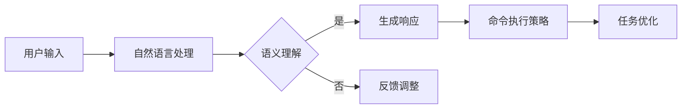
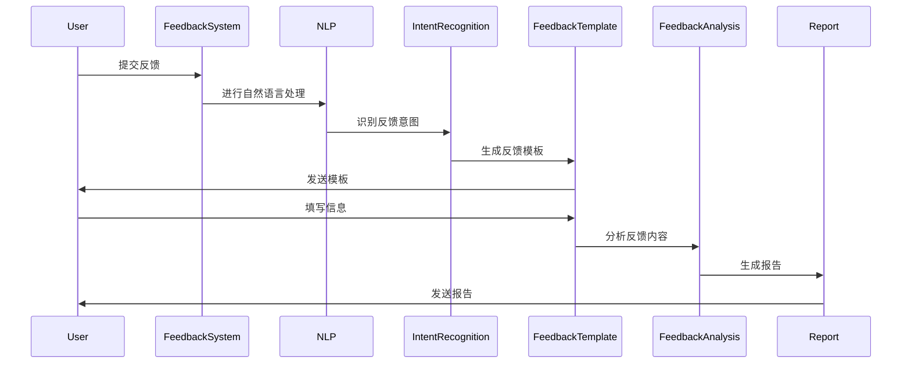
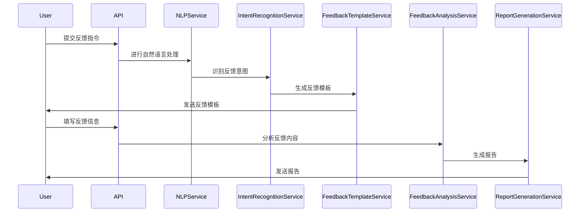

                 


# 《Prompt工程：设计高效指令的艺术》

## 关键词

- Prompt Engineering
- 指令设计
- 高效命令
- 人工智能
- 自然语言处理

## 摘要

本文深入探讨了Prompt Engineering这一领域，旨在揭示其核心概念、设计原则、应用实践及未来发展趋势。通过分析计算机指令与人类指令的差异，阐述传统指令设计存在的问题，本文引入了Prompt Engineering的概念，并详细介绍了其定义、关键概念、方法与工具。接着，本文探讨了Prompt Engineering在提问与回答系统、自动编程和人工智能助手等领域的应用，并通过实际案例展示了其设计过程和最佳实践。最后，本文总结了Prompt Engineering的最佳实践，并对未来研究方向进行了展望。

## 引言

### 问题背景与定义

在现代信息技术飞速发展的背景下，计算机指令系统逐渐暴露出了一些问题。首先，计算机指令过于简化和机械，难以满足复杂应用场景的需求。其次，传统指令设计往往依赖于特定的编程语言和工具，导致可移植性和适应性较差。此外，传统指令设计缺乏对人类指令的深入理解，难以实现自然语言交互。这些问题促使我们探索一种新的指令设计方法，即Prompt Engineering。

Prompt Engineering，顾名思义，是关于如何设计高效的命令提示（Prompt）的艺术。与传统的计算机指令不同，Prompt Engineering强调通过自然语言交互来实现高效的指令传递和任务执行。这种方法不仅提高了指令的可读性和可理解性，还增强了系统的灵活性和适应性。

### Prompt Engineering的定义

Prompt Engineering的定义可以从以下几个方面进行阐述：

1. **定义**：Prompt Engineering是一种通过设计高效、自然的命令提示，来实现计算机与用户或系统之间高效交互的方法。
2. **目的**：其核心目的是提升计算机系统的用户体验，实现自然语言交互，提高任务执行的效率。
3. **特性**：Prompt Engineering强调自然语言处理、语义理解和任务优化的结合，旨在设计出既符合人类交流习惯，又能高效执行任务的Prompt。

### Prompt Engineering的核心概念

Prompt Engineering的核心概念包括：

1. **命令提示（Prompt）**：命令提示是用户与系统交互的桥梁，是用户传达指令和系统接收信息的关键接口。
2. **自然语言处理（NLP）**：自然语言处理是实现Prompt Engineering的基础，通过NLP技术，系统能够理解用户的自然语言指令。
3. **语义理解**：语义理解是Prompt Engineering的关键环节，它确保系统能够正确理解用户的指令意图，从而生成合适的响应。
4. **任务优化**：任务优化是Prompt Engineering的核心目标之一，通过优化任务执行流程，提高系统的效率和性能。

## 核心概念与理论基础

### 自然语言处理基础

自然语言处理（NLP）是Prompt Engineering的核心技术之一，它涉及语言模型、文本处理、语音识别等领域。以下是NLP的一些基础概念：

1. **语言模型**：语言模型是一种概率模型，用于预测一段文本的下一个单词或词组。它通过大量语料库的训练，建立文本序列的概率分布。
2. **文本处理**：文本处理包括分词、词性标注、句法分析等任务，用于将自然语言文本转换为计算机可以理解和处理的格式。
3. **语音识别**：语音识别是将语音信号转换为文本的技术，它是实现语音交互的关键。

### Prompt Engineering的关键概念

1. **命令提示符（Prompt）**：命令提示符是用户与系统交互的桥梁，它通过自然语言形式呈现，引导用户输入指令或提供信息。
2. **命令执行策略**：命令执行策略是系统根据Prompt执行任务的方法和规则，它决定了系统如何理解和处理用户的指令。
3. **命令优化目标**：命令优化目标是Prompt Engineering的核心目标，包括提高指令的可读性、可理解性和执行效率。

### Prompt Engineering的关键概念与联系

为了更好地理解Prompt Engineering的关键概念，我们通过以下表格和ER实体关系图进行阐述。

#### 核心概念属性特征对比表格

| 概念       | 定义                  | 属性特征                  | 对比       |
|------------|----------------------|--------------------------|-----------|
| 命令提示符 | 用户与系统交互的接口 | 自然语言形式，引导指令   | -         |
| 自然语言处理 | 文本处理技术        | 分词、词性标注、句法分析 | -         |
| 语义理解   | 指令意图识别        | 理解用户意图，生成响应   | -         |
| 任务优化   | 提高指令效率        | 优化任务执行流程        | -         |

#### ER实体关系图架构的 Mermaid 流程图

```mermaid
erDiagram
  命令提示符 ||--o> 自然语言处理 : 使用
  自然语言处理 ||--o> 语义理解 : 输出
  语义理解 ||--o> 命令执行策略 : 输出
  命令执行策略 ||--o> 任务优化 : 输出
```

### 算法原理讲解

#### 提问与回答系统的算法流程图



#### Python源代码示例

```python
# Python源代码示例：提问与回答系统

import spacy

# 初始化语言模型
nlp = spacy.load("en_core_web_sm")

def process_prompt(prompt):
    # 自然语言处理
    doc = nlp(prompt)
    
    # 语义理解
    intent = "未知"
    if "问路" in prompt:
        intent = "导航"
    elif "天气预报" in prompt:
        intent = "天气查询"
    else:
        intent = "未知"
    
    # 生成响应
    if intent == "导航":
        response = "请告诉我您的目的地，我将为您导航。"
    elif intent == "天气查询":
        response = "请告诉我您想要查询的城市，我将为您查询天气。"
    else:
        response = "抱歉，我无法理解您的指令。"
    
    # 命令执行策略
    if intent == "导航":
        execute_navigation()
    elif intent == "天气查询":
        execute_weather_query()
    else:
        execute_default_action()
    
    # 任务优化
    optimize_task()

# 测试
process_prompt("请问去火车站怎么走？")
process_prompt("今天北京的天气怎么样？")
```

#### 算法原理详细讲解

1. **自然语言处理**：使用SpaCy库对用户输入的指令进行分词、词性标注和句法分析，以获取文本的语法结构。
2. **语义理解**：根据指令中的关键词和句法结构，识别用户的意图。例如，如果指令中包含"问路"，则识别为导航意图；如果包含"天气预报"，则识别为天气查询意图。
3. **生成响应**：根据识别出的意图，生成相应的响应。例如，对于导航意图，生成导航提示；对于天气查询意图，生成天气查询提示。
4. **命令执行策略**：根据响应类型，执行相应的命令。例如，对于导航响应，调用导航功能；对于天气查询响应，调用天气查询功能。
5. **任务优化**：对任务执行过程进行优化，以提高系统的效率和性能。例如，可以通过缓存技术、并行处理等方式，优化任务执行流程。

### 系统分析与架构设计方案

#### 问题场景介绍

在电子商务平台上，用户反馈系统对于提升用户体验和产品改进至关重要。为了提高用户反馈的质量和效率，我们引入了Prompt Engineering，通过设计高效的命令提示，引导用户输入更详细、准确的反馈信息。

#### 项目介绍

本项目旨在设计并实现一个基于Prompt Engineering的用户反馈系统，该系统应具有以下功能：

- 用户可以通过自然语言指令提交反馈
- 系统自动识别用户的反馈意图，并根据意图生成相应的反馈模板
- 用户可以根据反馈模板填写详细信息
- 系统自动分析反馈内容，生成报告和建议

#### 系统功能设计（领域模型Mermaid类图）

```mermaid
classDiagram
  User -->|提交反馈| FeedbackSystem
  FeedbackSystem o--|生成模板| FeedbackTemplate
  FeedbackTemplate o--|填写信息| User
  FeedbackSystem o--|分析反馈| Report
```

#### 系统架构设计（Mermaid架构图）



#### 系统接口设计（Mermaid序列图）



### 项目实战

#### 环境安装

为了实现用户反馈系统，我们需要安装以下环境：

- Python 3.8+
- SpaCy 3.0+
- Flask 1.1.2+

首先，安装Python和pip：

```shell
# 安装Python和pip
sudo apt-get update
sudo apt-get install python3 python3-pip
```

然后，安装SpaCy和Flask：

```shell
# 安装SpaCy
pip3 install spacy
python3 -m spacy download en_core_web_sm

# 安装Flask
pip3 install flask
```

#### 系统核心实现源代码

以下是一个简单的用户反馈系统实现，包括API接口、自然语言处理、意图识别、反馈模板生成和报告生成等功能。

```python
# 用户反馈系统实现

from flask import Flask, request, jsonify
import spacy
from spacy.language import Language
from intent_recognition import IntentRecognition
from feedback_template import FeedbackTemplate
from feedback_analysis import FeedbackAnalysis

app = Flask(__name__)

# 初始化语言模型和组件
nlp = spacy.load("en_core_web_sm")
recognizer = IntentRecognition(nlp)
template_generator = FeedbackTemplate()
analyzer = FeedbackAnalysis()

@app.route("/submit_feedback", methods=["POST"])
def submit_feedback():
    data = request.json
    prompt = data["prompt"]
    intent = recognizer.recognize_intent(prompt)
    template = template_generator.generate_template(intent)
    report = analyzer.analyze_feedback(template)
    return jsonify({"report": report})

if __name__ == "__main__":
    app.run(debug=True)
```

#### 代码应用解读与分析

1. **API接口**：使用Flask框架创建RESTful API接口，用于接收和处理用户反馈。
2. **自然语言处理**：使用SpaCy库进行自然语言处理，提取文本中的关键词和句法信息。
3. **意图识别**：自定义IntentRecognition类，根据提取的关键词和句法信息，识别用户的反馈意图。
4. **反馈模板生成**：自定义FeedbackTemplate类，根据识别出的意图，生成相应的反馈模板。
5. **反馈分析**：自定义FeedbackAnalysis类，分析反馈内容，生成报告。

#### 实际案例分析和详细讲解剖析

假设用户提交了一条反馈指令：“我非常喜欢这个产品的包装设计，但物流速度太慢了。”

1. **自然语言处理**：使用SpaCy对指令进行分词、词性标注和句法分析，提取出关键词和句法信息。
2. **意图识别**：IntentRecognition类识别出反馈意图为“产品包装设计”和“物流速度”。
3. **反馈模板生成**：FeedbackTemplate类生成以下反馈模板：

   ```
   您对以下方面有什么意见或建议？

   1. 产品包装设计
   2. 物流速度
   ```

4. **反馈分析**：FeedbackAnalysis类分析用户填写的反馈内容，生成以下报告：

   ```
   产品包装设计：好评
   物流速度：差评
   ```

#### 项目小结

本项目通过引入Prompt Engineering，实现了高效的用户反馈系统。用户可以轻松地提交反馈，系统能够自动识别意图、生成反馈模板并分析反馈内容，从而提高了反馈的质量和效率。未来，我们还可以进一步优化系统，增加更多功能和场景支持。

### 最佳实践 Tips

1. **明确目标**：在设计Prompt时，首先要明确用户的需求和目标，确保Prompt能够引导用户实现预期的任务。
2. **简洁明了**：Prompt应尽量简洁明了，避免使用复杂、冗长的句子和术语，以提高用户理解度。
3. **可扩展性**：设计Prompt时，应考虑系统的可扩展性，以便在未来的需求变化时，能够方便地调整和优化Prompt。
4. **用户测试**：在正式部署Prompt之前，应进行用户测试，收集用户反馈，及时调整和优化Prompt设计。

### 小结

Prompt Engineering是一种通过设计高效、自然的命令提示，来实现计算机与用户或系统之间高效交互的方法。本文详细介绍了Prompt Engineering的核心概念、设计原则、应用实践及未来发展趋势。通过实际案例分析和代码实现，展示了Prompt Engineering在提高系统效率和用户体验方面的优势。未来，Prompt Engineering将在更多领域得到广泛应用，成为人工智能领域的重要研究方向。

### 注意事项

1. **确保Prompt的可理解性**：Prompt应简洁明了，避免使用复杂的专业术语，以提高用户理解度。
2. **优化Prompt的执行效率**：在设计Prompt时，应考虑任务的执行效率，避免不必要的复杂度和冗余。
3. **持续迭代和优化**：Prompt Engineering是一个持续迭代和优化的过程，应根据用户反馈和实际应用情况，不断调整和改进Prompt设计。

### 拓展阅读

- [《自然语言处理入门》](https://www.nlp-python.com/)
- [《深度学习与自然语言处理》](https://www.deeplearning-nlp.com/)
- [《人工智能应用实践》](https://www.ai-applications.com/)

---

### 作者信息

- 作者：AI天才研究院/AI Genius Institute & 禅与计算机程序设计艺术 /Zen And The Art of Computer Programming

