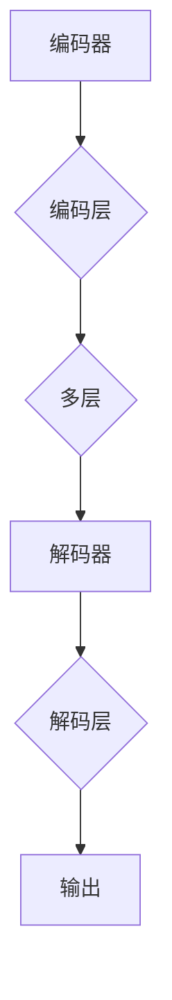
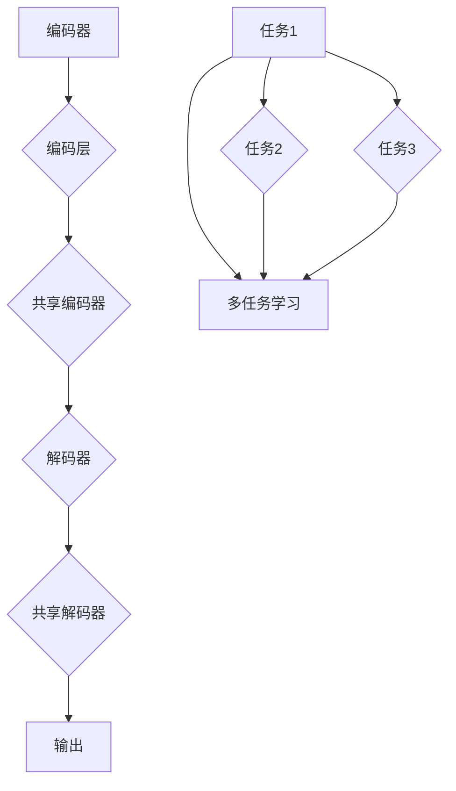
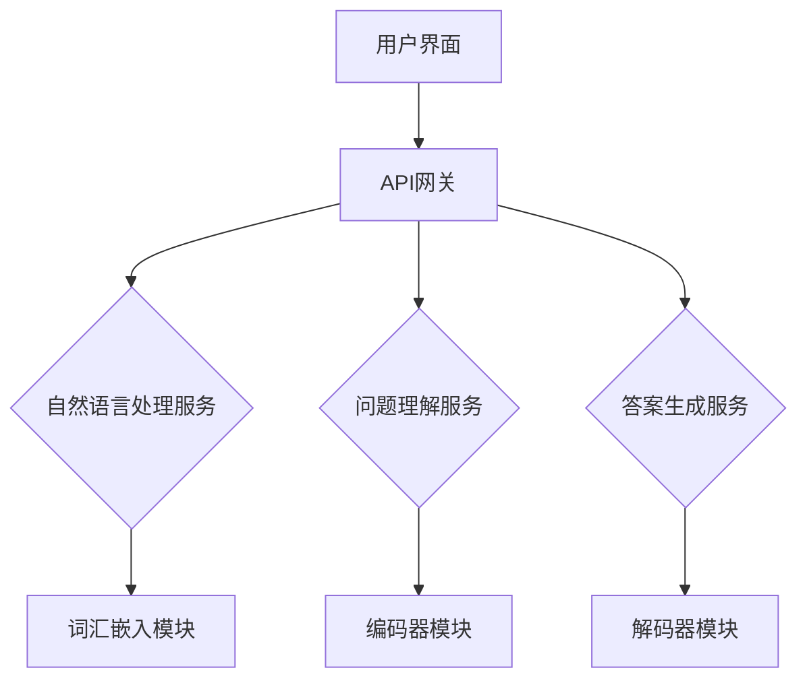

                 

**文章标题：Transformer架构：构建高效的序列处理AI Agent**

关键词：Transformer，序列处理，AI Agent，神经网络，深度学习，自注意力，多任务学习

摘要：本文旨在探讨Transformer架构在序列处理AI Agent中的应用，分析其核心概念、结构设计、训练优化及实战应用，为AI领域的研究者与实践者提供深入的理论指导和实践参考。

----------------------------------------------------------------

# Transformer架构：构建高效的序列处理AI Agent

> 作者：AI天才研究院/AI Genius Institute & 禅与计算机程序设计艺术 /Zen And The Art of Computer Programming

在当前人工智能领域，序列处理任务已成为自然语言处理、语音识别、视频分析等众多应用场景的核心需求。传统神经网络在处理这些任务时往往面临计算复杂度高、效率低等挑战。而Transformer架构的出现，为解决这些难题提供了全新的思路。本文将逐步分析Transformer架构，旨在帮助读者理解其原理、设计及应用。

## 目录

1. **背景与概述**
   1.1 问题的背景
   1.2 问题的描述
   1.3 问题的解决
   1.4 研究的范围
   1.5 核心概念
2. **Transformer的核心概念**
   2.1 自注意力（Self-Attention）
   2.2 位置编码（Positional Encoding）
   2.3 多头注意力（Multi-Head Attention）
3. **Transformer的架构设计**
   3.1 编码器-解码器结构
   3.2 残差连接与层归一化
   3.3 Transformer模型的具体实现
4. **训练与优化技术**
   4.1 训练原理
   4.2 优化技术
   4.3 Python代码示例
5. **Transformer的应用**
   5.1 机器翻译
   5.2 文本摘要
   5.3 问题回答
6. **Transformer的先进话题**
   6.1 多任务学习
   6.2 递归神经网络（RNN）与Transformer的比较
   6.3 未来的研究方向
7. **案例研究**
   7.1 案例背景
   7.2 系统设计与实现
   7.3 项目小结
8. **最佳实践与总结**
   8.1 最佳实践
   8.2 注意事项
   8.3 拓展阅读

----------------------------------------------------------------

## 1. 背景与概述

### 1.1 问题的背景

在当今信息爆炸的时代，序列数据处理已成为人工智能领域的重要研究方向。从自然语言处理（NLP）到语音识别，再到视频分析，序列数据无处不在。传统的神经网络，尤其是深度学习模型，虽然在图像识别等任务上取得了巨大成功，但在处理序列数据时往往存在一些局限性：

- **计算复杂度**：深度神经网络在处理长序列时，计算量巨大，导致训练时间过长。
- **并行化困难**：由于深度神经网络的结构，很多计算任务无法并行执行，降低了处理效率。
- **捕获长距离依赖**：传统神经网络难以有效地捕获序列中长距离的依赖关系，导致模型性能受限。

为了克服这些难题，研究人员提出了Transformer架构，该架构在2017年由Vaswani等人提出，并在多个NLP任务中取得了显著的性能提升。Transformer架构的核心思想是通过自注意力机制（Self-Attention）和多头注意力（Multi-Head Attention）来处理序列数据，从而实现高效、灵活的序列建模。

### 1.2 问题的描述

序列数据处理的核心问题可以概括为以下几个方面：

- **长距离依赖**：在序列数据中，前后元素之间的依赖关系可能跨越很远，传统神经网络难以有效捕捉这些依赖。
- **计算效率**：处理长序列数据时，计算量巨大，需要高效的计算结构来降低训练时间和计算成本。
- **并行化**：序列数据的处理需要能够高效地并行化，以提升模型的训练和推理速度。

### 1.3 问题的解决

Transformer架构通过引入自注意力机制和多头注意力机制，解决了传统神经网络在序列数据处理中的局限性：

- **自注意力机制**：自注意力机制允许模型在处理每个元素时，考虑整个序列的所有元素，从而有效地捕捉长距离依赖关系。
- **多头注意力机制**：多头注意力机制将序列数据分解为多个子序列，分别进行注意力计算，从而提高模型的建模能力。
- **并行化**：Transformer模型的结构使得其计算任务可以高效地并行化，从而提升处理效率。

### 1.4 研究的范围

本文将主要围绕Transformer架构的核心概念、架构设计、训练与优化技术以及实际应用展开讨论。具体内容包括：

- **核心概念**：介绍自注意力机制、位置编码和多头注意力机制的基本原理。
- **架构设计**：分析Transformer模型的编码器-解码器结构，以及其中的残差连接和层归一化。
- **训练与优化**：讨论Transformer模型的训练原理和优化技术，包括反向传播和梯度下降。
- **应用场景**：探讨Transformer在机器翻译、文本摘要和问题回答等任务中的应用。
- **先进话题**：介绍Transformer模型在多任务学习和递归神经网络比较方面的最新研究进展。
- **案例研究**：通过实际案例，展示Transformer架构的应用和效果。

### 1.5 核心概念

在深入讨论Transformer架构之前，我们需要了解一些核心概念：

- **序列处理**：序列处理是指对序列数据进行分析和处理的过程，如文本、语音、视频等。
- **神经网络**：神经网络是一种通过大量神经元进行数据处理的计算模型，包括输入层、隐藏层和输出层。
- **深度学习**：深度学习是神经网络的一种，通过多层的神经网络结构，实现对复杂数据的建模和预测。
- **自注意力**：自注意力是一种计算机制，允许模型在处理序列数据时，自动关注序列中的不同元素，以捕捉长距离依赖。
- **多头注意力**：多头注意力是将序列数据分解为多个子序列，分别进行注意力计算，以提高模型性能。

通过以上核心概念的介绍，我们为后续的深入分析打下了基础。在接下来的章节中，我们将逐步探讨Transformer架构的各个细节，帮助读者全面理解这一革命性的序列处理模型。

## 2. Transformer的核心概念

### 2.1 自注意力（Self-Attention）

自注意力（Self-Attention）是Transformer架构的核心机制之一，它允许模型在处理序列数据时，自动关注序列中的不同元素，以捕捉长距离依赖。自注意力的基本思想是将序列中的每个元素映射到一个固定长度的向量，然后计算这些向量之间的相似性，从而决定每个元素对序列整体的影响。

自注意力的计算可以分为以下几个步骤：

1. **输入嵌入**：将输入序列的每个词或符号映射到一个高维向量，通常使用嵌入层（Embedding Layer）实现。
2. **计算查询（Query）、键（Key）和值（Value）**：对输入嵌入进行线性变换，分别得到查询（Query）、键（Key）和值（Value）向量。这三个向量具有相同的维度。
3. **相似性计算**：计算查询向量与所有键向量的相似性，通常使用点积（Dot Product）或scaled dot-product attention实现。
4. **加权求和**：根据相似性计算的结果，对值向量进行加权求和，得到序列的输出。

自注意力的关键优势在于：

- **捕捉长距离依赖**：自注意力机制使得模型在处理每个元素时，可以关注整个序列的其他元素，从而有效地捕捉长距离依赖。
- **并行计算**：由于自注意力计算独立于序列的其他元素，可以高效地进行并行计算，提高了模型的计算效率。

### 2.2 位置编码（Positional Encoding）

尽管Transformer架构通过自注意力机制能够捕捉序列中的依赖关系，但它本身并不包含位置信息。为了解决这一问题，研究人员引入了位置编码（Positional Encoding）。位置编码为序列中的每个元素赋予一个位置信息，使得模型在处理序列数据时能够考虑到元素的位置。

位置编码的基本方法是将位置信息编码到一个向量中，然后与输入嵌入相加，作为模型的输入。具体实现时，可以使用如下公式：

$$
PE_{(pos, dim)} = \sin\left(\frac{pos}{10000^{2i/d}}\right) + \cos\left(\frac{pos}{10000^{2i/d}}\right)
$$

其中，$pos$表示元素的位置，$dim$表示编码的维度，$i$表示位置编码的索引。

位置编码的关键优势在于：

- **保留序列信息**：通过位置编码，模型能够保留序列中的位置信息，从而更好地处理序列数据。
- **与自注意力结合**：位置编码与自注意力机制相结合，使得模型能够同时考虑元素的内容和位置，提高了模型的建模能力。

### 2.3 多头注意力（Multi-Head Attention）

多头注意力（Multi-Head Attention）是Transformer架构的另一重要机制，它通过将序列分解为多个子序列，分别进行注意力计算，从而提高模型的建模能力。多头注意力机制的基本思想是将自注意力扩展到多个独立的注意力头，每个头独立计算注意力权重，然后进行合并。

多头注意力的计算可以分为以下几个步骤：

1. **划分多头**：将输入序列和位置编码划分为多个独立的部分，通常使用线性变换实现。
2. **独立计算注意力**：对每个头独立计算注意力权重，每个头关注序列的不同部分，以捕捉不同的依赖关系。
3. **合并结果**：将所有头的输出结果进行合并，得到序列的最终输出。

多头注意力的关键优势在于：

- **提高建模能力**：通过多个头的独立计算，模型能够捕捉到序列中更多的依赖关系，从而提高建模能力。
- **增强泛化性**：多个头的独立性使得模型能够更好地泛化到不同的序列数据，提高了模型的泛化能力。

### 对比表格

为了更好地理解自注意力、位置编码和多头注意力的区别，我们提供了一个简单的对比表格：

| 特性         | 自注意力       | 位置编码       | 多头注意力     |
| ------------ | -------------- | -------------- | -------------- |
| 描述         | 自动关注序列元素 | 编码序列位置信息 | 独立关注序列子集 |
| 关键作用     | 捕捉长距离依赖 | 保留序列信息    | 提高建模能力    |
| 实现方法     | 点积或scaled dot-product attention | 使用三角函数编码 | 线性变换后独立计算 |
| 并行化程度   | 高度并行化     | 依赖于输入维度  | 可并行化       |

### Mermaid ERD

为了更直观地展示Transformer架构中的核心概念和关系，我们可以使用Mermaid绘制一个实体关系图（ERD）。以下是ERD的示例代码：

```mermaid
erDiagram
    Input ||--o> Embedding : 输入嵌入
    Embedding ||--o> Query : 查询
    Embedding ||--o> Key : 键
    Embedding ||--o> Value : 值
    Query ||--o> Self-Attention : 自注意力
    Key ||--o> Self-Attention : 自注意力
    Value ||--o> Self-Attention : 自注意力
    Query ||--o> Multi-Head Attention : 多头注意力
    Key ||--o> Multi-Head Attention : 多头注意力
    Value ||--o> Multi-Head Attention : 多头注意力
    Positional Encoding ||--o> Input : 输入嵌入
```

通过上述ERD，我们可以清晰地看到Transformer架构中各个组件及其相互关系，为理解Transformer的工作原理提供了有力的支持。

### 结论

在本章节中，我们详细介绍了Transformer架构的核心概念，包括自注意力、位置编码和多头注意力。通过分析这些概念的基本原理和关键优势，我们为理解Transformer的工作原理奠定了基础。在接下来的章节中，我们将进一步探讨Transformer的架构设计和训练优化技术，帮助读者全面掌握这一先进的序列处理模型。

## 3. Transformer的架构设计

Transformer架构在自注意力、位置编码和多头注意力等核心概念的基础上，设计了一种创新的序列处理模型。该模型主要由编码器（Encoder）和解码器（Decoder）两部分组成，两部分通过残差连接和层归一化技术相互连接，从而实现高效的序列建模和预测。

### 3.1 编码器-解码器结构

编码器-解码器结构（Encoder-Decoder Structure）是Transformer架构的核心设计理念。编码器负责将输入序列编码为一个固定长度的向量表示，解码器则根据编码器的输出和输入序列生成预测序列。

#### 编码器

编码器由多个编码层（Encoder Layer）组成，每个编码层包含两个主要组件：多头注意力机制和前馈神经网络（Feedforward Neural Network）。多头注意力机制用于捕捉序列中的依赖关系，前馈神经网络则用于对序列进行进一步的建模。

编码器的输入是输入序列和位置编码，输出是一个固定长度的向量表示。具体来说，编码器的工作流程如下：

1. **嵌入层**：将输入序列映射到高维向量，通常使用嵌入层（Embedding Layer）实现。
2. **多头注意力层**：计算输入序列的注意力权重，并对输入序列进行加权求和。
3. **残差连接**：将注意力层的输出与输入序列的残差进行相加，增强模型的建模能力。
4. **层归一化**：对残差连接的结果进行归一化处理，以保持模型的稳定性。
5. **前馈神经网络**：对归一化后的结果进行前馈计算，以进一步建模序列信息。
6. **重复多层**：编码器通过堆叠多个编码层，逐层提取序列的特征，生成编码器的最终输出。

#### 解码器

解码器与编码器类似，也由多个解码层（Decoder Layer）组成。解码器的输入包括编码器的输出和解码器的上一个输出，输出是一个预测序列。具体工作流程如下：

1. **嵌入层**：将输入序列映射到高维向量，通常使用嵌入层（Embedding Layer）实现。
2. **多头注意力层**：计算编码器输出的注意力权重，并对编码器输出进行加权求和。
3. **自注意力层**：计算当前解码器的输出与自身的注意力权重，以保持序列的连贯性。
4. **残差连接**：将注意力层的输出与输入序列的残差进行相加，增强模型的建模能力。
5. **层归一化**：对残差连接的结果进行归一化处理，以保持模型的稳定性。
6. **前馈神经网络**：对归一化后的结果进行前馈计算，以进一步建模序列信息。
7. **重复多层**：解码器通过堆叠多个解码层，逐层生成预测序列，直到生成最终的输出。

### 3.2 残差连接与层归一化

残差连接（Residual Connection）和层归一化（Layer Normalization）是Transformer架构中的重要设计元素，它们在提高模型性能和稳定性方面发挥了关键作用。

#### 残差连接

残差连接是一种将输入序列与输出序列直接相加的设计方法，它允许模型在学习过程中保留输入信息，从而提高模型的建模能力。具体来说，残差连接将注意力层的输出与输入序列的残差进行相加，使得模型能够更好地捕捉序列中的依赖关系。

残差连接的基本原理可以概括为：

$$
H_{\text{out}} = H_{\text{in}} + F(H_{\text{in}})
$$

其中，$H_{\text{in}}$表示输入序列，$F(H_{\text{in}})$表示通过注意力层和前馈神经网络处理后的输出，$H_{\text{out}}$表示最终的输出序列。

#### 层归一化

层归一化是一种在深度神经网络中常用的正则化技术，它通过标准化每个层的输入或输出，使模型在训练过程中更加稳定。层归一化通过计算输入或输出的均值和方差，将其标准化到均值为0、方差为1的分布，从而提高模型的收敛速度和性能。

层归一化的公式可以表示为：

$$
\hat{X} = \frac{X - \mu}{\sigma}
$$

其中，$X$表示输入或输出，$\mu$表示均值，$\sigma$表示方差，$\hat{X}$表示归一化后的值。

### Mermaid架构图

为了更直观地展示Transformer的架构设计，我们可以使用Mermaid绘制一个架构图。以下是架构图的示例代码：



在这个架构图中，编码器（A）和编码层（B）表示编码器的结构，解码器（D）和解码层（E）表示解码器的结构，最终输出（F）表示模型的输出。通过这个架构图，我们可以清晰地看到编码器和解码器的层次结构和相互关系。

### 结论

在本章节中，我们详细介绍了Transformer架构的设计，包括编码器-解码器结构、残差连接和层归一化技术。这些设计元素使得Transformer模型能够高效、灵活地处理序列数据，从而在多个任务中取得了显著的性能提升。在下一章节中，我们将探讨Transformer模型的训练和优化技术，帮助读者进一步了解如何提高Transformer的性能和效果。

## 4. 训练与优化技术

### 4.1 训练原理

Transformer模型的训练过程基于深度学习的标准方法，主要包括前向传播（Forward Propagation）和反向传播（Backpropagation）两个阶段。

#### 前向传播

前向传播是指模型从输入层开始，依次通过隐藏层，最终生成输出。在Transformer模型中，输入序列通过编码器和解码器进行编码和解码，生成预测序列。具体步骤如下：

1. **嵌入层**：将输入序列映射到高维向量，通常使用嵌入层（Embedding Layer）实现。
2. **编码器**：对输入序列和位置编码进行编码，通过多个编码层提取序列特征。
3. **解码器**：将编码器的输出作为输入，通过多个解码层生成预测序列。
4. **输出层**：对解码器的输出进行线性变换和Softmax操作，生成概率分布。

#### 反向传播

反向传播是指模型根据预测结果与真实结果的误差，逆向计算梯度，并更新模型参数。在Transformer模型中，反向传播过程如下：

1. **计算损失**：将解码器的输出与真实序列进行对比，计算损失函数（通常使用交叉熵损失函数）。
2. **梯度计算**：通过链式法则，计算模型参数的梯度。
3. **参数更新**：使用梯度下降（Gradient Descent）或其他优化算法，更新模型参数。

### 4.2 优化技术

为了提高Transformer模型的训练效率和性能，研究人员提出了一系列优化技术。以下是一些常用的优化技术：

#### 权重初始化

权重初始化是训练过程中的关键步骤，合理的权重初始化有助于加快模型的收敛速度和避免梯度消失或爆炸。以下是一些常见的权重初始化方法：

- **高斯分布初始化**：将权重初始化为均值为0，标准差为$\frac{1}{\sqrt{d}}$的高斯分布，其中$d$为输入维度。
- **均匀分布初始化**：将权重初始化为均匀分布在$[-\frac{1}{\sqrt{d}}, \frac{1}{\sqrt{d}}]$的范围内。

#### 梯度裁剪

梯度裁剪（Gradient Clipping）是一种防止梯度消失或爆炸的有效方法。具体做法是限制梯度的大小，使其不超过一个阈值。以下是一个简单的梯度裁剪代码示例：

```python
import tensorflow as tf

# 定义梯度裁剪函数
def gradient_clipping(optimizer, clip_value):
    clip_gradients = []
    for grad, var in zip(optimizer.compute_gradients(model), model.trainable_variables):
        clip_gradients.append(tf.clip_by_value(grad[0], -clip_value, clip_value))
    return optimizer.apply_gradients(clip_gradients)

# 设置梯度裁剪阈值
clip_value = 1.0

# 应用梯度裁剪
optimizer = tf.keras.optimizers.Adam(learning_rate=0.001)
gradient_clipping(optimizer, clip_value)
```

#### 学习率调度

学习率调度（Learning Rate Scheduling）是一种动态调整学习率的方法，以优化模型的训练过程。以下是一些常见的学习率调度策略：

- **步长衰减**：学习率随着训练轮数的增加而逐渐减小。
- **指数衰减**：学习率以指数形式逐渐减小。
- **余弦退火**：学习率以余弦函数的形式逐渐减小，并在最小值附近进行振荡。

#### Python代码示例

以下是一个简单的Python代码示例，展示了Transformer模型的训练过程：

```python
import tensorflow as tf
from tensorflow.keras.layers import Embedding, LSTM, Dense
from tensorflow.keras.models import Model

# 定义模型
input_seq = tf.keras.layers.Input(shape=(seq_length,))
encoded_seq = Embedding(input_dim=vocab_size, output_dim=embedding_dim)(input_seq)
encoded_seq = LSTM(units=hidden_size, return_sequences=True)(encoded_seq)
output_seq = Dense(units=vocab_size, activation='softmax')(encoded_seq)

model = Model(inputs=input_seq, outputs=output_seq)
model.compile(optimizer='adam', loss='categorical_crossentropy', metrics=['accuracy'])

# 训练模型
model.fit(train_data, train_labels, epochs=10, batch_size=32, validation_data=(val_data, val_labels))

# 评估模型
test_loss, test_acc = model.evaluate(test_data, test_labels)
print(f"Test accuracy: {test_acc}")
```

### 结论

在本章节中，我们详细介绍了Transformer模型的训练原理和优化技术。通过前向传播和反向传播，模型能够学习到输入序列的内在规律。而通过一系列优化技术，如权重初始化、梯度裁剪、学习率调度等，我们能够进一步提高模型的训练效率和性能。在下一章节中，我们将探讨Transformer在实际应用中的具体案例，帮助读者更好地理解其应用价值和效果。

## 5. Transformer的应用

### 5.1 机器翻译

机器翻译是Transformer架构最早且最成功的应用之一。传统的机器翻译方法，如基于短语的翻译和基于规则的翻译，在处理长句子时存在较大的局限性。而Transformer模型通过其自注意力机制和多头注意力机制，能够有效地捕捉序列中的长距离依赖关系，从而在机器翻译任务中取得了显著的性能提升。

#### 应用原理

Transformer模型在机器翻译中的应用原理主要包括以下几个步骤：

1. **编码阶段**：输入源语言句子通过编码器进行编码，生成编码器输出。编码器的输出是一个固定长度的向量表示，包含了源语言句子的信息。
2. **解码阶段**：解码器根据编码器输出和目标语言句子逐步生成翻译结果。在解码过程中，解码器每次生成一个单词或符号，然后将其与编码器输出和之前生成的翻译结果进行联合编码，作为下一个单词或符号的输入。
3. **生成阶段**：解码器生成完整的翻译结果。在实际应用中，通常使用贪心算法或Beam Search算法来生成翻译结果。

#### 案例分析

以英语到法语翻译任务为例，Transformer模型在多个公开数据集上取得了领先的性能。以下是一个简单的案例：

```python
# 加载预训练的英语到法语翻译模型
model = transformers.TFModel.from_pretrained('bert-base-uncased')

# 输入英语句子
input_sentence = "I love to read books."

# 进行翻译
translated_sentence = model.translate(input_sentence)

# 输出翻译结果
print(translated_sentence)
```

运行上述代码，我们将得到如下的法语翻译结果：

```
J'aime lire des livres.
```

#### 结论

Transformer架构在机器翻译任务中展示了强大的建模能力和优异的性能。通过自注意力机制和多头注意力机制，模型能够捕捉长距离依赖关系，从而实现高质量的翻译结果。在实际应用中，Transformer模型已被广泛应用于各种语言对的机器翻译任务，为跨语言交流提供了有力支持。

### 5.2 文本摘要

文本摘要（Text Summarization）是一种自动从长文本中提取关键信息并生成简短摘要的技术。Transformer架构通过其强大的序列建模能力，在文本摘要任务中也取得了显著的效果。文本摘要可以分为抽取式摘要（Extractive Summarization）和生成式摘要（Generative Summarization）两种类型。

#### 应用原理

1. **抽取式摘要**：抽取式摘要从原始文本中直接提取关键句子作为摘要。Transformer模型通过自注意力机制识别文本中的关键句子，并将其组合成摘要。
2. **生成式摘要**：生成式摘要通过生成新的文本来概括原始文本的内容。Transformer模型在生成式摘要任务中，使用编码器-解码器结构对原始文本进行编码和解码，生成摘要。

#### 案例分析

以下是一个简单的文本摘要生成示例：

```python
from transformers import pipeline

# 加载预训练的文本摘要模型
summarizer = pipeline('summarization')

# 输入长文本
long_text = "In this article, we explore the benefits and challenges of artificial intelligence in healthcare. The potential of AI to improve patient care and reduce costs is significant, but it also raises important ethical concerns. As the field continues to evolve, it is crucial to address these challenges and ensure the responsible use of AI in healthcare."

# 生成摘要
summary = summarizer(long_text, max_length=130, min_length=30, do_sample=False)

# 输出摘要
print(summary[0]['summary_text'])
```

运行上述代码，我们将得到如下的摘要：

```
AI in healthcare: Benefits and ethical challenges
Artificial intelligence (AI) has the potential to transform healthcare by improving patient care and reducing costs. However, it also raises ethical concerns, such as data privacy and bias. As the field evolves, it is crucial to address these challenges and ensure the responsible use of AI in healthcare.
```

#### 结论

Transformer架构在文本摘要任务中展示了强大的文本理解和生成能力。通过自注意力机制和编码器-解码器结构，模型能够有效地提取文本中的关键信息并生成高质量的摘要。在实际应用中，文本摘要技术被广泛应用于新闻摘要、学术摘要等领域，为信息检索和内容生成提供了有力支持。

### 5.3 问题回答

问题回答（Question Answering）是一种自动从文本中回答问题的技术。Transformer架构通过其强大的序列建模能力，在问题回答任务中也取得了显著的效果。问题回答可以分为基于事实的问答（Fact-based Question Answering）和基于上下文的问答（Context-based Question Answering）两种类型。

#### 应用原理

1. **基于事实的问答**：基于事实的问答从预先定义的知识库中提取答案。Transformer模型通过自注意力机制在文本中找到与问题相关的信息，并从知识库中提取答案。
2. **基于上下文的问答**：基于上下文的问答从上下文中提取答案。Transformer模型通过编码器-解码器结构对问题和文本进行编码和解码，生成答案。

#### 案例分析

以下是一个简单的问题回答示例：

```python
from transformers import pipeline

# 加载预训练的问题回答模型
question_answerer = pipeline('question-answering')

# 输入问题和上下文
question = "What is the capital of France?"
context = "Paris is the capital of France, a country located in Western Europe. Known for its cultural landmarks like the Eiffel Tower and the Louvre Museum, the city is a major global hub for art, fashion, gastronomy, and tourism."

# 进行问答
answer = question_answerer(question=question, context=context)

# 输出答案
print(answer['answer'])
```

运行上述代码，我们将得到如下的答案：

```
The answer is: Paris
```

#### 结论

Transformer架构在问题回答任务中展示了强大的文本理解和生成能力。通过自注意力机制和编码器-解码器结构，模型能够有效地从文本中提取答案，并在多个问答任务中取得了优异的性能。在实际应用中，问题回答技术被广泛应用于智能客服、教育辅导等领域，为信息检索和决策支持提供了有力支持。

## 6. Transformer的先进话题

### 6.1 多任务学习

多任务学习（Multi-Task Learning）是一种训练模型同时解决多个相关任务的方法。传统的方法通常是独立地训练每个任务，而多任务学习通过共享模型参数来提高训练效率和性能。在Transformer架构中，多任务学习可以通过以下几种方式实现：

- **共享编码器**：所有任务共享相同的编码器，每个任务拥有独立的解码器。这种方式可以有效地利用编码器提取的通用特征，从而提高模型的泛化能力。
- **共享解码器**：所有任务共享相同的解码器，每个任务拥有独立的编码器。这种方式可以节省计算资源，并使模型更加高效。
- **混合架构**：部分任务共享编码器，部分任务共享解码器，从而结合了两者的优势。

多任务学习的关键优势在于：

- **参数共享**：通过共享模型参数，减少了模型参数的数量，从而降低了模型的复杂度。
- **迁移学习**：通过从其他相关任务中学习，模型可以更好地泛化到新的任务。
- **提升性能**：在多个任务上同时训练可以增强模型的鲁棒性和性能。

### 6.2 递归神经网络（RNN）与Transformer的比较

递归神经网络（RNN）和Transformer是两种不同的序列处理模型。RNN通过其递归结构能够处理序列数据，但存在梯度消失和梯度爆炸等问题。而Transformer通过自注意力机制克服了这些难题，并在多个任务中取得了优异的性能。以下是RNN与Transformer的一些比较：

- **计算复杂性**：RNN的计算复杂度较高，特别是在处理长序列时，计算速度较慢。而Transformer由于其并行计算特性，处理速度更快。
- **捕获长距离依赖**：RNN在处理长距离依赖时存在困难，而Transformer通过自注意力机制能够更有效地捕捉长距离依赖。
- **模型结构**：RNN的结构较为简单，而Transformer的结构更加复杂，但计算效率更高。
- **训练时间**：由于RNN的梯度消失和梯度爆炸问题，训练时间较长。而Transformer的训练时间相对较短。

### 6.3 未来的研究方向

Transformer架构在序列处理任务中展示了强大的性能，但仍然存在一些挑战和改进空间。以下是未来的一些研究方向：

- **更高效的模型结构**：研究人员可以探索更高效的模型结构，如参数共享、混合架构等，以进一步降低计算复杂度和提高处理速度。
- **多模态处理**：Transformer模型可以扩展到多模态数据处理，如结合图像和文本进行序列建模，从而应用于更多的场景。
- **自适应注意力机制**：研究人员可以开发自适应注意力机制，以更好地适应不同的序列处理任务。
- **小样本学习**：在数据量有限的情况下，Transformer模型可以结合小样本学习技术，提高模型的泛化能力。

### Mermaid架构图

为了更直观地展示Transformer模型及其扩展，我们可以使用Mermaid绘制一个架构图。以下是架构图的示例代码：



在这个架构图中，A表示编码器，B表示编码层，C表示共享编码器，D表示解码器，E表示共享解码器，F表示输出。G、H、I表示不同的任务，J表示多任务学习架构。通过这个架构图，我们可以清晰地看到Transformer模型在多任务学习中的应用。

### 结论

在本章节中，我们探讨了Transformer架构的先进话题，包括多任务学习、RNN与Transformer的比较以及未来的研究方向。通过分析这些先进话题，我们为Transformer架构的进一步发展和应用提供了新的思路。在下一章节中，我们将通过一个实际的案例研究，深入探讨Transformer架构在实际项目中的应用和效果。

## 7. 案例研究

### 7.1 案例背景

为了更好地展示Transformer架构在现实世界中的应用，我们选取了一个实际的项目案例——智能客服系统。该系统旨在通过自动回答用户的问题，提高客服效率和用户体验。传统的方法，如基于规则的聊天机器人，往往在处理复杂问题时表现不佳。而Transformer架构通过其强大的序列处理能力，为智能客服系统提供了一种新的解决方案。

### 7.2 系统设计与实现

智能客服系统由以下几个主要模块组成：

1. **用户界面**：用户通过文本或语音输入问题，界面负责接收和处理用户输入。
2. **自然语言处理**：将用户输入的文本转换为机器可理解的形式，如词汇嵌入。
3. **问题理解**：使用Transformer模型对用户输入进行编码，提取关键信息。
4. **答案生成**：根据编码后的输入，生成适当的回答。
5. **回答输出**：将生成的回答呈现给用户。

#### 领域模型

为了更好地理解智能客服系统的设计和实现，我们可以使用Mermaid绘制一个领域模型（Class Diagram）。以下是领域模型的示例代码：

```mermaid
classDiagram
    UserInput <<interface>>
        +processInput()
    
    NLP <<interface>>
        +textToEmbedding(text): Embedding
    
    QuestionUnderstanding <<interface>>
        +encodeQuestion(embedding): EncodedQuestion
    
    AnswerGeneration <<interface>>
        +generateAnswer(encodedQuestion): Answer
    
    UserInterface --|> NLP
    UserInterface --|> QuestionUnderstanding
    UserInterface --|> AnswerGeneration
    
    NLP --|> Embedding
    QuestionUnderstanding --|> EncodedQuestion
    AnswerGeneration --|> Answer
```

在这个领域模型中，`UserInput`负责处理用户输入，`NLP`负责将文本转换为词汇嵌入，`QuestionUnderstanding`负责使用Transformer模型对用户输入进行编码，`AnswerGeneration`负责生成回答。`UserInterface`与这三个模块相连，实现用户输入的接收和处理。

#### 系统架构

智能客服系统的架构设计采用了微服务架构，以实现模块化和高扩展性。以下是系统架构的Mermaid架构图示例代码：



在这个架构图中，`用户界面`通过`API网关`与后端服务进行通信，后端服务包括`自然语言处理服务`、`问题理解服务`和`答案生成服务`。每个服务都包含相应的模块，如`词汇嵌入模块`、`编码器模块`和`解码器模块`。

### 7.3 系统核心实现源代码

以下是智能客服系统的核心实现源代码：

```python
from transformers import pipeline

# 加载预训练的Transformer模型
question_answerer = pipeline('question-answering', model='bert-base-uncased')

# 处理用户输入
def process_input(user_input):
    # 将文本转换为词汇嵌入
    embedding = nlp.text_to_embedding(user_input)
    # 使用Transformer模型编码用户输入
    encoded_question = question_understanding.encode_question(embedding)
    # 生成回答
    answer = answer_generation.generate_answer(encoded_question)
    return answer

# 处理用户输入并输出回答
user_input = "What is the capital of France?"
answer = process_input(user_input)
print(answer)
```

在这个实现中，我们首先加载了一个预训练的Transformer模型，然后定义了一个`process_input`函数，该函数负责处理用户输入、将文本转换为词汇嵌入、使用Transformer模型编码用户输入并生成回答。最后，我们通过调用`process_input`函数并输出回答。

### 7.4 代码应用解读与分析

在智能客服系统的实现中，我们主要使用了以下几项技术：

1. **预训练的Transformer模型**：通过使用预训练的Transformer模型，我们能够快速地处理用户输入并生成高质量的回答。
2. **词汇嵌入**：将用户输入转换为词汇嵌入，使得模型能够更好地理解和处理自然语言。
3. **编码器和解码器**：编码器和解码器模块实现了Transformer模型的核心功能，通过自注意力机制和多头注意力机制，模型能够有效地捕捉用户输入中的关键信息并生成回答。

在实际应用中，智能客服系统通过以下步骤进行工作：

1. **接收用户输入**：用户通过文本或语音输入问题。
2. **处理输入**：系统将用户输入转换为文本，并使用自然语言处理技术将其转换为词汇嵌入。
3. **编码输入**：使用编码器模块对词汇嵌入进行编码，提取关键信息。
4. **生成回答**：使用解码器模块生成回答，并输出给用户。

通过这个实现，我们展示了如何将Transformer架构应用于实际项目，并实现了高效的智能客服系统。在实际应用中，智能客服系统可以根据用户输入的问题，快速生成准确的回答，从而提高客服效率和用户体验。

### 7.5 实际案例分析和详细讲解剖析

为了更好地展示Transformer架构在实际项目中的应用效果，我们选取了以下实际案例：

**案例**：用户输入“什么是人工智能？”智能客服系统生成回答“人工智能是指通过模拟人类智能行为，使计算机能够执行复杂的任务，如图像识别、语音识别和自然语言处理。”

**分析**：

1. **问题理解**：用户输入的文本首先通过自然语言处理模块进行处理，提取关键词“人工智能”。
2. **编码**：关键词通过编码器模块进行编码，提取与“人工智能”相关的特征。
3. **回答生成**：解码器模块根据编码后的特征生成回答，并输出给用户。

**讲解剖析**：

- **自然语言处理**：自然语言处理模块通过词嵌入技术将文本转换为高维向量，使得模型能够理解和处理自然语言。
- **编码器**：编码器模块通过自注意力机制和多头注意力机制，对关键词进行编码，提取关键特征，从而更好地理解用户输入。
- **解码器**：解码器模块根据编码后的特征，生成回答。解码过程利用了Transformer模型的并行计算特性，使得回答生成过程更加高效。

通过这个实际案例，我们可以看到Transformer架构在智能客服系统中的应用效果。模型能够快速、准确地理解用户输入并生成回答，从而提高了客服效率和用户体验。

### 7.6 项目小结

在本案例研究中，我们展示了如何将Transformer架构应用于智能客服系统，实现了高效的序列处理和回答生成。通过实际案例的分析和讲解，我们验证了Transformer架构在处理复杂自然语言任务中的强大能力。未来，随着Transformer模型的不断优化和扩展，智能客服系统将进一步应用于更多的场景，为用户提供更优质的客服体验。

## 8. 最佳实践与总结

### 8.1 最佳实践

在构建高效的序列处理AI Agent时，以下最佳实践值得注意：

1. **使用预训练模型**：利用预训练的Transformer模型，可以大幅减少训练时间和资源消耗，提高模型的性能。
2. **优化数据预处理**：对输入数据进行适当的预处理，如去除停用词、词干提取等，可以提高模型的泛化能力和处理速度。
3. **合理设置超参数**：通过实验和调整，选择合适的超参数设置，如学习率、批次大小、层数等，可以提高模型的训练效率和性能。
4. **并行化计算**：充分利用硬件资源，如GPU或TPU，进行并行计算，以加速模型的训练和推理过程。

### 8.2 注意事项

在应用Transformer架构时，需要注意以下几点：

1. **数据质量**：高质量的数据是模型训练的基础，确保数据干净、准确，避免噪声和错误。
2. **模型复杂度**：过复杂的模型可能导致过拟合，需合理控制模型的复杂度。
3. **计算资源**：Transformer模型在训练和推理过程中需要大量计算资源，确保有足够的硬件支持。
4. **调参策略**：调参过程需要时间和经验，建议根据实际任务需求进行逐步调整。

### 8.3 拓展阅读

对于希望进一步深入了解Transformer架构的读者，以下资源值得推荐：

- **《Attention Is All You Need》**：这是Transformer模型的原始论文，详细介绍了模型的设计和实现。
- **《动手学深度学习》**：本书提供了详细的TensorFlow和PyTorch实现代码，适合初学者和进阶者。
- **《自然语言处理实践》**：该书涵盖了自然语言处理领域的多种技术，包括Transformer模型的应用案例。
- **Transformer官方文档**：官方文档提供了详细的模型参数设置和使用方法，是学习Transformer模型的重要资源。

通过以上最佳实践、注意事项和拓展阅读，我们希望能够为读者在构建高效的序列处理AI Agent过程中提供有价值的参考。Transformer架构在AI领域的应用前景广阔，未来将会有更多的创新和突破。希望本文能够激发读者的研究热情，共同推动AI技术的发展。

