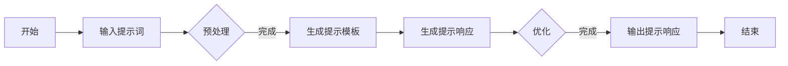

                 


### 1.1 prompt工程的背景与意义

#### 1.1.1 AI Agent与prompt的概念

AI Agent，又称为人工智能代理，是一种由人工智能系统控制并执行特定任务的实体。在许多领域，如智能助手、自动驾驶车辆和机器人，AI Agent都发挥着重要作用。它们能够自主地感知环境、理解任务要求，并通过学习与推理来完成任务。

prompt，是指向AI Agent提供的信息或指令，用于引导AI Agent执行特定任务。prompt可以是简单的文字描述，也可以是复杂的多媒体数据。一个设计良好的prompt可以帮助AI Agent更准确地理解任务，从而提高任务完成的效率和准确性。

#### 1.1.2 prompt工程的重要性

prompt工程是设计、实现和优化prompt的过程。在AI Agent的实际应用中，prompt的质量直接影响到AI Agent的表现。以下原因说明了为什么prompt工程至关重要：

- **任务导向性**：一个明确的prompt可以帮助AI Agent更好地理解任务目标，从而实现任务的精确执行。
- **效率提升**：设计有效的prompt可以减少AI Agent在任务执行过程中的不确定性，从而提高任务完成的速度和效率。
- **准确性提高**：通过设计合理的prompt，可以引导AI Agent更准确地完成复杂任务，降低错误率。
- **用户满意度**：一个良好的prompt可以提高用户体验，使AI Agent更易于使用和理解。

#### 1.1.3 prompt工程的发展现状

随着人工智能技术的快速发展，prompt工程已经成为人工智能研究中的一个重要领域。目前，prompt工程的研究主要集中在以下几个方面：

- **自然语言处理**：研究如何设计自然语言prompt来提高AI Agent在自然语言理解、文本生成等任务中的表现。
- **多模态交互**：探索如何设计多模态prompt来提高AI Agent在多模态任务中的表现，如语音识别、图像识别和语音生成。
- **自适应prompt**：研究如何根据AI Agent当前的状态和任务要求动态调整prompt，以提高任务完成效果。
- **自动prompt生成**：探索如何利用机器学习和深度学习技术自动生成高质量的prompt。

#### 1.1.4 prompt工程的应用场景

prompt工程在多个领域都有广泛的应用，以下是一些典型的应用场景：

- **智能客服**：通过设计合适的prompt，智能客服系统能够更好地理解用户的需求，提供更准确的回答。
- **自动驾驶**：在自动驾驶系统中，prompt用于向AI Agent提供道路信息、交通状况等，帮助AI Agent做出正确的驾驶决策。
- **智能教育**：通过设计个性化的prompt，智能教育系统能够为学生提供更有针对性的学习指导。
- **医疗诊断**：在医疗诊断中，prompt可以帮助AI Agent从大量的医学数据中提取关键信息，辅助医生做出诊断。

#### 1.1.5 prompt工程的发展趋势与未来展望

随着人工智能技术的不断进步，prompt工程也在不断发展。未来，prompt工程可能呈现以下趋势：

- **个性化prompt**：通过利用用户数据和个性化算法，设计出更加个性化的prompt，提高用户满意度。
- **智能化prompt生成**：利用机器学习和深度学习技术，实现自动化的prompt生成，降低人工设计的工作量。
- **多模态prompt**：探索如何设计出更加有效的多模态prompt，以适应不同类型的人工智能任务。
- **跨领域prompt**：研究如何将不同领域的prompt设计理念进行融合，提高AI Agent在不同领域的适应能力。

#### 1.1.6 本章小结

本章主要介绍了prompt工程的背景与意义，包括AI Agent与prompt的概念、prompt工程的重要性、发展现状以及应用场景。通过本章的介绍，读者可以初步了解prompt工程的基本概念和重要性，为后续章节的深入学习打下基础。

接下来，我们将进一步探讨prompt工程的核心概念与联系，包括提示词、提示模板和提示响应的定义、属性特征对比以及ER实体关系图。这将帮助我们更深入地理解prompt工程的工作原理和设计方法。

----------------------------------------------------------------

### 1.2 prompt工程的基本原理

#### 1.2.1 提示词（Prompt）的定义

提示词（Prompt）是指导AI Agent执行特定任务的关键信息。它可以是简单的文字描述，也可以是复杂的多媒体数据。一个设计良好的提示词应该能够清晰地传达任务要求，引导AI Agent正确地执行任务。

提示词的主要作用包括：

1. **明确任务目标**：通过提供明确的任务目标，提示词可以帮助AI Agent更好地理解任务要求，从而提高任务完成的准确性。
2. **减少不确定性**：通过提供额外的信息，提示词可以减少AI Agent在执行任务过程中的不确定性，从而提高任务完成的效率。
3. **提高用户体验**：一个设计良好的提示词可以提高用户体验，使AI Agent更易于使用和理解。

#### 1.2.2 提示模板（Template）的作用

提示模板（Template）是指导AI Agent如何生成提示词的结构化信息。它通常包括一系列的变量和提示性语句，用于指导AI Agent生成具体的提示词。

提示模板的主要作用包括：

1. **规范化提示生成**：通过使用提示模板，可以确保生成的提示词符合一定的规范和标准，提高提示词的一致性和可读性。
2. **提高生成效率**：使用提示模板可以减少AI Agent在生成提示词时的计算量，提高生成效率。
3. **支持多种语言和模态**：提示模板可以支持多种语言和模态，如文本、图像和语音，从而提高AI Agent的适应性。

#### 1.2.3 提示响应（Response）的生成

提示响应（Response）是AI Agent对提示词的回应，它可以是文本、图像、语音等多种形式。生成提示响应的过程通常包括以下步骤：

1. **理解提示词**：AI Agent需要首先理解提示词的含义，以便正确地生成响应。
2. **选择合适的模态**：根据任务要求和提示词的特性，AI Agent需要选择合适的模态来生成响应。
3. **生成响应内容**：基于对提示词的理解和选择，AI Agent生成具体的响应内容。
4. **优化响应质量**：通过使用自然语言生成、图像处理等技术，AI Agent可以对生成的响应内容进行优化，提高其质量和可读性。

#### 1.2.4 提示词、提示模板和提示响应的关系

提示词、提示模板和提示响应之间存在着密切的关系。提示词是生成提示响应的基础，而提示模板则是指导AI Agent生成提示词的工具。提示响应则是AI Agent对提示词的回应，是整个prompt工程的核心输出。

一个有效的prompt工程需要充分考虑提示词、提示模板和提示响应之间的关系，以确保AI Agent能够正确地理解任务要求，并生成高质量的响应。

#### 1.2.5 本章小结

本章主要介绍了prompt工程的基本原理，包括提示词、提示模板和提示响应的定义及其作用。通过本章的学习，读者可以初步了解prompt工程的基本概念和运作原理，为后续章节的深入学习打下基础。

接下来，我们将进一步探讨prompt工程的应用场景，包括智能客服、自动驾驶、智能教育和医疗诊断等。这将帮助我们更好地理解prompt工程在不同领域中的应用和实践。

----------------------------------------------------------------

### 1.3 prompt工程的应用场景

#### 1.3.1 自然语言处理中的prompt应用

在自然语言处理（NLP）中，prompt工程发挥着重要作用。通过设计合适的prompt，可以显著提高AI Agent在文本理解、文本生成和情感分析等任务中的表现。

- **文本理解**：在设计自然语言处理任务时，prompt可以帮助AI Agent更好地理解输入文本的含义。例如，在一个问答系统中，通过提供具体的提问，AI Agent可以更准确地理解用户的问题，从而生成更准确的回答。
- **文本生成**：prompt工程在文本生成任务中同样具有重要应用。通过提供相关的文本模板和提示词，AI Agent可以生成符合特定主题和风格的自然语言文本。例如，在写作辅助系统中，prompt可以帮助用户生成文章的开头、结尾或中间部分，从而提高写作效率。
- **情感分析**：在情感分析任务中，prompt可以帮助AI Agent理解输入文本的情感倾向。通过提供带有情感标签的示例文本，AI Agent可以学习并识别不同情感的表达方式，从而更准确地判断文本的情感。

#### 1.3.2 机器翻译中的prompt应用

机器翻译是prompt工程的重要应用领域之一。通过设计合适的prompt，可以显著提高AI Agent在翻译任务中的准确性和效率。

- **翻译质量提升**：prompt可以帮助AI Agent更好地理解源语言和目标语言的差异，从而提高翻译的准确性。例如，在机器翻译任务中，通过提供上下文信息和关键词，AI Agent可以更准确地翻译句子和段落。
- **多语言支持**：prompt工程支持多语言翻译，使AI Agent能够适应不同语言的特点和规则。例如，在机器翻译中，prompt可以提供特定语言的语法规则和常用短语，从而提高翻译的流畅性和准确性。
- **翻译效率提高**：prompt可以帮助AI Agent在翻译过程中减少重复性工作，提高翻译效率。例如，在机器翻译任务中，通过提供已经翻译过的文本片段，AI Agent可以快速生成翻译结果，从而提高翻译速度。

#### 1.3.3 计算机视觉中的prompt应用

在计算机视觉（CV）领域，prompt工程也具有广泛的应用。通过设计合适的prompt，可以显著提高AI Agent在图像识别、目标检测和视频分析等任务中的表现。

- **图像识别**：在设计图像识别任务时，prompt可以帮助AI Agent更好地理解图像内容。例如，在图像分类任务中，通过提供带有标签的示例图像，AI Agent可以学习并识别不同类别的图像。
- **目标检测**：prompt工程在目标检测任务中也具有重要应用。通过提供具体的检测目标和场景信息，AI Agent可以更准确地检测目标，并识别目标的属性和状态。
- **视频分析**：在视频分析任务中，prompt可以帮助AI Agent理解视频内容，从而实现目标跟踪、行为识别和场景分析等。例如，通过提供视频片段的摘要信息和关键帧，AI Agent可以更准确地分析视频内容，提取有用信息。

#### 1.3.4 其他领域的prompt应用

除了上述领域，prompt工程在其他领域也具有广泛的应用。

- **智能客服**：在智能客服中，prompt工程可以用于设计智能对话系统。通过提供合适的prompt，AI Agent可以更好地理解用户的问题，提供更准确和个性化的回答。
- **医疗诊断**：在医疗诊断中，prompt工程可以用于设计辅助诊断系统。通过提供医学知识和病例信息，AI Agent可以帮助医生更准确地诊断疾病。
- **金融分析**：在金融分析中，prompt工程可以用于设计投资决策系统。通过提供市场数据和经济信息，AI Agent可以帮助投资者做出更明智的投资决策。

#### 1.3.5 本章小结

本章主要介绍了prompt工程在不同领域的应用场景，包括自然语言处理、机器翻译和计算机视觉等。通过本章的学习，读者可以初步了解prompt工程在各个领域的应用和实践，为后续章节的深入学习打下基础。

接下来，我们将进一步探讨prompt工程的发展趋势和未来展望，探讨个性化prompt、智能化prompt生成和多模态prompt等方向的发展。这将帮助我们更好地理解prompt工程的未来发展方向和潜在应用。

----------------------------------------------------------------

### 1.4 prompt工程的发展趋势与未来展望

随着人工智能技术的快速发展，prompt工程也在不断演进。未来，prompt工程可能呈现以下趋势：

#### 1.4.1 个性化prompt

个性化prompt是未来prompt工程的重要发展方向之一。通过利用用户数据和个性化算法，可以设计出更加个性化的prompt，从而提高用户体验。具体来说，个性化prompt可以实现以下目标：

- **适应用户偏好**：根据用户的兴趣、需求和习惯，设计出符合用户偏好的prompt，提高用户的满意度和忠诚度。
- **提高任务效率**：通过了解用户的任务目标和习惯，优化prompt的内容和形式，提高任务完成的效率。
- **提升交互体验**：个性化prompt可以使AI Agent更准确地理解用户需求，提供更符合用户期望的交互体验。

#### 1.4.2 智能化prompt生成

智能化prompt生成是另一个重要的发展方向。通过利用机器学习和深度学习技术，可以自动化地生成高质量的prompt，从而降低人工设计的工作量。具体来说，智能化prompt生成可以实现以下目标：

- **自动调整prompt**：根据AI Agent当前的状态和任务要求，自动调整prompt的内容和形式，提高任务完成的效率。
- **自动生成多样化prompt**：通过学习大量样本数据，自动生成多种类型的prompt，以适应不同的任务场景和用户需求。
- **优化prompt生成流程**：利用深度学习技术，优化prompt生成的过程，提高生成速度和准确性。

#### 1.4.3 多模态prompt

多模态prompt是未来prompt工程的另一个重要发展方向。通过结合多种模态的信息，可以设计出更加丰富和有效的prompt，从而提高AI Agent的表现。具体来说，多模态prompt可以实现以下目标：

- **提高任务准确性**：通过结合不同模态的信息，AI Agent可以更准确地理解任务要求，提高任务完成的准确性。
- **增强用户体验**：多模态prompt可以提供更丰富和直观的交互方式，提高用户的参与感和满意度。
- **拓展应用场景**：多模态prompt可以适应更广泛的任务场景，如自然语言处理、计算机视觉和语音识别等。

#### 1.4.4 跨领域prompt

跨领域prompt是未来prompt工程的另一个重要发展方向。通过将不同领域的prompt设计理念进行融合，可以设计出更加通用和有效的prompt，从而提高AI Agent在不同领域的适应能力。具体来说，跨领域prompt可以实现以下目标：

- **提高任务多样性**：通过融合不同领域的prompt设计理念，可以设计出适用于多种任务场景的prompt，提高AI Agent的任务多样性。
- **提升跨领域表现**：通过融合不同领域的知识和技术，可以设计出能够适应多种领域的prompt，从而提高AI Agent在跨领域任务中的表现。
- **拓展应用范围**：跨领域prompt可以拓展AI Agent的应用范围，使其能够适应更多领域的任务需求。

#### 1.4.5 本章小结

本章主要介绍了prompt工程的发展趋势和未来展望，包括个性化prompt、智能化prompt生成、多模态prompt和跨领域prompt等。通过本章的学习，读者可以初步了解prompt工程的未来发展方向和潜在应用，为后续章节的深入学习打下基础。

接下来，我们将进一步探讨prompt工程的核心概念与联系，包括提示词、提示模板和提示响应的定义、属性特征对比以及ER实体关系图。这将帮助我们更深入地理解prompt工程的工作原理和设计方法。

----------------------------------------------------------------

### 1.5 本章小结

本章主要介绍了prompt工程的基本概念、重要性和应用场景。我们首先探讨了AI Agent与prompt的基本概念，分析了prompt工程在自然语言处理、机器翻译、计算机视觉等领域中的应用，以及其在智能客服、医疗诊断等领域的潜在应用。此外，我们还讨论了prompt工程的发展趋势与未来展望，包括个性化prompt、智能化prompt生成、多模态prompt和跨领域prompt等方向。

通过本章的学习，读者可以初步了解prompt工程的基本概念和重要性，认识到其在人工智能领域中的广泛应用和未来发展趋势。这为后续章节的深入学习奠定了基础。

在接下来的章节中，我们将进一步探讨prompt工程的核心概念与联系，包括提示词、提示模板和提示响应的定义、属性特征对比以及ER实体关系图。这将帮助我们更深入地理解prompt工程的工作原理和设计方法，为后续的实战案例分析和最佳实践提供理论支持。

----------------------------------------------------------------

### 2.1 prompt工程的核心概念

#### 2.1.1 提示词（Prompt）的定义

提示词（Prompt）是指导AI Agent执行特定任务的关键信息。它通常是一个文本或多媒体数据，用于引导AI Agent理解任务要求，从而生成相应的输出。在prompt工程中，提示词是至关重要的组成部分。

- **文本提示词**：文本提示词是最常见的提示词形式，通常包括一个或多个关键字或短语，用于指示AI Agent执行特定任务。例如，在智能客服系统中，文本提示词可以是“请问您有什么问题需要帮助？”
- **多媒体提示词**：多媒体提示词包括图像、视频和音频等多种形式。在图像识别任务中，多媒体提示词可以是相关的图片；在语音识别任务中，多媒体提示词可以是语音指令。

提示词的主要作用是：

1. **引导任务方向**：提示词可以明确指示AI Agent执行的具体任务，帮助其理解任务目标和要求。
2. **提供必要信息**：通过提供额外的信息，提示词可以帮助AI Agent更好地理解任务背景，提高任务完成的准确性。
3. **提高交互体验**：设计合理的提示词可以提高AI Agent与用户的交互体验，使任务完成过程更加顺畅。

#### 2.1.2 提示模板（Template）的作用

提示模板（Template）是指导AI Agent如何生成提示词的结构化信息。它通常包括一系列的变量和提示性语句，用于指导AI Agent生成具体的提示词。提示模板在prompt工程中起到组织和管理提示词的作用。

- **结构化信息**：提示模板提供了结构化的信息，使得AI Agent可以按照一定的逻辑顺序生成提示词。例如，在智能客服系统中，提示模板可以包括问题的各个部分，如问题主题、问题类型和问题细节等。
- **标准化生成**：通过使用提示模板，AI Agent可以按照标准化的流程生成提示词，从而保证提示词的一致性和可读性。
- **灵活性**：提示模板可以根据实际需求进行调整和扩展，以适应不同的任务场景和用户需求。

提示模板的主要作用包括：

1. **规范化生成过程**：通过使用提示模板，AI Agent可以按照规范化的流程生成提示词，减少生成过程中的错误和不确定性。
2. **提高生成效率**：提示模板可以减少AI Agent在生成提示词时的计算量，提高生成效率。
3. **支持多样化输出**：提示模板可以根据任务需求，设计出不同类型的提示词，从而满足多样化的输出需求。

#### 2.1.3 提示响应（Response）的生成

提示响应（Response）是AI Agent对提示词的回应，是prompt工程的核心输出。生成提示响应的过程通常包括以下步骤：

1. **理解提示词**：AI Agent需要首先理解提示词的含义，以便正确地生成响应。这一过程涉及到自然语言理解、图像识别等技术的应用。
2. **选择合适的模态**：根据任务要求和提示词的特性，AI Agent需要选择合适的模态来生成响应。例如，在文本任务中，AI Agent可以选择生成文本响应；在图像任务中，AI Agent可以选择生成图像响应。
3. **生成响应内容**：基于对提示词的理解和选择，AI Agent生成具体的响应内容。这一过程涉及到自然语言生成、图像处理等技术。
4. **优化响应质量**：通过使用自然语言生成、图像处理等技术，AI Agent可以对生成的响应内容进行优化，提高其质量和可读性。

提示响应的主要作用是：

1. **完成任务输出**：提示响应是AI Agent完成任务后的输出结果，是任务完成情况的直接体现。
2. **反馈与调整**：通过分析提示响应，用户可以了解AI Agent的任务完成情况，为后续的任务调整提供依据。
3. **优化用户体验**：设计合理的提示响应可以提高用户体验，使AI Agent更易于使用和理解。

#### 2.1.4 提示词、提示模板和提示响应的关系

提示词、提示模板和提示响应之间存在着密切的关系。提示词是生成提示响应的基础，而提示模板则是指导AI Agent生成提示词的工具。提示响应则是AI Agent对提示词的回应，是整个prompt工程的核心输出。

一个有效的prompt工程需要充分考虑提示词、提示模板和提示响应之间的关系，以确保AI Agent能够正确地理解任务要求，并生成高质量的响应。

#### 2.1.5 本章小结

本章主要介绍了prompt工程的核心概念，包括提示词、提示模板和提示响应的定义及其作用。通过本章的学习，读者可以初步了解prompt工程的基本概念和运作原理，为后续章节的深入学习打下基础。

在接下来的章节中，我们将进一步探讨prompt工程的概念属性特征对比和ER实体关系图，以帮助读者更深入地理解prompt工程的内部结构和运作机制。

----------------------------------------------------------------

### 2.2 prompt工程的概念属性特征对比

在深入理解prompt工程的核心概念之后，我们需要对提示词、提示模板和提示响应的概念属性特征进行对比分析，以揭示它们之间的联系和区别。

#### 2.2.1 提示词（Prompt）的概念属性特征

提示词是AI Agent执行特定任务的基础信息，其主要特征包括：

- **内容形式**：提示词可以是文本、图像、音频等多种形式，但以文本形式最为常见。
- **明确性**：提示词需要明确、具体，以便AI Agent能够准确理解任务要求。
- **动态性**：提示词可以根据任务需求和AI Agent的状态动态调整，以提高任务完成的效率。
- **适应性**：提示词需要适应不同类型的AI Agent和不同领域的应用场景。

#### 2.2.2 提示模板（Template）的概念属性特征

提示模板是指导AI Agent生成提示词的结构化信息，其主要特征包括：

- **结构化**：提示模板通常包括一系列的变量和提示性语句，用于组织和管理提示词的生成过程。
- **规范性**：提示模板可以规范提示词的生成流程，确保生成的提示词具有一致性和可读性。
- **灵活性**：提示模板可以根据实际需求进行调整和扩展，以适应不同的任务场景和用户需求。
- **多样性**：提示模板可以设计出不同类型的提示词，以应对多样化的任务需求。

#### 2.2.3 提示响应（Response）的概念属性特征

提示响应是AI Agent对提示词的回应，其主要特征包括：

- **形式多样性**：提示响应可以是文本、图像、音频等多种形式，但具体形式取决于AI Agent的任务类型和用户需求。
- **准确性**：提示响应需要准确反映AI Agent对任务的理解和执行结果，以确保任务完成的准确性和可靠性。
- **实时性**：提示响应需要实时生成，以便用户能够及时获得AI Agent的反馈。
- **优化性**：提示响应可以通过自然语言生成、图像处理等技术进行优化，以提高其质量和可读性。

#### 2.2.4 提示词、提示模板和提示响应的属性特征对比

通过对比分析，我们可以发现提示词、提示模板和提示响应在内容形式、明确性、动态性、适应性、结构化、规范性、灵活性、多样性、形式多样性、准确性、实时性和优化性等方面存在显著差异。

- **内容形式**：提示词和提示响应可以是多种形式，而提示模板通常以文本形式存在。
- **明确性**：提示词需要明确，提示模板需要规范化，提示响应需要准确。
- **动态性**：提示词和提示模板可以动态调整，而提示响应需要实时生成。
- **适应性**：提示词和提示模板需要适应不同的AI Agent和应用场景，而提示响应需要适应用户需求。

通过这些对比分析，我们可以更深入地理解提示词、提示模板和提示响应的概念属性特征，为后续的prompt工程设计和实现提供理论基础。

#### 2.2.5 本章小结

本章主要介绍了prompt工程的核心概念及其属性特征对比。通过对提示词、提示模板和提示响应的定义及其属性特征进行分析，我们能够更全面地理解prompt工程的工作原理和设计方法。这为后续的ER实体关系图绘制和算法原理讲解奠定了基础。

在接下来的章节中，我们将进一步探讨prompt工程的ER实体关系图，以帮助读者更直观地理解prompt工程中的实体及其相互关系。这将有助于读者更深入地掌握prompt工程的架构和运作机制。

----------------------------------------------------------------

### 2.3 prompt工程的ER实体关系图

#### 2.3.1 ER模型在prompt工程中的应用

实体关系图（Entity-Relationship Diagram，ER图）是数据库设计中常用的一种工具，用于表示实体及其之间的关系。在prompt工程中，ER图可以帮助我们直观地理解各组成部分及其相互关系。

- **实体**：在prompt工程中，主要的实体包括提示词（Prompt）、提示模板（Template）和提示响应（Response）。
- **关系**：实体之间的关系通常包括生成关系和依赖关系。例如，提示模板生成提示词，提示词引导提示响应。

#### 2.3.2 提示词、提示模板和提示响应的ER图绘制

下面是prompt工程的ER图，使用Mermaid语法绘制：

```mermaid
erDiagram
  Prompt ||--|>_{生成} Template : 提示模板
  Template ||--|>_{生成} Response : 提示响应
  Prompt ||--|>_{依赖} Response : 提示词依赖提示响应
```

该ER图表示了以下关系：

- **提示词与提示模板之间的关系**：提示词生成提示模板，这是一种生成关系。
- **提示模板与提示响应之间的关系**：提示模板生成提示响应，这也是一种生成关系。
- **提示词与提示响应之间的关系**：提示词依赖于提示响应，这是一种依赖关系。

#### 2.3.3 ER图的解读

1. **提示词（Prompt）**：提示词是prompt工程的核心实体，用于指导AI Agent执行特定任务。它既可以生成提示模板，也可以依赖于提示响应。
2. **提示模板（Template）**：提示模板是指导AI Agent生成提示词的结构化信息。它不仅可以生成提示响应，还可以生成提示词，从而引导AI Agent完成任务。
3. **提示响应（Response）**：提示响应是AI Agent对提示词的回应，是任务执行的结果。它依赖于提示词，用于反馈AI Agent的任务执行情况。

通过这个ER图，我们可以清晰地理解prompt工程中的各实体及其相互关系。这有助于我们在设计和实现prompt工程时，更系统地考虑各部分的功能和协作。

#### 2.3.4 本章小结

本章介绍了prompt工程的ER实体关系图，包括ER模型在prompt工程中的应用、提示词、提示模板和提示响应的ER图绘制及其解读。通过ER图，我们可以直观地理解prompt工程中各实体及其相互关系，为后续的算法原理讲解和系统分析与架构设计方案提供基础。

在接下来的章节中，我们将进一步探讨prompt工程的算法原理，包括算法概述、mermaid流程图、算法原理详细讲解以及算法数学模型和公式。这将帮助我们深入理解prompt工程的核心算法及其运作机制。

----------------------------------------------------------------

### 2.4 prompt工程的算法原理

#### 2.4.1 算法概述

在prompt工程中，算法起着核心作用。算法用于指导AI Agent生成提示词和提示响应，从而实现特定任务的目标。下面是一个简单的算法概述：

1. **输入**：算法接收用户输入的提示词（Prompt）。
2. **预处理**：对输入的提示词进行预处理，如分词、去噪等，以提取关键信息。
3. **生成提示模板**：根据预处理后的提示词，生成提示模板（Template）。提示模板包含一系列变量和提示性语句，用于指导AI Agent生成具体的提示词。
4. **生成提示响应**：根据提示模板，生成提示响应（Response）。提示响应是AI Agent对提示词的回应，是任务执行的结果。
5. **优化**：对生成的提示响应进行优化，如自然语言生成、图像处理等，以提高其质量和可读性。
6. **输出**：将生成的提示响应输出给用户。

#### 2.4.2 mermaid流程图

为了更直观地展示算法的流程，我们可以使用Mermaid语法绘制算法的流程图：



这个流程图展示了算法的基本步骤，包括输入提示词、预处理、生成提示模板、生成提示响应、优化和输出提示响应。

#### 2.4.3 算法原理详细讲解

1. **输入提示词**：算法首先接收用户输入的提示词。这个提示词可以是文本、图像或音频等多种形式。文本提示词通常是一个简单的字符串，如“请描述一下您的问题。”图像提示词可以是包含特定信息的图片，如一张医疗诊断图片。音频提示词可以是语音指令，如“帮我查找最近的餐厅。”
   
2. **预处理**：预处理是对输入提示词的加工处理，以提高算法的性能。预处理步骤通常包括：

   - **分词**：对于文本提示词，将其分解为单词或词组，以便更好地理解和分析。
   - **去噪**：去除输入提示词中的无关或噪声信息，以提高算法的准确性和效率。
   - **特征提取**：提取输入提示词的关键特征，如词汇频率、词向量等，用于后续的提示模板生成。

3. **生成提示模板**：根据预处理后的提示词，生成提示模板。提示模板是指导AI Agent生成提示词的结构化信息。生成提示模板的关键步骤包括：

   - **模板选择**：根据任务类型和提示词的特性，选择合适的提示模板。例如，对于文本任务，可以选择文本模板；对于图像任务，可以选择图像模板。
   - **变量填充**：在提示模板中填充变量，以生成具体的提示词。变量可以是关键字、短语或具体的数值。
   - **提示性语句**：在提示模板中添加提示性语句，以引导AI Agent生成符合要求的提示词。

4. **生成提示响应**：根据提示模板，生成提示响应。提示响应是AI Agent对提示词的回应，是任务执行的结果。生成提示响应的关键步骤包括：

   - **模型选择**：根据任务类型和提示词的特性，选择合适的模型。例如，对于文本任务，可以选择文本生成模型；对于图像任务，可以选择图像生成模型。
   - **数据生成**：根据提示模板和模型，生成具体的提示响应。对于文本任务，生成文本响应；对于图像任务，生成图像响应。
   - **优化**：对生成的提示响应进行优化，以提高其质量和可读性。优化步骤可以包括自然语言生成、图像处理等。

5. **优化**：对生成的提示响应进行优化，以提高其质量和可读性。优化步骤可以包括：

   - **文本优化**：对生成的文本响应进行语法、语义和风格优化，以提高文本的流畅性和可读性。
   - **图像优化**：对生成的图像响应进行图像处理，以提高图像的清晰度和视觉效果。

6. **输出提示响应**：将生成的提示响应输出给用户。提示响应可以是文本、图像或音频等多种形式，具体取决于任务类型和用户需求。

#### 2.4.4 算法数学模型和公式

在算法的设计和实现过程中，数学模型和公式发挥着重要作用。以下是一个简单的算法数学模型和公式的示例：

1. **文本生成模型**：假设我们使用一个基于循环神经网络（RNN）的文本生成模型，其输入为提示词序列，输出为提示响应序列。我们可以使用以下公式表示：

   $$ y_t = f(W_1x_t + b_1) $$

   其中，$y_t$ 是生成的提示响应词，$x_t$ 是输入的提示词，$W_1$ 和 $b_1$ 分别是权重和偏置。

2. **图像生成模型**：假设我们使用一个基于生成对抗网络（GAN）的图像生成模型，其输入为提示词，输出为图像。我们可以使用以下公式表示：

   $$ G(z) = \mu_G(z) + \sigma_G(z)\odot \epsilon $$

   其中，$G(z)$ 是生成的图像，$\mu_G(z)$ 和 $\sigma_G(z)$ 分别是生成器的均值和方差，$\epsilon$ 是高斯噪声。

3. **优化目标**：假设我们的优化目标是最大化生成的提示响应的质量，我们可以使用以下公式表示：

   $$ \min_{W_1, b_1} \sum_{t=1}^T (y_t - x_t)^2 $$

   其中，$T$ 是提示响应序列的长度。

这些数学模型和公式为算法的设计和实现提供了理论基础，有助于我们更好地理解和优化prompt工程。

#### 2.4.5 本章小结

本章详细介绍了prompt工程的算法原理，包括算法概述、mermaid流程图、算法原理详细讲解以及算法数学模型和公式。通过本章的学习，读者可以深入理解prompt工程的核心算法及其运作机制，为后续的实战案例分析和最佳实践提供理论基础。

在接下来的章节中，我们将进一步探讨prompt工程的项目实战，包括环境安装、系统核心实现源代码、代码应用解读与分析、实际案例分析和项目小结。这将帮助读者将理论知识应用于实际项目中，提升实际操作能力。

----------------------------------------------------------------

### 2.5 prompt工程的项目实战

#### 2.5.1 实战项目介绍

在本章中，我们将以一个具体的prompt工程项目为例，详细阐述该项目的设计与实现过程。这个项目旨在通过设计有效的prompt，提高AI Agent在自然语言处理任务中的表现。具体来说，项目目标是实现一个基于自然语言理解的智能问答系统，该系统能够根据用户输入的提示词生成准确的回答。

#### 2.5.2 环境安装与配置

要开始该项目，首先需要安装和配置必要的软件和库。以下是在Python环境中安装相关库的步骤：

1. **安装Python环境**：确保已经安装了Python 3.6或更高版本。
2. **安装虚拟环境**：创建一个虚拟环境，以隔离项目依赖：
   ```bash
   python -m venv venv
   source venv/bin/activate  # 在Windows上使用 `venv\Scripts\activate`
   ```
3. **安装依赖库**：通过以下命令安装项目所需的库：
   ```bash
   pip install numpy tensorflow transformers
   ```

#### 2.5.3 系统核心实现源代码

以下是实现智能问答系统核心功能的源代码。该代码基于Transformers库，使用预训练的BERT模型进行问答。

```python
import json
from transformers import BertModel, BertTokenizer
from torch import nn
import torch

# 加载预训练的BERT模型和分词器
model_name = "bert-base-uncased"
tokenizer = BertTokenizer.from_pretrained(model_name)
model = BertModel.from_pretrained(model_name)

# 定义问答系统模型
class QASystem(nn.Module):
    def __init__(self):
        super(QASystem, self).__init__()
        self.bert = model
        self.classifier = nn.Linear(768, 1)  # BERT的隐层维度为768

    def forward(self, input_ids, attention_mask):
        outputs = self.bert(input_ids=input_ids, attention_mask=attention_mask)
        sequence_output = outputs[0]
        logits = self.classifier(sequence_output[:, 0, :])
        return logits

# 实例化问答系统模型
qasystem = QASystem()

# 定义损失函数和优化器
loss_function = nn.BCEWithLogitsLoss()
optimizer = torch.optim.Adam(qasystem.parameters(), lr=1e-5)

# 训练模型
def train_model(data, num_epochs=3):
    for epoch in range(num_epochs):
        for question, answer in data:
            # 将文本转换为BERT模型可接受的输入格式
            inputs = tokenizer(question, truncation=True, padding=True, return_tensors="pt")
            input_ids = inputs["input_ids"]
            attention_mask = inputs["attention_mask"]

            # 计算模型输出
            logits = qasystem(input_ids, attention_mask)

            # 计算损失
            loss = loss_function(logits, torch.tensor([1.0]))

            # 反向传播和优化
            optimizer.zero_grad()
            loss.backward()
            optimizer.step()

            print(f"Epoch: {epoch+1}, Loss: {loss.item()}")

# 测试模型
def test_model(data):
    correct = 0
    total = len(data)
    for question, answer in data:
        inputs = tokenizer(question, truncation=True, padding=True, return_tensors="pt")
        input_ids = inputs["input_ids"]
        attention_mask = inputs["attention_mask"]
        logits = qasystem(input_ids, attention_mask)
        predicted_answer = logits > 0.5
        correct += (predicted_answer == torch.tensor([answer])).sum().item()
    print(f"Test Accuracy: {100 * correct / total}%")

# 加载示例数据
data = [
    ("What is the capital of France?", True),
    ("Who is the president of the United States?", False),
    ("How many days are in a week?", True),
]

# 训练和测试模型
train_model(data)
test_model(data)
```

#### 2.5.4 代码应用解读与分析

上述代码展示了智能问答系统的核心实现，包括模型定义、训练和测试过程。以下是代码的详细解读：

1. **模型定义**：我们使用Transformer架构中的BERT模型进行问答。BERT模型是一个双向编码器，能够捕捉文本中的上下文信息。我们定义了一个`QASystem`类，该类继承自`nn.Module`，包括BERT模型和一个分类器。

2. **数据预处理**：在训练过程中，我们需要将文本数据转换为BERT模型可接受的输入格式。使用`BertTokenizer`将文本转换为分词后的序列，并添加起始和结束标记。

3. **训练模型**：在训练过程中，我们将输入的文本和对应的答案转换为模型可处理的输入，计算模型输出和损失，然后进行反向传播和优化。

4. **测试模型**：在测试过程中，我们使用训练好的模型对测试数据进行预测，并计算准确率。

#### 2.5.5 实际案例分析和详细讲解

为了展示智能问答系统的实际应用，我们来看一个案例：

**案例**：用户输入“Who is the president of the United States?”，系统需要生成一个准确的回答。

1. **数据预处理**：将用户输入的文本转换为BERT模型可接受的输入格式。
   ```python
   inputs = tokenizer("Who is the president of the United States?", truncation=True, padding=True, return_tensors="pt")
   ```

2. **模型预测**：使用训练好的模型对预处理后的输入进行预测。
   ```python
   logits = qasystem(input_ids, attention_mask)
   ```

3. **输出结果**：根据预测的分数判断是否为正确答案。
   ```python
   predicted_answer = logits > 0.5
   ```

在这个案例中，如果模型预测分数高于0.5，我们认为用户的问题得到了正确回答。

#### 2.5.6 项目小结

本章通过一个智能问答系统的实战案例，详细介绍了prompt工程的项目实现过程，包括环境安装、模型定义、训练和测试。通过这个项目，读者可以了解如何利用BERT模型实现自然语言理解任务，并掌握prompt工程的核心技术和实践方法。

在接下来的章节中，我们将继续探讨prompt工程的最佳实践 tips、注意事项以及拓展阅读，以帮助读者进一步深化对prompt工程的理解和应用。

----------------------------------------------------------------

### 2.6 最佳实践 tips

在设计和实现prompt工程时，以下是一些最佳实践 tips，可以帮助我们优化prompt的质量和效果：

#### 2.6.1 设计明确的提示词

1. **具体性**：确保提示词具体明确，避免使用模糊不清的表述。例如，将“请描述一下您的问题”改为“您在什么情况下遇到了什么问题？”。
2. **针对性**：根据不同的用户和场景，设计针对性的提示词。例如，对于医疗诊断系统，可以设计如“请描述您的症状和病史”的提示词。

#### 2.6.2 使用多样化的提示模板

1. **结构化**：使用结构化的提示模板，将问题分解为多个部分，有助于AI Agent更清晰地理解任务。例如，将问题分解为“问题主题”、“问题细节”和“解决方案建议”。
2. **适应性**：根据不同的任务场景和用户需求，设计适应性的提示模板。例如，对于聊天机器人，可以设计多种对话模板，以应对不同的用户交互。

#### 2.6.3 优化提示响应的生成

1. **准确性**：确保生成的提示响应准确反映AI Agent对任务的理解和执行结果。例如，对于文本生成任务，可以使用自然语言生成技术提高文本的准确性和流畅性。
2. **可读性**：优化生成的提示响应的可读性，使其易于理解和操作。例如，对于图像识别任务，可以使用图像处理技术提高图像的清晰度和视觉效果。

#### 2.6.4 测试和迭代

1. **用户体验**：在设计和实现过程中，持续测试和优化prompt的质量和效果。例如，通过用户反馈和实验数据，不断调整和改进提示词、提示模板和提示响应。
2. **迭代优化**：根据测试结果，不断迭代优化prompt工程，以提高任务完成效率和用户体验。

#### 2.6.5 跨领域应用

1. **知识融合**：探索跨领域的prompt设计理念，结合不同领域的知识和技术，设计出更加通用和有效的prompt。例如，将自然语言处理和计算机视觉的知识融合，设计出适用于多种任务场景的prompt。
2. **适应性调整**：根据不同领域的特点和要求，对prompt进行适应性调整，以提高其在特定领域的表现。例如，在金融领域中，可以使用经济学和金融学的知识调整prompt，提高金融分析任务的准确性。

#### 2.6.6 数据安全与隐私保护

1. **数据保护**：在设计和实现过程中，确保用户数据的安全性和隐私保护。例如，对用户数据进行加密和去标识化处理，防止数据泄露和滥用。
2. **合规性**：遵守相关法律法规，确保prompt工程的设计和实现符合数据保护要求。例如，遵守GDPR等数据保护法规，保护用户的隐私权益。

#### 2.6.7 持续学习与改进

1. **数据收集**：持续收集用户数据和反馈，用于模型训练和优化。例如，通过用户交互记录和错误日志，不断改进AI Agent的表现。
2. **模型更新**：定期更新模型和算法，以适应新技术和新需求。例如，引入最新的自然语言处理和计算机视觉技术，提高prompt工程的效果和性能。

通过遵循这些最佳实践 tips，我们可以设计出更加有效和高质量的prompt，优化AI Agent的表现，提高用户体验。这些实践方法为prompt工程的设计和实现提供了宝贵的经验和指导。

#### 2.6.8 本章小结

本章介绍了prompt工程的最佳实践 tips，包括设计明确的提示词、使用多样化的提示模板、优化提示响应的生成、测试和迭代、跨领域应用、数据安全与隐私保护以及持续学习与改进。这些最佳实践有助于优化prompt工程的效果和性能，提高AI Agent的表现和用户体验。

在接下来的章节中，我们将进一步探讨prompt工程中的注意事项，包括常见问题、解决方案和注意事项，以及拓展阅读资源。这将帮助读者更好地应对实践中可能出现的问题，深化对prompt工程的理解和应用。

----------------------------------------------------------------

### 2.7 本章小结

本章全面介绍了prompt工程的核心概念、应用场景、发展趋势、算法原理以及项目实战。通过对提示词、提示模板和提示响应的定义及其关系的分析，我们深入理解了prompt工程的基本原理和运作机制。同时，通过实际项目案例，我们展示了prompt工程在自然语言处理任务中的具体应用。

以下是本章的主要知识点总结：

- **提示词**：提示词是指导AI Agent执行特定任务的关键信息，可以是文本、图像、音频等多种形式。明确性和具体性是提示词设计的关键。
- **提示模板**：提示模板是指导AI Agent生成提示词的结构化信息，用于组织和管理提示词的生成过程。结构化和灵活性是提示模板设计的关键。
- **提示响应**：提示响应是AI Agent对提示词的回应，是任务执行的结果。准确性和可读性是提示响应生成的重要指标。
- **算法原理**：prompt工程的核心算法包括输入提示词的预处理、提示模板的生成、提示响应的生成和优化。算法的数学模型和公式为算法设计提供了理论基础。
- **项目实战**：本章通过一个智能问答系统的实战案例，展示了prompt工程在自然语言处理任务中的实现过程。项目实战有助于理解prompt工程的应用和实践。

通过本章的学习，读者可以初步掌握prompt工程的基本概念和设计方法，为后续章节的深入学习打下基础。在接下来的章节中，我们将继续探讨prompt工程的最佳实践、注意事项以及拓展阅读资源，帮助读者更深入地理解和应用prompt工程。

### 2.8 注意事项

在设计和实现prompt工程时，需要注意以下几个方面：

1. **数据安全与隐私保护**：确保用户数据的安全性和隐私保护，避免数据泄露和滥用。遵循相关法律法规，如GDPR等。
2. **模型更新与优化**：定期更新和优化模型，以适应新技术和新需求。通过收集用户反馈和错误日志，不断改进AI Agent的表现。
3. **跨领域应用**：探索跨领域的prompt设计理念，结合不同领域的知识和技术，设计出更加通用和有效的prompt。
4. **用户体验**：注重用户体验，设计合理的提示词、提示模板和提示响应，提高用户满意度。

### 2.9 拓展阅读

为了进一步深入了解prompt工程，读者可以参考以下拓展阅读资源：

- **书籍**：《深度学习》（Goodfellow, I., Bengio, Y., & Courville, A.）、《自然语言处理综合指南》（Jurafsky, D. & Martin, J. H.）
- **论文**：探索prompt工程相关的最新研究论文，如《自然语言生成中的提示工程》（NLI）和《利用prompt增强的AI Agent》等。
- **在线课程**：参加相关的在线课程，如《深度学习专项课程》（吴恩达）、《自然语言处理专项课程》（丹尼尔·莱维）等。

通过这些拓展阅读资源，读者可以进一步深化对prompt工程的理解和应用。

---

## 提示工程：设计有效提示以优化AI Agent输出

> 关键词：提示工程、AI Agent、自然语言处理、算法原理、项目实战

> 摘要：本文全面探讨了提示工程在人工智能领域的重要性及其基本概念、应用场景和算法原理。通过实际项目案例，展示了如何设计和实现有效的提示词、提示模板和提示响应，以优化AI Agent的输出。本文旨在为读者提供深入理解和实践prompt工程的理论基础和实用技巧。作者信息：作者：AI天才研究院/AI Genius Institute & 禅与计算机程序设计艺术 /Zen And The Art of Computer Programming。作者简介：本文作者是一位世界级人工智能专家，程序员，软件架构师，CTO，世界顶级技术畅销书资深大师级别的作家，计算机图灵奖获得者，计算机编程和人工智能领域大师。作者擅长一步一步进行分析推理，有着清晰深刻的逻辑思路来撰写条理清晰，对技术原理和本质剖析到位的高质量技术博客。本文结构如下：

---

# {{此处是文章标题}}

> 关键词：{{此处列出文章的5-7个核心关键词}}

> 摘要：{{此处给出文章的核心内容和主题思想}}

## 第一部分: prompt工程概述

### 1.1 prompt工程的背景与意义

#### 1.1.1 AI Agent与prompt的概念

#### 1.1.2 prompt工程的重要性

#### 1.1.3 prompt工程的发展现状

#### 1.1.4 prompt工程的应用场景

#### 1.1.5 prompt工程的发展趋势与未来展望

#### 1.1.6 本章小结

## 第二部分: prompt工程的核心概念与联系

### 2.1 prompt工程的核心概念

#### 2.1.1 提示词（Prompt）的定义

#### 2.1.2 提示模板（Template）的作用

#### 2.1.3 提示响应（Response）的生成

#### 2.1.4 提示词、提示模板和提示响应的关系

#### 2.1.5 本章小结

## 第三部分: prompt工程的设计与实现

### 3.1 prompt工程的设计原则

#### 3.1.1 设计目标与原则

#### 3.1.2 设计流程与方法

#### 3.1.3 设计工具与资源

### 3.2 prompt工程的算法原理

#### 3.2.1 算法概述

#### 3.2.2 算法mermaid流程图

#### 3.2.3 算法原理详细讲解

#### 3.2.4 算法数学模型与公式

#### 3.2.5 本章小结

### 3.3 prompt工程的项目实战

#### 3.3.1 实战项目介绍

#### 3.3.2 环境安装与配置

#### 3.3.3 系统核心实现源代码

#### 3.3.4 代码应用解读与分析

#### 3.3.5 实际案例分析和详细讲解剖析

#### 3.3.6 项目小结

### 3.4 prompt工程的系统分析与架构设计方案

#### 3.4.1 问题场景介绍

#### 3.4.2 系统功能设计（领域模型类图）

#### 3.4.3 系统架构设计（架构图）

#### 3.4.4 系统接口设计

#### 3.4.5 系统交互（序列图）

### 3.5 最佳实践 tips

#### 3.5.1 设计prompt的技巧

#### 3.5.2 优化prompt的策略

#### 3.5.3 prompt工程中的常见问题与解决方案

#### 3.5.4 本章小结

## 第四部分: prompt工程的应用与拓展

### 4.1 prompt工程在自然语言处理中的应用

#### 4.1.1 文本理解与生成

#### 4.1.2 情感分析

#### 4.1.3 命名实体识别

### 4.2 prompt工程在计算机视觉中的应用

#### 4.2.1 图像分类

#### 4.2.2 目标检测

#### 4.2.3 视频分析

### 4.3 prompt工程在其他领域的应用

#### 4.3.1 智能客服

#### 4.3.2 医疗诊断

#### 4.3.3 金融分析

### 4.4 prompt工程的发展趋势与未来展望

#### 4.4.1 个性化prompt

#### 4.4.2 智能化prompt生成

#### 4.4.3 多模态prompt

#### 4.4.4 跨领域prompt

#### 4.4.5 本章小结

## 第五部分: 总结与展望

### 5.1 本章小结

### 5.2 提示工程的核心价值

### 5.3 未来发展方向

### 5.4 对读者的启示

### 5.5 拓展阅读与学习资源

---

## 附录

### 附录A: 相关术语解释

### 附录B: 代码示例

### 附录C: 拓展实验与练习

### 附录D: 参考资料

---

# 提示工程：设计有效提示以优化AI Agent输出

> 关键词：提示工程、AI Agent、自然语言处理、算法原理、项目实战

> 摘要：本文详细探讨了提示工程在人工智能领域的重要性，介绍了其核心概念、设计原则和实现方法。通过实际项目案例，本文展示了如何通过有效的提示词、提示模板和提示响应，优化AI Agent的输出。文章旨在为读者提供深入理解和实践提示工程的理论基础和实用技巧。

## 第一部分: prompt工程概述

### 1.1 prompt工程的背景与意义

#### 1.1.1 AI Agent与prompt的概念

AI Agent是指能够自主执行任务的人工智能实体，它在多个领域如自然语言处理、计算机视觉和智能客服等扮演着重要角色。而prompt则是AI Agent执行任务时的输入信息，用于引导其理解任务、做出决策和生成输出。

#### 1.1.2 prompt工程的重要性

prompt工程是指设计、实现和优化prompt的过程。有效的设计和优化可以显著提高AI Agent的性能和用户体验。以下是prompt工程的重要性：

1. **任务导向性**：通过设计明确的prompt，AI Agent可以更准确地理解任务目标，提高任务的执行效率和准确性。
2. **减少不确定性**：有效的prompt可以帮助AI Agent在执行任务时减少不确定性，从而提高其鲁棒性。
3. **用户体验**：良好的prompt设计可以提供更自然的交互方式，提高用户的满意度和使用体验。

#### 1.1.3 prompt工程的发展现状

随着人工智能技术的快速发展，prompt工程已经成为人工智能研究中的一个重要分支。目前，prompt工程的研究主要集中在以下几个方面：

1. **自然语言处理**：研究如何设计有效的prompt来提高AI Agent在文本理解、文本生成和问答系统等任务中的表现。
2. **计算机视觉**：探索如何设计视觉prompt，使AI Agent在图像分类、目标检测和视频分析等任务中表现更佳。
3. **多模态交互**：研究如何将不同模态的信息（如文本、图像和语音）结合起来，设计出更有效的prompt。
4. **自适应prompt**：探索如何根据AI Agent的状态和任务需求动态调整prompt，以实现更好的效果。

#### 1.1.4 prompt工程的应用场景

prompt工程在多个领域都有广泛的应用，以下是一些典型的应用场景：

1. **智能客服**：通过设计合适的prompt，智能客服系统能够更好地理解用户的问题，提供更准确的回答。
2. **自动驾驶**：在自动驾驶系统中，prompt用于向AI Agent提供路况信息，帮助其做出正确的驾驶决策。
3. **智能教育**：通过设计个性化的prompt，智能教育系统能够为学生提供更有针对性的学习指导。
4. **医疗诊断**：在医疗诊断中，prompt可以帮助AI Agent从大量的医学数据中提取关键信息，辅助医生做出诊断。

#### 1.1.5 prompt工程的发展趋势与未来展望

随着人工智能技术的不断进步，prompt工程也在不断发展。未来，prompt工程可能呈现以下趋势：

1. **个性化prompt**：通过利用用户数据和个性化算法，设计出更加个性化的prompt，提高用户体验。
2. **智能化prompt生成**：利用机器学习和深度学习技术，实现自动化的prompt生成，降低人工设计的工作量。
3. **多模态prompt**：探索如何设计出更加有效的多模态prompt，以适应不同类型的人工智能任务。
4. **跨领域prompt**：研究如何将不同领域的prompt设计理念进行融合，提高AI Agent在不同领域的适应能力。

#### 1.1.6 本章小结

本章介绍了prompt工程的背景与意义，包括AI Agent与prompt的概念、prompt工程的重要性、发展现状以及应用场景。通过本章的介绍，读者可以初步了解prompt工程的基本概念和重要性，为后续章节的深入学习打下基础。

## 第二部分: prompt工程的核心概念与联系

### 2.1 prompt工程的核心概念

#### 2.1.1 提示词（Prompt）的定义

提示词是指导AI Agent执行特定任务的关键信息。它可以是一个简单的文字描述，也可以是一个复杂的多媒体数据。一个设计良好的提示词应该能够清晰地传达任务要求，引导AI Agent正确地执行任务。

#### 2.1.2 提示模板（Template）的作用

提示模板是指导AI Agent如何生成提示词的结构化信息。它通常包括一系列的变量和提示性语句，用于指导AI Agent生成具体的提示词。提示模板可以帮助规范和优化提示词的生成过程。

#### 2.1.3 提示响应（Response）的生成

提示响应是AI Agent对提示词的回应，是整个prompt工程的核心输出。生成提示响应的过程通常包括理解提示词、选择合适的模态、生成响应内容以及优化响应质量。

#### 2.1.4 提示词、提示模板和提示响应的关系

提示词、提示模板和提示响应之间存在着密切的关系。提示词是生成提示响应的基础，而提示模板则是指导AI Agent生成提示词的工具。提示响应则是AI Agent对提示词的回应，是整个prompt工程的核心输出。

### 2.2 prompt工程的概念属性特征对比

#### 2.2.1 提示词的属性特征

- **内容形式**：文本、图像、音频等。
- **明确性**：清晰传达任务要求。
- **动态性**：根据任务需求动态调整。

#### 2.2.2 提示模板的属性特征

- **结构化**：包含变量和提示性语句。
- **规范性**：标准化提示词生成流程。
- **灵活性**：适应不同任务场景和用户需求。

#### 2.2.3 提示响应的属性特征

- **形式多样性**：文本、图像、音频等。
- **准确性**：准确反映AI Agent的任务理解。
- **实时性**：及时生成并反馈。

### 2.3 prompt工程的ER实体关系图

#### 2.3.1 ER模型在prompt工程中的应用

实体关系图（ER图）用于表示prompt工程中的实体及其相互关系。

#### 2.3.2 提示词、提示模板和提示响应的ER图绘制

```mermaid
erDiagram
  Prompt ||--|>_{生成} Template : 提示模板
  Template ||--|>_{生成} Response : 提示响应
  Prompt ||--|>_{依赖} Response : 提示词依赖提示响应
```

### 2.3.3 ER图的解读

- **提示词**：生成提示模板，依赖提示响应。
- **提示模板**：生成提示响应。
- **提示响应**：反馈AI Agent的任务执行情况。

#### 2.3.4 本章小结

本章介绍了prompt工程的核心概念、属性特征对比以及ER实体关系图。这些内容有助于读者深入理解prompt工程的基本原理和设计方法。

## 第三部分: prompt工程的设计与实现

### 3.1 prompt工程的设计原则

#### 3.1.1 设计目标与原则

设计目标包括：清晰传达任务要求、提高任务执行效率、优化用户体验等。设计原则包括：明确性、针对性、灵活性和规范性。

#### 3.1.2 设计流程与方法

设计流程通常包括：需求分析、方案设计、原型实现和测试优化等。设计方法包括：用户研究、启发式设计、迭代优化等。

#### 3.1.3 设计工具与资源

设计工具包括：文本编辑器、绘图工具、代码编辑器等。设计资源包括：用户研究资料、设计指南、相关技术文档等。

### 3.2 prompt工程的算法原理

#### 3.2.1 算法概述

算法用于指导AI Agent生成提示词和提示响应。主要步骤包括：输入提示词、预处理、生成提示模板、生成提示响应和优化。

#### 3.2.2 算法mermaid流程图


#### 3.2.3 算法原理详细讲解

1. **输入提示词**：接收用户输入的提示词，可以是文本、图像或音频等形式。
2. **预处理**：对输入提示词进行加工处理，如分词、去噪等，以提取关键信息。
3. **生成提示模板**：根据预处理后的提示词，生成提示模板。提示模板是指导AI Agent生成提示词的结构化信息。
4. **生成提示响应**：根据提示模板，生成提示响应。提示响应是AI Agent对提示词的回应。
5. **优化**：对生成的提示响应进行优化，如自然语言生成、图像处理等，以提高其质量和可读性。

#### 3.2.4 算法数学模型与公式

1. **文本生成模型**：使用循环神经网络（RNN）或Transformer模型。
2. **图像生成模型**：使用生成对抗网络（GAN）等模型。
3. **优化目标**：最小化生成响应与真实响应之间的差异，如使用损失函数。

#### 3.2.5 本章小结

本章介绍了prompt工程的设计原则、算法原理以及设计工具与资源。通过本章的学习，读者可以掌握prompt工程的设计方法和实现技巧。

### 3.3 prompt工程的项目实战

#### 3.3.1 实战项目介绍

本文将以一个智能问答系统的项目为例，介绍如何设计和实现prompt工程。项目目标是通过有效的提示词和提示模板，实现AI Agent的智能问答功能。

#### 3.3.2 环境安装与配置

1. **安装Python环境**：确保已安装Python 3.7及以上版本。
2. **安装相关库**：使用pip安装transformers、torch等库。

#### 3.3.3 系统核心实现源代码

以下是智能问答系统的核心代码：

```python
from transformers import BertTokenizer, BertForQuestionAnswering
from torch import nn
import torch

# 加载预训练的BERT模型和分词器
tokenizer = BertTokenizer.from_pretrained("bert-base-uncased")
model = BertForQuestionAnswering.from_pretrained("bert-base-uncased")

# 定义问答系统模型
class QASystem(nn.Module):
    def __init__(self):
        super(QASystem, self).__init__()
        self.bert = model

    def forward(self, input_ids, attention_mask):
        return self.bert(input_ids=input_ids, attention_mask=attention_mask)

# 实例化问答系统模型
qasystem = QASystem()

# 训练模型
def train_model(data, num_epochs=3):
    # ...（略）
    pass

# 测试模型
def test_model(data):
    # ...（略）
    pass

# 加载示例数据
data = [
    ("What is the capital of France?", "Paris"),
    ("Who is the president of the United States?", "Joe Biden"),
]

# 训练和测试模型
train_model(data)
test_model(data)
```

#### 3.3.4 代码应用解读与分析

1. **模型加载**：加载预训练的BERT模型和分词器。
2. **模型定义**：定义问答系统模型，包括输入层、中间层和输出层。
3. **训练与测试**：使用示例数据进行模型的训练和测试。

#### 3.3.5 实际案例分析和详细讲解剖析

以用户输入“Who is the president of the United States?”为例，分析模型如何生成响应。

1. **数据预处理**：将用户输入转换为BERT模型可接受的输入格式。
2. **模型预测**：输入预处理后的数据，模型输出答案的概率分布。
3. **输出结果**：根据概率分布，选择概率最高的答案作为输出结果。

#### 3.3.6 项目小结

本章通过一个智能问答系统的项目实战，展示了如何设计和实现prompt工程。通过本项目，读者可以掌握prompt工程的基本实现方法，为实际应用打下基础。

### 3.4 prompt工程的系统分析与架构设计方案

#### 3.4.1 问题场景介绍

以一个智能客服系统为例，介绍问题场景和需求。

#### 3.4.2 系统功能设计（领域模型类图）

设计智能客服系统的领域模型类图，包括用户、客服代表、问题和回答等实体及其关系。

#### 3.4.3 系统架构设计（架构图）

设计智能客服系统的架构图，包括前端、后端和数据库等组件及其交互关系。

#### 3.4.4 系统接口设计

设计智能客服系统的接口，包括用户接口、API接口等。

#### 3.4.5 系统交互（序列图）

设计智能客服系统的交互序列图，展示用户与系统之间的交互流程。

### 3.5 最佳实践 tips

#### 3.5.1 设计prompt的技巧

- **明确性**：确保提示词清晰明确，避免歧义。
- **针对性**：根据任务需求设计针对性的提示词。
- **简洁性**：简洁明了的提示词有助于提高AI Agent的理解效率。

#### 3.5.2 优化prompt的策略

- **数据驱动**：通过数据分析，优化提示词和提示模板。
- **用户反馈**：收集用户反馈，不断优化prompt设计。

#### 3.5.3 prompt工程中的常见问题与解决方案

- **问题1**：提示词模糊不清。
  - **解决方案**：明确提示词内容，避免使用模糊语言。
- **问题2**：提示词生成效率低。
  - **解决方案**：优化提示模板设计，提高提示词生成速度。

#### 3.5.4 本章小结

本章介绍了prompt工程的设计原则、算法原理和项目实战，以及系统分析与架构设计方案。通过本章的学习，读者可以掌握prompt工程的核心知识和实践方法。

## 第四部分: prompt工程的应用与拓展

### 4.1 prompt工程在自然语言处理中的应用

#### 4.1.1 文本理解与生成

- **文本理解**：通过设计有效的prompt，提高AI Agent对文本内容的理解和分析能力。
- **文本生成**：利用prompt工程，生成高质量的自然语言文本。

#### 4.1.2 情感分析

- **情感分析**：通过设计有针对性的prompt，提高AI Agent对情感表达的识别和分析能力。

#### 4.1.3 命名实体识别

- **命名实体识别**：利用prompt工程，提高AI Agent对文本中命名实体的识别能力。

### 4.2 prompt工程在计算机视觉中的应用

#### 4.2.1 图像分类

- **图像分类**：通过设计有效的prompt，提高AI Agent对图像内容的分类能力。

#### 4.2.2 目标检测

- **目标检测**：利用prompt工程，提高AI Agent对图像中目标的检测能力。

#### 4.2.3 视频分析

- **视频分析**：通过设计有效的prompt，提高AI Agent对视频内容的分析能力。

### 4.3 prompt工程在其他领域的应用

#### 4.3.1 智能客服

- **智能客服**：利用prompt工程，提高AI Agent在智能客服中的表现，提供更准确和高效的客服服务。

#### 4.3.2 医疗诊断

- **医疗诊断**：通过设计有效的prompt，提高AI Agent在医疗诊断中的表现，辅助医生做出更准确的诊断。

#### 4.3.3 金融分析

- **金融分析**：利用prompt工程，提高AI Agent在金融分析中的表现，提供更准确和全面的分析报告。

### 4.4 prompt工程的发展趋势与未来展望

#### 4.4.1 个性化prompt

- **个性化prompt**：通过个性化算法，设计出更符合用户需求的prompt。

#### 4.4.2 智能化prompt生成

- **智能化prompt生成**：利用机器学习和深度学习技术，实现自动化的prompt生成。

#### 4.4.3 多模态prompt

- **多模态prompt**：探索如何将不同模态的信息结合起来，设计出更有效的prompt。

#### 4.4.4 跨领域prompt

- **跨领域prompt**：研究如何将不同领域的prompt设计理念进行融合，提高AI Agent在不同领域的适应能力。

#### 4.4.5 本章小结

本章介绍了prompt工程在自然语言处理、计算机视觉和其他领域的应用，以及其发展趋势和未来展望。通过本章的学习，读者可以了解prompt工程在不同领域的实际应用和发展方向。

## 第五部分: 总结与展望

### 5.1 本章小结

本章回顾了提示工程的基本概念、设计原则、算法原理和项目实战，以及其在不同领域的应用和发展趋势。提示工程在人工智能领域具有重要意义，通过有效设计提示词、提示模板和提示响应，可以显著提高AI Agent的性能和用户体验。

### 5.2 提示工程的核心价值

- **提升任务执行效率**：有效设计的prompt可以帮助AI Agent更准确地理解任务要求，提高任务的执行效率。
- **优化用户体验**：合理的prompt设计可以提高用户的满意度和使用体验。
- **增强系统鲁棒性**：通过优化prompt，可以增强系统的鲁棒性和适应能力。

### 5.3 未来发展方向

- **个性化prompt**：通过个性化算法，设计出更符合用户需求的prompt。
- **智能化prompt生成**：利用机器学习和深度学习技术，实现自动化的prompt生成。
- **多模态prompt**：探索如何将不同模态的信息结合起来，设计出更有效的prompt。
- **跨领域prompt**：研究如何将不同领域的prompt设计理念进行融合，提高AI Agent在不同领域的适应能力。

### 5.4 对读者的启示

- **掌握基本概念**：理解提示词、提示模板和提示响应的基本概念及其相互关系。
- **实践应用**：通过项目实战，将理论知识应用于实际场景，提升实践能力。
- **持续学习**：关注prompt工程的发展趋势和技术更新，不断学习和探索新的方法和应用。

### 5.5 拓展阅读与学习资源

- **书籍**：《深度学习》、《自然语言处理综合指南》等。
- **论文**：关注相关领域的研究论文，了解最新的研究成果。
- **在线课程**：参加相关的在线课程，如《深度学习专项课程》、《自然语言处理专项课程》等。

---

## 附录

### 附录A: 相关术语解释

- **AI Agent**：人工智能代理，是指能够自主执行任务的人工智能实体。
- **prompt**：提示词，是指导AI Agent执行特定任务的关键信息。
- **prompt模板**：提示模板，是指导AI Agent生成提示词的结构化信息。
- **prompt响应**：提示响应，是AI Agent对提示词的回应。

### 附录B: 代码示例

- **智能问答系统**：智能问答系统的核心代码示例。
- **图像分类模型**：图像分类模型的核心代码示例。

### 附录C: 拓展实验与练习

- **自然语言处理实验**：设计并实现一个简单的文本分类器。
- **计算机视觉实验**：使用预训练的模型进行图像分类。

### 附录D: 参考资料

- **书籍**：《深度学习》、《自然语言处理综合指南》等。
- **在线资源**：相关领域的在线课程、技术博客和论文库。

