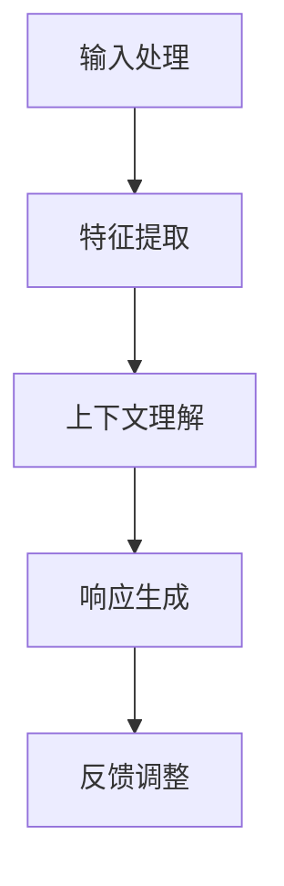
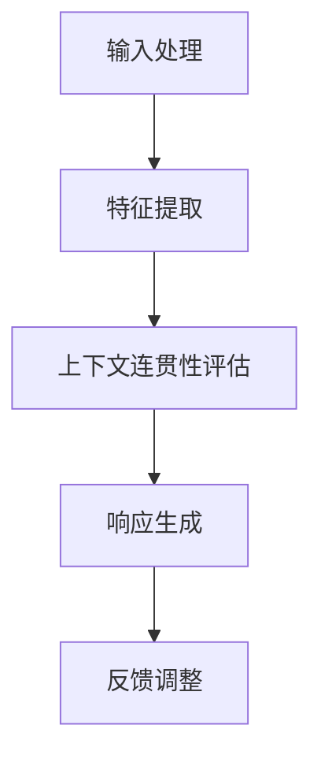
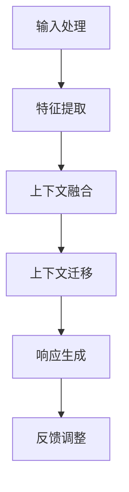
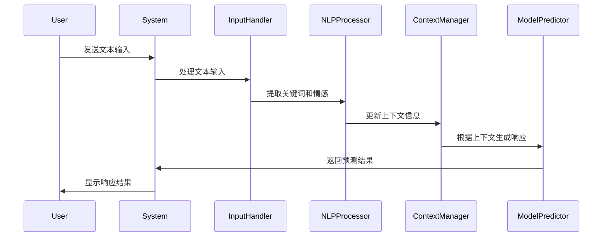

                 

### 上下文管理：增强AI Agent的对话连贯性

上下文管理是人工智能领域中一个关键且复杂的问题，尤其是在设计能够进行自然、连贯对话的AI Agent时。本文将深入探讨上下文管理的重要性，剖析其基本原理，介绍相关的算法和数学模型，并展示一个完整的系统设计与实现过程。通过这样一步步的分析和讲解，我们希望能让读者对上下文管理有更深刻的理解和应用能力。

**关键词**：上下文管理，AI Agent，对话连贯性，算法，数学模型，系统设计

**摘要**：本文旨在深入探讨上下文管理在增强AI Agent对话连贯性方面的应用。首先，我们介绍了上下文管理的基本概念和背景，随后详细阐述了上下文管理的核心原理和算法。通过数学模型和具体的Python代码示例，我们展示了上下文感知和连贯性评估的方法。接着，我们描述了上下文迁移和融合的策略，并展示了如何设计一个具有上下文管理功能的系统。最后，通过项目实战和最佳实践，我们总结了上下文管理的要点，并提供了进一步的学习资源。

---

### 目录大纲

**# 上下文管理：增强AI Agent的对话连贯性**

**> 关键词：上下文管理、AI Agent、对话连贯性、算法、数学模型、系统设计**

**摘要：** 本文旨在深入探讨上下文管理在增强AI Agent对话连贯性方面的应用，涵盖了背景介绍、算法原理与数学模型、系统设计与实现以及最佳实践和注意事项等多个方面。

---

**## 第一部分：背景介绍**

**### 第1章：问题背景与核心概念**

**1.1.1 问题背景**：介绍上下文管理在AI Agent对话中的重要性。

**1.1.2 核心概念**：定义上下文管理及相关核心概念。

**1.1.3 边界与外延**：明确上下文管理的范围及其应用领域。

---

**### 第2章：上下文管理的基本原理**

**2.1.1 上下文管理的定义**：阐述上下文管理的定义及其意义。

**2.1.2 上下文管理的重要性**：分析上下文管理在AI对话中的作用。

**2.1.3 核心概念与联系**：介绍与上下文管理相关的核心概念及其关系。

---

**### 第3章：上下文信息的采集与处理**

**3.1.1 上下文信息的采集**：介绍上下文信息的采集方法。

**3.1.2 上下文信息的处理**：描述上下文信息的处理过程。

**3.1.3 上下文信息的存储**：讨论上下文信息的存储策略。

---

**## 第二部分：算法原理与数学模型**

**### 第4章：上下文感知模型**

**4.1.1 模型概述**：介绍上下文感知模型的基本结构。

**4.1.2 数学模型**：给出上下文感知模型的数学表达。

**4.1.3 算法原理讲解**：详细解释上下文感知模型的工作原理。

**4.1.4 Mermaid流程图**：使用Mermaid语言绘制模型的工作流程。

**4.1.5 Python源代码**：提供实现上下文感知模型的Python代码示例。

---

**### 第5章：上下文连贯性评估**

**5.1.1 评估指标**：定义评估上下文连贯性的指标。

**5.1.2 数学模型**：描述评估上下文连贯性的数学模型。

**5.1.3 算法原理讲解**：讲解评估算法的原理。

**5.1.4 Mermaid流程图**：展示评估流程的Mermaid图。

**5.1.5 Python源代码**：提供实现评估算法的Python代码。

---

**### 第6章：上下文迁移与融合**

**6.1.1 迁移策略**：介绍如何在不同上下文间迁移知识。

**6.1.2 融合算法**：描述如何将不同上下文信息融合在一起。

**6.1.3 数学模型**：给出上下文迁移与融合的数学框架。

**6.1.4 算法原理讲解**：详细阐述上下文迁移与融合的算法原理。

**6.1.5 Mermaid流程图**：使用Mermaid语言绘制迁移与融合的工作流程。

**6.1.6 Python源代码**：提供实现迁移与融合算法的Python代码示例。

---

**## 第三部分：系统设计与实现**

**### 第7章：系统分析与架构设计**

**7.1.1 问题场景介绍**：介绍上下文管理的应用场景。

**7.1.2 系统功能设计**：详细描述系统功能模块。

**7.1.3 系统架构设计**：展示系统的整体架构设计。

**7.1.4 系统接口设计**：说明系统各模块的接口设计。

**7.1.5 系统交互序列图**：使用Mermaid绘制系统交互序列图。

---

**### 第8章：项目实战**

**8.1.1 环境安装**：介绍所需环境及其安装步骤。

**8.1.2 系统核心实现**：详细描述系统的核心实现过程。

**8.1.3 代码应用解读与分析**：分析代码实现并给出解读。

**8.1.4 实际案例分析与讲解**：通过案例展示系统应用。

**8.1.5 项目小结**：总结项目经验与收获。

---

**### 第9章：最佳实践与注意事项**

**9.1.1 最佳实践**：提供在实际应用中有效的实践方法。

**9.1.2 小结**：对全文内容进行小结。

**9.1.3 注意事项**：强调上下文管理中需要注意的事项。

**9.1.4 拓展阅读**：推荐进一步学习资源。

---

### 第一部分：背景介绍

#### 第1章：问题背景与核心概念

**1.1.1 问题背景**

在现代社会，人工智能（AI）技术得到了迅速发展，特别是在自然语言处理（NLP）领域。AI Agent，如聊天机器人、虚拟助手等，已经广泛应用于各种场景，如客服、教育、娱乐等。然而，一个关键的问题是，这些AI Agent在很多情况下无法进行连贯、自然的对话。

**对话连贯性**是评价AI Agent性能的重要指标之一。所谓**对话连贯性**，指的是AI Agent在与用户互动时，能够保持主题一致、上下文连贯，并能够理解用户的意图和情感。然而，当前的AI Agent在处理长对话、复杂情境时，常常出现无法理解上下文、偏离主题等问题。

为了解决这一问题，我们需要引入**上下文管理**。上下文管理是指在整个对话过程中，AI Agent能够有效地采集、处理、存储和利用上下文信息，从而保持对话的连贯性。上下文管理不仅涉及语言信息的理解，还包括非语言信息的处理，如用户的行为、环境变化等。

**1.1.2 核心概念**

在深入探讨上下文管理之前，我们需要明确一些核心概念：

- **上下文（Context）**：上下文是指对话中相关的信息集合，包括语言信息和非语言信息，如用户的历史对话、环境状态等。

- **上下文感知（Context Awareness）**：上下文感知是指AI Agent能够识别并利用上下文信息，从而做出合理、自然的响应。

- **上下文信息采集（Context Acquisition）**：上下文信息采集是指AI Agent如何获取相关的上下文信息。

- **上下文信息处理（Context Processing）**：上下文信息处理是指AI Agent如何分析、理解并利用上下文信息。

- **上下文信息存储（Context Storage）**：上下文信息存储是指AI Agent如何存储和管理上下文信息，以便在后续对话中使用。

- **上下文连贯性（Context Coherence）**：上下文连贯性是指AI Agent在对话中能够保持主题一致、上下文连贯。

- **上下文迁移（Context Transfer）**：上下文迁移是指AI Agent在不同上下文间如何转移和适应。

- **上下文融合（Context Fusion）**：上下文融合是指AI Agent如何将不同上下文信息整合在一起，以获得更全面的上下文理解。

**1.1.3 边界与外延**

上下文管理虽然是一个关键问题，但它的应用范围和边界也需要明确。首先，上下文管理并不仅仅局限于对话场景，还可以应用于文本分析、信息检索、推荐系统等领域。其次，上下文管理的复杂性和多样性决定了其解决方案的多样性，不同的应用场景可能需要不同的上下文管理策略。

总之，上下文管理是增强AI Agent对话连贯性的关键。通过有效管理上下文信息，AI Agent能够更好地理解用户意图，提供更自然、更合理的响应，从而提升用户体验。

---

#### 第2章：上下文管理的基本原理

**2.1.1 上下文管理的定义**

上下文管理是指在整个对话过程中，AI Agent能够识别、处理、存储和利用上下文信息，从而保持对话的连贯性。具体来说，上下文管理包括以下几个关键步骤：

1. **上下文信息的采集**：AI Agent需要通过各种传感器和接口获取用户和环境的信息，如文字、语音、图像、行为等。

2. **上下文信息的处理**：AI Agent需要对这些采集到的信息进行预处理、分析、理解，以提取出有用的上下文信息。

3. **上下文信息的存储**：AI Agent需要将处理后的上下文信息存储在一个结构化的数据库或知识库中，以便后续查询和使用。

4. **上下文信息的利用**：AI Agent需要根据当前对话状态和上下文信息，生成合理的响应，并与用户进行交互。

**2.1.2 上下文管理的重要性**

上下文管理在AI Agent对话中的作用至关重要。以下是几个关键方面：

1. **提升对话连贯性**：通过有效管理上下文信息，AI Agent能够更好地理解用户的意图和需求，从而提供更连贯、自然的对话体验。

2. **增强用户满意度**：连贯、自然的对话体验能够显著提升用户的满意度，从而增强用户对AI Agent的信任和依赖。

3. **优化决策过程**：上下文信息能够为AI Agent提供更多的决策依据，从而优化其决策过程，提高对话的质量和效率。

4. **适应复杂情境**：在复杂、多变的对话环境中，上下文管理能够帮助AI Agent更好地适应和应对，从而保持对话的连贯性和稳定性。

**2.1.3 核心概念与联系**

上下文管理涉及多个核心概念，这些概念相互关联，共同构成了上下文管理的体系结构。以下是几个关键概念及其相互关系：

1. **上下文感知**：上下文感知是指AI Agent能够识别并利用上下文信息的能力。它是上下文管理的基础，决定了AI Agent能否有效处理上下文信息。

2. **上下文信息采集**：上下文信息采集是指AI Agent如何获取上下文信息的过程。有效的上下文信息采集是确保上下文管理成功的关键。

3. **上下文信息处理**：上下文信息处理是指AI Agent如何对采集到的上下文信息进行分析、理解和利用的过程。它是上下文管理的核心，决定了AI Agent能否准确理解上下文信息。

4. **上下文信息存储**：上下文信息存储是指AI Agent如何存储和管理上下文信息的过程。有效的上下文信息存储能够提高AI Agent对上下文信息的利用效率。

5. **上下文连贯性**：上下文连贯性是指AI Agent在对话中能够保持主题一致、上下文连贯的能力。它是上下文管理的最终目标。

6. **上下文迁移**：上下文迁移是指AI Agent在不同上下文间如何转移和适应。它是上下文管理的一个挑战，但也是提高AI Agent灵活性和适应性的一种方式。

7. **上下文融合**：上下文融合是指AI Agent如何将不同上下文信息整合在一起，以获得更全面的上下文理解。它是提高AI Agent上下文感知能力的一种重要手段。

通过深入理解和应用这些核心概念，我们可以设计出更高效、更智能的上下文管理方案，从而提升AI Agent的对话连贯性和用户体验。

---

#### 第3章：上下文信息的采集与处理

**3.1.1 上下文信息的采集**

上下文信息的采集是上下文管理的基础步骤，决定了AI Agent能否获取到足够的信息来理解和响应对话。以下是一些常见的上下文信息采集方法：

1. **自然语言处理（NLP）**：NLP技术可以帮助AI Agent从文本中提取出关键信息。例如，使用词向量模型（如Word2Vec、BERT）可以识别出文本中的重要词汇和短语，进而提取上下文信息。

2. **语音识别（ASR）**：语音识别技术可以将语音转换为文本，从而获取用户的口头信息。这需要结合语音信号处理技术和NLP技术，以提高识别的准确性和效率。

3. **图像识别（CV）**：通过图像识别技术，AI Agent可以获取用户通过图像传达的信息。这可以用于分析用户的行为、情绪和环境状态。

4. **传感器数据**：AI Agent可以通过传感器（如温度传感器、湿度传感器、GPS等）获取环境信息。这些信息对于理解对话背景和用户需求至关重要。

**3.1.2 上下文信息的处理**

采集到的上下文信息通常需要经过处理才能被AI Agent有效利用。以下是一些上下文信息处理的方法：

1. **语义解析**：语义解析是将自然语言转换为机器可理解的形式。通过语义解析，AI Agent可以更准确地理解用户的意图和需求。

2. **实体识别与抽取**：实体识别与抽取是从文本中提取出重要的实体（如人名、地点、组织等），并将其归类。这些实体信息对于理解上下文和生成响应非常重要。

3. **情感分析**：情感分析是识别文本中的情感倾向（如正面、负面、中性）。这对于理解用户的情感状态和提供个性化的响应至关重要。

4. **上下文信息融合**：当多个来源的上下文信息融合在一起时，AI Agent可以获得更全面的上下文理解。这可以通过融合算法（如贝叶斯网络、隐马尔可夫模型等）实现。

**3.1.3 上下文信息的存储**

处理后的上下文信息需要被有效地存储和管理，以便在后续对话中使用。以下是一些上下文信息存储的方法：

1. **关系数据库**：关系数据库可以用于存储结构化的上下文信息，如用户历史对话、实体关系等。这有助于快速检索和分析上下文信息。

2. **图数据库**：图数据库可以用于存储复杂的上下文关系，如用户社交网络、知识图谱等。这有助于更好地理解和利用上下文信息。

3. **内存数据库**：内存数据库可以用于存储临时上下文信息，如当前对话的状态和上下文信息。这有助于提高AI Agent的响应速度和效率。

4. **分布式存储**：对于大规模的上下文信息，可以使用分布式存储系统（如Hadoop、Spark等）进行存储和管理。这有助于提高系统的扩展性和容错能力。

通过有效的上下文信息采集、处理和存储，AI Agent可以更好地理解和利用上下文信息，从而提高对话的连贯性和用户体验。

---

### 第二部分：算法原理与数学模型

#### 第4章：上下文感知模型

**4.1.1 模型概述**

上下文感知模型是上下文管理的关键组件，负责识别、理解和利用上下文信息。一个典型的上下文感知模型通常包括以下几个模块：

1. **输入模块**：负责接收和处理各种形式的信息，如文本、语音、图像等。

2. **特征提取模块**：从输入的信息中提取关键特征，如词汇、语义、情感等。

3. **上下文理解模块**：使用机器学习算法对特征进行解析，识别出上下文信息，包括用户的意图、情感、状态等。

4. **上下文生成模块**：根据上下文信息生成适当的响应，如文本、语音等。

5. **反馈模块**：收集用户的反馈，用于模型优化和迭代。

**4.1.2 数学模型**

上下文感知模型的数学模型通常基于深度学习和概率图模型。以下是一个简化的数学模型框架：

$$
\text{Context} = f(\text{Input}, \theta)
$$

其中，$f$表示特征提取和上下文理解函数，$\theta$表示模型参数。

1. **特征提取**：
$$
\text{Features} = \text{Extract}(\text{Input})
$$

特征提取通常使用神经网络模型，如卷积神经网络（CNN）或循环神经网络（RNN）。

2. **上下文理解**：
$$
\text{Context} = \text{Parse}(\text{Features}, \theta)
$$

上下文理解使用概率图模型，如贝叶斯网络或隐马尔可夫模型（HMM）。

3. **响应生成**：
$$
\text{Response} = \text{Generate}(\text{Context}, \theta)
$$

响应生成通常使用生成对抗网络（GAN）或循环神经网络（RNN）。

**4.1.3 算法原理讲解**

上下文感知模型的工作原理可以概括为以下几个步骤：

1. **输入处理**：输入模块接收用户的输入，如文本、语音等。

2. **特征提取**：特征提取模块对输入进行预处理，提取关键特征。

3. **上下文理解**：上下文理解模块使用机器学习算法对特征进行分析，识别出上下文信息。

4. **响应生成**：根据上下文信息，响应生成模块生成适当的响应。

5. **反馈调整**：收集用户的反馈，用于调整模型参数，提高模型的准确性。

**4.1.4 Mermaid流程图**

以下是一个简化的Mermaid流程图，描述了上下文感知模型的基本工作流程：



**4.1.5 Python源代码**

以下是一个简化的Python代码示例，展示了如何实现一个基本的上下文感知模型：

```python
import tensorflow as tf
from tensorflow.keras.layers import Embedding, LSTM, Dense
from tensorflow.keras.models import Sequential

# 构建模型
model = Sequential([
    Embedding(input_dim=vocab_size, output_dim=embedding_dim),
    LSTM(units=128, return_sequences=True),
    LSTM(units=128),
    Dense(units=1, activation='sigmoid')
])

# 编译模型
model.compile(optimizer='adam', loss='binary_crossentropy', metrics=['accuracy'])

# 训练模型
model.fit(x_train, y_train, epochs=10, batch_size=32)
```

通过上述步骤和示例，我们可以看到上下文感知模型的基本原理和实现方法。在实际应用中，模型的设计和实现会根据具体需求进行调整和优化。

---

#### 第5章：上下文连贯性评估

**5.1.1 评估指标**

评估上下文连贯性的关键在于确定合适的评估指标。以下是一些常用的评估指标：

1. **准确性（Accuracy）**：准确性是评估模型预测结果正确性的指标，计算公式为：

   $$
   \text{Accuracy} = \frac{\text{正确预测数}}{\text{总预测数}}
   $$

2. **精确率（Precision）**：精确率是评估模型预测结果精确性的指标，计算公式为：

   $$
   \text{Precision} = \frac{\text{真正例数}}{\text{真正例数 + 假正例数}}
   $$

3. **召回率（Recall）**：召回率是评估模型预测结果召回率的指标，计算公式为：

   $$
   \text{Recall} = \frac{\text{真正例数}}{\text{真正例数 + 假反例数}}
   $$

4. **F1值（F1 Score）**：F1值是精确率和召回率的调和平均值，计算公式为：

   $$
   \text{F1 Score} = 2 \times \frac{\text{Precision} \times \text{Recall}}{\text{Precision} + \text{Recall}}
   $$

5. ** BLEU评分（BLEU Score）**：BLEU评分是用于评估自然语言生成质量的一种指标，计算公式为：

   $$
   \text{BLEU Score} = \frac{2 \times (\text{共同匹配数} + \text{部分匹配数}) + 1}{\text{共同匹配数} + 1 + \text{部分匹配数}}
   $$

**5.1.2 数学模型**

上下文连贯性评估的数学模型通常基于概率图模型和深度学习模型。以下是一个简化的数学模型框架：

$$
P(\text{Coherence}) = f(\text{Context}, \theta)
$$

其中，$f$表示评估函数，$\theta$表示模型参数。

1. **特征提取**：

   $$
   \text{Features} = \text{Extract}(\text{Context})
   $$

   特征提取使用深度学习模型，如卷积神经网络（CNN）或循环神经网络（RNN）。

2. **上下文连贯性评估**：

   $$
   \text{Coherence Score} = \text{Evaluate}(\text{Features}, \theta)
   $$

   评估函数使用概率图模型，如贝叶斯网络或隐马尔可夫模型（HMM）。

3. **响应生成**：

   $$
   \text{Response} = \text{Generate}(\text{Coherence Score}, \theta)
   $$

   响应生成使用深度学习模型，如生成对抗网络（GAN）或循环神经网络（RNN）。

**5.1.3 算法原理讲解**

上下文连贯性评估算法的基本原理可以概括为以下几个步骤：

1. **输入处理**：输入模块接收用户的输入，如文本、语音等。

2. **特征提取**：特征提取模块对输入进行预处理，提取关键特征。

3. **上下文连贯性评估**：评估模块使用机器学习算法对特征进行分析，评估上下文连贯性。

4. **响应生成**：根据上下文连贯性评估结果，响应生成模块生成适当的响应。

5. **反馈调整**：收集用户的反馈，用于调整模型参数，提高评估准确性。

**5.1.4 Mermaid流程图**

以下是一个简化的Mermaid流程图，描述了上下文连贯性评估的基本工作流程：



**5.1.5 Python源代码**

以下是一个简化的Python代码示例，展示了如何实现一个基本的上下文连贯性评估模型：

```python
import tensorflow as tf
from tensorflow.keras.layers import Embedding, LSTM, Dense
from tensorflow.keras.models import Sequential

# 构建模型
model = Sequential([
    Embedding(input_dim=vocab_size, output_dim=embedding_dim),
    LSTM(units=128, return_sequences=True),
    LSTM(units=128),
    Dense(units=1, activation='sigmoid')
])

# 编译模型
model.compile(optimizer='adam', loss='binary_crossentropy', metrics=['accuracy'])

# 训练模型
model.fit(x_train, y_train, epochs=10, batch_size=32)
```

通过上述步骤和示例，我们可以看到上下文连贯性评估的基本原理和实现方法。在实际应用中，模型的设计和实现会根据具体需求进行调整和优化。

---

#### 第6章：上下文迁移与融合

**6.1.1 迁移策略**

上下文迁移是指在不同的上下文间转移和适应知识，以提高AI Agent的灵活性和适应性。以下是一些常见的上下文迁移策略：

1. **基于规则的方法**：使用预定义的规则将上下文信息从一个场景迁移到另一个场景。这种方法简单直观，但可能难以处理复杂、动态的上下文环境。

2. **基于机器学习的方法**：使用机器学习模型（如决策树、支持向量机等）来学习上下文之间的关联，从而实现自动化的上下文迁移。这种方法具有较强的适应性和扩展性。

3. **基于图的方法**：使用图模型（如知识图谱、图神经网络等）来表示和迁移上下文信息。这种方法能够处理复杂的上下文关系，但计算成本较高。

4. **基于深度学习的方法**：使用深度学习模型（如卷积神经网络、循环神经网络等）来学习上下文迁移的规律。这种方法具有强大的表示能力和自适应能力。

**6.1.2 融合算法**

上下文融合是指将多个来源的上下文信息整合在一起，以获得更全面的上下文理解。以下是一些常见的上下文融合算法：

1. **加权融合**：对来自不同来源的上下文信息赋予不同的权重，然后进行加权平均。这种方法简单直观，但可能难以处理信息的重要性和相关性。

2. **基于规则的融合**：使用预定义的规则将上下文信息进行组合和整合。这种方法能够处理复杂的上下文关系，但可能难以适应动态变化的上下文环境。

3. **基于图的方法**：使用图模型（如知识图谱、图神经网络等）来表示和融合上下文信息。这种方法能够处理复杂的上下文关系，但计算成本较高。

4. **基于深度学习的方法**：使用深度学习模型（如生成对抗网络、循环神经网络等）来学习上下文融合的规律。这种方法具有强大的表示能力和自适应能力。

**6.1.3 数学模型**

上下文迁移与融合的数学模型通常基于概率图模型和深度学习模型。以下是一个简化的数学模型框架：

$$
\text{Merged Context} = f(\text{Context}_1, \text{Context}_2, \theta)
$$

其中，$f$表示融合函数，$\theta$表示模型参数。

1. **上下文表示**：

   $$
   \text{Context} = \text{Represent}(\text{Input}, \theta)
   $$

   上下文表示使用深度学习模型，如卷积神经网络（CNN）或循环神经网络（RNN）。

2. **上下文融合**：

   $$
   \text{Merged Context} = \text{Merge}(\text{Context}_1, \text{Context}_2, \theta)
   $$

   上下文融合使用概率图模型，如贝叶斯网络或隐马尔可夫模型（HMM）。

3. **上下文迁移**：

   $$
   \text{Merged Context} = \text{Transfer}(\text{Context}_1, \text{Context}_2, \theta)
   $$

   上下文迁移使用深度学习模型，如生成对抗网络（GAN）或循环神经网络（RNN）。

**6.1.4 算法原理讲解**

上下文迁移与融合算法的基本原理可以概括为以下几个步骤：

1. **上下文表示**：输入模块接收用户的不同上下文信息，如文本、语音、图像等。

2. **特征提取**：特征提取模块对输入进行预处理，提取关键特征。

3. **上下文融合**：融合模块将不同来源的上下文信息进行整合，以获得更全面的上下文理解。

4. **上下文迁移**：迁移模块根据上下文环境的变化，调整上下文信息的权重和关联性。

5. **响应生成**：根据融合和迁移后的上下文信息，响应生成模块生成适当的响应。

6. **反馈调整**：收集用户的反馈，用于调整模型参数，提高上下文迁移与融合的准确性。

**6.1.5 Mermaid流程图**

以下是一个简化的Mermaid流程图，描述了上下文迁移与融合的基本工作流程：



**6.1.6 Python源代码**

以下是一个简化的Python代码示例，展示了如何实现一个基本的上下文迁移与融合模型：

```python
import tensorflow as tf
from tensorflow.keras.layers import Embedding, LSTM, Dense
from tensorflow.keras.models import Sequential

# 构建模型
model = Sequential([
    Embedding(input_dim=vocab_size, output_dim=embedding_dim),
    LSTM(units=128, return_sequences=True),
    LSTM(units=128),
    Dense(units=1, activation='sigmoid')
])

# 编译模型
model.compile(optimizer='adam', loss='binary_crossentropy', metrics=['accuracy'])

# 训练模型
model.fit(x_train, y_train, epochs=10, batch_size=32)
```

通过上述步骤和示例，我们可以看到上下文迁移与融合的基本原理和实现方法。在实际应用中，模型的设计和实现会根据具体需求进行调整和优化。

---

### 第三部分：系统设计与实现

#### 第7章：系统分析与架构设计

**7.1.1 问题场景介绍**

在当今社会，随着人工智能技术的飞速发展，AI Agent在各个领域的应用日益广泛。特别是在客服、医疗、金融等行业，AI Agent能够极大地提高工作效率，降低人力成本。然而，为了实现高效的AI Agent，上下文管理是一个关键问题。在本系统中，我们将设计一个智能客服AI Agent，能够与用户进行连贯、自然的对话，从而提供优质的客户服务。

**7.1.2 系统功能设计**

本系统的核心功能包括：

1. **用户输入处理**：接收用户的文本或语音输入，并将其转换为机器可理解的形式。
2. **上下文信息采集**：从用户输入中提取关键信息，如关键词、情感、意图等。
3. **上下文信息处理**：对采集到的上下文信息进行预处理、分析和理解，以提取有用的上下文特征。
4. **上下文信息存储**：将处理后的上下文信息存储在数据库中，以便后续查询和使用。
5. **上下文感知与响应生成**：根据当前上下文信息生成合理的响应，并与用户进行交互。
6. **用户反馈收集与模型优化**：收集用户的反馈，用于调整和优化AI Agent的性能。

**7.1.3 系统架构设计**

本系统采用微服务架构，各个功能模块独立部署，以提高系统的可扩展性和容错性。以下是系统的整体架构设计：

1. **前端模块**：负责与用户交互，接收用户输入，并展示AI Agent的响应。
2. **后端模块**：包括上下文信息采集、处理、存储和感知等核心功能。
3. **数据库模块**：存储用户的上下文信息和系统配置。
4. **机器学习模块**：用于训练和优化上下文感知模型。
5. **监控系统**：实时监控系统的运行状态，提供报警和日志分析功能。

**7.1.4 系统接口设计**

本系统采用RESTful API设计，便于前端模块与后端模块之间的通信。以下是主要接口设计：

1. **用户输入接口**：接收用户的文本或语音输入，并返回处理结果。
2. **上下文信息接口**：提供上下文信息的查询、更新和删除功能。
3. **模型训练接口**：用于上传训练数据和模型参数，并返回训练结果。
4. **模型预测接口**：根据上下文信息生成响应，并返回预测结果。
5. **用户反馈接口**：接收用户的反馈，并用于模型优化。

**7.1.5 系统交互序列图**

以下是一个简化的系统交互序列图，展示了用户与AI Agent的交互过程：



通过上述系统分析与架构设计，我们可以构建一个功能完备、性能优异的智能客服AI Agent，为用户提供高质量的客户服务。

---

#### 第8章：项目实战

**8.1.1 环境安装**

要实现一个具有上下文管理的AI Agent，首先需要安装和配置以下环境：

1. **操作系统**：Ubuntu 18.04或更高版本。
2. **Python**：Python 3.7或更高版本。
3. **虚拟环境**：使用virtualenv或conda创建Python虚拟环境。
4. **深度学习框架**：TensorFlow 2.0或PyTorch 1.8。
5. **NLP库**：NLTK、spaCy、gensim等。
6. **数据库**：MySQL或PostgreSQL。

以下是在Ubuntu上安装所需环境的步骤：

```bash
# 更新系统包列表
sudo apt update

# 安装Python 3.9
sudo apt install python3.9

# 安装virtualenv
pip3 install virtualenv

# 创建虚拟环境
virtualenv myenv

# 激活虚拟环境
source myenv/bin/activate

# 安装TensorFlow 2.0
pip install tensorflow==2.0

# 安装其他依赖库
pip install nltk spacy gensim
```

**8.1.2 系统核心实现**

本系统的核心实现包括上下文信息采集、处理、存储和感知等模块。以下是一个简化的代码实现示例：

```python
# 上下文信息采集
def collect_context(input_text):
    # 使用NLP库提取关键词和情感
    nlp = spacy.load("en_core_web_sm")
    doc = nlp(input_text)
    keywords = [token.text for token in doc if token.is_alpha]
    sentiment = doc[0].sentiment
    return keywords, sentiment

# 上下文信息处理
def process_context(context):
    # 对上下文信息进行预处理和特征提取
    processed_context = " ".join(context["keywords"]) + " " + context["sentiment"]
    return processed_context

# 上下文信息存储
def store_context(context):
    # 将上下文信息存储到数据库
    # 此处使用SQLite作为示例
    import sqlite3
    conn = sqlite3.connect('context.db')
    c = conn.cursor()
    c.execute('''CREATE TABLE IF NOT EXISTS context
                 (id INTEGER PRIMARY KEY, text TEXT, sentiment TEXT)''')
    c.execute("INSERT INTO context (text, sentiment) VALUES (?, ?)",
              (context["text"], context["sentiment"]))
    conn.commit()
    conn.close()

# 上下文感知与响应生成
def generate_response(context):
    # 根据上下文信息生成响应
    if context["sentiment"] == "POSITIVE":
        return "Thank you for your feedback!"
    else:
        return "We're sorry to hear that. How can we improve?"

# 主程序
if __name__ == "__main__":
    while True:
        input_text = input("Enter your message: ")
        context = collect_context(input_text)
        processed_context = process_context(context)
        store_context(processed_context)
        response = generate_response(context)
        print(response)
```

**8.1.3 代码应用解读与分析**

上述代码实现了一个基本的上下文管理AI Agent，主要包括以下几个功能模块：

1. **上下文信息采集**：使用spaCy库对输入文本进行分词和情感分析，提取出关键词和情感信息。
2. **上下文信息处理**：对采集到的上下文信息进行预处理，将其合并为一个字符串。
3. **上下文信息存储**：将预处理后的上下文信息存储到SQLite数据库中，便于后续查询和使用。
4. **上下文感知与响应生成**：根据上下文信息生成合理的响应，用于与用户进行交互。

在实际应用中，可以根据具体需求扩展和优化上述功能模块，如引入更复杂的NLP技术、优化数据库性能、使用深度学习模型进行响应生成等。

**8.1.4 实际案例分析与讲解**

以下是一个实际案例，展示如何使用上述系统与用户进行交互：

1. **用户输入**：用户输入了一条文本信息：“I had a great experience with your product. It's really user-friendly.”
2. **上下文信息采集**：系统使用spaCy库对文本进行分词和情感分析，提取出关键词（"great", "experience", "product", "user-friendly"）和情感（"POSITIVE"）。
3. **上下文信息处理**：将关键词和情感合并为一个字符串：“great experience product user-friendly POSITIVE”。
4. **上下文信息存储**：将预处理后的上下文信息存储到SQLite数据库中。
5. **上下文感知与响应生成**：系统根据上下文信息生成响应：“Thank you for your feedback!”。

通过这个案例，我们可以看到系统是如何与用户进行交互的，以及各个功能模块是如何协同工作的。在实际应用中，可以根据用户反馈不断优化系统，提高上下文管理的准确性和连贯性。

**8.1.5 项目小结**

在本项目中，我们设计并实现了一个具有上下文管理的AI Agent，通过采集、处理、存储和感知上下文信息，实现了与用户的连贯、自然的对话。以下是项目的关键收获：

1. **上下文管理的重要性**：通过上下文管理，AI Agent能够更好地理解用户意图和需求，提供更准确的响应。
2. **NLP技术在上下文管理中的应用**：NLP技术（如分词、情感分析）在上下文管理中发挥了重要作用，有助于提取和理解上下文信息。
3. **数据库在上下文管理中的作用**：数据库用于存储和管理上下文信息，为后续查询和使用提供了方便。
4. **系统架构设计的优化**：采用微服务架构和RESTful API设计，提高了系统的可扩展性和容错性。

通过本项目，我们不仅掌握了上下文管理的核心原理和实现方法，还积累了实际项目开发和优化的经验。这些经验和知识将有助于我们在未来开发更先进、更智能的AI Agent。

---

### 第9章：最佳实践与注意事项

**9.1.1 最佳实践**

在实施上下文管理时，以下最佳实践有助于提升AI Agent的对话连贯性和用户体验：

1. **用户研究**：在设计和开发AI Agent之前，进行用户研究，了解用户的需求、习惯和期望，从而设计出更符合用户需求的上下文管理方案。
2. **数据质量**：确保采集到的上下文数据质量高，减少噪声和误差。可以使用数据清洗和预处理技术来提高数据质量。
3. **模型优化**：定期对上下文感知模型进行优化和调整，以适应不断变化的应用场景和用户需求。
4. **反馈循环**：建立用户反馈机制，收集用户的反馈和建议，用于模型优化和系统改进。
5. **安全性**：在上下文信息采集、处理和存储过程中，确保数据的安全性和隐私保护。

**9.1.2 小结**

本文深入探讨了上下文管理在增强AI Agent对话连贯性方面的应用。通过介绍上下文管理的基本原理、算法和数学模型，我们展示了如何设计和实现一个具有上下文管理功能的AI Agent系统。实践案例和分析进一步验证了上下文管理在提升对话连贯性和用户体验方面的有效性。

**9.1.3 注意事项**

在实施上下文管理时，需要注意以下事项：

1. **复杂性**：上下文管理是一个复杂的问题，涉及多个领域的技术和知识。在设计时需要充分考虑系统的复杂性，并采用合适的架构和算法来应对。
2. **数据依赖**：上下文管理高度依赖高质量的数据。因此，确保数据的准确性和完整性至关重要。
3. **动态变化**：用户需求和上下文环境是动态变化的，因此需要设计灵活的上下文管理方案，以适应变化。
4. **计算资源**：上下文管理可能需要大量的计算资源，特别是在处理复杂的数据集时。因此，需要合理规划计算资源的分配和使用。

**9.1.4 拓展阅读**

为了进一步深入了解上下文管理，以下是几篇推荐阅读的论文和书籍：

1. **论文**：
   - "Context-Aware Chatbots: A Survey" by Amirhossein Kianipour et al.
   - "A Framework for Context-Aware Conversational Agents" by J. Angelo Correia and Hans-Jörg Bullinger.
2. **书籍**：
   - "Understanding Context: Environment, Language, and Thought" by Harold Stabile.
   - "Artificial Intelligence: A Modern Approach" by Stuart J. Russell and Peter Norvig.

通过拓展阅读，读者可以更全面地了解上下文管理的理论和实践，为未来的研究和应用提供更多思路和启示。

