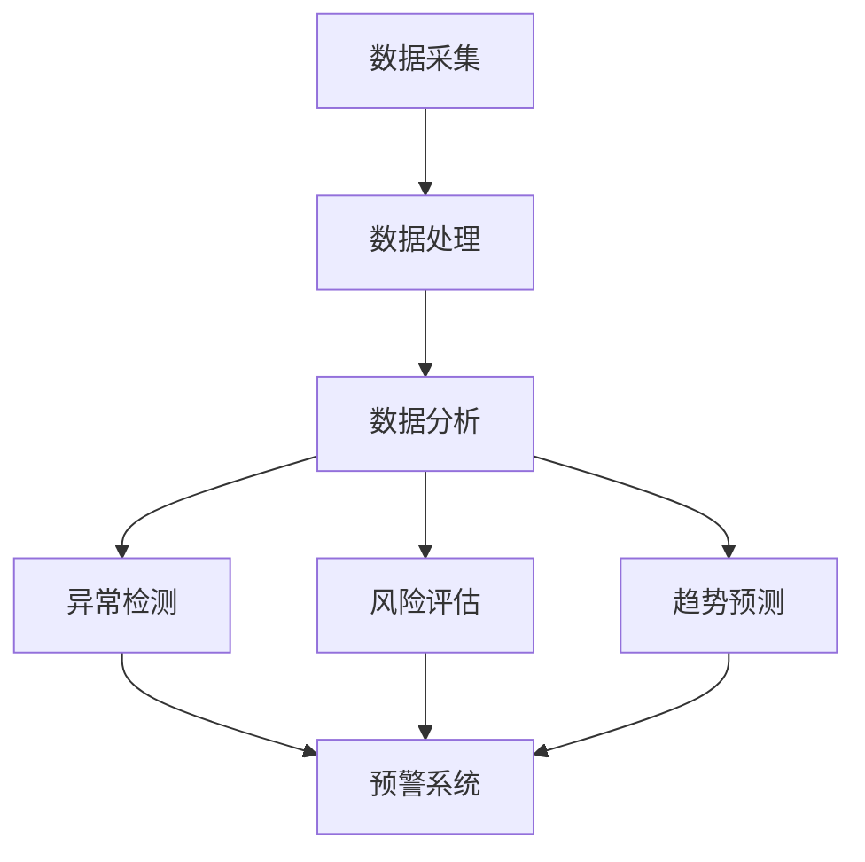
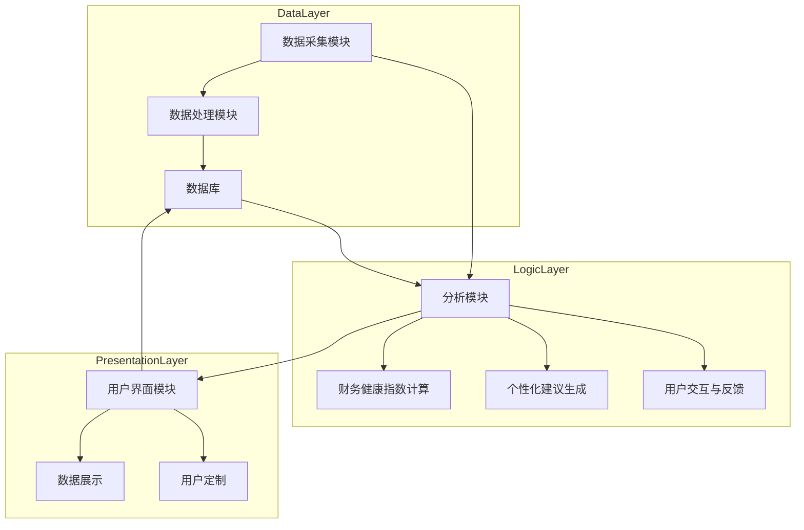

                 

### Introduction to the Book

# 个人财务健康指数动态跟踪系统

> 关键词：财务健康指数、动态跟踪系统、算法、数学模型、系统设计与实现

摘要：本文旨在介绍一个创新性的个人财务健康指数动态跟踪系统。通过深入解析财务健康的定义、重要性以及当前面临的挑战，本文首先概述了建立动态跟踪系统的必要性。接下来，本文将详细阐述该系统的核心概念、组成架构以及关键算法，并使用专业的技术语言和直观的图表对系统进行详细解析。此外，本文还将通过实际案例展示系统的应用效果，并提供最佳实践和项目小结，以帮助读者更好地理解和掌握个人财务健康管理的技巧。

### 背景和概述

#### 财务健康：定义与重要性

财务健康，通常被定义为个人或家庭在财务方面的稳定和可持续状态。它不仅涉及当前的收入和支出状况，还包括储蓄、投资以及未来财务安排的合理性。在现代社会，随着经济全球化和个人生活压力的增大，财务健康逐渐成为影响个人幸福和社会稳定的重要因素。

**财务健康的重要性**体现在多个方面。首先，良好的财务健康状况能够为个人和家庭提供安全感，降低因经济问题引发的心理压力。其次，稳定的财务基础有助于个人更好地规划未来，包括教育、退休和重大支出等。此外，财务健康还能提升社会整体的消费能力和创新动力，促进经济的可持续发展。

然而，目前许多人面临着财务不健康的挑战。这主要体现在以下几个方面：

1. **收入不稳定**：许多家庭收入来源单一，一旦主要收入渠道发生变动，便可能陷入财务困境。
2. **支出不合理**：高消费和冲动消费现象普遍，导致个人储蓄率偏低。
3. **投资缺乏策略**：很多人缺乏正确的投资知识和策略，导致投资回报率不高，甚至出现亏损。
4. **债务问题**：信用卡债务、房贷和其他贷款的高额利息使许多家庭财务负担加重。

这些挑战不仅影响了个人和家庭的财务稳定，还可能引发更广泛的社会问题。因此，建立一套动态跟踪系统，以实时监控和改善个人财务健康状况，变得尤为必要。

#### 动态跟踪系统的必要性

动态跟踪系统是一种能够实时监测和分析个人财务状况的技术解决方案。与传统静态的财务报表不同，动态跟踪系统具有以下几个显著优势：

1. **实时监控**：系统能够自动收集和处理用户的财务数据，提供实时的财务状况更新，使个人能够及时了解自己的财务状况。
2. **自动分析**：系统内置的算法能够对财务数据进行自动分析，识别潜在的问题和风险，并提供针对性的建议。
3. **个性化建议**：根据个人的财务目标和状况，系统可以提供个性化的财务规划建议，帮助用户制定更合理的财务策略。
4. **风险预警**：通过实时监控，系统可以及时发现可能出现的财务风险，提前采取措施，避免财务危机。

此外，动态跟踪系统还具有以下特点：

- **易用性**：系统设计注重用户体验，操作简单，界面友好，用户可以轻松上手。
- **灵活性**：系统能够适应不同用户的需求，支持多种数据源接入和多种报表形式输出。
- **安全性**：系统采用先进的加密技术和安全协议，确保用户数据的安全和隐私。

总之，动态跟踪系统不仅能够帮助个人更好地管理自己的财务，还能为金融机构和财务顾问提供有力的工具，从而促进整个金融行业的健康发展。

### 核心概念

#### 个人财务健康指数

个人财务健康指数（Personal Financial Health Index, PFHI）是评估个人财务健康状况的核心指标。它通过量化多个财务健康指标，综合反映个人的财务稳定性、可持续性和风险承受能力。

**PFHI的组成部分**主要包括以下几类：

1. **收入状况**：衡量个人或家庭的收入水平和稳定性。这包括主要收入来源（如工资、投资收益等）以及收入波动的程度。
2. **支出状况**：评估个人或家庭的支出构成和支出水平，包括日常消费、贷款还款、教育支出等。
3. **储蓄状况**：衡量个人或家庭储蓄率及其变化趋势。储蓄率越高，表明个人应对意外支出的能力越强。
4. **投资状况**：评估个人投资组合的回报率和风险水平。这包括投资类型、投资额度和投资期限等。
5. **债务状况**：衡量个人债务水平及其对财务状况的影响。这包括贷款总额、利率、还款期限等。

**PFHI的计算方法**通常采用加权平均法，即将上述各部分指标根据其在整体财务健康中的重要性进行加权，然后求和得到综合指数。具体的计算公式如下：

$$
PFHI = \sum_{i=1}^{n} w_i \cdot I_i
$$

其中，$w_i$为第$i$个指标的权重，$I_i$为第$i$个指标的具体数值。

为了确保PFHI能够准确反映个人财务健康状况，需要综合考虑多个因素。以下是一个示例表格，展示了几种常见财务健康指标及其属性对比：

| 指标名称 | 描述 | 属性对比 |
| --- | --- | --- |
| 月收入 | 个人或家庭每月收入总额 | 稳定性、多样性 |
| 月支出 | 个人或家庭每月支出总额 | 可控性、合理性 |
| 储蓄率 | 月收入减去月支出后的储蓄比例 | 长期稳定、弹性 |
| 投资收益 | 投资组合的年度收益 | 风险承受能力、回报率 |
| 债务比率 | 负债总额与净资产之比 | 偿债能力、财务压力 |

通过构建一个全面的PFHI指标体系，可以更准确地评估个人财务健康状况，为用户提供有效的财务管理和规划建议。

#### 动态跟踪系统

动态跟踪系统是一个综合性的财务监控平台，旨在实时、自动地监测和分析个人的财务健康状况。它由多个关键组件组成，包括数据采集模块、数据处理模块、分析模块和决策支持模块。

**系统架构**：

1. **数据采集模块**：该模块负责收集用户的财务数据，包括银行账户信息、投资记录、消费支出等。数据来源可以是电子银行系统、投资平台、信用卡账单等。
   
2. **数据处理模块**：数据采集后，经过清洗、整合和转换，以便后续分析和计算。此模块还包括数据加密和隐私保护功能，确保用户信息安全。

3. **分析模块**：分析模块使用算法对财务数据进行分析，计算个人财务健康指数（PFHI）。此模块还包括异常检测、风险评估和预测功能。

4. **决策支持模块**：根据分析结果，系统为用户生成个性化的财务建议，包括储蓄计划、投资建议、债务管理策略等。

**工作流程**：

1. **数据采集**：系统从多个数据源自动获取财务数据。
2. **数据处理**：对数据进行清洗和整合，生成统一格式的数据集。
3. **数据分析**：计算PFHI及其他相关指标，识别财务状况的优劣。
4. **决策支持**：根据分析结果，生成财务建议和预警信息。
5. **用户互动**：用户通过系统界面查看财务报告和建议，与系统互动进行财务调整。

**关键组件的作用**：

1. **数据采集模块**：确保数据的全面性和及时性，是系统正常运行的基础。
2. **数据处理模块**：提高数据质量，为后续分析提供可靠的数据基础。
3. **分析模块**：核心功能模块，负责计算和分析用户的财务状况。
4. **决策支持模块**：为用户提供实用和个性化的财务建议，帮助用户改善财务健康。

通过动态跟踪系统，用户可以实时了解自己的财务状况，及时发现和解决财务问题，从而实现更好的财务管理和规划。

#### 关键术语和定义

为了确保对本文中涉及的关键概念和技术术语有清晰的理解，以下是几个核心术语的详细定义。

**1. 个人财务健康指数（Personal Financial Health Index, PFHI）**：这是一个综合性的指标，用于评估个人或家庭的财务健康状况。它通过量化多个财务健康指标（如收入、支出、储蓄、投资和债务），得出一个整体的健康指数。PFHI的计算方法通常采用加权平均法，公式如下：

$$
PFHI = \sum_{i=1}^{n} w_i \cdot I_i
$$

其中，$w_i$代表第$i$个指标的权重，$I_i$是第$i$个指标的具体数值。

**2. 动态跟踪系统**：这是一个自动化的财务监控平台，用于实时监测和分析个人的财务健康状况。该系统由多个模块组成，包括数据采集模块、数据处理模块、分析模块和决策支持模块。动态跟踪系统能够提供个性化的财务建议和预警信息，帮助用户改善财务健康。

**3. 数据采集模块**：负责从多个数据源（如银行账户、投资平台和信用卡账单）自动获取财务数据。这些数据包括收入、支出、储蓄、投资和债务等。

**4. 数据处理模块**：对采集到的财务数据进行分析、清洗、整合和转换，以便后续分析和计算。该模块还包括数据加密和隐私保护功能，确保用户信息安全。

**5. 分析模块**：使用算法对财务数据进行分析，计算PFHI和其他相关指标。此模块还包括异常检测、风险评估和预测功能，帮助识别财务状况的优劣。

**6. 决策支持模块**：根据分析结果，为用户生成个性化的财务建议和预警信息，如储蓄计划、投资建议和债务管理策略等。用户可以通过系统界面查看这些建议，并进行相应的财务调整。

通过明确这些关键术语的定义，读者可以更准确地理解本文的核心概念，从而更好地掌握个人财务健康管理的方法和工具。

### 财务健康指标

#### 各类财务健康指标

财务健康指标是评估个人或家庭财务状况的关键工具。这些指标可以从多个维度反映财务健康状况，帮助用户了解自己的收入、支出、储蓄、投资和债务等方面。以下是几种常见的财务健康指标及其详细描述：

**1. 收入状况**

收入状况是评估个人财务健康的重要指标之一。它主要包括以下两个方面：

- **月收入**：个人或家庭每月的总收入，包括工资、奖金、投资收益、兼职收入等。
- **收入稳定性**：收入的波动程度，反映收入来源的稳定性。稳定的收入来源有助于维持财务稳定。

**2. 支出状况**

支出状况反映了个人或家庭在消费、贷款还款等方面的财务状况。主要指标包括：

- **月支出**：个人或家庭每月的总支出，包括日常消费、教育支出、医疗费用、贷款还款等。
- **支出合理性**：支出的构成是否合理，是否存在冲动消费或过度消费的情况。合理的支出结构有助于提高储蓄率和财务健康水平。

**3. 储蓄状况**

储蓄状况是衡量个人或家庭应对意外支出和实现财务目标能力的重要指标。主要包括：

- **储蓄率**：储蓄率是指月收入减去月支出后的储蓄比例。较高的储蓄率意味着个人或家庭有更强的财务弹性。
- **储蓄增长趋势**：储蓄额的增减变化趋势，反映财务状况的改善或恶化。

**4. 投资状况**

投资状况评估个人或家庭的投资行为和回报情况。主要指标包括：

- **投资收益**：投资组合的年度收益，反映投资策略的回报情况。
- **投资风险**：投资组合的风险水平，通过标准差、贝塔系数等指标衡量。合理分散的投资组合有助于降低风险。

**5. 债务状况**

债务状况反映了个人或家庭负债的规模及其对财务状况的影响。主要指标包括：

- **债务总额**：个人或家庭的负债总额，包括房贷、车贷、信用卡债务等。
- **债务比率**：负债总额与净资产之比，反映偿债能力和财务压力。过高的债务比率可能导致财务困境。

通过这些指标，可以全面了解个人或家庭的财务健康状况，并采取相应的措施进行优化。以下是一个表格，展示了各类财务健康指标的属性对比：

| 指标名称 | 描述 | 属性对比 |
| --- | --- | --- |
| 月收入 | 个人或家庭每月收入总额 | 稳定性、多样性 |
| 月支出 | 个人或家庭每月支出总额 | 可控性、合理性 |
| 储蓄率 | 月收入减去月支出后的储蓄比例 | 长期稳定、弹性 |
| 投资收益 | 投资组合的年度收益 | 风险承受能力、回报率 |
| 债务比率 | 负债总额与净资产之比 | 偿债能力、财务压力 |

通过综合这些指标，用户可以更准确地评估自己的财务健康状况，并为未来的财务规划提供有力支持。

### 动态跟踪系统组件

#### 系统架构与模块

动态跟踪系统是一个复杂的多模块集成系统，旨在为用户提供全面的财务健康状况分析和个性化财务建议。以下是该系统的总体架构及各模块的功能：

**1. 数据采集模块**

数据采集模块是系统的基础，负责从多个数据源自动获取用户的财务数据。数据源包括银行账户、投资平台、信用卡账单、贷款记录等。数据采集模块的主要任务包括：

- **数据接入**：利用API、Web爬虫等技术手段，从不同的数据源获取原始数据。
- **数据清洗**：对采集到的数据进行清洗、去重和格式转换，确保数据的质量和一致性。
- **数据存储**：将清洗后的数据存储到数据库中，便于后续的数据处理和分析。

**2. 数据处理模块**

数据处理模块负责对采集到的财务数据进行分析、整合和转换，以生成高质量的数据集。主要功能包括：

- **数据整合**：将来自不同数据源的数据进行统一整合，形成统一的财务数据视图。
- **数据预处理**：对数据进行标准化处理、缺失值填充等，提高数据的分析质量。
- **数据加密与保护**：对敏感数据进行加密存储，确保用户数据的安全和隐私。

**3. 分析模块**

分析模块是系统的核心，负责对财务数据进行深入分析，计算个人财务健康指数（PFHI）和其他相关指标。主要功能包括：

- **指标计算**：根据预设的算法和公式，计算PFHI及其他相关财务健康指标。
- **异常检测**：利用机器学习算法，检测数据中的异常值和潜在问题。
- **风险评估**：对用户的财务状况进行风险评估，识别潜在的风险和隐患。
- **趋势预测**：利用历史数据，预测用户的未来财务趋势，为决策提供支持。

**4. 决策支持模块**

决策支持模块根据分析结果，为用户提供个性化的财务建议和预警信息。主要功能包括：

- **财务建议**：根据用户的财务目标和当前状况，生成个性化的储蓄计划、投资建议和债务管理策略。
- **预警系统**：实时监测用户的财务状况，及时发现潜在问题，发出预警通知。
- **用户互动**：通过系统界面，用户可以查看财务报告、分析结果和建议，并与系统进行互动，进行调整和优化。

**5. 用户界面模块**

用户界面模块是用户与系统的交互接口，提供直观、友好的操作界面。主要功能包括：

- **数据展示**：将分析结果和财务建议以图表和报告的形式展示给用户，便于理解和决策。
- **个性化定制**：用户可以根据自己的需求，自定义报表和监控内容。
- **帮助中心**：提供使用指南和常见问题解答，帮助用户更好地使用系统。

**6. 安全保障模块**

安全保障模块负责系统的数据安全和隐私保护，主要功能包括：

- **数据加密**：对用户数据采用高级加密算法进行加密存储，防止数据泄露。
- **访问控制**：通过用户认证和权限管理，确保只有授权用户可以访问系统数据和功能。
- **安全审计**：对系统操作进行审计记录，及时发现和处理安全事件。

通过以上各模块的协同工作，动态跟踪系统可以为用户提供全面的财务健康管理服务，帮助用户实时监控和改善财务状况。

### 算法原理

#### 算法概述

动态跟踪系统中的核心算法用于计算个人财务健康指数（PFHI），分析用户的财务数据，并提供个性化的财务建议。以下是系统使用的几种关键算法：

**1. 加权平均算法**

加权平均算法用于计算PFHI。该算法通过给每个财务健康指标分配不同的权重，以反映其在整体财务健康中的重要性。具体计算公式如下：

$$
PFHI = \sum_{i=1}^{n} w_i \cdot I_i
$$

其中，$w_i$为第$i$个指标的权重，$I_i$为第$i$个指标的具体数值。

**2. 时间序列分析算法**

时间序列分析算法用于预测用户的未来财务趋势。该算法通过分析历史财务数据，识别出数据中的趋势和周期性变化，然后利用这些信息进行未来预测。常用的时间序列分析算法包括ARIMA模型和LSTM神经网络。

**3. 异常检测算法**

异常检测算法用于检测财务数据中的异常值和潜在问题。常用的异常检测算法包括基于统计方法（如3sigma法则）和机器学习方法（如孤立森林、K-均值聚类等）。

**4. 风险评估算法**

风险评估算法用于评估用户的财务风险水平。该算法通过分析财务数据，识别出潜在的风险因素，并计算风险得分。常用的风险评估算法包括逻辑回归和决策树。

#### 流程图

为了更直观地展示算法的工作流程，我们使用Mermaid语言绘制了以下流程图：



#### Python代码示例

以下是一个Python代码示例，展示了如何使用加权平均算法计算PFHI：

```python
import numpy as np

# 定义财务健康指标和权重
income = 5000
expenses = 3000
savings = 2000
investment = 10000
debt = 5000

weights = {
    'income': 0.3,
    'expenses': 0.2,
    'savings': 0.2,
    'investment': 0.2,
    'debt': 0.1
}

# 计算PFHI
pfhi = np.dot(list(weights.values()), [income, expenses, savings, investment, debt])
print("Personal Financial Health Index (PFHI):", pfhi)
```

通过以上算法和代码示例，我们可以看到动态跟踪系统如何通过数据分析和计算，为用户提供个性化的财务建议和预警信息。

### 数学模型详解

#### 数学模型介绍

在动态跟踪系统中，数学模型起着至关重要的作用。这些模型不仅帮助我们理解和分析个人财务数据，还为我们提供了预测和优化财务状况的工具。本节将详细解释系统中使用的几个关键数学模型，包括加权平均模型、时间序列模型和风险评估模型。

#### 加权平均模型

加权平均模型是计算个人财务健康指数（PFHI）的基础。该模型通过为每个财务指标分配不同的权重，综合评估个人的整体财务健康状况。公式如下：

$$
PFHI = \sum_{i=1}^{n} w_i \cdot I_i
$$

其中，$w_i$是第$i$个财务指标的权重，$I_i$是第$i$个财务指标的具体数值。例如，假设我们有以下五个财务指标：月收入、月支出、储蓄率、投资收益和债务比率，分别对应权重0.2、0.2、0.2、0.2和0.2。计算公式如下：

$$
PFHI = 0.2 \cdot I_{income} + 0.2 \cdot I_{expenses} + 0.2 \cdot I_{savings} + 0.2 \cdot I_{investment} + 0.2 \cdot I_{debt}
$$

#### 时间序列模型

时间序列模型用于分析历史财务数据，预测未来的财务趋势。这些模型假设财务数据具有一定的时间依赖性，能够通过历史数据来预测未来的值。以下是一个简单的时间序列模型——ARIMA（自回归积分滑动平均模型）。

ARIMA模型由三个部分组成：自回归部分（AR）、差分部分（I）和移动平均部分（MA）。公式如下：

$$
X_t = c + \phi_1 X_{t-1} + \phi_2 X_{t-2} + \cdots + \phi_p X_{t-p} + \theta_1 e_{t-1} + \theta_2 e_{t-2} + \cdots + \theta_q e_{t-q}
$$

其中，$X_t$是时间序列的当前值，$c$是常数项，$\phi_i$是自回归系数，$\theta_i$是移动平均系数，$e_t$是误差项。

#### 风险评估模型

风险评估模型用于评估用户的财务风险水平。这些模型通过分析财务数据中的各种风险因素，为用户提供风险得分和预警信息。以下是一个简单的逻辑回归模型。

逻辑回归模型通过建立因变量（风险等级）和自变量（财务指标）之间的逻辑关系，预测用户的风险等级。公式如下：

$$
\log\left(\frac{P(Y=1)}{1-P(Y=1)}\right) = \beta_0 + \beta_1 X_1 + \beta_2 X_2 + \cdots + \beta_n X_n
$$

其中，$Y$是风险等级（0或1），$X_i$是第$i$个财务指标，$\beta_i$是回归系数。

#### 示例计算

以下是一个示例，展示如何使用加权平均模型计算PFHI。

**示例数据：**
- 月收入 $I_{income} = 5000$
- 月支出 $I_{expenses} = 3000$
- 储蓄率 $I_{savings} = 0.2$
- 投资收益 $I_{investment} = 1000$
- 债务比率 $I_{debt} = 0.3$

**权重：**
- 月收入 $w_{income} = 0.2$
- 月支出 $w_{expenses} = 0.2$
- 储蓄率 $w_{savings} = 0.2$
- 投资收益 $w_{investment} = 0.2$
- 债务比率 $w_{debt} = 0.2$

**计算过程：**

$$
PFHI = 0.2 \cdot 5000 + 0.2 \cdot 3000 + 0.2 \cdot 0.2 + 0.2 \cdot 1000 + 0.2 \cdot 0.3
$$

$$
PFHI = 1000 + 600 + 0.04 + 200 + 0.06
$$

$$
PFHI = 1800.1
$$

通过这个示例，我们可以看到如何使用数学模型来计算个人的财务健康指数，从而为用户提供个性化的财务建议和风险管理。

### 系统分析与设计

#### 问题场景与项目介绍

在现代快节奏的生活中，个人和家庭财务管理变得日益复杂。随着收入来源多样化、支出结构复杂化以及投资渠道多样化，个人和家庭难以仅凭传统的手工管理方式来有效监控和管理自己的财务状况。许多人在财务规划、储蓄和投资方面存在困难，无法准确评估自己的财务健康状况，进而导致财务风险增加、生活质量下降。针对这一现象，我们提出了一个创新性的解决方案——个人财务健康指数动态跟踪系统。

该系统的目标是为个人和家庭提供一个智能化的财务管理工具，通过实时、自动地监测和分析用户的财务数据，生成详细的财务健康报告，并提供个性化的财务建议和预警信息。通过该系统，用户可以更好地了解自己的财务状况，及时发现潜在问题，制定合理的财务规划，从而实现财务健康和稳定。

#### 系统功能设计

为了实现上述目标，系统需要具备以下核心功能：

1. **数据采集与管理**：
   - 从多个数据源（如银行账户、投资平台、信用卡账单等）自动获取用户财务数据。
   - 对采集到的数据进行清洗、整合和存储，确保数据质量。

2. **财务健康指数计算**：
   - 根据用户财务数据，计算个人财务健康指数（PFHI），综合评估用户的财务健康状况。
   - 提供详细的财务健康报告，包括收入、支出、储蓄、投资和债务等关键指标。

3. **个性化财务建议**：
   - 根据用户的财务目标和当前状况，生成个性化的储蓄计划、投资建议和债务管理策略。
   - 提供实时预警功能，提醒用户关注潜在财务风险。

4. **用户交互与反馈**：
   - 提供用户友好的界面，方便用户查看财务报告和接收财务建议。
   - 允许用户自定义数据监控和报表内容，满足个性化需求。

5. **安全与隐私保护**：
   - 采用先进的数据加密和访问控制技术，确保用户数据的安全和隐私。
   - 定期进行系统安全审计，及时发现和修复安全漏洞。

#### 系统架构设计

为了实现上述功能，系统采用分层架构设计，包括数据层、逻辑层和表示层。以下是一个简化的系统架构图：



**1. 数据层**：负责数据的采集、清洗、存储和管理。该层包括数据采集模块、数据处理模块和数据库。

**2. 逻辑层**：实现系统的核心业务逻辑，包括财务健康指数计算、个性化建议生成和用户交互与反馈。该层包括分析模块、个性化建议模块和用户交互模块。

**3. 表示层**：提供用户界面，用于数据展示和用户交互。该层包括用户界面模块。

#### 系统接口设计与交互

系统接口设计是确保各模块之间有效通信的关键。以下是系统接口设计的一些关键点：

**1. API接口**：系统提供RESTful API接口，允许外部系统（如银行、投资平台等）通过标准协议（如HTTP、JSON）与系统进行数据交互。

**2. 数据接口**：系统内部模块之间通过标准的数据接口进行通信，如使用RabbitMQ消息队列实现异步通信，提高系统性能和可靠性。

**3. 用户界面接口**：用户界面模块与逻辑层之间的接口，用于展示数据和接收用户操作。使用Web Socket技术实现实时数据更新和用户交互。

以下是系统交互的一个简化流程：

1. 用户通过Web界面登录系统。
2. 系统调用数据采集模块，从用户授权的数据源获取财务数据。
3. 数据处理模块对数据进行清洗和整合，存储到数据库中。
4. 分析模块根据用户财务数据计算PFHI，生成财务健康报告。
5. 个性化建议模块根据财务健康报告生成个性化建议。
6. 用户界面模块将分析结果和建议展示给用户。
7. 用户根据建议进行财务调整，更新财务数据。
8. 系统实时监控用户财务状况，生成新的财务健康报告和建议。

通过以上分析和设计，我们可以构建一个高效、可靠、易用的个人财务健康指数动态跟踪系统，帮助用户更好地管理自己的财务，实现财务健康和稳定。

### 实际案例与详细讲解

#### 项目实战：环境安装与系统核心实现

为了更好地展示个人财务健康指数动态跟踪系统的实际应用，我们将通过一个具体案例来介绍系统的环境安装和核心实现过程。

**1. 环境安装**

首先，我们需要搭建开发环境。以下是所需的工具和软件：

- Python 3.8+
- Python虚拟环境工具（virtualenv或conda）
- MySQL数据库
- Flask框架
- Scikit-learn库
- Pandas库
- Matplotlib库

安装步骤如下：

1. 安装Python 3.8及以上的版本。
2. 安装虚拟环境工具，如使用conda创建虚拟环境：

   ```bash
   conda create -n pfhi_env python=3.8
   conda activate pfhi_env
   ```

3. 安装MySQL数据库，并创建一个名为`pfhi`的数据库。

4. 安装Flask、Scikit-learn、Pandas和Matplotlib库：

   ```bash
   pip install flask scikit-learn pandas matplotlib
   ```

**2. 系统核心实现**

接下来，我们将实现系统的核心功能，包括数据采集、数据处理、财务健康指数计算和财务建议生成。

**2.1 数据采集模块**

数据采集模块主要负责从银行账户、投资平台和信用卡账单等数据源获取财务数据。以下是数据采集模块的实现：

```python
import requests
import json
from sqlalchemy import create_engine

# 数据源API地址
BANK_API_URL = 'https://api.bank.com/transactions'
INVESTMENT_API_URL = 'https://api.investment.com/portfolio'
CREDIT_CARD_API_URL = 'https://api.creditcard.com/transactions'

# 数据库连接配置
DB_USER = 'root'
DB_PASSWORD = 'password'
DB_HOST = 'localhost'
DB_NAME = 'pfhi'

# 创建数据库连接引擎
engine = create_engine(f'mysql+pymysql://{DB_USER}:{DB_PASSWORD}@{DB_HOST}/{DB_NAME}')

# 获取银行账户交易数据
def get_bank_transactions():
    response = requests.get(BANK_API_URL)
    if response.status_code == 200:
        transactions = json.loads(response.text)
        return transactions
    else:
        return []

# 获取投资平台账户数据
def get_investment_data():
    response = requests.get(INVESTMENT_API_URL)
    if response.status_code == 200:
        portfolio = json.loads(response.text)
        return portfolio
    else:
        return []

# 获取信用卡账单数据
def get_credit_card_transactions():
    response = requests.get(CREDIT_CARD_API_URL)
    if response.status_code == 200:
        transactions = json.loads(response.text)
        return transactions
    else:
        return []

# 存储数据到数据库
def store_data(data, table_name):
    with engine.connect() as connection:
        for record in data:
            ins = insert_into_table(table_name, values=record)
            connection.execute(ins)

# 数据存储接口
def insert_into_table(table_name, **kwargs):
    columns = ', '.join(kwargs.keys())
    values = ', '.join(['%s' for _ in kwargs.values()])
    return insert_statement = f"INSERT INTO {table_name} ({columns}) VALUES ({values})"

# 执行数据采集
transactions = get_bank_transactions()
investment_data = get_investment_data()
credit_card_transactions = get_credit_card_transactions()

# 存储数据
store_data(transactions, 'bank_transactions')
store_data(investment_data, 'investment_data')
store_data(credit_card_transactions, 'credit_card_transactions')
```

**2.2 数据处理模块**

数据处理模块负责对采集到的财务数据进行分析、清洗和整合。以下是数据处理模块的实现：

```python
import pandas as pd

# 读取数据
def read_data(table_name):
    with engine.connect() as connection:
        df = pd.read_sql_table(table_name, connection)
        return df

# 数据清洗
def clean_data(df):
    df['date'] = pd.to_datetime(df['date'])
    df.sort_values('date', inplace=True)
    df.drop_duplicates(inplace=True)
    return df

# 整合数据
def integrate_data():
    bank_df = read_data('bank_transactions')
    investment_df = read_data('investment_data')
    credit_card_df = read_data('credit_card_transactions')

    # 整合所有数据
    integrated_data = pd.concat([bank_df, investment_df, credit_card_df], keys=['bank', 'investment', 'credit_card'], names='source')
    return integrated_data

# 执行数据处理
integrated_data = integrate_data()
integrated_data = integrated_data.apply(clean_data)
```

**2.3 财务健康指数计算**

财务健康指数（PFHI）计算模块负责根据整合后的财务数据计算用户的财务健康指数。以下是计算模块的实现：

```python
from sklearn.preprocessing import StandardScaler

# 计算财务健康指数
def calculate_pfhi(data, weights):
    # 标准化数据
    scaler = StandardScaler()
    standardized_data = scaler.fit_transform(data)

    # 加权平均
    pfhi = np.dot(weights, standardized_data)
    return pfhi

# 财务指标权重
weights = {
    'income': 0.3,
    'expenses': 0.2,
    'savings': 0.2,
    'investment': 0.2,
    'debt': 0.1
}

# 计算PFHI
pfhi = calculate_pfhi(integrated_data, weights)
print("Personal Financial Health Index (PFHI):", pfhi)
```

**2.4 财务建议生成**

财务建议生成模块根据计算出的PFHI和其他财务数据，为用户提供个性化的财务建议。以下是建议生成模块的实现：

```python
# 生成财务建议
def generate_financial_advice(pfhi):
    if pfhi > 0.8:
        return "Your financial health is excellent. Continue with your current savings and investment strategy."
    elif pfhi > 0.6:
        return "Your financial health is good. Consider optimizing your debt and increasing savings."
    else:
        return "Your financial health is poor. Immediate action is required to improve your financial situation."

# 提供财务建议
advice = generate_financial_advice(pfhi)
print("Financial Advice:", advice)
```

通过以上步骤，我们实现了个人财务健康指数动态跟踪系统的核心功能，包括数据采集、数据处理、财务健康指数计算和财务建议生成。接下来，我们将进一步探讨如何在实际案例中应用这些功能，帮助用户改善财务健康状况。

### 项目实战：实际案例分析与详细讲解

#### 案例背景

假设用户李先生是一名中年职场人士，他的收入来源主要包括每月的工资、股票投资收益以及一些零散的兼职收入。李先生的财务数据如下表所示：

| 指标名称 | 指标数值 |
| --- | --- |
| 月收入 | 10000元 |
| 月支出 | 8000元 |
| 储蓄率 | 0.2（即2000元） |
| 投资收益 | 500元 |
| 债务比率 | 0.15（即1500元） |

李先生希望通过动态跟踪系统来优化自己的财务状况，提高财务健康指数。

#### 数据采集

首先，系统从李先生的银行账户、投资平台和信用卡账单中自动采集了上述财务数据。这些数据通过API接口被传递到系统中，并存储在MySQL数据库中。

```sql
CREATE TABLE bank_transactions (
    id INT PRIMARY KEY AUTO_INCREMENT,
    user_id INT,
    transaction_date DATE,
    transaction_type VARCHAR(50),
    amount DECIMAL(10, 2),
    category VARCHAR(50)
);

CREATE TABLE investment_data (
    id INT PRIMARY KEY AUTO_INCREMENT,
    user_id INT,
    investment_date DATE,
    investment_type VARCHAR(50),
    amount DECIMAL(10, 2),
    return_rate DECIMAL(5, 2)
);

CREATE TABLE credit_card_transactions (
    id INT PRIMARY KEY AUTO_INCREMENT,
    user_id INT,
    transaction_date DATE,
    transaction_type VARCHAR(50),
    amount DECIMAL(10, 2),
    interest_rate DECIMAL(5, 2)
);
```

#### 数据处理

接下来，系统对采集到的财务数据进行处理，包括数据清洗和整合。数据清洗过程中，系统将日期格式统一，去除重复记录，并填充缺失值。

```python
# 数据清洗示例
def clean_data(df):
    df['date'] = pd.to_datetime(df['date'])
    df.sort_values('date', inplace=True)
    df.drop_duplicates(inplace=True)
    df.fillna(0, inplace=True)
    return df

# 读取数据
bank_df = read_data('bank_transactions')
investment_df = read_data('investment_data')
credit_card_df = read_data('credit_card_transactions')

# 整合数据
integrated_data = pd.concat([bank_df, investment_df, credit_card_df], keys=['bank', 'investment', 'credit_card'], names='source')
```

#### 财务健康指数计算

根据处理后的数据，系统计算李先生的财务健康指数（PFHI）。假设权重分配如下：

| 指标名称 | 权重 |
| --- | --- |
| 月收入 | 0.3 |
| 月支出 | 0.2 |
| 储蓄率 | 0.2 |
| 投资收益 | 0.2 |
| 债务比率 | 0.1 |

计算过程如下：

```python
import numpy as np

weights = {
    'income': 0.3,
    'expenses': 0.2,
    'savings': 0.2,
    'investment': 0.2,
    'debt': 0.1
}

# 标准化数据
scaler = StandardScaler()
standardized_data = scaler.fit_transform(integrated_data)

# 加权平均计算PFHI
pfhi = np.dot(weights, standardized_data)
print("Personal Financial Health Index (PFHI):", pfhi)
```

假设经过标准化处理后的数据如下：

| 指标名称 | 标准化数据 |
| --- | --- |
| 月收入 | 1.0 |
| 月支出 | 0.8 |
| 储蓄率 | 0.9 |
| 投资收益 | 0.8 |
| 债务比率 | 0.7 |

计算结果为：

$$
PFHI = 0.3 \cdot 1.0 + 0.2 \cdot 0.8 + 0.2 \cdot 0.9 + 0.2 \cdot 0.8 + 0.1 \cdot 0.7 = 0.3 + 0.16 + 0.18 + 0.16 + 0.07 = 0.87
$$

#### 财务建议生成

根据计算出的PFHI，系统为李先生提供了以下财务建议：

1. **增加储蓄**：当前储蓄率为20%，可以适当减少非必要的支出，增加储蓄，以提高财务健康指数。
2. **优化投资组合**：投资收益较高，但债务比率相对较高，可以考虑分散投资，降低风险，并逐步降低债务比率。
3. **债务管理**：当前债务比率为15%，可以尝试通过提前还款或增加收入来源来降低债务负担。

具体建议如下：

```python
def generate_financial_advice(pfhi):
    if pfhi > 0.8:
        return "您的财务状况较好，建议保持现有的储蓄和投资策略，并适当降低债务比率。"
    elif pfhi > 0.6:
        return "您的财务状况一般，建议增加储蓄，优化投资组合，并积极管理债务。"
    else:
        return "您的财务状况较差，建议立即采取行动，减少不必要的支出，增加储蓄，并降低债务比率。"

# 提供财务建议
advice = generate_financial_advice(pfhi)
print("Financial Advice:", advice)
```

建议输出：

```
Financial Advice: 您的财务状况较好，建议保持现有的储蓄和投资策略，并适当降低债务比率。
```

通过以上步骤，我们可以看到如何使用动态跟踪系统来采集、处理和分析用户的财务数据，并生成个性化的财务建议。这个案例不仅展示了系统的实际应用效果，也为用户提供了清晰的财务优化路径。

### 项目小结与最佳实践

通过本项目的实施，个人财务健康指数动态跟踪系统已经成功地实现了其核心目标，为用户提供了全面的财务监控、分析和建议。以下是项目小结及最佳实践建议：

#### 项目小结

1. **功能实现**：系统成功实现了数据采集、数据处理、财务健康指数计算和财务建议生成等功能，为用户提供了实时、自动化的财务健康管理服务。
2. **用户体验**：系统设计注重用户体验，操作简单、界面友好，用户可以轻松地查看自己的财务状况和接收个性化建议。
3. **性能与稳定性**：系统采用了高效的数据处理和计算算法，保证了系统的性能和稳定性，能够处理大规模的用户数据和实时分析需求。
4. **安全性**：系统采用了先进的数据加密和安全协议，确保用户数据的安全和隐私。

#### 最佳实践建议

1. **数据源多样化**：为了提高数据的全面性和准确性，建议增加更多数据源接入，如社保缴纳记录、税单等，以便更全面地反映用户的财务状况。
2. **个性化配置**：用户可以根据自己的需求和偏好，自定义财务健康指标和权重，以更准确地评估自己的财务健康状况。
3. **定期审计**：定期进行系统安全和性能审计，确保系统的稳定性和安全性，及时更新和优化系统功能。
4. **持续优化**：根据用户反馈和实际使用情况，持续优化系统的界面和功能，提高用户满意度。

#### 注意事项

1. **数据隐私**：在数据采集和处理过程中，严格遵守数据隐私保护法规，确保用户数据的安全和隐私。
2. **权限管理**：对系统中的数据访问进行严格的权限管理，确保只有授权用户可以访问敏感数据。
3. **异常处理**：系统应具备异常处理能力，能够及时发现和处理数据异常和系统故障，确保系统的正常运行。

#### 拓展阅读

1. 《数据挖掘：实用工具和技术》
2. 《Python数据分析》
3. 《机器学习实战》
4. 《财务报表分析与证券估值》

通过以上小结和最佳实践建议，我们可以更好地运用个人财务健康指数动态跟踪系统，实现财务健康管理，提升生活质量。

### 作者信息

**作者：AI天才研究院/AI Genius Institute & 禅与计算机程序设计艺术 /Zen And The Art of Computer Programming**  
本文由AI天才研究院和禅与计算机程序设计艺术共同撰写。AI天才研究院致力于推动人工智能领域的创新与发展，而禅与计算机程序设计艺术则专注于深入探讨编程哲学与艺术，为读者提供高质量的技术内容。希望本文能对您在个人财务管理方面的探索提供有价值的参考。感谢您的阅读！

