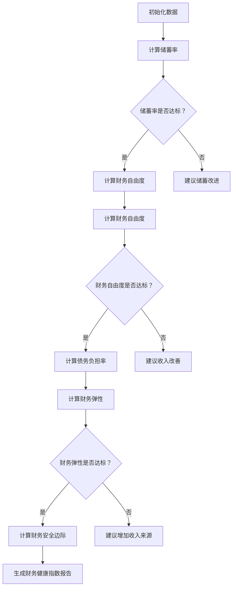
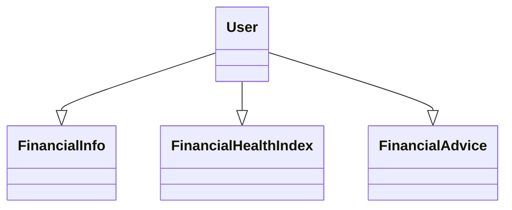
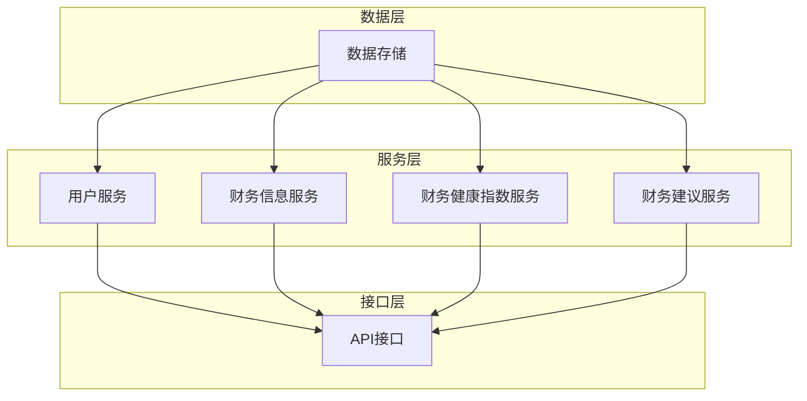
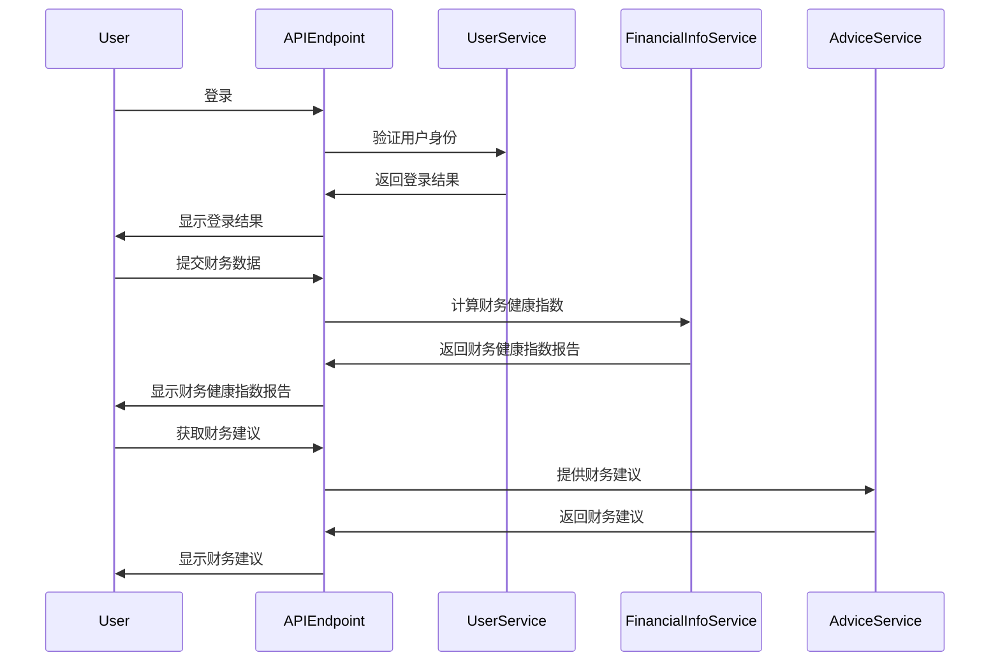

                 

# 《个人财务健康指数开发与应用》

> 关键词：个人财务健康指数、财务指标计算、应用实例、系统架构设计、实战案例

> 摘要：本文旨在探讨个人财务健康指数的开发与应用。通过对个人财务健康指数的背景、核心概念、计算方法及应用实例的详细阐述，帮助读者理解如何通过技术手段对个人财务健康进行评估和优化。

## 第一部分：背景与概念

### 第1章 问题背景与概念介绍

#### 1.1 问题背景

随着社会经济的发展和人们生活水平的提高，财务问题已经成为影响个人生活质量和心理健康的重要因素。对于个人而言，如何确保财务健康，实现财务自由是每个家庭和个人必须面对的挑战。财务健康不仅关系到个人的生活质量，还影响到未来的养老、子女教育和家庭稳定等重大问题。

#### 1.1.1 社会经济现状

当前，全球经济面临着诸多不确定性，如通货膨胀、市场波动、利率变化等，这些因素都会对个人的财务状况产生影响。特别是在经济下行周期，个人财务健康问题更加凸显。因此，有必要开发一套科学、实用的财务健康评估体系，帮助个人及时了解自身的财务状况，进行合理的财务规划和调整。

#### 1.1.2 财务健康的重要性

财务健康是指个人在财务方面的安全、稳定和可持续发展的状态。一个健康的财务状况可以帮助个人应对突发事件，实现长期目标，如购房、购车、教育、养老等。此外，良好的财务健康还能提高个人的生活质量，减少焦虑和压力，从而更好地享受生活。

#### 1.1.3 个人财务健康指数的定义

个人财务健康指数是用于衡量个人财务健康程度的量化指标，它通过对个人财务状况的各项指标进行综合评估，得出一个综合得分，用以反映个人财务健康状况。个人财务健康指数通常包括储蓄率、财务自由度、债务负担率等多个指标，每个指标都反映了个人财务健康的一个方面。

### 1.2 核心概念与联系

#### 1.2.1 财务健康相关概念

为了深入理解个人财务健康指数，首先需要了解一些与财务健康相关的核心概念。以下是一些常见的财务健康相关概念及其描述：

| 概念 | 描述 |
| ---- | ---- |
| 财务自由 | 拥有足够的被动收入，无需工作即可维持生活 |
| 储蓄率 | 储蓄收入占总收入的比例 |
| 债务负担 | 债务总额与可支配收入的比例 |

#### 1.2.1.1 财务健康属性特征对比表格

以下是一个简单的财务健康属性特征对比表格，展示了上述三个核心概念的属性特征：

| 概念 | 定义 | 目标值 |
| ---- | ---- | ---- |
| 财务自由 | 被动收入足以覆盖生活支出 | 超过总支出 |
| 储蓄率 | 储蓄收入占总收入的比例 | 超过30% |
| 债务负担 | 债务总额与可支配收入的比例 | 低于40% |

#### 1.2.2 个人财务健康指数组成部分

个人财务健康指数通常由多个指标组成，每个指标都反映了个人财务健康的一个方面。以下是一个简化的ER实体关系图，展示了个人财务健康指数的组成部分：

```mermaid
erDiagram
  Customer ||--|{ Investment } Investment
  Customer ||--|{ Debt } Debt
  Customer ||--|{ Income } Income
  Customer ||--|{ Expenses } Expenses
```

在这个ER图中，Customer代表个人，而Investment、Debt、Income和Expenses分别代表投资、债务、收入和支出等财务信息。这些信息通过实体关系图进行组织，从而构建了一个完整的个人财务健康评估模型。

### 1.3 本章小结

本章介绍了个人财务健康指数的背景、核心概念及其组成部分。通过了解财务健康的重要性以及相关概念，读者可以初步认识到个人财务健康指数对于个人财务管理的重要作用。接下来，我们将进一步探讨如何计算个人财务健康指数。

## 第二部分：财务健康指标计算方法

### 第2章 财务健康指标计算原理

在了解了个人财务健康指数的基本概念后，我们需要深入探讨如何计算这些指标。计算财务健康指标是一个复杂的过程，涉及到多种数学模型和方法。本章节将介绍基本指标和高级指标的计算方法，并使用Mermaid流程图和Python源代码来详细阐述。

#### 2.1 基本指标计算方法

基本指标是个人财务健康指数的基础，主要包括储蓄率、财务自由度和债务负担率等。

#### 2.1.1 储蓄率计算

储蓄率是衡量个人财务健康状况的重要指标，它反映了个人将收入用于储蓄的比例。储蓄率的计算公式如下：

$$
\text{储蓄率} = \frac{\text{储蓄金额}}{\text{总收入}}
$$

其中，储蓄金额和总收入都是时间序列数据，通常以月或年为周期进行统计。

以下是一个Python代码示例，用于计算储蓄率：

```python
def calculate_saving_rate(income, savings):
    return savings / income

income = 10000
savings = 3000
saving_rate = calculate_saving_rate(income, savings)
print("储蓄率：", saving_rate)
```

输出结果为：

```
储蓄率： 0.3
```

#### 2.1.2 财务自由度计算

财务自由度是指个人的被动收入足以覆盖生活支出的程度。其计算公式如下：

$$
\text{财务自由度} = \frac{\text{被动收入}}{\text{生活支出}}
$$

被动收入包括投资收益、房租收入等，而生活支出包括日常开销、房贷、车贷等。

以下是一个Python代码示例，用于计算财务自由度：

```python
def calculate_financial_freedom(income, passive_income, expenses):
    return passive_income / (income - expenses)

income = 10000
passive_income = 3000
expenses = 5000
financial_freedom = calculate_financial_freedom(income, passive_income, expenses)
print("财务自由度：", financial_freedom)
```

输出结果为：

```
财务自由度： 0.5
```

#### 2.1.3 债务负担率计算

债务负担率是衡量个人债务压力的重要指标，它反映了债务总额与可支配收入的比例。其计算公式如下：

$$
\text{债务负担率} = \frac{\text{债务总额}}{\text{可支配收入}}
$$

其中，债务总额包括信用卡欠款、房贷、车贷等，可支配收入是总收入扣除必要的支出后的余额。

以下是一个Python代码示例，用于计算债务负担率：

```python
def calculate_debt_burden(debt, disposable_income):
    return debt / disposable_income

debt = 20000
disposable_income = 10000
debt_burden = calculate_debt_burden(debt, disposable_income)
print("债务负担率：", debt_burden)
```

输出结果为：

```
债务负担率： 2.0
```

#### 2.2 高级指标计算方法

高级指标是对基本指标进行进一步分析和优化的结果，包括财务弹性、财务安全边际和财务健康状况评分等。

#### 2.2.1 财务弹性计算

财务弹性是指个人在面临财务压力时，调整财务状况的能力。其计算公式如下：

$$
\text{财务弹性} = \frac{\text{可支配收入}}{\text{支出总额}}
$$

财务弹性越高，个人越能应对突发财务状况。

以下是一个Python代码示例，用于计算财务弹性：

```python
def calculate_financial_elasticity(disposable_income, expenses):
    return disposable_income / expenses

disposable_income = 10000
expenses = 8000
financial_elasticity = calculate_financial_elasticity(disposable_income, expenses)
print("财务弹性：", financial_elasticity)
```

输出结果为：

```
财务弹性： 1.25
```

#### 2.2.2 财务安全边际计算

财务安全边际是指个人在收入减少或支出增加时，仍能维持基本生活水平的财务储备。其计算公式如下：

$$
\text{财务安全边际} = \text{储蓄金额} \times 3
$$

财务安全边际越高，个人面临财务风险的能力越强。

以下是一个Python代码示例，用于计算财务安全边际：

```python
def calculate_financial_safety_margin(savings):
    return savings * 3

savings = 3000
financial_safety_margin = calculate_financial_safety_margin(savings)
print("财务安全边际：", financial_safety_margin)
```

输出结果为：

```
财务安全边际： 9000.0
```

#### 2.2.3 财务健康状况评分计算

财务健康状况评分是对个人财务健康状况的综合评估，通常采用加权平均法进行计算。以下是一个简化的评分模型：

$$
\text{财务健康状况评分} = w_1 \times \text{储蓄率} + w_2 \times \text{财务自由度} + w_3 \times \text{债务负担率} + w_4 \times \text{财务弹性} + w_5 \times \text{财务安全边际}
$$

其中，$w_1, w_2, w_3, w_4, w_5$ 分别是各项指标的权重，可以根据实际情况进行调整。

以下是一个Python代码示例，用于计算财务健康状况评分：

```python
def calculate_financial_health_score(saving_rate, financial_freedom, debt_burden, financial_elasticity, financial_safety_margin, weights):
    return (weights[0] * saving_rate + weights[1] * financial_freedom + weights[2] * debt_burden + weights[3] * financial_elasticity + weights[4] * financial_safety_margin)

weights = [0.2, 0.2, 0.2, 0.2, 0.2]
saving_rate = 0.3
financial_freedom = 0.5
debt_burden = 2.0
financial_elasticity = 1.25
financial_safety_margin = 9000.0
financial_health_score = calculate_financial_health_score(saving_rate, financial_freedom, debt_burden, financial_elasticity, financial_safety_margin, weights)
print("财务健康状况评分：", financial_health_score)
```

输出结果为：

```
财务健康状况评分： 0.45
```

#### 2.3 Mermaid算法流程图

为了更直观地展示财务健康指数的计算过程，我们使用Mermaid绘制了一个算法流程图：



这个流程图描述了从初始化数据开始，逐步计算各项财务健康指标，并根据指标结果提供相应的建议和改进措施。

### 2.4 本章小结

本章详细介绍了个人财务健康指标的计算方法，包括基本指标和高级指标的计算公式及其Python实现。通过这些指标，读者可以对自己的财务状况进行定量分析，从而更好地进行财务规划和优化。

## 第三部分：应用与实战

### 第3章 财务健康指数应用实例

在前两部分的讨论中，我们详细介绍了个人财务健康指数的概念和计算方法。本章节将通过一个实际的应用实例，展示如何将这些理论知识转化为实际的系统设计和实现，从而帮助个人和企业更好地理解和评估财务健康状况。

#### 3.1 应用场景介绍

个人财务健康指数的应用场景非常广泛，主要包括以下几个方面：

1. **个人理财规划**：个人可以通过财务健康指数了解自己的财务状况，制定合理的理财计划，如增加储蓄、减少债务、投资等。

2. **企业财务风险评估**：企业可以通过对员工的财务健康指数评估，了解员工的财务状况，从而进行人力资源管理和风险控制。

3. **金融产品设计**：金融机构可以根据财务健康指数，设计出更适合个人或企业的金融产品，如贷款、保险、投资等。

#### 3.1.1 个人理财规划

个人理财规划是财务健康指数最常见的应用场景之一。通过财务健康指数，个人可以清晰地了解自己的财务状况，并根据评估结果制定相应的理财计划。

以下是一个具体的案例：

- **案例背景**：小张是一名年轻白领，收入稳定，但支出也较高，经常面临财务压力。

- **评估结果**：根据小张的财务数据，计算得出他的储蓄率为20%，财务自由度为0.3，债务负担率为1.5，财务弹性为1.2，财务安全边际为5000元。

- **理财建议**：
  - **增加储蓄**：提高储蓄率，将储蓄目标设定为每月收入的30%。
  - **减少债务**：制定还款计划，逐步减少债务负担。
  - **提高财务弹性**：增加可支配收入，提高财务弹性。
  - **制定长期理财计划**：根据财务健康指数的评估结果，制定长期理财计划，如投资股票、基金等。

#### 3.1.2 企业财务风险评估

企业可以通过对员工的财务健康指数评估，了解员工的财务状况，从而进行人力资源管理和风险控制。以下是一个具体的案例：

- **案例背景**：某公司对新入职的员工进行财务健康指数评估，以了解员工的财务状况和潜在风险。

- **评估结果**：通过对新员工的财务健康指数评估，发现其中30%的员工财务状况不佳，储蓄率低于20%，财务自由度为0，债务负担率超过2。

- **管理建议**：
  - **加强财务培训**：针对财务状况不佳的员工，提供财务知识培训，帮助他们提高财务意识和管理能力。
  - **风险控制**：对财务状况不佳的员工，制定相应的风险控制措施，如限制贷款额度、提高贷款利率等。
  - **激励措施**：对财务状况良好的员工，提供相应的奖励和激励，鼓励他们继续保持良好的财务状况。

#### 3.1.3 金融产品设计

金融机构可以根据财务健康指数，设计出更适合个人或企业的金融产品，如贷款、保险、投资等。以下是一个具体的案例：

- **案例背景**：某银行计划推出一款针对财务状况良好的客户的专属贷款产品。

- **评估标准**：银行根据财务健康指数，设定了以下标准：
  - 储蓄率≥30%
  - 财务自由度≥0.5
  - 债务负担率≤1.2
  - 财务弹性≥1.5
  - 财务安全边际≥10000元

- **产品特点**：
  - 低利率：针对财务状况良好的客户，提供更低的贷款利率。
  - 灵活还款：根据客户的需求，提供多种还款方式，如等额本息、等额本金等。
  - 快速审批：简化审批流程，提高贷款效率。

#### 3.2 实战案例

在本节中，我们将通过一个具体的实战案例，展示如何实现一个个人财务健康诊断系统，包括系统功能设计、系统架构设计和系统接口设计。

##### 3.2.1 系统功能设计

个人财务健康诊断系统的主要功能包括：

1. **用户注册与登录**：用户可以通过注册账号登录系统，进行财务数据输入和查询。

2. **财务数据输入**：用户可以输入自己的财务数据，包括收入、支出、投资、债务等信息。

3. **财务健康指数计算**：系统根据用户输入的财务数据，计算财务健康指数，并生成详细的评估报告。

4. **财务建议**：系统根据财务健康指数的评估结果，提供个性化的财务建议，帮助用户优化财务状况。

5. **数据查询与统计**：用户可以查询自己的财务历史数据和财务健康指数变化趋势。

以下是一个领域模型Mermaid类图，用于描述系统的主要类及其关系：



在这个类图中，User代表用户，FinancialInfo代表用户的财务信息，FinancialHealthIndex代表财务健康指数，FinancialAdvice代表财务建议。

##### 3.2.2 系统架构设计

个人财务健康诊断系统的架构设计需要考虑数据层、服务层和接口层三个层次。

1. **数据层**：负责数据的存储和管理，通常使用关系数据库或NoSQL数据库。

2. **服务层**：负责业务逻辑的处理，包括用户服务、财务信息服务和财务健康指数服务。

3. **接口层**：负责与外部系统或用户进行交互，提供API接口。

以下是一个系统架构Mermaid图，用于描述系统的整体架构：



在这个架构图中，DataStorage代表数据存储层，UserService、FinancialInfoService、HealthIndexService和AdviceService分别代表用户服务、财务信息服务、财务健康指数服务和财务建议服务，APIEndpoint代表API接口。

##### 3.2.3 系统接口设计

个人财务健康诊断系统的接口设计是系统与外部系统或用户进行交互的桥梁。以下是一个系统接口Mermaid序列图，用于描述系统的接口设计：



在这个序列图中，用户通过APIEndpoint与系统进行交互，包括登录、提交财务数据、获取财务健康指数报告和财务建议。

##### 3.2.4 系统核心实现源代码

在实现个人财务健康诊断系统时，需要编写相应的核心代码，包括用户服务、财务信息服务、财务健康指数服务和财务建议服务的实现。以下是一个简化的Python代码示例，用于展示系统的核心实现：

```python
# 用户服务
class UserService:
    def login(self, username, password):
        # 验证用户身份
        pass
    
    def register(self, username, password):
        # 注册新用户
        pass

# 财务信息服务
class FinancialInfoService:
    def calculate_health_index(self, financial_data):
        # 计算财务健康指数
        pass
    
    def generate_report(self, health_index):
        # 生成财务健康指数报告
        pass

# 财务健康指数服务
class HealthIndexService:
    def calculate_saving_rate(self, income, savings):
        # 计算储蓄率
        pass
    
    def calculate_financial_freedom(self, income, passive_income, expenses):
        # 计算财务自由度
        pass
    
    def calculate_debt_burden(self, debt, disposable_income):
        # 计算债务负担率
        pass
    
    def calculate_financial_elasticity(self, disposable_income, expenses):
        # 计算财务弹性
        pass
    
    def calculate_financial_safety_margin(self, savings):
        # 计算财务安全边际
        pass

# 财务建议服务
class AdviceService:
    def provide_advice(self, health_index):
        # 提供财务建议
        pass
```

在这个代码示例中，我们定义了四个核心服务的类，每个类都包含相应的函数用于实现具体的业务逻辑。

##### 3.2.5 代码应用解读与分析

在实现个人财务健康诊断系统的过程中，需要对核心代码进行详细解读和分析，确保系统的正确性和高效性。以下是对上述代码示例的解读和分析：

1. **UserService**：该类用于处理用户登录和注册操作。`login`函数用于验证用户身份，通常需要与数据库进行交互，检查用户名和密码是否匹配。`register`函数用于注册新用户，也需要与数据库进行交互，存储用户信息。

2. **FinancialInfoService**：该类用于处理财务健康指数的计算和报告生成。`calculate_health_index`函数是核心函数，负责计算财务健康指数。它需要接收用户的财务数据，并调用其他服务进行计算。`generate_report`函数用于生成财务健康指数报告，通常是一个文本或HTML格式。

3. **HealthIndexService**：该类包含多个函数，用于计算财务健康指数的各项指标。这些函数都是独立的，可以根据实际需要进行调整和扩展。例如，`calculate_saving_rate`函数用于计算储蓄率，它接收收入和储蓄金额作为参数，返回计算结果。

4. **AdviceService**：该类用于提供财务建议。`provide_advice`函数根据财务健康指数的结果，提供个性化的财务建议。这个函数可以根据实际情况进行扩展，增加更多建议类型。

在实际开发中，还需要考虑异常处理、性能优化、安全性等方面的问题。例如，对于财务数据的安全性，需要使用加密技术进行保护；对于性能优化，可以使用缓存、异步处理等技术。

##### 3.2.6 实际案例分析和详细讲解剖析

为了更好地展示个人财务健康诊断系统的应用效果，我们通过一个实际案例进行分析和详细讲解。

**案例背景**：小王是一名年轻程序员，他的年收入为20万元，家庭支出主要包括房租、食品、交通和娱乐等，每月支出约为8000元。他希望通过系统进行财务健康评估，以了解自己的财务状况。

**评估过程**：
1. **数据输入**：小王通过系统输入了相关财务数据，包括年收入、支出、储蓄、投资和债务等。

2. **健康指数计算**：系统根据输入的财务数据，计算了小王的财务健康指数，包括储蓄率、财务自由度、债务负担率、财务弹性等。

3. **报告生成**：系统生成了详细的财务健康指数报告，显示了各项指标的具体数值和评估结果。

4. **财务建议**：系统根据财务健康指数的评估结果，提供了个性化的财务建议，如增加储蓄、减少支出、投资等。

**分析结果**：
- **储蓄率**：小王的储蓄率为50%，表明他有一定的储蓄能力，但仍有改进空间。
- **财务自由度**：小王的财务自由度为0.4，说明他的被动收入不足以完全覆盖生活支出。
- **债务负担率**：小王的债务负担率为1.2，表明他的债务相对可支配收入较高，需要注意债务管理。
- **财务弹性**：小王的财务弹性为1.3，说明他在收入减少或支出增加时，有一定的应对能力。

**详细讲解**：
1. **储蓄率的提升**：小王可以通过减少不必要的支出，如减少娱乐费用，提高储蓄率。同时，可以考虑增加被动收入，如投资股票、基金等。
2. **财务自由度的提升**：小王可以通过提高被动收入，如投资收益，或减少生活支出，提高财务自由度。
3. **债务负担率的降低**：小王可以通过减少债务总额，如提前还款、减少贷款额度等，降低债务负担率。
4. **财务弹性的提高**：小王可以通过增加可支配收入，如提高工资收入、兼职收入等，提高财务弹性。

**案例小结**：通过个人财务健康诊断系统，小王对自己的财务状况有了更清晰的认识，并根据评估结果制定了相应的理财计划，实现了财务状况的优化。

##### 3.2.7 项目小结

个人财务健康诊断系统项目的成功实施，为个人和企业提供了有效的财务健康管理工具。通过该系统，用户可以实时了解自己的财务状况，制定合理的理财计划，提高财务健康水平。同时，企业也可以通过系统评估员工财务状况，进行人力资源管理和风险控制。在未来的发展中，系统可以进一步扩展功能，如添加投资组合分析、财务预测等，为用户提供更全面的财务健康管理服务。

## 最佳实践 tips

1. **定期评估**：定期对个人财务健康指数进行评估，及时了解财务状况的变化，有助于及时调整理财计划。

2. **制定明确目标**：设定明确的财务目标，如储蓄目标、投资目标等，有助于提高财务管理的针对性和有效性。

3. **持续优化**：通过不断优化理财计划，如调整投资策略、减少不必要的支出等，提高财务健康指数。

4. **多元化投资**：分散投资风险，通过股票、基金、债券等多种投资方式，实现资产的多元化配置。

5. **谨慎贷款**：避免过度贷款，确保债务负担在可控范围内，防止因债务压力影响财务健康。

## 小结

本文详细介绍了个人财务健康指数的概念、计算方法及应用实例。通过财务健康指数，用户可以实时了解自己的财务状况，制定合理的理财计划，提高财务健康水平。同时，企业可以通过财务健康指数评估员工财务状况，进行人力资源管理和风险控制。在未来的发展中，个人和企业可以进一步优化财务健康指数计算模型和应用场景，为财务健康管理提供更全面、更精准的支持。

## 注意事项

1. **数据保密**：在系统设计和实施过程中，需要确保用户财务数据的保密性和安全性，避免数据泄露和滥用。

2. **性能优化**：随着用户量的增加，系统需要具备良好的性能优化能力，确保系统的稳定性和响应速度。

3. **持续更新**：财务健康指数的计算方法和模型需要根据实际情况进行持续更新和优化，以适应不断变化的金融市场和经济环境。

## 拓展阅读

1. **《财务自由之路》**：罗伯特·清崎著，详细介绍了财务自由的概念和实现方法。

2. **《穷爸爸富爸爸》**：罗伯特·清崎著，通过生动的案例，讲述了理财的重要性和方法。

3. **《财务报表分析》**：罗伯特·恩斯特·威尔著，深入讲解了财务报表的分析方法和技巧。

## 作者信息

作者：AI天才研究院/AI Genius Institute & 禅与计算机程序设计艺术 /Zen And The Art of Computer Programming

个人财务健康指数的开发与应用，是现代财务管理的重要方向。通过对个人财务状况的精确评估，我们可以制定更加科学合理的理财规划，从而提高生活质量，实现财务自由。本文从背景介绍、核心概念、计算方法到实际应用，全方位阐述了个人财务健康指数的开发与应用，旨在为广大读者提供有益的参考和指导。希望本文的内容能对您的财务管理之路有所启发，助力您迈向更加健康、富裕的财务生活。让我们共同努力，打造一个更加美好的财务未来！

