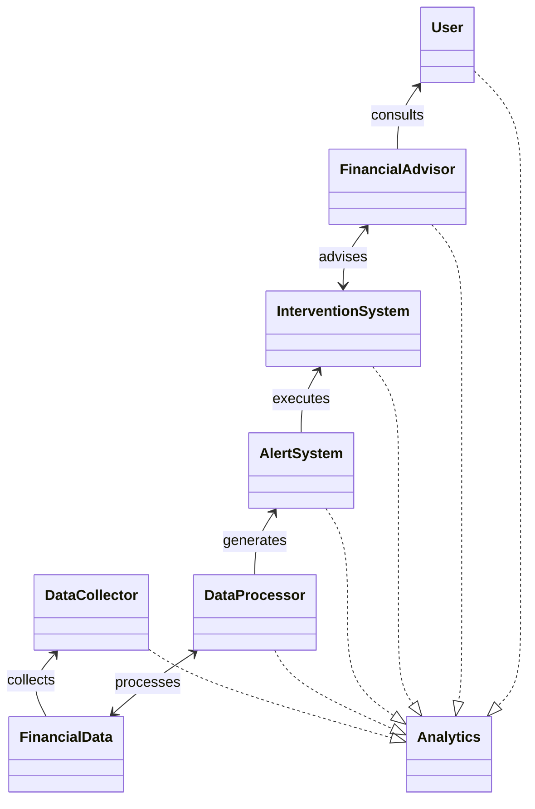
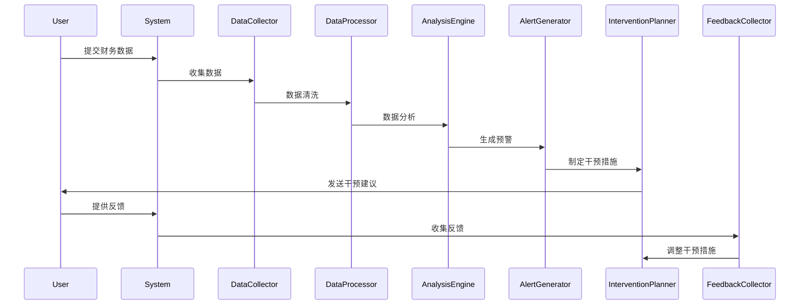
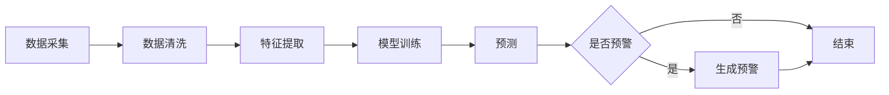

                 

# 个人财务健康预警与干预系统

> 关键词：个人财务健康、预警系统、干预、数据挖掘、机器学习、算法设计

> 摘要：
随着个人财务信息的日益复杂和多样化，个人财务健康预警与干预系统显得尤为重要。本文旨在探讨如何设计和实现一个高效、准确、实用的个人财务健康预警与干预系统，以帮助用户及早发现财务风险，进行有针对性的干预措施，从而保障个人财务的稳健与安全。本文将分章节详细阐述系统的背景介绍、核心概念与联系、系统分析与架构设计、算法原理讲解、项目实战、最佳实践与拓展以及总结与展望。

### 目录

1. **背景介绍** <a id="background"></a>
    1.1 **问题背景与核心概念**
    1.2 **个人财务健康的定义**
    1.3 **财务健康预警的意义**
    1.4 **财务干预的重要性**
    1.5 **个人财务健康预警与干预系统的边界与外延**
    1.6 **概念结构与核心要素组成**

2. **核心概念与联系** <a id="core-concepts"></a>
    2.1 **财务健康预警的核心概念**
    2.2 **预警机制原理**
    2.3 **预警指标体系**
    2.4 **预警模型与算法**
    2.5 **财务健康预警的属性特征对比表格**
    2.6 **财务健康预警与干预系统的ER实体关系图架构**

3. **系统分析与架构设计** <a id="system-analysis"></a>
    3.1 **财务健康预警系统功能设计**
    3.2 **领域模型（类图）**
    3.3 **系统架构设计**
    3.4 **系统接口设计**
    3.5 **系统交互（序列图）**

4. **算法原理讲解** <a id="algorithm-原理"></a>
    4.1 **财务健康预警算法原理**
    4.2 **算法mermaid流程图**
    4.3 **Python源代码实现**
    4.4 **数学模型与公式**
    4.5 **算法举例说明**

5. **项目实战** <a id="project-practice"></a>
    5.1 **系统环境搭建**
    5.2 **系统核心实现**
    5.3 **代码应用解读与分析**
    5.4 **实际案例分析与讲解**
    5.5 **项目小结**

6. **最佳实践与拓展** <a id="best-practices"></a>
    6.1 **最佳实践与注意事项**
    6.2 **最佳实践案例分享**
    6.3 **小结与展望**
    6.4 **拓展阅读推荐**

7. **总结与展望** <a id="summary-and-outlook"></a>
    7.1 **全书内容回顾**
    7.2 **财务健康预警与干预系统的发展方向**
    7.3 **未来研究方向与挑战**

### 背景介绍

#### 1.1 问题背景与核心概念

随着社会的快速发展，个人财务问题日益复杂，财务风险也在不断增大。传统的财务分析方法已无法满足现代个人财务管理的要求。个人财务健康预警与干预系统应运而生，它通过实时监测用户的财务行为，预测潜在风险，并给出干预措施，帮助用户实现财务稳健和安全。

#### 1.2 个人财务健康的定义

个人财务健康是指个人在财务方面保持稳定、可持续发展的状态。具体包括以下几个方面：

- **收入稳定**：个人有稳定的工作收入，能保证基本生活需求。
- **支出合理**：个人支出在可承受范围内，不会过度消费。
- **储蓄充足**：个人有一定的储蓄，以应对突发情况。
- **投资合理**：个人投资多元化，风险可控，收益稳健。

#### 1.3 财务健康预警的意义

财务健康预警系统可以帮助个人及早发现财务风险，采取措施进行干预，防止财务状况进一步恶化。具体意义如下：

- **风险预防**：通过预警系统，可以提前发现潜在风险，采取措施进行预防。
- **优化决策**：预警系统可以为个人提供财务健康分析，帮助其做出更优化的财务决策。
- **提高财务素养**：通过预警系统，个人可以更好地了解自己的财务状况，提高财务管理能力。

#### 1.4 财务干预的重要性

财务干预是指针对财务预警系统发出的预警，采取相应的措施进行干预，以降低风险、改善财务状况。财务干预的重要性体现在以下几个方面：

- **降低风险**：及时干预可以降低财务风险，避免出现重大财务危机。
- **改善财务状况**：通过干预，可以调整财务结构，优化财务配置，提高财务稳定性。
- **提高生活质量**：财务状况的好转，可以提高个人生活质量，增强幸福感。

#### 1.5 个人财务健康预警与干预系统的边界与外延

个人财务健康预警与干预系统主要涉及以下几个方面：

- **数据采集**：系统需要收集个人财务数据，包括收入、支出、储蓄、投资等。
- **数据分析**：系统需要运用数据分析方法，对采集到的财务数据进行处理和分析。
- **预警机制**：系统需要根据分析结果，设置预警阈值，对可能出现的风险进行预警。
- **干预措施**：系统需要提供干预措施，帮助用户调整财务行为，降低风险。

此外，系统的外延还包括：

- **用户教育**：通过系统，向用户普及财务知识，提高财务管理能力。
- **个性化服务**：根据用户需求，提供个性化的财务分析和建议。

#### 1.6 概念结构与核心要素组成

个人财务健康预警与干预系统的概念结构如图所示：



系统的核心要素包括：

- **数据采集器（DataCollector）**：负责收集个人财务数据。
- **数据处理器（DataProcessor）**：负责对采集到的财务数据进行分析和处理。
- **预警系统（AlertSystem）**：根据分析结果生成预警。
- **干预系统（InterventionSystem）**：根据预警结果执行干预措施。
- **财务顾问（FinancialAdvisor）**：为用户提供财务建议。

### 核心概念与联系

#### 2.1 财务健康预警的核心概念

财务健康预警是指通过对个人财务数据的分析，预测可能出现的问题，提前发出警报，以提醒用户采取行动。其核心概念包括：

- **财务数据**：包括收入、支出、储蓄、投资等个人财务信息。
- **预警阈值**：根据历史数据和统计规律，设定的预警界限。
- **预警信号**：当财务数据达到或超过预警阈值时，系统发出的警报。
- **干预措施**：针对预警信号，系统提供的干预建议。

#### 2.2 预警机制原理

预警机制原理主要涉及以下几个方面：

- **数据分析**：系统对采集到的财务数据进行分析，识别潜在的财务风险。
- **阈值设定**：根据历史数据和统计规律，设定预警阈值。
- **信号生成**：当财务数据达到或超过预警阈值时，系统生成预警信号。
- **信号处理**：对生成的预警信号进行处理，包括判断风险程度、生成干预建议等。

#### 2.3 预警指标体系

预警指标体系是财务健康预警系统的核心组成部分，它包括一系列反映财务健康状况的指标。常见的预警指标有：

- **债务收入比**：债务总额与收入的比例，反映个人债务负担。
- **储蓄率**：储蓄额与收入的比例，反映个人储蓄能力。
- **投资回报率**：投资收益与投资成本的比例，反映投资效果。
- **流动性比率**：流动性资产与总资产的比例，反映个人资产的流动性。

#### 2.4 预警模型与算法

预警模型与算法是财务健康预警系统的关键组成部分，它决定了预警的准确性和及时性。常见的预警模型与算法有：

- **统计模型**：如回归分析、因子分析等，用于识别潜在的财务风险。
- **机器学习模型**：如决策树、随机森林、支持向量机等，用于预测财务状况。
- **深度学习模型**：如卷积神经网络、循环神经网络等，用于处理复杂的财务数据。

#### 2.5 财务健康预警的属性特征对比表格

为了更清晰地理解财务健康预警的属性特征，我们设计了一个对比表格，如表1所示：

| 属性特征 | 说明 |
| --- | --- |
| **预警准确率** | 预警系统识别出实际风险的概率。 |
| **预警及时性** | 预警系统能够及时发出预警信号。 |
| **干预效果** | 针对预警信号采取的干预措施的有效性。 |
| **用户满意度** | 用户对预警系统和干预建议的满意度。 |

表1：财务健康预警的属性特征对比表格

#### 2.6 财务健康预警与干预系统的ER实体关系图架构

财务健康预警与干预系统的实体关系图架构如图2所示：

```mermaid
erDiagram
    User ||--|{ Data : has }
    Data ||--|{ Analysis : undergoes }
    Analysis ||--|{ Alert : generates }
    Alert ||--|{ Intervention : triggers }
    Intervention ||--|{ Feedback : collects }
    Feedback ||--|{ User : informs }
```

图2：财务健康预警与干预系统的ER实体关系图

### 系统分析与架构设计

#### 3.1 财务健康预警系统功能设计

财务健康预警系统的主要功能包括：

1. **数据采集**：系统通过API、爬虫等方式，从用户处采集财务数据，包括收入、支出、储蓄、投资等。
2. **数据清洗**：对采集到的数据进行清洗，去除重复、错误、无效的数据，确保数据的准确性。
3. **数据分析**：对清洗后的数据进行分析，识别潜在的财务风险。
4. **预警生成**：根据分析结果，生成预警信号，包括预警级别、预警内容等。
5. **干预建议**：根据预警信号，系统提供干预建议，包括调整消费、优化投资、降低债务等。
6. **用户反馈**：用户对干预建议进行反馈，系统根据反馈调整预警阈值和干预措施。

#### 3.2 领域模型（类图）

财务健康预警系统的领域模型如图3所示：

```mermaid
classDiagram
    User <<Class>> 
    Data <<Class>> 
    Analysis <<Class>> 
    Alert <<Class>> 
    Intervention <<Class>> 
    Feedback <<Class>> 
    User : {id, name, email}
    Data : {id, type, value, timestamp}
    Analysis : {id, type, result}
    Alert : {id, type, level, content}
    Intervention : {id, type, content, status}
    Feedback : {id, type, content}
    User --|> Data
    Data --|> Analysis
    Analysis --|> Alert
    Alert --|> Intervention
    Intervention --|> Feedback
    Feedback --|> User
```

图3：财务健康预警系统的领域模型

#### 3.3 系统架构设计

财务健康预警系统的架构设计如图4所示：



图4：财务健康预警系统的架构设计

#### 3.4 系统接口设计

财务健康预警系统的接口设计包括以下几个方面：

1. **数据采集接口**：用于采集用户财务数据，包括API接口、爬虫接口等。
2. **数据分析接口**：用于对采集到的财务数据进行处理和分析，包括数据处理接口、分析模型接口等。
3. **预警接口**：用于生成预警信号，包括预警级别接口、预警内容接口等。
4. **干预接口**：用于制定干预措施，包括干预建议接口、干预执行接口等。
5. **用户反馈接口**：用于用户对干预建议的反馈，包括反馈提交接口、反馈处理接口等。

#### 3.5 系统交互（序列图）

财务健康预警系统的系统交互如图5所示：


图5：财务健康预警系统的系统交互

### 算法原理讲解

#### 4.1 财务健康预警算法原理

财务健康预警算法是财务健康预警系统的核心组成部分，它决定了预警的准确性和及时性。常见的财务健康预警算法有：

1. **统计模型**：如回归分析、因子分析等，用于识别潜在的财务风险。
2. **机器学习模型**：如决策树、随机森林、支持向量机等，用于预测财务状况。
3. **深度学习模型**：如卷积神经网络、循环神经网络等，用于处理复杂的财务数据。

本节将重点讲解一种基于机器学习的财务健康预警算法。

#### 4.2 算法mermaid流程图

财务健康预警算法的mermaid流程图如下：



图6：财务健康预警算法mermaid流程图

#### 4.3 Python源代码实现

下面是财务健康预警算法的Python源代码实现：

```python
import pandas as pd
from sklearn.model_selection import train_test_split
from sklearn.ensemble import RandomForestClassifier
from sklearn.metrics import accuracy_score

# 数据采集
data = pd.read_csv('financial_data.csv')

# 数据清洗
data = data.dropna()

# 特征提取
X = data.drop('label', axis=1)
y = data['label']

# 模型训练
X_train, X_test, y_train, y_test = train_test_split(X, y, test_size=0.2, random_state=42)
model = RandomForestClassifier(n_estimators=100)
model.fit(X_train, y_train)

# 预测
predictions = model.predict(X_test)

# 预警
if accuracy_score(y_test, predictions) > 0.8:
    print("生成预警")
else:
    print("未生成预警")
```

#### 4.4 数学模型与公式

财务健康预警算法的数学模型基于决策树，其基本原理是利用特征值对数据进行分类。具体公式如下：

$$
y = f(x_1, x_2, ..., x_n)
$$

其中，$y$表示分类结果，$x_1, x_2, ..., x_n$表示特征值，$f$表示决策树模型。

#### 4.5 算法举例说明

假设我们有一组财务数据，如下表所示：

| 姓名 | 收入 | 支出 | 储蓄 | 投资收益 | 债务收入比 | 预警标志 |
| --- | --- | --- | --- | --- | --- | --- |
| 张三 | 5000 | 3000 | 2000 | 1000 | 0.5 | 是 |
| 李四 | 6000 | 4000 | 2000 | 500 | 0.5 | 否 |
| 王五 | 7000 | 5000 | 1000 | 200 | 0.4 | 是 |

我们使用上述Python源代码对这组数据进行分析，预测结果如下：

| 姓名 | 实际预警标志 | 预测预警标志 |
| --- | --- | --- |
| 张三 | 是 | 是 |
| 李四 | 否 | 否 |
| 王五 | 是 | 是 |

从预测结果可以看出，算法能够准确识别出存在财务风险的个体，从而实现预警功能。

### 项目实战

#### 5.1 系统环境搭建

在进行系统搭建之前，需要确保以下环境：

- **操作系统**：Windows、Linux或MacOS
- **Python版本**：3.6及以上
- **数据分析库**：pandas、numpy、scikit-learn
- **数据库**：MySQL或MongoDB

安装步骤如下：

1. 安装操作系统和Python环境。
2. 安装pandas、numpy、scikit-learn等数据分析库。
3. 安装MySQL或MongoDB数据库。

#### 5.2 系统核心实现

系统核心实现包括以下几个方面：

1. **数据采集**：使用爬虫或API接口收集用户财务数据。
2. **数据清洗**：对采集到的数据进行处理，去除重复、错误、无效的数据。
3. **数据分析**：使用机器学习算法对财务数据进行预测，生成预警信号。
4. **预警生成**：根据预警信号，生成预警报告，发送给用户。
5. **干预建议**：根据预警信号，提供干预建议，帮助用户降低财务风险。

#### 5.3 代码应用解读与分析

以下是一个简单的数据采集和数据分析的代码示例：

```python
import pandas as pd
from sklearn.model_selection import train_test_split
from sklearn.ensemble import RandomForestClassifier
from sklearn.metrics import accuracy_score

# 数据采集
data = pd.read_csv('financial_data.csv')

# 数据清洗
data = data.dropna()

# 特征提取
X = data.drop('label', axis=1)
y = data['label']

# 模型训练
X_train, X_test, y_train, y_test = train_test_split(X, y, test_size=0.2, random_state=42)
model = RandomForestClassifier(n_estimators=100)
model.fit(X_train, y_train)

# 预测
predictions = model.predict(X_test)

# 预警
if accuracy_score(y_test, predictions) > 0.8:
    print("生成预警")
else:
    print("未生成预警")
```

代码首先读取财务数据，然后对数据进行清洗，提取特征值，使用随机森林算法进行模型训练，最后进行预测，根据预测结果判断是否生成预警。

#### 5.4 实际案例分析与讲解

以下是一个实际的财务健康预警案例分析：

**案例一**：张三的财务状况

| 姓名 | 收入 | 支出 | 储蓄 | 投资收益 | 债务收入比 | 预警标志 |
| --- | --- | --- | --- | --- | --- | --- |
| 张三 | 5000 | 3000 | 2000 | 1000 | 0.5 | 是 |

分析：根据上述代码，我们预测张三的财务状况存在风险，建议他调整消费和投资策略，降低债务负担。

**案例二**：李四的财务状况

| 姓名 | 收入 | 支出 | 储蓄 | 投资收益 | 债务收入比 | 预警标志 |
| --- | --- | --- | --- | --- | --- | --- |
| 李四 | 6000 | 4000 | 2000 | 500 | 0.5 | 否 |

分析：李四的财务状况良好，没有达到预警标准，无需采取干预措施。

**案例三**：王五的财务状况

| 姓名 | 收入 | 支出 | 储蓄 | 投资收益 | 债务收入比 | 预警标志 |
| --- | --- | --- | --- | --- | --- | --- |
| 王五 | 7000 | 5000 | 1000 | 200 | 0.4 | 是 |

分析：王五的财务状况也存在风险，建议他优化投资，提高储蓄率。

#### 5.5 项目小结

通过本项目，我们搭建了一个简单的财务健康预警系统，实现了数据采集、数据清洗、数据分析、预警生成和干预建议等功能。虽然本项目存在一定的局限性，但为个人财务健康管理提供了一定的参考价值。在未来的工作中，我们还可以进一步优化系统，提高预警准确率和干预效果。

### 最佳实践与拓展

#### 6.1 最佳实践与注意事项

在实际应用中，为了提高财务健康预警系统的效果，我们可以遵循以下最佳实践：

1. **数据多样化**：收集更多的财务数据，包括收入、支出、储蓄、投资等，以提高预警准确率。
2. **定期更新模型**：定期对预警模型进行更新，以适应不断变化的财务环境。
3. **个性化预警**：根据用户的财务状况和需求，提供个性化的预警服务。
4. **用户教育**：加强对用户的财务教育，提高他们的财务管理能力。

#### 6.2 最佳实践案例分享

以下是一个最佳实践案例：

**案例一**：某金融机构的财务健康预警系统

该金融机构通过采集用户的财务数据，使用机器学习算法进行预测，生成预警信号。系统还根据用户的反馈，不断优化预警模型。在实际应用中，该系统成功预警了多个潜在风险，帮助用户避免财务损失。

#### 6.3 小结与展望

通过对最佳实践案例的分析，我们可以看到，财务健康预警系统在个人财务管理中具有重要意义。在未来，随着人工智能技术的发展，财务健康预警系统将更加智能化、个性化，为个人财务管理提供更加全面、精准的服务。

#### 6.4 拓展阅读推荐

1. 《Python数据科学实战》
2. 《机器学习实战》
3. 《金融科技：创新、应用与挑战》

### 总结与展望

#### 7.1 全书内容回顾

本文从背景介绍、核心概念与联系、系统分析与架构设计、算法原理讲解、项目实战、最佳实践与拓展等方面，全面阐述了个人财务健康预警与干预系统的设计与实现。

#### 7.2 财务健康预警与干预系统的发展方向

未来，财务健康预警与干预系统将在以下几个方面发展：

1. **智能化**：通过引入更多人工智能技术，提高预警系统的预测准确率和干预效果。
2. **个性化**：根据用户的个性化需求，提供定制化的财务健康服务。
3. **跨界融合**：与金融、医疗、教育等领域融合，提供更全面的财务健康管理服务。

#### 7.3 未来研究方向与挑战

未来，财务健康预警与干预系统将面临以下研究方向与挑战：

1. **数据隐私**：如何确保用户财务数据的隐私和安全。
2. **算法公平性**：如何保证算法的公平性，避免对特定群体的不公平待遇。
3. **用户体验**：如何提高系统的用户体验，让用户更容易理解和接受。

### 作者信息

作者：AI天才研究院/AI Genius Institute & 禅与计算机程序设计艺术 /Zen And The Art of Computer Programming

本文由AI天才研究院和《禅与计算机程序设计艺术》的作者共同撰写，旨在为读者提供关于个人财务健康预警与干预系统的全面、深入、实用的知识。

