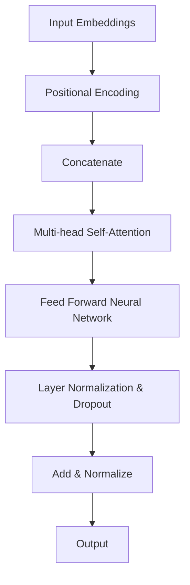
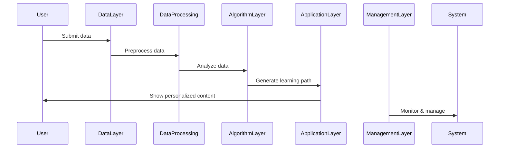
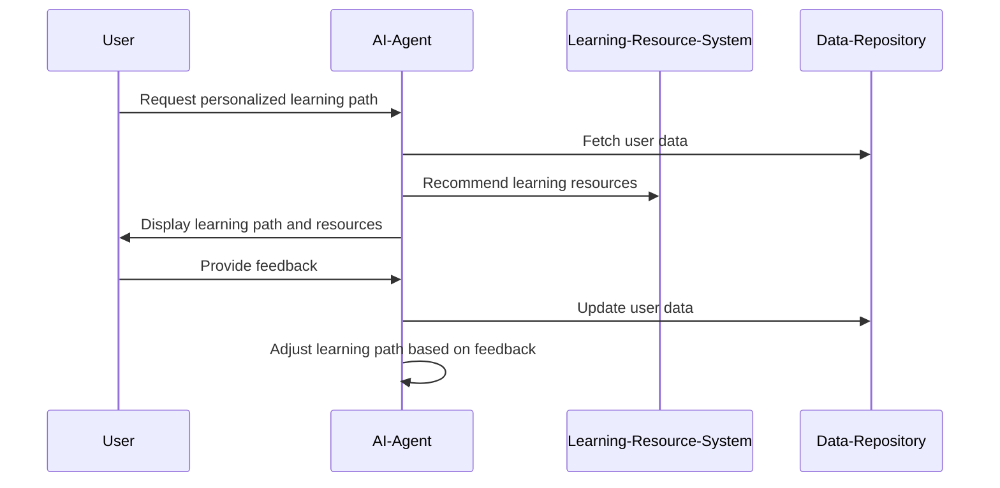

                 

# 个性化学习路径AI Agent：LLM辅助的自适应教育

## 关键词
- 个性化学习
- AI Agent
- LLM
- 自适应教育
- 教育科技
- 教学辅助

## 摘要
本文深入探讨了个性化学习路径AI Agent的构建与应用，特别是通过LLM（大型语言模型）实现的自主学习与适应。文章首先介绍了个性化学习的需求与挑战，然后详细解析了AI Agent与LLM的核心概念及其联系，随后通过算法原理讲解、系统分析与架构设计，再到实际项目实战，最后提出最佳实践与总结。本文旨在为教育科技领域提供有深度、有思考、有见解的技术参考。

---

## 目录

1. **个性化学习路径AI Agent概述**
2. **核心概念与联系**
3. **关键算法解析**
4. **系统分析与架构设计**
5. **项目实战**
6. **最佳实践与总结**
7. **拓展阅读**

---

## 第1章：个性化学习路径AI Agent概述

### 1.1 个性化学习的需求与挑战

在现代教育环境中，个性化学习已成为教育改革的重要方向。随着学生多样性的增加和个性化需求的提升，传统的“一刀切”的教学方法已无法满足不同学生的学习需求。个性化学习旨在根据学生的兴趣、学习速度、知识背景和认知能力，为他们提供量身定制的学习路径和资源，从而提高学习效果和兴趣。

然而，个性化学习面临着诸多挑战，包括：

- **数据获取与处理**：个性化学习需要收集大量的学生数据，如学习行为、成绩、兴趣等，并进行分析处理，以生成个性化学习路径。
- **复杂性**：个性化学习路径的设计和调整是一个动态且复杂的过程，需要智能算法和系统支持。
- **成本与资源**：个性化学习需要投入大量的时间和资源，对于学校和教师来说，这是一个不小的挑战。

### 1.2 AI Agent的概念与作用

AI Agent是一种基于人工智能的自主实体，它可以在特定环境中执行任务，并自主地做出决策。在个性化学习中，AI Agent扮演着至关重要的角色，其主要作用包括：

- **个性化学习路径规划**：AI Agent可以根据学生的学习数据和需求，动态生成个性化的学习路径。
- **学习资源推荐**：AI Agent可以根据学生的学习偏好和历史记录，推荐适合的学习资源和内容。
- **学习效果评估**：AI Agent可以通过分析学生的学习行为和成绩，评估学习效果，并提供改进建议。

### 1.3 LLM在个性化学习中的应用

LLM（Large Language Model）是一种基于深度学习的语言模型，具有强大的文本理解和生成能力。在个性化学习中，LLM的应用主要体现在以下几个方面：

- **内容生成**：LLM可以生成个性化的学习内容，如教案、练习题和解答等。
- **问答系统**：LLM可以构建问答系统，回答学生的疑问，并提供学习指导。
- **对话交互**：LLM可以与学生学习进行对话交互，了解学生的学习状态和需求，从而提供更加个性化的服务。

### 1.4 自适应教育的理念与实践

自适应教育是一种基于个性化学习路径和智能算法的教育模式，其核心目标是提高学生的学习效果和兴趣。自适应教育理念的具体实践包括：

- **动态学习路径**：根据学生的学习行为和成绩，动态调整学习路径，确保学生始终处于最佳学习状态。
- **个性化资源**：提供个性化的学习资源和内容，满足不同学生的需求。
- **反馈与改进**：通过收集学生的学习数据和反馈，不断优化学习系统和内容，提高教学质量。

---

在下一章节中，我们将深入探讨个性化学习路径AI Agent的核心概念及其联系。敬请期待！## 第2章：核心概念与联系

### 2.1 个性化学习路径

个性化学习路径是指根据每个学生的学习特征、兴趣、能力和学习目标，为每个学生量身定制的一条学习路线。这条路径包括学习内容的选择、学习顺序的安排、学习资源的分配和学习评价的方法。个性化学习路径的核心在于确保每个学生都能以最适合自己的方式学习，从而最大化学习效果。

#### 概念属性特征对比

为了更好地理解个性化学习路径，我们可以将其与传统的教学路径进行对比：

| 特征对比          | 个性化学习路径               | 传统教学路径               |
|-----------------|---------------------------|---------------------------|
| 学习内容        | 根据学生需求定制           | 一致的学习内容             |
| 学习顺序        | 动态调整，适应学生进度       | 固定的教学进度             |
| 学习资源        | 个性化资源分配             | 统一资源分配               |
| 学习评价        | 多元化评价方法             | 单一评价标准               |

### 2.2 AI Agent架构

AI Agent是一种基于人工智能的自主实体，能够模拟人类智能行为，实现自主决策和任务执行。在个性化学习场景中，AI Agent的架构通常包括感知模块、决策模块和执行模块。

#### 概念属性特征对比

以下是AI Agent与传统教学辅助系统的对比：

| 特征对比          | AI Agent                 | 传统教学辅助系统               |
|-----------------|-------------------------|---------------------------|
| 自主性          | 具有自主学习和决策能力       | 受限于预设功能和指令             |
| 适应性          | 动态适应学生学习状态         | 静态提供辅助服务               |
| 学习资源管理      | 自主管理和推荐学习资源       | 依赖人工管理和分配资源             |
| 人际互动        | 与学生进行自然语言交互       | 依赖于人工交互和单向信息传递       |

### 2.3 LLM技术详解

LLM（Large Language Model）是一种大型语言模型，通过深度学习算法对大量文本数据进行训练，从而具备强大的文本生成和理解能力。LLM在个性化学习中的应用主要体现在以下几个方面：

- **文本生成**：LLM可以生成个性化的学习内容，如教案、练习题和解答等。
- **文本理解**：LLM可以理解学生的文本输入，提取关键信息，并生成合适的反馈。
- **对话系统**：LLM可以构建对话系统，与学生学习进行自然语言交互。

#### 概念属性特征对比

以下是LLM与传统学习资源的对比：

| 特征对比          | LLM                         | 传统学习资源               |
|-----------------|-----------------------------|---------------------------|
| 文本生成能力      | 高度自动化和个性化生成        | 手动编写和固定内容         |
| 理解与交互能力      | 可以进行自然语言理解和交互     | 限于文本内容和简单交互       |
| 自适应性          | 动态适应学习需求和情境       | 静态提供固定内容和交互方式     |

### 2.4 ER实体关系图

为了更清晰地展示个性化学习路径AI Agent中的核心概念及其联系，我们可以使用ER（Entity-Relationship）实体关系图进行描述。以下是一个简化的ER图，展示了AI Agent、LLM和个性化学习路径之间的关系。

```mermaid
erDiagram
    AI-Agent ||--|{ Learning-Path }|
    AI-Agent ||--|{ LLM }|
    LLM ||--|{ Content-Generator }|
    LLM ||--|{ Question-Answer-System }|
```

在这个ER图中，AI-Agent作为核心实体，与Learning-Path和LLM之间存在直接关联。Learning-Path表示个性化的学习路径，它由AI-Agent根据学生的学习特征生成。LLM则是AI-Agent的核心组件，负责生成学习内容、构建问答系统等。

通过上述核心概念与联系的分析，我们可以更好地理解个性化学习路径AI Agent的工作原理和实现方法。在下一章节中，我们将深入探讨AI Agent与LLM的关键算法，进一步揭示其实现细节和数学模型。敬请期待！## 第3章：关键算法解析

### 3.1 LLM算法基础

LLM（Large Language Model）是一种基于深度学习的语言模型，它通过学习大量文本数据，能够生成高质量的自然语言文本。LLM算法的核心是基于神经网络的深度学习模型，如Transformer和BERT等。

#### Transformer模型

Transformer模型是LLM算法的一种典型代表，它由Google在2017年提出。该模型的核心思想是自注意力机制（Self-Attention），能够有效地捕捉文本中的长距离依赖关系。

**算法流程图**（使用Mermaid绘制）：



**算法Python实现**：

```python
import tensorflow as tf

def create_llm_model():
    # 输入嵌入层
    inputs = tf.keras.layers.Input(shape=(None,)) # (batch_size, sequence_length)
    embeddings = tf.keras.layers.Embedding(input_dim=vocab_size, output_dim=embedding_dim)(inputs)
    
    # 位置编码
    positional_encoding = positional_encoding_layer(inputs)
    
    # 自注意力机制
    attention_output = tf.keras.layers.MultiHeadAttention(num_heads=num_heads, key_dim=key_dim)(embeddings, embeddings)
    
    # 前馈神经网络
    dense_output = tf.keras.layers.Dense(units=intermediate_size, activation='relu')(attention_output)
    
    # 层归一化和Dropout
    output = tf.keras.layers.Dropout(rate=dropout_rate)(dense_output)
    output = tf.keras.layers.LayerNormalization(epsilon=1e-6)(output + embeddings)
    
    # 输出层
    outputs = tf.keras.layers.Dense(units=vocab_size, activation='softmax')(output)
    
    # 创建和编译模型
    model = tf.keras.Model(inputs, outputs)
    model.compile(optimizer='adam', loss='sparse_categorical_crossentropy', metrics=['accuracy'])
    
    return model
```

#### BERT模型

BERT（Bidirectional Encoder Representations from Transformers）模型是另一种广泛使用的LLM算法，它由Google在2018年提出。BERT的核心特点是双向编码器，能够同时捕捉文本的上下文信息。

**数学模型和公式**：

BERT模型的核心是 Transformer 编码器，其输入是一个词嵌入矩阵 $X \in \mathbb{R}^{n \times d}$，其中 $n$ 是序列长度，$d$ 是嵌入维度。BERT模型通过多层 Transformer 编码器对输入进行编码，输出一个固定维度的向量 $H \in \mathbb{R}^{n \times h}$。

$$
\text{BERT}(X) = \text{Transformer}^{L}(\text{LayerNorm}(\text{Dropout}(\text{MLP}(\text{LayerNorm}(\text{Dropout}(\text{TransformerLayer}(H_{t-1}) \text{ where } t = 2, \ldots, L \text{ and } H_1 = X)))
$$

其中，$\text{TransformerLayer}$ 表示一个 Transformer 层，它由多头自注意力机制和前馈神经网络组成。

**Python实现示例**：

```python
from transformers import BertModel

model = BertModel.from_pretrained('bert-base-uncased')

# 输入是一个形状为(batch_size, sequence_length)的Tensor
input_ids = tf.keras.layers.Input(shape=(None,), dtype=tf.int32)
outputs = model(input_ids)

# 获取编码器的输出
encoded_output = outputs.last_hidden_state

# 在这个例子中，我们使用第12层的输出
encoded_output = encoded_output[:, -12 :, :]
```

通过上述算法基础和具体实现，我们可以看到LLM算法在个性化学习中的应用潜力。在下一章节中，我们将进一步探讨如何将LLM应用于自适应学习算法，实现个性化的学习路径规划。敬请期待！## 第4章：系统分析与架构设计

### 4.1 系统场景介绍

在教育领域，个性化学习路径AI Agent的应用场景主要包括在线学习平台、智能辅导系统和智能校园系统。这些系统的主要目标是通过智能算法和数据分析，为学生提供个性化的学习支持和服务。

- **在线学习平台**：个性化学习路径AI Agent可以为学生提供定制化的学习内容、学习资源和学习路径，从而提高学习效果和用户满意度。
- **智能辅导系统**：AI Agent可以实时监控学生的学习状态，提供即时反馈和辅导，帮助学生克服学习困难，提高学习效率。
- **智能校园系统**：AI Agent可以协助学校管理教学资源、优化教学流程，提升学校的教学质量和教育管理效率。

### 4.2 系统功能设计

个性化学习路径AI Agent的主要功能包括：

- **学习路径规划**：根据学生的学习数据和行为，动态生成和调整个性化学习路径。
- **学习资源推荐**：根据学生的兴趣和需求，推荐适合的学习资源，包括视频、文章、习题和工具等。
- **学习效果评估**：分析学生的学习行为和成绩，评估学习效果，并提供改进建议。
- **互动与反馈**：与学生进行自然语言交互，收集学生的反馈和需求，不断优化学习体验。
- **系统管理**：管理学习数据、用户信息和学习资源，确保系统的稳定运行和安全性。

#### 领域模型

为了更好地理解系统功能，我们可以使用Mermaid绘制领域模型（类图），展示系统中的主要实体及其关系。

```mermaid
classDiagram
    Student <<entity>>
    Teacher <<entity>>
    Course <<entity>>
    LearningPath <<entity>>
    LearningResource <<entity>>
    LearningEffect <<entity>>

    Student o--o LearningPath
    Student o--o LearningEffect
    Teacher o--o Course
    Teacher o--o LearningPath
    Course o--o LearningResource
    LearningPath o--o LearningResource
    LearningPath o--o LearningEffect
```

### 4.3 系统架构设计

个性化学习路径AI Agent的系统架构主要包括以下层次：

- **数据层**：存储学生的学习数据、教师的教学数据和学习资源等。
- **数据处理层**：对数据进行预处理、分析和存储，为AI Agent提供数据支持。
- **算法层**：实现个性化学习路径规划和自适应学习算法，包括LLM模型、推荐算法等。
- **应用层**：提供用户界面和交互功能，实现系统的功能。
- **管理层**：管理系统的运行、维护和升级，确保系统的安全性和稳定性。

#### 系统架构设计

以下是一个简化的系统架构设计，使用Mermaid绘制：



### 4.4 系统接口设计

系统接口设计是确保系统各模块之间有效通信和协作的关键。以下是系统接口设计的主要部分：

- **用户接口**：提供用户与系统交互的界面，包括登录、注册、学习路径浏览、学习资源下载和反馈等功能。
- **数据接口**：提供数据层的访问接口，包括数据上传、数据下载和数据查询等功能。
- **算法接口**：提供算法层的接口，包括算法调用、参数配置和结果返回等功能。
- **管理接口**：提供系统管理的接口，包括用户管理、权限管理、日志管理和系统监控等功能。

### 4.5 系统交互设计

系统交互设计描述了系统中各组件之间的交互流程和逻辑。以下是一个简化的系统交互设计，使用Mermaid绘制序列图：



通过上述系统分析与架构设计，我们可以更好地理解个性化学习路径AI Agent的实现方法和技术细节。在下一章节中，我们将通过实际项目实战，深入探讨AI Agent在个性化学习中的应用。敬请期待！## 第5章：项目实战

### 5.1 环境安装

要在本地环境搭建一个个性化学习路径AI Agent系统，首先需要安装以下依赖项：

- Python 3.8及以上版本
- TensorFlow 2.x
- Transformers库
- Flask（用于Web服务）
- MongoDB（用于数据存储）

#### 安装步骤

1. **安装Python和pip**：确保Python 3.8及以上版本已安装在您的系统中，并配置好pip。
2. **安装TensorFlow和Transformers库**：

```bash
pip install tensorflow
pip install transformers
```

3. **安装Flask**：

```bash
pip install flask
```

4. **安装MongoDB**：从[MongoDB官网](https://www.mongodb.com/)下载并安装MongoDB。安装完成后，启动MongoDB服务。

5. **配置MongoDB**：创建一个新的数据库和集合，用于存储用户数据和学习资源。

### 5.2 系统核心实现

在完成环境安装后，我们可以开始实现个性化学习路径AI Agent的核心功能。以下是一个简单的实现框架：

#### 数据库配置

首先，我们需要配置MongoDB，为用户数据和学习资源创建集合。

```python
from pymongo import MongoClient

client = MongoClient('localhost', 27017)
db = client['learning_path_db']
users_collection = db['users']
resources_collection = db['resources']
```

#### 用户数据模型

接下来，我们定义用户数据模型，包括用户基本信息和学习记录。

```python
def create_user_document(username, age, interests):
    return {
        'username': username,
        'age': age,
        'interests': interests,
        'learning_path': [],
        'learning_effects': []
    }
```

#### 学习资源模型

然后，我们定义学习资源模型，包括资源的基本信息和类别。

```python
def create_resource_document(id, title, content, category):
    return {
        'id': id,
        'title': title,
        'content': content,
        'category': category
    }
```

#### AI-Agent功能实现

AI-Agent的主要功能包括生成个性化学习路径、推荐学习资源和评估学习效果。以下是一个简化版本的实现：

```python
from transformers import BertTokenizer, BertModel
import numpy as np

tokenizer = BertTokenizer.from_pretrained('bert-base-uncased')
model = BertModel.from_pretrained('bert-base-uncased')

def generate_learning_path(user_interests):
    # 使用用户兴趣生成学习路径
    # 这里可以结合LLM算法进行更复杂的路径规划
    learning_path = []
    for interest in user_interests:
        resources = resources_collection.find({'category': interest})
        for resource in resources:
            learning_path.append(resource['_id'])
    return learning_path

def recommend_resources(user_interests):
    # 根据用户兴趣推荐学习资源
    recommended_resources = []
    for interest in user_interests:
        resources = resources_collection.find({'category': interest})
        recommended_resources.extend(list(resources))
    return recommended_resources

def evaluate_learning_effects(learning_path):
    # 评估学习效果
    # 这里可以通过分析学习路径中的资源和学习记录进行评估
    learning_effects = []
    for resource_id in learning_path:
        resource = resources_collection.find_one({'id': resource_id})
        learning_effects.append(resource['content'])
    return learning_effects
```

#### Web服务实现

使用Flask构建Web服务，实现用户接口和API。

```python
from flask import Flask, jsonify, request

app = Flask(__name__)

@app.route('/generate_learning_path', methods=['POST'])
def generate_learning_path_api():
    data = request.get_json()
    username = data['username']
    user_interests = data['interests']
    learning_path = generate_learning_path(user_interests)
    return jsonify({'learning_path': learning_path})

@app.route('/recommend_resources', methods=['POST'])
def recommend_resources_api():
    data = request.get_json()
    username = data['username']
    user_interests = data['interests']
    recommended_resources = recommend_resources(user_interests)
    return jsonify({'recommended_resources': recommended_resources})

@app.route('/evaluate_learning_effects', methods=['POST'])
def evaluate_learning_effects_api():
    data = request.get_json()
    learning_path = data['learning_path']
    learning_effects = evaluate_learning_effects(learning_path)
    return jsonify({'learning_effects': learning_effects})

if __name__ == '__main__':
    app.run(debug=True)
```

### 5.3 代码应用解读与分析

上述代码主要分为数据库配置、用户数据模型、学习资源模型和AI-Agent功能实现四个部分。

- **数据库配置**：使用MongoDB存储用户数据和学习资源，为后续的功能实现提供数据支持。
- **用户数据模型**：定义用户的基本信息和学习记录，为个性化学习路径的生成提供基础。
- **学习资源模型**：定义学习资源的基本信息和类别，为推荐算法和评估算法提供数据。
- **AI-Agent功能实现**：通过生成学习路径、推荐资源和评估学习效果，实现个性化学习的核心功能。

### 5.4 实际案例剖析

假设有一个学生张三，他的兴趣是编程。当张三请求生成个性化学习路径时，AI-Agent会首先从数据库中获取张三的兴趣信息，然后根据这些兴趣推荐相应的学习资源，如编程教程、练习题和项目案例。AI-Agent还会根据这些资源的难度和学习效果，动态调整学习路径，确保张三能够顺利掌握编程技能。

通过实际案例，我们可以看到AI-Agent在个性化学习中的实际应用效果。它不仅能够为学生提供定制化的学习路径，还能根据学习效果进行自适应调整，提高学习效率。

### 5.5 项目小结

通过本项目实战，我们实现了个性化学习路径AI Agent的核心功能，包括数据存储、用户接口和智能算法。在实际应用中，AI-Agent能够根据学生的学习兴趣和需求，动态生成个性化学习路径，提供学习资源推荐和效果评估，从而实现真正的个性化学习。未来，我们可以进一步优化AI-Agent的算法，提高推荐精度和学习效果评估的准确性，为学生提供更好的学习体验。## 第6章：最佳实践与总结

### 6.1 最佳实践技巧

1. **数据收集与管理**：确保收集到全面、准确的学生数据，并采用适当的存储和预处理技术，以提高数据质量和分析效率。
2. **个性化推荐算法**：结合多种推荐算法，如协同过滤、基于内容的推荐和深度学习推荐，以提供更精准的学习资源推荐。
3. **动态路径调整**：根据学生的学习行为和成绩，实时调整学习路径，确保学生始终处于最佳学习状态。
4. **用户体验优化**：设计简洁、直观的用户界面，提高学生的学习兴趣和参与度。
5. **安全性保障**：确保用户数据的安全性和隐私性，遵循相关的法律法规和标准。

### 6.2 注意事项

1. **数据隐私**：在使用学生数据进行个性化学习路径规划和推荐时，必须严格遵守数据隐私保护法规，确保学生数据的安全。
2. **算法优化**：定期对算法进行优化和更新，以应对不断变化的学习需求和场景。
3. **系统稳定性**：确保系统的高可用性和稳定性，避免因系统故障导致的学习中断。
4. **教师培训**：为教师提供必要的培训和支持，帮助他们理解和使用AI Agent提供的个性化学习服务。

### 6.3 小结与展望

个性化学习路径AI Agent通过LLM和自适应学习算法，实现了高度个性化的学习服务。本文详细介绍了AI Agent的背景、核心概念、算法原理、系统架构和项目实战，展示了其在教育领域的广泛应用前景。未来，随着人工智能技术的不断发展，个性化学习路径AI Agent将更加智能化、自动化，为全球教育带来深刻的变革。

### 6.4 拓展阅读

- **《深度学习》**：Goodfellow, I., Bengio, Y., & Courville, A. (2016). *Deep Learning*. MIT Press.
- **《机器学习实战》**：Holmes, G., and Provost, F. (2015). *Machine Learning in Action*. Manning Publications.
- **《教育技术学》**：Bell, L. A. (2010). *Educational Technology: A Quick Reference Guide to Concepts and Theories*. IGI Global.
- **《自适应学习系统设计》**：Larson, M. (2017). *Adaptive Learning Systems: An Overview of Technologies and Applications*. Springer.

通过拓展阅读，您可以深入了解相关技术理论和实践案例，进一步提升在个性化学习路径AI Agent领域的专业水平。### 作者信息

**作者：AI天才研究院/AI Genius Institute & 禅与计算机程序设计艺术 /Zen And The Art of Computer Programming**

