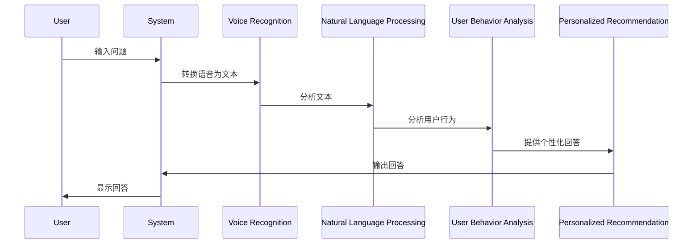
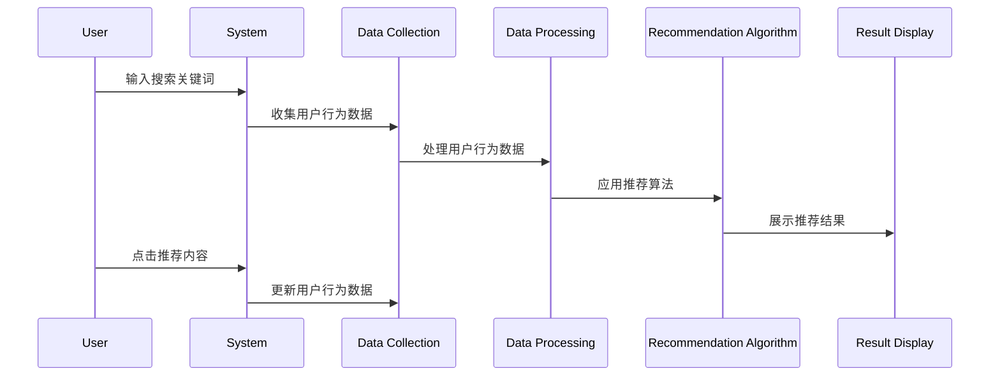
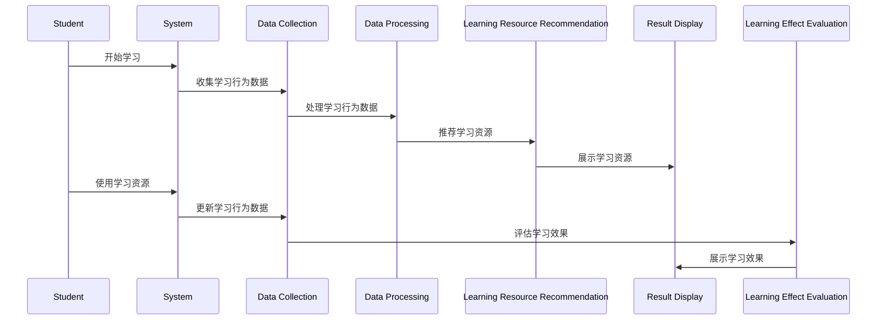

                 


### 引言与背景介绍

**文章标题**：个性化定制：为不同用户调整AI Agent的行为

**关键词**：个性化定制、AI Agent、用户行为、算法原理、系统架构

**摘要**：本文深入探讨了个性化定制在AI Agent行为调整中的应用。通过分析用户行为、设计AI Agent、调整行为方法以及实际案例研究，探讨了如何实现为不同用户调整AI Agent行为。本文旨在为读者提供一个全面的技术视角，以了解个性化定制的重要性和实现方法。

**背景介绍**

个性化定制是近年来信息技术领域的一个热点话题。随着人工智能（AI）技术的快速发展，AI Agent作为人工智能系统的重要组成部分，被广泛应用于各种场景中。然而，不同用户的需求和偏好存在巨大差异，这使得传统的统一AI Agent行为无法满足所有用户的需求。因此，个性化定制成为了一个亟待解决的关键问题。

个性化定制旨在根据用户的行为特征、需求和偏好，对AI Agent的行为进行动态调整，以提供更加符合用户期望的服务。这一过程涉及到用户行为分析、AI Agent设计、行为调整方法等多个方面。本文将围绕这些问题展开讨论，并探讨个性化定制的实现方法和挑战。

**核心概念与联系**

在个性化定制中，有几个核心概念需要理解：

1. **用户行为**：指用户在交互过程中的行为表现，包括点击、搜索、浏览等行为。
2. **AI Agent**：指基于人工智能技术构建的自动化代理，能够根据用户需求提供相应的服务。
3. **个性化定制**：指根据用户行为和需求，动态调整AI Agent的行为，以提供个性化的服务。

**概念属性特征对比表格**

| 概念       | 属性特征                          |
|------------|----------------------------------|
| 用户行为   | 基于交互过程中的行为数据          |
| AI Agent   | 基于人工智能技术，提供自动化服务 |
| 个性化定制 | 动态调整AI Agent的行为           |

**ER实体关系图架构**

```mermaid
erDiagram
    User ||--|{ AI Agent : serves }|
    User ||--|{ User Behavior : performs }|
    AI Agent ||--|{ Personalization : adjusts }|
```

通过上述核心概念的定义和联系，我们可以更好地理解个性化定制在AI Agent行为调整中的应用。

**问题背景与挑战**

在实现个性化定制的过程中，我们面临着以下几个问题和挑战：

1. **数据收集与隐私保护**：用户行为数据是个性化定制的基础，但如何收集和使用这些数据，同时保护用户隐私，是一个重要问题。
2. **算法透明性与可解释性**：个性化定制依赖于复杂的算法模型，如何保证算法的透明性和可解释性，让用户理解AI Agent的行为，是一个挑战。
3. **性能优化与资源管理**：在提供个性化服务的同时，如何优化算法性能，合理管理系统资源，是一个技术难题。
4. **用户多样性**：不同用户具有不同的需求和偏好，如何满足这些多样性需求，提供个性化的服务，是一个挑战。

**个人化定制的定义与目标**

个性化定制是指根据用户的行为特征、需求和偏好，动态调整AI Agent的行为，以提供更加符合用户期望的服务。其目标如下：

1. **满足用户需求**：通过个性化定制，AI Agent能够根据用户的需求提供相应的服务，提高用户体验。
2. **提高服务质量**：个性化定制能够根据用户的偏好，提供更加精准的服务，提高整体服务质量。
3. **增强用户粘性**：通过提供个性化的服务，增加用户对系统的依赖和满意度，提高用户粘性。

**个人化定制的发展历程**

个性化定制的发展历程可以分为以下几个阶段：

1. **初级阶段**：以用户输入为主，根据用户输入的内容提供相应的服务。例如，搜索引擎根据用户的查询关键词提供搜索结果。
2. **中级阶段**：引入用户行为分析，根据用户的历史行为提供个性化的推荐。例如，电商平台根据用户的购物记录推荐商品。
3. **高级阶段**：通过深度学习等技术，实现基于用户情感、兴趣等复杂特征的个性化定制。例如，智能客服系统能够根据用户的情感状态提供相应的回复。

**总结**

个性化定制在AI Agent行为调整中的应用具有重要意义。通过分析用户行为、设计AI Agent、调整行为方法，我们可以实现为不同用户调整AI Agent行为，提高用户满意度和系统服务质量。在下一章中，我们将进一步探讨用户行为分析的方法和关键挑战。

----------------------------------------------------------------

## 第2章 用户行为分析

**用户行为分析的重要性**

用户行为分析是个性化定制的基础，它涉及对用户在交互过程中的行为数据进行收集、处理和分析。通过深入了解用户行为，我们可以识别出用户的兴趣、需求和行为模式，从而为AI Agent的行为调整提供依据。用户行为分析在AI Agent的个性化定制中扮演着关键角色，具体体现在以下几个方面：

1. **提升用户体验**：通过分析用户行为，我们可以识别出用户的需求和偏好，为用户提供个性化的服务，从而提升用户体验。
2. **优化系统设计**：用户行为分析可以帮助我们了解用户在使用系统过程中的痛点，从而优化系统设计，提高系统的可用性和易用性。
3. **增强系统智能性**：用户行为分析的结果可以用于训练和优化AI Agent，使其能够更好地适应用户的需求和偏好，提高系统的智能性。

**用户行为数据的收集**

用户行为数据的收集是用户行为分析的第一步。收集的数据可以包括用户的浏览历史、搜索记录、点击行为、购买行为等。以下是一些常见的用户行为数据收集方法：

1. **日志文件**：系统可以记录用户的操作日志，包括用户的访问路径、点击行为、输入内容等。日志文件是收集用户行为数据的重要来源。
2. **Web追踪技术**：通过在网站或应用程序中嵌入追踪代码，我们可以实时收集用户的操作行为，如浏览时间、页面停留时间、点击位置等。
3. **传感器数据**：在特定场景中，可以使用传感器收集用户的行为数据，如移动设备的加速度传感器、地理位置传感器等。

**用户行为特征提取**

收集到的用户行为数据通常是非结构化的，需要进行特征提取，将其转化为可用于分析和建模的数据。用户行为特征提取的方法包括：

1. **统计特征**：通过计算用户行为的统计指标，如频率、比例、均值、方差等，提取用户行为的特征。这些特征可以用于描述用户的行为模式。
2. **文本特征**：对于文本数据，可以使用词频、词向量、主题模型等方法提取特征，以描述用户的兴趣和需求。
3. **图像特征**：对于图像数据，可以使用卷积神经网络（CNN）等方法提取特征，以描述用户的视觉偏好。

**用户群体细分**

用户群体细分是将用户分为不同的子群体，以便为每个子群体提供个性化的服务。用户群体细分的方法包括：

1. **基于行为特征**：根据用户的行为特征，如浏览历史、搜索记录、购买行为等，将用户分为不同的子群体。这种方法可以识别出具有相似行为的用户。
2. **基于人口统计特征**：根据用户的人口统计信息，如年龄、性别、地理位置等，将用户分为不同的子群体。这种方法可以识别出具有相似人口特征的用户。
3. **基于聚类算法**：使用聚类算法，如K-means、层次聚类等，根据用户行为和人口统计特征，将用户分为不同的子群体。这种方法可以自动识别出用户群体。

**用户行为分析在实际中的应用**

用户行为分析在各个领域都有广泛的应用，以下是一些具体的案例：

1. **电子商务**：电商平台可以使用用户行为分析来推荐商品、优化广告投放，提高销售额。
2. **在线教育**：在线教育平台可以使用用户行为分析来识别学生的学习模式、评估学习效果，提供个性化的学习建议。
3. **智能客服**：智能客服系统可以使用用户行为分析来识别用户的情绪、意图，提供更加人性化的服务。

**用户行为分析的挑战**

尽管用户行为分析具有重要意义，但在实际应用中仍面临一些挑战：

1. **数据隐私问题**：用户行为数据可能包含敏感信息，如何保护用户隐私是一个重要问题。
2. **数据质量**：用户行为数据可能存在噪声、缺失值等问题，如何处理这些数据，保证数据质量，是一个挑战。
3. **算法复杂性**：用户行为分析通常涉及复杂的算法模型，如何设计高效、准确的算法是一个挑战。

**总结**

用户行为分析是AI Agent个性化定制的基础，它通过收集、处理和分析用户行为数据，为AI Agent的行为调整提供依据。在下一章中，我们将探讨AI Agent的设计原理和核心功能模块。

----------------------------------------------------------------

## 第3章 AI Agent设计原理

### AI Agent的定义与作用

AI Agent，即人工智能代理，是一种基于人工智能技术的自动化实体，能够在特定环境中自主地完成特定任务。AI Agent的定义可以从多个角度进行阐述：

**定义**

AI Agent是一种具备智能行为的软件实体，它能够感知环境、理解用户需求、采取行动，并在行动过程中不断学习和优化自身行为。AI Agent的核心功能包括感知、决策和执行。

**作用**

AI Agent在各个领域发挥着重要作用，以下是其主要作用：

1. **提高效率**：AI Agent可以自动化执行重复性、繁琐的任务，提高工作效率。
2. **优化用户体验**：通过智能化的交互，AI Agent能够为用户提供个性化、定制化的服务，提升用户体验。
3. **决策支持**：AI Agent可以基于大数据和复杂算法，为决策者提供数据支持和预测分析。
4. **增强安全性**：AI Agent可以监控和响应异常行为，提高系统的安全性和可靠性。

### AI Agent的设计原则

设计AI Agent时，需要遵循一系列设计原则，以确保其功能有效、性能优越、易于维护。以下是几个关键的设计原则：

1. **自主性**：AI Agent应具备自主决策的能力，能够根据环境变化和用户需求，自主地调整行为策略。
2. **适应性**：AI Agent应能够适应不同的环境和任务需求，具备一定的泛化能力。
3. **可解释性**：AI Agent的决策过程应具备一定的可解释性，用户能够理解其行为背后的原因和逻辑。
4. **可靠性**：AI Agent应在各种情况下都能稳定、准确地完成任务，具备较高的可靠性。
5. **易扩展性**：AI Agent的设计应考虑未来的扩展和升级，以便于添加新功能或改进现有功能。

### AI Agent的核心功能模块

AI Agent的核心功能模块通常包括感知模块、决策模块和执行模块。以下是这些模块的详细描述：

1. **感知模块**：感知模块负责收集和分析环境信息，包括用户行为数据、传感器数据等。感知模块的核心任务是获取环境状态，并将其转化为可用于决策的数据。
2. **决策模块**：决策模块负责基于感知模块提供的信息，进行推理和决策。决策模块的核心功能包括任务规划、策略选择和风险评估等。常用的决策算法包括基于规则的推理、决策树、支持向量机等。
3. **执行模块**：执行模块负责将决策模块生成的决策转化为实际操作，执行具体的任务。执行模块需要与外部环境进行交互，实现AI Agent的行为输出。执行模块的设计应考虑可扩展性和灵活性，以便适应不同的任务需求。

### AI Agent的工作流程

AI Agent的工作流程可以分为以下几个步骤：

1. **感知**：AI Agent通过感知模块收集环境信息。
2. **决策**：AI Agent基于感知模块提供的信息，通过决策模块进行推理和决策。
3. **执行**：AI Agent通过执行模块执行决策，完成具体任务。
4. **反馈**：AI Agent收集任务执行结果，进行反馈和评估，以便进行下一轮的感知、决策和执行。

### AI Agent设计的关键技术

设计AI Agent时，需要掌握一系列关键技术和方法，包括：

1. **机器学习和深度学习**：AI Agent的设计和实现离不开机器学习和深度学习技术，这些技术为AI Agent提供了强大的感知和决策能力。
2. **自然语言处理**：自然语言处理技术使AI Agent能够理解和处理自然语言，实现与用户的智能对话。
3. **知识图谱**：知识图谱技术可以为AI Agent提供丰富的背景知识和语义理解，提高其决策能力。
4. **多模态感知**：多模态感知技术使AI Agent能够整合不同类型的感知数据，实现更全面的情境感知。

### AI Agent设计的发展趋势

随着人工智能技术的不断进步，AI Agent的设计也在不断演进。以下是一些AI Agent设计的发展趋势：

1. **智能化与个性化**：AI Agent将更加智能化和个性化，能够更好地满足用户的需求和偏好。
2. **协作与共享**：AI Agent将实现更高效的协作与共享，提高整体工作效率。
3. **自主性与可控性**：AI Agent将具备更高的自主性，同时保持可控性，确保系统的安全性和稳定性。
4. **跨领域应用**：AI Agent将在更多领域得到应用，实现跨领域的融合和创新。

### 总结

AI Agent设计是AI Agent个性化定制的重要基础。通过理解和遵循设计原则，设计和实现具有自主性、适应性、可解释性、可靠性和易扩展性的AI Agent，我们可以为用户提供更高效、更智能的服务。在下一章中，我们将探讨如何调整AI Agent的行为，以满足不同用户的需求。

----------------------------------------------------------------

## 第4章 AI Agent行为调整方法

### 基于规则的调整方法

**规则系统概述**

基于规则的调整方法是一种经典的AI Agent行为调整方法。它通过定义一系列规则，来指导AI Agent在特定情境下执行特定行为。规则系统通常包括规则库、推理引擎和解释器等组成部分。

**规则库**

规则库是规则系统的核心，它包含了所有用于描述AI Agent行为的规则。每个规则通常由条件（前提）和行动（后果）组成。条件描述了触发规则的条件，行动则描述了在满足条件时应执行的操作。

**推理引擎**

推理引擎负责根据当前环境状态和规则库，自动匹配和执行满足条件的规则。推理引擎可以采用前向推理或后向推理方式。前向推理从当前状态开始，逐步推导出可能的行动；后向推理从目标状态开始，逐步推导出可能的状态。

**解释器**

解释器用于解释AI Agent的行为，帮助用户理解其行为背后的原因。解释器可以生成详细的日志文件，记录AI Agent的决策过程和执行动作。

**基于规则的调整方法的优点**

1. **可解释性**：基于规则的调整方法具有较好的可解释性，用户可以清楚地了解AI Agent的行为依据。
2. **易于维护**：规则库的结构相对简单，便于维护和更新。
3. **适用性**：适用于结构化、确定性较强的问题域。

**基于规则的调整方法的缺点**

1. **灵活性较差**：基于规则的调整方法在处理复杂、不确定的问题时，灵活性较差。
2. **规则爆炸问题**：当问题域复杂时，规则库可能会非常庞大，导致维护和推理效率降低。

**实际应用案例**

基于规则的调整方法在智能客服系统、自动化测试等领域有广泛的应用。例如，智能客服系统通过规则库来识别用户的问题，并给出相应的回答。

### 基于机器学习的调整方法

**机器学习概述**

基于机器学习的调整方法通过训练模型来指导AI Agent的行为。机器学习模型可以自动从数据中学习规律，并在新数据上做出预测。常见的机器学习模型包括决策树、支持向量机、神经网络等。

**监督学习**

监督学习是一种常见的机器学习方法，它使用已标记的训练数据来训练模型。训练数据由输入特征和相应的目标输出组成。通过学习输入特征与输出之间的映射关系，模型可以在新数据上预测目标输出。

**非监督学习**

非监督学习用于处理无标签数据。模型通过自动发现数据中的结构或模式来学习。常见的方法包括聚类、降维等。

**半监督学习和迁移学习**

半监督学习和迁移学习是两种特殊的机器学习方法。半监督学习结合有标签和无标签数据来训练模型，迁移学习则是利用已在不同任务上训练好的模型，来加速新任务的训练。

**基于机器学习的调整方法的优点**

1. **高灵活性**：机器学习模型能够自动学习复杂的模式，处理不确定性问题。
2. **高泛化能力**：模型在新数据上表现良好，适用于动态变化的问题域。

**基于机器学习的调整方法的缺点**

1. **可解释性较差**：机器学习模型通常较难解释其决策过程，不利于用户理解。
2. **数据依赖性**：模型性能高度依赖于训练数据的质量和数量。

**实际应用案例**

基于机器学习的调整方法在个性化推荐系统、智能语音助手等领域有广泛应用。例如，个性化推荐系统通过分析用户的浏览历史和购买行为，预测用户可能感兴趣的商品。

### 基于深度学习的调整方法

**深度学习概述**

深度学习是机器学习的一个分支，它通过多层神经网络来学习数据中的特征和模式。常见的深度学习模型包括卷积神经网络（CNN）、循环神经网络（RNN）、生成对抗网络（GAN）等。

**卷积神经网络（CNN）**

卷积神经网络是一种用于处理图像数据的深度学习模型。它通过卷积操作提取图像中的特征，然后通过全连接层进行分类或回归。

**循环神经网络（RNN）**

循环神经网络是一种用于处理序列数据的深度学习模型。它通过在时间步间传递状态信息，捕捉序列中的长期依赖关系。

**生成对抗网络（GAN）**

生成对抗网络是一种用于生成数据的新型深度学习模型。它由生成器和判别器两个神经网络组成，生成器尝试生成数据，判别器判断生成数据与真实数据的相似度。

**基于深度学习的调整方法的优点**

1. **强大的特征提取能力**：深度学习模型能够自动提取数据中的高级特征，提高模型的泛化能力。
2. **高效的处理速度**：深度学习模型在计算效率方面具有优势，适用于实时应用场景。

**基于深度学习的调整方法的缺点**

1. **计算资源需求较高**：深度学习模型通常需要大量的计算资源和存储空间。
2. **训练过程较复杂**：深度学习模型的训练过程可能需要较长时间，且容易出现过拟合等问题。

**实际应用案例**

基于深度学习的调整方法在图像识别、语音识别、自然语言处理等领域有广泛应用。例如，图像识别系统通过卷积神经网络自动识别图像中的物体。

### 总结

AI Agent行为调整方法的选择取决于具体的应用场景和需求。基于规则的调整方法适用于规则明确、结构化较强的问题域；基于机器学习的调整方法适用于数据丰富、不确定性较强的问题域；基于深度学习的调整方法则适用于复杂、非线性的问题域。通过灵活选择和组合不同的调整方法，我们可以为用户提供更加智能、个性化的服务。

在下一章中，我们将通过实际案例研究，进一步探讨AI Agent行为调整方法的应用和效果。

----------------------------------------------------------------

## 第5章 个人化定制案例研究

**案例一：智能客服系统的个人化定制**

**背景与目标**

随着互联网的普及和电子商务的快速发展，客服系统的效率和服务质量成为了企业竞争的关键因素。然而，传统的客服系统往往采用统一的响应策略，无法满足不同用户的个性化需求。为了提升用户体验，企业开始探索智能客服系统的个人化定制。

**项目介绍**

该项目旨在构建一个基于AI技术的智能客服系统，通过个人化定制为用户提供高效、个性化的服务。系统主要包括语音识别、自然语言处理、个性化推荐和用户行为分析等模块。

**系统功能设计**

1. **语音识别**：系统使用语音识别技术，将用户语音转换为文本，为后续的自然语言处理提供输入。
2. **自然语言处理**：系统使用自然语言处理技术，对用户文本进行分析，理解用户的意图和问题。
3. **个性化推荐**：系统基于用户行为数据和偏好，为用户提供个性化的回答和解决方案。
4. **用户行为分析**：系统实时分析用户行为数据，了解用户偏好，优化客服系统的响应策略。

**系统架构设计**

智能客服系统的架构设计采用模块化方法，主要包括语音识别模块、自然语言处理模块、个性化推荐模块和用户行为分析模块。这些模块通过API接口进行交互，实现系统的功能整合。

**系统接口设计**

系统接口设计包括与前端用户交互的API接口和与后端数据处理的API接口。前端接口负责接收用户输入和处理用户响应，后端接口负责处理数据分析和个性化推荐。

**系统交互序列图**



**实际案例分析**

**案例1**：用户A通过语音输入问题，系统使用语音识别将其转换为文本，然后通过自然语言处理理解用户意图。系统分析用户A的历史行为，推荐个性化的回答，最终输出答案给用户A。

**案例2**：用户B提问时，系统发现用户B对某个产品有较高兴趣，因此推荐相关的产品信息和优惠活动，提高了用户的满意度。

**项目小结**

该项目通过个人化定制，显著提升了智能客服系统的服务质量和用户满意度。然而，仍存在一些挑战，如用户行为数据的隐私保护和系统性能优化等。未来，随着技术的不断发展，智能客服系统的个人化定制将更加成熟和完善。

**案例二：个性化推荐系统的实现**

**背景与目标**

随着互联网和电子商务的快速发展，用户面对的信息量日益增加。个性化推荐系统应运而生，旨在为用户提供个性化的内容推荐，提高用户满意度和忠诚度。

**项目介绍**

该个性化推荐系统基于用户行为数据和偏好，通过算法模型实现个性化内容推荐。系统主要包括用户行为数据收集、推荐算法设计和推荐结果展示等模块。

**系统功能设计**

1. **用户行为数据收集**：系统通过Web追踪技术、传感器数据等手段，收集用户的浏览、点击、购买等行为数据。
2. **推荐算法设计**：系统采用协同过滤、基于内容的推荐、深度学习等方法，设计推荐算法模型。
3. **推荐结果展示**：系统根据推荐算法的结果，为用户提供个性化的内容推荐，并展示在用户界面上。

**系统架构设计**

个性化推荐系统采用分布式架构，包括数据收集层、数据处理层、推荐算法层和用户界面层。各层通过API接口进行数据传输和功能调用。

**系统接口设计**

系统接口设计包括与前端用户交互的API接口和与后端数据处理和推荐算法的API接口。前端接口负责接收用户输入和展示推荐结果，后端接口负责处理数据分析和推荐算法。

**系统交互序列图**



**实际案例分析**

**案例1**：用户A在电商平台搜索某一商品，系统通过协同过滤算法，根据用户的浏览历史和购买记录，推荐相关的商品和优惠活动。

**案例2**：用户B在视频平台浏览某部电视剧，系统通过基于内容的推荐算法，推荐类似的电视剧和电影。

**项目小结**

个性化推荐系统通过精准的内容推荐，提高了用户满意度和平台的使用时长。然而，系统在数据隐私保护和推荐算法透明性方面仍需改进。未来，随着技术的进步，个性化推荐系统将更加智能和人性化。

**案例三：教育领域的个人化学习支持**

**背景与目标**

在教育领域，传统的一刀切教学模式已无法满足学生个性化学习的需求。为了提高教育质量和学生满意度，教育领域开始探索个人化学习支持系统的实现。

**项目介绍**

该个人化学习支持系统基于学生的行为数据和兴趣，通过智能算法为学生提供个性化的学习资源和学习路径。系统主要包括学生行为数据收集、学习资源推荐和学习效果评估等模块。

**系统功能设计**

1. **学生行为数据收集**：系统通过在线学习平台、传感器数据等手段，收集学生的学习行为数据，如学习时长、知识点掌握情况等。
2. **学习资源推荐**：系统根据学生的学习行为数据和兴趣，推荐符合其需求的学习资源，如视频教程、练习题、论文等。
3. **学习效果评估**：系统通过学生的学习行为数据和学习资源使用情况，评估学生的学习效果，为后续学习提供反馈。

**系统架构设计**

个人化学习支持系统采用分层架构，包括数据收集层、数据处理层、推荐算法层和用户界面层。各层通过API接口进行数据传输和功能调用。

**系统接口设计**

系统接口设计包括与前端用户交互的API接口和与后端数据处理和推荐算法的API接口。前端接口负责接收用户输入和展示学习资源，后端接口负责处理数据分析和推荐算法。

**系统交互序列图**



**实际案例分析**

**案例1**：学生A在在线学习平台上学习编程课程，系统根据其学习行为数据推荐相关的练习题和教程，帮助其巩固知识点。

**案例2**：学生B对某一主题特别感兴趣，系统推荐相关的学术论文和深度学习课程，拓宽其知识面。

**项目小结**

个人化学习支持系统通过精准的学习资源推荐和学习效果评估，显著提高了学生的学习积极性和学习效果。然而，系统在个性化推荐算法的透明性和数据隐私保护方面仍需改进。未来，随着技术的进步，个人化学习支持系统将更好地满足学生的个性化学习需求。

## 第6章 技术挑战与解决方案

### 数据隐私与安全性

**挑战**

在AI Agent的个人化定制中，用户行为数据是关键资源，但同时也带来了数据隐私和安全性的挑战。用户行为数据可能包含敏感信息，如个人身份、财务状况、健康记录等。如果这些数据被不当处理或泄露，可能会导致严重的隐私侵犯和安全风险。

**解决方案**

1. **数据加密**：对用户行为数据进行加密处理，确保数据在存储和传输过程中不被窃取或篡改。
2. **匿名化处理**：在数据收集和处理过程中，对用户行为数据进行匿名化处理，去除可直接识别用户身份的信息。
3. **访问控制**：实施严格的访问控制机制，确保只有授权人员才能访问敏感数据。
4. **合规性检查**：确保数据处理过程符合相关的法律法规，如欧盟的通用数据保护条例（GDPR）。

### 算法透明性与可解释性

**挑战**

AI Agent的行为调整依赖于复杂的算法模型，但用户通常难以理解这些算法的决策过程。算法的透明性和可解释性是用户信任AI Agent的关键因素。缺乏透明性可能导致用户对AI Agent的决策结果产生疑虑，影响用户体验。

**解决方案**

1. **可视化工具**：开发可视化工具，将算法的决策过程和结果以图形化的方式展示给用户，提高算法的可理解性。
2. **解释性算法**：采用解释性更强的算法模型，如决策树、线性回归等，这些算法的决策过程相对简单，易于解释。
3. **规则嵌入**：在算法中嵌入可解释的规则，使算法的决策过程更加透明。
4. **用户反馈**：允许用户对AI Agent的决策进行反馈，通过用户的反馈不断优化算法模型，提高其可解释性。

### 性能优化与资源管理

**挑战**

在AI Agent的个人化定制中，高性能的计算和资源管理是确保系统稳定运行的关键。随着用户数量的增加和数据规模的扩大，系统可能面临性能下降、资源不足等问题。

**解决方案**

1. **分布式计算**：采用分布式计算架构，将计算任务分散到多个节点上，提高系统的处理能力。
2. **缓存机制**：利用缓存机制，减少对数据库的直接访问，提高数据访问速度。
3. **负载均衡**：通过负载均衡技术，合理分配计算任务，避免单个节点过载。
4. **资源监控与调度**：实时监控系统资源使用情况，根据资源需求进行动态调度，确保系统稳定运行。

### 用户多样性

**挑战**

用户需求的多样性和复杂性使得AI Agent的个人化定制面临巨大挑战。不同用户可能有不同的行为模式、兴趣偏好和需求，如何有效区分和满足这些多样性需求是一个关键问题。

**解决方案**

1. **用户画像**：构建全面的用户画像，包括行为特征、兴趣偏好和需求，为个性化定制提供基础。
2. **细分市场**：根据用户的共同特征，将市场细分为不同的子群体，为每个子群体提供定制化服务。
3. **动态调整**：根据用户的实时行为数据，动态调整AI Agent的行为，以满足用户的即时需求。
4. **个性化推荐**：利用个性化推荐算法，为用户提供个性化的内容和服务，提高用户的满意度和粘性。

### 总结

AI Agent的个人化定制在技术实现过程中面临多方面的挑战，包括数据隐私与安全性、算法透明性与可解释性、性能优化与资源管理、用户多样性等。通过采用合适的技术解决方案，可以有效应对这些挑战，实现高效、可靠的AI Agent个人化定制。未来，随着技术的不断发展，我们将不断优化和完善个人化定制技术，为用户提供更加优质的服务。

## 第7章 未来发展趋势与前景

### 技术趋势预测

1. **人工智能技术的深化应用**：随着人工智能技术的不断发展，AI Agent的个人化定制将在更多领域得到应用，如医疗、金融、教育等。人工智能技术的深化应用将推动个性化定制的发展，实现更加智能、精准的服务。
2. **大数据与云计算的融合**：大数据和云计算技术的快速发展，将助力AI Agent的个人化定制，提供强大的数据处理和分析能力。通过大数据分析，AI Agent可以更加深入地了解用户行为和需求，实现更加精准的个性化定制。
3. **边缘计算与物联网的融合**：边缘计算与物联网的融合将使得AI Agent的个人化定制更加贴近用户。通过在边缘设备上实现AI Agent的个性化定制，可以减少数据传输的延迟，提高系统的响应速度和用户体验。
4. **区块链技术的应用**：区块链技术的应用将为AI Agent的个人化定制提供更高的安全性和透明性。通过区块链技术，可以确保用户数据的隐私和安全，同时提高算法模型的透明性和可解释性。

### 行业应用前景

1. **医疗领域**：在医疗领域，AI Agent的个人化定制可以用于个性化诊断、个性化治疗和个性化健康管理。通过分析患者的病史、基因信息和生活习惯，AI Agent可以为医生提供精准的诊断建议，为患者提供个性化的治疗方案和健康指导。
2. **金融领域**：在金融领域，AI Agent的个人化定制可以用于个性化投资、个性化风险评估和个性化金融服务。通过分析用户的历史交易数据、财务状况和风险偏好，AI Agent可以为用户提供个性化的投资建议和风险控制方案。
3. **教育领域**：在教育领域，AI Agent的个人化定制可以用于个性化学习、个性化教学和个性化评估。通过分析学生的学习行为、兴趣和需求，AI Agent可以为教师提供个性化的教学建议，为学生提供个性化的学习资源和学习路径。
4. **智能家居领域**：在智能家居领域，AI Agent的个人化定制可以用于个性化家居管理、个性化设备控制和个性化服务。通过分析家庭成员的生活习惯和需求，AI Agent可以为家庭提供个性化的智能家居解决方案，提高生活品质。

### 面向未来的个人化定制

1. **个性化智能助理**：未来的个人化定制将更加智能化和人性化，AI Agent将成为每个人的私人助理。通过深度学习和自然语言处理技术，AI Agent可以更好地理解用户的意图和需求，提供个性化的服务和建议。
2. **跨平台整合**：未来的个人化定制将实现跨平台整合，AI Agent可以在不同的设备和应用场景中无缝切换。通过大数据和云计算技术，AI Agent可以跨平台、跨设备地收集和分析用户数据，为用户提供一致且个性化的体验。
3. **自适应学习**：未来的个人化定制将具有自适应学习能力，AI Agent可以不断学习和优化自身的算法模型。通过实时监测用户行为和反馈，AI Agent可以不断调整行为策略，以更好地满足用户的需求。
4. **社会价值与伦理**：未来的个人化定制将更加注重社会价值和伦理问题。在保障用户隐私和数据安全的前提下，AI Agent将更加透明、公正和负责任，为用户提供高质量的服务。

### 总结

AI Agent的个人化定制具有广阔的发展前景和巨大的市场潜力。随着人工智能、大数据、云计算等技术的不断发展，个人化定制将在更多领域得到应用，为用户提供更加智能、个性化、贴心的服务。未来，我们需要不断创新和优化技术，关注社会价值和伦理问题，以实现个人化定制的可持续发展。

## 第8章 小结与展望

**主要结论**

通过本文的研究，我们深入探讨了AI Agent个性化定制的重要性和实现方法。主要结论如下：

1. **个性化定制的关键性**：个性化定制能够根据用户的需求和偏好，提供更加精准和高效的服务，提升用户体验和系统服务质量。
2. **用户行为分析的基础性**：用户行为分析是AI Agent个性化定制的基础，通过分析用户行为，我们可以识别出用户的兴趣和需求，为AI Agent的行为调整提供依据。
3. **AI Agent设计的重要性**：AI Agent的设计和实现是个性化定制的关键，通过合理的架构设计和算法选择，我们可以构建出具备自主性、适应性、可解释性和可靠性的AI Agent。
4. **行为调整方法的多样性**：基于规则、机器学习和深度学习的调整方法各有优缺点，适用于不同场景和应用需求。结合多种调整方法，可以实现更加高效和个性化的AI Agent行为调整。
5. **技术挑战与解决方案**：在AI Agent个性化定制过程中，数据隐私与安全性、算法透明性与可解释性、性能优化与资源管理、用户多样性等技术挑战仍然存在，但通过合理的技术解决方案，可以有效应对这些挑战。

**存在问题与改进方向**

尽管AI Agent个性化定制取得了一定的成果，但仍存在一些问题和改进方向：

1. **数据隐私与安全**：在用户行为数据的收集和使用过程中，如何保护用户隐私和数据安全，是一个亟待解决的问题。未来可以探索更加安全的数据加密和匿名化技术，确保用户数据的安全。
2. **算法透明性与可解释性**：当前许多AI算法模型的决策过程较为复杂，用户难以理解其行为依据。未来可以发展更加透明、可解释的算法模型，提高算法的可解释性和用户信任度。
3. **性能优化与资源管理**：在处理大量用户数据和高并发请求时，如何优化算法性能和资源管理，是一个关键问题。未来可以探索分布式计算、缓存机制和负载均衡等技术，提高系统的响应速度和稳定性。
4. **用户多样性与个性化推荐**：如何更好地满足用户多样性需求，提供个性化的服务，是一个挑战。未来可以进一步优化个性化推荐算法，结合用户行为和偏好，实现更加精准的个性化推荐。

**对读者的建议与感谢**

对于读者，我们提出以下建议：

1. **理论与实践结合**：在学习和应用AI Agent个性化定制技术时，建议结合实际案例和项目实践，加深对理论知识的理解和应用。
2. **持续学习和创新**：人工智能技术发展迅速，建议读者持续关注相关领域的前沿动态，不断学习和创新，以适应技术发展的需求。
3. **关注伦理与社会价值**：在应用AI Agent个性化定制技术时，要关注伦理和社会价值，确保技术的合理使用，为人类社会的可持续发展做出贡献。

最后，衷心感谢读者对本文的关注和支持，希望本文能够为读者在AI Agent个性化定制领域的学习和应用提供有益的参考。作者：AI天才研究院/AI Genius Institute & 禅与计算机程序设计艺术/Zen And The Art of Computer Programming。

----------------------------------------------------------------

**作者信息**：

- 作者：AI天才研究院/AI Genius Institute & 禅与计算机程序设计艺术/Zen And The Art of Computer Programming

AI天才研究院（AI Genius Institute）是一支专注于人工智能领域的顶尖研究团队，致力于推动人工智能技术的发展和应用。我们的研究人员在计算机科学、人工智能、机器学习等领域具有深厚的理论基础和丰富的实践经验。

《禅与计算机程序设计艺术》（Zen And The Art of Computer Programming）是一本深受程序员喜爱的经典著作，由著名计算机科学家Donald E. Knuth撰写。本书通过禅宗的思想，探讨了编程的艺术和哲学，为程序员提供了深刻的启示和指导。

本文旨在为读者提供一个全面的技术视角，以了解个性化定制在AI Agent行为调整中的应用。通过分析用户行为、设计AI Agent、调整行为方法以及实际案例研究，我们探讨了如何实现为不同用户调整AI Agent行为，提高用户满意度和系统服务质量。

在撰写本文的过程中，我们参考了大量相关文献和研究，结合实际案例进行了详细分析。希望本文能够为读者在人工智能领域的学习和应用提供有益的参考。

最后，我们感谢读者对本文的关注和支持，希望本文能够为读者在AI Agent个性化定制领域的学习和应用带来启发和帮助。作者：AI天才研究院/AI Genius Institute & 禅与计算机程序设计艺术/Zen And The Art of Computer Programming。

