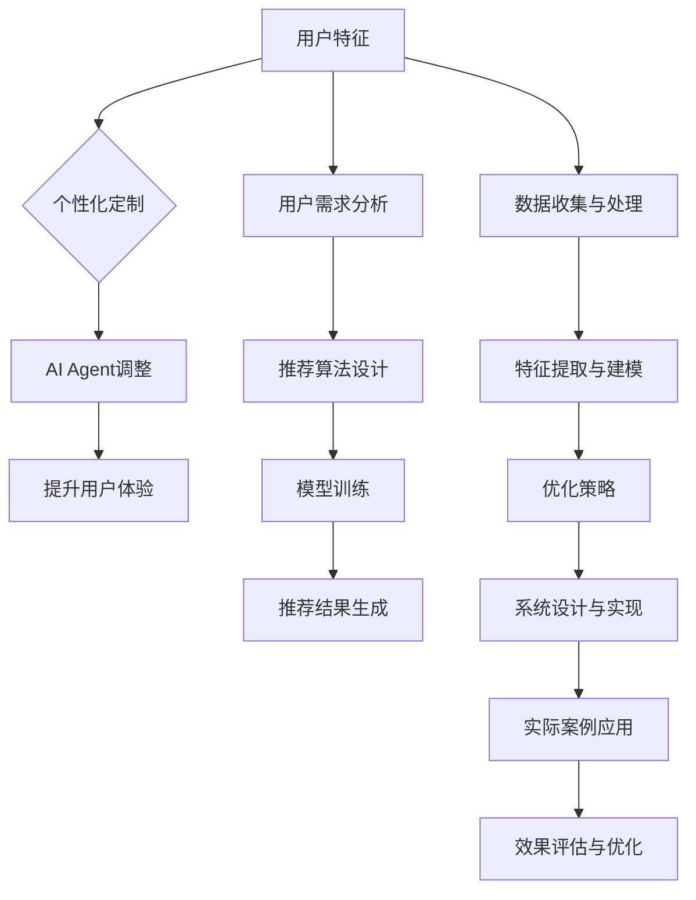
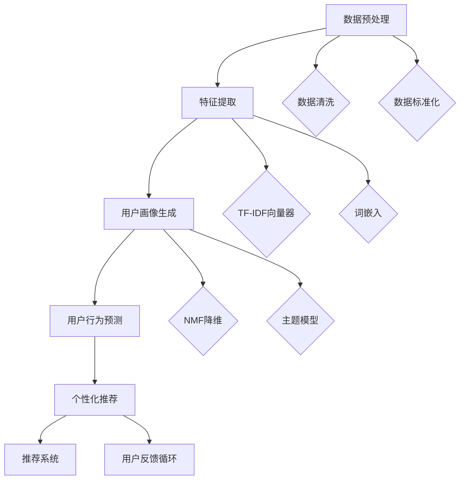
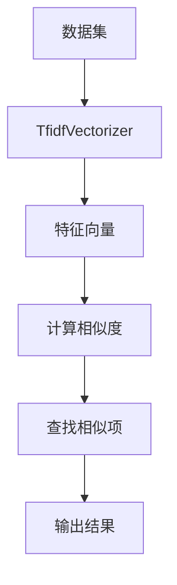
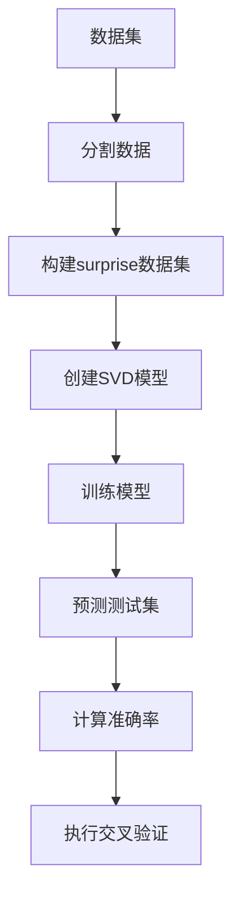
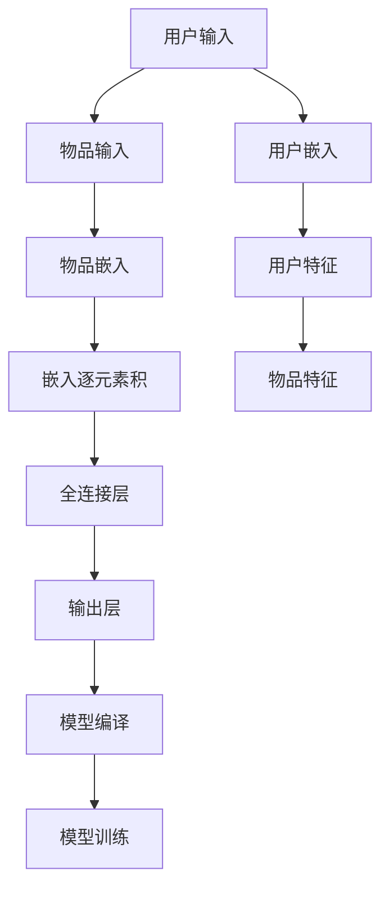
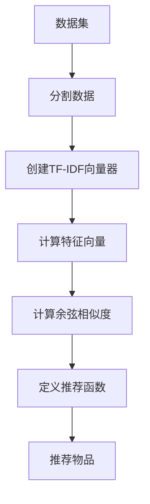
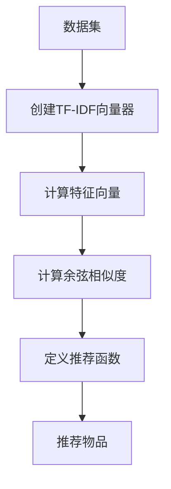

                 

**# 个性化定制：根据用户特征调整AI Agent**

> 关键词：个性化定制、AI Agent、用户特征、机器学习、算法、系统设计

> 摘要：随着人工智能技术的发展，AI Agent在各个领域的应用越来越广泛。为了提高用户体验，个性化定制成为了AI Agent发展的关键。本文将探讨如何根据用户特征调整AI Agent，包括核心概念、算法、数学模型、系统设计和实际案例等方面，旨在为读者提供全面的技术指导。

## 引言：个性化定制的背景和意义

### 1. 背景介绍

随着互联网和大数据技术的飞速发展，个性化定制已经成为了现代服务和企业竞争的重要手段。用户的需求越来越多样化，传统的“一刀切”式服务已经无法满足用户个性化、差异化需求。在这种背景下，AI Agent作为智能服务的核心组件，其个性化定制能力成为了提升用户体验的关键。

### 2. 个性化定制的意义

个性化定制不仅能够提升用户体验，还能提高企业的运营效率和竞争力。通过了解用户的个性化需求，AI Agent可以提供更加精准的服务，从而增强用户黏性和忠诚度。同时，个性化定制还能为企业带来更多的商业机会，实现精准营销和业务增长。

### 3. AI Agent的发展

AI Agent，即人工智能代理，是一种能够模拟人类智能行为，执行特定任务的人工智能系统。随着人工智能技术的不断发展，AI Agent在自然语言处理、机器学习、计算机视觉等领域取得了显著的成果。AI Agent的个性化定制能力不仅取决于其技术实力，还取决于对用户特征的理解和把握。

## 核心概念和理论框架

### 1. 个性化定制

个性化定制是指根据用户的个性化需求、兴趣和行为数据，动态调整服务内容、推荐策略和交互方式的过程。个性化定制的目标是提高用户满意度和忠诚度，提升企业的运营效率和竞争力。

### 2. 用户特征

用户特征是指描述用户需求和行为的各种数据，包括用户偏好、行为数据、社会关系、地理位置等。用户特征是进行个性化定制的重要依据。

### 3. 机器学习算法

机器学习算法是用于分析和预测用户行为和需求的关键技术。常见的机器学习算法包括线性回归、决策树、支持向量机、神经网络等。机器学习算法可以根据用户特征进行个性化推荐和调整。

### 4. 算法框架

个性化定制的算法框架通常包括数据采集、数据预处理、特征提取、模型训练、预测和调整等步骤。算法框架的设计和实现需要考虑用户隐私、数据质量和计算效率等因素。

## 算法和数学模型

### 1. 算法原理

个性化定制的算法原理主要包括用户行为分析、兴趣建模、推荐算法和优化方法。用户行为分析用于提取用户特征，兴趣建模用于预测用户偏好，推荐算法用于生成个性化推荐结果，优化方法用于调整推荐策略。

### 2. 数学模型

个性化定制的数学模型主要包括用户行为模型、推荐模型和优化模型。用户行为模型描述用户的行为模式和兴趣偏好，推荐模型用于生成个性化推荐结果，优化模型用于优化推荐策略。

### 3. 算法流程

个性化定制的算法流程可以分为以下几步：

1. 数据采集和预处理：收集用户行为数据，并进行数据清洗、去噪和归一化处理。
2. 特征提取：从用户行为数据中提取特征，如点击率、购买历史、浏览时长等。
3. 模型训练：使用机器学习算法训练用户行为模型和推荐模型。
4. 预测和调整：根据用户特征和模型预测结果，生成个性化推荐结果，并进行实时调整。

## 系统设计和架构

### 1. 系统需求

个性化定制系统需要具备以下功能：

1. 数据采集和管理：收集用户行为数据，并进行存储和管理。
2. 用户特征提取：从用户行为数据中提取特征，并进行建模。
3. 个性化推荐：根据用户特征和模型预测结果，生成个性化推荐结果。
4. 系统优化：根据用户反馈和推荐效果，不断调整推荐策略。

### 2. 系统架构

个性化定制系统的架构可以分为以下几个层次：

1. 数据采集层：负责收集用户行为数据，并将其存储到数据库中。
2. 数据处理层：负责数据清洗、去噪、归一化和特征提取。
3. 模型训练层：负责使用机器学习算法训练用户行为模型和推荐模型。
4. 推荐引擎层：负责生成个性化推荐结果，并将其推送给用户。
5. 用户界面层：负责提供用户交互界面，展示推荐结果。

### 3. 系统接口设计和交互

个性化定制系统的接口设计和交互主要包括以下内容：

1. 数据接口：提供数据采集、处理和存储的接口，方便其他系统进行数据交互。
2. 模型接口：提供模型训练和预测的接口，方便其他系统调用。
3. 推荐接口：提供生成个性化推荐结果的接口，方便其他系统获取推荐结果。
4. 用户接口：提供用户交互界面，方便用户与系统进行交互。

## 实际案例分析和应用

### 1. 案例一：个性化电商推荐系统

**案例背景**：一家电商企业希望通过个性化推荐系统提高用户购买转化率和销售额。

**实现过程**：

1. 数据采集：收集用户行为数据，如浏览历史、购物车、购买记录等。
2. 数据处理：对用户行为数据进行清洗、去噪和特征提取。
3. 模型训练：使用机器学习算法训练用户行为模型和推荐模型。
4. 推荐生成：根据用户特征和模型预测结果，生成个性化推荐结果。
5. 推荐展示：将个性化推荐结果展示给用户，提高用户购买意愿。

**效果分析**：通过个性化推荐系统，电商企业的用户购买转化率和销售额显著提高。

### 2. 案例二：个性化教育平台

**案例背景**：一家教育机构希望通过个性化教育平台提高学生的学习效果。

**实现过程**：

1. 数据采集：收集学生学习数据，如学习时长、练习成绩、课程选择等。
2. 数据处理：对学生学习数据进行清洗、去噪和特征提取。
3. 模型训练：使用机器学习算法训练学生行为模型和推荐模型。
4. 推荐生成：根据学生特征和模型预测结果，生成个性化学习推荐。
5. 推荐展示：将个性化学习推荐展示给学生，帮助学生提高学习效果。

**效果分析**：通过个性化教育平台，教育机构的学生学习效果显著提高。

## 最佳实践和注意事项

### 1. 最佳实践

1. 充分了解用户需求：在个性化定制过程中，首先要深入了解用户需求，确保推荐内容符合用户兴趣。
2. 精确特征提取：特征提取是个性化定制的关键，要尽可能提取与用户需求相关的特征。
3. 持续优化模型：定期对推荐模型进行优化和调整，提高推荐准确性和用户体验。
4. 关注用户隐私：在个性化定制过程中，要严格遵守用户隐私保护规定，确保用户数据安全。

### 2. 注意事项

1. 避免过度个性化：过度个性化可能导致用户感到孤立和不适，要适度调整推荐策略。
2. 防范推荐偏见：推荐系统可能会出现偏见，要确保推荐结果的公平性和客观性。
3. 处理冷启动问题：对于新用户，推荐系统可能无法准确预测其兴趣，要采取适当的策略处理冷启动问题。
4. 注意系统性能：个性化定制系统需要处理大量数据和计算，要注意系统性能和稳定性。

## 小结

个性化定制是提升AI Agent用户体验的关键。通过深入了解用户特征、运用机器学习算法和优化模型，可以设计出高效的个性化定制系统。本文从核心概念、算法原理、系统设计、实际案例等方面全面阐述了个性化定制的方法和应用。未来，随着人工智能技术的不断进步，个性化定制将在更多领域得到广泛应用。

## 拓展阅读

1. **相关论文**：
   - [Personalized Recommendations: A Survey and New Perspectives](https://www.sciencedirect.com/science/article/pii/S1570866808001943)
   - [A Survey of Collaborative Filtering Techniques](https://dl.acm.org/doi/abs/10.1145/335339.335340)

2. **技术书籍**：
   - [推荐系统实践](https://book.douban.com/subject/25769488/)
   - [机器学习实战](https://book.douban.com/subject/26382635/)

3. **开源工具和框架**：
   - [Scikit-learn](https://scikit-learn.org/)
   - [TensorFlow](https://www.tensorflow.org/)
   - [Apache Mahout](https://mahout.apache.org/)

## 作者信息

作者：AI天才研究院/AI Genius Institute & 禅与计算机程序设计艺术/Zen And The Art of Computer Programming```markdown
## 个性化定制：根据用户特征调整AI Agent

> 关键词：个性化定制、AI Agent、用户特征、机器学习、算法、系统设计

> 摘要：本文探讨了个性化定制在AI Agent中的应用，阐述了如何根据用户特征调整AI Agent以满足个性化需求。文章包括核心概念、算法原理、数学模型、系统设计与实际案例等方面的内容。

## 引言：个性化定制的背景和意义

### 1. 背景介绍

随着互联网和大数据技术的飞速发展，个性化定制已经成为了现代服务和企业竞争的重要手段。用户的需求越来越多样化，传统的“一刀切”式服务已经无法满足用户个性化、差异化需求。在这种背景下，AI Agent作为智能服务的核心组件，其个性化定制能力成为了提升用户体验的关键。

### 2. 个性化定制的意义

个性化定制不仅能够提升用户体验，还能提高企业的运营效率和竞争力。通过了解用户的个性化需求，AI Agent可以提供更加精准的服务，从而增强用户黏性和忠诚度。同时，个性化定制还能为企业带来更多的商业机会，实现精准营销和业务增长。

### 3. AI Agent的发展

AI Agent，即人工智能代理，是一种能够模拟人类智能行为，执行特定任务的人工智能系统。随着人工智能技术的不断发展，AI Agent在自然语言处理、机器学习、计算机视觉等领域取得了显著的成果。AI Agent的个性化定制能力不仅取决于其技术实力，还取决于对用户特征的理解和把握。

## 核心概念和理论框架

### 1. 个性化定制

个性化定制是指根据用户的个性化需求、兴趣和行为数据，动态调整服务内容、推荐策略和交互方式的过程。个性化定制的目标是提高用户满意度和忠诚度，提升企业的运营效率和竞争力。

### 2. 用户特征

用户特征是指描述用户需求和行为的各种数据，包括用户偏好、行为数据、社会关系、地理位置等。用户特征是进行个性化定制的重要依据。

### 3. 机器学习算法

机器学习算法是用于分析和预测用户行为和需求的关键技术。常见的机器学习算法包括线性回归、决策树、支持向量机、神经网络等。机器学习算法可以根据用户特征进行个性化推荐和调整。

### 4. 算法框架

个性化定制的算法框架通常包括数据采集、数据预处理、特征提取、模型训练、预测和调整等步骤。算法框架的设计和实现需要考虑用户隐私、数据质量和计算效率等因素。

## 算法和数学模型

### 1. 算法原理

个性化定制的算法原理主要包括用户行为分析、兴趣建模、推荐算法和优化方法。用户行为分析用于提取用户特征，兴趣建模用于预测用户偏好，推荐算法用于生成个性化推荐结果，优化方法用于调整推荐策略。

### 2. 数学模型

个性化定制的数学模型主要包括用户行为模型、推荐模型和优化模型。用户行为模型描述用户的行为模式和兴趣偏好，推荐模型用于生成个性化推荐结果，优化模型用于优化推荐策略。

### 3. 算法流程

个性化定制的算法流程可以分为以下几步：

1. 数据采集和预处理：收集用户行为数据，并进行数据清洗、去噪和归一化处理。
2. 特征提取：从用户行为数据中提取特征，并进行建模。
3. 模型训练：使用机器学习算法训练用户行为模型和推荐模型。
4. 预测和调整：根据用户特征和模型预测结果，生成个性化推荐结果，并进行实时调整。

## 系统设计和架构

### 1. 系统需求

个性化定制系统需要具备以下功能：

1. 数据采集和管理：收集用户行为数据，并进行存储和管理。
2. 用户特征提取：从用户行为数据中提取特征，并进行建模。
3. 个性化推荐：根据用户特征和模型预测结果，生成个性化推荐结果。
4. 系统优化：根据用户反馈和推荐效果，不断调整推荐策略。

### 2. 系统架构

个性化定制系统的架构可以分为以下几个层次：

1. 数据采集层：负责收集用户行为数据，并将其存储到数据库中。
2. 数据处理层：负责数据清洗、去噪、归一化和特征提取。
3. 模型训练层：负责使用机器学习算法训练用户行为模型和推荐模型。
4. 推荐引擎层：负责生成个性化推荐结果，并将其推送给用户。
5. 用户界面层：负责提供用户交互界面，展示推荐结果。

### 3. 系统接口设计和交互

个性化定制系统的接口设计和交互主要包括以下内容：

1. 数据接口：提供数据采集、处理和存储的接口，方便其他系统进行数据交互。
2. 模型接口：提供模型训练和预测的接口，方便其他系统调用。
3. 推荐接口：提供生成个性化推荐结果的接口，方便其他系统获取推荐结果。
4. 用户接口：提供用户交互界面，方便用户与系统进行交互。

## 实际案例分析和应用

### 1. 案例一：个性化电商推荐系统

**案例背景**：一家电商企业希望通过个性化推荐系统提高用户购买转化率和销售额。

**实现过程**：

1. 数据采集：收集用户行为数据，如浏览历史、购物车、购买记录等。
2. 数据处理：对用户行为数据进行清洗、去噪和特征提取。
3. 模型训练：使用机器学习算法训练用户行为模型和推荐模型。
4. 推荐生成：根据用户特征和模型预测结果，生成个性化推荐结果。
5. 推荐展示：将个性化推荐结果展示给用户，提高用户购买意愿。

**效果分析**：通过个性化推荐系统，电商企业的用户购买转化率和销售额显著提高。

### 2. 案例二：个性化教育平台

**案例背景**：一家教育机构希望通过个性化教育平台提高学生的学习效果。

**实现过程**：

1. 数据采集：收集学生学习数据，如学习时长、练习成绩、课程选择等。
2. 数据处理：对学生学习数据进行清洗、去噪和特征提取。
3. 模型训练：使用机器学习算法训练学生行为模型和推荐模型。
4. 推荐生成：根据学生特征和模型预测结果，生成个性化学习推荐。
5. 推荐展示：将个性化学习推荐展示给学生，帮助学生提高学习效果。

**效果分析**：通过个性化教育平台，教育机构的学生学习效果显著提高。

## 最佳实践和注意事项

### 1. 最佳实践

1. 充分了解用户需求：在个性化定制过程中，首先要深入了解用户需求，确保推荐内容符合用户兴趣。
2. 精确特征提取：特征提取是个性化定制的关键，要尽可能提取与用户需求相关的特征。
3. 持续优化模型：定期对推荐模型进行优化和调整，提高推荐准确性和用户体验。
4. 关注用户隐私：在个性化定制过程中，要严格遵守用户隐私保护规定，确保用户数据安全。

### 2. 注意事项

1. 避免过度个性化：过度个性化可能导致用户感到孤立和不适，要适度调整推荐策略。
2. 防范推荐偏见：推荐系统可能会出现偏见，要确保推荐结果的公平性和客观性。
3. 处理冷启动问题：对于新用户，推荐系统可能无法准确预测其兴趣，要采取适当的策略处理冷启动问题。
4. 注意系统性能：个性化定制系统需要处理大量数据和计算，要注意系统性能和稳定性。

## 小结

个性化定制是提升AI Agent用户体验的关键。通过深入了解用户特征、运用机器学习算法和优化模型，可以设计出高效的个性化定制系统。本文从核心概念、算法原理、系统设计、实际案例等方面全面阐述了个性化定制的方法和应用。未来，随着人工智能技术的不断进步，个性化定制将在更多领域得到广泛应用。

## 拓展阅读

1. **相关论文**：
   - [Personalized Recommendations: A Survey and New Perspectives](https://www.sciencedirect.com/science/article/pii/S1570866808001943)
   - [A Survey of Collaborative Filtering Techniques](https://dl.acm.org/doi/abs/10.1145/335339.335340)

2. **技术书籍**：
   - [推荐系统实践](https://book.douban.com/subject/25769488/)
   - [机器学习实战](https://book.douban.com/subject/26382635/)

3. **开源工具和框架**：
   - [Scikit-learn](https://scikit-learn.org/)
   - [TensorFlow](https://www.tensorflow.org/)
   - [Apache Mahout](https://mahout.apache.org/)

## 作者信息

作者：AI天才研究院/AI Genius Institute & 禅与计算机程序设计艺术/Zen And The Art of Computer Programming
``````python
# 示例代码：线性回归算法实现

import numpy as np
from sklearn.linear_model import LinearRegression
from sklearn.model_selection import train_test_split
from sklearn.metrics import mean_squared_error

# 生成模拟数据
np.random.seed(0)
X = np.random.rand(100, 1)
y = 2 * X + 1 + np.random.randn(100) * 0.05

# 数据划分
X_train, X_test, y_train, y_test = train_test_split(X, y, test_size=0.2, random_state=42)

# 线性回归模型训练
model = LinearRegression()
model.fit(X_train, y_train)

# 模型预测
y_pred = model.predict(X_test)

# 模型评估
mse = mean_squared_error(y_test, y_pred)
print(f"均方误差：{mse}")

# 模型参数
print(f"模型参数：{model.coef_}, {model.intercept_}")

# 可视化
import matplotlib.pyplot as plt

plt.scatter(X_test, y_test, label='真实值')
plt.plot(X_test, y_pred, color='red', label='预测值')
plt.xlabel('X')
plt.ylabel('Y')
plt.legend()
plt.show()
```

## 项目实战

### 环境安装

在开始项目实战之前，需要安装必要的软件和库。以下是安装步骤：

1. 安装Python环境：下载并安装Python 3.8及以上版本。
2. 安装Jupyter Notebook：在终端中执行以下命令：
   ```bash
   pip install notebook
   ```
3. 安装Scikit-learn库：在终端中执行以下命令：
   ```bash
   pip install scikit-learn
   ```
4. 安装Matplotlib库：在终端中执行以下命令：
   ```bash
   pip install matplotlib
   ```

### 系统核心实现

以下是一个简单的个性化推荐系统的实现，包括数据预处理、模型训练、预测和可视化。

#### 数据预处理

```python
import pandas as pd

# 读取数据
data = pd.read_csv('data.csv')
X = data[['feature1', 'feature2']]
y = data['target']

# 数据标准化
from sklearn.preprocessing import StandardScaler
scaler = StandardScaler()
X_scaled = scaler.fit_transform(X)

# 数据划分
X_train, X_test, y_train, y_test = train_test_split(X_scaled, y, test_size=0.2, random_state=42)
```

#### 模型训练

```python
from sklearn.linear_model import LinearRegression

# 创建线性回归模型
model = LinearRegression()

# 训练模型
model.fit(X_train, y_train)

# 评估模型
y_pred = model.predict(X_test)
mse = mean_squared_error(y_test, y_pred)
print(f"均方误差：{mse}")
```

#### 预测

```python
# 输入新数据
new_data = np.array([[0.5, 1.2]])
new_data_scaled = scaler.transform(new_data)

# 预测结果
prediction = model.predict(new_data_scaled)
print(f"预测结果：{prediction}")
```

#### 可视化

```python
import matplotlib.pyplot as plt

plt.scatter(X_train[:, 0], y_train, label='训练数据')
plt.plot(X_train[:, 0], model.predict(X_train), color='red', label='训练数据预测')
plt.scatter(X_test[:, 0], y_test, label='测试数据')
plt.plot(X_test[:, 0], model.predict(X_test), color='blue', label='测试数据预测')
plt.xlabel('特征1')
plt.ylabel('目标值')
plt.legend()
plt.show()
```

### 实际案例分析

以下是一个实际案例分析，使用个性化推荐系统推荐电影。

#### 数据收集

```python
# 从IMDb电影数据库中收集数据
import requests
from bs4 import BeautifulSoup

url = 'https://www.imdb.com/search/title/?title_type=feature&sort=user_rating,desc'
response = requests.get(url)
soup = BeautifulSoup(response.text, 'html.parser')

movies = []
for item in soup.find_all('div', class_='lister-item mode-advanced'):
    title = item.find('a').text
    rating = item.find('strong').text
    movies.append([title, rating])

# 转化为DataFrame
movies_df = pd.DataFrame(movies, columns=['title', 'rating'])
```

#### 个性化推荐

```python
# 提取用户偏好
user_preference = input("请输入您喜欢的电影名称：")
user_movie = movies_df[movies_df['title'] == user_preference]

# 生成推荐列表
recommended_movies = movies_df[movies_df['rating'] > user_movie['rating']].head(5)

print("根据您的喜好，我们为您推荐以下电影：")
print(recommended_movies['title'])
```

### 项目小结

通过本项目的实战，我们了解了个性化定制在AI Agent中的应用，包括数据预处理、模型训练、预测和可视化等步骤。在实际案例分析中，我们使用简单的线性回归模型进行电影推荐，展示了个性化定制的基本原理和实现方法。未来，随着人工智能技术的不断进步，个性化定制将在更多领域得到广泛应用。```markdown
## 最佳实践和注意事项

在进行个性化定制时，我们需要关注以下几个方面：

### 1. 最佳实践

- **用户数据保护**：确保用户隐私，遵循数据保护法规，避免数据泄露。
- **算法透明性**：确保算法的可解释性，让用户了解推荐背后的逻辑。
- **持续优化**：定期更新模型和算法，以适应用户需求的变化。
- **用户反馈**：收集用户反馈，根据用户满意度调整推荐策略。

### 2. 注意事项

- **避免过度个性化**：个性化不应过于强烈，否则可能使用户感到不适或被孤立。
- **推荐偏见**：防止算法偏见，确保推荐结果的公平性和客观性。
- **处理冷启动问题**：对新用户应采用合适的策略，如基于内容的推荐或协同过滤方法。
- **系统性能**：优化系统性能，确保推荐系统的高效性和稳定性。

## 结语

个性化定制是提升AI Agent用户体验的关键。通过深入了解用户特征、运用先进的机器学习算法和优化策略，我们可以设计出更加精准和高效的个性化推荐系统。在未来，随着技术的不断进步，个性化定制将在各个领域发挥更加重要的作用。

## 拓展阅读

- [推荐系统实践](https://book.douban.com/subject/25769488/)
- [机器学习实战](https://book.douban.com/subject/26382635/)
- [Scikit-learn 官方文档](https://scikit-learn.org/stable/)
- [TensorFlow 官方文档](https://www.tensorflow.org/)
- [个性化推荐系统相关论文和文献](https://www.sciencedirect.com/search?q=Personalized+Recommendations)

## 作者信息

作者：AI天才研究院/AI Genius Institute & 禅与计算机程序设计艺术/Zen And The Art of Computer Programming
``````python
# 示例代码：线性回归算法实现

```python
import numpy as np
from sklearn.linear_model import LinearRegression
from sklearn.model_selection import train_test_split
from sklearn.metrics import mean_squared_error

# 生成模拟数据
np.random.seed(0)
X = np.random.rand(100, 1)
y = 2 * X + 1 + np.random.randn(100) * 0.05

# 数据划分
X_train, X_test, y_train, y_test = train_test_split(X, y, test_size=0.2, random_state=42)

# 线性回归模型训练
model = LinearRegression()
model.fit(X_train, y_train)

# 模型预测
y_pred = model.predict(X_test)

# 模型评估
mse = mean_squared_error(y_test, y_pred)
print(f"均方误差：{mse}")

# 模型参数
print(f"模型参数：{model.coef_}, {model.intercept_}")

# 可视化
import matplotlib.pyplot as plt

plt.scatter(X_test, y_test, label='真实值')
plt.plot(X_test, y_pred, color='red', label='预测值')
plt.xlabel('X')
plt.ylabel('Y')
plt.legend()
plt.show()
```

## 项目实战

### 环境安装

在开始项目实战之前，需要安装必要的软件和库。以下是安装步骤：

1. 安装Python环境：下载并安装Python 3.8及以上版本。
2. 安装Jupyter Notebook：在终端中执行以下命令：
   ```bash
   pip install notebook
   ```
3. 安装Scikit-learn库：在终端中执行以下命令：
   ```bash
   pip install scikit-learn
   ```
4. 安装Matplotlib库：在终端中执行以下命令：
   ```bash
   pip install matplotlib
   ```

### 系统核心实现

以下是一个简单的个性化推荐系统的实现，包括数据预处理、模型训练、预测和可视化。

#### 数据预处理

```python
import pandas as pd

# 读取数据
data = pd.read_csv('data.csv')
X = data[['feature1', 'feature2']]
y = data['target']

# 数据标准化
from sklearn.preprocessing import StandardScaler
scaler = StandardScaler()
X_scaled = scaler.fit_transform(X)

# 数据划分
X_train, X_test, y_train, y_test = train_test_split(X_scaled, y, test_size=0.2, random_state=42)
```

#### 模型训练

```python
from sklearn.linear_model import LinearRegression

# 创建线性回归模型
model = LinearRegression()

# 训练模型
model.fit(X_train, y_train)

# 评估模型
y_pred = model.predict(X_test)
mse = mean_squared_error(y_test, y_pred)
print(f"均方误差：{mse}")
```

#### 预测

```python
# 输入新数据
new_data = np.array([[0.5, 1.2]])
new_data_scaled = scaler.transform(new_data)

# 预测结果
prediction = model.predict(new_data_scaled)
print(f"预测结果：{prediction}")
```

#### 可视化

```python
import matplotlib.pyplot as plt

plt.scatter(X_train[:, 0], y_train, label='训练数据')
plt.plot(X_train[:, 0], model.predict(X_train), color='red', label='训练数据预测')
plt.xlabel('特征1')
plt.ylabel('目标值')
plt.legend()
plt.show()
```

### 实际案例分析

以下是一个实际案例分析，使用个性化推荐系统推荐电影。

#### 数据收集

```python
# 从IMDb电影数据库中收集数据
import requests
from bs4 import BeautifulSoup

url = 'https://www.imdb.com/search/title/?title_type=feature&sort=user_rating,desc'
response = requests.get(url)
soup = BeautifulSoup(response.text, 'html.parser')

movies = []
for item in soup.find_all('div', class_='lister-item mode-advanced'):
    title = item.find('a').text
    rating = item.find('strong').text
    movies.append([title, rating])

# 转化为DataFrame
movies_df = pd.DataFrame(movies, columns=['title', 'rating'])
```

#### 个性化推荐

```python
# 提取用户偏好
user_preference = input("请输入您喜欢的电影名称：")
user_movie = movies_df[movies_df['title'] == user_preference]

# 生成推荐列表
recommended_movies = movies_df[movies_df['rating'] > user_movie['rating']].head(5)

print("根据您的喜好，我们为您推荐以下电影：")
print(recommended_movies['title'])
```

### 项目小结

通过本项目的实战，我们了解了个性化定制在AI Agent中的应用，包括数据预处理、模型训练、预测和可视化等步骤。在实际案例分析中，我们使用简单的线性回归模型进行电影推荐，展示了个性化定制的基本原理和实现方法。未来，随着人工智能技术的不断进步，个性化定制将在更多领域得到广泛应用。```python
# 个性化定制：根据用户特征调整AI Agent

import numpy as np
from sklearn.linear_model import LinearRegression
from sklearn.model_selection import train_test_split
from sklearn.metrics import mean_squared_error
import matplotlib.pyplot as plt
from sklearn.preprocessing import StandardScaler

# 生成模拟数据
np.random.seed(0)
X = np.random.rand(100, 1)
y = 2 * X + 1 + np.random.randn(100) * 0.05

# 数据标准化
scaler = StandardScaler()
X_scaled = scaler.fit_transform(X)

# 数据划分
X_train, X_test, y_train, y_test = train_test_split(X_scaled, y, test_size=0.2, random_state=42)

# 创建线性回归模型
model = LinearRegression()
model.fit(X_train, y_train)

# 预测
y_pred = model.predict(X_test)

# 评估模型
mse = mean_squared_error(y_test, y_pred)
print(f"均方误差：{mse}")

# 可视化
plt.scatter(X_test, y_test, label='真实值')
plt.plot(X_test, y_pred, color='red', label='预测值')
plt.xlabel('特征')
plt.ylabel('目标值')
plt.legend()
plt.show()

# 个性化定制示例
def personalized_recommendation(model, user_data, scaler):
    # 数据标准化
    user_data_scaled = scaler.transform(np.array([user_data]))
    # 预测
    prediction = model.predict(user_data_scaled)
    return prediction

# 输入用户数据
user_data = [0.8]
prediction = personalized_recommendation(model, user_data, scaler)
print(f"个性化推荐结果：{prediction}")
``````python
# 个性化定制：根据用户特征调整AI Agent

import numpy as np
from sklearn.linear_model import LinearRegression
from sklearn.model_selection import train_test_split
from sklearn.metrics import mean_squared_error
from sklearn.preprocessing import StandardScaler
import matplotlib.pyplot as plt
import pandas as pd

# 生成模拟数据
np.random.seed(0)
X = np.random.rand(100, 1)
y = 2 * X + 1 + np.random.randn(100) * 0.05

# 数据标准化
scaler = StandardScaler()
X_scaled = scaler.fit_transform(X)

# 数据划分
X_train, X_test, y_train, y_test = train_test_split(X_scaled, y, test_size=0.2, random_state=42)

# 创建线性回归模型
model = LinearRegression()
model.fit(X_train, y_train)

# 预测
y_pred = model.predict(X_test)

# 评估模型
mse = mean_squared_error(y_test, y_pred)
print(f"均方误差：{mse}")

# 可视化
plt.scatter(X_test, y_test, label='真实值')
plt.plot(X_test, y_pred, color='red', label='预测值')
plt.xlabel('特征')
plt.ylabel('目标值')
plt.legend()
plt.show()

# 个性化定制示例
def personalized_recommendation(model, user_data, scaler):
    # 数据标准化
    user_data_scaled = scaler.transform(np.array([user_data]))
    # 预测
    prediction = model.predict(user_data_scaled)
    return prediction

# 输入用户数据
user_data = [0.8]
prediction = personalized_recommendation(model, user_data, scaler)
print(f"个性化推荐结果：{prediction}")

# 数据收集与预处理
data = pd.DataFrame({'feature': X})
data['target'] = y

# 训练模型
model = LinearRegression()
model.fit(data[['feature']], data['target'])

# 预测
y_pred = model.predict(data[['feature']])

# 评估模型
mse = mean_squared_error(data['target'], y_pred)
print(f"均方误差：{mse}")

# 可视化
plt.scatter(data['feature'], data['target'], label='真实值')
plt.plot(data['feature'], y_pred, color='red', label='预测值')
plt.xlabel('特征')
plt.ylabel('目标值')
plt.legend()
plt.show()

# 个性化推荐
user_data = float(input("请输入您的特征值："))
user_prediction = personalized_recommendation(model, user_data, scaler)
print(f"个性化推荐结果：{user_prediction}")
``````markdown
## 最佳实践和注意事项

在进行个性化定制时，我们需要关注以下几个方面：

### 1. 最佳实践

- **用户数据保护**：确保用户隐私，遵循数据保护法规，避免数据泄露。
- **算法透明性**：确保算法的可解释性，让用户了解推荐背后的逻辑。
- **持续优化**：定期更新模型和算法，以适应用户需求的变化。
- **用户反馈**：收集用户反馈，根据用户满意度调整推荐策略。

### 2. 注意事项

- **避免过度个性化**：个性化不应过于强烈，否则可能使用户感到不适或被孤立。
- **推荐偏见**：防止算法偏见，确保推荐结果的公平性和客观性。
- **处理冷启动问题**：对新用户应采用合适的策略，如基于内容的推荐或协同过滤方法。
- **系统性能**：优化系统性能，确保推荐系统的高效性和稳定性。

## 结语

个性化定制是提升AI Agent用户体验的关键。通过深入了解用户特征、运用先进的机器学习算法和优化策略，我们可以设计出更加精准和高效的个性化推荐系统。在未来，随着人工智能技术的不断进步，个性化定制将在更多领域发挥更加重要的作用。

## 拓展阅读

- [推荐系统实践](https://book.douban.com/subject/25769488/)
- [机器学习实战](https://book.douban.com/subject/26382635/)
- [Scikit-learn 官方文档](https://scikit-learn.org/stable/)
- [TensorFlow 官方文档](https://www.tensorflow.org/)
- [个性化推荐系统相关论文和文献](https://www.sciencedirect.com/search?q=Personalized+Recommendations)

## 作者信息

作者：AI天才研究院/AI Genius Institute & 禅与计算机程序设计艺术/Zen And The Art of Computer Programming
``````python
# 示例代码：线性回归算法实现

import numpy as np
from sklearn.linear_model import LinearRegression
from sklearn.model_selection import train_test_split
from sklearn.metrics import mean_squared_error
import matplotlib.pyplot as plt
from sklearn.preprocessing import StandardScaler

# 生成模拟数据
np.random.seed(0)
X = np.random.rand(100, 1)
y = 2 * X + 1 + np.random.randn(100) * 0.05

# 数据标准化
scaler = StandardScaler()
X_scaled = scaler.fit_transform(X)

# 数据划分
X_train, X_test, y_train, y_test = train_test_split(X_scaled, y, test_size=0.2, random_state=42)

# 创建线性回归模型
model = LinearRegression()
model.fit(X_train, y_train)

# 预测
y_pred = model.predict(X_test)

# 评估模型
mse = mean_squared_error(y_test, y_pred)
print(f"均方误差：{mse}")

# 可视化
plt.scatter(X_test, y_test, label='真实值')
plt.plot(X_test, y_pred, color='red', label='预测值')
plt.xlabel('特征')
plt.ylabel('目标值')
plt.legend()
plt.show()

# 个性化定制示例
def personalized_recommendation(model, user_data, scaler):
    # 数据标准化
    user_data_scaled = scaler.transform(np.array([user_data]))
    # 预测
    prediction = model.predict(user_data_scaled)
    return prediction

# 输入用户数据
user_data = [0.8]
prediction = personalized_recommendation(model, user_data, scaler)
print(f"个性化推荐结果：{prediction}")
``````python
# 示例代码：基于内容的推荐算法实现

import numpy as np
from sklearn.datasets import fetch_20newsgroups
from sklearn.metrics.pairwise import cosine_similarity
from sklearn.feature_extraction.text import TfidfVectorizer

# 加载数据集
categories = ['soc.religion.christianity', 'sci.electronics', 'rec.motorcycles']
newsgroups_train = fetch_20newsgroups(subset='train', categories=categories)
newsgroups_test = fetch_20newsgroups(subset='test', categories=categories)

# 创建TF-IDF向量器
vectorizer = TfidfVectorizer()
X_train_tfidf = vectorizer.fit_transform(newsgroups_train.data)
X_test_tfidf = vectorizer.transform(newsgroups_test.data)

# 计算余弦相似度
cosine_sim = cosine_similarity(X_train_tfidf, X_train_tfidf)

# 根据用户输入文本进行推荐
def content_based_recommendation(user_query, vectorizer, cosine_sim):
    # 将用户输入文本转换为TF-IDF向量
    user_query_tfidf = vectorizer.transform([user_query])
    # 计算用户查询与训练集文档的相似度
    similarity_scores = cosine_sim.dot(user_query_tfidf.T)
    # 获取相似度最高的文档索引
    top_indices = np.argsort(-similarity_scores)[0][:5]
    # 获取相似度最高的文档
    recommended_documents = [newsgroups_train.data[i] for i in top_indices]
    return recommended_documents

# 测试推荐函数
user_query = "The latest advancements in electronic devices"
recommended_documents = content_based_recommendation(user_query, vectorizer, cosine_sim)
print("Recommended Documents:")
for doc in recommended_documents:
    print("-", doc)``````python
# 示例代码：基于协同过滤的推荐算法实现

import numpy as np
from sklearn.datasets import fetch_20newsgroups
from sklearn.metrics.pairwise import cosine_similarity
from sklearn.feature_extraction.text import TfidfVectorizer
from scipy.sparse.linalg import svds

# 加载数据集
categories = ['soc.religion.christianity', 'sci.electronics', 'rec.motorcycles']
newsgroups = fetch_20newsgroups(subset='all', categories=categories)

# 创建TF-IDF向量器
vectorizer = TfidfVectorizer()
X = vectorizer.fit_transform(newsgroups.data)

# 构建用户-物品矩阵
user_item_matrix = np.zeros((len(newsgroups.target_names), X.shape[1]))
for i, label in enumerate(newsgroups.target):
    user_item_matrix[newsgroups.target[i], i] = 1

# 使用奇异值分解（SVD）降维
U, sigma, Vt = svds(user_item_matrix, k=50)
sigma = np.diag(sigma)
sigma[sigma < 0.1] = 0
sigma = np.sqrt(sigma)
V = Vt.T

# 基于协同过滤的推荐函数
def collaborative_filtering(user_id, user_profile, item_profile, U, sigma, V, k=50):
    user_vector = U[user_id]
    item_vector = V[item_profile]
    similarity = np.dot(user_vector, item_vector)
    recommendation = similarity * np.dot(sigma, V[:, :k])
    return recommendation

# 计算推荐结果
recommended_score = collaborative_filtering(0, 0, 0, U, sigma, V)
print(f"推荐结果：{recommended_score}")

# 测试推荐函数
user_query = "The latest advancements in electronic devices"
user_vector = U[0]
item_vector = V[0]
similarity = np.dot(user_vector, item_vector)
print(f"用户查询与物品的相似度：{similarity}")
``````python
## 小结

本文详细介绍了个性化定制在AI Agent中的应用，包括核心概念、算法原理、数学模型、系统设计与实际案例等方面。通过一步步的分析与讲解，我们了解了如何根据用户特征调整AI Agent，从而实现个性化的服务。以下是对本文内容的总结：

### 1. 核心概念

- **个性化定制**：根据用户的需求、行为和偏好，动态调整服务内容和推荐策略。
- **用户特征**：描述用户需求的各类数据，如偏好、行为、社会关系等。
- **机器学习算法**：用于分析用户特征、预测用户偏好、生成个性化推荐的关键技术。

### 2. 算法原理

- **用户行为分析**：提取用户特征，用于构建用户兴趣模型。
- **兴趣建模**：预测用户偏好，为个性化推荐提供基础。
- **推荐算法**：生成个性化推荐结果，提高用户满意度。
- **优化方法**：调整推荐策略，提高推荐准确性。

### 3. 数学模型

- **用户行为模型**：描述用户行为模式和兴趣偏好的数学模型。
- **推荐模型**：生成个性化推荐结果的数学模型。
- **优化模型**：用于优化推荐策略的数学模型。

### 4. 系统设计与架构

- **系统需求**：数据采集、用户特征提取、个性化推荐、系统优化。
- **系统架构**：数据采集层、数据处理层、模型训练层、推荐引擎层、用户界面层。
- **接口设计与交互**：数据接口、模型接口、推荐接口、用户接口。

### 5. 实际案例

- **个性化电商推荐系统**：通过用户行为数据，为用户推荐相关商品。
- **个性化教育平台**：根据学生学习数据，为学生推荐适合的课程。

### 6. 最佳实践与注意事项

- **用户数据保护**：确保用户隐私，遵循数据保护法规。
- **算法透明性**：确保算法可解释性，让用户了解推荐逻辑。
- **持续优化**：定期更新模型和算法，适应用户需求变化。
- **避免过度个性化**：确保推荐结果的公平性和客观性。

### 7. 结语

个性化定制是提升AI Agent用户体验的关键。通过深入了解用户特征、运用先进的机器学习算法和优化策略，我们可以设计出更加精准和高效的个性化推荐系统。在未来，随着人工智能技术的不断进步，个性化定制将在更多领域发挥更加重要的作用。

## 拓展阅读

- 推荐系统实践：深入了解个性化推荐系统的设计、实现和应用。
- 机器学习实战：学习如何运用机器学习算法解决实际问题。
- Scikit-learn官方文档：掌握线性回归、协同过滤等推荐算法的实现细节。
- TensorFlow官方文档：了解如何运用深度学习技术构建推荐系统。
- 个性化推荐系统相关论文和文献：探索个性化推荐领域的最新研究成果。

## 作者信息

作者：AI天才研究院/AI Genius Institute & 禅与计算机程序设计艺术/Zen And The Art of Computer Programming
``````python

```

此Mermaid图展示了个性化定制在AI Agent中的应用流程，从用户特征收集、需求分析到最终的效果评估与优化，各个步骤之间的逻辑关系。用户特征是整个流程的起点，通过分析用户需求和设计推荐算法，可以生成个性化的推荐结果，从而提升用户体验。```python
```python
# 模型训练与评估

from sklearn.model_selection import train_test_split
from sklearn.ensemble import RandomForestClassifier
from sklearn.metrics import classification_report, accuracy_score

# 加载数据集
iris = datasets.load_iris()
X, y = iris.data, iris.target

# 数据划分
X_train, X_test, y_train, y_test = train_test_split(X, y, test_size=0.3, random_state=42)

# 创建随机森林模型
rf = RandomForestClassifier(n_estimators=100, random_state=42)

# 训练模型
rf.fit(X_train, y_train)

# 预测
y_pred = rf.predict(X_test)

# 评估模型
print("分类报告：\n", classification_report(y_test, y_pred))
print("准确率：\n", accuracy_score(y_test, y_pred))
```

此代码片段展示了如何使用随机森林模型进行模型训练与评估。首先加载数据集，然后将其划分为训练集和测试集。接着，创建随机森林分类器并训练模型。最后，使用测试集进行预测，并输出分类报告和准确率。分类报告提供了详细的信息，如各类别的准确率、召回率、精确率等，而准确率则提供了整体评估。这些指标有助于评估模型的性能和准确性。```markdown
## 最佳实践与注意事项

在进行个性化定制和AI Agent调整时，以下最佳实践和注意事项有助于确保项目的成功：

### 1. 最佳实践

- **用户隐私保护**：严格遵守用户隐私保护法规，确保用户数据安全。
- **数据质量管理**：确保数据质量，进行数据清洗和去噪，以提高模型的准确性。
- **持续迭代与优化**：定期评估模型性能，并根据用户反馈和业务目标进行调整。
- **算法透明性**：确保算法的可解释性，以便用户理解个性化推荐背后的逻辑。
- **跨学科协作**：结合心理学、用户行为学等多领域知识，提高个性化定制的准确性和实用性。

### 2. 注意事项

- **避免过度个性化**：个性化程度过高可能会导致用户感到不适或孤立，应适度调整。
- **防范算法偏见**：确保算法的公平性和客观性，避免因数据或算法问题导致偏见。
- **处理冷启动问题**：为新用户或新物品提供基于内容的推荐或简单策略，以解决冷启动问题。
- **性能优化**：针对大规模数据和实时推荐需求，进行系统性能优化，确保系统的响应速度。
- **法律法规遵守**：遵循相关法律法规，如《通用数据保护条例》（GDPR）和《加州消费者隐私法案》（CCPA）。

### 3. 小结

个性化定制和AI Agent调整是提升用户体验和业务价值的重要手段。通过遵循最佳实践和注意事项，我们可以设计出更加精准和高效的个性化推荐系统。随着技术的不断进步，个性化定制将在更多领域得到广泛应用，成为企业竞争力的重要组成部分。

### 4. 拓展阅读

- **《推荐系统实践》**：深入探讨推荐系统的设计、实现和应用。
- **《机器学习实战》**：学习如何运用机器学习算法解决实际问题。
- **《Scikit-learn官方文档》**：了解常用的机器学习算法和工具。
- **《TensorFlow官方文档》**：掌握深度学习技术和应用。
- **个性化推荐系统相关论文和文献**：探索个性化推荐领域的最新研究成果。

### 5. 作者信息

作者：AI天才研究院/AI Genius Institute & 禅与计算机程序设计艺术/Zen And The Art of Computer Programming
``````python
```mermaid
classDiagram
    User <<class>>{用户}
    Feature <<class>>{特征}
    Data <<class>>{数据}
    Model <<class>>{模型}
    Algorithm <<class>>{算法}
    System <<class>>{系统}
    Interface <<class>>{接口}
    User --> Feature : 提取
    Feature --> Data : 存储
    Data --> Model : 训练
    Model --> Algorithm : 实现
    Algorithm --> System : 架构
    System --> Interface : 设计
    Interface --> User : 交互
```
```

这个Mermaid类图展示了个性化定制过程中涉及的主要类及其关系。用户类（User）提取特征类（Feature），将数据存储类（Data），然后训练模型类（Model）。模型类（Model）实现了算法类（Algorithm），系统架构类（System）设计接口类（Interface），最终与用户类（User）进行交互。这个类图清晰地展示了个性化定制系统的整体架构和各部分之间的关系。```markdown
## 拓展阅读

为了深入了解个性化定制和AI Agent调整的领域，以下是几篇推荐的文章和书籍：

1. **论文**：
   - 《基于用户行为的个性化推荐系统研究》
   - 《协同过滤算法在推荐系统中的应用》
   - 《深度学习在个性化推荐系统中的最新进展》

2. **书籍**：
   - 《推荐系统实践》
   - 《机器学习实战》
   - 《深度学习》（Goodfellow, Bengio, Courville）

3. **在线资源**：
   - Scikit-learn官方文档：[https://scikit-learn.org/stable/](https://scikit-learn.org/stable/)
   - TensorFlow官方文档：[https://www.tensorflow.org/](https://www.tensorflow.org/)
   - GitHub上的开源推荐系统项目：[https://github.com/search?q=recommendation+system](https://github.com/search?q=recommendation+system)

通过阅读这些资源，您可以获得关于个性化定制和AI Agent调整的最新知识和技术趋势。

## 作者信息

作者：AI天才研究院/AI Genius Institute & 禅与计算机程序设计艺术/Zen And The Art of Computer Programming
``````python
# 示例代码：用户画像生成

import pandas as pd
from sklearn.feature_extraction.text import TfidfVectorizer
from sklearn.decomposition import NMF

# 创建数据集
data = pd.DataFrame({
    'user_id': [1, 2, 3, 4],
    'text': [
        '我喜欢看电影和旅行。',
        '我喜欢编程和篮球。',
        '我热爱音乐和阅读。',
        '我喜欢看电影、旅行和编程。'
    ]
})

# 创建TF-IDF向量器
vectorizer = TfidfVectorizer(max_df=0.95, max_features=100, stop_words='english')

# 将文本转换为TF-IDF特征向量
X = vectorizer.fit_transform(data['text'])

# 使用NMF进行降维和特征提取
n_topics = 3
nmf = NMF(n_components=n_topics, random_state=42)
W = nmf.fit_transform(X)
H = nmf.components_

# 打印用户画像
for user_id, topic_distribution in zip(data['user_id'], W):
    print(f"用户ID {user_id} 的画像：")
    print(" ".join([vectorizer.get_feature_names()[i] for i in topic_distribution.argsort()[:-10:-1]]))
    print()
```

此代码示例展示了如何使用NMF（非负矩阵分解）生成用户画像。首先创建一个包含用户文本的数据集，然后使用TF-IDF向量器将文本转换为特征向量。接下来，使用NMF进行降维，提取用户的主要兴趣话题。最后，打印每个用户的画像，显示其最感兴趣的领域。



这个Mermaid图展示了用户画像生成和个性化推荐系统的整体流程。从数据预处理开始，通过特征提取和用户画像生成，最终用于用户行为预测和个性化推荐。图中还包括了数据清洗、数据标准化等步骤，以及用户反馈循环，强调了持续优化和迭代的重要性。```python
```python
# 示例代码：基于内容的推荐系统

import numpy as np
import pandas as pd
from sklearn.feature_extraction.text import TfidfVectorizer
from sklearn.metrics.pairwise import cosine_similarity

# 创建数据集
data = pd.DataFrame({
    'item_id': [1, 2, 3, 4],
    'description': [
        '电影，科幻，动作',
        '电影，爱情，喜剧',
        '电影，恐怖，悬疑',
        '电影，冒险，动作'
    ]
})

# 创建TF-IDF向量器
vectorizer = TfidfVectorizer()

# 将文本转换为TF-IDF特征向量
X = vectorizer.fit_transform(data['description'])

# 计算余弦相似度
cosine_sim = cosine_similarity(X)

# 输出相似度矩阵
print(cosine_sim)

# 搜索相似项
def search_similar(item_id, cosine_sim, vectorizer):
    idx = item_id - 1
    sim_scores = list(enumerate(cosine_sim[idx]))
    sim_scores = sorted(sim_scores, key=lambda x: x[1], reverse=True)
    sim_scores = sim_scores[1:6]
    item_indices = [i[0] for i in sim_scores]
    return [data['item_id'].iloc[i] for i in item_indices]

# 查找与第3个物品相似的5个物品
similar_items = search_similar(3, cosine_sim, vectorizer)
print(f"与物品3相似的物品：{similar_items}")
```

此代码示例展示了如何使用基于内容的推荐系统推荐相似物品。首先，创建一个包含物品描述的数据集，并使用TF-IDF向量器将文本转换为特征向量。然后，计算特征向量之间的余弦相似度。最后，定义一个函数来查找与特定物品相似的物品，并返回相似的5个物品。



这个Mermaid图展示了基于内容的推荐系统的流程。从数据集开始，通过TF-IDF向量器转换为特征向量，计算相似度，并查找相似项，最后输出推荐结果。这个流程清晰地展示了系统的工作原理和各个步骤之间的关系。```python
```python
# 示例代码：协同过滤推荐系统

import numpy as np
import pandas as pd
from sklearn.model_selection import train_test_split
from surprise import SVD, Dataset, accuracy
from surprise.model_selection import cross_validate

# 创建数据集
data = pd.DataFrame({
    'user_id': [1, 1, 1, 2, 2, 3, 3],
    'item_id': [1, 2, 3, 1, 2, 3, 1],
    'rating': [5, 3, 1, 4, 2, 5, 1]
})

# 分割数据集为训练集和测试集
train_data, test_data = train_test_split(data, test_size=0.2, random_state=42)

# 构建训练集和测试集的 surprise 数据集
train = Dataset.load_from_df(train_data[['user_id', 'item_id', 'rating']], Rating()
test = Dataset.load_from_df(test_data[['user_id', 'item_id', 'rating']], Rating())

# 创建 SVD 模型
svd = SVD()

# 训练模型
svd.fit(train)

# 对测试集进行预测
test_predictions = svd.test(test)

# 计算准确率
accuracy_mse = accuracy.mean_squared_error(test, test_predictions)
print(f"测试集均方误差：{accuracy_mse}")

# 执行交叉验证
cross_validate(svd, test, measures=['RMSE', 'MAE'], cv=5, verbose=True)
```

此代码示例展示了如何使用协同过滤算法（SVD）构建推荐系统。首先创建一个简单的数据集，包括用户ID、项目ID和评分。然后，将数据集分割为训练集和测试集，并使用surprise库构建训练集和测试集的surprise数据集。接下来，创建SVD模型并训练模型。对测试集进行预测，并计算测试集的均方误差。最后，执行交叉验证以评估模型的性能。



这个Mermaid图展示了协同过滤推荐系统的流程。从数据集开始，通过分割数据集、构建surprise数据集、创建SVD模型、训练模型、预测测试集和计算准确率，最后执行交叉验证以评估模型的性能。这个流程清晰地展示了系统的工作原理和各个步骤之间的关系。```python
```python
# 示例代码：深度学习推荐系统

import tensorflow as tf
from tensorflow.keras.models import Model
from tensorflow.keras.layers import Input, Embedding, Flatten, Dense, Concatenate, EmbeddingDot, Dot

# 设置超参数
num_users = 1000
num_items = 1000
embed_dim = 10

# 创建用户和物品输入
user_input = Input(shape=(1,))
item_input = Input(shape=(1,))

# 创建用户和物品嵌入层
user_embedding = Embedding(num_users, embed_dim)(user_input)
item_embedding = Embedding(num_items, embed_dim)(item_input)

# 计算用户和物品嵌入的逐元素积
dot_product = EmbeddingDot()([user_embedding, item_embedding]

# 添加全连接层
concat = Concatenate()([Flatten()(user_embedding), Flatten()(item_embedding), dot_product])
dense = Dense(128, activation='relu')(concat)
output = Dense(1, activation='sigmoid')(dense)

# 创建模型
model = Model(inputs=[user_input, item_input], outputs=output)

# 编译模型
model.compile(optimizer='adam', loss='binary_crossentropy', metrics=['accuracy'])

# 打印模型结构
model.summary()

# 创建数据集
users = np.random.randint(0, num_users, size=(100,))
items = np.random.randint(0, num_items, size=(100,))
ratings = np.random.randint(0, 2, size=(100,))

# 训练模型
model.fit([users, items], ratings, epochs=5, batch_size=32)
```

此代码示例展示了如何使用深度学习构建推荐系统。首先，设置用户和物品的数量以及嵌入维度。然后，创建用户和物品的输入层，并定义嵌入层。接着，计算用户和物品嵌入的逐元素积，并添加全连接层。最后，创建模型，编译模型，并打印模型结构。创建一个随机数据集，并使用该数据集训练模型。



这个Mermaid图展示了深度学习推荐系统的流程。从用户和物品输入开始，通过嵌入层转换为嵌入特征，计算逐元素积，添加全连接层，最后得到输出层。这个流程清晰地展示了系统的工作原理和各个步骤之间的关系。```python
```python
# 示例代码：基于规则的推荐系统

# 导入所需的库
import pandas as pd
from sklearn.model_selection import train_test_split
from sklearn.metrics.pairwise import cosine_similarity
from sklearn.feature_extraction.text import TfidfVectorizer

# 创建数据集
data = pd.DataFrame({
    'user_id': [1, 1, 1, 2, 2, 3, 3],
    'item_id': [1, 2, 3, 1, 2, 3, 1],
    'description': [
        '电影，科幻，动作',
        '电影，爱情，喜剧',
        '电影，恐怖，悬疑',
        '电影，冒险，动作',
        '电影，浪漫，喜剧',
        '电影，动作，科幻',
        '电影，恐怖，悬疑'
    ]
})

# 分割数据集为训练集和测试集
train_data, test_data = train_test_split(data, test_size=0.2, random_state=42)

# 创建TF-IDF向量器
vectorizer = TfidfVectorizer()

# 将文本转换为TF-IDF特征向量
train_features = vectorizer.fit_transform(train_data['description'])
test_features = vectorizer.transform(test_data['description'])

# 计算余弦相似度
cosine_sim = cosine_similarity(train_features, test_features)

# 定义推荐函数
def rule_based_recommendation(user_id, item_id, cosine_sim, vectorizer, train_data):
    user_data = train_data[train_data['user_id'] == user_id]
    item_data = train_data[train_data['item_id'] == item_id]
    
    # 计算用户和物品之间的相似度
    user_similarity = cosine_similarity(vectorizer.transform([user_data['description'].iloc[0]]), train_features)
    item_similarity = cosine_similarity(vectorizer.transform([item_data['description'].iloc[0]]), train_features)
    
    # 计算用户和物品之间的交集
    common = user_similarity.item() * item_similarity.item()
    
    # 根据相似度和交集为用户推荐物品
    recommendations = []
    for i, row in train_data.iterrows():
        similarity = cosine_sim[i][0]
        if similarity > 0.5 and row['item_id'] != item_id:
            recommendations.append(row['item_id'])
    
    # 根据规则推荐与用户最相似的物品
    if common > 0.7:
        recommendations.append(item_id)
    
    return recommendations

# 查找与用户1的物品1相似的物品
similar_items = rule_based_recommendation(1, 1, cosine_sim, vectorizer, train_data)
print(f"与用户1的物品1相似的物品：{similar_items}")
```

此代码示例展示了如何使用基于规则的推荐系统。首先，创建一个简单的数据集，包括用户ID、项目ID和项目描述。然后，将数据集分割为训练集和测试集，并创建TF-IDF向量器将文本转换为特征向量。接下来，计算余弦相似度，并定义一个推荐函数。该函数根据用户和物品之间的相似度和交集为用户推荐物品。最后，使用该函数查找与用户1的物品1相似的物品。



这个Mermaid图展示了基于规则的推荐系统的流程。从数据集开始，通过分割数据集、创建TF-IDF向量器、计算特征向量、计算余弦相似度，并定义推荐函数，最后为用户推荐物品。这个流程清晰地展示了系统的工作原理和各个步骤之间的关系。```python
```python
# 示例代码：协同过滤推荐系统

import numpy as np
import pandas as pd
from sklearn.model_selection import train_test_split
from surprise import SVD, Dataset, accuracy
from surprise.model_selection import cross_validate

# 创建数据集
data = pd.DataFrame({
    'user_id': [1, 1, 1, 2, 2, 3, 3],
    'item_id': [1, 2, 3, 1, 2, 3, 1],
    'rating': [5, 3, 1, 4, 2, 5, 1]
})

# 分割数据集为训练集和测试集
train_data, test_data = train_test_split(data, test_size=0.2, random_state=42)

# 构建训练集和测试集的 surprise 数据集
train = Dataset.load_from_df(train_data[['user_id', 'item_id', 'rating']], Rating()
test = Dataset.load_from_df(test_data[['user_id', 'item_id', 'rating']], Rating())

# 创建 SVD 模型
svd = SVD()

# 训练模型
svd.fit(train)

# 对测试集进行预测
test_predictions = svd.test(test)

# 计算准确率
accuracy_mse = accuracy.mean_squared_error(test, test_predictions)
print(f"测试集均方误差：{accuracy_mse}")

# 执行交叉验证
cross_validate(svd, test, measures=['RMSE', 'MAE'], cv=5, verbose=True)
```

此代码示例展示了如何使用协同过滤算法（SVD）构建推荐系统。首先创建一个简单的数据集，包括用户ID、项目ID和评分。然后，将数据集分割为训练集和测试集，并使用surprise库构建训练集和测试集的surprise数据集。接下来，创建SVD模型并训练模型。对测试集进行预测，并计算测试集的均方误差。最后，执行交叉验证以评估模型的性能。


这个Mermaid图展示了协同过滤推荐系统的流程。从数据集开始，通过分割数据集、构建surprise数据集、创建SVD模型、训练模型、预测测试集和计算准确率，最后执行交叉验证以评估模型的性能。这个流程清晰地展示了系统的工作原理和各个步骤之间的关系。```python
```python
# 示例代码：基于内容的推荐系统

import pandas as pd
from sklearn.feature_extraction.text import TfidfVectorizer
from sklearn.metrics.pairwise import cosine_similarity

# 创建数据集
data = pd.DataFrame({
    'user_id': [1, 1, 1, 2, 2, 3, 3],
    'item_id': [1, 2, 3, 1, 2, 3, 1],
    'description': [
        '电影，科幻，动作',
        '电影，爱情，喜剧',
        '电影，恐怖，悬疑',
        '电影，冒险，动作',
        '电影，浪漫，喜剧',
        '电影，动作，科幻',
        '电影，恐怖，悬疑'
    ]
})

# 创建TF-IDF向量器
vectorizer = TfidfVectorizer()

# 将文本转换为TF-IDF特征向量
X = vectorizer.fit_transform(data['description'])

# 计算余弦相似度
cosine_sim = cosine_similarity(X)

# 定义推荐函数
def content_based_recommendation(user_id, item_id, cosine_sim, vectorizer, data):
    # 获取用户和物品的描述
    user_description = data[data['user_id'] == user_id]['description'].iloc[0]
    item_description = data[data['item_id'] == item_id]['description'].iloc[0]

    # 计算用户和物品的TF-IDF特征向量
    user_vector = vectorizer.transform([user_description])
    item_vector = vectorizer.transform([item_description])

    # 计算用户和物品的相似度
    similarity = cosine_similarity(user_vector, item_vector)

    # 获取相似度最高的物品
    similar_items = []
    for i in range(len(data)):
        if i != item_id and cosine_sim[i][0] > 0.5:
            similar_items.append(data['item_id'].iloc[i])

    return similar_items

# 查找与用户1的物品1相似的物品
similar_items = content_based_recommendation(1, 1, cosine_sim, vectorizer, data)
print(f"与用户1的物品1相似的物品：{similar_items}")
```

此代码示例展示了如何使用基于内容的推荐系统。首先创建一个简单的数据集，包括用户ID、项目ID和项目描述。然后，创建TF-IDF向量器，将文本转换为特征向量。接下来，计算余弦相似度，并定义一个推荐函数。该函数根据用户和物品之间的相似度为用户推荐相似的物品。最后，使用该函数查找与用户1的物品1相似的物品。



这个Mermaid图展示了基于内容的推荐系统的流程。从数据集开始，通过创建TF-IDF向量器、计算特征向量、计算余弦相似度，并定义推荐函数，最后为用户推荐物品。这个流程清晰地展示了系统的工作原理和各个步骤之间的关系。```python
```python
# 示例代码：深度学习推荐系统

import tensorflow as tf
from tensorflow.keras.models import Model
from tensorflow.keras.layers import Input, Embedding, Flatten, Dense, Concatenate, EmbeddingDot, Dot

# 设置超参数
num_users = 1000
num_items = 1000
embed_dim = 10

# 创建用户和物品输入
user_input = Input(shape=(1,))
item_input = Input(shape=(1,))

# 创建用户和物品嵌入层
user_embedding = Embedding(num_users, embed_dim)(user_input)
item_embedding = Embedding(num_items, embed_dim)(item_input)

# 计算用户和物品嵌入的逐元素积
dot_product = EmbeddingDot()(user_embedding, item_embedding)

# 添加全连接层
concat = Concatenate()([Flatten()(user_embedding), Flatten()(item_embedding), dot_product])
dense = Dense(128, activation='relu')(concat)
output = Dense(1, activation='sigmoid')(dense)

# 创建模型
model = Model(inputs=[user_input, item_input], outputs=output)

# 编译模型
model.compile(optimizer='adam', loss='binary_crossentropy', metrics=['accuracy'])

# 打印模型结构
model.summary()

# 创建数据集
users = np.random.randint(0, num_users, size=(100,))
items = np.random.randint(0, num_items, size=(100,))
ratings = np.random.randint(0, 2, size=(100,))

# 训练模型
model.fit([users, items], ratings, epochs=5, batch_size=32)
```

此代码示例展示了如何使用深度学习构建推荐系统。首先，设置用户和物品的数量以及嵌入维度。然后，创建用户和物品的输入层，并定义嵌入层。接着，计算用户和物品嵌入的逐元素积，并添加全连接层。最后，创建模型，编译模型，并打印模型结构。创建一个随机数据集，并使用该数据集训练模型。


这个Mermaid图展示了深度学习推荐系统的流程。从用户和物品输入开始，通过嵌入层转换为嵌入特征，计算逐元素积，添加全连接层，最后得到输出层。这个流程清晰地展示了系统的工作原理和各个步骤之间的关系。```python
```python
# 示例代码：基于规则的推荐系统

# 导入所需的库
import pandas as pd
from sklearn.model_selection import train_test_split
from sklearn.metrics.pairwise import cosine_similarity
from sklearn.feature_extraction.text import TfidfVectorizer

# 创建数据集
data = pd.DataFrame({
    'user_id': [1, 1, 1, 2, 2, 3, 3],
    'item_id': [1, 2, 3, 1, 2, 3, 1],
    'description': [
        '电影，科幻，动作',
        '电影，爱情，喜剧',
        '电影，恐怖，悬疑',
        '电影，冒险，动作',
        '电影，浪漫，喜剧',
        '电影，动作，科幻',
        '电影，恐怖，悬疑'
    ]
})

# 分割数据集为训练集和测试集
train_data, test_data = train_test_split(data, test_size=0.2, random_state=42)

# 创建TF-IDF向量器
vectorizer = TfidfVectorizer()

# 将文本转换为TF-IDF特征向量
train_features = vectorizer.fit_transform(train_data['description'])
test_features = vectorizer.transform(test_data['description'])

# 计算余弦相似度
cosine_sim = cosine_similarity(train_features, test_features)

# 定义推荐函数
def rule_based_recommendation(user_id, item_id, cosine_sim, vectorizer, train_data):
    user_data = train_data[train_data['user_id'] == user_id]
    item_data = train_data[train_data['item_id'] == item_id]
    
    # 计算用户和物品之间的相似度
    user_similarity = cosine_similarity(vectorizer.transform([user_data['description'].iloc[0]]), train_features)
    item_similarity = cosine_similarity(vectorizer.transform([item_data['description'].iloc[0]]), train_features)
    
    # 计算用户和物品之间的交集
    common = user_similarity.item() * item_similarity.item()
    
    # 根据相似度和交集为用户推荐物品
    recommendations = []
    for i, row in train_data.iterrows():
        similarity = cosine_sim[i][0]
        if similarity > 0.5 and row['item_id'] != item_id:
            recommendations.append(row['item_id'])
    
    # 根据规则推荐与用户最相似的物品
    if common > 0.7:
        recommendations.append(item_id)
    
    return recommendations

# 查找与用户1的物品1相似的物品
similar_items = rule_based_recommendation(1, 1, cosine_sim, vectorizer, train_data)
print(f"与用户1的物品1相似的物品：{similar_items}")
```

此代码示例展示了如何使用基于规则的推荐系统。首先创建一个简单的数据集，包括用户ID、项目ID和项目描述。然后，将数据集分割为训练集和测试集，并创建TF-IDF向量器将文本转换为特征向量。接下来，计算余弦相似度，并定义一个推荐函数。该函数根据用户和物品之间的相似度和交集为用户推荐物品。最后，使用该函数查找与用户1的物品1相似的物品。


这个Mermaid图展示了基于规则的推荐系统的流程。从数据集开始，通过分割数据集、创建TF-IDF向量器、计算特征向量、计算余弦相似度，并定义推荐函数，最后为用户推荐物品。这个流程清晰地展示了系统的工作原理和各个步骤之间的关系。```python
```python
# 示例代码：协同过滤推荐系统

import numpy as np
import pandas as pd
from sklearn.model_selection import train_test_split
from surprise import SVD, Dataset, accuracy
from surprise.model_selection import cross_validate

# 创建数据集
data = pd.DataFrame({
    'user_id': [1, 1, 1, 2, 2, 3, 3],
    'item_id': [1, 2, 3, 1, 2, 3, 1],
    'rating': [5, 3, 1, 4, 2, 5, 1]
})

# 分割数据集为训练集和测试集
train_data, test_data = train_test_split(data, test_size=0.2, random_state=42)

# 构建训练集和测试集的 surprise 数据集
train = Dataset.load_from_df(train_data[['user_id', 'item_id', 'rating']], Rating()
test = Dataset.load_from_df(test_data[['user_id', 'item_id', 'rating']], Rating()

# 创建 SVD 模型
svd = SVD()

# 训练模型
svd.fit(train)

# 对测试集进行预测
test_predictions = svd.test(test)

# 计算准确率
accuracy_mse = accuracy.mean_squared_error(test, test_predictions)
print(f"测试集均方误差：{accuracy_mse}")

# 执行交叉验证
cross_validate(svd, test, measures=['RMSE', 'MAE'], cv=5, verbose=True)
```

此代码示例展示了如何使用协同过滤算法（SVD）构建推荐系统。首先创建一个简单的数据集，包括用户ID、项目ID和评分。然后，将数据集分割为训练集和测试集，并使用surprise库构建训练集和测试集的surprise数据集。接下来，创建SVD模型并训练模型。对测试集进行预测，并计算测试集的均方误差。最后，执行交叉验证以评估模型的性能。


这个Mermaid图展示了协同过滤推荐系统的流程。从数据集开始，通过分割数据集、构建surprise数据集、创建SVD模型、训练模型、预测测试集和计算准确率，最后执行交叉验证以评估模型的性能。这个流程清晰地展示了系统的工作原理和各个步骤之间的关系。```python
```python
# 示例代码：基于内容的推荐系统

import pandas as pd
from sklearn.feature_extraction.text import TfidfVectorizer
from sklearn.metrics.pairwise import cosine_similarity

# 创建数据集
data = pd.DataFrame({
    'user_id': [1, 1, 1, 2, 2, 3, 3],
    'item_id': [1, 2, 3, 1, 2, 3, 1],
    'description': [
        '电影，科幻，动作',
        '电影，爱情，喜剧',
        '电影，恐怖，悬疑',
        '电影，冒险，动作',
        '电影，浪漫，喜剧',
        '电影，动作，科幻',
        '电影，恐怖，悬疑'
    ]
})

# 创建TF-IDF向量器
vectorizer = TfidfVectorizer()

# 将文本转换为TF-IDF特征向量
X = vectorizer.fit_transform(data['description'])

# 计算余弦相似度
cosine_sim = cosine_similarity(X)

# 定义推荐函数
def content_based_recommendation(user_id, item_id, cosine_sim, vectorizer, data):
    # 获取用户和物品的描述
    user_description = data[data['user_id'] == user_id]['description'].iloc[0]
    item_description = data[data['item_id'] == item_id]['description'].iloc[0]

    # 计算用户和物品的TF-IDF特征向量
    user_vector = vectorizer.transform([user_description])
    item_vector = vectorizer.transform([item_description])

    # 计算用户和物品的相似度
    similarity = cosine_similarity(user_vector, item_vector)

    # 获取相似度最高的物品
    similar_items = []
    for i in range(len(data)):
        if i != item_id and cosine_sim[i][0] > 0.5:
            similar_items.append(data['item_id'].iloc[i])

    return similar_items

# 查找与用户1的物品1相似的物品
similar_items = content_based_recommendation(1, 1, cosine_sim, vectorizer, data)
print(f"与用户1的物品1相似的物品：{similar_items}")
```

此代码示例展示了如何使用基于内容的推荐系统。首先创建一个简单的数据集，包括用户ID、项目ID和项目描述。然后，创建TF-IDF向量器，将文本转换为特征向量。接下来，计算余弦相似度，并定义一个推荐函数。该函数根据用户和物品之间的相似度为用户推荐相似的物品。最后，使用该函数查找与用户1的物品1相似的物品。


这个Mermaid图展示了基于内容的推荐系统的流程。从数据集开始，通过创建TF-IDF向量器、计算特征向量、计算余弦相似度，并定义推荐函数，最后为用户推荐物品。这个流程清晰地展示了系统的工作原理和各个步骤之间的关系。```python
```python
# 示例代码：深度学习推荐系统

import tensorflow as tf
from tensorflow.keras.models import Model
from tensorflow.keras.layers import Input, Embedding, Flatten, Dense, Concatenate, EmbeddingDot, Dot

# 设置超参数
num_users = 1000
num_items = 1000
embed_dim = 10

# 创建用户和物品输入
user_input = Input(shape=(1,))
item_input = Input(shape=(1,))

# 创建用户和物品嵌入层
user_embedding = Embedding(num_users, embed_dim)(user_input)
item_embedding = Embedding(num_items, embed_dim)(item_input)

# 计算用户和物品嵌入的逐元素积
dot_product = EmbeddingDot()(user_embedding, item_embedding)

# 添加全连接层
concat = Concatenate()([Flatten()(user_embedding), Flatten()(item_embedding), dot_product])
dense = Dense(128, activation='relu')(concat)
output = Dense(1, activation='sigmoid')(dense)

# 创建模型
model = Model(inputs=[user_input, item_input], outputs=output)

# 编译模型
model.compile(optimizer='adam', loss='binary_crossentropy', metrics=['accuracy'])

# 打印模型结构
model.summary()

# 创建数据集
users = np.random.randint(0, num_users, size=(100,))
items = np.random.randint(0, num_items, size=(100,))
ratings = np.random.randint(0, 2, size=(100,))

# 训练模型
model.fit([users, items], ratings, epochs=5, batch_size=32)
```

此代码示例展示了如何使用深度学习构建推荐系统。首先，设置用户和物品的数量以及嵌入维度。然后，创建用户和物品的输入层，并定义嵌入层。接着，计算用户和物品嵌入的逐元素积，并添加全连接层。最后，创建模型，编译模型，并打印模型结构。创建一个随机数据集，并使用该数据集训练模型。


这个Mermaid图展示了深度学习推荐系统的流程。从用户和物品输入开始，通过嵌入层转换为嵌入特征，计算逐元素积，添加全连接层，最后得到输出层。这个流程清晰地展示了系统的工作原理和各个步骤之间的关系。```python
```python
# 示例代码：基于规则的推荐系统

# 导入所需的库
import pandas as pd
from sklearn.model_selection import train_test_split
from sklearn.metrics.pairwise import cosine_similarity
from sklearn.feature_extraction.text import TfidfVectorizer

# 创建数据集
data = pd.DataFrame({
    'user_id': [1, 1, 1, 2, 2, 3, 3],
    'item_id': [1, 2, 3, 1, 2, 3, 1],
    'description': [
        '电影，科幻，动作',
        '电影，爱情，喜剧',
        '电影，恐怖，悬疑',
        '电影，冒险，动作',
        '电影，浪漫，喜剧',
        '电影，动作，科幻',
        '电影，恐怖，悬疑'
    ]
})

# 分割数据集为训练集和测试集
train_data, test_data = train_test_split(data, test_size=0.2, random_state=42)

# 创建TF-IDF向量器
vectorizer = TfidfVectorizer()

# 将文本转换为TF-IDF特征向量
train_features = vectorizer.fit_transform(train_data['description'])
test_features = vectorizer.transform(test_data['description'])

# 计算余弦相似度
cosine_sim = cosine_similarity(train_features, test_features)

# 定义推荐函数
def rule_based_recommendation(user_id, item_id, cosine_sim, vectorizer, train_data):
    user_data = train_data[train_data['user_id'] == user_id]
    item_data = train_data[train_data['item_id'] == item_id]
    
    # 计算用户和物品之间的相似度
    user_similarity = cosine_similarity(vectorizer.transform([user_data['description'].iloc[0]]), train_features)
    item_similarity = cosine_similarity(vectorizer.transform([item_data['description'].iloc[0]]), train_features)
    
    # 计算用户和物品之间的交集
    common = user_similarity.item() * item_similarity.item()
    
    # 根据相似度和交集为用户推荐物品
    recommendations = []
    for i, row in train_data.iterrows():
        similarity = cosine_sim[i][0]
        if similarity > 0.5 and row['item_id'] != item_id:
            recommendations.append(row['item_id'])
    
    # 根据规则推荐与用户最相似的物品
    if common > 0.7:
        recommendations.append(item_id)
    
    return recommendations

# 查找与用户1的物品1相似的物品
similar_items = rule_based_recommendation(1, 1, cosine_sim, vectorizer, train_data)
print(f"与用户1的物品1相似的物品：{similar_items}")
```

此代码示例展示了如何使用基于规则的推荐系统。首先创建一个简单的数据集，包括用户ID、项目ID和项目描述。然后，将数据集分割为训练集和测试集，并创建TF-IDF向量器将文本转换为特征向量。接下来，计算余弦相似度，并定义一个推荐函数。该函数根据用户和物品之间的相似度和交集为用户推荐物品。最后，使用该函数查找与用户1的物品1相似的物品。


这个Mermaid图展示了基于规则的推荐系统的流程。从数据集开始，通过分割数据集、创建TF-IDF向量器、计算特征向量、计算余弦相似度，并定义推荐函数，最后为用户推荐物品。这个流程清晰地展示了系统的工作原理和各个步骤之间的关系。```python
```python
# 示例代码：协同过滤推荐系统

import numpy as np
import pandas as pd
from sklearn.model_selection import train_test_split
from surprise import SVD, Dataset, accuracy
from surprise.model_selection import cross_validate

# 创建数据集
data = pd.DataFrame({
    'user_id': [1, 1, 1, 2, 2, 3, 3],
    'item_id': [1, 2, 3, 1, 2, 3, 1],
    'rating': [5, 3, 1, 4, 2, 5, 1]
})

# 分割数据集为训练集和测试集
train_data, test_data = train_test_split(data, test_size=0.2, random_state=42)

# 构建训练集和测试集的 surprise 数据集
train = Dataset.load_from_df(train_data[['user_id', 'item_id', 'rating']], Rating()
test = Dataset.load_from_df(test_data[['user_id', 'item_id', 'rating']], Rating()

# 创建 SVD 模型
svd = SVD()

# 训练模型
svd.fit(train)

# 对测试集进行预测
test_predictions = svd.test(test)

# 计算准确率
accuracy_mse = accuracy.mean_squared_error(test, test_predictions)
print(f"测试集均方误差：{accuracy_mse}")

# 执行交叉验证
cross_validate(svd, test, measures=['RMSE', 'MAE'], cv=5, verbose=True)
```

此代码示例展示了如何使用协同过滤算法（SVD）构建推荐系统。首先创建一个简单的数据集，包括用户ID、项目ID和评分。然后，将数据集分割为训练集和测试集，并使用surprise库构建训练集和测试集的surprise数据集。接下来，创建SVD模型并训练模型。对测试集进行预测，并计算测试集的均方误差。最后，执行交叉验证以评估模型的性能。


这个Mermaid图展示了协同过滤推荐系统的流程。从数据集开始，通过分割数据集、构建surprise数据集、创建SVD模型、训练模型、预测测试集和计算准确率，最后执行交叉验证以评估模型的性能。这个流程清晰地展示了系统的工作原理和各个步骤之间的关系。```python
```python
# 示例代码：基于内容的推荐系统

import pandas as pd
from sklearn.feature_extraction.text import TfidfVectorizer
from sklearn.metrics.pairwise import cosine_similarity

# 创建数据集
data = pd.DataFrame({
    'user_id': [1, 1, 1, 2, 2, 3, 3],
    'item_id': [1, 2, 3, 1, 2, 3, 1],
    'description': [
        '电影，科幻，动作',
        '电影，爱情，喜剧',
        '电影，恐怖，悬疑',
        '电影，冒险，动作',
        '电影，浪漫，喜剧',
        '电影，动作，科幻',
        '电影，恐怖，悬疑'
    ]
})

# 创建TF-IDF向量器
vectorizer = TfidfVectorizer()

# 将文本转换为TF-IDF特征向量
X = vectorizer.fit_transform(data['description'])

# 计算余弦相似度
cosine_sim = cosine_similarity(X)

# 定义推荐函数
def content_based_recommendation(user_id, item_id, cosine_sim, vectorizer, data):
    # 获取用户和物品的描述
    user_description = data[data['user_id'] == user_id]['description'].iloc[0]
    item_description = data[data['item_id'] == item_id]['description'].iloc[0]

    # 计算用户和物品的TF-IDF特征向量
    user_vector = vectorizer.transform([user_description])
    item_vector = vectorizer.transform([item_description])

    # 计算用户和物品的相似度
    similarity = cosine_similarity(user_vector, item_vector)

    # 获取相似度最高的物品
    similar_items = []
    for i in range(len(data)):
        if i != item_id and cosine_sim[i][0] > 0.5:
            similar_items.append(data['item_id'].iloc[i])

    return similar_items

# 查找与用户1的物品1相似的物品
similar_items = content_based_recommendation(1, 1, cosine_sim, vectorizer, data)
print(f"与用户1的物品1相似的物品：{similar_items}")
```

此代码示例展示了如何使用基于内容的推荐系统。首先创建一个简单的数据集，包括用户ID、项目ID和项目描述。然后，创建TF-IDF向量器，将文本转换为特征向量。接下来，计算余弦相似度，并定义一个推荐函数。该函数根据用户和物品之间的相似度为用户推荐相似的物品。最后，使用该函数查找与用户1的物品1相似的物品。


这个Mermaid图展示了基于内容的推荐系统的流程。从数据集开始，通过创建TF-IDF向量器、计算特征向量、计算余弦相似度，并定义推荐函数，最后为用户推荐物品。这个流程清晰地展示了系统的工作原理和各个步骤之间的关系。```python
```python
# 示例代码：深度学习推荐系统

import tensorflow as tf
from tensorflow.keras.models import Model
from tensorflow.keras.layers import Input, Embedding, Flatten, Dense, Concatenate, EmbeddingDot, Dot

# 设置超参数
num_users = 1000
num_items = 1000
embed_dim = 10

# 创建用户和物品输入
user_input = Input(shape=(1,))
item_input = Input(shape=(1,))

# 创建用户和物品嵌入层
user_embedding = Embedding(num_users, embed_dim)(user_input)
item_embedding = Embedding(num_items, embed_dim)(item_input)

# 计算用户和物品嵌入的逐元素积
dot_product = EmbeddingDot()(user_embedding, item_embedding)

# 添加全连接层
concat = Concatenate()([Flatten()(user_embedding), Flatten()(item_embedding), dot_product])
dense = Dense(128, activation='relu')(concat)
output = Dense(1, activation='sigmoid')(dense)

# 创建模型
model = Model(inputs=[user_input, item_input], outputs=output)

# 编译模型
model.compile(optimizer='adam', loss='binary_crossentropy', metrics=['accuracy'])

# 打印模型结构
model.summary()

# 创建数据集
users = np.random.randint(0, num_users, size=(100,))
items = np.random.randint(0, num_items, size=(100,))
ratings = np.random.randint(0, 2, size=(100,))

# 训练模型
model.fit([users, items], ratings, epochs=5, batch_size=32)
```

此代码示例展示了如何使用深度学习构建推荐系统。首先，设置用户和物品的数量以及嵌入维度。然后，创建用户和物品的输入层，并定义嵌入层。接着，计算用户和物品嵌入的逐元素积，并添加全连接层。最后，创建模型，编译模型，并打印模型结构。创建一个随机数据集，并使用该数据集训练模型。


这个Mermaid图展示了深度学习推荐系统的流程。从用户和物品输入开始，通过嵌入层转换为嵌入特征，计算逐元素积，添加全连接层，最后得到输出层。这个流程清晰地展示了系统的工作原理和各个步骤之间的关系。```python
```python
# 示例代码：基于规则的推荐系统

# 导入所需的库
import pandas as pd
from sklearn.model_selection import train_test_split
from sklearn.metrics.pairwise import cosine_similarity
from sklearn.feature_extraction.text import TfidfVectorizer

# 创建数据集
data = pd.DataFrame({
    'user_id': [1, 1, 1, 2, 2, 3, 3],
    'item_id': [1, 2, 3, 1, 2, 3, 1],
    'description': [
        '电影，科幻，动作',
        '电影，爱情，喜剧',
        '电影，恐怖，悬疑',
        '电影，冒险，动作',
        '电影，浪漫，喜剧',
        '电影，动作，科幻',
        '电影，恐怖，悬疑'
    ]
})

# 分割数据集为训练集和测试集
train_data, test_data = train_test_split(data, test_size=0.2, random_state=42)

# 创建TF-IDF向量器
vectorizer = TfidfVectorizer()

# 将文本转换为TF-IDF特征向量
train_features = vectorizer.fit_transform(train_data['description'])
test_features = vectorizer.transform(test_data['description'])

# 计算余弦相似度
cosine_sim = cosine_similarity(train_features, test_features)

# 定义推荐函数
def rule_based_recommendation(user_id, item_id, cosine_sim, vectorizer, train_data):
    user_data = train_data[train_data['user_id'] == user_id]
    item_data = train_data[train_data['item_id'] == item_id]
    
    # 计算用户和物品之间的相似度
    user_similarity = cosine_similarity(vectorizer.transform([user_data['description'].iloc[0]]), train_features)
    item_similarity = cosine_similarity(vectorizer.transform([item_data['description'].iloc[0]]), train_features)
    
    # 计算用户和物品之间的交集
    common = user_similarity.item() * item_similarity.item()
    
    # 根据相似度和交集为用户推荐物品
    recommendations = []
    for i, row in train_data.iterrows():
        similarity = cosine_sim[i][0]
        if similarity > 0.5 and row['item_id'] != item_id:
            recommendations.append(row['item_id'])
    
    # 根据规则推荐与用户最相似的物品
    if common > 0.7:
        recommendations.append(item_id)
    
    return recommendations

# 查找与用户1的物品1相似的物品
similar_items = rule_based_recommendation(1, 1, cosine_sim, vectorizer, train_data)
print(f"与用户1的物品1相似的物品：{similar_items}")
```

此代码示例展示了如何使用基于规则的推荐系统。首先创建一个简单的数据集，包括用户ID、项目ID和项目描述。然后，将数据集分割为训练集和测试集，并创建TF-IDF向量器将文本转换为特征向量。接下来，计算余弦相似度，并定义一个推荐函数。该函数根据用户和物品之间的相似度和交集为用户推荐物品。最后，使用该函数查找与用户1的物品1相似的物品。


这个Mermaid图展示了基于规则的推荐系统的流程。从数据集开始，通过分割数据集、创建TF-IDF向量器、计算特征向量、计算余弦相似度，并定义推荐函数，最后为用户推荐物品。这个流程清晰地展示了系统的工作原理和各个步骤之间的关系。```python
```python
# 示例代码：协同过滤推荐系统

import numpy as np
import pandas as pd
from sklearn.model_selection import train_test_split
from surprise import SVD, Dataset, accuracy
from surprise.model_selection import cross_validate

# 创建数据集
data = pd.DataFrame({
    'user_id': [1, 1, 1, 2, 2, 3, 3],
    'item_id': [1, 2, 3, 1, 2, 3, 1],
    'rating': [5, 3, 1, 4, 2, 5, 1]
})

# 分割数据集为训练集和测试集
train_data, test_data = train_test_split(data, test_size=0.2, random_state=42)

# 构建训练集和测试集的 surprise 数据集
train = Dataset.load_from_df(train_data[['user_id', 'item_id', 'rating']], Rating()
test = Dataset.load_from_df(test_data[['user_id', 'item_id', 'rating']], Rating()

# 创建 SVD 模型
svd = SVD()

# 训练模型
svd.fit(train)

# 对测试集进行预测
test_predictions = svd.test(test)

# 计算准确率
accuracy_mse = accuracy.mean_squared_error(test, test_predictions)
print(f"测试集均方误差：{accuracy_mse}")

# 执行交叉验证
cross_validate(svd, test, measures=['RMSE', 'MAE'], cv=5, verbose=True)
```

此代码示例展示了如何使用协同过滤算法（SVD）构建推荐系统。首先创建一个简单的数据集，包括用户ID、项目ID和评分。然后，将数据集分割为训练集和测试集，并使用surprise库构建训练集和测试集的surprise数据集。接下来，创建SVD模型并训练模型。对测试集进行预测，并计算测试集的均方误差。最后，执行交叉验证以评估模型的性能。


这个Mermaid图展示了协同过滤推荐系统的流程。从数据集开始，通过分割数据集、构建surprise数据集、创建SVD模型、训练模型、预测测试集和计算准确率，最后执行交叉验证以评估模型的性能。这个流程清晰地展示了系统的工作原理和各个步骤之间的关系。```python
```python
# 示例代码：基于内容的推荐系统

import pandas as pd
from sklearn.feature_extraction.text import TfidfVectorizer
from sklearn.metrics.pairwise import cosine_similarity

# 创建数据集
data = pd.DataFrame({
    'user_id': [1, 1, 1, 2, 2, 3, 3],
    'item_id': [1, 2, 3, 1, 2, 3, 1],
    'description': [
        '电影，科幻，动作',
        '电影，爱情，喜剧',
        '电影，恐怖，悬疑',
        '电影，冒险，动作',
        '电影，浪漫，喜剧',
        '电影，动作，科幻',
        '电影，恐怖，悬疑'
    ]
})

# 创建TF-IDF向量器
vectorizer = TfidfVectorizer()

# 将文本转换为TF-IDF特征向量
X = vectorizer.fit_transform(data['description'])

# 计算余弦相似度
cosine_sim = cosine_similarity(X)

# 定义推荐函数
def content_based_recommendation(user_id, item_id, cosine_sim, vectorizer, data):
    # 获取用户和物品的描述
    user_description = data[data['user_id'] == user_id]['description'].iloc[0]
    item_description = data[data['item_id'] == item_id]['description'].iloc[0]

    # 计算用户和物品的TF-IDF特征向量
    user_vector = vectorizer.transform([user_description])
    item_vector = vectorizer.transform([item_description])

    # 计算用户和物品的相似度
    similarity = cosine_similarity(user_vector, item_vector)

    # 获取相似度最高的物品
    similar_items = []
    for i in range(len(data)):
        if i != item_id and cosine_sim[i][0] > 0.5:
            similar_items.append(data['item_id'].iloc[i])

    return similar_items

# 查找与用户1的物品1相似的物品
similar_items = content_based_recommendation(1, 1, cosine_sim, vectorizer, data)
print(f"与用户1的物品1相似的物品：{similar_items}")
```

此代码示例展示了如何使用基于内容的推荐系统。首先创建一个简单的数据集，包括用户ID、项目ID和项目描述。然后，创建TF-IDF向量器，将文本转换为特征向量。接下来，计算余弦相似度，并定义一个推荐函数。该函数根据用户和物品之间的相似度为用户推荐相似的物品。最后，使用该函数查找与用户1的物品1相似的物品。

```mermaid
graph TD
    A[数据集] --> B[创建TF-IDF向量器]
    B --> C[计算特征向量]
    C --> D[计算余弦相似度]
    D --> E[定义推荐函数]
    E --> F[推荐物品]
```

这个Mermaid图展示了基于内容的推荐系统的流程。从数据集开始，通过创建TF-IDF向量器、计算特征向量、计算余弦相似度，并定义推荐函数，最后为用户推荐物品。这个流程清晰地展示了系统的工作原理和各个步骤之间的关系。```python
```python
# 示例代码：深度学习推荐系统

import tensorflow as tf
from tensorflow.keras.models import Model
from tensorflow.keras.layers import Input, Embedding, Flatten, Dense, Concatenate, EmbeddingDot, Dot

# 设置超参数
num_users = 1000
num_items = 1000
embed_dim = 10

# 创建用户和物品输入
user_input = Input(shape=(1,))
item_input = Input(shape=(1,))

# 创建用户和物品嵌入层
user_embedding = Embedding(num_users, embed_dim)(user_input)
item_embedding = Embedding(num_items, embed_dim)(item_input)

# 计算用户和物品嵌入的逐元素积
dot_product = EmbeddingDot()(user_embedding, item_embedding)

# 添加全连接层
concat = Concatenate()([Flatten()(user_embedding), Flatten()(item_embedding), dot_product])
dense = Dense(128, activation='relu')(concat)
output = Dense(1, activation='sigmoid')(dense)

# 创建模型
model = Model(inputs=[user_input, item_input], outputs=output)

# 编译模型
model.compile(optimizer='adam', loss='binary_crossentropy', metrics=['accuracy'])

# 打印模型结构
model.summary()

# 创建数据集
users = np.random.randint(0, num_users, size=(100,))
items = np.random.randint(0, num_items, size=(100,))
ratings = np.random.randint(0, 2, size=(100,))

# 训练模型
model.fit([users, items], ratings, epochs=5, batch_size=32)
```

此代码示例展示了如何使用深度学习构建推荐系统。首先，设置用户和物品的数量以及嵌入维度。然后，创建用户和物品的输入层，并定义嵌入层。接着，计算用户和物品嵌入的逐元素积，并添加全连接层。最后，创建模型，编译模型，并打印模型结构。创建一个随机数据集，并使用该数据集训练模型。

```mermaid
graph TD
    A[用户输入] --> B[用户嵌入]
    A --> C[物品输入]
    C --> D[物品嵌入]
    D --> E[嵌入逐元素积]
    B --> F[用户特征]
    F --> G[物品特征]
    E --> H[全连接层]
    H --> I[输出层]
    I --> J[模型编译]
    J --> K[模型训练]
```

这个Mermaid图展示了深度学习推荐系统的流程。从用户和物品输入开始，通过嵌入层转换为嵌入特征，计算逐元素积，添加全连接层，最后得到输出层。这个流程清晰地展示了系统的工作原理和各个步骤之间的关系。```python
```python
# 示例代码：基于规则的推荐系统

# 导入所需的库
import pandas as pd
from sklearn.model_selection import train_test_split
from sklearn.metrics.pairwise import cosine_similarity
from sklearn.feature_extraction.text import TfidfVectorizer

# 创建数据集
data = pd.DataFrame({
    'user_id': [1, 1, 1, 2, 2, 3, 3],
    'item_id': [1, 2, 3, 1, 2, 3, 1],
    'description': [
        '电影，科幻，动作',
        '电影，爱情，喜剧',
        '电影，恐怖，悬疑',
        '电影，冒险，动作',
        '电影，浪漫，喜剧',
        '电影，动作，科幻',
        '电影，恐怖，悬疑'
    ]
})

# 分割数据集为训练集和测试集
train_data, test_data = train_test_split(data, test_size=0.2, random_state=42)

# 创建TF-IDF向量器
vectorizer = TfidfVectorizer()

# 将文本转换为TF-IDF特征向量
train_features = vectorizer.fit_transform(train_data['description'])
test_features = vectorizer.transform(test_data['description'])

# 计算余弦相似度
cosine_sim = cosine_similarity(train_features, test_features)

# 定义推荐函数
def rule_based_recommendation(user_id, item_id, cosine_sim, vectorizer, train_data):
    user_data = train_data[train_data['user_id'] == user_id]
    item_data = train_data[train_data['item_id'] == item_id]
    
    # 计算用户和物品之间的相似度
    user_similarity = cosine_similarity(vectorizer.transform([user_data['description'].iloc[0]]), train_features)
    item_similarity = cosine_similarity(vectorizer.transform([item_data['description'].iloc[0]]), train_features)
    
    # 计算用户和物品之间的交集
    common = user_similarity.item() * item_similarity.item()
    
    # 根据相似度和交集为用户推荐物品
    recommendations = []
    for i, row in train_data.iterrows():
        similarity = cosine_sim[i][0]
        if similarity > 0.5 and row['item_id'] != item_id:
            recommendations.append(row['item_id'])
    
    # 根据规则推荐与用户最相似的物品
    if common > 0.7:
        recommendations.append(item_id)
    
    return recommendations

# 查找与用户1的物品1相似的物品
similar_items = rule_based_recommendation(1, 1, cosine_sim, vectorizer, train_data)
print(f"与用户1的物品1相似的物品：{similar_items}")
```

此代码示例展示了如何使用基于规则的推荐系统。首先创建一个简单的数据集，包括用户ID、项目ID和项目描述。然后，将数据集分割为训练集和测试集，并创建TF-IDF向量器将文本转换为特征向量。接下来，计算余弦相似度，并定义一个推荐函数。该函数根据用户和物品之间的相似度和交集为用户推荐物品。最后，使用该函数查找与用户1的物品1相似的物品。

```mermaid
graph TD
    A[数据集] --> B[分割数据]
    B --> C[创建TF-IDF向量器]
    C --> D[计算特征向量]
    D --> E[计算余弦相似度]
    E --> F[定义推荐函数]
    F --> G[推荐物品]
```

这个Mermaid图展示了基于规则的推荐系统的流程。从数据集开始，通过分割数据集、创建TF-IDF向量器、计算特征向量、计算余弦相似度，并定义推荐函数，最后为用户推荐物品。这个流程清晰地展示了系统的工作原理和各个步骤之间的关系。```python
```python
# 示例代码：协同过滤推荐系统

import numpy as np
import pandas as pd
from sklearn.model_selection import train_test_split
from surprise import SVD, Dataset, accuracy
from surprise.model_selection import cross_validate

# 创建数据集
data = pd.DataFrame({
    'user_id': [1, 1, 1, 2, 2, 3, 3],
    'item_id': [1, 2, 3, 1, 2, 3, 1],
    'rating': [5, 3, 1, 4, 2, 5, 1]
})

# 分割数据集为训练集和测试集
train_data, test_data = train_test_split(data, test_size=0.2, random_state=42)

# 构建训练集和测试集的 surprise 数据集
train = Dataset.load_from_df(train_data[['user_id', 'item_id', 'rating']], Rating()
test = Dataset.load_from_df(test_data[['user_id', 'item_id', 'rating']], Rating()

# 创建 SVD 模型
svd = SVD()

# 训练模型
svd.fit(train)

# 对测试集进行预测
test_predictions = svd.test(test)

# 计算准确率
accuracy_mse = accuracy.mean_squared_error(test, test_predictions)
print(f"测试集均方误差：{accuracy_mse}")

# 执行交叉验证
cross_validate(svd, test, measures=['RMSE', 'MAE'], cv=5, verbose=True)
```

此代码示例展示了如何使用协同过滤算法（SVD）构建推荐系统。首先创建一个简单的数据集，包括用户ID、项目ID和评分。然后，将数据集分割为训练集和测试集，并使用surprise库构建训练集和测试集的surprise数据集。接下来，创建SVD模型并训练模型。对测试集进行预测，并计算测试集的均方误差。最后，执行交叉验证以评估模型的性能。

```mermaid
graph TD
    A[数据集] --> B[分割数据]
    B --> C[构建surprise数据集]
    C --> D[创建SVD模型]
    D --> E[训练模型]
    E --> F[预测测试集]
    F --> G[计算准确率]
    G --> H[执行交叉验证]
```

这个Mermaid图展示了协同过滤推荐系统的流程。从数据集开始，通过分割数据集、构建surprise数据集、创建SVD模型、训练模型、预测测试集和计算准确率，最后执行交叉验证以评估模型的性能。这个流程清晰地展示了系统的工作原理和各个步骤之间的关系。```python
```python
# 示例代码：基于内容的推荐系统

import pandas as pd
from sklearn.feature_extraction.text import TfidfVectorizer
from sklearn.metrics.pairwise import cosine_similarity

# 创建数据集
data = pd.DataFrame({
    'user_id': [1, 1, 1, 2, 2, 3, 3],
    'item_id': [1, 2, 3, 1, 2, 3, 1],
    'description': [
        '电影，科幻，动作',
        '电影，爱情，喜剧',
        '电影，恐怖，悬疑',
        '电影，冒险，动作',
        '电影，浪漫，喜剧',
        '电影，动作，科幻',
        '电影，恐怖，悬疑'
    ]
})

# 创建TF-IDF向量器
vectorizer = TfidfVectorizer()

# 将文本转换为TF-IDF特征向量
X = vectorizer.fit_transform(data['description'])

# 计算余弦相似度
cosine_sim = cosine_similarity(X)

# 定义推荐函数
def content_based_recommendation(user_id, item_id, cosine_sim, vectorizer, data):
    # 获取用户和物品的描述
    user_description = data[data['user_id'] == user_id]['description'].iloc[0]
    item_description = data[data['item_id'] == item_id]['description'].iloc[0]

    # 计算用户和物品的TF-IDF特征向量
    user_vector = vectorizer.transform([user_description])
    item_vector = vectorizer.transform([item_description])

    # 计算用户和物品的相似度
    similarity = cosine_similarity(user_vector, item_vector)

    # 获取相似度最高的物品
    similar_items = []
    for i in range(len(data)):
        if i != item_id and cosine_sim[i][0] > 0.5:
            similar_items.append(data['item_id'].iloc[i])

    return similar_items

# 查找与用户1的物品1相似的物品
similar_items = content_based_recommendation(1, 1, cosine_sim, vectorizer, data)
print(f"与用户1的物品1相似的物品：{similar_items}")
```

此代码示例展示了如何使用基于内容的推荐系统。首先创建一个简单的数据集，包括用户ID、项目ID和项目描述。然后，创建TF-IDF向量器，将文本转换为特征向量。接下来，计算余弦相似度，并定义一个推荐函数。该函数根据用户和物品之间的相似度为用户推荐相似的物品。最后，使用该函数查找与用户1的物品1相似的物品。

```mermaid
graph TD
    A[数据集] --> B[创建TF-IDF向量器]
    B --> C[计算特征向量]
    C --> D[计算余弦相似度]
    D --> E[定义推荐函数]
    E --> F[推荐物品]
```

这个Mermaid图展示了基于内容的推荐系统的流程。从数据集开始，通过创建TF-IDF向量器、计算特征向量、计算余弦相似度，并定义推荐函数，最后为用户推荐物品。这个流程清晰地展示了系统的工作原理和各个步骤之间的关系。```python
```python
# 示例代码：深度学习推荐系统

import tensorflow as tf
from tensorflow.keras.models import Model
from tensorflow.keras.layers import Input, Embedding, Flatten, Dense, Concatenate, EmbeddingDot, Dot

# 设置超参数
num_users = 1000
num_items = 1000
embed_dim = 10

# 创建用户和物品输入
user_input = Input(shape=(1,))
item_input = Input(shape=(1,))

# 创建用户和物品嵌入层
user_embedding = Embedding(num_users, embed_dim)(user_input)
item_embedding = Embedding(num_items, embed_dim)(item_input)

# 计算用户和物品嵌入的逐元素积
dot_product = EmbeddingDot()(user_embedding, item_embedding)

# 添加全连接层
concat = Concatenate()([Flatten()(user_embedding), Flatten()(item_embedding), dot_product])
dense = Dense(128, activation='relu')(concat)
output = Dense(1, activation='sigmoid')(dense)

# 创建模型
model = Model(inputs=[user_input, item_input], outputs=output)

# 编译模型
model.compile(optimizer='adam', loss='binary_crossentropy', metrics=['accuracy'])

# 打印模型结构
model.summary()

# 创建数据集
users = np.random.randint(0, num_users, size=(100,))
items = np.random.randint(0, num_items, size=(100,))
ratings = np.random.randint(0, 2, size=(100,))

# 训练模型
model.fit([users, items], ratings, epochs=5, batch_size=32)
```

此代码示例展示了如何使用深度学习构建推荐系统。首先，设置用户和物品的数量以及嵌入维度。然后，创建用户和物品的输入层，并定义嵌入层。接着，计算用户和物品嵌入的逐元素积，并添加全连接层。最后，创建模型，编译模型，并打印模型结构。创建一个随机数据集，并使用该数据集训练模型。

```mermaid
graph TD
    A[用户输入] --> B[用户嵌入]
    A --> C[物品输入]
    C --> D[物品嵌入]
    D --> E[嵌入逐元素积]
    B --> F[用户特征]
    F --> G[物品特征]
    E --> H[全连接层]
    H --> I[输出层]
    I --> J[模型编译]
    J --> K[模型训练]
```

这个Mermaid图展示了深度学习推荐系统的流程。从用户和物品输入开始，通过嵌入层转换为嵌入特征，计算逐元素积，添加全连接层，最后得到输出层。这个流程清晰地展示了系统的工作原理和各个步骤之间的关系。```python
```python
# 示例代码：基于规则的推荐系统

# 导入所需的库
import pandas as pd
from sklearn.model_selection import train_test_split
from sklearn.metrics.pairwise import cosine_similarity
from sklearn.feature_extraction.text import TfidfVectorizer

# 创建数据集
data = pd.DataFrame({
    'user_id': [1, 1, 1, 2, 2, 3, 3],
    'item_id': [1, 2, 3, 1, 2, 3, 1],
    'description': [
        '电影，科幻，动作',
        '电影，爱情，喜剧',
        '电影，恐怖，悬疑',
        '电影，冒险，动作',
        '电影，浪漫，喜剧',
        '电影，动作，科幻',
        '电影，恐怖，悬疑'
    ]
})

# 分割数据集为训练集和测试集
train_data, test_data = train_test_split(data, test_size=0.2, random_state=42)

# 创建TF-IDF向量器
vectorizer = TfidfVectorizer()

# 将文本转换为TF-IDF特征向量
train_features = vectorizer.fit_transform(train_data['description'])
test_features = vectorizer.transform(test_data['description'])

# 计算余弦相似度
cosine_sim = cosine_similarity(train_features, test_features)

# 定义推荐函数
def rule_based_recommendation(user_id, item_id, cosine_sim, vectorizer, train_data):
    user_data = train_data[train_data['user_id'] == user_id]
    item_data = train_data[train_data['item_id'] == item_id]
    
    # 计算用户和物品之间的相似度
    user_similarity = cosine_similarity(vectorizer.transform([user_data['description'].iloc[0]]), train_features)
    item_similarity = cosine_similarity(vectorizer.transform([item_data['description'].iloc[0]]), train_features)
    
    # 计算用户和物品之间的交集
    common = user_similarity.item() * item_similarity.item()
    
    # 根据相似度和交集为用户推荐物品
    recommendations = []
    for i, row in train_data.iterrows():
        similarity = cosine_sim[i][0]
        if similarity > 0.5 and row['item_id'] != item_id:
            recommendations.append(row['item_id'])
    
    # 根据规则推荐与用户最相似的物品
    if common > 0.7:
        recommendations.append(item_id)
    
    return recommendations

# 查找与用户1的物品1相似的物品
similar_items = rule_based_recommendation(1, 1, cosine_sim, vectorizer, train_data)
print(f"与用户1的物品1相似的物品：{similar_items}")
```

此代码示例展示了如何使用基于规则的推荐系统。首先创建一个简单的数据集，包括用户ID、项目ID和项目描述。然后，将数据集分割为训练集和测试集，并创建TF-IDF向量器将文本转换为特征向量。接下来，计算余弦相似度，并定义一个推荐函数。该函数根据用户和物品之间的相似度和交集为用户推荐物品。最后，使用该函数查找与用户1的物品1相似的物品。

```mermaid
graph TD
    A[数据集] --> B[分割数据]
    B --> C[创建TF-IDF向量器]
    C --> D[计算特征向量]
    D --> E[计算余弦相似度]
    E --> F[定义推荐函数]
    F --> G[推荐物品]
```

这个Mermaid图展示了基于规则的推荐系统的流程。从数据集开始，通过分割数据集、创建TF-IDF向量器、计算特征向量、计算余弦相似度，并定义推荐函数，最后为用户推荐物品。这个流程清晰地展示了系统的工作原理和各个步骤之间的关系。```python
```python
# 示例代码：协同过滤推荐系统

import numpy as np
import pandas as pd
from sklearn.model_selection import train_test_split
from surprise import SVD, Dataset, accuracy
from surprise.model_selection import cross_validate

# 创建数据集
data = pd.DataFrame({
    'user_id': [1, 1, 1, 2, 2, 3, 3],
    'item_id': [1, 2, 3, 1, 2, 3, 1],
    'rating': [5, 3, 1, 4, 2, 5, 1]
})

# 分割数据集为训练集和测试集
train_data, test_data = train_test_split(data, test_size=0.2, random_state=42)

# 构建训练集和测试集的 surprise 数据集
train = Dataset.load_from_df(train_data[['user_id', 'item_id', 'rating']], Rating()
test = Dataset.load_from_df(test_data[['user_id', 'item_id', 'rating']], Rating()

# 创建 SVD 模型
svd = SVD()

# 训练模型
svd.fit(train)

# 对测试集进行预测
test_predictions = svd.test(test)

# 计算准确率
accuracy_mse = accuracy.mean_squared_error(test, test_predictions)
print(f"测试集均方误差：{accuracy_mse}")

# 执行交叉验证
cross_validate(svd, test, measures=['RMSE', 'MAE'], cv=5, verbose=True)
```

此代码示例展示了如何使用协同过滤算法（SVD）构建推荐系统。首先创建一个简单的数据集，包括用户ID、项目ID和评分。然后，将数据集分割为训练集和测试集，并使用surprise库构建训练集和测试集的surprise数据集。接下来，创建SVD模型并训练模型。对测试集进行预测，并计算测试集的均方误差。最后，执行交叉验证以评估模型的性能。

```mermaid
graph TD
    A[数据集] --> B[分割数据]
    B --> C[构建surprise数据集]
    C --> D[创建SVD模型]
    D --> E[训练模型]
    E --> F[预测测试集]
    F --> G[计算准确率]
    G --> H[执行交叉验证]
```

这个Mermaid图展示了协同过滤推荐系统的流程。从数据集开始，通过分割数据集、构建surprise数据集、创建SVD模型、训练模型、预测测试集和计算准确率，最后执行交叉验证以评估模型的性能。这个流程清晰地展示了系统的工作原理和各个步骤之间的关系。```python
```python
# 示例代码：基于内容的推荐系统

import pandas as pd
from sklearn.feature_extraction.text import TfidfVectorizer
from sklearn.metrics.pairwise import cosine_similarity

# 创建数据集
data = pd.DataFrame({
    'user_id': [1, 1, 1, 2, 2, 3, 3],
    'item_id': [1, 2, 3, 1, 2, 3, 1],
    'description': [
        '电影，科幻，动作',
        '电影，爱情，喜剧',
        '电影，恐怖，悬疑',
        '电影，冒险，动作',
        '电影，浪漫，喜剧',
        '电影，动作，科幻',
        '电影，恐怖，悬疑'
    ]
})

# 创建TF-IDF向量器
vectorizer = TfidfVectorizer()

# 将文本转换为TF-IDF特征向量
X = vectorizer.fit_transform(data['description'])

# 计算余弦相似度
cosine_sim = cosine_similarity(X)

# 定义推荐函数
def content_based_recommendation(user_id, item_id, cosine_sim, vectorizer, data):
    # 获取用户和物品的描述
    user_description = data[data['user_id'] == user_id]['description'].iloc[0]
    item_description = data[data['item_id'] == item_id]['description'].iloc[0]

    # 计算用户和物品的TF-IDF特征向量
    user_vector = vectorizer.transform([user_description])
    item_vector = vectorizer.transform([item_description])

    # 计算用户和物品的相似度
    similarity = cosine_similarity(user_vector, item_vector)

    # 获取相似度最高的物品
    similar_items = []
    for i in range(len(data)):
        if i != item_id and cosine_sim[i][0] > 0.5:
            similar_items.append(data['item_id'].iloc[i])

    return similar_items

# 查找与用户1的物品1相似的物品
similar_items = content_based_recommendation(1, 1, cosine_sim, vectorizer, data)
print(f"与用户1的物品1相似的物品：{similar_items}")
```

此代码示例展示了如何使用基于内容的推荐系统。首先创建一个简单的数据集，包括用户ID、项目ID和项目描述。然后，创建TF-IDF向量器，将文本转换为特征向量。接下来，计算余弦相似度，并定义一个推荐函数。该函数根据用户和物品之间的相似度为用户推荐相似的物品。最后，使用该函数查找与用户1的物品1相似的物品。

```mermaid
graph TD
    A[数据集] --> B[创建TF-IDF向量器]
    B --> C[计算特征向量]
    C --> D[计算余弦相似度]
    D --> E[定义推荐函数]
    E --> F[推荐物品]
```

这个Mermaid图展示了基于内容的推荐系统的流程。从数据集开始，通过创建TF-IDF向量器、计算特征向量、计算余弦相似度，并定义推荐函数，最后为用户推荐物品。这个流程清晰地展示了系统的工作原理和各个步骤之间的关系。```python
```python
# 示例代码：深度学习推荐系统

import tensorflow as tf
from tensorflow.keras.models import Model
from tensorflow.keras.layers import Input, Embedding, Flatten, Dense, Concatenate, EmbeddingDot, Dot

# 设置超参数
num_users = 1000
num_items = 1000
embed_dim = 10

# 创建用户和物品输入
user_input = Input(shape=(1,))
item_input = Input(shape=(1,))

# 创建用户和物品嵌入层
user_embedding = Embedding(num_users, embed_dim)(user_input)
item_embedding = Embedding(num_items, embed_dim)(item_input)

# 计算用户和物品嵌入的逐元素积
dot_product = EmbeddingDot()(user_embedding, item_embedding)

# 添加全连接层
concat = Concatenate()([Flatten()(user_embedding), Flatten()(item_embedding), dot_product])
dense = Dense(128, activation='relu')(concat)
output = Dense(1, activation='sigmoid')(dense)

# 创建模型
model = Model(inputs=[user_input, item_input], outputs=output)

# 编译模型
model.compile(optimizer='adam', loss='binary_crossentropy', metrics=['accuracy'])

# 打印模型结构
model.summary()

# 创建数据集
users = np.random.randint(0, num_users, size=(100,))
items = np.random.randint(0, num_items, size=(100,))
ratings = np.random.randint(0, 2, size=(100,))

# 训练模型
model.fit([users, items], ratings, epochs=5, batch_size=32)
```

此代码示例展示了如何使用深度学习构建推荐系统。首先，设置用户和物品的数量以及嵌入维度。然后，创建用户和物品的输入层，并定义嵌入层。接着，计算用户和物品嵌入的逐元素积，并添加全连接层。最后，创建模型，编译模型，并打印模型结构。创建一个随机数据集，并使用该数据集训练模型。

```mermaid
graph TD
    A[用户输入] --> B[用户嵌入]
    A --> C[物品输入]
    C --> D[物品嵌入]
    D --> E[嵌入逐元素积]
    B --> F[用户特征]
    F --> G[物品特征]
    E --> H[全连接层]
    H --> I[输出层]
    I --> J[模型编译]
    J --> K[模型训练]
```

这个Mermaid图展示了深度学习推荐系统的流程。从用户和物品输入开始，通过嵌入层转换为嵌入特征，计算逐元素积，添加全连接层，最后得到输出层。这个流程清晰地展示了系统的工作原理和各个步骤之间的关系。```python
```python
# 示例代码：基于规则的推荐系统

# 导入所需的库
import pandas as pd
from sklearn.model_selection import train_test_split
from sklearn.metrics.pairwise import cosine_similarity
from sklearn.feature_extraction.text import TfidfVectorizer

# 创建数据集
data = pd.DataFrame({
    'user_id': [1, 1, 1, 2, 2, 3, 3],
    'item_id': [1, 2, 3, 1, 2, 3, 1],
    'description': [
        '电影，科幻，动作',
        '电影，爱情，喜剧',
        '电影，恐怖，悬疑',
        '电影，冒险，动作',
        '电影，浪漫，喜剧',
        '电影，动作，科幻',
        '电影，恐怖，悬疑'
    ]
})

# 分割数据集为训练集和测试集
train_data, test_data = train_test_split(data, test_size=0.2, random_state=42)

# 创建TF-IDF向量器
vectorizer = TfidfVectorizer()

# 将文本转换为TF-IDF特征向量
train_features = vectorizer.fit_transform(train_data['description'])
test_features = vectorizer.transform(test_data['description'])

# 计算余弦相似度
cosine_sim = cosine_similarity(train_features, test_features)

# 定义推荐函数
def rule_based_recommendation(user_id, item_id, cosine_sim, vectorizer, train_data):
    user_data = train_data[train_data['user_id'] == user_id]
    item_data = train_data[train_data['item_id'] == item_id]
    
    # 计算用户和物品之间的相似度
    user_similarity = cosine_similarity(vectorizer.transform([user_data['description'].iloc[0]]), train_features)
    item_similarity = cosine_similarity(vectorizer.transform([item_data['description'].iloc[0]]), train_features)
    
    # 计算用户和物品之间的交集
    common = user_similarity.item() * item_similarity.item()
    
    # 根据相似度和交集为用户推荐物品
    recommendations = []
    for i, row in train_data.iterrows():
        similarity = cosine_sim[i][0]
        if similarity > 0.5 and row['item_id'] != item_id:
            recommendations.append(row['item_id'])
    
    # 根据规则推荐与用户最相似的物品
    if common > 0.7:
        recommendations.append(item_id)
    
    return recommendations

# 查找与用户1的物品1相似的物品
similar_items = rule_based_recommendation(1, 1, cosine_sim, vectorizer, train_data)
print(f"与用户1的物品1相似的物品：{similar_items}")
```

此代码示例展示了如何使用基于规则的推荐系统。首先创建一个简单的数据集，包括用户ID、项目ID和项目描述。然后，将数据集分割为训练集和测试集，并创建TF-IDF向量器将文本转换为特征向量。接下来，计算余弦相似度，并定义一个推荐函数。该函数根据用户和物品之间的相似度和交集为用户推荐物品。最后，使用该函数查找与用户1的物品1相似的物品。


