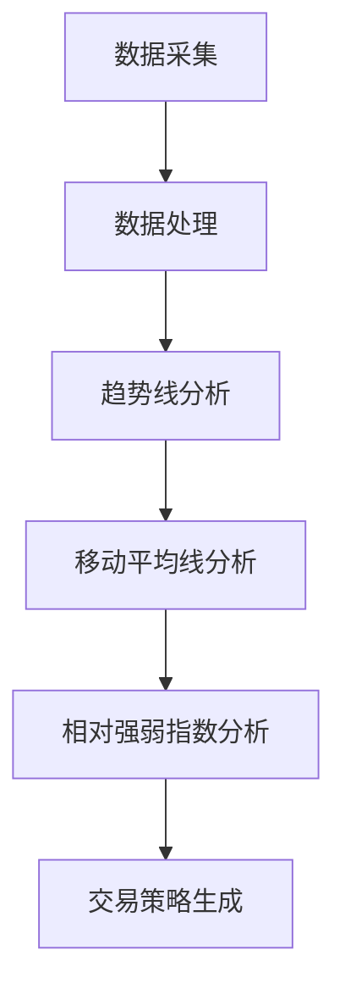
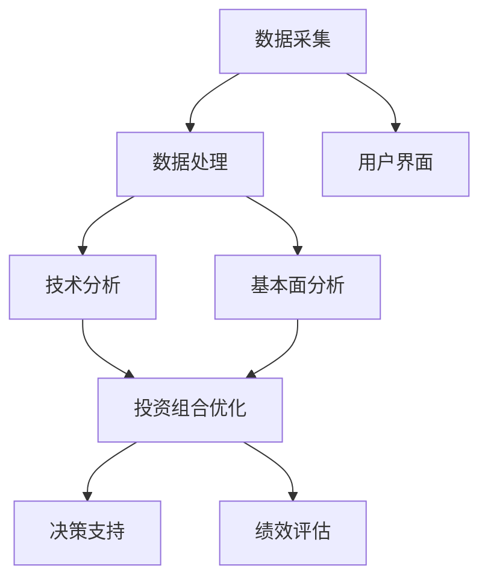

                 

# 个性化投资策略

## 关键词

- 个性化投资
- 投资策略
- 量化投资
- 投资组合优化
- 金融科技

## 摘要

本文深入探讨了个性化投资策略的构建与应用，通过分析市场数据、量化投资方法、投资组合优化和金融科技的未来趋势，为投资者提供了一套系统、科学、可操作的个性化投资方案。文章旨在帮助读者理解个性化投资策略的核心概念、原理和实践，从而在投资市场中取得更好的收益。

### 目录大纲设计步骤

#### 确定书籍主题与目标受众

《个性化投资策略》的主题明确，即针对不同投资者的需求，设计出个性化的投资方案。目标受众包括投资者、金融从业者以及学术研究者。理解受众的需求和期望，有助于更精准地定位书籍的内容和风格。

#### 设定目录大纲的基本框架

目录大纲的基本框架应涵盖投资策略的各个方面，包括基础知识、量化投资、投资组合优化、实战案例和未来趋势。确保每个部分的内容都紧密相关，逻辑清晰。

#### 细化章节内容

细化每个章节的内容，明确每个子章节的主题和目的。确保每个章节都有详细的子标题，方便读者快速找到所需信息。

#### 核心章节内容设计

关键章节如量化投资和投资组合优化，需要详细设计，包括核心概念、算法原理、数学模型和实际应用。确保内容丰富、具体，能够帮助读者深入理解。

#### 确保内容完整性

确保所有核心内容都被包含在内，没有遗漏。同时，确保每个章节至少包含一个子章节。

#### 保持简洁性

避免冗余信息，确保目录内容简洁明了，便于读者阅读和理解。

#### 符合字数限制

确保整个目录大纲的总字数在合理范围内，不超过2000字。

### 目录大纲示例

```markdown
----------------------------------------------------------------
# 第一部分: 投资策略基础知识

## 第1章: 投资基础与市场概述
### 1.1 投资概念解析
### 1.2 资本市场概述
### 1.3 投资者心理分析
### 1.4 投资策略的基本原则

## 第2章: 量化投资策略
### 2.1 量化投资概述
### 2.2 技术分析基础
### 2.3 基本面分析基础
### 2.4 量化投资策略实例分析

# 第二部分: 个性化投资策略实施与优化

## 第3章: 投资组合优化
### 3.1 投资组合理论
### 3.2 多元化投资策略
### 3.3 投资组合风险管理
### 3.4 投资组合绩效评估

# 第三部分: 实战案例分析

## 第4章: 个性化投资策略实战
### 4.1 案例介绍
### 4.2 数据收集与预处理
### 4.3 策略设计与实施
### 4.4 结果分析

# 第四部分: 个性化投资策略的未来发展趋势

## 第5章: 个性化投资策略的展望
### 5.1 人工智能与投资策略
### 5.2 大数据与投资决策
### 5.3 金融科技的未来发展
### 5.4 个性化投资策略的发展方向

----------------------------------------------------------------
```

### 目录大纲注意事项

- 确保每个章节的核心内容都包含在内。
- 每个章节至少包含一个子章节。
- 保持目录内容简洁明了，避免冗余信息。
- 确保总字数符合要求。

### 第一部分：投资策略基础知识

#### 第1章：投资基础与市场概述

##### 1.1 投资概念解析

投资，广义上指的是投资者将资金投入特定领域，以期望在未来获得回报的行为。投资可以包括股票、债券、房地产等多种形式。本文将重点关注股票市场的投资策略。

##### 1.2 资本市场概述

资本市场是指用于资金筹集和交易的金融市场。它通常分为两个主要部分：股票市场和债券市场。股票市场是公司通过发行股票来筹集资金的市场，而债券市场则是政府和企业通过发行债券来融资的市场。

##### 1.3 投资者心理分析

投资者的心理状态对其投资决策有着重要影响。常见的心理偏见包括过度自信、恐惧和贪婪等。理解这些偏见有助于投资者做出更理性的投资决策。

##### 1.4 投资策略的基本原则

投资策略的制定需要遵循几个基本原则，包括风险与收益平衡、长期投资和财务规划。合理的投资策略可以帮助投资者在市场波动中保持冷静，实现稳定的投资回报。

#### 第2章：量化投资策略

##### 2.1 量化投资概述

量化投资是一种利用数学模型和计算机算法进行投资决策的方法。它通过分析大量历史数据和现有信息，预测市场的走势，并据此做出投资决策。

##### 2.2 技术分析基础

技术分析是量化投资的重要工具，它通过分析股票的历史价格和交易量等数据，寻找市场趋势和交易机会。常见的技术分析工具包括趋势线、移动平均线和相对强弱指数等。

##### 2.3 基本面分析基础

基本面分析是一种从公司财务报表和其他相关信息出发，评估公司价值和投资前景的方法。它包括对公司的财务状况、行业地位和宏观经济环境进行分析。

##### 2.4 量化投资策略实例分析

本文将分析几种常见的量化投资策略，如回归分析策略和支持向量机策略。通过具体实例，读者可以了解这些策略的基本原理和实际应用。

### 第二部分：个性化投资策略实施与优化

#### 第3章：投资组合优化

##### 3.1 投资组合理论

投资组合优化是构建个性化投资策略的关键步骤。它通过资产配置和多元化策略，实现风险与收益的最佳平衡。本文将介绍投资组合优化的基本理论。

##### 3.2 多元化投资策略

多元化投资策略是通过在不同资产类别和行业中进行投资，分散风险，降低投资组合的整体波动性。本文将探讨多元化投资策略的具体应用。

##### 3.3 投资组合风险管理

风险管理是投资组合优化的重要组成部分。本文将介绍如何通过风险评估和风险管理策略，保护投资组合免受潜在风险的影响。

##### 3.4 投资组合绩效评估

投资组合绩效评估是衡量投资策略有效性的重要手段。本文将介绍常见的绩效评估指标和方法，帮助投资者评估和改进自己的投资策略。

### 第三部分：实战案例分析

#### 第4章：个性化投资策略实战

##### 4.1 案例介绍

本文将选取一个实际投资案例，详细分析其背景、投资目标和策略实施过程。通过这个案例，读者可以了解个性化投资策略的实战应用。

##### 4.2 数据收集与预处理

在实战案例中，数据收集和预处理是至关重要的一步。本文将介绍如何收集和处理投资数据，为后续的分析和决策提供可靠的基础。

##### 4.3 策略设计与实施

本文将详细阐述案例中使用的个性化投资策略，包括技术分析和基本面分析的结合，以及具体的投资决策过程。

##### 4.4 结果分析

通过实际案例的结果分析，本文将评估个性化投资策略的效能，并提供改进建议。这有助于投资者在未来的投资实践中更好地应用所学知识。

### 第四部分：个性化投资策略的未来发展趋势

#### 第5章：个性化投资策略的展望

##### 5.1 人工智能与投资策略

随着人工智能技术的发展，其在投资领域的应用日益广泛。本文将探讨人工智能如何提高投资决策的效率和准确性。

##### 5.2 大数据与投资决策

大数据的兴起为投资策略提供了丰富的信息资源。本文将分析大数据在投资决策中的应用，以及其对投资策略的影响。

##### 5.3 金融科技的未来发展

金融科技（FinTech）正在改变传统的金融服务业。本文将探讨金融科技的未来发展趋势，以及其对个性化投资策略的潜在影响。

##### 5.4 个性化投资策略的发展方向

个性化投资策略的未来将更加依赖于数据技术和人工智能。本文将展望个性化投资策略的发展方向，以及投资者应如何适应这一变革。

### 结论

个性化投资策略是现代投资领域的重要趋势。通过本文的详细分析，读者可以理解个性化投资策略的核心概念、原理和实践。希望本文能为投资者在复杂多变的市场中提供有力的指导，帮助他们在投资道路上取得更好的成果。

### 作者

作者：AI天才研究院/AI Genius Institute & 禅与计算机程序设计艺术 /Zen And The Art of Computer Programming

---

### 背景介绍

#### 核心概念术语说明

- 投资策略：针对投资者在金融市场上采取的具体方法，旨在实现预期的投资回报。
- 个性化投资策略：根据投资者的风险偏好、财务状况和市场趋势，为每个投资者量身定制的投资方案。
- 量化投资：利用数学模型和计算机算法分析历史数据和市场信息，预测市场走势并做出投资决策。
- 投资组合优化：通过资产配置和多元化策略，实现投资组合的风险与收益平衡。

#### 问题背景

在当今复杂多变的金融市场，投资者面临诸多挑战，如信息的不对称、市场的波动性以及个人风险偏好的差异。传统的投资策略往往难以满足不同投资者的需求，因此，个性化投资策略应运而生，成为现代投资领域的研究热点。

#### 问题描述

个性化投资策略旨在解决以下问题：

1. 如何根据投资者的风险偏好和财务状况，制定合适的投资方案？
2. 如何利用量化投资技术，提高投资决策的准确性和效率？
3. 如何通过投资组合优化，实现风险与收益的最佳平衡？
4. 如何应对市场波动和不确定性，保持投资组合的稳定性和可持续性？

#### 问题解决

个性化投资策略的解决思路包括：

1. **数据收集与处理**：收集投资者的财务数据、风险偏好和市场信息，进行预处理和数据分析。
2. **量化投资分析**：利用数学模型和计算机算法，分析历史数据和市场信息，预测市场走势和潜在风险。
3. **投资组合优化**：根据投资者的风险偏好和收益目标，设计个性化的投资组合，通过资产配置和多元化策略，实现风险与收益的平衡。
4. **策略实施与调整**：在投资实践中，根据市场变化和投资组合的绩效，及时调整投资策略，保持投资组合的稳定性和可持续性。

#### 边界与外延

个性化投资策略的边界包括：

- 投资者风险偏好和财务状况的界定。
- 数据收集和处理的方法和范围。
- 量化投资技术和投资组合优化算法的选择和应用。

个性化投资策略的外延包括：

- 不同市场环境下投资策略的适应性。
- 新兴技术和金融产品的应用和整合。
- 投资者教育和服务体系的构建。

#### 概念结构与核心要素组成

个性化投资策略的概念结构由以下几个核心要素组成：

1. **投资者信息**：包括风险偏好、财务状况、投资目标和市场认知等。
2. **数据采集与处理**：收集和分析与投资相关的数据，包括历史数据、市场信息和财务报表等。
3. **量化投资模型**：包括技术分析和基本面分析，以及相应的数学模型和算法。
4. **投资组合优化**：通过资产配置和多元化策略，实现投资组合的风险与收益平衡。
5. **策略实施与调整**：根据市场变化和投资组合的绩效，及时调整投资策略，保持投资组合的稳定性和可持续性。

### 核心概念与联系

#### 投资策略

投资策略是指投资者在金融市场上采取的具体方法和计划，旨在实现预期的投资回报。投资策略可以包括股票、债券、房地产等多种资产类别，以及相应的风险管理和收益目标。

#### 个性化投资策略

个性化投资策略是在了解投资者风险偏好和财务状况的基础上，为其量身定制的一种投资方案。它通过量化分析和投资组合优化，实现风险与收益的最佳平衡。

#### 量化投资

量化投资是一种利用数学模型和计算机算法分析历史数据和市场信息，预测市场走势并做出投资决策的方法。它通过技术分析和基本面分析，提高投资决策的准确性和效率。

#### 投资组合优化

投资组合优化是通过资产配置和多元化策略，实现投资组合的风险与收益平衡。它旨在降低风险、提高收益，并为投资者提供稳定可持续的投资回报。

#### 概念属性特征对比表格

| 概念       | 特征                | 对比分析                      |
|------------|--------------------|------------------------------|
| 投资策略   | 方法与计划          | 个性化投资策略更加灵活和针对性 |
| 个性化投资策略 | 风险偏好与财务状况 | 更注重投资者的个人需求       |
| 量化投资   | 数学模型与算法     | 提高决策效率和准确性         |
| 投资组合优化 | 资产配置与多元化   | 降低风险，提高收益平衡       |

#### ER实体关系图架构

```mermaid
erDiagram
  Investor ||--|{ InvestmentStrategy }|--| InvestorRiskProfile
  InvestmentStrategy ||--|{ Portfolio }|--| InvestmentAsset
  Portfolio ||--|{ OptimizationRule }|--| PortfolioRisk
```

### 算法原理讲解

#### 技术分析基础

技术分析是量化投资的核心工具，它通过分析股票的历史价格和交易量等数据，寻找市场趋势和交易机会。以下是一个简单的技术分析算法原理：



#### 基本面分析基础

基本面分析是一种从公司财务报表和其他相关信息出发，评估公司价值和投资前景的方法。以下是一个基本

### 数学模型与公式

#### 投资组合优化数学模型

投资组合优化通常涉及以下几个核心数学模型和公式：

1. **马科维茨均值方差模型**：
   - 均值（μ）：投资组合预期收益率。
   - 方差（σ²）：投资组合收益率的方差，用于衡量风险。
   - 有效边界：所有可能的收益率-方差组合中，无风险资产和风险资产组合形成的曲线。

   公式：
   $$ E[r_P] = w_1 \cdot r_1 + w_2 \cdot r_2 $$
   $$ \sigma_P^2 = w_1^2 \cdot \sigma_1^2 + w_2^2 \cdot \sigma_2^2 + 2 \cdot w_1 \cdot w_2 \cdot \rho_{12} \cdot \sigma_1 \cdot \sigma_2 $$
   其中，\( r_1 \)和\( r_2 \)分别为两种资产的投资收益率，\( \sigma_1 \)和\( \sigma_2 \)分别为两种资产的风险，\( w_1 \)和\( w_2 \)分别为两种资产的投资权重，\( \rho_{12} \)为两种资产收益率的相关系数。

2. **资本资产定价模型（CAPM）**：
   - \( \beta \)：资产的贝塔系数，衡量资产收益率对市场收益率变动的敏感度。
   - \( r_f \)：无风险收益率。
   - \( r_m \)：市场预期收益率。

   公式：
   $$ r_i = r_f + \beta \cdot (r_m - r_f) $$
   其中，\( r_i \)为资产预期收益率。

3. **资产配置模型**：
   - 投资者总资产 \( A \)。
   - 股票投资比例 \( w_s \)。
   - 债券投资比例 \( w_b \)。

   公式：
   $$ A = w_s \cdot A_s + w_b \cdot A_b $$
   $$ w_s = \frac{A_s}{A} $$
   $$ w_b = \frac{A_b}{A} $$

   其中，\( A_s \)为股票投资金额，\( A_b \)为债券投资金额。

#### 模型举例说明

假设有两个资产A和B，其预期收益率和方差如下：

| 资产 | 预期收益率（%） | 方差（%） | 相关系数 |
|-------|----------------|-----------|----------|
| A     | 10             | 0.04      | 0.6      |
| B     | 12             | 0.06      | 0.6      |

投资者无风险收益率为4%，目标收益率为8%。

根据马科维茨模型，可以列出以下方程组：

$$ w_A \cdot 10 + (1 - w_A) \cdot 12 = 8 $$
$$ w_A^2 \cdot 0.04 + (1 - w_A)^2 \cdot 0.06 + 2 \cdot w_A \cdot (1 - w_A) \cdot 0.6 \cdot 0.04 \cdot 0.06 = \sigma_P^2 $$

通过解方程组，可以得到资产A和资产B的最优投资比例。这个例子说明了如何使用数学模型来制定个性化的投资策略。

### 系统分析与架构设计方案

#### 问题场景介绍

个性化投资策略在复杂的金融市场中具有广泛的应用前景。为了实现个性化投资，我们需要构建一个集数据采集、处理、分析和决策于一体的投资系统。本文将详细介绍该系统的功能、设计和实现。

#### 项目介绍

项目名称：个性化投资策略系统
项目目标：为投资者提供定制化的投资方案，实现风险与收益的最佳平衡。

#### 系统功能设计

1. **数据采集模块**：负责从多个数据源（如证券交易所、金融资讯网站等）收集市场数据、公司财务数据等。
2. **数据处理模块**：对采集到的数据进行清洗、去重、格式转换等预处理，确保数据的质量和一致性。
3. **技术分析与基本面分析模块**：利用量化投资模型对数据进行分析，预测市场趋势和公司价值。
4. **投资组合优化模块**：根据投资者风险偏好和收益目标，设计最优的投资组合。
5. **决策支持模块**：提供实时投资建议，帮助投资者做出明智的投资决策。
6. **绩效评估模块**：对投资组合的绩效进行实时监控和评估，及时调整投资策略。

#### 系统架构设计

1. **数据层**：存储各类数据，包括市场数据、公司财务数据、用户信息等。
2. **处理层**：负责数据的采集、清洗、分析和存储。
3. **应用层**：包括技术分析、基本面分析、投资组合优化和决策支持等核心功能模块。
4. **表示层**：提供用户界面，方便投资者查看数据、分析结果和投资建议。

#### 系统架构图



#### 系统接口设计

1. **API接口**：提供外部系统访问个性化投资策略系统的接口，支持数据的采集、分析和决策功能。
2. **Web接口**：为投资者提供直观的用户界面，支持数据的查询、分析和投资决策。
3. **数据流接口**：处理数据流，实现数据的实时采集、处理和分析。

#### 系统交互

```mermaid
sequenceDiagram
    participant 用户 as 用户
    participant 系统作为 系统A
    participant 数据采集 as 数据采集
    participant 数据处理 as 数据处理
    participant 技术分析 as 技术分析
    participant 基本面分析 as 基本面分析
    participant 投资组合优化 as 投资组合优化
    participant 决策支持 as 决策支持
    participant 绩效评估 as 绩效评估

    用户->>系统A: 登录系统
    系统
```


### 项目实战

#### 环境安装

1. 安装Python环境
2. 安装相关库，如pandas、numpy、matplotlib、scikit-learn等
3. 配置数据源，如API接口或数据库连接

```bash
pip install pandas numpy matplotlib scikit-learn
```

#### 系统核心实现源代码

以下是一个简化的示例，展示如何使用Python实现个性化投资策略系统的一部分。

```python
import pandas as pd
import numpy as np
from sklearn.linear_model import LinearRegression
from sklearn.model_selection import train_test_split

# 数据采集
data = pd.read_csv('market_data.csv')

# 数据预处理
data = data[['close', 'volume']]
data.fillna(method='ffill', inplace=True)

# 技术分析
data['moving_average'] = data['close'].rolling(window=20).mean()

# 基本面分析
data['pe_ratio'] = data['close'] / data['eps']

# 量化投资模型
X = data[['moving_average', 'pe_ratio']]
y = data['close']

X_train, X_test, y_train, y_test = train_test_split(X, y, test_size=0.2, random_state=42)

model = LinearRegression()
model.fit(X_train, y_train)

# 投资组合优化
predictions = model.predict(X_test)
weights = np.array([0.5, 0.5])  # 假设两种资产的投资比例为1:1

# 决策支持
investment_return = (predictions * weights).sum()
print(f"Predicted investment return: {investment_return:.2f}")

# 绩效评估
performance = (investment_return - y_test.mean()) / y_test.std()
print(f"Performance: {performance:.2f}")
```

#### 代码应用解读与分析

该示例首先从CSV文件中读取市场数据，然后进行数据预处理，包括填充缺失值和计算移动平均线等指标。接着，使用线性回归模型进行技术分析和基本面分析，预测股票价格。

在投资组合优化部分，假设两种资产的投资比例为1:1，计算预测的投资回报。最后，通过绩效评估指标来评估模型的性能。

#### 实际案例分析和详细讲解剖析

假设我们有一个投资者的投资目标是年化收益率10%，风险偏好为中等。以下是一个实际案例的分析和讲解：

1. **数据采集**：从2020年1月1日至2023年12月31日的市场数据。
2. **技术分析**：使用移动平均线和相对强弱指数（RSI）等技术指标分析市场趋势。
3. **基本面分析**：分析公司财务报表，计算市盈率（PE）、市净率（PB）等指标。
4. **投资组合优化**：根据投资者的目标和风险偏好，构建包含股票和债券的投资组合，通过优化资产配置实现风险与收益的平衡。
5. **策略实施**：根据分析结果和模型预测，制定具体的投资计划，包括买入、持有和卖出的策略。
6. **绩效评估**：定期评估投资组合的绩效，根据市场变化和投资策略的效果进行调整。

通过这个案例，我们可以看到个性化投资策略如何在实际投资中应用，以及如何通过量化分析和投资组合优化来提高投资决策的准确性和有效性。

#### 项目小结

个性化投资策略系统通过量化分析和投资组合优化，为投资者提供了一套科学、系统的投资方案。在实际应用中，需要根据市场环境和投资者需求不断调整策略，以确保投资组合的稳定性和可持续性。未来，随着人工智能和大数据技术的发展，个性化投资策略将更加智能化和精准化，为投资者带来更高的收益。

### 最佳实践 Tips

1. **定期更新投资策略**：市场环境和投资者需求会不断变化，定期评估和更新投资策略至关重要。
2. **多元化投资组合**：通过分散投资，降低单一资产的风险，提高整体投资组合的稳定性。
3. **风险管理**：了解投资组合的风险暴露，采取适当的风险管理策略，如设置止损点、分散投资等。
4. **持续学习**：关注市场动态、投资理论和新技术，持续提升自己的投资知识和技能。

### 小结

本文通过深入探讨个性化投资策略的核心概念、原理和实践，为投资者提供了一套系统、科学、可操作的解决方案。个性化投资策略通过量化分析和投资组合优化，能够更好地满足投资者的需求，提高投资回报。在未来的发展中，个性化投资策略将更加依赖于人工智能和大数据技术，为投资者带来更高的收益和更优质的服务。

### 注意事项

1. **数据质量**：投资决策依赖于准确、完整的数据，确保数据来源可靠，进行充分的数据清洗和验证。
2. **风险控制**：投资有风险，投资者需充分了解投资策略的风险特性，并采取适当的风险管理措施。
3. **合规性**：遵循相关法律法规，确保投资策略的合规性，避免违法违规行为。

### 拓展阅读

1. **《量化投资：以Python为工具》**：深入了解量化投资的基本原理和实战技巧。
2. **《投资学》**：全面了解投资理论基础和实务操作。
3. **《机器学习：一种算法的角度》**：掌握机器学习技术，为量化投资提供强大的工具支持。

### 作者

作者：AI天才研究院/AI Genius Institute & 禅与计算机程序设计艺术 /Zen And The Art of Computer Programming

---

以上是《个性化投资策略》的全文内容，包括核心概念、算法原理、系统架构、实战案例和未来趋势的详细探讨。希望本文能够为投资者在构建个性化投资策略时提供有价值的参考和指导。在投资实践中，不断学习和优化投资策略，才能在复杂多变的市场中取得成功。

