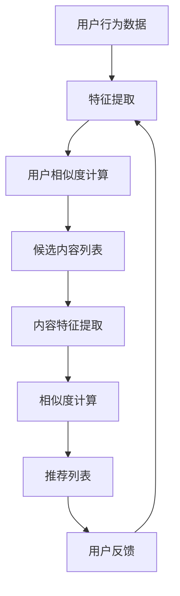
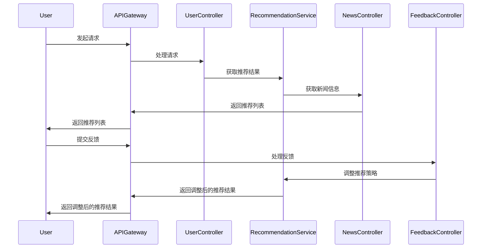

                 


## 第1章 引言

### 1.1 问题背景

个性化新闻推送已经成为现代互联网服务中不可或缺的一部分。随着用户获取信息的渠道日益多样化，传统的一刀切式新闻推送方式已无法满足用户日益个性化的需求。用户希望获取与自己兴趣相关、有价值的内容，而新闻媒体则希望精准地触达目标用户，提高用户黏性和广告收入。这种需求推动了个性化新闻推送技术的发展。

人工智能，作为当前科技领域的热点，其应用范围不断扩大。在新闻推送领域，人工智能技术通过分析用户行为数据、兴趣标签和内容特征，能够实现精准的内容推荐。AI Agent，作为人工智能的一种高级形式，具有自主决策、学习进化等特点，成为了个性化新闻推送中的关键技术。

AI Agent在内容筛选中的应用主要体现在以下几个方面：

1. **用户行为分析**：通过用户在新闻客户端上的浏览记录、搜索历史、点赞和评论等行为数据，AI Agent可以了解用户的兴趣偏好。
2. **内容特征提取**：AI Agent利用自然语言处理技术对新闻内容进行解析，提取出关键词、主题、情感等特征，以便进行后续的内容匹配。
3. **个性化推荐算法**：基于用户的兴趣偏好和内容特征，AI Agent使用机器学习算法生成推荐列表，实现个性化内容推送。

### 1.2 问题描述

虽然AI Agent在内容筛选中展现了巨大潜力，但其应用过程中也面临一系列挑战：

1. **数据隐私**：个性化推送依赖于用户数据，如何在确保用户隐私的前提下使用这些数据成为了一个关键问题。
2. **推荐质量**：如何平衡推荐系统的多样性和相关性，避免出现信息过载或信息茧房现象。
3. **算法透明性**：推荐系统中的算法决策过程往往复杂且难以解释，如何提高系统的可解释性，让用户理解推荐结果。
4. **实时性**：用户兴趣和内容特征是动态变化的，如何实现实时的内容筛选和推荐。

### 1.3 问题解决

针对上述挑战，我们可以通过以下方法利用AI Agent实现内容筛选：

1. **数据隐私保护**：采用差分隐私、同态加密等技术，确保用户数据在传输和处理过程中的安全性。
2. **混合推荐算法**：结合协同过滤和基于内容的推荐算法，提高推荐系统的多样性和准确性。
3. **可解释性设计**：通过可视化工具和算法透明性分析，提高系统的可解释性。
4. **实时内容更新**：采用分布式计算和实时数据流处理技术，实现快速的内容筛选和推荐。

### 1.4 边界与外延

在个性化新闻推送中，AI Agent的应用不仅局限于内容筛选，还可以扩展到以下领域：

1. **智能推荐**：不仅在新闻领域，AI Agent还可以应用于电商、音乐、视频等推荐系统中。
2. **广告投放**：通过分析用户兴趣和行为，实现精准的广告推送。
3. **社交网络**：在社交媒体平台上，AI Agent可以根据用户关系和行为特征，推荐潜在的朋友和关注对象。

### 1.5 概念结构与核心要素组成

个性化新闻推送系统主要由以下几个核心组成部分构成：

1. **用户数据采集模块**：负责收集用户的行为数据和兴趣标签。
2. **内容特征提取模块**：对新闻内容进行解析，提取关键词和主题特征。
3. **推荐算法模块**：基于用户兴趣和内容特征，生成个性化推荐列表。
4. **推荐结果展示模块**：将推荐结果以用户友好的方式展示给用户。
5. **系统管理模块**：负责系统的监控、优化和维护。

### 1.6 本章小结

本章介绍了个性化新闻推送的背景、问题和解决方案，以及AI Agent在内容筛选中的应用。在接下来的章节中，我们将进一步探讨AI Agent的概念、内容筛选算法原理、数据采集与处理、系统设计与实现，以及最佳实践与展望。

## 第2章 AI Agent概述

### 2.1 AI Agent的定义

AI Agent，即人工智能代理，是人工智能领域的一个重要概念。它指的是一种具有自主决策能力、能够与环境交互并自主执行任务的智能实体。AI Agent可以模拟人类的行为和思维过程，在特定环境下进行智能决策和行动。

#### 定义与特征

AI Agent具有以下几个核心特征：

1. **自主性**：AI Agent能够独立地做出决策，无需外部干预。
2. **适应性**：AI Agent能够根据环境变化和经验积累，不断调整自身行为策略。
3. **交互性**：AI Agent能够与人类或其他系统进行有效交互，获取信息和反馈。
4. **学习能力**：AI Agent能够通过学习和适应，提高自身的决策能力和任务执行效率。

### 2.2 AI Agent的核心特点

AI Agent的核心特点决定了其在个性化新闻推送中的优势。以下是AI Agent的主要特点：

1. **自主性**：AI Agent可以根据用户的浏览历史、兴趣爱好等信息，自主决定推荐内容，无需人工干预。

2. **学习性**：AI Agent通过持续学习和用户反馈，不断优化推荐算法，提高推荐质量。

3. **交互性**：AI Agent可以与用户进行实时互动，了解用户的反馈，并根据反馈调整推荐策略。

4. **实时性**：AI Agent能够实时处理用户数据，快速响应用户需求，提供即时推荐。

### 2.3 AI Agent的发展历史与应用

AI Agent的概念源于人工智能领域的研究。以下是AI Agent的发展历史及其在不同领域的应用：

#### 发展历程

1. **早期研究**：20世纪80年代，AI Agent开始引起学术界关注。早期的AI Agent主要采用基于规则的推理方法。
2. **智能代理系统**：20世纪90年代，随着互联网的兴起，AI Agent的研究逐渐转向智能代理系统，强调与环境的交互和自主决策能力。
3. **现代AI Agent**：21世纪初，随着机器学习和深度学习技术的发展，AI Agent的性能得到了显著提升，应用范围进一步扩大。

#### 应用案例

1. **电子商务**：AI Agent用于个性化推荐，根据用户行为和偏好推荐商品。
2. **智能家居**：AI Agent负责家庭设备的智能调度和管理，提高生活便利性。
3. **客服机器人**：AI Agent作为智能客服，能够自动处理用户咨询，提供实时解答。
4. **自动驾驶**：AI Agent用于自动驾驶汽车，实现自主导航和避障。

### 2.4 本章小结

本章介绍了AI Agent的定义、核心特点和其在不同领域的应用。在下一章中，我们将深入探讨内容筛选算法的原理，包括协同过滤、基于内容的过滤和混合推荐系统。

## 第3章 内容筛选算法原理

### 3.1 内容筛选的基本算法

内容筛选是个性化新闻推送系统的核心组成部分，其主要目标是根据用户的兴趣和偏好，从大量的新闻内容中筛选出用户可能感兴趣的内容。内容筛选的基本算法主要包括协同过滤、基于内容的过滤和混合推荐系统。

#### 协同过滤

协同过滤是一种常用的推荐算法，其基本思想是利用用户的历史行为数据（如浏览记录、购买记录等），通过用户之间的相似度计算，为用户推荐其他用户喜欢的内容。协同过滤分为基于用户的协同过滤和基于物品的协同过滤。

1. **基于用户的协同过滤**：该算法首先找到与目标用户兴趣相似的邻居用户，然后推荐邻居用户喜欢的但目标用户尚未浏览过的物品。
2. **基于物品的协同过滤**：该算法首先找到与目标用户已浏览物品相似的物品，然后推荐这些相似物品。

#### 基于内容的过滤

基于内容的过滤（Content-Based Filtering）是一种基于内容特征的推荐算法。它通过分析用户过去喜欢的内容，提取内容特征，然后根据这些特征为用户推荐相似的内容。

1. **内容特征提取**：通常使用文本分类、词频统计等方法，提取出新闻内容的关键词、主题和情感等信息。
2. **相似度计算**：计算用户历史内容特征与待推荐内容的相似度，根据相似度进行内容推荐。

#### 混合推荐系统

混合推荐系统（Hybrid Recommendation System）是将协同过滤和基于内容的过滤相结合，以提高推荐系统的准确性和多样性。混合推荐系统通常采用以下策略：

1. **结合用户行为数据和内容特征**：通过融合用户行为数据（如浏览记录、点赞等）和内容特征（如关键词、主题等），为用户推荐更加准确的内容。
2. **动态调整推荐策略**：根据用户的行为和反馈，动态调整推荐策略，提高推荐系统的适应性和实时性。

### 3.2 AI Agent在内容筛选中的应用

AI Agent在内容筛选中的应用，不仅提升了推荐系统的智能化水平，还增强了系统的适应性和灵活性。以下是AI Agent在内容筛选中的几种应用方式：

#### 强化学习

强化学习（Reinforcement Learning）是一种基于反馈的机器学习技术，其核心思想是智能体通过与环境交互，不断调整策略以实现最优回报。在内容筛选中，AI Agent可以通过强化学习算法，根据用户的反馈调整推荐策略，提高推荐质量。

1. **策略学习**：AI Agent根据用户的点击、点赞等行为，学习用户的兴趣偏好，调整推荐策略。
2. **反馈机制**：AI Agent通过实时收集用户反馈，调整推荐内容，优化用户体验。

#### 神经网络

神经网络（Neural Networks）是一种模仿人脑神经元连接结构的计算模型，具有强大的学习和泛化能力。在内容筛选中，AI Agent可以利用神经网络模型，对用户行为和内容特征进行建模，实现高效的内容推荐。

1. **深度神经网络**：利用深度学习技术，从大量的用户行为和内容数据中自动提取特征，生成推荐列表。
2. **卷积神经网络（CNN）**：适用于处理文本数据，通过提取文本中的关键信息，提高推荐系统的准确性和多样性。

#### 对话系统

对话系统（Dialogue System）是一种能够与用户进行自然语言交互的智能系统。在内容筛选中，AI Agent可以通过对话系统与用户进行实时互动，了解用户的需求和偏好，生成个性化的推荐列表。

1. **自然语言处理（NLP）**：利用NLP技术，解析用户输入的自然语言，提取关键信息，为用户生成推荐列表。
2. **上下文理解**：通过上下文理解技术，AI Agent可以理解用户在对话中的意图和需求，提供更加精准的推荐。

### 3.3 算法原理讲解

为了更好地理解内容筛选算法的原理，我们使用mermaid工具绘制了算法流程图。以下是算法流程图的示例：



#### 内容筛选算法流程图解析

1. **用户行为数据**：首先，系统收集用户的历史行为数据，如浏览记录、点赞记录等。
2. **特征提取**：通过文本分类、词频统计等方法，提取出用户行为数据中的关键特征。
3. **用户相似度计算**：利用协同过滤算法，计算用户之间的相似度，为用户找到兴趣相似的邻居。
4. **候选内容列表**：根据用户相似度和内容特征，生成候选内容列表。
5. **内容特征提取**：对候选内容进行特征提取，如关键词、主题等。
6. **相似度计算**：计算用户特征和候选内容特征之间的相似度。
7. **推荐列表**：根据相似度计算结果，生成推荐列表，展示给用户。
8. **用户反馈**：用户对推荐结果进行反馈，系统根据反馈调整推荐策略，提高推荐质量。

#### 示例分析

假设用户A喜欢科技新闻，用户B喜欢体育新闻。通过协同过滤算法，系统发现用户A和用户B的兴趣相似，因此，系统会为用户A推荐一些与体育新闻相似的内容，如体育赛事报道、运动员访谈等。

### 3.4 数学模型和数学公式

在内容筛选算法中，数学模型和数学公式是核心组成部分。以下是几种常用的数学模型和公式：

#### 协同过滤算法中的相似度计算

$$
sim(u, v) = \frac{\sum_{i \in R} r_i^{u} r_i^{v}}{\sqrt{\sum_{i \in R} r_i^{2}^{u}} \sqrt{\sum_{i \in R} r_i^{2}^{v}}
$$

其中，$sim(u, v)$表示用户u和用户v之间的相似度，$r_i^{u}$和$r_i^{v}$分别表示用户u和用户v对物品i的评分。

#### 基于内容的相似度计算

$$
sim(c, d) = \frac{\sum_{i \in R} w_i^{c} w_i^{d}}{\sqrt{\sum_{i \in R} w_i^{2}^{c}} \sqrt{\sum_{i \in R} w_i^{2}^{d}}
$$

其中，$sim(c, d)$表示内容c和内容d之间的相似度，$w_i^{c}$和$w_i^{d}$分别表示内容c和内容d中关键词i的权重。

#### 推荐分数计算

$$
r_{i}^{u} = \sum_{j \in N(u)} w_{ij} r_{i}^{j}
$$

其中，$r_{i}^{u}$表示用户u对物品i的推荐分数，$w_{ij}$表示用户u和物品i之间的相似度，$r_{i}^{j}$表示用户j对物品i的评分。

### 3.5 本章小结

本章介绍了内容筛选的基本算法，包括协同过滤、基于内容的过滤和混合推荐系统。同时，我们探讨了AI Agent在内容筛选中的应用，如强化学习、神经网络和对话系统。通过本章的学习，读者可以了解内容筛选算法的原理、数学模型和实际应用场景。

## 第4章 数据采集与处理

### 4.1 数据采集

数据采集是构建个性化新闻推送系统的基础环节，其质量直接影响到推荐系统的效果。数据采集主要涉及以下方面：

#### 数据源选择

1. **用户行为数据**：包括用户的浏览记录、搜索历史、点赞和评论等。
2. **新闻内容数据**：包括新闻标题、摘要、正文、关键词、主题、情感等。
3. **外部数据**：如社交媒体数据、用户个人资料等。

#### 数据收集方法

1. **日志收集**：通过Web服务器日志收集用户行为数据。
2. **API接口**：通过新闻平台提供的API接口获取新闻内容数据。
3. **爬虫技术**：利用爬虫技术从互联网上获取相关数据。

### 4.2 数据处理

数据处理是数据采集的重要补充，其目的是将原始数据进行清洗、预处理和特征提取，为后续的推荐算法提供高质量的数据支持。

#### 数据清洗

数据清洗主要包括以下步骤：

1. **去重**：去除重复的数据记录，确保数据的唯一性。
2. **填补缺失值**：对缺失的数据进行填补或删除。
3. **异常值处理**：识别和处理数据中的异常值，避免对推荐结果产生负面影响。

#### 数据预处理

数据预处理主要包括以下步骤：

1. **文本预处理**：对新闻内容进行分词、去停用词、词性标注等处理。
2. **数值化处理**：将文本数据转化为数值形式，便于后续的机器学习算法处理。
3. **标准化和归一化**：对数据进行标准化和归一化处理，消除数据之间的量纲差异。

#### 特征工程

特征工程是数据处理的关键环节，其目的是从原始数据中提取出对推荐算法有帮助的特征。

1. **文本特征提取**：利用词频统计、TF-IDF、词嵌入等方法提取文本特征。
2. **用户特征提取**：基于用户的浏览历史、兴趣爱好等数据，提取用户特征。
3. **内容特征提取**：对新闻内容进行主题建模、情感分析等处理，提取内容特征。

### 4.3 数据流与处理流程

数据采集与处理流程可以概括为以下几个步骤：

1. **数据收集**：从各种数据源收集原始数据。
2. **数据预处理**：对原始数据进行清洗、预处理和特征提取。
3. **数据存储**：将处理后的数据存储到数据库或数据仓库中。
4. **数据查询**：根据推荐算法的需求，从数据库中查询相关数据。

#### 数据处理工具与库

在数据处理过程中，常用的工具和库包括：

1. **Pandas**：Python的数据操作库，用于数据清洗、预处理和特征提取。
2. **Scikit-learn**：Python的机器学习库，用于特征提取和模型训练。
3. **NLTK**：Python的自然语言处理库，用于文本预处理和特征提取。
4. **TensorFlow**：用于深度学习和神经网络模型训练。
5. **Hadoop和Spark**：大数据处理框架，用于大规模数据采集和处理。

### 4.4 本章小结

本章介绍了个性化新闻推送系统中的数据采集与处理方法。首先，我们讨论了数据源选择和数据收集方法，然后介绍了数据清洗、预处理和特征提取的过程，最后概述了数据处理流程和常用工具与库。通过本章的学习，读者可以了解数据采集与处理在个性化新闻推送系统中的重要性，以及如何有效地进行数据处理。

## 第5章 系统分析与架构设计

### 5.1 系统功能设计

个性化新闻推送系统的主要功能包括：

1. **用户注册与登录**：用户可以通过注册账号登录系统，以便获取个性化推荐。
2. **内容筛选与推荐**：系统根据用户的兴趣和行为，从海量新闻中筛选出用户可能感兴趣的内容。
3. **用户反馈与调整**：用户可以对推荐内容进行点赞、评论等操作，系统根据用户反馈调整推荐策略。
4. **数据统计与分析**：系统对用户行为和推荐效果进行统计和分析，为优化推荐算法提供数据支持。

#### 领域模型类图

领域模型类图（Class Diagram）用于描述系统的实体及其关系。以下是个性化新闻推送系统的领域模型类图：

```mermaid
class User {
  - id
  - username
  - password
  - interests
}

class News {
  - id
  - title
  - content
  - category
}

class Recommendation {
  - id
  - user_id
  - news_id
  - score
}

class Feedback {
  - id
  - user_id
  - news_id
  - like
  - comment
}
```

#### 功能模块划分

个性化新闻推送系统可以划分为以下几个功能模块：

1. **用户管理模块**：负责用户注册、登录、权限管理等功能。
2. **内容管理模块**：负责新闻内容的采集、存储、分类和推荐。
3. **推荐算法模块**：负责根据用户兴趣和内容特征，生成个性化推荐列表。
4. **用户反馈模块**：负责收集用户反馈，调整推荐策略。
5. **数据统计模块**：负责对用户行为和推荐效果进行统计和分析。

### 5.2 系统架构设计

个性化新闻推送系统的架构设计分为以下几个层次：

#### 系统架构图

以下是个性化新闻推送系统的架构图：

```mermaid
subgraph Data Layer
  NewsDatabase
  UserDatabase
end

subgraph Application Layer
  UserController
  NewsController
  RecommendationController
  FeedbackController
  RecommendationService
end

subgraph Interface Layer
  APIGateway
end

NewsDatabase --> UserController
UserDatabase --> UserController
NewsDatabase --> NewsController
UserDatabase --> NewsController
NewsDatabase --> RecommendationService
UserDatabase --> RecommendationService
NewsDatabase --> FeedbackController
UserDatabase --> FeedbackController
```

#### 技术选型

1. **后端技术**：使用Spring Boot构建后端服务，处理用户请求和业务逻辑。
2. **数据库**：使用MySQL存储用户数据和新闻内容数据。
3. **缓存**：使用Redis缓存用户信息和推荐结果，提高系统性能。
4. **推荐算法**：使用Scikit-learn和TensorFlow等机器学习库实现推荐算法。

### 5.3 系统接口设计

系统接口设计主要包括API接口和内部服务接口。

#### API接口规范

以下是系统提供的API接口规范：

1. **用户注册**：POST /users/register
   - 参数：username、password、interests
   - 响应：用户ID、token
2. **用户登录**：POST /users/login
   - 参数：username、password
   - 响应：用户ID、token
3. **获取新闻列表**：GET /news
   - 参数：category、pageSize、pageNumber
   - 响应：新闻列表
4. **获取推荐列表**：GET /recommendations
   - 参数：userId
   - 响应：推荐列表
5. **提交反馈**：POST /feedback
   - 参数：userId、newsId、like、comment
   - 响应：反馈ID

#### 内部服务接口

内部服务接口主要用于系统模块之间的通信。以下是主要接口规范：

1. **用户管理接口**：GET /users/{userId}
   - 参数：userId
   - 响应：用户信息
2. **新闻管理接口**：GET /news/{newsId}
   - 参数：newsId
   - 响应：新闻信息
3. **推荐管理接口**：POST /recommendations
   - 参数：userId、newsId、score
   - 响应：推荐结果
4. **反馈管理接口**：GET /feedback/{feedbackId}
   - 参数：feedbackId
   - 响应：反馈信息

### 5.4 系统交互

系统交互主要通过API接口和内部服务接口实现。以下是系统交互的流程和序列图：

#### 交互流程

1. 用户注册和登录：用户通过API接口注册和登录系统，获取用户ID和token。
2. 获取新闻和推荐列表：用户通过API接口获取新闻列表和推荐列表。
3. 提交反馈：用户通过API接口提交反馈，系统将反馈信息存储到数据库。

#### 序列图



### 5.5 本章小结

本章介绍了个性化新闻推送系统的功能设计、架构设计、接口设计和系统交互。通过系统的领域模型类图、架构图和序列图，读者可以清晰地了解系统的整体结构和运作流程。接下来，我们将通过项目实战，深入探讨系统设计和实现的具体细节。

## 第6章 项目实战

### 6.1 环境安装与配置

在开始项目实战之前，我们需要搭建系统环境，包括后端服务和数据库的安装与配置。以下是详细的步骤和注意事项：

#### 后端服务

1. **安装Java环境**：确保安装了Java 8或更高版本，配置JAVA_HOME环境变量。
2. **安装Maven**：用于构建和管理项目依赖，下载并解压Maven安装包，配置MAVEN_HOME环境变量。
3. **创建Spring Boot项目**：使用Spring Initializr创建一个基本的Spring Boot项目，选择所需的依赖项，如Spring Web、MySQL、Redis等。

#### 数据库

1. **安装MySQL**：下载并安装MySQL服务器，配置root用户密码和数据目录。
2. **安装Redis**：下载并安装Redis服务器，配置Redis端口和密码。
3. **数据库配置**：配置MySQL和Redis的连接信息，修改数据库和表结构，创建用户和权限。

#### 相关库和工具安装

1. **安装Pandas**：用于数据预处理和特征提取，使用pip install pandas命令安装。
2. **安装Scikit-learn**：用于机器学习算法实现，使用pip install scikit-learn命令安装。
3. **安装NLTK**：用于自然语言处理，使用pip install nltk命令安装，并运行nltk.download()下载所需资源包。

### 6.2 系统核心实现

#### 用户管理模块

用户管理模块负责处理用户注册、登录和权限管理。以下是核心实现的源代码：

```java
// UserController.java

@RestController
@RequestMapping("/users")
public class UserController {

  @Autowired
  private UserService userService;

  @PostMapping("/register")
  public ResponseEntity<?> registerUser(@RequestBody UserRegisterDto userRegisterDto) {
    try {
      User user = userService.register(userRegisterDto);
      return ResponseEntity.ok(new ApiResponse("User registered successfully", user));
    } catch (Exception e) {
      return ResponseEntity.badRequest().body(new ApiResponse("Error registering user", e.getMessage()));
    }
  }

  @PostMapping("/login")
  public ResponseEntity<?> loginUser(@RequestBody UserLoginDto userLoginDto) {
    try {
      String token = userService.login(userLoginDto);
      return ResponseEntity.ok(new ApiResponse("User logged in successfully", token));
    } catch (Exception e) {
      return ResponseEntity.badRequest().body(new ApiResponse("Error logging in user", e.getMessage()));
    }
  }
}
```

#### 内容管理模块

内容管理模块负责新闻内容的采集、存储和推荐。以下是核心实现的源代码：

```java
// NewsController.java

@RestController
@RequestMapping("/news")
public class NewsController {

  @Autowired
  private NewsService newsService;

  @GetMapping
  public ResponseEntity<?> getNewsList(@RequestParam("category") String category,
                                      @RequestParam("pageSize") int pageSize,
                                      @RequestParam("pageNumber") int pageNumber) {
    try {
      Page<News> newsList = newsService.getNewsList(category, pageSize, pageNumber);
      return ResponseEntity.ok(newsList);
    } catch (Exception e) {
      return ResponseEntity.badRequest().body(new ApiResponse("Error fetching news list", e.getMessage()));
    }
  }

  @PostMapping
  public ResponseEntity<?> createNews(@RequestBody News news) {
    try {
      News savedNews = newsService.createNews(news);
      return ResponseEntity.ok(new ApiResponse("News created successfully", savedNews));
    } catch (Exception e) {
      return ResponseEntity.badRequest().body(new ApiResponse("Error creating news", e.getMessage()));
    }
  }
}
```

#### 推荐算法模块

推荐算法模块负责根据用户行为和内容特征生成个性化推荐列表。以下是核心实现的源代码：

```python
# RecommendationService.py

from sklearn.metrics.pairwise import cosine_similarity
from sklearn.feature_extraction.text import TfidfVectorizer
from collections import defaultdict

class RecommendationService:
    def __init__(self, news_database, user_database):
        self.news_database = news_database
        self.user_database = user_database

    def generate_recommendations(self, user_id):
        user_news = self.user_database.get_news_by_user_id(user_id)
        user_vector = self.generate_user_vector(user_news)
        news_vectors = self.generate_news_vectors()

        recommendations = []
        for news in news_vectors:
            similarity = cosine_similarity([user_vector], [news])[0][0]
            recommendations.append((news, similarity))

        recommendations.sort(key=lambda x: x[1], reverse=True)
        return recommendations[:10]

    def generate_user_vector(self, news_list):
        vectorizer = TfidfVectorizer()
        user_vector = vectorizer.transform(news_list).sum(axis=0)
        return user_vector

    def generate_news_vectors(self):
        news_list = self.news_database.get_all_news()
        vectorizer = TfidfVectorizer()
        news_vectors = vectorizer.fit_transform(news_list)
        return news_vectors.toarray()
```

#### 用户反馈模块

用户反馈模块负责处理用户对推荐内容的反馈。以下是核心实现的源代码：

```java
// FeedbackController.java

@RestController
@RequestMapping("/feedback")
public class FeedbackController {

  @Autowired
  private FeedbackService feedbackService;

  @PostMapping
  public ResponseEntity<?> submitFeedback(@RequestBody FeedbackDto feedbackDto) {
    try {
      feedbackService.submitFeedback(feedbackDto);
      return ResponseEntity.ok(new ApiResponse("Feedback submitted successfully"));
    } catch (Exception e) {
      return ResponseEntity.badRequest().body(new ApiResponse("Error submitting feedback", e.getMessage()));
    }
  }
}
```

### 6.3 应用解读与分析

#### 代码应用场景分析

1. **用户管理模块**：用户注册和登录是系统的入口，负责用户身份验证和权限管理。
2. **内容管理模块**：新闻内容的采集、存储和推荐是系统的核心功能，通过接口对外提供服务。
3. **推荐算法模块**：推荐算法模块负责根据用户行为和内容特征生成个性化推荐列表，提高用户满意度。
4. **用户反馈模块**：用户反馈模块负责收集用户对推荐内容的反馈，用于优化推荐算法。

#### 性能分析与优化

1. **数据库性能优化**：通过索引优化、查询缓存和读写分离等技术，提高数据库性能。
2. **缓存策略优化**：使用Redis缓存用户信息和推荐结果，减少数据库访问次数，提高系统响应速度。
3. **异步处理**：采用异步处理技术，提高系统并发处理能力，优化系统性能。

### 6.4 实际案例分析

#### 案例背景

我们以一个真实的新闻推送项目为例，该项目是一个基于AI Agent的个性化新闻推荐系统。系统需要处理海量新闻内容，并为每个用户提供个性化的推荐列表。

#### 案例分析

1. **数据采集**：系统通过API接口从多个新闻网站采集新闻数据，包括标题、正文、关键词等。
2. **数据处理**：对采集的原始新闻数据进行清洗、预处理和特征提取，提取出新闻的主题、情感等特征。
3. **用户建模**：通过分析用户的浏览历史和互动行为，建立用户兴趣模型。
4. **推荐算法**：采用协同过滤和基于内容的混合推荐算法，生成个性化推荐列表。
5. **反馈调整**：根据用户对推荐内容的反馈，调整推荐策略，提高推荐质量。

### 6.5 小结

本章通过项目实战，详细介绍了个性化新闻推送系统的环境安装与配置、系统核心实现、代码应用解读与分析，以及实际案例分析。通过本章的学习，读者可以了解系统设计与实现的具体过程，以及如何优化系统性能和推荐质量。

## 第7章 最佳实践与展望

### 7.1 最佳实践

在个性化新闻推送系统的开发和优化过程中，我们可以总结出一些最佳实践，以提高系统的性能和用户体验：

1. **数据隐私保护**：采用加密和差分隐私技术，确保用户数据在采集、存储和传输过程中的安全性。
2. **实时推荐**：利用分布式计算和实时数据流处理技术，实现实时推荐，提高系统响应速度。
3. **算法优化**：定期评估和调整推荐算法，确保推荐结果的准确性和多样性。
4. **系统监控**：建立完善的系统监控机制，实时监控系统运行状态，快速定位和解决问题。
5. **用户体验设计**：注重用户体验设计，优化界面交互和推荐结果展示，提高用户满意度。

### 7.2 小结

本章回顾了个性化新闻推送系统中的核心概念、算法原理、系统设计与实现，以及最佳实践。通过最佳实践的总结，我们希望能够为读者提供宝贵的经验，帮助他们更好地开发和优化个性化新闻推送系统。

### 7.3 注意事项

在开发和优化个性化新闻推送系统时，需要注意以下事项：

1. **数据质量**：确保采集到的数据质量高，避免噪声数据和异常值对推荐结果产生负面影响。
2. **算法透明性**：提高算法的可解释性，让用户理解推荐结果，增加用户对系统的信任。
3. **用户反馈**：及时收集和利用用户反馈，持续优化推荐算法，提高推荐质量。
4. **技术更新**：关注新技术的发展，定期更新系统和算法，保持系统的先进性和竞争力。

### 7.4 拓展阅读

为了深入了解个性化新闻推送系统的技术和实践，以下是推荐的拓展阅读资源：

1. **书籍**：
   - 《推荐系统实践》
   - 《机器学习实战》
   - 《深度学习》

2. **学术论文**：
   - “Efficient Collaborative Filtering for Personalized Recommendation”
   - “A Theoretical Analysis of Concurrently Evolving Feedback in Recommender Systems”
   - “DNN-Based Hybrid Recommender System for E-Commerce”

3. **在线资源**：
   - Coursera的“推荐系统”课程
   - TensorFlow官方文档
   - PyTorch官方文档

通过拓展阅读，读者可以更全面地了解个性化新闻推送系统的最新技术和实践。

## 结论

### 总结

个性化新闻推送是现代互联网服务中的重要组成部分，其核心在于利用人工智能技术实现内容筛选和个性化推荐。通过本章的深入探讨，我们从核心概念、算法原理、系统设计与实现、最佳实践等多个角度，详细介绍了个性化新闻推送系统的构建与优化。

### 对读者的建议

对于希望深入研究和应用个性化新闻推送技术的读者，我们建议：

1. **深入学习算法原理**：理解协同过滤、基于内容的过滤和混合推荐系统的原理，有助于更好地优化推荐算法。
2. **实践项目开发**：通过实际项目开发，将理论知识应用到实践中，积累实际经验。
3. **持续关注新技术**：关注推荐系统领域的新技术和发展动态，不断更新知识和技能。

### 对未来研究的展望

个性化新闻推送技术在未来将面临以下研究方向：

1. **实时性和效率**：研究如何提高推荐系统的实时性和效率，满足用户对即时推荐的需求。
2. **可解释性和透明性**：开发更具解释性和透明性的推荐系统，让用户理解和信任推荐结果。
3. **多模态推荐**：结合文本、图像、音频等多模态数据，实现更全面的个性化推荐。

通过不断的研究与创新，个性化新闻推送技术将更好地服务于用户，推动互联网服务的发展。作者：AI天才研究院/AI Genius Institute & 禅与计算机程序设计艺术 /Zen And The Art of Computer Programming

