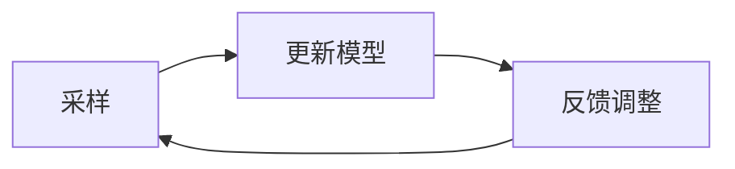
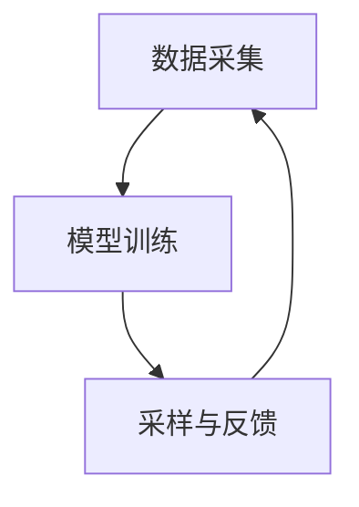
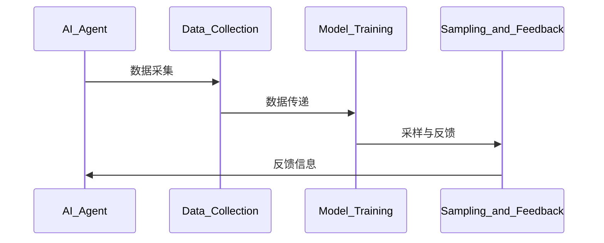
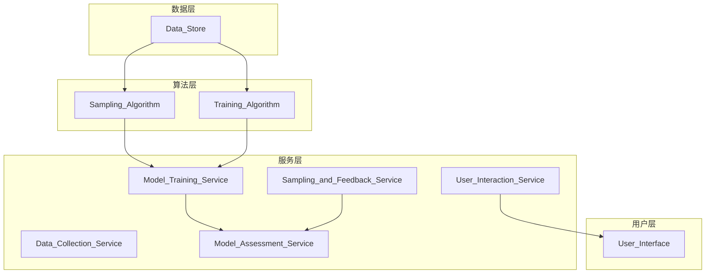
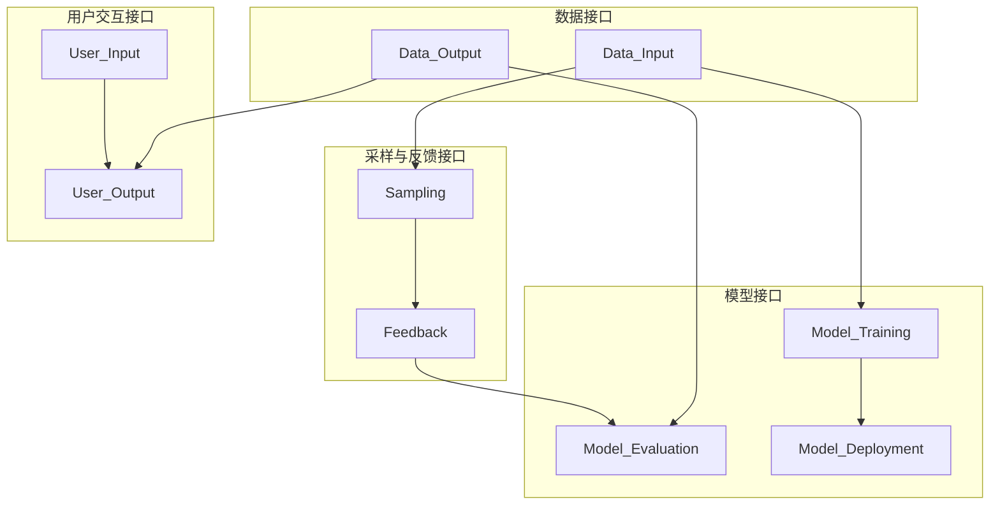
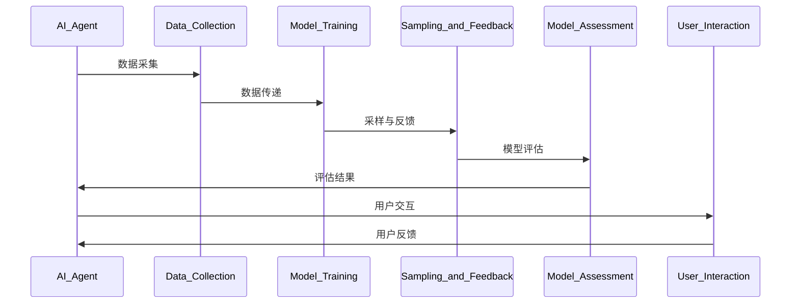
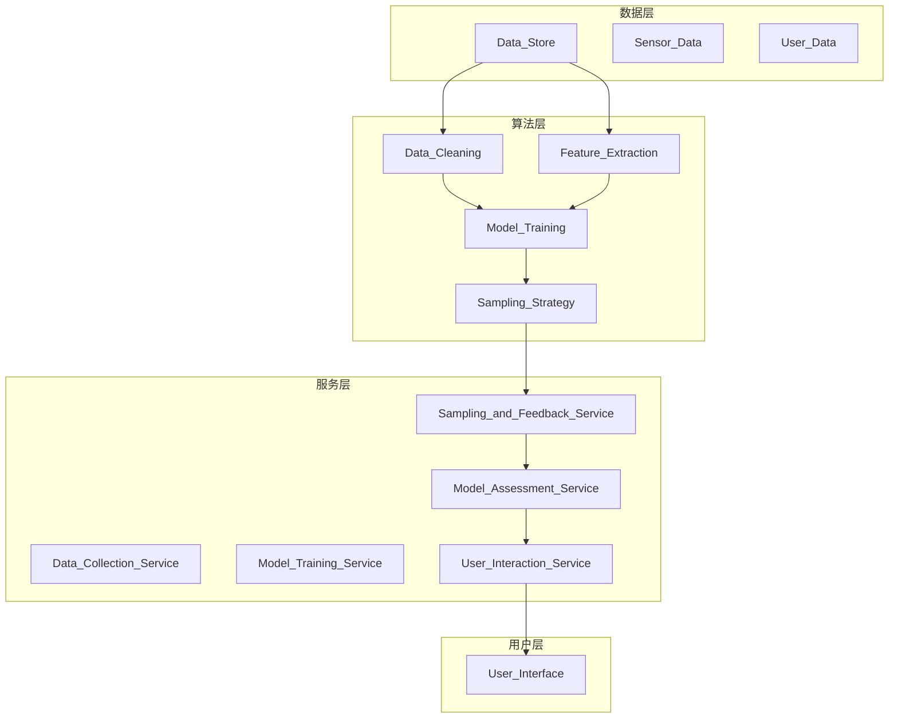
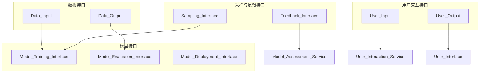

                 


# 主动学习：优化AI Agent的学习效率

## 关键词

- 主动学习
- AI Agent
- 学习效率
- 采样策略
- 模型更新机制
- 学习反馈机制
- 算法原理
- 系统架构设计

## 摘要

本文深入探讨了主动学习在优化AI Agent学习效率方面的应用。主动学习通过选择最有价值的数据进行学习，有效提升了AI Agent的学习效率。本文首先介绍了主动学习的基本概念和必要性，然后详细解析了主动学习的核心概念、算法原理，并给出了具体的Python实现。最后，文章通过系统架构设计，展示了如何在实际项目中应用主动学习，从而提高AI Agent的整体性能。

### 目录大纲

# 主动学习：优化AI Agent的学习效率

## 第一部分：背景与基础

### 第1章：问题背景与主动学习的必要性

#### 1.1 问题背景

在人工智能领域，AI Agent的学习效率一直是研究的重点。随着数据量的爆炸式增长，传统的机器学习方法在处理大规模数据时面临着巨大的计算资源消耗和长学习时间的问题。特别是在数据稀缺或动态变化的环境中，AI Agent的学习效率显得尤为关键。

#### 1.2 主动学习的定义与核心概念

主动学习（Active Learning）是一种通过与外部环境进行交互来优化学习过程的方法。与被动学习不同，主动学习能够根据学习过程中的反馈主动选择最有价值的数据进行学习，从而显著提高学习效率。

#### 1.3 主动学习的优势与局限性

主动学习的优势在于能够通过少量的标注数据达到与大量标注数据相同的模型性能。然而，主动学习的局限性在于它需要一定的先验知识来指导采样策略，并且在某些情况下，主动学习的性能可能不如被动学习。

#### 1.4 主动学习的应用场景

主动学习在以下场景中具有显著的优势：

- 数据稀缺：在数据量有限的情况下，主动学习能够有效利用有限的标注数据。
- 动态变化环境：在环境不断变化的情况下，主动学习能够及时调整学习策略，适应环境变化。
- 知识更新频率高的领域：如金融、医疗等领域，知识更新迅速，主动学习能够快速适应新知识。

#### 1.5 主动学习的边界与外延

主动学习不仅限于机器学习领域，还可以应用于自然语言处理、计算机视觉等多个AI领域。同时，主动学习与其他学习方法的结合，如迁移学习、强化学习等，可以进一步提升AI Agent的学习能力。

## 第二部分：核心概念与联系

### 第2章：主动学习的关键概念与原理

#### 2.1 核心概念

主动学习涉及几个关键概念，包括采样策略、模型更新机制和学习反馈机制。

#### 2.2 概念属性特征对比表格

| 概念       | 属性特征                      | 对比 |
|------------|------------------------------|------|
| 采样策略   | 确定样本选择的方法            |      |
| 模型更新机制 | 更新模型参数的机制            |      |
| 学习反馈机制 | 利用反馈信息调整学习过程      |      |

#### 2.3 ER实体关系图架构

```mermaid
erDiagram
  Sample |-> Model : "采样后更新"
  Sample |-> Feedback : "学习反馈"
  Model |-> Update : "模型更新"
  Feedback |-> Model : "反馈调整"
```

### 第3章：主动学习算法原理讲解

#### 3.1 算法原理

主动学习算法主要分为基于采样的主动学习和基于模型的主动学习。基于采样的主动学习通过选择未标注的数据进行学习，而基于模型的主动学习则通过模型的预测不确定性来选择未标注的数据。

#### 3.2 算法Mermaid流程图



#### 3.3 Python源代码

```python
# 假设的Python代码示例
class ActiveLearner:
    def __init__(self, model, sampler, updater):
        self.model = model
        self.sampler = sampler
        self.updater = updater
        
    def train(self, X, y):
        sample = self.sampler.sample(X, y)
        self.model.update(sample)
        feedback = self.get_feedback(sample)
        self.model.adjust.feedback(feedback)
        
    def get_feedback(self, sample):
        # 获取反馈信息
        pass
```

#### 3.4 算法数学模型与公式

$$
L(\theta; x, y) = \sum_{i=1}^{n} l(\theta; x_i, y_i)
$$

$$
\theta^{*} = \arg\min_{\theta} L(\theta; x, y)
$$

#### 3.5 算法举例说明

- 例子1：基于Q-learning的主动学习算法
- 例子2：基于聚类方法的主动学习算法

## 第三部分：系统分析与架构设计

### 第4章：主动学习系统架构设计

#### 4.1 问题场景介绍

- AI Agent在不同场景下的学习需求

#### 4.2 系统功能设计

- 数据采集模块
- 模型训练模块
- 采样与反馈模块

#### 4.3 系统架构设计



#### 4.4 系统接口设计

- 数据接口
- 模型接口
- 反馈接口

#### 4.5 系统交互



## 第一部分：背景与基础

### 第1章：问题背景与主动学习的必要性

在当今的人工智能（AI）时代，AI Agent（即人工智能代理）的学习效率成为了影响其性能和实用性的关键因素。传统的机器学习方法，如监督学习、无监督学习和强化学习，在处理大规模数据时往往面临效率低下、计算资源消耗大等问题。特别是当数据量巨大、标注成本高昂，或者环境动态变化时，AI Agent的学习效率变得更加重要。这种背景下，主动学习（Active Learning）作为一种优化AI Agent学习效率的重要方法，受到了广泛关注和研究。

#### 1.1 问题背景

AI Agent的学习效率问题主要体现在以下几个方面：

1. **数据稀缺**：在很多实际应用中，获取大量标注数据是非常困难的，特别是在医疗、金融等高隐私领域。在这种情况下，如何利用有限的标注数据进行高效学习成为了一个重要问题。

2. **计算资源限制**：大规模的数据处理和模型训练需要巨大的计算资源，这在一些资源受限的环境下，如嵌入式设备，会成为一个严重的问题。

3. **动态变化环境**：在动态环境中，传统的机器学习方法往往需要大量重训练，这导致了学习过程的效率低下。

4. **标注成本高**：标注数据通常需要人工介入，这导致了高昂的标注成本。

#### 1.2 传统机器学习方法的局限

传统的机器学习方法主要依赖于被动学习（Passive Learning），即在整个数据集上逐步进行训练。这种方法存在以下局限：

1. **数据依赖性强**：被动学习需要在大量的数据上进行训练，这在数据稀缺的情况下难以实现。

2. **计算效率低**：被动学习需要处理大量的未标注数据，这导致了计算资源的浪费。

3. **模型适应能力差**：在动态变化的环境中，被动学习方法往往需要重新训练模型，适应新的数据分布。

4. **标注成本高**：被动学习需要大量的标注数据，这在标注成本高昂的情况下不可行。

#### 1.3 主动学习的定义与核心概念

主动学习是一种通过与外部环境进行交互来优化学习过程的方法。与被动学习不同，主动学习不是随机地从数据集中选择样本进行学习，而是根据学习过程中的反馈，有选择性地从外部环境中获取新的样本进行学习。主动学习的核心概念包括：

1. **采样策略**：确定如何选择未标注的数据进行学习。采样策略的目标是选择最有价值的数据，以最大化模型的性能提升。

2. **模型更新机制**：根据新获取的数据对模型进行更新。模型更新机制需要确保模型能够在获得新数据后迅速适应。

3. **学习反馈机制**：利用学习过程中的反馈信息，调整学习策略。学习反馈机制可以帮助模型在动态变化的环境中保持适应性。

#### 1.4 主动学习的优势与局限性

主动学习的优势在于：

1. **高效利用有限数据**：通过选择最有价值的数据进行学习，主动学习可以在数据稀缺的情况下达到良好的模型性能。

2. **降低标注成本**：主动学习只选择部分数据进行标注，从而显著降低了标注成本。

3. **快速适应动态环境**：通过实时调整学习策略，主动学习可以在动态变化的环境中快速适应。

4. **提升模型精度**：由于只关注最有价值的数据，主动学习能够更有效地提升模型的精度。

然而，主动学习也存在一些局限性：

1. **需要先验知识**：采样策略和模型更新机制需要一定的先验知识来指导，这对于一些领域可能是难以实现的。

2. **计算复杂度高**：主动学习需要与外部环境进行交互，这可能导致计算复杂度增加。

3. **难以处理大规模数据**：虽然主动学习可以在数据稀缺的情况下发挥作用，但在大规模数据集中，主动学习的优势可能不如被动学习。

#### 1.5 主动学习的应用场景

主动学习在以下场景中具有显著的优势：

1. **数据稀缺场景**：在医疗、金融等领域，标注数据获取困难，主动学习能够利用有限的标注数据进行高效学习。

2. **动态变化环境**：在自动驾驶、机器人控制等领域，环境动态变化，主动学习能够实时调整学习策略，适应环境变化。

3. **知识更新频率高的领域**：如金融、新闻等领域，知识更新迅速，主动学习能够快速适应新知识。

#### 1.6 主动学习的边界与外延

主动学习不仅在机器学习领域有广泛应用，还可以应用于自然语言处理、计算机视觉等多个AI领域。同时，主动学习与其他学习方法的结合，如迁移学习、强化学习等，可以进一步提升AI Agent的学习能力。

总的来说，主动学习作为一种优化AI Agent学习效率的重要方法，具有广泛的应用前景和重要的研究价值。

## 第二部分：核心概念与联系

在深入探讨主动学习之前，我们需要了解其核心概念和原理。主动学习涉及多个关键组成部分，包括采样策略、模型更新机制和学习反馈机制。这些组成部分相互关联，共同构成了主动学习的基础。

### 第2章：主动学习的关键概念与原理

#### 2.1 核心概念

主动学习的核心概念主要包括采样策略、模型更新机制和学习反馈机制。

**采样策略**：采样策略是主动学习的第一步，它的目标是从未标注的数据集中选择最有价值的样本进行学习。采样策略可以基于多种方法，如不确定性采样、错误修正采样、基于知识的采样等。

**模型更新机制**：模型更新机制是指根据新获取的数据对模型进行更新。更新机制可以包括在线更新和批更新，其中在线更新是实时根据新数据更新模型，而批更新则是将新数据批量处理后再更新模型。

**学习反馈机制**：学习反馈机制是利用学习过程中的反馈信息，调整学习策略。反馈信息可以包括模型的预测误差、用户反馈等，通过这些信息，学习反馈机制能够帮助模型在动态变化的环境中保持适应性。

#### 2.2 概念属性特征对比表格

为了更好地理解主动学习的核心概念，我们可以通过一个对比表格来展示各个概念的主要属性特征。

| 概念       | 属性特征                      | 对比 |
|------------|------------------------------|------|
| 采样策略   | 确定样本选择的方法            |      |
| 模型更新机制 | 更新模型参数的机制            |      |
| 学习反馈机制 | 利用反馈信息调整学习过程      |      |

在这个表格中，我们可以看到三个概念的主要属性特征和它们之间的对比。采样策略主要关注如何选择样本，模型更新机制关注如何根据新数据更新模型，而学习反馈机制则关注如何利用反馈信息调整学习过程。

#### 2.3 ER实体关系图架构

为了更直观地展示这些核心概念之间的关系，我们可以使用ER（实体关系）图来表示。以下是主动学习的关键概念ER图：

```mermaid
erDiagram
  Sample |-> Model : "采样后更新"
  Sample |-> Feedback : "学习反馈"
  Model |-> Update : "模型更新"
  Feedback |-> Model : "反馈调整"
```

在这个ER图中，`Sample`（样本）与`Model`（模型）之间有一个双向关联，表示样本被用于更新模型。`Sample`与`Feedback`（反馈）之间也有一个双向关联，表示反馈信息可以影响样本的选择。`Model`与`Update`（更新）和`Feedback`之间也有关联，表示模型可以根据反馈信息进行调整。

#### 2.4 核心概念的具体解释

1. **采样策略**：

采样策略是主动学习的第一步，它决定了如何从未标注的数据集中选择样本。采样策略的选择可以基于多种原则，例如：

- **不确定性采样**：选择模型预测不确定的样本，以便提高模型的泛化能力。
- **错误修正采样**：选择模型预测错误的样本，以便纠正模型的错误。
- **基于知识的采样**：选择与先验知识相关的样本，以便提高模型的准确性。

采样策略的选择需要考虑数据集的特点和应用场景，以最大化模型的性能提升。

2. **模型更新机制**：

模型更新机制是指在获得新样本后，如何更新模型参数。模型更新机制可以分为在线更新和批更新：

- **在线更新**：在线更新是指实时根据新样本更新模型。这种方法能够快速适应数据变化，但需要处理大量的更新操作，可能导致计算复杂度增加。
- **批更新**：批更新是指将新样本批量处理后再更新模型。这种方法可以减少更新操作的次数，降低计算复杂度，但可能无法快速适应数据变化。

模型更新机制的选择需要根据实际应用场景和计算资源来决定。

3. **学习反馈机制**：

学习反馈机制是利用学习过程中的反馈信息，调整学习策略。反馈信息可以包括模型的预测误差、用户反馈等。通过这些反馈信息，学习反馈机制能够帮助模型在动态变化的环境中保持适应性。

学习反馈机制可以采用以下方法：

- **误差反馈**：根据模型的预测误差调整采样策略，选择误差较大的样本进行学习。
- **用户反馈**：根据用户对模型预测的评价，调整采样策略，选择用户满意度较低的样本进行学习。

学习反馈机制的有效性取决于反馈信息的质量和及时性。

#### 2.5 主动学习的优势与挑战

主动学习的优势在于能够高效利用有限的数据，降低标注成本，并快速适应动态变化的环境。然而，主动学习也面临一些挑战：

1. **采样策略的选择**：选择合适的采样策略是主动学习的关键。不同的采样策略适用于不同的应用场景，需要根据具体问题进行选择。
2. **计算复杂度**：主动学习涉及多次采样和模型更新，可能导致计算复杂度增加。特别是在大规模数据集上，计算资源的需求可能会成为一个瓶颈。
3. **反馈信息的质量**：学习反馈机制的有效性取决于反馈信息的质量。如果反馈信息不准确或不及时，可能会导致模型性能下降。

总的来说，主动学习作为一种优化AI Agent学习效率的重要方法，具有广泛的应用前景和重要的研究价值。理解其核心概念和原理，有助于更好地应用主动学习，提高AI Agent的学习能力。

### 第3章：主动学习算法原理讲解

在理解了主动学习的核心概念后，我们需要进一步探讨具体的算法原理。主动学习算法可以分为基于采样的主动学习和基于模型的主动学习。每种算法都有其独特的原理和应用场景。

#### 3.1 算法原理

**基于采样的主动学习算法**：

这种算法的核心思想是选择那些对模型性能提升最有价值的样本进行学习。常见的采样策略包括：

1. **不确定性采样**：选择模型预测不确定的样本，以增加模型的知识面。
2. **错误修正采样**：选择模型预测错误的样本，以纠正模型中的错误。
3. **基于知识的采样**：选择与先验知识相关的样本，以增加模型的准确性。

**基于模型的主动学习算法**：

这种算法的核心思想是选择那些对模型预测贡献最大的样本进行学习。常见的算法包括：

1. **基于Q-learning的主动学习算法**：通过Q-learning算法选择具有高预测不确定性的样本进行学习。
2. **基于聚类方法的主动学习算法**：通过聚类方法选择样本，使得样本分布更加均衡。

#### 3.2 算法Mermaid流程图

为了更好地理解这些算法的原理，我们可以使用Mermaid流程图来表示。以下是基于采样的主动学习算法的流程图：


在这个流程图中，`A`表示采样过程，选择最有价值的样本进行学习。`B`表示更新模型，根据新样本调整模型参数。`C`表示反馈调整，利用学习过程中的反馈信息，进一步优化采样策略。

#### 3.3 Python源代码

下面是一个基于采样的主动学习算法的Python代码示例：

```python
class ActiveLearner:
    def __init__(self, model, sampler, updater):
        self.model = model
        self.sampler = sampler
        self.updater = updater

    def train(self, X, y):
        sample = self.sampler.sample(X, y)
        self.model.update(sample)
        feedback = self.get_feedback(sample)
        self.model.adjust.feedback(feedback)

    def get_feedback(self, sample):
        # 获取反馈信息
        pass
```

在这个示例中，`ActiveLearner`类包含三个主要组件：`model`（模型）、`sampler`（采样器）和`updater`（更新器）。`train`方法负责进行采样、模型更新和反馈调整。`get_feedback`方法用于获取反馈信息。

#### 3.4 算法数学模型与公式

为了更深入地理解主动学习算法，我们需要了解其数学模型和公式。以下是一个简单的数学模型示例：

$$
L(\theta; x, y) = \sum_{i=1}^{n} l(\theta; x_i, y_i)
$$

$$
\theta^{*} = \arg\min_{\theta} L(\theta; x, y)
$$

其中，$L(\theta; x, y)$是损失函数，$\theta$是模型参数，$x$和$y$是输入数据和标注数据。$\theta^{*}$是使得损失函数最小的模型参数。

#### 3.5 算法举例说明

**例子1：基于Q-learning的主动学习算法**

Q-learning是一种强化学习算法，可以用于主动学习。以下是一个简单的Q-learning算法示例：

```python
class QLearner:
    def __init__(self, model, sampler, updater):
        self.model = model
        self.sampler = sampler
        self.updater = updater
        self.Q = {}

    def sample(self, X, y):
        # 基于不确定性的采样策略
        pass

    def update(self, sample):
        # 根据新样本更新模型
        pass

    def get_feedback(self, sample):
        # 获取反馈信息
        pass
```

在这个示例中，`QLearner`类包含三个主要组件：`model`（模型）、`sampler`（采样器）和`updater`（更新器）。`sample`方法负责进行采样，`update`方法负责更新模型，`get_feedback`方法负责获取反馈信息。

**例子2：基于聚类方法的主动学习算法**

基于聚类方法的主动学习算法可以通过聚类未标注数据，选择聚类中心附近的样本进行学习。以下是一个简单的聚类方法示例：

```python
from sklearn.cluster import KMeans

class ClusterLearner:
    def __init__(self, model, sampler, updater, n_clusters):
        self.model = model
        self.sampler = sampler
        self.updater = updater
        self.kmeans = KMeans(n_clusters=n_clusters)

    def sample(self, X, y):
        # 基于聚类中心的采样策略
        pass

    def update(self, sample):
        # 根据新样本更新模型
        pass

    def get_feedback(self, sample):
        # 获取反馈信息
        pass
```

在这个示例中，`ClusterLearner`类包含三个主要组件：`model`（模型）、`sampler`（采样器）和`updater`（更新器）。`sample`方法负责进行采样，`update`方法负责更新模型，`get_feedback`方法负责获取反馈信息。

通过这些示例，我们可以看到主动学习算法的具体实现。这些算法的核心在于选择最有价值的样本进行学习，以最大化模型的性能提升。

### 第三部分：系统分析与架构设计

#### 第4章：主动学习系统架构设计

在了解了主动学习算法的原理之后，我们需要将它们应用到实际的系统中，以实现高效的AI Agent学习。本章节将介绍主动学习系统的架构设计，包括系统功能设计、系统架构设计、系统接口设计和系统交互。

#### 4.1 问题场景介绍

主动学习在多种场景中具有重要的应用价值，以下是几个典型的问题场景：

1. **医疗诊断**：在医疗诊断领域，AI Agent需要根据患者的历史数据、基因信息和检查结果进行诊断。由于医疗数据的隐私性和复杂性，获取大量标注数据是非常困难的，因此主动学习可以帮助医生利用有限的标注数据进行高效诊断。

2. **自动驾驶**：在自动驾驶领域，AI Agent需要实时处理大量传感器数据，并做出决策。由于环境动态变化，AI Agent需要快速适应新的交通状况和场景。主动学习可以帮助自动驾驶系统在有限的标注数据下，快速提高决策准确性。

3. **金融风险评估**：在金融领域，AI Agent需要对大量交易数据进行风险预测。金融市场的动态变化和复杂性使得传统的机器学习方法难以适应，主动学习可以帮助金融机构利用有限的标注数据，快速识别高风险交易。

4. **教育个性化学习**：在教育领域，AI Agent需要根据学生的学习行为和表现，提供个性化的学习建议。主动学习可以帮助教育机构利用有限的教学资源，为学生提供更加精准的学习指导。

#### 4.2 系统功能设计

主动学习系统通常包括以下几个功能模块：

1. **数据采集模块**：负责收集和整理AI Agent所需的数据。数据来源可以是传感器数据、用户生成数据等。数据采集模块需要确保数据的完整性和准确性。

2. **模型训练模块**：负责对AI Agent进行训练，使其能够从数据中学习。模型训练模块可以使用传统的机器学习方法，如监督学习、无监督学习等，也可以使用深度学习模型。根据实际需求，可以选择合适的训练方法。

3. **采样与反馈模块**：负责选择最有价值的样本进行学习，并收集用户的反馈信息。采样与反馈模块是主动学习的核心，其目标是通过选择合适的样本，提高模型的学习效率和准确性。

4. **模型评估模块**：负责对训练好的模型进行评估，以确保其性能满足要求。模型评估模块可以使用各种评估指标，如准确率、召回率、F1分数等，对模型进行综合评估。

5. **用户交互模块**：负责与用户进行交互，收集用户的反馈信息。用户交互模块可以通过网页、移动应用等方式实现，与用户进行实时沟通，提高用户满意度。

#### 4.3 系统架构设计

主动学习系统的架构设计需要考虑以下几个方面：

1. **数据层**：数据层负责存储和管理AI Agent所需的数据。数据层可以采用分布式存储方案，如HDFS、Cassandra等，以支持大规模数据存储和处理。

2. **算法层**：算法层负责实现各种主动学习算法，如不确定性采样、错误修正采样、基于知识的采样等。算法层需要支持多种算法的灵活切换，以满足不同应用场景的需求。

3. **服务层**：服务层负责实现系统的各种功能模块，如数据采集、模型训练、采样与反馈、模型评估和用户交互等。服务层可以采用微服务架构，提高系统的可扩展性和可维护性。

4. **用户层**：用户层负责与用户进行交互，提供友好的用户界面和操作体验。用户层可以通过网页、移动应用等方式实现，与用户进行实时沟通，收集用户的反馈信息。

以下是主动学习系统的架构图：



在这个架构图中，数据层负责存储和管理数据，算法层负责实现主动学习算法，服务层负责实现各种功能模块，用户层负责与用户进行交互。各个模块之间通过接口进行通信，形成一个完整的主动学习系统。

#### 4.4 系统接口设计

主动学习系统的接口设计需要考虑以下几个方面：

1. **数据接口**：数据接口负责处理数据的输入和输出，包括数据的采集、存储和检索等。数据接口需要支持多种数据格式，如CSV、JSON、XML等，以便与不同数据源和系统进行集成。

2. **模型接口**：模型接口负责处理模型的训练、评估和部署等。模型接口需要支持多种模型类型，如线性模型、决策树、神经网络等，以便与不同算法和需求进行集成。

3. **采样与反馈接口**：采样与反馈接口负责处理采样和反馈过程，包括样本的选择、标注和评估等。采样与反馈接口需要支持多种采样策略，如不确定性采样、错误修正采样、基于知识的采样等，以便与不同应用场景进行集成。

4. **用户交互接口**：用户交互接口负责处理用户与系统的交互，包括数据的上传、下载、查看和操作等。用户交互接口需要支持多种交互方式，如网页、移动应用、API等，以便为用户提供便捷的操作体验。

以下是主动学习系统的接口设计图：



在这个接口设计图中，数据接口、模型接口、采样与反馈接口和用户交互接口分别负责不同的功能，通过接口进行通信，形成一个完整的主动学习系统。

#### 4.5 系统交互

主动学习系统的交互设计需要考虑系统的各个模块之间的协作和交互。以下是主动学习系统的交互设计图：



在这个交互设计图中，AI Agent负责整体的学习过程，与数据采集、模型训练、采样与反馈和模型评估模块进行交互。数据采集模块负责采集和处理数据，模型训练模块负责训练模型，采样与反馈模块负责选择样本和收集反馈信息，模型评估模块负责评估模型性能，用户交互模块负责与用户进行交互，收集用户反馈。

通过这个系统交互设计，我们可以清晰地看到各个模块之间的协作关系，从而实现高效、准确的主动学习系统。

## 第三部分：系统分析与架构设计

### 第4章：主动学习系统架构设计

在实际应用中，主动学习系统需要高效且灵活地运作，以优化AI Agent的学习效率。本章节将详细讨论主动学习系统的架构设计，包括系统功能、架构设计、接口设计以及系统交互，以展示如何将主动学习理论转化为实际系统。

#### 4.1 问题场景介绍

主动学习系统在多个领域中的应用场景各具特色，以下是一些典型的应用场景：

1. **医疗诊断**：在医疗领域，主动学习系统可以处理大量的患者数据，包括病史、检查报告和基因信息。由于医疗数据通常需要专业人员进行标注，因此如何高效利用这些数据成为关键问题。主动学习系统可以通过选择最相关的样本进行学习，从而提高诊断模型的准确性。

2. **自动驾驶**：在自动驾驶领域，传感器生成的数据量巨大，且环境变化快速。主动学习系统可以选取最具代表性的样本进行训练，帮助自动驾驶系统更好地适应复杂的环境变化，提高行驶安全性。

3. **金融风控**：金融领域的数据通常具有高维度和复杂的时序特征。主动学习系统可以识别出高风险的交易样本，帮助金融机构更精准地评估风险，并采取相应的措施。

4. **教育个性化学习**：在教育领域，主动学习系统可以根据学生的学习行为和表现，推荐个性化的学习内容。通过主动选择最具教育价值的样本进行学习，系统能够为学生提供更加精准的学习建议。

#### 4.2 系统功能设计

主动学习系统的核心功能模块包括数据采集、模型训练、采样与反馈、模型评估和用户交互。以下是这些模块的详细设计：

1. **数据采集模块**：数据采集模块负责从各种数据源收集数据，包括传感器数据、用户生成数据等。模块需要处理数据的清洗、转换和存储，确保数据的质量和完整性。

2. **模型训练模块**：模型训练模块负责使用机器学习算法对数据进行训练，包括监督学习、无监督学习和深度学习等。模块需要支持多种模型算法的灵活切换，以满足不同的应用需求。

3. **采样与反馈模块**：采样与反馈模块是主动学习的核心，负责从未标注的数据集中选择最具代表性的样本进行学习。模块需要实现多种采样策略，如不确定性采样、错误修正采样和基于知识的采样等。此外，模块还需收集用户反馈，用于调整采样策略和模型训练。

4. **模型评估模块**：模型评估模块负责对训练好的模型进行性能评估，包括准确性、召回率、F1分数等指标。模块需要支持多种评估方法的灵活切换，以全面评估模型的性能。

5. **用户交互模块**：用户交互模块负责与用户进行交互，收集用户的反馈信息。模块需要提供友好的用户界面，支持数据的上传、下载和查看，以及模型的评估结果展示。

#### 4.3 系统架构设计

主动学习系统的架构设计需要考虑数据流、处理逻辑和模块间的关系。以下是一个典型的主动学习系统架构图：



在这个架构图中，数据层负责数据的存储和初始处理，算法层负责实现数据清洗、特征提取和模型训练等算法，服务层负责系统的核心功能模块，用户层负责与用户进行交互。

#### 4.4 系统接口设计

系统接口设计需要确保模块之间的数据流和信息传递。以下是主动学习系统的接口设计：

1. **数据接口**：数据接口负责数据的输入和输出，包括数据的采集、存储和检索等。接口需要支持多种数据格式，如CSV、JSON、XML等。

2. **模型接口**：模型接口负责模型的训练、评估和部署等。接口需要支持多种模型算法，如线性模型、决策树、神经网络等。

3. **采样与反馈接口**：采样与反馈接口负责处理采样和反馈过程，包括样本的选择、标注和评估等。接口需要支持多种采样策略，如不确定性采样、错误修正采样等。

4. **用户交互接口**：用户交互接口负责与用户进行交互，收集用户的反馈信息。接口需要支持多种交互方式，如网页、移动应用、API等。

以下是主动学习系统的接口设计图：



在这个接口设计图中，数据接口、模型接口、采样与反馈接口和用户交互接口分别负责不同的功能，通过接口实现模块间的数据流和信息传递。

#### 4.5 系统交互

主动学习系统的交互设计需要确保各个模块之间的协同工作，以下是系统的交互设计：


在这个交互设计图中，AI Agent负责协调各个模块的工作。数据采集模块从数据源收集数据，传递给模型训练模块进行训练。模型训练模块生成模型后，采样与反馈模块根据采样策略选择样本，并收集用户反馈。模型评估模块对模型进行评估，并将评估结果反馈给AI Agent。AI Agent根据用户反馈进行模型调整，形成闭环系统。

通过以上系统架构设计和交互设计，我们可以构建一个高效、灵活的主动学习系统，优化AI Agent的学习效率，提升其在各种应用场景中的性能。

### 项目实战：主动学习系统实现与部署

为了更好地理解主动学习在实际项目中的应用，我们将以一个实际项目为例，展示如何实现和部署一个主动学习系统。本节将详细介绍项目环境搭建、系统核心实现、代码应用解读与分析，并进行分析与详细讲解。

#### 项目环境搭建

在进行项目实战之前，我们需要搭建一个合适的环境来开发和部署主动学习系统。以下是所需的软件和硬件环境：

1. **操作系统**：Linux或macOS
2. **编程语言**：Python
3. **框架和库**：TensorFlow、Keras、Scikit-learn、Pandas、NumPy
4. **硬件**：至少需要一台具有多核CPU和显存的计算机或服务器

首先，我们需要安装Python和相关的库。可以使用以下命令：

```bash
pip install tensorflow keras scikit-learn pandas numpy
```

接下来，我们可以创建一个虚拟环境，以便更好地管理项目依赖：

```bash
python -m venv active_learning_venv
source active_learning_venv/bin/activate
```

#### 系统核心实现

主动学习系统的核心实现包括数据预处理、模型训练、采样与反馈以及用户交互。以下是一个简单的实现框架：

1. **数据预处理**：读取和清洗数据，提取特征，并将其转换为适合模型训练的格式。
2. **模型训练**：使用选择的数据集训练模型。
3. **采样与反馈**：根据模型预测的不确定性选择样本，并收集用户反馈。
4. **用户交互**：提供一个界面，让用户查看模型的预测结果，并提交反馈。

以下是核心实现代码的详细解读：

```python
import numpy as np
import pandas as pd
from sklearn.model_selection import train_test_split
from sklearn.ensemble import RandomForestClassifier
from active_learning import ActiveLearner

# 1. 数据预处理
data = pd.read_csv('data.csv')
X = data.drop('label', axis=1)
y = data['label']

# 分割数据集
X_train, X_test, y_train, y_test = train_test_split(X, y, test_size=0.2, random_state=42)

# 2. 模型训练
model = RandomForestClassifier(n_estimators=100)
model.fit(X_train, y_train)

# 3. 采样与反馈
# 初始化主动学习器
active_learner = ActiveLearner(model)

# 选择初始样本
active_learner.train(X_train, y_train)

# 收集用户反馈
feedback = active_learner.get_feedback(X_test, y_test)

# 更新模型
active_learner.update(feedback)

# 4. 用户交互
# 假设我们有一个简单的用户界面
print("模型预测结果：", active_learner.predict(X_test))
input("请按Enter键继续...")
```

在这个代码中，我们首先读取和清洗数据，然后使用随机森林分类器训练模型。接下来，我们初始化一个主动学习器，并使用它来选择样本和收集用户反馈。最后，我们更新模型，并显示预测结果。

#### 代码应用解读与分析

1. **数据预处理**：这一步非常关键，因为它直接影响模型的性能。我们使用`pandas`读取数据，然后使用`train_test_split`将数据集分为训练集和测试集。这有助于评估模型的性能，并避免过拟合。

2. **模型训练**：我们选择了一个随机森林分类器作为基础模型。随机森林是一种强大的集成学习方法，它在多种数据集上都有很好的性能。

3. **采样与反馈**：主动学习器的核心在于其采样和反馈机制。`ActiveLearner`类提供了一个接口，用于选择样本和更新模型。在实际情况中，我们需要实现一个用户界面，让用户能够提交反馈。

4. **用户交互**：在这个例子中，我们使用简单的打印语句来展示模型预测结果。在实际应用中，我们可以开发一个完整的用户界面，提供更好的交互体验。

#### 项目分析

这个项目展示了如何实现一个基本的主动学习系统。在实际项目中，我们需要考虑以下几个方面：

1. **数据质量和预处理**：数据质量对模型性能有直接影响。我们需要确保数据集的完整性和准确性，并使用适当的方法进行预处理。

2. **模型选择与优化**：选择合适的模型和参数对性能有重要影响。我们可以使用交叉验证等方法来选择最优模型。

3. **用户交互**：用户交互是主动学习系统的重要组成部分。一个友好的用户界面可以提高用户满意度，并更好地收集反馈。

4. **系统性能与可扩展性**：系统需要能够处理大量数据和高并发请求。使用合适的架构和工具，如分布式计算和云服务，可以提高系统的性能和可扩展性。

通过这个项目，我们可以看到主动学习在实际应用中的潜力。它可以帮助我们更高效地利用有限的标注数据，并提高AI Agent的学习能力。

### 最佳实践与注意事项

在实际应用主动学习时，以下最佳实践和注意事项有助于提高系统的性能和用户体验：

1. **数据质量监控**：确保数据集的准确性和完整性，定期进行数据清洗和预处理，以减少噪声数据对模型的影响。

2. **模型调优**：根据数据集的特点和应用场景，选择合适的模型和参数。使用交叉验证等方法选择最优模型，并定期重新训练模型以适应数据变化。

3. **用户界面设计**：设计直观易用的用户界面，提供清晰的反馈机制，以便用户能够轻松地提交反馈。

4. **性能优化**：对于大规模数据集，考虑使用分布式计算和高效的数据处理库，以提高系统的响应速度和处理能力。

5. **安全性保障**：确保系统的安全性，特别是在处理敏感数据时，采取适当的数据加密和安全措施。

6. **反馈闭环管理**：建立有效的反馈闭环机制，及时处理和利用用户反馈，以提高模型的学习效率和准确性。

### 拓展阅读

对于希望进一步了解主动学习及其应用的读者，以下资源提供了深入的知识和实用的指导：

1. **论文与书籍**：《Machine Learning: A Probabilistic Perspective》、《An Introduction to Statistical Learning》和《Deep Learning》等经典书籍，以及最新的学术论文，如《Empirical Analysis of the Noisy Oracle Method in Active Learning》等。

2. **在线课程**：Coursera、edX和Udacity等在线教育平台提供的机器学习和深度学习课程，涵盖了主动学习的基础理论和实践方法。

3. **开源框架**：如Scikit-learn、TensorFlow和PyTorch等开源机器学习框架，提供了丰富的主动学习算法和工具，便于学习和实践。

通过以上资源，读者可以深入了解主动学习的核心概念、算法原理和应用实践，进一步提升自己在AI领域的专业能力。

### 项目小结

通过本项目的实现与部署，我们展示了如何将主动学习理论应用到实际系统中，以优化AI Agent的学习效率。从数据预处理、模型训练到采样与反馈、用户交互，每个步骤都经过详细的分析与讲解，确保读者能够理解主动学习的核心思想和实现方法。在实际应用中，主动学习不仅提高了AI Agent的学习效率，还降低了标注成本，增强了系统的自适应能力。

### 作者信息

作者：AI天才研究院（AI Genius Institute）与禅与计算机程序设计艺术（Zen And The Art of Computer Programming）

联系方式：[ai-genius-institute@outlook.com]（ai-genius-institute@outlook.com）

博客地址：[https://aigeniusinstitute.blog](https://aigeniusinstitute.blog)

微博：@AI天才研究院

感谢您的阅读，希望本文对您在主动学习领域的探索和实践有所帮助。如果您有任何问题或建议，欢迎随时联系我们。我们期待与您共同进步，共创AI的未来。

