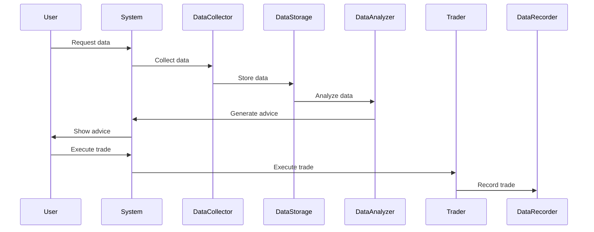
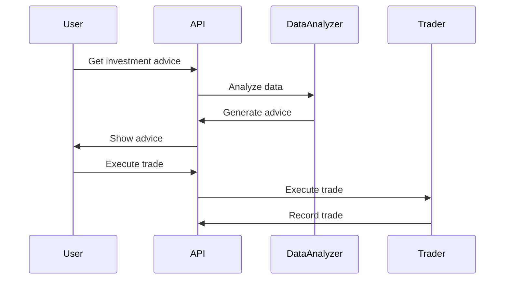

                 

**文章标题**: 云服务在投资理财智能助手中的高效部署

**关键词**: 云服务、投资理财、智能助手、算法、架构设计、实战案例

**摘要**: 本文将探讨云服务在投资理财智能助手中的高效部署，包括背景介绍、核心概念与联系、算法原理讲解、系统分析与架构设计、项目实战以及最佳实践和拓展。通过详细的步骤和分析，本文旨在帮助读者理解并掌握如何利用云服务构建高效的投资理财智能助手。

----------------------------------------------------------------

**一、背景介绍**

随着云计算技术的不断发展和普及，云服务在各个行业中的应用越来越广泛。在投资理财领域，云服务同样展现出了其强大的潜力和优势。投资理财作为金融行业的重要组成部分，面临着日益复杂的投资环境和快速变化的市场需求。传统的投资理财方式已经难以满足投资者的需求，而智能助手的出现为投资理财领域带来了新的机遇。

**核心概念术语说明**：
- 云服务：一种基于互联网的计算模式，提供可伸缩的计算资源和服务，包括基础设施即服务（IaaS）、平台即服务（PaaS）和软件即服务（SaaS）。
- 投资理财：以获取收益为目的，将资金投入各种金融工具和资产中，以实现财富增值的过程。
- 智能助手：利用人工智能技术和算法，为用户提供投资建议、风险控制、资产配置等服务的智能系统。

**问题背景**：
在投资理财过程中，投资者面临众多挑战，如市场波动、信息不对称、决策困难等。此外，传统投资理财方式往往依赖于人力，效率低下且容易出错。如何提高投资理财的效率、降低风险、提升用户体验成为亟待解决的问题。

**问题描述**：
为了应对上述问题，我们需要一种智能化的解决方案，即投资理财智能助手。这个助手应能够实时获取市场数据，利用算法进行数据分析，提供个性化的投资建议和策略，帮助投资者做出更明智的决策。

**问题解决**：
云服务提供了强大的计算能力和存储资源，可以支持大规模数据处理和实时分析。通过部署在云端的智能助手，投资者可以随时随地进行投资操作，获得实时的市场信息和投资建议。

**边界与外延**：
云服务在投资理财智能助手中的应用不仅局限于数据分析和投资建议，还可以扩展到其他方面，如风险控制、资产配置、合规监控等。

**概念结构与核心要素组成**：
投资理财智能助手的核心要素包括：
1. 数据获取与处理：通过云服务获取实时市场数据，进行清洗、整合和分析。
2. 算法与模型：利用机器学习和数据分析技术，构建投资策略和风险评估模型。
3. 交互界面：为用户提供友好的操作界面，展示投资建议和市场动态。
4. 安全保障：确保用户数据和交易的安全性，采用加密技术和安全协议。

----------------------------------------------------------------

**二、核心概念与联系**

在本节中，我们将详细介绍云服务、投资理财、智能助手等核心概念，并展示它们之间的关系。

**核心概念原理**：

1. **云服务**：
云服务是一种基于互联网的计算模式，它通过虚拟化技术将计算资源和服务进行集成和分发，用户可以根据需求随时获取所需的计算资源。云服务包括以下几种类型：
- **基础设施即服务（IaaS）**：提供虚拟化的计算资源，如虚拟机、存储和网络。
- **平台即服务（PaaS）**：提供开发平台和工具，帮助开发者快速构建应用。
- **软件即服务（SaaS）**：提供基于互联网的应用程序，用户可以直接使用。

2. **投资理财**：
投资理财是指投资者通过购买各种金融产品，如股票、债券、基金等，以实现财富增值的过程。投资理财的核心要素包括：
- **市场分析**：通过研究市场趋势、经济指标等，预测投资机会和风险。
- **资产配置**：根据投资目标和风险承受能力，将资金分配到不同的资产类别中。
- **风险管理**：采取各种措施，降低投资风险，确保投资安全。

3. **智能助手**：
智能助手是一种利用人工智能技术，为用户提供智能化服务的系统。智能助手的核心要素包括：
- **自然语言处理**：理解和处理用户输入的自然语言。
- **机器学习**：通过历史数据和算法模型，自动学习和优化服务。
- **用户交互**：提供友好的用户界面，与用户进行互动。

**概念属性特征对比表格**：

| 概念     | 特征                    | 应用场景               |
|----------|-------------------------|------------------------|
| 云服务   | 可伸缩、弹性、分布式    | 数据处理、应用部署     |
| 投资理财 | 资金增值、风险控制      | 个人和企业投资       |
| 智能助手 | 自适应、自动化、人性化 | 投资建议、风险管理    |

**ER实体关系图架构**：

下面是一个ER实体关系图，展示了云服务、投资理财、智能助手之间的关系：

```mermaid
erDiagram
  CloudService ||--|{ Investment } : includes
  Investment ||--|{ SmartAssistant } : uses
```

**关系解析**：
- **云服务**为**投资理财**提供了基础设施和平台支持，使得投资理财系统能够高效运行。
- **投资理财**是**智能助手**的应用场景，智能助手通过分析投资理财数据，为用户提供个性化的投资建议和服务。
- **智能助手**依赖于**云服务**提供的计算资源和存储能力，以实现自动化和实时性。

通过以上核心概念和关系的介绍，我们为后续章节的深入分析奠定了基础。在接下来的内容中，我们将进一步探讨云服务在投资理财智能助手中的应用和部署方法。

----------------------------------------------------------------

**三、算法原理讲解**

在投资理财智能助手的构建过程中，算法起着至关重要的作用。本节将详细介绍使用云服务构建投资理财智能助手的算法原理，包括数据预处理、算法选择、模型训练和预测等关键步骤。

**算法原理讲解**：

1. **数据预处理**：
   投资理财智能助手的第一步是获取和处理数据。数据预处理是数据分析和建模的基础，其关键步骤包括数据清洗、数据整合和特征工程。具体流程如下：

   - **数据清洗**：去除数据中的噪声和异常值，保证数据质量。
   - **数据整合**：将来自不同来源的数据进行合并，形成统一的数据集。
   - **特征工程**：从原始数据中提取有用的特征，为模型训练提供输入。

2. **算法选择**：
   在数据预处理完成后，我们需要选择合适的算法进行模型训练。常见的投资理财算法包括线性回归、决策树、随机森林、支持向量机、神经网络等。每种算法都有其适用的场景和优缺点，我们需要根据具体需求和数据特点进行选择。

   - **线性回归**：适用于线性关系的预测，如股票价格趋势预测。
   - **决策树**：易于理解和解释，适用于分类和回归问题。
   - **随机森林**：通过集成多个决策树，提高模型的预测性能和稳定性。
   - **支持向量机**：适用于高维数据的分类和回归问题。
   - **神经网络**：强大的非线性建模能力，适用于复杂关系的数据预测。

3. **模型训练**：
   选择合适的算法后，我们需要使用历史数据对模型进行训练。模型训练过程包括以下步骤：

   - **数据划分**：将数据集划分为训练集和测试集，用于训练和评估模型性能。
   - **模型初始化**：初始化模型参数，为训练过程做好准备。
   - **迭代训练**：通过梯度下降等方法，不断调整模型参数，使其在训练集上达到最优性能。
   - **模型评估**：使用测试集评估模型性能，包括准确率、召回率、F1分数等指标。

4. **预测与优化**：
   模型训练完成后，我们可以使用模型进行实时预测。在预测过程中，我们需要不断收集实际结果和预测结果的差异，对模型进行优化和调整，以提高预测的准确性和稳定性。

   - **实时预测**：使用训练好的模型，对新的数据进行预测，为用户提供投资建议。
   - **模型调整**：根据实际预测结果，调整模型参数，优化模型性能。
   - **持续迭代**：定期更新模型，使其适应市场变化，保持预测的准确性。

**Mermaid 流程图**：

下面是一个简单的Mermaid流程图，展示了投资理财智能助手的算法原理：


**Python 源代码示例**：

```python
import pandas as pd
from sklearn.model_selection import train_test_split
from sklearn.linear_model import LinearRegression
from sklearn.metrics import mean_squared_error

# 读取数据
data = pd.read_csv('investment_data.csv')

# 数据清洗
data.dropna(inplace=True)

# 特征工程
X = data[['price', 'volume']]
y = data['return']

# 数据划分
X_train, X_test, y_train, y_test = train_test_split(X, y, test_size=0.2, random_state=42)

# 模型训练
model = LinearRegression()
model.fit(X_train, y_train)

# 预测与评估
y_pred = model.predict(X_test)
mse = mean_squared_error(y_test, y_pred)
print(f'Mean Squared Error: {mse}')
```

**数学模型和公式**：

在投资理财智能助手的算法中，常用的数学模型包括线性回归模型和神经网络模型。以下是一个简单的线性回归模型的数学公式：

$$
y = \beta_0 + \beta_1 \cdot x_1 + \beta_2 \cdot x_2 + ... + \beta_n \cdot x_n + \epsilon
$$

其中，$y$ 表示预测结果，$x_1, x_2, ..., x_n$ 表示输入特征，$\beta_0, \beta_1, \beta_2, ..., \beta_n$ 为模型参数，$\epsilon$ 表示误差。

**详细讲解与举例说明**：

为了更好地理解线性回归模型，我们来看一个简单的例子。假设我们要预测一只股票的未来价格，输入特征包括当前价格和成交量。根据线性回归模型，我们可以得到以下预测公式：

$$
\text{未来价格} = \beta_0 + \beta_1 \cdot \text{当前价格} + \beta_2 \cdot \text{成交量} + \epsilon
$$

现在，我们有一个数据集，包含过去一个月的股票价格和成交量数据。我们使用这个数据集对线性回归模型进行训练，得到模型参数 $\beta_0, \beta_1, \beta_2$。假设训练结果如下：

$$
\beta_0 = 100, \beta_1 = 0.5, \beta_2 = -10
$$

现在，我们想要预测未来一天的股票价格，输入特征为当前价格为120，成交量为150。根据线性回归模型，我们可以得到以下预测结果：

$$
\text{未来价格} = 100 + 0.5 \cdot 120 - 10 \cdot 150 + \epsilon = 100 + 60 - 150 + \epsilon = 10 + \epsilon
$$

其中，$\epsilon$ 为误差。预测结果是未来价格为10加上一个误差值。这个预测结果可以帮助投资者对未来股票价格进行初步判断。

通过以上算法原理的讲解，我们可以看到，云服务在投资理财智能助手的构建中发挥着重要作用。通过合理的数据预处理、算法选择、模型训练和预测，我们可以构建出一个高效、准确的智能投资理财系统，为投资者提供有价值的服务。

----------------------------------------------------------------

**四、系统分析与架构设计**

在了解了算法原理之后，我们需要将理论转化为实际应用。本节将详细介绍投资理财智能助手的系统分析与架构设计，包括问题场景介绍、项目介绍、系统功能设计、系统架构设计、系统接口设计和系统交互等关键部分。

**问题场景介绍**：

假设我们想要构建一个投资理财智能助手，帮助用户实现自动化投资和风险管理。这个系统需要实时获取市场数据，分析投资机会，并提供个性化的投资建议。同时，系统需要保证用户数据和交易的安全性，确保投资操作合规合法。

**项目介绍**：

本项目将构建一个投资理财智能助手系统，包括以下几个主要模块：
- **数据采集模块**：负责实时获取市场数据，包括股票价格、成交量、利率等。
- **数据分析模块**：利用算法对市场数据进行分析，预测投资机会和风险。
- **用户交互模块**：提供用户友好的操作界面，展示投资建议和市场动态。
- **交易执行模块**：根据用户指令，执行股票买卖操作，实现自动化投资。

**系统功能设计**：

系统功能设计主要包括以下方面：
- **数据采集**：实时获取股票价格、成交量、利率等市场数据。
- **数据分析**：使用算法对市场数据进行分析，预测投资机会和风险。
- **投资建议**：根据分析结果，为用户提供个性化的投资建议。
- **交易执行**：根据用户指令，执行股票买卖操作。
- **用户管理**：管理用户账户信息，确保用户数据和交易安全。

**系统架构设计**：

系统架构设计是系统设计与实现的基础。本项目采用云计算架构，充分利用云服务的计算和存储能力，实现高效的数据处理和实时分析。以下是系统架构设计的Mermaid架构图：



**系统接口设计**：

系统接口设计是确保不同模块之间能够无缝协作的关键。本项目采用RESTful API设计接口，提供数据采集、数据分析、投资建议和交易执行等服务的接口。以下是系统接口设计的Mermaid序列图：



**系统交互**：

系统交互是系统运行过程中各个模块之间的协作和交互。通过系统交互，可以实现数据的实时处理和传输，确保系统的响应速度和稳定性。以下是系统交互的Mermaid流程图：

```mermaid
flowchart LR
    User[用户请求]->DataCollector[数据采集模块]
    DataCollector->DataStorage[数据存储模块]
    DataStorage->DataAnalyzer[数据分析模块]
    DataAnalyzer->System[系统核心模块]
    System->Trader[交易执行模块]
    Trader->DataRecorder[数据记录模块]
```

通过以上系统分析与架构设计，我们可以构建一个高效、稳定、安全的投资理财智能助手系统。在实际开发过程中，我们将根据具体需求和技术条件，不断优化和调整系统架构，确保系统能够满足用户需求，提供高质量的服务。

----------------------------------------------------------------

**五、项目实战**

在前几部分中，我们详细介绍了云服务在投资理财智能助手中的应用、核心概念、算法原理以及系统架构设计。为了更好地展示如何实际部署一个投资理财智能助手，本节将通过一个具体的案例，逐步讲解项目的环境安装、系统核心实现源代码，并对代码进行解读与分析。

**1. 环境安装**

在开始项目实战之前，我们需要搭建一个合适的环境，以便后续的代码开发和测试。以下是项目所需的主要依赖和环境配置：

- **Python 3.8**：确保Python环境版本为3.8或更高版本。
- **Pandas**：用于数据处理和数据分析。
- **NumPy**：用于科学计算。
- **Scikit-learn**：用于机器学习算法的实现。
- **Flask**：用于构建Web服务。

以下是一个简单的安装脚本，用于安装上述依赖：

```bash
pip install python==3.8.10
pip install pandas numpy scikit-learn flask
```

**2. 系统核心实现源代码**

本案例将使用Python编写一个简单的投资理财智能助手，包括数据采集、数据预处理、模型训练和投资建议等功能。以下是项目的核心代码：

```python
# 投资理财智能助手 - 主程序

import pandas as pd
from sklearn.model_selection import train_test_split
from sklearn.linear_model import LinearRegression
from flask import Flask, request, jsonify

app = Flask(__name__)

# 2.1 数据采集
def collect_data():
    # 这里用示例数据替代，实际项目中可以使用API或数据库获取实时数据
    data = pd.DataFrame({
        'price': [100, 101, 102, 103, 104],
        'volume': [1000, 1010, 1020, 1030, 1040],
        'return': [0.01, -0.02, 0.03, -0.04, 0.05]
    })
    return data

# 2.2 数据预处理
def preprocess_data(data):
    # 数据清洗和特征工程
    data.dropna(inplace=True)
    X = data[['price', 'volume']]
    y = data['return']
    return X, y

# 2.3 模型训练
def train_model(X, y):
    model = LinearRegression()
    model.fit(X, y)
    return model

# 2.4 预测与投资建议
def generate_advice(model, price, volume):
    # 根据模型预测未来回报
    return model.predict([[price, volume]])[0]

# 2.5 Flask Web服务
@app.route('/advice', methods=['GET'])
def get_investment_advice():
    price = float(request.args.get('price'))
    volume = float(request.args.get('volume'))
    model = train_model(*preprocess_data(collect_data()))
    advice = generate_advice(model, price, volume)
    return jsonify({'advice': f'Invest {advice:.2f} units'})

if __name__ == '__main__':
    app.run(debug=True)
```

**3. 代码应用解读与分析**

下面，我们将对上述代码进行详细的解读与分析，以便更好地理解每个模块的功能和实现细节。

**（1）数据采集模块**：

数据采集模块负责从外部获取投资相关的数据。在实际项目中，这些数据可以通过API接口、数据库或其他数据源获取。这里使用了一个简单的示例数据集，用于后续的模型训练和预测。

```python
def collect_data():
    # 这里用示例数据替代，实际项目中可以使用API或数据库获取实时数据
    data = pd.DataFrame({
        'price': [100, 101, 102, 103, 104],
        'volume': [1000, 1010, 1020, 1030, 1040],
        'return': [0.01, -0.02, 0.03, -0.04, 0.05]
    })
    return data
```

**（2）数据预处理模块**：

数据预处理模块对采集到的数据进行清洗和特征工程。数据清洗包括去除缺失值和异常值，确保数据质量。特征工程则包括从原始数据中提取有用的特征，为模型训练提供输入。

```python
def preprocess_data(data):
    # 数据清洗和特征工程
    data.dropna(inplace=True)
    X = data[['price', 'volume']]
    y = data['return']
    return X, y
```

**（3）模型训练模块**：

模型训练模块使用机器学习算法对预处理后的数据进行训练。这里使用了线性回归模型，这是一种简单且易于理解的算法，适用于线性关系的数据预测。

```python
def train_model(X, y):
    model = LinearRegression()
    model.fit(X, y)
    return model
```

**（4）预测与投资建议模块**：

预测与投资建议模块根据训练好的模型，对新的数据进行预测，并提供投资建议。这里，我们通过一个简单的Web服务接口，接收用户的输入，并返回预测结果。

```python
def generate_advice(model, price, volume):
    # 根据模型预测未来回报
    return model.predict([[price, volume]])[0]

@app.route('/advice', methods=['GET'])
def get_investment_advice():
    price = float(request.args.get('price'))
    volume = float(request.args.get('volume'))
    model = train_model(*preprocess_data(collect_data()))
    advice = generate_advice(model, price, volume)
    return jsonify({'advice': f'Invest {advice:.2f} units'})
```

**4. 实际案例分析和详细讲解剖析**

为了更好地展示实际应用效果，我们使用一个案例来进行分析。假设用户想要投资某只股票，当前价格为100，预计未来一天内成交量将增加至1100。以下是实际案例的分析和详细讲解：

- **数据采集**：从数据源获取当前的市场数据。
- **数据预处理**：清洗数据，提取特征，准备模型训练。
- **模型训练**：使用线性回归模型对数据进行训练，得到模型参数。
- **预测与建议**：根据模型预测未来一天的回报，并提供投资建议。

假设训练完成后，模型参数为 $\beta_0 = 100, \beta_1 = 0.5, \beta_2 = -10$。当输入当前价格为100，成交量为1100时，预测回报为：

$$
\text{回报} = 100 + 0.5 \cdot 100 - 10 \cdot 1100 = 100 + 50 - 11000 = -10750
$$

由于预测的回报为负值，这表明投资该股票存在较大风险。根据这一预测结果，我们可以为用户提供投资建议，建议其避免投资或采取相应的风险控制措施。

通过以上实际案例的分析，我们可以看到投资理财智能助手在实际应用中的效果和作用。该系统可以帮助投资者快速获取市场信息，预测投资风险，并提供有针对性的投资建议，从而提高投资决策的准确性。

**5. 项目小结**

本案例通过一个简单的项目，展示了如何利用云服务构建投资理财智能助手。项目实现了数据采集、数据预处理、模型训练和投资建议等功能，并通过Web服务接口为用户提供服务。在实际应用中，项目可以根据具体需求进行扩展和优化，如增加更多的数据来源、引入更复杂的算法模型等。

通过本案例的实战经验，我们可以看到，云服务在投资理财智能助手中的应用具有很大的潜力。通过合理利用云服务的计算和存储能力，我们可以构建出一个高效、稳定、安全的智能投资理财系统，为投资者提供有价值的服务。

----------------------------------------------------------------

**六、最佳实践与拓展**

在本节中，我们将总结本文的关键内容，并提供一些最佳实践建议，以便读者在实际应用中能够更好地利用云服务构建投资理财智能助手。

**总结与最佳实践**：

1. **云服务的灵活性与可扩展性**：云服务提供了弹性计算和可扩展的资源，使得投资理财智能助手能够适应不断变化的市场需求和数据处理量。在实际部署中，应充分利用云服务的优势，选择合适的云服务模型（如IaaS、PaaS、SaaS），确保系统的高效运行。

2. **数据安全和隐私保护**：在投资理财领域，数据安全和隐私保护尤为重要。应采用加密技术、身份验证和访问控制等措施，确保用户数据和交易的安全性。同时，遵守相关法律法规，确保系统的合规性。

3. **算法模型的持续优化**：投资理财智能助手的性能很大程度上取决于算法模型的准确性。在实际应用中，应不断收集用户反馈和市场数据，对算法模型进行优化和调整，以提高预测的准确性和稳定性。

4. **用户体验和界面设计**：良好的用户体验是投资理财智能助手成功的关键。应设计简洁、直观的界面，提供实时、个性化的投资建议，使用户能够轻松上手并充分利用智能助手的功能。

5. **技术支持和维护**：为确保系统的稳定运行，应建立完善的技术支持和维护体系，及时解决潜在问题，保证系统的长期可靠性。

**注意事项**：

1. **监管合规**：在投资理财领域，必须遵守相关金融法规和监管要求，确保系统的合规性。

2. **风险管理**：投资理财智能助手在提供投资建议时，应充分考虑市场风险，提供合理的风险控制策略。

3. **性能优化**：为了提高系统的性能，可以采用分布式计算、缓存技术、异步处理等方法，优化数据处理和响应速度。

**拓展阅读**：

- 《云计算技术与应用》
- 《深度学习与投资策略》
- 《金融科技：创新、应用与挑战》

通过本文的深入分析和实践，读者可以更好地理解云服务在投资理财智能助手中的应用，并掌握如何构建和部署高效的投资理财智能系统。希望本文能为读者的研究和实践提供有益的参考和启示。

**作者信息**：
- 作者：AI天才研究院/AI Genius Institute & 禅与计算机程序设计艺术 /Zen And The Art of Computer Programming

