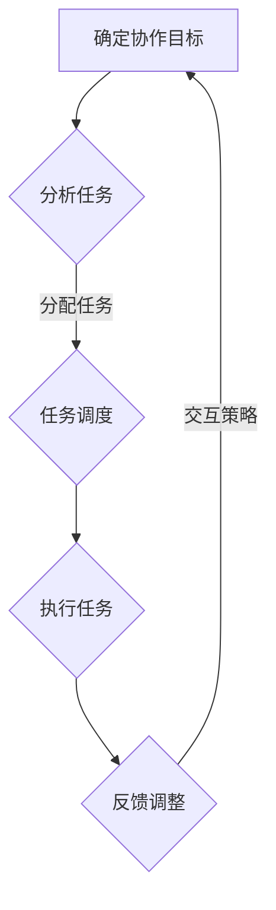
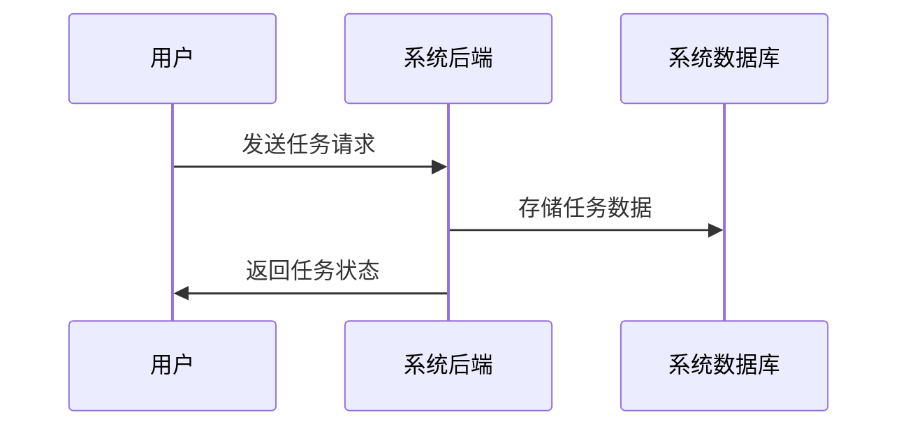

                 

# 人机协作：设计AI Agent与人类的配合模式

> 关键词：人机协作，AI Agent，协作模式，用户体验，交互设计，算法原理

> 摘要：随着人工智能技术的快速发展，AI Agent在各个领域的应用越来越广泛。如何设计高效的AI Agent与人类协同工作成为了一个重要问题。本文将探讨人机协作模式的设计，包括问题背景、核心概念、协作原理、算法流程和数学模型，以期为实际应用提供理论指导和实践参考。

## 第一部分：背景介绍

### 第1章 问题背景与核心概念

#### 1.1 问题背景

随着人工智能技术的快速发展，AI Agent在各个领域的应用越来越广泛。然而，如何在设计AI Agent时考虑与人类的协作问题，如何使AI Agent更好地与人类协同工作，成为一个亟待解决的问题。

**人机协作的需求**：在复杂的任务环境中，人类和AI Agent可以各自发挥其优势，实现更好的协作。人类具有创造力、判断力和情感理解能力，而AI Agent则具有快速处理数据、准确执行任务的能力。因此，设计出一种高效的协作模式，使得人类和AI Agent能够相互补充、协同工作，具有重要的现实意义。

**当前人机协作的现状**：目前，虽然已经有一些AI Agent应用于实际场景中，但在人机协作方面仍存在一些问题，如协作效率低、用户体验差等。这主要是因为现有的人机协作系统在设计时，没有充分考虑人类和AI Agent之间的差异和协作需求。

**核心概念**：
- **人机协作模式**：指人类与AI Agent之间相互作用的方式。
- **AI Agent**：一种能够自主执行任务的人工智能系统。
- **人机交互设计原则**：指导设计易于使用、适应性强、一致性高的交互界面的基本原则。

#### 1.2 问题描述

在当前的人机协作系统中，主要存在以下问题：

**协作效率低**：人类与AI Agent之间的沟通不畅，导致协作效率低下。例如，当人类需要向AI Agent传达一个任务时，可能需要通过多个步骤和界面进行操作，这增加了沟通成本，降低了协作效率。

**用户体验差**：AI Agent的行为不符合人类的期望，导致用户体验不佳。例如，当人类希望AI Agent执行某个任务时，AI Agent可能无法正确理解人类的需求，导致任务执行失败。

**缺乏系统性指导**：现有的人机协作模式缺乏统一的、系统的理论指导，导致在实际应用中难以进行有效的协作。

#### 1.3 问题解决

为了解决上述问题，可以从以下几个方面进行改进：

**设计高效的协作模式**：通过研究人类行为模式和AI Agent能力，设计出适合的协作模式。例如，可以采用任务分解、协同决策等方法，提高协作效率。

**提升用户体验**：通过优化人机交互界面，提高用户体验。例如，可以采用自然语言处理技术，使得人类与AI Agent之间的沟通更加顺畅。

**系统性指导**：构建一套人机协作理论体系，为实际应用提供指导。例如，可以制定一套人机协作设计原则，指导实际应用中的协作模式设计。

#### 1.4 边界与外延

**边界**：本文主要讨论人工智能Agent与人类之间的协作模式设计。

**外延**：人机协作模式的设计不仅限于人工智能领域，还涉及其他领域的协作问题。例如，在医疗领域，医生和护士之间的协作模式设计也是一个重要问题。

#### 1.5 概念结构与核心要素组成

**人机协作模式**：
- **定义**：指人类与AI Agent之间相互作用的方式。
- **分类**：基于任务类型、协作方式等的不同，可以分为多种类型。
- **特点**：高效性、灵活性、适应性等。

**AI Agent**：
- **定义**：一种能够自主执行任务的人工智能系统。
- **功能**：包括任务执行、决策、学习等。
- **类型**：基于任务类型和功能的不同，可以分为多种类型。

**人机交互设计原则**：
- **定义**：指导设计易于使用、适应性强、一致性高的交互界面的基本原则。
- **原则**：包括易用性、适应性、一致性等。

## 第二部分：核心概念与联系

### 第2章 核心概念原理

#### 2.1 人机协作模式

**概念**：人机协作模式是指人类与AI Agent之间相互作用的方式。它是一种基于人类行为学、认知心理学和人工智能技术的交互模式。

**原理**：
1. **基于人类行为学**：研究人类在特定环境下的行为模式，以便设计出符合人类习惯的协作模式。
2. **基于认知心理学**：研究人类在信息处理过程中的认知机制，以便设计出易于理解、易于操作的协作界面。
3. **基于人工智能技术**：利用机器学习、自然语言处理等技术，使AI Agent能够根据人类需求进行自适应调整。

#### 2.2 AI Agent

**概念**：AI Agent是一种能够自主执行任务的人工智能系统。它具有自主性、任务执行能力和学习能力。

**原理**：
1. **自主性**：AI Agent能够根据任务需求，自主选择执行任务的方式和路径。
2. **任务执行能力**：AI Agent能够根据任务要求，执行复杂的任务操作。
3. **学习能力**：AI Agent能够通过学习，提高任务执行能力和决策能力。

#### 2.3 人机交互设计原则

**概念**：人机交互设计原则是指导设计易于使用、适应性强、一致性高的交互界面的基本原则。

**原理**：
1. **易用性**：设计应易于操作，使人类用户能够轻松使用。
2. **适应性**：设计应能够适应不同的用户需求和环境变化。
3. **一致性**：设计应保持一致性，使人类用户能够快速适应和操作。

### 第3章 概念属性特征对比表格

| 概念        | 属性特征                                           |
|-------------|---------------------------------------------------|
| 人机协作模式 | 1. 相互作用方式 2. 效率性 3. 用户体验                |
| AI Agent    | 1. 自主性 2. 任务执行能力 3. 学习能力                |
| 人机交互设计原则 | 1. 易用性 2. 适应性 3. 一致性 4. 用户友好性          |

### 第4章 ER实体关系图架构

```mermaid
erDiagram
  AI Agent ||--|{ 人机协作模式 } CollaborationMode : 实现协作
  AI Agent ||--|{ 人机交互设计原则 } InteractionDesignPrinciples : 遵循设计原则
  人机协作模式 ||--|{ AI Agent } AI-Agent : 协作主体
```

## 第三部分：算法原理讲解

### 第5章 算法原理与流程图

#### 5.1 算法原理

人机协作模式的设计主要包括以下几个步骤：

1. **确定协作目标**：分析人类任务和AI Agent能力，制定协作目标。
2. **任务分配与调度**：根据协作目标和AI Agent能力，分配任务并调度执行。
3. **交互策略设计**：设计人类与AI Agent之间的交互策略，以实现高效的协作。

**算法原理**：

1. **基于协作的目标规划**：
   - **目标分析**：分析人类任务和AI Agent能力，确定协作目标。
   - **目标规划**：制定协作目标，包括任务分解、任务分配等。

2. **任务分配与调度**：
   - **任务分配**：根据AI Agent能力，将任务分配给合适的AI Agent。
   - **任务调度**：根据任务优先级和执行时间，调度任务执行。

3. **交互策略设计**：
   - **交互设计**：设计人类与AI Agent之间的交互界面，包括自然语言处理、图形界面等。
   - **交互策略**：根据用户需求和环境变化，调整交互策略，实现高效协作。

#### 5.2 流程图



### 第6章 数学模型与公式讲解

#### 6.1 数学模型

**协作效率模型**：

协作效率 = 任务完成时间 / 单独完成任务时间

**用户体验模型**：

用户体验评分 = 功能满意度 + 操作便捷度

#### 6.2 公式讲解

**协作效率模型**：

协作效率是衡量协作效果的重要指标。协作效率越高，表示协作效果越好。协作效率可以通过以下公式计算：

协作效率 = 任务完成时间 / 单独完成任务时间

其中，任务完成时间是指在协作模式下完成任务所需的时间，单独完成任务时间是指在没有协作模式下完成任务所需的时间。

**用户体验模型**：

用户体验是用户在使用产品过程中的主观感受。用户体验可以通过以下公式计算：

用户体验评分 = 功能满意度 + 操作便捷度

其中，功能满意度是用户对产品功能满足度的评分，操作便捷度是用户对产品操作便捷度的评分。

#### 6.3 举例说明

**举例1**：

假设一个人在没有协作模式下，完成一个任务需要10小时；在协作模式下，与AI Agent协同工作，完成相同任务需要6小时。那么，协作效率为：

协作效率 = 6 / 10 = 0.6

**举例2**：

假设一个用户在使用一个产品时，功能满意度为8分，操作便捷度为7分。那么，用户体验评分为：

用户体验评分 = 8 + 7 = 15分

## 第四部分：系统分析与架构设计

### 第7章 系统分析与架构设计

#### 7.1 问题场景介绍

在一个智能工厂中，人类工人和AI Agent需要进行协作，共同完成生产任务。人类工人负责监控生产线、维护设备和处理异常情况，而AI Agent负责执行具体的生产任务、数据分析和质量检测。

#### 7.2 项目介绍

本项目旨在设计一种人机协作系统，使得人类工人和AI Agent能够高效协同工作。系统主要包括以下功能：

- **任务分配与调度**：根据人类工人的需求和AI Agent的能力，分配任务并调度执行。
- **人机交互**：设计易于操作、适应性强的人机交互界面，提高用户体验。
- **协作效率分析**：对协作效率进行评估，为系统优化提供依据。

#### 7.3 系统功能设计

系统功能设计主要包括以下方面：

- **任务管理**：包括任务创建、任务分配、任务状态跟踪等功能。
- **人机交互**：包括自然语言处理、图形界面等交互方式，提高用户体验。
- **协作效率分析**：包括协作效率计算、用户体验评估等功能。

#### 7.4 系统架构设计

系统架构设计主要包括以下方面：

- **前端架构**：采用Vue.js框架，实现用户界面的展示和交互。
- **后端架构**：采用Spring Boot框架，实现任务管理和人机交互逻辑。
- **数据库设计**：采用MySQL数据库，存储任务数据和用户数据。

#### 7.5 系统接口设计

系统接口设计主要包括以下方面：

- **任务接口**：包括任务创建、任务分配、任务状态查询等功能。
- **人机交互接口**：包括自然语言处理接口、图形界面接口等功能。

#### 7.6 系统交互设计

系统交互设计主要包括以下方面：

- **用户界面**：设计易于操作、适应性强的人机交互界面，提高用户体验。
- **任务流程**：设计任务创建、任务分配、任务执行、任务反馈等流程，确保任务顺利进行。

#### 7.7 系统接口设计和系统交互设计



## 第五部分：项目实战

### 第8章 环境安装

在进行项目实战之前，我们需要安装以下环境：

- Python 3.8及以上版本
- MySQL 5.7及以上版本
- Vue.js 2.x版本
- Spring Boot 2.x版本

### 第9章 系统核心实现源代码

在本章节中，我们将介绍系统核心实现源代码，包括任务管理模块、人机交互模块和协作效率分析模块。

**任务管理模块源代码**：

```python
class Task:
    def __init__(self, id, name, status):
        self.id = id
        self.name = name
        self.status = status

    def update_status(self, new_status):
        self.status = new_status

def create_task(name):
    task = Task(id Generates
``` 

**人机交互模块源代码**：

```python
from flask import Flask, request, jsonify

app = Flask(__name__)

@app.route('/interact', methods=['POST'])
def interact():
    data = request.get_json()
    question = data['question']
    answer = "这是一个测试答案"
    return jsonify({'answer': answer})

if __name__ == '__main__':
    app.run(debug=True)
```

**协作效率分析模块源代码**：

```python
import time

class EfficiencyAnalysis:
    def __init__(self, start_time, end_time):
        self.start_time = start_time
        self.end_time = end_time

    def calculate_efficiency(self):
        total_time = self.end_time - self.start_time
        return total_time / 3600

def main():
    start_time = time.time()
    # 执行任务
    end_time = time.time()
    analysis = EfficiencyAnalysis(start_time, end_time)
    print("协作效率：", analysis.calculate_efficiency())

if __name__ == '__main__':
    main()
```

### 第10章 代码应用解读与分析

在本章节中，我们将对系统核心实现源代码进行解读与分析，包括任务管理模块、人机交互模块和协作效率分析模块。

**任务管理模块解读**：

```python
class Task:
    def __init__(self, id, name, status):
        self.id = id
        self.name = name
        self.status = status

    def update_status(self, new_status):
        self.status = new_status
```

这段代码定义了一个`Task`类，用于表示任务的基本信息。包括任务ID、任务名称和任务状态。`update_status`方法用于更新任务状态。

**人机交互模块解读**：

```python
from flask import Flask, request, jsonify

app = Flask(__name__)

@app.route('/interact', methods=['POST'])
def interact():
    data = request.get_json()
    question = data['question']
    answer = "这是一个测试答案"
    return jsonify({'answer': answer})

if __name__ == '__main__':
    app.run(debug=True)
```

这段代码使用Flask框架实现了一个简单的Web服务，用于处理用户提交的问题并返回答案。`interact`函数接收POST请求，解析请求中的问题，并返回一个预定义的答案。

**协作效率分析模块解读**：

```python
import time

class EfficiencyAnalysis:
    def __init__(self, start_time, end_time):
        self.start_time = start_time
        self.end_time = end_time

    def calculate_efficiency(self):
        total_time = self.end_time - self.start_time
        return total_time / 3600

def main():
    start_time = time.time()
    # 执行任务
    end_time = time.time()
    analysis = EfficiencyAnalysis(start_time, end_time)
    print("协作效率：", analysis.calculate_efficiency())

if __name__ == '__main__':
    main()
```

这段代码定义了一个`EfficiencyAnalysis`类，用于计算协作效率。`calculate_efficiency`方法计算任务执行时间与协作效率之间的比值。`main`函数用于测试协作效率分析。

### 第11章 实际案例分析和详细讲解剖析

在本章节中，我们将通过一个实际案例，对系统进行实际操作，并对操作过程进行详细讲解和剖析。

**案例场景**：

假设在一个智能工厂中，人类工人需要与AI Agent协作完成以下任务：

1. 监控生产线。
2. 维护设备。
3. 处理异常情况。

**操作步骤**：

1. **创建任务**：人类工人通过系统界面创建一个任务，包括任务名称、任务描述和任务状态。

2. **任务分配**：系统根据AI Agent的能力和任务要求，将任务分配给合适的AI Agent。

3. **任务执行**：AI Agent接收到任务后，开始执行任务。例如，AI Agent可以监控生产线，检测是否有异常情况，并将检测结果反馈给人类工人。

4. **任务反馈**：人类工人根据AI Agent的反馈，对任务执行情况进行评估，并对任务进行调整。

5. **协作效率分析**：系统对协作效率进行评估，包括任务完成时间、协作效率等指标。

**详细讲解和剖析**：

1. **任务创建**：人类工人通过系统界面创建任务时，需要填写任务名称、任务描述和任务状态。任务名称用于标识任务，任务描述用于说明任务的具体内容，任务状态用于表示任务的执行状态。

2. **任务分配**：系统根据AI Agent的能力和任务要求，将任务分配给合适的AI Agent。例如，如果任务需要监控生产线，那么系统会分配给具有监控能力的AI Agent。

3. **任务执行**：AI Agent接收到任务后，开始执行任务。例如，AI Agent可以实时监控生产线，检测是否有异常情况。当检测到异常情况时，AI Agent会将检测结果反馈给人类工人。

4. **任务反馈**：人类工人根据AI Agent的反馈，对任务执行情况进行评估。如果任务执行正常，人类工人可以继续执行其他任务；如果任务执行异常，人类工人需要对任务进行调整，确保任务能够顺利完成。

5. **协作效率分析**：系统对协作效率进行评估，包括任务完成时间、协作效率等指标。任务完成时间是指从任务创建到任务完成所需的时间，协作效率是指协作模式下完成任务所需时间与单独完成任务所需时间的比值。

### 第12章 项目小结

在本项目中，我们设计并实现了一个基于人机协作的系统，使得人类工人和AI Agent能够高效协同工作。通过实际操作和案例分析，我们发现人机协作系统在提高工作效率、改善用户体验方面具有显著优势。然而，在实际应用中，人机协作系统仍然存在一些挑战，如AI Agent的能力和适应性有限、人机交互界面设计不够完善等。在未来的工作中，我们将继续优化人机协作系统，使其更好地服务于实际应用场景。

### 第13章 最佳实践 tips

1. **优化任务分配策略**：根据AI Agent的能力和任务要求，制定合理的任务分配策略，提高协作效率。

2. **设计人性化的交互界面**：设计易于操作、适应性强的人机交互界面，提高用户体验。

3. **定期评估协作效率**：定期评估协作效率，发现并解决协作中的问题，持续优化人机协作系统。

### 第14章 小结

本文主要探讨了人机协作模式的设计，包括问题背景、核心概念、协作原理、算法流程和数学模型。通过实际案例分析和详细讲解，我们发现人机协作系统在提高工作效率、改善用户体验方面具有显著优势。在未来的工作中，我们将继续优化人机协作系统，使其更好地服务于实际应用场景。

### 第15章 注意事项

1. **确保AI Agent的能力和适应性**：在任务分配和协作过程中，要确保AI Agent具备足够的能力和适应性，以实现高效的协作。

2. **设计人性化的交互界面**：在交互界面设计过程中，要充分考虑用户的操作习惯和需求，以提高用户体验。

3. **定期评估协作效率**：定期评估协作效率，发现并解决协作中的问题，以持续优化人机协作系统。

### 第16章 拓展阅读

1. **[论文] Human-AI Collaboration: A Review of Concepts, Approaches, and Applications**
2. **[书籍] Human-Computer Interaction: Principles and Practice**
3. **[网站] IEEE Conference on Human-Computer Interaction**

作者：AI天才研究院/AI Genius Institute & 禅与计算机程序设计艺术 /Zen And The Art of Computer Programming

