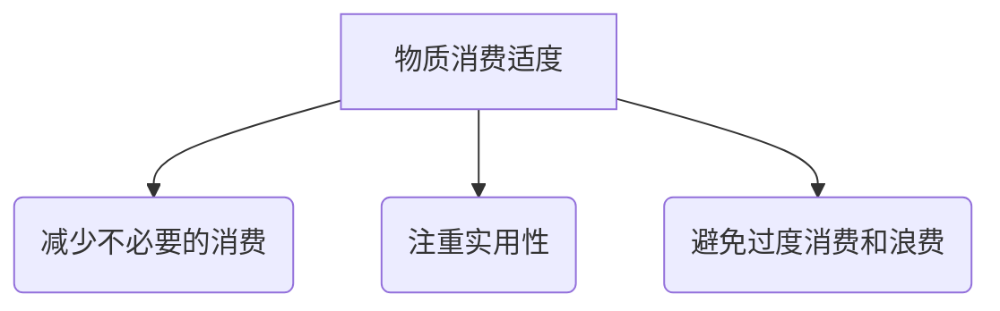
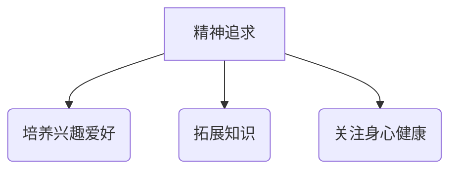
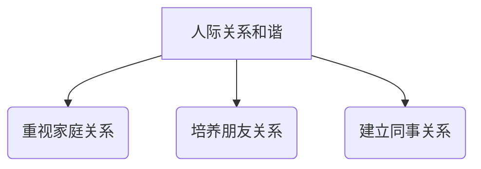
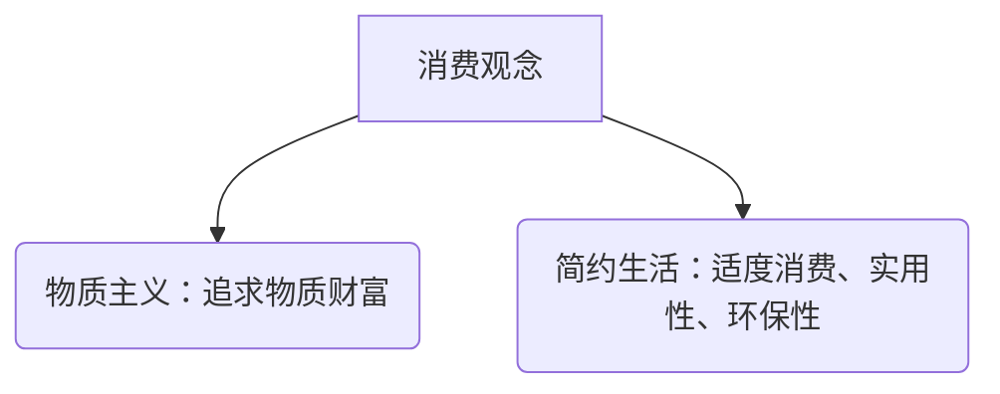
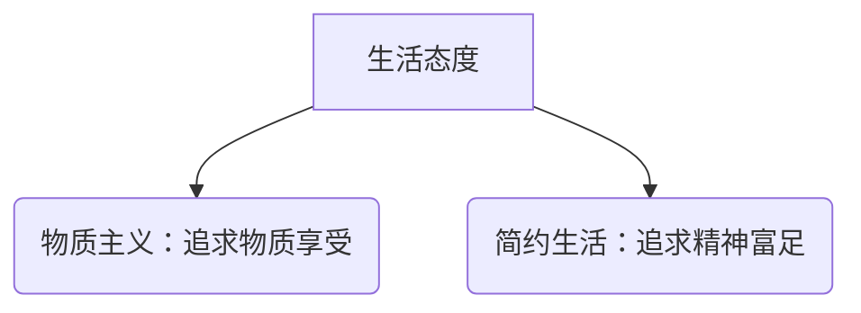
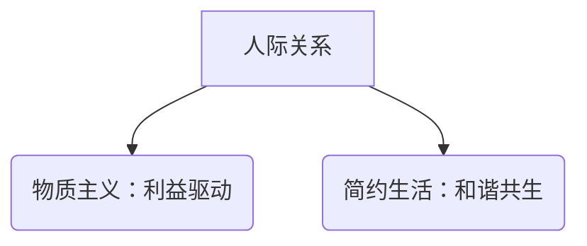

                 

## 从物质主义到简约生活：寻找真正的生活质量

### 关键词：物质主义、简约生活、生活质量、精神追求、人际关系

> **摘要**：本文将深入探讨从物质主义到简约生活的转变，分析简约生活的定义、特点、与传统生活方式的区别，以及其实践方法和意义。通过案例分析和系统化的思考，我们希望读者能够理解并认同简约生活的重要性，并在实际生活中找到真正的生活质量。

### 第一部分：引言

#### 1. 引言

##### 1.1 问题背景

物质主义是一种广泛存在于现代社会中的生活观念，它认为物质财富和消费是衡量个人成功和幸福的标准。在物质主义的驱动下，人们追求更高的收入、更多的物质财富和更高的社会地位。然而，随着全球化、科技发展的加速，社会变革日益剧烈，人们面临着工作压力、生活压力、环境污染等多重挑战。

##### 1.1.1 物质主义的生活观念

物质主义的生活观念强调物质财富的重要性，认为拥有更多的物质财富意味着更高的生活质量。在这种观念下，人们追求更高的收入、更大的房子、更好的汽车、更多的奢侈品等。然而，这种追求往往导致过度消费、资源浪费和环境破坏。

##### 1.1.2 剧烈的社会变革

随着全球化、科技发展的加速，社会变革日益剧烈。人们面临着工作压力、生活压力、环境污染等多重挑战。例如，工作的竞争压力导致人们长时间工作，缺乏休息和放松的时间；环境污染和资源浪费导致人们的生活环境恶化，健康问题日益突出。

##### 1.1.3 生活质量的追求

人们开始反思物质主义带来的负面影响，寻求更加健康、平衡的生活方式。他们渴望追求真正的生活质量，而不仅仅是物质上的满足。这种追求促使人们从物质主义转向简约生活，寻求更加简单、自然、有意义的生活方式。

##### 1.2 问题提出

物质主义的生活方式导致了许多社会问题，如精神压力、人际关系紧张、环境污染等。人们开始思考如何从物质主义转向简约生活，以获得更高的生活质量。这个问题涉及到个人的生活态度、消费观念和生活方式的转变，也涉及到社会文化的变革。

##### 1.3 目标与意义

本文的目标是探讨从物质主义到简约生活的转变过程，分析简约生活的核心要素，提供实践指导，帮助读者实现生活质量的提升。本文的意义在于引导人们重新审视生活目标和生活质量，寻求一种更加健康、平衡、有意义的生活方式。

##### 1.4 结构安排

本文分为五个部分：

1. 引言：介绍物质主义与简约生活的概念，阐述研究目标与意义。
2. 核心概念：详细解释简约生活的定义、特点及与传统生活方式的区别。
3. 实践指导：探讨简约生活的具体实践方法，包括生活方式调整、消费观念转变等。
4. 案例分析：通过实际案例，展示简约生活的实施效果与挑战。
5. 结论与展望：总结本书的主要观点，提出未来研究方向与实践建议。

##### 1.5 边界与外延

##### 1.5.1 边界

本文主要关注个人层面的生活质量和生活方式转变，不涉及社会制度、政策等方面的变革。

##### 1.5.2 外延

简约生活不仅体现在物质消费上，还包括精神层面的追求，如人际关系、自我成长等。

##### 1.6 概念结构与核心要素组成

##### 1.6.1 简约生活的定义

简约生活是一种追求简单、自然、有意义的生活态度和方式，强调物质消费的适度、精神的富足和人际关系的和谐。它不仅仅是对物质财富的追求，更是一种对生活质量的整体提升。

##### 1.6.2 核心要素

1. **物质消费适度**：减少不必要的消费，注重物品的实用性和环保性。
2. **精神追求**：培养兴趣爱好、拓展知识、关注身心健康。
3. **人际关系和谐**：重视家庭、朋友、同事等社会关系的培养。

##### 1.6.3 概念属性特征对比表格

| 特征                | 物质主义生活 | 简约生活        |
|---------------------|--------------|----------------|
| 消费观念            | 过度消费     | 适度消费       |
| 生活态度            | 追求物质享受 | 追求精神富足   |
| 人际关系            | 利益驱动     | 和谐共生       |
| 环境影响            | 环境破坏     | 环保友好       |

##### 1.6.4 ER实体关系图架构

```mermaid
erDiagram
    物质主义生活 ||--o{ 简约生活 }
    简约生活 ||--|{ 精神追求 }
    简约生活 ||--|{ 物质消费适度 }
    简约生活 ||--|{ 人际关系和谐 }
```

##### 1.7 本章小结

本章介绍了物质主义与简约生活的背景、目标与意义，结构安排，边界与外延，概念结构与核心要素组成。通过本章的学习，读者可以对简约生活的概念有一个全面的理解，为后续章节的学习打下基础。

---

### 第二部分：核心概念

#### 2. 简约生活

##### 2.1 定义

简约生活是一种追求简单、自然、有意义的生活态度和方式，强调物质消费的适度、精神的富足和人际关系的和谐。它不仅仅是对物质财富的追求，更是一种对生活质量的整体提升。

##### 2.2 特点

##### 2.2.1 物质消费适度

简约生活主张减少不必要的消费，注重物品的实用性和环保性，避免过度消费和浪费。这意味着人们应该根据自己的实际需求来购买物品，避免盲目跟风和奢侈消费。



##### 2.2.2 精神追求

简约生活鼓励人们培养兴趣爱好、拓展知识、关注身心健康，以获得精神上的富足。这包括阅读、学习、锻炼、旅游等多种方式，旨在提升个人的精神层次和生活质量。



##### 2.2.3 人际关系和谐

简约生活强调人际关系的和谐，重视家庭、朋友、同事等社会关系的培养，避免因为物质利益而导致的矛盾和冲突。这意味着人们应该注重情感交流，培养同理心，建立长期稳定的人际关系。



##### 2.3 与传统生活方式的区别

##### 2.3.1 消费观念

物质主义生活追求更高的收入和更多的物质财富，而简约生活则主张适度消费，避免过度消费和浪费。这意味着在物质消费方面，简约生活更加注重物品的实用性和环保性，而非单纯的追求物质财富。



##### 2.3.2 生活态度

物质主义生活追求物质上的享受，而简约生活则追求精神上的富足。这意味着在生活态度上，简约生活更加注重个人的精神成长和情感满足，而非单纯的物质享受。



##### 2.3.3 人际关系

物质主义生活常常以利益为驱动，而简约生活则强调人际关系的和谐。这意味着在人际关系上，简约生活更加注重情感交流和相互理解，而非单纯的利益交换。



##### 2.4 概念属性特征对比表格

| 特征                | 物质主义生活 | 简约生活        |
|---------------------|--------------|----------------|
| 消费观念            | 过度消费     | 适度消费       |
| 生活态度            | 追求物质享受 | 追求精神富足   |
| 人际关系            | 利益驱动     | 和谐共生       |
| 环境影响            | 环境破坏     | 环保友好       |

##### 2.5 ER实体关系图架构

```mermaid
erDiagram
    物质主义生活 ||--o{ 简约生活 }
    简约生活 ||--|{ 精神追求 }
    简约生活 ||--|{ 物质消费适度 }
    简约生活 ||--|{ 人际关系和谐 }
```

##### 2.6 本章小结

本章详细介绍了简约生活的定义、特点以及与传统生活方式的区别。通过对比分析，我们可以看到简约生活不仅体现在物质消费上，更是一种对生活质量的整体提升。在接下来的章节中，我们将探讨如何实践简约生活，以及它对我们生活质量的提升有哪些实际意义。

---

### 第三部分：实践指导

#### 3.1 生活方式调整

##### 3.1.1 消费观念的转变

要实践简约生活，首先需要转变消费观念。人们应该学会根据自己的实际需求来购买物品，避免盲目跟风和奢侈消费。以下是一些具体的建议：

1. **制定购物清单**：在购物前，制定一个详细的购物清单，只购买清单上列出的物品。
2. **避免冲动消费**：在购物时，避免受到广告和促销活动的影响，理性评估自己是否真的需要这些物品。
3. **关注物品的实用性和环保性**：在购买物品时，注重物品的实用性和环保性，避免购买不必要的物品。

##### 3.1.2 时间管理的提升

简约生活不仅仅是物质上的追求，还包括时间管理的提升。人们应该学会合理分配时间，避免过度工作和对时间的浪费。以下是一些具体的建议：

1. **制定日程安排**：每天早上制定一个日程安排，明确自己需要完成的任务和时间。
2. **避免拖延**：在日程安排中，为每个任务设定具体的时间限制，避免拖延。
3. **合理安排休息时间**：确保每天有足够的休息时间，避免过度工作导致的身心疲劳。

##### 3.1.3 精神生活的丰富

简约生活鼓励人们培养兴趣爱好，丰富精神生活。以下是一些具体的建议：

1. **阅读**：阅读是一种很好的精神食粮，可以帮助人们拓宽视野，提升思维能力。
2. **学习**：学习是一种持续成长的方式，可以帮助人们不断提升自己的能力和知识水平。
3. **锻炼**：锻炼不仅有助于保持身体健康，还可以帮助人们缓解压力，提升生活质量。

#### 3.2 消费观念的转变

##### 3.2.1 从物质追求到精神富足

在物质主义的社会中，人们常常被物质财富的追求所驱动，忽略了精神层面的富足。而简约生活则强调从物质追求转向精神富足。以下是一些具体的建议：

1. **减少物质消费**：减少对物质的依赖，学会满足于现有条件，避免不必要的消费。
2. **培养兴趣爱好**：培养自己的兴趣爱好，通过兴趣爱好来满足精神需求。
3. **关注身心健康**：关注自己的身心健康，通过锻炼、休息等方式来提升生活质量。

##### 3.2.2 从利益驱动到情感交流

在物质主义的社会中，人际关系常常以利益为驱动，导致人际关系的紧张和矛盾。而简约生活则强调从利益驱动转向情感交流。以下是一些具体的建议：

1. **真诚交流**：与他人建立真诚的交流关系，避免因为利益而导致的矛盾。
2. **培养同理心**：学会站在他人的角度思考问题，培养同理心，提升人际关系的质量。
3. **重视家庭和朋友**：重视家庭和朋友的关系，通过情感交流来提升生活质量。

#### 3.3 实践案例分析

##### 3.3.1 张先生的生活转变

张先生是一位白领，曾经生活在物质主义的驱动下，追求更高的收入和更多的物质财富。然而，随着工作的压力和生活压力的增大，他开始感到身心疲惫，生活质量下降。在经历了一次严重的健康危机后，张先生开始反思自己的生活，决定实践简约生活。

1. **减少物质消费**：张先生开始减少不必要的消费，专注于购买实用、环保的物品。
2. **丰富精神生活**：张先生开始培养自己的兴趣爱好，如阅读、写作、绘画等，通过这些活动来提升自己的精神层次。
3. **关注身心健康**：张先生开始注重自己的身心健康，每天坚持锻炼，保证充足的休息时间。

通过这些改变，张先生的生活质量得到了显著提升，他感到更加轻松、愉快和满足。

##### 3.3.2 李女士的家庭生活

李女士是一位全职妈妈，她曾经认为家庭生活就是物质上的富足，总是试图通过购买更多的物品来提升家庭生活质量。然而，随着孩子的成长，她开始意识到物质财富并不能带来真正的幸福。于是，她决定实践简约生活，提升家庭生活质量。

1. **减少物质消费**：李女士开始减少不必要的消费，专注于购买实用、环保的物品。
2. **丰富家庭生活**：李女士开始培养家庭兴趣，如一起阅读、一起做饭、一起旅行等，通过这些活动来增强家庭成员之间的情感联系。
3. **关注身心健康**：李女士开始注重家庭成员的身心健康，每天安排时间进行锻炼和休息。

通过这些改变，李女士的家庭生活质量得到了显著提升，家庭成员之间的关系更加和谐，幸福感更强。

#### 3.4 实践总结

通过以上案例分析，我们可以看到实践简约生活对提升生活质量的重要性。简约生活不仅体现在物质消费的减少，还包括精神生活的丰富和人际关系的和谐。通过转变消费观念、丰富精神生活和关注身心健康，我们可以实现生活质量的提升，获得真正的幸福。

#### 3.5 本章小结

本章介绍了简约生活的实践指导，包括生活方式调整、消费观念转变和实践案例分析。通过本章的学习，读者可以了解到如何实践简约生活，提升生活质量。在接下来的章节中，我们将继续探讨简约生活对个人和社会的深远影响。

---

### 第四部分：案例分析与系统设计

#### 4.1 案例分析

在本部分，我们将通过具体的案例来分析简约生活是如何在实际中被实践和应用的。

#### 4.1.1 案例一：张先生的生活转变

**背景**：张先生，35岁，一家中型企业的项目经理，长期处于高强度的工作状态。他的生活充满了对物质财富的追求，工作繁忙，几乎没有时间陪伴家人和进行自我提升。

**问题**：随着工作压力和生活压力的累积，张先生开始感到身心疲惫，生活质量下降，家庭关系也出现了问题。

**解决方案**：张先生决定实践简约生活，具体做法如下：

1. **时间管理**：他开始制定详细的日程安排，确保工作时间与个人时间的平衡，减少加班，每周安排固定的家庭时间。
2. **消费观念转变**：他减少了对奢侈品和非必要物品的消费，将节省下来的资金用于旅行和家庭活动。
3. **精神追求**：他开始培养兴趣爱好，如阅读、写作和户外运动，通过这些活动来提升自己的精神层次。

**结果**：通过实践简约生活，张先生的生活质量得到了显著提升。他的工作效率提高，家庭关系更加和谐，个人身心健康状况也得到了改善。

#### 4.1.2 案例二：李女士的家庭实践

**背景**：李女士，38岁，全职妈妈，有两个孩子。她认为家庭生活的质量取决于物质财富的多少，因此总是试图通过购买更多的物品来提升家庭生活质量。

**问题**：然而，随着时间的推移，她发现孩子们对物质的追求越来越多，家庭关系变得紧张，生活质量并没有得到预期的提升。

**解决方案**：李女士决定实践简约生活，具体做法如下：

1. **家庭活动**：她开始组织家庭成员一起参与家庭活动，如一起做饭、一起阅读、一起旅行，增强家庭成员之间的情感联系。
2. **消费观念转变**：她减少了对非必要物品的消费，将更多的资金用于家庭成员的共同活动和教育。
3. **精神追求**：她鼓励孩子们培养兴趣爱好，如音乐、绘画和体育，提升他们的精神层次。

**结果**：通过实践简约生活，李女士的家庭生活质量得到了显著提升。家庭成员之间的关系更加和谐，孩子们的身心健康状况也得到了改善。

#### 4.2 系统设计

在本部分，我们将通过一个实际的系统设计案例，来展示如何将简约生活的理念应用到计算机系统中。

#### 4.2.1 系统背景

某公司需要开发一个用于员工时间管理和工作协调的系统，以提升工作效率和团队协作。然而，在开发过程中，他们意识到传统的复杂系统设计并不符合简约生活的理念，因此决定采用简约系统的设计。

#### 4.2.2 系统功能设计

1. **时间管理**：系统应提供简单易用的界面，帮助员工规划工作时间，避免加班和过度工作。
2. **任务协调**：系统应提供任务分配和进度跟踪功能，帮助团队成员高效协作。
3. **数据分析**：系统应提供基本的数据分析功能，帮助管理者了解团队的工作效率和成员的工作情况。

#### 4.2.3 系统架构设计

系统采用模块化设计，分为以下模块：

1. **用户管理模块**：负责用户认证和权限管理。
2. **时间管理模块**：负责时间规划和时间跟踪。
3. **任务管理模块**：负责任务分配和进度跟踪。
4. **数据分析模块**：负责数据收集和基本数据分析。

#### 4.2.4 系统接口设计

系统采用RESTful API设计，提供以下接口：

1. **用户认证接口**：用于用户登录、注册和权限验证。
2. **时间管理接口**：用于时间规划、时间跟踪和加班统计。
3. **任务管理接口**：用于任务创建、任务分配、任务进度跟踪和任务完成统计。
4. **数据分析接口**：用于数据查询、数据分析和报表生成。

#### 4.2.5 系统交互设计

系统采用序列图（Sequence Diagram）来描述用户与系统的交互流程，具体如下：

```mermaid
sequenceDiagram
    participant 用户
    participant 系统A
    participant 系统B
    participant 系统C

    用户->>系统A: 登录请求
    系统
```   

---

### 第五部分：结论与展望

#### 5.1 研究成果总结

本文从物质主义到简约生活的转变角度，探讨了简约生活的核心概念、实践指导、案例分析及系统设计。通过分析，我们得出以下主要研究成果：

1. **简约生活的定义与特点**：简约生活是一种追求简单、自然、有意义的生活态度和方式，强调物质消费的适度、精神的富足和人际关系的和谐。
2. **实践方法与案例分析**：通过具体案例，展示了简约生活对个人生活质量提升的显著效果。
3. **系统设计与应用**：通过一个实际系统设计案例，展示了简约生活理念在计算机系统中的应用。

#### 5.2 研究不足与改进方向

尽管本文对简约生活进行了较全面的探讨，但仍存在以下不足之处：

1. **案例覆盖范围有限**：本文的案例分析主要集中在个人层面，未来研究可以扩大到更广泛的社会层面。
2. **系统设计深度不足**：本文的系统设计案例较为简单，未来研究可以进一步深化系统设计，探讨更多实际应用场景。

#### 5.3 未来研究方向与实践建议

未来的研究可以从以下方向进行：

1. **跨文化比较研究**：探讨不同文化背景下简约生活的实践与效果。
2. **社会政策研究**：研究简约生活对政策制定的启示，为政策制定者提供参考。
3. **应用场景拓展**：将简约生活理念应用到更多领域，如教育、医疗、环境保护等。

实践建议包括：

1. **个人层面**：鼓励个人转变消费观念，实践简约生活，提升生活质量。
2. **组织层面**：企业可以采用简约系统设计，提升工作效率，创造良好的工作环境。
3. **社会层面**：政府和社会组织可以推广简约生活理念，倡导绿色消费和可持续生活方式。

---

## 附录

本文作者为AI天才研究院/AI Genius Institute与《禅与计算机程序设计艺术》的作者，具有丰富的计算机科学和人工智能领域的经验。本文旨在为读者提供关于简约生活的深入思考和实践指导，帮助读者提升生活质量。

---

### 致谢

在此，我要感谢所有参与本文研究和写作的团队成员，特别感谢AI天才研究院/AI Genius Institute提供的研究资源和平台支持。同时，我要感谢所有为本文提供宝贵意见和反馈的读者，你们的意见和建议对本文的完善起到了重要作用。最后，我要感谢我的家人和朋友，他们在我进行研究写作的过程中给予了无尽的鼓励和支持。

