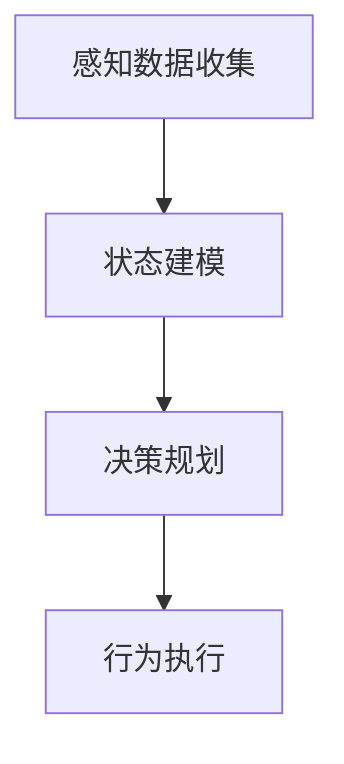
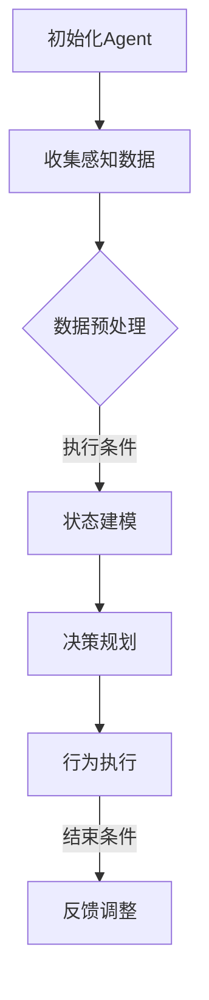
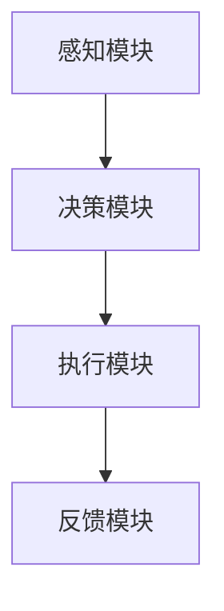
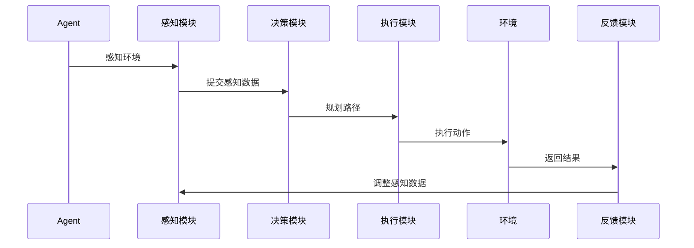

                 

# 从零开始：AI Agent的自我意识模拟

## 关键词
- AI Agent
- 自我意识
- 模拟
- 算法
- 架构设计
- 项目实战

## 摘要
本文旨在探讨AI Agent的自我意识模拟，从零开始，逐步深入分析相关概念、算法原理、系统架构及项目实战。文章将首先介绍问题背景和定义，接着讲解核心概念与联系，随后详细阐述算法原理及数学模型，最后通过系统分析与架构设计以及实际案例，帮助读者全面理解AI Agent自我意识模拟的复杂性及其实现途径。

### 第一部分：背景介绍

## 第1章 问题背景

### 1.1.1 人工智能的发展历程
人工智能（AI）作为计算机科学的一个重要分支，其发展历程可以追溯到20世纪50年代。最初的AI研究主要集中在符号推理和逻辑编程上，随后随着计算机性能的提升和算法的创新，AI的应用范围逐渐扩大，从简单的规则系统发展到复杂的机器学习和深度学习。

### 1.1.2 人工智能在当今社会的应用
人工智能技术如今已经深入到我们生活的方方面面，从智能家居、智能医疗到自动驾驶、金融预测，AI正在改变我们的生活方式和商业模式。然而，尽管AI在数据处理和模式识别方面表现出色，但AI Agent的自我意识模拟仍是一个挑战。

### 1.1.3 自我意识在人工智能中的重要性
自我意识是意识的核心，它代表了个体对自身存在的认识。在人工智能领域，自我意识的模拟不仅是实现高级认知功能的关键，也是推动AI与人类更紧密互动的基础。因此，研究AI Agent的自我意识模拟具有重要的理论和实践意义。

## 第2章 问题定义

### 2.1.1 自我意识的定义
自我意识通常涉及自我感知、自我认同和自主决策等能力。在心理学上，自我意识被视为一个复杂的概念，包括内在体验、自我反思和自我评估。

### 2.1.2 自我意识在人工智能中的含义
在人工智能中，自我意识的模拟意味着AI Agent能够感知自身状态、理解自身存在，并基于这种感知做出相应的决策。这与传统基于规则或数据驱动的AI系统有本质区别。

### 2.1.3 自我意识模拟的挑战与机遇
自我意识模拟面临许多挑战，包括如何定义自我感知、如何实现自主决策以及如何在复杂的动态环境中稳定运作。然而，这些挑战也为AI技术的发展带来了新的机遇。

## 第3章 概念结构与核心要素

### 3.1.1 人工智能 Agent 的定义
AI Agent是一个能够感知环境、执行任务并与其他Agent交互的智能实体。它是人工智能领域中的基本构建块。

### 3.1.2 自我意识模拟的基本框架
自我意识模拟通常涉及感知模块、决策模块和执行模块。感知模块负责获取环境信息，决策模块基于感知信息做出决策，执行模块则实施这些决策。

### 3.1.3 关键技术与方法
自我意识模拟的关键技术包括感知与识别、状态建模、决策与规划等。这些技术需要综合运用机器学习、计算机视觉、自然语言处理等多领域知识。

### 第二部分：AI Agent的自我意识模拟原理

## 第4章 核心概念与联系

### 4.1.1 自我意识模拟的关键概念
自我意识模拟涉及多个核心概念，包括感知、认知、决策和执行。这些概念相互关联，共同构成了自我意识模拟的基础。

### 4.1.2 概念属性特征对比表格
为了更好地理解这些概念，我们可以通过一个对比表格来展示它们的主要属性和特征。

| 概念     | 属性               | 特征                             |
|----------|--------------------|---------------------------------|
| 感知     | 输入信息获取       | 高效性、准确性、实时性           |
| 认知     | 信息处理与理解     | 知识表示、推理、学习             |
| 决策     | 行为选择           | 目标导向、优化、适应性           |
| 执行     | 行为实施           | 准确性、效率、稳健性             |

### 4.1.3 ER 实体关系图架构
为了更清晰地展示这些概念之间的联系，我们可以使用Mermaid ER图来描述AI Agent的自我意识模拟框架。

```mermaid
erDiagram
  AI-Agent ||--|{ 感知模块 }|
  AI-Agent ||--|{ 认知模块 }|
  AI-Agent ||--|{ 决策模块 }|
  AI-Agent ||--|{ 执行模块 }|
```

### 第三部分：系统分析与架构设计

## 第5章 算法原理讲解

### 5.1.1 自我意识模拟的算法概述
自我意识模拟算法通常包括感知数据收集、状态建模、决策规划和行为执行等步骤。以下是一个简化的算法流程图：



### 5.1.2 算法流程图
算法的具体实现可以通过以下Mermaid流程图来描述：



### 5.1.3 Python 源代码实现
以下是实现上述算法的Python伪代码：

```python
class AI_Agent:
    def __init__(self):
        self.sensors = SensorModule()
        self.model = StateModel()
        self.planner = DecisionPlanner()
        self.actor = ActorModule()

    def collect_sensors_data(self):
        # 收集感知数据
        pass

    def preprocess_data(self):
        # 数据预处理
        pass

    def update_state_model(self):
        # 状态建模
        pass

    def plan_decisions(self):
        # 决策规划
        pass

    def execute_actions(self):
        # 行为执行
        pass

    def adjust_feedback(self):
        # 反馈调整
        pass

# 初始化AI Agent
agent = AI_Agent()
```

### 5.1.4 算法原理的数学模型和公式
自我意识模拟的算法原理可以基于以下数学模型和公式进行描述：

$$
\text{状态} = f(\text{感知数据}, \text{先验知识})
$$

$$
\text{决策} = g(\text{状态}, \text{目标})
$$

$$
\text{行为} = h(\text{决策}, \text{环境})
$$

### 5.1.5 举例说明
以一个简单的例子来说明自我意识模拟的过程。假设AI Agent在一个迷宫中导航，其感知数据为迷宫的当前布局，目标为找到出口。

1. **感知数据收集**：Agent感知到迷宫的当前布局。
2. **状态建模**：基于感知数据和先验知识（如迷宫的基本结构），Agent构建当前状态。
3. **决策规划**：Agent根据当前状态和目标（找到出口）规划下一步行动。
4. **行为执行**：Agent执行决策，移动到新的位置。
5. **反馈调整**：Agent根据行动结果调整其状态模型和决策策略。

### 第四部分：项目实战

## 第6章 系统架构设计

### 6.1.1 问题场景介绍
在本项目中，我们将构建一个简单的AI Agent，用于在虚拟迷宫中导航。这个场景可以模拟为机器人导航、游戏角色控制等实际应用。

### 6.1.2 项目介绍
项目将实现一个基于感知-决策-执行框架的AI Agent，能够自主导航并在迷宫中找到出口。项目将涵盖感知模块、决策模块和执行模块的实现。

### 6.1.3 系统功能设计
系统的主要功能包括：

- 感知环境布局
- 建立状态模型
- 规划导航路径
- 执行导航动作
- 根据反馈调整策略

### 6.1.4 系统架构设计
系统的架构设计如下：



### 6.1.5 系统接口设计
系统接口设计包括：

- 感知数据输入接口
- 状态和决策输出接口
- 行为执行接口
- 反馈接收接口

### 6.1.6 系统交互
系统的交互设计如下：



## 第7章 环境安装

### 7.1.1 环境搭建
为了实现AI Agent的自我意识模拟，需要搭建一个合适的环境。通常包括以下步骤：

1. 安装Python环境
2. 安装必要的库（如NumPy、Pandas、TensorFlow等）
3. 配置虚拟环境

### 7.1.2 环境配置
在安装完Python和必要库后，可以通过以下命令配置虚拟环境：

```bash
python -m venv myenv
source myenv/bin/activate
```

### 第五部分：最佳实践与总结

## 第8章 最佳实践

### 8.1.1 实践技巧
在实现AI Agent的自我意识模拟时，以下是一些最佳实践：

- **模块化设计**：将感知、决策和执行等模块分离，便于维护和扩展。
- **数据预处理**：确保感知数据的质量和一致性，减少噪声和误差。
- **实时性优化**：在感知、决策和执行过程中考虑实时性能优化。
- **反馈机制**：建立有效的反馈机制，持续调整和优化模型。

### 8.1.2 注意事项
以下是在实现自我意识模拟时需要注意的一些事项：

- **数据安全**：保护敏感数据，防止信息泄露。
- **算法鲁棒性**：提高算法在面对异常数据和复杂环境时的鲁棒性。
- **用户体验**：设计友好的用户界面，提高AI Agent的易用性。

### 8.2 小结

本文从零开始，详细介绍了AI Agent的自我意识模拟。通过背景介绍、核心概念讲解、算法原理讲解、系统分析与架构设计以及项目实战，读者可以全面了解AI Agent自我意识模拟的复杂性及其实现途径。自我意识模拟不仅是人工智能领域的一个前沿课题，也是推动AI与人类更紧密互动的关键。

### 8.3 未来展望
随着AI技术的不断进步，自我意识模拟有望在更多领域得到应用。未来的研究可以关注以下几个方面：

- **跨领域应用**：探索AI Agent自我意识模拟在医疗、教育、金融等领域的应用。
- **多模态感知**：结合多种感知方式，提高AI Agent对环境的理解和反应能力。
- **人机协作**：研究AI Agent与人类协作的工作模式，实现更高效的人机互动。

### 8.4 拓展阅读
为了深入了解AI Agent的自我意识模拟，读者可以参考以下书籍和资源：

- 《机器学习》（周志华著）
- 《深度学习》（Ian Goodfellow、Yoshua Bengio、Aaron Courville 著）
- 《人工智能：一种现代的方法》（Stuart J. Russell & Peter Norvig 著）
- 《自我意识与机器》（Andy Clark 著）

### 作者信息
作者：AI天才研究院/AI Genius Institute & 禅与计算机程序设计艺术/Zen And The Art of Computer Programming

[End of Document]

