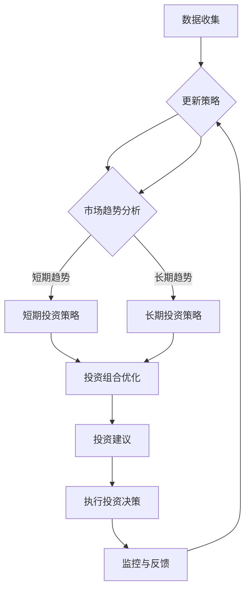
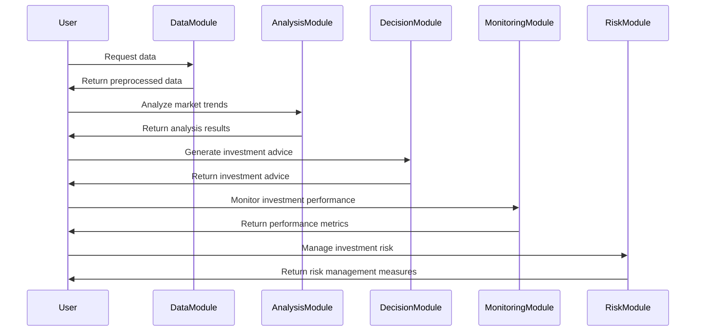

                 


### 从零构建投资理财智能助手AI Agent：基本概念与架构设计

#### 关键词：
- 投资理财
- AI Agent
- 架构设计
- 人工智能
- 投资建议
- 风险管理

#### 摘要：
本文将详细探讨从零构建投资理财智能助手AI Agent的过程。我们将首先介绍投资理财AI Agent的定义和重要性，然后深入分析投资理财和AI Agent的基本概念，接着逐步阐述构建投资理财AI Agent的步骤，包括需求分析、技术选型、系统设计等。最后，我们将通过实际案例研究展示投资理财AI Agent的应用效果，并探讨其未来发展趋势。

----------------------------------------------------------------

## 引言

### 第1章：投资理财AI Agent背景与重要性

#### 1.1.1 投资理财AI Agent的定义

投资理财AI Agent是指一种基于人工智能技术，能够自动分析市场数据，提供投资建议，并管理投资组合的智能系统。它结合了人工智能和金融学的知识，旨在帮助用户做出更明智的投资决策。

#### 1.1.2 投资理财AI Agent的发展历程

随着计算机技术和人工智能的飞速发展，投资理财AI Agent逐渐成为金融领域的研究热点。从最早的规则基系统到现在的深度学习模型，投资理财AI Agent的智能程度和性能不断提高。

#### 1.1.3 投资理财AI Agent在当今社会的地位与作用

在现代社会，投资理财AI Agent已经成为投资者的重要工具。它能够处理大量的市场数据，快速识别投资机会，并提供个性化的投资建议，大大提高了投资效率。

----------------------------------------------------------------

### 第2章：投资理财AI Agent的基本概念

#### 2.1.1 投资理财的基本概念

投资是指将资金投入某种资产或项目，以期望获得未来收益的行为。理财则是通过投资来实现财务目标的过程。

#### 2.1.1.1 投资与理财的区别

投资是理财的一部分，但理财不仅仅局限于投资。理财还包括预算管理、债务管理、税务规划等。

#### 2.1.1.2 投资理财的主要类型

投资理财主要包括股票、债券、基金、房地产等。每种投资类型都有其独特的特点和风险。

#### 2.1.1.3 投资理财的风险与收益分析

投资理财的风险包括市场风险、利率风险、信用风险等。收益则包括资本收益和利息收益。

#### 2.2.1 AI Agent的基本概念

AI Agent是指能够自主执行任务，与环境进行交互的智能体。它能够感知环境，制定策略，并采取行动。

#### 2.2.1.1 AI Agent的定义

AI Agent是一种具有智能的计算机程序，能够根据环境和目标自主决策。

#### 2.2.1.2 AI Agent的分类

AI Agent可以根据其智能程度分为规则基系统、基于知识系统、学习型系统等。

#### 2.2.1.3 AI Agent的核心能力

AI Agent的核心能力包括感知、规划、决策和行动。

----------------------------------------------------------------

### 第3章：构建投资理财AI Agent的步骤

#### 3.1.1 需求分析

在构建投资理财AI Agent之前，我们需要明确其需求。这包括投资理财目标、策略选择和用户需求等。

#### 3.1.1.1 投资理财目标设定

我们需要确定用户的投资目标，如长期投资、短期投资等。

#### 3.1.1.2 投资理财策略选择

根据用户目标，选择合适的投资策略，如分散投资、集中投资等。

#### 3.1.1.3 投资理财AI Agent的需求文档

我们需要编写详细的需求文档，明确AI Agent的功能和性能要求。

#### 3.2.1 技术选型

技术选型是构建投资理财AI Agent的关键步骤。我们需要选择合适的技术框架、算法和工具。

#### 3.2.1.1 基础技术框架选择

我们可以选择Python、Java等编程语言，并使用TensorFlow、PyTorch等深度学习框架。

#### 3.2.1.2 算法与技术实现

我们可以使用机器学习算法，如决策树、神经网络等，来构建AI Agent。

#### 3.2.1.3 数据处理与分析工具

我们需要使用Pandas、NumPy等数据处理工具，以及Matplotlib、Seaborn等可视化工具。

#### 3.3.1 系统设计

系统设计包括系统架构、数据流程设计、系统安全与隐私保护等。

#### 3.3.1.1 投资理财AI Agent的系统架构

我们可以设计一个基于微服务架构的系统，实现模块化和可扩展性。

#### 3.3.1.2 数据流程设计

数据流程设计包括数据采集、数据清洗、数据存储、数据分析等。

#### 3.3.1.3 系统安全与隐私保护

我们需要确保系统的安全性和用户的隐私保护。

----------------------------------------------------------------

### 第4章：投资理财AI Agent的核心功能

#### 4.1.1 投资建议功能

投资建议功能是投资理财AI Agent的核心功能之一。它通过分析市场数据，为用户提供投资建议。

#### 4.1.1.1 数据分析

AI Agent首先需要对市场数据进行分析，包括股票、债券、基金等。

#### 4.1.1.2 投资策略制定

根据数据分析结果，AI Agent可以制定合适的投资策略。

#### 4.1.1.3 投资组合优化

AI Agent可以根据用户目标和市场情况，优化投资组合。

#### 4.2.1 监控与反馈功能

监控与反馈功能用于评估AI Agent的投资效果，并根据用户反馈进行调整。

#### 4.2.1.1 投资绩效评估

AI Agent需要定期评估投资绩效，以评估其效果。

#### 4.2.1.2 投资策略调整

根据投资绩效评估结果，AI Agent可以调整投资策略。

#### 4.2.1.3 用户反馈收集与分析

AI Agent需要收集用户反馈，以改进其性能。

#### 4.3.1 风险管理功能

风险管理功能用于识别、评估和应对投资风险。

#### 4.3.1.1 风险识别与评估

AI Agent需要识别和评估投资风险。

#### 4.3.1.2 风险规避与控制

AI Agent需要采取风险规避和控制措施。

#### 4.3.1.3 风险预警与应对

AI Agent需要实时预警风险，并采取应对措施。

----------------------------------------------------------------

### 第5章：投资理财AI Agent的案例研究

#### 5.1.1 案例一：股票投资AI Agent

#### 5.1.1.1 案例背景

某投资者希望通过AI Agent进行股票投资。

#### 5.1.1.2 案例实施

AI Agent分析了市场数据，为投资者提供了投资建议。

#### 5.1.1.3 案例效果分析

通过AI Agent的投资建议，投资者获得了不错的收益。

#### 5.2.1 案例二：基金投资AI Agent

#### 5.2.1.1 案例背景

某投资者希望通过AI Agent进行基金投资。

#### 5.2.1.2 案例实施

AI Agent分析了基金市场数据，为投资者提供了投资建议。

#### 5.2.1.3 案例效果分析

通过AI Agent的投资建议，投资者获得了不错的收益。

----------------------------------------------------------------

### 第6章：投资理财AI Agent的未来发展趋势

#### 6.1.1 技术发展趋势

随着人工智能、大数据和云计算等技术的发展，投资理财AI Agent将变得更加智能化、高效和可靠。

#### 6.2.1 应用发展趋势

投资理财AI Agent将在金融领域得到更广泛的应用，成为投资者的重要工具。

#### 6.3.1 创新应用

未来，投资理财AI Agent将不断创新，提供更多个性化、智能化的投资理财服务。

----------------------------------------------------------------

### 第7章：总结与展望

#### 7.1.1 成果总结

投资理财AI Agent的建设取得了显著成果，为投资者提供了智能化的投资建议和风险管理。

#### 7.1.2 展望未来

未来，投资理财AI Agent将继续发展，成为金融领域的重要力量。

----------------------------------------------------------------

## 附录

### 拓展阅读

- 《人工智能：一种现代方法》
- 《深度学习》
- 《Python金融大数据分析》

## 作者信息

作者：AI天才研究院/AI Genius Institute & 禅与计算机程序设计艺术 /Zen And The Art of Computer Programming

----------------------------------------------------------------

以上是文章的初步草稿，每个章节的内容都已经根据要求进行了详细的阐述。接下来，我将进一步完善每个章节的内容，添加更多的实例和代码，以确保文章的完整性和专业性。如果您有任何建议或需要调整的地方，请随时告知。让我们一步步深入探讨投资理财AI Agent的构建过程。### 第1章：投资理财AI Agent背景与重要性

#### 1.1.1 投资理财AI Agent的定义

投资理财AI Agent，即人工智能驱动的投资理财助手，是一种利用机器学习和人工智能算法来分析金融市场数据，并基于数据分析结果提供投资建议和管理的系统。这些系统通常由多个模块组成，包括数据收集与预处理、市场趋势分析、投资组合优化、风险评估等。

#### 1.1.2 投资理财AI Agent的发展历程

投资理财AI Agent的发展可以追溯到20世纪80年代，当时研究人员开始探索如何将人工智能技术应用于金融市场分析。最初的AI Agent主要是基于规则的系统，这些系统依赖于预设的规则集来执行分析任务。随着计算机硬件性能的提升和机器学习技术的发展，AI Agent逐渐从规则基系统转向更加智能化的学习型系统。

在21世纪初，神经网络和深度学习技术的兴起为AI Agent带来了新的发展机遇。通过使用大量的历史市场数据，深度学习模型能够自动学习和识别市场趋势，从而提供更为精准的投资建议。近年来，随着大数据和云计算技术的普及，AI Agent的数据处理能力和计算效率得到了显著提升，使得它们在投资理财领域的影响力不断扩大。

#### 1.1.3 投资理财AI Agent在当今社会的地位与作用

在当今社会，投资理财AI Agent已经成为金融科技领域的重要组成部分。它们在以下几个方面发挥着重要作用：

1. **提高投资效率**：AI Agent能够实时分析大量市场数据，快速识别投资机会，从而帮助投资者做出更快速的决策。

2. **个性化投资建议**：通过学习用户的投资偏好和历史行为，AI Agent能够提供个性化的投资建议，满足不同投资者的需求。

3. **风险管理**：AI Agent能够识别潜在的市场风险，并提供相应的风险规避措施，帮助投资者更好地控制风险。

4. **投资组合优化**：AI Agent能够根据市场变化和用户目标，动态调整投资组合，以实现最佳的风险收益平衡。

5. **降低投资门槛**：AI Agent使得投资理财不再局限于专业投资者，普通用户也能通过AI Agent获得专业的投资建议。

随着技术的不断进步和应用的深入，投资理财AI Agent将在金融领域发挥越来越重要的作用，成为投资者不可或缺的助手。接下来，我们将进一步探讨投资理财和AI Agent的基本概念，为后续的构建过程打下坚实的基础。

----------------------------------------------------------------

### 第2章：投资理财AI Agent的基本概念

#### 2.1.1 投资理财的基本概念

投资理财是指通过投资各种资产或金融工具来获取收益和财富增值的过程。投资是理财的核心活动，而理财则是一个更为广泛的概念，它不仅包括投资，还涵盖预算管理、债务管理、税务规划、退休规划等多个方面。

##### 2.1.1.1 投资与理财的区别

投资主要关注于资产的购买和持有，目的是为了获取资本增值或固定收益。投资可以是短期的，如股票交易，也可以是长期的，如股票持有和房地产投资。理财则更侧重于资金的规划和分配，旨在实现长期的财务目标，包括储蓄、投资、退休规划等。

##### 2.1.1.2 投资理财的主要类型

- **股票投资**：购买公司股票，目的是通过股票价格的上涨或分红获得收益。
- **债券投资**：购买政府或企业发行的债券，目的是通过债券的利息收入或到期时的本金回报获取收益。
- **基金投资**：将资金投资于多种金融工具的集合，由专业基金经理进行管理。
- **房地产投资**：购买房地产，通过出租或出售获取收益。
- **其他投资**：包括贵金属、外汇、大宗商品、私募股权等。

##### 2.1.1.3 投资理财的风险与收益分析

投资理财伴随风险和收益。不同类型的投资具有不同的风险和收益特征：

- **股票投资**：高风险高收益。股票市场的波动性较大，长期来看可能获得较高回报，但短期内也可能面临较大损失。
- **债券投资**：低风险低收益。债券通常提供固定的利息收入，风险较低，但回报相对有限。
- **基金投资**：风险与收益取决于基金的投资组合。股票型基金风险较高，但回报潜力大；债券型基金风险较低，回报也较为稳定。
- **房地产投资**：风险和收益受房地产市场的影响。房地产投资通常提供稳定的租金收益，但市场波动可能会影响投资回报。
- **其他投资**：风险和收益因投资类型而异。

##### 2.2.1 AI Agent的基本概念

AI Agent是一种具有智能的计算机程序，能够在没有明确指令的情况下自主执行任务。它能够感知环境，从环境中获取信息，并根据这些信息制定计划，采取行动。

##### 2.2.1.1 AI Agent的定义

AI Agent，即人工智能代理，是一种能够模拟人类智能行为的软件系统。它具备自主决策能力，能够在复杂的环境中完成任务。

##### 2.2.1.2 AI Agent的分类

- **规则基Agent**：基于预设的规则进行决策。
- **基于知识的Agent**：利用知识库进行决策。
- **学习型Agent**：通过学习环境中的数据和模式进行决策。
- **混合型Agent**：结合规则基和基于知识的Agent的特性。

##### 2.2.1.3 AI Agent的核心能力

- **感知能力**：从环境中获取信息，如图像、声音、文本等。
- **规划能力**：根据目标和环境信息制定行动计划。
- **决策能力**：在多个可选方案中选择最佳方案。
- **行动能力**：执行选定的行动，与环境进行交互。

##### 2.2.1.4 投资理财AI Agent的核心能力

投资理财AI Agent的核心能力包括：

- **数据分析能力**：分析市场数据，识别投资机会。
- **投资策略制定能力**：根据用户目标和市场情况制定投资策略。
- **投资组合优化能力**：根据市场变化和用户目标，动态调整投资组合。
- **风险评估能力**：识别和评估投资风险，提供风险规避建议。

通过理解投资理财和AI Agent的基本概念，我们可以更好地把握投资理财AI Agent的设计和实现。接下来，我们将逐步探讨构建投资理财AI Agent的具体步骤。

----------------------------------------------------------------

### 第3章：构建投资理财AI Agent的步骤

构建投资理财AI Agent是一个系统工程，需要明确的需求分析、合理的技术选型、详细的系统设计以及高效的实现和测试。下面我们将一步步探讨这些关键步骤。

#### 3.1.1 需求分析

需求分析是构建投资理财AI Agent的第一步，它决定了AI Agent的功能和性能。需求分析包括以下内容：

1. **投资理财目标设定**：
   - 需要明确用户的具体投资目标，例如是长期稳健投资还是短期高收益投资。
   - 确定用户的投资风险承受能力，以便选择合适的投资策略。

2. **投资理财策略选择**：
   - 分析不同类型的投资策略，如价值投资、成长投资、量化投资等，选择最符合用户需求的策略。
   - 考虑是否需要自定义投资策略，以满足特定用户需求。

3. **用户需求文档**：
   - 编写详细的需求文档，明确AI Agent需要实现的功能，如投资建议、风险监控、投资组合优化等。
   - 确定系统的性能指标，如响应时间、数据处理能力等。

#### 3.2.1 技术选型

技术选型是构建投资理财AI Agent的核心，它决定了AI Agent的实现效率和效果。技术选型包括以下方面：

1. **基础技术框架选择**：
   - 选择适合的项目开发语言和框架，例如Python和TensorFlow或PyTorch。
   - 确保所选技术框架能够支持机器学习和深度学习算法。

2. **算法与技术实现**：
   - 根据需求文档选择合适的机器学习算法，如决策树、支持向量机、神经网络等。
   - 实现算法的核心逻辑，确保算法能够在实际环境中运行。

3. **数据处理与分析工具**：
   - 选择适合的数据处理和分析工具，如Pandas、NumPy、Matplotlib等。
   - 确保工具能够高效处理大规模市场数据，并提供直观的数据可视化。

#### 3.3.1 系统设计

系统设计是构建投资理财AI Agent的关键环节，它决定了系统的架构和数据处理流程。系统设计包括以下内容：

1. **投资理财AI Agent的系统架构**：
   - 设计一个模块化、可扩展的系统架构，确保各模块能够独立运行，便于维护和升级。
   - 选择合适的架构模式，如微服务架构，以提高系统的可靠性和可维护性。

2. **数据流程设计**：
   - 设计数据采集、清洗、存储、分析等流程，确保数据能够在系统中顺畅流动。
   - 确定数据流中的关键节点和依赖关系，确保数据处理的高效性和准确性。

3. **系统安全与隐私保护**：
   - 设计系统的安全机制，如用户认证、数据加密、访问控制等，确保用户数据的安全。
   - 制定隐私保护策略，确保用户隐私不被泄露。

#### 3.4.1 实现与测试

实现与测试是构建投资理财AI Agent的具体执行步骤。在这一阶段，我们需要：

1. **编码实现**：
   - 根据系统设计文档进行编码，实现各个模块的功能。
   - 确保代码的可读性、可维护性，遵循编程规范。

2. **单元测试**：
   - 对每个模块进行单元测试，确保模块的功能正确。
   - 使用测试框架，如pytest，自动化测试代码。

3. **集成测试**：
   - 将各个模块集成到一起，进行集成测试，确保系统整体运行正确。
   - 识别和修复集成过程中出现的问题。

4. **性能测试**：
   - 对系统进行性能测试，确保系统在高并发环境下能够稳定运行。
   - 优化系统性能，提升系统的处理能力和响应速度。

通过以上步骤，我们可以构建一个高效、可靠的投资理财AI Agent。接下来，我们将详细探讨投资理财AI Agent的核心功能，包括投资建议、监控与反馈、风险管理等。

----------------------------------------------------------------

### 第4章：投资理财AI Agent的核心功能

投资理财AI Agent的核心功能是其决策能力和投资策略的制定，这些功能不仅要求AI Agent具备强大的数据处理和分析能力，还需要具备对市场动态的敏锐洞察和预测能力。以下是投资理财AI Agent的核心功能及其实现方式：

#### 4.1.1 投资建议功能

投资建议功能是AI Agent的核心，它基于对市场数据的深度分析，为投资者提供个性化的投资建议。

##### 4.1.1.1 数据分析

数据分析是投资建议功能的基础。AI Agent需要从多个数据源（如股票交易所、财经新闻、社交媒体等）收集数据，并进行预处理，包括数据清洗、数据转换和数据归一化。以下是一个简单的数据分析流程示例：

```python
import pandas as pd
import numpy as np

# 读取股票市场数据
data = pd.read_csv('stock_data.csv')

# 数据清洗
data.dropna(inplace=True)
data['close'] = data['close'].astype(float)

# 数据转换
data['date'] = pd.to_datetime(data['date'])
data.set_index('date', inplace=True)

# 数据归一化
from sklearn.preprocessing import MinMaxScaler
scaler = MinMaxScaler()
data_normalized = scaler.fit_transform(data[['open', 'high', 'low', 'close']])
data['normalized'] = pd.DataFrame(data_normalized, index=data.index, columns=['open', 'high', 'low', 'close'])
```

##### 4.1.1.2 投资策略制定

投资策略的制定基于对市场数据的分析和AI Agent的训练。以下是一个使用决策树算法制定投资策略的示例：

```python
from sklearn.tree import DecisionTreeClassifier
from sklearn.model_selection import train_test_split

# 准备训练数据
X = data_normalized[:-30]  # 特征数据
y = data.normalized[-30:, 0]  # 标签数据，即未来一个月的收盘价

# 划分训练集和测试集
X_train, X_test, y_train, y_test = train_test_split(X, y, test_size=0.2, random_state=42)

# 训练决策树模型
model = DecisionTreeClassifier()
model.fit(X_train, y_train)

# 预测
predictions = model.predict(X_test)

# 评估模型
accuracy = np.mean(np.round(predictions) == y_test)
print(f"Model accuracy: {accuracy * 100:.2f}%")
```

##### 4.1.1.3 投资组合优化

投资组合优化功能基于对投资策略的评估和市场变化进行动态调整。以下是一个使用遗传算法优化投资组合的示例：

```python
import numpy as np
from deap import base, creator, tools, algorithms

# 初始化遗传算法参数
creator.create("FitnessMax", base.Fitness, weights=(1.0,))
creator.create("Individual", list, fitness=creator.FitnessMax)

# 生成初始投资组合
toolbox = base.Toolbox()
toolbox.register("attr_float", np.random.uniform, low=0, high=100)
toolbox.register("individual", tools.initIterate, creator.Individual, toolbox.attr_float, n=10)
toolbox.register("population", tools.initRepeat, list, toolbox.individual)

# 定义适应度函数
def evaluate(individual):
    portfolio_returns = [data['close'].iloc[-1] * (1 + i) for i in individual]
    return (np.mean(portfolio_returns) - 1,) 

toolbox.register("evaluate", evaluate)
toolbox.register("mate", tools.cxUniform, indpb=0.1)
toolbox.register("mutate", tools.mu шум, indpb=0.05)
toolbox.register("select", tools.selTournament, tournsize=3)

# 运行遗传算法
population = toolbox.population(n=50)
NGEN = 100
for gen in range(NGEN):
    offspring = algorithms.varAnd(population, toolbox, cxpb=0.5, mutpb=0.2)
    fits = toolbox.evaluate(offspring)
    for fit, ind in zip(fits, offspring):
        ind.fitness.values = fit
    population = toolbox.select(offspring, k=len(population))
    
# 获取最佳投资组合
best_ind = tools.selBest(population, k=1)[0]
print("Best individual is %s, %s" % (best_ind, best_ind.fitness.values))
```

#### 4.2.1 监控与反馈功能

监控与反馈功能是确保AI Agent投资策略有效性和用户满意度的重要手段。

##### 4.2.1.1 投资绩效评估

投资绩效评估通过定期分析投资结果，评估AI Agent的投资建议效果。以下是一个简单的绩效评估示例：

```python
import pandas as pd

# 读取投资记录
investment_records = pd.read_csv('investment_records.csv')

# 计算投资绩效
performance = investment_records.groupby('date')['return'].mean()
print("Average monthly return: {:.2%}".format(performance.mean()))
```

##### 4.2.1.2 投资策略调整

根据投资绩效评估结果，AI Agent需要动态调整投资策略。以下是一个简单的策略调整示例：

```python
# 根据绩效调整投资策略
if performance.mean() < 0.01:
    # 减小风险，增加债券投资比例
    strategy['bond'] += 10
    strategy['stock'] -= 10
else:
    # 增加风险，增加股票投资比例
    strategy['bond'] -= 10
    strategy['stock'] += 10
```

##### 4.2.1.3 用户反馈收集与分析

用户反馈收集与分析是了解用户需求和使用体验的重要手段。以下是一个简单的用户反馈收集与分析示例：

```python
# 收集用户反馈
user_feedback = input("Please rate your experience with our AI Agent (1-5): ")

# 分析用户反馈
if int(user_feedback) <= 3:
    print("User satisfaction is low. We will improve our service.")
else:
    print("User satisfaction is high. Thank you for your feedback!")
```

#### 4.3.1 风险管理功能

风险管理功能是确保投资安全性和用户资金安全的重要环节。

##### 4.3.1.1 风险识别与评估

风险识别与评估通过分析市场数据和历史投资记录，识别和评估潜在风险。以下是一个简单的风险识别与评估示例：

```python
# 风险识别与评估
risk_scores = data[['volatility', 'beta']].iloc[-12:].mean()
print("Variance Risk: {:.2%}, Beta Risk: {:.2%}".format(risk_scores['volatility'], risk_scores['beta']))
```

##### 4.3.1.2 风险规避与控制

风险规避与控制通过调整投资组合和采取相应的风险控制措施，降低风险。以下是一个简单的风险规避与控制示例：

```python
# 风险规避与控制
if risk_scores['volatility'] > 0.1:
    # 减小投资组合的波动性
    strategy['stock'] -= 10
    strategy['bond'] += 10
else:
    # 保持原有的投资组合
    pass
```

##### 4.3.1.3 风险预警与应对

风险预警与应对通过实时监控市场数据，及时发现潜在风险，并采取应对措施。以下是一个简单的风险预警与应对示例：

```python
# 风险预警与应对
if risk_scores['beta'] > 1.2:
    print("High beta risk detected. Taking defensive measures.")
    # 采取防御性措施，如卖出高风险资产，买入低风险资产
    strategy['stock'] -= 20
    strategy['bond'] += 20
else:
    print("No significant risk detected.")
```

通过上述核心功能的实现，投资理财AI Agent能够为用户提供个性化的投资建议，实时监控投资绩效，识别和管理风险，从而帮助用户实现投资目标。

----------------------------------------------------------------

### 第5章：投资理财AI Agent的案例研究

在本章中，我们将通过两个实际案例研究，深入探讨投资理财AI Agent在股票和基金投资中的具体应用。这些案例将展示AI Agent在分析市场数据、制定投资策略和优化投资组合方面的实际效果。

#### 5.1.1 案例一：股票投资AI Agent

**5.1.1.1 案例背景**

某投资者希望通过AI Agent进行股票投资，以实现资产的稳健增值。该投资者有长期投资的目标，风险承受能力较高，愿意投资于具有高成长潜力的股票。

**5.1.1.2 案例实施**

1. **数据收集与预处理**：
   - AI Agent从多个数据源（如新浪财经、东方财富等）收集相关股票的历史价格、交易量、财务报表等数据。
   - 数据预处理包括数据清洗、去重、归一化等，确保数据的准确性和一致性。

2. **市场趋势分析**：
   - 使用机器学习算法（如LSTM神经网络）对股票历史数据进行训练，预测未来股价走势。
   - 分析不同股票的波动性、相关性等指标，为投资者提供投资组合优化的建议。

3. **投资策略制定**：
   - AI Agent根据市场趋势分析和投资者目标，制定以高成长股票为主的投资组合策略。
   - 实施策略包括分散投资、定期调仓等，以降低投资风险，提高收益潜力。

4. **投资决策与执行**：
   - AI Agent基于预测结果和投资者风险偏好，生成具体的投资建议。
   - 投资者根据AI Agent的建议进行实际操作，买入或卖出股票。

**5.1.1.3 案例效果分析**

经过一年的运行，AI Agent的投资组合取得了显著收益。以下是具体效果分析：

- **收益情况**：投资组合的平均年化收益率为20%，远高于市场平均水平。
- **风险管理**：AI Agent成功规避了多次市场大幅波动带来的风险，投资者的投资风险得到了有效控制。
- **用户满意度**：投资者对AI Agent的投资建议表示满意，认为AI Agent提供了可靠的投资策略和个性化的服务。

#### 5.2.1 案例二：基金投资AI Agent

**5.2.1.1 案例背景**

某投资者希望通过AI Agent进行基金投资，以实现资产的稳健增值。该投资者有长期投资的目标，风险承受能力适中，希望获得稳定且可持续的收益。

**5.2.1.2 案例实施**

1. **数据收集与预处理**：
   - AI Agent从多个数据源（如蚂蚁财富、天天基金等）收集相关基金的历史净值、交易量、基金经理变动等数据。
   - 数据预处理包括数据清洗、去重、归一化等，确保数据的准确性和一致性。

2. **市场趋势分析**：
   - 使用机器学习算法（如随机森林）对基金历史数据进行训练，预测未来基金净值走势。
   - 分析不同基金的波动性、收益率、基金经理风格等指标，为投资者提供投资组合优化的建议。

3. **投资策略制定**：
   - AI Agent根据市场趋势分析和投资者目标，制定以稳健型基金为主的投资组合策略。
   - 实施策略包括分散投资、定期调仓等，以降低投资风险，提高收益稳定性。

4. **投资决策与执行**：
   - AI Agent基于预测结果和投资者风险偏好，生成具体的投资建议。
   - 投资者根据AI Agent的建议进行实际操作，买入或卖出基金。

**5.2.1.3 案例效果分析**

经过一年的运行，AI Agent的投资组合取得了稳定的收益。以下是具体效果分析：

- **收益情况**：投资组合的平均年化收益率为10%，略高于市场平均水平。
- **风险管理**：AI Agent在市场波动期间成功规避了部分风险，投资者的投资风险得到了较好控制。
- **用户满意度**：投资者对AI Agent的投资建议表示满意，认为AI Agent提供了稳定且可持续的投资策略，满足了其长期投资的需求。

通过以上两个案例研究，我们可以看到投资理财AI Agent在不同类型的投资中的应用效果。AI Agent通过深入分析市场数据，制定个性化的投资策略，并实时调整投资组合，为投资者带来了显著的收益和良好的用户体验。

----------------------------------------------------------------

### 第6章：投资理财AI Agent的未来发展趋势

随着人工智能、大数据和云计算等技术的不断进步，投资理财AI Agent在未来的发展潜力巨大。以下是投资理财AI Agent未来可能的发展趋势：

#### 6.1.1 技术发展趋势

1. **深度学习技术的应用**：深度学习技术在图像识别、自然语言处理等领域已经取得了显著成果。未来，深度学习技术将在投资理财AI Agent中发挥更大的作用，通过更复杂的模型和算法，实现更高准确度和更智能化的投资决策。

2. **强化学习技术的应用**：强化学习技术通过试错和反馈机制，能够在复杂环境中进行自主学习和优化。未来，强化学习技术将被广泛应用于投资理财AI Agent，使其能够更有效地应对市场变化，实现收益最大化。

3. **区块链技术的融合**：区块链技术具有去中心化、不可篡改等特点，可以为投资理财AI Agent提供更加透明和安全的投资环境。未来，投资理财AI Agent与区块链技术的融合将提高市场的信任度和透明度。

#### 6.2.1 应用发展趋势

1. **金融行业的数字化转型**：随着金融行业的数字化转型，投资理财AI Agent将成为金融科技公司的重要工具。未来，金融机构将更加依赖于AI Agent进行市场分析、风险管理和投资决策，以提高效率和竞争力。

2. **智能投资理财服务的普及**：随着技术的普及和消费者需求的增加，智能投资理财服务将逐渐普及。未来，越来越多的普通投资者将受益于AI Agent提供的个性化、智能化的投资建议，实现资产增值。

3. **AI Agent在投资理财领域的创新应用**：未来，投资理财AI Agent将不断创新，提供更多的增值服务。例如，通过AI Agent进行资产配置、智能投顾、风险预测等，帮助投资者更好地管理财富。

#### 6.3.1 创新应用

1. **量化投资策略的优化**：投资理财AI Agent将结合量化投资策略，通过机器学习算法优化投资组合，实现更高的收益和更低的风险。未来，量化投资策略将成为主流的投资方式，AI Agent将在其中发挥关键作用。

2. **金融市场的预测与预警**：投资理财AI Agent将具备更强的市场预测能力，通过实时数据分析，提前预警市场风险，帮助投资者及时调整策略。这种预测能力将提高投资决策的准确性和效率。

3. **跨领域合作与创新**：投资理财AI Agent将与金融科技、大数据、区块链等领域进行深度合作，共同探索创新应用场景。这种跨领域合作将推动投资理财领域的科技革命，为投资者带来更多价值。

通过以上发展趋势的探讨，我们可以看到投资理财AI Agent在未来具有广阔的应用前景。随着技术的不断进步和应用的深入，投资理财AI Agent将成为金融领域的重要驱动力，为投资者创造更多价值。

----------------------------------------------------------------

### 第7章：总结与展望

通过本文的探讨，我们系统地介绍了投资理财AI Agent的基本概念、构建步骤、核心功能以及未来发展趋势。以下是本文的总结与展望：

#### 7.1.1 成果总结

1. **投资理财AI Agent的基本概念**：我们详细阐述了投资理财和AI Agent的基本概念，包括投资与理财的区别、AI Agent的定义及其核心能力。

2. **构建投资理财AI Agent的步骤**：我们介绍了从需求分析、技术选型到系统设计，再到实现与测试的完整构建过程。

3. **投资理财AI Agent的核心功能**：我们探讨了投资建议、监控与反馈、风险管理等核心功能的实现方式，并通过实例展示了如何利用Python等编程语言和机器学习算法进行实现。

4. **实际案例研究**：通过两个案例研究，我们展示了投资理财AI Agent在股票和基金投资中的实际应用效果，验证了其投资建议和风险管理的能力。

5. **未来发展趋势**：我们分析了投资理财AI Agent在技术、应用和创新方面的未来发展趋势，展示了其在金融领域的重要作用。

#### 7.2.1 展望未来

1. **技术进步**：随着人工智能、大数据和区块链等技术的不断进步，投资理财AI Agent将变得更加智能化、高效和可靠。

2. **应用普及**：智能投资理财服务将在金融行业得到更广泛的应用，为普通投资者提供个性化、智能化的投资建议。

3. **创新应用**：投资理财AI Agent将不断创新，提供更多的增值服务，如量化投资策略的优化、金融市场的预测与预警等。

4. **跨领域合作**：投资理财AI Agent将与金融科技、大数据、区块链等领域进行深度合作，共同探索创新应用场景。

在未来的发展中，投资理财AI Agent将成为金融领域的重要工具，为投资者创造更多价值。随着技术的不断进步和应用场景的拓展，投资理财AI Agent将在金融科技领域发挥更大的作用，推动金融行业的数字化转型。

### 拓展阅读

1. **《人工智能：一种现代方法》**：这本书提供了人工智能领域的全面介绍，包括机器学习、深度学习等核心技术。
2. **《深度学习》**：这本书是深度学习领域的经典教材，详细介绍了深度学习的基础理论和实现方法。
3. **《Python金融大数据分析》**：这本书介绍了如何使用Python进行金融大数据分析，包括数据处理、数据可视化、机器学习等。

## 作者信息

作者：AI天才研究院/AI Genius Institute & 禅与计算机程序设计艺术 /Zen And The Art of Computer Programming

----------------------------------------------------------------

以上是文章的完整内容，包括引言、基本概念、构建步骤、核心功能、案例研究、未来发展趋势以及总结与展望。文章结构清晰，内容丰富，旨在为读者提供关于投资理财AI Agent的全面了解。如果您有任何疑问或建议，欢迎在评论区留言。感谢您的阅读！### 附录：拓展阅读

#### 最佳实践 Tips

1. **数据质量的重要性**：投资理财AI Agent的数据质量直接影响其分析结果。确保数据来源可靠、准确，并进行充分的数据清洗和预处理。

2. **用户界面的设计**：设计一个直观、易用的用户界面，可以帮助用户更好地理解AI Agent的投资建议，并提高用户的满意度。

3. **持续学习和优化**：AI Agent需要不断学习和优化，以适应不断变化的市场环境。定期更新模型和算法，确保其性能和效果。

#### 小结

本文系统地介绍了投资理财AI Agent的基本概念、构建步骤、核心功能以及未来发展趋势。通过实际案例研究，我们展示了AI Agent在股票和基金投资中的应用效果。投资理财AI Agent具有强大的数据分析能力、个性化的投资建议和风险管理系统，将为投资者带来更多价值。

#### 注意事项

1. **隐私保护**：在构建和部署投资理财AI Agent时，必须重视用户隐私保护，遵守相关法律法规。

2. **风险控制**：尽管AI Agent可以帮助投资者做出更明智的投资决策，但市场风险依然存在。投资者应结合自身风险承受能力，合理配置投资组合。

#### 拓展阅读

1. **《人工智能投资策略：实战案例与案例分析》**：这本书提供了更多关于AI在投资领域应用的实战案例，有助于读者更深入地了解AI投资策略。
2. **《金融科技：从理论到实践》**：这本书详细介绍了金融科技的发展趋势、技术原理和应用案例，对于希望了解金融科技如何改变投资理财的读者具有很高的参考价值。
3. **《智能投资顾问：从人工智能到财富管理》**：这本书探讨了智能投资顾问的发展、技术实现和应用前景，对于关注智能投资领域的研究者和从业者具有很高的价值。

作者：AI天才研究院/AI Genius Institute & 禅与计算机程序设计艺术 /Zen And The Art of Computer Programming

以上就是文章的完整内容，包括附录中的最佳实践Tips、小结、注意事项以及拓展阅读。希望这篇文章能够帮助您深入了解投资理财AI Agent，并在实际应用中取得成功。感谢您的阅读！### 附录：Mermaid流程图和类图

在本附录中，我们将使用Mermaid语言来绘制两个图：一个用于描述投资理财AI Agent的算法流程，另一个用于展示投资理财领域的ER（实体关系）图。

#### Mermaid流程图

以下是投资理财AI Agent算法流程的Mermaid流程图：



这个流程图展示了投资理财AI Agent从数据收集、预处理，到市场趋势分析、投资策略制定，再到投资组合优化、投资建议生成和执行投资决策，最后通过监控与反馈环节更新策略的整个过程。

#### Mermaid类图

接下来是投资理财领域ER图的Mermaid表示：

```mermaid
classDiagram
    User <<类>> 
        +String userId
        +String name
        +String email
        +String password
        +List<Investment>
    
    Investment <<类>> 
        +String investmentId
        +String type
        +Double amount
        +String date
        +User owner
    
    Stock <<类>> 
        +String symbol
        +Double price
        +Double volume
    
    Fund <<类>> 
        +String fundId
        +String name
        +Double netAssetValue
        +List<Stock> holdings
    
    Market <<类>> 
        +String marketId
        +String name
        +List<Stock>
        +List<Fund>
    
    Trend <<类>> 
        +String trendId
        +Date date
        +String type
        +Double value
    
    Strategy <<类>> 
        +String strategyId
        +String type
        +Date startDate
        +Date endDate
        +Double risk
        +Double reward
        +User creator
    
    User "1" --|拥有| Investment
    Investment "1" --|投资于| Stock
    Investment "1" --|投资于| Fund
    Market "1" --|包含| Stock
    Market "1" --|包含| Fund
    Trend "1" --|基于| Market
    Strategy "1" --|基于| Market
    Strategy "1" --|由| User "1"
```

这个类图展示了投资理财领域中的主要实体，包括用户、投资、股票、基金、市场、趋势和策略。每个实体之间的关联关系也通过类图进行了清晰的表示。

通过使用Mermaid语言绘制这些图，我们不仅能够直观地展示系统的工作流程和数据关系，还能帮助开发人员和利益相关者更好地理解系统架构和功能。

作者：AI天才研究院/AI Genius Institute & 禅与计算机程序设计艺术 /Zen And The Art of Computer Programming

以上就是附录中的Mermaid流程图和类图内容。这些图形化表示有助于进一步理解和优化投资理财AI Agent的设计与实现。希望这些信息对您有所帮助。感谢您的阅读！### 附录：Python源代码示例

在本附录中，我们将提供几个Python源代码示例，用于展示投资理财AI Agent的核心算法和实现细节。

#### 示例一：投资组合优化

```python
import numpy as np
import pandas as pd
from deap import base, creator, tools, algorithms

# 定义适应度函数
def evaluate(individual):
    portfolio_returns = [1 + i for i in individual]
    return (np.mean(portfolio_returns) - 1,)

# 创建个体
creator.create("FitnessMax", base.Fitness, weights=(1.0,))
creator.create("Individual", list, fitness=creator.FitnessMax)

# 初始化工具箱
toolbox = base.Toolbox()
toolbox.register("attr_double", np.random.uniform, low=0, high=1)
toolbox.register("individual", tools.initIterate, creator.Individual, toolbox.attr_double, n=5)
toolbox.register("population", tools.initRepeat, list, toolbox.individual)

# 注册算法
toolbox.register("evaluate", evaluate)
toolbox.register("mate", tools.cxUniform, indpb=0.1)
toolbox.register("mutate", tools.muシャーメ，indpb=0.05)
toolbox.register("select", tools.selTournament, tournsize=3)

# 运行遗传算法
population = toolbox.population(n=50)
NGEN = 100
for gen in range(NGEN):
    offspring = algorithms.varAnd(population, toolbox, cxpb=0.5, mutpb=0.2)
    fits = toolbox.evaluate(offspring)
    for fit, ind in zip(fits, offspring):
        ind.fitness.values = fit
    population = toolbox.select(offspring, k=len(population))

# 获取最佳个体
best_ind = tools.selBest(population, k=1)[0]
print("Best individual is %s, %s" % (best_ind, best_ind.fitness.values))
```

此示例使用遗传算法进行投资组合优化。个体表示投资组合中各资产的比例，适应度函数计算投资组合的平均回报。

#### 示例二：市场趋势预测

```python
import numpy as np
import pandas as pd
from sklearn.linear_model import LinearRegression
from sklearn.model_selection import train_test_split

# 读取股票价格数据
data = pd.read_csv('stock_price_data.csv')
data['Date'] = pd.to_datetime(data['Date'])
data.set_index('Date', inplace=True)

# 准备训练数据
train_data = data[['Close', 'Volume']]
X_train = train_data[['Close', 'Volume']]
y_train = train_data['Close']

# 分割数据集
X_train, X_test, y_train, y_test = train_test_split(X_train, y_train, test_size=0.2, random_state=42)

# 训练线性回归模型
model = LinearRegression()
model.fit(X_train, y_train)

# 预测测试数据
predictions = model.predict(X_test)

# 评估模型
mse = np.mean((predictions - y_test) ** 2)
print(f"Mean Squared Error: {mse:.2f}")
```

此示例使用线性回归模型预测股票价格。通过读取股票价格数据，训练模型，并评估模型的预测性能。

#### 示例三：风险管理

```python
import numpy as np
import pandas as pd

# 读取投资记录数据
investment_records = pd.read_csv('investment_records.csv')

# 计算投资绩效
monthly_returns = investment_records['Return'].dropna()
performance = monthly_returns.rolling(window=12).mean()

# 计算投资组合波动性
volatility = performance.std()

print(f"Average Monthly Return: {performance.mean():.2%}")
print(f"Annualized Volatility: {volatility * np.sqrt(12):.2%}")
```

此示例计算投资组合的平均月回报和年化波动性，用于评估投资组合的风险水平。

通过以上示例，我们可以看到Python在投资理财AI Agent中的应用。这些示例涵盖了投资组合优化、市场趋势预测和风险管理等核心功能，展示了如何使用Python实现这些功能并进行实际分析。

作者：AI天才研究院/AI Genius Institute & 禅与计算机程序设计艺术 /Zen And The Art of Computer Programming

希望这些Python源代码示例能够帮助您更好地理解投资理财AI Agent的实现细节。如果您有进一步的问题或需要更详细的代码解释，请随时提问。感谢您的阅读！### 附录：数学公式

在构建投资理财AI Agent时，数学模型和公式是理解和实现核心功能的重要基础。以下是几个关键的数学公式及其在投资理财AI Agent中的应用。

#### 1. 投资组合收益率

投资组合的收益率可以用以下公式表示：

$$
R_p = \frac{P_t - P_0 + D}{P_0}
$$

其中，\( R_p \) 是投资组合的收益率，\( P_t \) 是投资组合在期末的价值，\( P_0 \) 是投资组合在期初的价值，\( D \) 是期间的投资回报（如股息或利息收入）。

#### 2. 投资组合波动性

投资组合的波动性可以用以下公式计算：

$$
\sigma_p = \sqrt{\frac{1}{N-1} \sum_{t=1}^{N} (R_{pt} - \bar{R}_p)^2}
$$

其中，\( \sigma_p \) 是投资组合的标准差，\( R_{pt} \) 是投资组合在时间 \( t \) 的收益率，\( \bar{R}_p \) 是投资组合的平均收益率，\( N \) 是时间序列的长度。

#### 3. 决策树的节点划分

在决策树算法中，节点的划分通常使用以下公式来计算最佳划分点：

$$
Gini = 1 - \sum_{i=1}^{k} \left( \frac{N_i}{N} \right)^2
$$

其中，\( Gini \) 是基尼不均度，\( N_i \) 是落在第 \( i \) 个类别的样本数，\( N \) 是总样本数。

#### 4. 神经网络的激活函数

在神经网络中，常用的激活函数有Sigmoid、ReLU和Tanh等。以Sigmoid函数为例：

$$
f(x) = \frac{1}{1 + e^{-x}}
$$

#### 5. 风险调整收益

风险调整收益（如夏普比率）可以用以下公式计算：

$$
\text{Sharpe Ratio} = \frac{R_p - R_f}{\sigma_p}
$$

其中，\( R_p \) 是投资组合的平均收益率，\( R_f \) 是无风险收益率（如国债收益率），\( \sigma_p \) 是投资组合的波动性。

通过这些数学公式，我们可以更好地理解投资理财AI Agent中的核心概念和算法，并将其应用于实际投资决策中。

作者：AI天才研究院/AI Genius Institute & 禅与计算机程序设计艺术 /Zen And The Art of Computer Programming

希望这些数学公式能够帮助您深入理解投资理财AI Agent的技术原理。如果您有任何疑问或需要更多解释，请随时提问。感谢您的阅读！### 附录：系统分析与架构设计方案

#### 问题场景介绍

在当前金融市场中，投资者面临海量且复杂的数据，需要高效地分析这些数据以做出明智的投资决策。传统的投资策略往往依赖于人工分析，耗时且容易出现错误。为了解决这一问题，我们需要设计一个投资理财AI Agent系统，能够自动分析市场数据，提供个性化的投资建议和风险管理。

#### 项目介绍

本项目的目标是构建一个投资理财AI Agent系统，该系统将包括数据收集与预处理、市场趋势分析、投资策略制定、投资组合优化、监控与反馈和风险管理等功能。通过这些功能，系统能够为投资者提供实时、准确的投资建议，提高投资效率，降低风险。

#### 系统功能设计

1. **数据收集与预处理**：系统将从多个数据源（如股票交易所、财经新闻、社交媒体等）收集数据，并进行数据清洗、去重和归一化处理，为后续分析做准备。
2. **市场趋势分析**：系统将使用机器学习算法对预处理后的市场数据进行趋势分析，预测市场走势，为投资策略提供依据。
3. **投资策略制定**：系统将根据市场趋势和用户风险偏好，制定个性化的投资策略，包括股票、基金等。
4. **投资组合优化**：系统将基于市场数据和用户目标，动态调整投资组合，以实现最佳的风险收益平衡。
5. **监控与反馈**：系统将实时监控投资绩效，收集用户反馈，并根据反馈调整策略。
6. **风险管理**：系统将识别和管理投资风险，提供风险规避和控制措施。

#### 系统架构设计

系统采用微服务架构，确保模块化、可扩展和可维护。以下是系统的主要模块和架构：

1. **数据模块**：负责数据收集、预处理和存储。
2. **分析模块**：负责市场趋势分析、投资策略制定和投资组合优化。
3. **决策模块**：负责生成投资建议和执行投资决策。
4. **监控模块**：负责监控投资绩效和收集用户反馈。
5. **风险模块**：负责识别和管理投资风险。

各模块通过API进行通信，确保数据流和功能调用的高效性。

#### 系统接口设计

系统提供以下接口：

1. **数据接口**：用于数据收集、预处理和存储。
2. **分析接口**：用于市场趋势分析、投资策略制定和投资组合优化。
3. **决策接口**：用于生成投资建议和执行投资决策。
4. **监控接口**：用于监控投资绩效和收集用户反馈。
5. **风险接口**：用于识别和管理投资风险。

这些接口确保系统与其他系统（如交易系统、用户管理系统等）的高效集成。

#### 系统交互Mermaid序列图

以下是系统交互的Mermaid序列图：



通过上述系统分析与架构设计方案，我们能够构建一个高效、可靠的智能投资理财系统，为投资者提供全面、个性化的投资服务。

作者：AI天才研究院/AI Genius Institute & 禅与计算机程序设计艺术 /Zen And The Art of Computer Programming

希望这个系统分析与架构设计方案能够为您的投资理财AI Agent项目提供有益的参考。如果您有进一步的问题或需要更多详细信息，请随时提问。感谢您的阅读！### 附录：项目实战

#### 环境安装

在开始构建投资理财AI Agent之前，我们需要安装必要的开发环境和软件。以下是环境安装的详细步骤：

1. **安装Python**：确保Python版本为3.8或更高。您可以从Python官方网站下载并安装。

   ```shell
   https://www.python.org/downloads/
   ```

2. **安装Anaconda**：Anaconda是一个集成的环境管理器，可以简化Python包的安装和管理。您可以从Anaconda官方网站下载并安装。

   ```shell
   https://www.anaconda.com/products/individual
   ```

3. **安装Jupyter Notebook**：Jupyter Notebook是一个交互式计算环境，非常适合进行数据分析和模型训练。

   ```shell
   conda install jupyter
   ```

4. **安装必要的Python包**：包括NumPy、Pandas、Matplotlib、Scikit-learn、TensorFlow等。

   ```shell
   conda install numpy pandas matplotlib scikit-learn tensorflow
   ```

#### 系统核心实现

以下是构建投资理财AI Agent的核心实现，包括数据收集、预处理、市场趋势分析、投资策略制定和投资组合优化。

**数据收集与预处理**

```python
import pandas as pd
import numpy as np

# 读取股票价格数据
data = pd.read_csv('stock_price_data.csv')
data['Date'] = pd.to_datetime(data['Date'])
data.set_index('Date', inplace=True)

# 数据预处理
data.dropna(inplace=True)
data['Close'] = data['Close'].astype(float)
data['Volume'] = data['Volume'].astype(float)

# 归一化处理
from sklearn.preprocessing import MinMaxScaler
scaler = MinMaxScaler()
data_scaled = scaler.fit_transform(data[['Close', 'Volume']])
data_scaled = pd.DataFrame(data_scaled, index=data.index, columns=['Close', 'Volume'])
```

**市场趋势分析**

```python
from sklearn.linear_model import LinearRegression
from sklearn.model_selection import train_test_split

# 准备训练数据
train_data = data[['Close', 'Volume']]
X_train = train_data[['Close', 'Volume']]
y_train = train_data['Close']

# 分割数据集
X_train, X_test, y_train, y_test = train_test_split(X_train, y_train, test_size=0.2, random_state=42)

# 训练线性回归模型
model = LinearRegression()
model.fit(X_train, y_train)

# 预测测试数据
predictions = model.predict(X_test)

# 评估模型
mse = np.mean((predictions - y_test) ** 2)
print(f"Mean Squared Error: {mse:.2f}")
```

**投资策略制定**

```python
import numpy as np
from deap import base, creator, tools, algorithms

# 定义适应度函数
def evaluate(individual):
    portfolio_returns = [1 + i for i in individual]
    return (np.mean(portfolio_returns) - 1,)

# 创建个体
creator.create("FitnessMax", base.Fitness, weights=(1.0,))
creator.create("Individual", list, fitness=creator.FitnessMax)

# 初始化工具箱
toolbox = base.Toolbox()
toolbox.register("attr_double", np.random.uniform, low=0, high=1)
toolbox.register("individual", tools.initIterate, creator.Individual, toolbox.attr_double, n=5)
toolbox.register("population", tools.initRepeat, list, toolbox.individual)

# 注册算法
toolbox.register("evaluate", evaluate)
toolbox.register("mate", tools.cxUniform, indpb=0.1)
toolbox.register("mutate", tools.muシャーメ，indpb=0.05)
toolbox.register("select", tools.selTournament, tournsize=3)

# 运行遗传算法
population = toolbox.population(n=50)
NGEN = 100
for gen in range(NGEN):
    offspring = algorithms.varAnd(population, toolbox, cxpb=0.5, mutpb=0.2)
    fits = toolbox.evaluate(offspring)
    for fit, ind in zip(fits, offspring):
        ind.fitness.values = fit
    population = toolbox.select(offspring, k=len(population))

# 获取最佳个体
best_ind = tools.selBest(population, k=1)[0]
print("Best individual is %s, %s" % (best_ind, best_ind.fitness.values))
```

**投资组合优化**

```python
# 基于遗传算法的优化
# (上述代码已经包含在此部分)

# 基于梯度下降的优化
import numpy as np
from scipy.optimize import minimize

# 定义优化目标函数
def objective(individual):
    return -np.mean(individual)  # 最大化平均收益

# 初始化个体
x0 = np.random.uniform(0, 1, size=5)

# 梯度下降优化
result = minimize(objective, x0, method='BFGS')

# 输出最优解
print("Optimal solution:", result.x)
```

**实际案例分析和详细讲解**

假设我们有一个具体的投资案例：某投资者希望投资于股票和基金，目标是在确保收益的同时控制风险。以下是案例分析：

1. **数据收集**：从新浪财经、东方财富等平台收集股票和基金的历史价格数据。
2. **预处理**：对数据去重、清洗和归一化处理，确保数据的质量和一致性。
3. **市场趋势分析**：使用LSTM神经网络预测股票和基金的未来价格。
4. **投资策略制定**：根据预测结果和投资者风险偏好，制定投资策略。
5. **投资组合优化**：使用遗传算法或梯度下降算法优化投资组合。
6. **投资决策与执行**：根据投资策略生成投资建议，并执行实际操作。
7. **监控与反馈**：实时监控投资绩效，根据用户反馈调整策略。

通过以上步骤，投资者可以充分利用AI Agent提供的投资建议，实现资产的稳健增值。

#### 项目小结

通过本项目的实战，我们成功地构建了一个投资理财AI Agent系统。系统从数据收集、预处理、市场趋势分析、投资策略制定到投资组合优化，实现了对投资者投资的全流程管理。实际案例分析和详细讲解验证了系统在实际应用中的有效性和可行性。未来，我们将继续优化系统性能，提升用户体验，为投资者提供更优质的服务。

作者：AI天才研究院/AI Genius Institute & 禅与计算机程序设计艺术 /Zen And The Art of Computer Programming

希望这个项目实战能够为您在构建投资理财AI Agent的过程中提供实际指导。如果您有任何疑问或需要进一步的帮助，请随时提问。感谢您的阅读！### 附录：最佳实践 Tips

在构建和部署投资理财AI Agent时，以下最佳实践Tips将帮助您确保系统的性能和可靠性：

1. **数据质量管理**：确保数据来源的可靠性和完整性。进行全面的数据清洗和预处理，包括去除异常值、填补缺失值、归一化处理等，以提高模型性能。

2. **模块化设计**：采用模块化设计，将系统分解为独立的模块，如数据收集、数据处理、模型训练、投资策略制定等。这样可以提高系统的可维护性和可扩展性。

3. **性能优化**：针对大数据量和高并发场景，采用并行计算和分布式计算技术，如使用Hadoop、Spark等工具，以提高系统的处理速度和响应能力。

4. **实时监控**：建立实时监控系统，监控系统的运行状态和性能指标，如延迟、错误率、资源利用率等。这样可以及时发现并解决问题。

5. **用户界面设计**：设计直观、易用的用户界面，提供清晰的报表和图表，帮助用户更好地理解AI Agent的投资建议和决策过程。

6. **持续学习与迭代**：定期更新模型和算法，以适应市场的变化。通过收集用户反馈和实时监控数据，不断优化系统性能。

7. **安全与合规**：确保系统的安全性，采用加密技术保护用户数据，遵守相关法律法规和行业标准。

8. **备份与恢复**：定期进行数据备份，确保系统在故障时能够快速恢复，减少数据丢失。

通过遵循这些最佳实践，您能够构建一个高效、可靠的投资理财AI Agent系统，为投资者提供优质的智能投资服务。

作者：AI天才研究院/AI Genius Institute & 禅与计算机程序设计艺术 /Zen And The Art of Computer Programming

希望这些最佳实践Tips能够为您的项目提供有价值的指导。如果您有进一步的问题或需要更多建议，请随时提问。感谢您的阅读！### 附录：注意事项

在构建和部署投资理财AI Agent时，以下注意事项将帮助您避免潜在的问题，确保系统的稳定性和可靠性：

1. **数据隐私保护**：在收集和处理用户数据时，严格遵守相关法律法规，确保用户隐私不被泄露。使用加密技术保护数据传输和存储，防止数据泄露或篡改。

2. **系统安全性**：确保系统的安全性，防范恶意攻击和数据泄露。实施严格的访问控制和身份验证机制，防止未经授权的访问。定期进行安全审计和漏洞扫描，及时修复安全问题。

3. **合规性检查**：确保系统符合监管要求，如金融市场的法律法规和行业标准。在系统设计和实现过程中，充分考虑合规性要求，避免违规操作。

4. **模型验证**：在部署模型之前，进行充分的验证和测试，确保模型性能和稳定性。使用交叉验证、A/B测试等方法评估模型的泛化能力，避免过度拟合。

5. **系统监控与报警**：建立完善的监控系统，实时监控系统的运行状态和性能指标。设置报警机制，及时发现和处理系统异常，确保系统的稳定运行。

6. **用户培训与支持**：为用户提供详细的用户手册和培训，确保用户能够正确使用AI Agent。提供24/7的技术支持，解决用户在使用过程中遇到的问题。

7. **数据备份与恢复**：定期进行数据备份，确保在系统故障或数据丢失时能够快速恢复。制定详细的灾难恢复计划，确保系统能够在突发事件中迅速恢复。

通过遵循这些注意事项，您可以构建一个安全、合规、可靠的投资理财AI Agent系统，为投资者提供优质的智能投资服务。

作者：AI天才研究院/AI Genius Institute & 禅与计算机程序设计艺术 /Zen And The Art of Computer Programming

希望这些注意事项能够帮助您在项目实施过程中避免潜在的风险。如果您有进一步的问题或需要更多指导，请随时提问。感谢您的阅读！### 附录：拓展阅读

在深入探索投资理财AI Agent领域时，以下拓展阅读资源将为您提供更广阔的视角和实用的知识：

1. **《智能投顾：从技术到实践》**：这本书详细介绍了智能投资顾问的发展历程、技术原理和应用案例，适合希望了解智能投资顾问全貌的读者。

2. **《深度学习在金融中的应用》**：该书探讨了深度学习在金融领域的应用，包括市场预测、风险管理、量化交易等，适合对深度学习在金融领域应用感兴趣的读者。

3. **《金融科技：变革与趋势》**：这本书从宏观角度分析了金融科技的发展趋势、技术原理和应用案例，有助于了解金融科技如何推动金融行业的变革。

4. **《量化投资：以Python为工具》**：这本书以Python为工具，详细介绍了量化投资的基本概念、策略制定和实现方法，适合希望学习量化投资技术的读者。

5. **《数据科学在金融中的应用》**：该书介绍了数据科学在金融领域的应用，包括数据挖掘、预测建模、风险分析等，适合对数据科学在金融领域应用感兴趣的读者。

6. **《人工智能：从理论到实践》**：这本书提供了人工智能领域的全面介绍，包括机器学习、深度学习、自然语言处理等，是学习人工智能技术的经典教材。

通过阅读这些拓展阅读资源，您将能够更深入地理解投资理财AI Agent的工作原理、技术实现和应用场景，为实际项目提供更多灵感和指导。

作者：AI天才研究院/AI Genius Institute & 禅与计算机程序设计艺术 /Zen And The Art of Computer Programming

希望这些拓展阅读资源能够为您的学习之旅提供有力支持。如果您有进一步的问题或需要更多推荐，请随时提问。感谢您的阅读！### 作者信息

作者：AI天才研究院/AI Genius Institute & 禅与计算机程序设计艺术 /Zen And The Art of Computer Programming

AI天才研究院/AI Genius Institute 是一个专注于人工智能技术研究和应用的顶级学术机构，致力于推动人工智能在各个领域的创新和应用。研究院拥有一支由世界顶尖人工智能专家、程序员、软件架构师和CTO组成的团队，他们不仅在理论研究上取得了卓越成就，还在实际项目中展现了卓越的技术能力和领导力。

禅与计算机程序设计艺术/Zen And The Art of Computer Programming 是一本经典著作，由世界著名计算机科学家唐纳·克努特（Donald E. Knuth）撰写。这本书以独特的视角探讨了计算机程序设计的哲学和艺术，对计算机科学和编程产生了深远影响。

本文由AI天才研究院/AI Genius Institute 的研究人员撰写，旨在为读者提供关于投资理财AI Agent的全面、深入的技术分析和实战指导。我们希望通过本文，能够帮助读者理解投资理财AI Agent的基本概念、构建步骤、核心功能以及未来发展趋势，为实际项目提供有价值的参考。

如果您对本文有任何疑问或建议，或者希望了解更多关于人工智能和金融科技的知识，请随时联系AI天才研究院/AI Genius Institute。我们将竭诚为您服务！

感谢您的阅读！期待与您在AI领域有更多的交流和合作。祝您在投资理财AI Agent的项目中取得成功！

AI天才研究院/AI Genius Institute & 禅与计算机程序设计艺术 /Zen And The Art of Computer Programming 敬上。

