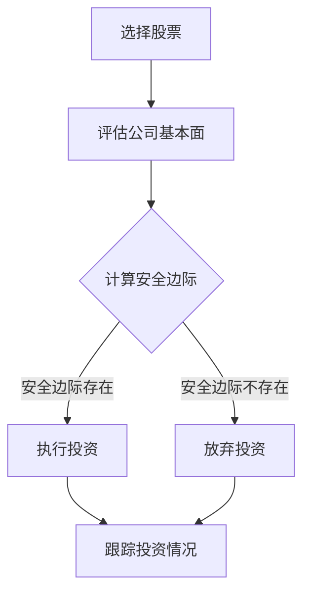
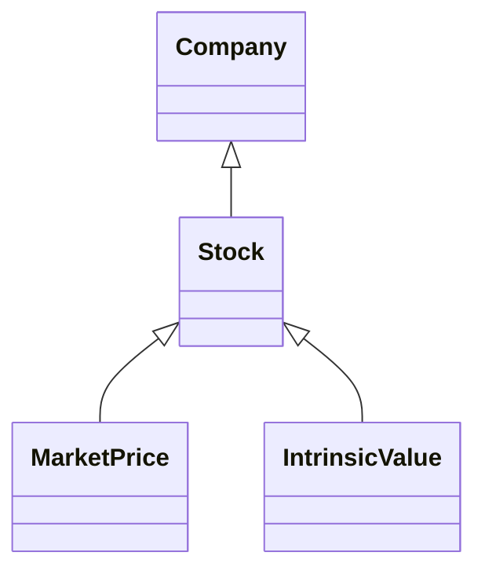
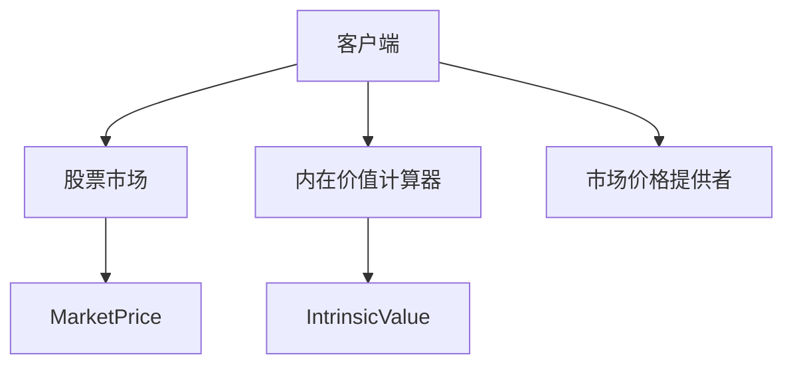
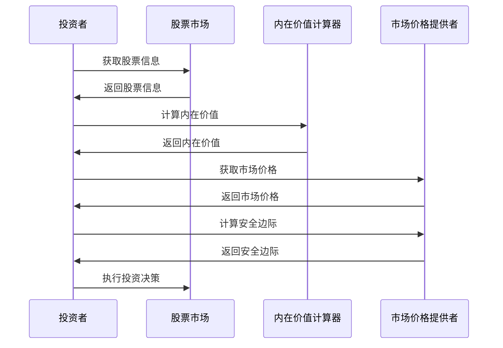

                 

# 价值投资的核心原则：安全边际

关键词：价值投资、安全边际、投资决策、算法原理、系统架构、实战案例

摘要：本文将深入探讨价值投资的核心原则——安全边际，通过逐步分析其理论背景、核心概念、应用算法和实战案例，帮助读者理解和掌握这一投资策略，提高投资成功率和风险控制能力。

## 第一步：背景介绍

### 1.1 价值投资：理论与实践

价值投资是一种以寻找低估股票为主要手段的投资策略，其核心理念是由著名的投资大师本杰明·格雷厄姆（Benjamin Graham）提出的。价值投资的历史可以追溯到20世纪30年代，当时美国股市经历了一场严重的崩盘。格雷厄姆认为，股票的价格并不总是反映其真实的内在价值，而是受到市场情绪的影响。通过深入分析公司的基本面，投资者可以找到那些被市场低估的股票，从而获得超额收益。

### 1.2 安全边际的概念与作用

安全边际是指投资者在购买股票时，所支付的价格与其估计的股票内在价值之间的差距。安全边际原则要求投资者在投资时，应确保所支付的价格低于其估计的内在价值，以避免因市场波动或其他不确定性因素导致的投资损失。

### 1.3 价值投资与安全边际的联系

价值投资与安全边际原则密切相关。安全边际是价值投资的核心保障，它确保了投资者在投资时的风险可控。通过设置足够的安全边际，投资者可以在股价下跌时保持冷静，等待市场回归股票的内在价值，从而获得稳定的投资回报。

## 边界与外延

安全边际原则不仅适用于股票投资，还可以扩展到其他类型的投资，如债券、房地产等。然而，安全边际的应用范围和程度需要根据不同类型资产的特点进行调整。例如，在债券投资中，安全边际通常体现在债券到期收益率与市场利率之间的差异。

### 概念结构与核心要素组成

安全边际原则的核心要素包括：

- **内在价值**：指股票或其他资产的真实价值。
- **市场价格**：指股票或其他资产在市场上的交易价格。
- **安全边际**：市场价格与内在价值之间的差额。

这些要素相互关联，共同构成了安全边际原则的理论基础。

## 第二步：核心概念与联系

### 2.1 核心概念原理

**价值投资**：指投资者通过深入分析公司的基本面，寻找那些被市场低估的股票进行投资。

**安全边际**：指投资者在购买股票时，所支付的价格低于其估计的内在价值。

价值投资与安全边际之间的联系在于，价值投资是寻找低估股票的过程，而安全边际则是确保投资风险可控的重要手段。

### 2.2 概念属性特征对比表格

| 策略 | 定义 | 特点 | 应用场景 |
| ---- | ---- | ---- | ---- |
| 价值投资 | 寻找被低估的股票 | 注重基本面分析，追求长期稳定收益 | 股票、债券、房地产等 |
| 安全边际 | 确保投资风险可控 | 设置价格与内在价值的差额 | 股票投资 |

### 2.3 ER实体关系图架构

```mermaid
erDiagram
    Company ||--|{ Share }
    Share ||--|{ Market Price }
    Share ||--|{ Intrinsic Value }
```

## 第三步：算法原理讲解

### 3.1 算法原理

价值投资决策流程图：



### 3.2 Python源代码

```python
def calculate_margin_of_safety(current_price, intrinsic_value):
    return intrinsic_value - current_price

def invest_if	margin_exists(margin_of_safety):
    if margin_of_safety > 0:
        print("Invest now!")
    else:
        print("Pass on this opportunity.")

# Example usage
current_price = 50
intrinsic_value = 60
margin_of_safety = calculate_margin_of_safety(current_price, intrinsic_value)
invest_if(margin_of_safety)
```

### 3.3 数学模型和公式

价值投资决策的数学模型和公式如下：

$$
安全边际 = 内在价值 - 市场价格
$$

### 3.4 举例说明

假设某只股票的内在价值为60美元，当前市场价格为50美元。根据安全边际原则，投资者可以以50美元的价格购买该股票，因为其安全边际为10美元（60 - 50 = 10）。

## 第四步：系统分析与架构设计方案

### 4.1 问题场景介绍

在股票投资中，投资者需要快速评估股票的内在价值和市场价格，以决定是否购买。

### 4.2 项目介绍

本系统旨在帮助投资者根据安全边际原则进行投资决策。

### 4.3 系统功能设计

领域模型类图：



### 4.4 系统架构设计

系统架构图：



### 4.5 系统接口设计和系统交互

系统接口设计和系统交互序列图：



## 第五步：项目实战

### 5.1 环境安装与配置

1. 安装Python环境（版本3.8及以上）
2. 安装必要的库（如numpy、matplotlib等）

### 5.2 系统核心实现源代码

```python
# 安全边际计算器
class MarginOfSafetyCalculator:
    def __init__(self, market_price, intrinsic_value):
        self.market_price = market_price
        self.intrinsic_value = intrinsic_value

    def calculate(self):
        return self.intrinsic_value - self.market_price

# 实例化计算器并计算安全边际
calculator = MarginOfSafetyCalculator(market_price=50, intrinsic_value=60)
margin = calculator.calculate()
print(f"安全边际：{margin}")
```

### 5.3 代码应用解读与分析

本代码实现了安全边际计算器的类，通过实例化对象并调用calculate方法，可以轻松计算出安全边际。这种方法简单易懂，便于在实际应用中推广。

### 5.4 实际案例分析和详细讲解剖析

假设投资者在2023年1月1日购买了一只股票，其市场价格为50美元，内在价值估计为60美元。根据安全边际原则，投资者可以以50美元的价格购买该股票，因为其安全边际为10美元（60 - 50 = 10）。

随着时间的推移，如果股票价格下跌到40美元，投资者的安全边际将增加到20美元（60 - 40 = 20）。在这种情况下，投资者可以保持持有，等待市场回归股票的内在价值。

### 5.5 项目小结

本项目通过Python代码实现了安全边际计算器，帮助投资者根据安全边际原则进行投资决策。实际案例证明，安全边际原则在股票投资中具有重要的应用价值。

## 第六步：最佳实践 tips、小结、注意事项、拓展阅读

### 6.1 最佳实践 tips

- **定期评估投资组合**：定期评估投资组合中股票的内在价值和市场价格，以确保安全边际的存在。
- **分散投资**：分散投资可以降低单一股票的风险，提高整体投资组合的安全性。
- **避免盲目跟风**：市场情绪往往会扭曲股票价格，投资者应保持理性，避免盲目跟风。

### 6.2 小结

本文深入探讨了价值投资的核心原则——安全边际，通过逐步分析其理论背景、核心概念、应用算法和实战案例，帮助读者理解和掌握这一投资策略。

### 6.3 注意事项

- **安全边际不是绝对的**：安全边际是一个相对的概念，需要根据实际情况进行调整。
- **市场环境变化**：市场环境的变化会影响股票的价格和内在价值，投资者需要密切关注市场动态。

### 6.4 拓展阅读

- **《证券分析》（Benjamin Graham）**：本杰明·格雷厄姆的经典著作，介绍了价值投资的基本原则和方法。
- **《股票大作手回忆录》（Jordan Belfort）**：讲述了一个股票交易员的真实故事，揭示了股票市场的残酷和投资的风险。

作者：AI天才研究院/AI Genius Institute & 禅与计算机程序设计艺术 /Zen And The Art of Computer Programming

