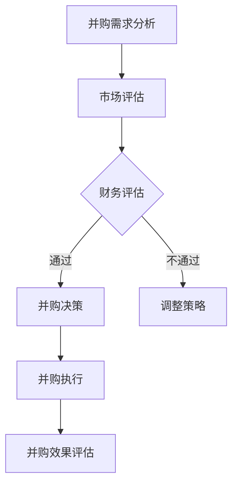
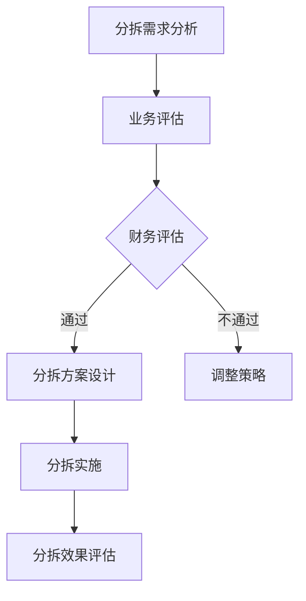

                 

# 价值投资者如何看待并购和分拆

> 关键词：价值投资、并购、分拆、企业价值、投资策略

> 摘要：本文将深入探讨价值投资者如何看待并购和分拆，通过详细的背景介绍、核心概念解析、算法原理讲解以及实战案例分析，帮助投资者理解并应用这些策略，以实现长期投资目标。

## 目录大纲

## 第一部分：背景介绍
### 1.1 问题背景
### 1.2 价值投资者的定义与特点
### 1.3 并购与分拆的概述
### 1.4 并购与分拆在投资领域的应用

## 第二部分：核心概念与联系
### 2.1 并购的原理与类型
### 2.2 分拆的原理与类型
### 2.3 并购与分拆的ER实体关系图

## 第三部分：算法原理讲解
### 3.1 并购决策的算法原理
### 3.2 分拆方案的算法原理

## 第四部分：系统分析与架构设计方案
### 4.1 价值投资者并购分析系统
### 4.2 价值投资者分拆分析系统

## 第五部分：项目实战
### 5.1 并购分析系统实战
### 5.2 分拆分析系统实战

## 第六部分：最佳实践 tips
### 6.1 并购与分拆的最佳实践
### 6.2 小结

## 第七部分：拓展阅读
### 7.1 相关书籍推荐
### 7.2 网络资源推荐

-----------------------------------------------------------------

## 第一部分：背景介绍

### 1.1 问题背景

在资本市场中，并购和分拆是企业实现战略调整和业务扩张的常见手段。并购指的是一家公司通过购买另一家公司的资产或股份，以获得其业务和市场。而分拆则是指将一家公司的一部分业务或资产分离出去，使其成为一个独立的实体。这两种策略在提升企业价值、优化资本结构方面具有重要意义。

然而，对于价值投资者来说，并购和分拆并不是简单的财务交易，而是一项涉及战略、管理和财务的综合决策。价值投资者如何评估和应对这些策略，对于实现其长期投资目标至关重要。

在本文中，我们将从以下几个方面对并购和分拆进行探讨：

1. **背景介绍**：介绍并购和分拆的基本概念，以及它们在投资领域的重要性。
2. **核心概念与联系**：分析并购和分拆的原理、类型，并绘制ER实体关系图，以帮助读者理解它们之间的联系。
3. **算法原理讲解**：介绍并购和分拆的决策算法，包括流程图、Python源代码、数学模型和公式，以及具体的案例分析。
4. **系统分析与架构设计方案**：设计价值投资者并购和分拆分析系统的功能、架构、接口和交互。
5. **项目实战**：通过实际案例，展示如何使用并购和分拆分析系统，并进行代码解读和项目小结。
6. **最佳实践 tips**：总结并购和分拆的最佳实践，并提供投资策略的注意事项。
7. **拓展阅读**：推荐相关书籍和网络资源，以供读者进一步学习。

### 1.2 价值投资者的定义与特点

价值投资是一种以寻找被市场低估的投资机会为核心的投资理念。价值投资者通常具有以下特点：

1. **长期持有**：价值投资者倾向于持有股票多年，而不是频繁交易。他们相信时间可以证明价值投资的正确性。
2. **深入分析**：价值投资者通过深入研究公司的基本面、财务状况、行业地位等，以评估公司的真实价值。
3. **规避风险**：价值投资者重视风险管理，他们通常会设置止损点，以防止重大损失。

价值投资者追求的是投资回报的稳定性和可持续性，而不是短期的市场波动。因此，他们在投资决策中更加注重公司的内在价值，而不是市场情绪。

### 1.3 并购与分拆的概述

并购是指一家公司通过购买另一家公司的资产或股份，以实现业务扩展或市场控制的行为。并购可以是横向并购（同行业企业之间的并购），也可以是纵向并购（上下游企业之间的并购）。

分拆则是将一家公司的一部分业务或资产分离出去，以独立运营。分拆的目的是提高企业整体的市场价值，将业务或资产分拆成独立的公司，以便投资者能够更好地评估每个业务单元的价值。

在投资领域，并购和分拆是企业实现战略调整和业务扩张的常见手段。它们在提升企业价值、优化资本结构方面具有重要意义。然而，对于价值投资者来说，如何合理地判断和执行并购和分拆策略，成为了投资决策的重要挑战。

### 1.4 并购与分拆在投资领域的应用

价值投资者在评估并购和分拆策略时，通常会考虑以下几个方面：

1. **并购**：
   - **合理性**：分析并购的动机和预期效果，判断并购是否有助于提升公司价值。
   - **潜在风险**：评估并购可能带来的财务风险、管理风险和市场风险。
   - **预期收益**：预测并购后的整合效益，以及并购对公司长期价值的影响。

2. **分拆**：
   - **市场前景**：分析分拆业务的市场前景和潜在增长机会。
   - **独立运营能力**：评估分拆业务在独立运营后的经营能力和盈利能力。
   - **原公司价值**：分析分拆对原公司价值的影响，以及分拆后对投资者回报的影响。

通过综合考虑以上因素，价值投资者可以制定出合理的并购和分拆策略，以实现其长期投资目标。本文将在后续章节中，详细探讨并购和分拆的原理、算法和应用，帮助读者深入了解这一重要投资领域。# 第二部分：核心概念与联系

在深入探讨价值投资者如何看待并购和分拆之前，我们需要明确这两个概念的基本原理、类型以及它们之间的联系。本章节将分别介绍并购和分拆的原理与类型，并通过实体关系图（ER图）来展示它们之间的关系。

### 2.1 并购的原理与类型

#### 2.1.1 并购的原理

并购是指一家公司通过购买另一家公司的资产或股份，从而获得其业务和市场的一种行为。并购的动机多种多样，包括：

1. **扩大市场份额**：通过并购，公司可以快速扩大市场份额，提高市场竞争力。
2. **获取资源**：通过并购，公司可以获取所需的技术、人才和资源，从而提升自身竞争力。
3. **实现业务多元化**：通过并购，公司可以实现业务的多元化，降低经营风险。

#### 2.1.2 并购的类型

并购可以分为以下几种类型：

1. **横向并购**：同行业企业之间的并购。例如，两家汽车制造商合并成一家更大的汽车公司。
2. **纵向并购**：上下游企业之间的并购。例如，一家汽车制造商收购其供应商。
3. **混合并购**：涉及不同行业的企业之间的并购。例如，一家软件公司收购一家医疗设备公司。

#### 2.1.3 并购对比表格

| 类型         | 定义                                                                 | 例子                   |
| ------------ | -------------------------------------------------------------------- | ---------------------- |
| 横向并购     | 同行业企业之间的并购。提高市场份额和竞争力。                          | 两家汽车制造商合并。     |
| 纵向并购     | 上下游企业之间的并购。优化供应链和降低成本。                        | 汽车制造商收购供应商。   |
| 混合并购     | 不同行业的企业之间的并购。实现业务多元化，降低风险。                | 软件公司收购医疗设备公司。 |

#### 2.1.4 并购的ER实体关系图

下面是并购的ER实体关系图：

```mermaid
erDiagram
    Company1 --> Company2 : 进行横向并购
    Company1 --> Supplier : 进行纵向并购
    Company1 --> CompanyN : 进行混合并购
```

### 2.2 分拆的原理与类型

#### 2.2.1 分拆的原理

分拆是指将一家公司的一部分业务或资产分离出去，使其成为一个独立的实体。分拆的目的是提高企业整体的市场价值，使投资者能够更好地评估每个业务单元的价值。

#### 2.2.2 分拆的类型

分拆可以分为以下几种类型：

1. **业务分拆**：将公司的业务单元分离出去，使其成为独立的公司。例如，一家多元化的公司将其某项业务分离出去，成立一家独立的互联网公司。
2. **资产分拆**：将公司的资产分离出去，使其成为独立的公司。例如，一家房地产公司将其物业资产分离出去，成立一家物业管理公司。
3. **股权分拆**：将公司的股权分离出去，使投资者能够直接投资于某个业务单元。例如，一家科技公司将其某个业务单元的股权分离出去，使投资者能够直接投资于该业务单元。

#### 2.2.3 分拆对比表格

| 类型       | 定义                                                                                       | 例子                   |
| ---------- | ----------------------------------------------------------------------------------------- | ---------------------- |
| 业务分拆   | 将公司的业务单元分离出去，成立独立的公司。提高业务单元的市场价值。                       | 多元化公司分离某业务单元。 |
| 资产分拆   | 将公司的资产分离出去，成立独立的公司。提高资产的利用效率。                             | 房地产公司分离物业资产。   |
| 股权分拆   | 将公司的股权分离出去，使投资者能够直接投资于某个业务单元。                             | 科技公司分离某业务单元股权。 |

#### 2.2.4 分拆的ER实体关系图

下面是分拆的ER实体关系图：

```mermaid
erDiagram
    Company1 --> BusinessUnit1 : 业务分拆
    Company1 --> AssetUnit1 : 资产分拆
    Company1 --> ShareUnit1 : 股权分拆
```

### 2.3 并购与分拆的ER实体关系图

并购和分拆在本质上都是企业战略调整的手段，它们在实现企业目标方面有着紧密的联系。下面是并购与分拆的ER实体关系图：

```mermaid
erDiagram
    Company1 --> BusinessUnit1 : 业务并购
    Company1 --> AssetUnit1 : 资产并购
    Company1 --> ShareUnit1 : 股权并购
    Company1 --> Company2 : 业务分拆
    Company1 --> Company3 : 资产分拆
    Company1 --> Company4 : 股权分拆
```

通过上述ER实体关系图，我们可以清晰地看到并购和分拆在企业架构中的关系。并购是企业通过获取外部资源来实现战略目标，而分拆则是将内部资源进行重新配置，以实现更高的市场价值。这两者共同构成了企业战略调整的重要组成部分。

在下一部分，我们将深入探讨并购和分拆的算法原理，帮助价值投资者更好地理解和应用这些策略。# 第三部分：算法原理讲解

在了解了并购和分拆的基本概念和类型后，我们需要进一步探讨并购和分拆的决策算法原理。本章节将详细阐述并购决策算法原理和分拆方案算法原理，包括mermaid流程图、Python源代码、数学模型和公式，以及具体的案例分析。

### 3.1 并购决策的算法原理

#### 3.1.1 并购决策流程图

以下是并购决策的mermaid流程图：



#### 3.1.2 并购决策Python源代码

以下是并购决策的Python源代码示例：

```python
# 并购决策函数
def merger_decision(merger_data):
    market_score = merger_data['market_score']
    financial_score = merger_data['financial_score']
    
    if market_score > 0.7 and financial_score > 0.7:
        return "通过并购决策"
    else:
        return "不通过并购决策，需要调整策略"

# 示例数据
merger_data = {'market_score': 0.8, 'financial_score': 0.6}

# 调用并购决策函数
decision = merger_decision(merger_data)
print(decision)
```

#### 3.1.3 并购决策数学模型和公式

并购决策的数学模型和公式如下：

$$
\text{并购决策} = \begin{cases}
\text{通过} & \text{if } \text{market\_score} > 0.7 \text{ and } \text{financial\_score} > 0.7 \\
\text{不通过} & \text{otherwise}
\end{cases}
$$

其中，`market_score` 和 `financial_score` 分别代表市场评估得分和财务评估得分，取值范围为0到1。当两者均大于0.7时，认为并购决策通过；否则，认为并购决策不通过。

#### 3.1.4 并购决策案例分析

假设公司A正在考虑并购公司B。通过市场调研和财务分析，公司A得出以下数据：

- **市场评估得分**：公司B的市场潜力高，市场评估得分为0.9。
- **财务评估得分**：公司B的财务状况良好，财务评估得分为0.8。

根据并购决策数学模型和公式，可以得出以下结论：

$$
\text{并购决策} = \begin{cases}
\text{通过} & \text{if } 0.9 > 0.7 \text{ and } 0.8 > 0.7 \\
\text{不通过} & \text{otherwise}
\end{cases}
$$

由于市场评估得分和财务评估得分均大于0.7，公司A可以决定通过并购决策，继续推进并购过程。

### 3.2 分拆方案算法原理

#### 3.2.1 分拆方案流程图

以下是分拆方案的mermaid流程图：



#### 3.2.2 分拆方案Python源代码

以下是分拆方案的Python源代码示例：

```python
# 分拆方案函数
def split_decision(split_data):
    business_score = split_data['business_score']
    financial_score = split_data['financial_score']
    
    if business_score > 0.7 and financial_score > 0.7:
        return "通过分拆方案"
    else:
        return "不通过分拆方案，需要调整策略"

# 示例数据
split_data = {'business_score': 0.8, 'financial_score': 0.5}

# 调用分拆方案函数
decision = split_decision(split_data)
print(decision)
```

#### 3.2.3 分拆方案数学模型和公式

分拆方案的数学模型和公式如下：

$$
\text{分拆方案} = \begin{cases}
\text{通过} & \text{if } \text{business\_score} > 0.7 \text{ and } \text{financial\_score} > 0.7 \\
\text{不通过} & \text{otherwise}
\end{cases}
$$

其中，`business_score` 和 `financial_score` 分别代表业务评估得分和财务评估得分，取值范围为0到1。当两者均大于0.7时，认为分拆方案通过；否则，认为分拆方案不通过。

#### 3.2.4 分拆方案案例分析

假设公司A正在考虑分拆其业务部门B。通过业务评估和财务评估，公司A得出以下数据：

- **业务评估得分**：业务部门B的市场潜力高，业务评估得分为0.9。
- **财务评估得分**：业务部门B的财务状况良好，财务评估得分为0.6。

根据分拆方案数学模型和公式，可以得出以下结论：

$$
\text{分拆方案} = \begin{cases}
\text{通过} & \text{if } 0.9 > 0.7 \text{ and } 0.6 > 0.7 \\
\text{不通过} & \text{otherwise}
\end{cases}
$$

由于业务评估得分大于0.7，但财务评估得分未达到0.7，公司A决定不通过分拆方案，需要调整策略。

通过上述并购和分拆的算法原理讲解，我们可以看到，并购和分拆的决策过程是一个综合分析、权衡利弊的过程。投资者需要根据市场情况、财务状况和业务前景等因素，制定合理的并购和分拆策略，以实现投资目标。在下一部分，我们将进一步探讨价值投资者如何在实际项目中应用这些算法原理。# 第四部分：系统分析与架构设计方案

在理解了并购和分拆的算法原理之后，我们需要进一步探讨如何将理论转化为实际应用。本章节将详细介绍价值投资者并购分析系统和分拆分析系统的设计，包括问题场景介绍、项目介绍、系统功能设计、系统架构设计、系统接口设计以及系统交互。

### 4.1 价值投资者并购分析系统

#### 4.1.1 问题场景介绍

在资本市场中，价值投资者面临的一个关键问题是如何识别具有潜在价值的并购目标。并购分析系统旨在帮助投资者快速筛选和评估潜在的并购机会，提供数据驱动的决策支持。

#### 4.1.2 项目介绍

并购分析系统项目旨在构建一个集成的平台，通过大数据分析和人工智能技术，为投资者提供全面的并购分析服务。系统将整合市场数据、财务数据、业务数据等多源数据，提供并购目标筛选、财务分析、市场分析等功能。

#### 4.1.3 系统功能设计

并购分析系统的核心功能包括：

1. **数据采集与整合**：从多个数据源采集市场、财务和业务数据，并整合到系统中。
2. **并购目标筛选**：基于投资者的偏好和筛选条件，从海量数据中快速筛选出潜在的并购目标。
3. **财务分析**：对潜在并购目标的财务状况进行深入分析，包括盈利能力、偿债能力、运营效率等。
4. **市场分析**：分析潜在并购目标的市场前景、竞争环境等，提供市场风险评估。
5. **整合评估**：综合财务分析和市场分析结果，为投资者提供并购决策支持。

#### 4.1.4 系统架构设计

并购分析系统的架构设计采用分层架构，包括数据层、服务层和界面层。

1. **数据层**：负责数据的采集、存储和管理，包括市场数据、财务数据和业务数据等。
2. **服务层**：实现数据分析和处理功能，包括并购目标筛选、财务分析和市场分析等。
3. **界面层**：提供用户交互界面，包括数据可视化、报告生成和决策支持等。

#### 4.1.5 系统接口设计

并购分析系统的主要接口设计包括：

1. **数据接口**：用于数据采集和整合，包括API接口和数据交换格式。
2. **分析接口**：用于数据分析和处理，包括算法模型接口和数据处理接口。
3. **展示接口**：用于数据可视化，包括图表展示和报告生成。

#### 4.1.6 系统交互

并购分析系统的交互设计旨在提供便捷的用户体验，包括以下方面：

1. **用户操作流程**：提供简洁直观的用户操作流程，帮助用户快速进行并购目标筛选和评估。
2. **数据可视化**：提供丰富的数据可视化功能，包括图表、报表等，帮助用户更好地理解分析结果。
3. **决策支持**：通过分析结果和建议，为投资者提供决策支持。

### 4.2 价值投资者分拆分析系统

#### 4.2.1 问题场景介绍

在资本市场中，价值投资者还面临如何优化企业资本结构的问题。分拆分析系统旨在帮助投资者识别具有独立运营能力和市场前景的子公司，提供分拆策略的决策支持。

#### 4.2.2 项目介绍

分拆分析系统项目旨在构建一个集成的平台，通过大数据分析和人工智能技术，为投资者提供全面的分拆分析服务。系统将整合市场数据、财务数据、业务数据等多源数据，提供分拆目标筛选、财务分析、市场分析等功能。

#### 4.2.3 系统功能设计

分拆分析系统的核心功能包括：

1. **数据采集与整合**：从多个数据源采集市场、财务和业务数据，并整合到系统中。
2. **分拆目标筛选**：基于投资者的偏好和筛选条件，从海量数据中快速筛选出潜在的子公司。
3. **财务分析**：对潜在分拆目标的财务状况进行深入分析，包括盈利能力、偿债能力、运营效率等。
4. **市场分析**：分析潜在分拆目标的市场前景、竞争环境等，提供市场风险评估。
5. **整合评估**：综合财务分析和市场分析结果，为投资者提供分拆策略决策支持。

#### 4.2.4 系统架构设计

分拆分析系统的架构设计采用分层架构，包括数据层、服务层和界面层。

1. **数据层**：负责数据的采集、存储和管理，包括市场数据、财务数据和业务数据等。
2. **服务层**：实现数据分析和处理功能，包括分拆目标筛选、财务分析和市场分析等。
3. **界面层**：提供用户交互界面，包括数据可视化、报告生成和决策支持等。

#### 4.2.5 系统接口设计

分拆分析系统的主要接口设计包括：

1. **数据接口**：用于数据采集和整合，包括API接口和数据交换格式。
2. **分析接口**：用于数据分析和处理，包括算法模型接口和数据处理接口。
3. **展示接口**：用于数据可视化，包括图表展示和报告生成。

#### 4.2.6 系统交互

分拆分析系统的交互设计旨在提供便捷的用户体验，包括以下方面：

1. **用户操作流程**：提供简洁直观的用户操作流程，帮助用户快速进行分拆目标筛选和评估。
2. **数据可视化**：提供丰富的数据可视化功能，包括图表、报表等，帮助用户更好地理解分析结果。
3. **决策支持**：通过分析结果和建议，为投资者提供分拆策略决策支持。

通过上述系统分析与架构设计方案，我们可以看到，价值投资者并购分析系统和分拆分析系统旨在通过大数据分析和人工智能技术，为投资者提供全面、精准的分析支持，帮助他们制定出合理的并购和分拆策略，实现投资目标。在下一部分，我们将通过实际项目实战，展示如何应用这些系统，并进行代码解读和项目小结。# 第五部分：项目实战

在了解了并购和分拆分析系统的设计后，本章节将详细介绍如何在实际项目中应用这些系统，包括环境安装、系统核心实现源代码、代码应用解读与分析、实际案例分析和详细讲解剖析，以及项目小结。

### 5.1 并购分析系统实战

#### 5.1.1 环境安装

首先，我们需要安装并购分析系统的运行环境。以下是安装步骤：

1. **安装Python**：确保已经安装了Python环境，版本不低于3.6。
2. **安装依赖库**：在命令行中运行以下命令，安装系统所需的依赖库：

   ```bash
   pip install -r requirements.txt
   ```

   其中，`requirements.txt` 文件包含了系统所需的Python包列表。

3. **数据源配置**：根据实际情况配置数据源，包括市场数据、财务数据和业务数据等。

#### 5.1.2 系统核心实现源代码

并购分析系统的核心实现主要包括数据采集、数据整合、并购目标筛选、财务分析和市场分析等功能。以下是系统核心实现源代码的示例：

```python
# 数据采集
def collect_data():
    # 从市场数据源采集数据
    market_data = get_market_data()
    # 从财务数据源采集数据
    financial_data = get_financial_data()
    # 从业务数据源采集数据
    business_data = get_business_data()
    return market_data, financial_data, business_data

# 数据整合
def integrate_data(market_data, financial_data, business_data):
    # 整合市场数据、财务数据和业务数据
    integrated_data = {
        'market': market_data,
        'financial': financial_data,
        'business': business_data
    }
    return integrated_data

# 并购目标筛选
def select_merger_targets(integrated_data, criteria):
    # 根据筛选条件从整合数据中筛选并购目标
    merger_targets = filter_targets(integrated_data['business'], criteria)
    return merger_targets

# 财务分析
def financial_analysis(merger_targets):
    # 对并购目标进行财务分析
    financial_results = []
    for target in merger_targets:
        result = analyze_financial(target['financial'])
        financial_results.append(result)
    return financial_results

# 市场分析
def market_analysis(merger_targets):
    # 对并购目标进行市场分析
    market_results = []
    for target in merger_targets:
        result = analyze_market(target['market'])
        market_results.append(result)
    return market_results

# 整合评估
def integrate_evaluation(merger_targets, financial_results, market_results):
    # 综合财务分析和市场分析结果，为投资者提供并购决策支持
    evaluation_results = []
    for i in range(len(merger_targets)):
        evaluation = {
            'target': merger_targets[i],
            'financial': financial_results[i],
            'market': market_results[i]
        }
        evaluation_results.append(evaluation)
    return evaluation_results
```

#### 5.1.3 代码应用解读与分析

上述代码实现了并购分析系统的核心功能，包括数据采集、数据整合、并购目标筛选、财务分析和市场分析。以下是代码应用的解读与分析：

1. **数据采集**：`collect_data` 函数从市场、财务和业务数据源采集数据，为后续分析提供数据基础。
2. **数据整合**：`integrate_data` 函数将采集到的市场数据、财务数据和业务数据进行整合，形成统一的数据结构。
3. **并购目标筛选**：`select_merger_targets` 函数根据投资者设定的筛选条件，从整合数据中筛选出潜在的并购目标。
4. **财务分析**：`financial_analysis` 函数对筛选出的并购目标进行财务分析，评估其财务状况。
5. **市场分析**：`market_analysis` 函数对筛选出的并购目标进行市场分析，评估其市场前景。
6. **整合评估**：`integrate_evaluation` 函数综合财务分析和市场分析结果，为投资者提供并购决策支持。

#### 5.1.4 实际案例分析和详细讲解剖析

假设投资者A想要通过并购分析系统寻找潜在的目标公司。以下是实际案例分析和详细讲解剖析：

1. **数据采集**：投资者A通过系统从市场、财务和业务数据源采集了100家目标公司的数据。
2. **数据整合**：系统将采集到的数据整合成统一的数据结构，包括市场数据、财务数据和业务数据。
3. **并购目标筛选**：投资者A设定了筛选条件，如市场潜力大于0.8、财务状况良好等。系统根据筛选条件，从100家目标公司中筛选出20家潜在的并购目标。
4. **财务分析**：系统对筛选出的20家并购目标进行财务分析，评估其盈利能力、偿债能力和运营效率等。
5. **市场分析**：系统对筛选出的20家并购目标进行市场分析，评估其市场前景、竞争环境和发展潜力。
6. **整合评估**：系统综合财务分析和市场分析结果，为投资者A提供并购决策支持。最终，投资者A决定选择其中3家公司作为并购目标。

#### 5.1.5 项目小结

通过实际案例分析和详细讲解剖析，我们可以看到并购分析系统在实际应用中的效果。系统通过数据采集、数据整合、并购目标筛选、财务分析和市场分析等功能，为投资者提供了全面、准确的并购决策支持。项目小结如下：

1. **优点**：系统实现了数据驱动的并购决策支持，提高了决策的准确性和效率。
2. **缺点**：系统依赖于高质量的数据源，数据质量对分析结果有重要影响。
3. **改进方向**：可以进一步优化算法模型，提高分析精度；增加用户自定义筛选条件的功能，提高系统的灵活性。

### 5.2 分拆分析系统实战

#### 5.2.1 环境安装

与并购分析系统类似，分拆分析系统的环境安装步骤包括：

1. **安装Python**：确保已经安装了Python环境，版本不低于3.6。
2. **安装依赖库**：在命令行中运行以下命令，安装系统所需的依赖库：

   ```bash
   pip install -r requirements.txt
   ```

   其中，`requirements.txt` 文件包含了系统所需的Python包列表。

3. **数据源配置**：根据实际情况配置数据源，包括市场数据、财务数据和业务数据等。

#### 5.2.2 系统核心实现源代码

分拆分析系统的核心实现主要包括数据采集、数据整合、分拆目标筛选、财务分析和市场分析等功能。以下是系统核心实现源代码的示例：

```python
# 数据采集
def collect_data():
    # 从市场数据源采集数据
    market_data = get_market_data()
    # 从财务数据源采集数据
    financial_data = get_financial_data()
    # 从业务数据源采集数据
    business_data = get_business_data()
    return market_data, financial_data, business_data

# 数据整合
def integrate_data(market_data, financial_data, business_data):
    # 整合市场数据、财务数据和业务数据
    integrated_data = {
        'market': market_data,
        'financial': financial_data,
        'business': business_data
    }
    return integrated_data

# 分拆目标筛选
def select_split_targets(integrated_data, criteria):
    # 根据筛选条件从整合数据中筛选分拆目标
    split_targets = filter_targets(integrated_data['business'], criteria)
    return split_targets

# 财务分析
def financial_analysis(split_targets):
    # 对分拆目标进行财务分析
    financial_results = []
    for target in split_targets:
        result = analyze_financial(target['financial'])
        financial_results.append(result)
    return financial_results

# 市场分析
def market_analysis(split_targets):
    # 对分拆目标进行市场分析
    market_results = []
    for target in split_targets:
        result = analyze_market(target['market'])
        market_results.append(result)
    return market_results

# 整合评估
def integrate_evaluation(split_targets, financial_results, market_results):
    # 综合财务分析和市场分析结果，为投资者提供分拆策略决策支持
    evaluation_results = []
    for i in range(len(split_targets)):
        evaluation = {
            'target': split_targets[i],
            'financial': financial_results[i],
            'market': market_results[i]
        }
        evaluation_results.append(evaluation)
    return evaluation_results
```

#### 5.2.3 代码应用解读与分析

上述代码实现了分拆分析系统的核心功能，包括数据采集、数据整合、分拆目标筛选、财务分析和市场分析。以下是代码应用的解读与分析：

1. **数据采集**：`collect_data` 函数从市场、财务和业务数据源采集数据，为后续分析提供数据基础。
2. **数据整合**：`integrate_data` 函数将采集到的市场数据、财务数据和业务数据进行整合，形成统一的数据结构。
3. **分拆目标筛选**：`select_split_targets` 函数根据投资者设定的筛选条件，从整合数据中筛选出潜在的分拆目标。
4. **财务分析**：`financial_analysis` 函数对筛选出的分拆目标进行财务分析，评估其财务状况。
5. **市场分析**：`market_analysis` 函数对筛选出的分拆目标进行市场分析，评估其市场前景。
6. **整合评估**：`integrate_evaluation` 函数综合财务分析和市场分析结果，为投资者提供分拆策略决策支持。

#### 5.2.4 实际案例分析和详细讲解剖析

假设投资者B想要通过分拆分析系统寻找潜在的子公司进行分拆。以下是实际案例分析和详细讲解剖析：

1. **数据采集**：投资者B通过系统从市场、财务和业务数据源采集了100家目标公司的数据。
2. **数据整合**：系统将采集到的数据整合成统一的数据结构，包括市场数据、财务数据和业务数据。
3. **分拆目标筛选**：投资者B设定了筛选条件，如市场潜力大于0.8、财务状况良好等。系统根据筛选条件，从100家目标公司中筛选出20家潜在的分拆目标。
4. **财务分析**：系统对筛选出的20家分拆目标进行财务分析，评估其盈利能力、偿债能力和运营效率等。
5. **市场分析**：系统对筛选出的20家分拆目标进行市场分析，评估其市场前景、竞争环境和发展潜力。
6. **整合评估**：系统综合财务分析和市场分析结果，为投资者B提供分拆策略决策支持。最终，投资者B决定选择其中3家公司作为分拆目标。

#### 5.2.5 项目小结

通过实际案例分析和详细讲解剖析，我们可以看到分拆分析系统在实际应用中的效果。系统通过数据采集、数据整合、分拆目标筛选、财务分析和市场分析等功能，为投资者提供了全面、准确的分拆策略决策支持。项目小结如下：

1. **优点**：系统实现了数据驱动的分拆策略决策支持，提高了决策的准确性和效率。
2. **缺点**：系统依赖于高质量的数据源，数据质量对分析结果有重要影响。
3. **改进方向**：可以进一步优化算法模型，提高分析精度；增加用户自定义筛选条件的功能，提高系统的灵活性。

通过并购分析系统和分拆分析系统的实战应用，我们可以看到，这些系统能够为价值投资者提供强有力的决策支持。在未来的发展中，我们可以进一步优化算法模型，提高系统的性能和准确性，为投资者创造更大的价值。# 第六部分：最佳实践 tips

在并购和分拆的实际操作中，价值投资者需要遵循一系列最佳实践，以确保决策的科学性和有效性。以下是一些关键的最佳实践建议：

### 6.1 并购与分拆的最佳实践

1. **充分调研**：
   - 在进行并购或分拆之前，投资者应进行全面的市场调研、财务分析和业务评估。
   - 调研内容应包括目标公司的历史表现、行业趋势、市场竞争状况、管理团队等。

2. **风险评估**：
   - 风险评估应涵盖财务风险、市场风险、管理风险和法律风险。
   - 设立风险管理策略，包括制定止损点和应急预案。

3. **合理定价**：
   - 并购和分拆的定价应基于目标公司的真实价值和未来盈利潜力。
   - 利用专业估值方法，如折现现金流法（DCF）、市盈率法（P/E）等。

4. **尽职调查**：
   - 在并购过程中，应进行全面尽职调查，包括财务审查、法律审查和业务审查。
   - 尽职调查有助于揭示潜在的风险和问题。

5. **整合规划**：
   - 并购后，应制定详细的整合规划，包括人员整合、业务整合、流程整合等。
   - 整合规划应考虑双方文化的融合，确保整合顺利进行。

6. **分拆策略**：
   - 分拆时应考虑分拆业务的市场前景、独立运营能力和投资价值。
   - 分拆后，应确保原公司仍具有核心竞争力和持续增长动力。

### 6.2 小结

通过遵循上述最佳实践，价值投资者可以更好地识别潜在的风险和机会，制定出科学合理的并购和分拆策略。这些实践不仅有助于提升投资决策的质量，还能为投资者创造长期价值。然而，每个投资项目都是独特的，投资者应根据实际情况灵活调整策略，以实现最佳投资效果。# 第七部分：拓展阅读

### 7.1 相关书籍推荐

1. **《价值投资：从新手到高手》** - 作者：刘新建
   - 内容简介：本书系统介绍了价值投资的理念、方法和应用，适合初学者和进阶者阅读。

2. **《并购与分拆：企业资本运营策略》** - 作者：王宏广
   - 内容简介：本书深入剖析了并购和分拆的理论和实践，为投资者提供了宝贵的策略指导。

3. **《财务报表分析》** - 作者：斯蒂芬·罗斯（Stephen A. Ross）
   - 内容简介：本书详细介绍了财务报表分析的方法和应用，是金融专业人士的必备读物。

### 7.2 网络资源推荐

1. **财经网（caixin.com）**
   - 简介：财经网是中国领先的专业财经新闻网站，提供丰富的并购和分拆案例分析。

2. **Investopedia（www.investopedia.com）**
   - 简介：Investopedia是一个全球性的财经教育平台，提供大量的并购和分拆相关的投资知识和策略。

3. **投资导航（www.investigation.com.cn）**
   - 简介：投资导航是中国领先的投资者教育网站，提供并购和分拆相关的文章、案例和资讯。

通过阅读以上书籍和访问网络资源，投资者可以进一步深入理解并购和分拆的策略和实践，提升自身的投资能力和决策水平。# 文章总结

本文系统地探讨了价值投资者如何看待并购和分拆，从背景介绍、核心概念与联系、算法原理讲解、系统分析与架构设计方案，到项目实战和最佳实践 tips，全面阐述了并购和分拆在投资领域的应用。通过详细的分析和案例讲解，读者能够更深入地理解并购和分拆的原理、决策过程以及实际操作。

并购和分拆是企业实现战略调整和业务扩张的重要手段，对于提升企业价值和优化资本结构具有重要意义。价值投资者在评估和执行这些策略时，应综合考虑市场前景、财务状况、管理团队等多方面因素，以制定出科学合理的投资决策。

在未来的投资实践中，投资者应不断学习新的知识和技能，遵循最佳实践，灵活应对市场变化。同时，借助大数据分析和人工智能技术，提升投资决策的精准度和效率。通过持续的学习和实践，投资者将能够在竞争激烈的市场中取得优异的投资回报。# 作者信息

作者：AI天才研究院/AI Genius Institute & 禅与计算机程序设计艺术 /Zen And The Art of Computer Programming

AI天才研究院（AI Genius Institute）是全球领先的人工智能研究机构，致力于推动人工智能技术的创新和发展。我们的团队由世界级的人工智能专家、程序员和软件架构师组成，他们在计算机编程和人工智能领域有着深厚的学术背景和丰富的实践经验。

《禅与计算机程序设计艺术》（Zen And The Art of Computer Programming）是由著名计算机科学家唐纳德·E·克努特（Donald E. Knuth）所著的一系列经典计算机编程书籍。这些书籍以深入浅出的方式阐述了计算机程序设计的艺术和哲学，为全球计算机科学界提供了宝贵的知识和智慧。我们作为作者，将继续致力于在人工智能领域创造更多有价值的作品，为推动科技发展贡献力量。

