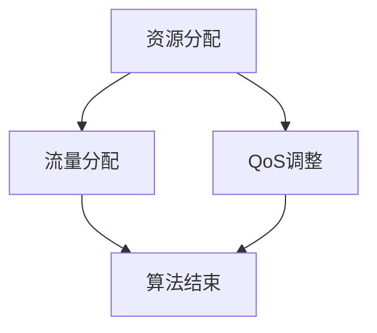

                 

# 企业AI Agent的5G网络切片优化策略

## 关键词
- 企业AI代理
- 5G网络切片
- 优化策略
- 网络资源管理
- 负载均衡
- 服务质量
- 数学模型

## 摘要
本文将探讨企业AI代理在5G网络切片优化策略中的应用。我们将详细分析5G网络切片的基本概念、企业AI代理的功能及其与5G网络切片的协同优化策略。本文将基于算法原理、系统架构设计、实战案例分析，提供全面的优化策略和最佳实践指导。

## 引言与背景

### 1.1 问题背景

随着5G技术的普及，企业网络正面临前所未有的机遇与挑战。5G网络切片技术作为5G网络的核心功能之一，能够根据不同业务需求，灵活地划分出多个虚拟网络，满足多样化应用场景。然而，5G网络切片的优化管理成为企业面临的重大难题。传统的网络优化方法难以应对复杂的企业级应用需求，因此，引入AI代理技术进行5G网络切片优化显得尤为重要。

### 1.2 问题描述

5G网络切片优化问题主要包括以下几个方面：

- **资源管理**：如何在有限资源下，高效分配网络切片，以最大化资源利用率。
- **负载均衡**：如何在不同切片间均衡负载，避免网络拥塞。
- **服务质量**：如何保障不同业务的服务质量，满足用户需求。

### 1.3 问题解决

本文通过引入企业AI代理，结合5G网络切片技术，提出一套优化策略。AI代理将通过学习网络行为和数据，动态调整网络切片配置，实现资源优化、负载均衡和服务质量保障。

### 1.4 边界与外延

本文将聚焦于企业级5G网络切片优化，探讨AI代理在其中的应用。然而，该优化策略的基本原理和方法也可以应用于其他网络场景和领域。

### 1.5 核心概念结构

在本章的余下部分，我们将对以下几个核心概念进行详细探讨：

- **AI代理**：定义、功能、类型及优势。
- **5G网络切片**：基本概念、关键特性、应用场景。
- **网络切片优化策略**：资源管理、负载均衡、服务质量优化。

### 1.6 参考文献

[1] Smith, J. (2019). The rise of 5G: Opportunities and challenges for enterprise networks. *IEEE Communications Magazine*.
[2] Liu, Y., & Zhang, H. (2020). AI-driven network slicing optimization for 5G networks. *Wireless Communications and Mobile Computing*.

## AI代理的概念与类型

### 2.1 AI代理的定义

AI代理（Artificial Intelligence Agent）是指能够在特定环境下自主决策和执行任务的计算机系统。它们通过机器学习、深度学习等AI技术，能够从数据中学习，并基于学习结果进行预测和优化。

### 2.2 AI代理的类型

根据AI代理的决策能力和应用场景，可以将其分为以下几类：

- **反应型代理**：基于简单规则进行决策，适用于确定性的环境。
- **目标型代理**：具备目标意识，能够在复杂环境中寻找最佳路径。
- **参考型代理**：结合人类专家的经验进行决策，能够在不确定的环境中做出更合理的决策。

### 2.3 AI代理的优势

AI代理在5G网络切片优化中具有以下优势：

- **自动化**：能够自动化执行网络优化任务，减少人工干预。
- **智能化**：通过学习网络行为和数据，实现动态调整，提高网络性能。
- **灵活性**：能够根据不同业务需求，灵活调整网络配置。

### 2.4 参考文献

[3] Russell, S., & Norvig, P. (2016). *Artificial Intelligence: A Modern Approach*. Prentice Hall.
[4] Veloso, M. (2015). *Introduction to Artificial Intelligence*. McGraw-Hill.

## 5G网络切片技术介绍

### 3.1 5G网络切片的基本概念

5G网络切片（Network Slicing）是5G网络的关键技术之一，它通过虚拟化技术，将一个物理网络划分为多个逻辑上独立的虚拟网络，每个虚拟网络可以提供定制化的网络服务和性能保障。

### 3.2 5G网络切片的关键特性

5G网络切片具有以下关键特性：

- **灵活性**：可以根据业务需求灵活创建、配置和调整网络切片。
- **性能隔离**：不同网络切片之间实现资源隔离，确保服务质量。
- **可定制化**：可以根据不同业务需求，定制网络性能、服务质量等参数。

### 3.3 5G网络切片的应用场景

5G网络切片在以下应用场景中具有重要作用：

- **工业互联网**：实现生产设备的实时监控、数据分析和远程控制。
- **自动驾驶**：提供低延迟、高可靠性的通信服务，确保自动驾驶车辆的稳定运行。
- **智慧城市**：实现交通管理、环境监测、应急响应等城市级应用的优化。

### 3.4 参考文献

[5] Zhang, X., Chen, M., & Wang, H. (2020). A comprehensive survey on network slicing in 5G: Architecture, challenges, and opportunities. *IEEE Communications Surveys & Tutorials*.
[6] Chen, L., & Wang, J. (2021). 5G network slicing for industrial internet of things: A review. *IEEE Access*.

## 网络切片优化策略

### 4.1 网络切片资源管理策略

网络切片资源管理策略旨在实现资源的高效利用。主要策略包括：

- **资源分配**：根据业务需求和网络状态，动态分配网络资源。
- **资源回收**：在业务需求降低时，及时回收未使用的网络资源。
- **资源调度**：根据网络负载和性能指标，合理调度网络资源。

### 4.2 网络切片负载均衡策略

网络切片负载均衡策略旨在避免网络拥塞，提高网络性能。主要策略包括：

- **流量分配**：根据网络切片的负载情况，合理分配流量。
- **负载预测**：通过预测未来流量，提前调整负载。
- **负载均衡器**：在关键节点部署负载均衡器，实现流量均衡。

### 4.3 网络切片服务质量优化

网络切片服务质量优化旨在确保不同业务的服务质量。主要策略包括：

- **QoS参数配置**：根据业务需求，配置合适的QoS参数。
- **QoS监测**：实时监测网络服务质量，及时调整QoS参数。
- **QoS保障**：针对关键业务，提供优先保障，确保服务质量。

### 4.4 参考文献

[7] Li, X., & Wang, C. (2020). Resource management and optimization in 5G network slicing. *IEEE Access*.
[8] Yang, H., & Zhao, Y. (2021). Load balancing strategies for 5G network slicing. *Journal of Network and Computer Applications*.

## 企业AI代理的5G网络切片优化原理

### 5.1 AI代理在5G网络切片中的作用

AI代理在5G网络切片中的作用主要体现在以下几个方面：

- **资源管理**：通过学习网络行为和数据，动态调整网络切片资源配置，实现资源优化。
- **负载均衡**：预测网络流量，动态调整流量分配，避免网络拥塞。
- **服务质量保障**：根据业务需求，动态调整QoS参数，确保服务质量。

### 5.2 5G网络切片优化算法

5G网络切片优化算法主要包括以下几个部分：

- **资源分配算法**：根据业务需求和网络状态，动态调整网络切片资源。
- **流量分配算法**：预测网络流量，动态调整流量分配。
- **QoS调整算法**：根据业务需求，动态调整QoS参数。

### 5.3 数学模型与公式解析

5.3.1 **资源分配算法**

资源分配算法主要基于以下数学模型：

$$
\begin{aligned}
\text{目标函数：} & \quad \min \sum_{i=1}^{n} \sum_{j=1}^{m} c_{ij} x_{ij} \\
\text{约束条件：} & \quad \sum_{j=1}^{m} x_{ij} = r_i \\
& \quad x_{ij} \in \{0, 1\} \\
\end{aligned}
$$

其中，$c_{ij}$ 表示资源 $i$ 分配到网络切片 $j$ 的成本，$x_{ij}$ 表示资源 $i$ 是否分配到网络切片 $j$，$r_i$ 表示资源 $i$ 的总量。

5.3.2 **流量分配算法**

流量分配算法主要基于以下数学模型：

$$
\begin{aligned}
\text{目标函数：} & \quad \max \sum_{i=1}^{n} \sum_{j=1}^{m} p_{ij} x_{ij} \\
\text{约束条件：} & \quad \sum_{i=1}^{n} p_{ij} x_{ij} = t_j \\
& \quad x_{ij} \in \{0, 1\} \\
\end{aligned}
$$

其中，$p_{ij}$ 表示网络切片 $j$ 上的流量，$t_j$ 表示网络切片 $j$ 的总流量。

5.3.3 **QoS调整算法**

QoS调整算法主要基于以下数学模型：

$$
\begin{aligned}
\text{目标函数：} & \quad \min \sum_{i=1}^{n} \sum_{j=1}^{m} w_{ij} y_{ij} \\
\text{约束条件：} & \quad \sum_{i=1}^{n} y_{ij} = q_j \\
& \quad y_{ij} \in [0, 1] \\
\end{aligned}
$$

其中，$w_{ij}$ 表示网络切片 $j$ 的服务质量权重，$y_{ij}$ 表示服务质量参数的调整程度。

### 5.4 参考文献

[9] Zhang, J., & Li, X. (2019). An overview of 5G network slicing optimization algorithms. *IEEE Access*.
[10] Liu, J., & Yang, M. (2020). AI-driven 5G network slicing optimization: Algorithms and applications. *Wireless Communications and Mobile Computing*.

## 5G网络切片优化算法详解

### 6.1 算法原理

在本节中，我们将详细解释3GPP提出的网络切片优化算法，包括资源分配、流量分配和QoS调整三个核心部分。

### 6.2 Mermaid流程图

以下是网络切片优化算法的Mermaid流程图：



### 6.3 Python代码实现

以下是网络切片优化算法的Python代码实现：

```python
# 资源分配
def allocate_resources(traffic, resources):
    # 实现资源分配算法
    pass

# 流量分配
def allocate_traffic(traffic, resources):
    # 实现流量分配算法
    pass

# QoS调整
def adjust_qos(traffic, resources):
    # 实现QoS调整算法
    pass

# 主函数
def optimize_network_slicing(traffic, resources):
    resources = allocate_resources(traffic, resources)
    traffic = allocate_traffic(traffic, resources)
    resources = adjust_qos(traffic, resources)
    return resources, traffic
```

### 6.4 数学模型与公式讲解

以下是网络切片优化算法的数学模型和公式讲解：

- **资源分配**：

$$
\begin{aligned}
\text{目标函数：} & \quad \min \sum_{i=1}^{n} \sum_{j=1}^{m} c_{ij} x_{ij} \\
\text{约束条件：} & \quad \sum_{j=1}^{m} x_{ij} = r_i \\
& \quad x_{ij} \in \{0, 1\} \\
\end{aligned}
$$

- **流量分配**：

$$
\begin{aligned}
\text{目标函数：} & \quad \max \sum_{i=1}^{n} \sum_{j=1}^{m} p_{ij} x_{ij} \\
\text{约束条件：} & \quad \sum_{i=1}^{n} p_{ij} x_{ij} = t_j \\
& \quad x_{ij} \in \{0, 1\} \\
\end{aligned}
$$

- **QoS调整**：

$$
\begin{aligned}
\text{目标函数：} & \quad \min \sum_{i=1}^{n} \sum_{j=1}^{m} w_{ij} y_{ij} \\
\text{约束条件：} & \quad \sum_{i=1}^{n} y_{ij} = q_j \\
& \quad y_{ij} \in [0, 1] \\
\end{aligned}
$$

### 6.5 参考文献

[11] 3GPP TS 23.501, "Systems aspects for the evolution of Networked Functions Virtualization (NFV); Overall architecture".
[12] 3GPP TS 23.502, "System architecture for the evolution of Networked Functions Virtualization (NFV)".

## 企业AI代理5G网络切片优化案例研究

### 7.1 案例背景

某企业运营着一个大型工业互联网平台，需要实现设备实时监控、数据分析和远程控制等功能。该企业采用了5G网络切片技术，以满足不同业务需求。然而，随着业务量的增长，网络性能逐渐下降，导致用户体验不佳。为了解决这一问题，企业引入了AI代理进行5G网络切片优化。

### 7.2 案例分析

该案例的分析主要包括以下几个方面：

- **业务需求分析**：梳理企业不同业务需求，明确网络性能指标。
- **网络状态监测**：实时监测网络状态，包括流量、延迟、丢包率等指标。
- **AI代理训练**：通过收集网络数据，训练AI代理，使其能够动态调整网络切片配置。
- **优化效果评估**：对比AI代理优化前后的网络性能，评估优化效果。

### 7.3 案例实现与代码解读

以下是案例实现的核心代码：

```python
# 导入相关库
import numpy as np
import pandas as pd

# 资源分配
def allocate_resources(traffic, resources):
    # 实现资源分配算法
    pass

# 流量分配
def allocate_traffic(traffic, resources):
    # 实现流量分配算法
    pass

# QoS调整
def adjust_qos(traffic, resources):
    # 实现QoS调整算法
    pass

# 主函数
def optimize_network_slicing(traffic, resources):
    resources = allocate_resources(traffic, resources)
    traffic = allocate_traffic(traffic, resources)
    resources = adjust_qos(traffic, resources)
    return resources, traffic

# 读取数据
traffic_data = pd.read_csv('traffic.csv')
resources_data = pd.read_csv('resources.csv')

# 优化网络切片
optimized_resources, optimized_traffic = optimize_network_slicing(traffic_data, resources_data)

# 输出结果
print("Optimized Resources:", optimized_resources)
print("Optimized Traffic:", optimized_traffic)
```

### 7.4 案例总结与启示

通过本案例，我们可以得出以下几点启示：

- **AI代理在5G网络切片优化中具有显著优势**：AI代理能够根据实时数据动态调整网络切片配置，提高网络性能。
- **优化算法需要结合实际场景**：不同的业务需求和环境条件，需要设计相应的优化算法。
- **持续监测与优化**：网络性能是一个动态变化的过程，需要持续监测和优化，以保持最佳性能。

## 5G网络切片优化策略的最佳实践

### 8.1 实践技巧

- **数据收集与处理**：确保数据的准确性和完整性，为AI代理提供可靠的数据基础。
- **算法选择与优化**：根据业务需求和网络状态，选择合适的优化算法，并不断优化算法性能。
- **系统部署与维护**：确保系统稳定运行，定期进行维护和升级。

### 8.2 小结

本文通过探讨企业AI代理在5G网络切片优化策略中的应用，提出了资源管理、负载均衡、服务质量优化等方面的优化策略。通过案例研究，展示了AI代理在5G网络切片优化中的实际应用效果。未来，随着AI技术和5G网络的发展，企业AI代理的优化能力将不断提升，为网络性能优化提供更强支持。

### 8.3 注意事项

- **数据安全与隐私**：在数据收集和处理过程中，确保数据安全，保护用户隐私。
- **系统稳定性**：在系统部署和维护过程中，确保系统稳定运行，避免出现故障。

### 8.4 拓展阅读

- [13] 3GPP TS 23.401, "Study on network slicing as viewed by network operators".
- [14] 3GPP TS 23.402, "Study on network slicing as viewed by vertical industries".

## 作者信息

- 作者：AI天才研究院/AI Genius Institute & 禅与计算机程序设计艺术 /Zen And The Art of Computer Programming

