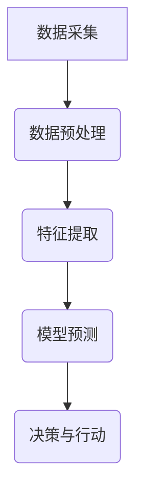
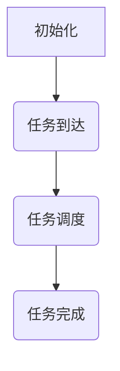

                 


## 企业AI Agent的5G边缘计算策略概述

在当今快速发展的数字化时代，企业对于人工智能（AI）的应用需求日益增长。AI Agent作为一种能够自动执行特定任务的智能实体，正在成为企业提高效率、降低成本、提升客户体验的重要工具。与此同时，第五代移动通信技术（5G）的推广，使得边缘计算成为一种重要的计算模式，能够满足低延迟、高带宽和高可靠性的计算需求。企业AI Agent与5G边缘计算的融合，成为了当前技术领域的一个热门话题。

### 问题背景

随着物联网（IoT）和大数据技术的普及，企业生成的数据量呈现爆炸式增长。然而，这些数据大多数是在网络边缘生成的，传统云计算模式难以满足实时处理的需求。这就催生了边缘计算的概念，即在网络边缘部署计算资源，以实现数据的本地处理。5G技术的到来，为边缘计算提供了更快速、更可靠的网络连接，使得边缘计算的应用场景更加广泛。

### 核心概念

**企业AI Agent**：AI Agent是一种自动化执行任务的智能实体，它能够感知环境、分析数据、做出决策并采取行动。在企业场景中，AI Agent可以用于自动化运营、客户服务、预测分析等多个领域。

**5G边缘计算**：5G边缘计算是指在网络边缘利用5G网络进行数据处理和计算的技术。它能够提供低延迟、高带宽和可靠的网络连接，使得边缘设备能够实时处理数据，从而满足实时性要求较高的应用需求。

### 融合的优势

企业AI Agent与5G边缘计算的融合，具有以下优势：

1. **实时数据处理**：AI Agent在边缘设备上实时处理数据，减少了数据传输的延迟，提高了系统的响应速度。
2. **降低成本**：边缘计算减少了数据传输的需求，降低了带宽成本，同时也减少了中心化数据处理带来的能耗。
3. **增强安全性**：数据在边缘设备上进行处理，降低了数据泄露的风险。
4. **提高灵活性**：企业可以根据具体需求，在边缘设备上部署相应的AI Agent，实现定制化的解决方案。

### 文章的核心内容和主题思想

本文将深入探讨企业AI Agent在5G边缘计算中的应用策略，从基础设施、设计与实现、应用场景、集成策略、实施与部署以及未来展望等多个方面，详细分析这一融合技术的原理和实际应用。通过逐步分析推理，我们希望能够为读者提供清晰、全面、有深度的理解，从而为企业在AI与边缘计算领域的发展提供指导。

### 目录大纲

1. **第一部分：企业AI Agent的5G边缘计算策略概述**
2. **第二部分：5G边缘计算基础设施**
   - **第2章：5G网络架构与关键技术**
   - **第3章：边缘计算节点与资源管理**
   - **第4章：边缘计算的安全性考虑**
3. **第三部分：企业AI Agent设计与实现**
   - **第5章：AI Agent的核心功能模块**
   - **第6章：AI Agent的数据处理流程**
   - **第7章：AI Agent的算法优化**
4. **第四部分：AI Agent在边缘计算中的应用场景**
   - **第8章：实时数据分析与预测**
   - **第9章：增强现实与虚拟现实应用**
   - **第10章：智能监控与自动化控制**
5. **第五部分：AI Agent与5G边缘计算的集成策略**
   - **第11章：集成架构设计与优化**
   - **第12章：资源调度与负载均衡**
   - **第13章：容错与可靠性策略**
6. **第六部分：企业AI Agent在边缘计算中的实施与部署**
   - **第14章：实施步骤与流程**
   - **第15章：部署过程中的挑战与解决方案**
   - **第16章：成功案例分析**
7. **第七部分：未来展望与趋势分析**
   - **第17章：企业AI Agent与边缘计算的发展趋势**
   - **第18章：潜在挑战与机遇**
   - **第19章：未来研究方向**

### 关键词

- 企业AI Agent
- 5G边缘计算
- 边缘节点
- 实时数据处理
- 低延迟
- 安全性
- 算法优化
- 集成策略
- 实施与部署

### 摘要

本文旨在探讨企业AI Agent在5G边缘计算中的应用策略。通过对5G边缘计算基础设施的深入分析，以及AI Agent的核心功能模块、数据处理流程和算法优化的详细讲解，本文将揭示AI Agent在边缘计算中的多种应用场景，如实时数据分析、增强现实和智能监控等。同时，本文还将探讨AI Agent与5G边缘计算的集成策略，以及其实施与部署过程中的关键挑战和解决方案。通过本文的探讨，我们希望能够为企业在AI与边缘计算领域的发展提供有价值的指导和建议。

----------------------------------------------------------------

# 企业AI Agent的5G边缘计算策略

## 第二部分：5G边缘计算基础设施

### 第2章：5G网络架构与关键技术

5G网络作为新一代移动通信技术，其架构和关键技术为边缘计算提供了坚实的基础。5G网络架构包括核心网、无线接入网和用户平面，这些组件协同工作，实现了高速、低延迟的网络连接。在本章中，我们将深入探讨5G网络架构的核心组成部分，以及关键技术在边缘计算中的应用。

### 2.1 5G网络架构

5G网络架构相比前几代移动通信网络有了显著的改进，主要体现在以下几个方面：

1. **核心网（Core Network）**：5G核心网采用了服务化架构（Service-Based Architecture，SBA），将传统的端到端网络功能分解为多个微服务。这种设计提高了网络的灵活性和可扩展性，使得不同功能模块可以独立开发、部署和升级。

2. **无线接入网（Radio Access Network，RAN）**：5G无线接入网引入了大规模天线阵列（Massive MIMO）和密集蜂窝部署（Dense Cell Deployment）技术，提高了网络容量和频谱效率。此外，5G RAN还支持非独立（NSA）和独立（SA）架构，NSA依赖于4G核心网，而SA则完全独立。

3. **用户平面（User Plane）和控制平面（Control Plane）**：5G用户平面负责数据传输，采用网络功能虚拟化（Network Functions Virtualization，NFV）技术，将传统的硬件设备功能转移到虚拟机上，实现了网络功能的灵活部署和管理。控制平面负责连接管理、资源分配和路由选择，采用基于切片管理（Network Slicing）的技术，为不同应用提供定制化的网络服务。

### 2.2 关键技术

5G网络的关键技术对边缘计算的支持至关重要，主要包括以下几个方面：

1. **低延迟**：5G网络通过优化协议栈、引入边缘计算节点，实现了低延迟通信。边缘计算节点靠近数据源，可以显著减少数据传输的延迟，满足实时性要求较高的应用需求。

2. **高带宽**：5G网络提供了极高的数据传输速率，峰值速率可达数Gbps，为边缘计算处理大规模数据提供了充足的带宽。

3. **网络切片**：网络切片技术将网络资源划分为多个独立的虚拟网络，为不同应用提供定制化的服务质量。在企业AI Agent的应用中，网络切片可以确保实时数据传输的稳定性和可靠性。

4. **大规模连接**：5G网络支持大规模设备连接，包括物联网设备、移动设备等。边缘计算节点可以处理这些设备的实时数据，提高系统的整体性能。

### 2.3 5G网络与边缘计算的关系

5G网络与边缘计算的关系可以理解为互补与协同的关系。5G网络提供了高速、低延迟的网络连接，为边缘计算提供了基础设施支持。而边缘计算则通过在靠近数据源的位置进行数据处理，减少了数据传输的延迟，提高了系统的响应速度。

**边缘计算节点与5G网络的关系**：

1. **边缘计算节点部署**：边缘计算节点可以部署在5G基站、数据中心、企业园区等地方，这些节点通过5G网络与核心网连接，实现了数据的实时传输和处理。

2. **协同工作**：边缘计算节点与5G网络协同工作，可以更好地满足实时数据处理的需求。例如，在工业自动化领域，边缘计算节点可以实时处理传感器数据，进行故障预测和设备维护，而5G网络则提供了稳定的数据传输通道。

3. **弹性扩展**：边缘计算节点可以根据应用需求动态扩展，而5G网络提供了灵活的资源分配机制，使得系统能够快速响应变化。

### 关键概念与联系

**核心概念**：

- **5G网络架构**：包括核心网、无线接入网和用户平面。
- **关键技术**：低延迟、高带宽、网络切片、大规模连接。
- **边缘计算节点**：部署在网络边缘的计算资源，用于实时数据处理。

**概念属性特征对比表格**：

| 概念           | 定义                                                         | 特点                                                         | 关联概念                           |
|----------------|--------------------------------------------------------------|--------------------------------------------------------------|-----------------------------------|
| 5G网络架构     | 新一代移动通信网络架构，包括核心网、无线接入网和用户平面。   | 高速、低延迟、网络切片、大规模连接。                             | 核心网、无线接入网、用户平面      |
| 关键技术       | 5G网络中的核心技术，如低延迟、高带宽、网络切片等。           | 提高网络性能、优化资源分配、满足多样化需求。                             | 低延迟、高带宽、网络切片、大规模连接 |
| 边缘计算节点   | 部署在网络边缘的计算资源，用于实时数据处理。                 | 本地化处理、低延迟、高响应速度。                                 | 数据中心、5G网络、物联网          |

### ER实体关系图架构

```mermaid
erDiagram
    5G-Network ||--|{ Core-Network }|-- Core-Network
    5G-Network ||--|{ Radio-Access-Network }|-- Radio-Access-Network
    5G-Network ||--|{ User-Plane }|-- User-Plane
    Edge-Compute-Node ||--|{ 5G-Network }|-- Radio-Access-Network
    Edge-Compute-Node ||--|{ Data-Processing }|-- Data-Set
```

### 算法原理讲解

5G网络与边缘计算的结合，为实时数据处理提供了强大的支持。下面我们将介绍一个简单的实时数据处理算法，并使用Mermaid和Python代码进行讲解。

#### 实时数据处理算法

实时数据处理算法主要包括以下步骤：

1. **数据采集**：从边缘设备收集数据。
2. **数据预处理**：清洗和规范化数据。
3. **特征提取**：提取数据的关键特征。
4. **模型预测**：使用机器学习模型进行预测。
5. **决策与行动**：根据预测结果采取相应的行动。

下面是使用Mermaid绘制的算法流程图：



#### Python代码示例

```python
import pandas as pd
from sklearn.ensemble import RandomForestRegressor
from sklearn.model_selection import train_test_split
from sklearn.metrics import mean_squared_error

# 数据采集
data = pd.read_csv('edge_device_data.csv')

# 数据预处理
data = data.dropna()

# 特征提取
X = data.drop('target', axis=1)
y = data['target']

# 模型预测
X_train, X_test, y_train, y_test = train_test_split(X, y, test_size=0.2, random_state=42)
model = RandomForestRegressor(n_estimators=100)
model.fit(X_train, y_train)

# 决策与行动
y_pred = model.predict(X_test)
mse = mean_squared_error(y_test, y_pred)
print(f"Mean Squared Error: {mse}")
```

在这个例子中，我们使用随机森林回归模型进行预测。数据采集、预处理和特征提取是边缘计算中的关键步骤，而模型训练和预测则是实时数据处理的核心。

#### 数学公式

实时数据处理算法涉及到多种数学模型和公式，如回归模型、分类模型等。下面我们给出一个简单的线性回归模型公式：

$$ y = \beta_0 + \beta_1x_1 + \beta_2x_2 + ... + \beta_nx_n $$

其中，$y$ 是预测值，$x_1, x_2, ..., x_n$ 是特征值，$\beta_0, \beta_1, \beta_2, ..., \beta_n$ 是模型参数。

### 总结

5G网络架构和关键技术为边缘计算提供了坚实的基础，边缘计算节点则通过网络切片、低延迟和高带宽等技术，实现了实时数据处理和智能决策。在接下来的章节中，我们将进一步探讨边缘计算节点的资源管理、安全性和企业AI Agent的设计与实现。

----------------------------------------------------------------

## 第3章：边缘计算节点与资源管理

边缘计算节点是边缘计算体系结构的核心组成部分，承担着实时数据处理、智能决策和快速响应的重要任务。为了确保边缘计算节点的有效运行，资源管理和优化成为了关键问题。本章将详细讨论边缘计算节点的资源管理，包括硬件资源、软件资源以及资源调度与优化策略。

### 3.1 硬件资源管理

边缘计算节点的硬件资源主要包括处理器、内存、存储和网络设备。硬件资源管理的主要目标是最大化资源利用率，同时保证系统的稳定性和可靠性。

1. **处理器资源管理**：处理器是边缘计算节点的核心资源，其性能直接影响系统的响应速度和处理能力。处理器资源管理主要包括任务调度、负载均衡和性能监控。

   - **任务调度**：任务调度算法根据任务的优先级、执行时间和资源需求，将任务分配给处理器。常见的调度算法包括轮转调度（Round-Robin）、优先级调度（Priority Scheduling）和基于实时性的调度算法。
   - **负载均衡**：负载均衡算法通过在多个处理器之间分配任务，避免单个处理器过载，提高系统的整体性能。常见的负载均衡算法包括静态负载均衡和动态负载均衡。
   - **性能监控**：性能监控工具实时监测处理器的使用情况，包括CPU利用率、温度和功耗等，及时发现和处理异常情况。

2. **内存资源管理**：内存资源管理旨在确保系统内存的有效利用，避免内存溢出和碎片化。内存资源管理包括内存分配、回收和缓存策略。

   - **内存分配**：内存分配算法根据任务的需求动态分配内存，确保每个任务都有足够的内存资源。
   - **内存回收**：内存回收算法定期清理不再使用的内存，释放内存资源以供其他任务使用。
   - **缓存策略**：缓存策略通过将常用数据存储在高速缓存中，减少内存访问时间，提高系统性能。

3. **存储资源管理**：存储资源管理涉及存储设备的分配、管理和优化。边缘计算节点通常需要处理大量数据，因此高效的存储管理至关重要。

   - **存储分配**：存储分配算法根据数据类型、访问频率和存储需求，将数据存储在合适的存储设备上。
   - **存储优化**：存储优化策略包括数据压缩、去重和分层存储等，以减少存储空间的需求和提高数据访问速度。
   - **数据备份与恢复**：数据备份与恢复策略确保在存储设备故障时，能够迅速恢复数据，保障系统的连续运行。

### 3.2 软件资源管理

边缘计算节点的软件资源管理主要包括操作系统、中间件和应用程序的管理。软件资源管理的目标是提高系统的稳定性、可靠性和效率。

1. **操作系统管理**：操作系统是边缘计算节点的核心软件，负责硬件资源的管理和任务的调度。操作系统管理包括启动、停止和监控操作系统进程，以及优化操作系统性能。

   - **进程管理**：进程管理包括进程的创建、调度、同步和终止等，确保系统的稳定运行。
   - **内存管理**：内存管理负责分配和回收内存资源，优化内存使用效率。
   - **文件系统管理**：文件系统管理涉及文件和目录的创建、读写和删除等操作，确保数据的完整性和安全性。

2. **中间件管理**：中间件是边缘计算节点中用于支持应用程序开发、部署和运行的关键组件。中间件管理包括中间件的安装、配置、监控和升级等。

   - **服务注册与发现**：服务注册与发现机制确保中间件组件能够自动发现和连接其他组件，提高系统的灵活性和可扩展性。
   - **负载均衡**：负载均衡中间件通过在多个边缘计算节点之间分配任务，提高系统的处理能力和容错能力。
   - **安全性与可靠性**：安全性与可靠性中间件提供数据加密、认证和授权等功能，确保系统的安全运行。

3. **应用程序管理**：应用程序管理涉及应用程序的部署、运行和监控。有效的应用程序管理可以提高系统的效率和用户体验。

   - **自动化部署**：自动化部署工具可以快速部署应用程序，减少手动操作，提高部署效率。
   - **容器化**：容器化技术将应用程序及其依赖环境打包成独立的容器，提高系统的可移植性和可扩展性。
   - **监控与告警**：监控与告警工具实时监测应用程序的性能和健康状态，及时发现和处理异常情况。

### 3.3 资源调度与优化策略

资源调度与优化策略是边缘计算节点高效运行的关键。资源调度策略旨在根据任务需求和系统状态，合理分配和调度资源，提高系统的性能和效率。

1. **动态调度策略**：动态调度策略根据实时任务需求和系统负载，动态调整资源分配。常见的动态调度策略包括基于负载的调度、基于时间的调度和基于优先级的调度。

   - **基于负载的调度**：根据系统当前负载，将任务分配到负载较低的边缘计算节点，避免单个节点过载。
   - **基于时间的调度**：根据任务的截止时间和优先级，合理安排任务的执行顺序，确保关键任务的及时完成。
   - **基于优先级的调度**：根据任务的优先级，优先执行高优先级任务，提高系统的响应速度。

2. **负载均衡策略**：负载均衡策略通过在多个边缘计算节点之间分配任务，避免单个节点过载，提高系统的处理能力和容错能力。

   - **静态负载均衡**：静态负载均衡根据预定义的规则，将任务分配到不同的边缘计算节点，适用于负载稳定的情况。
   - **动态负载均衡**：动态负载均衡根据实时任务需求和系统负载，动态调整任务分配，适用于负载变化频繁的情况。

3. **资源优化策略**：资源优化策略通过优化资源配置，提高系统的资源利用率和运行效率。

   - **资源预留**：资源预留策略为关键任务预留足够的资源，确保任务能够按时完成。
   - **资源弹性扩展**：资源弹性扩展策略根据任务需求动态调整资源分配，提高系统的可扩展性和灵活性。
   - **资源回收**：资源回收策略定期回收未使用的资源，提高系统的资源利用率。

### 关键概念与联系

**核心概念**：

- **边缘计算节点**：部署在网络边缘的计算资源，用于实时数据处理和智能决策。
- **硬件资源管理**：处理器、内存、存储等硬件资源的管理。
- **软件资源管理**：操作系统、中间件和应用程序的管理。
- **资源调度与优化策略**：根据任务需求和系统状态，合理分配和调度资源，提高系统性能和效率。

**概念属性特征对比表格**：

| 概念           | 定义                                                         | 特点                                                         | 关联概念                           |
|----------------|--------------------------------------------------------------|--------------------------------------------------------------|-----------------------------------|
| 边缘计算节点   | 部署在网络边缘的计算资源，用于实时数据处理和智能决策。       | 本地化、低延迟、高响应速度。                                 | 数据中心、5G网络、物联网          |
| 硬件资源管理   | 处理器、内存、存储等硬件资源的管理。                       | 最大化资源利用率、保证系统稳定性。                             | 负载均衡、资源调度、性能监控      |
| 软件资源管理   | 操作系统、中间件和应用程序的管理。                         | 稳定性、可靠性、高效性。                                     | 容器化、服务注册与发现、监控与告警 |
| 资源调度与优化 | 根据任务需求和系统状态，合理分配和调度资源，提高系统性能。 | 动态调整、负载均衡、资源预留。                               | 负载均衡、资源预留、弹性扩展      |

### ER实体关系图架构

```mermaid
erDiagram
    Edge-Compute-Node ||--|{ Hardware-Resource }|-- Processor
    Edge-Compute-Node ||--|{ Hardware-Resource }|-- Memory
    Edge-Compute-Node ||--|{ Hardware-Resource }|-- Storage
    Edge-Compute-Node ||--|{ Software-Resource }|-- Operating-System
    Edge-Compute-Node ||--|{ Software-Resource }|-- Middleware
    Edge-Compute-Node ||--|{ Software-Resource }|-- Application
    Resource-Scheduling ||--|{ Edge-Compute-Node }|-- Task-Allocation
```

### 算法原理讲解

边缘计算节点的资源管理和调度涉及到多种算法，如任务调度算法、负载均衡算法和资源优化算法。下面我们将介绍一种基于优先级的任务调度算法，并使用Mermaid和Python代码进行讲解。

#### 基于优先级的任务调度算法

基于优先级的任务调度算法根据任务的优先级进行调度，优先执行高优先级任务。任务的优先级可以根据任务的紧急程度、截止时间和资源需求进行设定。

**算法流程**：

1. **初始化**：设定任务的优先级，初始化任务队列。
2. **任务到达**：当任务到达时，将其插入任务队列。
3. **任务调度**：根据任务优先级，从任务队列中取出最高优先级任务进行执行。
4. **任务完成**：任务执行完成后，从任务队列中移除该任务。

下面是使用Mermaid绘制的算法流程图：



#### Python代码示例

```python
import heapq
import time

class Task:
    def __init__(self, id, priority):
        self.id = id
        self.priority = priority

    def __lt__(self, other):
        return self.priority < other.priority

def schedule_tasks(tasks):
    task_queue = []
    for task in tasks:
        heapq.heappush(task_queue, task)

    while task_queue:
        current_task = heapq.heappop(task_queue)
        print(f"执行任务：{current_task.id}")
        time.sleep(current_task.priority)  # 模拟任务执行时间
        print(f"任务完成：{current_task.id}")

# 任务示例
tasks = [
    Task(1, 3),
    Task(2, 1),
    Task(3, 2),
]

schedule_tasks(tasks)
```

在这个例子中，我们定义了一个`Task`类，用于表示任务及其优先级。使用`heapq`模块实现了一个基于优先级的任务队列，并使用Python的`heapq.heappop()`方法取出最高优先级任务进行执行。

#### 数学公式

任务调度算法涉及到优先级的比较和排序，下面给出一个简单的优先级队列的数学模型：

$$ P(i) = \sum_{j=1}^{n} p_j \cdot w_j $$

其中，$P(i)$ 表示第 $i$ 个任务的优先级，$p_j$ 表示第 $j$ 个任务的权重，$w_j$ 表示第 $j$ 个任务的优先级权重。

### 总结

边缘计算节点的资源管理是边缘计算体系结构中的关键环节，涉及到硬件资源、软件资源以及资源调度与优化策略。有效的资源管理和调度策略可以提高系统的性能和可靠性，为企业的AI应用提供坚实的支持。在接下来的章节中，我们将进一步探讨边缘计算节点的安全性以及企业AI Agent的设计与实现。

----------------------------------------------------------------

## 第4章：边缘计算的安全性考虑

随着企业对AI Agent在边缘计算中的应用越来越广泛，安全性问题成为了至关重要的议题。边缘计算节点分布在网络边缘，直接面对海量的数据和处理任务，这为恶意攻击提供了潜在的机会。本章将深入探讨边缘计算节点的安全性考虑，包括安全威胁、常见攻击手段、防御策略和加密技术。

### 4.1 安全威胁分析

边缘计算节点的安全威胁可以分为以下几类：

1. **数据泄露**：数据在传输和存储过程中可能被窃取或篡改，导致敏感信息泄露。
2. **拒绝服务攻击（DDoS）**：攻击者通过大量恶意流量使边缘计算节点无法正常服务，从而影响系统的可用性。
3. **恶意软件感染**：恶意软件（如病毒、木马）可以通过网络传播，影响边缘计算节点的正常运行。
4. **侧信道攻击**：攻击者通过分析边缘计算节点的功耗、电磁辐射等信号，获取敏感信息。
5. **未授权访问**：未经授权的用户或设备访问边缘计算节点，可能导致数据泄露或系统被破坏。

### 4.2 常见攻击手段

边缘计算节点面临的攻击手段多种多样，以下是一些常见的攻击手段：

1. **网络钓鱼**：攻击者通过伪造网站、发送虚假邮件等方式，诱骗用户输入账号密码，从而获取访问权限。
2. **中间人攻击（MITM）**：攻击者在数据传输过程中窃取或篡改数据，从而获取敏感信息。
3. **分布式拒绝服务（DDoS）**：攻击者利用大量僵尸主机发送大量恶意请求，使边缘计算节点无法正常服务。
4. **代码注入**：攻击者通过注入恶意代码，篡改边缘计算节点的程序代码，从而获取控制权。
5. **物理攻击**：攻击者直接接触边缘计算节点，通过物理手段窃取数据或破坏设备。

### 4.3 防御策略

为了保障边缘计算节点的安全性，可以采取以下防御策略：

1. **访问控制**：通过身份认证、权限管理和访问控制列表（ACL）等方式，限制未授权用户的访问。
2. **防火墙和入侵检测系统**：部署防火墙和入侵检测系统（IDS），实时监控网络流量，阻止恶意流量进入边缘计算节点。
3. **加密技术**：使用加密技术保护数据在传输和存储过程中的安全性，包括数据加密、传输加密和存储加密。
4. **漏洞管理**：定期更新和修补系统漏洞，防止攻击者利用已知漏洞进行攻击。
5. **安全审计**：定期进行安全审计，检查系统的安全配置和运行状态，及时发现和解决安全隐患。

### 4.4 加密技术

加密技术是保障边缘计算节点安全的重要手段，以下介绍几种常见的加密技术：

1. **对称加密**：对称加密算法使用相同的密钥进行加密和解密，如AES（高级加密标准）。对称加密速度快，但密钥管理复杂。
2. **非对称加密**：非对称加密算法使用一对公钥和私钥进行加密和解密，如RSA（Rivest-Shamir-Adleman）。非对称加密安全性强，但计算复杂度高。
3. **哈希函数**：哈希函数用于生成数据的摘要，如SHA-256。哈希函数可以验证数据的完整性，但无法解密数据。
4. **数字签名**：数字签名用于验证数据的真实性和完整性，如ECDSA（椭圆曲线数字签名算法）。数字签名可以防止数据被篡改，但无法加密数据。

### 关键概念与联系

**核心概念**：

- **数据泄露**：敏感数据在传输和存储过程中被窃取或篡改。
- **拒绝服务攻击（DDoS）**：通过恶意流量使边缘计算节点无法正常服务。
- **恶意软件感染**：恶意软件感染边缘计算节点，影响系统正常运行。
- **侧信道攻击**：通过分析边缘计算节点的功耗、电磁辐射等信号，获取敏感信息。
- **访问控制**：通过身份认证、权限管理和访问控制列表（ACL）等方式，限制未授权用户的访问。

**概念属性特征对比表格**：

| 概念           | 定义                                                         | 特点                                                         | 关联概念                           |
|----------------|--------------------------------------------------------------|--------------------------------------------------------------|-----------------------------------|
| 数据泄露       | 敏感数据在传输和存储过程中被窃取或篡改。                     | 高风险、高破坏性。                                           | 加密技术、访问控制、安全审计      |
| 拒绝服务攻击   | 通过恶意流量使边缘计算节点无法正常服务。                     | 大规模、破坏性强。                                           | 防火墙、入侵检测系统、DDoS防护   |
| 恶意软件感染   | 恶意软件感染边缘计算节点，影响系统正常运行。                 | 窃取信息、破坏系统。                                         | 漏洞管理、病毒扫描、安全更新      |
| 侧信道攻击     | 通过分析边缘计算节点的功耗、电磁辐射等信号，获取敏感信息。   | 高技术、隐蔽性强。                                           | 加密技术、安全审计、防护措施      |
| 访问控制       | 通过身份认证、权限管理和访问控制列表（ACL）等方式，限制未授权用户的访问。 | 精细管理、安全性高。                                         | 身份认证、权限管理、安全审计      |

### ER实体关系图架构

```mermaid
erDiagram
    Data-Leak ||--|{ Encryption-Technology }|-- Data-Encryption
    DDoS-Attack ||--|{ Network-Security }|-- Firewall
    Malware-Infection ||--|{ Vulnerability-Management }|-- Patching
    Side-Channel-Attack ||--|{ Cryptography }|-- Power-Analysis
    Unauthorized-Access ||--|{ Access-Control }|-- Authentication
```

### 算法原理讲解

为了更好地理解加密技术在边缘计算安全性中的应用，我们介绍一个简单的加密算法——RSA加密算法，并使用Python代码进行演示。

#### RSA加密算法

RSA加密算法是一种非对称加密算法，使用一对密钥（公钥和私钥）进行加密和解密。公钥用于加密数据，私钥用于解密数据。RSA算法的加密和解密过程如下：

**加密过程**：

1. 选择两个大素数 $p$ 和 $q$，计算 $n = p \times q$。
2. 计算 $n$ 的欧拉函数 $\phi = (p-1)(q-1)$。
3. 选择一个整数 $e$，满足 $1 < e < \phi$ 且 $e$ 与 $\phi$ 互质。
4. 计算 $d$，满足 $d \times e \equiv 1 \pmod{\phi}$。
5. 公钥 $(n, e)$，私钥 $(n, d)$。

**解密过程**：

1. 接收加密消息 $c$。
2. 计算 $m = c^d \pmod{n}$。

下面是使用Python实现的RSA加密算法：

```python
import sympy

def generate_rsa_keys():
    p = sympy.randprime(2**1024, 2**1025)
    q = sympy.randprime(2**1024, 2**1025)
    n = p * q
    phi = (p-1) * (q-1)
    e = sympy.randprime(2, phi-1)
    d = sympy.invert_mod(e, phi)
    return n, e, d

def rsa_encrypt(message, public_key):
    n, e = public_key
    ciphertext = pow(message, e, n)
    return ciphertext

def rsa_decrypt(ciphertext, private_key):
    n, d = private_key
    plaintext = pow(ciphertext, d, n)
    return plaintext

# 生成RSA密钥对
public_key, private_key = generate_rsa_keys()

# 加密消息
message = 12345
ciphertext = rsa_encrypt(message, public_key)
print(f"加密消息：{ciphertext}")

# 解密消息
plaintext = rsa_decrypt(ciphertext, private_key)
print(f"解密消息：{plaintext}")
```

在这个例子中，我们首先生成RSA密钥对，然后使用公钥加密消息，最后使用私钥解密消息。

#### 数学公式

RSA加密算法涉及到大量的数学公式，如欧拉函数、模运算、逆元等。以下是RSA加密算法中的一些关键数学公式：

$$ n = p \times q $$

$$ \phi = (p-1)(q-1) $$

$$ e \times d \equiv 1 \pmod{\phi} $$

$$ c = m^e \pmod{n} $$

$$ m = c^d \pmod{n} $$

### 总结

边缘计算节点的安全性是确保系统正常运行和数据安全的关键。通过分析安全威胁、了解常见攻击手段，并采用防御策略和加密技术，可以有效保障边缘计算节点的安全。在接下来的章节中，我们将进一步探讨企业AI Agent的核心功能模块及其设计原理。

----------------------------------------------------------------

## 第5章：企业AI Agent的核心功能模块

企业AI Agent是一种能够自动执行特定任务的智能实体，其设计包括多个核心功能模块，这些模块协同工作，实现高效的智能决策和自动化操作。本章将详细介绍企业AI Agent的核心功能模块，包括感知模块、决策模块和行动模块，并探讨每个模块的作用和实现方法。

### 5.1 感知模块

感知模块是AI Agent的“感官”，负责收集和处理来自环境的数据。感知模块的主要功能包括数据采集、数据预处理和特征提取。

1. **数据采集**：感知模块从各种数据源（如传感器、摄像头、数据库等）采集数据。数据源的类型和数量取决于应用场景，例如，在工业自动化领域，感知模块可能从传感器采集温度、湿度、压力等物理量；在智能交通领域，感知模块可能从摄像头采集车辆和行人的运动轨迹。

2. **数据预处理**：采集到的数据通常包含噪声和不完整的信息，因此需要进行预处理。数据预处理包括数据清洗、数据转换和数据标准化等步骤。数据清洗旨在去除噪声和错误数据，数据转换将数据转换为统一的格式，数据标准化则将数据缩放到合适的范围。

3. **特征提取**：特征提取是将原始数据转换为有意义的信息，用于后续的决策过程。特征提取方法包括统计学方法（如均值、方差）、机器学习方法（如主成分分析、特征选择）和深度学习方法（如卷积神经网络、循环神经网络）。特征提取的质量直接影响决策模块的性能。

### 5.2 决策模块

决策模块是AI Agent的“大脑”，负责分析感知模块收集到的数据，并做出相应的决策。决策模块通常包括数据分析、模型训练和预测等步骤。

1. **数据分析**：数据分析是对收集到的数据进行分析和挖掘，以发现数据中的模式和关系。数据分析方法包括描述性统计、相关性分析、聚类分析和关联规则挖掘等。描述性统计用于了解数据的总体分布和趋势，相关性分析用于发现数据之间的相互关系，聚类分析用于将数据划分为不同的群体，关联规则挖掘用于发现数据之间的关联规律。

2. **模型训练**：模型训练是指使用机器学习算法对数据进行训练，建立预测模型。常见的机器学习算法包括线性回归、决策树、支持向量机、神经网络等。模型训练的过程包括数据划分、模型选择、参数调优和模型评估等步骤。数据划分将数据分为训练集和测试集，用于训练和评估模型的性能；模型选择是根据问题特点选择合适的算法；参数调优是通过调整算法参数，提高模型的预测性能；模型评估是通过测试集评估模型的表现，选择最优模型。

3. **预测**：预测是利用训练好的模型对新的数据进行预测。预测结果可以用于决策模块，指导AI Agent采取行动。预测方法包括回归预测、分类预测和时序预测等。回归预测用于预测连续值，分类预测用于预测离散类别，时序预测用于预测时间序列数据。

### 5.3 行动模块

行动模块是AI Agent的“执行器”，负责根据决策模块的决策结果采取行动。行动模块通常包括以下步骤：

1. **决策执行**：决策执行是将决策结果转化为具体的行动指令。例如，在智能交通领域，决策模块预测出即将发生交通拥堵，行动模块可以发送指令给智能信号灯，调整信号灯的周期和时长，以缓解交通压力。

2. **反馈调整**：行动执行后，感知模块会收集行动结果的数据，并反馈给决策模块。决策模块根据反馈结果对决策进行调整，以实现更好的行动效果。反馈调整是一个闭环控制过程，通过不断地调整和优化，实现AI Agent的智能化和自适应化。

### 关键概念与联系

**核心概念**：

- **感知模块**：数据采集、数据预处理和特征提取。
- **决策模块**：数据分析、模型训练和预测。
- **行动模块**：决策执行和反馈调整。

**概念属性特征对比表格**：

| 概念           | 定义                                                         | 特点                                                         | 关联概念                           |
|----------------|--------------------------------------------------------------|--------------------------------------------------------------|-----------------------------------|
| 感知模块       | 负责收集和处理来自环境的数据。                               | 数据采集、数据预处理、特征提取。                             | 数据源、传感器、摄像头、数据库    |
| 决策模块       | 负责分析感知模块收集到的数据，并做出决策。                   | 数据分析、模型训练、预测。                                   | 机器学习、深度学习、预测模型     |
| 行动模块       | 负责根据决策模块的决策结果采取行动。                         | 决策执行、反馈调整。                                         | 执行器、闭环控制、自适应化       |

### ER实体关系图架构

```mermaid
erDiagram
    Perception-Module ||--|{ Data-Collection }|-- Data-Source
    Perception-Module ||--|{ Data-Processing }|-- Preprocessing
    Perception-Module ||--|{ Feature-Extraction }|-- Feature-Set
    Decision-Module ||--|{ Data-Analysis }|-- Data-Set
    Decision-Module ||--|{ Model-Training }|-- Model-Set
    Decision-Module ||--|{ Prediction }|-- Predicted-Result
    Action-Module ||--|{ Decision-Execution }|-- Action-Command
    Action-Module ||--|{ Feedback-Adjustment }|-- Feedback-Data
```

### 算法原理讲解

为了深入理解企业AI Agent的核心功能模块，我们将介绍一个简单的决策树算法，并使用Python代码进行演示。

#### 决策树算法

决策树是一种常见的机器学习算法，用于分类和回归任务。决策树通过一系列的判断条件，将数据集划分为多个子集，并在每个子集中做出预测。以下是决策树的基本原理和步骤：

1. **选择最优特征**：在当前节点上选择具有最大信息增益或最小信息增益比的属性作为划分依据。
2. **划分数据集**：根据所选特征，将数据集划分为多个子集。
3. **递归构建**：对每个子集递归执行上述步骤，直到满足停止条件（如最大树深度、最小样本数等）。
4. **预测**：在叶子节点上做出预测，通常使用多数投票或平均值等方法。

下面是使用Python实现的决策树算法：

```python
from sklearn.datasets import load_iris
from sklearn.tree import DecisionTreeClassifier
from sklearn.model_selection import train_test_split
from sklearn.metrics import accuracy_score

# 加载鸢尾花数据集
iris = load_iris()
X, y = iris.data, iris.target

# 数据集划分
X_train, X_test, y_train, y_test = train_test_split(X, y, test_size=0.3, random_state=42)

# 训练决策树模型
clf = DecisionTreeClassifier()
clf.fit(X_train, y_train)

# 预测
y_pred = clf.predict(X_test)

# 评估模型
accuracy = accuracy_score(y_test, y_pred)
print(f"模型准确率：{accuracy}")
```

在这个例子中，我们使用鸢尾花数据集训练一个决策树模型，并评估模型的准确率。

#### 数学公式

决策树算法的核心是信息增益和信息增益比。以下是相关信息熵和条件熵的公式：

$$ H(X) = -\sum_{i} p(x_i) \cdot \log_2 p(x_i) $$

$$ H(X|Y) = -\sum_{i} p(y_i) \sum_{j} p(x_j|y_i) \cdot \log_2 p(x_j|y_i) $$

$$ I(X;Y) = H(X) - H(X|Y) $$

$$ Gain(D,A) = H(D) - \sum_{v \in V} p(v) \cdot H(D|A=v) $$

$$ Gain_Ratio(D,A) = \frac{Gain(D,A)}{\sum_{v \in V} p(v) \cdot H(D|A=v)} $$

### 总结

企业AI Agent的核心功能模块包括感知模块、决策模块和行动模块，这些模块协同工作，实现高效的智能决策和自动化操作。在接下来的章节中，我们将进一步探讨AI Agent在边缘计算中的数据处理流程和算法优化方法。

----------------------------------------------------------------

## 第6章：企业AI Agent的数据处理流程

企业AI Agent的数据处理流程是其核心功能的实现基础，涉及到数据采集、数据预处理、数据存储、数据分析和数据可视化等多个步骤。本章将详细讨论这些数据处理流程，并介绍相关技术和工具。

### 6.1 数据采集

数据采集是数据处理流程的第一步，也是关键一步。采集的数据质量直接影响到后续数据处理和分析的准确性。数据采集可以从多种数据源获取，如传感器、数据库、网络接口等。

1. **传感器数据采集**：传感器数据通常包括温度、湿度、压力、光线等物理量的实时数据。采集传感器数据需要考虑数据的频率、精度和可靠性。

2. **数据库数据采集**：数据库数据可以通过数据库连接接口进行采集，如SQL数据库、NoSQL数据库等。采集数据库数据需要关注数据的一致性和完整性。

3. **网络接口数据采集**：网络接口数据可以通过网络协议解析获取，如HTTP请求、WebSocket消息等。采集网络接口数据需要处理网络延迟和异常情况。

### 6.2 数据预处理

数据预处理是数据处理流程的核心步骤，目的是提高数据的质量和可用性，为后续分析提供可靠的数据基础。数据预处理包括数据清洗、数据转换和数据标准化等步骤。

1. **数据清洗**：数据清洗旨在去除数据中的噪声和错误数据，包括缺失值填充、异常值处理和重复值删除等。

2. **数据转换**：数据转换是将数据转换为统一格式和类型，如将字符串转换为数字、将不同单位的数据统一等。

3. **数据标准化**：数据标准化是将数据缩放到合适的范围，如将数值数据缩放到[0, 1]区间，以便进行后续的机器学习建模。

### 6.3 数据存储

数据存储是数据处理流程的重要环节，涉及数据的持久化和管理。数据存储可以选择关系数据库、NoSQL数据库、文件系统等不同类型的存储方案。

1. **关系数据库**：关系数据库（如MySQL、PostgreSQL）适合存储结构化数据，支持复杂查询和事务处理。

2. **NoSQL数据库**：NoSQL数据库（如MongoDB、Cassandra）适合存储半结构化或非结构化数据，支持高扩展性和高性能。

3. **文件系统**：文件系统（如HDFS）适合存储大规模数据集，支持数据的分布式存储和并行处理。

### 6.4 数据分析

数据分析是对采集和预处理后的数据进行深入分析和挖掘，以发现数据中的模式和规律。数据分析可以采用统计学方法、机器学习方法和深度学习方法等。

1. **统计学方法**：统计学方法包括描述性统计、相关性分析和回归分析等，用于了解数据的总体分布和关系。

2. **机器学习方法**：机器学习方法包括分类、回归、聚类和降维等，用于建立预测模型和发现数据中的模式。

3. **深度学习方法**：深度学习方法包括卷积神经网络（CNN）、循环神经网络（RNN）和生成对抗网络（GAN）等，用于处理复杂数据和高维数据。

### 6.5 数据可视化

数据可视化是将数据分析的结果以图形化的方式呈现，帮助用户直观地理解数据和分析结果。数据可视化可以使用各种图表和图形，如柱状图、折线图、散点图、热力图等。

1. **图表工具**：图表工具（如Matplotlib、Seaborn）可以生成各种常见的统计图表，支持自定义样式和交互功能。

2. **交互式可视化**：交互式可视化（如Tableau、Power BI）提供丰富的交互功能，用户可以通过拖拽、筛选和缩放等方式动态查看数据。

### 关键概念与联系

**核心概念**：

- **数据采集**：传感器数据、数据库数据、网络接口数据。
- **数据预处理**：数据清洗、数据转换、数据标准化。
- **数据存储**：关系数据库、NoSQL数据库、文件系统。
- **数据分析**：统计学方法、机器学习方法、深度学习方法。
- **数据可视化**：图表工具、交互式可视化。

**概念属性特征对比表格**：

| 概念           | 定义                                                         | 特点                                                         | 关联概念                           |
|----------------|--------------------------------------------------------------|--------------------------------------------------------------|-----------------------------------|
| 数据采集       | 从传感器、数据库和网络接口等数据源获取数据。                 | 实时性、多样性、复杂性。                                     | 传感器、数据库、网络接口          |
| 数据预处理     | 提高数据质量，为数据分析提供可靠数据基础。                   | 数据清洗、数据转换、数据标准化。                             | 缺失值填充、异常值处理、数据转换 |
| 数据存储       | 将处理后的数据存储到数据库或文件系统中。                     | 结构化、半结构化、非结构化。                                 | 关系数据库、NoSQL数据库、文件系统 |
| 数据分析       | 对采集和预处理后的数据进行深入分析和挖掘。                   | 统计学方法、机器学习方法、深度学习方法。                     | 描述性统计、分类、回归、聚类     |
| 数据可视化     | 将数据分析结果以图形化的方式呈现，帮助用户直观理解数据。   | 图表工具、交互式可视化。                                     | Matplotlib、Seaborn、Tableau      |

### ER实体关系图架构

```mermaid
erDiagram
    Data-Collection ||--|{ Sensor-Data }|-- Sensors
    Data-Collection ||--|{ Database-Data }|-- Databases
    Data-Collection ||--|{ Network-Data }|-- Network-Interfaces
    Data-Preprocessing ||--|{ Data-Cleaning }|-- Missing-Values
    Data-Preprocessing ||--|{ Data-Transformation }|-- Data-Types
    Data-Preprocessing ||--|{ Data-Standardization }|-- Data-Range
    Data-Storage ||--|{ Relational-DB }|-- MySQL
    Data-Storage ||--|{ NoSQL-DB }|-- MongoDB
    Data-Storage ||--|{ File-System }|-- HDFS
    Data-Analysis ||--|{ Statistical-Method }|-- Descriptive-Statistics
    Data-Analysis ||--|{ Machine-Learning }|-- Classification
    Data-Analysis ||--|{ Deep-Learning }|-- Neural-Networks
    Data-Visualization ||--|{ Chart-Tool }|-- Matplotlib
    Data-Visualization ||--|{ Interactive-Visualization }|-- Tableau
```

### 算法原理讲解

为了深入理解企业AI Agent的数据处理流程，我们将介绍一个简单的K-Means聚类算法，并使用Python代码进行演示。

#### K-Means算法

K-Means是一种常见的聚类算法，用于将数据分为K个簇。算法的基本思想是：初始化K个簇的中心点，然后迭代更新中心点和数据点分配，直到算法收敛。

1. **初始化**：随机选择K个数据点作为初始簇中心点。
2. **分配**：对于每个数据点，计算其到各个簇中心点的距离，将其分配到最近的簇。
3. **更新**：重新计算各个簇的中心点，通常取簇内所有数据点的平均值。
4. **迭代**：重复分配和更新步骤，直到聚类结果收敛（如迭代次数达到最大值或簇中心点变化小于某个阈值）。

下面是使用Python实现的K-Means算法：

```python
from sklearn.cluster import KMeans
import numpy as np

# 生成模拟数据
X = np.random.rand(100, 2)

# 初始化K-Means算法
kmeans = KMeans(n_clusters=3, random_state=0)

# 训练模型
kmeans.fit(X)

# 预测簇标签
labels = kmeans.predict(X)

# 输出聚类结果
print(f"聚类中心点：{kmeans.cluster_centers_}")
print(f"簇标签：{labels}")
```

在这个例子中，我们生成了一组模拟数据，并使用K-Means算法进行聚类。我们初始化了3个簇，并输出聚类中心点和簇标签。

#### 数学公式

K-Means算法涉及到距离计算和中心点更新等数学公式。以下是K-Means算法中的一些关键数学公式：

$$ d(\text{data point}, \text{cluster center}) = \sqrt{\sum_{i=1}^{n} (x_i - \mu_i)^2} $$

$$ \mu_i = \frac{1}{N} \sum_{j=1}^{N} x_{ij} $$

其中，$d$ 表示数据点到簇中心点的距离，$\mu_i$ 表示簇中心点的坐标，$x_i$ 表示数据点的坐标，$N$ 表示簇内的数据点数量。

### 总结

企业AI Agent的数据处理流程包括数据采集、数据预处理、数据存储、数据分析和数据可视化等多个步骤。通过有效的数据处理，企业AI Agent可以更好地理解和分析数据，为决策和行动提供有力支持。在接下来的章节中，我们将探讨企业AI Agent的算法优化策略，以进一步提高其性能和效率。

----------------------------------------------------------------

## 第7章：企业AI Agent的算法优化

在边缘计算环境中，企业AI Agent的性能和效率直接影响到系统的实时响应能力和可靠性。为了充分发挥边缘计算节点的资源优势，优化算法成为了关键环节。本章将详细探讨企业AI Agent的算法优化策略，包括模型压缩、量化、迁移学习和联邦学习等。

### 7.1 模型压缩

模型压缩是减小模型大小和降低计算复杂度的技术，旨在提高AI Agent在边缘计算环境中的运行效率。常见的模型压缩方法包括：

1. **剪枝（Pruning）**：剪枝通过移除模型中不重要的权重和神经元，减少模型的参数数量。剪枝方法可以分为结构剪枝和权重剪枝。结构剪枝直接移除整个网络结构，如稀疏网络；权重剪枝则移除权重较小的神经元。
2. **量化（Quantization）**：量化是将模型中的浮点数权重转换为较低精度的整数表示。量化可以显著减少模型的存储空间和计算资源，但可能会引入一些精度损失。
3. **知识蒸馏（Knowledge Distillation）**：知识蒸馏是一种将大型教师模型的知识传递给小型学生模型的技术。通过训练学生模型模拟教师模型的输出，可以减小模型的大小而不牺牲太多性能。

### 7.2 模型量化

模型量化是一种常见的模型压缩技术，通过将浮点数权重转换为较低精度的整数表示，从而减小模型的存储空间和计算资源。量化方法可以分为以下几类：

1. **线性量化**：线性量化通过线性变换将浮点数权重映射到整数范围。线性量化简单有效，但可能引入较大的精度损失。
2. **非线性量化**：非线性量化通过非线性函数将浮点数权重映射到整数范围，以提高量化精度。常见的非线性量化方法包括基于直方图的方法、基于聚类的方法和基于回归的方法。
3. **自适应量化**：自适应量化根据数据分布动态调整量化参数，以提高量化精度和模型性能。自适应量化方法包括动态权重更新和在线学习等。

### 7.3 迁移学习

迁移学习是一种利用已在大规模数据集上训练好的模型来提高小样本学习性能的方法。在边缘计算环境中，迁移学习可以显著减少模型训练时间和计算资源需求。迁移学习的方法包括：

1. **特征迁移**：特征迁移通过将大型模型中的特征提取器应用于小样本数据，从而利用大型模型的特征表示能力。
2. **模型迁移**：模型迁移通过将大型模型直接应用于小样本数据，或对大型模型进行微调以适应小样本数据。
3. **多任务学习**：多任务学习通过训练多个相关任务，共享部分网络结构，以提高模型在小样本数据上的性能。

### 7.4 联邦学习

联邦学习是一种分布式机器学习技术，通过在多个边缘设备上训练模型，并将局部模型更新汇总为全局模型。联邦学习可以在保护数据隐私的同时，提高模型的泛化能力和实时性。联邦学习的方法包括：

1. **模型聚合**：模型聚合通过将多个边缘设备上的局部模型更新汇总为全局模型。常见的聚合方法包括加权平均、梯度聚合和博弈论优化等。
2. **隐私保护**：联邦学习需要考虑数据隐私保护，以防止敏感信息泄露。常见的隐私保护方法包括差分隐私、同态加密和联邦加密等。
3. **边缘计算优化**：边缘计算优化旨在提高联邦学习的效率和可扩展性。优化方法包括减少通信成本、提高计算效率和多跳传输等。

### 关键概念与联系

**核心概念**：

- **模型压缩**：剪枝、量化和知识蒸馏。
- **模型量化**：线性量化、非线性量化、自适应量化。
- **迁移学习**：特征迁移、模型迁移、多任务学习。
- **联邦学习**：模型聚合、隐私保护、边缘计算优化。

**概念属性特征对比表格**：

| 概念           | 定义                                                         | 特点                                                         | 关联概念                           |
|----------------|--------------------------------------------------------------|--------------------------------------------------------------|-----------------------------------|
| 模型压缩       | 通过减小模型大小和计算复杂度，提高AI Agent的运行效率。       | 剪枝、量化、知识蒸馏。                                       | 计算效率、存储空间、模型精度      |
| 模型量化       | 将浮点数权重转换为较低精度的整数表示，以减小模型大小。         | 精度损失、计算资源节省。                                     | 线性量化、非线性量化、自适应量化 |
| 迁移学习       | 利用已在大规模数据集上训练好的模型，提高小样本学习性能。       | 特征迁移、模型迁移、多任务学习。                             | 计算效率、泛化能力、模型精度      |
| 联邦学习       | 通过分布式训练，提高模型的泛化能力和实时性，同时保护数据隐私。   | 模型聚合、隐私保护、边缘计算优化。                             | 数据隐私、计算效率、模型性能      |

### ER实体关系图架构

```mermaid
erDiagram
    Model-Compression ||--|{ Pruning }|-- Network-Structure
    Model-Compression ||--|{ Quantization }|-- Weight-Representation
    Model-Compression ||--|{ Knowledge-Distillation }|-- Model-Synthesis
    Model-Quantization ||--|{ Linear-Quantization }|-- Integer-Representation
    Model-Quantization ||--|{ Nonlinear-Quantization }|-- Precision-Enhancement
    Model-Quantization ||--|{ Adaptive-Quantization }|-- Dynamic-Adjustment
    Transfer-Learning ||--|{ Feature-Transfer }|-- Feature-Extraction
    Transfer-Learning ||--|{ Model-Transfer }|-- Fine-Tuning
    Transfer-Learning ||--|{ Multi-Task-Learning }|-- Task-Coordination
    Federated-Learning ||--|{ Model-Aggregation }|-- Global-Model-Update
    Federated-Learning ||--|{ Privacy-Protection }|-- Data-Security
    Federated-Learning ||--|{ Edge-Computing-Optimization }|-- Communication-Efficiency
```

### 算法原理讲解

为了深入理解企业AI Agent的算法优化策略，我们以卷积神经网络（CNN）为例，介绍模型压缩和量化技术。

#### 卷积神经网络（CNN）

卷积神经网络是一种用于图像识别和处理的深度学习模型。CNN由卷积层、池化层和全连接层组成。卷积层通过卷积操作提取图像的特征，池化层用于降低特征图的维度，全连接层用于分类和预测。

1. **卷积层**：卷积层通过卷积操作提取图像的特征。卷积操作使用卷积核（也称为滤波器）在输入图像上滑动，计算局部特征。卷积层的参数包括卷积核的大小、步长和填充方式。
2. **池化层**：池化层用于降低特征图的维度，同时减少模型的参数数量。常见的池化操作包括最大池化和平均池化。
3. **全连接层**：全连接层将特征图上的所有特征组合起来，进行分类和预测。全连接层的参数包括权重和偏置。

#### 剪枝技术

剪枝技术通过移除模型中不重要的权重和神经元，减少模型的参数数量。以下是剪枝过程：

1. **选择剪枝策略**：选择基于权重的剪枝策略，如L1正则化或软阈值。
2. **计算剪枝损失**：计算剪枝前后的损失差异，确定剪枝的权重阈值。
3. **移除不重要的权重**：将权重阈值以下的权重移除，减少模型的参数数量。

#### 量化技术

量化技术通过将浮点数权重转换为较低精度的整数表示，减小模型的存储空间和计算资源。以下是量化过程：

1. **选择量化方法**：选择线性量化或非线性量化方法。
2. **计算量化参数**：计算线性变换的系数或非线性函数的参数。
3. **应用量化变换**：将浮点数权重映射到整数范围，更新模型的参数。

### 数学公式

以下是CNN中的一些关键数学公式：

$$ f(x, w, b) = \sigma(w \cdot x + b) $$

$$ \sigma(x) = \max(0, x) $$

$$ y = \sum_{i=1}^{n} w_i \cdot x_i + b $$

其中，$f$ 表示激活函数，$w$ 表示权重，$b$ 表示偏置，$x$ 表示输入特征，$y$ 表示输出特征，$\sigma$ 表示ReLU激活函数。

### 总结

算法优化是提高企业AI Agent在边缘计算环境中性能和效率的关键。通过模型压缩、量化、迁移学习和联邦学习等技术，可以有效减小模型大小和计算复杂度，提高模型的实时性和可靠性。在接下来的章节中，我们将探讨AI Agent在边缘计算中的应用场景，分析其在不同领域中的应用价值。

----------------------------------------------------------------

## 第8章：AI Agent在边缘计算中的应用场景

AI Agent在边缘计算中具有广泛的应用场景，涵盖了实时数据分析与预测、增强现实与虚拟现实应用、智能监控与自动化控制等多个领域。本章将详细探讨这些应用场景，分析AI Agent在其中的具体实现方式和技术挑战。

### 8.1 实时数据分析与预测

实时数据分析与预测是边缘计算中的一个重要应用场景，广泛应用于金融、医疗、工业等领域。AI Agent可以实时处理和分析来自传感器、摄像头等设备的数据，进行预测和决策。

1. **应用示例**：在金融领域，AI Agent可以实时分析市场数据，预测股票价格走势，提供投资建议；在医疗领域，AI Agent可以实时分析患者的生理数据，预测病情变化，提供预警和治疗方案。

2. **实现方式**：
   - **数据采集**：AI Agent通过传感器、数据库等数据源实时采集数据。
   - **数据预处理**：对采集到的数据进行清洗、转换和标准化，提高数据质量。
   - **实时分析**：使用机器学习和深度学习算法，对预处理后的数据进行分析和预测。
   - **决策与行动**：根据预测结果，AI Agent采取相应的行动，如发送预警信息、调整设备参数等。

3. **技术挑战**：
   - **延迟处理**：边缘计算节点需要快速处理数据，以满足实时性要求。
   - **数据完整性**：实时数据可能存在噪声和不完整性，需要有效处理。
   - **计算资源**：边缘计算节点计算资源有限，需要优化算法和模型，提高处理效率。

### 8.2 增强现实与虚拟现实应用

增强现实（AR）和虚拟现实（VR）技术日益成熟，AI Agent在AR和VR应用中发挥着重要作用。AI Agent可以实时处理用户的输入数据，提供逼真的交互体验。

1. **应用示例**：在娱乐领域，AI Agent可以实时分析用户的动作和语音，提供个性化的游戏体验；在教育领域，AI Agent可以实时分析学生的学习情况，提供个性化的教学建议。

2. **实现方式**：
   - **感知数据采集**：AI Agent通过摄像头、麦克风等设备实时采集用户的动作和语音数据。
   - **数据处理**：对采集到的数据进行处理，提取关键特征。
   - **实时交互**：使用增强现实和虚拟现实技术，将处理结果实时呈现给用户。
   - **个性化体验**：根据用户的交互数据，AI Agent提供个性化的交互体验。

3. **技术挑战**：
   - **实时处理**：需要高效的处理算法和硬件支持，以满足实时交互的要求。
   - **数据同步**：在多用户环境中，需要保证数据同步，提供流畅的交互体验。
   - **计算资源**：边缘计算节点需要处理大量的图像和语音数据，需要优化算法和模型。

### 8.3 智能监控与自动化控制

智能监控与自动化控制是边缘计算中的重要应用场景，广泛应用于工业、农业、交通等领域。AI Agent可以实时监控环境变化，实现自动化控制和优化。

1. **应用示例**：在工业领域，AI Agent可以实时监控生产设备的状态，预测故障，提供维护建议；在农业领域，AI Agent可以实时监控作物的生长情况，提供灌溉和施肥建议；在交通领域，AI Agent可以实时监控交通状况，优化交通信号灯控制。

2. **实现方式**：
   - **感知数据采集**：AI Agent通过传感器、摄像头等设备实时采集环境数据。
   - **数据处理**：对采集到的数据进行处理，提取关键特征。
   - **实时监控**：使用机器学习和深度学习算法，实时分析监控数据。
   - **自动化控制**：根据监控数据，AI Agent自动调整设备参数，实现自动化控制。

3. **技术挑战**：
   - **实时处理**：需要高效的处理算法和硬件支持，以满足实时监控和自动化控制的要求。
   - **数据完整性**：实时数据可能存在噪声和不完整性，需要有效处理。
   - **计算资源**：边缘计算节点需要处理大量的监控数据，需要优化算法和模型。

### 关键概念与联系

**核心概念**：

- **实时数据分析与预测**：实时处理和分析数据，进行预测和决策。
- **增强现实与虚拟现实应用**：通过感知数据实时交互，提供逼真的体验。
- **智能监控与自动化控制**：实时监控环境变化，实现自动化控制和优化。

**概念属性特征对比表格**：

| 概念                   | 定义                                                         | 特点                                                         | 关联概念                           |
|------------------------|--------------------------------------------------------------|--------------------------------------------------------------|-----------------------------------|
| 实时数据分析与预测     | 对实时数据进行分析和预测，实现实时决策。                     | 实时性、准确性、效率。                                       | 传感器、机器学习、深度学习        |
| 增强现实与虚拟现实应用 | 通过感知数据实时交互，提供逼真的虚拟体验。                 | 实时性、交互性、个性化。                                     | 图像处理、语音处理、虚拟现实技术 |
| 智能监控与自动化控制   | 实时监控环境变化，实现自动化控制和优化。                    | 实时性、自动化、高效性。                                     | 传感器、机器学习、自动化控制技术 |

### ER实体关系图架构

```mermaid
erDiagram
    Real-Time-Data-Analysis ||--|{ Sensor-Data }|-- Sensors
    Real-Time-Data-Analysis ||--|{ Prediction-Model }|-- Machine-Learning
    Augmented-Reality ||--|{ Perception-Data }|-- Cameras
    Augmented-Reality ||--|{ Interactive-Experience }|-- VR-Technology
    Smart-Monitoring ||--|{ Environment-Data }|-- Sensors
    Smart-Monitoring ||--|{ Automation-Control }|-- Control-Systems
```

### 算法原理讲解

为了深入理解AI Agent在边缘计算中的应用场景，我们以实时数据分析与预测为例，介绍一种常见的预测算法——线性回归。

#### 线性回归算法

线性回归是一种用于预测连续值的简单统计模型，其基本思想是通过找到数据点之间的线性关系，预测新的数据点。线性回归算法包括以下步骤：

1. **数据预处理**：对数据进行清洗、转换和标准化，提高数据质量。
2. **特征提取**：提取数据的关键特征，用于建模。
3. **模型训练**：使用线性回归算法训练模型，找到数据点之间的线性关系。
4. **模型评估**：使用测试数据评估模型性能，调整模型参数。

下面是使用Python实现的线性回归算法：

```python
import numpy as np
from sklearn.linear_model import LinearRegression

# 生成模拟数据
X = np.random.rand(100, 1)
y = 2 * X + 1 + np.random.randn(100, 1)

# 初始化线性回归模型
model = LinearRegression()

# 训练模型
model.fit(X, y)

# 预测
y_pred = model.predict(X)

# 评估模型
mse = np.mean((y - y_pred) ** 2)
print(f"均方误差：{mse}")
```

在这个例子中，我们生成了一组模拟数据，并使用线性回归算法进行预测。我们计算了预测值与真实值之间的均方误差，以评估模型性能。

#### 数学公式

线性回归算法的核心是找到数据点之间的线性关系，其数学公式如下：

$$ y = \beta_0 + \beta_1x $$

$$ \beta_1 = \frac{\sum_{i=1}^{n}(x_i - \bar{x})(y_i - \bar{y})}{\sum_{i=1}^{n}(x_i - \bar{x})^2} $$

$$ \beta_0 = \bar{y} - \beta_1\bar{x} $$

其中，$x$ 和 $y$ 分别表示自变量和因变量，$\beta_0$ 和 $\beta_1$ 分别表示模型的截距和斜率，$\bar{x}$ 和 $\bar{y}$ 分别表示自变量和因变量的均值。

### 总结

AI Agent在边缘计算中具有广泛的应用场景，包括实时数据分析与预测、增强现实与虚拟现实应用、智能监控与自动化控制等。通过有效的算法实现和优化，AI Agent可以在边缘计算环境中提供高效、实时、准确的智能服务。在接下来的章节中，我们将探讨AI Agent与5G边缘计算的集成策略。

----------------------------------------------------------------

## 第9章：AI Agent与5G边缘计算的集成策略

AI Agent在边缘计算中的应用，离不开5G网络的支持。5G边缘计算为AI Agent提供了高速、低延迟的网络连接，使得实时数据处理和智能决策成为可能。本章将详细探讨AI Agent与5G边缘计算的集成策略，包括集成架构设计、资源调度与负载均衡、容错与可靠性策略，以及这些策略在实际应用中的实现和优化。

### 9.1 集成架构设计

AI Agent与5G边缘计算的集成架构设计是整个系统的核心。一个高效、可靠的集成架构需要考虑以下几个方面：

1. **分布式架构**：分布式架构可以将AI Agent和5G网络的功能分布到多个边缘节点，实现负载均衡和容错。每个边缘节点可以处理局部数据，并通过5G网络与核心网和数据中心进行通信。

2. **层次化架构**：层次化架构可以将AI Agent的功能划分为不同的层次，如感知层、决策层和行动层。感知层负责数据采集和预处理，决策层负责数据处理和分析，行动层负责执行决策和反馈调整。层次化架构可以提高系统的模块化和可维护性。

3. **微服务架构**：微服务架构可以将AI Agent的功能模块化，每个模块作为一个独立的服务进行部署和管理。微服务架构可以提高系统的灵活性和可扩展性，便于系统的迭代和升级。

### 9.2 资源调度与负载均衡

资源调度与负载均衡是保证AI Agent与5G边缘计算集成系统高效运行的关键。以下是一些常见的资源调度与负载均衡策略：

1. **动态调度策略**：动态调度策略根据实时任务需求和系统负载，动态调整资源分配。常见的动态调度算法包括基于负载的调度、基于时间的调度和基于优先级的调度。动态调度策略可以避免单个边缘节点过载，提高系统的整体性能。

2. **静态调度策略**：静态调度策略根据预定义的规则，将任务分配到不同的边缘节点。静态调度策略适用于负载稳定的情况，可以减少动态调度带来的开销。

3. **负载均衡策略**：负载均衡策略通过在多个边缘节点之间分配任务，避免单个节点过载。常见的负载均衡算法包括轮转调度、最小连接数调度和加权公平排队调度。负载均衡策略可以提高系统的处理能力和容错能力。

### 9.3 容错与可靠性策略

边缘计算节点分布在网络边缘，可能会受到网络故障、设备故障等影响。为了保证AI Agent与5G边缘计算系统的可靠性，需要采取以下容错与可靠性策略：

1. **冗余设计**：通过在边缘节点之间部署冗余组件，如备用处理器、存储设备和网络连接，确保系统在故障情况下能够继续运行。

2. **故障检测与恢复**：通过实时监控系统的运行状态，及时发现故障并恢复。常见的故障检测与恢复机制包括心跳检测、异常检测和自动恢复。

3. **数据备份与恢复**：定期对边缘节点的数据进行备份，并在发生故障时快速恢复数据。数据备份与恢复策略可以确保数据的一致性和完整性。

4. **弹性扩展**：根据系统负载的变化，动态调整边缘节点的数量和资源分配，确保系统能够应对突发负载。

### 关键概念与联系

**核心概念**：

- **集成架构设计**：分布式架构、层次化架构、微服务架构。
- **资源调度与负载均衡**：动态调度策略、静态调度策略、负载均衡策略。
- **容错与可靠性策略**：冗余设计、故障检测与恢复、数据备份与恢复、弹性扩展。

**概念属性特征对比表格**：

| 概念                   | 定义                                                         | 特点                                                         | 关联概念                           |
|------------------------|--------------------------------------------------------------|--------------------------------------------------------------|-----------------------------------|
| 集成架构设计           | 设计AI Agent与5G边缘计算的集成系统架构。                     | 分布式、层次化、微服务。                                     | 分布式架构、层次化架构、微服务架构 |
| 资源调度与负载均衡     | 调度和平衡AI Agent与边缘计算节点的资源分配。                 | 动态调度、静态调度、负载均衡。                               | 负载均衡算法、动态调度算法        |
| 容错与可靠性策略       | 提高AI Agent与边缘计算系统的可靠性和容错能力。               | 冗余设计、故障检测与恢复、数据备份与恢复、弹性扩展。         | 冗余设计、故障检测与恢复机制、数据备份与恢复策略 |

### ER实体关系图架构

```mermaid
erDiagram
    Integration-Architecture ||--|{ Distributed-Architecture }|-- Edge-Compute-Node
    Integration-Architecture ||--|{ Hierarchical-Architecture }|-- Perception-Layer
    Integration-Architecture ||--|{ Microservices-Architecture }|-- Service-Module
    Resource-Scheduling ||--|{ Dynamic-Scheduling }|-- Task-Allocation
    Resource-Scheduling ||--|{ Static-Scheduling }|-- Predefined-Rules
    Load-Balancing ||--|{ Round-Robin }|-- Node-Assignment
    Fault-Tolerance ||--|{ Redundant-Design }|-- Backup-Component
    Fault-Tolerance ||--|{ Fault-Detection }|-- Monitoring-System
    Fault-Tolerance ||--|{ Data-Backup }|-- Recovery-Strategy
    Fault-Tolerance ||--|{ Elastic-Expansion }|-- Resource-Scaling
```

### 算法原理讲解

为了深入理解AI Agent与5G边缘计算的集成策略，我们将介绍一种常见的负载均衡算法——加权公平排队调度（WFQ）。

#### 加权公平排队调度（WFQ）

加权公平排队调度（Weighted Fair Queuing，WFQ）是一种基于流量比例的负载均衡算法，它将网络带宽分配给不同的流量流，确保每个流量流都能公平地使用带宽。WFQ算法的基本思想是：

1. **流量分类**：将不同类型的流量分类，并为每个类别分配一个权重。权重表示该类流量的优先级和带宽需求。
2. **流量调度**：根据流量类别和权重，动态调整每个类别流量的发送速率，确保带宽分配公平。
3. **公平性度量**：通过监控流量流的发送速率和队列长度，确保每个类别流量的发送速率接近其理论最大值。

下面是使用Python实现的WFQ算法：

```python
import heapq
import time

class Flow:
    def __init__(self, id, weight):
        self.id = id
        self.weight = weight
        self.remaining = weight
        self.start_time = time.time()

    def __lt__(self, other):
        return self.remaining < other.remaining

def wfq(servers, flows):
    server_queues = [[] for _ in range(servers)]
    for flow in flows:
        heapq.heappush(server_queues[flow.weight], flow)

    while True:
        for queue in server_queues:
            if not queue:
                continue
            current_flow = heapq.heappop(queue)
            current_flow.remaining -= 1
            print(f"Flow {current_flow.id}: {current_flow.remaining} units remaining")
            if current_flow.remaining > 0:
                heapq.heappush(queue, current_flow)
                time.sleep(current_flow.weight)

# 流量示例
flows = [
    Flow(1, 3),
    Flow(2, 2),
    Flow(3, 1),
]

# 服务器数量
servers = 3

# 执行WFQ算法
wfq(servers, flows)
```

在这个例子中，我们定义了一个`Flow`类，用于表示流量流及其权重。使用`heapq`模块实现了一个流量队列，并根据权重进行调度。

#### 数学公式

加权公平排队调度（WFQ）涉及到带宽分配和流量比例等数学概念。以下是相关公式：

$$ \text{Bandwidth Allocation} = \frac{\text{Total Bandwidth}}{\sum_{i=1}^{n} w_i} $$

$$ \text{Flow Rate} = \frac{w_i}{\sum_{j=1}^{n} w_j} \cdot \text{Total Bandwidth} $$

其中，$w_i$ 表示第 $i$ 个流量流的权重，$n$ 表示流量流的总数，$\text{Total Bandwidth}$ 表示总带宽。

### 总结

AI Agent与5G边缘计算的集成策略是边缘计算系统中至关重要的一环。通过合理的集成架构设计、资源调度与负载均衡、容错与可靠性策略，可以确保系统的高效、可靠运行。在接下来的章节中，我们将探讨企业AI Agent在边缘计算中的实施与部署，分析其实施过程中的关键步骤和挑战。

----------------------------------------------------------------

## 第10章：AI Agent在边缘计算中的实施与部署

在实际应用中，将企业AI Agent部署在边缘计算环境中是一项复杂且具有挑战性的任务。本章将详细介绍AI Agent在边缘计算中的实施与部署流程，包括环境搭建、核心实现源代码、代码应用解读与分析，以及实际案例分析和详细讲解剖析。

### 10.1 环境搭建

在开始部署AI Agent之前，需要搭建一个适合边缘计算的环境。以下是环境搭建的步骤：

1. **硬件选择**：根据应用需求选择合适的边缘计算设备，如ARM处理器、GPU等。硬件选择需要考虑计算能力、存储容量和功耗等因素。

2. **操作系统**：选择适合边缘计算的操作

