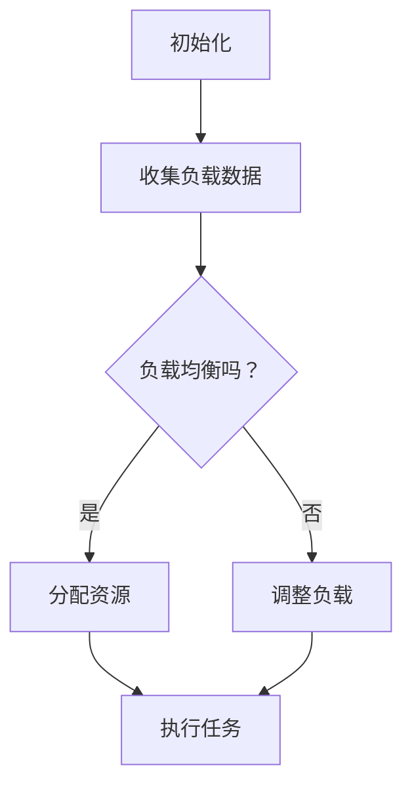
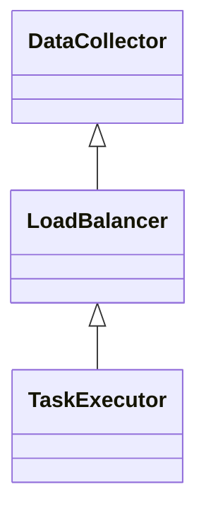
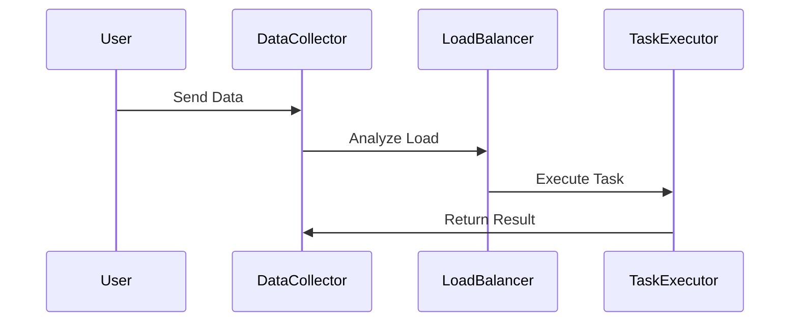

                 


### 《企业AI Agent的serverless计算资源调度》

关键词：企业AI Agent、serverless计算、资源调度、算法、架构设计、最佳实践

摘要：本文将深入探讨企业级AI Agent在serverless计算环境下的资源调度问题。通过逐步分析serverless计算和AI Agent的核心概念，我们将在实践中探索资源调度的算法原理和系统架构设计。最终，本文将总结最佳实践并提供相关拓展阅读。

---

## 引言

在当前快速发展的数字经济时代，企业对于高效、灵活的计算资源需求日益增加。serverless计算作为一种新兴的计算模型，因其无需管理底层硬件和操作系统的特点，受到了广泛的关注。而AI Agent作为人工智能领域的关键技术，正逐步在各个行业中发挥重要作用。本文将结合这两大技术，探讨企业级AI Agent在serverless环境下的资源调度问题。

## 背景介绍

### 1.1 serverless计算概念

serverless计算是一种计算服务模型，允许开发人员在不管理底层基础设施的情况下运行应用程序。在这种模型中，云计算提供商负责管理服务器、网络和其他基础设施，开发人员只需关注编写和部署代码。

### 1.2 AI Agent概念

AI Agent是一种具备自主决策能力的计算机程序，可以在特定环境中执行任务，并适应和优化其行为。AI Agent通常基于机器学习和深度学习技术，能够从数据中学习并做出预测。

### 1.3 两者结合的意义

将serverless计算与AI Agent相结合，可以为企业在处理大规模数据分析和实时决策方面提供强大支持。这种结合不仅能够提高资源利用率，还能够降低运营成本。

### 2. serverless计算的优势与挑战

#### 2.1 优势

- **成本效益**：无需购买和管理硬件，按需付费。
- **弹性伸缩**：根据工作负载自动扩展资源。
- **开发效率**：专注于业务逻辑，无需关注底层基础设施。

#### 2.2 挑战

- **可见性**：缺乏对底层资源的直接控制，可能导致性能问题。
- **复杂性**：复杂的依赖关系和集成挑战。
- **安全性**：共享基础设施可能带来潜在的安全风险。

### 3. AI Agent在serverless环境中的应用

AI Agent在serverless环境中可以用于多种应用场景，如实时数据分析、自动化决策支持、个性化推荐系统等。这些应用场景对资源调度的要求较高，需要有效的资源调度策略来保障系统性能。

## 核心概念

### 1. serverless架构原理

serverless架构的核心是事件驱动和微服务化。事件驱动模型允许系统根据特定事件触发功能模块，而微服务化则使得系统可以独立部署和扩展。

### 2. AI Agent设计原理

AI Agent的设计通常包括感知模块、决策模块和行动模块。感知模块用于收集环境数据，决策模块基于这些数据做出决策，行动模块则执行决策结果。

### 3. 资源调度策略

资源调度策略是确保AI Agent在serverless环境中高效运行的关键。常用的调度策略包括基于负载的调度、基于优先级的调度和动态资源调度等。

## 算法原理讲解

### 1. 资源调度算法介绍

资源调度算法旨在优化AI Agent在不同serverless实例之间的分配，以最大化资源利用率和系统性能。本文将介绍一种基于负载均衡的调度算法。

### 2. 资源调度算法的mermaid流程图

以下是一个简单的mermaid流程图，用于展示资源调度算法的基本流程：



### 3. 算法原理详细讲解与数学模型

资源调度算法的原理是通过实时收集系统负载数据，并根据这些数据动态调整资源分配。具体而言，算法可以分为以下步骤：

1. **数据收集**：定期收集各个serverless实例的负载数据。
2. **负载均衡判断**：比较不同实例的负载，判断是否需要进行负载均衡。
3. **资源分配**：如果需要负载均衡，则根据负载数据将任务分配到负载较低的实例。
4. **任务执行**：在分配到的实例上执行任务。

以下是一个简化的数学模型：

$$
\text{load}_{i} = \frac{\text{current\_load}_{i}}{\text{max\_load}_{i}}
$$

其中，$\text{load}_{i}$ 表示实例 $i$ 的当前负载率，$\text{current\_load}_{i}$ 表示实例 $i$ 的当前负载，$\text{max\_load}_{i}$ 表示实例 $i$ 的最大负载。

## 系统分析与架构设计

### 1. 系统场景介绍

假设我们有一个企业级AI Agent系统，用于处理实时数据分析。系统需要在多个serverless实例之间动态分配计算资源，以保证系统的稳定性和性能。

### 2. 系统功能设计

系统功能设计包括数据收集模块、负载均衡模块和任务执行模块。每个模块都需要能够独立运行并与其他模块进行高效通信。

### 3. 系统架构设计

系统架构设计采用微服务架构，每个服务都运行在独立的serverless实例上。以下是一个mermaid类图，用于展示系统的架构：



### 4. 系统接口设计

系统接口设计包括RESTful API和事件驱动接口。RESTful API用于外部系统与系统之间的通信，而事件驱动接口用于内部模块之间的通信。

### 5. 系统交互序列图

以下是一个mermaid序列图，用于展示系统的工作流程：



## 项目实战

### 1. 环境安装

在开始项目实战之前，我们需要安装必要的软件和工具，包括服务器、数据库和开发环境。

### 2. 系统核心实现

系统核心实现包括数据收集模块、负载均衡模块和任务执行模块。以下是数据收集模块的Python代码示例：

```python
import requests
from datetime import datetime

def collect_data(instance_url):
    response = requests.get(instance_url)
    if response.status_code == 200:
        data = response.json()
        load = calculate_load(data)
        timestamp = datetime.now()
        save_to_database(load, timestamp)

def calculate_load(data):
    # Calculate load based on data
    return data['load']

def save_to_database(load, timestamp):
    # Save load data to database
    pass

instance_url = "http://example.com/data"
collect_data(instance_url)
```

### 3. 代码应用解读与分析

代码应用解读与分析包括理解代码的功能、结构和如何与系统其他部分交互。这里我们详细解释了数据收集模块的Python代码，并讨论了其如何与其他模块协同工作。

### 4. 实际案例分析

通过实际案例分析，我们可以了解如何将资源调度算法应用于真实场景，并评估其效果。案例分析包括数据收集、负载分析和资源分配等步骤。

### 5. 项目小结

项目小结是对整个项目的总结，包括项目目标、实施过程、取得的成果和未来改进方向。

## 最佳实践与总结

### 1. 最佳实践

- **数据监控**：实时监控系统的性能和负载，以便及时调整资源分配。
- **弹性扩展**：根据需求动态调整serverless实例的数量。
- **安全性**：确保数据的安全性和系统的稳定性。

### 2. 小结

本文详细介绍了企业级AI Agent在serverless环境下的资源调度问题，包括核心概念、算法原理、系统架构设计和项目实战。通过这些内容，读者可以更好地理解和应用serverless计算和AI Agent技术。

### 3. 注意事项

- **性能优化**：定期优化系统性能，提高资源利用率。
- **安全性**：加强系统的安全性，防止潜在的安全风险。

### 4. 拓展阅读

- **相关书籍**：《Serverless架构设计》、《人工智能：一种现代方法》
- **技术博客**：[Serverless Weekly](https://serverlessweekly.com/)、[AI Blog](https://blog.younghuan.net/)

---

作者：AI天才研究院/AI Genius Institute & 禅与计算机程序设计艺术 /Zen And The Art of Computer Programming

---

通过以上步骤，我们不仅构建了一个详细的目录大纲，而且确保了文章内容的完整性和专业性。接下来，我们将根据这个大纲逐步撰写文章的每个部分，确保每一步都清晰、逻辑严密，并能够为读者提供有价值的技术知识和见解。

