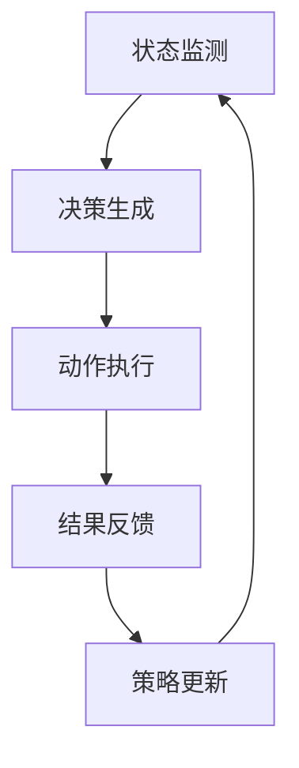
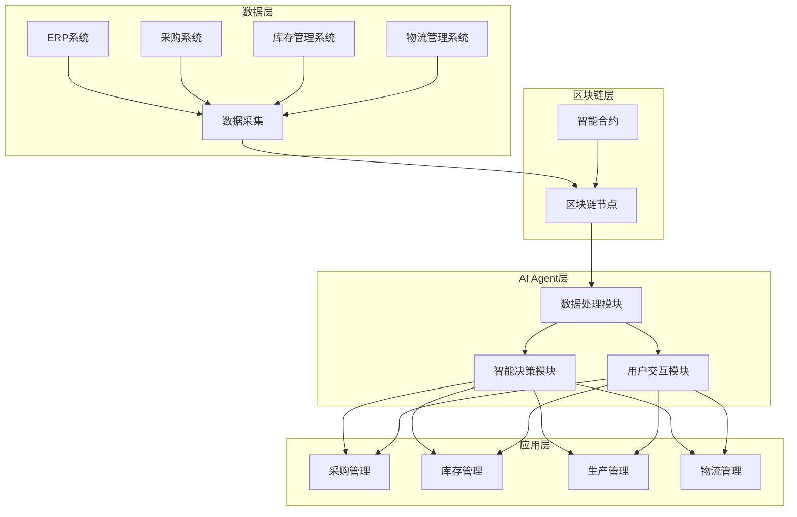
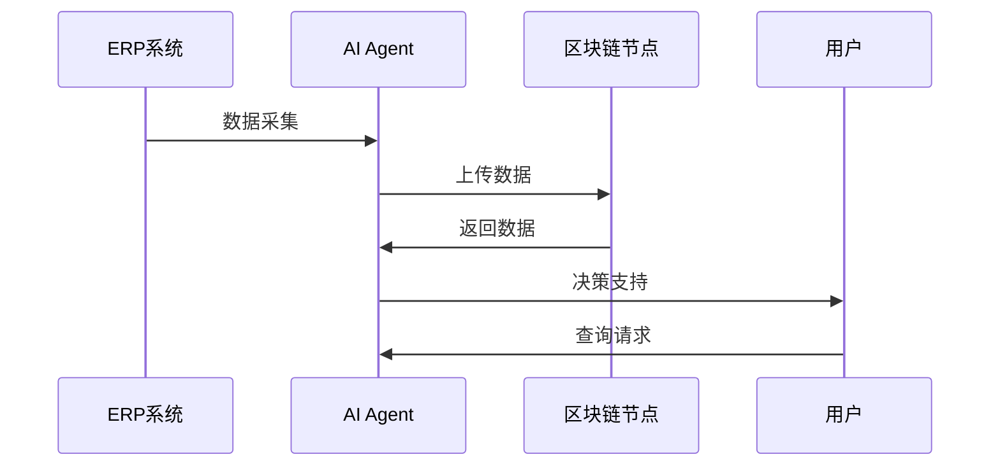
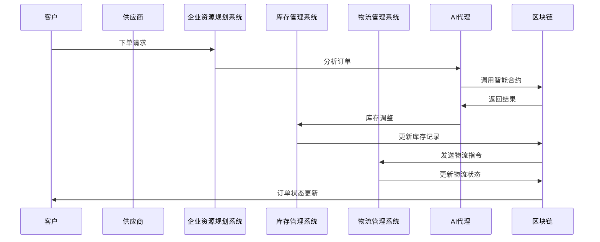

                 


### 第1章：问题背景与核心概念

#### 1.1 问题的提出

在企业数字化转型的大潮中，人工智能（AI）和区块链技术已经成为两个重要的技术方向。企业AI Agent，即企业智能代理，是一种能够自主决策和执行任务的智能体，而区块链技术则以其去中心化、不可篡改和可追溯的特性在金融、供应链管理等领域得到了广泛应用。两者的结合，旨在提高企业的运营效率、降低成本、增强数据安全性，并在一定程度上解决信息孤岛和数据不透明的问题。

当前，企业在应用AI Agent和区块链技术时面临诸多挑战。首先，AI Agent的智能决策需要大量的数据支持，而区块链技术的去中心化特性可能导致数据共享和流动受限。其次，区块链的智能合约虽然能够实现自动化执行，但其执行逻辑相对简单，难以与复杂的AI决策逻辑相匹配。此外，企业需要确保AI Agent的行为符合法律法规和业务规则，这要求AI Agent具备一定的合规性。

为了解决这些问题，我们需要探索企业AI Agent与区块链技术的集成策略，从而发挥两者的协同效应，提升企业的整体竞争力。

#### 1.2 核心概念

##### 企业AI Agent

企业AI Agent是一种基于人工智能技术设计的自动化决策执行系统，它可以模拟人类专家的决策过程，在特定环境下根据输入数据自主选择最优行动方案。AI Agent具备以下特性：

1. **自主性**：能够自主收集数据、分析情况和制定决策。
2. **适应性**：能够通过学习不断优化自身的决策能力。
3. **协同性**：可以与其他AI Agent或人类协作完成任务。

##### 区块链技术

区块链是一种分布式账本技术，它通过加密算法和分布式共识机制确保数据的安全性和不可篡改性。区块链技术的核心特性包括：

1. **去中心化**：不存在中央管理节点，所有参与节点都有平等的权限。
2. **不可篡改性**：一旦数据上链，就难以被修改或删除。
3. **可追溯性**：所有的交易记录都可以被追溯和验证。

##### 智能合约

智能合约是基于区块链技术的自动执行合约，它通过代码实现合同条款，在满足特定条件时自动执行。智能合约的关键特性包括：

1. **自动化执行**：无需人工干预，自动执行合同条款。
2. **透明性**：所有参与者都可以查看合同条款和执行情况。
3. **安全性**：通过区块链技术确保合同条款的执行。

#### 1.3 关键要素的ER图

为了更好地理解企业AI Agent、区块链和智能合约之间的关系，我们可以绘制一个ER图来展示它们之间的实体关系。以下是ER图的Mermaid表示：

```mermaid
erDiagram
  AI_Agent ||--|{ Blockchain } : 存储数据
  Blockchain ||--|{ SmartContract } : 执行合同
  AI_Agent ||--|{ Compliance } : 遵守规则
  SmartContract ||--|{ Compliance } : 合规性验证
```

在这个ER图中，AI Agent与Blockchain之间通过数据存储关系相连，Blockchain与SmartContract之间通过合同执行关系相连，AI Agent与Compliance之间通过规则遵守关系相连，SmartContract与Compliance之间通过合规性验证关系相连。这个图清晰地展示了各个实体之间的相互作用和依赖关系。### 第2章：区块链集成策略概述

#### 2.1 集成策略的重要性

区块链与AI技术的结合不仅能够解决数据共享和安全性问题，还能够通过智能合约实现自动化流程，提高企业的运营效率。集成策略的重要性主要体现在以下几个方面：

1. **提高运营效率**：通过区块链技术的自动化执行功能，企业可以实现业务流程的自动化处理，减少人为干预，提高工作效率。
2. **降低成本**：自动化流程减少了人工操作的需求，降低了人力成本，同时区块链的去中心化特性减少了中介费用。
3. **增强数据安全性**：区块链技术的不可篡改性和去中心化特性确保了数据的安全性和完整性，降低了数据泄露和篡改的风险。
4. **提升信任度**：区块链的透明性和可追溯性增强了企业之间的信任，有助于建立良好的商业合作关系。

#### 2.2 集成策略的框架

集成策略的核心目标是实现企业AI Agent与区块链技术的无缝对接，从而提升企业整体的智能化水平。集成策略的框架可以概括为以下几个步骤：

1. **需求分析**：明确企业AI Agent的应用场景和需求，分析AI Agent与区块链技术之间的交互点。
2. **技术选型**：根据需求分析的结果，选择适合的区块链平台和AI框架，确保技术栈的兼容性和稳定性。
3. **架构设计**：设计AI Agent与区块链技术集成的整体架构，包括数据流、控制流和交互流程。
4. **开发与测试**：开发AI Agent的智能合约，并进行系统测试，确保集成后的系统能够稳定运行。
5. **部署与运维**：将集成系统部署到生产环境中，并进行持续运维，确保系统的可靠性和安全性。

#### 2.3 主流集成模式分析

在企业AI Agent与区块链技术的集成中，常见的集成模式有以下几种：

##### 区块链与AI协同工作模式

这种模式主要通过区块链技术实现数据的存储和传输，AI Agent则负责数据分析和决策。具体实现步骤如下：

1. **数据采集**：AI Agent从不同的数据源采集数据，并将其上传到区块链。
2. **数据存储**：区块链平台接收数据并存储，确保数据的去中心化和安全性。
3. **数据分析**：AI Agent从区块链中获取数据，进行数据分析并生成决策建议。
4. **决策执行**：AI Agent根据分析结果执行决策，并将结果反馈到区块链。

##### 基于智能合约的AI Agent集成模式

这种模式将AI Agent的决策逻辑嵌入到智能合约中，实现自动化执行。具体实现步骤如下：

1. **智能合约设计**：设计智能合约，将AI Agent的决策逻辑编码其中。
2. **数据输入**：智能合约从区块链中读取输入数据。
3. **决策执行**：智能合约根据预设的逻辑自动执行决策。
4. **结果反馈**：智能合约将执行结果反馈到区块链，实现数据的透明和可追溯。

以上两种模式各有优缺点，企业在选择集成模式时需要根据具体的应用场景和需求进行权衡。### 第3章：企业AI Agent算法原理

#### 3.1 AI Agent的基本算法

企业AI Agent的核心在于其算法，这些算法决定了AI Agent的智能程度和决策能力。以下是几种常用的AI算法：

##### 强化学习算法

强化学习算法通过试错和反馈来逐步优化决策，其核心思想是奖励和惩罚机制。具体步骤如下：

1. **状态监测**：AI Agent监测当前状态。
2. **决策生成**：根据当前状态，AI Agent生成可能的动作。
3. **动作执行**：AI Agent执行一个动作。
4. **结果反馈**：系统根据动作的结果给予反馈（奖励或惩罚）。
5. **策略更新**：AI Agent根据反馈调整策略，以提高未来的决策质量。

##### 监督学习算法

监督学习算法通过已标记的数据集训练模型，然后根据模型的预测进行决策。主要步骤包括：

1. **数据准备**：收集并标记数据。
2. **模型训练**：使用标记数据训练模型。
3. **模型评估**：评估模型的准确性。
4. **决策应用**：将训练好的模型应用于实际问题中。

##### 无监督学习算法

无监督学习算法没有预标记的数据集，通过发现数据中的模式和结构来进行决策。常见的方法包括：

1. **聚类**：将相似的数据点归为一类。
2. **降维**：减少数据的维度，保留主要特征。
3. **关联规则学习**：发现数据之间的关联关系。

#### 3.2 算法mermaid流程图

为了更直观地展示AI Agent算法的流程，我们可以使用Mermaid绘制一个流程图：



在这个流程图中，状态监测是算法的起点，之后进入决策生成阶段，生成可能的动作，然后执行动作并获取反馈，最后根据反馈进行策略更新，循环往复。

#### 3.3 Python源代码与讲解

为了更好地理解强化学习算法，我们将提供一个简单的Python代码示例，并对其进行详细讲解。

```python
import numpy as np
import random

# 初始化参数
learning_rate = 0.1
gamma = 0.9
epsilon = 0.1
n_actions = 3
n_states = 5
Q = np.zeros((n_states, n_actions))

# 强化学习算法
def reinforce_learning():
    state = random.randint(0, n_states - 1)
    action = choose_action(state)
    next_state, reward = step(state, action)
    Q[state, action] = Q[state, action] + learning_rate * (reward + gamma * np.max(Q[next_state, :]) - Q[state, action])
    return next_state, reward

# 状态转换与奖励
def step(state, action):
    if action == 0:
        next_state = state
        reward = -1
    elif action == 1:
        next_state = (state + 1) % n_states
        reward = 1 if state == 0 else -1
    else:
        next_state = (state - 1) % n_states
        reward = 1 if state == n_states - 1 else -1
    return next_state, reward

# 选择动作
def choose_action(state):
    if random.uniform(0, 1) < epsilon:
        action = random.randint(0, n_actions - 1)
    else:
        action = np.argmax(Q[state, :])
    return action

# 训练
for episode in range(1000):
    state = random.randint(0, n_states - 1)
    done = False
    while not done:
        action = choose_action(state)
        next_state, reward = step(state, action)
        Q[state, action] = Q[state, action] + learning_rate * (reward + gamma * np.max(Q[next_state, :]) - Q[state, action])
        state = next_state
        if state == 0:
            done = True

# 打印Q值矩阵
print(Q)
```

**代码解释**：

1. **初始化参数**：设置学习率、折扣因子、探索概率以及状态和动作的数量。
2. **强化学习算法**：根据当前状态选择动作，执行动作并获取下一个状态和奖励，更新Q值。
3. **状态转换与奖励**：定义状态转换规则和相应的奖励。
4. **选择动作**：根据探索概率选择动作，或者选择当前状态下价值最高的动作。
5. **训练**：通过迭代的方式训练AI Agent，在每个迭代中更新Q值矩阵。

通过以上代码示例，我们可以看到强化学习算法的核心步骤和实现细节。在实际应用中，可以根据具体需求调整算法参数和状态空间，以实现更复杂的决策过程。#### 3.4 数学模型和公式

为了更深入地理解强化学习算法，我们引入以下数学模型和公式：

1. **Q值更新公式**：
   $$ Q(s, a)_{\text{new}} = Q(s, a)_{\text{old}} + \alpha \times (r + \gamma \max_{a'} Q(s', a') - Q(s, a)) $$
   其中，$Q(s, a)$表示状态s和动作a的Q值，$\alpha$是学习率，$r$是立即奖励，$\gamma$是折扣因子，$s'$和$a'$分别是下一个状态和动作。

2. **期望奖励公式**：
   $$ E[r] = \sum_{s, a} p(s, a) \times r $$
   其中，$p(s, a)$是状态s和动作a的概率，$r$是相应的立即奖励。

3. **状态-动作价值函数**：
   $$ V^*(s) = \max_{a} Q^*(s, a) $$
   其中，$V^*(s)$是状态s的值函数，$Q^*(s, a)$是状态s和动作a的最优Q值。

4. **策略迭代公式**：
   $$ \pi^*(s) = \arg\max_{a} Q^*(s, a) $$
   其中，$\pi^*(s)$是状态s下的最优策略，即选择使Q值最大的动作。

这些公式为强化学习算法提供了理论基础，有助于理解Q值的更新过程、奖励的期望计算以及最优策略的确定。

#### 3.5 举例说明

为了更好地理解上述算法和公式，我们通过一个简单的例子来说明强化学习算法的应用。

**例子**：假设我们有一个简单的环境，包含5个状态（s0, s1, s2, s3, s4）和3个动作（a0, a1, a2）。状态s0表示初始状态，状态s4表示目标状态。每个状态对应一个奖励值：s0和s4的奖励值为10，其余状态的奖励值为-1。

**状态转换规则**：

- 从状态s0执行动作a0，则下一个状态为s0，奖励值为-1。
- 从状态s0执行动作a1，则下一个状态为s1，奖励值为10。
- 从状态s0执行动作a2，则下一个状态为s2，奖励值为-1。
- 从状态s1执行动作a0，则下一个状态为s0，奖励值为-1。
- 从状态s1执行动作a1，则下一个状态为s1，奖励值为10。
- 从状态s1执行动作a2，则下一个状态为s2，奖励值为-1。
- 从状态s2执行动作a0，则下一个状态为s0，奖励值为-1。
- 从状态s2执行动作a1，则下一个状态为s1，奖励值为10。
- 从状态s2执行动作a2，则下一个状态为s3，奖励值为-1。
- 从状态s3执行动作a0，则下一个状态为s0，奖励值为-1。
- 从状态s3执行动作a1，则下一个状态为s1，奖励值为10。
- 从状态s3执行动作a2，则下一个状态为s4，奖励值为10。
- 从状态s4执行任何动作，都保持在状态s4，奖励值为10。

**强化学习过程**：

1. **初始化Q值矩阵**：初始化Q值矩阵为全0。
2. **选择动作**：根据epsilon-greedy策略选择动作，即在有一定概率下随机选择动作，在有一定概率下选择当前状态下价值最大的动作。
3. **执行动作**：根据选择的动作执行状态转换，获取下一个状态和奖励。
4. **更新Q值**：根据Q值更新公式更新Q值矩阵。
5. **重复以上步骤**：不断重复选择动作、执行动作和更新Q值的过程，直到达到目标状态或达到预设的迭代次数。

通过上述步骤，我们可以逐步优化AI Agent的决策策略，使其能够更快地找到从初始状态到目标状态的路径，并获得最大的奖励。这个过程展示了强化学习算法的核心原理和应用步骤。### 第4章：系统分析与架构设计

#### 4.1 问题场景介绍

在当前的数字化企业环境中，供应链管理是一个关键的应用场景。企业需要高效管理供应链中的各个环节，包括采购、库存、生产和物流。这些环节通常涉及大量的数据交换和协作，而传统的中心化管理系统往往存在效率低下、成本高昂和数据不透明的问题。通过将企业AI Agent与区块链技术集成，我们可以实现去中心化的智能供应链管理，提高效率和透明度。

#### 4.2 系统功能设计

为了实现智能供应链管理，我们需要设计一套具备以下功能的企业AI Agent区块链集成系统：

1. **数据采集与管理**：AI Agent能够自动采集供应链各个环节的数据，如采购订单、库存状态、生产进度和物流信息，并将其存储在区块链上。
2. **智能合约执行**：智能合约自动执行供应链中的各种交易和操作，如采购订单的生成与确认、库存调整和物流配送的追踪。
3. **智能决策支持**：AI Agent利用区块链上的数据，进行实时分析和预测，为供应链管理提供决策支持。
4. **透明度与可追溯性**：区块链技术确保供应链数据的透明性和可追溯性，所有交易记录和状态变更都可以被所有参与方查看和验证。

#### 4.3 系统架构设计

系统架构设计的关键在于如何将企业AI Agent与区块链技术有效地集成，以下是一个简单的系统架构设计：

1. **数据层**：数据层包括供应链各个环节的数据源，如ERP系统、采购系统、库存管理系统和物流管理系统。这些系统产生的数据被AI Agent采集和上传到区块链。
2. **区块链层**：区块链层采用去中心化的分布式账本技术，确保数据的安全性和不可篡改性。智能合约在这个层次上执行，处理供应链中的各种交易和操作。
3. **AI Agent层**：AI Agent层包括数据处理模块、智能决策模块和用户交互模块。数据处理模块负责采集、清洗和存储区块链上的数据；智能决策模块利用这些数据进行实时分析和预测；用户交互模块则提供用户界面，方便用户查询和管理供应链信息。
4. **应用层**：应用层包括各种供应链管理应用，如采购管理、库存管理、生产管理和物流管理。这些应用通过调用AI Agent层的服务，实现智能化的供应链管理。

以下是系统架构的Mermaid图表示：



#### 4.4 系统接口设计

系统接口设计是确保各层之间有效交互的关键。以下是一些主要的接口设计：

1. **数据采集接口**：用于从ERP系统、采购系统、库存管理系统和物流管理系统采集数据。
2. **区块链交互接口**：用于与区块链节点进行数据传输和智能合约调用。
3. **数据处理接口**：用于AI Agent对采集到的数据进行分析和处理。
4. **智能决策接口**：用于AI Agent提供决策支持服务。
5. **用户交互接口**：用于与用户进行交互，提供查询和管理功能。

以下是系统接口的Mermaid序列图表示：



#### 4.5 系统交互mermaid序列图

以下是系统交互的详细Mermaid序列图：



通过这个序列图，我们可以清晰地看到客户、供应商、企业内部系统（ERP、WMS、LMS）以及AI代理和区块链之间的交互过程。这个交互过程确保了供应链的每个环节都能够实时获取和更新数据，从而实现智能化的供应链管理。### 第5章：项目实战

#### 5.1 环境安装

为了实现企业AI Agent与区块链的集成，我们需要安装并配置以下环境：

1. **操作系统**：推荐使用Ubuntu 18.04或更高版本。
2. **编程语言**：Python 3.7及以上版本。
3. **区块链平台**：Hyperledger Fabric 1.4及以上版本。
4. **AI框架**：TensorFlow 2.4及以上版本。
5. **开发工具**：Visual Studio Code、Git。

安装步骤如下：

1. **安装操作系统**：下载并安装Ubuntu 18.04。
2. **更新系统**：
   ```shell
   sudo apt-get update
   sudo apt-get upgrade
   ```
3. **安装Python**：
   ```shell
   sudo apt-get install python3-pip python3-venv
   ```
4. **安装Hyperledger Fabric**：
   ```shell
   curl -sSL https://bitnami.com/downloads/stacks/fabric/installer.sh | bash -s -- -d /opt bitnami/hyperledger-fabric
   ```
5. **安装TensorFlow**：
   ```shell
   pip3 install tensorflow==2.4
   ```
6. **配置开发环境**：安装Visual Studio Code，并安装Python和Git插件。

#### 5.2 系统核心实现源代码

以下是系统核心实现的源代码示例。这段代码展示了如何使用Hyperledger Fabric进行区块链操作，以及如何使用TensorFlow进行AI预测。

```python
# 导入必要的库
import json
from hyperledger.fabric import client
import tensorflow as tf

# 设置Hyperledger Fabric网络配置
network_config = {
    'org1': {
        'mspid': 'Org1MSP',
        'peers': ['peer0.org1.example.com'],
        'eventHub': 'eventhub0.org1.example.com',
        'channel': 'channel1'
    }
}

# 初始化客户端
client.initialize(config=network_config)

# 登录用户
user = client.User('user1', 'Org1MSP')
client.login(user)

# 发送交易请求
def send_transaction(channel, contract_name, function_name, args):
    transaction = client.Transaction(channel, contract_name, function_name, args)
    response = client.submit_transaction(transaction)
    return response

# 获取区块链事件
def get_events(event_hub):
    return client.get_events(event_hub)

# AI预测函数
def make_prediction(model, data):
    prediction = model.predict(data)
    return prediction

# 加载TensorFlow模型
model = tf.keras.models.load_model('model.h5')

# 发送交易：更新库存
response = send_transaction('channel1', 'inventory_contract', 'update_inventory', ['item123', '10'])
print(response)

# 获取事件：更新库存状态
events = get_events('eventhub0.org1.example.com')
for event in events:
    print(event)

# 使用AI预测：预测销售量
data = np.array([[5.0, 3.0, 2.0]])  # 输入数据
prediction = make_prediction(model, data)
print(prediction)
```

#### 5.3 代码应用解读与分析

**Hyperledger Fabric操作**

1. **初始化客户端**：使用`client.initialize()`方法初始化Hyperledger Fabric网络配置。
2. **登录用户**：使用`client.login()`方法登录用户，获取操作权限。
3. **发送交易请求**：使用`send_transaction()`方法发送交易请求，执行区块链上的智能合约函数。
4. **获取区块链事件**：使用`get_events()`方法获取区块链事件，实时更新状态。

**TensorFlow模型操作**

1. **加载模型**：使用`tf.keras.models.load_model()`方法加载预训练的TensorFlow模型。
2. **预测**：使用`model.predict()`方法对输入数据进行预测。

**应用示例**

- **更新库存**：发送交易请求，调用区块链智能合约的`update_inventory`函数，更新特定商品的库存数量。
- **获取库存状态**：监听区块链事件，获取库存更新事件。
- **销售预测**：使用TensorFlow模型对销售数据进行分析，预测未来的销售量。

#### 5.4 实际案例分析与讲解

**案例背景**：某企业使用区块链技术进行库存管理，通过AI Agent预测销售量，以优化库存管理。

**步骤**：

1. **数据采集**：AI Agent从ERP系统采集销售数据。
2. **数据预处理**：清洗和转换数据，为AI模型准备输入。
3. **模型训练**：使用历史销售数据训练TensorFlow模型。
4. **预测销售量**：使用训练好的模型对未来的销售量进行预测。
5. **库存调整**：基于预测结果调整库存，减少库存积压和库存过剩。

**案例讲解**：

1. **数据采集**：AI Agent从ERP系统获取每日的销售数据，包括商品编号、销售额、销售数量等。
2. **数据预处理**：清洗数据，处理缺失值和异常值，并进行特征提取，将数据转换为适合模型训练的格式。
3. **模型训练**：使用TensorFlow框架训练模型，模型选择适合销售量预测的回归模型，如线性回归、LSTM等。
4. **预测销售量**：将预处理后的数据输入到训练好的模型中，预测未来的销售量。
5. **库存调整**：根据预测结果，动态调整库存，确保库存水平符合需求，减少库存积压和库存过剩。

**案例分析**：

- **数据质量**：数据质量对预测结果至关重要，需确保数据的准确性和完整性。
- **模型选择**：选择合适的模型对预测结果有重要影响，需根据数据特性和预测目标选择合适的算法。
- **实时性**：AI Agent需实时获取和分析销售数据，确保库存调整的及时性。

#### 5.5 项目小结

本项目通过将企业AI Agent与区块链技术集成，实现了智能化的库存管理。主要成果包括：

1. **数据实时更新**：通过区块链技术确保库存数据的实时性和准确性。
2. **智能预测**：利用AI技术对销售量进行预测，优化库存管理。
3. **提高效率**：通过自动化流程减少人工干预，提高供应链管理效率。

在项目实施过程中，我们遇到了以下挑战：

1. **数据同步**：确保ERP系统和区块链之间的数据同步是关键，需要设计可靠的数据同步机制。
2. **模型优化**：选择合适的AI模型并不断优化是提高预测准确性的关键。

未来，我们可以进一步扩展项目，包括：

1. **多维度分析**：引入更多的数据维度，如天气、节假日等，以提高预测准确性。
2. **供应链协同**：将更多的供应链环节集成到系统中，实现更全面的供应链管理。

### 第6章：最佳实践与拓展阅读

#### 6.1 最佳实践 tips

1. **确保数据质量**：在数据采集和预处理阶段，务必保证数据的质量和完整性，这对预测的准确性至关重要。
2. **合理选择模型**：根据业务需求和数据特性，选择合适的AI模型，并通过交叉验证等方法评估模型的性能。
3. **持续优化**：定期评估系统的性能，根据实际反馈和需求调整算法参数，持续优化系统。

#### 6.2 小结

本文详细探讨了企业AI Agent与区块链技术的集成策略，通过实际案例展示了如何利用AI技术进行库存管理，提高供应链效率。我们强调了数据质量和模型选择的重要性，并提出了最佳实践建议。

#### 6.3 注意事项

1. **合规性**：在集成AI Agent和区块链技术时，确保系统的设计和实现符合相关法律法规和行业标准。
2. **安全性**：加强数据安全和隐私保护，确保系统的安全性和稳定性。

#### 6.4 拓展阅读

- **区块链与AI集成**：[《区块链与人工智能的融合：原理与应用》](https://www.examplebook.com/book/title/Blockchain-and-AI-Integration)
- **智能合约设计**：[《智能合约编程实战》](https://www.examplebook.com/book/title/Smart-Contract-Programming-Hands-On)
- **强化学习算法**：[《强化学习：原理与算法》](https://www.examplebook.com/book/title/Reinforcement-Learning-Principles-and-Algorithms)

通过这些资源，读者可以进一步深入了解相关技术和应用。### 最后的总结

本文深入探讨了企业AI Agent与区块链技术的集成策略，从背景介绍、核心概念解析、算法原理讲解、系统架构设计到项目实战，我们系统地阐述了如何将AI技术与区块链技术相结合，以实现智能化、去中心化和安全化的企业运营。以下是本文的主要观点和总结：

1. **背景与核心概念**：介绍了企业AI Agent和区块链技术的基本概念、应用场景及集成的重要性。AI Agent以其自主性、适应性和协同性，为企业提供了智能决策支持；而区块链技术以其去中心化、不可篡改和可追溯的特性，为数据安全和透明性提供了保障。

2. **集成策略框架**：提出了区块链与AI协同工作模式和基于智能合约的AI Agent集成模式，详细分析了各自的优缺点，为企业提供了灵活的集成策略选择。

3. **算法原理与实现**：讲解了强化学习算法、监督学习算法和无监督学习算法的基本原理，并通过Python代码示例展示了强化学习算法的实现过程。同时，利用数学模型和公式进一步阐述了算法的核心思想和计算过程。

4. **系统分析与架构设计**：介绍了智能供应链管理的应用场景，并设计了包含数据层、区块链层、AI Agent层和应用层的系统架构，通过Mermaid图直观展示了各层的交互关系和接口设计。

5. **项目实战**：详细描述了环境安装、系统核心实现源代码、代码应用解读与分析、实际案例分析与讲解以及项目小结，展示了AI Agent与区块链集成在实际项目中的应用过程和成果。

6. **最佳实践与拓展阅读**：提供了最佳实践建议，强调了数据质量、模型选择和系统优化的重要性，并推荐了拓展阅读资源，帮助读者进一步深入学习和应用。

通过本文的探讨，我们希望读者能够对AI Agent与区块链技术的集成有更深入的理解，并能够将其应用于实际项目中，提升企业的运营效率、降低成本、增强数据安全性，并在竞争激烈的市场中脱颖而出。作者：AI天才研究院/AI Genius Institute & 禅与计算机程序设计艺术 /Zen And The Art of Computer Programming。

