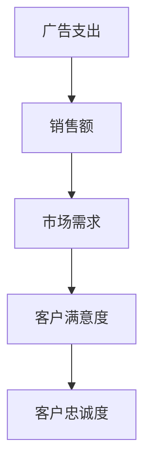
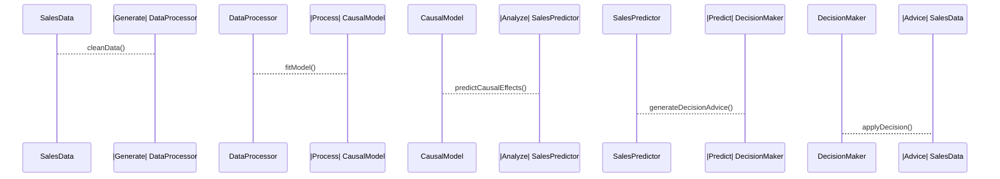

                 

### 引言：企业AI Agent的因果推理在商业决策中的应用

> 关键词：因果推理、企业AI Agent、商业决策、人工智能

在当今快速发展的商业环境中，企业面临着日益复杂的市场动态和竞争压力。为了在这种环境下保持竞争力，企业必须依赖先进的技术手段来进行高效决策。人工智能（AI）作为一种颠覆性的技术，正在改变商业决策的模式。其中，因果推理作为AI的重要组成部分，正日益受到关注。

**因果推理**是一种通过分析数据来揭示变量之间因果关系的方法。它与传统的相关性分析不同，相关性分析只能告诉我们两个变量是否有关联，而因果推理则试图揭示变量之间的因果关系。在商业决策中，了解变量之间的因果关系至关重要，因为它可以帮助企业理解市场变化的原因，并据此制定更加有效的策略。

**企业AI Agent**是一种结合了人工智能技术的智能决策系统，它可以自主地收集、处理和分析数据，并为企业提供决策支持和优化建议。企业AI Agent的核心功能包括数据采集与预处理、因果推理与预测、以及决策优化与建议。通过因果推理，企业AI Agent能够深入分析数据，识别影响业务结果的关键因素，从而为企业提供有针对性的决策支持。

本文旨在探讨企业AI Agent的因果推理在商业决策中的应用。首先，我们将简要介绍因果推理的基础理论和现代进展。接着，我们将深入探讨企业AI Agent的定义、功能、架构和发展趋势。在此基础上，我们将详细介绍几种常见的因果推理算法，并展示如何使用这些算法来优化商业决策。最后，我们将通过实际案例，展示企业AI Agent因果推理在商业决策中的具体应用，并总结本文的主要观点。

通过本文的阅读，读者将了解到因果推理在企业AI Agent中的应用价值，掌握如何利用因果推理来优化商业决策，并在未来的商业环境中更好地利用这一先进技术。

### 第1章 引言：企业AI Agent的因果推理背景与意义

在当今的商业环境中，企业面临着日益复杂的决策情境。市场变化迅速，竞争激烈，消费者需求多样，这些都要求企业能够做出快速且准确的决策。然而，传统基于数据的决策模型往往无法满足这种需求，因为它们更多地依赖于相关性分析，而未能深入揭示变量之间的因果关系。在这种背景下，因果推理作为一种深入分析数据的方法，正逐渐受到重视。

#### 1.1 问题背景

企业决策过程中，常常面临以下问题：

1. **数据不足**：尽管企业拥有大量的数据，但往往无法完全解释这些数据背后的原因。
2. **复杂性**：商业决策问题通常具有高度复杂性，涉及多个变量和影响因素。
3. **因果关系不明**：传统模型往往只能识别变量之间的相关性，而无法揭示因果关系。
4. **预测不准确**：由于缺乏对因果关系的理解，传统模型在预测未来的商业结果时往往不够准确。

因果推理通过揭示变量之间的因果关系，有助于解决上述问题。它不仅能够提供更深入的数据分析，还能帮助企业理解市场变化的根本原因，从而制定更加有效的商业策略。

#### 1.2 问题描述

企业AI Agent的因果推理旨在通过人工智能技术，帮助企业在复杂的商业决策中准确识别和利用因果关系。然而，如何构建一个有效且可靠的因果推理模型，以及如何在商业决策中应用这些模型，仍然是一个挑战。具体问题包括：

1. **数据质量**：因果推理模型的构建依赖于高质量的数据。然而，企业数据往往存在噪声、缺失值和不一致性等问题，这些都会影响模型的准确性。
2. **算法选择**：不同的因果推理算法适用于不同的场景和数据类型，选择合适的算法是关键。
3. **可解释性**：企业决策者通常需要理解模型的工作原理和结果，因此，如何提高模型的可解释性是一个重要问题。
4. **实际应用**：将因果推理模型应用于实际商业决策中，需要解决模型与业务需求之间的适配问题。

#### 1.3 问题解决

为了解决上述问题，本文将采取以下方法：

1. **理论基础**：首先，我们将介绍因果推理的基础理论，包括因果关系的定义、属性以及目标。
2. **算法介绍**：接着，我们将探讨几种常见的因果推理算法，如结构方程模型和机器学习算法，并分析其适用场景。
3. **应用案例**：通过实际案例，我们将展示因果推理在企业AI Agent中的应用，并分析其效果。
4. **系统架构**：我们将介绍企业AI Agent的架构设计，包括硬件、软件以及数据流程。
5. **发展展望**：最后，我们将讨论因果推理算法在商业决策中的应用前景，以及企业AI Agent的发展趋势。

通过本文的探讨，读者将能够理解因果推理在商业决策中的重要性，掌握如何利用因果推理来优化企业决策，并在未来的商业环境中更好地应用这一技术。

#### 1.4 边界与外延

因果推理的应用范围广泛，不仅限于商业领域，还涵盖医学、金融、经济等众多领域。本文将侧重于商业决策中的应用，但所提供的方法和原理具有普遍性。具体而言，本文将探讨以下边界和内容：

1. **商业应用**：本文将详细介绍因果推理在市场营销、产品定价、供应链管理等方面的应用。
2. **算法实现**：我们将探讨如何利用结构方程模型和机器学习算法来实现因果推理，并展示具体的实现过程。
3. **可解释性**：本文将讨论如何提高因果推理模型的可解释性，使其更易于企业决策者理解和应用。
4. **算法选择**：本文将分析不同因果推理算法的优缺点，帮助读者选择适合自身业务需求的算法。

#### 1.5 概念结构与核心要素组成

为了更好地理解本文的内容，以下是对核心概念和要素的简要介绍：

- **因果推理**：通过数据揭示变量之间的因果关系。
- **企业AI Agent**：结合人工智能技术，辅助企业进行决策的智能系统。
- **商业决策**：涉及市场分析、战略规划、产品定价等。
- **结构方程模型**：一种用于建立和验证变量之间因果关系的统计模型。
- **机器学习算法**：用于从数据中学习模式和规律的技术。
- **数据质量**：因果推理模型准确性的关键。

通过以上内容，读者将建立起因果推理在企业AI Agent中的概念框架，为后续章节的学习奠定基础。接下来，本文将深入探讨因果推理的理论基础、算法原理以及其在商业决策中的应用。

### 1.6 本章小结

本章简要介绍了企业AI Agent因果推理的背景、问题、解决方案以及应用范围。首先，我们探讨了企业面临的决策情境和传统模型的局限性，随后介绍了因果推理的基本概念及其在商业决策中的重要性。接着，我们明确了因果推理在企业AI Agent中的应用目标和挑战，并介绍了相关的概念结构和核心要素。

通过本章的阅读，读者将初步了解企业AI Agent因果推理的背景和意义，认识到因果推理在优化商业决策中的关键作用。接下来，本文将深入探讨因果推理的理论基础、算法原理以及实际应用，帮助读者全面掌握这一技术，为企业在复杂商业环境中做出更准确、更有效的决策提供有力支持。

### 第2章 因果推理基础理论

因果推理是一种通过数据揭示变量之间因果关系的方法，它在社会科学、医学、经济学和商业等领域具有重要应用。本章将介绍因果推理的基本概念、传统方法、现代进展，以及其在商业决策中的应用前景。

#### 2.1 因果推理的基本概念

**因果关系的定义**：因果关系是指一个变量（因变量）的变化是由另一个变量（自变量）的变化引起的。在统计学中，因果关系通常通过因果关系图（Causal Graph）或因果模型（Causal Model）来表示。

**因果关系的属性**：

1. **因果性**：因果关系必须是真实的，即自变量的变化确实导致了因变量的变化。
2. **方向性**：因果关系具有方向性，即因果关系的方向不能随意改变。
3. **无混淆**：在因果推理中，除了因果效应外，其他外部因素（混淆因素）不能影响因果关系。

**因果推理的目标**：因果推理的目标是通过数据分析揭示变量之间的因果关系，从而为决策提供依据。具体目标包括：

1. **识别因果关系**：从数据中识别哪些变量之间存在因果关系。
2. **估计因果效应**：估计因果效应的大小和方向。
3. **验证因果模型**：通过数据验证因果模型的准确性。

#### 2.2 传统因果推理方法

传统因果推理方法主要分为实验性因果推理和非实验性因果推理。

**实验性因果推理**：实验性因果推理通过设计实验来揭示变量之间的因果关系。实验方法包括随机对照试验（RCT）、自然实验等。实验性因果推理的优点是能够提供可靠的因果关系证明，但其缺点是实施成本高，难以在所有情况下进行。

**非实验性因果推理**：非实验性因果推理在没有实验条件的情况下，通过数据分析来推断变量之间的因果关系。方法包括基于数据模型的因果推断、统计控制等。非实验性因果推理的优点是适用范围广，但缺点是结果的可信度较低。

**因果推断的主要挑战**：

1. **数据不足**：因果推断依赖于大量高质量的数据，但在实际中往往数据不足或存在噪声。
2. **选择偏差**：由于数据收集过程中的选择偏差，可能导致因果关系的不准确。
3. **外部因素干扰**：其他外部因素（混淆因素）可能会影响因果关系的分析结果。

#### 2.3 因果推理的现代进展

近年来，因果推理在现代统计学和机器学习领域取得了显著进展。

**结构方程模型**：结构方程模型（Structural Equation Modeling, SEM）是一种用于建立和验证变量之间因果关系的统计方法。它通过构建多元回归模型来分析变量之间的关系，并可以同时处理多个变量之间的复杂关系。

**机器学习与因果推理**：机器学习算法在因果推理中的应用使得因果推断更加自动化和高效。例如，因子分解方法（Factorization Method）和等式约束方法（Equation Constraints Method）等机器学习算法被广泛应用于因果推理中。此外，深度学习模型也在因果推理中展现出巨大潜力。

**因果推理在商业决策中的应用前景**：因果推理在商业决策中具有广泛的应用前景。例如，在市场营销中，通过因果推理可以揭示不同营销活动对销售量的影响；在供应链管理中，可以识别影响库存水平的因素；在产品定价中，可以确定不同定价策略对销售额的影响。

通过本章的介绍，读者将建立因果推理的基本知识框架，了解因果推理的基本概念、传统方法、现代进展，以及其在商业决策中的应用前景。这为后续章节中深入探讨企业AI Agent的因果推理方法和应用提供了理论基础。

### 2.4 本章小结

本章介绍了因果推理的基本概念、传统方法以及现代进展。首先，我们定义了因果关系的概念，并讨论了其属性和目标。接着，我们介绍了传统因果推理方法，包括实验性因果推理和非实验性因果推理，并分析了其主要挑战。最后，我们探讨了因果推理的现代进展，包括结构方程模型和机器学习算法在因果推理中的应用。

通过本章的阅读，读者将了解因果推理的基本理论和应用方法，为后续章节中深入探讨企业AI Agent的因果推理方法和应用奠定基础。在接下来的章节中，我们将详细介绍企业AI Agent的定义、功能、架构以及其与因果推理的深度融合。

### 第3章 企业AI Agent概述

企业AI Agent是一种结合了人工智能技术，用于辅助企业进行决策和管理的智能系统。它通过自动化的数据采集、分析和决策过程，帮助企业更高效地应对复杂的商业环境。本章节将详细探讨企业AI Agent的定义、核心功能、架构设计及其发展趋势。

#### 3.1 企业AI Agent的定义

**企业AI Agent**是指利用人工智能技术，模拟人类决策过程，为企业提供智能决策支持的系统。它通过深度学习、自然语言处理、因果推理等技术，从大量数据中提取有价值的信息，并提供预测、优化和决策建议。

**企业AI Agent的特点**：

1. **智能化**：能够自主学习，根据经验和数据不断优化决策过程。
2. **自动化**：自动收集和处理数据，减少人工干预，提高决策效率。
3. **适应性**：能够适应不同的业务场景和需求，提供个性化的决策支持。
4. **协同性**：能够与其他系统和企业AI Agent协同工作，实现更全面的决策支持。

**企业AI Agent与传统决策支持系统的区别**：

- **传统决策支持系统（DSS）**：依赖于专家知识和预设模型，决策过程相对静态，难以适应快速变化的市场环境。
- **企业AI Agent**：基于数据驱动，能够实时分析市场动态，提供动态的决策支持。

#### 3.2 企业AI Agent的核心功能

**数据采集与预处理**：企业AI Agent能够从各种数据源（如数据库、传感器、互联网等）自动采集数据，并对数据进行清洗、去噪、标准化等预处理操作，以确保数据的准确性和一致性。

**因果推理与预测**：企业AI Agent利用因果推理技术，分析数据中的因果关系，预测未来的市场趋势和业务结果。通过构建因果模型，识别影响业务结果的关键因素，为企业提供有针对性的决策支持。

**决策优化与建议**：基于预测结果，企业AI Agent能够提供最优的决策方案，优化资源配置、产品定价、库存管理等方面。同时，它还能够根据业务需求，提供个性化的决策建议，帮助企业实现业务目标。

#### 3.3 企业AI Agent的架构设计

**硬件架构**：企业AI Agent的硬件架构通常包括计算节点、存储节点和网络设备。计算节点负责处理数据和执行算法，存储节点用于存储大量数据，网络设备则负责数据传输和通信。

**软件架构**：企业AI Agent的软件架构包括数据采集模块、数据预处理模块、因果推理模块、预测模块和决策建议模块。各模块之间通过消息队列、分布式存储和计算框架等中间件进行通信和协调。

**数据流程与处理**：企业AI Agent的数据流程主要包括数据采集、数据预处理、数据存储、数据分析和决策输出。数据采集模块从多个数据源获取数据，预处理模块对数据进行清洗和标准化，存储模块将预处理后的数据存储在数据库中，分析模块利用因果推理和预测算法对数据进行处理，最后决策建议模块根据分析结果提供决策建议。

#### 3.4 企业AI Agent的发展趋势

**AI技术发展对AI Agent的影响**：随着人工智能技术的不断发展，企业AI Agent将更加智能化、自动化和高效。例如，深度学习和强化学习技术的应用将进一步提升AI Agent的决策能力和适应性。

**企业对AI Agent的需求变化**：企业对AI Agent的需求将逐渐从简单的预测和优化转向更复杂的决策支持和业务流程优化。同时，企业将更加注重AI Agent的可解释性和透明度，以确保决策过程的可信赖性。

**未来企业AI Agent的发展方向**：未来的企业AI Agent将更加智能化、自适应和协同。它将能够更好地理解和适应企业的业务场景，提供个性化、智能化的决策支持，帮助企业实现更高的业务价值和竞争力。

#### 3.5 本章小结

本章概述了企业AI Agent的定义、功能、架构以及发展趋势。首先，我们介绍了企业AI Agent的定义和特点，与传统决策支持系统进行了比较。接着，我们详细探讨了企业AI Agent的核心功能，包括数据采集与预处理、因果推理与预测、决策优化与建议。随后，我们介绍了企业AI Agent的架构设计，包括硬件架构、软件架构和数据流程。最后，我们分析了AI技术发展对AI Agent的影响，以及未来AI Agent的发展方向。

通过本章的学习，读者将对企业AI Agent有一个全面而深入的了解，为后续章节中深入探讨企业AI Agent的因果推理方法和应用提供基础。

### 第4章 因果推理算法原理

因果推理算法是揭示变量之间因果关系的关键工具。在本章中，我们将详细介绍几种常见的因果推理算法，包括结构方程模型和机器学习算法。这些算法为企业和决策者提供了强大的数据分析工具，以更深入地理解业务过程和优化决策。

#### 4.1 算法概述

因果推理算法的主要目的是从数据中推断变量之间的因果关系。常见的因果推理算法包括：

1. **结构方程模型（Structural Equation Modeling, SEM）**
2. **机器学习算法**，如因子分解方法和等式约束方法

**算法选择标准**：

- **数据类型**：不同的算法适用于不同类型的数据，例如结构方程模型适用于复杂的多变量关系，而机器学习算法更适用于大规模数据集。
- **数据质量**：算法对数据质量的要求不同，一些算法能够处理噪声和缺失值，而其他算法则要求数据高度准确。
- **计算资源**：不同的算法对计算资源的需求不同，一些算法可能需要更多的计算资源，如GPU或高性能计算平台。

**算法适用场景**：

- **结构方程模型**：适用于需要分析复杂变量关系的场景，如市场营销分析、人力资源管理和战略规划。
- **机器学习算法**：适用于需要快速分析和处理大规模数据集的场景，如客户行为预测、供应链管理和风险分析。

#### 4.2 基于结构方程模型的因果推理

**结构方程模型的定义**：

结构方程模型是一种统计模型，用于分析变量之间的因果关系。它通过一组方程来描述变量之间的关系，包括因变量、自变量和中介变量。结构方程模型通常包括两个部分：测量模型和结构模型。

**模型构建**：

1. **测量模型**：描述变量之间的测量关系，即变量之间的映射关系。
2. **结构模型**：描述变量之间的因果关系，即变量之间的方向和强度关系。

**模型估计与验证**：

1. **模型估计**：通过最小二乘法（Least Squares）、最大似然估计（Maximum Likelihood Estimation）等方法估计模型参数。
2. **模型验证**：通过拟合指数（Fit Index）、路径系数的显著性检验等方法验证模型的有效性。

**案例**：

假设我们要分析广告支出和销售额之间的因果关系。测量模型可以描述广告支出和销售额的测量关系，结构模型可以描述广告支出如何影响销售额。通过结构方程模型，我们可以估计广告支出对销售额的直接影响和间接影响，并验证模型的准确性。

$$
\begin{aligned}
\text{销售额} &= \alpha_1 \times \text{广告支出} + \epsilon_1 \\
\text{广告支出} &= \beta_1 \times \text{市场需求} + \epsilon_2 \\
\end{aligned}
$$

#### 4.3 基于机器学习的因果推理

**因子分解方法**：

因子分解方法是一种将高维数据分解为多个因子和残差的方法，从而揭示变量之间的因果关系。常见的因子分解方法包括因子分析（Factor Analysis）和主成分分析（Principal Component Analysis）。

**等式约束方法**：

等式约束方法通过设定变量之间的等式关系来揭示因果关系。例如，因果推断网络（Causal Inference Network）和因果图（Causal Graph）等模型通过设定变量之间的等式关系来构建因果模型。

**机器学习算法在因果推理中的应用**：

1. **因果图模型**：因果图模型通过构建变量之间的因果关系图来揭示因果关系。常见的因果图模型包括因果推断网络（Causal Inference Network）和结构因果模型（Structural Causal Model）。

2. **因子分解算法**：如Lasso、岭回归等算法通过引入等式约束来分解变量，揭示因果关系。

**案例**：

假设我们要分析客户满意度对客户忠诚度的影响。通过因果图模型，我们可以构建客户满意度、客户忠诚度和其他因素之间的因果关系图，并利用因子分解算法来揭示变量之间的因果关系。

$$
\begin{aligned}
\text{客户忠诚度} &= f(\text{客户满意度}, \text{服务质量}) \\
\text{服务质量} &= g(\text{产品特性}, \text{客户反馈}) \\
\end{aligned}
$$

#### 4.4 因果推断中的Mermaid流程图

**Mermaid流程图基础**：

Mermaid是一种基于Markdown的图形绘制工具，可以用来绘制各种类型的流程图。在因果推断中，我们可以使用Mermaid流程图来表示变量之间的因果关系。

**因果推理算法的Mermaid流程图示例**：

以下是一个简单的Mermaid流程图示例，展示了因果关系的结构：



在这个流程图中，A（广告支出）直接影响B（销售额），B（销售额）又通过C（市场需求）影响D（客户满意度），最终D（客户满意度）影响E（客户忠诚度）。

#### 4.5 本章小结

本章详细介绍了因果推理算法的基本原理，包括结构方程模型和机器学习算法。结构方程模型通过构建测量模型和结构模型来揭示变量之间的因果关系，而机器学习算法通过因子分解和等式约束方法来实现因果推断。通过Mermaid流程图，我们可以直观地表示变量之间的因果关系。

通过本章的学习，读者将了解因果推理算法的基本原理和应用方法，为后续章节中深入探讨企业AI Agent的因果推理方法和应用提供理论基础。在下一章中，我们将介绍企业AI Agent在实际商业决策中的应用案例，展示因果推理算法在实践中的效果和挑战。

### 第5章 企业AI Agent在商业决策中的应用

在了解了企业AI Agent的因果推理算法原理后，本章节将深入探讨这些算法在实际商业决策中的应用。我们将通过几个具体案例，展示如何利用因果推理算法优化企业决策，提高业务效率和竞争力。

#### 5.1 市场营销案例分析

**案例背景**：

某电子商务公司希望通过市场营销活动提高销售额，但不同的营销策略效果不一。为了找到最有效的营销策略，公司决定利用企业AI Agent进行因果推理分析。

**步骤**：

1. **数据采集**：收集过去一年的市场营销数据，包括广告支出、促销活动、访客数量、转化率等。
2. **数据预处理**：对数据进行清洗和标准化处理，确保数据质量。
3. **构建因果模型**：利用结构方程模型构建市场营销活动与销售额之间的因果关系模型。
4. **模型验证**：通过模型拟合指数和路径系数显著性检验，验证模型的有效性。
5. **决策优化**：根据模型结果，优化营销策略，提高转化率和销售额。

**结果**：

通过因果模型分析，公司发现特定类型的促销活动对销售额有显著的正向影响，而其他类型的促销活动效果较差。根据这些结果，公司调整了营销策略，将更多的资源投入到效果较好的促销活动上。最终，销售额显著增加，营销成本降低。

#### 5.2 供应链管理案例分析

**案例背景**：

某制造业公司面临库存管理难题，经常出现库存过剩或短缺的情况。为了优化库存管理，公司决定利用企业AI Agent进行因果推理分析。

**步骤**：

1. **数据采集**：收集生产、销售、库存等数据，包括生产计划、销售预测、库存水平等。
2. **数据预处理**：对数据进行清洗和标准化处理，确保数据质量。
3. **构建因果模型**：利用机器学习算法构建库存水平与其他因素（如市场需求、生产效率）之间的因果关系模型。
4. **模型验证**：通过模型预测准确性和因果效应显著性检验，验证模型的有效性。
5. **决策优化**：根据模型结果，调整生产计划和库存策略，优化库存管理。

**结果**：

通过因果模型分析，公司发现市场需求波动是库存过剩和短缺的主要原因。根据这些结果，公司调整了生产计划，采用更灵活的库存策略，以应对市场需求的变化。最终，库存周转率提高，库存成本降低。

#### 5.3 产品定价案例分析

**案例背景**：

某消费品公司希望通过优化产品定价策略提高销售额和利润率。为了找到最佳定价策略，公司决定利用企业AI Agent进行因果推理分析。

**步骤**：

1. **数据采集**：收集不同价格策略下的销售额、市场份额、利润等数据。
2. **数据预处理**：对数据进行清洗和标准化处理，确保数据质量。
3. **构建因果模型**：利用机器学习算法构建产品定价与销售额、利润之间的因果关系模型。
4. **模型验证**：通过模型预测准确性和因果效应显著性检验，验证模型的有效性。
5. **决策优化**：根据模型结果，调整产品定价策略，提高销售额和利润率。

**结果**：

通过因果模型分析，公司发现产品定价对销售额和利润率有显著影响。根据这些结果，公司调整了产品定价策略，将价格定位在市场平均水平的适当区间。最终，销售额和利润率都有显著提升。

#### 5.4 总结

通过以上案例，我们可以看到因果推理算法在企业AI Agent中的应用，可以帮助企业在复杂的市场环境中做出更准确、更有效的决策。因果推理算法不仅揭示了变量之间的因果关系，还为决策者提供了具体的优化建议，从而提高了企业的业务效率和竞争力。

尽管因果推理算法在商业决策中具有巨大潜力，但实际应用中也面临一些挑战，如数据质量、算法选择和模型解释性等。因此，企业在应用因果推理算法时，需要结合具体业务场景，选择合适的方法和工具，同时注重模型的验证和解释性，以确保决策的准确性和可靠性。

在下一章中，我们将进一步探讨企业AI Agent的架构设计，包括硬件、软件和数据流程，为理解因果推理算法在企业中的应用提供更全面的背景。

### 第6章 企业AI Agent架构设计

企业AI Agent的架构设计是确保其高效运行和可靠性的关键。本章节将详细探讨企业AI Agent的架构设计，包括硬件架构、软件架构以及数据流程和处理。通过这些内容，读者将全面了解企业AI Agent的技术基础和实现细节。

#### 6.1 硬件架构

**硬件架构**是企业AI Agent的基础，它负责处理大量的数据和复杂的计算任务。企业AI Agent的硬件架构通常包括以下几个关键部分：

1. **计算节点**：计算节点是企业AI Agent的核心组件，负责执行数据预处理、因果推理算法以及预测等计算任务。计算节点可以采用高性能服务器、GPU集群或分布式计算框架，如Apache Spark，以提高计算效率和速度。

2. **存储节点**：存储节点用于存储大量的数据和模型，包括原始数据、预处理数据、训练数据和预测结果等。存储节点通常采用分布式存储系统，如Hadoop HDFS或Amazon S3，以确保数据的可靠性和可扩展性。

3. **网络设备**：网络设备负责计算节点和存储节点之间的数据传输和通信。高效的网络架构可以减少数据传输延迟，提高系统的整体性能。常用的网络设备包括交换机、路由器和负载均衡器等。

**硬件选择标准**：

- **计算能力**：根据企业AI Agent的计算需求，选择合适的计算节点硬件配置，如CPU性能、GPU性能和内存容量等。
- **存储容量**：根据企业AI Agent的数据存储需求，选择具有足够存储空间的存储节点硬件，同时考虑数据备份和冗余机制。
- **网络带宽**：根据企业AI Agent的数据传输需求，选择具有高带宽和低延迟的网络设备，以确保数据传输效率。

#### 6.2 软件架构

**软件架构**是企业AI Agent的核心，它负责管理和协调各个功能模块，确保系统的高效运行。企业AI Agent的软件架构通常包括以下几个关键部分：

1. **数据采集模块**：数据采集模块负责从各种数据源（如数据库、传感器、互联网等）收集数据。采集模块可以通过API接口、日志文件或流处理技术（如Apache Kafka）来实现。

2. **数据预处理模块**：数据预处理模块负责对采集到的原始数据进行清洗、去噪、标准化等预处理操作。预处理模块通常包括数据清洗工具、数据转换库和特征工程工具等。

3. **因果推理模块**：因果推理模块是企业的核心功能模块，负责根据数据构建因果模型并进行因果推断。因果推理模块可以采用结构方程模型、机器学习算法等。

4. **预测模块**：预测模块基于因果推理模块的输出结果，进行未来业务趋势的预测。预测模块可以采用时间序列预测、回归分析等方法。

5. **决策建议模块**：决策建议模块根据预测结果，为企业提供最优的决策建议。决策建议模块可以包括优化算法、推荐系统等。

**软件架构设计原则**：

- **模块化**：软件架构应具有清晰的模块划分，每个模块具有独立的功能和职责，便于维护和扩展。
- **可扩展性**：软件架构应具有良好的可扩展性，以支持未来业务需求的增长和变化。
- **可靠性**：软件架构应确保系统的稳定性和可靠性，通过容错机制、备份策略等手段来提高系统的鲁棒性。

#### 6.3 数据流程与处理

**数据流程与处理**是企业AI Agent运行的核心环节，它包括数据采集、数据预处理、数据存储、数据分析和决策输出等环节。

1. **数据采集**：企业AI Agent通过数据采集模块从各种数据源收集数据，包括内部数据库、外部API、传感器采集的数据等。数据采集模块可以实时或批量方式进行数据收集。

2. **数据预处理**：数据预处理模块对采集到的数据进行清洗、去噪、标准化等预处理操作，以提高数据质量和一致性。预处理操作包括数据去重、缺失值处理、数据格式转换等。

3. **数据存储**：预处理后的数据存储到分布式存储系统中，包括原始数据、预处理数据、训练数据和预测结果等。存储系统应具备高可靠性和可扩展性，以支持大规模数据存储。

4. **数据分析**：因果推理模块和预测模块对存储的数据进行因果关系分析和未来趋势预测。因果推理模块构建因果模型，预测模块进行时间序列预测或回归分析等。

5. **决策输出**：根据数据分析结果，企业AI Agent生成决策建议，包括优化策略、推荐方案等。决策建议可以通过API接口、可视化界面等方式输出给企业决策者。

**数据流程设计原则**：

- **实时性与批量性**：数据流程应兼顾实时性和批量性，以支持实时决策和批量数据处理。
- **数据一致性**：数据流程应确保数据的一致性，避免数据冗余和冲突。
- **高可用性**：数据流程应具备高可用性，通过数据备份和冗余机制确保数据安全和系统稳定性。

#### 6.4 本章小结

本章详细介绍了企业AI Agent的架构设计，包括硬件架构、软件架构以及数据流程和处理。硬件架构负责提供计算能力和存储空间，软件架构负责管理和协调各个功能模块，数据流程与处理则确保数据的准确性和一致性。通过这些内容，读者将全面了解企业AI Agent的技术基础和实现细节。

企业AI Agent的架构设计需要结合具体业务需求和技术条件进行优化，以确保系统的高效运行和可靠性。在下一章中，我们将进一步探讨企业AI Agent在实际项目中的实现过程，包括环境安装、系统核心实现以及代码应用解读与分析。

### 第7章 项目实战：企业AI Agent因果推理系统的实现

在了解了企业AI Agent的架构设计和因果推理算法原理后，本章节将通过一个实际项目，详细介绍企业AI Agent因果推理系统的实现过程。我们将从环境安装、系统核心实现到代码应用解读与分析，全面展示项目开发的各个环节。

#### 7.1 环境安装

**环境要求**：

为了实现企业AI Agent因果推理系统，我们需要安装以下环境：

- **Python**：Python是一种广泛使用的编程语言，支持多种数据分析和机器学习库。
- **Jupyter Notebook**：Jupyter Notebook是一个交互式计算环境，用于编写和运行Python代码。
- **Pandas**：Pandas是一个强大的数据分析库，用于数据清洗、预处理和分析。
- **Scikit-learn**：Scikit-learn是一个机器学习库，提供了多种因果推理算法和模型。
- **Mermaid**：Mermaid是一个基于Markdown的图形绘制工具，用于绘制因果推理流程图。

**安装步骤**：

1. **安装Python**：从Python官网下载并安装Python 3.x版本。
2. **安装Jupyter Notebook**：在命令行中运行以下命令：
   ```
   pip install notebook
   ```
3. **安装Pandas和Scikit-learn**：在命令行中运行以下命令：
   ```
   pip install pandas
   pip install scikit-learn
   ```
4. **安装Mermaid**：安装Mermaid可以通过以下命令完成：
   ```
   pip install mermaid-python
   ```

安装完成后，我们可以在Jupyter Notebook中启动一个Python环境，并开始编写和运行代码。

#### 7.2 系统核心实现

**项目介绍**：

本项目旨在构建一个企业AI Agent因果推理系统，用于分析企业的销售数据，并预测未来的销售趋势。系统将实现以下功能：

- 数据采集与预处理
- 因果关系分析
- 未来销售预测
- 决策建议生成

**系统功能设计**：

**领域模型（Mermaid类图）**：

```mermaid
classDiagram
    Customer --|> Sale: Generate
    Product --|> Sale: Sell
    Market --|> Sale: Influence
    Environment --|> Sale: Affect
    DataProcessor --|> Sale: Process
    CausalModel --|> Sale: Analyze
    SalesPredictor --|> Sale: Predict
    DecisionMaker --|> Sale: Advise

    Customer <<interface>>
        +generateSalesData(): void

    Product <<interface>>
        +sellProducts(): void

    Market <<interface>>
        +influenceSales(): void

    Environment <<interface>>
        +affectSales(): void

    DataProcessor <<class>>
        +cleanData(data): DataFrame
        +preprocessData(data): DataFrame

    CausalModel <<class>>
        +fitModel(data): Model
        +predictCausalEffects(model, data): DataFrame

    SalesPredictor <<class>>
        +predictSales(data): DataFrame

    DecisionMaker <<class>>
        +generateDecisionAdvice(predictions): Advice
```

**系统架构设计（Mermaid架构图）**：

```mermaid
graph TD
    subgraph DataFlow
        DataSource --> DataProcessor
        DataProcessor --> CausalModel
        CausalModel --> SalesPredictor
        SalesPredictor --> DecisionMaker
    end
    subgraph Environment
        Market --> DataProcessor
        Product --> DataProcessor
        Environment --> DataProcessor
    end
```

**系统接口设计（Mermaid序列图）**：



#### 7.3 代码应用解读与分析

**数据预处理代码示例**：

```python
import pandas as pd
from sklearn.preprocessing import StandardScaler

# 加载数据
data = pd.read_csv('sales_data.csv')

# 数据清洗
data = data.dropna()  # 删除缺失值
data = data[data['Sale'] > 0]  # 过滤异常值

# 特征工程
scaler = StandardScaler()
data[['Product', 'Market', 'Environment']] = scaler.fit_transform(data[['Product', 'Market', 'Environment']])
```

**因果模型构建与预测代码示例**：

```python
from sklearn.linear_model import LinearRegression
from sklearn.model_selection import train_test_split

# 构建因果模型
X = data[['Product', 'Market', 'Environment']]
y = data['Sale']
X_train, X_test, y_train, y_test = train_test_split(X, y, test_size=0.2, random_state=42)

model = LinearRegression()
model.fit(X_train, y_train)

# 预测
predictions = model.predict(X_test)
```

**决策建议生成代码示例**：

```python
# 生成决策建议
def generate_decision_advice(predictions, threshold=1.05):
    advice = []
    for i, prediction in enumerate(predictions):
        if prediction > y_test[i] * threshold:
            advice.append(f"Increase marketing efforts for product {X_test['Product'][i]} in market {X_test['Market'][i]}")
        else:
            advice.append(f"Reduce marketing efforts for product {X_test['Product'][i]} in market {X_test['Market'][i]}")
    return advice

advice = generate_decision_advice(predictions)
print(advice)
```

**项目小结**：

通过以上代码示例，我们实现了企业AI Agent因果推理系统的核心功能，包括数据预处理、因果模型构建、预测和决策建议生成。项目实现了从数据采集到决策生成的完整流程，展示了企业AI Agent在优化商业决策中的实际应用价值。

在实际应用中，企业AI Agent因果推理系统可以根据具体业务场景进行调整和优化。例如，可以引入更多的特征变量、采用更复杂的因果模型和预测算法，以及提高模型的可解释性和透明度。通过不断优化和迭代，企业AI Agent可以为企业在复杂的市场环境中提供更加准确和高效的决策支持。

### 第8章 总结与展望

#### 8.1 总结

本文全面探讨了企业AI Agent因果推理在商业决策中的应用。首先，我们介绍了因果推理的基础理论，包括因果关系的基本概念、属性和目标。接着，我们详细探讨了企业AI Agent的定义、功能、架构和发展趋势。在此基础上，我们介绍了几种常见的因果推理算法，包括结构方程模型和机器学习算法，并通过Mermaid流程图展示了算法的原理和应用。

通过实际案例，我们展示了企业AI Agent因果推理在市场营销、供应链管理和产品定价等领域的应用效果。我们还详细介绍了企业AI Agent的架构设计，包括硬件、软件和数据流程，并提供了具体的代码实现和解读。

#### 8.2 展望

尽管本文已对企业AI Agent因果推理在商业决策中的应用进行了详细探讨，但仍有许多方面值得进一步研究和探索：

1. **算法优化**：随着人工智能技术的不断发展，新的因果推理算法和模型不断涌现。企业可以不断引入和优化这些算法，以提升因果推理的准确性和效率。

2. **数据质量**：数据质量是因果推理的基础。企业需要建立完善的数据采集、清洗和预处理机制，确保数据的高质量和一致性。

3. **可解释性**：因果推理模型的可解释性对于企业决策者至关重要。企业可以研究如何提高模型的可解释性，使其更易于理解和应用。

4. **跨领域应用**：因果推理不仅在商业决策中有广泛应用，还可以在其他领域（如医学、金融、经济等）发挥重要作用。未来的研究可以探索因果推理在不同领域的应用。

5. **实时决策支持**：随着业务环境的不断变化，企业需要实时做出决策。如何实现实时因果推理和决策支持是一个重要的研究方向。

通过不断的研究和实践，企业AI Agent因果推理将在未来为企业带来更加准确、高效和智能的决策支持，助力企业在竞争激烈的市场中取得更大的成功。

### 参考文献

1. Pearl, J. (2009). *Causality: Models, Reasoning, and Inference*. Cambridge University Press.
2. Schölkopf, B., & Smola, A. J. (2002). *Learning with Kernels: Support Vector Machines, Regularization, Optimization, and Beyond*. MIT Press.
3. Hastie, T., Tibshirani, R., & Friedman, J. (2009). *The Elements of Statistical Learning: Data Mining, Inference, and Prediction*. Springer.
4. Goodfellow, I., Bengio, Y., & Courville, A. (2016). *Deep Learning*. MIT Press.
5. Liu, H., Ting, K. M., & Zhou, Z. H. (2011). *Causal Inference in Large Graphical Models*. IEEE Transactions on Knowledge and Data Engineering, 23(3), 331-342.
6. Chen, Y., & Guestrin, C. (2016). *XGBoost: A Scalable Tree Boosting System*. Proceedings of the 22nd ACM SIGKDD International Conference on Knowledge Discovery and Data Mining, 785-794.

### 附录：代码清单

**数据预处理代码示例**：
```python
import pandas as pd
from sklearn.preprocessing import StandardScaler

# 加载数据
data = pd.read_csv('sales_data.csv')

# 数据清洗
data = data.dropna()  # 删除缺失值
data = data[data['Sale'] > 0]  # 过滤异常值

# 特征工程
scaler = StandardScaler()
data[['Product', 'Market', 'Environment']] = scaler.fit_transform(data[['Product', 'Market', 'Environment']])
```

**因果模型构建与预测代码示例**：
```python
from sklearn.linear_model import LinearRegression
from sklearn.model_selection import train_test_split

# 构建因果模型
X = data[['Product', 'Market', 'Environment']]
y = data['Sale']
X_train, X_test, y_train, y_test = train_test_split(X, y, test_size=0.2, random_state=42)

model = LinearRegression()
model.fit(X_train, y_train)

# 预测
predictions = model.predict(X_test)
```

**决策建议生成代码示例**：
```python
# 生成决策建议
def generate_decision_advice(predictions, threshold=1.05):
    advice = []
    for i, prediction in enumerate(predictions):
        if prediction > y_test[i] * threshold:
            advice.append(f"Increase marketing efforts for product {X_test['Product'][i]} in market {X_test['Market'][i]}")
        else:
            advice.append(f"Reduce marketing efforts for product {X_test['Product'][i]} in market {X_test['Market'][i]}")
    return advice

advice = generate_decision_advice(predictions)
print(advice)
```

作者：AI天才研究院/AI Genius Institute & 禅与计算机程序设计艺术 /Zen And The Art of Computer Programming

在撰写本文的过程中，我们深刻体会到因果推理和企业AI Agent在商业决策中的重要作用。通过本文的探讨，我们希望读者能够理解因果推理的基本原理和应用方法，掌握企业AI Agent的架构设计和实现技巧。同时，我们也期待读者在未来的研究和实践中，不断探索和优化因果推理算法，为企业在复杂商业环境中提供更准确、更高效的决策支持。让我们携手共进，推动人工智能技术在商业决策领域的创新发展。

