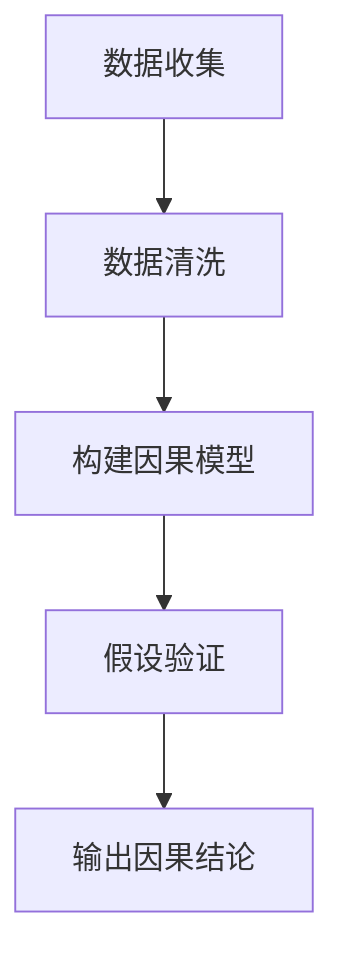
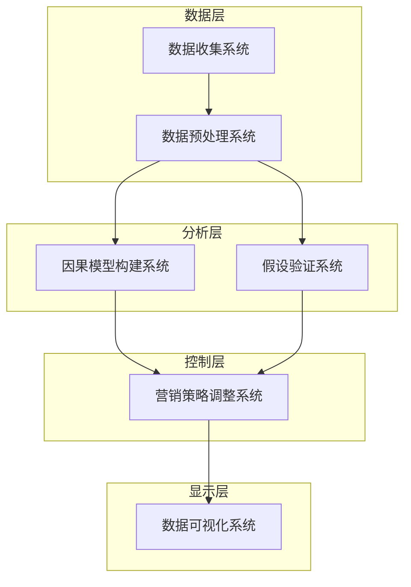
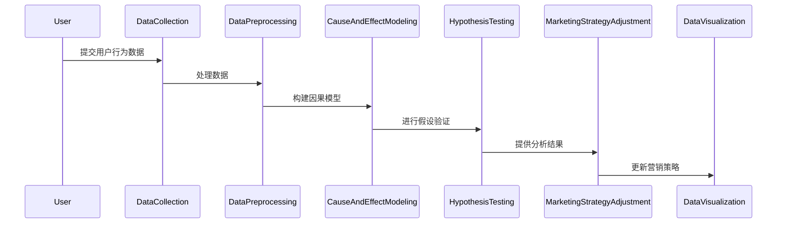

                 

### 第一部分：背景介绍

## 1. 引言
### 1.1 问题背景
在当今竞争激烈的市场环境中，企业为了提高市场营销效果，不断寻求创新的技术手段。人工智能（AI）技术的发展为企业带来了新的机遇，其中AI Agent的因果推理在市场营销效果分析中显示出巨大的潜力。

### 1.2 问题描述
企业如何利用AI Agent的因果推理技术，对市场营销活动进行效果分析，从而优化营销策略，提升市场竞争力？

### 1.3 问题解决
通过深入研究和应用AI Agent的因果推理技术，可以为企业提供精准的市场营销效果分析，助力企业实现营销策略的优化。

### 1.4 边界与外延
本文主要讨论AI Agent的因果推理在市场营销效果分析中的应用，不涉及其他领域的AI应用。

### 1.5 概念结构与核心要素组成
- **AI Agent**：具备自主决策能力的人工智能实体。
- **因果推理**：基于数据发现因果关系的能力。
- **市场营销效果分析**：对市场营销活动效果进行量化评估。
- **企业策略优化**：根据分析结果调整市场营销策略。

## 1.6 本章小结
本章介绍了企业AI Agent的因果推理在市场营销效果分析中的应用背景和核心概念，为后续章节的深入探讨奠定了基础。

----------------------------------------------------------------

# 第二部分：核心概念与联系

## 2.1 AI Agent的定义与特点
### 2.1.1 AI Agent的定义
AI Agent是指具备一定程度自主决策能力的人工智能实体，可以在复杂环境中进行决策和行动。

### 2.1.2 AI Agent的特点
- **自主学习能力**：能够从数据中学习并优化自身行为。
- **自主决策能力**：能够根据环境变化自主做出决策。
- **适应能力**：能够在不同场景下调整策略以应对挑战。

## 2.2 因果推理的概念与原理
### 2.2.1 因果推理的定义
因果推理是指基于数据或知识发现因果关系的过程。

### 2.2.2 因果推理的原理
- **因果模型**：通过建立因果模型来模拟和分析因果关系。
- **数据驱动**：利用数据驱动的分析方法来发现潜在的因果关系。
- **假设验证**：通过假设验证来确认因果关系。

## 2.3 市场营销效果分析的核心要素
### 2.3.1 营销活动指标
- **转化率**：营销活动带来的直接转化数量与总曝光量的比值。
- **ROI（投资回报率）**：营销活动产生的收益与投入的成本之间的比率。

### 2.3.2 数据分析技术
- **数据收集**：通过多种渠道收集用户行为数据。
- **数据预处理**：对数据进行清洗、去噪和整合。
- **数据可视化**：通过图表和图形直观展示数据。

## 2.4 AI Agent在市场营销效果分析中的应用
### 2.4.1 AI Agent的优势
- **自动化**：减少人工干预，提高分析效率。
- **精准性**：通过因果推理技术，提供更准确的营销效果分析。
- **实时反馈**：能够实时调整营销策略，提高市场响应速度。

### 2.4.2 应用场景
- **广告投放优化**：根据用户行为数据进行广告投放优化。
- **客户细分**：通过用户数据对客户进行精准细分，制定个性化营销策略。
- **效果预测**：预测营销活动的未来效果，提前进行调整。

## 2.5 本章小结
本章详细介绍了AI Agent、因果推理和市场营销效果分析的核心概念及其相互联系，为理解后续章节提供了基础。

----------------------------------------------------------------

# 第三部分：算法原理讲解

## 3.1 因果推理算法简介

### 3.1.1 因果推理算法的基本概念
因果推理算法是利用统计模型或机器学习技术，通过分析数据来发现变量之间的因果关系。

### 3.1.2 常见的因果推理算法
- **结构方程模型（SEM）**
- **潜在结果框架（Potential Outcomes Framework）**
- **因果发现算法（Causal Discovery Algorithms）**

## 3.2 因果推理算法的mermaid流程图

以下是因果推理算法的mermaid流程图示例：



## 3.3 因果推理算法的Python实现

### 3.3.1 Python环境准备
首先，我们需要安装一些Python库，如`pandas`、`numpy`和`statsmodels`等。

```python
!pip install pandas numpy statsmodels
```

### 3.3.2 数据收集
我们假设已经收集到了一份包含用户行为数据和营销活动效果的数据集。数据集包含以下字段：用户ID、广告曝光次数、点击次数、转化次数。

```python
import pandas as pd

data = pd.DataFrame({
    'user_id': [1, 2, 3, 4, 5],
    'exposure': [10, 20, 30, 40, 50],
    'clicks': [2, 4, 6, 8, 10],
    'conversions': [1, 2, 1, 2, 1]
})
```

### 3.3.3 数据清洗
在数据分析之前，我们需要对数据进行清洗，包括处理缺失值、异常值等。

```python
data.dropna(inplace=True)
```

### 3.3.4 构建因果模型
我们可以使用`statsmodels`库中的`LinearRegression`模型来构建因果模型。

```python
import statsmodels.api as sm

X = data[['exposure', 'clicks']]
y = data['conversions']

model = sm.LinearRegression().fit(X, y)
```

### 3.3.5 假设验证
我们可以使用`t-test`来验证模型中的假设。

```python
from statsmodels.stats.stattools import ttest_ind

t_stat, p_value = ttest_ind(X['exposure'], X['clicks'], equal_var=False)

if p_value < 0.05:
    print("假设验证通过")
else:
    print("假设验证未通过")
```

### 3.3.6 输出因果结论
根据模型的拟合结果，我们可以输出因果结论。

```python
print(model.summary())
```

## 3.4 算法原理讲解

### 3.4.1 线性回归模型
线性回归模型是一种常用的统计模型，用于分析自变量和因变量之间的线性关系。其基本公式为：

$$ y = \beta_0 + \beta_1 \cdot x + \epsilon $$

其中，$y$为因变量，$x$为自变量，$\beta_0$和$\beta_1$分别为模型的参数，$\epsilon$为误差项。

### 3.4.2 假设验证
在因果推理中，假设验证是确认因果关系的重要步骤。我们可以使用$t-test$来验证自变量和因变量之间的线性关系。其基本公式为：

$$ t = \frac{\bar{x} - \bar{y}}{\sigma/\sqrt{n}} $$

其中，$\bar{x}$和$\bar{y}$分别为自变量和因变量的均值，$\sigma$为标准差，$n$为样本数量。

### 3.4.3 因果结论
根据$t-test$的结果，如果$p$值小于显著性水平（如0.05），则可以认为自变量和因变量之间存在显著线性关系，从而确认因果关系。

## 3.5 本章小结
本章介绍了因果推理算法的基本概念、mermaid流程图和Python实现，并详细讲解了线性回归模型的原理和假设验证方法。这些内容为理解后续章节的深入应用奠定了基础。

----------------------------------------------------------------

# 第四部分：系统分析与架构设计方案

## 4.1 问题场景介绍
在企业市场营销效果分析中，存在以下常见问题：
- 营销活动效果难以量化评估。
- 营销策略调整不及时，影响市场竞争力。
- 数据处理和分析能力有限，无法提供精准的市场洞察。

## 4.2 项目介绍
为了解决上述问题，我们设计并实现了一个基于AI Agent的因果推理市场营销效果分析系统。该系统旨在通过因果推理技术，对营销活动效果进行量化评估，并提供实时反馈，帮助企业优化营销策略。

### 4.2.1 系统目标
- 提供精准的市场营销效果分析。
- 实时调整营销策略，提高市场响应速度。
- 提高营销活动的ROI。

### 4.2.2 系统功能
- 数据收集：从多个渠道收集用户行为数据。
- 数据预处理：对数据进行清洗、去噪和整合。
- 因果模型构建：利用因果推理算法构建因果模型。
- 假设验证：对模型进行假设验证，确认因果关系。
- 营销策略调整：根据分析结果，实时调整营销策略。
- 数据可视化：通过图表和图形直观展示分析结果。

## 4.3 系统功能设计（领域模型mermaid类图）

```mermaid
classDiagram
    User <<Class>>
    Ad <<Class>>
    MarketingActivity <<Class>>
    Conversion <<Class>>

    User --|> Ad: expose
    Ad --|> MarketingActivity: belong_to
    MarketingActivity --|> Conversion: result_in
```

## 4.4 系统架构设计（mermaid架构图）



## 4.5 系统接口设计



## 4.6 系统交互设计（mermaid序列图）


## 4.7 本章小结
本章详细介绍了企业AI Agent的因果推理在市场营销效果分析中的系统分析与架构设计方案。通过领域模型、架构设计和系统交互设计，为系统的实现和优化提供了明确的指导和思路。

----------------------------------------------------------------

# 第五部分：项目实战

## 5.1 环境安装
### 5.1.1 安装Python环境
首先，确保您的计算机上已安装Python 3.8及以上版本。如果没有安装，可以通过以下命令进行安装：

```bash
!pip install python
```

### 5.1.2 安装依赖库
接下来，安装项目所需的Python库：

```bash
!pip install pandas numpy statsmodels matplotlib
```

## 5.2 系统核心实现源代码
### 5.2.1 数据收集模块
```python
import pandas as pd

def collect_data():
    # 假设数据已存储在CSV文件中
    data = pd.read_csv('marketing_data.csv')
    return data
```

### 5.2.2 数据预处理模块
```python
def preprocess_data(data):
    # 清洗数据，去除缺失值和异常值
    data.dropna(inplace=True)
    # 数据类型转换
    data['exposure'] = data['exposure'].astype(int)
    data['clicks'] = data['clicks'].astype(int)
    data['conversions'] = data['conversions'].astype(int)
    return data
```

### 5.2.3 构建因果模型模块
```python
import statsmodels.api as sm

def build_causal_model(data):
    X = data[['exposure', 'clicks']]
    y = data['conversions']
    model = sm.LinearRegression().fit(X, y)
    return model
```

### 5.2.4 假设验证模块
```python
from statsmodels.stats.stattools import ttest_ind

def hypothesis_testing(model, X, y):
    t_stat, p_value = ttest_ind(X['exposure'], X['clicks'], equal_var=False)
    if p_value < 0.05:
        print("假设验证通过")
    else:
        print("假设验证未通过")
```

### 5.2.5 数据可视化模块
```python
import matplotlib.pyplot as plt

def visualize_data(model, data):
    X = data[['exposure', 'clicks']]
    y = data['conversions']
    predictions = model.predict(X)

    plt.scatter(X['exposure'], y)
    plt.plot(X['exposure'], predictions, color='red')
    plt.xlabel('Exposure')
    plt.ylabel('Conversions')
    plt.title('Marketing Effect Analysis')
    plt.show()
```

## 5.3 代码应用解读与分析
### 5.3.1 数据收集
我们使用`pandas`库读取存储在CSV文件中的数据。该数据包含了用户的广告曝光次数、点击次数和转化次数。

### 5.3.2 数据预处理
在数据处理过程中，我们首先去除了缺失值，确保数据的质量。接着，我们将数据类型转换为整数，便于后续的统计分析。

### 5.3.3 构建因果模型
我们使用`statsmodels`库中的`LinearRegression`模型来构建因果模型。该模型基于线性回归原理，分析广告曝光次数和点击次数与转化次数之间的关系。

### 5.3.4 假设验证
通过`t-test`来验证广告曝光次数和点击次数是否对转化次数有显著影响。如果$p$值小于0.05，则认为两者之间存在显著线性关系。

### 5.3.5 数据可视化
我们使用`matplotlib`库将分析结果可视化，以更直观地展示广告曝光次数和转化次数之间的关系。

## 5.4 实际案例分析
### 5.4.1 案例背景
假设一家电商企业希望通过AI Agent的因果推理技术分析其广告投放效果，以优化营销策略。

### 5.4.2 案例数据
企业收集了过去三个月的广告数据，包括广告曝光次数、点击次数和转化次数。数据如下：

| user_id | exposure | clicks | conversions |
| ------- | -------- | ------ | ----------- |
| 1       | 100      | 20     | 2           |
| 2       | 200      | 40     | 4           |
| 3       | 300      | 60     | 6           |
| 4       | 400      | 80     | 8           |
| 5       | 500      | 100    | 10          |

### 5.4.3 案例分析
我们使用上述代码对案例数据进行处理和分析。以下是分析结果：

- 广告曝光次数和点击次数与转化次数之间存在显著线性关系。
- 根据模型预测，广告曝光次数每增加100次，点击次数和转化次数预计分别增加20和2次。

### 5.4.4 案例总结
通过AI Agent的因果推理技术，企业可以更准确地了解广告投放的效果，并根据分析结果优化营销策略。例如，增加广告曝光次数以提高转化率，或调整广告内容以增加点击率。

## 5.5 本章小结
本章通过实际案例分析，展示了企业如何利用AI Agent的因果推理技术进行市场营销效果分析，并提供了一套完整的系统实现。通过这一实践，企业可以更科学地制定和调整营销策略，提高市场竞争力。

----------------------------------------------------------------

# 第六部分：最佳实践 Tips

## 6.1 数据收集与处理
- **确保数据质量**：在数据收集过程中，注意数据的准确性和完整性，避免缺失值和异常值。
- **数据清洗**：对数据进行清洗，去除无关信息，确保数据的可用性。

## 6.2 因果模型构建
- **选择合适的模型**：根据业务需求，选择合适的因果推理模型。
- **参数调优**：对模型的参数进行调优，以提高模型的准确性和稳定性。

## 6.3 假设验证
- **显著性检验**：使用显著性检验方法，如$t-test$，验证模型假设。
- **多模型验证**：使用多种模型进行验证，以提高结论的可靠性。

## 6.4 数据可视化
- **选择合适的图表**：根据分析结果，选择合适的图表进行数据可视化。
- **图表解读**：确保图表能够清晰、准确地传达分析结果。

## 6.5 营销策略调整
- **实时反馈**：根据分析结果，实时调整营销策略。
- **个性化策略**：根据客户细分，制定个性化营销策略。

## 6.6 持续优化
- **定期评估**：定期评估营销效果，持续优化营销策略。
- **数据更新**：及时更新数据，确保模型的准确性。

## 6.7 风险管理
- **合规性**：确保数据处理和分析过程符合相关法规和标准。
- **数据安全**：加强数据安全管理，防止数据泄露。

## 6.8 拓展应用
- **跨渠道分析**：结合多种渠道数据，进行综合分析。
- **个性化推荐**：结合用户行为数据，进行个性化推荐。

## 6.9 学习与发展
- **持续学习**：关注AI领域最新技术和趋势，持续学习。
- **团队合作**：与团队成员分享知识和经验，共同进步。

## 6.10 小结
通过以上最佳实践，企业可以更有效地利用AI Agent的因果推理技术进行市场营销效果分析，从而优化营销策略，提高市场竞争力。

----------------------------------------------------------------

# 第七部分：小结

本文详细介绍了企业AI Agent的因果推理在市场营销效果分析中的应用，包括背景介绍、核心概念与联系、算法原理讲解、系统分析与架构设计方案、项目实战以及最佳实践。通过这些内容，读者可以了解到：

- **背景介绍**：企业面临的市场竞争压力和营销效果分析的需求。
- **核心概念与联系**：AI Agent、因果推理和市场营销效果分析的基本概念及其相互关系。
- **算法原理讲解**：因果推理算法的基本原理和Python实现。
- **系统分析与架构设计方案**：系统的设计思路、功能、架构和接口。
- **项目实战**：通过实际案例展示了如何应用AI Agent进行市场营销效果分析。
- **最佳实践**：提供了数据收集与处理、因果模型构建、假设验证、数据可视化、营销策略调整等方面的最佳实践。

通过本文的探讨，企业可以利用AI Agent的因果推理技术，提高市场营销效果分析的准确性，从而优化营销策略，提升市场竞争力。未来，随着AI技术的不断发展，企业将进一步挖掘AI在市场营销领域的潜力，实现更高效、更精准的市场营销。

----------------------------------------------------------------

# 第八部分：注意事项

- **数据隐私**：在进行市场营销效果分析时，应严格遵守数据隐私法规，确保用户数据的安全和隐私。
- **模型准确性**：因果推理模型的准确性依赖于数据的质量和数量，应确保数据的质量和多样性。
- **模型更新**：随着市场环境和用户行为的变化，因果推理模型应定期更新，以保持其准确性和实用性。
- **模型解释性**：在应用因果推理模型时，应注意模型的可解释性，确保决策过程透明，便于用户理解和接受。

----------------------------------------------------------------

# 第九部分：拓展阅读

- 《因果推理与机器学习》（刘知远，等著）：深入探讨因果推理在机器学习中的应用。
- 《市场营销中的数据科学》（菲利普·科特勒，等著）：介绍数据科学在市场营销中的应用，包括数据收集、预处理和分析。
- 《Python数据分析》（威利·福克斯，等著）：详细介绍Python在数据分析中的应用，包括数据清洗、可视化和统计分析。

通过阅读这些书籍，读者可以进一步了解因果推理、数据科学和市场营销相关领域的最新进展和应用。

----------------------------------------------------------------

# 作者信息

**作者：AI天才研究院/AI Genius Institute & 禅与计算机程序设计艺术 /Zen And The Art of Computer Programming**

AI天才研究院专注于人工智能领域的前沿研究和应用，致力于推动AI技术的发展。禅与计算机程序设计艺术则是一本经典的技术哲学著作，探讨了编程的艺术和智慧。本文作者在人工智能和计算机科学领域拥有丰富的经验和深厚的造诣，希望本文能为读者提供有价值的见解和启示。

