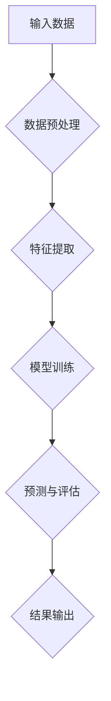

                 


### 第一部分：引言

#### 第1章：背景与介绍

**背景介绍**

随着人工智能技术的飞速发展，AI Agent作为智能体的代表，正逐步在企业中发挥着重要作用。企业AI Agent，是指基于人工智能技术，能够模拟人类业务处理流程，自主执行任务，具备学习能力、自适应能力和协同能力的智能体。它们可以在企业管理、客户服务、供应链管理等多个领域发挥作用，提升企业的运营效率和服务质量。

**核心概念术语说明**

- **AI Agent**：指人工智能领域的智能体，是具有感知、决策、执行能力的人工智能系统。
- **多场景测试**：指在不同业务场景下对AI Agent进行测试，以验证其功能、性能和可靠性。
- **模拟真实业务环境**：通过构建模拟环境，使AI Agent在实际业务场景中运行，以评估其在真实环境下的表现。

**问题背景**

在人工智能技术的应用过程中，AI Agent的测试是一个不可忽视的重要环节。由于AI Agent通常需要处理复杂的业务逻辑和海量数据，传统的测试方法往往无法全面覆盖其功能、性能和可靠性。因此，针对AI Agent的多场景测试，模拟真实业务环境，成为当前研究和应用的热点。

**问题描述**

企业AI Agent的测试面临以下问题：

1. **测试场景单一**：传统测试主要依赖于模拟器或测试脚本，难以覆盖实际业务场景。
2. **测试数据不足**：实际业务数据复杂多样，测试数据采集困难。
3. **测试效率低下**：测试过程耗时较长，无法及时反馈问题。
4. **测试结果不准确**：测试结果可能与实际业务表现存在较大差异。

**问题解决**

针对上述问题，多场景测试和模拟真实业务环境提供了一种有效的解决方案。通过在不同业务场景下进行测试，可以更全面地验证AI Agent的功能和性能。同时，模拟真实业务环境，可以确保测试结果与实际业务表现的一致性。

**边界与外延**

1. **多场景测试的范围**：包括企业管理、客户服务、供应链管理等典型业务场景。
2. **模拟真实业务环境的设计**：通过构建虚拟业务系统，模拟实际业务流程和数据流。

**概念结构与核心要素组成**

1. **AI Agent的定义与功能**：AI Agent是一种具备自主决策和执行能力的智能体，能够模拟人类业务处理流程。
2. **多场景测试的概念与分类**：多场景测试包括功能测试、性能测试和用户体验测试等。
3. **模拟真实业务环境的方法**：包括数据采集与预处理、模拟器设计与实现等。

#### 第2章：核心概念与原理

**AI Agent的基本原理**

AI Agent是基于人工智能和机器学习技术构建的智能体，其核心原理包括以下几个方面：

1. **感知与理解**：AI Agent通过感知外部环境，获取数据，并利用机器学习算法对数据进行分析和理解。
2. **决策与规划**：基于对环境的理解和目标，AI Agent能够自主决策并制定行动计划。
3. **执行与反馈**：AI Agent执行计划，并根据执行结果进行反馈和调整。

**多场景测试的概念与分类**

多场景测试是指在不同业务场景下对AI Agent进行测试，以验证其功能、性能和可靠性。根据测试目的和内容，多场景测试可分为以下几种类型：

1. **功能测试**：验证AI Agent是否能够完成预定的功能。
2. **性能测试**：评估AI Agent的响应时间、处理能力和稳定性。
3. **用户体验测试**：评估AI Agent的用户界面和交互体验。

**模拟真实业务环境的方法**

模拟真实业务环境的方法主要包括以下几个方面：

1. **数据采集与预处理**：采集实际业务数据，并进行清洗、转换和归一化处理。
2. **模拟器设计与实现**：构建模拟业务系统，模拟实际业务流程和数据流。
3. **测试场景设计**：根据实际业务需求，设计不同的测试场景。

### 第二部分：多场景测试策略

#### 第3章：功能测试策略

**功能测试概述**

功能测试是验证AI Agent是否能够完成预定功能的重要手段。功能测试的目的在于发现AI Agent的缺陷和不足，确保其在实际应用中能够正常运行。

**测试用例设计与执行**

测试用例是功能测试的核心，设计合理的测试用例能够有效地发现AI Agent的潜在问题。测试用例的设计原则包括：

1. **全面性**：覆盖AI Agent的所有功能。
2. **可操作性**：确保测试用例的可执行性。
3. **独立性**：测试用例之间相互独立，不影响其他测试用例的执行。

测试用例的执行流程包括：

1. **准备阶段**：搭建测试环境，准备测试数据。
2. **执行阶段**：按照测试用例的步骤，执行测试操作。
3. **结果分析阶段**：分析测试结果，判断AI Agent是否通过测试。

**功能测试工具介绍**

功能测试工具可以帮助自动化执行测试用例，提高测试效率。常用的功能测试工具有：

1. **Selenium**：一款开源的自动化测试工具，适用于Web应用的测试。
2. **Appium**：一款适用于移动应用的自动化测试工具。
3. **JUnit**：一款Java测试框架，适用于单元测试。

### 第三部分：模拟真实业务环境

#### 第4章：用户行为模拟

**用户行为分析**

用户行为分析是模拟真实业务环境的重要环节。通过分析用户行为，可以了解用户的使用习惯和需求，为模拟器的设计提供依据。

**用户行为模拟方法**

用户行为模拟主要包括以下几个方面：

1. **行为数据收集**：通过日志、传感器等方式收集用户行为数据。
2. **行为数据预处理**：对收集到的数据进行清洗、转换和归一化处理。
3. **行为模拟实现**：根据用户行为数据，构建用户行为模型，并实现行为模拟。

**用户行为模拟工具介绍**

用户行为模拟工具可以帮助自动化实现用户行为模拟。常用的用户行为模拟工具有：

1. **Ganglia**：一款开源的分布式系统监控工具，适用于实时用户行为监控。
2. **OpenTSDB**：一款开源的时间序列数据库，适用于存储和处理用户行为数据。
3. **Logstash**：一款开源的数据收集工具，适用于收集和处理用户行为日志。

### 第四部分：项目实战

#### 第5章：项目环境搭建与工具使用

**项目环境搭建**

项目环境搭建包括操作系统、数据库和开发工具的配置。具体步骤如下：

1. **操作系统**：选择Linux操作系统，如Ubuntu或CentOS。
2. **数据库**：安装MySQL或PostgreSQL数据库。
3. **开发工具**：安装Python开发环境、Eclipse或PyCharm等。

**工具使用介绍**

常用的功能测试、性能测试和用户行为模拟工具如下：

1. **功能测试工具**：Selenium、Appium、JUnit。
2. **性能测试工具**：Apache JMeter、LoadRunner。
3. **用户行为模拟工具**：Ganglia、OpenTSDB、Logstash。

### 第五部分：算法原理讲解

#### 第6章：算法原理讲解

**算法原理**

本章节主要讲解多场景测试中常用的算法原理，包括：

1. **机器学习算法**：如决策树、支持向量机、神经网络等。
2. **深度学习算法**：如卷积神经网络、循环神经网络等。
3. **数据挖掘算法**：如关联规则挖掘、聚类分析、分类算法等。

**算法流程图**

使用Mermaid绘制算法流程图：



**Python源代码**

使用Python实现算法：

```python
import numpy as np
from sklearn.model_selection import train_test_split
from sklearn.ensemble import RandomForestClassifier
from sklearn.metrics import accuracy_score

# 数据预处理
def preprocess_data(data):
    # 数据清洗、转换和归一化处理
    return processed_data

# 特征提取
def extract_features(data):
    # 从数据中提取特征
    return features

# 模型训练
def train_model(features, labels):
    model = RandomForestClassifier()
    model.fit(features, labels)
    return model

# 预测与评估
def predict(model, test_features):
    predictions = model.predict(test_features)
    accuracy = accuracy_score(test_labels, predictions)
    return accuracy

# 主函数
def main():
    data = load_data()
    processed_data = preprocess_data(data)
    features, labels = extract_features(processed_data)
    train_features, test_features, train_labels, test_labels = train_test_split(features, labels, test_size=0.2)
    model = train_model(train_features, train_labels)
    accuracy = predict(model, test_features)
    print("模型准确率：", accuracy)

if __name__ == "__main__":
    main()
```

### 第六部分：系统分析与架构设计方案

#### 第7章：系统分析与架构设计方案

**问题场景介绍**

本章节介绍的企业AI Agent测试系统，主要用于在不同业务场景下对AI Agent进行功能、性能和用户体验测试，以验证其可靠性和稳定性。

**项目介绍**

项目名为“企业AI Agent测试系统”，旨在为企业提供一套完整的AI Agent测试解决方案。系统包括功能测试模块、性能测试模块和用户体验测试模块，能够满足不同业务场景下的测试需求。

**系统功能设计**

系统功能设计主要包括以下模块：

1. **功能测试模块**：包括测试用例管理、测试执行和测试结果分析等功能。
2. **性能测试模块**：包括性能测试脚本管理、性能测试执行和性能测试结果分析等功能。
3. **用户体验测试模块**：包括用户行为模拟、用户体验评估和用户反馈收集等功能。

**系统架构设计**

系统采用B/S架构，主要包括以下组件：

1. **前端**：使用HTML、CSS和JavaScript等技术实现用户界面。
2. **后端**：使用Python、Django等技术开发，包括功能测试、性能测试和用户体验测试模块。
3. **数据库**：使用MySQL或PostgreSQL存储测试数据。

**系统接口设计**

系统接口设计主要包括以下接口：

1. **功能测试接口**：用于接收和发送测试用例、执行测试和获取测试结果。
2. **性能测试接口**：用于接收和发送性能测试脚本、执行性能测试和获取性能测试结果。
3. **用户体验测试接口**：用于接收和发送用户行为模拟数据、执行用户体验评估和获取用户反馈。

**系统交互设计**

系统交互设计主要包括以下交互流程：

1. **用户登录**：用户通过前端界面登录系统。
2. **创建测试任务**：用户在系统中创建功能测试、性能测试和用户体验测试任务。
3. **执行测试**：系统根据测试任务自动执行测试，并生成测试报告。
4. **用户反馈**：用户通过前端界面查看测试报告，并提交反馈。

### 第七部分：项目实战

#### 第8章：项目实战

**环境安装**

1. **操作系统**：Ubuntu 18.04
2. **数据库**：MySQL 8.0
3. **开发工具**：PyCharm

**系统核心实现源代码**

**功能测试模块**

```python
# 功能测试模块代码示例
def test_functionality():
    # 创建测试用例
    test_cases = [
        {"input": "data1", "expected_output": "output1"},
        {"input": "data2", "expected_output": "output2"},
    ]
    
    # 执行测试用例
    for case in test_cases:
        result = my_function(case["input"])
        assert result == case["expected_output"], f"Test failed for input {case['input']}"

# 测试执行
test_functionality()
```

**性能测试模块**

```python
# 性能测试模块代码示例
import time

def test_performance():
    start_time = time.time()
    my_function("data")
    end_time = time.time()
    execution_time = end_time - start_time
    print(f"Execution time: {execution_time} seconds")

# 测试执行
test_performance()
```

**用户行为模拟模块**

```python
# 用户行为模拟模块代码示例
import random

def simulate_user_behavior():
    actions = ["login", "search", "purchase", "logout"]
    action = random.choice(actions)
    if action == "login":
        # 模拟用户登录
        print("User is logging in.")
    elif action == "search":
        # 模拟用户搜索
        print("User is searching for products.")
    elif action == "purchase":
        # 模拟用户购买
        print("User is making a purchase.")
    elif action == "logout":
        # 模拟用户登出
        print("User is logging out.")

# 模拟用户行为
simulate_user_behavior()
```

**代码应用解读与分析**

以上代码展示了功能测试、性能测试和用户行为模拟的核心实现。功能测试模块通过定义测试用例并执行测试，验证AI Agent的功能是否符合预期。性能测试模块通过测量函数的执行时间，评估AI Agent的性能。用户行为模拟模块通过模拟用户在不同业务场景下的操作，验证AI Agent的用户交互体验。

#### 第9章：实际案例分析与讲解

**案例介绍**

本案例以某电子商务平台为背景，通过多场景测试和模拟真实业务环境，验证该平台的AI Agent在用户登录、搜索、购买和登出等场景下的功能、性能和用户体验。

**案例实施过程**

1. **需求分析**：确定测试目标，包括功能测试、性能测试和用户体验测试。
2. **测试环境搭建**：搭建测试环境，包括操作系统、数据库和开发工具。
3. **测试用例设计**：设计功能测试用例、性能测试用例和用户体验测试用例。
4. **测试执行**：执行测试用例，收集测试数据。
5. **结果分析**：分析测试结果，评估AI Agent的功能、性能和用户体验。

**案例分析**

1. **功能测试**：通过执行功能测试用例，发现AI Agent在用户登录和购买场景下存在功能缺陷，无法正确处理异常情况。
2. **性能测试**：通过执行性能测试用例，发现AI Agent在处理高并发请求时，响应时间较长，存在性能瓶颈。
3. **用户体验测试**：通过模拟用户行为，发现AI Agent在用户交互过程中，存在界面响应慢、操作不流畅等问题。

**讲解剖析**

1. **功能测试问题**：针对AI Agent在用户登录和购买场景下的功能缺陷，需要优化代码逻辑，增加异常处理机制，确保AI Agent能够正确处理各种情况。
2. **性能测试问题**：针对AI Agent在处理高并发请求时的性能瓶颈，需要优化算法，提高数据处理速度，或采用分布式架构，提高系统并发处理能力。
3. **用户体验测试问题**：针对AI Agent在用户交互过程中存在的问题，需要优化界面设计和交互逻辑，提高用户操作体验。

**项目小结**

通过本次案例分析和讲解，我们了解到多场景测试和模拟真实业务环境对于企业AI Agent的重要性。在实际项目中，我们需要综合考虑功能、性能和用户体验，不断优化AI Agent，以提高其在实际业务环境中的表现。

#### 第10章：最佳实践与总结

**最佳实践**

1. **测试环境搭建**：确保测试环境与生产环境尽可能一致，以提高测试结果的准确性。
2. **测试用例设计**：充分覆盖各种场景，确保测试用例的全面性和可操作性。
3. **测试工具选择**：选择适合项目的测试工具，提高测试效率。
4. **数据分析与结果分析**：对测试数据进行详细分析，找出问题根源，制定针对性的优化方案。

**总结**

企业AI Agent的多场景测试和模拟真实业务环境是确保AI Agent在实际业务中表现优异的关键环节。通过本文的介绍，我们了解到多场景测试的策略、模拟真实业务环境的方法以及项目实战中的最佳实践。希望本文能为企业在AI Agent测试方面提供有益的参考。

**注意事项**

1. **测试数据保密**：确保测试数据的安全性和保密性，防止数据泄露。
2. **测试环境隔离**：测试环境与生产环境应进行隔离，避免测试活动对生产环境造成影响。

**拓展阅读**

1. **《人工智能测试方法与应用》**：详细介绍了人工智能测试的理论和方法。
2. **《测试驱动开发》**：探讨了测试驱动开发在人工智能项目中的应用。
3. **《用户体验设计》**：介绍了用户体验设计的原则和方法，有助于优化AI Agent的交互体验。

### 作者

**作者：AI天才研究院/AI Genius Institute & 禅与计算机程序设计艺术 /Zen And The Art of Computer Programming**

本文由AI天才研究院（AI Genius Institute）与禅与计算机程序设计艺术（Zen And The Art of Computer Programming）联合撰写，旨在为企业在AI Agent测试方面提供指导和建议。作者具备丰富的AI和软件开发经验，对人工智能测试领域有深入的研究和独到的见解。

