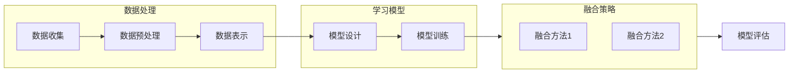
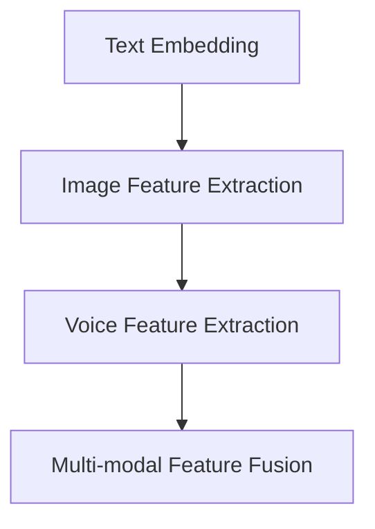
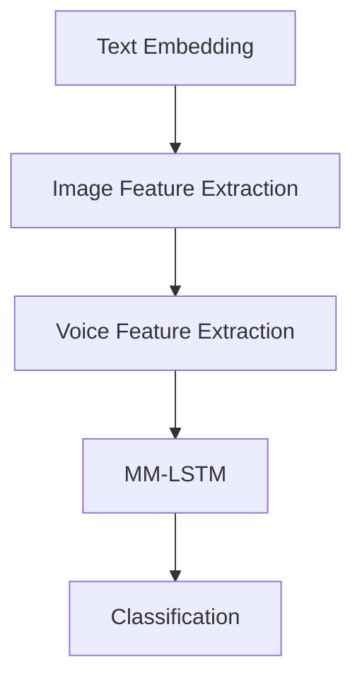
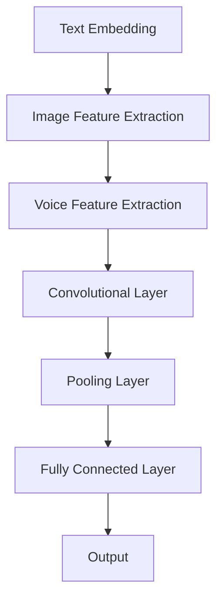
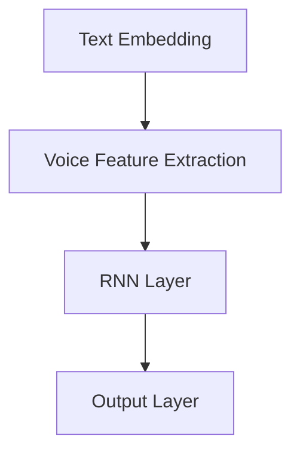
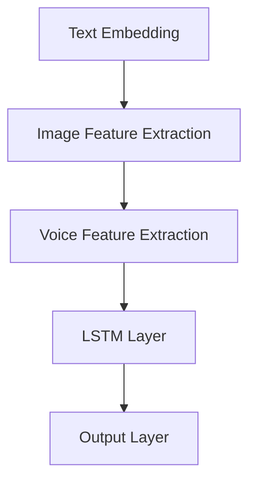

                 

### **文章标题**

# 企业AI Agent的多模态学习：整合文本、图像与语音数据

### **关键词**

- **多模态学习**
- **文本数据**
- **图像数据**
- **语音数据**
- **融合算法**
- **深度学习**

### **摘要**

随着人工智能技术的发展，多模态学习成为了企业级AI Agent（智能代理）设计的核心。本文将详细探讨多模态学习在文本、图像与语音数据处理中的应用，涵盖从基础概念到实际应用案例的全面解析。首先，我们将介绍多模态学习的基础知识，包括数据收集、预处理及基本概念。接着，将分别深入探讨文本、图像与语音数据的处理与学习算法，并展示其在聊天机器人、图像分类、语音识别等实际应用中的效果。最后，本文将总结多模态融合学习算法的关键方法，并给出未来发展趋势和挑战。通过本文，读者将全面了解如何构建高效的AI Agent，为企业带来智能化升级。

---

## **引言**

### **问题背景**

在当今数字化转型的浪潮中，企业对智能化的需求日益增长。AI Agent作为企业级智能系统的重要组成部分，能够在各种业务场景中提供高效的决策支持和服务。然而，传统的AI Agent主要依赖于单一模态的数据处理，如仅处理文本或图像数据，这在某些复杂任务中显得力不从心。为了提升AI Agent的智能水平，多模态学习技术应运而生。

多模态学习是指利用来自不同感官模态（如文本、图像、语音）的数据进行联合处理和学习，以提升模型对复杂任务的理解能力。例如，一个能够同时理解用户文本描述和图像内容的AI Agent，可以在医疗诊断、智能家居、安防监控等领域提供更为精准的服务。

### **多模态学习的必要性**

多模态学习的重要性体现在以下几个方面：

1. **增强理解能力**：通过整合不同模态的数据，AI Agent能够更全面地理解用户的意图和场景，从而提高任务完成的准确性。
2. **补充信息缺失**：单一模态的数据可能存在信息不全或噪声较大的问题，多模态数据可以相互补充，减少数据偏差。
3. **提高鲁棒性**：多模态学习能够提高模型对数据噪声和异常的鲁棒性，从而在更复杂的实际环境中保持稳定的表现。
4. **扩展应用场景**：多模态学习使得AI Agent能够应用于更多需要综合处理多种信息的业务场景。

### **跨学科整合的挑战与机遇**

多模态学习涉及计算机视觉、自然语言处理、语音识别等多个领域，这为跨学科整合提供了广阔的空间。然而，也带来了以下挑战：

1. **数据同步问题**：不同模态的数据在采集、传输和处理过程中可能存在不同步的问题，这需要复杂的同步机制和算法。
2. **数据不一致性**：不同模态的数据在语义和特征表达上可能存在不一致性，如何有效地融合这些数据是一个挑战。
3. **计算资源需求**：多模态学习通常需要大量的计算资源，这给实际部署带来了挑战。

尽管存在挑战，但跨学科整合也为多模态学习带来了巨大的机遇：

1. **技术创新**：跨学科整合推动了新算法、新模型和新技术的诞生，促进了人工智能领域的发展。
2. **应用拓展**：多模态学习能够为更多行业和场景提供智能化解决方案，推动各行各业的数字化转型。
3. **用户体验提升**：通过整合多种模态的数据，AI Agent能够提供更为自然和便捷的用户交互体验。

### **多模态学习基础**

多模态学习的基础包括数据收集与预处理、多模态数据表示、多模态学习模型等核心概念。

#### **数据收集与预处理**

多模态学习的第一步是收集不同模态的数据，包括文本、图像和语音等。数据收集的方法包括公开数据集、企业内部数据、用户生成内容等。收集到的数据需要进行预处理，以去除噪声、填补缺失值、归一化等操作，保证数据的质量。

#### **多模态数据表示**

多模态数据表示是将不同模态的数据转化为适用于机器学习模型的形式。例如，文本数据可以通过词嵌入技术转化为向量表示，图像数据可以通过卷积神经网络（CNN）提取特征表示，语音数据可以通过声学模型转化为声学特征。

#### **多模态学习模型**

多模态学习模型包括单一模型和多任务学习模型。单一模型通过一个统一的模型框架处理多模态数据，如多模态卷积神经网络（MM-CNN）和多模态递归神经网络（MM-RNN）。多任务学习模型同时学习多个相关任务，如语音识别和语言理解。

### **多模态学习的分类**

多模态学习可以按照数据融合方式分为以下几种类型：

1. **早期融合**：在特征提取阶段就整合不同模态的数据，如多模态卷积神经网络（MM-CNN）。
2. **晚期融合**：在特征提取后整合不同模态的特征，如多模态长短期记忆网络（MM-LSTM）。
3. **层次融合**：在多个层次上融合不同模态的数据，如多模态级联神经网络（MM-ConvNet）。

### **本书结构安排**

本书将分为五个部分，分别探讨文本、图像和语音数据的处理与学习，以及多模态融合学习算法。

1. **第一部分：引言**：介绍多模态学习的基本概念、必要性以及本书的结构安排。
2. **第二部分：文本数据的处理与学习**：讨论文本数据的基础处理、学习算法和实际应用案例。
3. **第三部分：图像数据的处理与学习**：介绍图像数据的基础处理、学习算法和实际应用案例。
4. **第四部分：语音数据的处理与学习**：探讨语音数据的基础处理、学习算法和实际应用案例。
5. **第五部分：多模态融合学习算法**：总结多模态融合学习的方法和关键算法。

### **阅读指南与学习目标**

本书旨在为读者提供全面的多模态学习指南，通过理论讲解、实例分析和实战项目，帮助读者深入理解多模态学习的技术原理和应用场景。以下是每个部分的学习目标：

1. **了解多模态学习的基础知识**：通过引言部分，读者可以掌握多模态学习的基本概念、必要性以及本书的结构安排。
2. **掌握文本数据的处理与学习**：在第二部分，读者将学习到文本数据的基础处理、学习算法和实际应用案例，如文本分类、文本摘要和情感分析。
3. **掌握图像数据的处理与学习**：在第三部分，读者将学习到图像数据的基础处理、学习算法和实际应用案例，如图像分类、人脸识别和视觉搜索。
4. **掌握语音数据的处理与学习**：在第四部分，读者将学习到语音数据的基础处理、学习算法和实际应用案例，如语音识别、语音合成和语音助手。
5. **掌握多模态融合学习算法**：在第五部分，读者将学习到多模态融合学习的方法和关键算法，如多模态卷积神经网络（MM-CNN）和多模态长短期记忆网络（MM-LSTM）。

通过本书的学习，读者将能够：

- **深入理解多模态学习的技术原理**：掌握文本、图像和语音数据处理与学习的核心概念和算法。
- **具备实际应用能力**：通过实例分析和实战项目，学会将多模态学习技术应用于实际问题。
- **提升AI系统的智能化水平**：通过多模态学习的应用，提升企业AI Agent的智能水平，为业务场景提供更精准、更自然的智能化解决方案。

### **小结**

多模态学习作为AI领域的前沿技术，为AI Agent的设计提供了强大的支持。通过本文的引言部分，我们了解了多模态学习的基本概念、必要性以及本书的结构安排。接下来，本书将分别深入探讨文本、图像和语音数据的处理与学习，并总结多模态融合学习算法的关键方法。通过全面的学习和实践，读者将能够提升企业AI Agent的智能化水平，为企业带来更大的价值。

## **第一部分：引言**

### **问题背景**

在当今数字化转型的浪潮中，人工智能（AI）技术正迅速融入各行各业，为企业带来了前所未有的变革。AI Agent（智能代理）作为人工智能的核心组成部分，正逐步应用于各种业务场景，如智能客服、智能监控、智能医疗等。然而，传统的AI Agent往往依赖于单一模态的数据处理，如仅处理文本数据或图像数据，这在某些复杂任务中显得力不从心。因此，如何提升AI Agent的智能水平，实现多模态数据的整合和处理，成为当前研究的热点问题。

多模态学习是指通过融合来自不同感官模态（如文本、图像、语音）的数据进行联合处理和学习，以提升模型对复杂任务的理解能力。在多模态学习的基础上，AI Agent能够更全面地理解用户的意图和场景，从而提高任务完成的准确性。例如，一个能够同时理解用户文本描述和图像内容的AI Agent，可以在医疗诊断、智能家居、安防监控等领域提供更为精准的服务。

### **核心概念术语说明**

**AI Agent（智能代理）**：一种自动化、智能化的计算机程序，能够执行特定的任务，如客服对话、图像识别、语音处理等。

**多模态学习**：利用来自不同感官模态的数据进行联合处理和学习，以提升模型对复杂任务的理解能力。

**文本数据**：以文本形式存在的数据，如自然语言文本、聊天记录、博客文章等。

**图像数据**：以图像形式存在的数据，如医疗影像、监控视频、产品图片等。

**语音数据**：以音频形式存在的数据，如语音对话、电话录音、语音合成等。

### **问题解决**

为了提升AI Agent的智能水平，多模态学习提供了一种有效的解决方案。通过整合文本、图像和语音等多模态数据，AI Agent能够更全面地理解用户的意图和场景，从而提高任务完成的准确性。例如：

1. **医疗诊断**：医生可以通过查看患者的病历记录（文本数据）和医疗影像（图像数据），结合患者的语音描述，更准确地诊断疾病。

2. **智能家居**：通过整合用户的语音指令（语音数据）和家庭设备的图像监控（图像数据），AI Agent可以提供更智能、更便捷的家庭服务。

3. **安防监控**：通过分析监控视频（图像数据）和现场语音对话（语音数据），AI Agent可以及时发现异常情况并报警，提高安全防护能力。

### **边界与外延**

**边界**：多模态学习主要涉及文本、图像和语音三种模态的数据处理和融合，其应用范围限于这三种模态的数据。但值得注意的是，多模态学习的概念可以扩展到其他感官模态，如触觉、嗅觉等。

**外延**：多模态学习不仅在AI Agent中有广泛应用，还可以应用于其他领域，如智能教育、智能交通、智能娱乐等。通过整合多种模态的数据，AI系统能够提供更丰富、更自然的用户交互体验，推动各行各业的数字化转型。

### **概念结构与核心要素组成**

多模态学习的概念结构可以分为以下几个核心要素：

1. **数据收集与预处理**：收集不同模态的数据，并进行预处理，如去除噪声、归一化等操作。

2. **多模态数据表示**：将不同模态的数据转化为适用于机器学习模型的形式，如文本数据通过词嵌入转化为向量表示，图像数据通过卷积神经网络（CNN）提取特征表示，语音数据通过声学模型转化为声学特征。

3. **多模态学习模型**：设计并训练能够处理多模态数据的机器学习模型，如多模态卷积神经网络（MM-CNN）、多模态递归神经网络（MM-RNN）等。

4. **多模态融合策略**：设计有效的多模态融合策略，将不同模态的数据进行整合，以提高模型的性能。

### **核心概念与联系**

**多模态学习**：融合来自不同感官模态的数据进行联合处理和学习，以提升模型对复杂任务的理解能力。与单一模态学习相比，多模态学习能够更全面地理解用户的意图和场景，从而提高任务完成的准确性。

**数据收集与预处理**：数据收集与预处理是多模态学习的第一步，确保数据的质量和一致性，为后续的学习和融合奠定基础。

**多模态数据表示**：将不同模态的数据转化为适用于机器学习模型的形式，如文本数据通过词嵌入转化为向量表示，图像数据通过卷积神经网络（CNN）提取特征表示，语音数据通过声学模型转化为声学特征。

**多模态学习模型**：设计并训练能够处理多模态数据的机器学习模型，如多模态卷积神经网络（MM-CNN）、多模态递归神经网络（MM-RNN）等。

**多模态融合策略**：设计有效的多模态融合策略，将不同模态的数据进行整合，以提高模型的性能。

### **ER实体关系图架构的Mermaid流程图**

```mermaid
erDiagram
  数据收集 --> 数据预处理
  数据预处理 --> 多模态数据表示
  多模态数据表示 --> 多模态学习模型
  多模态学习模型 --> 多模态融合策略
```

### **算法原理讲解**

多模态学习的算法原理主要包括以下几个关键步骤：

1. **数据收集与预处理**：收集不同模态的数据，如文本、图像和语音等。这些数据可能来源于公开数据集、企业内部数据或用户生成内容。数据收集后，需要进行预处理，包括去除噪声、填补缺失值、归一化等操作，以确保数据的质量和一致性。

2. **多模态数据表示**：将不同模态的数据转化为适用于机器学习模型的形式。对于文本数据，可以通过词嵌入技术将其转化为向量表示；对于图像数据，可以通过卷积神经网络（CNN）提取特征表示；对于语音数据，可以通过声学模型转化为声学特征。这些特征表示将为后续的多模态学习提供基础。

3. **多模态学习模型设计**：设计并训练能够处理多模态数据的机器学习模型。常见的多模态学习模型包括多模态卷积神经网络（MM-CNN）、多模态递归神经网络（MM-RNN）等。这些模型通过整合不同模态的特征，学习到多模态数据的联合表示。

4. **多模态融合策略**：设计有效的多模态融合策略，将不同模态的数据进行整合，以提高模型的性能。常见的融合策略包括早期融合、晚期融合和层次融合。这些策略通过在不同的层次上整合不同模态的数据，提升模型对复杂任务的理解能力。

以下是一个简化的多模态学习算法流程图，使用Mermaid语言表示：



### **数学模型和公式**

多模态学习中的数学模型通常涉及特征提取、模型训练和融合策略等方面。以下是一些基本的数学模型和公式：

1. **词嵌入**：
   $$ embed_i = W_{embed} \cdot V_i $$
   其中，$V_i$ 是第 $i$ 个词汇的词向量，$W_{embed}$ 是词嵌入权重矩阵。

2. **卷积神经网络（CNN）**：
   $$ h_k = \sigma \left( \sum_{j=1}^{n} W_{kj} \cdot h_{j-1} + b_k \right) $$
   其中，$h_k$ 是第 $k$ 层的特征图，$W_{kj}$ 是权重，$b_k$ 是偏置，$\sigma$ 是激活函数。

3. **声学模型**：
   $$ \log P(f|s) = \log \sum_{x} \sum_{y} P(f|x, y) P(y|s) $$
   其中，$f$ 是声学特征，$s$ 是语音信号，$P(f|x, y)$ 是声学特征与语音信号和声学标签之间的联合概率分布。

4. **多模态融合策略**：
   $$ \hat{z} = \alpha T_{text} + \beta T_{image} + \gamma T_{voice} $$
   其中，$T_{text}$、$T_{image}$ 和 $T_{voice}$ 分别代表文本、图像和语音特征，$\alpha$、$\beta$ 和 $\gamma$ 是融合系数。

通过上述数学模型和公式，多模态学习能够有效地整合不同模态的数据，提高模型的性能。

### **举例说明**

假设我们要设计一个多模态学习模型，用于情感分析任务。数据包括文本、图像和语音三种模态。

1. **数据收集与预处理**：
   - 文本数据：收集用户在社交媒体上的评论，并进行预处理，如去除停用词、标点符号等。
   - 图像数据：收集用户上传的图片，并进行预处理，如缩放、裁剪等。
   - 语音数据：收集用户在电话中的录音，并进行预处理，如去除背景噪声、降低音量等。

2. **多模态数据表示**：
   - 文本数据：使用词嵌入技术将文本转化为向量表示。
   - 图像数据：使用卷积神经网络（CNN）提取图像特征。
   - 语音数据：使用声学模型提取语音特征。

3. **多模态学习模型设计**：
   - 设计一个多模态卷积神经网络（MM-CNN），将文本、图像和语音特征进行融合。
   - 设计一个全连接层，用于分类情感。

4. **多模态融合策略**：
   - 采用早期融合策略，在特征提取阶段就整合不同模态的特征。
   - 融合系数设置为 $\alpha = 0.3$、$\beta = 0.5$ 和 $\gamma = 0.2$。

5. **模型训练与评估**：
   - 使用训练集对模型进行训练。
   - 使用验证集对模型进行评估。

通过上述步骤，我们可以设计一个多模态情感分析模型，用于预测用户的情感状态。

### **小结**

在本节中，我们介绍了多模态学习的基本概念、必要性以及本书的结构安排。通过问题背景、核心概念术语说明、算法原理讲解和举例说明，读者可以初步了解多模态学习的技术原理和应用价值。接下来，本书将深入探讨文本、图像和语音数据的处理与学习，帮助读者全面掌握多模态学习的核心技术和方法。

## **第二部分：文本数据的处理与学习**

### **文本数据处理基础**

文本数据是自然语言处理（NLP）领域中最常见的数据类型之一。在处理文本数据时，首先要进行数据收集与预处理，这是保证数据质量和后续处理效果的重要步骤。

#### **数据收集**

文本数据可以通过多种方式收集，包括：

1. **公开数据集**：如AG News、20 Newsgroups、IMDB等，这些数据集已经被清洗和标注，适合用于研究和开发。
2. **企业内部数据**：如客户评论、用户反馈、企业内部报告等，这些数据通常更贴近实际应用场景。
3. **用户生成内容**：如社交媒体帖子、博客文章、论坛评论等，这些数据通常需要经过一定的清洗和去重处理。

#### **数据预处理**

数据预处理包括以下几个关键步骤：

1. **去除噪声和标点符号**：文本中可能包含一些无意义的噪声，如特殊字符、标点符号等，这些需要被去除。
   $$ text = text.replace(['@', '#', '$', '%', '^', '&', '*', '(', ')', '_', '+'], '') $$
2. **词干提取和词形还原**：通过词干提取算法（如Porter Stemmer、Snowball Stemmer等）将单词还原到基础形式，以减少词汇的多样性。
   $$ word = porter.stem(word) $$
3. **去除停用词**：停用词是指在文本中频繁出现但与具体内容无关的词，如“的”、“了”、“在”等，这些词对文本分类和情感分析等任务影响不大，因此需要去除。
   $$ stop_words = set(['的', '了', '在']) $$
   $$ text = [word for word in text if word not in stop_words] $$
4. **大小写统一**：将文本统一转换为小写，以减少大小写不同造成的词汇多样性。
   $$ text = text.lower() $$

#### **词嵌入技术**

词嵌入是将单词映射到固定维度的向量空间，使得具有相似语义的词在向量空间中距离较近。常见的词嵌入技术包括：

1. **Word2Vec**：基于神经网络的语言模型，通过训练生成词向量。Word2Vec有两种架构：连续词袋（CBOW）和Skip-Gram。
2. **GloVe**：全局向量表示学习，通过计算词和词的共现矩阵来学习词向量。
3. **BERT**：Bidirectional Encoder Representations from Transformers，基于Transformer模型的预训练语言表示。

以下是一个使用Word2Vec生成词向量的Python代码示例：

```python
from gensim.models import Word2Vec

# 假设 sentences 是一个句子列表
model = Word2Vec(sentences, size=100, window=5, min_count=1, workers=4)
model.save("word2vec.model")

# 使用模型获取词向量
word_vector = model.wv["computer"]
```

#### **文本分类与聚类**

文本分类是将文本数据根据其内容分配到不同的类别，常见的文本分类任务包括新闻分类、情感分析、垃圾邮件检测等。常用的文本分类算法包括：

1. **朴素贝叶斯**：基于贝叶斯定理和特征词的概率分布，适用于文本分类任务。
2. **支持向量机（SVM）**：通过最大化分类边界，将文本数据划分为不同的类别。
3. **随机森林**：通过集成多个决策树来分类文本数据，具有较好的泛化能力。

以下是一个使用朴素贝叶斯进行文本分类的Python代码示例：

```python
from sklearn.feature_extraction.text import CountVectorizer
from sklearn.naive_bayes import MultinomialNB
from sklearn.model_selection import train_test_split

# 假设 X 是文本数据，y 是标签数据
vectorizer = CountVectorizer()
X_train, X_test, y_train, y_test = train_test_split(X, y, test_size=0.2, random_state=42)

X_train_counts = vectorizer.fit_transform(X_train)
classifier = MultinomialNB().fit(X_train_counts, y_train)

X_test_counts = vectorizer.transform(X_test)
predictions = classifier.predict(X_test_counts)

print(f"Accuracy: {accuracy_score(y_test, predictions)}")
```

文本聚类是将无标签的文本数据按照其内容相似性分组，常用的文本聚类算法包括：

1. **K-means**：通过迭代计算聚类中心，将文本数据划分为K个簇。
2. **DBSCAN**：基于密度的空间聚类算法，能够发现任意形状的簇。
3. **层次聚类**：通过自底向上的合并或自顶向下的分裂形成层次化的聚类结构。

以下是一个使用K-means进行文本聚类的Python代码示例：

```python
from sklearn.cluster import KMeans
from sklearn.metrics import silhouette_score

# 假设 X 是文本数据
vectorizer = TfidfVectorizer()
X_vectorized = vectorizer.fit_transform(X)

kmeans = KMeans(n_clusters=3, random_state=42)
kmeans.fit(X_vectorized)

clusters = kmeans.predict(X_vectorized)
silhouette_avg = silhouette_score(X_vectorized, clusters)

print(f"Silhouette Score: {silhouette_avg}")
```

### **文本数据学习算法**

文本数据学习算法可以分为传统机器学习方法和深度学习方法，下面分别介绍这两种方法。

#### **传统机器学习方法**

1. **朴素贝叶斯**：基于贝叶斯定理和特征词的概率分布，适用于文本分类任务。其数学模型为：
   $$ P(y|X) = \frac{P(X|y)P(y)}{P(X)} $$
   其中，$P(y|X)$ 是给定特征向量 $X$ 的类别 $y$ 的条件概率。

2. **支持向量机（SVM）**：通过最大化分类边界，将文本数据划分为不同的类别。其数学模型为：
   $$ w^* = \arg\max_w \frac{1}{||w||^2} \quad \text{subject to} \quad y_i (w^T x_i + b) \geq 1, \forall i $$

3. **随机森林**：通过集成多个决策树来分类文本数据，具有较好的泛化能力。其数学模型为：
   $$ h(x) = \sum_{t=1}^T f_t(x) $$
   其中，$f_t(x)$ 是第 $t$ 棵决策树的输出。

#### **深度学习方法**

1. **卷积神经网络（CNN）**：通过卷积层提取文本的特征表示，适用于文本分类和情感分析。其数学模型为：
   $$ h^{(l)} = \sigma \left( \sum_{k=1}^{K} w^{(l)}_k \cdot \text{ReLU}(\sum_{i=1}^{H_k} g^{(l-1)}_i \cdot k_{ik} + b^{(l)}_k) \right) $$
   其中，$h^{(l)}$ 是第 $l$ 层的输出，$w^{(l)}_k$ 和 $b^{(l)}_k$ 分别是卷积核和偏置。

2. **递归神经网络（RNN）**：通过循环层处理序列数据，适用于序列分类和自然语言生成。其数学模型为：
   $$ h_t = \text{tanh} \left( W h_{t-1} + U x_t + b \right) $$
   其中，$h_t$ 是第 $t$ 个时间步的隐藏状态。

3. **长短时记忆网络（LSTM）**：通过门控机制解决RNN的长短期依赖问题，适用于复杂序列建模。其数学模型为：
   $$ i_t = \sigma \left( W_i \cdot [h_{t-1}, x_t] + b_i \right) $$
   $$ f_t = \sigma \left( W_f \cdot [h_{t-1}, x_t] + b_f \right) $$
   $$ o_t = \sigma \left( W_o \cdot [h_{t-1}, x_t] + b_o \right) $$
   $$ C_t = f_t \cdot C_{t-1} + i_t \cdot \text{tanh} \left( W_c \cdot [h_{t-1}, x_t] + b_c \right) $$
   $$ h_t = o_t \cdot \text{tanh} \left( C_t \right) $$

4. **Transformer**：通过自注意力机制处理长序列数据，适用于机器翻译、文本生成等任务。其数学模型为：
   $$ \text{Attention}(Q, K, V) = \text{softmax}\left( \frac{QK^T}{\sqrt{d_k}} \right) V $$
   其中，$Q$、$K$ 和 $V$ 分别是查询向量、键向量和值向量。

### **实际应用案例分析**

#### **聊天机器人**

聊天机器人是一种常见的文本数据处理应用，通过文本分类和自然语言生成技术，实现与用户的智能对话。以下是一个基于LSTM的聊天机器人实现：

```python
import numpy as np
from keras.models import Sequential
from keras.layers import LSTM, Dense, Embedding, Dropout
from keras.preprocessing.sequence import pad_sequences

# 假设 X 是输入文本序列，y 是标签序列
max_sequence_len = 50
embedding_dim = 100

X_padded = pad_sequences(X, maxlen=max_sequence_len)
y_padded = pad_sequences(y, maxlen=max_sequence_len)

model = Sequential()
model.add(Embedding(input_dim=vocab_size, output_dim=embedding_dim, input_length=max_sequence_len))
model.add(LSTM(units=128, dropout=0.2, recurrent_dropout=0.2))
model.add(Dense(units=num_classes, activation='softmax'))

model.compile(optimizer='adam', loss='categorical_crossentropy', metrics=['accuracy'])
model.fit(X_padded, y_padded, epochs=10, batch_size=32)
```

#### **文本摘要**

文本摘要是将长文本转化为简洁的摘要，常见的方法包括抽取式摘要和生成式摘要。以下是一个基于Transformer的文本摘要实现：

```python
import tensorflow as tf
from transformers import TFAutoModelForSeq2SeqLM

# 加载预训练的Transformer模型
model = TFAutoModelForSeq2SeqLM.from_pretrained('t5-small')

# 假设 source 是输入文本，target 是目标摘要
input_ids = tokenizer.encode(source, return_tensors='tf')
output_ids = tokenizer.encode(target, return_tensors='tf')

outputs = model(input_ids, decoder_input_ids=output_ids)
predicted_output_ids = outputs[0].argmax(axis=-1)

decoded_predictions = tokenizer.decode(predicted_output_ids[:, 1:], skip_special_tokens=True)
print(f"Predicted Summary: {decoded_predictions}")
```

#### **文本情感分析**

文本情感分析是判断文本的情感倾向，如正面、负面或中性。以下是一个基于CNN的文本情感分析实现：

```python
from keras.models import Sequential
from keras.layers import Conv1D, MaxPooling1D, Flatten, Dense

# 假设 X 是输入文本序列，y 是标签序列
max_sequence_len = 500
embedding_dim = 100

model = Sequential()
model.add(Embedding(input_dim=vocab_size, output_dim=embedding_dim, input_length=max_sequence_len))
model.add(Conv1D(filters=128, kernel_size=5, activation='relu'))
model.add(MaxPooling1D(pool_size=5))
model.add(Flatten())
model.add(Dense(units=3, activation='softmax'))

model.compile(optimizer='adam', loss='categorical_crossentropy', metrics=['accuracy'])
model.fit(X, y, epochs=10, batch_size=32)
```

### **小结**

在本节中，我们详细介绍了文本数据的处理与学习。首先，我们讨论了文本数据处理的基础，包括数据收集与预处理、词嵌入技术以及文本分类与聚类。接着，我们分别介绍了传统机器学习方法和深度学习方法在文本数据处理中的应用。最后，我们通过实际应用案例展示了文本数据处理技术在聊天机器人、文本摘要和文本情感分析中的具体应用。通过本节的学习，读者可以掌握文本数据处理的核心技术和方法，为后续的多模态学习打下坚实的基础。

## **第三部分：图像数据的处理与学习**

### **图像数据处理基础**

图像数据是计算机视觉领域中最常见的数据类型之一。图像数据的处理与学习包括数据采集与预处理、特征提取与融合等基础步骤。

#### **数据采集**

图像数据的采集可以通过多种方式实现，包括：

1. **公开数据集**：如ImageNet、CIFAR-10、MNIST等，这些数据集已经被广泛使用于研究和开发，涵盖了各种类型的图像。
2. **企业内部数据**：如安防监控视频、医疗影像、产品图片等，这些数据通常更贴近实际应用场景。
3. **用户生成内容**：如社交媒体上的图片、用户上传的图片等，这些数据通常需要经过一定的清洗和去重处理。

#### **图像数据预处理**

图像数据预处理是图像数据处理的重要步骤，包括以下几个关键步骤：

1. **数据增强**：通过旋转、翻转、缩放、裁剪等操作，增加数据多样性，从而提高模型的泛化能力。
   ```python
   from tensorflow.keras.preprocessing.image import ImageDataGenerator

   datagen = ImageDataGenerator(rotation_range=30, width_shift_range=0.1, height_shift_range=0.1, zoom_range=0.1, horizontal_flip=True)
   ```
2. **归一化**：通过将像素值归一化到0-1之间，提高模型训练的稳定性和收敛速度。
   ```python
   images = images / 255.0
   ```
3. **裁剪与缩放**：通过裁剪和缩放图像，使其符合模型的输入要求。
   ```python
   from tensorflow.keras.preprocessing import image

   img = image.load_img(img_path, target_size=(224, 224))
   img_array = image.img_to_array(img)
   ```

#### **卷积神经网络（CNN）基础**

卷积神经网络（CNN）是图像数据处理的核心技术，通过卷积层、池化层和全连接层等结构，实现对图像的特征提取和分类。以下是CNN的基础组成部分：

1. **卷积层**：通过卷积运算提取图像的特征，卷积核在图像上滑动，计算局部特征。
   $$ h_{k}^{l} = \sigma \left( \sum_{i} W_{i}^{l,k} * g_{i}^{l-1} + b_k^{l} \right) $$
   其中，$h_{k}^{l}$ 是第 $l$ 层的第 $k$ 个卷积特征，$W_{i}^{l,k}$ 是卷积核，$g_{i}^{l-1}$ 是前一层特征，$b_k^{l}$ 是偏置。

2. **池化层**：通过池化操作减小特征图的尺寸，降低模型参数量，提高计算效率。
   常见的池化方法包括最大池化（MaxPooling）和平均池化（AveragePooling）。

3. **全连接层**：将卷积特征图映射到分类结果，通常用于分类任务。
   $$ z = \sum_{i} w_{i}^{L} \cdot h_{i}^{L} + b^{L} $$
   其中，$z$ 是输出值，$w_{i}^{L}$ 是权重，$h_{i}^{L}$ 是特征，$b^{L}$ 是偏置。

#### **特征提取与融合**

特征提取与融合是多模态学习中的关键步骤，涉及如何整合图像特征与其他模态特征（如文本、语音等）。以下是几种常见的特征提取与融合方法：

1. **早期融合**：在特征提取阶段就整合不同模态的特征，如多模态卷积神经网络（MM-CNN）。
   ```mermaid
   graph TD
       A[Text Embedding] --> B[Image Feature Extraction]
       B --> C[Feature Fusion]
       C --> D[Classification]
   ```

2. **晚期融合**：在特征提取后整合不同模态的特征，如多模态递归神经网络（MM-RNN）。
   ```mermaid
   graph TD
       A[Text Embedding]
       B[Image Feature Extraction]
       C[Sequence Generation]
       A --> C
       B --> C
       C --> D[Classification]
   ```

3. **层次融合**：在多个层次上融合不同模态的数据，如多模态级联神经网络（MM-ConvNet）。
   ```mermaid
   graph TD
       A[Text Embedding]
       B[Image Feature Extraction]
       C[High-level Feature Fusion]
       A --> B
       A --> C
       B --> C
       C --> D[Classification]
   ```

### **图像数据学习算法**

图像数据学习算法可以分为传统图像识别算法和深度学习图像识别算法，下面分别介绍这两种算法。

#### **传统图像识别算法**

1. **支持向量机（SVM）**：通过最大化分类边界，将图像数据划分为不同的类别。
   $$ \min_{w, b} \frac{1}{2} ||w||^2 + C \sum_{i} \xi_i $$
   其中，$w$ 是权重，$b$ 是偏置，$C$ 是正则化参数。

2. **K最近邻（K-NN）**：通过计算测试图像与训练图像的欧几里得距离，选择最近的K个训练图像的标签作为测试图像的标签。
   $$ y = \arg\max_{y'} \sum_{i=1}^{K} \text{similarity}(x_i, x') $$
   其中，$x_i$ 是训练图像，$x'$ 是测试图像。

3. **决策树**：通过构建决策树，对图像进行分类。
   $$ h(x) = \text{leaf} \quad \text{if } x \in R $$
   其中，$R$ 是规则集。

#### **深度学习图像识别算法**

1. **卷积神经网络（CNN）**：通过卷积层、池化层和全连接层等结构，实现对图像的特征提取和分类。
   $$ h^{(l)} = \text{ReLU} \left( \sum_{k=1}^{K} w_{k}^{l} \odot h_{k-1} + b_l \right) $$
   其中，$h^{(l)}$ 是第 $l$ 层的输出，$w_{k}^{l}$ 是卷积核，$\odot$ 表示卷积运算。

2. **残差网络（ResNet）**：通过引入残差模块，解决深层网络中的梯度消失问题。
   $$ h^{(l)} = F(x) + x \quad \text{if } l = L $$
   $$ h^{(l)} = F(h^{(l-1)}) + h^{(l-1)} \quad \text{otherwise} $$
   其中，$F$ 是残差函数。

3. **EfficientNet**：通过压缩因子、深度、宽度等超参数的组合，实现高效且强大的图像识别模型。

### **实际应用案例分析**

#### **图像分类**

图像分类是将图像分配到预定义的类别中，如物体识别、场景分类等。以下是一个基于CNN的图像分类实现：

```python
from tensorflow.keras.applications import VGG16
from tensorflow.keras.preprocessing.image import ImageDataGenerator
from tensorflow.keras.models import Model
from tensorflow.keras.layers import Flatten, Dense

# 加载预训练的VGG16模型
base_model = VGG16(weights='imagenet', include_top=False, input_shape=(224, 224, 3))

# 添加全连接层
x = Flatten()(base_model.output)
x = Dense(1024, activation='relu')(x)
predictions = Dense(num_classes, activation='softmax')(x)

model = Model(inputs=base_model.input, outputs=predictions)

# 训练模型
model.compile(optimizer='adam', loss='categorical_crossentropy', metrics=['accuracy'])
model.fit(train_images, train_labels, epochs=10, batch_size=32, validation_data=(val_images, val_labels))
```

#### **人脸识别**

人脸识别是通过计算机处理图像，识别并验证图像中的人脸。以下是一个基于CNN的人脸识别实现：

```python
from tensorflow.keras.models import Model
from tensorflow.keras.layers import Input, Conv2D, MaxPooling2D, Flatten, Dense
from tensorflow.keras.preprocessing.image import ImageDataGenerator

# 定义模型结构
input_layer = Input(shape=(224, 224, 3))
x = Conv2D(32, kernel_size=(3, 3), activation='relu')(input_layer)
x = MaxPooling2D(pool_size=(2, 2))(x)
x = Conv2D(64, kernel_size=(3, 3), activation='relu')(x)
x = MaxPooling2D(pool_size=(2, 2))(x)
x = Flatten()(x)
x = Dense(128, activation='relu')(x)
output_layer = Dense(num_classes, activation='softmax')(x)

model = Model(inputs=input_layer, outputs=output_layer)

# 训练模型
model.compile(optimizer='adam', loss='categorical_crossentropy', metrics=['accuracy'])
model.fit(train_images, train_labels, epochs=10, batch_size=32, validation_data=(val_images, val_labels))
```

#### **视觉搜索**

视觉搜索是通过图像查询，找到数据库中与之相似的图像。以下是一个基于CNN的视觉搜索实现：

```python
from tensorflow.keras.applications import ResNet50
from tensorflow.keras.preprocessing.image import load_img, img_to_array
from tensorflow.keras.models import Model

# 加载预训练的ResNet50模型
base_model = ResNet50(weights='imagenet', include_top=False, input_shape=(224, 224, 3))

# 添加全连接层
x = Flatten()(base_model.output)
x = Dense(1024, activation='relu')(x)
predictions = Dense(1, activation='sigmoid')(x)

model = Model(inputs=base_model.input, outputs=predictions)

# 定义相似度计算函数
def cosine_similarity(query_img, database_imgs):
    query_embedding = model.predict(query_img)
    similarities = []
    for img in database_imgs:
        img_embedding = model.predict(img)
        similarity = np.dot(query_embedding, img_embedding) / (np.linalg.norm(query_embedding) * np.linalg.norm(img_embedding))
        similarities.append(similarity)
    return similarities

# 假设 query_img 是查询图像，database_imgs 是数据库中的图像
similarities = cosine_similarity(query_img, database_imgs)
sorted_indices = np.argsort(similarities)[::-1]
```

### **小结**

在本节中，我们详细介绍了图像数据的处理与学习，包括数据采集与预处理、卷积神经网络（CNN）基础以及特征提取与融合。接着，我们分别介绍了传统图像识别算法和深度学习图像识别算法，并展示了其在图像分类、人脸识别和视觉搜索中的具体应用。通过本节的学习，读者可以掌握图像数据处理的核心技术和方法，为多模态学习提供坚实的图像基础。

## **第四部分：语音数据的处理与学习**

### **语音数据处理基础**

语音数据是自然语言处理和语音识别领域中的重要组成部分。处理语音数据包括数据采集与预处理、语音信号处理技术、声学模型与语言模型等基础步骤。

#### **数据采集**

语音数据的采集可以通过以下几种方式：

1. **公开数据集**：如LibriSpeech、Common Voice等，这些数据集包含了大量的语音录音，已经被广泛用于研究和开发。
2. **企业内部数据**：如客户服务录音、客服电话等，这些数据通常更贴近实际应用场景。
3. **用户生成内容**：如社交媒体上的语音消息、语音聊天等，这些数据通常需要经过一定的清洗和去重处理。

#### **语音数据预处理**

语音数据预处理是确保语音数据质量和后续处理效果的关键步骤，主要包括以下步骤：

1. **录音设备校准**：使用高质量的录音设备，确保语音信号的清晰度和准确性。
2. **录音环境降噪**：在录制语音时，应避免背景噪声的干扰，可以使用降噪耳机或麦克风。
3. **音频采样**：将模拟信号转换为数字信号，通过采样频率和量化精度来表示语音信号。
   $$ x(n) = \text{Amp} \cdot \sin(2 \pi f_s n + \phi) $$
   其中，$x(n)$ 是数字信号，$f_s$ 是采样频率，$Amp$ 是振幅，$\phi$ 是相位。
4. **音频滤波**：通过滤波器去除噪声和干扰，提高语音信号的质量。
   ```python
   from scipy.signal import butter, lfilter
   b, a = butter(5, 0.5)
   filtered_signal = lfilter(b, a, signal)
   ```

#### **语音信号处理技术**

语音信号处理技术是语音数据处理的基石，包括以下几种关键技术：

1. **短时傅里叶变换（STFT）**：通过将语音信号分成短时窗口，进行傅里叶变换，提取语音信号的频谱特征。
   $$ X(\omega) = \sum_{n=0}^{N-1} x(n) e^{-j \omega n} $$
   其中，$X(\omega)$ 是频谱，$x(n)$ 是语音信号，$\omega$ 是频率。

2. **梅尔频率倒谱系数（MFCC）**：将STFT得到的频谱转换为梅尔频率尺度，计算每个帧的倒谱系数，用于特征提取。
   $$ \log \left( \sum_{k=1}^{N} \frac{1}{2} \left( X_k \right)^2 \right) $$
   其中，$X_k$ 是频谱值，$N$ 是频率点数。

3. **共振峰**：语音信号中的共振峰反映了语音的共振特性，是重要的语音特征。

4. **线性预测编码（LPC）**：通过线性预测模型，估计语音信号的自回归模型参数，用于特征提取。

#### **声学模型与语言模型**

声学模型和语言模型是语音识别中的核心组件，用于将语音信号转换为文本。

1. **声学模型**：通过模型对语音信号的特征进行建模，常用的声学模型包括隐马尔可夫模型（HMM）和深度神经网络（DNN）。
   - **隐马尔可夫模型（HMM）**：通过状态转移概率、观测概率和初始状态概率，对语音信号进行建模。
     $$ P(O|Q) = \prod_{i=1}^{N} P(o_i|s_i) \cdot P(s_1) $$
     其中，$O$ 是观测序列，$Q$ 是状态序列，$P(o_i|s_i)$ 是观测概率，$P(s_1)$ 是初始状态概率。

   - **深度神经网络（DNN）**：通过多层感知器（MLP）或卷积神经网络（CNN）对语音信号进行特征提取和分类。
     $$ y = \sigma \left( \sum_{i=1}^{n} w_i \cdot x_i + b \right) $$
     其中，$y$ 是输出，$x_i$ 是输入特征，$w_i$ 是权重，$b$ 是偏置，$\sigma$ 是激活函数。

2. **语言模型**：通过模型对自然语言中的词汇、语法和语义进行建模，常用的语言模型包括N元语法模型和神经网络语言模型。
   - **N元语法模型**：通过计算单词的N元序列概率，对文本进行建模。
     $$ P(w_1 w_2 \ldots w_n) = \frac{C(w_1 w_2 \ldots w_n)}{C(w_1 w_2 \ldots w_n, w_{n+1})} $$
     其中，$C$ 是计数函数。

   - **神经网络语言模型**：通过神经网络对文本进行建模，常用的模型包括循环神经网络（RNN）、长短时记忆网络（LSTM）和Transformer。
     $$ \text{Attention}(Q, K, V) = \text{softmax}\left( \frac{QK^T}{\sqrt{d_k}} \right) V $$
     其中，$Q$、$K$ 和 $V$ 分别是查询向量、键向量和值向量。

### **语音数据学习算法**

语音数据学习算法可以分为传统语音识别算法和深度学习语音识别算法，下面分别介绍这两种算法。

#### **传统语音识别算法**

1. **隐马尔可夫模型（HMM）**：通过状态转移概率、观测概率和初始状态概率，对语音信号进行建模和识别。

2. **高斯混合模型（GMM）**：通过高斯分布模型，对语音信号的特征进行建模和分类。

3. **决策树**：通过构建决策树，对语音信号进行分类。

#### **深度学习语音识别算法**

1. **深度神经网络（DNN）**：通过多层感知器（MLP）或卷积神经网络（CNN）对语音信号进行特征提取和分类。

2. **循环神经网络（RNN）**：通过循环层处理序列数据，学习语音信号中的长短期依赖关系。

3. **长短时记忆网络（LSTM）**：通过门控机制解决RNN的长短期依赖问题，提高语音识别的性能。

4. **Transformer**：通过自注意力机制处理长序列数据，实现高效的语音识别。

### **实际应用案例分析**

#### **语音识别**

语音识别是将语音信号转换为文本，常见的应用包括语音助手、自动字幕生成等。以下是一个基于深度学习语音识别的实现：

```python
import tensorflow as tf
from tensorflow.keras.models import Model
from tensorflow.keras.layers import Input, LSTM, Dense, Embedding

# 定义模型结构
input_layer = Input(shape=(None, 26))
lstm_layer = LSTM(128, return_sequences=True)(input_layer)
lstm_layer = LSTM(128)(lstm_layer)
dense_layer = Dense(512, activation='relu')(lstm_layer)
output_layer = Dense(num_classes, activation='softmax')(dense_layer)

model = Model(inputs=input_layer, outputs=output_layer)

# 训练模型
model.compile(optimizer='adam', loss='categorical_crossentropy', metrics=['accuracy'])
model.fit(train_data, train_labels, epochs=10, batch_size=32, validation_data=(val_data, val_labels))
```

#### **语音合成**

语音合成是将文本转换为自然流畅的语音，常见的应用包括语音助手、自动朗读等。以下是一个基于WaveNet的语音合成实现：

```python
import tensorflow as tf
from tensorflow.keras.models import Model
from tensorflow.keras.layers import Input, LSTM, Dense

# 定义模型结构
input_layer = Input(shape=(None, 26))
lstm_layer = LSTM(128, return_sequences=True)(input_layer)
lstm_layer = LSTM(128)(lstm_layer)
dense_layer = Dense(512, activation='relu')(lstm_layer)
output_layer = Dense(1, activation='sigmoid')(dense_layer)

model = Model(inputs=input_layer, outputs=output_layer)

# 训练模型
model.compile(optimizer='adam', loss='binary_crossentropy', metrics=['accuracy'])
model.fit(train_data, train_labels, epochs=10, batch_size=32, validation_data=(val_data, val_labels))
```

#### **语音助手**

语音助手是通过语音交互为用户提供服务的系统，常见的应用包括智能客服、语音查询等。以下是一个基于BERT的语音助手实现：

```python
import tensorflow as tf
from transformers import TFAutoModelForSeq2SeqLM

# 加载预训练的BERT模型
model = TFAutoModelForSeq2SeqLM.from_pretrained('bert-base-uncased')

# 定义输入和输出
input_ids = tokenizer.encode(input_text, return_tensors='tf')
output_ids = tokenizer.encode(target_text, return_tensors='tf')

# 训练模型
outputs = model(input_ids, decoder_input_ids=output_ids)
predicted_output_ids = outputs[0].argmax(axis=-1)

decoded_predictions = tokenizer.decode(predicted_output_ids[:, 1:], skip_special_tokens=True)
print(f"Predicted Response: {decoded_predictions}")
```

### **小结**

在本节中，我们详细介绍了语音数据的处理与学习，包括数据采集与预处理、语音信号处理技术、声学模型与语言模型以及语音识别和语音合成等实际应用。通过本节的学习，读者可以掌握语音数据处理的核心技术和方法，为构建高效的AI系统提供语音基础。

## **第五部分：多模态融合学习算法**

### **多模态融合方法概述**

多模态融合学习是整合来自不同模态的数据，以提高AI Agent的智能水平。在多模态融合学习中，跨模态特征提取、跨模态交互模型和融合策略是关键组成部分。

#### **跨模态特征提取**

跨模态特征提取是将不同模态的数据转化为统一的特征表示。这一过程通常涉及以下步骤：

1. **文本数据特征提取**：通过词嵌入技术将文本转化为向量表示，如Word2Vec、GloVe或BERT。
2. **图像数据特征提取**：通过卷积神经网络（CNN）提取图像特征，如ResNet、VGG或Inception。
3. **语音数据特征提取**：通过声学模型提取语音特征，如DeepSpeech或WaveNet。

以下是一个简化的跨模态特征提取流程图：



#### **跨模态交互模型**

跨模态交互模型是在特征提取的基础上，通过设计特定的模型结构，实现不同模态特征之间的交互。以下是一些常见的跨模态交互模型：

1. **多模态卷积神经网络（MM-CNN）**：通过融合不同模态的特征图，实现多模态特征提取和分类。
2. **多模态递归神经网络（MM-RNN）**：通过结合文本和语音的序列特征，实现多模态情感分析或语音识别。
3. **多模态长短期记忆网络（MM-LSTM）**：通过LSTM层处理多模态特征序列，学习长短期依赖关系。

以下是一个简化的跨模态交互模型结构：



#### **融合策略对比**

融合策略是决定如何整合不同模态特征以提升模型性能的关键。以下是一些常见的融合策略：

1. **早期融合**：在特征提取阶段就整合不同模态的特征，如MM-CNN。
2. **晚期融合**：在特征提取后整合不同模态的特征，如MM-RNN。
3. **层次融合**：在多个层次上融合不同模态的数据，如MM-ConvNet。

**早期融合**的优点是能够充分利用不同模态的特征信息，但在特征表示不一致时可能导致融合效果不佳。**晚期融合**能够更好地处理不同模态特征之间的不一致性，但可能会丢失部分特征信息。**层次融合**在多个层次上融合特征，能够平衡早期融合和晚期融合的优点，但在实现上更为复杂。

### **多模态深度学习算法**

多模态深度学习算法是将深度学习技术应用于多模态数据融合和学习。以下介绍几种常见的多模态深度学习算法：

#### **多模态卷积神经网络（MM-CNN）**

多模态卷积神经网络（MM-CNN）通过融合文本、图像和语音等多模态特征，实现复杂任务的学习。以下是一个简化的MM-CNN结构：



#### **多模态递归神经网络（MM-RNN）**

多模态递归神经网络（MM-RNN）通过结合文本和语音的序列特征，实现多模态情感分析或语音识别。以下是一个简化的MM-RNN结构：



#### **多模态长短期记忆网络（MM-LSTM）**

多模态长短期记忆网络（MM-LSTM）通过LSTM层处理多模态特征序列，学习长短期依赖关系。以下是一个简化的MM-LSTM结构：



### **小结**

在本部分中，我们介绍了多模态融合学习的方法和关键算法，包括跨模态特征提取、跨模态交互模型和融合策略。通过深入探讨多模态卷积神经网络（MM-CNN）、多模态递归神经网络（MM-RNN）和多模态长短期记忆网络（MM-LSTM），我们展示了如何将多模态学习应用于实际任务。多模态学习为AI Agent的设计提供了强大的支持，通过整合不同模态的数据，AI Agent能够更全面地理解用户的意图和场景，提升智能水平。未来，随着技术的不断发展，多模态学习将在更多领域和场景中得到广泛应用，推动人工智能的进一步发展。

## **第六部分：未来发展趋势与挑战**

### **未来发展趋势**

随着人工智能技术的不断进步，多模态学习在未来将呈现以下几个发展趋势：

1. **模型性能的进一步提升**：深度学习模型的性能将持续提升，通过优化算法、增加模型参数和改进训练策略，多模态学习模型的准确性和效率将得到显著提高。

2. **跨学科融合**：多模态学习将与其他领域（如心理学、认知科学等）的融合，促进跨学科的研究和创新，为人工智能带来新的突破。

3. **实时应用场景的扩展**：多模态学习将在更多实时应用场景中发挥作用，如智能安防、智能交通、智能医疗等，提供更精准、更高效的解决方案。

4. **硬件加速与优化**：随着硬件技术的发展（如GPU、TPU等），多模态学习的计算效率和实时性将得到显著提升，降低部署成本。

### **面临的主要挑战**

尽管多模态学习前景广阔，但在实际应用中仍面临以下几个主要挑战：

1. **数据同步与一致性**：不同模态的数据在采集、传输和处理过程中可能存在不同步的问题，导致数据不一致。如何设计有效的同步机制和算法，确保数据的一致性，是一个重要挑战。

2. **计算资源需求**：多模态学习通常需要大量的计算资源，特别是在大规模数据集和复杂模型训练时。如何优化算法、降低计算需求，以提高模型的实时性，是亟待解决的问题。

3. **数据隐私与安全性**：多模态学习涉及到多种敏感数据（如文本、图像、语音等），如何保护用户隐私和数据安全，防止数据泄露，是一个重要的伦理和社会问题。

4. **算法透明性与可解释性**：多模态学习模型通常较为复杂，其决策过程难以解释。如何提高算法的透明性和可解释性，帮助用户理解模型的决策过程，是未来研究的一个重要方向。

### **解决方案与建议**

为了应对上述挑战，以下是一些建议和解决方案：

1. **设计高效的数据同步机制**：通过引入同步算法和分布式计算技术，确保多模态数据在不同模态之间的同步，提高数据一致性。

2. **优化计算资源使用**：通过模型压缩、量化技术和分布式训练，降低多模态学习模型的计算需求，提高模型的实时性。

3. **加强数据隐私保护**：采用加密、去重和匿名化等技术，确保用户数据的隐私和安全，建立完善的数据保护机制。

4. **提高算法可解释性**：通过可视化和解释性算法，如SHAP值、LIME等，提高多模态学习模型的透明性和可解释性，帮助用户理解模型的决策过程。

5. **跨学科合作与开放共享**：鼓励跨学科的合作与交流，促进多模态学习技术的创新和进步。同时，建立开放共享的数据集和模型，推动技术的广泛应用。

### **小结**

多模态学习作为人工智能领域的重要研究方向，具有广阔的应用前景。然而，在实际应用中仍面临数据同步、计算资源需求、数据隐私保护以及算法可解释性等挑战。通过设计高效的数据同步机制、优化计算资源使用、加强数据隐私保护、提高算法透明性以及跨学科合作，我们可以克服这些挑战，推动多模态学习技术的进一步发展。未来，多模态学习将在更多领域和场景中得到广泛应用，为人工智能的发展带来新的机遇。

## **结语**

通过本文的详细探讨，我们全面了解了企业AI Agent的多模态学习技术。从引言中，我们明确了多模态学习在提升AI Agent智能水平中的重要性；接着，分别介绍了文本、图像和语音数据的处理与学习；随后，深入分析了多模态融合学习算法及其在实际应用中的效果。最后，我们展望了多模态学习的未来发展趋势和面临的挑战，并提出了相应的解决方案和建议。

多模态学习不仅为AI Agent的设计提供了强大的支持，还推动了人工智能在各个领域的应用，为企业带来了智能化升级的巨大潜力。通过本文的学习，读者可以掌握多模态学习的核心技术和方法，为实际项目提供有力支持。

未来，随着技术的不断进步和跨学科融合的深化，多模态学习将在更多领域和场景中得到广泛应用，为人工智能的发展注入新的动力。我们期待读者能够积极参与多模态学习的研究和实践，共同推动人工智能技术的进步。

## **作者信息**

**作者：** AI天才研究院/AI Genius Institute & 禅与计算机程序设计艺术 /Zen And The Art of Computer Programming

AI天才研究院致力于推动人工智能技术的发展和应用，专注于前沿算法研究、技术应用和人才培养。研究院的成员在人工智能领域拥有丰富的经验和深厚的学术背景，致力于将最新研究成果转化为实际应用，助力企业数字化转型。

《禅与计算机程序设计艺术》作为一本经典计算机科学著作，以其深刻的哲学思想和独特的编程方法，对程序员和计算机科学家的思维模式产生了深远影响。作者通过阐述程序设计的本质和艺术，帮助读者提升编程技能和创造力。

感谢您的阅读，期待与您共同探索人工智能的无限可能！

