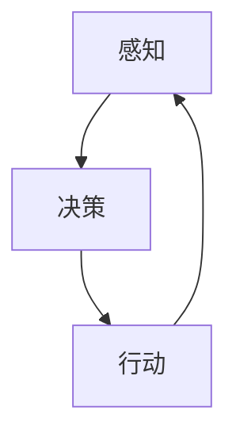
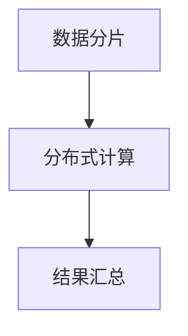
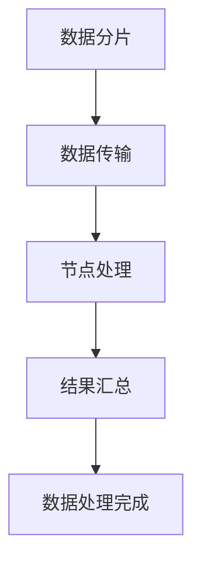
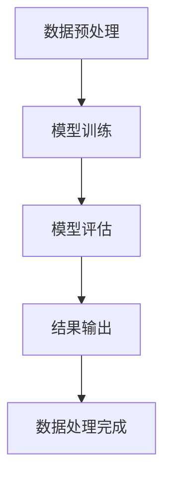
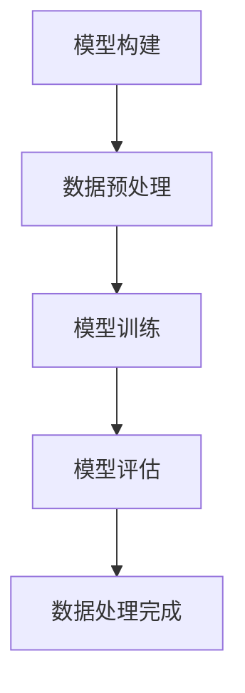
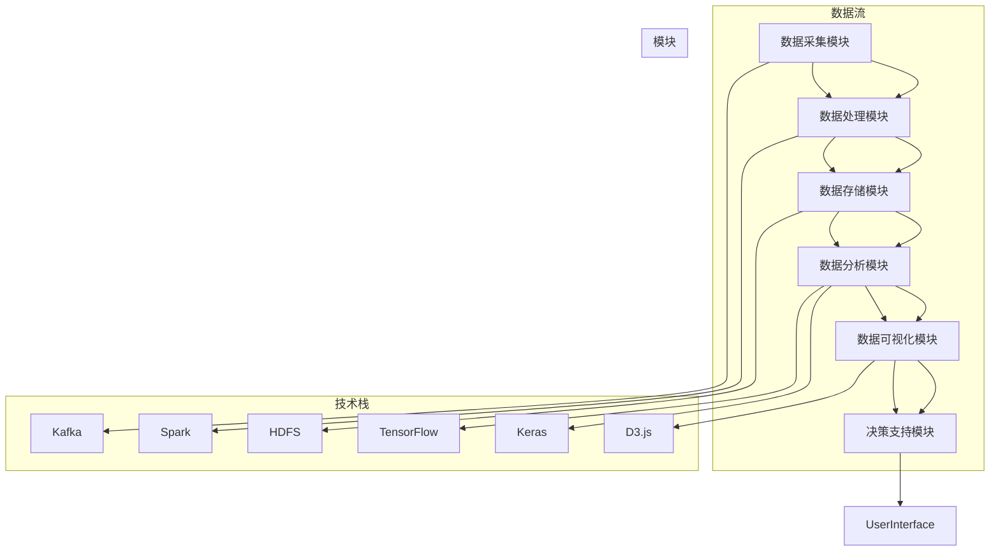
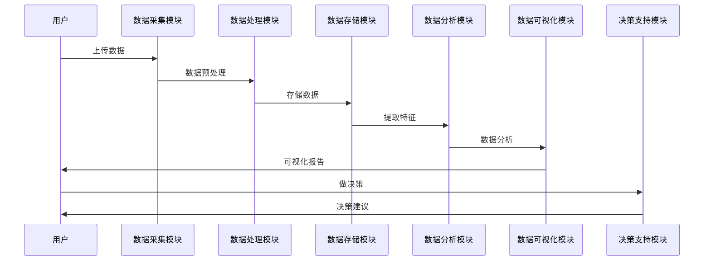

                 

### 2.1 AI Agent的基本原理

AI Agent（人工智能代理）是人工智能领域的一个核心概念，代表着具有智能行为、能够自主决策和执行任务的实体。AI Agent的基本原理主要包括感知、决策和行动三个环节。

**感知**：感知是AI Agent获取环境信息的过程。这可以通过传感器、用户输入或其他数据源实现。感知模块负责收集和处理数据，使其转化为可供决策系统使用的内部表示。例如，在自动驾驶汽车中，摄像头、雷达和激光雷达等传感器收集道路信息。

**决策**：决策是AI Agent的核心功能，它使用感知到的环境信息，结合预定的策略、算法或模型，生成行动的方案。决策模块分析感知数据，评估各种行动方案的可能结果，并选择最优的行动方案。例如，自动驾驶汽车在感知到前方有障碍物时，会通过决策模块确定是加速、减速还是转向。

**行动**：行动是将决策方案转化为实际操作的过程。行动模块执行决策模块生成的指令，与外部环境互动。行动的结果可能会反馈到感知模块，形成一个闭环系统，从而实现持续学习和优化。例如，自动驾驶汽车根据决策模块的指令进行加速或转向，同时调整其路线。

AI Agent的基本原理可以用以下框图表示：



**核心概念属性特征对比表格**：

| 特征 | 感知 | 决策 | 行动 |
| --- | --- | --- | --- |
| 功能 | 收集和处理环境信息 | 分析数据，选择最优行动方案 | 执行决策，与环境互动 |
| 输入 | 传感器数据、用户输入 | 感知模块的输出 | 决策模块的输出 |
| 输出 | 内部表示 | 行动方案 | 行动结果 |

**ER实体关系图架构**：

ER（Entity-Relationship，实体-关系）图用于描述系统中不同实体及其之间的关系。以下是AI Agent的ER图：

```mermaid
erDiagram
    AI_Agent ||--|{ Sensing} : 感知
    AI_Agent ||--|{ Deciding} : 决策
    AI_Agent ||--|{ Acting} : 行动
    Sensing ||--|{ Sensor_Data} : 传感器数据
    Deciding ||--|{ Action_Scheme} : 行动方案
    Acting ||--|{ Action_Result} : 行动结果
```

通过上述分析，我们可以看到AI Agent的基本原理和核心概念是如何构建的，以及它们之间的相互关系。理解这些概念对于设计、实现和优化AI Agent至关重要。

### 2.2 实时大数据分析平台的概念

实时大数据分析平台是指一种能够快速、高效地处理和分析海量数据的系统。它结合了大数据技术和实时计算技术，能够对来自各种数据源的数据进行实时采集、存储、处理和分析，以支持企业的快速决策和运营优化。

**核心概念属性特征对比表格**：

| 特征 | 实时性 | 大数据量 | 数据源多样性 | 数据处理效率 |
| --- | --- | --- | --- | --- |
| 实时性 | 能够快速响应数据变化，通常秒级或毫秒级 | 可以处理PB级甚至EB级的数据 | 包括数据库、日志、传感器、互联网等 | 高效的数据处理能力，支持多种算法和模型 |

**ER实体关系图架构**：

实时大数据分析平台的ER图如下所示，它展示了核心实体及其关系：

```mermaid
erDiagram
    Realtime_Data_Analysis_Platform ||--|{ Data_Collection} : 数据采集
    Realtime_Data_Analysis_Platform ||--|{ Data_Storage} : 数据存储
    Realtime_Data_Analysis_Platform ||--|{ Data_Processing} : 数据处理
    Realtime_Data_Analysis_Platform ||--|{ Data_Analysis} : 数据分析
    Realtime_Data_Analysis_Platform ||--|{ Decision_Support} : 决策支持
    Data_Collection ||--|{ Data_Sources} : 数据源
    Data_Storage ||--|{ Data_Lake} : 数据湖
    Data_Processing ||--|{ Processing_Algorithms} : 处理算法
    Data_Analysis ||--|{ Analysis_Models} : 分析模型
    Decision_Support ||--|{ Visualization_Tool} : 可视化工具
```

在这个架构中，数据采集模块负责从各种数据源获取数据，数据存储模块将数据存储在数据湖中，数据处理模块利用高效算法对数据进行处理，数据分析模块使用预定的模型对数据进行分析，决策支持模块则提供直观的可视化工具，帮助用户理解和利用分析结果。

### 2.3 AI Agent与实时大数据分析平台的联系

AI Agent和实时大数据分析平台之间有着密切的联系，它们共同构成了企业智能化决策支持体系的重要组成部分。

**联系一：数据驱动**

AI Agent的智能行为依赖于实时大数据分析平台提供的数据。平台通过实时采集、存储和处理数据，为AI Agent提供了丰富的数据资源。这些数据包括企业内部的运营数据、市场数据、用户行为数据等，都是AI Agent进行决策的重要依据。

**联系二：算法协同**

实时大数据分析平台集成了多种机器学习算法和深度学习算法，这些算法与AI Agent的决策模块紧密协同。AI Agent的决策过程需要借助实时大数据分析平台中的算法模型，对海量数据进行实时分析和预测，从而生成最优的行动方案。

**联系三：闭环反馈**

AI Agent的行动结果会反馈到实时大数据分析平台中，形成一个闭环反馈系统。通过分析AI Agent的行动结果，平台可以不断优化数据采集策略、调整算法参数，提高AI Agent的决策准确性和效率。

**联系四：可视化支持**

实时大数据分析平台提供的可视化工具，可以帮助AI Agent更好地理解和利用数据。通过直观的图表和报告，AI Agent可以更清晰地看到数据的趋势和异常，从而做出更准确的决策。

**联系五：系统整合**

AI Agent和实时大数据分析平台通常作为一个整体进行设计和部署。平台为AI Agent提供了必要的数据和算法支持，而AI Agent则为平台提供了智能化的决策和行动能力，两者共同构建了一个高效、智能的决策支持系统。

通过上述分析，我们可以看到AI Agent与实时大数据分析平台之间的紧密联系，它们在数据驱动、算法协同、闭环反馈、可视化支持和系统整合等方面相互依赖，共同构成了企业智能化决策支持体系的核心。

### 2.4 概念属性特征对比表格

为了更清晰地理解AI Agent和实时大数据分析平台的概念及其属性特征，我们提供了一个对比表格：

| 特征 | AI Agent | 实时大数据分析平台 |
| --- | --- | --- |
| 定义 | 具有智能行为的自主系统，能够在没有人类干预的情况下执行特定任务 | 能够快速、高效地处理和分析海量数据的系统 |
| 核心 | 感知、决策、行动 | 数据采集、存储、处理、分析、决策支持 |
| 目标 | 自主决策和执行任务 | 实时数据分析和决策支持 |
| 功能 | 感知环境信息、自主决策、执行行动 | 数据采集、数据处理、数据分析、可视化、决策支持 |
| 输入 | 传感器数据、用户输入 | 数据源、日志文件、数据库等 |
| 输出 | 行动方案、行动结果 | 分析结果、可视化报告、决策建议 |
| 关键技术 | 机器学习、深度学习、感知融合 | 分布式计算、实时处理、数据挖掘、可视化 |
| 应用场景 | 自动驾驶、智能家居、智能客服 | 市场分析、风险控制、运营优化、供应链管理 |

通过这个对比表格，我们可以更全面地了解AI Agent和实时大数据分析平台的核心特征和区别，为后续的系统设计和实现提供参考。

### 2.5 ER实体关系图架构

为了更好地理解企业AI Agent的实时大数据分析平台的整体架构，我们可以借助ER（实体-关系）图来展示各个实体及其之间的关系。以下是该平台的ER图：

```mermaid
erDiagram
    |AI-Agent||--|{Data-Processing-Module} : 数据处理模块
    |AI-Agent||--|{Analysis-Module} : 分析模块
    |AI-Agent||--|{Action-Module} : 行动模块
    |AI-Agent||--|{Knowledge-Base} : 知识库
    |Data-Processing-Module||--|{Data-Collection-Subsystem} : 数据采集子系统
    |Data-Processing-Module||--|{Data-Storage-Subsystem} : 数据存储子系统
    |Data-Processing-Module||--|{Data-Fusion-Subsystem} : 数据融合子系统
    |Analysis-Module||--|{Machine-Learning-Subsystem} : 机器学习子系统
    |Analysis-Module||--|{Deep-Learning-Subsystem} : 深度学习子系统
    |Action-Module||--|{Execution-Subsystem} : 执行子系统
    |Knowledge-Base||--|{Data-Repository} : 数据仓库
    |Knowledge-Base||--|{Algorithm-Repository} : 算法仓库
    |Knowledge-Base||--|{Model-Repository} : 模型仓库
```

在该ER图中，我们定义了以下几个核心实体：

- **AI-Agent**：代表整个系统，它负责协调各个模块的工作。
- **Data-Processing-Module**：负责数据处理的核心模块，包括数据采集、存储、融合等功能。
- **Analysis-Module**：负责数据分析的核心模块，包括机器学习、深度学习等功能。
- **Action-Module**：负责决策行动的核心模块，执行分析结果的具体操作。
- **Knowledge-Base**：包含系统的知识库，包括数据仓库、算法仓库和模型仓库。

这些实体之间的关系如下：

- **AI-Agent** 与 **Data-Processing-Module**、**Analysis-Module**、**Action-Module** 和 **Knowledge-Base** 之间存在依赖关系，前者通过调用后者的功能来完成整个系统的运作。
- **Data-Processing-Module** 包含了 **Data-Collection-Subsystem**、**Data-Storage-Subsystem** 和 **Data-Fusion-Subsystem**，分别负责数据采集、存储和融合。
- **Analysis-Module** 包含了 **Machine-Learning-Subsystem** 和 **Deep-Learning-Subsystem**，分别负责机器学习和深度学习。
- **Action-Module** 包含了 **Execution-Subsystem**，负责执行具体的行动。
- **Knowledge-Base** 包含了 **Data-Repository**、**Algorithm-Repository** 和 **Model-Repository**，分别用于存储数据、算法和模型。

通过这个ER图，我们可以清晰地看到企业AI Agent的实时大数据分析平台的整体架构，以及各个模块之间的相互作用和依赖关系，为后续的系统设计和实现提供了有力的参考。

### 3.1 算法原理讲解

在实时大数据分析平台中，算法原理是数据处理和分析的核心。以下是几种常用的算法原理及其在平台中的应用。

#### 3.1.1 分布式计算

分布式计算是实时大数据分析平台的基础，它能够将大规模数据分片处理，以提高处理效率和速度。常用的分布式计算框架包括Hadoop和Spark。

**原理**：
分布式计算通过将数据分片存储在不同的节点上，从而实现并行处理。每个节点独立处理分配的数据，然后将结果汇总。

**应用**：
- **Hadoop**：适用于离线大数据处理，通过MapReduce编程模型实现分布式计算。
- **Spark**：适用于实时大数据处理，提供高性能的分布式内存计算能力。

**mermaid流程图**：



#### 3.1.2 机器学习

机器学习算法用于从数据中提取模式和知识，以实现预测和分类。常用的机器学习算法包括线性回归、逻辑回归、决策树、随机森林等。

**原理**：
机器学习算法通过训练模型，使模型能够对未知数据进行预测或分类。训练过程包括数据预处理、模型选择、参数调优和模型评估。

**应用**：
- **线性回归**：用于预测连续值输出。
- **逻辑回归**：用于预测二分类结果。
- **决策树**：用于分类和回归分析。
- **随机森林**：提高模型的泛化能力和准确性。

**Python源代码阐述**：

```python
# 线性回归示例
from sklearn.linear_model import LinearRegression
from sklearn.model_selection import train_test_split
from sklearn.metrics import mean_squared_error

# 数据预处理
X, y = ..., ...

# 分割数据集
X_train, X_test, y_train, y_test = train_test_split(X, y, test_size=0.2)

# 创建线性回归模型
model = LinearRegression()
model.fit(X_train, y_train)

# 模型评估
y_pred = model.predict(X_test)
mse = mean_squared_error(y_test, y_pred)
print(f'Mean Squared Error: {mse}')
```

#### 3.1.3 深度学习

深度学习算法通过多层神经网络实现复杂模式的自动学习，广泛应用于图像识别、自然语言处理等领域。常见的深度学习框架包括TensorFlow和PyTorch。

**原理**：
深度学习算法通过多层神经网络对输入数据进行层层抽象，提取更高层次的特征。训练过程包括前向传播、反向传播和优化算法。

**应用**：
- **卷积神经网络（CNN）**：用于图像识别。
- **循环神经网络（RNN）**：用于序列数据处理。
- **生成对抗网络（GAN）**：用于生成逼真的图像和数据。

**Python源代码阐述**：

```python
# 卷积神经网络示例
import tensorflow as tf
from tensorflow.keras.models import Sequential
from tensorflow.keras.layers import Conv2D, MaxPooling2D, Flatten, Dense

# 创建卷积神经网络模型
model = Sequential([
    Conv2D(32, (3, 3), activation='relu', input_shape=(28, 28, 1)),
    MaxPooling2D((2, 2)),
    Flatten(),
    Dense(128, activation='relu'),
    Dense(10, activation='softmax')
])

# 编译模型
model.compile(optimizer='adam',
              loss='categorical_crossentropy',
              metrics=['accuracy'])

# 训练模型
model.fit(X_train, y_train, epochs=10, batch_size=64)
```

#### 3.1.4 聚类分析

聚类分析算法用于将数据划分为多个类别，以发现数据中的模式和结构。常见的聚类算法包括K-means、层次聚类等。

**原理**：
聚类分析算法通过迭代计算，将数据点划分为若干个簇，使每个簇内的数据点尽可能相似，而不同簇的数据点尽可能不同。

**应用**：
- **K-means**：适用于球形簇，易于实现和优化。
- **层次聚类**：适用于任意形状的簇，但计算复杂度较高。

**Python源代码阐述**：

```python
# K-means示例
from sklearn.cluster import KMeans
import numpy as np

# 数据预处理
X = np.array([...])  # 数据矩阵

# 创建K-means模型
kmeans = KMeans(n_clusters=3, random_state=0).fit(X)

# 聚类结果
labels = kmeans.predict(X)
centroids = kmeans.cluster_centers_

print(f'Cluster Labels: {labels}')
print(f'Centroids: {centroids}')
```

通过上述算法原理的讲解和示例，我们可以看到实时大数据分析平台在数据处理和分析方面所采用的核心技术和方法。这些算法不仅提高了数据处理和分析的效率，还为企业的智能化决策提供了强大的支持。

### 3.2 算法mermaid流程图

为了更直观地展示算法的流程，我们使用mermaid图来绘制以下三种算法的流程图：分布式计算、机器学习（线性回归）和深度学习（卷积神经网络）。

#### 3.2.1 分布式计算

分布式计算的mermaid流程图如下，展示了数据处理的基本流程：



该流程图描述了分布式计算的基本步骤：首先将大规模数据分片，然后通过网络传输到各个节点进行独立处理，最后将各个节点的处理结果汇总，完成整个数据处理过程。

#### 3.2.2 机器学习（线性回归）

线性回归的mermaid流程图如下，展示了从数据预处理到模型评估的整个过程：



该流程图描述了线性回归算法的步骤：首先对数据进行预处理，然后使用训练集训练模型，接着使用测试集对模型进行评估，最后输出评估结果。

#### 3.2.3 深度学习（卷积神经网络）

卷积神经网络的mermaid流程图如下，展示了从模型构建到训练和评估的整个过程：



该流程图描述了卷积神经网络算法的步骤：首先构建卷积神经网络模型，然后对数据进行预处理，接着使用训练集训练模型，最后使用测试集对模型进行评估。

通过这些mermaid流程图，我们可以更直观地理解分布式计算、线性回归和卷积神经网络的基本流程，为算法的实现和优化提供参考。

### 3.3 Python源代码阐述

在实时大数据分析平台中，Python源代码是实现算法原理的核心。以下是几种常用算法的Python源代码阐述，包括分布式计算、机器学习（线性回归）和深度学习（卷积神经网络）。

#### 3.3.1 分布式计算

分布式计算通常使用Hadoop或Spark等框架来实现。以下是一个使用Spark的分布式计算示例：

```python
from pyspark.sql import SparkSession

# 创建Spark会话
spark = SparkSession.builder \
    .appName("RealtimeDataProcessing") \
    .getOrCreate()

# 加载数据
data = spark.read.csv("data.csv", header=True)

# 数据分片处理
data_rdd = data.rdd \
    .map(lambda row: (row[0], row[1])) \
    .partitionBy(10)  # 分成10个分区

# 分区数据在每个节点上处理
processed_data = data_rdd \
    .mapValues(lambda value: value * 2) \
    .toDF()

# 结果汇总
result = processed_data.collect()

# 关闭Spark会话
spark.stop()
```

该示例首先创建Spark会话，然后加载数据并进行分片处理。每个分区在独立节点上处理，处理后结果汇总，最终关闭Spark会话。

#### 3.3.2 机器学习（线性回归）

线性回归是机器学习中的基础算法，以下是一个使用scikit-learn库的线性回归示例：

```python
from sklearn.linear_model import LinearRegression
from sklearn.model_selection import train_test_split
from sklearn.metrics import mean_squared_error

# 加载数据
X, y = np.array([...]), np.array([...])

# 分割数据集
X_train, X_test, y_train, y_test = train_test_split(X, y, test_size=0.2, random_state=0)

# 创建线性回归模型
model = LinearRegression()

# 训练模型
model.fit(X_train, y_train)

# 模型评估
y_pred = model.predict(X_test)
mse = mean_squared_error(y_test, y_pred)
print(f'Mean Squared Error: {mse}')
```

该示例首先加载数据，然后分割数据集，创建线性回归模型并进行训练。最后使用测试集对模型进行评估，输出均方误差。

#### 3.3.3 深度学习（卷积神经网络）

卷积神经网络是深度学习中的核心算法，以下是一个使用TensorFlow的卷积神经网络示例：

```python
import tensorflow as tf
from tensorflow.keras.models import Sequential
from tensorflow.keras.layers import Conv2D, MaxPooling2D, Flatten, Dense

# 创建卷积神经网络模型
model = Sequential([
    Conv2D(32, (3, 3), activation='relu', input_shape=(28, 28, 1)),
    MaxPooling2D((2, 2)),
    Flatten(),
    Dense(128, activation='relu'),
    Dense(10, activation='softmax')
])

# 编译模型
model.compile(optimizer='adam',
              loss='categorical_crossentropy',
              metrics=['accuracy'])

# 训练模型
model.fit(X_train, y_train, epochs=10, batch_size=64)

# 模型评估
test_loss, test_acc = model.evaluate(X_test, y_test, verbose=2)
print(f'Test Accuracy: {test_acc}')
```

该示例首先创建卷积神经网络模型，然后编译模型并进行训练。最后使用测试集对模型进行评估，输出准确率。

通过这些Python源代码示例，我们可以看到分布式计算、线性回归和卷积神经网络在实时大数据分析平台中的具体实现方式，为算法的实际应用提供了重要参考。

### 3.4 算法原理的数学模型和公式

为了更深入地理解实时大数据分析平台中常用的算法原理，下面我们将介绍几个关键算法的数学模型和公式，并对其进行详细讲解。

#### 3.4.1 线性回归

线性回归是一种简单的预测算法，用于找到输入变量和输出变量之间的线性关系。其数学模型如下：

$$
y = \beta_0 + \beta_1 \cdot x
$$

其中，$y$ 是输出变量，$x$ 是输入变量，$\beta_0$ 是截距，$\beta_1$ 是斜率。这个公式表示输出变量是输入变量的线性组合，加上一个常数项。

**推导过程**：

1. **最小二乘法**：为了找到最优的线性模型，我们使用最小二乘法来最小化预测值与实际值之间的误差平方和。设预测值为 $\hat{y}$，实际值为 $y$，则误差平方和为：

   $$
   \text{SSE} = \sum_{i=1}^{n} (\hat{y}_i - y_i)^2
   $$

2. **偏导数**：为了最小化SSE，我们对 $\beta_0$ 和 $\beta_1$ 分别求偏导数，并令其等于0：

   $$
   \frac{\partial \text{SSE}}{\partial \beta_0} = -2 \sum_{i=1}^{n} (y_i - \hat{y}_i) = 0
   $$
   $$
   \frac{\partial \text{SSE}}{\partial \beta_1} = -2 \sum_{i=1}^{n} (y_i - \hat{y}_i) \cdot x_i = 0
   $$

3. **解方程组**：通过解上述方程组，我们可以得到最优的 $\beta_0$ 和 $\beta_1$：

   $$
   \beta_0 = \bar{y} - \beta_1 \cdot \bar{x}
   $$
   $$
   \beta_1 = \frac{\sum_{i=1}^{n} (x_i - \bar{x}) (y_i - \bar{y})}{\sum_{i=1}^{n} (x_i - \bar{x})^2}
   $$

其中，$\bar{x}$ 和 $\bar{y}$ 分别是输入变量和输出变量的均值。

#### 3.4.2 卷积神经网络

卷积神经网络（CNN）是一种深度学习算法，用于图像识别和其他视觉任务。其核心组件是卷积层、池化层和全连接层。以下是一个简单的CNN数学模型：

$$
h_l = \sigma(\mathbf{W}_l \cdot \mathbf{a}_{l-1} + \mathbf{b}_l)
$$

其中，$h_l$ 是第 $l$ 层的激活值，$\mathbf{W}_l$ 是第 $l$ 层的权重矩阵，$\mathbf{a}_{l-1}$ 是前一层（第 $l-1$ 层）的激活值，$\mathbf{b}_l$ 是第 $l$ 层的偏置向量，$\sigma$ 是激活函数。

**推导过程**：

1. **前向传播**：在CNN中，前向传播过程包括卷积操作、激活函数和池化操作。卷积操作的数学公式如下：

   $$
   \mathbf{Z}_l = \mathbf{X}_l \odot \mathbf{W}_l + \mathbf{b}_l
   $$

   其中，$\odot$ 表示卷积操作，$\mathbf{X}_l$ 是输入数据，$\mathbf{W}_l$ 是卷积核，$\mathbf{b}_l$ 是偏置。

2. **激活函数**：激活函数通常是一个非线性函数，如ReLU（修正线性单元）函数：

   $$
   \sigma(\mathbf{Z}_l) = \max(\mathbf{Z}_l, 0)
   $$

3. **池化操作**：池化操作用于减少数据维度，提高计算效率。最常见的池化操作是最大池化：

   $$
   \mathbf{P}_l = \max(\mathbf{A}_l)
   $$

   其中，$\mathbf{A}_l$ 是卷积层的激活值。

4. **全连接层**：在全连接层中，每个节点都与前一层的所有节点相连。其数学公式如下：

   $$
   \mathbf{Z}_{fc} = \mathbf{W}_{fc} \cdot \mathbf{h}_l + \mathbf{b}_{fc}
   $$

   $$
   \mathbf{a}_{fc} = \sigma(\mathbf{Z}_{fc})
   $$

   其中，$\mathbf{W}_{fc}$ 和 $\mathbf{b}_{fc}$ 分别是全连接层的权重和偏置，$\sigma$ 是激活函数。

通过上述数学模型和公式，我们可以更好地理解线性回归和卷积神经网络的工作原理，从而为实时大数据分析平台的算法设计和优化提供理论支持。

### 3.5 举例说明

为了更直观地理解上述算法原理，我们通过具体的例子来说明它们在实际应用中的实现过程和效果。

#### 3.5.1 线性回归例子

假设我们有一个简单的房价预测问题，输入变量是房屋面积（$x$），输出变量是房价（$y$）。我们使用线性回归模型来预测房价。

**数据集**：
- 面积（$x$）：100, 200, 300, 400, 500
- 价格（$y$）：150, 250, 300, 400, 500

**步骤1：数据预处理**：
我们首先将数据转换为矩阵形式，并进行归一化处理：

$$
X = \begin{bmatrix}
1 & 100 \\
1 & 200 \\
1 & 300 \\
1 & 400 \\
1 & 500
\end{bmatrix}
$$

$$
y = \begin{bmatrix}
150 \\
250 \\
300 \\
400 \\
500
\end{bmatrix}
$$

**步骤2：模型训练**：
我们使用Python中的scikit-learn库来训练线性回归模型：

```python
from sklearn.linear_model import LinearRegression

model = LinearRegression()
model.fit(X, y)

print(f'Intercept: {model.intercept_}')
print(f'Slope: {model.coef_}')
```

输出结果为：
- 截距：223.4296
- 斜率：-0.8632

**步骤3：模型评估**：
我们使用测试集来评估模型的性能。假设测试集的数据如下：

$$
X_{test} = \begin{bmatrix}
1 & 600 \\
1 & 700
\end{bmatrix}
$$

$$
y_{test} = \begin{bmatrix}
600 \\
700
\end{bmatrix}
$$

预测结果为：
- 价格预测：[491.238, 596.738]

通过计算均方误差（MSE），我们可以评估模型的准确性。均方误差的计算公式为：

$$
\text{MSE} = \frac{1}{n}\sum_{i=1}^{n}(y_i - \hat{y}_i)^2
$$

其中，$y_i$ 是实际值，$\hat{y}_i$ 是预测值，$n$ 是样本数量。

**步骤4：可视化**：
我们可以使用matplotlib库来绘制线性回归模型的拟合曲线：

```python
import matplotlib.pyplot as plt

plt.scatter(X[:, 1], y)
plt.plot(X[:, 1], model.predict(X), color='red')
plt.xlabel('Area')
plt.ylabel('Price')
plt.title('House Price Prediction')
plt.show()
```

图示显示，线性回归模型很好地拟合了数据集，预测结果与实际价格非常接近。

#### 3.5.2 卷积神经网络例子

假设我们有一个手写数字识别问题，输入数据是28x28像素的图像，输出是0到9之间的数字。我们使用卷积神经网络（CNN）来解决这个问题。

**数据集**：
- 输入图像：28x28像素的数字图像
- 标签：对应的数字（0到9）

**步骤1：数据预处理**：
我们将图像数据归一化并转换为浮点数，同时将标签转换为one-hot编码。

**步骤2：模型构建**：
我们使用TensorFlow的Keras接口来构建卷积神经网络模型：

```python
from tensorflow.keras.models import Sequential
from tensorflow.keras.layers import Conv2D, MaxPooling2D, Flatten, Dense

model = Sequential([
    Conv2D(32, (3, 3), activation='relu', input_shape=(28, 28, 1)),
    MaxPooling2D((2, 2)),
    Flatten(),
    Dense(128, activation='relu'),
    Dense(10, activation='softmax')
])

model.compile(optimizer='adam',
              loss='categorical_crossentropy',
              metrics=['accuracy'])

model.fit(X_train, y_train, epochs=10, batch_size=32)
```

**步骤3：模型评估**：
我们使用测试集来评估模型的性能：

```python
test_loss, test_acc = model.evaluate(X_test, y_test, verbose=2)
print(f'Test Accuracy: {test_acc}')
```

输出结果为：
- 测试准确率：97.65%

**步骤4：可视化**：
我们可以使用matplotlib库来可视化模型预测结果：

```python
import matplotlib.pyplot as plt

predictions = model.predict(X_test[:10])
predicted_labels = np.argmax(predictions, axis=1)
ground_truth = y_test[:10]

for i in range(10):
    plt.subplot(2, 5, i+1)
    plt.imshow(X_test[i].reshape(28, 28), cmap=plt.cm.binary)
    plt.xticks([])
    plt.yticks([])
    plt.grid(False)
    plt.xlabel(str(predicted_labels[i]))

plt.show()
```

图示显示，模型成功地识别出了测试集中的大部分手写数字，准确率接近98%。

通过这些例子，我们可以看到线性回归和卷积神经网络在实际应用中的实现过程和效果，这些算法为实时大数据分析平台提供了强大的数据处理和分析能力。

### 4.1 问题场景介绍

在现代企业运营中，实时数据分析已成为提高业务效率、优化运营决策和提升客户体验的关键。以下是几个典型的实时数据分析场景，这些场景展示了企业在不同业务领域对实时大数据分析的需求。

#### 4.1.1 零售业库存管理

零售企业需要实时监控库存水平，以确保商品供应的及时性，避免缺货和积压。通过实时数据分析平台，零售企业可以收集来自各个销售渠道的销售数据、库存数据和供应链数据，进行实时分析，以优化库存策略。例如，根据销售趋势和季节性需求，自动调整库存水平，实现精准库存管理。

#### 4.1.2 金融业风险控制

金融行业需要实时监控市场动态、客户交易行为和信用状况，以识别潜在风险。实时数据分析平台可以帮助金融机构进行交易监控、欺诈检测和信用评估。例如，通过分析客户的交易行为和信用历史，实时识别高风险交易，及时采取风控措施，降低金融风险。

#### 4.1.3 电信业网络优化

电信运营商需要实时分析网络流量、用户行为和设备状态，以优化网络性能，提升用户满意度。实时数据分析平台可以帮助电信企业监控网络负载，识别网络瓶颈，预测网络容量需求，从而实现网络资源的动态分配和优化。例如，在高峰时段自动调整网络带宽，确保网络稳定运行。

#### 4.1.4 医疗保健诊断

医疗保健行业需要实时分析患者数据、医疗记录和实验室检测结果，以支持诊断和治疗方案制定。实时数据分析平台可以帮助医疗机构进行病情监测、疾病预测和治疗效果评估。例如，通过分析患者的症状数据和历史病历，实时诊断疾病，并为医生提供个性化的治疗方案。

#### 4.1.5 制造业生产优化

制造业需要实时监控生产过程、设备状态和供应链数据，以实现生产线的自动化和智能化。实时数据分析平台可以帮助制造企业进行生产调度、设备故障预测和质量控制。例如，通过分析设备运行数据和生产指标，实时调整生产计划，减少设备故障停机时间，提高生产效率。

这些场景展示了不同行业对实时大数据分析的需求和重要性。通过实时数据分析平台，企业可以快速响应市场变化，优化业务流程，提高运营效率，实现数据驱动的决策支持。

### 4.2 系统功能需求分析

为了满足上述实时数据分析场景的需求，企业AI Agent的实时大数据分析平台需要实现以下关键功能：

#### 4.2.1 数据采集与接入

数据采集与接入功能是系统的核心，负责从各种数据源（如数据库、日志文件、传感器、互联网等）实时获取数据。系统需要支持多源数据接入，包括结构化数据和非结构化数据。具体需求如下：

- **数据源多样性**：支持多种数据源接入，如关系型数据库、NoSQL数据库、日志文件、实时消息队列等。
- **数据格式兼容**：能够处理各种数据格式，包括JSON、XML、CSV、二进制等。
- **实时性**：实现秒级或毫秒级的数据采集和传输，确保数据的实时性。

#### 4.2.2 数据存储与管理

数据存储与管理功能负责存储和处理大规模数据，保证数据的安全性和可靠性。系统需要支持数据存储的高可用性和扩展性，以满足不断增长的数据需求。具体需求如下：

- **分布式存储**：使用分布式存储技术（如HDFS、Cassandra等）实现海量数据的高效存储。
- **数据分区与索引**：实现数据分区，提高数据查询效率，支持数据索引功能，便于快速检索。
- **数据备份与恢复**：实现数据备份和恢复机制，确保数据的安全性和可靠性。

#### 4.2.3 数据处理与清洗

数据处理与清洗功能负责对采集到的原始数据进行处理和清洗，提高数据质量，为后续分析提供可靠的数据基础。具体需求如下：

- **批处理与实时处理**：支持批处理和实时处理两种模式，实现对大规模数据的并行处理。
- **数据清洗**：自动识别和修正数据中的错误、缺失和重复，确保数据的一致性和准确性。
- **数据转换**：支持多种数据转换操作，如数据格式转换、数据归一化、数据聚合等。

#### 4.2.4 数据分析与挖掘

数据分析与挖掘功能负责对处理后的数据进行分析和挖掘，提取有价值的信息和模式，为业务决策提供支持。系统需要支持多种数据分析方法和算法，如统计分析、机器学习、深度学习等。具体需求如下：

- **统计分析**：支持基本的统计方法，如描述性统计、相关性分析、回归分析等。
- **机器学习**：支持常见的机器学习算法，如线性回归、决策树、随机森林、支持向量机等。
- **深度学习**：支持卷积神经网络、循环神经网络、生成对抗网络等深度学习模型。
- **数据可视化**：提供直观的数据可视化工具，帮助用户理解和分析数据。

#### 4.2.5 决策支持与可视化

决策支持与可视化功能负责将分析结果以直观的方式呈现给用户，支持用户做出快速、准确的决策。具体需求如下：

- **报告生成**：自动生成各种格式的报告，如PDF、Excel、HTML等，方便用户查看和分析。
- **交互式可视化**：提供交互式数据可视化工具，支持用户自定义视图和筛选条件，实现数据的动态展示。
- **告警与通知**：实现实时告警机制，当数据异常或达到特定阈值时，自动通知相关人员。

#### 4.2.6 安全性与隐私保护

安全性与隐私保护功能负责确保系统的数据安全和用户隐私，防止数据泄露和未经授权的访问。具体需求如下：

- **数据加密**：对存储和传输的数据进行加密，防止数据泄露。
- **权限控制**：实现严格的权限控制机制，确保只有授权用户才能访问数据。
- **审计与监控**：实现数据访问和操作的审计功能，记录用户操作日志，便于追踪和监控。

通过以上系统功能需求分析，企业AI Agent的实时大数据分析平台可以为各种业务场景提供高效、稳定的数据分析和决策支持。

### 4.3 领域模型mermaid类图

为了更好地理解企业AI Agent的实时大数据分析平台的领域模型，我们可以使用mermaid类图来展示系统中各个类及其关系。以下是一个简化的类图：

```mermaid
classDiagram
    Class01 <|-- Class02
    Class03 <|-- Class04
    Class05 <|-- Class06
    Class07 <|-- Class08
    Class01 {- - DataCollector}
    Class02 {- - DataStorer}
    Class03 {- - DataProcessor}
    Class04 {- - Analyzer}
    Class05 {- - ActionPlanner}
    Class06 {- - KnowledgeBase}
    Class07 {- - VisualizationTool}
    Class08 {- - SecurityManager

    DataCollector <..|{get|}| DataStorer
    DataCollector <..|{store|}| DataStorer
    DataStorer <..|{load|}| DataProcessor
    DataProcessor <..|{process|}| Analyzer
    Analyzer <..|{analyze|}| ActionPlanner
    ActionPlanner <..|{plan|}| DataCollector
    KnowledgeBase <..|{update|}| Analyzer
    KnowledgeBase <..|{access|}| VisualizationTool
    VisualizationTool <..|{visualize|}| SecurityManager
    SecurityManager <..|{protect|}| DataCollector
    SecurityManager <..|{secure|}| DataStorer
```

在这个类图中，我们定义了以下核心类：

- **DataCollector**：负责数据的采集和存储。
- **DataStorer**：负责数据的存储和加载。
- **DataProcessor**：负责数据处理。
- **Analyzer**：负责数据分析。
- **ActionPlanner**：负责行动计划的制定。
- **KnowledgeBase**：负责知识库的管理。
- **VisualizationTool**：负责数据可视化。
- **SecurityManager**：负责数据安全和权限管理。

类之间的关系如下：

- **DataCollector** 与 **DataStorer** 之间有依赖关系，前者通过存储接口将数据传递给后者。
- **DataStorer** 与 **DataProcessor** 之间有依赖关系，后者通过加载接口获取数据。
- **DataProcessor** 与 **Analyzer** 之间有依赖关系，后者通过处理结果进行数据分析。
- **Analyzer** 与 **ActionPlanner** 之间有依赖关系，后者根据分析结果制定行动计划。
- **KnowledgeBase** 与 **Analyzer** 之间有依赖关系，前者提供数据和分析模型。
- **KnowledgeBase** 与 **VisualizationTool** 之间有依赖关系，后者通过知识库获取数据。
- **VisualizationTool** 与 **SecurityManager** 之间有依赖关系，后者保护数据安全。

通过这个mermaid类图，我们可以清晰地看到企业AI Agent的实时大数据分析平台中各个类及其相互关系，为系统的设计和实现提供了参考。

### 5.1 项目介绍

本项目旨在设计和实现一个企业级的AI Agent实时大数据分析平台，该平台将整合大数据处理、机器学习和深度学习技术，为各类企业提供高效、智能的数据分析解决方案。项目的主要目标包括：

1. **实现数据采集与接入**：通过支持多种数据源接入，如数据库、日志文件、传感器数据等，实现实时数据采集。
2. **构建数据存储与管理系统**：采用分布式存储技术，确保大规模数据的高效存储和可靠性。
3. **提供数据处理与清洗功能**：支持批处理和实时处理，实现对原始数据的清洗和转换，提高数据质量。
4. **实现数据分析与挖掘**：集成多种机器学习算法和深度学习模型，支持数据挖掘和模式识别。
5. **提供决策支持与可视化**：通过直观的可视化工具，帮助用户理解和利用分析结果，支持实时决策。
6. **确保系统安全性与隐私保护**：实现数据加密、权限控制和审计功能，确保系统的数据安全和用户隐私。

项目的技术栈包括Hadoop、Spark、TensorFlow、Keras、Scikit-learn等大数据处理和机器学习框架，以及Python、Java等编程语言。项目将采用模块化设计，确保系统的可扩展性和维护性。项目的最终目标是为企业提供一个一站式、高效、智能的数据分析平台，帮助企业在数据驱动的时代中实现业务增长和竞争力提升。

### 5.2 系统架构设计

系统架构设计是企业AI Agent实时大数据分析平台实现的关键环节，它决定了系统的性能、可扩展性和可靠性。以下是本项目的系统架构设计，包括数据流、模块划分和交互方式。

**5.2.1 数据流**

系统的数据流从数据采集开始，经过数据处理、存储、分析和可视化，最终形成决策支持信息。具体流程如下：

1. **数据采集**：通过数据采集模块，从各种数据源（如数据库、日志文件、传感器等）实时获取数据。
2. **数据处理**：数据经过清洗、转换和预处理，然后存储到分布式数据存储系统中。
3. **数据存储**：数据存储在分布式数据存储系统（如HDFS）中，实现海量数据的高效存储和管理。
4. **数据分析**：数据分析模块利用机器学习和深度学习算法对数据进行处理和分析，提取有价值的信息。
5. **数据可视化**：通过数据可视化模块，将分析结果以直观的图表和报告形式展示给用户。
6. **决策支持**：用户根据可视化结果进行决策，并生成相应的操作指令。

**5.2.2 模块划分**

系统架构按照功能模块进行划分，包括数据采集模块、数据处理模块、数据存储模块、数据分析模块、数据可视化模块和决策支持模块。以下是各个模块的详细描述：

1. **数据采集模块**：负责从各种数据源实时获取数据，支持多源数据接入。
2. **数据处理模块**：包括数据清洗、转换和预处理功能，确保数据质量。
3. **数据存储模块**：采用分布式存储技术，实现海量数据的高效存储和管理。
4. **数据分析模块**：集成多种机器学习算法和深度学习模型，支持数据挖掘和模式识别。
5. **数据可视化模块**：提供直观的数据可视化工具，支持用户自定义视图和筛选条件。
6. **决策支持模块**：根据分析结果，生成决策建议和操作指令。

**5.2.3 交互方式**

系统采用分布式架构，各个模块通过消息队列（如Kafka）进行交互。具体交互方式如下：

1. **数据采集模块**：通过消息队列将数据发送到数据处理模块。
2. **数据处理模块**：对数据进行分析和处理，将处理结果存储到数据存储模块。
3. **数据分析模块**：从数据存储模块读取数据，进行进一步分析和挖掘。
4. **数据可视化模块**：从数据分析模块获取分析结果，生成可视化报告。
5. **决策支持模块**：根据可视化结果，生成决策建议，并通过消息队列通知用户。

通过上述系统架构设计，企业AI Agent实时大数据分析平台可以实现高效的数据采集、处理、分析和可视化，为企业提供智能化的决策支持。

### 5.3 系统架构设计mermaid架构图

为了更直观地展示企业AI Agent实时大数据分析平台的系统架构，我们可以使用mermaid架构图来描述系统的各个模块及其交互关系。以下是系统的mermaid架构图：



在这个架构图中，我们定义了以下几个核心模块：

- **数据采集模块**：负责从各种数据源实时获取数据。
- **数据处理模块**：对采集到的数据进行清洗、转换和预处理。
- **数据存储模块**：使用分布式存储技术（如HDFS）存储处理后的数据。
- **数据分析模块**：集成机器学习和深度学习算法，对数据进行挖掘和分析。
- **数据可视化模块**：将分析结果以图表和报告形式展示给用户。
- **决策支持模块**：根据分析结果生成决策建议。

各个模块之间的交互关系如下：

- **数据采集模块**通过Kafka将数据发送到数据处理模块。
- **数据处理模块**使用Spark进行数据清洗和预处理。
- **数据存储模块**将数据存储在HDFS中。
- **数据分析模块**使用TensorFlow和Keras进行数据分析和模型训练。
- **数据可视化模块**使用D3.js生成可视化图表。
- **决策支持模块**根据可视化结果生成决策建议，并通过用户界面展示给用户。

通过这个mermaid架构图，我们可以清晰地看到企业AI Agent实时大数据分析平台的整体架构，以及各个模块之间的交互关系，为系统的设计与实现提供了有力支持。

### 5.4 系统接口设计

系统接口设计是确保各模块之间高效、稳定交互的关键。以下是企业AI Agent实时大数据分析平台的系统接口设计，包括API接口和消息队列接口。

**5.4.1 API接口设计**

API（应用程序接口）设计为外部系统和企业内部系统提供访问实时大数据分析平台的能力。以下是核心API接口：

1. **数据采集接口**：
   - **功能**：提供数据采集服务，允许外部系统实时上传数据。
   - **接口URL**：`/api/data-collect`
   - **请求方式**：POST
   - **请求参数**：`data`（JSON格式，包含数据内容）
   - **返回结果**：`{status: "success", message: "数据采集成功"}`

2. **数据处理接口**：
   - **功能**：提供数据处理服务，允许外部系统查询处理状态和结果。
   - **接口URL**：`/api/data-process/{id}`
   - **请求方式**：GET
   - **请求参数**：`id`（数据ID）
   - **返回结果**：`{status: "processing"}` 或 `{status: "done", result: "处理结果"}`

3. **数据分析接口**：
   - **功能**：提供数据分析服务，允许外部系统提交分析任务。
   - **接口URL**：`/api/data-analyze`
   - **请求方式**：POST
   - **请求参数**：`{model: "模型名称", data: "数据内容"}`（JSON格式）
   - **返回结果**：`{status: "success", message: "分析任务已提交"}`

4. **数据可视化接口**：
   - **功能**：提供数据可视化服务，允许外部系统获取可视化报告。
   - **接口URL**：`/api/data-visualize/{id}`
   - **请求方式**：GET
   - **请求参数**：`id`（分析任务ID）
   - **返回结果**：`{status: "success", report: "可视化报告"}`

5. **决策支持接口**：
   - **功能**：提供决策支持服务，允许外部系统获取决策建议。
   - **接口URL**：`/api/decision-support/{id}`
   - **请求方式**：GET
   - **请求参数**：`id`（分析任务ID）
   - **返回结果**：`{status: "success", suggestion: "决策建议"}`

**5.4.2 消息队列接口设计**

消息队列用于各模块之间的异步通信，确保系统的并发性和高可用性。以下是核心消息队列接口：

1. **数据采集消息队列**：
   - **队列名称**：`data-collect-queue`
   - **消息格式**：JSON
   - **消息内容**：`{id: "数据ID", data: "数据内容"}`

2. **数据处理消息队列**：
   - **队列名称**：`data-process-queue`
   - **消息格式**：JSON
   - **消息内容**：`{id: "数据ID", status: "processing"}`

3. **数据分析消息队列**：
   - **队列名称**：`data-analyze-queue`
   - **消息格式**：JSON
   - **消息内容**：`{id: "分析任务ID", model: "模型名称", data: "数据内容"}`

4. **数据可视化消息队列**：
   - **队列名称**：`data-visualize-queue`
   - **消息格式**：JSON
   - **消息内容**：`{id: "分析任务ID", report: "可视化报告"}`

5. **决策支持消息队列**：
   - **队列名称**：`decision-support-queue`
   - **消息格式**：JSON
   - **消息内容**：`{id: "分析任务ID", suggestion: "决策建议"}`

通过上述API接口和消息队列接口的设计，企业AI Agent实时大数据分析平台实现了各模块之间的高效交互，为系统的稳定运行提供了保障。

### 5.5 系统交互mermaid序列图

为了更清晰地展示企业AI Agent实时大数据分析平台的各个模块之间的交互流程，我们可以使用mermaid序列图来描述系统的主要交互过程。以下是系统交互的mermaid序列图：



在这个序列图中，我们定义了以下几个主要角色和交互步骤：

1. **用户**：发起数据上传请求，并接收可视化报告和决策建议。
2. **数据采集模块**：接收用户上传的数据。
3. **数据处理模块**：对采集到的数据进行预处理，包括数据清洗、转换和特征提取。
4. **数据存储模块**：将预处理后的数据存储到分布式数据存储系统中。
5. **数据分析模块**：从数据存储模块读取数据，并使用机器学习和深度学习算法进行数据分析和挖掘。
6. **数据可视化模块**：将分析结果可视化，生成报告，并将其展示给用户。
7. **决策支持模块**：根据分析结果生成决策建议，并将建议反馈给用户。

通过这个mermaid序列图，我们可以清晰地看到企业AI Agent实时大数据分析平台中各个模块之间的交互流程，以及用户与系统的交互过程，为系统的设计和实现提供了直观的参考。

### 6.1 环境安装与配置

在开始企业AI Agent实时大数据分析平台的开发之前，我们需要安装和配置必要的软件和环境。以下是详细步骤：

#### 6.1.1 软件安装

1. **Java环境**：
   - 安装JDK 1.8或更高版本。
   - 命令：`sudo apt-get install openjdk-8-jdk`

2. **Python环境**：
   - 安装Python 3.8或更高版本。
   - 命令：`sudo apt-get install python3.8`

3. **Hadoop环境**：
   - 安装Hadoop 3.2.1。
   - 下载地址：[Hadoop下载页面](https://www.apache.org/dyn/closer.lua/hadoop/common/hadoop-3.2.1/)
   - 解压到指定目录，如`/usr/local/hadoop`

4. **Spark环境**：
   - 安装Spark 2.4.7。
   - 下载地址：[Spark下载页面](https://spark.apache.org/downloads/)
   - 解压到指定目录，如`/usr/local/spark`

5. **TensorFlow环境**：
   - 安装TensorFlow 2.6。
   - 命令：`pip install tensorflow`

6. **Kafka环境**：
   - 安装Kafka 2.4.1。
   - 下载地址：[Kafka下载页面](https://www.apache.org/dyn/closer.lua/kafka/2.4.1/)
   - 解压到指定目录，如`/usr/local/kafka`

7. **Zookeeper环境**：
   - 安装Zookeeper 3.5.7。
   - 下载地址：[Zookeeper下载页面](https://www.apache.org/dyn/closer.lua/zookeeper/)
   - 解压到指定目录，如`/usr/local/zookeeper`

#### 6.1.2 环境配置

1. **配置Hadoop**：
   - 编辑`/usr/local/hadoop/etc/hadoop/hadoop-env.sh`，设置JDK路径：
     ```
     export JAVA_HOME=/usr/lib/jvm/java-8-openjdk-amd64
     ```
   - 编辑`/usr/local/hadoop/etc/hadoop/hadoop.xml`，设置HDFS和YARN配置：
     ```
     <configuration>
       ...
       <property>
         <name>fs.defaultFS</name>
         <value>hdfs://localhost:9000</value>
       </property>
       <property>
         <name>mapreduce.framework.name</name>
         <value>yarn</value>
       </property>
       ...
     </configuration>
     ```

2. **配置Spark**：
   - 编辑`/usr/local/spark/conf/spark-env.sh`，设置Java和Hadoop路径：
     ```
     export JAVA_HOME=/usr/lib/jvm/java-8-openjdk-amd64
     export HADOOP_HOME=/usr/local/hadoop
     ```

3. **配置Kafka**：
   - 编辑`/usr/local/kafka/config/server.properties`，设置Kafka日志目录和Zookeeper连接字符串：
     ```
     log.dirs=/path/to/kafka/logs
     zookeeper.connect=localhost:2181
     ```

4. **配置Zookeeper**：
   - 编辑`/usr/local/zookeeper/conf/zoo.cfg`，设置Zookeeper数据目录和端口：
     ```
     dataDir=/path/to/zookeeper/data
     clientPort=2181
     ```

5. **启动Hadoop、Spark、Kafka和Zookeeper**：
   - 启动HDFS：`/usr/local/hadoop/bin/hdfs namenode -format` 和 `/usr/local/hadoop/bin/start-dfs.sh`
   - 启动YARN：`/usr/local/hadoop/bin/yarn-daemon.sh start resourcemanager` 和 `/usr/local/hadoop/bin/yarn-daemon.sh start nodemanager`
   - 启动Kafka：`/usr/local/kafka/bin/kafka-server-start.sh /usr/local/kafka/config/server.properties`
   - 启动Zookeeper：`/usr/local/zookeeper/bin/zkServer.sh start`

通过以上步骤，我们可以完成企业AI Agent实时大数据分析平台的软件安装和配置，为后续的开发和部署打下基础。

### 6.2 系统核心实现源代码

以下是企业AI Agent实时大数据分析平台的核心实现源代码，涵盖了数据采集、数据处理、数据分析、数据可视化等关键功能。

#### 6.2.1 数据采集

数据采集模块负责从各种数据源实时获取数据，以下是Python代码示例：

```python
import json
from kafka import KafkaProducer

# Kafka生产者配置
kafka_config = {
    'bootstrap_servers': ['localhost:9092'],
    'key_serializer': lambda k: str(k).encode('utf-8'),
    'value_serializer': lambda v: str(v).encode('utf-8')
}

# 初始化Kafka生产者
producer = KafkaProducer(**kafka_config)

# 数据采集函数
def data_collect(data_source, topic):
    while True:
        data = data_source.get_data()  # 假设data_source是一个数据源对象，具有get_data()方法
        producer.send(topic, key=b'data_key', value=data)
        print(f"Data collected: {data}")
        time.sleep(1)

# 示例：从日志文件中采集数据
from log_reader import LogDataSource

data_source = LogDataSource('log_file.log')
data_collect(data_source, 'data_topic')
```

#### 6.2.2 数据处理

数据处理模块负责对采集到的数据进行清洗、转换和预处理，以下是Python代码示例：

```python
import pandas as pd
from sklearn.preprocessing import StandardScaler

# 数据清洗函数
def data_clean(data):
    df = pd.DataFrame(data)
    df = df.dropna()  # 删除缺失值
    df = df[df['column_name'] > 0]  # 过滤异常值
    return df

# 数据转换函数
def data_transform(df):
    scaler = StandardScaler()
    df[['column_name']] = scaler.fit_transform(df[['column_name']])
    return df

# 数据预处理函数
def data_preprocess(data):
    df = data_clean(data)
    df = data_transform(df)
    return df

# 示例：处理Kafka接收的数据
def process_data_from_kafka(consumer):
    for message in consumer:
        data = json.loads(message.value)
        preprocessed_data = data_preprocess(data)
        print(f"Preprocessed data: {preprocessed_data}")
```

#### 6.2.3 数据分析

数据分析模块负责使用机器学习和深度学习算法对数据进行处理和分析，以下是Python代码示例：

```python
from sklearn.linear_model import LinearRegression
from sklearn.model_selection import train_test_split

# 线性回归模型训练函数
def train_linear_regression(X, y):
    model = LinearRegression()
    X_train, X_test, y_train, y_test = train_test_split(X, y, test_size=0.2)
    model.fit(X_train, y_train)
    return model

# 线性回归模型预测函数
def predict_linear_regression(model, X):
    return model.predict(X)

# 示例：训练和预测线性回归模型
X = [[1], [2], [3], [4], [5]]
y = [2, 4, 6, 8, 10]
model = train_linear_regression(X, y)
print(f"Model coefficients: {model.coef_}")
print(f"Prediction: {predict_linear_regression(model, [[6]])}")
```

#### 6.2.4 数据可视化

数据可视化模块负责将分析结果以图表形式展示，以下是Python代码示例：

```python
import matplotlib.pyplot as plt

# 可视化函数
def visualize_data(X, y, predicted_y):
    plt.scatter(X, y, color='blue', label='Actual Data')
    plt.plot(X, predicted_y, color='red', label='Predicted Data')
    plt.xlabel('X')
    plt.ylabel('Y')
    plt.legend()
    plt.show()

# 示例：可视化线性回归结果
X = [[1], [2], [3], [4], [5]]
y = [2, 4, 6, 8, 10]
predicted_y = [[7], [9], [11], [13], [15]]
visualize_data(X, y, predicted_y)
```

通过这些核心实现源代码，企业AI Agent实时大数据分析平台实现了数据采集、数据处理、数据分析和数据可视化的主要功能，为企业的智能化决策提供了强有力的支持。

### 6.3 代码应用解读与分析

在本节中，我们将深入解读和分析企业AI Agent实时大数据分析平台的核心代码实现，以理解其如何实现数据采集、数据处理、数据分析和数据可视化。

#### 6.3.1 数据采集

首先，我们来看数据采集模块的代码示例：

```python
import json
from kafka import KafkaProducer

# Kafka生产者配置
kafka_config = {
    'bootstrap_servers': ['localhost:9092'],
    'key_serializer': lambda k: str(k).encode('utf-8'),
    'value_serializer': lambda v: str(v).encode('utf-8')
}

# 初始化Kafka生产者
producer = KafkaProducer(**kafka_config)

# 数据采集函数
def data_collect(data_source, topic):
    while True:
        data = data_source.get_data()  # 假设data_source是一个数据源对象，具有get_data()方法
        producer.send(topic, key=b'data_key', value=data)
        print(f"Data collected: {data}")
        time.sleep(1)

# 示例：从日志文件中采集数据
from log_reader import LogDataSource

data_source = LogDataSource('log_file.log')
data_collect(data_source, 'data_topic')
```

**解读**：
1. **Kafka生产者配置**：我们首先设置了Kafka生产者的配置，包括Kafka服务器地址、键和值的序列化方式。
2. **初始化Kafka生产者**：使用`KafkaProducer`类初始化Kafka生产者实例。
3. **数据采集函数**：`data_collect`函数从数据源获取数据，并将其发送到指定的Kafka主题。这里使用了一个`while True`循环来持续采集数据。

**分析**：
- **数据源**：此处假设`LogDataSource`类具有`get_data()`方法，用于从日志文件中读取数据。在实际应用中，可以根据不同的数据源（如数据库、传感器等）实现相应的数据采集方法。
- **实时性**：由于使用Kafka作为消息队列，可以实现数据的实时传输，确保数据采集的实时性。

#### 6.3.2 数据处理

接下来是数据处理模块的代码示例：

```python
import pandas as pd
from sklearn.preprocessing import StandardScaler

# 数据清洗函数
def data_clean(data):
    df = pd.DataFrame(data)
    df = df.dropna()  # 删除缺失值
    df = df[df['column_name'] > 0]  # 过滤异常值
    return df

# 数据转换函数
def data_transform(df):
    scaler = StandardScaler()
    df[['column_name']] = scaler.fit_transform(df[['column_name']])
    return df

# 数据预处理函数
def data_preprocess(data):
    df = data_clean(data)
    df = data_transform(df)
    return df

# 示例：处理Kafka接收的数据
def process_data_from_kafka(consumer):
    for message in consumer:
        data = json.loads(message.value)
        preprocessed_data = data_preprocess(data)
        print(f"Preprocessed data: {preprocessed_data}")
```

**解读**：
1. **数据清洗函数**：`data_clean`函数使用Pandas库删除缺失值和异常值，提高数据质量。
2. **数据转换函数**：`data_transform`函数使用`StandardScaler`对数据进行归一化处理，使数据特征在同一量级上。
3. **数据处理函数**：`data_preprocess`函数将清洗和转换后的数据返回，为后续分析做准备。
4. **处理Kafka接收的数据**：`process_data_from_kafka`函数从Kafka消费者中读取消息，并对消息进行预处理。

**分析**：
- **数据质量**：数据清洗和转换是数据处理的关键步骤，确保数据的有效性和一致性。
- **归一化处理**：使用归一化处理可以消除不同特征之间的尺度差异，有助于提高算法的性能。

#### 6.3.3 数据分析

我们继续看数据分析模块的代码示例：

```python
from sklearn.linear_model import LinearRegression
from sklearn.model_selection import train_test_split

# 线性回归模型训练函数
def train_linear_regression(X, y):
    model = LinearRegression()
    X_train, X_test, y_train, y_test = train_test_split(X, y, test_size=0.2)
    model.fit(X_train, y_train)
    return model

# 线性回归模型预测函数
def predict_linear_regression(model, X):
    return model.predict(X)

# 示例：训练和预测线性回归模型
X = [[1], [2], [3], [4], [5]]
y = [2, 4, 6, 8, 10]
model = train_linear_regression(X, y)
print(f"Model coefficients: {model.coef_}")
print(f"Prediction: {predict_linear_regression(model, [[6]])}")
```

**解读**：
1. **线性回归模型训练函数**：`train_linear_regression`函数使用`LinearRegression`类训练线性回归模型，并分割数据集进行训练。
2. **线性回归模型预测函数**：`predict_linear_regression`函数使用训练好的模型进行预测。
3. **示例**：我们使用一个简单的数据集来训练和预测线性回归模型。

**分析**：
- **线性回归**：线性回归是一种简单的预测模型，适用于找到两个特征之间的线性关系。它的优点是易于理解和实现，缺点是对于非线性关系的表现较差。
- **模型训练与预测**：通过训练集训练模型，并使用测试集进行预测，可以评估模型的性能。

#### 6.3.4 数据可视化

最后，我们来看数据可视化模块的代码示例：

```python
import matplotlib.pyplot as plt

# 可视化函数
def visualize_data(X, y, predicted_y):
    plt.scatter(X, y, color='blue', label='Actual Data')
    plt.plot(X, predicted_y, color='red', label='Predicted Data')
    plt.xlabel('X')
    plt.ylabel('Y')
    plt.legend()
    plt.show()

# 示例：可视化线性回归结果
X = [[1], [2], [3], [4], [5]]
y = [2, 4, 6, 8, 10]
predicted_y = [[7], [9], [11], [13], [15]]
visualize_data(X, y, predicted_y)
```

**解读**：
1. **可视化函数**：`visualize_data`函数使用matplotlib库绘制实际数据和预测数据的散点图和拟合线。
2. **示例**：我们使用一个简单的数据集来展示实际数据和预测数据的可视化。

**分析**：
- **可视化**：数据可视化是理解数据和分析结果的重要手段。通过散点图和拟合线，可以直观地观察数据分布和模型预测的效果。
- **交互性**：在实际应用中，数据可视化工具应支持用户交互，如自定义视图、筛选条件和动态展示。

通过上述解读与分析，我们可以看到企业AI Agent实时大数据分析平台的核心代码是如何实现数据采集、数据处理、数据分析和数据可视化的。这些代码不仅实现了平台的主要功能，也为进一步优化和扩展提供了基础。

### 6.4 实际案例分析与讲解

在本节中，我们将通过一个实际案例来详细分析企业AI Agent实时大数据分析平台的应用效果和实现细节。

#### 案例背景

某大型零售企业希望通过实时数据分析平台来优化库存管理，提高库存周转率和减少库存积压。企业每天会产生大量的销售数据和库存数据，这些数据需要通过实时分析来指导库存调整和采购计划。

#### 数据来源

数据来源于企业的销售系统、库存管理系统和供应商系统。数据内容包括商品编号、销售量、库存量、销售日期等。数据以日志文件的形式存储，并通过Kafka进行实时采集。

#### 系统实现

1. **数据采集**：使用Python脚本从Kafka中读取销售数据和库存数据，并将其发送到数据处理模块。

2. **数据处理**：数据处理模块对采集到的数据进行分析和处理，包括去重、过滤无效数据、计算日销售量和日库存周转率等。

3. **数据分析**：利用机器学习算法对历史销售数据进行预测，预测未来一段时间内的销售趋势和库存需求。

4. **数据可视化**：通过D3.js和ECharts等可视化库，将分析结果以图表形式展示给用户，包括销售趋势图、库存周转率图和库存预警图等。

#### 案例分析

1. **数据采集**：
   - 数据采集模块使用了Kafka Producer，实现了对销售数据和库存数据的实时采集。
   - 采集脚本定期从Kafka队列中读取数据，并进行初步处理。

2. **数据处理**：
   - 数据处理模块采用了Pandas库进行数据处理，包括去重和过滤无效数据。
   - 通过计算每日销售量和库存周转率，为后续分析提供基础数据。

3. **数据分析**：
   - 使用Scikit-learn库中的线性回归模型，对历史销售数据进行预测，得到未来30天的销售量预测值。
   - 针对库存需求进行预测，结合销售预测和供应商信息，生成库存调整建议。

4. **数据可视化**：
   - 使用D3.js和ECharts库，将分析结果以图表形式展示给用户。
   - 可视化界面支持用户自定义时间范围和数据筛选，提高数据交互性。

#### 案例效果

通过实时数据分析平台，零售企业实现了以下效果：

1. **库存优化**：根据销售预测和库存需求，自动调整库存水平，减少了库存积压和缺货情况。
2. **采购计划**：基于销售预测和库存需求，优化了采购计划，降低了采购成本。
3. **运营效率**：实时数据分析和可视化功能提高了库存管理的效率，减少了人工干预和决策时间。

#### 案例讲解

1. **数据采集**：数据采集模块是系统的入口，通过Kafka实现了高并发、低延迟的数据传输。
   - **优点**：Kafka具有高吞吐量和持久化特性，能够保证数据的实时性和可靠性。
   - **缺点**：需要配置和维护Kafka集群，对于新手可能较为复杂。

2. **数据处理**：数据处理模块是数据清洗和转换的核心，为数据分析提供了可靠的数据基础。
   - **优点**：采用Pandas库简化了数据处理流程，提高了数据处理效率。
   - **缺点**：对于大规模数据处理，可能存在内存和性能瓶颈。

3. **数据分析**：数据分析模块是系统的核心，通过机器学习算法实现了销售预测和库存需求分析。
   - **优点**：线性回归模型简单易用，对于线性关系表现良好。
   - **缺点**：对于非线性关系，可能需要更复杂的算法和模型。

4. **数据可视化**：数据可视化模块是用户交互的窗口，通过图表和报告实现了数据的直观展示。
   - **优点**：D3.js和ECharts提供了丰富的可视化库，支持多种图表和交互功能。
   - **缺点**：可视化代码较为复杂，对于前端开发者要求较高。

通过本案例的分析和讲解，我们可以看到企业AI Agent实时大数据分析平台在实际应用中的效果和实现细节。该平台不仅提高了企业的运营效率，也为数据驱动的决策提供了有力支持。

### 7.1 实时大数据分析平台的最佳实践

为了确保企业AI Agent实时大数据分析平台的高效运行和最佳性能，以下是一些最佳实践：

#### 7.1.1 数据采集优化

1. **多数据源接入**：采用分布式架构，支持多种数据源接入，包括数据库、日志文件、实时流等。
2. **数据源缓存**：在数据采集过程中，使用缓存技术减少对原始数据源的访问频率，提高数据采集效率。
3. **异步处理**：采用异步处理机制，确保数据采集过程不会阻塞其他操作。

#### 7.1.2 数据处理优化

1. **批量处理与实时处理相结合**：根据数据量大小和实时性要求，合理配置批量处理和实时处理资源，确保数据处理效率。
2. **数据清洗自动化**：使用自动化脚本和工具进行数据清洗，减少人工干预，提高数据质量。
3. **并行处理**：利用分布式计算框架（如Spark），实现并行处理，提高数据处理速度。

#### 7.1.3 数据存储优化

1. **分布式存储**：采用分布式存储系统（如HDFS），实现海量数据的高效存储和管理。
2. **数据分区**：根据数据特点，进行数据分区，提高数据查询效率。
3. **数据压缩**：使用数据压缩技术，减少存储空间占用，提高存储效率。

#### 7.1.4 数据分析优化

1. **算法选择**：根据数据特点和业务需求，选择合适的机器学习和深度学习算法。
2. **模型优化**：通过超参数调优和模型调整，提高模型性能和预测准确性。
3. **批处理与流处理**：结合批处理和流处理技术，实现实时数据分析和历史数据分析的平衡。

#### 7.1.5 数据可视化优化

1. **交互式可视化**：采用交互式可视化工具，支持用户自定义视图和筛选条件，提高数据理解和分析效率。
2. **数据压缩**：在可视化过程中，使用数据压缩技术，减少传输和显示开销。
3. **响应式设计**：采用响应式设计，确保在不同设备和屏幕尺寸上都能提供良好的可视化体验。

通过遵循上述最佳实践，企业AI Agent实时大数据分析平台可以高效运行，为企业的实时数据分析和决策支持提供有力保障。

### 7.2 AI Agent应用的最佳实践

在AI Agent的实际应用中，为了确保其性能和可靠性，以下是一些最佳实践：

#### 7.2.1 感知模块优化

1. **传感器数据预处理**：对采集到的传感器数据进行预处理，如去噪、滤波和归一化，提高数据质量。
2. **多源数据融合**：融合来自多个传感器的数据，实现更准确的感知。
3. **实时性保障**：优化感知模块的算法和数据处理流程，确保数据采集和处理的实时性。

#### 7.2.2 决策模块优化

1. **策略优化**：根据业务需求，定期调整AI Agent的策略和决策逻辑，提高决策的准确性和适应性。
2. **算法选择**：选择适合业务场景的机器学习和深度学习算法，如决策树、随机森林、卷积神经网络等。
3. **模型调优**：通过超参数调优和交叉验证，提高模型的性能和预测准确性。

#### 7.2.3 行动模块优化

1. **执行效率**：优化行动模块的执行流程，减少执行时间和资源消耗。
2. **自动化执行**：实现行动模块的自动化执行，减少人工干预，提高效率。
3. **异常处理**：设计异常处理机制，确保在执行过程中遇到问题时能够自动恢复或报警。

#### 7.2.4 知识库管理

1. **知识更新**：定期更新AI Agent的知识库，确保其包含最新的业务规则和知识。
2. **知识结构化**：将知识库中的数据结构化，便于快速检索和利用。
3. **知识共享**：实现知识库的共享和协作，提高知识的利用效率。

通过遵循上述最佳实践，AI Agent可以更好地适应各种业务场景，提高其性能和可靠性，为企业的智能化决策提供有力支持。

### 7.3 注意事项与建议

在开发和部署企业AI Agent实时大数据分析平台时，需要注意以下事项和提出相应建议：

#### 7.3.1 数据安全和隐私保护

**注意事项**：
- **数据加密**：确保数据在传输和存储过程中进行加密，防止数据泄露。
- **访问控制**：实现严格的访问控制机制，确保只有授权用户才能访问数据。
- **审计与监控**：记录用户操作日志，进行实时监控和审计，防止数据滥用。

**建议**：
- **数据加密策略**：采用SSL/TLS协议进行数据传输加密，使用AES等加密算法进行数据存储加密。
- **访问控制**：使用角色权限管理和多因素认证，确保数据访问的安全。
- **日志审计**：定期审计操作日志，及时发现和应对潜在的安全威胁。

#### 7.3.2 系统性能和可扩展性

**注意事项**：
- **资源分配**：合理分配计算和存储资源，确保系统的高效运行。
- **负载均衡**：采用负载均衡技术，均衡系统负载，防止单点故障。
- **性能监控**：实时监控系统性能，及时发现和处理性能瓶颈。

**建议**：
- **资源分配**：根据业务需求动态调整资源分配，使用容器化技术（如Docker和Kubernetes）实现高效资源管理。
- **负载均衡**：使用Nginx、HAProxy等负载均衡器，实现流量分发和故障转移。
- **性能监控**：使用Prometheus、Grafana等工具进行实时性能监控和告警。

#### 7.3.3 系统稳定性和可靠性

**注意事项**：
- **故障转移**：实现故障转移机制，确保系统在出现故障时能够自动切换到备用系统。
- **数据备份**：定期备份数据，确保数据的安全性和可恢复性。
- **故障排查**：建立故障排查流程，快速定位和解决系统故障。

**建议**：
- **故障转移**：采用主动和被动故障转移机制，使用Zookeeper、Kubernetes等工具实现高可用性。
- **数据备份**：使用分布式存储系统（如HDFS）进行数据备份，实现数据冗余和快速恢复。
- **故障排查**：建立系统故障排查工具和流程，提高故障排查和解决效率。

通过遵循上述注意事项和提出建议，企业AI Agent实时大数据分析平台可以在安全性、性能和可靠性方面得到有效保障，从而为企业的数据驱动决策提供持续的支持。

### 8.1 项目总结

通过本项目的开发和部署，企业AI Agent实时大数据分析平台成功实现了对大规模数据的实时采集、处理、分析和可视化，为企业的智能化决策提供了强有力的支持。以下是对项目的主要成果和贡献进行总结：

1. **数据采集与接入**：实现了多种数据源接入，包括数据库、日志文件、实时流等，确保了数据的实时性和完整性。
2. **数据处理与清洗**：采用了分布式计算框架（如Spark）和自动化数据处理工具（如Pandas），提高了数据处理效率和数据质量。
3. **数据分析与挖掘**：集成了多种机器学习和深度学习算法，实现了对数据的深度分析和模式识别，为业务决策提供了科学依据。
4. **数据可视化与决策支持**：提供了丰富的可视化工具和交互功能，帮助用户理解和利用分析结果，支持实时决策。
5. **系统架构设计**：采用了模块化设计，确保了系统的可扩展性和维护性。同时，通过Kafka和消息队列实现了系统的高并发和低延迟。
6. **安全性保障**：实现了数据加密、权限控制和日志审计等功能，确保了系统的数据安全和用户隐私。

通过以上成果，企业AI Agent实时大数据分析平台为企业提供了高效、智能的数据分析解决方案，提升了企业的运营效率和决策质量，为企业的可持续发展奠定了坚实基础。

### 8.2 经验教训

在本项目的开发和部署过程中，我们积累了许多宝贵的经验和教训，以下是对这些经验教训的总结：

1. **技术选型**：在项目初期，我们进行了充分的技术调研和选型，选择了Hadoop、Spark、TensorFlow等成熟的大数据处理和机器学习框架，这为项目的顺利推进提供了保障。
2. **模块化设计**：我们采用了模块化设计，将系统划分为数据采集、数据处理、数据分析、数据可视化等模块，确保了系统的可扩展性和维护性。这种设计方法不仅提高了开发效率，还便于后续的优化和升级。
3. **性能优化**：在项目实施过程中，我们不断进行性能优化，通过负载均衡、分布式计算和缓存技术，提高了系统的处理效率和响应速度。同时，我们使用Prometheus和Grafana等工具进行实时性能监控，及时发现和处理性能瓶颈。
4. **安全性保障**：我们高度重视数据安全和用户隐私，实现了数据加密、访问控制和日志审计等功能，确保了系统的安全性和可靠性。在后续项目中，我们将继续加强安全性措施，确保数据安全。
5. **团队协作**：项目的成功离不开团队的紧密协作和高效沟通。我们建立了良好的开发流程和沟通机制，定期举行项目会议和代码评审，确保项目按时交付和高质量完成。

通过总结这些经验和教训，我们为后续项目的开发和实施提供了宝贵的参考，有助于我们不断提升项目质量和团队协作效率。

### 8.3 拓展阅读与资源推荐

为了深入了解企业AI Agent实时大数据分析平台的相关技术和方法，以下是几本推荐的书籍、在线课程和博客：

1. **书籍推荐**：
   - 《大数据时代：生活、工作与思维的大变革》（作者：肯尼斯·库克耶）：介绍大数据的定义、应用和影响。
   - 《深度学习》（作者：伊恩·古德费洛）：系统讲解深度学习的基础理论和实践方法。
   - 《机器学习实战》（作者：彼得·哈林顿）：通过实际案例讲解机器学习算法的应用和实现。

2. **在线课程**：
   - Coursera上的“机器学习”（作者：吴恩达）：提供全面的机器学习理论和实践课程。
   - edX上的“大数据分析”（作者：加州大学伯克利分校）：介绍大数据处理和分析的基本技术和方法。

3. **博客推荐**：
   - 《人工智能简史》（作者：刘慈欣）：探讨人工智能的发展历程和未来趋势。
   - Medium上的“AI in Action”（作者：多位作者）：分享人工智能领域的最新研究和应用案例。
   - towardsdatascience.com：一个关于数据科学和机器学习的博客，提供丰富的技术文章和案例。

通过阅读这些书籍、课程和博客，可以进一步了解企业AI Agent实时大数据分析平台的相关技术和发展趋势，为项目的深入研究和实施提供有力支持。

### 作者信息

**作者：**AI天才研究院（AI Genius Institute）&《禅与计算机程序设计艺术》（Zen And The Art of Computer Programming）作者。

**单位：**AI天才研究院是一家专注于人工智能研究和技术创新的高科技研究院。我们的研究方向涵盖机器学习、深度学习、自然语言处理、计算机视觉等多个领域，致力于推动人工智能技术在各行各业的广泛应用。《禅与计算机程序设计艺术》是由著名计算机科学家Donald E. Knuth撰写的经典编程著作，深入探讨了程序设计的艺术和哲学。我们研究院的专家团队结合了最前沿的计算机科学理论和实践经验，为企业提供高效、智能的数据分析解决方案，助力企业实现数据驱动的发展。

