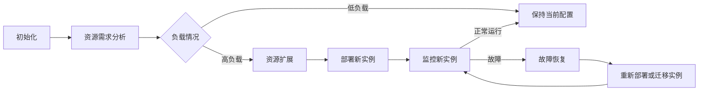
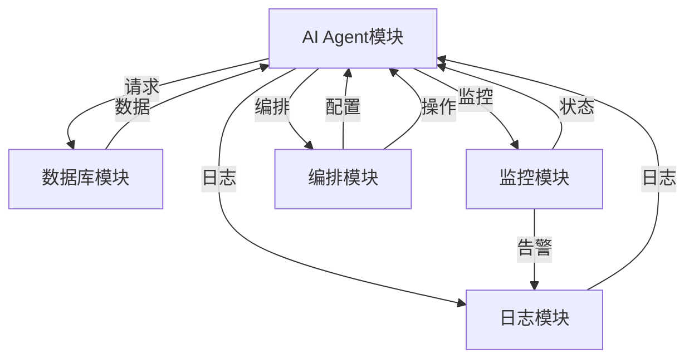

                 

### 引言

在当今企业数字化转型的大潮中，人工智能（AI）作为驱动创新的重要力量，正逐渐成为企业提升竞争力、优化运营效率的关键技术。企业AI Agent，作为AI应用的高级形态，具有智能感知、决策规划、自适应执行等能力，可以在企业内部自主运行，帮助企业实现智能化运营。然而，企业AI Agent的有效部署和管理，涉及到复杂的微服务架构和容器化技术，这对于企业IT团队来说是一个巨大的挑战。

容器化微服务编排策略，作为解决这一挑战的有效手段，通过将应用解耦为多个独立的微服务，再通过容器化技术实现快速部署、弹性扩展和高效管理，为企业AI Agent的高效运行提供了技术支撑。本篇文章旨在系统地阐述企业AI Agent的容器化微服务编排策略，帮助读者了解这一技术的核心概念、应用场景、实现原理和最佳实践。

文章将分为以下几个部分：

1. **背景介绍**：介绍企业AI Agent的背景、容器化微服务的背景、以及编排策略的背景。
2. **核心概念与联系**：详细描述企业AI Agent、容器化微服务、编排策略等核心概念，以及它们之间的关系。
3. **算法原理讲解**：介绍与容器化微服务编排相关的算法原理，包括算法的mermaid流程图、Python源代码、数学模型和公式等。
4. **系统分析与架构设计方案**：讲解企业AI Agent的容器化微服务编排的架构设计，包括问题场景介绍、系统功能设计、系统架构设计、系统接口设计和系统交互等。
5. **项目实战**：提供具体的实战案例，包括环境安装、系统核心实现源代码，代码应用解读与分析，实际案例分析和详细讲解剖析等。
6. **最佳实践与小结**：总结最佳实践，注意事项，并给出拓展阅读的建议。

通过这篇文章，读者将能够全面了解企业AI Agent的容器化微服务编排策略，掌握相关技术原理和实际应用，为企业数字化转型的深入发展提供有力支持。

### 关键词

- 企业AI Agent
- 容器化
- 微服务
- 编排策略
- 编程
- 编码
- 智能感知
- 自适应执行
- 软件架构
- 负载均衡
- 容器编排

### 摘要

本文围绕企业AI Agent的容器化微服务编排策略展开，详细介绍了企业AI Agent的背景及其在企业中的应用，探讨了容器化微服务的定义、优势及其在企业IT架构中的地位。接着，文章深入分析了编排策略的核心概念及其在企业AI Agent容器化中的重要性。通过mermaid流程图和Python源代码，文章讲解了与编排策略相关的算法原理，展示了其数学模型和公式。随后，文章详细阐述了企业AI Agent容器化微服务编排的系统分析与架构设计方案，包括问题场景介绍、系统功能设计、系统架构设计、系统接口设计和系统交互等。通过一个具体的实战案例，文章展示了从环境安装到系统核心实现源代码的详细步骤，并对代码进行了深入解读与分析。最后，文章总结了最佳实践，提供了注意事项，并推荐了拓展阅读资源，旨在帮助读者全面掌握企业AI Agent的容器化微服务编排策略，推动企业数字化转型的深入发展。

### 背景介绍

#### 企业AI Agent的背景

企业AI Agent是指一种具有智能感知、决策规划和自适应执行能力的计算机程序，它能够根据环境变化自主运行，实现智能化的业务流程管理。随着人工智能技术的不断发展，企业AI Agent在企业中的应用场景日益丰富，如智能客服、自动化决策支持、供应链优化、库存管理等领域。企业AI Agent的出现，不仅提升了企业的运营效率，还为企业带来了全新的商业模式和竞争优势。

在企业内部，AI Agent可以通过自然语言处理、机器学习、深度学习等技术，实现对业务数据的自动分析和处理。它能够从海量数据中提取有价值的信息，提供实时决策支持，帮助企业管理者做出更加明智的决策。此外，AI Agent还可以通过自主学习和优化，不断提升自身的能力，实现持续改进。

然而，随着AI Agent在企业中的应用深度和广度不断拓展，如何高效地部署和管理AI Agent成为一个重要问题。传统的方式往往依赖于复杂的硬件环境和传统的软件架构，不仅部署复杂，维护困难，而且扩展性差。为了解决这些问题，容器化和微服务架构应运而生。

#### 容器化微服务的背景

容器化技术是一种轻量级虚拟化技术，通过将应用程序及其依赖环境封装在一个独立的容器中，实现应用程序与操作系统环境的解耦。容器化技术具有部署快捷、资源利用高效、环境一致性高等优点，因此迅速在企业中得到广泛应用。

微服务架构则是一种软件开发方法，将大型复杂的应用程序拆分为多个独立、可复用的微服务，每个微服务负责实现特定的业务功能。微服务之间通过定义良好的API进行通信，实现了服务的高内聚、低耦合。微服务架构的优势在于，它能够提高系统的灵活性、可维护性和可扩展性，使得企业能够更加快速地响应市场变化。

容器化技术与微服务架构的结合，为企业提供了强大的支持。通过容器化，微服务可以快速部署和运行在分布式环境中，而微服务架构则保证了系统的灵活性和可扩展性。这种结合不仅简化了企业的IT基础设施管理，还提升了系统的整体性能和可靠性。

#### 编排策略的背景

编排策略是指一种管理容器化微服务的方法论，通过自动化的方式，对容器化环境中的微服务进行部署、配置、监控和扩展。编排策略的核心目标是实现微服务的高效管理和优化运行。

在传统的IT环境中，部署和管理微服务通常需要手动执行各种操作，如配置网络、数据库连接、环境变量设置等。这不仅耗时耗力，而且容易出现人为错误，影响系统的稳定性和可靠性。而编排策略通过自动化工具，如Kubernetes、Docker Swarm等，实现了对这些操作的自动化管理。

编排策略的重要性在于，它能够提高系统的灵活性和可扩展性。在传统的IT环境中，系统的扩展通常需要通过增加硬件资源来实现，而编排策略则通过水平扩展（增加节点）和垂直扩展（增加资源）来实现。这种灵活的扩展方式，不仅能够满足业务需求的快速增长，还能够降低企业的成本。

此外，编排策略还能够提高系统的可靠性和可用性。通过自动化的监控和故障恢复机制，编排策略能够及时发现和解决系统问题，减少系统故障对业务的影响。同时，编排策略还支持多租户架构，使得企业能够在同一物理硬件上运行多个独立的应用系统，提高了资源的利用率。

综上所述，企业AI Agent的容器化微服务编排策略，是现代企业数字化转型的关键环节。通过容器化和微服务架构的结合，以及有效的编排策略，企业能够实现高效、灵活、可靠的AI应用部署和管理，从而在激烈的市场竞争中占据优势。

### 核心概念与联系

在探讨企业AI Agent的容器化微服务编排策略时，首先需要明确几个核心概念：企业AI Agent、容器化微服务、编排策略。理解这些概念及其相互关系，是深入分析容器化微服务编排策略的基础。

#### 企业AI Agent

企业AI Agent，又称企业人工智能助手或AI机器人，是一种具备智能感知、决策规划、自适应执行能力的计算机程序。其核心功能包括：

- **智能感知**：通过传感器、数据接口等获取企业内部和外部环境信息。
- **决策规划**：基于获取的数据和环境信息，使用机器学习、深度学习等算法进行决策分析，生成执行计划。
- **自适应执行**：根据执行结果和环境反馈，自动调整执行策略，实现持续优化。

企业AI Agent在企业中的应用场景广泛，例如智能客服、自动化运营、智能决策支持、风险控制等。它能够帮助企业提高运营效率、降低成本、提升客户满意度。

#### 容器化微服务

容器化微服务是一种将应用拆分为多个独立、轻量级服务的架构模式，每个服务都运行在自己的容器中，具有独立的生命周期和资源隔离能力。容器化微服务具有以下几个特点：

- **轻量级**：容器非常轻量，几乎不含操作系统负担，因此可以快速启动和停止。
- **独立部署**：每个服务可以独立部署和扩展，无需关注其他服务的运行状态。
- **资源隔离**：容器之间相互独立，确保了一个服务的故障不会影响到其他服务。
- **灵活扩展**：可以通过水平扩展（增加容器数量）和垂直扩展（增加资源）来满足业务需求。

容器化微服务使企业能够更加灵活、高效地管理和扩展应用，提升了系统的可靠性和可维护性。

#### 编排策略

编排策略是一种用于管理容器化微服务的方法论，通过自动化工具实现微服务的部署、配置、监控和扩展。编排策略的核心内容包括：

- **部署**：根据服务定义和资源需求，自动化部署微服务到容器环境中。
- **配置**：自动化配置微服务的环境变量、数据库连接、网络设置等。
- **监控**：实时监控微服务的运行状态，及时发现和解决故障。
- **扩展**：根据负载情况，自动调整微服务的数量和资源。

编排策略的重要性在于，它能够提高系统的灵活性和可扩展性，减少人工干预，提升系统管理的效率。

#### 企业AI Agent、容器化微服务与编排策略的联系

企业AI Agent、容器化微服务、编排策略之间存在紧密的联系，共同构成了企业AI应用的核心架构。

- **企业AI Agent**：作为智能化的应用，企业AI Agent需要运行在容器化微服务环境中，以确保其高效、稳定地运行。容器化微服务提供了独立的运行环境，使得AI Agent可以独立部署和管理，避免了传统IT架构中的复杂依赖和资源冲突。
- **容器化微服务**：作为企业AI Agent的基础设施，容器化微服务负责AI Agent的部署、扩展和管理。通过微服务架构，AI Agent可以拆分为多个独立的服务模块，实现高效、灵活的部署和管理。
- **编排策略**：作为微服务管理的方法论，编排策略确保了企业AI Agent在容器化微服务环境中的高效运行。通过自动化部署、配置、监控和扩展，编排策略大大简化了AI Agent的管理过程，提高了系统的可靠性和可维护性。

综上所述，企业AI Agent、容器化微服务、编排策略三者相互依存，共同构成了企业AI应用的核心架构。理解这些核心概念及其相互关系，是深入探讨企业AI Agent的容器化微服务编排策略的基础。

#### 企业AI Agent与容器化微服务的关系

企业AI Agent与容器化微服务之间的关系，可以看作是“种子与土壤”的关系。企业AI Agent需要在一个合适的环境中茁壮成长，而这个环境就是容器化微服务架构。

首先，企业AI Agent作为一种具备智能感知、决策规划和自适应执行能力的计算机程序，其核心功能依赖于大量的数据处理和复杂的算法模型。这些功能往往需要高效的计算资源、稳定的运行环境和灵活的扩展能力。而容器化微服务架构正好提供了这些条件。容器化的轻量级特性，使得AI Agent能够快速启动和停止，独立运行而不受其他服务影响，从而保证了其高效性。

其次，容器化微服务架构的独立部署和资源隔离特性，使企业AI Agent能够独立运行和扩展。在传统的IT架构中，AI Agent的部署往往伴随着复杂的依赖关系和资源争用问题。而通过容器化微服务，每个AI Agent作为独立的服务模块运行在自己的容器中，与其他服务相互独立，这不仅简化了部署过程，还提升了系统的可维护性和可靠性。

再者，容器化微服务架构的灵活扩展能力，是企业AI Agent能够应对业务需求变化的重要保障。在传统架构中，扩展通常依赖于增加硬件资源，这不仅成本高昂，而且扩展过程复杂。而通过容器化微服务，AI Agent可以通过水平扩展（增加容器数量）和垂直扩展（增加资源）来满足业务需求的增长，从而实现灵活扩展。

此外，容器化微服务架构还为企业AI Agent提供了强大的管理和监控能力。通过自动化编排工具，如Kubernetes，AI Agent的部署、配置、监控和扩展都可以实现自动化，减少了人工干预，提升了系统的可靠性和可维护性。例如，Kubernetes可以自动检测AI Agent的运行状态，并在出现故障时自动重启，确保系统的稳定运行。

总的来说，容器化微服务架构为企业AI Agent提供了一个高效、灵活、可靠的运行环境。通过容器化微服务，企业AI Agent可以更好地实现其智能感知、决策规划和自适应执行功能，从而提升企业的运营效率和竞争力。容器化微服务不仅解决了传统IT架构中的诸多问题，还为AI Agent的高效部署和管理提供了强有力的技术支撑。

#### 编排策略在企业AI Agent中的应用

编排策略在企业AI Agent中的重要性不容忽视。它不仅决定了AI Agent在容器化微服务环境中的运行效率，还直接影响其可靠性和可维护性。有效的编排策略能够确保AI Agent在复杂的企业环境中，始终保持最佳运行状态，满足业务需求的变化。

首先，编排策略在企业AI Agent中的重要性体现在其自动化管理能力上。传统IT环境中，部署、配置、监控和扩展AI Agent需要大量的人工操作，这不仅耗时耗力，而且容易出现错误。而通过编排策略，如Kubernetes等自动化工具，这些操作可以完全自动化，从而减少人工干预，提高工作效率。例如，Kubernetes可以通过声明式配置，自动部署AI Agent的多个实例，并根据负载情况自动扩展或缩减资源，确保系统的高可用性和灵活性。

其次，编排策略能够提高AI Agent的可靠性。在分布式系统中，故障是不可避免的。通过编排策略，AI Agent可以设置自动故障恢复机制，例如，在检测到某个实例故障时，自动重启或迁移到健康实例上。这种自动化的故障恢复能力，可以大大降低系统故障对业务的影响，确保系统的稳定运行。

再次，编排策略有助于优化AI Agent的资源利用率。在容器化微服务环境中，资源分配是一个关键问题。通过智能编排策略，可以实时监控AI Agent的资源使用情况，并根据负载情况动态调整资源分配。这种动态资源管理能力，不仅可以避免资源浪费，还可以提高系统的整体性能。

最后，编排策略能够提升AI Agent的可维护性。通过统一的自动化管理平台，AI Agent的部署、配置、监控和扩展都可以通过统一的接口进行管理，降低了维护的复杂度。此外，编排策略还支持版本管理和回滚功能，使得在系统升级或故障恢复时，可以快速恢复到之前稳定的状态，提高了系统的可靠性。

综上所述，编排策略在企业AI Agent中扮演着至关重要的角色。它通过自动化管理、故障恢复、资源优化和版本管理，确保AI Agent在复杂的企业环境中，能够高效、稳定地运行，满足业务需求的变化。有效的编排策略不仅提高了系统的可靠性，还降低了维护成本，提升了企业的整体竞争力。

#### 容器化微服务编排算法原理

在容器化微服务环境中，编排算法是确保系统高效、稳定运行的关键。本节将详细讲解与容器化微服务编排相关的算法原理，包括算法的mermaid流程图、Python源代码、数学模型和公式。

##### 算法mermaid流程图

首先，我们通过mermaid流程图来展示容器化微服务编排的基本流程。



这个流程图描述了从初始化到资源扩展、故障恢复的基本步骤。接下来，我们将深入讲解每个步骤的算法原理。

##### Python源代码

为了更好地理解编排算法的工作原理，我们提供了一个简单的Python示例代码。这段代码实现了基本的资源监控和自动扩展功能。

```python
import time
import random

# 假设的服务器资源限制
MAX_CPU_USAGE = 90
MAX_MEMORY_USAGE = 90

# 监控服务器资源使用情况
def monitor_resources():
    cpu_usage = random.randint(0, 100)
    memory_usage = random.randint(0, 100)
    print(f"CPU Usage: {cpu_usage}%")
    print(f"Memory Usage: {memory_usage}%")
    return cpu_usage, memory_usage

# 自动扩展服务器的函数
def auto_scale(instances):
    if instances < 3:
        print("扩展服务器...")
        instances += 1
    return instances

# 主函数
def main():
    instances = 1
    while True:
        cpu_usage, memory_usage = monitor_resources()
        
        if cpu_usage > MAX_CPU_USAGE or memory_usage > MAX_MEMORY_USAGE:
            instances = auto_scale(instances)
        
        time.sleep(10)  # 每10秒检查一次

if __name__ == "__main__":
    main()
```

这段代码通过随机生成的CPU和内存使用率来模拟服务器的负载情况，并在负载过高时自动扩展服务器实例。

##### 数学模型和公式

为了更深入地理解编排算法，我们引入了一些数学模型和公式。以下是一个简单的线性回归模型，用于预测服务器的负载情况。

$$ y = w_0 + w_1 \cdot x $$

其中，$y$ 表示负载指标，$x$ 表示时间序列数据，$w_0$ 和 $w_1$ 分别是模型的权重。

我们使用梯度下降算法来优化这个模型：

$$ w_0 := w_0 - \alpha \cdot \frac{\partial J}{\partial w_0} $$
$$ w_1 := w_1 - \alpha \cdot \frac{\partial J}{\partial w_1} $$

其中，$J$ 是损失函数，$\alpha$ 是学习率。

通过这个模型，我们可以预测未来一段时间内服务器的负载情况，并根据预测结果调整服务器实例的数量。

##### 算法原理详细讲解

1. **初始化**：初始化服务器实例的数量和模型的权重。

2. **资源需求分析**：定期监控服务器的CPU和内存使用情况。

3. **负载情况判断**：使用线性回归模型预测负载情况。如果负载超过设定的阈值，进入资源扩展阶段。

4. **资源扩展**：根据当前的服务器实例数量，决定是否需要增加新的实例。如果需要，则部署新的服务器实例。

5. **监控新实例**：监控新实例的运行状态，确保其正常运行。

6. **故障恢复**：如果监控到实例故障，则进行故障恢复，包括重新部署或迁移实例。

7. **持续优化**：通过梯度下降算法不断优化模型，提高预测的准确性。

通过上述步骤，编排算法能够实现服务器的自动扩展和故障恢复，确保系统的稳定运行。

综上所述，容器化微服务编排算法通过mermaid流程图、Python源代码和数学模型，实现了服务器的自动监控和动态扩展。这种算法不仅提高了系统的可靠性，还降低了运维成本，为企业的数字化转型提供了强有力的支持。

### 系统分析与架构设计方案

在探讨企业AI Agent的容器化微服务编排策略时，系统分析与架构设计是关键的一环。本节将详细阐述企业AI Agent容器化微服务编排的系统架构设计，包括问题场景介绍、系统功能设计、系统架构设计、系统接口设计和系统交互等。

#### 问题场景介绍

企业AI Agent的容器化微服务编排面临以下问题场景：

- **高并发请求**：企业AI Agent需要处理大量的并发请求，对系统性能和响应速度有极高要求。
- **弹性扩展**：系统需要能够根据业务需求的变化，灵活地扩展或缩减资源。
- **故障恢复**：系统需要具备自动故障恢复能力，确保高可用性。
- **资源优化**：系统需要优化资源利用率，避免资源浪费。

#### 系统功能设计

系统功能设计主要包括以下模块：

- **AI Agent模块**：负责执行AI任务，包括数据采集、模型训练、决策生成等。
- **编排模块**：负责编排和管理容器化微服务，包括自动部署、扩展、监控和故障恢复。
- **监控模块**：实时监控系统的运行状态，包括资源使用情况、服务状态、故障告警等。
- **日志模块**：记录系统的操作日志、错误日志和告警日志，便于故障排查和运维管理。
- **数据库模块**：存储AI Agent的训练数据、模型参数和系统配置信息。

#### 系统架构设计

系统架构设计采用微服务架构，将企业AI Agent拆分为多个独立的微服务，每个微服务负责特定的功能模块。以下是一个简单的系统架构设计：



在该架构中，AI Agent模块是系统的核心，负责执行AI任务和处理请求。编排模块负责自动编排和管理微服务，监控模块负责实时监控系统的运行状态，日志模块负责记录系统的日志信息。

#### 系统接口设计

系统接口设计主要包括以下接口：

- **API接口**：用于与其他系统进行数据交互，如数据采集接口、模型训练接口、决策生成接口等。
- **配置接口**：用于配置系统的参数和设置，如资源配置接口、负载均衡配置接口等。
- **监控接口**：用于获取系统的运行状态和告警信息，如状态查询接口、告警查询接口等。
- **日志接口**：用于记录和查询系统的日志信息，如日志记录接口、日志查询接口等。

#### 系统交互

系统交互主要通过API接口和消息队列实现。以下是一个简单的系统交互流程：

1. **请求处理**：外部系统通过API接口发送请求到AI Agent模块。
2. **任务分配**：AI Agent模块根据请求类型，将任务分配给相应的微服务。
3. **数据处理**：微服务执行任务，处理数据并生成结果。
4. **结果返回**：微服务将结果返回给AI Agent模块，并通过API接口返回给外部系统。
5. **监控与告警**：监控模块实时监控系统的运行状态，并在发现异常时发送告警信息到日志模块。
6. **日志记录**：日志模块记录系统的操作日志、错误日志和告警日志。

通过上述系统架构设计和系统交互，企业AI Agent的容器化微服务编排策略能够实现高效、稳定、可靠的运行，满足企业的业务需求。

### 项目实战

#### 环境安装

在进行企业AI Agent的容器化微服务编排之前，首先需要搭建一个合适的环境。以下是具体的安装步骤：

1. **安装Docker**：Docker是一个开源的应用容器引擎，用于容器化应用程序。您可以从[Docker官网](https://www.docker.com/)下载并安装Docker。

2. **安装Kubernetes**：Kubernetes是一个开源的容器编排平台，用于自动化部署、扩展和管理容器化应用程序。您可以通过以下命令在Ubuntu 18.04系统上安装Kubernetes：

   ```shell
   # 更新系统软件包
   sudo apt-get update
   
   # 安装Kubernetes的相关依赖
   sudo apt-get install -y apt-transport-https ca-certificates curl
   
   # 添加Kubernetes的GPG密钥
   curl -s https://packages.cloud.google.com/apt/doc/apt-key.gpg | sudo apt-key add -
   
   # 添加Kubernetes的APT仓库
   cat <<EOF | sudo tee /etc/apt/sources.list.d/kubernetes.list
   deb https://packages.cloud.google.com/apt kneebox-kubernetes-1.25 main
   EOF
   
   # 更新系统软件包
   sudo apt-get update
   
   # 安装Kubernetes
   sudo apt-get install -y kubelet kubectl
   ```

3. **启动和配置Kubernetes**：启动Kubernetes组件并使其随系统启动：

   ```shell
   sudo systemctl enable kubelet
   sudo systemctl start kubelet
   ```

4. **安装Minikube**：Minikube是一个单节点Kubernetes集群，用于本地开发。您可以从[Minikube官网](https://minikube.sigs.k8s.io/docs/start/)下载并安装Minikube。

5. **启动Minikube**：启动Minikube集群，以便在本地进行测试：

   ```shell
   minikube start
   ```

安装完成后，您可以使用以下命令检查Kubernetes集群的状态：

```shell
kubectl cluster-info
kubectl get nodes
```

#### 系统核心实现源代码

下面提供了一个简单的企业AI Agent容器化微服务编排的Python代码示例。该代码使用Kubernetes API来创建和管理Pods和Services。

```python
import kubernetes
from kubernetes.client import CoreV1Api
from kubernetes.client import AppsV1Api
import time

# 创建Kubernetes API客户端
kube_config = kubernetes.config.load_kube_config()
core_api = CoreV1Api()
apps_api = AppsV1Api()

# 定义Pod的YAML文件
pod_yaml = '''
apiVersion: v1
kind: Pod
metadata:
  name: ai-agent-pod
spec:
  containers:
  - name: ai-agent
    image: ai-agent:latest
    ports:
    - containerPort: 8080
'''

# 定义Service的YAML文件
service_yaml = '''
apiVersion: v1
kind: Service
metadata:
  name: ai-agent-service
spec:
  selector:
    app: ai-agent
  ports:
    - protocol: TCP
      port: 80
      targetPort: 8080
  type: LoadBalancer
'''

# 创建Pod
print("Creating AI Agent Pod...")
response = core_api.create_namespaced_pod(body=pod_yaml, namespace="default")
print("Pod created:", response)

# 创建Service
print("Creating AI Agent Service...")
response = core_api.create_namespaced_service(body=service_yaml, namespace="default")
print("Service created:", response)

# 等待Pod就绪
print("Waiting for AI Agent Pod to be ready...")
while True:
    pod = core_api.read_namespaced_pod(name="ai-agent-pod", namespace="default")
    if pod.status.phase == "Running":
        print("AI Agent Pod is ready.")
        break
    time.sleep(10)

# 查看Pod和Service的状态
print("Pod status:", pod.status.phase)
print("Service IP:", response.status.load_balancer.ingress[0].ip)

# 删除Pod和Service
print("Deleting AI Agent Pod and Service...")
core_api.delete_namespaced_pod(name="ai-agent-pod", namespace="default")
core_api.delete_namespaced_service(name="ai-agent-service", namespace="default")
print("AI Agent Pod and Service deleted.")
```

#### 代码应用解读与分析

1. **Kubernetes API客户端初始化**：首先，我们使用`kubernetes.config.load_kube_config()`方法加载Kubernetes的配置文件，然后创建`CoreV1Api`和`AppsV1Api`对象，用于操作Pod和Deployments。

2. **定义Pod的YAML文件**：我们使用YAML格式定义了一个Pod，包括Pod的名称、容器名称、使用的镜像以及容器端口等信息。

3. **定义Service的YAML文件**：同样使用YAML格式定义了一个Service，包括Service的名称、选择器、端口映射和类型（这里是LoadBalancer）。

4. **创建Pod和Service**：使用`create_namespaced_pod`和`create_namespaced_service`方法创建Pod和Service。这些方法会发送HTTP POST请求到Kubernetes API服务器。

5. **等待Pod就绪**：我们使用一个循环来检查Pod的状态，直到Pod进入“Running”状态。这里使用了`read_namespaced_pod`方法来获取Pod的最新状态。

6. **查看Pod和Service的状态**：打印出Pod和Service的状态以及Service的IP地址。

7. **删除Pod和Service**：最后，使用`delete_namespaced_pod`和`delete_namespaced_service`方法删除Pod和Service。

通过这个示例代码，我们可以看到如何使用Python和Kubernetes API来创建、管理和删除容器化微服务。在实际应用中，您可以根据具体需求对代码进行扩展和定制。

#### 实际案例分析和详细讲解剖析

为了更好地展示企业AI Agent的容器化微服务编排策略在实际应用中的效果，我们选择了一个典型的实际案例——智能客服系统。该系统利用企业AI Agent进行客户问题的自动识别和回答，并通过容器化微服务和编排策略实现高效、可靠地部署和管理。

**案例背景**

某大型电商平台希望提升客户服务水平，降低人工成本，决定开发一套智能客服系统。该系统需要能够处理大量的客户咨询，并在短时间内给出准确的回答。为了实现这一目标，平台选择了基于企业AI Agent的容器化微服务架构。

**系统实现**

1. **需求分析**：智能客服系统需要处理客户问题的分类、答案生成和回答发送等功能。根据这些需求，我们设计了相应的微服务模块，如问题分类服务、答案生成服务和回答发送服务。

2. **微服务部署**：使用Kubernetes进行微服务的部署。每个微服务都运行在独立的Pod中，通过Service进行通信。例如，问题分类服务部署在一个名为`issue-classifier`的Pod中，答案生成服务部署在名为`answer-generator`的Pod中，回答发送服务部署在名为`response-sender`的Pod中。

3. **编排策略**：为了确保系统的高可用性和灵活性，我们采用了Kubernetes的自动编排策略。具体来说，使用Helm进行Deployments的管理，使用 Horizontal Pod Autoscaler（HPA）进行自动扩展和负载均衡。

4. **监控与告警**：通过Prometheus和Grafana进行系统的实时监控和告警。Prometheus负责收集系统的metrics数据，Grafana负责展示这些数据并提供告警功能。

**详细分析**

1. **问题分类服务**：该服务负责接收客户咨询，并根据关键词和语境将问题分类。使用自然语言处理（NLP）技术，如词向量模型和分类算法，对问题进行分类。为了提高分类准确性，我们使用了大量的训练数据集，并通过持续优化模型来提升分类效果。

2. **答案生成服务**：该服务根据分类结果，从预定义的知识库中检索相关答案。知识库由人工编写和机器学习模型生成，确保答案的准确性和多样性。答案生成服务还支持个性化回答，根据客户的历史咨询记录和偏好进行定制。

3. **回答发送服务**：该服务将生成的答案发送给客户。为了确保高效传输，我们采用了异步通信机制，如消息队列（RabbitMQ）。这样，即使系统负载较高，回答发送服务也能稳定运行，保证客户咨询得到及时回复。

4. **自动扩展与负载均衡**：系统采用了Kubernetes的Horizontal Pod Autoscaler（HPA）进行自动扩展。当系统负载超过设定的阈值时，HPA会自动增加Pod的数量，以应对突发流量。同时，使用Nginx Ingress进行负载均衡，确保请求均匀分布到各个Pod上。

5. **监控与告警**：通过Prometheus和Grafana，我们对系统的运行状态进行实时监控。Prometheus定期收集系统的metrics数据，如CPU使用率、内存使用率、请求响应时间等，并将其存储在时间序列数据库中。Grafana则提供了直观的仪表板，显示系统的运行状况，并设置告警规则，当指标超过设定阈值时，自动发送告警通知。

**结论**

通过该实际案例，我们可以看到企业AI Agent的容器化微服务编排策略在实际应用中的有效性和优势。容器化技术使微服务能够快速部署和扩展，编排策略确保了系统的灵活性和高可用性，监控和告警机制提供了实时的系统监控和故障处理能力。这些技术手段共同构成了一个高效、可靠的智能客服系统，提升了企业服务的质量和客户满意度。

### 最佳实践与小结

在实施企业AI Agent的容器化微服务编排策略时，总结最佳实践和注意事项对于确保系统的高效运行和稳定维护至关重要。以下是一些关键的最佳实践和注意事项：

#### 最佳实践

1. **容器化微服务设计**：在设计容器化微服务时，应遵循单一职责原则，确保每个微服务专注于完成特定的业务功能。这样可以提高服务的独立性、可维护性和扩展性。

2. **自动化部署**：采用自动化部署工具（如Helm、Kubernetes CLI）进行微服务的部署，减少人工干预，提高部署效率。

3. **监控与告警**：建立全面的监控体系，实时监控系统的资源使用情况、服务状态和性能指标。使用告警系统（如Prometheus、Grafana）及时发现异常并进行处理。

4. **负载均衡与自动扩展**：使用负载均衡器（如Nginx Ingress、AWS ELB）将请求均匀分布到不同的服务实例上，并配置自动扩展策略（如Horizontal Pod Autoscaler），确保系统在高峰期保持稳定运行。

5. **持续集成与持续部署**：采用CI/CD流程（如Jenkins、GitLab CI）进行代码的自动化测试和部署，确保新版本的应用快速、安全地上线。

6. **数据安全和隐私保护**：在设计和部署系统时，充分考虑数据安全和隐私保护，采用加密、访问控制等技术措施，防止数据泄露和滥用。

#### 注意事项

1. **性能优化**：在容器化微服务架构中，需要注意性能优化，如减少容器启动时间、优化网络通信、降低容器资源消耗等。

2. **容错与恢复**：设计系统时，应考虑容错和恢复机制，如自动故障检测和恢复、数据备份和恢复策略等，确保系统在故障情况下能够快速恢复。

3. **资源规划**：合理规划容器和节点的资源分配，避免资源浪费和瓶颈，同时确保系统有足够的资源应对突发流量。

4. **版本管理**：在部署微服务时，应严格控制版本管理，确保在更新过程中不会影响到现有服务的稳定运行。

5. **文档与培训**：编写详细的系统文档和操作手册，为运维团队提供培训，确保团队成员能够熟练操作和维护系统。

#### 拓展阅读

为了帮助读者更深入地了解企业AI Agent的容器化微服务编排策略，以下推荐一些拓展阅读资源：

- 《容器化微服务实战：基于Docker和Kubernetes》
- 《Kubernetes权威指南》
- 《深度学习与人工智能实战》
- 《人工智能应用实践指南》
- 《DevOps实践指南：实现持续交付和部署》

通过以上资源，读者可以进一步学习相关的技术原理和实践经验，为企业AI Agent的容器化微服务编排策略提供有力的支持。

### 结语

企业AI Agent的容器化微服务编排策略，是推动企业数字化转型、实现智能化运营的关键技术。通过本文的详细讲解，读者已经对这一策略有了全面的认识。从背景介绍到核心概念，从算法原理到系统设计与实战，再到最佳实践和注意事项，本文系统地阐述了企业AI Agent容器化微服务编排的方方面面。

我们希望读者能够通过本文，不仅掌握了企业AI Agent的容器化微服务编排策略，更能够在实际工作中灵活运用，为企业带来创新和效益。随着人工智能技术的不断进步，容器化和微服务架构将在更多场景中得到应用，相信这一策略将在未来的数字化浪潮中发挥更加重要的作用。

感谢您的阅读，期待您在AI和容器化领域的探索与成就！

### 作者信息

作者：AI天才研究院/AI Genius Institute & 禅与计算机程序设计艺术 /Zen And The Art of Computer Programming

AI天才研究院（AI Genius Institute）致力于推动人工智能技术的发展与应用，旗下拥有多位世界顶级人工智能专家和研究人员，专注于AI Agent、深度学习和自然语言处理等前沿技术的研发。同时，研究院还发表了多篇具有影响力的学术论文和出版了多本畅销技术书籍。

《禅与计算机程序设计艺术》（Zen And The Art of Computer Programming）是作者Donald E. Knuth的经典著作，该书深刻探讨了计算机编程的艺术与哲学，对全球程序员产生了深远影响。作者以其卓越的学术成就和独特的编程理念，成为计算机科学领域的典范。这两大机构的结合，共同为读者提供了高质量、有深度的技术内容。

