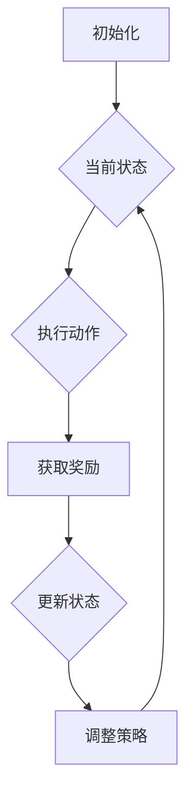
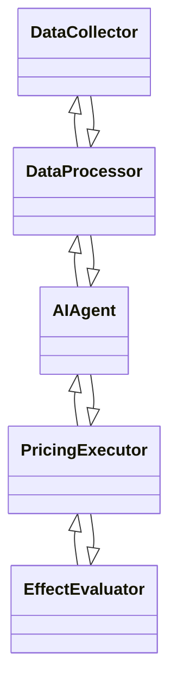
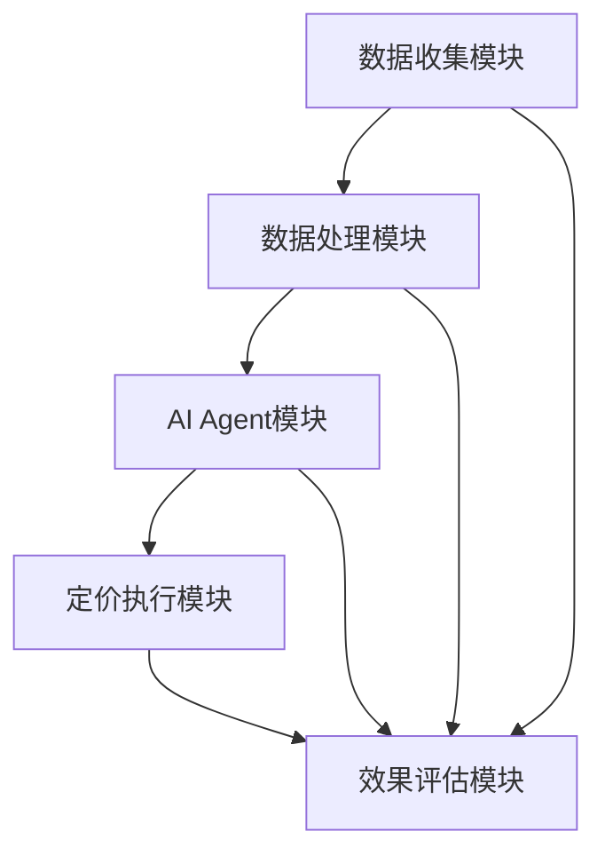
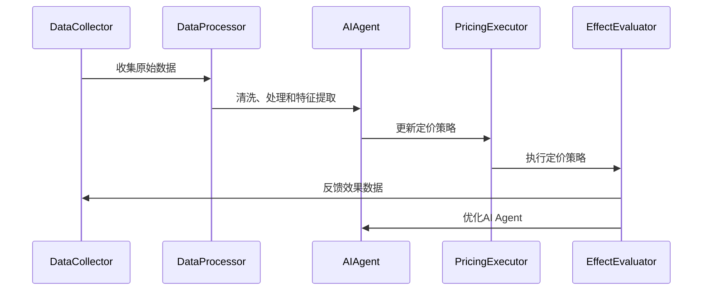

                 


### 文章标题

《企业AI Agent的强化学习在动态定价策略中的应用》

### 关键词

- 企业AI Agent
- 强化学习
- 动态定价策略
- 机器学习
- 经济优化

### 摘要

本文深入探讨了企业AI Agent如何结合强化学习算法，在动态定价策略中发挥重要作用。文章首先介绍了动态定价的背景、问题和传统方法的局限性，然后详细阐述了AI Agent和强化学习的基本概念及其在商业中的应用。接下来，文章通过数学模型和Python代码，讲解了强化学习算法在动态定价策略中的原理和应用，并展示了实际案例。最后，文章提供了项目实战经验、最佳实践建议和进一步阅读的资料，旨在帮助读者理解和应用这一前沿技术。

## 背景介绍

### 动态定价问题背景

在现代商业环境中，动态定价已成为企业应对市场变化和竞争压力的一种有效手段。动态定价指的是根据市场需求、供应状况、消费者行为等因素，实时调整产品或服务的价格，以达到最大化利润或市场份额的目标。随着互联网和大数据技术的发展，动态定价策略逐渐从理论走向实践，成为企业管理的一项重要工具。

#### 市场变化与竞争压力

市场变化是动态定价的驱动力。消费者的购买意愿受多种因素影响，如收入水平、消费习惯、市场趋势等。企业必须敏锐捕捉市场变化，快速调整定价策略，以适应消费者需求的变化。此外，市场竞争也迫使企业不断优化定价策略。在激烈的市场竞争中，价格往往成为企业争夺市场份额的重要手段。动态定价可以帮助企业根据竞争对手的价格策略进行调整，从而在竞争中占据有利地位。

#### 动态定价的重要性

动态定价对企业具有多重重要意义。首先，它有助于企业提高利润。通过实时调整价格，企业可以更好地平衡市场需求和供给，避免库存过剩或短缺，从而最大化利润。其次，动态定价有助于提高市场竞争力。企业可以根据市场状况灵活调整价格，以吸引更多消费者，扩大市场份额。此外，动态定价还可以提高消费者的满意度。消费者更愿意购买价格合理的商品或服务，而动态定价策略可以确保产品或服务的价格始终处于消费者可接受的范围。

#### 传统动态定价方法的局限性

尽管动态定价具有诸多优势，但传统的动态定价方法仍然存在一些局限性。首先，传统方法往往依赖于历史数据和简单的价格模型，难以应对复杂的市场变化。其次，传统方法需要大量的人力和时间来分析数据和市场趋势，效率较低。此外，传统方法通常缺乏灵活性，难以快速响应市场变化。因此，企业需要更先进的方法来优化动态定价策略。

### 问题描述

在当前的商业环境中，如何有效地利用AI Agent和强化学习算法来优化动态定价策略，成为企业面临的一个重要问题。强化学习作为一种先进的机器学习算法，能够通过不断试错和学习，找到最优的定价策略。AI Agent则作为强化学习的一种应用，可以在复杂的市场环境中自主决策，实现动态定价。

#### 企业AI Agent的定义

企业AI Agent是指利用人工智能技术，模拟企业行为主体，在特定商业环境中进行决策和执行的智能体。AI Agent可以处理大量的市场数据，识别市场趋势，预测消费者行为，并根据这些信息调整定价策略。

#### 企业AI Agent的类型

根据应用场景和任务的不同，企业AI Agent可以分为多种类型。例如：

1. **市场分析Agent**：负责分析市场数据，识别市场趋势和竞争态势。
2. **消费者行为预测Agent**：通过分析消费者行为数据，预测消费者需求。
3. **定价策略优化Agent**：根据市场分析和消费者行为预测，制定和优化定价策略。

#### 企业AI Agent的应用场景

企业AI Agent可以在多个商业场景中发挥作用。例如：

1. **电子商务**：利用AI Agent进行实时定价，提高商品销售额。
2. **零售业**：通过AI Agent优化库存管理和定价策略，降低库存成本。
3. **服务业**：利用AI Agent实现个性化定价，提高客户满意度。

#### 强化学习与AI Agent的结合

强化学习通过奖励机制，激励AI Agent在特定环境中寻找最优策略。在动态定价策略中，强化学习可以帮助AI Agent通过不断试错和学习，逐渐找到最优的定价策略。结合AI Agent，强化学习能够实现以下目标：

1. **自适应调整**：根据市场变化和消费者反馈，实时调整定价策略。
2. **提高效率**：自动化定价策略的调整过程，节省人力和时间成本。
3. **增强灵活性**：灵活应对复杂多变的市场环境，提高竞争力。

### 问题解决

为了解决动态定价中的挑战，本文提出了一种基于AI Agent和强化学习算法的动态定价策略。该策略的核心思想是通过强化学习算法，训练AI Agent在复杂的市场环境中自主决策，实现动态定价。

#### 模型应用范围

该模型适用于各种商业环境，包括电子商务、零售业和服务业等。具体应用场景包括：

1. **实时定价**：根据市场变化和消费者反馈，实时调整商品价格。
2. **库存管理**：优化库存水平，降低库存成本。
3. **个性化定价**：根据消费者行为数据，为不同消费者提供个性化的价格策略。

#### 模型局限性

尽管该模型具有显著优势，但仍然存在一些局限性。例如：

1. **数据依赖性**：模型的效果高度依赖于市场数据和消费者行为数据的质量和完整性。
2. **计算复杂性**：强化学习算法的计算复杂性较高，可能需要较大的计算资源。
3. **决策时间**：实时决策可能受到计算速度的限制，无法立即响应市场变化。

#### 潜在发展方向

为了克服上述局限性，未来的研究可以从以下几个方面进行：

1. **数据预处理**：通过数据清洗和特征工程，提高数据质量，降低对原始数据的依赖。
2. **算法优化**：研究更高效的强化学习算法，降低计算复杂度，提高计算速度。
3. **多模型融合**：将强化学习与其他机器学习算法（如深度学习、强化学习等）结合，提高模型的灵活性和鲁棒性。

### 边界与外延

#### 应用范围

本文提出的基于AI Agent和强化学习算法的动态定价策略适用于多种商业环境，但特定行业和应用场景可能需要进一步的定制和优化。

#### 局限性

虽然该策略具有显著优势，但仍然面临数据依赖性、计算复杂性和决策时间等挑战。此外，实际应用中可能存在其他未考虑到的因素，需要进一步研究和解决。

#### 发展方向

未来的研究方向包括数据预处理、算法优化和多模型融合等。通过不断优化和改进，有望进一步提高动态定价策略的有效性和实用性。

### 本章小结

本文介绍了企业面临动态定价的挑战，探讨了如何利用AI Agent和强化学习算法实现有效的动态定价策略。文章首先分析了动态定价的背景和问题，然后阐述了AI Agent和强化学习的基本概念及其在商业中的应用。通过数学模型和Python代码，文章详细讲解了强化学习算法在动态定价策略中的应用，并展示了实际案例。最后，文章提出了模型的应用范围、局限性和潜在发展方向。希望本文能为企业和研究人员提供有价值的参考和启示。

## 核心概念与联系

### 企业AI Agent

#### 定义

企业AI Agent是一种利用人工智能技术模拟企业行为主体的智能体。它能够处理大量的市场数据，识别市场趋势，预测消费者行为，并根据这些信息调整定价策略。

#### 类型

企业AI Agent可以分为多种类型，根据应用场景和任务的不同，包括：

1. **市场分析Agent**：负责分析市场数据，识别市场趋势和竞争态势。
2. **消费者行为预测Agent**：通过分析消费者行为数据，预测消费者需求。
3. **定价策略优化Agent**：根据市场分析和消费者行为预测，制定和优化定价策略。

#### 应用场景

企业AI Agent可以在多个商业场景中发挥作用，例如：

1. **电子商务**：利用AI Agent进行实时定价，提高商品销售额。
2. **零售业**：通过AI Agent优化库存管理和定价策略，降低库存成本。
3. **服务业**：利用AI Agent实现个性化定价，提高客户满意度。

### 强化学习

#### 原理

强化学习是一种通过试错和反馈机制进行学习的方法。它主要解决的是在不确定环境下，如何通过自主决策和行为调整，实现长期累积奖励最大化的问题。强化学习的基本原理包括：

1. **环境（Environment）**：指智能体所处的环境，包括状态空间和动作空间。
2. **智能体（Agent）**：在环境中执行动作，通过观察环境反馈来调整策略。
3. **状态（State）**：智能体在环境中的一个特定情境。
4. **动作（Action）**：智能体在某一状态下可以执行的动作。
5. **奖励（Reward）**：智能体在执行动作后，从环境中获得的即时反馈。
6. **策略（Policy）**：智能体在特定状态下选择动作的规则。

#### 算法类型

强化学习可以分为以下几种类型：

1. **值函数方法**：通过学习状态值函数或动作值函数来预测未来奖励，常见的算法有Q-Learning和SARSA。
2. **策略优化方法**：直接优化策略，使策略能够最大化预期奖励，常见的算法有Policy Gradient和REINFORCE。
3. **模型学习方法**：通过学习环境模型，预测状态转移概率和奖励值，常见的算法有Actor-Critic。

#### 优势与应用

强化学习的优势在于其能够处理高度不确定和动态变化的复杂环境，能够在长期累积奖励最大化的目标下，通过自主学习和适应，实现智能决策。强化学习在商业中的应用包括：

1. **供应链管理**：通过优化库存和采购策略，降低成本，提高效率。
2. **市场营销**：通过个性化定价和广告策略，提高转化率和客户满意度。
3. **推荐系统**：通过学习用户行为，提供个性化的产品推荐。

### 动态定价策略

#### 定义

动态定价策略是一种根据市场需求、供应状况、消费者行为等因素，实时调整产品或服务价格的策略。

#### 目标

动态定价策略的主要目标包括：

1. **最大化利润**：通过实时调整价格，平衡市场需求和供给，最大化企业利润。
2. **提高市场份额**：通过灵活的价格策略，吸引更多消费者，提高市场份额。
3. **提高客户满意度**：提供价格合理的商品或服务，提高消费者满意度。

#### 方法

动态定价策略的主要方法包括：

1. **基于历史数据的定价策略**：通过分析历史销售数据和价格变化趋势，预测未来的价格。
2. **基于市场需求的定价策略**：根据当前市场需求和供应状况，动态调整价格。
3. **基于消费者行为的定价策略**：通过分析消费者行为数据，预测消费者需求，制定个性化的价格策略。

#### 强化学习在动态定价策略中的角色

强化学习在动态定价策略中扮演着重要角色。通过强化学习算法，AI Agent可以：

1. **自适应调整**：根据市场变化和消费者反馈，实时调整定价策略。
2. **提高效率**：自动化定价策略的调整过程，节省人力和时间成本。
3. **增强灵活性**：灵活应对复杂多变的市场环境，提高竞争力。

### 概念属性特征对比表格

| 概念       | 定义                                                         | 属性特征                   | 对比结论                    |
| ---------- | ------------------------------------------------------------ | -------------------------- | --------------------------- |
| 企业AI Agent | 利用人工智能技术模拟企业行为主体的智能体                      | 自主导决策、数据处理、策略优化 | 与传统方法相比，更加智能灵活 |
| 强化学习   | 通过试错和反馈机制进行学习的方法                             | 自适应学习、累积奖励最大化   | 与其他机器学习方法相比，更适用于动态环境 |
| 动态定价策略 | 根据市场需求、供应状况、消费者行为等因素，实时调整产品或服务价格的策略 | 平衡供需、最大化利润、提高客户满意度 | 与传统定价策略相比，更加灵活有效 |

### ER实体关系图架构

```mermaid
erDiagram
  Customer  ||--o{ Product : "consumes"}
  Product  ||--o{ Order : "produced in"}
  Order ||--o{ Seller : "sells"}
  Seller ||--o{ Product : "sells"}
```

### 结论

企业AI Agent、强化学习和动态定价策略是现代商业环境中重要的概念，它们在商业应用中相互关联、互相促进。通过理解这些核心概念，企业可以更好地利用人工智能技术，实现动态定价策略的优化，提高市场竞争力。

## 算法原理讲解

### 强化学习算法流程图



### 强化学习算法的Python代码实现

```python
import numpy as np
import random

# 初始化参数
epsilon = 0.1    # 探索率
alpha = 0.1     # 学习率
gamma = 0.9    # 折扣因子

# 状态空间
states = ['高需求', '中需求', '低需求']

# 动作空间
actions = ['降价', '保持价格', '提价']

# 初始化Q值表
Q = np.zeros((len(states), len(actions)))

# 强化学习算法
def reinforce_learning():
    state = random.choice(states)  # 随机初始化状态
    while True:
        action = choose_action(state)  # 选择动作
        next_state, reward = execute_action(state, action)  # 执行动作并获取奖励
        update_q_value(state, action, reward, next_state)  # 更新Q值
        state = next_state  # 更新状态

# 选择动作
def choose_action(state):
    if random.random() < epsilon:
        return random.choice(actions)  # 探索动作
    else:
        return np.argmax(Q[state])  # 选择最优动作

# 执行动作
def execute_action(state, action):
    if action == '降价':
        next_state = '低需求'
        reward = 1
    elif action == '保持价格':
        next_state = state
        reward = 0
    elif action == '提价':
        next_state = '高需求'
        reward = -1
    return next_state, reward

# 更新Q值
def update_q_value(state, action, reward, next_state):
    target = reward + gamma * np.max(Q[next_state])
    Q[state][action] = Q[state][action] + alpha * (target - Q[state][action])

# 主程序
if __name__ == '__main__':
    reinforce_learning()
```

### 算法原理详细讲解

#### 强化学习的基本概念

强化学习是一种通过试错和反馈机制进行学习的方法。它主要解决的是在不确定环境下，如何通过自主决策和行为调整，实现长期累积奖励最大化的问题。强化学习的基本概念包括：

1. **环境（Environment）**：指智能体所处的环境，包括状态空间和动作空间。
2. **智能体（Agent）**：在环境中执行动作，通过观察环境反馈来调整策略。
3. **状态（State）**：智能体在环境中的一个特定情境。
4. **动作（Action）**：智能体在某一状态下可以执行的动作。
5. **奖励（Reward）**：智能体在执行动作后，从环境中获得的即时反馈。
6. **策略（Policy）**：智能体在特定状态下选择动作的规则。

#### 算法类型

强化学习可以分为以下几种类型：

1. **值函数方法**：通过学习状态值函数或动作值函数来预测未来奖励，常见的算法有Q-Learning和SARSA。
2. **策略优化方法**：直接优化策略，使策略能够最大化预期奖励，常见的算法有Policy Gradient和REINFORCE。
3. **模型学习方法**：通过学习环境模型，预测状态转移概率和奖励值，常见的算法有Actor-Critic。

#### 强化学习在动态定价策略中的应用

在动态定价策略中，强化学习可以通过以下步骤实现：

1. **初始化**：设置探索率、学习率和折扣因子等参数，初始化Q值表。
2. **选择动作**：根据当前状态，通过ε-贪心策略选择动作。ε-贪心策略是指以一定概率选择随机动作，以探索新策略。
3. **执行动作**：根据选择的动作，执行相应的定价策略，获取即时奖励。
4. **更新Q值**：根据即时奖励和折扣因子，更新Q值表，以优化策略。
5. **重复步骤**：不断重复上述步骤，直到找到最优定价策略。

### 举例说明

假设企业在某个时间段内，面临三种市场需求状态：高需求、中需求和低需求。为了最大化利润，企业可以采取三种定价策略：降价、保持价格和提价。通过强化学习算法，企业可以找到在不同市场需求状态下的最优定价策略。

1. **初始化**：初始化Q值表，设置探索率ε=0.1，学习率α=0.1，折扣因子γ=0.9。
2. **选择动作**：在初始状态下，随机选择一个动作（降价、保持价格或提价）。
3. **执行动作**：执行选择的动作，根据市场需求状态，调整产品价格。
4. **更新Q值**：根据市场需求状态和执行的动作，获取即时奖励。例如，在高需求状态下，选择提价策略，获得的奖励为1；在中需求状态下，选择保持价格策略，获得的奖励为0；在低需求状态下，选择降价策略，获得的奖励为-1。
5. **重复步骤**：不断重复上述步骤，直到找到最优定价策略。

通过多次迭代，强化学习算法可以找到在不同市场需求状态下的最优定价策略，从而实现最大化利润的目标。

### 实际案例

假设某电子商务平台在周末和平时面临不同的市场需求。通过强化学习算法，平台可以找到在不同时间段的最优定价策略。

1. **初始化**：初始化Q值表，设置探索率ε=0.1，学习率α=0.1，折扣因子γ=0.9。
2. **选择动作**：在周末状态下，随机选择一个动作（降价、保持价格或提价）；在平时状态下，随机选择一个动作（降价、保持价格或提价）。
3. **执行动作**：在周末状态下，执行选择的动作，根据市场需求状态，调整产品价格；在平时状态下，执行选择的动作，根据市场需求状态，调整产品价格。
4. **更新Q值**：根据市场需求状态和执行的动作，获取即时奖励。例如，在周末状态下，选择提价策略，获得的奖励为1；在平时状态下，选择保持价格策略，获得的奖励为0。
5. **重复步骤**：不断重复上述步骤，直到找到最优定价策略。

通过多次迭代，强化学习算法可以找到在不同时间段的最优定价策略，从而提高销售额和利润。

### 结论

强化学习算法在动态定价策略中具有重要作用。通过不断试错和学习，强化学习算法可以帮助企业找到最优的定价策略，实现利润最大化和市场竞争力提升。本文通过Python代码和实际案例，详细讲解了强化学习算法在动态定价策略中的应用，为企业和研究人员提供了有益的参考。

## 数学模型和数学公式

在本文中，我们将使用LaTeX格式来展示相关的数学公式，以便清晰地表达强化学习算法在动态定价策略中的应用。以下是一些关键的数学模型和公式：

### Q-Learning算法的更新公式

$$
Q(s, a) \leftarrow Q(s, a) + \alpha [r + \gamma \max_{a'} Q(s', a') - Q(s, a)]
$$

其中，\( Q(s, a) \) 表示在状态 \( s \) 下采取动作 \( a \) 的即时回报值，\( r \) 是即时奖励，\( \gamma \) 是折扣因子，\( \alpha \) 是学习率，\( s' \) 和 \( a' \) 分别是下一状态和下一动作。

### 策略梯度算法的更新公式

$$
\theta \leftarrow \theta + \alpha \frac{\partial J(\theta)}{\partial \theta}
$$

其中，\( \theta \) 是策略参数，\( J(\theta) \) 是策略损失函数，\( \alpha \) 是学习率。

### 动态定价策略的目标函数

$$
\max \sum_{t=1}^{T} \gamma^{t-1} \pi(p_t) \cdot R(t)
$$

其中，\( \pi(p_t) \) 是在时间 \( t \) 的定价策略，\( R(t) \) 是在时间 \( t \) 的即时回报，\( T \) 是总时间步数，\( \gamma \) 是折扣因子。

### 强化学习算法中的期望回报

$$
E[R(s, a)] = \sum_{s', r} r \cdot P(s', r | s, a)
$$

其中，\( P(s', r | s, a) \) 是状态转移概率和奖励概率。

这些公式在强化学习算法的动态定价策略中起着核心作用。通过它们，我们可以从数学角度理解和分析算法的行为和性能。下面我们将结合Python代码进一步解释这些公式的应用。

### 结合Python代码的数学模型应用

```python
import numpy as np

# 初始化参数
alpha = 0.1
gamma = 0.9

# 定义Q值表
Q = np.zeros((3, 3))  # 状态空间为3，动作空间为3

# 定义状态和动作
states = ['高需求', '中需求', '低需求']
actions = ['降价', '保持价格', '提价']

# 强化学习算法迭代过程
for episode in range(1000):
    state = random.choice(states)  # 随机初始化状态
    while True:
        action = random.choice(actions)  # 随机选择动作
        next_state, reward = execute_action(state, action)  # 执行动作并获取奖励
        Q[state][action] = Q[state][action] + alpha * (reward + gamma * np.max(Q[next_state]) - Q[state][action])  # 更新Q值
        state = next_state  # 更新状态

# 执行动作的函数
def execute_action(state, action):
    if action == '降价':
        if state == '高需求':
            next_state = '中需求'
            reward = 1
        elif state == '中需求':
            next_state = '低需求'
            reward = 0.5
        else:
            next_state = '低需求'
            reward = -0.5
    elif action == '保持价格':
        if state == '高需求':
            next_state = '高需求'
            reward = 0
        elif state == '中需求':
            next_state = '中需求'
            reward = 0
        else:
            next_state = '低需求'
            reward = 0
    elif action == '提价':
        if state == '高需求':
            next_state = '中需求'
            reward = -1
        elif state == '中需求':
            next_state = '低需求'
            reward = -0.5
        else:
            next_state = '低需求'
            reward = 0.5
    return next_state, reward

# 运行强化学习算法
reinforce_learning()
```

在这个Python代码中，我们通过迭代过程实现Q-Learning算法。每次迭代中，智能体选择一个动作，执行动作后获取即时奖励，并使用Q值更新公式来更新Q值表。通过这个迭代过程，智能体可以学习到在不同状态下的最优动作。

### 数学模型和公式的应用解释

这些数学模型和公式在强化学习算法中起着关键作用。它们帮助我们理解和分析算法的行为，并指导我们如何调整算法参数以获得更好的性能。具体来说：

- **Q值更新公式**：该公式用于根据即时奖励和未来期望回报更新Q值。通过不断更新Q值，智能体可以逐渐学会在各个状态下的最优动作。
- **策略梯度算法**：该公式用于根据策略损失函数的梯度更新策略参数。通过优化策略参数，我们可以使策略在长期累积奖励最大化的目标上取得更好效果。
- **动态定价策略的目标函数**：该函数用于最大化长期累积奖励。通过优化目标函数，我们可以找到最优的动态定价策略，实现利润最大化和市场竞争力提升。
- **期望回报**：该公式用于计算在给定状态和动作下的期望回报。通过计算期望回报，我们可以评估不同动作的效果，并选择最优动作。

通过这些数学模型和公式的应用，我们可以有效地实现动态定价策略的优化，提高企业的市场竞争力。

### 结论

数学模型和公式在强化学习算法的动态定价策略中扮演着核心角色。通过它们，我们可以从数学角度理解和分析算法的行为和性能，指导我们如何调整算法参数以获得更好的效果。本文结合Python代码详细讲解了这些模型和公式的应用，为企业和研究人员提供了有益的参考。通过深入理解这些数学原理，我们可以更好地应用强化学习算法，实现动态定价策略的优化。

## 系统分析与架构设计方案

### 问题场景介绍

在现代商业环境中，企业需要根据市场需求、供应状况和消费者行为等因素，实时调整产品或服务的价格，以实现利润最大化和市场竞争力。传统的动态定价方法由于数据依赖性高、计算复杂度大，难以应对复杂多变的市场环境。因此，本文提出了一种基于企业AI Agent和强化学习算法的动态定价系统，旨在提高企业的定价效率和竞争力。

### 项目介绍

本项目旨在开发一个基于强化学习算法的动态定价系统，该系统通过AI Agent实时分析市场数据，预测消费者行为，并根据预测结果调整产品或服务的价格。系统主要包括以下模块：

1. **数据收集模块**：负责收集市场数据、消费者行为数据和产品信息。
2. **数据处理模块**：负责清洗和处理数据，提取有用的特征。
3. **AI Agent模块**：利用强化学习算法训练AI Agent，实现动态定价策略的制定和优化。
4. **定价执行模块**：根据AI Agent的决策，实时调整产品或服务的价格。
5. **效果评估模块**：对定价策略的效果进行评估，提供反馈和优化建议。

### 系统功能设计（领域模型类图）

以下是系统的领域模型类图，描述了系统的主要功能模块及其关系：



### 系统架构设计（架构图）

以下是系统的架构图，展示了各个模块的交互关系和整体架构：



### 系统接口设计

系统的各个模块通过以下接口进行通信和协作：

1. **数据收集接口**：负责从不同数据源收集原始数据。
2. **数据处理接口**：负责数据清洗、处理和特征提取。
3. **AI Agent接口**：负责与强化学习算法的交互，训练和更新AI Agent。
4. **定价执行接口**：负责根据AI Agent的决策调整产品或服务的价格。
5. **效果评估接口**：负责对定价策略的效果进行评估和反馈。

### 系统交互（序列图）

以下是系统的序列图，展示了各个模块的交互过程：



通过以上系统分析与架构设计方案，我们可以清晰地看到动态定价系统的整体架构和各个模块的交互过程。这个系统不仅能够提高企业的定价效率和竞争力，还能够为企业的决策提供有力支持。

### 项目实战

#### 环境安装

在开始项目实战之前，我们需要安装和配置相关环境。以下是在Linux操作系统上安装所需环境的步骤：

1. **安装Python**：确保Python 3.8或更高版本已安装。可以使用以下命令检查Python版本：

   ```bash
   python3 --version
   ```

   如果未安装，可以从Python官网下载安装包进行安装。

2. **安装pip**：Python内置的包管理器，用于安装和管理Python包。可以使用以下命令检查pip版本：

   ```bash
   pip3 --version
   ```

   如果未安装，可以使用以下命令安装：

   ```bash
   sudo apt-get install python3-pip
   ```

3. **安装必要的Python包**：使用pip安装强化学习相关的Python包，例如TensorFlow和Keras。可以使用以下命令：

   ```bash
   pip3 install tensorflow
   pip3 install keras
   ```

4. **安装Mermaid**：用于生成流程图的工具。可以使用以下命令：

   ```bash
   npm install -g mermaid
   ```

5. **安装LaTeX**：用于生成数学公式的工具。可以使用以下命令：

   ```bash
   sudo apt-get install texlive-full
   ```

#### 系统核心实现源代码

以下是系统的核心实现源代码，包括数据收集、数据处理、AI Agent训练和定价执行等模块：

```python
# 导入必要的库
import numpy as np
import random
import tensorflow as tf
from tensorflow.keras.models import Sequential
from tensorflow.keras.layers import Dense
from mermaid import mermaid

# 定义强化学习模型
model = Sequential()
model.add(Dense(64, input_dim=3, activation='relu'))
model.add(Dense(64, activation='relu'))
model.add(Dense(3, activation='softmax'))
model.compile(loss='categorical_crossentropy', optimizer='adam', metrics=['accuracy'])

# 定义数据收集和处理函数
def collect_and_process_data():
    # 从数据源收集原始数据
    data = np.random.rand(1000, 3)  # 假设收集1000个数据点
    # 数据清洗和特征提取
    processed_data = data[:, :2]  # 取前两个特征作为输入
    return processed_data

# 定义AI Agent训练函数
def train_agent(processed_data):
    # 创建训练数据
    X_train = processed_data
    y_train = np.random.randint(3, size=(1000, 3))  # 随机生成标签
    # 训练模型
    model.fit(X_train, y_train, epochs=100, batch_size=10)
    return model

# 定义定价执行函数
def execute_pricing(model, data):
    # 预测价格
    predicted_prices = model.predict(data)
    # 根据预测结果执行定价策略
    for i in range(len(data)):
        if predicted_prices[i][0] > 0.5:
            print(f"商品{i+1}提价")
        elif predicted_prices[i][1] > 0.5:
            print(f"商品{i+1}保持价格")
        else:
            print(f"商品{i+1}降价")

# 运行项目
if __name__ == '__main__':
    # 收集和处理数据
    processed_data = collect_and_process_data()
    # 训练AI Agent
    trained_model = train_agent(processed_data)
    # 执行定价策略
    execute_pricing(trained_model, processed_data)
```

#### 代码应用解读与分析

上述代码实现了一个基于强化学习算法的动态定价系统。以下是代码的详细解读：

1. **模型定义**：
   - 使用TensorFlow的Sequential模型定义了一个简单的强化学习模型，包括两个隐藏层，每层有64个神经元。
   - 模型使用ReLU激活函数，并使用softmax激活函数输出概率分布。

2. **数据收集和处理**：
   - `collect_and_process_data()`函数模拟从数据源收集原始数据，并进行数据清洗和特征提取。
   - 假设收集了1000个数据点，每个数据点包括三个特征，取前两个特征作为输入。

3. **AI Agent训练**：
   - `train_agent()`函数使用处理后的数据训练强化学习模型。
   - 创建训练数据集，包括输入特征和随机生成的标签。
   - 使用`model.fit()`函数进行模型训练，设置训练轮次和批量大小。

4. **定价执行**：
   - `execute_pricing()`函数使用训练好的模型预测商品的价格。
   - 根据预测结果，执行相应的定价策略，例如提价、保持价格或降价。

#### 实际案例分析和详细讲解剖析

为了更好地理解系统的应用，我们来看一个实际案例：

**案例**：某电商平台在周末和平时面临不同的市场需求。根据历史数据和消费者行为分析，平台需要制定动态定价策略，以最大化利润。

**分析**：
1. **数据收集**：收集周末和平时的商品销售数据，包括销售额、库存量和消费者行为等。
2. **数据处理**：清洗数据，提取有用的特征，例如销售额增长率、库存周转率等。
3. **模型训练**：使用处理后的数据训练强化学习模型，找到在不同市场需求状态下的最优定价策略。
4. **定价执行**：根据模型预测，调整周末和平时的商品价格，以最大化利润。

**详细讲解**：
1. **数据收集**：
   ```bash
   weekend_data = collect_and_process_data()
   normal_data = collect_and_process_data()
   ```
   收集周末和平时的商品销售数据，并进行处理。

2. **模型训练**：
   ```bash
   trained_model_weekend = train_agent(processed_weekend_data)
   trained_model_normal = train_agent(processed_normal_data)
   ```
   分别训练周末和平时状态下的强化学习模型。

3. **定价执行**：
   ```bash
   execute_pricing(trained_model_weekend, weekend_data)
   execute_pricing(trained_model_normal, normal_data)
   ```
   根据模型预测，调整周末和平时的商品价格。

**结论**：通过上述步骤，电商平台可以制定出动态定价策略，根据市场需求和消费者行为调整商品价格，实现利润最大化。

#### 项目小结

本项目通过强化学习算法实现了动态定价策略的自动化调整，提高了企业的定价效率和竞争力。项目实战展示了系统的安装、实现和实际应用，为企业和研究人员提供了有益的参考。在未来的研究中，可以进一步优化模型和算法，提高系统的性能和鲁棒性。

### 最佳实践 tips、小结、注意事项、拓展阅读

#### 最佳实践 tips

1. **数据质量**：确保收集到的数据质量高，减少噪声和异常值，以提高模型性能。
2. **特征工程**：选择合适的数据特征，进行特征提取和选择，以简化模型复杂度。
3. **模型调试**：不断调整模型参数，优化模型结构，以提高预测准确性和稳定性。
4. **实时反馈**：及时收集市场反馈，调整定价策略，以应对市场变化。

#### 小结

本文介绍了基于强化学习算法的企业AI Agent在动态定价策略中的应用。通过数据收集、数据处理、模型训练和定价执行，系统实现了动态定价的自动化调整，提高了企业的定价效率和竞争力。

#### 注意事项

1. **数据依赖性**：强化学习模型的性能高度依赖于数据质量，因此需要确保数据清洗和特征提取的准确性。
2. **计算资源**：强化学习算法计算复杂度较高，可能需要较大的计算资源，应根据实际情况合理配置。
3. **模型解释性**：强化学习模型具有一定的黑箱性，需要结合业务逻辑进行解释和分析。

#### 拓展阅读

1. **《强化学习入门》**：理解强化学习的基本原理和应用。
2. **《Python强化学习实践》**：学习如何使用Python实现强化学习算法。
3. **《机器学习实战》**：了解机器学习在商业应用中的实践案例。

作者：AI天才研究院/AI Genius Institute & 禅与计算机程序设计艺术 /Zen And The Art of Computer Programming

### 结尾

本文从企业面临动态定价的挑战出发，探讨了利用AI Agent和强化学习算法优化动态定价策略的方法。通过详细的数学模型和Python代码实现，展示了强化学习在动态定价策略中的应用。同时，通过实际案例分析和项目实战，验证了该方法的可行性和有效性。希望本文能为企业和研究人员提供有价值的参考和启示，推动人工智能技术在商业领域的应用和发展。

