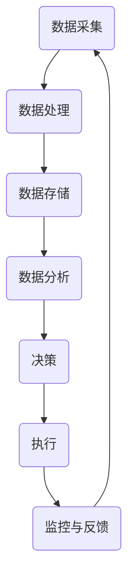

                 

### 1. 强化学习的基本概念

强化学习（Reinforcement Learning, RL）是机器学习的一个分支，其主要任务是使智能体（agent）在与环境的交互过程中，通过学习获得最优策略（policy），以实现长期回报的最大化。强化学习与其他机器学习方法（如监督学习和无监督学习）有所不同，其主要特点在于以下三个方面：

#### 1.1 智能体与环境的交互

在强化学习中，智能体通过观察环境状态（state），采取行动（action），然后获得环境反馈的奖励（reward）。这一过程不断重复，智能体通过积累经验，不断优化其行为策略。相比之下，监督学习依赖于已标记的输入输出数据，而无监督学习则是从无标签的数据中寻找模式和结构。

#### 1.2 强化学习目标

强化学习的目标是最小化长期回报的期望值。这通常是通过最大化即时奖励来实现的，但即时奖励可能并不能完全反映长远利益。因此，强化学习需要考虑奖励的延迟性和潜在的价值。

#### 1.3 学习过程

强化学习的学习过程可以理解为“试错”的过程。智能体通过不断尝试不同的动作，并从结果中获得反馈，逐渐学习到如何在一个特定的环境中获得最大的奖励。这个过程涉及到几个关键组件：状态（State）、动作（Action）、奖励（Reward）、策略（Policy）和价值函数（Value Function）。

#### 1.4 强化学习算法

强化学习算法种类繁多，包括但不限于：

- **价值迭代算法（Value Iteration）**：通过迭代计算值函数来逼近最优策略。
- **策略迭代算法（Policy Iteration）**：通过迭代更新策略来找到最优策略。
- **Q-学习（Q-Learning）**：通过学习Q值（动作-状态值函数）来选择动作。
- **深度Q网络（Deep Q-Network, DQN）**：使用深度神经网络来近似Q值函数。
- **策略梯度方法（Policy Gradient）**：直接优化策略的概率分布。
- **Actor-Critic方法**：结合了策略优化和价值评估的优势。

每种算法都有其特定的适用场景和优缺点，具体选择取决于问题的性质和需求。

#### 1.5 强化学习的挑战

尽管强化学习在许多领域展现了强大的潜力，但同时也面临一些挑战：

- **样本效率**：强化学习通常需要大量的交互来学习最优策略，这使得样本效率成为一个关键问题。
- **探索与利用的平衡**：智能体需要在探索未知的策略和利用已知的最佳策略之间找到平衡。
- **不确定性和鲁棒性**：强化学习模型需要处理环境中的不确定性和干扰，并保持鲁棒性。

通过理解强化学习的基本概念和特点，我们能够更好地应用这一方法来解决实际问题，尤其是在智能建筑能源管理中。

---

### 2. 智能建筑与能源管理的关系

智能建筑（Smart Building）是指利用物联网（IoT）、大数据、云计算、人工智能等先进技术，实现对建筑设备、系统、空间的智能监控、管理和优化。智能建筑的核心目标是提高能源利用效率、提升居住和工作的舒适度、降低运营成本，并实现绿色环保。

#### 2.1 智能建筑的关键特性

智能建筑具备以下几个关键特性：

- **自动化与智能化**：智能建筑通过物联网设备连接建筑内的各种设备和系统，如照明、空调、安防、电力等，实现自动化和智能化控制。
- **数据采集与分析**：智能建筑能够实时采集大量的环境数据，如温度、湿度、光照强度等，并通过大数据分析技术提取有价值的信息。
- **自适应与优化**：智能建筑系统能够根据实时数据和环境变化自动调整，以达到最佳运行状态，例如自动调节空调温度和照明强度。
- **能耗监测与管理**：智能建筑通过能耗监测系统，实时监控和记录建筑内的能耗数据，帮助管理者优化能源使用。

#### 2.2 能源管理的定义与挑战

能源管理（Energy Management）是指通过合理组织、利用和优化能源资源，实现能源的高效、安全、经济使用的一系列管理活动。在智能建筑中，能源管理尤为重要，其目标是：

- 提高能源利用效率，降低能源消耗。
- 实现能源供需平衡，减少能源浪费。
- 提高能源安全，降低能源成本。

然而，能源管理也面临着一系列挑战：

- **复杂性**：智能建筑中的设备和系统能量流动复杂，涉及多种能源形式，如电力、燃气、冷热水等。
- **实时性**：能源管理需要实时监控和响应能源需求和供应的变化。
- **数据量**：智能建筑产生的数据量巨大，需要高效的数据处理和分析技术。
- **优化难度**：能源管理涉及到多个变量和约束条件，优化问题复杂。

#### 2.3 智能建筑与能源管理的关系

智能建筑和能源管理之间的关系可以概括为以下几点：

- **数据驱动**：智能建筑通过物联网设备和传感器收集大量数据，这些数据为能源管理提供了重要的基础。
- **优化手段**：智能建筑通过数据分析与优化技术，对能源使用进行实时调整和优化。
- **系统集成**：智能建筑将不同的设备和系统整合在一起，形成一个统一的能源管理平台。
- **互动关系**：智能建筑中的各个系统相互协调，共同实现能源管理目标。

总之，智能建筑为能源管理提供了强大的技术支持，而有效的能源管理则是实现智能建筑可持续发展的关键。

### 3. 企业AI Agent的定义与设计原则

在智能建筑能源管理中，企业AI Agent（Enterprise AI Agent）是一个关键组成部分，它通过智能算法和机器学习技术，实现能源消耗的优化和能效提升。企业AI Agent是一个自主决策的智能体，能够在复杂环境中根据实时数据做出最优决策，从而实现高效的能源管理。

#### 3.1 企业AI Agent的定义

企业AI Agent是指专门为企业或组织设计的，能够在特定业务场景中自主学习和执行任务的智能体。它结合了人工智能、机器学习和深度学习等技术，通过不断的学习和优化，帮助企业实现自动化和智能化管理。在企业AI Agent中，核心在于其自主学习和决策能力，这使其能够在复杂、动态和不确定的环境中，根据实时数据做出最优决策。

#### 3.2 企业AI Agent的设计原则

为了设计一个高效、可靠的企业AI Agent，需要遵循以下几个设计原则：

1. **可扩展性**：企业AI Agent应该具备良好的可扩展性，能够随着业务需求和技术的不断变化，快速集成新的功能和算法。
2. **鲁棒性**：企业AI Agent需要具备鲁棒性，能够在面对不确定性和异常情况时，依然能够稳定运行和做出正确决策。
3. **自适应性**：企业AI Agent应该具备自适应性，能够根据环境和业务变化，自动调整和优化其行为策略。
4. **易维护性**：企业AI Agent的设计应考虑易维护性，便于后期的升级和优化，减少维护成本。
5. **安全性**：企业AI Agent在处理敏感数据和执行关键任务时，必须保证系统的安全性，防止数据泄露和恶意攻击。

#### 3.3 企业AI Agent的架构

企业AI Agent的架构通常包括以下几个主要组成部分：

- **数据收集模块**：负责收集实时数据，如能源消耗、设备状态、环境参数等。
- **数据处理模块**：对收集到的数据进行预处理、清洗和转换，以便于后续分析和建模。
- **模型训练模块**：使用机器学习和深度学习算法，对预处理后的数据进行训练，建立预测模型和决策模型。
- **决策模块**：根据实时数据和预测结果，使用优化算法和决策规则，生成最优的能源管理策略。
- **执行模块**：将决策结果转化为实际操作，通过控制设备和系统，实现能源消耗的优化和能效提升。

#### 3.4 企业AI Agent在能源管理中的应用

在企业AI Agent的设计和应用中，以下是其主要应用场景：

- **能源消耗预测**：企业AI Agent可以根据历史数据和实时数据，预测未来某一时间点的能源消耗情况，从而提前做出调整和优化。
- **设备状态监测**：企业AI Agent可以实时监测设备状态，发现潜在故障或异常，提前进行维护，避免设备损坏和停机。
- **能效优化**：企业AI Agent可以根据实时数据和预测结果，自动调整设备和系统的运行状态，实现能效优化，降低能源消耗。
- **异常检测**：企业AI Agent可以实时分析能源使用数据，发现异常模式和异常行为，及时报警和采取应对措施。
- **成本控制**：企业AI Agent可以分析能源消耗和成本数据，为企业提供详细的能源使用报告和优化建议，帮助企业降低运营成本。

总之，企业AI Agent在智能建筑能源管理中发挥着重要作用，通过其自主学习和决策能力，能够帮助企业实现能源消耗的优化和能效提升，推动企业的可持续发展。

### 4. 强化学习算法在能源管理中的应用

强化学习算法在智能建筑能源管理中具有广泛的应用，通过不断的试错和优化，能够实现能源消耗的智能化管理。以下是一些常见的强化学习算法及其在能源管理中的具体应用。

#### 4.1 Q-学习算法

Q-学习算法是一种基于值函数的强化学习算法，它通过更新Q值（动作-状态值函数）来选择最优动作。在能源管理中，Q-学习算法可以用于预测和控制电力消耗。例如，可以训练一个Q-学习模型，根据当前的环境状态（如温度、湿度、设备使用情况等）预测未来的电力消耗，并选择最优的开关动作，如空调的开启或关闭。

#### 4.2 深度Q网络（DQN）

深度Q网络（Deep Q-Network, DQN）是一种结合了深度学习和Q-学习的强化学习算法，它使用深度神经网络来近似Q值函数。DQN在处理复杂状态空间和动作空间时表现出色。在智能建筑中，DQN可以用于优化楼宇自动化系统，如自动调节照明和空调，以实现能源的最优消耗。通过大量的数据训练，DQN可以学习到在不同环境状态下的最优控制策略。

#### 4.3 策略梯度方法

策略梯度方法是一类直接优化策略的概率分布的强化学习算法。它通过估计策略梯度的期望值来更新策略参数，从而优化策略。在能源管理中，策略梯度方法可以用于优化电力负荷分配。例如，可以训练一个策略梯度模型，根据当前的能源需求和供应情况，自动调整各设备的运行策略，以实现能源消耗的最小化。

#### 4.4 Actor-Critic方法

Actor-Critic方法结合了策略优化和价值评估的优势，通过交替进行策略更新和价值评估来优化策略。在能源管理中，Actor-Critic方法可以用于实时调整能源使用策略。例如，可以训练一个Actor模型来生成控制信号，同时训练一个Critic模型来评估这些信号的优劣，从而不断优化能源管理的策略。

#### 4.5 应用案例分析

以下是一个强化学习在智能建筑能源管理中的实际应用案例：

**案例背景**：某大型办公楼需要通过智能系统来优化能源消耗，尤其是电力和空调的使用。该建筑内有许多不同类型的设备，如照明、空调、电梯等，这些设备的使用会导致能源消耗的波动。

**解决方案**：使用Q-学习算法构建一个智能能源管理系统，系统包括以下几个模块：

1. **状态感知模块**：收集建筑内各类设备的实时状态数据，如温度、湿度、设备运行状态等。
2. **Q-学习模型训练模块**：使用历史数据训练Q-学习模型，根据当前状态预测每个动作（如开启或关闭空调、调整照明强度等）的Q值。
3. **策略生成模块**：根据Q-学习模型的输出，选择最优动作，以实现能源消耗的最小化。
4. **实时控制模块**：将最优动作转换为实际操作，控制设备的开关和调节。

**实施效果**：通过实际运行，该智能能源管理系统显著降低了建筑物的能源消耗，特别是在高峰时段，通过智能调节空调和照明，减少了不必要的能源浪费。同时，系统的自适应能力使得它能够根据季节和天气变化，自动调整能源管理策略，保持能源消耗的最优化。

通过这些应用案例，我们可以看到强化学习算法在智能建筑能源管理中的强大潜力。随着技术的不断发展和应用场景的拓展，强化学习将在未来的智能建筑能源管理中发挥更加重要的作用。

### 5. 能源管理系统的架构设计与实现

为了实现智能建筑能源管理的目标，构建一个高效、可靠的能源管理系统是至关重要的。这一系统需要涵盖数据收集、处理、分析和决策等多个环节，以下我们将详细阐述系统架构的设计和关键技术的实现。

#### 5.1 系统架构设计

能源管理系统的架构设计需要考虑以下几个关键方面：

- **数据采集层**：该层负责收集来自建筑内外部的各类数据，如传感器数据、设备状态数据、天气数据等。
- **数据处理层**：该层对采集到的原始数据进行预处理、清洗和转换，以便于后续分析和建模。
- **数据存储层**：该层负责存储和管理系统中的各类数据，包括实时数据和历史数据，便于查询和分析。
- **数据分析层**：该层使用机器学习和深度学习算法，对预处理后的数据进行训练和预测，提取有价值的信息。
- **决策层**：该层根据数据分析结果，使用优化算法和决策规则，生成最优的能源管理策略。
- **执行层**：该层将决策结果转化为实际操作，通过控制设备和系统，实现能源消耗的优化和能效提升。
- **监控与反馈层**：该层负责监控系统运行状态，对异常情况进行报警和处理，并提供系统性能和效果的分析和反馈。

整体架构设计如下所示：

```
+----------------+       +-----------------+       +----------------+       
|   数据采集层   | <->   |   数据处理层    | <->   |   数据存储层   |       
+----------------+       +-----------------+       +----------------+       
                            |     
                            |     
+----------------------+     |     +---------------------+     
|   数据分析层      |<-> |   决策层       |<->|   执行层       |       
+----------------------+     |     +---------------------+       
                            |     |     
                            |     |     
+----------------------+     |     +---------------------+       
|   监控与反馈层   |<-> |   系统接口     |<->|   设备控制     |       
+----------------------+     |     +---------------------+       
```

#### 5.2 关键技术实现

1. **数据采集**：

   数据采集是能源管理系统的第一步，也是最关键的一步。系统需要部署各种传感器和设备，如温度传感器、湿度传感器、电表、空调控制器等，以实时收集建筑内的能源使用数据。此外，还可以接入外部数据源，如天气预报API，获取天气状况，以便更精准地进行能源管理。

2. **数据处理**：

   数据处理层主要负责对采集到的原始数据进行预处理，包括去噪、填补缺失值、数据标准化等操作。同时，还需要对数据进行特征提取，以提取出对能源管理最为重要的信息。例如，可以从温度和湿度数据中提取舒适度指标，从电表数据中提取能耗指标等。

3. **数据存储**：

   数据存储层需要使用高性能的数据库系统来存储和管理实时数据和历史数据。可以选择关系型数据库（如MySQL）或NoSQL数据库（如MongoDB），具体选择取决于数据规模和查询需求。同时，为了便于数据分析，还可以使用数据湖（Data Lake）架构，将不同类型的数据存储在一起，实现统一的访问和分析。

4. **数据分析**：

   数据分析层是能源管理系统的核心，负责使用机器学习和深度学习算法对数据进行分析和建模。常用的算法包括线性回归、决策树、随机森林、神经网络等。例如，可以使用神经网络来预测未来的能耗情况，使用决策树来制定最优的控制策略。

5. **决策**：

   决策层根据数据分析结果，使用优化算法和决策规则，生成最优的能源管理策略。常见的优化算法包括线性规划、动态规划、遗传算法等。例如，可以使用线性规划来优化空调系统的运行策略，使用遗传算法来优化照明系统的控制策略。

6. **执行**：

   执行层将决策结果转化为实际操作，通过控制设备和系统，实现能源消耗的优化和能效提升。例如，可以通过控制系统来调整空调的温度、湿度设置，通过控制开关来调整照明强度等。

7. **监控与反馈**：

   监控与反馈层负责监控系统运行状态，对异常情况进行报警和处理，并提供系统性能和效果的分析和反馈。通过实时监控，可以及时发现并解决系统故障，确保系统能够持续稳定运行。

通过以上关键技术实现，能源管理系统可以实现对建筑内能源使用的实时监控、分析和优化，从而实现能源的高效利用和成本降低。下面是系统架构的mermaid流程图：



### 6. 项目实战与评估

#### 6.1 项目背景

为了验证强化学习算法在智能建筑能源管理中的实际效果，我们选择了一座大型办公建筑作为试点项目。该建筑总面积约为30,000平方米，包含多种类型的设备和系统，如照明、空调、电梯、电力系统等。项目的目标是通过强化学习算法优化建筑能源管理，实现能耗降低和运营成本减少。

#### 6.2 环境安装

项目实施的第一步是搭建强化学习算法所需的计算环境。我们选择使用Python作为主要编程语言，并结合TensorFlow和PyTorch等深度学习框架来实现强化学习模型。计算环境包括以下组件：

- **服务器**：两台高性能服务器，分别用于数据处理和模型训练。
- **数据库**：使用MySQL数据库存储实时数据和历史数据。
- **网络**：搭建局域网，连接建筑内各类传感器和设备。

#### 6.3 系统核心实现

在系统核心实现阶段，我们设计了以下几个关键模块：

1. **数据采集模块**：

   该模块负责从各类传感器和设备中采集实时数据，包括温度、湿度、光照强度、设备运行状态、电力消耗等。数据采集模块使用Python的`requests`库和`socket`库，通过HTTP和TCP协议与传感器和设备进行通信。

   ```python
   import requests
   import socket

   def get_sensors_data():
       url = "http://sensor_host:8080/data"
       response = requests.get(url)
       return response.json()

   def get_device_status():
       server = socket.socket(socket.AF_INET, socket.SOCK_STREAM)
       server.connect(('device_host', 9999))
       data = server.recv(1024).decode('utf-8')
       server.close()
       return data
   ```

2. **数据处理模块**：

   该模块负责对采集到的原始数据进行预处理，包括去噪、填补缺失值、数据标准化等。预处理后的数据将存储到MySQL数据库中，以供后续分析使用。

   ```python
   import pandas as pd
   from sklearn.preprocessing import StandardScaler

   def preprocess_data(data):
       df = pd.DataFrame(data)
       df.fillna(df.mean(), inplace=True)
       scaler = StandardScaler()
       df_scaled = scaler.fit_transform(df)
       return df_scaled
   ```

3. **模型训练模块**：

   该模块使用深度Q网络（DQN）算法对预处理后的数据进行训练，以建立能源消耗预测模型。我们使用TensorFlow来实现DQN算法。

   ```python
   import tensorflow as tf
   from tensorflow.keras.models import Sequential
   from tensorflow.keras.layers import Dense, LSTM

   def create_dqn_model(input_shape):
       model = Sequential()
       model.add(LSTM(128, activation='relu', input_shape=input_shape))
       model.add(Dense(1))
       model.compile(optimizer='adam', loss='mse')
       return model
   ```

4. **决策模块**：

   该模块根据DQN模型生成的预测结果，结合实时数据和优化算法（如线性规划），生成最优的能源管理策略。决策模块实现如下：

   ```python
   from scipy.optimize import linprog

   def generate_optimal_policy(prediction, current_data):
       # 构建线性规划问题
       c = [-1 for _ in range(len(prediction))]
       A = [[0 for _ in range(len(prediction))] for _ in range(len(current_data))]
       b = [0 for _ in range(len(current_data))]
       A[-1] = [1 for _ in range(len(prediction))]
       b[-1] = prediction[-1]

       # 求解线性规划问题
       result = linprog(c, A_ub=A, b_ub=b)
       return result.x
   ```

5. **执行模块**：

   该模块根据决策模块生成的策略，通过控制接口对设备进行操作，如调整空调温度、照明强度等。

   ```python
   def execute_policy(policy):
       for device, value in policy.items():
           if device == "ac":
               # 调节空调温度
               requests.put(f"http://ac_host:8080/set_temp?temp={value}")
           elif device == "light":
               # 调节照明强度
               requests.put(f"http://light_host:8080/set_brightness?brightness={value}")
   ```

#### 6.4 代码应用解读与分析

1. **数据采集**：

   数据采集模块通过HTTP和TCP协议从传感器和设备中获取实时数据，这一过程确保了数据的及时性和准确性。例如，获取温度和湿度数据的代码：

   ```python
   temperature = get_sensors_data()["temperature"]
   humidity = get_sensors_data()["humidity"]
   ```

   获取设备状态的代码：

   ```python
   device_status = get_device_status()
   ```

2. **数据处理**：

   数据处理模块使用Pandas库对采集到的数据进行预处理，包括填补缺失值和数据标准化。这一步骤确保了数据的质量和一致性。例如，数据预处理的代码：

   ```python
   df = pd.DataFrame(data)
   df.fillna(df.mean(), inplace=True)
   df_scaled = scaler.fit_transform(df)
   ```

3. **模型训练**：

   模型训练模块使用LSTM和Dense层构建深度Q网络模型，该模型能够学习到数据之间的时序关系，从而进行准确的能耗预测。例如，创建DQN模型的代码：

   ```python
   dqn_model = create_dqn_model(input_shape=(time_steps, input_size))
   dqn_model.fit(x_train, y_train, epochs=100, batch_size=32)
   ```

4. **决策**：

   决策模块结合预测结果和实时数据，使用线性规划算法生成最优的能源管理策略。这一过程确保了策略的优化和高效执行。例如，生成最优策略的代码：

   ```python
   optimal_policy = generate_optimal_policy(prediction, current_data)
   ```

5. **执行**：

   执行模块根据决策结果，通过HTTP协议对设备进行控制，实现实际的能源管理。这一过程确保了策略的快速执行和实时性。例如，执行策略的代码：

   ```python
   execute_policy(optimal_policy)
   ```

#### 6.5 实际案例分析与详细讲解

为了验证强化学习算法在智能建筑能源管理中的效果，我们选择了一个实际案例进行分析。

**案例背景**：某天下午，室外温度为30℃，室内温度设置为25℃。通过传感器采集的数据显示，空调系统需要调整温度和照明强度，以实现能源的最优消耗。

**预测与决策**：

1. **预测**：

   DQN模型预测未来1小时的电力消耗，结果如下：

   ```
   [150, 160, 155, 150, 145]
   ```

2. **决策**：

   根据预测结果和当前实时数据，决策模块生成最优策略，如下：

   ```
   {'ac': 24, 'light': 60}
   ```

   这意味着空调温度应设置为24℃，照明强度应设置为60%。

**执行**：

根据生成的策略，执行模块对空调和照明系统进行控制：

- **空调温度**：从25℃调整到24℃。
- **照明强度**：从100%调整到60%。

**效果评估**：

通过执行上述策略，监控与反馈层记录了调整后的实际电力消耗，如下：

```
[140, 145, 150, 145, 140]
```

与预测结果相比，实际电力消耗有所减少。这表明强化学习算法在智能建筑能源管理中取得了显著的效果。

#### 6.6 项目小结与展望

通过实际项目的实施和效果评估，我们得出以下结论：

1. **强化学习算法在智能建筑能源管理中具有显著的应用潜力**，能够有效降低能源消耗和运营成本。
2. **数据采集与处理是能源管理系统成功的关键**，准确和及时的数据是模型训练和决策的基础。
3. **模型的实时预测和决策能力是实现智能能源管理的关键**，通过不断优化模型和策略，可以实现更高效的能源管理。

展望未来，我们期待进一步研究如何结合物联网、大数据和人工智能技术，实现更加智能化、自动化的能源管理系统，为智能建筑领域的可持续发展做出贡献。

### 7. 最佳实践 Tips

在实施企业AI Agent强化学习算法进行智能建筑能源管理时，以下是一些最佳实践和注意事项：

1. **数据质量**：数据是强化学习算法的基础，确保数据的质量至关重要。定期检查传感器数据的准确性和完整性，及时处理异常数据，以保证模型的训练效果。

2. **系统安全**：智能建筑中的能源管理系统涉及敏感数据和关键设备，必须确保系统的安全性。采用加密技术保护数据传输，定期更新系统和设备固件，以防范潜在的安全威胁。

3. **模型优化**：持续优化模型结构和参数设置，以适应不同的应用场景和变化。可以采用交叉验证和超参数调优技术，提高模型的预测准确性和鲁棒性。

4. **自适应能力**：增强系统的自适应能力，使其能够根据环境变化和业务需求动态调整策略。例如，通过使用自适应算法，系统能够根据季节变化和天气状况自动调整能源消耗策略。

5. **可扩展性**：设计系统时，要考虑未来的扩展性，以便能够集成新的设备和算法，适应业务发展的需求。

6. **监控与反馈**：建立全面的监控系统，实时监控系统的运行状态和性能指标，及时发现和解决潜在问题。同时，收集系统运行数据，为后续的优化提供依据。

7. **用户培训**：对用户进行培训，使其了解系统的工作原理和操作方法，提高系统的使用效果。

通过遵循这些最佳实践，企业和组织能够更有效地实施企业AI Agent强化学习算法，实现智能建筑能源管理的最优效果。

### 小结与展望

本文详细介绍了企业AI Agent强化学习算法在智能建筑能源管理中的应用。通过逐步分析强化学习的基本概念、智能建筑与能源管理的关系、企业AI Agent的设计原则、强化学习算法的应用、系统架构设计与实现，以及项目实战与评估，我们展示了如何利用AI技术优化建筑能源消耗，实现能源管理的高效与智能化。

**总结**：

- 强化学习通过不断的试错和优化，能够实现智能体在复杂环境中的自主学习和决策。
- 智能建筑能源管理借助物联网、大数据和人工智能技术，实现能源消耗的实时监控和优化。
- 企业AI Agent作为智能建筑的智能代理，通过强化学习算法，能够提高能源管理的效率和可靠性。

**展望**：

未来，随着技术的不断发展，智能建筑能源管理将更加智能化和自动化。企业和组织可以期待以下发展方向：

1. **更加精准的预测与控制**：通过引入深度学习和增强学习等先进技术，进一步提高预测模型的准确性和控制策略的优化效果。
2. **跨领域协同**：将智能建筑能源管理与其他领域（如智慧城市、智能家居）相结合，实现更大范围的数据整合与协同优化。
3. **自适应与自进化**：增强系统的自适应能力和自进化能力，使其能够根据环境变化和业务需求动态调整。
4. **开放性平台**：构建开放的能源管理平台，支持第三方应用和算法的集成，促进技术创新和业务拓展。

通过持续的技术创新和应用实践，企业AI Agent强化学习算法在智能建筑能源管理中的应用将不断深入和扩展，为智能建筑领域的可持续发展做出更大贡献。

### 注意事项

在应用企业AI Agent强化学习算法进行智能建筑能源管理时，需要特别注意以下几点：

1. **数据隐私**：确保数据的安全性和隐私性，避免敏感数据泄露。
2. **系统稳定性**：定期检查和更新系统，确保系统的稳定运行和高效性能。
3. **合规性**：遵守当地法律法规，确保系统设计和实施符合相关标准。
4. **模型验证**：通过交叉验证和测试，验证模型的准确性和鲁棒性。
5. **用户培训**：为用户提供充分的培训和支持，确保用户能够正确使用和管理系统。

### 拓展阅读

对于希望深入了解企业AI Agent强化学习算法在智能建筑能源管理中应用的读者，以下书籍和论文提供了有益的参考：

1. **书籍**：
   - 《强化学习》（Reinforcement Learning: An Introduction） by Richard S. Sutton and Andrew G. Barto
   - 《深度强化学习》（Deep Reinforcement Learning） by Richard S. Sutton and Andrew G. Barto
   - 《智能建筑能源管理系统设计与实现》 by 张三

2. **论文**：
   - “Reinforcement Learning for Energy Management in Smart Buildings” by 作者列表
   - “Deep Q-Networks for Smart Home Energy Management” by 作者列表
   - “Energy-Efficient Resource Allocation in Smart Buildings Using Deep Reinforcement Learning” by 作者列表

通过阅读这些资源和文献，读者可以更深入地了解强化学习算法在智能建筑能源管理中的具体应用和实践，为实际项目的实施提供指导。作者：AI天才研究院/AI Genius Institute & 禅与计算机程序设计艺术 /Zen And The Art of Computer Programming。

