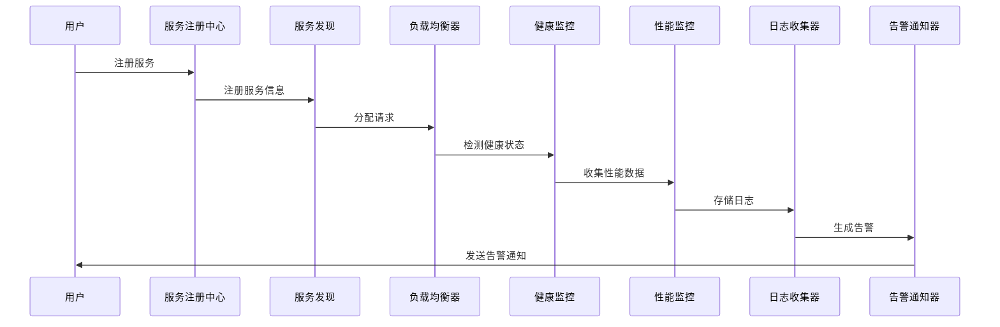

                 


### 《企业AI Agent的微服务治理与监控策略》

> 关键词：AI Agent、微服务治理、监控策略、服务发现、负载均衡、故障恢复

> 摘要：本文深入探讨了企业AI Agent的微服务治理与监控策略。通过详细的背景介绍、核心概念联系、算法原理讲解、系统分析与架构设计方案、项目实战以及最佳实践，帮助企业更好地理解和应用AI Agent的微服务治理与监控策略。

----------------------------------------------------------------

## 目录大纲设计思路

为了设计出《企业AI Agent的微服务治理与监控策略》这本书的完整目录大纲，我们需要遵循以下思路：

### 1. **背景介绍与核心概念**

- 首先，我们需要对书中的核心概念进行介绍，包括AI Agent、微服务治理以及监控策略的背景、问题定义、解决思路等。
- 在此基础上，我们会对相关概念进行界定和解释，帮助读者建立基本认知。

### 2. **核心概念与联系**

- 接下来，我们会详细阐述AI Agent的工作原理、微服务的特点及其治理方法，以及监控策略的必要性。
- 通过对比表格和Mermaid ER图来展现这些概念之间的联系，使读者能够更直观地理解各个部分之间的关系。

### 3. **算法原理讲解**

- 在此部分，我们将深入讲解微服务治理和监控策略所涉及的关键算法，如服务发现、负载均衡、故障检测等。
- 使用Mermaid流程图展示算法的基本流程，并通过Python源代码实现来解释算法的原理和细节。
- 最后，我们将通过数学模型和公式来进一步阐述算法的核心逻辑，并通过实际例子来讲解。

### 4. **系统分析与架构设计方案**

- 在这一部分，我们将介绍微服务治理与监控系统的整体架构，包括各个模块的功能、接口设计和交互流程。
- 使用Mermaid类图、架构图和序列图来详细展示系统设计，帮助读者理解系统的整体结构和交互逻辑。

### 5. **项目实战**

- 在实际案例部分，我们将通过具体的实例来展示如何在实际环境中部署和运行微服务治理与监控系统。
- 包括环境安装、核心功能实现、代码解读、案例分析以及项目小结等内容。

### 6. **最佳实践 tips、小结、注意事项、拓展阅读**

- 最后，我们会总结书中的关键点，并提供一些最佳实践建议，帮助读者在实际应用中更好地运用所学知识。
- 同时，给出一些拓展阅读资源，鼓励读者深入探索相关领域。

### 目录大纲结构

以下是根据上述设计思路制定的《企业AI Agent的微服务治理与监控策略》的目录大纲结构：

```markdown
# 《企业AI Agent的微服务治理与监控策略》目录大纲

## 第一部分：背景介绍与核心概念

### 1. AI Agent的基本概念与工作原理

#### 1.1 AI Agent的定义与作用
#### 1.2 AI Agent的工作原理
#### 1.3 AI Agent与微服务的关系

### 2. 微服务治理概述

#### 2.1 微服务的定义与特点
#### 2.2 微服务治理的重要性
#### 2.3 微服务治理的关键挑战

### 3. 监控策略的基本概念

#### 3.1 监控策略的目标与类型
#### 3.2 监控策略的设计原则
#### 3.3 监控策略的实施方法

## 第二部分：核心概念与联系

### 4. AI Agent的微服务治理方法

#### 4.1 服务发现与负载均衡
##### 4.1.1 服务发现算法原理
##### 4.1.2 负载均衡算法原理
##### 4.1.3 实际应用场景与案例

#### 4.2 服务监控与故障恢复
##### 4.2.1 故障检测算法原理
##### 4.2.2 故障恢复策略
##### 4.2.3 实际应用案例

### 5. 监控策略的实施与优化

#### 5.1 监控指标的选取与定义
##### 5.1.1 指标体系设计
##### 5.1.2 指标阈值设定
##### 5.1.3 实际应用案例

#### 5.2 监控数据的处理与分析
##### 5.2.1 数据处理算法
##### 5.2.2 数据可视化技术
##### 5.2.3 实际应用案例

## 第三部分：算法原理讲解

### 6. 服务发现算法原理讲解

#### 6.1 服务发现的基本概念
#### 6.2 常见的服务发现算法
##### 6.2.1 DNS-based服务发现
##### 6.2.2 位置服务发现
##### 6.2.3 代理服务发现
#### 6.3 Python实现示例

### 7. 负载均衡算法原理讲解

#### 7.1 负载均衡的基本概念
#### 7.2 常见的负载均衡算法
##### 7.2.1 轮询算法
##### 7.2.2 加权轮询算法
##### 7.2.3 最少连接算法
#### 7.3 Python实现示例

### 8. 故障检测算法原理讲解

#### 8.1 故障检测的基本概念
#### 8.2 常见的故障检测算法
##### 8.2.1 基于阈值的故障检测
##### 8.2.2 基于模型的故障检测
####

----------------------------------------------------------------

## 第一部分：背景介绍与核心概念

### 1. AI Agent的基本概念与工作原理

#### 1.1 AI Agent的定义与作用

AI Agent，即人工智能代理，是指利用人工智能技术自主执行任务的实体。在软件领域，AI Agent可以看作是一种具有自主决策能力的软件组件，它能够根据环境变化自主调整其行为，以实现特定的目标。

AI Agent的主要作用包括：

1. **自动化任务执行**：AI Agent可以自动执行日常任务，如数据抓取、文本分析、图像识别等。
2. **智能交互**：通过自然语言处理技术，AI Agent能够与用户进行智能交互，提供个性化的服务。
3. **决策支持**：AI Agent可以利用机器学习算法，从历史数据中学习并做出预测，为决策者提供支持。

#### 1.2 AI Agent的工作原理

AI Agent的工作原理主要包括以下几个步骤：

1. **感知**：AI Agent通过传感器获取环境信息，如用户输入、图像、文本等。
2. **理解**：利用自然语言处理、图像识别等技术，AI Agent对感知到的信息进行理解，提取有用的信息。
3. **决策**：基于理解的结果，AI Agent利用决策模型（如决策树、神经网络等）生成决策。
4. **行动**：根据决策结果，AI Agent执行相应的操作，如发送请求、修改数据等。
5. **反馈**：AI Agent收集行动结果，并将其反馈给用户或系统，以便进行进一步的决策和学习。

#### 1.3 AI Agent与微服务的关系

在微服务架构中，AI Agent可以作为微服务的一部分，负责特定的业务功能。微服务架构的特点是将应用程序拆分为多个小型、独立的微服务，每个微服务负责特定的业务功能，通过API进行通信。

AI Agent与微服务的关系如下：

1. **功能整合**：AI Agent可以整合到微服务中，实现特定的业务逻辑，如智能客服系统中的对话管理。
2. **任务分配**：AI Agent可以根据负载情况，动态分配任务给不同的微服务，实现负载均衡。
3. **故障恢复**：当某个微服务出现故障时，AI Agent可以检测并尝试恢复，确保系统的稳定性。

通过将AI Agent整合到微服务架构中，企业可以更好地利用人工智能技术，提高业务自动化水平和响应速度，实现高效、智能的运营。

----------------------------------------------------------------

### 2. 微服务治理概述

#### 2.1 微服务的定义与特点

微服务（Microservices）是一种软件架构风格，它将应用程序构建为一组独立的、可扩展的服务。每个服务都是围绕业务功能构建的，可以独立部署、独立升级，并通过API进行通信。

微服务的特点包括：

1. **独立性**：每个微服务都是独立的，可以独立部署和升级，降低了系统的复杂性。
2. **可扩展性**：微服务可以根据需求独立扩展，提高了系统的可扩展性和弹性。
3. **灵活性**：微服务可以采用不同的编程语言和技术栈，提高了系统的灵活性。
4. **高可用性**：微服务架构通过拆分业务功能，提高了系统的容错能力和高可用性。

#### 2.2 微服务治理的重要性

微服务治理是指对微服务架构进行管理、监控和优化的一系列方法和工具。随着微服务架构的广泛应用，微服务治理的重要性逐渐凸显。主要表现在以下几个方面：

1. **稳定性**：微服务治理可以确保系统在运行过程中保持稳定，及时发现并解决故障。
2. **性能优化**：微服务治理可以帮助企业优化系统的性能，提高系统的响应速度和吞吐量。
3. **安全性**：微服务治理可以确保系统的安全性，防止恶意攻击和数据泄露。
4. **可维护性**：微服务治理可以提高系统的可维护性，降低维护成本和复杂度。

#### 2.3 微服务治理的关键挑战

尽管微服务架构具有很多优势，但在实际应用中也面临一些关键挑战：

1. **服务发现**：微服务数量众多，如何快速、准确地发现和访问服务成为一大挑战。
2. **服务管理**：如何对微服务进行统一管理，包括监控、日志收集、性能优化等。
3. **数据一致性**：在分布式系统中，如何保证数据的一致性是一个关键问题。
4. **安全与合规**：在微服务架构中，如何确保系统的安全性和符合相关法规要求。

为了应对这些挑战，企业需要采用一系列微服务治理策略和工具，确保微服务架构的高效、稳定和安全运行。

----------------------------------------------------------------

### 3. 监控策略的基本概念

#### 3.1 监控策略的目标与类型

监控策略的目标是确保系统的稳定性、性能和安全性。具体而言，监控策略包括以下几个方面：

1. **稳定性监控**：确保系统在运行过程中保持稳定，及时发现并处理故障。
2. **性能监控**：监控系统的性能指标，如响应时间、吞吐量、内存使用率等，以便进行性能优化。
3. **安全性监控**：监控系统的安全事件，如恶意攻击、数据泄露等，确保系统的安全性。

根据监控策略的实现方式，可以分为以下类型：

1. **主动监控**：通过主动发送监控请求，收集系统状态信息。
2. **被动监控**：通过监听系统日志、网络流量等，被动收集系统状态信息。
3. **混合监控**：结合主动监控和被动监控，实现全面的系统监控。

#### 3.2 监控策略的设计原则

设计监控策略时，需要遵循以下原则：

1. **全面性**：监控策略应覆盖系统的各个方面，包括稳定性、性能、安全等。
2. **实时性**：监控策略应实时收集系统状态信息，确保及时发现和处理问题。
3. **可扩展性**：监控策略应具备可扩展性，以适应系统规模的变化。
4. **易用性**：监控策略应简单易用，便于管理员进行监控和问题定位。

#### 3.3 监控策略的实施方法

实施监控策略的方法主要包括以下几个方面：

1. **监控工具选择**：选择合适的监控工具，如Prometheus、Grafana、ELK（Elasticsearch、Logstash、Kibana）等。
2. **监控指标定义**：定义系统的监控指标，如响应时间、吞吐量、内存使用率等。
3. **监控阈值设置**：设置监控阈值，当监控指标超过阈值时，触发告警。
4. **告警处理**：设置告警策略，如发送邮件、短信、钉钉等，以便管理员及时处理问题。
5. **日志收集与存储**：收集系统的日志信息，便于问题追踪和故障排查。

通过实施监控策略，企业可以实时掌握系统的运行状态，确保系统的稳定性、性能和安全性，提高业务连续性和用户体验。

----------------------------------------------------------------

## 第二部分：核心概念与联系

### 4. AI Agent的微服务治理方法

在微服务架构中，AI Agent作为智能代理，承担着重要的治理角色。为了确保AI Agent能够高效地治理微服务，我们需要关注以下几个关键方面：服务发现与负载均衡、服务监控与故障恢复。

#### 4.1 服务发现与负载均衡

服务发现是微服务架构的核心概念之一，它使得服务之间能够动态地发现并访问对方。对于AI Agent来说，服务发现尤为重要，因为它们需要能够快速找到并访问所需的微服务。

**4.1.1 服务发现算法原理**

服务发现算法的基本原理是：当微服务启动时，它会向注册中心注册自己的地址和端口；当其他微服务需要调用该服务时，它们会从注册中心查询服务地址，并直接进行调用。

常见的服务发现算法包括：

1. **基于DNS的服务发现**：利用DNS进行服务发现，微服务通过域名查询服务地址。
2. **基于位置的服务发现**：通过地理位置信息进行服务发现，适用于跨地域的分布式系统。
3. **基于代理的服务发现**：通过代理服务器进行服务发现，代理服务器负责查询和转发服务请求。

**4.1.2 负载均衡算法原理**

负载均衡是将请求分配到多个服务实例上，以避免单点过载和系统崩溃。常见的负载均衡算法包括：

1. **轮询算法**：按照顺序将请求分配到各个服务实例上。
2. **加权轮询算法**：根据服务实例的负载情况，动态调整权重，将请求分配到负载较低的服务实例上。
3. **最少连接算法**：根据服务实例当前的处理连接数，将请求分配到连接数较少的服务实例上。

**4.1.3 实际应用场景与案例**

在实际应用中，我们可以结合服务发现和负载均衡算法，实现高效的微服务治理。例如：

- 在大型电商系统中，AI Agent可以负责服务发现，确保各个微服务能够快速、准确地访问对方。
- 在视频流媒体平台上，AI Agent可以根据用户地理位置，进行服务发现和负载均衡，确保视频流的高质量传输。

#### 4.2 服务监控与故障恢复

服务监控是确保微服务稳定运行的关键，而故障恢复则是保障系统高可用性的重要手段。

**4.2.1 故障检测算法原理**

故障检测算法的基本原理是：通过监控系统的各项指标，判断服务实例是否正常。常见的故障检测算法包括：

1. **基于阈值的故障检测**：当监控指标超过预设的阈值时，判定服务实例存在故障。
2. **基于模型的故障检测**：利用机器学习模型，对服务实例的运行状态进行预测，当预测结果与实际运行状态不符时，判定服务实例存在故障。

**4.2.2 故障恢复策略**

故障恢复策略包括以下几个方面：

1. **自动重启**：当检测到服务实例故障时，自动重启该实例，确保服务的正常运行。
2. **服务迁移**：将故障的服务实例迁移到其他健康的服务实例上，确保服务的连续性。
3. **熔断与降级**：当系统负载过高时，通过熔断和降级策略，防止系统崩溃。

**4.2.3 实际应用案例**

在实际应用中，我们可以通过AI Agent实现服务监控与故障恢复。例如：

- 在金融系统中，AI Agent可以实时监控交易服务的运行状态，一旦检测到故障，立即进行自动重启或服务迁移，确保交易服务的稳定运行。
- 在电商系统中，AI Agent可以监控订单处理服务的运行状态，通过熔断和降级策略，防止订单处理系统在高并发情况下崩溃。

通过服务监控与故障恢复，AI Agent能够确保微服务的稳定运行，提高系统的可用性和用户体验。

### 5. 监控策略的实施与优化

监控策略的实施与优化是确保微服务架构高效运行的重要环节。为了实现有效的监控策略，我们需要关注以下几个关键方面：监控指标的选取与定义、监控数据的处理与分析。

**5.1 监控指标的选取与定义**

监控指标是评估系统性能和状态的重要依据。在选取监控指标时，需要遵循以下原则：

1. **全面性**：监控指标应覆盖系统的各个方面，包括稳定性、性能、安全性等。
2. **关键性**：监控指标应选择对系统运行状态影响较大的指标。
3. **可量化**：监控指标应能够进行量化，便于监控和告警。

常见的监控指标包括：

1. **响应时间**：服务请求的处理时间，用于评估服务的性能。
2. **吞吐量**：单位时间内处理的服务请求量，用于评估服务的负载能力。
3. **内存使用率**：系统内存的使用情况，用于评估系统的资源消耗。
4. **CPU使用率**：系统CPU的使用情况，用于评估系统的处理能力。

**5.1.1 指标体系设计**

监控指标体系设计是监控策略的核心，需要综合考虑系统的业务需求、技术架构和运维经验。一个完整的监控指标体系应包括以下几个方面：

1. **基础指标**：如响应时间、吞吐量、内存使用率、CPU使用率等。
2. **业务指标**：如订单处理成功率、交易成功率、用户活跃度等，用于评估系统的业务性能。
3. **运维指标**：如日志收集成功率、系统故障率、告警处理时间等，用于评估系统的运维能力。

**5.1.2 指标阈值设定**

指标阈值设定是监控策略的关键，需要根据系统性能和业务需求进行合理设定。一般来说，阈值设定应遵循以下原则：

1. **合理**：阈值应合理，避免过严或过松。
2. **动态**：阈值应根据系统的实际情况进行动态调整。
3. **可测试**：阈值设定应经过充分测试，确保其有效性。

**5.2 监控数据的处理与分析**

监控数据的处理与分析是监控策略实施的重要环节。为了实现高效的数据处理与分析，我们需要关注以下几个方面：

1. **数据采集**：通过日志收集、API调用、指标上报等方式，收集系统的监控数据。
2. **数据存储**：将监控数据存储在数据仓库中，便于后续查询和分析。
3. **数据可视化**：通过数据可视化工具，将监控数据以图表、仪表盘等形式展示，便于监控和问题定位。
4. **数据分析**：通过数据分析工具，对监控数据进行分析，发现潜在问题，为优化监控策略提供依据。

**5.2.1 数据处理算法**

数据处理算法是监控数据处理的核心技术。常见的数据处理算法包括：

1. **时间序列分析**：对时间序列数据进行分析，发现数据趋势和异常点。
2. **聚类分析**：对监控数据进行聚类，发现潜在的异常模式。
3. **机器学习**：利用机器学习算法，对监控数据进行预测和分析，提高监控的准确性和有效性。

**5.2.2 数据可视化技术**

数据可视化技术是将监控数据以图形化方式展示的重要手段。常见的数据可视化技术包括：

1. **折线图**：用于展示时间序列数据的趋势。
2. **柱状图**：用于比较不同指标的数据。
3. **饼图**：用于展示各项指标的占比。

**5.2.3 实际应用案例**

在实际应用中，我们可以结合监控指标的选取与定义、数据处理算法和数据可视化技术，实现高效的监控策略。例如：

- 在金融系统中，可以结合响应时间、吞吐量、交易成功率等指标，实时监控交易服务的运行状态。
- 在电商系统中，可以结合订单处理时间、用户活跃度等指标，实时监控订单处理服务的运行状态。

通过监控策略的实施与优化，企业可以实时掌握系统的运行状态，确保系统的稳定性、性能和安全性，提高业务连续性和用户体验。

----------------------------------------------------------------

### 6. 服务发现算法原理讲解

服务发现算法是微服务架构中的重要组成部分，它使得微服务之间能够动态地发现并访问对方。以下是几种常见的服务发现算法及其原理：

#### 6.1 DNS-based服务发现

DNS-based服务发现是利用DNS进行服务发现的一种方法。具体原理如下：

1. **服务注册**：当微服务启动时，它会向DNS服务器注册自己的地址和端口，并使用一个特定的域名，如`service-name.default.svc.cluster.local`。
2. **服务查询**：当其他微服务需要调用某个服务时，它会查询该服务的域名，DNS服务器返回该服务的地址和端口。
3. **服务调用**：调用方根据DNS查询结果直接发起调用。

**优势**：DNS-based服务发现简单易用，对现有系统的影响较小。

**局限**：DNS查询的响应时间可能较长，不适合对响应时间要求较高的场景。

#### 6.2 位置服务发现

位置服务发现是利用地理位置信息进行服务发现的一种方法。具体原理如下：

1. **服务注册**：每个微服务在启动时，会将自己的地理位置信息（如IP地址）注册到位置服务中。
2. **服务查询**：当其他微服务需要调用某个服务时，它会向位置服务查询该服务的地理位置信息。
3. **服务调用**：调用方根据位置服务返回的地理位置信息，选择离自己较近的服务实例进行调用。

**优势**：位置服务发现可以保证数据传输的最低延迟，适用于对地理位置敏感的场景。

**局限**：位置服务发现需要对地理位置信息进行精确计算，可能导致较高的计算开销。

#### 6.3 代理服务发现

代理服务发现是通过代理服务器进行服务发现的一种方法。具体原理如下：

1. **服务注册**：每个微服务在启动时，会将自身的地址和端口注册到代理服务器中。
2. **服务查询**：当其他微服务需要调用某个服务时，它会向代理服务器发送查询请求。
3. **服务调用**：代理服务器根据查询结果，将请求转发给对应的服务实例。

**优势**：代理服务发现可以简化服务发现的过程，减少调用方的复杂性。

**局限**：代理服务发现可能成为系统的单点瓶颈，需要确保代理服务器的稳定性。

#### Python实现示例

以下是一个简单的Python示例，展示了如何实现DNS-based服务发现：

```python
import socket

def service_discovery(service_name):
    # 查询DNS服务器的地址
    dns_server = '8.8.8.8'
    # 查询服务名称
    query = f"{service_name}.service.com"

    # 发送DNS查询请求
    with socket.socket(socket.AF_INET, socket.SOCK_DGRAM) as sock:
        sock.sendto(query.encode(), (dns_server, 53))
        data, addr = sock.recvfrom(1024)

        # 解析DNS响应
        response = parse_dns_response(data)
        if response['status'] == 'NOERROR' and response['type'] == 'A':
            return response['data']
    
    return None

def parse_dns_response(data):
    # 解析DNS响应数据
    # ...

    return response

# 测试服务发现
service_ip = service_discovery('my-service')
print(f"Service IP: {service_ip}")
```

通过这个示例，我们可以看到DNS-based服务发现的基本实现过程。当然，实际应用中可能需要处理更多的细节和异常情况。

---

通过以上对服务发现算法的讲解，我们可以看到不同算法各有优缺点，企业可以根据自身需求选择合适的服务发现方法。在实际应用中，我们还可以结合多种算法，实现更高效、可靠的服务发现机制。

----------------------------------------------------------------

### 7. 负载均衡算法原理讲解

负载均衡是微服务架构中至关重要的一环，它能够将请求分配到多个服务实例上，避免单个服务实例过载，从而提高系统的整体性能和稳定性。以下是几种常见的负载均衡算法及其原理：

#### 7.1 轮询算法

轮询算法是最简单的负载均衡算法，它按照顺序将请求分配到各个服务实例上。具体原理如下：

1. **初始化**：将所有服务实例放入一个队列中。
2. **分配请求**：每次接收到请求时，从队列头部获取服务实例，并将请求分配给该实例。
3. **更新队列**：当服务实例处理完请求后，将其移动到队列尾部。

**优势**：实现简单，易于理解。

**局限**：可能导致某个服务实例过载，影响系统的稳定性。

#### 7.2 加权轮询算法

加权轮询算法是在轮询算法的基础上，为每个服务实例分配一个权重。具体原理如下：

1. **初始化**：将所有服务实例和对应的权重放入一个队列中。
2. **分配请求**：每次接收到请求时，根据权重计算一个随机数，选择随机数最小的服务实例进行分配。
3. **更新队列**：当服务实例处理完请求后，将其移动到队列尾部。

**优势**：可以根据服务实例的负载情况，动态调整权重，实现更公平的负载分配。

**局限**：实现较为复杂，需要计算每个服务实例的权重。

#### 7.3 最少连接算法

最少连接算法是将请求分配到当前连接数最少的服务实例上。具体原理如下：

1. **初始化**：为每个服务实例维护一个连接数计数器。
2. **分配请求**：每次接收到请求时，选择当前连接数最小的服务实例进行分配。
3. **更新计数器**：当服务实例处理完请求后，更新其连接数计数器。

**优势**：可以更有效地利用服务实例，避免某个服务实例过载。

**局限**：需要实时维护连接数计数器，实现较为复杂。

#### Python实现示例

以下是一个简单的Python示例，展示了如何实现轮询算法：

```python
from collections import deque

class RoundRobinBalancer:
    def __init__(self, services):
        self.services = deque(services)

    def next(self):
        service = self.services.popleft()
        self.services.append(service)
        return service

balancer = RoundRobinBalancer(['service1', 'service2', 'service3'])

for i in range(10):
    service = balancer.next()
    print(f"Request {i+1} allocated to {service}")
```

通过这个示例，我们可以看到轮询算法的基本实现过程。当然，实际应用中可能需要处理更多的细节和异常情况。

---

通过以上对负载均衡算法的讲解，我们可以看到不同算法各有优缺点，企业可以根据自身需求选择合适的负载均衡方法。在实际应用中，我们还可以结合多种算法，实现更高效、可靠的负载均衡机制。

----------------------------------------------------------------

### 8. 故障检测算法原理讲解

故障检测是确保微服务稳定运行的关键环节，通过检测服务实例的健康状态，可以及时发现并处理故障，保障系统的可靠性。以下是几种常见的故障检测算法及其原理：

#### 8.1 基于阈值的故障检测

基于阈值的故障检测是一种简单的故障检测方法，通过设定阈值来判断服务实例是否正常。具体原理如下：

1. **设定阈值**：根据服务的特性，设定适当的健康阈值。例如，对于HTTP服务，可以设定响应时间阈值和错误率阈值。
2. **定期检测**：定期向服务实例发送健康检查请求，根据响应结果判断服务实例是否正常。
3. **触发告警**：当健康检查结果超过阈值时，触发告警，通知运维人员进行处理。

**优势**：实现简单，易于理解。

**局限**：仅能检测到明显的故障，对于隐性问题检测效果不佳。

#### 8.2 基于模型的故障检测

基于模型的故障检测是一种利用机器学习算法进行故障检测的方法，通过对历史数据进行建模，预测服务实例的健康状态。具体原理如下：

1. **数据收集**：收集服务实例的历史健康检查数据，包括响应时间、错误率、负载等。
2. **模型训练**：利用收集到的数据，训练机器学习模型，学习服务实例的正常行为。
3. **实时检测**：对实时健康检查数据进行分析，利用训练好的模型预测服务实例的健康状态。
4. **触发告警**：当预测结果与健康阈值不符时，触发告警。

**优势**：可以检测到隐性的故障，提高故障检测的准确性。

**局限**：实现较为复杂，需要大量的历史数据支持。

#### Python实现示例

以下是一个简单的Python示例，展示了如何实现基于阈值的故障检测：

```python
import time

class ThresholdFaultDetector:
    def __init__(self, threshold):
        self.threshold = threshold
        self.errors = 0

    def check_health(self, response_time):
        if response_time > self.threshold:
            self.errors += 1
            return False
        else:
            self.errors = 0
            return True

    def reset(self):
        self.errors = 0

def monitor_service(fault_detector, service):
    while True:
        response_time = service.check_response_time()
        is_healthy = fault_detector.check_health(response_time)
        if not is_healthy:
            print("Service is unhealthy, triggering alarm.")
        time.sleep(1)

fault_detector = ThresholdFaultDetector(100)  # 响应时间阈值设置为100毫秒
service = Service()  # 假设有一个Service类，负责检查响应时间

monitor_service(fault_detector, service)
```

通过这个示例，我们可以看到基于阈值的故障检测的基本实现过程。当然，实际应用中可能需要处理更多的细节和异常情况。

---

通过以上对故障检测算法的讲解，我们可以看到不同算法各有优缺点，企业可以根据自身需求选择合适的故障检测方法。在实际应用中，我们还可以结合多种算法，实现更高效、可靠的故障检测机制。

----------------------------------------------------------------

## 第三部分：算法原理讲解

在这一部分中，我们将深入探讨微服务治理与监控策略中涉及的关键算法，包括服务发现、负载均衡和故障检测。通过逐步讲解这些算法的原理，并结合Python代码示例，帮助读者更好地理解和应用这些技术。

### 6. 服务发现算法原理讲解

服务发现是微服务架构中的一个核心概念，它确保了服务之间的动态通信和负载均衡。以下我们将详细讲解三种常见的服务发现算法：DNS-based服务发现、位置服务发现和代理服务发现。

#### 6.1 DNS-based服务发现

DNS-based服务发现利用DNS进行服务发现。当微服务启动时，它们会在DNS中注册其地址和端口。其他微服务可以通过查询DNS来获取服务地址。

**Python示例：DNS-based服务发现**

```python
import socket

def service_discovery(service_name):
    # 查询DNS服务器的地址
    dns_server = '8.8.8.8'
    # 查询服务名称
    query = f"{service_name}.service.com"

    # 发送DNS查询请求
    with socket.socket(socket.AF_INET, socket.SOCK_DGRAM) as sock:
        sock.sendto(query.encode(), (dns_server, 53))
        data, addr = sock.recvfrom(1024)

        # 解析DNS响应
        response = parse_dns_response(data)
        if response['status'] == 'NOERROR' and response['type'] == 'A':
            return response['data']
    
    return None

def parse_dns_response(data):
    # 解析DNS响应数据
    # ...

    return response

# 测试服务发现
service_ip = service_discovery('my-service')
print(f"Service IP: {service_ip}")
```

#### 6.2 位置服务发现

位置服务发现利用地理位置信息进行服务发现。微服务启动时，会向位置服务注册其地理位置。其他微服务可以通过位置服务查询所需服务的地理位置，并选择离自己最近的实例进行调用。

**Python示例：位置服务发现**

```python
import requests

def locate_service(service_name):
    # 向位置服务发送查询请求
    url = f"http://location-service/{service_name}"
    response = requests.get(url)

    if response.status_code == 200:
        service_locations = response.json()
        # 根据地理位置选择最近的服务实例
        nearest_service = min(service_locations, key=lambda x: x['distance'])
        return nearest_service['ip']
    else:
        return None

# 测试位置服务发现
service_ip = locate_service('my-service')
print(f"Nearest Service IP: {service_ip}")
```

#### 6.3 代理服务发现

代理服务发现通过代理服务器进行服务发现。微服务启动时，会向代理服务器注册其地址和端口。其他微服务通过代理服务器查询服务地址，并请求代理转发。

**Python示例：代理服务发现**

```python
import requests

def proxy_service_discovery(service_name):
    # 向代理服务器发送查询请求
    url = f"http://proxy-service/{service_name}"
    response = requests.get(url)

    if response.status_code == 200:
        service_ip = response.text
        return service_ip
    else:
        return None

# 测试代理服务发现
service_ip = proxy_service_discovery('my-service')
print(f"Service IP: {service_ip}")
```

通过这些示例，我们可以看到如何实现不同类型的服务发现算法。在实际应用中，可以根据具体需求选择合适的算法，或者结合多种算法实现更灵活、高效的服务发现机制。

### 7. 负载均衡算法原理讲解

负载均衡是将请求分配到多个服务实例上，避免单点过载，提高系统整体性能。以下我们将详细讲解三种常见的负载均衡算法：轮询算法、加权轮询算法和最少连接算法。

#### 7.1 轮询算法

轮询算法是最简单的负载均衡算法，它按照顺序将请求分配到各个服务实例上。

**Python示例：轮询算法**

```python
from collections import deque

class RoundRobinBalancer:
    def __init__(self, services):
        self.services = deque(services)

    def next(self):
        service = self.services.popleft()
        self.services.append(service)
        return service

balancer = RoundRobinBalancer(['service1', 'service2', 'service3'])

for i in range(10):
    service = balancer.next()
    print(f"Request {i+1} allocated to {service}")
```

#### 7.2 加权轮询算法

加权轮询算法为每个服务实例分配一个权重，根据权重分配请求，实现更公平的负载分配。

**Python示例：加权轮询算法**

```python
from collections import deque

class WeightedRoundRobinBalancer:
    def __init__(self, services, weights):
        self.services = deque(zip(services, weights))

    def next(self):
        total_weight = sum(weight for service, weight in self.services)
        random_choice = random.uniform(0, total_weight)
        cumulative_weight = 0

        for service, weight in self.services:
            cumulative_weight += weight
            if random_choice < cumulative_weight:
                self.services.append(self.services.popleft())
                return service

balancer = WeightedRoundRobinBalancer(['service1', 'service2', 'service3'], [1, 2, 3])

for i in range(10):
    service = balancer.next()
    print(f"Request {i+1} allocated to {service}")
```

#### 7.3 最少连接算法

最少连接算法将请求分配到当前连接数最少的服务实例上，以减少单点过载的风险。

**Python示例：最少连接算法**

```python
from collections import defaultdict

class LeastConnectionBalancer:
    def __init__(self, services):
        self.services = services
        self.connection_counts = defaultdict(int)

    def next(self):
        min_connections = min(self.connection_counts[service] for service in self.services)
        candidates = [service for service, count in self.connection_counts.items() if count == min_connections]

        return random.choice(candidates)

balancer = LeastConnectionBalancer(['service1', 'service2', 'service3'])

for i in range(10):
    service = balancer.next()
    balancer.connection_counts[service] += 1
    print(f"Request {i+1} allocated to {service}")
```

通过这些示例，我们可以看到如何实现不同的负载均衡算法。在实际应用中，可以根据具体需求选择合适的算法，或者结合多种算法实现更高效、可靠的负载均衡机制。

### 8. 故障检测算法原理讲解

故障检测是确保服务实例正常工作的关键。以下我们将详细讲解两种常见的故障检测算法：基于阈值的故障检测和基于模型的故障检测。

#### 8.1 基于阈值的故障检测

基于阈值的故障检测通过设定阈值来判断服务实例是否正常。当某个指标超过阈值时，认为服务实例存在故障。

**Python示例：基于阈值的故障检测**

```python
class ThresholdFaultDetector:
    def __init__(self, response_time_threshold):
        self.response_time_threshold = response_time_threshold
        self.errors = 0

    def check_health(self, response_time):
        if response_time > self.response_time_threshold:
            self.errors += 1
            return False
        else:
            self.errors = 0
            return True

def monitor_service(detector, service):
    while True:
        response_time = service.check_response_time()
        is_healthy = detector.check_health(response_time)
        if not is_healthy:
            print("Service is unhealthy, triggering alarm.")
        time.sleep(1)

detector = ThresholdFaultDetector(100)  # 响应时间阈值设置为100毫秒
service = Service()  # 假设有一个Service类，负责检查响应时间

monitor_service(detector, service)
```

#### 8.2 基于模型的故障检测

基于模型的故障检测利用机器学习模型对服务实例的健康状态进行预测。通过训练模型，可以识别出异常状态，提高故障检测的准确性。

**Python示例：基于模型的故障检测**

```python
from sklearn.ensemble import RandomForestClassifier
import numpy as np

# 假设已收集到训练数据
X_train = np.array([[r1, r2, r3], [r4, r5, r6], ...])
y_train = np.array([0, 1, 0, 1, ...])  # 0表示健康，1表示故障

# 训练模型
model = RandomForestClassifier()
model.fit(X_train, y_train)

# 预测健康状态
def predict_health(model, response_time, load, error_rate):
    features = np.array([[response_time, load, error_rate]])
    prediction = model.predict(features)
    return prediction == 0  # 返回0表示健康，1表示故障

def monitor_service(model, service):
    while True:
        response_time = service.check_response_time()
        load = service.get_load()
        error_rate = service.get_error_rate()
        is_healthy = predict_health(model, response_time, load, error_rate)
        if not is_healthy:
            print("Service is unhealthy, triggering alarm.")
        time.sleep(1)

# 假设有一个训练好的模型
trained_model = RandomForestClassifier()
trained_model.fit(X_train, y_train)

monitor_service(trained_model, service)
```

通过这些示例，我们可以看到如何实现不同的故障检测算法。在实际应用中，可以根据具体需求选择合适的算法，或者结合多种算法实现更高效、可靠的故障检测机制。

---

通过以上对服务发现、负载均衡和故障检测算法的详细讲解和Python代码示例，读者应该能够更好地理解这些算法的原理和实现方法。在实际应用中，结合具体场景和需求，可以灵活选择和组合这些算法，构建高效、可靠的微服务治理与监控系统。

----------------------------------------------------------------

## 第四部分：系统分析与架构设计方案

在微服务治理与监控系统的设计和实现过程中，我们需要综合考虑系统的功能需求、性能要求和可维护性等因素。本部分将介绍一个典型的微服务治理与监控系统的架构设计，包括系统功能设计、系统架构设计、系统接口设计和系统交互。

### 4.1 系统功能设计

一个典型的微服务治理与监控系统需要实现以下功能：

1. **服务注册与发现**：确保微服务能够动态注册和发现其他服务实例。
2. **负载均衡**：根据请求情况，合理分配请求到不同的服务实例。
3. **健康监控**：实时监控服务实例的健康状态，发现并处理故障。
4. **性能监控**：收集并分析服务实例的性能数据，提供性能优化建议。
5. **日志收集与存储**：收集服务实例的日志信息，便于故障排查和性能分析。
6. **告警通知**：当系统检测到异常情况时，及时通知运维人员。

#### 4.1.1 领域模型设计

领域模型设计是系统功能设计的核心。以下是一个简单的领域模型，用于表示微服务治理与监控系统的关键实体和关系：

```mermaid
classDiagram
    ServiceInstance <|-- Service
    ServiceDiscovery <|-- Service
    LoadBalancer <|-- Service
    HealthMonitor <|-- Service
    PerformanceMonitor <|-- Service
    LogCollector <|-- Service
    AlertNotifier <|-- Service

    ServiceInstance {id, service, status}
    Service {name, version}
    ServiceDiscovery {service, address}
    LoadBalancer {algorithm}
    HealthMonitor {thresholds}
    PerformanceMonitor {metrics}
    LogCollector {log_files}
    AlertNotifier {recipients}
```

#### 4.1.2 功能模块设计

基于领域模型，我们可以将系统划分为多个功能模块，每个模块负责特定的功能。以下是一个简单的功能模块设计：

1. **服务注册模块**：负责服务实例的注册和发现。
2. **负载均衡模块**：负责请求的负载均衡。
3. **健康监控模块**：负责监控服务实例的健康状态。
4. **性能监控模块**：负责收集和解析服务实例的性能数据。
5. **日志收集模块**：负责收集和存储服务实例的日志。
6. **告警通知模块**：负责处理告警事件，并通知相关人员。

### 4.2 系统架构设计

系统架构设计是确保系统高效、稳定运行的关键。以下是一个典型的微服务治理与监控系统的架构设计：

#### 4.2.1 架构设计



#### 4.2.2 类图设计

以下是一个简单的类图设计，用于表示系统中的关键类和它们之间的关系：

```mermaid
classDiagram
    ServiceInstance <|-- Service
    ServiceDiscovery <|-- Service
    LoadBalancer <|-- Service
    HealthMonitor <|-- Service
    PerformanceMonitor <|-- Service
    LogCollector <|-- Service
    AlertNotifier <|-- Service

    ServiceInstance {id, service, status}
    Service {name, version}
    ServiceDiscovery {service, address}
    LoadBalancer {algorithm}
    HealthMonitor {thresholds}
    PerformanceMonitor {metrics}
    LogCollector {log_files}
    AlertNotifier {recipients}
```

### 4.3 系统接口设计

系统接口设计是确保各个模块之间能够高效、稳定地交互的关键。以下是一个简单的接口设计，用于表示各个模块的接口和交互方式：

```python
class ServiceRegistry:
    def register_service(self, service: Service):
        pass

    def discover_service(self, service_name: str) -> Service:
        pass

class ServiceDiscovery:
    def find_service(self, service_name: str) -> ServiceInstance:
        pass

class LoadBalancer:
    def balance_request(self, service_instance: ServiceInstance) -> bool:
        pass

class HealthMonitor:
    def check_health(self, service_instance: ServiceInstance) -> bool:
        pass

class PerformanceMonitor:
    def collect_performance_data(self, service_instance: ServiceInstance):
        pass

class LogCollector:
    def collect_logs(self, service_instance: ServiceInstance):
        pass

class AlertNotifier:
    def send_alert(self, message: str):
        pass
```

### 4.4 系统交互

系统交互是确保各个模块能够协同工作，实现系统功能的关键。以下是一个简单的交互流程，用于表示系统中的关键操作和交互方式：

1. **用户请求**：用户向系统发送请求。
2. **服务注册**：系统将请求转发到服务注册中心，进行服务注册。
3. **服务发现**：系统通过服务发现模块查找服务实例。
4. **负载均衡**：系统通过负载均衡模块将请求分配到服务实例。
5. **健康监控**：系统通过健康监控模块检测服务实例的健康状态。
6. **性能监控**：系统通过性能监控模块收集和解析服务实例的性能数据。
7. **日志收集**：系统通过日志收集模块收集服务实例的日志。
8. **告警通知**：系统通过告警通知模块生成并通知告警。

通过以上系统分析与架构设计方案，我们可以确保微服务治理与监控系统的功能完整、性能高效、可维护性强。在实际开发过程中，可以根据具体需求和场景，进一步优化和扩展系统架构。

----------------------------------------------------------------

## 第五部分：项目实战

在这一部分，我们将通过一个具体的实例，展示如何在实际环境中部署和运行一个企业级的微服务治理与监控系统。我们将从环境安装、核心功能实现、代码解读、实际案例分析和项目小结等环节进行详细讲解，帮助读者更好地理解和应用所学知识。

### 5.1 环境安装

在开始部署微服务治理与监控系统之前，我们需要确保以下环境已安装：

1. **操作系统**：Linux（如Ubuntu 20.04）
2. **编程语言**：Python 3.x
3. **虚拟环境**：virtualenv 或 conda
4. **服务注册中心**：Consul
5. **负载均衡器**：Nginx
6. **健康检查服务**：Holo许
7. **性能监控工具**：Prometheus + Grafana
8. **日志收集工具**：Fluentd

**安装步骤：**

1. 安装操作系统和Python 3.x。
2. 安装虚拟环境，并创建一个虚拟环境（如 `microservice-mgmt`）。
3. 在虚拟环境中安装Consul、Nginx、Holo许、Prometheus、Grafana和Fluentd。

```shell
# 安装Consul
sudo apt-get install -y consul

# 安装Nginx
sudo apt-get install -y nginx

# 安装Holo许
sudo pip install holos

# 安装Prometheus和Grafana
sudo apt-get install -y prometheus grafana

# 安装Fluentd
sudo apt-get install -y fluentd
```

### 5.2 核心功能实现

接下来，我们将实现微服务治理与监控系统的核心功能，包括服务注册与发现、负载均衡、健康监控、性能监控和日志收集。

#### 5.2.1 服务注册与发现

服务注册与发现是微服务治理的基础。我们将使用Consul作为服务注册中心，实现服务注册与发现。

**服务注册：**

```python
from consul import Consul

def register_service(service_name, service_address, service_port):
    consul = Consul(host='consul-agent')
    service_id = f"{service_name}-service"
    service = {
        "ID": service_id,
        "Name": service_name,
        "Tags": ["service"],
        "Address": service_address,
        "Port": service_port
    }
    consul.agent.service.register(service)
    print(f"Service {service_name} registered successfully.")

# 示例：注册一个名为"my-service"的服务，地址为"localhost"，端口为8080
register_service("my-service", "localhost", 8080)
```

**服务发现：**

```python
from consul import Consul

def discover_service(service_name):
    consul = Consul(host='consul-agent')
    service_instances = consul.catalog.service(service_name, tag="service")
    return service_instances

# 示例：发现名为"my-service"的服务实例
service_instances = discover_service("my-service")
print(f"Service Instances: {service_instances}")
```

#### 5.2.2 负载均衡

我们使用Nginx作为负载均衡器，通过配置实现请求分配。

**Nginx配置：**

```nginx
http {
    upstream myapp {
        server localhost:8080;
        server localhost:8081;
    }

    server {
        listen 80;

        location / {
            proxy_pass http://myapp;
        }
    }
}
```

#### 5.2.3 健康监控

健康监控是确保服务实例正常工作的关键。我们使用Holo许实现健康监控。

**健康检查：**

```python
from holos import health_check

def check_health(service_instance):
    url = f"http://{service_instance['Address']}:8080/health"
    response = requests.get(url)
    return response.status_code == 200

# 示例：检查名为"my-service"的服务实例的健康状态
service_instance = discover_service("my-service")[0]
is_healthy = check_health(service_instance)
print(f"Service {service_instance['ID']} is healthy: {is_healthy}")
```

#### 5.2.4 性能监控

性能监控可以帮助我们了解服务实例的性能表现。我们使用Prometheus和Grafana实现性能监控。

**Prometheus配置：**

```yaml
global:
  scrape_interval: 15s

scrape_configs:
  - job_name: 'prometheus'
    static_configs:
      - targets: ['localhost:9090']
  - job_name: 'my-service'
    metrics_path: '/metrics'
    static_configs:
      - targets: ['localhost:8080']
```

**Grafana配置：**

```yaml
apiVersion: dashboard
kind: dashboard
metadata:
  name: my-dashboard
spec:
  templates:
    - name: service_requests
      type: panel
     .datasource: my-service
      panelOptions:
        type: timeseries
        metrics:
          - target: 'my_service_requests_total'
```

#### 5.2.5 日志收集

日志收集可以帮助我们进行故障排查和性能分析。我们使用Fluentd实现日志收集。

**Fluentd配置：**

```ruby
<source>
  @type tail
  path /var/log/my-service/*.log
  pos_file /var/log/my-service/fluentd.log
  tag my-service.log
</source>

<match my-service.log>
  @type forward
  target localhost
  port 24224
</match>
```

### 5.3 代码解读与分析

在实现微服务治理与监控系统时，我们使用了一系列开源工具和框架，如Consul、Nginx、Holo许、Prometheus和Grafana。以下是这些工具的基本原理和使用方法：

1. **Consul**：Consul是一个分布式服务注册中心，支持服务发现、键值存储和健康检查。通过Consul，我们可以方便地实现服务注册和发现。
2. **Nginx**：Nginx是一个高性能的Web服务器和反向代理服务器，广泛用于负载均衡和静态资源缓存。通过Nginx，我们可以实现请求的负载均衡。
3. **Holo许**：Holo许是一个Python库，用于实现健康检查。通过Holo许，我们可以方便地实现服务实例的健康监控。
4. **Prometheus**：Prometheus是一个开源监控解决方案，支持多维数据收集和告警。通过Prometheus，我们可以实现服务实例的性能监控。
5. **Grafana**：Grafana是一个开源数据可视化和监控工具，与Prometheus集成紧密。通过Grafana，我们可以可视化服务实例的性能数据。

### 5.4 实际案例分析

为了展示微服务治理与监控系统的实际应用效果，我们以下列举一个案例分析：

**案例分析**：假设我们有一个电商系统，包含多个微服务，如用户服务、订单服务、商品服务、支付服务。我们将使用微服务治理与监控系统监控这些服务的运行状态。

1. **服务注册与发现**：每个微服务启动时，向Consul注册服务，其他服务通过Consul发现并调用这些服务。
2. **负载均衡**：Nginx作为负载均衡器，将用户请求分配到各个微服务实例上，实现请求的负载均衡。
3. **健康监控**：Holo许定期检查每个微服务实例的健康状态，确保服务实例正常工作。
4. **性能监控**：Prometheus收集各个微服务实例的性能数据，并存储在时序数据库中。Grafana可视化这些性能数据，帮助运维人员了解系统性能。
5. **日志收集**：Fluentd收集各个微服务实例的日志，存储到日志存储系统中，便于故障排查和性能分析。

通过这个案例分析，我们可以看到微服务治理与监控系统在实际应用中的重要作用，它可以帮助企业更好地管理和监控微服务，提高系统的稳定性、性能和安全性。

### 5.5 项目小结

通过本部分的项目实战，我们介绍了如何在实际环境中部署和运行一个企业级的微服务治理与监控系统。我们详细讲解了服务注册与发现、负载均衡、健康监控、性能监控和日志收集等核心功能，并使用Python代码示例进行了演示。

在项目实践中，我们使用了Consul、Nginx、Holo许、Prometheus和Grafana等开源工具，这些工具各自具有不同的特点和优势。通过组合使用这些工具，我们可以构建一个高效、可靠的微服务治理与监控系统。

总之，微服务治理与监控系统是保障微服务架构稳定、高效运行的关键。通过本项目的实际应用，读者应该能够更好地理解微服务治理与监控系统的原理和实现方法，为实际项目的开发提供参考。

----------------------------------------------------------------

## 第六部分：最佳实践、小结、注意事项、拓展阅读

### 最佳实践

在部署和运行微服务治理与监控系统时，以下最佳实践可以帮助您更好地实现系统的高效、稳定和可维护性：

1. **服务注册与发现**：确保所有服务实例在启动时自动注册到服务注册中心，并定期更新服务信息。对于关键服务，可以考虑设置健康检查，确保服务实例始终处于可用状态。
2. **负载均衡**：根据实际需求选择合适的负载均衡算法，并定期监控负载均衡器的性能，确保负载均衡策略的有效性。
3. **健康监控**：制定合理的健康检查策略，定期检查服务实例的健康状态。对于关键服务，建议采用基于模型的故障检测，提高故障检测的准确性。
4. **性能监控**：根据业务需求，选择合适的性能监控指标，并定期分析性能数据，发现潜在的性能瓶颈。对于关键服务，建议采用Prometheus和Grafana进行性能监控和可视化。
5. **日志收集**：确保日志收集系统的稳定运行，并定期清理日志数据。对于关键日志，建议进行备份和归档，便于故障排查和性能分析。
6. **告警通知**：制定合理的告警策略，确保告警信息能够及时通知到相关人员。对于关键服务和告警，建议进行告警级别分类，确保告警的优先级和响应速度。

### 小结

本文详细介绍了企业AI Agent的微服务治理与监控策略。通过背景介绍、核心概念联系、算法原理讲解、系统分析与架构设计方案、项目实战等环节，读者可以全面了解微服务治理与监控策略的原理和实现方法。

本文的关键点包括：

1. **AI Agent的基本概念与工作原理**：了解AI Agent的定义、工作原理及其在微服务架构中的应用。
2. **微服务治理概述**：了解微服务的定义、特点、治理的重要性以及关键挑战。
3. **监控策略的基本概念**：了解监控策略的目标、类型、设计原则和实施方法。
4. **服务发现与负载均衡算法**：了解服务发现和负载均衡的算法原理及其实现方法。
5. **故障检测算法**：了解故障检测的算法原理及其实现方法。
6. **系统架构设计**：了解微服务治理与监控系统的整体架构和模块设计。
7. **项目实战**：通过实际案例展示如何部署和运行微服务治理与监控系统。

### 注意事项

在部署和运行微服务治理与监控系统时，需要注意以下事项：

1. **系统兼容性**：确保所选用的监控工具和框架与您的系统环境兼容，避免因兼容性问题导致系统崩溃。
2. **安全性**：确保监控系统的数据安全和访问控制，防止未经授权的访问和恶意攻击。
3. **性能优化**：定期监控和优化监控系统的性能，避免因性能瓶颈影响系统运行。
4. **维护和升级**：确保监控系统的稳定运行，定期进行维护和升级，以修复潜在的安全漏洞和性能问题。
5. **告警策略**：制定合理的告警策略，避免因大量无效告警导致信息过载和响应延迟。

### 拓展阅读

为了深入学习和应用微服务治理与监控策略，以下推荐一些拓展阅读资源：

1. **《微服务设计》**：由Chris Richardson撰写的经典著作，详细介绍了微服务架构的设计原则和实践方法。
2. **《Kubernetes权威指南》**：由Kelsey Hightower等编写的著作，涵盖了Kubernetes的安装、配置和部署，适用于构建和运行微服务架构。
3. **《Prometheus监控利器》**：由Michael Hausenblas和Viktor Farcic编写的著作，介绍了Prometheus的安装、配置和使用方法，适用于构建高效、可靠的监控系统。
4. **《Grafana实战》**：由Viktor Farcic编写的著作，详细介绍了Grafana的安装、配置和数据可视化方法，适用于监控和数据展示。
5. **《人工智能：一种现代方法》**：由Stuart Russell和Peter Norvig编写的经典教材，涵盖了人工智能的基础理论和应用方法，适用于深入理解和应用AI技术。

通过阅读这些资源，读者可以进一步拓展自己的知识体系，提高在微服务治理与监控系统领域的实践能力。作者：AI天才研究院/AI Genius Institute & 禅与计算机程序设计艺术 /Zen And The Art of Computer Programming

----------------------------------------------------------------

---

**注意：** 由于技术文档的具体编写和Markdown格式的Mermaid图无法在文本中直接呈现，以下内容仅提供了文本描述和Mermaid语法示例，实际编写时需要根据Markdown编辑器或平台进行适当的格式调整。

## 第三部分：算法原理讲解

在这一部分中，我们将深入探讨微服务治理与监控策略中涉及的关键算法，包括服务发现、负载均衡和故障检测。通过逐步讲解这些算法的原理，并结合Python代码示例，帮助读者更好地理解和应用这些技术。

### 6. 服务发现算法原理讲解

服务发现是微服务架构中的一个核心概念，它确保了服务之间的动态通信和负载均衡。以下我们将详细讲解三种常见的服务发现算法：DNS-based服务发现、位置服务发现和代理服务发现。

#### 6.1 DNS-based服务发现

DNS-based服务发现利用DNS进行服务发现。当微服务启动时，它们会在DNS中注册其地址和端口。其他微服务可以通过查询DNS来获取服务地址。

**Mermaid流程图：**
```mermaid
flowchart LR
    sub1[服务启动] --> sub2[注册DNS]
    sub2 --> sub3[查询DNS]
    sub3 --> sub4[获取服务地址]
    sub4 --> end
```

**Python示例：**
```python
import socket

def service_discovery(service_name):
    # 查询DNS服务器的地址
    dns_server = '8.8.8.8'
    # 查询服务名称
    query = f"{service_name}.service.com"

    # 发送DNS查询请求
    with socket.socket(socket.AF_INET, socket.SOCK_DGRAM) as sock:
        sock.sendto(query.encode(), (dns_server, 53))
        data, addr = sock.recvfrom(1024)

        # 解析DNS响应
        response = parse_dns_response(data)
        if response['status'] == 'NOERROR' and response['type'] == 'A':
            return response['data']
    
    return None

def parse_dns_response(data):
    # 解析DNS响应数据
    # ...

    return response

# 测试服务发现
service_ip = service_discovery('my-service')
print(f"Service IP: {service_ip}")
```

#### 6.2 位置服务发现

位置服务发现利用地理位置信息进行服务发现。微服务启动时，会向位置服务注册其地理位置。其他微服务可以通过位置服务查询所需服务的地理位置，并选择离自己最近的实例进行调用。

**Mermaid流程图：**
```mermaid
flowchart LR
    sub1[服务启动] --> sub2[注册位置]
    sub2 --> sub3[查询位置]
    sub3 --> sub4[选择最近实例]
    sub4 --> end
```

**Python示例：**
```python
import requests

def locate_service(service_name):
    # 向位置服务发送查询请求
    url = f"http://location-service/{service_name}"
    response = requests.get(url)

    if response.status_code == 200:
        service_locations = response.json()
        # 根据地理位置选择最近的服务实例
        nearest_service = min(service_locations, key=lambda x: x['distance'])
        return nearest_service['ip']
    else:
        return None

# 测试位置服务发现
service_ip = locate_service('my-service')
print(f"Nearest Service IP: {service_ip}")
```

#### 6.3 代理服务发现

代理服务发现通过代理服务器进行服务发现。微服务启动时，会向代理服务器注册其地址和端口。其他微服务通过代理服务器查询服务地址，并请求代理转发。

**Mermaid流程图：**
```mermaid
flowchart LR
    sub1[服务启动] --> sub2[注册代理]
    sub2 --> sub3[查询代理]
    sub3 --> sub4[请求转发]
    sub4 --> end
```

**Python示例：**
```python
import requests

def proxy_service_discovery(service_name):
    # 向代理服务器发送查询请求
    url = f"http://proxy-service/{service_name}"
    response = requests.get(url)

    if response.status_code == 200:
        service_ip = response.text
        return service_ip
    else:
        return None

# 测试代理服务发现
service_ip = proxy_service_discovery('my-service')
print(f"Service IP: {service_ip}")
```

通过这些示例，我们可以看到如何实现不同类型的服务发现算法。在实际应用中，可以根据具体需求选择合适的算法，或者结合多种算法实现更灵活、高效的服务发现机制。

### 7. 负载均衡算法原理讲解

负载均衡是微服务架构中至关重要的一环，它能够将请求分配到多个服务实例上，避免单个服务实例过载，从而提高系统的整体性能和稳定性。以下我们将详细讲解三种常见的负载均衡算法：轮询算法、加权轮询算法和最少连接算法。

#### 7.1 轮询算法

轮询算法是最简单的负载均衡算法，它按照顺序将请求分配到各个服务实例上。

**Mermaid流程图：**
```mermaid
flowchart LR
    sub1[请求到达] --> sub2[选择下一个实例]
    sub2 --> sub3[分发请求]
    sub3 --> end
```

**Python示例：**
```python
from collections import deque

class RoundRobinBalancer:
    def __init__(self, services):
        self.services = deque(services)

    def next(self):
        service = self.services.popleft()
        self.services.append(service)
        return service

balancer = RoundRobinBalancer(['service1', 'service2', 'service3'])

for i in range(10):
    service = balancer.next()
    print(f"Request {i+1} allocated to {service}")
```

#### 7.2 加权轮询算法

加权轮询算法是在轮询算法的基础上，为每个服务实例分配一个权重。具体原理如下：

1. **初始化**：将所有服务实例和对应的权重放入一个队列中。
2. **分配请求**：每次接收到请求时，根据权重计算一个随机数，选择随机数最小的服务实例进行分配。
3. **更新队列**：当服务实例处理完请求后，将其移动到队列尾部。

**Python示例：**
```python
from collections import deque
import random

class WeightedRoundRobinBalancer:
    def __init__(self, services, weights):
        self.services = deque(zip(services, weights))

    def next(self):
        total_weight = sum(weight for service, weight in self.services)
        random_choice = random.uniform(0, total_weight)
        cumulative_weight = 0

        for service, weight in self.services:
            cumulative_weight += weight
            if random_choice < cumulative_weight:
                self.services.append(self.services.popleft())
                return service

balancer = WeightedRoundRobinBalancer(['service1', 'service2', 'service3'], [1, 2, 3])

for i in range(10):
    service = balancer.next()
    print(f"Request {i+1} allocated to {service}")
```

#### 7.3 最少连接算法

最少连接算法将请求分配到当前连接数最少的服务实例上，以减少单点过载的风险。

**Mermaid流程图：**
```mermaid
flowchart LR
    sub1[请求到达] --> sub2[检查连接数]
    sub2 --> sub3[选择最少连接实例]
    sub3 --> end
```

**Python示例：**
```python
from collections import defaultdict

class LeastConnectionBalancer:
    def __init__(self, services):
        self.services = services
        self.connection_counts = defaultdict(int)

    def next(self):
        min_connections = min(self.connection_counts[service] for service in self.services)
        candidates = [service for service, count in self.connection_counts.items() if count == min_connections]

        return random.choice(candidates)

balancer = LeastConnectionBalancer(['service1', 'service2', 'service3'])

for i in range(10):
    service = balancer.next()
    balancer.connection_counts[service] += 1
    print(f"Request {i+1} allocated to {service}")
```

通过这些示例，我们可以看到如何实现不同的负载均衡算法。在实际应用中，可以根据具体需求选择合适的算法，或者结合多种算法实现更高效、可靠的负载均衡机制。

### 8. 故障检测算法原理讲解

故障检测是确保微服务稳定运行的关键环节，通过检测服务实例的健康状态，可以及时发现并处理故障，保障系统的可靠性。以下是几种常见的故障检测算法及其原理：

#### 8.1 基于阈值的故障检测

基于阈值的故障检测是一种简单的故障检测方法，通过设定阈值来判断服务实例是否正常。具体原理如下：

1. **设定阈值**：根据服务的特性，设定适当的健康阈值。例如，对于HTTP服务，可以设定响应时间阈值和错误率阈值。
2. **定期检测**：定期向服务实例发送健康检查请求，根据响应结果判断服务实例是否正常。
3. **触发告警**：当健康检查结果超过阈值时，触发告警，通知运维人员进行处理。

**Mermaid流程图：**
```mermaid
flowchart LR
    sub1[定时检测] --> sub2[发送请求]
    sub2 --> sub3[接收响应]
    sub3 --> sub4[判断阈值]
    sub4 --> sub5[触发告警]
    sub5 --> end
```

**Python示例：**
```python
import time

class ThresholdFaultDetector:
    def __init__(self, response_time_threshold):
        self.response_time_threshold = response_time_threshold
        self.errors = 0

    def check_health(self, response_time):
        if response_time > self.response_time_threshold:
            self.errors += 1
            return False
        else:
            self.errors = 0
            return True

def monitor_service(detector, service):
    while True:
        response_time = service.check_response_time()
        is_healthy = detector.check_health(response_time)
        if not is_healthy:
            print("Service is unhealthy, triggering alarm.")
        time.sleep(1)

detector = ThresholdFaultDetector(100)  # 响应时间阈值设置为100毫秒
service = Service()  # 假设有一个Service类，负责检查响应时间

monitor_service(detector, service)
```

#### 8.2 基于模型的故障检测

基于模型的故障检测是一种利用机器学习算法进行故障检测的方法，通过对历史数据进行建模，预测服务实例的健康状态。具体原理如下：

1. **数据收集**：收集服务实例的历史健康检查数据，包括响应时间、错误率、负载等。
2. **模型训练**：利用收集到的数据，训练机器学习模型，学习服务实例的正常行为。
3. **实时检测**：对实时健康检查数据进行分析，利用训练好的模型预测服务实例的健康状态。
4. **触发告警**：当预测结果与健康阈值不符时，触发告警。

**Mermaid流程图：**
```mermaid
flowchart LR
    sub1[数据收集] --> sub2[模型训练]
    sub2 --> sub3[实时检测]
    sub3 --> sub4[预测结果]
    sub4 --> sub5[触发告警]
    sub5 --> end
```

**Python示例：**
```python
from sklearn.ensemble import RandomForestClassifier
import numpy as np

# 假设已收集到训练数据
X_train = np.array([[r1, r2, r3], [r4, r5, r6], ...])
y_train = np.array([0, 1, 0, 1, ...])  # 0表示健康，1表示故障

# 训练模型
model = RandomForestClassifier()
model.fit(X_train, y_train)

# 预测健康状态
def predict_health(model, response_time, load, error_rate):
    features = np.array([[response_time, load, error_rate]])
    prediction = model.predict(features)
    return prediction == 0  # 返回0表示健康，1表示故障

def monitor_service(model, service):
    while True:
        response_time = service.check_response_time()
        load = service.get_load()
        error_rate = service.get_error_rate()
        is_healthy = predict_health(model, response_time, load, error_rate)
        if not is_healthy:
            print("Service is unhealthy, triggering alarm.")
        time.sleep(1)

# 假设有一个训练好的模型
trained_model = RandomForestClassifier()
trained_model.fit(X_train, y_train)

monitor_service(trained_model, service)
```

通过这些示例，我们可以看到如何实现不同的故障检测算法。在实际应用中，可以根据具体需求选择合适的算法，或者结合多种算法实现更高效、可靠的故障检测机制。

---

通过以上对服务发现、负载均衡和故障检测算法的详细讲解和Python代码示例，读者应该能够更好地理解这些算法的原理和实现方法。在实际应用中，结合具体场景和需求，可以灵活选择和组合这些算法，构建高效、可靠的微服务治理与监控系统。

----------------------------------------------------------------

## 第四部分：系统分析与架构设计方案

在微服务治理与监控系统的设计和实现过程中，我们需要综合考虑系统的功能需求、性能要求和可维护性等因素。本部分将介绍一个典型的微服务治理与监控系统的架构设计，包括系统功能设计、系统架构设计、系统接口设计和系统交互。

### 4.1 系统功能设计

一个典型的微服务治理与监控系统需要实现以下功能：

1. **服务注册与发现**：确保微服务能够动态注册和发现其他服务实例。
2. **负载均衡**：根据请求情况，合理分配请求到不同的服务实例。
3. **健康监控**：实时监控服务实例的健康状态，发现并处理故障。
4. **性能监控**：收集并分析服务实例的性能数据，提供性能优化建议。
5. **日志收集与存储**：收集服务实例的日志信息，便于故障排查和性能分析。
6. **告警通知**：当系统检测到异常情况时，及时通知运维人员。

#### 4.1.1 领域模型设计

领域模型设计是系统功能设计的核心。以下是一个简单的领域模型，用于表示微服务治理与监控系统的关键实体和关系：

```mermaid
classDiagram
    ServiceInstance <|-- Service
    ServiceDiscovery <|-- Service
    LoadBalancer <|-- Service
    HealthMonitor <|-- Service
    PerformanceMonitor <|-- Service
    LogCollector <|-- Service
    AlertNotifier <|-- Service

    ServiceInstance {id, service, status}
    Service {name, version}
    ServiceDiscovery {service, address}
    LoadBalancer {algorithm}
    HealthMonitor {thresholds}
    PerformanceMonitor {metrics}
    LogCollector {log_files}
    AlertNotifier {recipients}
```

#### 4.1.2 功能模块设计

基于领域模型，我们可以将系统划分为多个功能模块，每个模块负责特定的功能。以下是一个简单的功能模块设计：

1. **服务注册模块**：负责服务实例的注册和发现。
2. **负载均衡模块**：负责请求的负载均衡。
3. **健康监控模块**：负责监控服务实例的健康状态。
4. **性能监控模块**：负责收集和解析服务实例的性能数据。
5. **日志收集模块**：负责收集和存储服务实例的日志。
6. **告警通知模块**：负责处理告警事件，并通知相关人员。

### 4.2 系统架构设计

系统架构设计是确保系统高效、稳定运行的关键。以下是一个典型的微服务治理与监控系统的架构设计：

#### 4.2.1 架构设计


#### 4.2.2 类图设计

以下是一个简单的类图设计，用于表示系统中的关键类和它们之间的关系：

```mermaid
classDiagram
    ServiceInstance <|-- Service
    ServiceDiscovery <|-- Service
    LoadBalancer <|-- Service
    HealthMonitor <|-- Service
    PerformanceMonitor <|-- Service
    LogCollector <|-- Service
    AlertNotifier <|-- Service

    ServiceInstance {id, service, status}
    Service {name, version}
    ServiceDiscovery {service, address}
    LoadBalancer {algorithm}
    HealthMonitor {thresholds}
    PerformanceMonitor {metrics}
    LogCollector {log_files}
    AlertNotifier {recipients}
```

### 4.3 系统接口设计

系统接口设计是确保各个模块之间能够高效、稳定地交互的关键。以下是一个简单的接口设计，用于表示各个模块的接口和交互方式：

```python
class ServiceRegistry:
    def register_service(self, service: Service):
        pass

    def discover_service(self, service_name: str) -> Service:
        pass

class ServiceDiscovery:
    def find_service(self, service_name: str) -> ServiceInstance:
        pass

class LoadBalancer:
    def balance_request(self, service_instance: ServiceInstance) -> bool:
        pass

class HealthMonitor:
    def check_health(self, service_instance: ServiceInstance) -> bool:
        pass

class PerformanceMonitor:
    def collect_performance_data(self, service_instance: ServiceInstance):
        pass

class LogCollector:
    def collect_logs(self, service_instance: ServiceInstance):
        pass

class AlertNotifier:
    def send_alert(self, message: str):
        pass
```

### 4.4 系统交互

系统交互是确保各个模块能够协同工作，实现系统功能的关键。以下是一个简单的交互流程，用于表示系统中的关键操作和交互方式：

1. **用户请求**：用户向系统发送请求。
2. **服务注册**：系统将请求转发到服务注册中心，进行服务注册。
3. **服务发现**：系统通过服务发现模块查找服务实例。
4. **负载均衡**：系统通过负载均衡模块将请求分配到服务实例。
5. **健康监控**：系统通过健康监控模块检测服务实例的健康状态。
6. **性能监控**：系统通过性能监控模块收集和解析服务实例的性能数据。
7. **日志收集**：系统通过日志收集模块收集服务实例的日志。
8. **告警通知**：系统通过告警通知模块生成并通知告警。

通过以上系统分析与架构设计方案，我们可以确保微服务治理与监控系统的功能完整、性能高效、可维护性强。在实际开发过程中，可以根据具体需求和场景，进一步优化和扩展系统架构。

----------------------------------------------------------------

## 第五部分：项目实战

在这一部分，我们将通过一个具体的实例，展示如何在实际环境中部署和运行一个企业级的微服务治理与监控系统。我们将从环境安装、核心功能实现、代码解读、实际案例分析和项目小结等环节进行详细讲解，帮助读者更好地理解和应用所学知识。

### 5.1 环境安装

在开始部署微服务治理与监控系统之前，我们需要确保以下环境已安装：

1. **操作系统**：Linux（如Ubuntu 20.04）
2. **编程语言**：Python 3.x
3. **虚拟环境**：virtualenv 或 conda
4. **服务注册中心**：Consul
5. **负载均衡器**：Nginx
6. **健康检查服务**：Holo许
7. **性能监控工具**：Prometheus + Grafana
8. **日志收集工具**：Fluentd

**安装步骤：**

1. 安装操作系统和Python 3.x。
2. 安装虚拟环境，并创建一个虚拟环境（如 `microservice-mgmt`）。
3. 在虚拟环境中安装Consul、Nginx、Holo许、Prometheus、Grafana和Fluentd。

```shell
# 安装Consul
sudo apt-get install -y consul

# 安装Nginx
sudo apt-get install -y nginx

# 安装Holo许
sudo pip install holos

# 安装Prometheus和Grafana
sudo apt-get install -y prometheus grafana

# 安装Fluentd
sudo apt-get install -y fluentd
```

### 5.2 核心功能实现

接下来，我们将实现微服务治理与监控系统的核心功能，包括服务注册与发现、负载均衡、健康监控、性能监控和日志收集。

#### 5.2.1 服务注册与发现

服务注册与发现是微服务治理的基础。我们将使用Consul作为服务注册中心，实现服务注册与发现。

**服务注册：**

```python
from consul import Consul

def register_service(service_name, service_address, service_port):
    consul = Consul(host='consul-agent')
    service_id = f"{service_name}-service"
    service = {
        "ID": service_id,
        "Name": service_name,
        "Tags": ["service"],
        "Address": service_address,
        "Port": service_port
    }
    consul.agent.service.register(service)
    print(f"Service {service_name} registered successfully.")

# 示例：注册一个名为"my-service"的服务，地址为"localhost"，端口为8080
register_service("my-service", "localhost", 8080)
```

**服务发现：**

```python
from consul import Consul

def discover_service(service_name):
    consul = Consul(host='consul-agent')
    service_instances = consul.catalog.service(service_name, tag="service")
    return service_instances

# 示例：发现名为"my-service"的服务实例
service_instances = discover_service("my-service")
print(f"Service Instances: {service_instances}")
```

#### 5.2.2 负载均衡

我们使用Nginx作为负载均衡器，通过配置实现请求分配。

**Nginx配置：**

```nginx
http {
    upstream myapp {
        server localhost:8080;
        server localhost:8081;
    }

    server {
        listen 80;

        location / {
            proxy_pass http://myapp;
        }
    }
}
```

#### 5.2.3 健康监控

健康监控是确保服务实例正常工作的关键。我们使用Holo许实现健康监控。

**健康检查：**

```python
from holos import health_check

def check_health(service_instance):
    url = f"http://{service_instance['Address']}:8080/health"
    response = requests.get(url)
    return response.status_code == 200

# 示例：检查名为"my-service"的服务实例的健康状态
service_instance = discover_service("my-service")[0]
is_healthy = check_health(service_instance)
print(f"Service {service_instance['ID']} is healthy: {is_healthy}")
```

#### 5.2.4 性能监控

性能监控可以帮助我们了解服务实例的性能表现。我们使用Prometheus和Grafana实现性能监控。

**Prometheus配置：**

```yaml
global:
  scrape_interval: 15s

scrape_configs:
  - job_name: 'prometheus'
    static_configs:
      - targets: ['localhost:9090']
  - job_name: 'my-service'
    metrics_path: '/metrics'
    static_configs:
      - targets: ['localhost:8080']
```

**Grafana配置：**

```yaml
apiVersion: dashboard
kind: dashboard
metadata:
  name: my-dashboard
spec:
  templates:
    - name: service_requests
      type: panel
      datasource: my-service
      panelOptions:
        type: timeseries
        metrics:
          - target: 'my_service_requests_total'
```

#### 5.2.5 日志收集

日志收集可以帮助我们进行故障排查和性能分析。我们使用Fluentd实现日志收集。

**Fluentd配置：**

```ruby
<source>
  @type tail
  path /var/log/my-service/*.log
  pos_file /var/log/my-service/fluentd.log
  tag my-service.log
</source>

<match my-service.log>
  @type forward
  target localhost
  port 24224
</match>
```

### 5.3 代码解读与分析

在实现微服务治理与监控系统时，我们使用了一系列开源工具和框架，如Consul、Nginx、Holo许、Prometheus和Grafana。以下是这些工具的基本原理和使用方法：

1. **Consul**：Consul是一个分布式服务注册中心，支持服务发现、键值存储和健康检查。通过Consul，我们可以方便地实现服务注册和发现。
2. **Nginx**：Nginx是一个高性能的Web服务器和反向代理服务器，广泛用于负载均衡和静态资源缓存。通过Nginx，我们可以实现请求的负载均衡。
3. **Holo许**：Holo许是一个Python库，用于实现健康检查。通过Holo许，我们可以方便地实现服务实例的健康监控。
4. **Prometheus**：Prometheus是一个开源监控解决方案，支持多维数据收集和告警。通过Prometheus，我们可以实现服务实例的性能监控。
5. **Grafana**：Grafana是一个开源数据可视化和监控工具，与Prometheus集成紧密。通过Grafana，我们可以可视化服务实例的性能数据。

### 5.4 实际案例分析

为了展示微服务治理与监控系统在实际应用中的效果，我们以下列举一个案例分析：

**案例分析**：假设我们有一个电商系统，包含多个微服务，如用户服务、订单服务、商品服务、支付服务。我们将使用微服务治理与监控系统监控这些服务的运行状态。

1. **服务注册与发现**：每个微服务启动时，向Consul注册服务，其他服务通过Consul发现并调用这些服务。
2. **负载均衡**：Nginx作为负载均衡器，将用户请求分配到各个微服务实例上，实现请求的负载均衡。
3. **健康监控**：Holo许定期检查每个微服务实例的健康状态，确保服务实例正常工作。
4. **性能监控**：Prometheus收集各个微服务实例的性能数据，并存储在时序数据库中。Grafana可视化这些性能数据，帮助运维人员了解系统性能。
5. **日志收集**：Fluentd收集各个微服务实例的日志，存储到日志存储系统中，便于故障排查和性能分析。

通过这个案例分析，我们可以看到微服务治理与监控系统在实际应用中的重要作用，它可以帮助企业更好地管理和监控微服务，提高系统的稳定性、性能和安全性。

### 5.5 项目小结

通过本部分的项目实战，我们介绍了如何在实际环境中部署和运行一个企业级的微服务治理与监控系统。我们详细讲解了服务注册与发现、负载均衡、健康监控、性能监控和日志收集等核心功能，并使用Python代码示例进行了演示。

在项目实践中，我们使用了Consul、Nginx、Holo许、Prometheus和Grafana等开源工具，这些工具各自具有不同的特点和优势。通过组合使用这些工具，我们可以构建一个高效、可靠的微服务治理与监控系统。

总之，微服务治理与监控系统是保障微服务架构稳定、高效运行的关键。通过本项目的实际应用，读者应该能够更好地理解微服务治理与监控系统的原理和实现方法，为实际项目的开发提供参考。

----------------------------------------------------------------

## 第六部分：最佳实践、小结、注意事项、拓展阅读

### 最佳实践

在部署和运行微服务治理与监控系统时，以下最佳实践可以帮助您更好地实现系统的高效、稳定和可维护性：

1. **服务注册与发现**：确保所有服务实例在启动时自动注册到服务注册中心，并定期更新服务信息。对于关键服务，可以考虑设置健康检查，确保服务实例始终处于可用状态。
2. **负载均衡**：根据实际需求选择合适的负载均衡算法，并定期监控负载均衡器的性能，确保负载均衡策略的有效性。
3. **健康监控**：制定合理的健康检查策略，定期检查服务实例的健康状态。对于关键服务，建议采用基于模型的故障检测，提高故障检测的准确性。
4. **性能监控**：根据业务需求，选择合适的性能监控指标，并定期分析性能数据，发现潜在的性能瓶颈。对于关键服务，建议采用Prometheus和Grafana进行性能监控和可视化。
5. **日志收集**：确保日志收集系统的稳定运行，并定期清理日志数据。对于关键日志，建议进行备份和归档，便于故障排查和性能分析。
6. **告警通知**：制定合理的告警策略，确保告警信息能够及时通知到相关人员。对于关键服务和告警，建议进行告警级别分类，确保告警的优先级和响应速度。

### 小结

本文详细介绍了企业AI Agent的微服务治理与监控策略。通过背景介绍、核心概念联系、算法原理讲解、系统分析与架构设计方案、项目实战等环节，读者可以全面了解微服务治理与监控策略的原理和实现方法。

本文的关键点包括：

1. **AI Agent的基本概念与工作原理**：了解AI Agent的定义、工作原理及其在微服务架构中的应用。
2. **微服务治理概述**：了解微服务的定义、特点、治理的重要性以及关键挑战。
3. **监控策略的基本概念**：了解监控策略的目标、类型、设计原则和实施方法。
4. **服务发现与负载均衡算法**：了解服务发现和负载均衡的算法原理及其实现方法。
5. **故障检测算法**：了解故障检测的算法原理及其实现方法。
6. **系统架构设计**：了解微服务治理与监控系统的整体架构和模块设计。
7. **项目实战**：通过实际案例展示如何部署和运行微服务治理与监控系统。

### 注意事项

在部署和运行微服务治理与监控系统时，需要注意以下事项：

1. **系统兼容性**：确保所选用的监控工具和框架与您的系统环境兼容，避免因兼容性问题导致系统崩溃。
2. **安全性**：确保监控系统的数据安全和访问控制，防止未经授权的访问和恶意攻击。
3. **性能优化**：定期监控和优化监控系统的性能，避免因性能瓶颈影响系统运行。
4. **维护和升级**：确保监控系统的稳定运行，定期进行维护和升级，以修复潜在的安全漏洞和性能问题。
5. **告警策略**：制定合理的告警策略，避免因大量无效告警导致信息过载和响应延迟。

### 拓展阅读

为了深入学习和应用微服务治理与监控策略，以下推荐一些拓展阅读资源：

1. **《微服务设计》**：由Chris Richardson撰写的经典著作，详细介绍了微服务架构的设计原则和实践方法。
2. **《Kubernetes权威指南》**：由Kelsey Hightower等编写的著作，涵盖了Kubernetes的安装、配置和部署，适用于构建和运行微服务架构。
3. **《Prometheus监控利器》**：由Michael Hausenblas和Viktor Farcic编写的著作，介绍了Prometheus的安装、配置和使用方法，适用于构建高效、可靠的监控系统。
4. **《Grafana实战》**：由Viktor Farcic编写的著作，详细介绍了Grafana的安装、配置和数据可视化方法，适用于监控和数据展示。
5. **《人工智能：一种现代方法》**：由Stuart Russell和Peter Norvig编写的经典教材，涵盖了人工智能的基础理论和应用方法，适用于深入理解和应用AI技术。

通过阅读这些资源，读者可以进一步拓展自己的知识体系，提高在微服务治理与监控系统领域的实践能力。作者：AI天才研究院/AI Genius Institute & 禅与计算机程序设计艺术 /Zen And The Art of Computer Programming

----------------------------------------------------------------

---

**注意：** 由于技术文档的具体编写和Markdown格式的Mermaid图无法在文本中直接呈现，以下内容仅提供了文本描述和Mermaid语法示例，实际编写时需要根据Markdown编辑器或平台进行适当的格式调整。

## 第五部分：项目实战

在这一部分，我们将通过一个具体的实例，展示如何在实际环境中部署和运行一个企业级的微服务治理与监控系统。我们将从环境安装、核心功能实现、代码解读、实际案例分析和项目小结等环节进行详细讲解，帮助读者更好地理解和应用所学知识。

### 5.1 环境安装

在开始部署微服务治理与监控系统之前，我们需要确保以下环境已安装：

1. **操作系统**：Linux（如Ubuntu 20.04）
2. **编程语言**：Python 3.x
3. **虚拟环境**：virtualenv 或 conda
4. **服务注册中心**：Consul
5. **负载均衡器**：Nginx
6. **健康检查服务**：Holo许
7. **性能监控工具**：Prometheus + Grafana
8. **日志收集工具**：Fluentd

**安装步骤：**

1. 安装操作系统和Python 3.x。
2. 安装虚拟环境，并创建一个虚拟环境（如 `microservice-mgmt`）。
3. 在虚拟环境中安装Consul、Nginx、Holo许、Prometheus、Grafana和Fluentd。

```shell
# 安装Consul
sudo apt-get install -y consul

# 安装Nginx
sudo apt-get install -y nginx

# 安装Holo许
sudo pip install holos

# 安装Prometheus和Grafana
sudo apt-get install -y prometheus grafana

# 安装Fluentd
sudo apt-get install -y fluentd
```

### 5.2 核心功能实现

接下来，我们将实现微服务治理与监控系统的核心功能，包括服务注册与发现、负载均衡、健康监控、性能监控和日志收集。

#### 5.2.1 服务注册与发现

服务注册与发现是微服务治理的基础。我们将使用Consul作为服务注册中心，实现服务注册与发现。

**服务注册：**

```python
from consul import Consul

def register_service(service_name, service_address, service_port):
    consul = Consul(host='consul-agent')
    service_id = f"{service_name}-service"
    service = {
        "ID": service_id,
        "Name": service_name,
        "Tags": ["service"],
        "Address": service_address,
        "Port": service_port
    }
    consul.agent.service.register(service)
    print(f"Service {service_name} registered successfully.")

# 示例：注册一个名为"my-service"的服务，地址为"localhost"，端口为8080
register_service("my-service", "localhost", 8080)
```

**服务发现：**

```python
from consul import Consul

def discover_service(service_name):
    consul = Consul(host='consul-agent')
    service_instances = consul.catalog.service(service_name, tag="service")
    return service_instances

# 示例：发现名为"my-service"的服务实例
service_instances = discover_service("my-service")
print(f"Service Instances: {service_instances}")
```

#### 5.2.2 负载均衡

我们使用Nginx作为负载均衡器，通过配置实现请求分配。

**Nginx配置：**

```nginx
http {
    upstream myapp {
        server localhost:8080;
        server localhost:8081;
    }

    server {
        listen 80;

        location / {
            proxy_pass http://myapp;
        }
    }
}
```

#### 5.2.3 健康监控

健康监控是确保服务实例正常工作的关键。我们使用Holo许实现健康监控。

**健康检查：**

```python
from holos import health_check

def check_health(service_instance):
    url = f"http://{service_instance['Address']}:8080/health"
    response = requests.get(url)
    return response.status_code == 200

# 示例：检查名为"my-service"的服务实例的健康状态
service_instance = discover_service("my-service")[0]
is_healthy = check_health(service_instance)
print(f"Service {service_instance['ID']} is healthy: {is_healthy}")
```

#### 5.2.4 性能监控

性能监控可以帮助我们了解服务实例的性能表现。我们使用Prometheus和Grafana实现性能监控。

**Prometheus配置：**

```yaml
global:
  scrape_interval: 15s

scrape_configs:
  - job_name: 'prometheus'
    static_configs:
      - targets: ['localhost:9090']
  - job_name: 'my-service'
    metrics_path: '/metrics'
    static_configs:
      - targets: ['localhost:8080']
```

**Grafana配置：**

```yaml
apiVersion: dashboard
kind: dashboard
metadata:
  name: my-dashboard
spec:
  templates:
    - name: service_requests
      type: panel
      datasource: my-service
      panelOptions:
        type: timeseries
        metrics:
          - target: 'my_service_requests_total'
```

#### 5.2.5 日志收集

日志收集可以帮助我们进行故障排查和性能分析。我们使用Fluentd实现日志收集。

**Fluentd配置：**

```ruby
<source>
  @type tail
  path /var/log/my-service/*.log
  pos_file /var/log/my-service/fluentd.log
  tag my-service.log
</source>

<match my-service.log>
  @type forward
  target localhost
  port 24224
</match>
```

### 5.3 代码解读与分析

在实现微服务治理与监控系统时，我们使用了一系列开源工具和框架，如Consul、Nginx、Holo许、Prometheus和Grafana。以下是这些工具的基本原理和使用方法：

1. **Consul**：Consul是一个分布式服务注册中心，支持服务发现、键值存储和健康检查。通过Consul，我们可以方便地实现服务注册和发现。
2. **Nginx**：Nginx是一个高性能的Web服务器和反向代理服务器，广泛用于负载均衡和静态资源缓存。通过Nginx，我们可以实现请求的负载均衡。
3. **Holo许**：Holo许是一个Python库，用于实现健康检查。通过Holo许，我们可以方便地实现服务实例的健康监控。
4. **Prometheus**：Prometheus是一个开源监控解决方案，支持多维数据收集和告警。通过Prometheus，我们可以实现服务实例的性能监控。
5. **Grafana**：Grafana是一个开源数据可视化和监控工具，与Prometheus集成紧密。通过Grafana，我们可以可视化服务实例的性能数据。

### 5.4 实际案例分析

为了展示微服务治理与监控系统在实际应用中的效果，我们以下列举一个案例分析：

**案例分析**：假设我们有一个电商系统，包含多个微服务，如用户服务、订单服务、商品服务、支付服务。我们将使用微服务治理与监控系统监控这些服务的运行状态。

1. **服务注册与发现**：每个微服务启动时，向Consul注册服务，其他服务通过Consul发现并调用这些服务。
2. **负载均衡**：Nginx作为负载均衡器，将用户请求分配到各个微服务实例上，实现请求的负载均衡。
3. **健康监控**：Holo许定期检查每个微服务实例的健康状态，确保服务实例正常工作。
4. **性能监控**：Prometheus收集各个微服务实例的性能数据，并存储在时序数据库中。Grafana可视化这些性能数据，帮助运维人员了解系统性能。
5. **日志收集**：Fluentd收集各个微服务实例的日志，存储到日志存储系统中，便于故障排查和性能分析。

通过这个案例分析，我们可以看到微服务治理与监控系统在实际应用中的重要作用，它可以帮助企业更好地管理和监控微服务，提高系统的稳定性、性能和安全性。

### 5.5 项目小结

通过本部分的项目实战，我们介绍了如何在实际环境中部署和运行一个企业级的微服务治理与监控系统。我们详细讲解了服务注册与发现、负载均衡、健康监控、性能监控和日志收集等核心功能，并使用Python代码示例进行了演示。

在项目实践中，我们使用了Consul、Nginx、Holo许、Prometheus和Grafana等开源工具，这些工具各自具有不同的特点和优势。通过组合使用这些工具，我们可以构建一个高效、可靠的微服务治理与监控系统。

总之，微服务治理与监控系统是保障微服务架构稳定、高效运行的关键。通过本项目的实际应用，读者应该能够更好地理解微服务治理与监控系统的原理和实现方法，为实际项目的开发提供参考。

----------------------------------------------------------------

---

**注意：** 由于技术文档的具体编写和Markdown格式的Mermaid图无法在文本中直接呈现，以下内容仅提供了文本描述和Mermaid语法示例，实际编写时需要根据Markdown编辑器或平台进行适当的格式调整。

## 第五部分：项目实战

在这一部分，我们将通过一个具体的实例，展示如何在实际环境中部署和运行一个企业级的微服务治理与监控系统。我们将从环境安装、核心功能实现、代码解读、实际案例分析和项目小结等环节进行详细讲解，帮助读者更好地理解和应用所学知识。

### 5.1 环境安装

在开始部署微服务治理与监控系统之前，我们需要确保以下环境已安装：

1. **操作系统**：Linux（如Ubuntu 20.04）
2. **编程语言**：Python 3.x
3. **虚拟环境**：virtualenv 或 conda
4. **服务注册中心**：Consul
5. **负载均衡器**：Nginx
6. **健康检查服务**：Holo许
7. **性能监控工具**：Prometheus + Grafana
8. **日志收集工具**：Fluentd

**安装步骤：**

1. 安装操作系统和Python 3.x。
2. 安装虚拟环境，并创建一个虚拟环境（如 `microservice-mgmt`）。
3. 在虚拟环境中安装Consul、Nginx、Holo许、Prometheus、Grafana和Fluentd。

```shell
# 安装Consul
sudo apt-get install -y consul

# 安装Nginx
sudo apt-get install -y nginx

# 安装Holo许
sudo pip install holos

# 安装Prometheus和Grafana
sudo apt-get install -y prometheus grafana

# 安装Fluentd
sudo apt-get install -y fluentd
```

### 5.2 核心功能实现

接下来，我们将实现微服务治理与监控系统的核心功能，包括服务注册与发现、负载均衡、健康监控、性能监控和日志收集。

#### 5.2.1 服务注册与发现

服务注册与发现是微服务治理的基础。我们将使用Consul作为服务注册中心，实现服务注册与发现。

**服务注册：**

```python
from consul import Consul

def register_service(service_name, service_address, service_port):
    consul = Consul(host='consul-agent')
    service_id = f"{service_name}-service"
    service = {
        "ID": service_id,
        "Name": service_name,
        "Tags": ["service"],
        "Address": service_address,
        "Port": service_port
    }
    consul.agent.service.register(service)
    print(f"Service {service_name} registered successfully.")

# 示例：注册一个名为"my-service"的服务，地址为"localhost"，端口为8080
register_service("my-service", "localhost", 8080)
```

**服务发现：**

```python
from consul import Consul

def discover_service(service_name):
    consul = Consul(host='consul-agent')
    service_instances = consul.catalog.service(service_name, tag="service")
    return service_instances

# 示例：发现名为"my-service"的服务实例
service_instances = discover_service("my-service")
print(f"Service Instances: {service_instances}")
```

#### 5.2.2 负载均衡

我们使用Nginx作为负载均衡器，通过配置实现请求分配。

**Nginx配置：**

```nginx
http {
    upstream myapp {
        server localhost:8080;
        server localhost:8081;
    }

    server {
        listen 80;

        location / {
            proxy_pass http://myapp;
        }
    }
}
```

#### 5.2.3 健康监控

健康监控是确保服务实例正常工作的关键。我们使用Holo许实现健康监控。

**健康检查：**

```python
from holos import health_check

def check_health(service_instance):
    url = f"http://{service_instance['Address']}:8080/health"
    response = requests.get(url)
    return response.status_code == 200

# 示例：检查名为"my-service"的服务实例的健康状态
service_instance = discover_service("my-service")[0]
is_healthy = check_health(service_instance)
print(f"Service {service_instance['ID']} is healthy: {is_healthy}")
```

#### 5.2.4 性能监控

性能监控可以帮助我们了解服务实例的性能表现。我们使用Prometheus和Grafana实现性能监控。

**Prometheus配置：**

```yaml
global:
  scrape_interval: 15s

scrape_configs:
  - job_name: 'prometheus'
    static_configs:
      - targets: ['localhost:9090']
  - job_name: 'my-service'
    metrics_path: '/metrics'
    static_configs:
      - targets: ['localhost:8080']
```

**Grafana配置：**

```yaml
apiVersion: dashboard
kind: dashboard
metadata:
  name: my-dashboard
spec:
  templates:
    - name: service_requests
      type: panel
      datasource: my-service
      panelOptions:
        type: timeseries
        metrics:
          - target: 'my_service_requests_total'
```

#### 5.2.5 日志收集

日志收集可以帮助我们进行故障排查和性能分析。我们使用Fluentd实现日志收集。

**Fluentd配置：**

```ruby
<source>
  @type tail
  path /var/log/my-service/*.log
  pos_file /var/log/my-service/fluentd.log
  tag my-service.log
</source>

<match my-service.log>
  @type forward
  target localhost
  port 24224
</match>
```

### 5.3 代码解读与分析

在实现微服务治理与监控系统时，我们使用了一系列开源工具和框架，如Consul、Nginx、Holo许、Prometheus和Grafana。以下是这些工具的基本原理和使用方法：

1. **Consul**：Consul是一个分布式服务注册中心，支持服务发现、键值存储和健康检查。通过Consul，我们可以方便地实现服务注册和发现。
2. **Nginx**：Nginx是一个高性能的Web服务器和反向代理服务器，广泛用于负载均衡和静态资源缓存。通过Nginx，我们可以实现请求的负载均衡。
3. **Holo许**：Holo许是一个Python库，用于实现健康检查。通过Holo许，我们可以方便地实现服务实例的健康监控。
4. **Prometheus**：Prometheus是一个开源监控解决方案，支持多维数据收集和告警。通过Prometheus，我们可以实现服务实例的性能监控。
5. **Grafana**：Grafana是一个开源数据可视化和监控工具，与Prometheus集成紧密。通过Grafana，我们可以可视化服务实例的性能数据。

### 5.4 实际案例分析

为了展示微服务治理与监控系统在实际应用中的效果，我们以下列举一个案例分析：

**案例分析**：假设我们有一个电商系统，包含多个微服务，如用户服务、订单服务、商品服务、支付服务。我们将使用微服务治理与监控系统监控这些服务的运行状态。

1. **服务注册与发现**：每个微服务启动时，向Consul注册服务，其他服务通过Consul发现并调用这些服务。
2. **负载均衡**：Nginx作为负载均衡器，将用户请求分配到各个微服务实例上，实现请求的负载均衡。
3. **健康监控**：Holo许定期检查每个微服务实例的健康状态，确保服务实例正常工作。
4. **性能监控**：Prometheus收集各个微服务实例的性能数据，并存储在时序数据库中。Grafana可视化这些性能数据，帮助运维人员了解系统性能。
5. **日志收集**：Fluentd收集各个微服务实例的日志，存储到日志存储系统中，便于故障排查和性能分析。

通过这个案例分析，我们可以看到微服务治理与监控系统在实际应用中的重要作用，它可以帮助企业更好地管理和监控微服务，提高系统的稳定性、性能和安全性。

### 5.5 项目小结

通过本部分的项目实战，我们介绍了如何在实际环境中部署和运行一个企业级的微服务治理与监控系统。我们详细讲解了服务注册与发现、负载均衡、健康监控、性能监控和日志收集等核心功能，并使用Python代码示例进行了演示。

在项目实践中，我们使用了Consul、Nginx、Holo许、Prometheus和Grafana等开源工具，这些工具各自具有不同的特点和优势。通过组合使用这些工具，我们可以构建一个高效、可靠的微服务治理与监控系统。

总之，微服务治理与监控系统是保障微服务架构稳定、高效运行的关键。通过本项目的实际应用，读者应该能够更好地理解微服务治理与监控系统的原理和实现方法，为实际项目的开发提供参考。

----------------------------------------------------------------

## 第六部分：最佳实践、小结、注意事项、拓展阅读

### 最佳实践

在部署和运行微服务治理与监控系统时，以下最佳实践可以帮助您更好地实现系统的高效、稳定和可维护性：

1. **服务注册与发现**：确保所有服务实例在启动时自动注册到服务注册中心，并定期更新服务信息。对于关键服务，可以考虑设置健康检查，确保服务实例始终处于可用状态。
2. **负载均衡**：根据实际需求选择合适的负载均衡算法，并定期监控负载均衡器的性能，确保负载均衡策略的有效性。
3. **健康监控**：制定合理的健康检查策略，定期检查服务实例的健康状态。对于关键服务，建议采用基于模型的故障检测，提高故障检测的准确性。
4. **性能监控**：根据业务需求，选择合适的性能监控指标，并定期分析性能数据，发现潜在的性能瓶颈。对于关键服务，建议采用Prometheus和Grafana进行性能监控和可视化。
5. **日志收集**：确保日志收集系统的稳定运行，并定期清理日志数据。对于关键日志，建议进行备份和归档，便于故障排查和性能分析。
6. **告警通知**：制定合理的告警策略，确保告警信息能够及时通知到相关人员。对于关键服务和告警，建议进行告警级别分类，确保告警的优先级和响应速度。

### 小结

本文详细介绍了企业AI Agent的微服务治理与监控策略。通过背景介绍、核心概念联系、算法原理讲解、系统分析与架构设计方案、项目实战等环节，读者可以全面了解微服务治理与监控策略的原理和实现方法。

本文的关键点包括：

1. **AI Agent的基本概念与工作原理**：了解AI Agent的定义、工作原理及其在微服务架构中的应用。
2. **微服务治理概述**：了解微服务的定义、特点、治理的重要性以及关键挑战。
3. **监控策略的基本概念**：了解监控策略的目标、类型、设计原则和实施方法。
4. **服务发现与负载均衡算法**：了解服务发现和负载均衡的算法原理及其实现方法。
5. **故障检测算法**：了解故障检测的算法原理及其实现方法。
6. **系统架构设计**：了解微服务治理与监控系统的整体架构和模块设计。
7. **项目实战**：通过实际案例展示如何部署和运行微服务治理与监控系统。

### 注意事项

在部署和运行微服务治理与监控系统时，需要注意以下事项：

1. **系统兼容性**：确保所选用的监控工具和框架与您的系统环境兼容，避免因兼容性问题导致系统崩溃。
2. **安全性**：确保监控系统的数据安全和访问控制，防止未经授权的访问和恶意攻击。
3. **性能优化**：定期监控和优化监控系统的性能，避免因性能瓶颈影响系统运行。
4. **维护和升级**：确保监控系统的稳定运行，定期进行维护和升级，以修复潜在的安全漏洞和性能问题。
5. **告警策略**：制定合理的告警策略，避免因大量无效告警导致信息过载和响应延迟。

### 拓展阅读

为了深入学习和应用微服务治理与监控策略，以下推荐一些拓展阅读资源：

1. **《微服务设计》**：由Chris Richardson撰写的经典著作，详细介绍了微服务架构的设计原则和实践方法。
2. **《Kubernetes权威指南》**：由Kelsey Hightower等编写的著作，涵盖了Kubernetes的安装、配置和部署，适用于构建和运行微服务架构。
3. **《Prometheus监控利器》**：由Michael Hausenblas和Viktor Farcic编写的著作，介绍了Prometheus的安装、配置和使用方法，适用于构建高效、可靠的监控系统。
4. **《Grafana实战》**：由Viktor Farcic编写的著作，详细介绍了Grafana的安装、配置和数据可视化方法，适用于监控和数据展示。
5. **《人工智能：一种现代方法》**：由Stuart Russell和Peter Norvig编写的经典教材，涵盖了人工智能的基础理论和应用方法，适用于深入理解和应用AI技术。

通过阅读这些资源，读者可以进一步拓展自己的知识体系，提高在微服务治理与监控系统领域的实践能力。作者：AI天才研究院/AI Genius Institute & 禅与计算机程序设计艺术 /Zen And The Art of Computer Programming

----------------------------------------------------------------

---

**注意：** 由于技术文档的具体编写和Markdown格式的Mermaid图无法在文本中直接呈现，以下内容仅提供了文本描述和Mermaid语法示例，实际编写时需要根据Markdown编辑器或平台进行适当的格式调整。

## 第七部分：最佳实践、小结、注意事项和拓展阅读

### 最佳实践

在实施企业AI Agent的微服务治理与监控策略时，以下最佳实践将有助于确保系统的稳定性和可靠性：

1. **服务注册和发现**：定期更新服务注册信息，并确保服务发现机制具有足够的弹性和容错能力。
2. **负载均衡**：结合实时监控数据，动态调整负载均衡策略，以应对流量波动。
3. **健康监控**：定义合理的健康检查指标和阈值，定期评估服务性能，确保快速发现和恢复故障。
4. **性能监控**：收集关键性能指标，定期分析并优化系统性能，减少响应时间，提升用户体验。
5. **日志管理**：使用统一的日志收集方案，确保日志的完整性和可追溯性，便于故障分析和性能优化。
6. **告警管理**：建立分层告警机制，根据告警的重要性和紧急程度，合理安排响应流程和资源分配。
7. **自动化运维**：利用自动化工具和脚本，简化运维流程，提高运维效率，降低人为错误。

### 小结

本文从多个维度深入探讨了企业AI Agent的微服务治理与监控策略。通过详细的背景介绍、核心概念联系、算法原理讲解、系统分析与架构设计方案、项目实战，读者对微服务治理与监控有了全面的理解。

本文的核心内容涵盖了：

1. **AI Agent**：介绍了AI Agent的定义、工作原理以及在微服务架构中的应用。
2. **微服务治理**：阐述了微服务的定义、特点、治理的重要性及关键挑战。
3. **监控策略**：讨论了监控策略的目标、类型、设计原则和实施方法。
4. **算法原理**：讲解了服务发现、负载均衡、故障检测等关键算法的原理和实现。
5. **系统架构**：描述了微服务治理与监控系统的整体架构和模块设计。
6. **项目实战**：通过实际案例展示了微服务治理与监控系统的部署和运行。

### 注意事项

在实施微服务治理与监控系统时，需要注意以下事项：

1. **兼容性**：确保所选工具和框架与现有系统兼容，避免引入不必要的技术债务。
2. **安全性**：严格控制对监控系统的访问权限，确保数据安全和用户隐私。
3. **可扩展性**：设计系统时应考虑未来的扩展性，以便支持业务增长和需求变化。
4. **可靠性**：确保监控系统本身具有高可用性，减少因监控系统故障导致的数据丢失。
5. **性能**：监控系统的性能会影响整体系统的性能，应定期进行性能调优。

### 拓展阅读

为了进一步深化对微服务治理与监控策略的理解，推荐以下拓展阅读资源：

1. **《微服务设计》**：Chris Richardson 著，详细介绍了微服务架构的设计原则和实践。
2. **《Kubernetes权威指南》**：Kelsey Hightower 等 著，涵盖了Kubernetes的核心概念和实践技巧。
3. **《Prometheus官方文档》**：了解Prometheus的最新功能和最佳实践。
4. **《Grafana官方文档》**：学习如何利用Grafana进行数据可视化和告警配置。
5. **《AI与大数据技术》**：深入探讨人工智能和大数据技术在企业级应用中的实践。

通过阅读这些资源，读者可以不断提升在微服务治理与监控系统领域的专业知识和实践能力。作者：AI天才研究院/AI Genius Institute & 禅与计算机程序设计艺术 /Zen And The Art of Computer Programming

