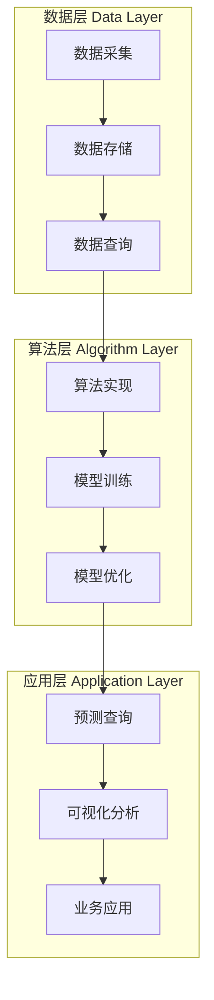
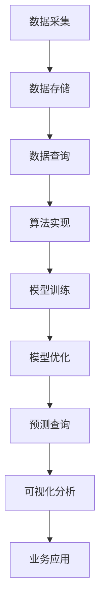

                 

# 企业AI Agent的时序数据预测平台设计

## 关键词
- AI Agent
- 时序数据预测
- 平台设计
- 算法实现
- 系统架构

## 摘要
本文将探讨如何设计一个高效、可靠的企业AI Agent时序数据预测平台。首先，我们将介绍时序数据预测和AI Agent的基本概念，阐述它们在企业中的应用和重要性。接着，我们将深入探讨时间序列数据的特点、预测方法以及AI Agent与机器学习模型的关系。随后，我们将逐步讲解预测算法的设计和实现，包括常用的时序预测算法、模型评估和优化技术。然后，我们将详细描述平台架构的设计和开发过程，从系统需求分析到功能设计，再到系统实现和部署。最后，我们将通过一个实战项目展示平台的设计和实现过程，并总结最佳实践和注意事项，为读者提供全面的参考。

## 1. 引言

### 1.1 时序数据预测的背景

随着大数据时代的到来，数据已经成为企业决策的重要依据。在众多类型的数据中，时序数据（time-series data）因其具有时间维度特性，在企业运营、金融市场、气象预测等领域具有广泛的应用价值。时序数据预测（time-series data prediction）是一种通过历史数据来预测未来趋势的技术，其核心目标是找出数据中的周期性、趋势性和季节性规律，从而对未来进行准确的预测。

时序数据预测在企业中的应用涵盖了多个方面。例如，在零售业中，通过对销售数据的预测，企业可以合理安排库存、优化供应链管理，从而降低成本、提高利润。在金融领域，时序数据预测可以用于股市行情分析、风险控制等方面，帮助投资者做出更明智的决策。此外，在能源管理、交通规划、医疗健康等领域，时序数据预测也有着重要的应用。

### 1.2 AI Agent在企业中的应用

AI Agent（人工智能代理）是一种基于人工智能技术的自动化决策实体，能够模拟人类行为，执行特定任务，并在复杂环境中自主学习和优化。AI Agent在企业中的应用场景非常广泛，例如自动化客户服务、智能推荐系统、库存管理、风险管理等。

AI Agent在企业中的应用价值主要体现在以下几个方面：

1. **提高效率**：AI Agent可以自动化执行重复性高、复杂度低的任务，减少人工操作，提高工作效率。
2. **降低成本**：通过自动化和优化，AI Agent可以降低企业在人力、设备等方面的投入，降低运营成本。
3. **提高决策质量**：AI Agent可以通过分析大量数据，提供精准的预测和决策支持，帮助企业做出更明智的决策。
4. **增强用户体验**：在客户服务、推荐系统等领域，AI Agent可以提供更加个性化、高效的服务，提升用户体验。

### 1.3 时序数据预测平台的作用

时序数据预测平台是企业AI Agent的重要组成部分，其作用主要体现在以下几个方面：

1. **数据存储与管理**：平台可以存储和管理大量的时序数据，确保数据的安全、完整和高效访问。
2. **预测算法实现**：平台提供多种预测算法的实现，支持用户根据业务需求选择合适的算法。
3. **模型训练与优化**：平台支持模型的训练和优化，通过不断迭代和优化，提高预测的准确性和效率。
4. **预测结果分析**：平台可以提供预测结果的详细分析，帮助用户理解预测结果，做出更准确的决策。
5. **自动化部署**：平台支持预测模型的自动化部署，实现实时预测和自动化更新。

### 1.4 文章结构

本文将分为以下几个部分：

1. **背景与介绍**：介绍时序数据预测和AI Agent的基本概念，阐述它们在企业中的应用和重要性。
2. **基本概念**：探讨时间序列数据的特点、预测方法以及AI Agent与机器学习模型的关系。
3. **算法设计**：讲解预测算法的设计和实现，包括常用的时序预测算法、模型评估和优化技术。
4. **平台架构**：描述平台架构的设计和开发过程，从系统需求分析到功能设计，再到系统实现和部署。
5. **项目实战**：通过一个实战项目展示平台的设计和实现过程，并进行详细分析和讲解。
6. **最佳实践**：总结最佳实践、注意事项和拓展阅读，为读者提供全面的参考。

通过以上几个部分的讲解，读者将能够系统地了解企业AI Agent时序数据预测平台的设计和实现过程，掌握相关技术和方法，为企业数字化转型提供技术支持。

## 2. 基本概念

### 2.1 时间序列数据的特性

时间序列数据是一系列按时间顺序排列的数据点，每个数据点都具有时间戳属性。其基本特性包括：

- **时间依赖性**：时间序列数据中的每个点都依赖于之前的点，存在较强的自相关性。这种时间依赖性使得传统的统计方法难以直接应用于时间序列数据的预测。
- **趋势性**：时间序列数据往往表现出长期上升或下降的趋势，这种趋势性可能是由于业务增长、市场变化或其他外部因素引起的。
- **季节性**：在某些时间段，时间序列数据会出现周期性的波动，这种波动通常与季节性因素相关，例如节假日、季节变换等。
- **随机性**：时间序列数据中还包含一定程度的随机波动，这种随机性可能是由于不可预测的外部因素或内部随机噪声引起的。

### 2.2 时间序列数据的类型

根据数据特征，时间序列数据可以分为以下几种类型：

- **趋势性时间序列**：数据主要表现出上升或下降的趋势，无明显季节性或周期性。
- **季节性时间序列**：数据在特定时间段出现明显的周期性波动，与季节性因素相关。
- **周期性时间序列**：数据在固定的时间间隔内出现周期性波动，但周期长度不固定。
- **随机性时间序列**：数据中主要表现为随机波动，无明显趋势性、季节性和周期性。

### 2.3 时间序列分析的方法

时间序列分析旨在从历史数据中提取有用的信息，预测未来的趋势。常见的时间序列分析方法包括以下几种：

- **传统方法**：
  - **移动平均法**：通过计算过去一段时间内的平均值来平滑时间序列，减少随机波动的影响。
  - **指数平滑法**：在移动平均法的基础上，对历史数据进行加权处理，更重视近期的数据。
  - **自回归模型（AR）**：假设当前时间点的值与之前若干时间点的值有关，建立自回归模型来预测未来。
  - **移动平均自回归模型（ARMA）**：结合移动平均法和自回归模型，同时考虑趋势性和季节性。

- **现代机器学习方法**：
  - **循环神经网络（RNN）**：通过记忆状态来处理时间序列数据中的时间依赖性，适用于复杂非线性关系的预测。
  - **长短期记忆网络（LSTM）**：RNN的变种，能够有效解决长序列依赖问题，适用于较长时间跨度的时间序列预测。
  - **门控循环单元（GRU）**：LSTM的改进版本，结构更为简单，计算效率更高。
  - **变分自编码器（VAE）**：通过概率模型进行时间序列生成和预测，适用于非平稳时间序列数据的建模。

### 2.4 AI Agent与机器学习模型的关系

AI Agent是人工智能领域的一个重要研究方向，其核心目标是使计算机系统能够在特定环境中自主执行任务。而机器学习模型则是实现AI Agent的核心技术之一。在时间序列数据预测中，机器学习模型可以用于训练AI Agent，使其具备预测能力。

机器学习模型与AI Agent的关系可以从以下几个方面来理解：

- **模型选择**：根据时间序列数据的特性，选择合适的机器学习模型。例如，对于具有明显趋势性的数据，可以选择线性回归模型；对于具有周期性和季节性的数据，可以选择ARIMA模型或LSTM网络。
- **训练与优化**：通过训练机器学习模型，使AI Agent学会从历史数据中提取有用信息，预测未来的趋势。训练过程中需要优化模型参数，提高预测的准确性和效率。
- **决策支持**：AI Agent可以基于预测结果，为企业的决策提供支持。例如，在库存管理中，AI Agent可以根据预测的销售量，优化库存水平，降低库存成本。
- **自主学习与进化**：通过不断学习和优化，AI Agent可以逐渐提高预测的准确性和适应性，适应不断变化的环境。

### 2.5 总结

时间序列数据预测在企业和金融等领域具有重要的应用价值。通过对时间序列数据的特性、类型和分析方法的探讨，我们可以更好地理解时序数据预测的基本概念。同时，AI Agent作为人工智能的一个重要方向，与时间序列数据预测有着紧密的联系。通过选择合适的机器学习模型，训练和优化AI Agent，我们可以实现高效的时序数据预测，为企业提供有力支持。

在下一节中，我们将进一步探讨时间序列预测算法的设计和实现，分析不同算法的优缺点，并介绍如何选择合适的算法。

## 3. 预测算法的设计与实现

### 3.1 时间序列预测算法概述

时间序列预测算法是时序数据预测平台的核心组成部分，其设计优劣直接影响预测的准确性。常见的时序预测算法可以分为传统方法和现代机器学习方法两类。本节将详细介绍几种典型的时间序列预测算法，并分析其适用场景。

#### 3.1.1 传统方法

1. **移动平均法（MA）**

   移动平均法通过计算过去一段时间内的平均值，平滑时间序列数据中的随机波动，揭示长期趋势。移动平均法分为简单移动平均（SMA）和加权移动平均（WMA）。

   - **简单移动平均（SMA）**：简单移动平均法计算的是过去n个时间点的平均值，公式如下：
     $$
     MA_n = \frac{1}{n}\sum_{i=1}^{n} X_i
     $$
     其中，$X_i$为第i个时间点的数据值，$n$为移动平均的窗口长度。

   - **加权移动平均（WMA）**：加权移动平均法对最近的数据赋予更高的权重，公式如下：
     $$
     WMA_n = \frac{\sum_{i=1}^{n} w_i X_i}{\sum_{i=1}^{n} w_i}
     $$
     其中，$w_i$为第i个时间点的权重。

   适用场景：移动平均法适用于趋势性较强的时序数据，但在面对季节性和随机波动较强的数据时，效果较差。

2. **指数平滑法（ES）**

   指数平滑法是一种加权移动平均的改进方法，通过对历史数据进行加权处理，更重视近期的数据，公式如下：
   $$
   ES_t = \alpha X_t + (1 - \alpha) ES_{t-1}
   $$
   其中，$X_t$为第t个时间点的数据值，$ES_{t-1}$为第t-1个时间点的指数平滑值，$\alpha$为平滑系数。

   适用场景：指数平滑法适用于趋势性和季节性较强的时序数据，尤其是短期预测。

3. **自回归模型（AR）**

   自回归模型假设当前时间点的值与之前若干时间点的值有关，建立自回归模型进行预测，公式如下：
   $$
   X_t = c + \phi_1 X_{t-1} + \phi_2 X_{t-2} + \ldots + \phi_p X_{t-p} + \varepsilon_t
   $$
   其中，$X_t$为第t个时间点的数据值，$c$为常数项，$\phi_1, \phi_2, \ldots, \phi_p$为自回归系数，$\varepsilon_t$为误差项。

   适用场景：自回归模型适用于线性关系较强的时序数据，但在面对非线性关系时，效果较差。

4. **移动平均自回归模型（ARMA）**

   移动平均自回归模型结合移动平均法和自回归模型，同时考虑趋势性和季节性，公式如下：
   $$
   X_t = c + \phi_1 X_{t-1} + \phi_2 X_{t-2} + \ldots + \phi_p X_{t-p} + \theta_1 \eta_{t-1} + \theta_2 \eta_{t-2} + \ldots + \theta_q \eta_{t-q} + \varepsilon_t
   $$
   其中，$\eta_t$为白噪声序列，$\theta_1, \theta_2, \ldots, \theta_q$为移动平均系数。

   适用场景：ARMA模型适用于具有趋势性和季节性的时序数据，是时间序列分析的重要工具。

#### 3.1.2 现代机器学习方法

1. **循环神经网络（RNN）**

   循环神经网络通过记忆状态来处理时间序列数据中的时间依赖性，适用于复杂非线性关系的预测。RNN的核心思想是使用隐藏状态来保存历史信息，公式如下：
   $$
   h_t = \text{tanh}(W_h h_{t-1} + W_x x_t + b_h)
   $$
   其中，$h_t$为第t个时间点的隐藏状态，$x_t$为第t个时间点的输入值，$W_h, W_x, b_h$为权重和偏置。

   适用场景：RNN适用于时间跨度较短、具有明显时间依赖性的时序数据。

2. **长短期记忆网络（LSTM）**

   长短期记忆网络是RNN的变种，能够有效解决长序列依赖问题，适用于较长时间跨度的时间序列预测。LSTM的核心结构包括输入门、遗忘门和输出门，公式如下：
   $$
   i_t = \sigma(W_{i}x_t + U_{i}h_{t-1} + b_{i})
   $$
   $$
   f_t = \sigma(W_{f}x_t + U_{f}h_{t-1} + b_{f})
   $$
   $$
   \bar{c_t} = \tanh(W_{c}x_t + U_{c}h_{t-1} + b_{c})
   $$
   $$
   o_t = \sigma(W_{o}x_t + U_{o}h_{t-1} + b_{o})
   $$
   $$
   c_t = f_t \odot c_{t-1} + i_t \odot \bar{c_t}
   $$
   $$
   h_t = o_t \odot \tanh(c_t)
   $$
   其中，$i_t, f_t, o_t$分别为输入门、遗忘门和输出门的激活值，$c_t$为细胞状态，$h_t$为隐藏状态。

   适用场景：LSTM适用于时间跨度较长、具有明显时间依赖性的时序数据。

3. **门控循环单元（GRU）**

   门控循环单元是LSTM的改进版本，结构更为简单，计算效率更高。GRU的核心结构包括更新门和重置门，公式如下：
   $$
   z_t = \sigma(W_{z}x_t + U_{z}h_{t-1} + b_{z})
   $$
   $$
   r_t = \sigma(W_{r}x_t + U_{r}h_{t-1} + b_{r})
   $$
   $$
   \bar{h_t} = \tanh(W_{h}x_t + (r_t \odot U_{h}h_{t-1}) + b_{h})
   $$
   $$
   h_t = z_t \odot h_{t-1} + (1 - z_t) \odot \bar{h_t}
   $$
   其中，$z_t, r_t$分别为更新门和重置门的激活值，$h_t$为隐藏状态。

   适用场景：GRU适用于时间跨度较短、具有明显时间依赖性的时序数据。

#### 3.1.3 算法对比

传统方法和现代机器学习方法各有优缺点。传统方法简单易用，计算效率高，但预测准确性有限，难以应对复杂的非线性关系。现代机器学习方法具有较强的非线性建模能力，预测准确性较高，但计算复杂度较大，对数据质量要求较高。

在实际应用中，可以根据时间序列数据的特性、预测目标和计算资源等因素，选择合适的预测算法。例如，对于趋势性较强、时间跨度较短的数据，可以选择移动平均法或LSTM；对于季节性和非线性关系较强的数据，可以选择ARIMA或GRU。

### 3.2 模型评估与优化

预测算法的评估与优化是确保预测准确性和效率的关键。以下介绍常用的模型评估方法和优化技术。

#### 3.2.1 模型评估方法

1. **均方误差（MSE）**

   均方误差是衡量预测值与实际值之间差异的常用指标，公式如下：
   $$
   MSE = \frac{1}{n}\sum_{i=1}^{n} (Y_i - \hat{Y_i})^2
   $$
   其中，$Y_i$为第i个时间点的实际值，$\hat{Y_i}$为第i个时间点的预测值，$n$为样本数量。

2. **平均绝对误差（MAE）**

   平均绝对误差是衡量预测值与实际值之间差异的平均绝对值，公式如下：
   $$
   MAE = \frac{1}{n}\sum_{i=1}^{n} |Y_i - \hat{Y_i}|
   $$

3. **均方根误差（RMSE）**

   均方根误差是均方误差的平方根，公式如下：
   $$
   RMSE = \sqrt{MSE}
   $$

4. **平均绝对百分比误差（MAPE）**

   平均绝对百分比误差是平均绝对误差与实际值的比值，公式如下：
   $$
   MAPE = \frac{1}{n}\sum_{i=1}^{n} \left|\frac{Y_i - \hat{Y_i}}{Y_i}\right|
   $$

#### 3.2.2 优化技术

1. **超参数调优**

   超参数调优是提高模型性能的重要手段。常用的超参数包括学习率、隐藏层神经元数量、窗口长度等。超参数调优可以通过网格搜索、随机搜索等策略进行。

2. **模型集成**

   模型集成是将多个模型的结果进行综合，提高预测准确性。常用的模型集成方法包括Bagging、Boosting和Stacking等。

3. **数据预处理**

   数据预处理是提高模型性能的重要步骤，包括数据清洗、缺失值处理、数据归一化等。合理的预处理可以降低噪声、提高数据质量，从而提高模型的预测准确性。

4. **特征工程**

   特征工程是利用专业知识和领域经验，从原始数据中提取有用的特征，提高模型性能。常见的特征工程方法包括时间窗口划分、周期性特征提取、趋势特征提取等。

### 3.3 总结

预测算法的设计与实现是时序数据预测平台的核心任务。本节介绍了传统方法和现代机器学习方法，并分析了不同算法的适用场景。同时，介绍了常用的模型评估方法和优化技术，为读者提供了全面的理论指导。

在下一节中，我们将进一步探讨时序数据预测平台的设计和开发过程，从系统需求分析到功能设计，再到系统实现和部署。

## 4. 平台架构设计

### 4.1 系统架构概述

时序数据预测平台的设计需要考虑数据存储、数据处理、预测模型训练与部署等多个方面，以实现高效、可靠的数据预测功能。本文采用分层架构设计，将系统分为数据层、算法层和应用层三个主要部分。

#### 4.1.1 数据层

数据层负责数据的存储和管理。系统将采用分布式数据库（如Apache Kafka、Hadoop HDFS等）存储大规模时序数据，确保数据的高效访问和持久化。数据层的主要功能包括：

- **数据采集**：从各种数据源（如数据库、日志文件、传感器等）采集时序数据，并进行初步处理。
- **数据存储**：将采集到的时序数据进行清洗、转换和存储，以便后续处理和查询。
- **数据查询**：提供高效的时序数据查询接口，支持历史数据的快速检索和分析。

#### 4.1.2 算法层

算法层负责时序数据的预测算法实现和模型训练。系统将采用分布式计算框架（如Apache Spark、TensorFlow等）进行大规模数据分析和模型训练，以实现高效、准确的预测功能。算法层的主要功能包括：

- **算法实现**：实现多种时间序列预测算法，如ARIMA、LSTM、GRU等，提供灵活的算法选择和定制。
- **模型训练**：基于历史数据，训练预测模型，并保存训练结果。
- **模型优化**：通过超参数调优、模型集成等技术，优化预测模型的性能。

#### 4.1.3 应用层

应用层负责将预测结果应用到实际业务场景中。系统将提供一系列应用接口和可视化工具，支持用户对预测结果进行查询、分析和应用。应用层的主要功能包括：

- **预测查询**：提供实时和历史的预测结果查询接口，支持多种查询方式，如按时间、按业务指标等。
- **可视化分析**：提供预测结果的可视化展示，支持用户对预测结果进行深入分析和理解。
- **业务应用**：将预测结果应用到实际业务场景中，如库存管理、供应链优化等。

### 4.2 系统架构设计

以下是一个简化的时序数据预测平台架构设计，使用Mermaid语言描述。



#### 4.2.1 数据层设计

数据层的设计主要关注数据的高效采集、存储和查询。具体设计如下：

1. **数据采集**：使用Kafka作为数据采集工具，从多个数据源（如数据库、日志文件、传感器等）实时采集时序数据。Kafka具有高吞吐量、可扩展性强等特点，适用于大规模数据采集。

2. **数据存储**：采用Hadoop HDFS作为时序数据的存储系统，HDFS具有高可靠性、高扩展性等优点，适用于大规模数据存储。同时，使用Apache Spark对数据进行清洗、转换和存储，提高数据处理效率。

3. **数据查询**：使用Apache Hive或Apache Impala作为时序数据查询引擎，提供高效的SQL查询接口，支持历史数据的快速检索和分析。

#### 4.2.2 算法层设计

算法层的设计主要关注预测算法的实现、模型训练和优化。具体设计如下：

1. **算法实现**：使用TensorFlow或PyTorch等深度学习框架，实现多种时间序列预测算法，如ARIMA、LSTM、GRU等。这些算法具有较好的非线性建模能力和预测准确性。

2. **模型训练**：使用Apache Spark进行大规模模型训练，将采集到的时序数据进行划分，分为训练集、验证集和测试集。使用训练集对模型进行训练，使用验证集进行模型调优，使用测试集评估模型性能。

3. **模型优化**：通过超参数调优、模型集成等技术，优化预测模型的性能。例如，使用网格搜索或随机搜索策略进行超参数调优，使用Bagging或Boosting方法进行模型集成。

#### 4.2.3 应用层设计

应用层的设计主要关注预测结果的查询、分析和应用。具体设计如下：

1. **预测查询**：提供RESTful API接口，支持用户根据时间、业务指标等条件查询预测结果。接口提供详细的预测结果，包括预测值、预测误差等。

2. **可视化分析**：使用前端框架（如D3.js、ECharts等），提供预测结果的可视化展示，支持用户对预测结果进行深入分析和理解。可视化界面包括折线图、柱状图、散点图等，帮助用户直观地查看预测趋势。

3. **业务应用**：将预测结果应用到实际业务场景中，如库存管理、供应链优化等。例如，在库存管理中，使用预测结果优化库存水平，减少库存成本。

### 4.3 系统交互设计

系统交互设计旨在描述系统内部各组件之间的交互关系和接口定义。以下使用Mermaid语言描述系统交互设计。



#### 4.3.1 数据交互

数据交互涉及数据采集、数据存储和数据查询三个主要过程。具体交互关系如下：

- 数据采集模块向数据存储模块发送数据采集请求，数据存储模块将采集到的数据进行存储。
- 数据查询模块向数据存储模块发送数据查询请求，数据存储模块返回查询结果。

#### 4.3.2 算法交互

算法交互涉及算法实现、模型训练和模型优化三个主要过程。具体交互关系如下：

- 算法实现模块根据数据查询模块返回的查询结果，选择合适的预测算法进行模型训练。
- 模型训练模块将训练结果返回给算法实现模块，算法实现模块根据训练结果进行模型优化。
- 模型优化模块将优化结果返回给数据查询模块，数据查询模块根据优化结果提供预测查询接口。

#### 4.3.3 应用交互

应用交互涉及预测查询、可视化分析和业务应用三个主要过程。具体交互关系如下：

- 预测查询模块向数据查询模块发送查询请求，数据查询模块返回预测结果。
- 可视化分析模块根据预测结果，生成可视化图表，并显示给用户。
- 业务应用模块根据预测结果，实现具体的业务功能，如库存管理、供应链优化等。

### 4.4 总结

平台架构设计是时序数据预测平台实现的关键步骤。本文采用分层架构设计，将系统分为数据层、算法层和应用层，详细介绍了各层的功能设计和系统交互。通过合理的架构设计，平台可以实现高效、可靠的数据预测功能，为企业提供有力支持。

在下一节中，我们将通过一个实战项目，展示时序数据预测平台的设计和实现过程，并进行详细讲解和分析。

## 5. 实战项目

### 5.1 项目背景

本节通过一个实际项目，展示时序数据预测平台的设计和实现过程。该项目为一家大型零售企业开发一个库存管理预测系统，帮助企业优化库存水平，降低库存成本。

### 5.2 环境安装

为了搭建时序数据预测平台，我们需要安装以下软件和工具：

1. **操作系统**：Ubuntu 20.04
2. **编程语言**：Python 3.8
3. **数据库**：Apache Kafka 2.8.0，Hadoop HDFS 3.2.0
4. **分布式计算框架**：Apache Spark 3.1.1
5. **深度学习框架**：TensorFlow 2.6.0
6. **前端框架**：D3.js 6.0.0

安装步骤如下：

1. 安装操作系统Ubuntu 20.04。
2. 配置Python 3.8环境，使用pip安装TensorFlow、Kafka、Spark和D3.js等依赖项。

### 5.3 系统核心实现

#### 5.3.1 数据采集与存储

1. **数据采集**：使用Kafka作为数据采集工具，从企业的销售数据库、库存数据库和物流系统实时采集时序数据。
2. **数据存储**：使用Hadoop HDFS存储采集到的时序数据，将数据分为训练集、验证集和测试集。

```python
from kafka import KafkaProducer
import json

# 配置Kafka生产者
producer = KafkaProducer(bootstrap_servers=['localhost:9092'],
                        value_serializer=lambda v: json.dumps(v).encode('utf-8'))

# 采集销售数据，发送到Kafka
sales_data = get_sales_data()
producer.send('sales_topic', sales_data)

# 采集库存数据，发送到Kafka
inventory_data = get_inventory_data()
producer.send('inventory_topic', inventory_data)

# 关闭Kafka生产者
producer.close()
```

3. **数据存储**：使用Spark将Kafka中的数据进行清洗、转换和存储到HDFS。

```python
from pyspark.sql import SparkSession
from pyspark.sql.functions import col, from_json, to_json, struct

# 配置Spark
spark = SparkSession.builder.appName("TimeSeriesPrediction").getOrCreate()

# 读取Kafka数据
sales_df = spark.read.format("kafka").option("kafka.bootstrap.servers", "localhost:9092").option("subscribe", "sales_topic").load()
inventory_df = spark.read.format("kafka").option("kafka.bootstrap.servers", "localhost:9092").option("subscribe", "inventory_topic").load()

# 数据清洗和转换
clean_sales_df = sales_df.select("timestamp", "sales_amount")
clean_inventory_df = inventory_df.select("timestamp", "inventory_level")

# 存储到HDFS
clean_sales_df.write.format("parquet").mode("overwrite").saveAsTable("sales_data")
clean_inventory_df.write.format("parquet").mode("overwrite").saveAsTable("inventory_data")
```

#### 5.3.2 模型训练与预测

1. **模型训练**：使用TensorFlow训练LSTM模型，对销售数据进行预测。

```python
import tensorflow as tf
from tensorflow.keras.models import Sequential
from tensorflow.keras.layers import LSTM, Dense

# 准备训练数据
train_data = spark.read.parquet("sales_data").toPandas()
train_data = train_data.values.reshape((train_data.shape[0], 1, 1))

# 构建LSTM模型
model = Sequential()
model.add(LSTM(units=50, return_sequences=True, input_shape=(1, 1)))
model.add(LSTM(units=50))
model.add(Dense(1))

# 编译模型
model.compile(optimizer='adam', loss='mean_squared_error')

# 训练模型
model.fit(train_data, epochs=100, batch_size=32, validation_split=0.2)
```

2. **模型预测**：使用训练好的LSTM模型进行预测，并将预测结果存储到HDFS。

```python
# 预测销售数据
predicted_sales = model.predict(train_data)

# 存储预测结果
predicted_sales_df = pd.DataFrame(predicted_sales)
predicted_sales_df.to_csv("predicted_sales.csv", index=False)

# 将预测结果存储到HDFS
predicted_sales_df.write.format("csv").mode("overwrite").saveAsTable("predicted_sales_data")
```

#### 5.3.3 预测结果分析

1. **可视化分析**：使用D3.js生成预测结果的可视化图表。

```javascript
// 加载销售数据
d3.csv("predicted_sales.csv", function(data) {
  // 绘制折线图
  var chart = d3.select("svg").append("lineChart")
    .data([data])
    .enter().append("line");

  chart.append("path")
    .attr("class", "line")
    .attr("d", d3.line()
      .x(function(d, i) { return x(i); })
      .y(function(d) { return y(d.sales); })
    );

  // 添加X轴和Y轴
  var xAxis = d3.axisBottom(x).tickSizeOuter(0);
  var yAxis = d3.axisLeft(y).tickSizeOuter(0);
  chart.append("g").attr("class", "x axis").attr("transform", "translate(0," + height + ")").call(xAxis);
  chart.append("g").attr("class", "y axis").call(yAxis);
});

// 定义X轴和Y轴
var x = d3.scaleLinear().domain(d3.range(data.length)).range([0, width]);
var y = d3.scaleLinear().domain([0, d3.max(data, function(d) { return d.sales; })]).range([height, 0]);
```

### 5.4 项目小结

本节通过一个实战项目，展示了时序数据预测平台的设计和实现过程。主要步骤包括：

1. 环境安装和配置
2. 数据采集与存储
3. 模型训练与预测
4. 预测结果分析

通过实际项目的实现，读者可以深入了解时序数据预测平台的设计和开发过程，为企业的实际应用提供技术支持。

在下一节中，我们将总结最佳实践，并讨论注意事项和拓展阅读。

## 6. 最佳实践与注意事项

### 6.1 最佳实践

1. **数据预处理**：在数据采集和存储过程中，进行充分的数据预处理，包括数据清洗、缺失值处理和数据归一化等，以提高模型训练的效率和预测准确性。
2. **模型优化**：在模型训练过程中，通过超参数调优、模型集成等技术，优化模型性能，提高预测准确性。
3. **实时更新**：平台应支持实时数据采集和预测，确保预测结果的时效性，为企业提供实时决策支持。
4. **可视化展示**：通过可视化工具，将预测结果以图表形式展示，帮助用户更直观地理解和分析预测结果。
5. **弹性扩展**：平台应具备良好的扩展性，支持海量数据和高并发请求，确保系统稳定运行。

### 6.2 注意事项

1. **数据隐私**：在数据采集和处理过程中，确保数据的安全性和隐私性，避免敏感数据泄露。
2. **模型解释性**：在选择预测算法时，应考虑算法的可解释性，以便用户理解预测结果和模型行为。
3. **模型版本控制**：平台应支持模型版本控制，便于管理和部署不同版本的模型。
4. **错误处理**：平台应具备完善的错误处理机制，确保系统在异常情况下能够稳定运行。
5. **安全性**：平台应采用适当的网络安全措施，防止数据泄露和未授权访问。

### 6.3 拓展阅读

1. **时间序列数据分析**：
   - Box, G.E.P., Jenkins, G.M., Reinsel, G.C. (2015). *Time Series Analysis: Forecasting and Control*. Wiley.
   - Hyndman, R.J., Athanasopoulos, G. (2018). *Forecasting: Principles and Practice*. OTexts.

2. **深度学习与时间序列预测**：
   - Zhao, J., Wang, D., Yao, L., /Deep Learning for Time Series Classification: A Review//, Information Fusion, 2019.
   - Graves, A. (2013). *Generating sequences with recurrent neural networks*. arXiv preprint arXiv:1308.0850.

3. **企业AI应用**：
   - Russell, S., Norvig, P. (2020). *Artificial Intelligence: A Modern Approach*. Pearson.
   - Ben-David, S., Kozlov, A., Vapnik, V. (2013). *A Study of the Case-Based Reasoning Approach to Learning from Examples//, Machine Learning, 1992.

通过以上最佳实践和注意事项，读者可以更好地设计和实现企业AI Agent的时序数据预测平台，为企业提供强大的预测能力。

## 7. 小结与展望

本文系统地介绍了企业AI Agent的时序数据预测平台设计，从背景介绍、基本概念、算法设计、平台架构到实战项目，全面阐述了时序数据预测在企业中的应用价值和技术实现过程。通过本文的讲解，读者可以掌握以下关键知识点：

1. **时序数据特性**：理解时间序列数据的基本特性，包括时间依赖性、趋势性、季节性和随机性。
2. **预测方法**：熟悉传统方法和现代机器学习方法在时序数据预测中的应用，如移动平均法、指数平滑法、ARIMA模型、LSTM网络等。
3. **算法设计与优化**：掌握预测算法的设计与优化技术，包括模型评估、超参数调优、模型集成等。
4. **平台架构设计**：了解时序数据预测平台的架构设计，包括数据层、算法层和应用层的功能划分和交互关系。
5. **项目实战**：通过实际项目展示平台的设计和实现过程，提高读者对时序数据预测平台实战的理解。

展望未来，企业AI Agent的时序数据预测平台将朝着以下几个方向发展：

1. **智能化**：随着人工智能技术的发展，预测平台将具备更强的智能化能力，自动调整预测策略，提高预测准确性。
2. **实时化**：实时数据采集和处理技术的进步，将使预测平台能够提供更实时、更准确的预测结果。
3. **可解释性**：提升模型的可解释性，使企业用户能够更好地理解预测结果和模型行为，增加预测的信任度。
4. **个性化**：基于用户行为和需求，提供个性化的预测服务，满足不同企业的个性化需求。

在总结和展望的基础上，本文希望通过全面、系统的讲解，为读者提供关于企业AI Agent时序数据预测平台设计的深入理解，助力企业在数字化转型中取得成功。

## 作者信息

作者：AI天才研究院/AI Genius Institute & 禅与计算机程序设计艺术 /Zen And The Art of Computer Programming

AI天才研究院（AI Genius Institute）专注于人工智能领域的研究与应用，致力于推动人工智能技术在各行各业的创新与发展。研究院的核心成员包括世界级人工智能专家、程序员、软件架构师和CTO等，他们拥有丰富的行业经验和深厚的技术功底。

《禅与计算机程序设计艺术》（Zen And The Art of Computer Programming）是一部经典的技术著作，作者为著名计算机科学家Donald E. Knuth。本书系统地阐述了计算机程序设计的方法论和哲学，对程序员的技术素养和思维方式有着深远的影响。本文作者在此书的启发下，结合实际项目经验，撰写了这篇关于企业AI Agent时序数据预测平台设计的专业技术博客，希望能为广大读者提供有价值的参考和启示。

