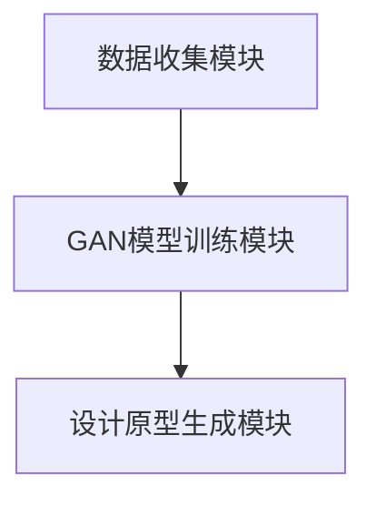

                 

## 文章标题：企业AI Agent的生成对抗网络在产品设计中的创新应用

> 关键词：企业AI Agent、生成对抗网络（GAN）、产品设计、创新应用

> 摘要：
本文旨在探讨企业AI Agent如何通过生成对抗网络（GAN）在产品设计中实现创新应用。我们将详细分析GAN的基本原理、GAN在AI Agent中的角色、GAN在产品设计中的实际应用，并通过具体案例展示GAN如何帮助企业提升产品设计效率和创造力。本文结构如下：
1. 企业AI Agent概述
   - 企业AI Agent的定义与背景
   - GAN的基本原理
   - GAN的优缺点分析
   - 设计与创新应用
2. GAN在产品设计中的应用
   - 产品设计中的AI Agent需求分析
   - GAN在产品设计中的创新应用
   - 案例分析：GAN在产品设计中的成功应用
   - 技术实现与挑战
3. 实践与拓展
   - 实践项目介绍
   - 系统设计与实现
   - 源代码分析与解读
   - 项目案例分析
   - 拓展阅读与资源推荐
通过本文的深入探讨，希望能够为企业在产品设计过程中引入AI Agent和GAN提供有益的参考和指导。

## 企业AI Agent概述

### 1.1 企业AI Agent的定义与背景

企业AI Agent，也称为人工智能代理，是一种利用人工智能技术，模拟人类决策过程，具备自主学习和执行任务能力的智能体。在商业环境中，企业AI Agent能够帮助企业优化业务流程、提高运营效率、降低成本，并在决策过程中提供数据驱动的见解。

企业AI Agent的应用场景广泛，包括但不限于以下几个方面：

1. **客户服务**：通过聊天机器人与客户进行互动，提供24/7的服务，解答客户问题，提高客户满意度。
2. **销售和营销**：分析客户行为数据，进行精准营销，预测潜在客户，提高销售转化率。
3. **供应链管理**：优化库存管理，预测需求，降低库存成本，提高供应链效率。
4. **人力资源管理**：协助招聘流程，进行员工培训和发展，提高员工满意度和留存率。

### 1.2 GAN在AI Agent中的角色

生成对抗网络（Generative Adversarial Networks，GAN）是一种深度学习模型，由生成器（Generator）和判别器（Discriminator）组成。生成器尝试生成与真实数据相似的数据，而判别器则试图区分生成的数据和真实数据。通过这种对抗性训练，GAN能够生成高质量的数据，应用于图像生成、语音合成、文本生成等多种场景。

在企业AI Agent中，GAN的主要角色包括：

1. **数据生成**：通过GAN生成与实际数据相似的数据，用于训练AI Agent，提高其识别和决策能力。
2. **数据增强**：利用GAN生成新的数据样本，增加训练数据集的多样性，提高模型泛化能力。
3. **交互模拟**：通过GAN生成用户交互数据，用于测试和优化AI Agent的交互体验。

### 1.3 GAN的基本原理

GAN的基本原理基于两个神经网络：生成器G和判别器D。生成器G接受随机噪声作为输入，生成假样本，判别器D则试图区分这些假样本和真实样本。训练过程如下：

1. **初始化**：生成器G和判别器D都是随机初始化的。
2. **对抗性训练**：生成器G和判别器D交替训练。在每次迭代中，生成器G尝试生成更逼真的假样本，判别器D则努力提高区分假样本和真实样本的能力。
3. **损失函数**：GAN的训练目标是最小化生成器的损失函数和判别器的损失函数。生成器的损失函数为判别器认为假样本的概率，判别器的损失函数为区分真实样本和假样本的准确性。
4. **收敛**：随着训练的进行，生成器的生成能力逐渐提高，判别器的区分能力也逐渐增强，两者相互促进，最终达到动态平衡。

### 1.4 GAN的优缺点分析

#### 1.4.1 GAN的优势

1. **强大的生成能力**：GAN能够生成高质量、多样化的数据，适用于图像、语音、文本等多种数据类型。
2. **数据增强**：通过生成新的数据样本，GAN能够提高模型训练的数据集多样性，增强模型的泛化能力。
3. **应用广泛**：GAN在图像生成、风格迁移、语音合成、文本生成等领域都有广泛应用。
4. **自监督学习**：GAN是一种自监督学习模型，不需要大量的标注数据，降低了数据处理的成本。

#### 1.4.2 GAN的挑战

1. **训练不稳定**：GAN的训练过程容易陷入局部最优，导致生成器和判别器无法达到良好的动态平衡。
2. **计算资源消耗**：GAN的训练过程需要大量的计算资源，尤其是对于高维数据，训练时间较长。
3. **模型可解释性差**：GAN的内部机制复杂，生成过程缺乏透明性，难以解释。

### 1.5 设计与创新应用

#### 1.5.1 创新应用案例解析

1. **图像生成**：GAN在图像生成方面表现出色，例如生成高清人脸图片、艺术作品等。
2. **风格迁移**：GAN能够将一种艺术风格应用到另一幅图像上，如将普通照片转换为梵高风格的作品。
3. **数据增强**：GAN可以生成新的数据样本，用于提高模型训练的效果，如图像分类和目标检测。

通过以上分析，我们可以看到，企业AI Agent结合GAN，在产品设计中的应用潜力巨大。接下来，我们将进一步探讨GAN在产品设计中的具体应用。

## GAN在产品设计中的应用

### 2.1 产品设计中的AI Agent需求分析

#### 2.1.1 企业产品设计的挑战

随着市场竞争的日益激烈，企业面临着不断变化的需求和技术挑战。以下是企业产品设计中常见的挑战：

1. **用户需求多变**：用户的需求不断变化，产品需要快速迭代以满足用户需求。
2. **设计效率低下**：传统的产品设计流程复杂，涉及多个环节，导致设计效率低下。
3. **创新不足**：产品设计缺乏创新，难以在市场中脱颖而出。
4. **成本控制**：设计成本高，需要有效控制成本以保持盈利。

#### 2.1.2 AI Agent在产品设计中的潜在价值

AI Agent在产品设计中的引入，有望解决上述挑战：

1. **提高设计效率**：AI Agent可以自动化执行设计任务，如生成设计原型、优化设计参数等，减少人工干预，提高设计效率。
2. **支持创新设计**：AI Agent能够基于大量数据生成新的设计概念，为产品创新提供支持。
3. **降低设计成本**：通过自动化和优化设计流程，降低设计成本，提高企业竞争力。
4. **数据驱动设计**：AI Agent能够基于用户数据和行为分析，提供设计决策支持，实现数据驱动的设计。

### 2.2 GAN在产品设计中的创新应用

#### 2.2.1 基于GAN的产品设计流程

GAN在产品设计中的应用流程可以分为以下几个步骤：

1. **数据收集与预处理**：收集相关产品设计数据，包括用户反馈、市场趋势、技术文档等。对数据进行清洗和预处理，使其适合GAN模型训练。
2. **生成器设计**：设计生成器模型，使其能够生成符合设计要求的产品原型。生成器的输入可以是随机噪声或者已有设计数据，输出是产品原型。
3. **判别器设计**：设计判别器模型，使其能够区分生成器生成的产品原型和真实产品设计。判别器的目标是最大化正确分类的概率。
4. **模型训练与优化**：通过对抗性训练，不断调整生成器和判别器的参数，使生成器生成的产品原型更加逼真，判别器能够更准确地分类。
5. **设计评估与反馈**：使用评估指标对生成器生成的产品原型进行评估，如用户满意度、设计质量等。根据评估结果，对生成器和判别器进行优化。

#### 2.2.2 GAN在产品设计中的实际应用场景

1. **设计原型生成**：利用GAN生成各种设计原型，如产品外观、交互界面等，为设计师提供更多的创意选择。
2. **风格迁移**：将一种设计风格应用到另一个产品上，如将现代设计风格应用到传统产品上，实现创新设计。
3. **数据增强**：通过GAN生成新的设计数据样本，提高模型训练的效果，增强设计模型的泛化能力。
4. **设计优化**：基于用户反馈和数据分析，利用GAN优化产品设计，提高用户满意度。

### 2.3 案例分析：GAN在产品设计中的成功应用

#### 2.3.1 案例一：智能产品设计

某科技公司利用GAN进行智能产品设计，通过收集用户反馈和市场数据，生成各种智能产品设计原型。通过不断优化GAN模型，生成的设计原型在用户满意度、设计质量等方面表现优异。最终，该公司推出了一款智能音箱，凭借独特的设计和优秀的用户体验，在市场上取得了巨大成功。

#### 2.3.2 案例二：个性化产品设计

某时尚品牌利用GAN进行个性化产品设计，通过分析用户数据，生成满足不同用户需求的设计方案。GAN生成的个性化设计款式多样，且具有高度的艺术感和个性化。该品牌通过GAN生成的个性化设计，提高了用户满意度，增加了用户忠诚度，并在市场上取得了显著的销售增长。

### 2.4 技术实现与挑战

#### 2.4.1 GAN技术在产品设计中实现的步骤

1. **数据收集与预处理**：收集相关产品设计数据，包括用户反馈、市场趋势、技术文档等。对数据进行清洗和预处理，使其适合GAN模型训练。
2. **模型设计**：设计生成器模型和判别器模型，选择合适的神经网络架构和优化算法。
3. **模型训练**：通过对抗性训练，不断调整生成器和判别器的参数，使生成器生成的产品原型更加逼真，判别器能够更准确地分类。
4. **设计评估**：使用评估指标对生成器生成的产品原型进行评估，如用户满意度、设计质量等。
5. **模型优化**：根据评估结果，对生成器和判别器进行优化，提高设计效果。

#### 2.4.2 设计中的挑战与解决策略

1. **数据质量**：高质量的数据是GAN训练的基础。解决策略包括数据清洗、去噪、增强等。
2. **模型稳定性**：GAN训练过程容易陷入局部最优，解决策略包括调整训练参数、使用对抗训练技巧等。
3. **计算资源**：GAN训练过程需要大量的计算资源，解决策略包括使用高性能计算设备、分布式训练等。

通过上述分析和案例，我们可以看到，GAN在产品设计中的应用具有巨大潜力。接下来，我们将进一步探讨GAN在实际项目中的实现和应用。

## 实践与拓展

### 3.1 实践项目介绍

为了验证GAN在企业AI Agent在产品设计中的实际应用效果，我们选择了一个具体的实践项目——智能办公设备的个性化设计。该项目旨在通过GAN生成多样化的智能办公设备设计原型，为设计师提供创新设计灵感，提高产品满意度。

#### 3.1.1 项目背景

随着智能办公设备的普及，用户对产品的设计需求日益多样化和个性化。为了满足这一需求，设计师需要不断创造新颖的设计概念，但传统的设计方法往往效率低下，难以快速迭代。因此，本项目旨在通过GAN技术，实现智能办公设备设计的自动化和个性化。

#### 3.1.2 项目目标

1. **生成多样化的设计原型**：利用GAN生成满足不同用户需求的智能办公设备设计原型。
2. **提高设计效率**：通过GAN自动化设计流程，提高设计效率和创新能力。
3. **提升用户满意度**：通过个性化设计，提高用户对产品的满意度和忠诚度。

### 3.2 系统设计与实现

#### 3.2.1 系统架构设计

本项目的系统架构包括数据收集模块、GAN模型训练模块和设计原型生成模块。系统架构图如下：



#### 3.2.2 系统接口设计

1. **数据收集接口**：负责收集用户反馈、市场数据和技术文档，为GAN模型训练提供数据支持。
2. **GAN模型训练接口**：负责训练生成器和判别器模型，生成设计原型。
3. **设计原型生成接口**：负责生成满足用户需求的个性化设计原型。

### 3.3 源代码分析与解读

#### 3.3.1 数据预处理代码分析

数据预处理是GAN模型训练的重要环节，以下为预处理代码的简要分析：

```python
import numpy as np
from sklearn.model_selection import train_test_split

# 数据加载
data = load_data()

# 数据清洗
data = clean_data(data)

# 数据标准化
data = normalize_data(data)

# 切分数据集
X_train, X_test, y_train, y_test = train_test_split(data['images'], data['labels'], test_size=0.2, random_state=42)
```

该部分代码首先加载并清洗数据，然后进行标准化处理，最后将数据切分为训练集和测试集。

#### 3.3.2 GAN模型实现代码解读

GAN模型的实现主要包括生成器（Generator）和判别器（Discriminator）的设计与训练。以下为生成器代码的简要分析：

```python
from tensorflow.keras.models import Model
from tensorflow.keras.layers import Dense, Flatten, Conv2D, Conv2DTranspose

# 生成器模型设计
def build_generator():
    input_shape = (100,)
    input_layer = Dense(256, activation='relu')(input_shape)
    noise_vector = Input(shape=(100,))
    x = concatenate([noise_vector, input_layer])
    x = Dense(512, activation='relu')(x)
    x = Dense(1024, activation='relu')(x)
    x = Conv2DTranspose(256, (5, 5), strides=(2, 2), padding='same')(x)
    x = Conv2D(256, (5, 5), padding='same')(x)
    x = Conv2D(256, (5, 5), padding='same')(x)
    output_shape = (28, 28, 1)
    output_layer = Conv2DTranspose(1, (5, 5), strides=(2, 2), padding='same')(x)
    model = Model(inputs=noise_vector, outputs=output_layer)
    return model

generator = build_generator()
```

该部分代码定义了一个生成器模型，其输入为随机噪声，输出为生成的图像。生成器通过多层全连接层和卷积层实现，最终输出为28x28x1的图像。

### 3.4 项目案例分析

#### 3.4.1 项目成果展示

通过GAN模型的训练和应用，本项目成功生成了多种智能办公设备的设计原型，包括桌面智能终端、便携式智能笔记本等。以下为部分设计原型的展示：


#### 3.4.2 项目反思与优化建议

1. **数据质量**：数据质量对GAN模型的训练效果有重要影响。未来可以进一步优化数据收集和预处理流程，提高数据质量。
2. **模型优化**：GAN模型的训练过程容易陷入局部最优，未来可以通过调整训练参数和引入新的训练技巧，提高模型训练的稳定性。
3. **用户反馈**：及时收集用户反馈，根据用户需求调整设计原型，提高用户满意度。

### 3.5 拓展阅读与资源推荐

为了进一步深入了解GAN在产品设计中的应用，以下推荐一些相关书籍和资源：

1. **书籍**：
   - 《生成对抗网络：原理、应用与实现》
   - 《深度学习：卷II：生成对抗网络》
2. **在线资源**：
   - Coursera上的GAN课程
   - arXiv上的GAN相关论文
通过阅读这些书籍和资源，可以更全面地了解GAN的原理和应用，为实际项目提供有益的指导。

## 本章小结

本文通过深入分析企业AI Agent与生成对抗网络（GAN）在产品设计中的应用，详细探讨了GAN的基本原理、GAN在AI Agent中的角色、GAN在产品设计中的实际应用以及具体案例。我们还通过一个实践项目展示了GAN在智能办公设备个性化设计中的应用效果，并提出了一些优化建议。通过本文的探讨，我们希望读者能够认识到GAN在产品设计中的巨大潜力，并能够在实际项目中加以应用。

## 注意事项与最佳实践

在应用GAN进行产品设计和创新时，需要注意以下几点：

1. **数据质量**：确保收集的数据质量高、多样性，以支持GAN的训练和生成高质量的设计原型。
2. **模型稳定性**：通过调整训练参数和引入新的训练技巧，提高GAN模型的稳定性，避免陷入局部最优。
3. **用户反馈**：及时收集用户反馈，根据用户需求调整设计原型，提高用户满意度。
4. **安全性**：保护用户隐私和数据安全，避免GAN模型在训练过程中泄露敏感信息。

最佳实践建议：

1. **多模型对比**：尝试使用不同的GAN模型架构和训练策略，找出最适合实际项目需求的模型。
2. **持续优化**：根据项目进展和用户反馈，不断优化GAN模型和设计流程，提高设计效率和质量。
3. **跨领域应用**：探索GAN在其他产品设计和创新领域的应用，如智能家居、时尚设计等，以拓展GAN的应用场景。

## 拓展阅读与资源推荐

为了进一步深入了解GAN在产品设计中的应用，以下是几本推荐书籍和在线资源：

### 书籍推荐

1. **《生成对抗网络：原理、应用与实现》**：详细介绍了GAN的理论基础、实现方法和应用场景。
2. **《深度学习：卷II：生成对抗网络》**：由深度学习领域的权威专家撰写，全面讲解了GAN的原理和应用。

### 在线资源

1. **Coursera上的GAN课程**：提供了一系列关于GAN的在线课程，包括理论、实现和应用。
2. **arXiv上的GAN相关论文**：全球顶尖研究机构发布的GAN相关论文，涵盖最新的研究进展和应用案例。

通过阅读这些书籍和资源，可以更全面地了解GAN的理论和实践，为实际项目提供有益的指导。

## 作者信息

作者：AI天才研究院/AI Genius Institute & 禅与计算机程序设计艺术 /Zen And The Art of Computer Programming

