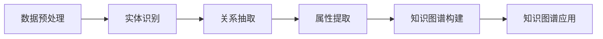
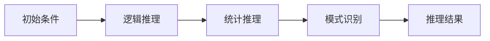

                 

### 文章标题

#### 企业AI Agent的知识图谱构建与应用

---

#### 关键词：知识图谱、企业AI Agent、知识表示、知识抽取、知识推理

---

#### 摘要：

本文深入探讨了企业AI Agent的知识图谱构建与应用。首先，我们介绍了知识图谱的基本概念、发展历程和核心概念，并通过实体关系图展示了知识图谱的结构。随后，我们探讨了知识表示方法、知识抽取技术和知识推理方法，详细讲解了知识图谱的构建和应用过程。接着，我们介绍了企业AI Agent的定义、分类与特点，并阐述了知识图谱在企业AI Agent中的应用，通过具体案例展示了知识图谱在企业AI Agent中的实际应用。最后，我们对全文进行了总结，并对未来的发展趋势和改进方向进行了展望。本文旨在为企业AI Agent开发者和研究者提供一份全面而深入的技术指南。

---

## 第一部分：知识图谱基础

### 第1章：知识图谱概述

#### 1.1 知识图谱的基本概念

知识图谱（Knowledge Graph）是一种结构化、语义化的知识表示方法，它通过将实体、概念、属性以及它们之间的关系组织成一张大规模的图，以实现知识的高效组织和利用。知识图谱的起源可以追溯到语义网络（Semantic Network），并在后来的本体（Ontology）、关联规则挖掘（Association Rule Learning）等领域得到了发展。

**问题背景与描述：**

在互联网时代，信息爆炸使得信息的获取和处理变得复杂。传统的基于关键词的搜索引擎已经无法满足用户对精准信息的需求。知识图谱的出现，为信息组织和知识发现提供了一种新的思路。

**解决方法与边界：**

知识图谱通过语义关系将信息连接起来，使得信息之间的语义关系更加直观和清晰。然而，知识图谱构建的边界在于数据质量和知识表示的准确性。

**核心要素组成：**

知识图谱由实体（Entity）、关系（Relation）和属性（Attribute）三大要素组成。实体是知识图谱的基本单位，关系描述实体之间的语义关联，属性为实体提供额外的信息。

#### 1.2 知识图谱的发展历程

知识图谱的发展历程可以追溯到20世纪60年代，当时美国人工智能先驱艾伦·图灵提出了语义网络的概念。随后，在20世纪80年代，本体（Ontology）概念被提出，为知识图谱提供了理论依据。进入21世纪，随着互联网的普及和大数据技术的发展，知识图谱迎来了爆发式增长。

**发展历程回顾：**

- 1960年代：语义网络概念的提出。
- 1980年代：本体（Ontology）概念的提出。
- 2000年代：Web 2.0时代的知识共享与聚合。
- 2010年代：谷歌知识图谱的推出，标志着知识图谱在工业界的应用。

**主要里程碑事件：**

- 2006年：谷歌宣布推出知识图谱项目。
- 2012年：IBM Watson在 jeopardy 节目中大放异彩。
- 2016年：微软推出学术知识图谱。

**发展趋势与未来展望：**

知识图谱正从传统的语义网络和本体进化为更加复杂和丰富的知识表示形式。未来的发展趋势包括知识图谱的自动化构建、知识图谱的融合与扩展、知识图谱在智能应用中的深度挖掘。

#### 1.3 知识图谱的核心概念与联系

知识图谱的核心概念包括实体、关系和属性。实体是知识图谱的基本单位，关系描述实体之间的语义关联，属性为实体提供额外的信息。

**核心概念详解：**

- 实体：指现实世界中的任何对象，可以是人物、地点、组织、事件等。
- 关系：描述实体之间的关联，如“属于”、“位于”、“参与”等。
- 属性：为实体提供额外的信息，如“出生日期”、“国籍”、“职位”等。

**概念属性特征对比表格：**

| 名称 | 描述 | 属性特征 |
| --- | --- | --- |
| 实体 | 基本单位 | 类型、ID、名称、属性 |
| 关系 | 语义关联 | 类型、实体1、实体2、属性 |
| 属性 | 实体补充 | 类型、值、来源、实体ID |

**ER实体关系图架构：**

使用Mermaid绘制ER实体关系图，如下：

```mermaid
erDiagram
  实体1 ||--|{ 关系1 }|| 关系1
  实体1 ||--|{ 关系2 }|| 关系2
  实体2 ||--|{ 关系1 }|| 关系1
  实体2 ||--|{ 关系3 }|| 关系3
```

### 第2章：知识表示方法

#### 2.1 常见知识表示方法

知识表示方法是知识图谱构建的基础，常见的知识表示方法包括语义网络、本体、命名实体识别和关联规则挖掘。

**语义网络：**

语义网络通过节点和边表示概念和它们之间的关系，节点代表概念，边表示概念之间的关系。例如，在语义网络中，“人”是一个概念，而“出生日期”是“人”的属性。

**本体：**

本体是一种形式化的知识表示方法，它通过定义一组概念及其关系，来描述现实世界的结构和语义。本体通常用于知识图谱的构建和推理。

**命名实体识别：**

命名实体识别是自然语言处理中的一项技术，用于识别文本中的特定实体，如人名、地名、组织名等。命名实体识别是构建知识图谱的重要步骤。

**关联规则挖掘：**

关联规则挖掘是一种发现数据集中项目之间频繁模式的技术。在知识图谱中，关联规则挖掘可用于发现实体之间的关系。

#### 2.2 知识图谱的数据结构

知识图谱的数据结构由节点和边组成。节点表示实体，边表示实体之间的关系。

**节点与边的表示：**

- 节点：使用唯一的ID表示，如“person:123”。
- 边：使用起点、终点和类型表示，如“(person:123)-[isBornIn]->(location:456)”。

**图存储与索引技术：**

图存储与索引技术是知识图谱高效访问的关键。常见的图存储技术包括邻接表、邻接矩阵和图数据库。图索引技术包括B+树、LSM树等。

**数据质量与预处理：**

数据质量是知识图谱构建的关键。数据预处理包括数据清洗、去重、归一化等步骤，以确保数据的一致性和准确性。

### 第3章：知识抽取技术

#### 3.1 文本挖掘与信息提取

文本挖掘与信息提取是知识抽取的重要步骤，包括文本预处理、实体识别、关系抽取和事件抽取。

**文本预处理：**

文本预处理是自然语言处理的基础，包括分词、词性标注、命名实体识别等步骤。

**实体识别：**

实体识别是文本挖掘的关键步骤，用于识别文本中的特定实体，如人名、地名、组织名等。

**关系抽取：**

关系抽取是文本挖掘的另一个关键步骤，用于识别实体之间的关系，如“属于”、“位于”、“参与”等。

**事件抽取：**

事件抽取是文本挖掘的高级任务，用于识别文本中的事件及其参与者。

#### 3.2 知识融合与集成

知识融合与集成是将来自不同来源的数据整合成统一的知识图谱的过程。

**数据源集成：**

数据源集成是将不同来源的数据整合到同一数据模型中的过程，包括数据抽取、数据清洗、数据融合等步骤。

**知识对齐：**

知识对齐是将不同来源的知识进行映射和对应的过程，以确保知识的一致性和准确性。

**知识融合算法：**

知识融合算法包括基于规则、基于模型和基于实例的融合方法。常见的融合算法包括最大相似度匹配、投票算法和贝叶斯网络等。

### 第4章：知识推理与图谱扩展

#### 4.1 知识推理方法

知识推理是知识图谱的核心功能之一，包括逻辑推理、统计推理和模式识别。

**逻辑推理：**

逻辑推理是基于逻辑规则和推理算法进行的，如谓词逻辑、模态逻辑等。

**统计推理：**

统计推理是基于概率和统计方法进行的，如贝叶斯网络、隐马尔可夫模型等。

**模式识别：**

模式识别是基于机器学习和数据挖掘方法进行的，如决策树、支持向量机等。

#### 4.2 知识图谱扩展策略

知识图谱的扩展策略包括数据增量更新、知识补全和异构图谱融合。

**数据增量更新：**

数据增量更新是知识图谱动态维护的重要策略，用于添加新数据和更新已有数据。

**知识补全：**

知识补全是知识图谱扩展的重要方法，用于预测和推断未知实体之间的关系和属性。

**异构图谱融合：**

异构图谱融合是将不同类型的知识图谱进行整合的过程，如实体关系图谱、属性图谱等。

## 第二部分：企业AI Agent应用

### 第5章：企业AI Agent概述

#### 5.1 企业AI Agent的定义与作用

企业AI Agent是一种基于人工智能技术的自动化代理，旨在为企业提供智能化的业务支持和决策辅助。企业AI Agent通过模拟人类智能行为，实现自动化的任务处理和智能决策。

**企业AI Agent的定义：**

企业AI Agent是指一种基于人工智能技术，能够模拟人类智能行为，为企业提供业务支持和决策辅助的自动化代理。

**企业AI Agent的作用：**

企业AI Agent在企业中的作用主要体现在以下几个方面：

1. **任务自动化处理：** 企业AI Agent能够自动处理日常业务任务，如订单处理、客户服务、数据分析等，提高工作效率。
2. **智能决策支持：** 企业AI Agent能够根据业务数据和知识图谱，提供智能化的决策支持，帮助企业管理者做出更科学的决策。
3. **业务流程优化：** 企业AI Agent能够通过分析业务流程，提出优化建议，帮助企业降低运营成本，提高业务效率。

#### 5.2 企业AI Agent的分类与特点

企业AI Agent可以根据其功能和特点进行分类，常见的分类方式包括：

**根据功能分类：**

1. **任务型AI Agent：** 主要用于完成特定任务的自动化处理，如客服机器人、订单处理机器人等。
2. **决策型AI Agent：** 主要用于提供决策支持，如市场分析机器人、风险预警机器人等。
3. **综合型AI Agent：** 兼具任务自动化处理和决策支持功能，如智能助手、智能顾问等。

**根据技术特点分类：**

1. **基于规则型AI Agent：** 主要利用预设的规则进行任务处理和决策支持。
2. **基于数据驱动型AI Agent：** 主要利用数据挖掘和机器学习技术进行任务处理和决策支持。
3. **混合型AI Agent：** 结合规则和数据驱动技术，实现更智能的任务处理和决策支持。

### 第6章：知识图谱在企业AI Agent中的应用

#### 6.1 知识图谱在企业AI Agent中的角色

知识图谱在企业AI Agent中扮演着重要的角色，主要体现在以下几个方面：

**任务理解：**

知识图谱能够帮助企业AI Agent更好地理解任务需求，通过将任务分解为子任务，并为每个子任务提供相关的知识支持。

**决策支持：**

知识图谱为企业AI Agent提供了丰富的背景知识，使其能够基于知识进行更准确的决策支持，如市场分析、风险评估等。

#### 6.2 知识图谱在企业AI Agent中的实现

知识图谱在企业AI Agent中的实现主要包括以下几个步骤：

**数据采集与预处理：**

数据采集是企业AI Agent构建知识图谱的第一步，包括企业内部数据、外部数据等。数据预处理包括数据清洗、去重、归一化等步骤，以确保数据的质量。

**知识图谱构建：**

知识图谱构建是企业AI Agent的核心步骤，包括实体识别、关系抽取、属性提取等。通过构建知识图谱，企业AI Agent能够将结构化数据转化为语义化的知识表示。

**知识图谱应用：**

知识图谱在企业AI Agent中的应用主要体现在以下几个方面：

1. **任务理解：** 企业AI Agent通过知识图谱理解任务需求，为任务分解和子任务处理提供支持。
2. **决策支持：** 企业AI Agent基于知识图谱提供智能化的决策支持，如市场分析、风险评估等。
3. **知识服务：** 企业AI Agent通过知识图谱为企业内部和外部用户提供知识服务，如问答系统、知识推荐等。

### 第7章：企业AI Agent案例研究

#### 7.1 案例背景

某大型零售企业希望通过引入企业AI Agent，实现销售预测、库存管理和客户服务等方面的智能化。

**企业背景介绍：**

该公司是一家大型零售企业，拥有广泛的业务范围，包括线下门店、线上商城和物流配送等。企业积累了大量的销售数据、客户数据和库存数据，但传统的方法难以实现高效的预测和管理。

**案例目标与挑战：**

案例目标是通过引入企业AI Agent，实现销售预测、库存管理和客户服务等方面的智能化。主要挑战包括：

1. **数据质量：** 零售企业积累了大量的数据，但数据质量参差不齐，需要进行数据清洗和预处理。
2. **知识表示：** 如何将海量数据转化为有效的知识表示，以支持企业AI Agent的智能决策。
3. **系统集成：** 如何将企业AI Agent与企业现有的信息系统进行集成，实现数据的无缝流动和共享。

#### 7.2 案例实现

**系统架构设计：**

系统架构设计包括数据层、服务层和应用层。数据层包括数据采集、存储和管理模块；服务层包括数据预处理、知识图谱构建和推理引擎模块；应用层包括销售预测、库存管理和客户服务模块。

**知识图谱构建：**

知识图谱构建包括实体识别、关系抽取和属性提取等步骤。实体识别使用命名实体识别技术，关系抽取使用基于规则和机器学习的方法，属性提取使用自然语言处理技术。

**系统实现与优化：**

系统实现包括开发企业AI Agent的各个功能模块，并进行集成和测试。在实现过程中，针对数据质量和知识表示问题，进行了数据清洗、归一化和知识融合等优化。

#### 7.3 案例分析与效果评估

**案例效果分析：**

通过引入企业AI Agent，该零售企业在销售预测、库存管理和客户服务等方面取得了显著的效果。具体表现为：

1. **销售预测：** 企业AI Agent能够准确预测未来的销售趋势，为企业制定营销策略提供支持。
2. **库存管理：** 企业AI Agent能够根据销售预测和库存数据，优化库存管理，减少库存成本。
3. **客户服务：** 企业AI Agent能够自动处理客户咨询和投诉，提高客户满意度。

**效果评估指标：**

效果评估指标包括销售预测准确性、库存周转率、客户满意度等。通过对比实施企业AI Agent前后的数据，发现各项指标均有显著提升。

## 第8章：总结与展望

### 8.1 总结

本文通过对企业AI Agent的知识图谱构建与应用的深入探讨，总结了知识图谱的基本概念、发展历程、核心概念与联系，以及知识表示方法、知识抽取技术和知识推理方法。同时，本文介绍了企业AI Agent的定义、分类与特点，并详细阐述了知识图谱在企业AI Agent中的应用。通过案例研究，展示了知识图谱在企业AI Agent中的实际应用效果。本文旨在为企业AI Agent开发者和研究者提供一份全面而深入的技术指南。

### 8.2 展望

未来，知识图谱与企业AI Agent的发展趋势将包括以下几个方面：

**知识图谱的自动化构建：** 随着数据量的增加和复杂性提升，自动化构建知识图谱将成为趋势，包括数据预处理、实体识别、关系抽取等。

**知识图谱的融合与扩展：** 随着异构数据源的增加，知识图谱的融合与扩展将成为重点，包括数据集成、知识对齐和知识补全等。

**知识图谱在智能应用中的深度挖掘：** 知识图谱将在更多的智能应用场景中发挥作用，如智能客服、智能推荐、智能决策等。

**研究的改进方向：**

1. **数据质量与知识表示：** 提高数据质量和知识表示的准确性，是实现知识图谱与企业AI Agent高效应用的关键。
2. **推理算法优化：** 优化推理算法，提高知识图谱的推理能力，是实现更智能决策支持的重要方向。
3. **系统集成与部署：** 研究知识图谱与企业现有信息系统的集成与部署，实现知识图谱的实时更新与应用。

---

### 作者

作者：AI天才研究院/AI Genius Institute & 禅与计算机程序设计艺术 /Zen And The Art of Computer Programming

---

通过本文的深入探讨，我们希望能够为广大企业AI Agent开发者和研究者提供有价值的参考，共同推动知识图谱与企业AI Agent领域的创新与发展。在未来的研究中，我们将继续致力于解决知识图谱构建与应用中的关键问题，为企业提供更智能、更高效的解决方案。

---

## 附录

### 附录A：术语解释

- **知识图谱（Knowledge Graph）：** 一种结构化、语义化的知识表示方法，通过实体、关系和属性来描述现实世界的知识体系。
- **语义网络（Semantic Network）：** 通过节点和边表示概念和它们之间的关系，用于描述知识的语义结构。
- **本体（Ontology）：** 一种形式化的知识表示方法，用于定义概念及其关系，以描述现实世界的结构和语义。
- **实体（Entity）：** 知识图谱的基本单位，可以是人物、地点、组织、事件等。
- **关系（Relation）：** 描述实体之间语义关联的术语。
- **属性（Attribute）：** 描述实体额外信息的术语。
- **命名实体识别（Named Entity Recognition）：** 自然语言处理中的一项技术，用于识别文本中的特定实体。
- **关联规则挖掘（Association Rule Learning）：** 数据挖掘中的一种技术，用于发现数据集中项目之间的关联规律。
- **企业AI Agent：** 基于人工智能技术的自动化代理，为企业提供智能化的业务支持和决策辅助。

### 附录B：算法流程图

**知识图谱构建算法流程图：**



**知识推理算法流程图：**



### 附录C：项目实战示例代码

```python
# 示例：知识图谱构建 - 实体识别与关系抽取

import rdflib
from rdflib import Graph, URIRef, Literal, RDF

# 创建一个空的Graph对象
g = Graph()

# 添加实体
g.add((URIRef("http://example.org/person/1"), RDF.type, URIRef("http://example.org/Person")))
g.add((URIRef("http://example.org/person/2"), RDF.type, URIRef("http://example.org/Person")))

# 添加关系
g.add((URIRef("http://example.org/person/1"), URIRef("http://example.org/hasName"), Literal("Alice")))
g.add((URIRef("http://example.org/person/2"), URIRef("http://example.org/hasName"), Literal("Bob")))

# 添加属性
g.add((URIRef("http://example.org/person/1"), URIRef("http://example.org/hasAge"), Literal(30)))
g.add((URIRef("http://example.org/person/2"), URIRef("http://example.org/hasAge"), Literal(35)))

# 导出知识图谱
g.serialize(destination="knowledge_graph.ttl", format="ttl")

# 示例：知识推理 - 逻辑推理

from rdflib import BNode

# 创建一个推理图
r = Graph()

# 添加前提条件
r.add((URIRef("http://example.org/person/1"), URIRef("http://example.org/hasAge"), Literal(30)))
r.add((URIRef("http://example.org/Person"), URIRef("http://example.org/hasMinAge"), Literal(18)))

# 添加结论
r.add((BNode(), URIRef("http://example.org/isAdult"), URIRef("http://example.org/person/1")))

# 执行推理
print(r.query(
    """
    PREFIX ex: <http://example.org/>
    SELECT ?person ?isAdult WHERE {
        ?person ex:hasAge ?age .
        FILTER (?age >= 18) .
        BIND (?person AS ?person) .
        BIND (true AS ?isAdult) .
    }
    """
))
```

### 附录D：拓展阅读

- **《知识图谱：概念、技术与应用》**
- **《企业知识图谱构建实战》**
- **《图数据库：应用与实践》**
- **《人工智能：一种现代方法》**

---

本文通过深入探讨企业AI Agent的知识图谱构建与应用，旨在为广大开发者和研究者提供有价值的技术参考。在未来的研究和实践中，我们期待继续推进知识图谱与企业AI Agent领域的创新与发展。希望本文能够激发更多人对这一领域的兴趣和探索。

