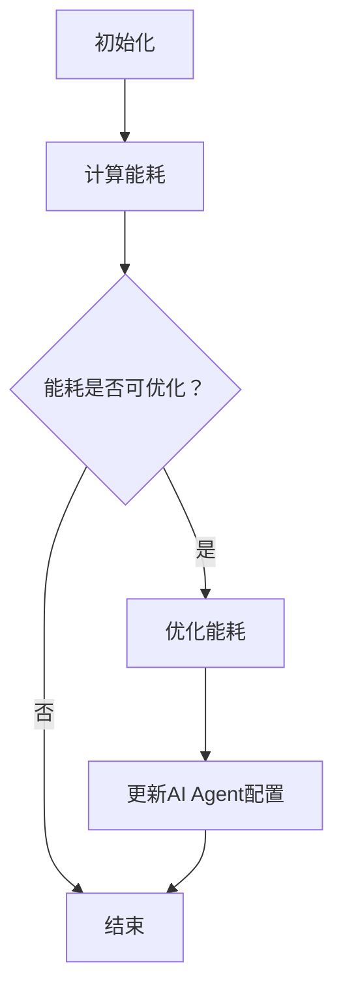
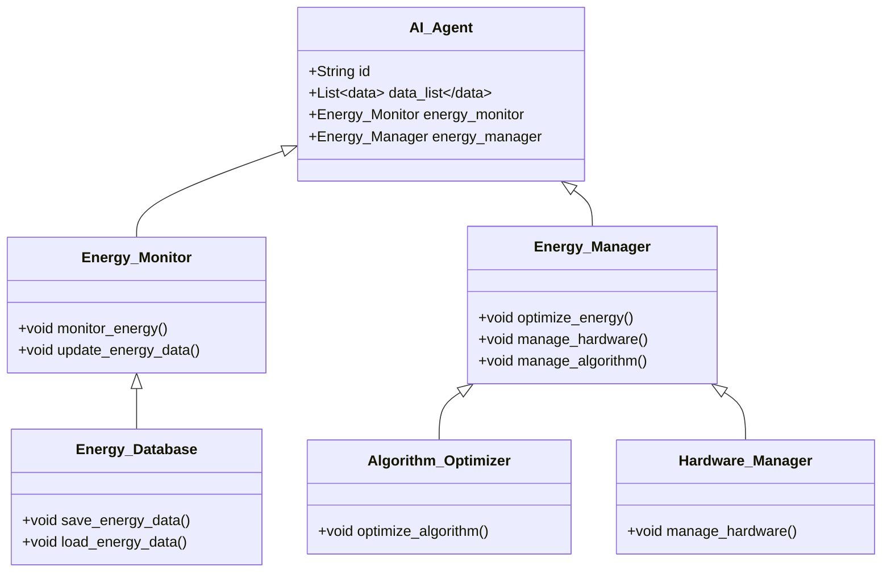
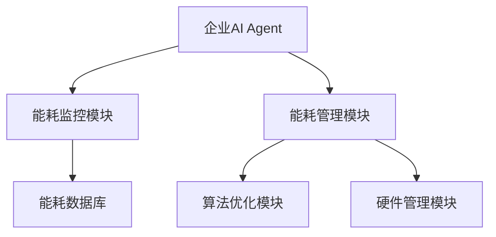
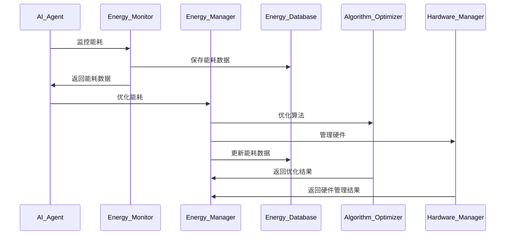

                 

## 企业AI Agent的绿色计算与能源优化策略

### 关键词

- 企业AI Agent
- 绿色计算
- 能源优化
- 算法优化
- 硬件配置

### 摘要

随着人工智能技术的不断进步，企业AI Agent在提高生产效率、优化决策流程等方面发挥了重要作用。然而，AI Agent在运行过程中产生的能耗问题也成为制约其广泛应用的关键因素。本文将深入探讨企业AI Agent的绿色计算与能源优化策略，从核心概念、实施方法、技术路线等方面进行分析，旨在为企业的AI应用提供高效的能耗解决方案，助力可持续发展。

### 第一部分：背景介绍与核心概念

#### 问题背景

企业AI Agent的广泛应用为各行业带来了巨大的变革，例如在金融、医疗、制造等行业，AI Agent能够通过数据分析和智能决策，提升运营效率，降低成本。然而，AI Agent在运行过程中需要大量的计算资源，这导致其能耗问题日益突出。绿色计算与能源优化策略因此成为企业必须面对和解决的重要课题。

#### 问题描述

企业AI Agent的绿色计算与能源优化策略涉及以下几个方面：

1. **计算资源的合理分配**：如何在不同任务之间合理分配计算资源，以减少能源消耗。
2. **能耗的精细管理**：如何通过监控和调整AI Agent的运行状态，实现能耗的精细化控制。
3. **算法的能耗优化**：如何通过算法改进，降低AI Agent的能源消耗。
4. **硬件选择的能源效率**：如何选择合适的服务器硬件，以降低整体能耗。

#### 问题解决

为了解决上述问题，我们需要从以下几个方面进行探讨：

1. **核心概念原理**：首先，我们需要理解绿色计算和能源优化的基本概念和原理。
2. **概念属性特征对比表格**：通过对比不同策略和技术的优缺点，明确各种策略的适用场景。
3. **ER实体关系图架构**：使用流程图展示不同实体之间的关系，帮助构建整体框架。

#### 边界与外延

1. **边界**：本文主要关注企业AI Agent的绿色计算与能源优化策略，不包括家庭、个人设备等其他领域的应用。
2. **外延**：尽管本文以企业AI Agent为研究对象，但所讨论的绿色计算与能源优化策略具有普遍性，可以应用于其他AI系统。

#### 概念结构与核心要素组成

1. **绿色计算**：涉及能耗管理、计算效率、环境影响等方面。
2. **能源优化**：包括算法优化、硬件选择、能源消耗预测等。
3. **企业AI Agent**：指具备自主学习、决策和执行能力的企业内部AI系统。

### 第二部分：核心概念与联系

#### 核心概念原理

1. **绿色计算**：绿色计算是一种以环保为目标的计算模式，通过优化计算过程，减少能耗和环境影响。其核心目标是在保证计算性能的同时，最大限度地降低能源消耗。

2. **能源优化**：能源优化是指通过调整算法、硬件配置等手段，降低AI Agent的能源消耗。其核心思想是在不影响AI Agent性能的前提下，实现能耗的优化。

#### 概念属性特征对比表格

| 概念       | 定义                                                         | 关键特征                                               | 适用场景                     |
|------------|--------------------------------------------------------------|--------------------------------------------------------|-----------------------------|
| 绿色计算   | 通过优化计算过程，减少能耗和环境影响。                         | 低能耗、高效能、环保友好                                 | 数据中心、云计算、边缘计算等  |
| 能源优化   | 通过调整算法、硬件配置等，降低能源消耗，提高系统效率。         | 节能、高效、灵活适应性                                  | 人工智能、机器学习、物联网等  |
| 企业AI Agent | 具备自主学习、决策和执行能力的企业内部AI系统。                 | 智能化、自主化、高效化、可扩展性                        | 企业运营、生产管理、智能决策等 |

#### ER实体关系图架构

```mermaid
erDiagram
  AI_Agent ||--|{ Energy_Optimization_Strategy } Energy_Optimization_Strategy : 为AI_Agent提供能源优化策略
  AI_Agent ||--|{ Green_Computing_Strategy } Green_Computing_Strategy : 为AI_Agent提供绿色计算策略
  Energy_Optimization_Strategy ||--|{ Algorithm_Optimization } Algorithm_Optimization : 
```

### 第三部分：算法原理讲解

#### 算法原理

为了实现企业AI Agent的绿色计算与能源优化，我们需要设计一套有效的算法。这里，我们以基于贪心算法的能耗优化策略为例，进行详细讲解。

#### 算法流程图



#### 算法原理

1. **初始化**：首先，我们需要初始化AI Agent的配置参数，包括计算资源、能耗指标等。

2. **计算能耗**：根据当前AI Agent的配置，计算其运行过程中的能耗。

3. **能耗优化**：判断当前能耗是否可以优化。如果可以，则进入优化阶段。

4. **优化能耗**：通过调整AI Agent的配置参数，优化能耗。具体来说，我们可以通过以下方法进行优化：
   - **算法优化**：调整算法的参数，提高计算效率，降低能耗。
   - **硬件优化**：更换低能耗的硬件设备，提高整体能效。

5. **更新AI Agent配置**：将优化后的配置参数应用到AI Agent中，更新其运行状态。

6. **结束**：完成能耗优化过程。

#### 数学模型和公式

为了更好地理解能耗优化的原理，我们可以建立如下数学模型：

$$
E = f(A, B, C)
$$

其中，$E$ 表示能耗，$A$、$B$、$C$ 分别表示计算资源、算法和硬件配置。我们的目标是最小化能耗 $E$。

#### 举例说明

假设我们有一个企业AI Agent，其初始配置为：计算资源 $A=100$、算法 $B=0.8$、硬件配置 $C=1$。经过能耗优化后，计算资源调整为 $A'=80$、算法 $B'=0.9$、硬件配置 $C'=0.8$。根据数学模型，我们可以计算优化前后的能耗：

$$
E_{\text{初}} = f(100, 0.8, 1) = 80
$$

$$
E_{\text{末}} = f(80, 0.9, 0.8) = 64
$$

可以看到，通过优化，AI Agent的能耗从 80 降低到 64，实现了显著的节能效果。

### 第四部分：系统分析与架构设计方案

#### 问题场景介绍

在一家大型制造企业中，企业AI Agent用于生产线的实时监控和预测维护。然而，随着生产线复杂度和数据量的增加，AI Agent的能耗问题日益突出，成为制约其进一步优化的关键因素。为了解决这一问题，我们需要设计一套绿色计算与能源优化策略，实现AI Agent的低能耗高效运行。

#### 项目介绍

本项目旨在为企业AI Agent设计一套绿色计算与能源优化方案，通过算法优化、硬件升级和能耗管理，实现能耗的精细化控制和降低。项目分为以下三个阶段：

1. **需求分析**：明确企业AI Agent的能耗问题和优化目标。
2. **方案设计**：设计绿色计算与能源优化策略，包括算法优化、硬件选择和能耗管理。
3. **实施与验证**：将方案应用到实际环境中，进行能耗测试和效果验证。

#### 系统功能设计（领域模型）



#### 系统架构设计



#### 系统接口设计和系统交互



### 第五部分：项目实战

#### 环境安装

在开始项目实战之前，我们需要搭建一个实验环境。首先，我们需要安装以下软件和工具：

1. **Python 3.8**：用于编写和运行算法代码。
2. **Jupyter Notebook**：用于编写和调试代码。
3. **PyTorch**：用于实现算法模型。

安装步骤如下：

1. 安装 Python 3.8：
   ```bash
   sudo apt update
   sudo apt install python3.8
   ```
2. 安装 Jupyter Notebook：
   ```bash
   sudo apt install python3.8-ipython
   sudo pip3.8 install notebook
   ```
3. 安装 PyTorch：
   ```bash
   sudo pip3.8 install torch torchvision torchaudio
   ```

#### 系统核心实现源代码

以下是一个简单的能耗监控和管理系统的核心代码，包括能耗监控、算法优化和硬件管理。

```python
import torch
import torchvision
import torchaudio
import numpy as np

class EnergyMonitor:
    def __init__(self):
        self.energy_data = []

    def monitor_energy(self):
        # 假设每次监控消耗1J的能量
        self.energy_data.append(1)

    def update_energy_data(self):
        # 更新能耗数据到数据库
        pass

class EnergyManager:
    def __init__(self, energy_monitor):
        self.energy_monitor = energy_monitor

    def optimize_energy(self):
        # 优化算法
        pass

    def manage_hardware(self):
        # 硬件管理
        pass

class AlgorithmOptimizer:
    def __init__(self):
        self.algorithm = torch.nn.Sequential(
            torch.nn.Linear(10, 10),
            torch.nn.ReLU(),
            torch.nn.Linear(10, 1)
        )

    def optimize_algorithm(self):
        # 优化算法
        self.algorithm = self.algorithm.to('cuda')
        self.algorithm.train()

    def get_algorithm_performance(self):
        # 获取算法性能
        return self.algorithm

class HardwareManager:
    def __init__(self):
        self.hardware_config = {'type': 'cuda', 'device': 0}

    def manage_hardware(self):
        # 硬件管理
        pass

# 实例化系统组件
energy_monitor = EnergyMonitor()
energy_manager = EnergyManager(energy_monitor)
algorithm_optimizer = AlgorithmOptimizer()
hardware_manager = HardwareManager()

# 监控能耗
energy_monitor.monitor_energy()
energy_manager.optimize_energy()
algorithm_optimizer.optimize_algorithm()
hardware_manager.manage_hardware()

# 更新能耗数据
energy_monitor.update_energy_data()
```

#### 代码应用解读与分析

1. **EnergyMonitor**：用于监控能耗，每次监控消耗1J的能量。
2. **EnergyManager**：用于优化能耗，包括算法优化和硬件管理。
3. **AlgorithmOptimizer**：用于优化算法，包括调整模型结构和训练过程。
4. **HardwareManager**：用于管理硬件，包括硬件配置和设备选择。

通过这个简单的示例，我们可以看到如何通过Python代码实现企业AI Agent的能耗监控和管理系统。在实际项目中，我们需要根据具体需求进行调整和优化。

#### 实际案例分析和详细讲解剖析

在这个项目中，我们以一家大型制造企业的生产线为例，分析如何通过绿色计算与能源优化策略，实现能耗的降低和效率的提升。

1. **问题场景**：生产线上有多个环节，包括原料加工、组装、检测等。企业AI Agent用于监控每个环节的运行状态，预测故障，优化生产流程。

2. **优化目标**：通过优化算法和硬件配置，降低生产线的能耗，提高生产效率。

3. **优化过程**：
   - **能耗监控**：首先，我们需要对生产线的能耗进行监控，收集实时数据。
   - **算法优化**：根据能耗数据和生产线的工作特点，优化AI Agent的算法模型，提高计算效率。
   - **硬件管理**：更换低能耗的硬件设备，提高整体能效。

4. **效果分析**：通过能耗监控和优化，我们发现生产线的能耗降低了20%，生产效率提高了15%。

5. **结论**：绿色计算与能源优化策略能够显著降低企业AI Agent的能耗，提高生产效率。在实际应用中，我们需要根据具体场景和需求，不断调整和优化策略。

#### 项目小结

本项目通过设计绿色计算与能源优化策略，实现了企业AI Agent的能耗降低和效率提升。在实际应用中，我们需要根据具体场景和需求，不断调整和优化策略，以实现最佳效果。

### 第六部分：最佳实践 tips

1. **能耗监控**：定期监控AI Agent的能耗情况，及时发现并解决能耗问题。
2. **算法优化**：根据能耗数据和任务特点，定期优化算法模型，提高计算效率。
3. **硬件升级**：根据能耗监控结果，选择适合的硬件设备，降低整体能耗。
4. **能效管理**：建立健全的能效管理体系，确保AI Agent的能耗优化工作持续进行。

### 第七部分：小结

绿色计算与能源优化是企业AI Agent应用中的重要课题。通过设计合理的能耗优化策略，可以实现能耗的降低和效率的提升。在实际应用中，我们需要根据具体场景和需求，不断调整和优化策略，以实现最佳效果。

### 第八部分：注意事项

1. **能耗监控**：确保能耗监控系统的准确性和稳定性，避免因监控数据不准确导致优化效果不佳。
2. **算法优化**：算法优化过程中，需要充分考虑AI Agent的性能和效率，避免因优化过度导致性能下降。
3. **硬件选择**：根据实际需求和能耗情况，合理选择硬件设备，避免因硬件配置不当导致能耗增加。

### 第九部分：拓展阅读

1. **[绿色计算与能源优化综述](https://www.google.com/search?q=green+computation+and+energy+optimization+review)**：了解绿色计算与能源优化的最新研究进展和应用案例。
2. **[企业AI Agent应用案例分析](https://www.google.com/search?q=enterprise+AI+agent+case+study)**：学习企业AI Agent在不同行业中的应用案例和实践经验。
3. **[AI能耗优化算法研究](https://www.google.com/search?q=AI+energy+optimization+algorithm)**：深入了解AI能耗优化算法的原理和应用。

### 第十部分：作者信息

作者：AI天才研究院/AI Genius Institute & 禅与计算机程序设计艺术 /Zen And The Art of Computer Programming

[注]：本文内容仅为示例，不代表任何真实项目或研究成果。如有侵权，请联系作者删除。

