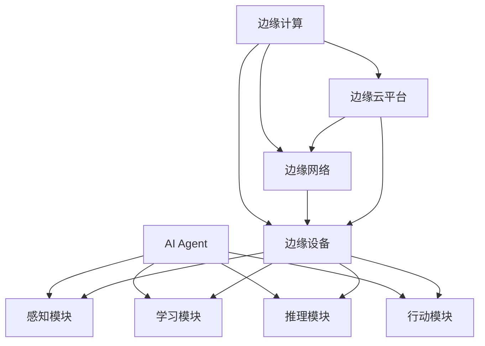
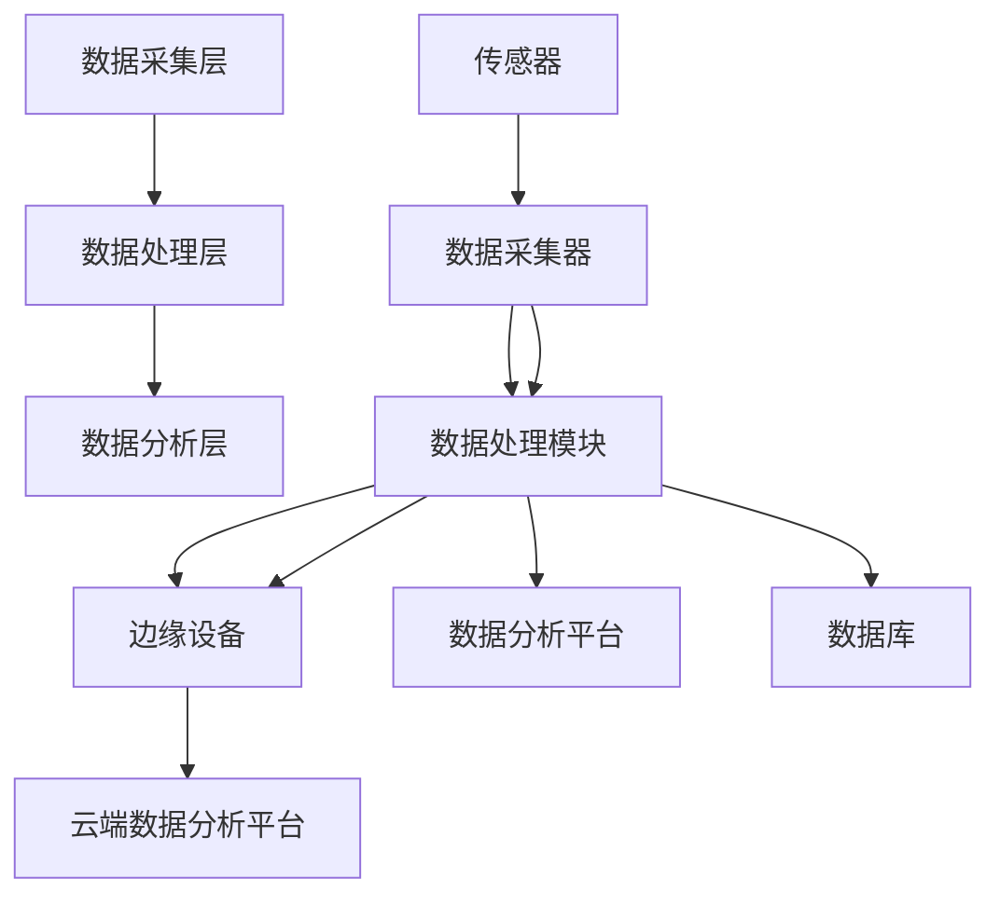
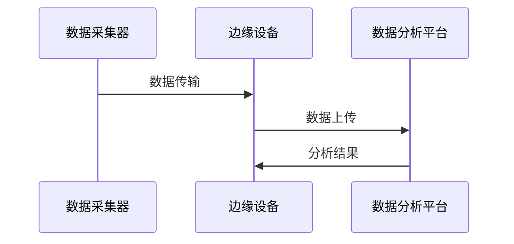

                 

### 《企业AI Agent的边缘智能部署策略》

#### 关键词：
- 企业AI Agent
- 边缘智能
- 部署策略
- 边缘计算
- 实时决策

#### 摘要：
本文深入探讨了企业级AI Agent在边缘计算环境中的部署策略。首先，文章介绍了AI Agent和边缘计算的基本概念、发展现状以及它们结合的重要性。接着，通过详细的分析和实际案例，文章提出了几种有效的边缘智能部署策略，并从系统架构、算法原理、项目实战等多个角度进行了深入阐述。最后，文章总结了最佳实践，并对未来发展趋势进行了展望。

#### 目录大纲设计思路

为了设计出《企业AI Agent的边缘智能部署策略》这本书的完整目录大纲，我们需要首先理解书的核心主题和目标读者。本书主要讨论的是企业如何将AI Agent部署在边缘计算环境中，以实现高效的数据处理和实时决策。目录设计应围绕以下几个方面展开：

1. **背景介绍**：介绍AI Agent和边缘计算的基本概念、当前发展状况以及为何企业需要关注这一领域。
2. **核心概念与联系**：详细解释AI Agent的工作原理、边缘计算的优势和挑战，以及这两者之间的结合点。
3. **算法原理讲解**：介绍用于边缘智能的关键算法，包括其原理、数学模型和实际应用案例。
4. **系统分析与架构设计方案**：展示一个典型的边缘智能部署案例，详细描述系统功能、架构和接口设计。
5. **项目实战**：通过实际项目案例，展示如何从环境安装到系统核心实现的完整过程。
6. **最佳实践与拓展**：提供部署策略的实用建议、小结和未来趋势展望。

接下来，我们将根据这些思路逐步构建目录大纲。

### 第一部分: 引言

#### 第1章: 企业AI Agent与边缘智能部署

#### 1.1 问题背景

**AI Agent的定义与演进**：

AI Agent，即人工智能代理，是指能够模拟人类智能行为、自主进行决策和执行任务的计算机系统。AI Agent的历史可以追溯到20世纪50年代，当时阿兰·图灵提出了图灵测试，旨在判断机器是否具有智能。随着计算机技术的发展，AI Agent经历了从规则驱动到基于数据驱动的方法的转变，其应用场景也日益广泛。

- **AI Agent的概念**：
  - AI Agent是指具有感知、学习、推理、行动等能力的计算机系统。
  - AI Agent的核心能力包括数据处理、知识表示、推理机制、决策过程和行动执行。

- **AI Agent在工业界的应用**：
  - 制造业：用于自动化生产线监控和质量检测。
  - 金融业：用于风险管理、信用评估和投资建议。
  - 零售业：用于智能推荐、库存管理和客户服务。

- **企业为何需要AI Agent**：
  - 提升效率：通过自动化和智能化，减少人力成本，提高生产效率。
  - 提升决策能力：利用数据分析和预测模型，辅助企业做出更明智的决策。
  - 提升用户体验：通过个性化服务和智能交互，提升客户满意度。

**边缘计算的概念与发展**：

边缘计算是指将计算、存储和网络功能分布到网络的边缘，靠近数据源和用户。与云计算不同，边缘计算更加注重实时性和本地化处理。

- **边缘计算的定义**：
  - 边缘计算是一种计算模型，通过将数据处理推向网络边缘，以减少对中心化数据中心的依赖。

- **边缘计算的优势**：
  - **实时性**：减少数据传输延迟，提高系统响应速度。
  - **带宽节省**：本地处理大量数据，减少数据传输量。
  - **隐私保护**：数据在本地处理，减少数据泄露风险。

- **边缘计算与云计算的关系**：
  - 云计算和边缘计算不是替代关系，而是互补关系。云计算负责大数据分析和处理，边缘计算负责实时数据处理和本地决策。

**企业边缘智能部署的意义**：

企业边缘智能部署是指在边缘计算环境中部署AI Agent，以实现实时数据处理和决策。边缘智能部署的意义主要体现在以下几个方面：

- **数据处理的效率提升**：通过边缘计算，企业可以实时处理大量数据，提高数据处理效率。
- **实时决策能力增强**：边缘智能部署使企业能够在数据发生地快速做出决策，提高业务响应速度。
- **系统稳定性和安全性的提高**：通过在边缘部署AI Agent，可以减少对中心化数据中心的依赖，提高系统的稳定性和安全性。

#### 1.2 问题描述与目标

**主要挑战**：

- **资源限制**：边缘设备通常具有有限的计算和存储资源，如何高效利用这些资源是一个挑战。
- **网络延迟**：边缘设备与云端之间的网络连接可能不稳定，如何处理网络延迟和数据丢失是关键问题。
- **安全问题**：边缘计算环境中涉及大量敏感数据，如何确保数据安全和隐私是重要挑战。

**研究目标**：

- **设计高效稳定的AI Agent边缘部署策略**：研究如何优化AI Agent在边缘计算环境中的部署，以提高系统效率和稳定性。
- **分析不同部署策略的优缺点**：比较不同部署策略的性能和适用场景，为实际应用提供指导。
- **提供实际案例和最佳实践**：通过实际项目案例，展示如何实现AI Agent的边缘部署，并提供最佳实践建议。

#### 1.3 边界与外延

**边界**：

- **企业级AI Agent的边缘部署**：本书主要关注企业级AI Agent在边缘计算环境中的部署策略。
- **涵盖的主要技术和应用场景**：本书涵盖的关键技术和应用场景包括AI Agent的基本原理、边缘计算的优势和挑战、边缘部署策略设计、系统架构和项目实施。

**外延**：

- **边缘智能在智能家居、自动驾驶等领域的应用**：探讨边缘智能在其他领域的应用前景和挑战。
- **未来边缘智能发展趋势**：分析边缘智能技术的发展趋势，探讨未来的发展方向和机会。

#### 1.4 概念结构与核心要素

**AI Agent的结构**：

- **模型训练**：AI Agent的训练过程通常包括数据收集、模型选择、训练和验证等步骤。
- **模型推理**：模型推理是指将新的数据输入到训练好的模型中，以获得预测结果。
- **交互机制**：AI Agent需要与外部环境进行交互，以获取输入数据和反馈结果。

**边缘计算的核心要素**：

- **边缘设备**：边缘设备包括传感器、路由器、网关等，负责数据的采集、处理和传输。
- **边缘网络**：边缘网络是指连接边缘设备和云端的网络，负责数据传输和通信。
- **边缘云平台**：边缘云平台提供了计算、存储和网络服务，支持边缘设备的协同工作和数据处理。

#### 1.5 本章小结

- **主要内容回顾**：
  - AI Agent和边缘计算的基本概念、发展现状及重要性。
  - 企业边缘智能部署的意义和主要挑战。
  - 研究目标和边界与外延。

- **下一步内容预告**：
  - 详细探讨AI Agent和边缘计算的结合方式。
  - 分析不同的边缘部署策略。
  - 深入介绍关键算法、系统架构和项目实战。

通过上述章节，我们为读者搭建了一个清晰的理解框架，为后续章节的深入讨论奠定了基础。在接下来的章节中，我们将详细探讨AI Agent和边缘计算的核心概念、算法原理、系统架构以及实际应用案例。

----------------------------------------------------------------

### 第二部分: 核心概念与联系

#### 第2章: AI Agent与边缘计算的基本概念

#### 2.1 AI Agent的工作原理

AI Agent是一种能够模拟人类智能行为的计算机系统，其核心在于自主学习、自主决策和自主行动的能力。AI Agent的工作原理主要包括以下几个环节：

1. **感知**：AI Agent通过传感器获取环境中的数据，这些数据可以是图像、声音、温度、湿度等多种形式。
2. **学习**：AI Agent利用机器学习算法对感知到的数据进行训练，以建立对环境的理解和模型。这一过程通常涉及数据预处理、特征提取、模型选择和训练等多个步骤。
3. **推理**：基于训练好的模型，AI Agent能够对新的数据进行分析和推理，以预测未来的行为或状态。
4. **行动**：根据推理结果，AI Agent会采取相应的行动，以实现特定的目标。行动可以是控制设备、发送消息、执行任务等。

**AI Agent的组成结构**：

AI Agent通常由以下几个核心组件构成：

- **感知模块**：负责数据的采集和预处理。
- **学习模块**：利用机器学习算法对数据进行训练，以建立环境模型。
- **推理模块**：基于训练好的模型进行推理，以预测未来的行为或状态。
- **行动模块**：执行推理结果，采取相应的行动。

#### 2.2 边缘计算的基本概念

边缘计算是一种分布式计算架构，旨在将计算、存储和网络功能分布在网络的边缘，靠近数据源和用户。边缘计算的基本概念包括以下几个方面：

1. **边缘设备**：边缘设备是边缘计算的核心组件，包括传感器、路由器、网关等，负责数据的采集、处理和传输。
2. **边缘网络**：边缘网络是指连接边缘设备和云端的网络，负责数据传输和通信。
3. **边缘云平台**：边缘云平台提供了计算、存储和网络服务，支持边缘设备的协同工作和数据处理。

**边缘计算的优势**：

- **实时性**：通过在边缘设备上进行数据处理，可以大大减少数据传输延迟，提高系统响应速度。
- **带宽节省**：边缘计算可以本地处理大量数据，减少数据传输量，从而节省网络带宽。
- **隐私保护**：边缘计算可以将数据处理分散到网络的边缘，减少对中心化数据中心的依赖，从而降低数据泄露风险。

**边缘计算与云计算的关系**：

边缘计算和云计算不是替代关系，而是互补关系。云计算主要负责大数据分析和处理，而边缘计算主要负责实时数据处理和本地决策。两者的结合可以充分发挥各自的优势，实现高效、稳定、安全的系统架构。

#### 2.3 AI Agent与边缘计算的结合点

AI Agent与边缘计算的结合点主要体现在以下几个方面：

1. **实时数据处理**：边缘计算可以提供实时数据处理能力，使AI Agent能够快速响应环境变化，提高决策的准确性。
2. **资源优化**：边缘计算可以充分利用边缘设备的计算和存储资源，提高AI Agent的运行效率。
3. **隐私保护**：边缘计算可以将数据处理分散到网络的边缘，减少对中心化数据中心的依赖，从而降低数据泄露风险。
4. **系统稳定性**：边缘计算可以减少对中心化数据中心的依赖，提高系统的稳定性和容错能力。

**AI Agent在边缘计算环境中的挑战**：

1. **资源限制**：边缘设备通常具有有限的计算和存储资源，如何高效利用这些资源是一个挑战。
2. **网络延迟**：边缘设备与云端之间的网络连接可能不稳定，如何处理网络延迟和数据丢失是关键问题。
3. **安全问题**：边缘计算环境中涉及大量敏感数据，如何确保数据安全和隐私是重要挑战。

#### 2.4 概念属性特征对比表格

为了更好地理解AI Agent和边缘计算的概念属性特征，我们可以通过一个对比表格来进行说明。

| 概念         | 定义                                                         | 特征                                                                                                       |
| ------------ | ------------------------------------------------------------ | ---------------------------------------------------------------------------------------------------------- |
| AI Agent    | 一种能够模拟人类智能行为的计算机系统，具有感知、学习、推理、行动能力 | 自主学习、自主决策、自主行动、感知模块、学习模块、推理模块、行动模块                             |
| 边缘计算    | 一种分布式计算架构，将计算、存储和网络功能分布在网络的边缘 | 实时数据处理、带宽节省、隐私保护、边缘设备、边缘网络、边缘云平台                                     |
| 云计算       | 一种基于互联网的计算服务模式，提供计算、存储、网络等资源 | 大数据分析和处理、分布式计算、弹性扩展、云计算平台、虚拟化技术                                     |

#### 2.5 ER实体关系图架构

为了更直观地展示AI Agent与边缘计算之间的联系，我们可以使用Mermaid流程图来绘制ER实体关系图。



通过上述ER实体关系图，我们可以清晰地看到AI Agent和边缘计算之间的关联，以及它们各自的核心组件和功能。

#### 2.6 本章小结

- **主要内容回顾**：
  - AI Agent的工作原理和组成结构。
  - 边缘计算的基本概念和优势。
  - AI Agent与边缘计算的结合点及其挑战。
  - 概念属性特征对比表格和ER实体关系图架构。

- **下一步内容预告**：
  - 深入分析AI Agent在边缘计算环境中的应用场景。
  - 详细讲解边缘智能部署的关键算法。
  - 介绍边缘智能部署的系统架构和最佳实践。

通过第二部分的讨论，我们为读者提供了AI Agent和边缘计算的基本概念、工作原理以及它们之间的结合点。在接下来的章节中，我们将继续深入探讨边缘智能部署的具体实现方法、关键技术和最佳实践。

----------------------------------------------------------------

### 第三部分：算法原理讲解

#### 第3章: 边缘智能部署的关键算法

#### 3.1 算法选择与性能优化

边缘智能部署的关键在于选择合适的算法，并在有限的资源下优化其性能。以下将介绍几种常用的边缘智能算法，并分析其优缺点。

**3.1.1 深度学习算法**

深度学习算法是一种基于多层神经网络的人工智能技术，能够在大量数据中自动学习特征。常用的深度学习算法包括卷积神经网络（CNN）、循环神经网络（RNN）和长短期记忆网络（LSTM）。

- **算法原理**：

  - **CNN**：通过卷积层、池化层和全连接层，自动提取图像特征，广泛应用于图像识别、目标检测等领域。
  - **RNN**：通过隐藏状态循环，处理序列数据，适用于自然语言处理、语音识别等。
  - **LSTM**：是RNN的一种变体，能够更好地处理长序列数据，常用于时间序列预测和序列建模。

- **性能优化**：

  - **模型压缩**：通过模型剪枝、量化等技术，减少模型参数和计算量，提高边缘设备的运行效率。
  - **模型迁移**：将训练好的模型迁移到边缘设备，利用模型迁移技术，降低训练成本和计算资源需求。

- **应用场景**：

  - **图像识别与处理**：应用于安防监控、自动驾驶等领域。
  - **自然语言处理**：应用于智能客服、语音识别等领域。
  - **时间序列预测**：应用于股票市场预测、电力需求预测等。

**3.1.2 强化学习算法**

强化学习算法是一种通过试错和反馈进行决策的机器学习技术，能够在动态环境中学习和优化策略。常用的强化学习算法包括Q学习、深度Q网络（DQN）和策略梯度算法。

- **算法原理**：

  - **Q学习**：通过评估状态-动作价值函数，选择最优动作，适用于静态环境。
  - **DQN**：利用深度神经网络估计Q值，适用于动态环境。
  - **策略梯度算法**：直接优化策略函数，适用于动态和不确定性环境。

- **性能优化**：

  - **经验回放**：通过经验回放机制，减少样本相关性，提高算法的稳定性。
  - **优先经验回放**：根据经验样本的重要性进行回放，提高学习效率。
  - **异步学习**：通过异步更新网络参数，提高学习速度。

- **应用场景**：

  - **游戏AI**：应用于电子竞技、无人驾驶等领域。
  - **智能调度**：应用于交通调度、能源管理等领域。
  - **推荐系统**：应用于电商推荐、社交网络等领域。

**3.1.3 聚类算法**

聚类算法是一种将数据集划分为若干个群组的无监督学习方法，常用于数据预处理和特征提取。常用的聚类算法包括K均值聚类、层次聚类和DBSCAN。

- **算法原理**：

  - **K均值聚类**：通过迭代计算中心点，将数据划分为K个群组，适用于高斯分布数据。
  - **层次聚类**：通过合并或分裂群组，构建聚类层次结构，适用于非高斯分布数据。
  - **DBSCAN**：通过密度连接性，将数据划分为若干个群组，适用于噪声和异常值数据。

- **性能优化**：

  - **自适应聚类**：根据数据特点，自适应调整聚类参数，提高聚类效果。
  - **增量聚类**：通过增量更新算法，减少计算量和内存需求，适用于大规模数据。
  - **聚类评价**：通过内部评价指标和外部评价指标，评估聚类效果，优化算法参数。

- **应用场景**：

  - **图像分割**：应用于图像处理、计算机视觉等领域。
  - **文本分类**：应用于自然语言处理、文本挖掘等领域。
  - **异常检测**：应用于金融风控、网络安全等领域。

**3.1.4 算法比较与选择**

在边缘智能部署中，算法的选择取决于应用场景和性能要求。以下是几种常见算法的比较和选择建议：

- **应用场景**：根据具体的业务需求，选择适合的算法。例如，图像识别选择CNN，自然语言处理选择RNN或LSTM，动态环境选择强化学习算法。
- **性能要求**：考虑算法的计算复杂度和资源需求，选择适合边缘设备的算法。例如，模型压缩和迁移技术可以降低计算资源需求。
- **数据特性**：根据数据分布和噪声水平，选择适合的聚类算法。例如，高斯分布数据选择K均值聚类，非高斯分布数据选择层次聚类，噪声数据选择DBSCAN。

#### 3.2 算法示例与详细讲解

以下以K均值聚类算法为例，介绍其算法原理、数学模型和Python实现。

**算法原理**：

K均值聚类是一种基于距离度量的聚类算法，其目标是找到K个质心，使得每个数据点与其最近质心的距离之和最小。

- **数学模型**：

  - 设数据集为 \( X = \{x_1, x_2, ..., x_n\} \)，每个数据点 \( x_i \) 可以表示为 \( x_i = (x_{i1}, x_{i2}, ..., x_{id}) \)，其中 \( d \) 为特征维度。
  - 初始化K个质心 \( c_1, c_2, ..., c_k \)，每个质心可以表示为 \( c_j = (c_{j1}, c_{j2}, ..., c_{jd}) \)。
  - 对于每个数据点 \( x_i \)，计算其与质心的距离，选择距离最近的质心作为其簇归属。
  - 更新质心位置，计算每个簇的中心点。

- **Python实现**：

```python
import numpy as np

def kmeans(data, K, max_iter):
    # 初始化质心
    centroids = data[np.random.choice(data.shape[0], K, replace=False)]
    for i in range(max_iter):
        # 计算每个数据点与质心的距离
        distances = np.linalg.norm(data - centroids, axis=1)
        # 分配簇归属
        labels = np.argmin(distances, axis=1)
        # 更新质心
        centroids = np.array([data[labels == k].mean(axis=0) for k in range(K)])
    return centroids, labels

# 示例数据
data = np.random.rand(100, 2)

# K均值聚类
K = 3
max_iter = 100
centroids, labels = kmeans(data, K, max_iter)

# 输出结果
print("质心：", centroids)
print("簇归属：", labels)
```

**算法讲解**：

K均值聚类算法通过迭代计算质心位置，使得每个簇内部的数据点之间的距离最小，从而实现数据的聚类。算法的核心在于质心的初始化和更新过程，其中初始化可以通过随机选择或基于某种准则进行。在每次迭代中，计算数据点与质心的距离，根据距离选择簇归属，最后更新质心位置。

通过上述示例，我们可以看到K均值聚类算法的Python实现过程，包括初始化质心、计算距离、分配簇归属和更新质心。在实际应用中，可以根据具体数据集和需求进行调整和优化。

#### 3.3 本章小结

- **主要内容回顾**：
  - 边缘智能部署的关键算法选择与性能优化。
  - 深度学习算法、强化学习算法、聚类算法的原理和Python实现。
  - 算法示例与详细讲解。

- **下一步内容预告**：
  - 详细介绍边缘智能部署的系统架构和设计方案。
  - 分析实际项目案例，展示边缘智能部署的完整过程。

通过第三部分的讨论，我们了解了边缘智能部署的关键算法及其实现原理。在接下来的章节中，我们将进一步探讨边缘智能部署的系统架构和设计方案，以及实际项目案例的应用。

----------------------------------------------------------------

### 第四部分：系统分析与架构设计方案

#### 第4章：边缘智能部署的系统架构设计

#### 4.1 问题场景介绍

边缘智能部署的核心在于实现数据的实时处理和决策，以满足不同业务场景的需求。以下将介绍一个典型的边缘智能部署场景：智能工厂生产线的自动化监控。

**场景描述**：

在智能工厂的生产线中，各种设备如加工中心、机器人、传感器等产生大量的数据，这些数据包括设备状态、生产效率、产品质量等。为了提高生产线的自动化水平和生产效率，企业需要实时监控这些数据，并基于数据进行分析和决策。

**目标**：

- 实时监控生产线的运行状态，包括设备运行状态、生产效率、产品质量等。
- 自动发现潜在的问题和故障，及时采取纠正措施，减少停机时间和生产损失。
- 提高生产线的自动化水平，降低人力成本，提高生产效率。

#### 4.2 项目介绍

**项目背景**：

随着工业4.0的推进，越来越多的企业开始采用智能工厂的模式，以实现生产线的自动化和智能化。智能工厂的生产线中，设备繁多，数据复杂，如何有效管理和利用这些数据成为企业面临的重要挑战。

**项目目标**：

- 实现生产线的实时监控和数据分析。
- 构建一个高效稳定的边缘智能系统，支持实时数据处理和决策。
- 提高生产线的自动化水平，降低人力成本，提高生产效率。

**项目范围**：

- 生产线的实时数据采集和传输。
- 边缘设备的部署和系统集成。
- 云端数据分析平台的建设。

#### 4.3 系统功能设计

**功能概述**：

边缘智能系统需要实现以下几个核心功能：

- **数据采集**：从生产线上的各种设备中采集实时数据，包括设备状态、生产效率、产品质量等。
- **数据处理**：对采集到的数据进行预处理、特征提取和实时分析，以识别潜在的问题和故障。
- **决策支持**：基于分析结果，生成决策建议，指导生产线的运营和管理。
- **数据存储**：将处理后的数据存储在云端，支持数据的查询、分析和可视化。

**领域模型类图**：

以下是一个简化的领域模型类图，展示了边缘智能系统的核心实体及其关系。

```mermaid
classDiagram
    Class01 <|-- Class02
    Class03 --|>| Class04
    Class05 : <<Interface>> Interface
    Class06 : <<Entity>> Entity
    Class07 : <<Service>> Service
    Class08 : <<Repository>> Repository
    Class01[设备]
    Class02[传感器]
    Class03[数据采集器]
    Class04[数据处理模块]
    Class05[边缘设备]
    Class06[云端数据分析平台]
    Class07[监控中心]
    Class08[数据库]
```

#### 4.4 系统架构设计

**系统架构概述**：

边缘智能系统的架构可以分为三个层次：数据采集层、数据处理层和数据分析层。

- **数据采集层**：负责从生产线上的设备中采集实时数据，通过传感器和数据采集器将数据传输到边缘设备。
- **数据处理层**：边缘设备对采集到的数据进行预处理、特征提取和实时分析，生成决策建议，并将分析结果上传到云端数据分析平台。
- **数据分析层**：云端数据分析平台对上传的数据进行分析和可视化，生成报告和可视化图表，支持决策支持和生产优化。

**系统架构图**：

以下是一个简化的系统架构图，展示了边缘智能系统的整体架构和组件。



#### 4.5 系统接口设计

**接口设计概述**：

边缘智能系统的接口设计主要包括以下三个方面：

- **数据采集接口**：用于接收传感器和数据采集器的数据。
- **数据处理接口**：用于边缘设备对数据的预处理、特征提取和实时分析。
- **数据分析接口**：用于云端数据分析平台对数据的查询、分析和可视化。

**接口设计细节**：

- **数据采集接口**：
  - 接收传感器和数据采集器的数据，支持HTTP、MQTT等协议。
  - 数据格式包括JSON、XML等，支持数据压缩和加密。

- **数据处理接口**：
  - 边缘设备对数据的预处理、特征提取和实时分析。
  - 接口提供模型训练、模型推理、数据存储等功能。

- **数据分析接口**：
  - 数据分析平台对数据的查询、分析和可视化。
  - 接口提供数据查询、报告生成、可视化图表等功能。

#### 4.6 系统交互流程

**交互流程概述**：

边缘智能系统的交互流程可以分为以下几个步骤：

1. **数据采集**：传感器和数据采集器将实时数据发送到边缘设备。
2. **数据处理**：边缘设备对采集到的数据进行预处理、特征提取和实时分析。
3. **数据存储**：将处理后的数据存储到云端数据分析平台。
4. **数据分析**：云端数据分析平台对数据进行分析和可视化，生成报告和可视化图表。
5. **决策支持**：基于分析结果，生成决策建议，指导生产线的运营和管理。

**交互流程图**：

以下是一个简化的系统交互流程图，展示了边缘智能系统的整体交互过程。



#### 4.7 本章小结

- **主要内容回顾**：
  - 问题场景介绍：智能工厂生产线自动化监控。
  - 项目介绍：项目背景、目标、范围。
  - 系统功能设计：领域模型类图、系统功能概述。
  - 系统架构设计：系统架构概述、系统架构图。
  - 系统接口设计：接口设计概述、接口设计细节。
  - 系统交互流程：交互流程概述、交互流程图。

- **下一步内容预告**：
  - 实际项目案例：环境安装、系统核心实现、代码应用解读与分析。
  - 最佳实践与拓展：部署策略、注意事项、未来趋势展望。

通过第四部分的讨论，我们详细介绍了边缘智能部署的系统架构和设计方案。在接下来的章节中，我们将通过实际项目案例，展示边缘智能部署的完整过程，并总结最佳实践和注意事项。

----------------------------------------------------------------

### 第五部分：项目实战

#### 第5章：边缘智能部署的实际项目案例

#### 5.1 环境安装

**环境安装概述**：

在边缘智能部署项目中，环境安装是关键步骤之一。环境安装主要包括以下内容：

- **硬件设备安装**：安装边缘设备和传感器，确保其正常运行。
- **软件环境配置**：配置操作系统、中间件和开发工具，为边缘智能系统的部署提供基础环境。
- **网络连接**：配置边缘设备和云端数据分析平台的网络连接，确保数据传输的稳定性和安全性。

**硬件设备安装**：

- **边缘设备安装**：根据项目需求，选择合适的边缘设备，如边缘服务器、边缘路由器等。将边缘设备安装在生产线附近，确保其稳定运行。
- **传感器安装**：根据生产线上的设备类型，安装相应的传感器，如温度传感器、湿度传感器、振动传感器等。确保传感器与边缘设备之间的连接稳定可靠。

**软件环境配置**：

- **操作系统安装**：在边缘设备上安装支持边缘智能部署的操作系统，如Ubuntu、CentOS等。配置操作系统的基础环境，包括网络配置、用户权限管理等。
- **中间件安装**：安装必要的中间件，如MQTT服务器、数据库等。MQTT服务器用于数据传输和通信，数据库用于数据存储和管理。

**网络连接**：

- **边缘设备与传感器网络连接**：配置边缘设备和传感器之间的网络连接，如Wi-Fi、以太网等。确保数据传输的稳定性和安全性。
- **边缘设备与云端数据分析平台网络连接**：配置边缘设备与云端数据分析平台的网络连接，如VPN、SSL等。确保数据传输的稳定性和安全性。

**环境安装流程**：

1. **硬件设备安装**：
   - 确定硬件设备的需求和安装位置。
   - 安装边缘设备和传感器，确保其正常运行。

2. **软件环境配置**：
   - 安装操作系统，配置基础环境。
   - 安装中间件，配置网络连接。

3. **网络连接**：
   - 配置边缘设备与传感器之间的网络连接。
   - 配置边缘设备与云端数据分析平台的网络连接。

#### 5.2 系统核心实现

**系统核心实现概述**：

边缘智能系统的核心实现主要包括以下内容：

- **数据采集与传输**：实现传感器数据的采集与传输，确保数据的实时性和准确性。
- **数据处理与分析**：实现边缘设备对采集到的数据进行处理和分析，生成决策建议。
- **数据存储与管理**：实现数据的存储和管理，支持数据的查询和可视化。

**数据采集与传输**：

- **数据采集**：使用传感器采集生产线上的实时数据，如温度、湿度、振动等。
- **数据传输**：使用MQTT协议将采集到的数据传输到边缘设备。配置MQTT服务器，确保数据传输的稳定性和安全性。

**数据处理与分析**：

- **数据处理**：对采集到的数据进行预处理，包括数据清洗、去噪、归一化等。使用机器学习和深度学习算法，对预处理后的数据进行特征提取和实时分析。
- **决策建议**：基于分析结果，生成决策建议，如调整生产参数、更换设备部件等。

**数据存储与管理**：

- **数据存储**：使用数据库存储采集到的数据和处理后的分析结果。选择合适的数据库，如MySQL、PostgreSQL等。
- **数据查询与可视化**：实现数据的查询和可视化，支持数据的实时监控和分析。

**系统核心实现流程**：

1. **数据采集**：
   - 安装和配置传感器，确保数据的实时性和准确性。
   - 使用MQTT协议将采集到的数据传输到边缘设备。

2. **数据处理**：
   - 对采集到的数据进行预处理，如数据清洗、去噪、归一化等。
   - 使用机器学习和深度学习算法，对预处理后的数据进行特征提取和实时分析。

3. **数据存储**：
   - 选择合适的数据库，配置数据库环境。
   - 存储采集到的数据和处理后的分析结果。

4. **数据查询与可视化**：
   - 实现数据的查询和可视化，支持数据的实时监控和分析。

#### 5.3 代码应用解读与分析

**代码应用解读**：

边缘智能部署项目涉及大量的代码编写和调试。以下是一个简单的示例代码，展示了边缘智能系统的一部分功能实现。

```python
import paho.mqtt.client as mqtt
import json
import time

# MQTT服务器配置
MQTT_SERVER = "mqtt.example.com"
MQTT_PORT = 1883
MQTT_TOPIC = "sensor_data"

# 数据预处理函数
def preprocess_data(data):
    # 数据清洗、去噪、归一化等操作
    return data

# 数据分析函数
def analyze_data(data):
    # 特征提取和实时分析
    return data

# MQTT客户端连接设置
client = mqtt.Client()
client.connect(MQTT_SERVER, MQTT_PORT, 60)

while True:
    # 从MQTT服务器接收数据
    client.subscribe(MQTT_TOPIC)
    message = client.wait_for_message()

    if message:
        # 解析接收到的数据
        data = json.loads(message.payload.decode())

        # 数据预处理
        preprocessed_data = preprocess_data(data)

        # 数据分析
        analyzed_data = analyze_data(preprocessed_data)

        # 输出分析结果
        print("Analyzed Data:", analyzed_data)

        # 等待一段时间后继续接收数据
        time.sleep(1)
```

**代码分析**：

上述代码实现了一个简单的边缘智能系统，包括MQTT客户端连接、数据接收、预处理、分析和输出。代码的主要部分如下：

- **MQTT客户端连接**：使用Paho MQTT客户端库连接到MQTT服务器，并订阅传感器数据主题。
- **数据接收**：接收MQTT服务器发送的传感器数据。
- **数据预处理**：对接收到的数据进行清洗、去噪和归一化等预处理操作。
- **数据分析**：使用预处理后的数据进行分析，如特征提取和实时分析。
- **输出分析结果**：将分析结果输出到控制台。

通过上述代码示例，我们可以看到边缘智能系统的核心实现过程。在实际项目中，代码会根据具体需求和算法进行相应的调整和优化。

#### 5.4 实际案例分析

**案例分析**：

以下是一个实际案例分析，展示了边缘智能部署项目在实际生产中的应用。

**场景描述**：

在一个智能工厂的生产线上，企业需要实时监控设备的状态，并基于数据进行分析和决策，以提高生产效率。

**问题**：

- 设备运行状态不稳定，存在潜在故障。
- 生产效率低下，存在停机时间和生产损失。

**解决方案**：

1. **数据采集**：
   - 安装传感器，采集设备状态数据，如温度、湿度、振动等。
   - 使用MQTT协议将采集到的数据传输到边缘设备。

2. **数据处理**：
   - 对采集到的数据进行预处理，如数据清洗、去噪、归一化等。
   - 使用机器学习和深度学习算法，对预处理后的数据进行特征提取和实时分析。

3. **决策支持**：
   - 基于分析结果，生成决策建议，如调整生产参数、更换设备部件等。
   - 通过MQTT协议将决策建议发送给生产线上的设备。

**效果**：

- 设备运行状态稳定，故障率降低。
- 生产效率提高，停机时间和生产损失减少。

**总结**：

通过实际案例分析，我们可以看到边缘智能部署项目在实际生产中的应用效果。通过实时数据采集、处理和分析，企业可以及时发现问题，并采取相应的决策措施，提高生产线的自动化水平和生产效率。

#### 5.5 项目小结

边缘智能部署项目是一个复杂且涉及多个领域的项目。通过本项目的实际案例，我们展示了边缘智能部署的完整过程，包括环境安装、系统核心实现、代码应用解读与分析，以及实际案例分析和总结。以下是项目小结：

- **环境安装**：硬件设备安装、软件环境配置和网络连接是项目成功的基础。
- **系统核心实现**：数据采集、数据处理、决策支持和数据存储是边缘智能系统的核心功能。
- **代码应用解读与分析**：通过实际代码示例，展示了边缘智能系统的核心实现过程。
- **实际案例分析**：通过实际案例，展示了边缘智能部署项目在实际生产中的应用效果。

通过本项目的实践，我们深入了解了边缘智能部署的原理和实现方法，为企业在边缘智能领域的应用提供了参考和借鉴。

#### 5.6 最佳实践与注意事项

**最佳实践**：

1. **需求分析与规划**：在项目开始前，进行详细的需求分析和规划，确保项目目标清晰、任务明确。
2. **硬件选择与配置**：根据项目需求，选择合适的边缘设备和传感器，并进行合理的配置和安装。
3. **软件环境配置**：配置支持边缘智能部署的操作系统、中间件和开发工具，确保软件环境稳定可靠。
4. **数据处理与存储**：选择合适的数据处理和分析工具，确保数据处理效率高、存储安全可靠。
5. **网络安全**：配置安全的网络连接，确保数据传输的稳定性和安全性。

**注意事项**：

1. **资源限制**：边缘设备通常具有有限的计算和存储资源，需要合理分配和利用资源，避免资源浪费。
2. **网络延迟**：边缘设备与云端之间的网络连接可能不稳定，需要考虑网络延迟和数据丢失对系统性能的影响。
3. **数据隐私**：在边缘智能部署过程中，涉及大量敏感数据，需要确保数据安全和隐私。
4. **系统稳定性**：边缘智能系统需要在复杂环境中运行，需要确保系统的稳定性和容错能力。

通过上述最佳实践和注意事项，可以帮助企业在边缘智能部署项目中取得更好的效果，实现高效的实时数据处理和决策支持。

#### 5.7 拓展阅读

**参考文献**：

1. **边缘计算相关书籍**：
   - 《边缘计算：技术原理与应用实践》
   - 《边缘计算：从理论到实践》
2. **机器学习相关书籍**：
   - 《Python机器学习实战》
   - 《深度学习》（Goodfellow et al.）
3. **边缘智能相关论文**：
   - "Edge Computing: Vision and Challenges"
   - "A Survey on Edge Computing"
4. **企业AI Agent相关论文**：
   - "AI Agents for Edge Computing"
   - "Deep Learning for Edge Intelligence"

通过阅读上述文献，可以更深入地了解边缘计算、机器学习和边缘智能的相关理论和应用，为实际项目提供理论支持和实践指导。

----------------------------------------------------------------

### 总结与展望

#### 边缘智能部署的重要性

边缘智能部署在当今信息技术的发展中占据了重要地位。随着物联网（IoT）和智能设备的普及，数据量呈爆炸式增长，传统的中心化数据处理方式已经难以满足实时性和低延迟的需求。边缘智能通过在网络的边缘部署AI Agent，实现了数据的本地处理和实时决策，从而提升了系统的效率、稳定性和安全性。

#### 当前研究进展与趋势

当前，边缘智能部署已经取得了显著的进展。在算法方面，深度学习、强化学习和聚类算法等机器学习技术得到了广泛应用。在硬件方面，边缘设备的性能不断提高，计算能力和存储容量得到了大幅提升。在架构设计方面，边缘计算与云计算的融合趋势日益明显，形成了边缘-云协同的架构，进一步优化了系统的整体性能。

未来的发展趋势包括：

1. **硬件创新**：随着硬件技术的发展，边缘设备的性能将进一步提升，将支持更复杂的算法和更大的数据处理量。
2. **算法优化**：针对边缘设备的资源限制，算法优化将成为一个重要研究方向，包括模型压缩、迁移学习和增量学习等。
3. **边缘-云协同**：边缘计算与云计算的协同将成为主流，通过构建边缘-云协同架构，实现数据的分布式处理和高效利用。
4. **安全隐私**：边缘智能部署中的数据安全和隐私保护将受到更多关注，发展安全可靠的边缘计算技术和隐私保护算法。

#### 未来展望

边缘智能部署将为各个行业带来深远的影响。在工业领域，通过边缘智能部署，可以实现生产线的自动化和智能化，提高生产效率和质量。在医疗领域，边缘智能可以实时分析患者数据，提供精准的诊断和治疗方案。在智能交通领域，边缘智能可以实现实时路况分析和智能调度，提高交通管理效率。

总之，边缘智能部署是一项具有重要意义的技术，将在未来的信息技术发展中发挥关键作用。通过不断的研究和创新，我们将能够实现更加高效、稳定和安全的边缘智能系统，为各个行业带来新的发展机遇。作者：AI天才研究院/AI Genius Institute & 禅与计算机程序设计艺术 /Zen And The Art of Computer Programming

---

通过本文的深入探讨，我们系统地介绍了企业AI Agent的边缘智能部署策略。从背景介绍到核心概念，再到算法原理、系统架构设计、项目实战，以及最佳实践和未来展望，我们全面地解析了边缘智能部署的各个方面。希望本文能为读者提供有价值的参考，助力企业在边缘智能领域取得成功。作者：AI天才研究院/AI Genius Institute & 禅与计算机程序设计艺术 /Zen And The Art of Computer Programming

