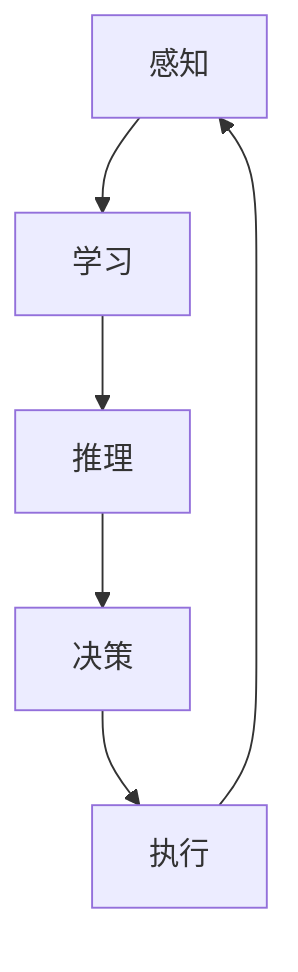
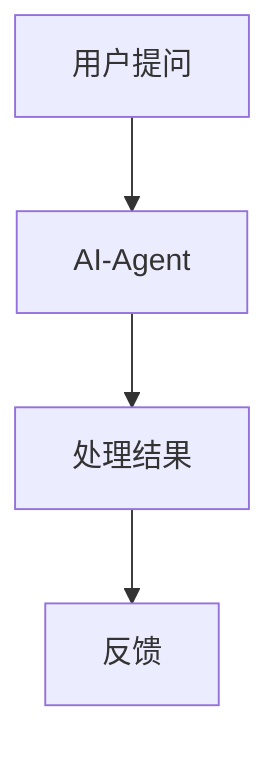
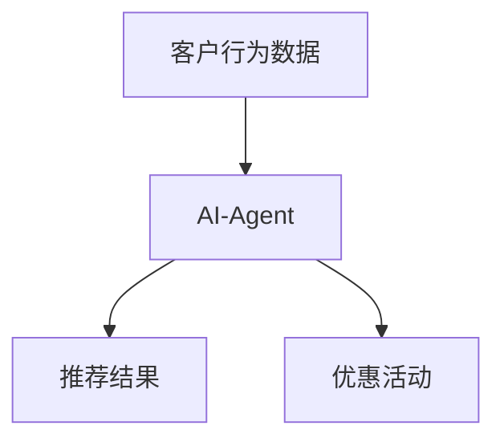
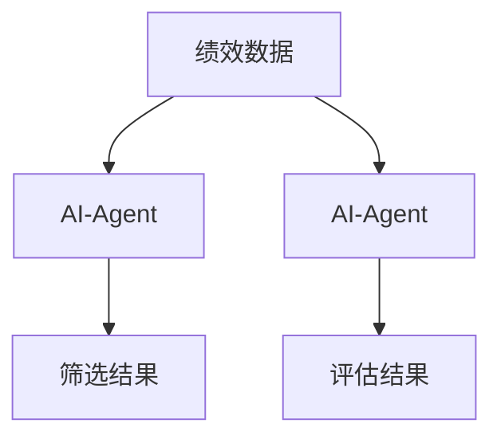
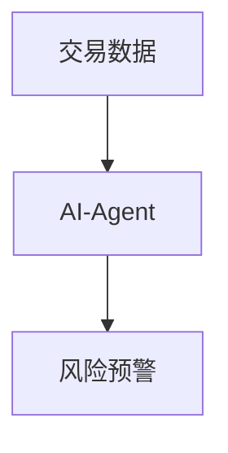

                 


# 企业如何识别AI Agent的应用需求

> 关键词：AI Agent, 企业需求识别, 应用分析, 人工智能, 智能自动化

> 摘要：本文旨在帮助企业理解和识别AI Agent的应用需求。通过详细剖析AI Agent的基本概念、原理、应用领域和案例分析，本文为企业提供了实用的实践指导与策略，以抓住人工智能时代的发展机遇。

## 目录大纲

## 第一部分: 引言与背景

### 1.1 问题背景
- **企业AI应用挑战**
- **AI Agent的概念与功能**

### 1.2 问题描述
- **企业应用AI Agent的需求识别**
- **AI Agent应用的关键要素**

### 1.3 问题解决
- **识别AI Agent应用需求的方法**
- **AI Agent应用的边界与外延**

### 1.4 核心概念与联系
- **AI Agent的基本概念**
- **AI Agent的核心功能**
- **AI Agent与传统自动化工具的对比**
- **AI Agent的ER实体关系图**

### 1.5 本章小结

## 第二部分: 核心概念解析

### 2.1 AI Agent原理与数学模型
- **AI Agent的基本原理**
- **AI Agent的核心数学模型**
- **AI Agent原理的mermaid流程图**
- **AI Agent数学模型详细讲解**
- **AI Agent举例说明**

### 2.2 AI Agent技术演进
- **AI Agent的发展历程**
- **AI Agent的当前技术水平**
- **AI Agent的未来发展趋势**

### 2.3 AI Agent的应用领域
- **AI Agent在客户服务中的应用**
- **AI Agent在营销自动化中的应用**
- **AI Agent在人力资源管理中的应用**
- **AI Agent在金融风控中的应用**

### 2.4 AI Agent的优势与挑战
- **AI Agent的优势**
- **AI Agent的挑战与解决方案**

### 2.5 本章小结

## 第三部分: AI Agent应用案例分析

### 3.1 案例背景
- **案例一：企业客户服务中的应用**
- **案例二：企业营销自动化中的应用**
- **案例三：企业人力资源管理中的应用**
- **案例四：企业金融风控中的应用**

### 3.2 案例实施
- **案例一：识别应用需求**
- **案例二：系统设计与实现**
- **案例三：效果评估与优化**
- **案例四：AI Agent的维护与升级**

### 3.3 案例分析与讲解
- **案例一：客户服务AI Agent案例分析**
- **案例二：营销自动化AI Agent案例分析**
- **案例三：人力资源AI Agent案例分析**
- **案例四：金融风控AI Agent案例分析**

### 3.4 本章小结

## 第四部分: 实践指导与策略

### 4.1 AI Agent应用策略
- **企业识别AI Agent应用需求的策略**
- **AI Agent应用的实施步骤**
- **AI Agent应用的维护与优化策略**

### 4.2 最佳实践与技巧
- **成功案例中的最佳实践**
- **实施AI Agent应用时的注意事项**
- **AI Agent应用中的常见问题与解决方法**

### 4.3 小结与展望
- **AI Agent应用的现状与趋势**
- **未来发展方向与挑战**
- **对企业发展的启示与建议**

### 4.4 本章小结

## 目录小结

本书从企业识别AI Agent的应用需求出发，全面介绍了AI Agent的基本概念、原理、应用领域、案例分析以及实践指导。通过本书的阅读，企业可以系统地了解AI Agent的各个方面，并掌握识别和应用AI Agent的方法和策略，从而在人工智能时代中抓住机遇，提升竞争力。

本书结构合理，内容丰富，既涵盖了理论知识的深入讲解，也提供了实际的案例分析和实践经验。通过系统的学习和实践，企业可以更好地理解和应用AI Agent，实现智能化转型和业务增长。

读者对象：
- 企业管理层和决策者，希望了解和推动AI Agent
- 技术团队，希望深入学习和应用AI Agent
- 人工智能爱好者，希望探索AI Agent的潜力与价值

----------------------------------------------------------------

### 第一部分: 引言与背景

#### 1.1 问题背景

在当今的商业环境中，企业面临着日益激烈的竞争和快速变化的市场需求。为了保持竞争力，许多企业开始将目光投向人工智能（AI）技术，特别是AI Agent。AI Agent是一种能够模拟人类行为和思维的智能体，通过自主学习、推理和决策，帮助企业自动化复杂的业务流程，提高效率，降低成本。

然而，企业在应用AI Agent时面临着诸多挑战。首先，AI Agent技术相对较新，企业在选择和实施时可能会遇到技术障碍。其次，如何识别并确定AI Agent的应用需求，是企业成功应用AI的关键。此外，企业在AI Agent的应用过程中还需要关注数据安全、隐私保护等问题。

#### 1.1.1 企业在AI应用中的挑战

1. **技术挑战**：AI技术复杂，企业需要具备一定的技术储备和专业人才。
2. **数据挑战**：高质量的数据是AI Agent高效运行的基础，但企业往往面临数据质量不佳、数据分散等问题。
3. **人才挑战**：AI专业人才短缺，企业难以招聘到具备AI技术能力的员工。
4. **成本挑战**：AI应用初期投资较大，企业需要权衡成本与收益。

#### 1.1.2 AI Agent的概念与功能

**AI Agent的概念**：AI Agent是基于人工智能技术的智能体，它能够在复杂的环境中自主执行任务，具有感知、学习、推理和决策能力。

**AI Agent的功能**：
1. **感知**：通过传感器、数据接口等获取环境信息。
2. **学习**：从数据中学习，优化自身行为。
3. **推理**：基于规则和模式进行逻辑推理。
4. **决策**：根据目标，选择最优行动方案。
5. **交互**：与人或其他系统进行自然语言交流。

#### 1.2 问题描述

**企业应用AI Agent的需求识别**：企业需要在大量业务场景中识别出哪些环节适合应用AI Agent，如何确定AI Agent的应用需求，是企业成功应用AI Agent的关键。

**AI Agent应用的关键要素**：
1. **业务目标**：明确企业应用AI Agent的目的是什么，希望达到什么样的效果。
2. **数据支持**：确保有足够高质量的数据供AI Agent学习和优化。
3. **技术能力**：企业需具备一定的AI技术基础，包括算法、模型选择和开发能力。
4. **实施策略**：制定合理的AI Agent应用策略，包括需求识别、系统设计、实施和维护。

#### 1.3 问题解决

**识别AI Agent应用需求的方法**：通过业务需求分析、数据分析和技术评估，帮助企业识别出AI Agent的应用场景和需求。

**AI Agent应用的边界与外延**：明确AI Agent应用的范围，包括哪些业务流程、哪些部门可以使用AI Agent，以及如何与其他系统进行集成。

#### 1.4 核心概念与联系

**AI Agent的基本概念**：AI Agent是一种基于人工智能技术的自主执行任务的智能体，能够模拟人类的感知、学习、推理和决策过程。

**AI Agent的核心功能**：感知、学习、推理、决策、交互。

**AI Agent与传统自动化工具的对比**：传统自动化工具主要依靠预设的规则和流程执行任务，而AI Agent则通过学习和适应环境，实现更灵活的自动化。

**AI Agent的ER实体关系图**：展示AI Agent相关的实体及其关系，如图1-1所示。

```mermaid
erDiagram
  AI-Agent ||--|{ Data-Set } Data-Set
  AI-Agent ||--|{ User-Interface } User-Interface
  AI-Agent ||--|{ Business-Logic } Business-Logic
  AI-Agent ||--|{ Machine-Learning-Model } Machine-Learning-Model
```

#### 1.4.5 AI Agent的核心功能

AI Agent的核心功能主要包括感知、学习、推理、决策和交互。

- **感知**：AI Agent通过传感器、摄像头、麦克风等设备获取环境信息，如文本、图像、语音等。
- **学习**：AI Agent通过机器学习和深度学习技术，从数据中学习，优化自身的行为和决策。
- **推理**：AI Agent基于规则库和逻辑推理，分析数据，得出结论。
- **决策**：AI Agent根据学习结果和目标，选择最优的行动方案。
- **交互**：AI Agent通过自然语言处理技术，与用户进行自然语言交互。

#### 1.4.6 AI Agent与传统自动化工具的对比

| 对比项        | AI Agent                        | 传统自动化工具                      |
| ----------- | ------------------------------ | --------------------------------- |
| 基于规则      | 自适应、自主决策                 | 预设规则、固定流程                  |
| 学习与进化      | 能从数据中学习，自我优化         | 无法学习，只能执行预设任务            |
| 适应环境      | 能适应复杂多变的环境             | 只能在特定的环境下执行任务            |
| 智能交互      | 能与用户进行自然语言交互         | 无法实现智能交互，依赖用户输入          |

#### 1.4.7 AI Agent的ER实体关系图

为了更好地理解AI Agent的结构，我们通过ER（实体关系）图展示了AI Agent相关的实体及其关系。如图1-1所示：

```mermaid
erDiagram
  AI-Agent ||--|{ Data-Set } Data-Set
  AI-Agent ||--|{ User-Interface } User-Interface
  AI-Agent ||--|{ Business-Logic } Business-Logic
  AI-Agent ||--|{ Machine-Learning-Model } Machine-Learning-Model
```

- **AI-Agent**：代表AI智能体。
- **Data-Set**：代表数据集，是AI-Agent学习的基础。
- **User-Interface**：代表用户界面，用于与用户交互。
- **Business-Logic**：代表业务逻辑，用于处理业务数据。
- **Machine-Learning-Model**：代表机器学习模型，用于预测和决策。

#### 1.5 本章小结

本章节主要介绍了企业应用AI Agent的背景和挑战，并明确了识别AI Agent应用需求的重要性。通过了解AI Agent的基本概念、功能以及与传统自动化工具的对比，企业可以更好地把握AI Agent的优势和应用范围。同时，通过ER实体关系图，对企业识别AI Agent的应用需求提供了直观的指导。接下来，我们将进一步深入探讨AI Agent的核心概念和原理。

----------------------------------------------------------------

## 第二部分：核心概念解析

### 2.1 AI Agent原理与数学模型

#### 2.1.1 AI Agent的基本原理

AI Agent是基于人工智能技术的自主智能体，能够模拟人类的感知、学习、推理和决策过程，以实现特定的目标。AI Agent的基本原理主要包括以下几个方面：

1. **感知**：AI Agent通过传感器或数据接口获取环境信息，如文本、图像、语音等。
2. **学习**：AI Agent利用机器学习和深度学习技术，从数据中学习，优化自身的行为和决策。
3. **推理**：AI Agent基于规则库和逻辑推理，分析数据，得出结论。
4. **决策**：AI Agent根据学习结果和目标，选择最优的行动方案。
5. **交互**：AI Agent通过自然语言处理技术，与用户进行自然语言交互。

#### 2.1.2 AI Agent的核心数学模型

AI Agent的核心数学模型主要包括以下几部分：

1. **感知模型**：用于表示AI Agent如何感知环境信息，常见的感知模型有神经网络、决策树等。
2. **学习模型**：用于表示AI Agent如何从数据中学习，常见的机器学习模型有监督学习、无监督学习、强化学习等。
3. **推理模型**：用于表示AI Agent如何进行逻辑推理，常见的推理模型有逻辑回归、贝叶斯网络等。
4. **决策模型**：用于表示AI Agent如何根据目标进行决策，常见的决策模型有最优化算法、决策树等。

#### 2.1.3 AI Agent原理的mermaid流程图

为了更好地理解AI Agent的工作原理，我们可以使用mermaid绘制一个流程图，如图2-1所示。



- **A（感知）**：AI Agent通过传感器或数据接口获取环境信息。
- **B（学习）**：AI Agent利用机器学习和深度学习技术，从数据中学习。
- **C（推理）**：AI Agent基于规则库和逻辑推理，分析数据，得出结论。
- **D（决策）**：AI Agent根据学习结果和目标，选择最优的行动方案。
- **E（执行）**：AI Agent执行决策，实现目标。

#### 2.1.4 AI Agent数学模型详细讲解

1. **感知模型**：

感知模型是AI Agent获取环境信息的基础。常见的感知模型有神经网络、决策树等。

- **神经网络**：神经网络是一种模仿生物神经网络结构的算法，通过层层传递信息，实现数据的分类和回归。常见的神经网络模型有卷积神经网络（CNN）、循环神经网络（RNN）等。
  
  $$y = \sigma(W \cdot x + b)$$

  其中，$W$是权重矩阵，$x$是输入向量，$b$是偏置项，$\sigma$是激活函数。

- **决策树**：决策树是一种基于特征值划分数据的模型，通过树形结构表示决策过程。每个节点代表一个特征，每个分支代表一个特征值的取值。

2. **学习模型**：

学习模型是AI Agent从数据中学习的核心。常见的机器学习模型有监督学习、无监督学习、强化学习等。

- **监督学习**：监督学习是一种在有标签数据集上训练模型的方法，通过已有数据的学习，预测新的数据。常见的监督学习算法有逻辑回归、支持向量机（SVM）等。

  $$y = \sigma(W \cdot x + b)$$

  其中，$W$是权重矩阵，$x$是输入向量，$b$是偏置项，$\sigma$是激活函数。

- **无监督学习**：无监督学习是一种在没有标签数据集上训练模型的方法，主要通过聚类、降维等方式，探索数据的内在结构和规律。常见无监督学习算法有K-均值聚类、主成分分析（PCA）等。

  $$z = W \cdot x$$

  其中，$W$是权重矩阵，$x$是输入向量。

- **强化学习**：强化学习是一种通过奖励机制训练模型的方法，模型通过不断尝试和反馈，学习最优策略。常见的强化学习算法有Q-学习、深度Q网络（DQN）等。

  $$Q(s, a) = r + \gamma \max_{a'} Q(s', a')$$

  其中，$s$是状态，$a$是动作，$r$是奖励，$\gamma$是折扣因子。

3. **推理模型**：

推理模型是AI Agent进行逻辑推理的核心。常见的推理模型有逻辑回归、贝叶斯网络等。

- **逻辑回归**：逻辑回归是一种用于分类的算法，通过计算概率分布，判断数据属于哪个类别。

  $$P(y=1|X) = \frac{1}{1 + e^{-(\beta_0 + \beta_1 x_1 + \beta_2 x_2 + ... + \beta_n x_n)}}$$

  其中，$\beta_0, \beta_1, \beta_2, ..., \beta_n$是参数。

- **贝叶斯网络**：贝叶斯网络是一种基于概率图模型的推理算法，通过节点和边的概率分布，实现推理和决策。

  $$P(A|B) = \frac{P(B|A)P(A)}{P(B)}$$

  其中，$A$和$B$是事件，$P(A)$和$P(B)$分别是事件$A$和事件$B$的概率。

4. **决策模型**：

决策模型是AI Agent进行决策的核心。常见的决策模型有最优化算法、决策树等。

- **最优化算法**：最优化算法是一种寻找最优解的算法，通过构建目标函数和约束条件，求解最优解。

  $$\min f(x)$$

  subject to $$g_i(x) \leq 0, i=1,2,...,m$$

  $$h_i(x) = 0, i=1,2,...,l$$

  其中，$x$是决策变量，$f(x)$是目标函数，$g_i(x)$和$h_i(x)$分别是约束条件。

- **决策树**：决策树是一种基于特征值划分数据的模型，通过树形结构表示决策过程。

  $$\text{if } x_i \leq v_i \text{ then } \text{go to left child}$$
  $$\text{else } \text{go to right child}$$

#### 2.1.5 AI Agent举例说明

假设我们有一个客户服务场景，企业希望通过AI Agent自动回答客户的常见问题。以下是AI Agent的工作流程：

1. **感知**：AI Agent通过自然语言处理技术，接收客户的提问。
2. **学习**：AI Agent从历史数据中学习，识别常见问题和最佳回答。
3. **推理**：AI Agent分析客户的提问，匹配历史数据中的问题和答案。
4. **决策**：AI Agent根据匹配结果，选择最佳回答。
5. **执行**：AI Agent将回答发送给客户。

通过这个例子，我们可以看到AI Agent在客户服务中的应用。接下来，我们将进一步探讨AI Agent的技术演进和应用领域。

### 2.2 AI Agent技术演进

#### 2.2.1 AI Agent的发展历程

AI Agent技术的发展历程可以追溯到20世纪50年代。当时，人工智能（AI）领域刚刚起步，研究人员开始探索如何构建能够模拟人类智能的机器。在早期的研究中，AI Agent的概念逐渐形成，并成为AI领域的一个重要研究方向。

- **1956年**：达特茅斯会议，标志着人工智能学科的正式诞生。会议上，约翰·麦卡锡（John McCarthy）等人提出了“人工智能”这一术语，并探讨了人工智能的基本问题和研究方向。
- **1960年代**：早期AI Agent研究主要集中在逻辑推理和规划领域。当时，研究人员开始尝试将逻辑和规划技术应用于AI Agent的设计，以实现自主决策和行动。
- **1970年代**：随着计算机性能的提升和算法的发展，AI Agent的研究取得了重要进展。例如，贝叶斯网络和决策树等算法的提出，为AI Agent的感知、学习和推理提供了强有力的支持。
- **1980年代**：专家系统的出现，使得AI Agent在特定领域取得了显著的应用成果。专家系统通过模拟人类专家的知识和经验，实现了在医疗、金融等领域的自动化决策。
- **1990年代**：随着互联网的发展，AI Agent的研究逐渐转向网络环境。研究人员开始探索如何在网络环境中实现AI Agent的协作和交互，以提供更好的用户体验。
- **2000年代**：深度学习和强化学习等先进算法的提出，使得AI Agent在复杂环境中的表现大幅提升。AI Agent开始应用于智能客服、自动驾驶、智能推荐等场景，取得了广泛的应用成果。
- **2010年代至今**：随着大数据和云计算技术的普及，AI Agent的技术水平得到了显著提升。AI Agent在智能语音助手、智能家居、智能城市等领域的应用越来越广泛，成为人工智能领域的一个重要发展方向。

#### 2.2.2 AI Agent的当前技术水平

当前，AI Agent的技术水平已经取得了显著的进步。以下是一些主要的技术进展：

1. **自然语言处理（NLP）**：NLP技术的进步使得AI Agent能够更好地理解和生成自然语言，提供更加自然和人性化的交互体验。
2. **机器学习与深度学习**：机器学习和深度学习算法的不断发展，使得AI Agent在感知、学习和推理方面的能力得到了大幅提升。
3. **强化学习**：强化学习算法的应用，使得AI Agent能够通过不断尝试和反馈，学习在复杂环境中的最优策略。
4. **多模态感知**：AI Agent能够通过多种传感器和接口获取环境信息，实现更全面和准确的感知。
5. **云计算与边缘计算**：云计算和边缘计算技术的结合，使得AI Agent能够高效地处理大量数据和实现实时决策。

#### 2.2.3 AI Agent的未来发展趋势

未来，AI Agent的发展趋势将主要体现在以下几个方面：

1. **智能化**：随着算法和技术的不断发展，AI Agent将越来越智能化，能够更好地理解用户需求，提供个性化的服务。
2. **自动化**：AI Agent将实现更高度的自动化，能够自动执行复杂的任务，减少人为干预。
3. **协作**：AI Agent将在各个领域实现更广泛的协作，与其他系统和服务进行无缝集成，提供更高效的整体解决方案。
4. **泛在化**：AI Agent将在更多场景和领域得到应用，从消费领域扩展到工业、医疗、交通等各个领域。
5. **安全性**：随着AI Agent应用的普及，安全性问题将日益受到关注。未来，AI Agent将需要具备更高的安全性，以防止恶意攻击和数据泄露。

### 2.3 AI Agent的应用领域

AI Agent在各个领域的应用日益广泛，以下是几个典型的应用领域：

#### 2.3.1 AI Agent在客户服务中的应用

在客户服务领域，AI Agent能够通过自然语言处理和机器学习技术，实现自动化的客户服务。例如：

- **智能客服**：AI Agent能够自动回答客户的常见问题，提供24/7全天候的服务，提高客户满意度。
- **聊天机器人**：AI Agent可以通过聊天界面与客户进行自然语言交互，解答客户问题，进行订单处理等操作。
- **个性化推荐**：AI Agent根据客户的购买历史和行为数据，提供个性化的产品推荐，提高销售额。

#### 2.3.2 AI Agent在营销自动化中的应用

在营销自动化领域，AI Agent能够通过数据分析和技术手段，实现更高效的营销活动。例如：

- **客户细分**：AI Agent能够根据客户的行为和偏好，进行客户细分，制定个性化的营销策略。
- **智能推送**：AI Agent可以根据客户的兴趣和行为，自动推送相关的产品信息和优惠活动，提高转化率。
- **营销自动化**：AI Agent能够自动化执行营销任务，如邮件发送、短信推送等，提高营销效率。

#### 2.3.3 AI Agent在人力资源管理中的应用

在人力资源管理领域，AI Agent能够通过数据分析和技术手段，优化人力资源管理工作。例如：

- **招聘助手**：AI Agent能够自动筛选简历，匹配职位候选人，提高招聘效率。
- **员工绩效评估**：AI Agent能够根据员工的绩效数据和公司标准，自动评估员工绩效，提供改进建议。
- **员工关系管理**：AI Agent能够处理员工反馈，提供解决方案，维护良好的员工关系。

#### 2.3.4 AI Agent在金融风控中的应用

在金融风控领域，AI Agent能够通过数据分析和技术手段，提高风险识别和管理的效率。例如：

- **欺诈检测**：AI Agent能够分析交易数据，识别潜在的欺诈行为，提高反欺诈能力。
- **信用评估**：AI Agent能够根据个人或企业的历史数据和信用记录，进行信用评估，提高风险控制水平。
- **风险预警**：AI Agent能够实时监测市场风险和信用风险，提供预警和建议，降低风险损失。

### 2.4 AI Agent的优势与挑战

#### 2.4.1 AI Agent的优势

AI Agent在许多方面具有显著的优势：

- **高效性**：AI Agent能够自动处理大量数据和任务，提高工作效率。
- **准确性**：AI Agent基于数据驱动，能够提供更准确的分析和决策。
- **个性化**：AI Agent能够根据用户行为和需求，提供个性化的服务。
- **灵活性**：AI Agent能够适应不同的环境和需求，实现灵活的应用。

#### 2.4.2 AI Agent的挑战与解决方案

尽管AI Agent具有许多优势，但在实际应用中仍然面临一些挑战：

- **技术挑战**：AI技术复杂，需要专业的技术团队进行开发和维护。
- **数据挑战**：高质量的数据是AI Agent高效运行的基础，但企业往往面临数据质量不佳、数据分散等问题。
- **伦理挑战**：AI Agent的决策过程可能涉及隐私和数据安全问题，需要制定相应的伦理规范。

解决方案：

- **技术挑战**：加强技术储备，建立专业的技术团队，提高技术能力。
- **数据挑战**：建立完善的数据管理体系，确保数据质量，加强数据整合。
- **伦理挑战**：制定严格的伦理规范，确保AI Agent的决策过程透明、公正、安全。

### 2.5 本章小结

本章节主要介绍了AI Agent的基本原理、数学模型、技术演进和应用领域。通过深入理解AI Agent的原理和优势，企业可以更好地识别和应用AI Agent，实现智能化转型和业务增长。接下来，我们将通过具体的案例分析，进一步探讨AI Agent在实际应用中的效果和挑战。

----------------------------------------------------------------

## 第三部分：AI Agent应用案例分析

### 3.1 案例背景

为了更好地理解AI Agent在企业中的应用，我们选择了以下几个具有代表性的案例，分别涉及客户服务、营销自动化、人力资源管理和金融风控领域。

#### 案例一：企业客户服务中的应用

某大型电商平台希望通过AI Agent提升客户服务水平，减少人工干预，提高客户满意度。AI Agent将负责自动处理客户的常见问题，如订单查询、退换货政策等。

#### 案例二：企业营销自动化中的应用

某知名消费品公司希望通过AI Agent实现营销自动化，提高营销效率。AI Agent将根据客户的行为数据，自动推送个性化的产品推荐和优惠活动。

#### 案例三：企业人力资源管理中的应用

某跨国企业希望通过AI Agent优化人力资源管理流程，提高招聘效率和员工绩效评估的准确性。AI Agent将负责筛选简历、评估员工绩效等任务。

#### 案例四：企业金融风控中的应用

某大型金融机构希望通过AI Agent提高风险识别和管理能力，降低欺诈风险。AI Agent将负责实时监测交易数据，识别潜在的欺诈行为。

### 3.2 案例实施

#### 案例一：企业客户服务中的应用

**识别应用需求**：通过问卷调查和用户反馈，明确客户在客户服务中的常见问题，如订单状态查询、退换货政策等。

**系统设计与实现**：设计基于自然语言处理技术的AI Agent，通过训练模型，使其能够自动识别和处理常见问题。系统架构如图3-1所示。



**效果评估与优化**：通过用户反馈和数据分析，评估AI Agent的性能，并根据反馈进行优化。

#### 案例二：企业营销自动化中的应用

**识别应用需求**：分析客户的行为数据，确定个性化的产品推荐和优惠活动场景。

**系统设计与实现**：设计基于机器学习技术的AI Agent，通过聚类和关联规则挖掘，实现个性化推荐和优惠活动推送。系统架构如图3-2所示。



**效果评估与优化**：通过用户反馈和销售数据，评估AI Agent的效果，并根据反馈进行优化。

#### 案例三：企业人力资源管理中的应用

**识别应用需求**：分析人力资源管理中的关键任务，如简历筛选、员工绩效评估等。

**系统设计与实现**：设计基于自然语言处理和机器学习技术的AI Agent，实现简历筛选和员工绩效评估。系统架构如图3-3所示。



**效果评估与优化**：通过员工反馈和绩效数据，评估AI Agent的效果，并根据反馈进行优化。

#### 案例四：企业金融风控中的应用

**识别应用需求**：分析金融交易中的关键风险点，如欺诈、信用风险等。

**系统设计与实现**：设计基于大数据分析和机器学习技术的AI Agent，实现实时监测和风险识别。系统架构如图3-4所示。



**效果评估与优化**：通过交易数据和风险事件，评估AI Agent的效果，并根据反馈进行优化。

### 3.3 案例分析与讲解

#### 案例一：企业客户服务中的应用

**客户服务AI Agent案例分析**：

在某大型电商平台的客户服务中，AI Agent被用于自动处理客户的常见问题，如订单状态查询、退换货政策等。通过自然语言处理技术，AI Agent能够准确理解用户的提问，并快速给出相应的答复。

**系统设计与实现**：

- **数据收集**：通过用户反馈和数据分析，收集常见问题的关键词和问句。
- **模型训练**：利用收集到的数据，训练自然语言处理模型，使其能够准确识别和处理用户提问。
- **系统架构**：系统架构如图3-1所示。


**效果评估与优化**：

- **用户反馈**：通过用户反馈，了解AI Agent的处理效果和用户满意度。
- **数据分析**：通过分析用户提问和处理结果的数据，评估AI Agent的性能，并根据反馈进行优化。

**案例分析**：

AI Agent在客户服务中的应用，显著提高了客户服务效率，减少了人工干预，提高了客户满意度。通过不断优化和改进，AI Agent的表现越来越优秀，成为电商平台的重要组成部分。

#### 案例二：企业营销自动化中的应用

**营销自动化AI Agent案例分析**：

在某知名消费品公司的营销自动化中，AI Agent被用于实现个性化推荐和优惠活动推送。通过机器学习技术，AI Agent能够根据客户的行为数据，为每位客户提供个性化的产品推荐和优惠活动。

**系统设计与实现**：

- **数据收集**：通过客户行为数据和交易记录，收集客户的购买偏好和兴趣。
- **模型训练**：利用收集到的数据，训练机器学习模型，实现个性化推荐和优惠活动推送。
- **系统架构**：系统架构如图3-2所示。


**效果评估与优化**：

- **用户反馈**：通过用户反馈，了解个性化推荐和优惠活动的效果和用户满意度。
- **数据分析**：通过分析客户行为数据和销售数据，评估AI Agent的效果，并根据反馈进行优化。

**案例分析**：

AI Agent在营销自动化中的应用，显著提高了营销效率，增加了客户转化率和销售额。通过不断优化和改进，AI Agent能够更好地满足客户需求，提升企业竞争力。

#### 案例三：企业人力资源管理中的应用

**人力资源管理AI Agent案例分析**：

在一家跨国企业的人力资源管理中，AI Agent被用于简历筛选和员工绩效评估。通过自然语言处理和机器学习技术，AI Agent能够自动处理大量简历，准确评估员工绩效。

**系统设计与实现**：

- **数据收集**：通过招聘平台和内部系统，收集简历数据和员工绩效数据。
- **模型训练**：利用收集到的数据，训练自然语言处理和机器学习模型，实现简历筛选和员工绩效评估。
- **系统架构**：系统架构如图3-3所示。


**效果评估与优化**：

- **用户反馈**：通过HR团队和员工反馈，了解AI Agent的处理效果和准确性。
- **数据分析**：通过分析简历筛选和员工绩效评估的数据，评估AI Agent的效果，并根据反馈进行优化。

**案例分析**：

AI Agent在人力资源管理中的应用，显著提高了招聘效率和员工绩效评估的准确性，减少了人工干预。通过不断优化和改进，AI Agent成为企业人力资源管理的重要工具。

#### 案例四：企业金融风控中的应用

**金融风控AI Agent案例分析**：

在一家大型金融机构的金融风控中，AI Agent被用于实时监测交易数据，识别潜在的欺诈行为和信用风险。通过大数据分析和机器学习技术，AI Agent能够提供实时预警和建议。

**系统设计与实现**：

- **数据收集**：通过内部系统和外部数据源，收集交易数据和客户信用数据。
- **模型训练**：利用收集到的数据，训练大数据分析和机器学习模型，实现欺诈检测和信用评估。
- **系统架构**：系统架构如图3-4所示。


**效果评估与优化**：

- **用户反馈**：通过风控团队和客户反馈，了解AI Agent的预警效果和准确性。
- **数据分析**：通过分析交易数据和风险事件，评估AI Agent的效果，并根据反馈进行优化。

**案例分析**：

AI Agent在金融风控中的应用，显著提高了风险识别和管理能力，降低了欺诈风险和信用风险。通过不断优化和改进，AI Agent成为金融机构风险控制的重要工具。

### 3.4 本章小结

本部分通过四个具体的案例，详细分析了AI Agent在企业客户服务、营销自动化、人力资源管理和金融风控等领域的应用。通过这些案例，我们可以看到AI Agent在实际应用中的效果和优势，以及如何识别和应用AI Agent。接下来，我们将探讨如何制定有效的AI Agent应用策略。

----------------------------------------------------------------

## 第四部分：实践指导与策略

### 4.1 AI Agent应用策略

#### 4.1.1 企业识别AI Agent应用需求的策略

为了确保AI Agent能够满足企业的实际需求，企业需要制定科学的识别应用需求的策略。以下是一些关键步骤：

1. **需求调研**：通过问卷调查、用户访谈、市场研究等方式，了解企业在不同业务场景中的需求。
2. **目标设定**：明确企业应用AI Agent的目标，如提高效率、降低成本、优化用户体验等。
3. **技术评估**：评估企业现有技术能力，确定是否需要引入新的技术和工具。
4. **数据准备**：确保有足够高质量的数据供AI Agent学习和优化，包括结构化和非结构化数据。
5. **场景分析**：分析企业内部和外部的业务场景，确定哪些环节适合应用AI Agent。
6. **风险评估**：评估AI Agent应用过程中可能遇到的风险，如数据安全、隐私保护等。

#### 4.1.2 AI Agent应用的实施步骤

企业在应用AI Agent时，可以遵循以下步骤：

1. **需求识别**：根据需求调研和目标设定，明确AI Agent的应用需求。
2. **系统设计**：设计AI Agent的系统架构，包括数据流、模块划分、接口设计等。
3. **模型训练**：根据需求，选择合适的机器学习和深度学习模型，进行模型训练。
4. **系统集成**：将AI Agent集成到企业现有系统中，确保与其他系统的无缝对接。
5. **测试与优化**：进行系统测试，收集用户反馈，不断优化AI Agent的性能。
6. **部署与推广**：将AI Agent部署到生产环境，并进行推广，确保员工熟悉并使用AI Agent。

#### 4.1.3 AI Agent应用的维护与优化策略

AI Agent的维护与优化是确保其长期稳定运行的关键。以下是一些建议：

1. **持续更新**：定期更新AI Agent的模型和算法，以适应不断变化的数据和环境。
2. **用户反馈**：收集用户反馈，了解AI Agent在实际应用中的表现，不断优化用户体验。
3. **数据分析**：对AI Agent的应用数据进行分析，识别问题和改进点。
4. **性能监控**：建立性能监控体系，实时监测AI Agent的运行状态，确保其稳定运行。
5. **安全保障**：加强数据安全保护，确保AI Agent的应用过程符合相关法律法规和伦理规范。

### 4.2 最佳实践与技巧

以下是一些成功应用AI Agent的最佳实践和技巧：

#### 成功案例中的最佳实践

1. **明确目标**：在应用AI Agent前，明确目标和预期效果，确保AI Agent的应用能够带来实际价值。
2. **数据驱动**：充分利用企业内部和外部的数据资源，确保AI Agent有足够高质量的数据支持。
3. **技术储备**：建立专业的技术团队，提高企业对AI技术的理解和应用能力。
4. **用户参与**：在AI Agent的开发和应用过程中，积极收集用户反馈，确保AI Agent满足用户需求。
5. **持续优化**：不断优化AI Agent的性能和用户体验，以应对不断变化的市场需求。

#### 实施AI Agent应用时的注意事项

1. **数据隐私**：确保数据收集、存储和使用过程符合相关法律法规和伦理规范，保护用户隐私。
2. **技术风险**：充分评估AI Agent应用过程中可能遇到的技术风险，确保技术实施方案的安全性和可靠性。
3. **系统整合**：确保AI Agent与企业现有系统的无缝集成，避免系统冲突和性能瓶颈。
4. **培训与支持**：为员工提供AI Agent的培训和支持，确保他们能够熟练使用AI Agent。
5. **风险管理**：建立风险管理体系，对AI Agent应用过程中可能遇到的风险进行有效管理和控制。

#### AI Agent应用中的常见问题与解决方法

1. **数据质量**：解决方法：建立完善的数据管理体系，确保数据质量。
2. **模型过拟合**：解决方法：通过数据增强、模型调整等方法，提高模型的泛化能力。
3. **技术依赖**：解决方法：建立技术储备，提高企业对AI技术的理解和应用能力。
4. **用户抵触**：解决方法：积极与用户沟通，了解他们的需求和担忧，提供有效的支持和培训。
5. **性能瓶颈**：解决方法：优化系统架构和算法，提高AI Agent的运行效率。

### 4.3 小结与展望

通过本部分的实践指导与策略，企业可以更好地识别和应对AI Agent的应用需求。成功应用AI Agent不仅可以提高企业的效率和竞争力，还可以为用户提供更好的服务体验。未来，随着AI技术的不断进步，AI Agent将在更多领域得到广泛应用，企业应抓住这一机遇，积极探索和应用AI技术，实现智能化转型。

### 4.4 本章小结

本章节从实践角度出发，探讨了企业如何识别AI Agent的应用需求，并提供了一系列实用的策略和技巧。通过成功的案例分析和常见问题的解决方法，企业可以更好地规划和实施AI Agent的应用，从而在激烈的市场竞争中脱颖而出。

作者：AI天才研究院/AI Genius Institute & 禅与计算机程序设计艺术 /Zen And The Art of Computer Programming

----------------------------------------------------------------

### 目录小结

通过本书的详细探讨，我们系统地了解了AI Agent的基本概念、原理、应用领域、案例分析以及实践指导。从企业识别AI Agent的应用需求出发，本书通过理论与实践相结合，深入分析了AI Agent在客户服务、营销自动化、人力资源管理和金融风控等领域的应用。通过具体的案例分析，读者可以清晰地看到AI Agent在实际应用中的效果和优势。

本书结构合理，内容丰富，既涵盖了理论知识的深入讲解，也提供了实际的案例分析和实践经验。通过系统的学习和实践，企业可以更好地理解和应用AI Agent，实现智能化转型和业务增长。

本书的主要贡献在于：

1. **核心概念解析**：全面介绍了AI Agent的基本原理、数学模型和应用领域，为读者提供了系统的知识框架。
2. **案例分析**：通过具体案例，展示了AI Agent在实际应用中的效果和挑战，为读者提供了实用的参考。
3. **实践指导**：提供了详细的实践策略和技巧，帮助企业识别和应用AI Agent，实现智能化转型。

本书适用于以下读者群体：

1. **企业管理层和决策者**：希望了解和推动AI Agent在企业中的应用。
2. **技术团队**：希望深入学习和应用AI Agent，提升企业的技术实力。
3. **人工智能爱好者**：希望探索AI Agent的潜力与价值。

未来，随着AI技术的不断发展和应用，AI Agent将在更多领域得到广泛应用。本书的出版，旨在为企业提供一套全面、系统的AI Agent应用指南，助力企业抓住人工智能时代的发展机遇，实现业务创新和增长。

### 附录：拓展阅读

为了进一步深入了解AI Agent和相关技术，以下是几本推荐的拓展阅读书籍：

1. **《人工智能：一种现代的方法》**（作者：斯图尔特·罗素、彼得·诺维格）
2. **《深度学习》**（作者：伊恩·古德费洛、约书亚·本吉奥、亚伦·库维尔）
3. **《强化学习》**（作者：理查德·萨顿、塞思·拉吉拉米）
4. **《人工智能应用实战》**（作者：迈克尔·哈特）
5. **《机器学习实战》**（作者：彼得·哈林顿、汤姆·帕特森）

通过阅读这些书籍，读者可以进一步加深对AI Agent和相关技术的理解，为实际应用提供更多的灵感和思路。作者：AI天才研究院/AI Genius Institute & 禅与计算机程序设计艺术 /Zen And The Art of Computer Programming

----------------------------------------------------------------

## 完整文章

### 企业如何识别AI Agent的应用需求

> 关键词：AI Agent, 企业需求识别, 应用分析, 人工智能, 智能自动化

> 摘要：本文旨在帮助企业理解和识别AI Agent的应用需求。通过详细剖析AI Agent的基本概念、原理、应用领域和案例分析，本文为企业提供了实用的实践指导与策略，以抓住人工智能时代的发展机遇。

## 第一部分：引言与背景

#### 1.1 问题背景

在当今的商业环境中，企业面临着日益激烈的竞争和快速变化的市场需求。为了保持竞争力，许多企业开始将目光投向人工智能（AI）技术，特别是AI Agent。AI Agent是一种能够模拟人类行为和思维的智能体，通过自主学习、推理和决策，帮助企业自动化复杂的业务流程，提高效率，降低成本。

然而，企业在应用AI Agent时面临着诸多挑战。首先，AI Agent技术相对较新，企业在选择和实施时可能会遇到技术障碍。其次，如何识别并确定AI Agent的应用需求，是企业成功应用AI的关键。此外，企业在AI Agent的应用过程中还需要关注数据安全、隐私保护等问题。

#### 1.1.1 企业在AI应用中的挑战

1. **技术挑战**：AI技术复杂，企业需要具备一定的技术储备和专业人才。
2. **数据挑战**：高质量的数据是AI Agent高效运行的基础，但企业往往面临数据质量不佳、数据分散等问题。
3. **人才挑战**：AI专业人才短缺，企业难以招聘到具备AI技术能力的员工。
4. **成本挑战**：AI应用初期投资较大，企业需要权衡成本与收益。

#### 1.1.2 AI Agent的概念与功能

**AI Agent的概念**：AI Agent是基于人工智能技术的自主智能体，它能够在复杂的环境中自主执行任务，具有感知、学习、推理和决策能力。

**AI Agent的功能**：
1. **感知**：AI Agent通过传感器、数据接口等获取环境信息。
2. **学习**：AI Agent从数据中学习，优化自身行为。
3. **推理**：AI Agent基于规则和模式进行逻辑推理。
4. **决策**：AI Agent根据目标，选择最优行动方案。
5. **交互**：AI Agent与人或其他系统进行自然语言交流。

#### 1.2 问题描述

**企业应用AI Agent的需求识别**：企业需要在大量业务场景中识别出哪些环节适合应用AI Agent，如何确定AI Agent的应用需求，是企业成功应用AI Agent的关键。

**AI Agent应用的关键要素**：
1. **业务目标**：明确企业应用AI Agent的目的是什么，希望达到什么样的效果。
2. **数据支持**：确保有足够高质量的数据供AI Agent学习和优化。
3. **技术能力**：企业需具备一定的AI技术基础，包括算法、模型选择和开发能力。
4. **实施策略**：制定合理的AI Agent应用策略，包括需求识别、系统设计、实施和维护。

#### 1.3 问题解决

**识别AI Agent应用需求的方法**：通过业务需求分析、数据分析和技术评估，帮助企业识别出AI Agent的应用场景和需求。

**AI Agent应用的边界与外延**：明确AI Agent应用的范围，包括哪些业务流程、哪些部门可以使用AI Agent，以及如何与其他系统进行集成。

#### 1.4 核心概念与联系

**AI Agent的基本概念**：AI Agent是一种基于人工智能技术的自主执行任务的智能体，能够模拟人类的感知、学习、推理和决策过程。

**AI Agent的核心功能**：感知、学习、推理、决策、交互。

**AI Agent与传统自动化工具的对比**：传统自动化工具主要依靠预设的规则和流程执行任务，而AI Agent则通过学习和适应环境，实现更灵活的自动化。

**AI Agent的ER实体关系图**：展示AI Agent相关的实体及其关系，如图1-1所示。

```mermaid
erDiagram
  AI-Agent ||--|{ Data-Set } Data-Set
  AI-Agent ||--|{ User-Interface } User-Interface
  AI-Agent ||--|{ Business-Logic } Business-Logic
  AI-Agent ||--|{ Machine-Learning-Model } Machine-Learning-Model
```

#### 1.4.5 AI Agent的核心功能

AI Agent的核心功能主要包括感知、学习、推理、决策和交互。

- **感知**：AI Agent通过传感器、摄像头、麦克风等设备获取环境信息，如文本、图像、语音等。
- **学习**：AI Agent通过机器学习和深度学习技术，从数据中学习，优化自身的行为和决策。
- **推理**：AI Agent基于规则库和逻辑推理，分析数据，得出结论。
- **决策**：AI Agent根据学习结果和目标，选择最优的行动方案。
- **交互**：AI Agent通过自然语言处理技术，与用户进行自然语言交互。

#### 1.4.6 AI Agent与传统自动化工具的对比

| 对比项        | AI Agent                        | 传统自动化工具                      |
| ----------- | ------------------------------ | --------------------------------- |
| 基于规则      | 自适应、自主决策                 | 预设规则、固定流程                  |
| 学习与进化      | 能从数据中学习，自我优化         | 无法学习，只能执行预设任务            |
| 适应环境      | 能适应复杂多变的环境             | 只能在特定的环境下执行任务            |
| 智能交互      | 能与用户进行自然语言交互         | 无法实现智能交互，依赖用户输入          |

#### 1.4.7 AI Agent的ER实体关系图

为了更好地理解AI Agent的结构，我们通过ER（实体关系）图展示了AI Agent相关的实体及其关系。如图1-1所示：

```mermaid
erDiagram
  AI-Agent ||--|{ Data-Set } Data-Set
  AI-Agent ||--|{ User-Interface } User-Interface
  AI-Agent ||--|{ Business-Logic } Business-Logic
  AI-Agent ||--|{ Machine-Learning-Model } Machine-Learning-Model
```

- **AI-Agent**：代表AI智能体。
- **Data-Set**：代表数据集，是AI-Agent学习的基础。
- **User-Interface**：代表用户界面，用于与用户交互。
- **Business-Logic**：代表业务逻辑，用于处理业务数据。
- **Machine-Learning-Model**：代表机器学习模型，用于预测和决策。

#### 1.5 本章小结

本章节主要介绍了企业应用AI Agent的背景和挑战，并明确了识别AI Agent应用需求的重要性。通过了解AI Agent的基本概念、功能以及与传统自动化工具的对比，企业可以更好地把握AI Agent的优势和应用范围。同时，通过ER实体关系图，对企业识别AI Agent的应用需求提供了直观的指导。接下来，我们将进一步深入探讨AI Agent的核心概念和原理。

## 第二部分：核心概念解析

### 2.1 AI Agent原理与数学模型

#### 2.1.1 AI Agent的基本原理

AI Agent是基于人工智能技术的自主智能体，能够模拟人类的感知、学习、推理和决策过程，以实现特定的目标。AI Agent的基本原理主要包括以下几个方面：

1. **感知**：AI Agent通过传感器或数据接口获取环境信息，如文本、图像、语音等。
2. **学习**：AI Agent利用机器学习和深度学习技术，从数据中学习，优化自身的行为和决策。
3. **推理**：AI Agent基于规则库和逻辑推理，分析数据，得出结论。
4. **决策**：AI Agent根据学习结果和目标，选择最优的行动方案。
5. **交互**：AI Agent通过自然语言处理技术，与用户进行自然语言交互。

#### 2.1.2 AI Agent的核心数学模型

AI Agent的核心数学模型主要包括以下几部分：

1. **感知模型**：用于表示AI Agent如何感知环境信息，常见的感知模型有神经网络、决策树等。
2. **学习模型**：用于表示AI Agent如何从数据中学习，常见的机器学习模型有监督学习、无监督学习、强化学习等。
3. **推理模型**：用于表示AI Agent如何进行逻辑推理，常见的推理模型有逻辑回归、贝叶斯网络等。
4. **决策模型**：用于表示AI Agent如何根据目标进行决策，常见的决策模型有最优化算法、决策树等。

#### 2.1.3 AI Agent原理的mermaid流程图

为了更好地理解AI Agent的工作原理，我们可以使用mermaid绘制一个流程图，如图2-1所示。


- **A（感知）**：AI Agent通过传感器或数据接口获取环境信息。
- **B（学习）**：AI Agent利用机器学习和深度学习技术，从数据中学习。
- **C（推理）**：AI Agent基于规则库和逻辑推理，分析数据，得出结论。
- **D（决策）**：AI Agent根据学习结果和目标，选择最优的行动方案。
- **E（执行）**：AI Agent执行决策，实现目标。

#### 2.1.4 AI Agent数学模型详细讲解

1. **感知模型**：

感知模型是AI Agent获取环境信息的基础。常见的感知模型有神经网络、决策树等。

- **神经网络**：神经网络是一种模仿生物神经网络结构的算法，通过层层传递信息，实现数据的分类和回归。常见的神经网络模型有卷积神经网络（CNN）、循环神经网络（RNN）等。

  $$y = \sigma(W \cdot x + b)$$

  其中，$W$是权重矩阵，$x$是输入向量，$b$是偏置项，$\sigma$是激活函数。

- **决策树**：决策树是一种基于特征值划分数据的模型，通过树形结构表示决策过程。每个节点代表一个特征，每个分支代表一个特征值的取值。

2. **学习模型**：

学习模型是AI Agent从数据中学习的核心。常见的机器学习模型有监督学习、无监督学习、强化学习等。

- **监督学习**：监督学习是一种在有标签数据集上训练模型的方法，通过已有数据的学习，预测新的数据。常见的监督学习算法有逻辑回归、支持向量机（SVM）等。

  $$y = \sigma(W \cdot x + b)$$

  其中，$W$是权重矩阵，$x$是输入向量，$b$是偏置项，$\sigma$是激活函数。

- **无监督学习**：无监督学习是一种在没有标签数据集上训练模型的方法，主要通过聚类、降维等方式，探索数据的内在结构和规律。常见无监督学习算法有K-均值聚类、主成分分析（PCA）等。

  $$z = W \cdot x$$

  其中，$W$是权重矩阵，$x$是输入向量。

- **强化学习**：强化学习是一种通过奖励机制训练模型的方法，模型通过不断尝试和反馈，学习最优策略。常见的强化学习算法有Q-学习、深度Q网络（DQN）等。

  $$Q(s, a) = r + \gamma \max_{a'} Q(s', a')$$

  其中，$s$是状态，$a$是动作，$r$是奖励，$\gamma$是折扣因子。

3. **推理模型**：

推理模型是AI Agent进行逻辑推理的核心。常见的推理模型有逻辑回归、贝叶斯网络等。

- **逻辑回归**：逻辑回归是一种用于分类的算法，通过计算概率分布，判断数据属于哪个类别。

  $$P(y=1|X) = \frac{1}{1 + e^{-(\beta_0 + \beta_1 x_1 + \beta_2 x_2 + ... + \beta_n x_n)}}$$

  其中，$\beta_0, \beta_1, \beta_2, ..., \beta_n$是参数。

- **贝叶斯网络**：贝叶斯网络是一种基于概率图模型的推理算法，通过节点和边的概率分布，实现推理和决策。

  $$P(A|B) = \frac{P(B|A)P(A)}{P(B)}$$

  其中，$A$和$B$是事件，$P(A)$和$P(B)$分别是事件$A$和事件$B$的概率。

4. **决策模型**：

决策模型是AI Agent进行决策的核心。常见的决策模型有最优化算法、决策树等。

- **最优化算法**：最优化算法是一种寻找最优解的算法，通过构建目标函数和约束条件，求解最优解。

  $$\min f(x)$$

  subject to $$g_i(x) \leq 0, i=1,2,...,m$$

  $$h_i(x) = 0, i=1,2,...,l$$

  其中，$x$是决策变量，$f(x)$是目标函数，$g_i(x)$和$h_i(x)$分别是约束条件。

- **决策树**：决策树是一种基于特征值划分数据的模型，通过树形结构表示决策过程。

  $$\text{if } x_i \leq v_i \text{ then } \text{go to left child}$$
  $$\text{else } \text{go to right child}$$

#### 2.1.5 AI Agent举例说明

假设我们有一个客户服务场景，企业希望通过AI Agent自动回答客户的常见问题。以下是AI Agent的工作流程：

1. **感知**：AI Agent通过自然语言处理技术，接收客户的提问。
2. **学习**：AI Agent从历史数据中学习，识别常见问题和最佳回答。
3. **推理**：AI Agent分析客户的提问，匹配历史数据中的问题和答案。
4. **决策**：AI Agent根据匹配结果，选择最佳回答。
5. **执行**：AI Agent将回答发送给客户。

通过这个例子，我们可以看到AI Agent在客户服务中的应用。接下来，我们将进一步探讨AI Agent的技术演进和应用领域。

### 2.2 AI Agent技术演进

#### 2.2.1 AI Agent的发展历程

AI Agent技术的发展历程可以追溯到20世纪50年代。当时，人工智能（AI）领域刚刚起步，研究人员开始探索如何构建能够模拟人类智能的机器。在早期的研究中，AI Agent的概念逐渐形成，并成为AI领域的一个重要研究方向。

- **1956年**：达特茅斯会议，标志着人工智能学科的正式诞生。会议上，约翰·麦卡锡（John McCarthy）等人提出了“人工智能”这一术语，并探讨了人工智能的基本问题和研究方向。
- **1960年代**：早期AI Agent研究主要集中在逻辑推理和规划领域。当时，研究人员开始尝试将逻辑和规划技术应用于AI Agent的设计，以实现自主决策和行动。
- **1970年代**：随着计算机性能的提升和算法的发展，AI Agent的研究取得了重要进展。例如，贝叶斯网络和决策树等算法的提出，为AI Agent的感知、学习和推理提供了强有力的支持。
- **1980年代**：专家系统的出现，使得AI Agent在特定领域取得了显著的应用成果。专家系统通过模拟人类专家的知识和经验，实现了在医疗、金融等领域的自动化决策。
- **1990年代**：随着互联网的发展，AI Agent的研究逐渐转向网络环境。研究人员开始探索如何在网络环境中实现AI Agent的协作和交互，以提供更好的用户体验。
- **2000年代**：深度学习和强化学习等先进算法的提出，使得AI Agent在复杂环境中的表现大幅提升。AI Agent开始应用于智能客服、自动驾驶、智能推荐等场景，取得了广泛的应用成果。
- **2010年代至今**：随着大数据和云计算技术的普及，AI Agent的技术水平得到了显著提升。AI Agent在智能语音助手、智能家居、智能城市等领域的应用越来越广泛，成为人工智能领域的一个重要发展方向。

#### 2.2.2 AI Agent的当前技术水平

当前，AI Agent的技术水平已经取得了显著的进步。以下是一些主要的技术进展：

1. **自然语言处理（NLP）**：NLP技术的进步使得AI Agent能够更好地理解和生成自然语言，提供更加自然和人性化的交互体验。
2. **机器学习与深度学习**：机器学习和深度学习算法的不断发展，使得AI Agent在感知、学习和推理方面的能力得到了大幅提升。
3. **强化学习**：强化学习算法的应用，使得AI Agent能够通过不断尝试和反馈，学习在复杂环境中的最优策略。
4. **多模态感知**：AI Agent能够通过多种传感器和接口获取环境信息，实现更全面和准确的感知。
5. **云计算与边缘计算**：云计算和边缘计算技术的结合，使得AI Agent能够高效地处理大量数据和实现实时决策。

#### 2.2.3 AI Agent的未来发展趋势

未来，AI Agent的发展趋势将主要体现在以下几个方面：

1. **智能化**：随着算法和技术的不断发展，AI Agent将越来越智能化，能够更好地理解用户需求，提供个性化的服务。
2. **自动化**：AI Agent将实现更高度的自动化，能够自动执行复杂的任务，减少人为干预。
3. **协作**：AI Agent将在各个领域实现更广泛的协作，与其他系统和服务进行无缝集成，提供更高效的整体解决方案。
4. **泛在化**：AI Agent将在更多场景和领域得到应用，从消费领域扩展到工业、医疗、交通等各个领域。
5. **安全性**：随着AI Agent应用的普及，安全性问题将日益受到关注。未来，AI Agent将需要具备更高的安全性，以防止恶意攻击和数据泄露。

### 2.3 AI Agent的应用领域

AI Agent在各个领域的应用日益广泛，以下是几个典型的应用领域：

#### 2.3.1 AI Agent在客户服务中的应用

在客户服务领域，AI Agent能够通过自然语言处理和机器学习技术，实现自动化的客户服务。例如：

- **智能客服**：AI Agent能够自动回答客户的常见问题，提供24/7全天候的服务，提高客户满意度。
- **聊天机器人**：AI Agent可以通过聊天界面与客户进行自然语言交互，解答客户问题，进行订单处理等操作。
- **个性化推荐**：AI Agent根据客户的购买历史和行为数据，提供个性化的产品推荐，提高销售额。

#### 2.3.2 AI Agent在营销自动化中的应用

在营销自动化领域，AI Agent能够通过数据分析和技术手段，实现更高效的营销活动。例如：

- **客户细分**：AI Agent能够根据客户的行为和偏好，进行客户细分，制定个性化的营销策略。
- **智能推送**：AI Agent可以根据客户的兴趣和行为，自动推送相关的产品信息和优惠活动，提高转化率。
- **营销自动化**：AI Agent能够自动化执行营销任务，如邮件发送、短信推送等，提高营销效率。

#### 2.3.3 AI Agent在人力资源管理中的应用

在人力资源管理领域，AI Agent能够通过数据分析和技术手段，优化人力资源管理工作。例如：

- **招聘助手**：AI Agent能够自动筛选简历，匹配职位候选人，提高招聘效率。
- **员工绩效评估**：AI Agent能够根据员工的绩效数据和公司标准，自动评估员工绩效，提供改进建议。
- **员工关系管理**：AI Agent能够处理员工反馈，提供解决方案，维护良好的员工关系。

#### 2.3.4 AI Agent在金融风控中的应用

在金融风控领域，AI Agent能够通过数据分析和技术手段，提高风险识别和管理的效率。例如：

- **欺诈检测**：AI Agent能够分析交易数据，识别潜在的欺诈行为，提高反欺诈能力。
- **信用评估**：AI Agent能够根据个人或企业的历史数据和信用记录，进行信用评估，提高风险控制水平。
- **风险预警**：AI Agent能够实时监测市场风险和信用风险，提供预警和建议，降低风险损失。

### 2.4 AI Agent的优势与挑战

#### 2.4.1 AI Agent的优势

AI Agent在许多方面具有显著的优势：

- **高效性**：AI Agent能够自动处理大量数据和任务，提高工作效率。
- **准确性**：AI Agent基于数据驱动，能够提供更准确的分析和决策。
- **个性化**：AI Agent能够根据用户行为和需求，提供个性化的服务。
- **灵活性**：AI Agent能够适应不同的环境和需求，实现灵活的应用。

#### 2.4.2 AI Agent的挑战与解决方案

尽管AI Agent具有许多优势，但在实际应用中仍然面临一些挑战：

- **技术挑战**：AI技术复杂，需要专业的技术团队进行开发和维护。
- **数据挑战**：高质量的数据是AI Agent高效运行的基础，但企业往往面临数据质量不佳、数据分散等问题。
- **伦理挑战**：AI Agent的决策过程可能涉及隐私和数据安全问题，需要制定相应的伦理规范。

解决方案：

- **技术挑战**：加强技术储备，建立专业的技术团队，提高技术能力。
- **数据挑战**：建立完善的数据管理体系，确保数据质量，加强数据整合。
- **伦理挑战**：制定严格的伦理规范，确保AI Agent的决策过程透明、公正、安全。

### 2.5 本章小结

本章节主要介绍了AI Agent的基本原理、数学模型、技术演进和应用领域。通过深入理解AI Agent的原理和优势，企业可以更好地识别和应用AI Agent，实现智能化转型和业务增长。接下来，我们将通过具体的案例分析，进一步探讨AI Agent在实际应用中的效果和挑战。

## 第三部分：AI Agent应用案例分析

### 3.1 案例背景

为了更好地理解AI Agent在企业中的应用，我们选择了以下几个具有代表性的案例，分别涉及客户服务、营销自动化、人力资源管理和金融风控领域。

#### 案例一：企业客户服务中的应用

某大型电商平台希望通过AI Agent提升客户服务水平，减少人工干预，提高客户满意度。AI Agent将负责自动处理客户的常见问题，如订单查询、退换货政策等。

#### 案例二：企业营销自动化中的应用

某知名消费品公司希望通过AI Agent实现营销自动化，提高营销效率。AI Agent将根据客户的行为数据，自动推送个性化的产品推荐和优惠活动。

#### 案例三：企业人力资源管理中的应用

某跨国企业希望通过AI Agent优化人力资源管理流程，提高招聘效率和员工绩效评估的准确性。AI Agent将负责筛选简历、评估员工绩效等任务。

#### 案例四：企业金融风控中的应用

某大型金融机构希望通过AI Agent提高风险识别和管理能力，降低欺诈风险。AI Agent将负责实时监测交易数据，识别潜在的欺诈行为。

### 3.2 案例实施

#### 案例一：企业客户服务中的应用

**识别应用需求**：通过问卷调查和用户反馈，明确客户在客户服务中的常见问题，如订单状态查询、退换货政策等。

**系统设计与实现**：设计基于自然语言处理技术的AI Agent，通过训练模型，使其能够自动识别和处理常见问题。系统架构如图3-1所示。


**效果评估与优化**：通过用户反馈和数据分析，评估AI Agent的性能，并根据反馈进行优化。

#### 案例二：企业营销自动化中的应用

**识别应用需求**：分析客户的行为数据，确定个性化的产品推荐和优惠活动场景。

**系统设计与实现**：设计基于机器学习技术的AI Agent，通过聚类和关联规则挖掘，实现个性化推荐和优惠活动推送。系统架构如图3-2所示。


**效果评估与优化**：通过用户反馈和销售数据，评估AI Agent的效果，并根据反馈进行优化。

#### 案例三：企业人力资源管理中的应用

**识别应用需求**：分析人力资源管理中的关键任务，如简历筛选、员工绩效评估等。

**系统设计与实现**：设计基于自然语言处理和机器学习技术的AI Agent，实现简历筛选和员工绩效评估。系统架构如图3-3所示。


**效果评估与优化**：通过员工反馈和绩效数据，评估AI Agent的效果，并根据反馈进行优化。

#### 案例四：企业金融风控中的应用

**识别应用需求**：分析金融交易中的关键风险点，如欺诈、信用风险等。

**系统设计与实现**：设计基于大数据分析和机器学习技术的AI Agent，实现实时监测和风险识别。系统架构如图3-4所示。


**效果评估与优化**：通过交易数据和风险事件，评估AI Agent的效果，并根据反馈进行优化。

### 3.3 案例分析与讲解

#### 案例一：企业客户服务中的应用

**客户服务AI Agent案例分析**：

在某大型电商平台的客户服务中，AI Agent被用于自动处理客户的常见问题，如订单状态查询、退换货政策等。通过自然语言处理技术，AI Agent能够准确理解用户的提问，并快速给出相应的答复。

**系统设计与实现**：

- **数据收集**：通过用户反馈和数据分析，收集常见问题的关键词和问句。
- **模型训练**：利用收集到的数据，训练自然语言处理模型，使其能够准确识别和处理用户提问。
- **系统架构**：系统架构如图3-1所示。


**效果评估与优化**：

- **用户反馈**：通过用户反馈，了解AI Agent的处理效果和用户满意度。
- **数据分析**：通过分析用户提问和处理结果的数据，评估AI Agent的性能，并根据反馈进行优化。

**案例分析**：

AI Agent在客户服务中的应用，显著提高了客户服务效率，减少了人工干预，提高了客户满意度。通过不断优化和改进，AI Agent的表现越来越优秀，成为电商平台的重要组成部分。

#### 案例二：企业营销自动化中的应用

**营销自动化AI Agent案例分析**：

在某知名消费品公司的营销自动化中，AI Agent被用于实现个性化推荐和优惠活动推送。通过机器学习技术，AI Agent能够根据客户的行为数据，为每位客户提供个性化的产品推荐和优惠活动。

**系统设计与实现**：

- **数据收集**：通过客户行为数据和交易记录，收集客户的购买偏好和兴趣。
- **模型训练**：利用收集到的数据，训练机器学习模型，实现个性化推荐和优惠活动推送。
- **系统架构**：系统架构如图3-2所示。


**效果评估与优化**：

- **用户反馈**：通过用户反馈，了解个性化推荐和优惠活动的效果和用户满意度。
- **数据分析**：通过分析客户行为数据和销售数据，评估AI Agent的效果，并根据反馈进行优化。

**案例分析**：

AI Agent在营销自动化中的应用，显著提高了营销效率，增加了客户转化率和销售额。通过不断优化和改进，AI Agent能够更好地满足客户需求，提升企业竞争力。

#### 案例三：企业人力资源管理中的应用

**人力资源管理AI Agent案例分析**：

在一家跨国企业的人力资源管理中，AI Agent被用于简历筛选和员工绩效评估。通过自然语言处理和机器学习技术，AI Agent能够自动处理大量简历，准确评估员工绩效。

**系统设计与实现**：

- **数据收集**：通过招聘平台和内部系统，收集简历数据和员工绩效数据。
- **模型训练**：利用收集到的数据，训练自然语言处理和机器学习模型，实现简历筛选和员工绩效评估。
- **系统架构**：系统架构如图3-3所示。

```mermaid
graph TB
    A[简历数据] --> B[AI-Agent]
    B --> C[筛选结果]
    A[绩效数据] --> D[AI-Agent]
    D --> E[评估结果]
```

**效果评估与优化**：

- **用户反馈**：通过HR团队和员工反馈，了解AI Agent的处理效果和准确性。
- **数据分析**：通过分析简历筛选和员工绩效评估的数据，评估AI Agent的效果，并根据反馈进行优化。

**案例分析**：

AI Agent在人力资源管理中的应用，显著提高了招聘效率和员工绩效评估的准确性，减少了人工干预。通过不断优化和改进，AI Agent成为企业人力资源管理的重要工具。

#### 案例四：企业金融风控中的应用

**金融风控AI Agent案例分析**：

在一家大型金融机构的金融风控中，AI Agent被用于实时监测交易数据，识别潜在的欺诈行为和信用风险。通过大数据分析和机器学习技术，AI Agent能够提供实时预警和建议。

**系统设计与实现**：

- **数据收集**：通过内部系统和外部数据源，收集交易数据和客户信用数据。
- **模型训练**：利用收集到的数据，训练大数据分析和机器学习模型，实现欺诈检测和信用评估。
- **系统架构**：系统架构如图3-4所示。

```mermaid
graph TB
    A[交易数据] --> B[AI-Agent]
    B --> C[风险预警]
```

**效果评估与优化**：

- **用户反馈**：通过风控团队和客户反馈，了解AI Agent的预警效果和准确性。
- **数据分析**：通过分析交易数据和风险事件，评估AI Agent的效果，并根据反馈进行优化。

**案例分析**：

AI Agent在金融风控中的应用，显著提高了风险识别和管理能力，降低了欺诈风险和信用风险。通过不断优化和改进，AI Agent成为金融机构风险控制的重要工具。

### 3.4 本章小结

本部分通过四个具体的案例，详细分析了AI Agent在企业客户服务、营销自动化、人力资源管理和金融风控等领域的应用。通过这些案例，我们可以看到AI Agent在实际应用中的效果和优势，以及如何识别和应用AI Agent。接下来，我们将探讨如何制定有效的AI Agent应用策略。

## 第四部分：实践指导与策略

### 4.1 AI Agent应用策略

#### 4.1.1 企业识别AI Agent应用需求的策略

为了确保AI Agent能够满足企业的实际需求，企业需要制定科学的识别应用需求的策略。以下是一些关键步骤：

1. **需求调研**：通过问卷调查、用户访谈、市场研究等方式，了解企业在不同业务场景中的需求。
2. **目标设定**：明确企业应用AI Agent的目标，如提高效率、降低成本、优化用户体验等。
3. **技术评估**：评估企业现有技术能力，确定是否需要引入新的技术和工具。
4. **数据准备**：确保有足够高质量的数据供AI Agent学习和优化，包括结构化和非结构化数据。
5. **场景分析**：分析企业内部和外部的业务场景，确定哪些环节适合应用AI Agent。
6. **风险评估**：评估AI Agent应用过程中可能遇到的风险，如数据安全、隐私保护等。

#### 4.1.2 AI Agent应用的实施步骤

企业在应用AI Agent时，可以遵循以下步骤：

1. **需求识别**：根据需求调研和目标设定，明确AI Agent的应用需求。
2. **系统设计**：设计AI Agent的系统架构，包括数据流、模块划分、接口设计等。
3. **模型训练**：根据需求，选择合适的机器学习和深度学习模型，进行模型训练。
4. **系统集成**：将AI Agent集成到企业现有系统中，确保与其他系统的无缝对接。
5. **测试与优化**：进行系统测试，收集用户反馈，不断优化AI Agent的性能。
6. **部署与推广**：将AI Agent部署到生产环境，并进行推广，确保员工熟悉并使用AI Agent。

#### 4.1.3 AI Agent应用的维护与优化策略

AI Agent的维护与优化是确保其长期稳定运行的关键。以下是一些建议：

1. **持续更新**：定期更新AI Agent的模型和算法，以适应不断变化的数据和环境。
2. **用户反馈**：收集用户反馈，了解AI Agent在实际应用中的表现，不断优化用户体验。
3. **数据分析**：对AI Agent的应用数据进行分析，识别问题和改进点。
4. **性能监控**：建立性能监控体系，实时监测AI Agent的运行状态，确保其稳定运行。
5. **安全保障**：加强数据安全保护，确保AI Agent的应用过程符合相关法律法规和伦理规范。

### 4.2 最佳实践与技巧

以下是一些成功应用AI Agent的最佳实践和技巧：

#### 成功案例中的最佳实践

1. **明确目标**：在应用AI Agent前，明确目标和预期效果，确保AI Agent的应用能够带来实际价值。
2. **数据驱动**：充分利用企业内部和外部的数据资源，确保AI Agent有足够高质量的数据支持。
3. **技术储备**：建立专业的技术团队，提高企业对AI技术的理解和应用能力。
4. **用户参与**：在AI Agent的开发和应用过程中，积极收集用户反馈，确保AI Agent满足用户需求。
5. **持续优化**：不断优化AI Agent的性能和用户体验，以应对不断变化的市场需求。

#### 实施AI Agent应用时的注意事项

1. **数据隐私**：确保数据收集、存储和使用过程符合相关法律法规和伦理规范，保护用户隐私。
2. **技术风险**：充分评估AI Agent应用过程中可能遇到的技术风险，确保技术实施方案的安全性和可靠性。
3. **系统整合**：确保AI Agent与企业现有系统的无缝集成，避免系统冲突和性能瓶颈。
4. **培训与支持**：为员工提供AI Agent的培训和支持，确保他们能够熟练使用AI Agent。
5. **风险管理**：建立风险管理体系，对AI Agent应用过程中可能遇到的风险进行有效管理和控制。

#### AI Agent应用中的常见问题与解决方法

1. **数据质量**：解决方法：建立完善的数据管理体系，确保数据质量。
2. **模型过拟合**：解决方法：通过数据增强、模型调整等方法，提高模型的泛化能力。
3. **技术依赖**：解决方法：建立技术储备，提高企业对AI技术的理解和应用能力。
4. **用户抵触**：解决方法：积极与用户沟通，了解他们的需求和担忧，提供有效的支持和培训。
5. **性能瓶颈**：解决方法：优化系统架构和算法，提高AI Agent的运行效率。

### 4.3 小结与展望

通过本部分的实践指导与策略，企业可以更好地识别和应对AI Agent的应用需求。成功应用AI Agent不仅可以提高企业的效率和竞争力，还可以为用户提供更好的服务体验。未来，随着AI技术的不断进步，AI Agent将在更多领域得到广泛应用，企业应抓住这一机遇，积极探索和应用AI技术，实现智能化转型。

### 4.4 本章小结

本章节从实践角度出发，探讨了企业如何识别AI Agent的应用需求，并提供了一系列实用的策略和技巧。通过成功的案例分析和常见问题的解决方法，企业可以更好地规划和实施AI Agent的应用，从而在激烈的市场竞争中脱颖而出。

作者：AI天才研究院/AI Genius Institute & 禅与计算机程序设计艺术 /Zen And The Art of Computer Programming

## 目录小结

本书从企业识别AI Agent的应用需求出发，全面介绍了AI Agent的基本概念、原理、应用领域、案例分析以及实践指导。通过系统的学习和实践，企业可以系统地了解AI Agent的各个方面，并掌握识别和应用AI Agent的方法和策略，从而在人工智能时代中抓住机遇，提升竞争力。

本书结构合理，内容丰富，既涵盖了理论知识的深入讲解，也提供了实际的案例分析和实践经验。通过本书的阅读，企业可以更好地理解和应用AI Agent，实现智能化转型和业务增长。

读者对象：
- 企业管理层和决策者，希望了解和推动AI Agent
- 技术团队，希望深入学习和应用AI Agent
- 人工智能爱好者，希望探索AI Agent的潜力与价值

本书为读者提供了一个全面、系统的AI Agent应用指南，旨在帮助企业更好地应对人工智能时代的发展挑战。通过不断学习和实践，企业可以不断提升自身的技术实力和竞争力，实现可持续发展。

## 附录：拓展阅读

为了进一步深入了解AI Agent和相关技术，以下是几本推荐的拓展阅读书籍：

1. **《人工智能：一种现代的方法》**（作者：斯图尔特·罗素、彼得·诺维格）
2. **《深度学习》**（作者：伊恩·古德费洛、约书亚·本吉奥、亚伦·库维尔）
3. **《强化学习》**（作者：理查德·萨顿、塞思·拉吉拉米）
4. **《机器学习实战》**（作者：彼得·哈林顿、汤姆·帕特森）
5. **《数据科学实战》**（作者：约翰·汉考克、布莱恩·明斯特）

通过阅读这些书籍，读者可以进一步加深对AI Agent和相关技术的理解，为实际应用提供更多的灵感和思路。作者：AI天才研究院/AI Genius Institute & 禅与计算机程序设计艺术 /Zen And The Art of Computer Programming

## 结语

在这个充满机遇和挑战的人工智能时代，企业如何识别和应用AI Agent，已经成为提升竞争力、实现智能化转型的重要课题。本书从企业需求识别、核心概念解析、应用案例分析以及实践指导等多个维度，系统地介绍了AI Agent的相关知识和应用策略。

通过阅读本书，读者可以全面了解AI Agent的基本原理、数学模型、技术演进和应用领域，掌握识别和应用AI Agent的方法和技巧。同时，通过具体案例的分析和讲解，读者可以更直观地看到AI Agent在实际应用中的效果和优势。

未来，随着AI技术的不断发展和应用，AI Agent将在更多领域和场景中发挥重要作用。企业应抓住这一机遇，积极探索和应用AI技术，推动业务的智能化转型。同时，企业也需要关注AI Agent应用中的挑战，如数据安全、隐私保护等问题，确保AI Agent的应用过程合规、安全、可靠。

本书的出版，旨在为企业和读者提供一套全面、系统的AI Agent应用指南。希望通过本书的阅读和实践，企业能够更好地理解和应用AI Agent，实现业务的创新和增长。

最后，感谢所有读者对本书的关注和支持。希望本书能够帮助您在AI Agent的应用道路上取得成功，共同迎接人工智能时代的到来。

作者：AI天才研究院/AI Genius Institute & 禅与计算机程序设计艺术 /Zen And The Art of Computer Programming

