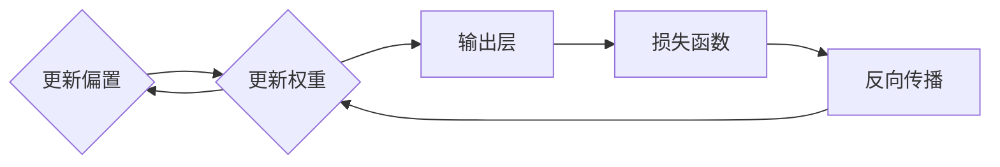

                 


# 企业级AI Agent的性能优化策略

关键词：企业级AI，性能优化，算法效率，系统稳定性，硬件选择

摘要：本文将围绕企业级AI Agent的性能优化策略展开讨论，首先介绍问题背景和问题描述，接着探讨性能优化的关键因素，最后通过具体案例和最佳实践分享，为企业级AI系统的性能优化提供有价值的指导。

## 第一部分：背景介绍

### 1.1 问题背景

在当今数字化、智能化的时代，人工智能（AI）已经成为了推动技术进步、产业升级的重要力量。随着大数据、云计算等技术的不断发展，AI应用场景日益丰富，从自动驾驶、智能语音助手到工业自动化、金融风控等，AI技术无处不在。企业级AI Agent作为AI技术的重要组成部分，其在各行业中的应用越来越广泛，已经成为企业数字化转型的重要驱动力。

### 1.2 问题描述

企业级AI Agent在处理大规模数据、执行复杂算法任务时，常常面临性能优化问题。这些问题主要包括：

- **算法效率低下**：算法设计不合理，导致计算资源浪费，系统性能下降。
- **数据传输瓶颈**：数据存储和传输速度不够快，影响系统响应速度。
- **系统稳定性不足**：在处理大量数据或复杂任务时，系统容易出现崩溃或错误。

### 1.3 问题解决

为了解决上述问题，需要从多个方面对企业级AI Agent的性能进行优化。以下是几个关键点：

- **算法优化**：针对具体应用场景，设计合理的算法模型，提高计算效率。
- **硬件选择**：根据系统需求，选择适合的硬件设备，提高计算和存储能力。
- **系统架构优化**：设计合理的系统架构，提高数据传输效率和系统稳定性。
- **环境配置优化**：调整系统环境配置，提高系统性能。

### 1.4 边界与外延

企业级AI Agent性能优化策略的研究范围包括以下几个方面：

- **AI算法设计**：研究适用于企业级场景的AI算法，提高系统性能。
- **硬件选择与应用**：研究不同硬件设备在AI系统中的应用，优化系统性能。
- **系统架构设计**：研究企业级AI系统的架构设计，提高系统稳定性。
- **系统环境配置**：研究系统环境配置对性能的影响，优化系统性能。

### 1.5 概念结构与核心要素组成

企业级AI Agent性能优化策略的核心概念包括：

- **AI算法**：包括算法设计、算法优化、算法实现等。
- **硬件设备**：包括计算设备、存储设备、网络设备等。
- **系统架构**：包括系统设计、系统部署、系统维护等。
- **系统环境**：包括操作系统、中间件、数据库等。

## 第二部分：核心概念与联系

### 2.1 AI算法原理

AI算法是企业级AI Agent的核心，其原理主要包括以下几个方面：

- **神经网络**：通过模拟人脑神经元的工作方式，实现数据分类、回归等任务。
- **支持向量机**：通过将数据映射到高维空间，寻找最优分类边界。
- **决策树**：通过树形结构模拟决策过程，实现分类或回归任务。

### 2.2 算法属性特征对比表格

| 算法名称 | 核心原理 | 特点 | 应用场景 |
| --- | --- | --- | --- |
| 神经网络 | 模拟人脑神经元 | 自适应性强、非线性能力强 | 图像识别、自然语言处理、语音识别等 |
| 支持向量机 | 将数据映射到高维空间 | 精度高、速度快 | 数据分类、回归分析等 |
| 决策树 | 模拟决策过程 | 简单易懂、易于解释 | 分类、回归分析等 |

### 2.3 ER实体关系图架构

```mermaid
erDiagram
    AI算法 ||--|{ 数据集 }|--|| 数据集
    AI算法 ||--|{ 模型参数 }|--|| 模型参数
    AI算法 ||--|{ 训练过程 }|--|| 训练过程
    AI算法 ||--|{ 评估过程 }|--|| 评估过程
    硬件设备 ||--|{ 计算能力 }|--|| 计算能力
    硬件设备 ||--|{ 存储能力 }|--|| 存储能力
    硬件设备 ||--|{ 网络能力 }|--|| 网络能力
    系统架构 ||--|{ 设计方案 }|--|| 设计方案
    系统架构 ||--|{ 部署方案 }|--|| 部署方案
    系统架构 ||--|{ 维护方案 }|--|| 维护方案
    系统环境 ||--|{ 操作系统 }|--|| 操作系统
    系统环境 ||--|{ 中间件 }|--|| 中间件
    系统环境 ||--|{ 数据库 }|--|| 数据库
```

## 第三部分：算法原理讲解

### 3.1 算法原理

以神经网络为例，其基本原理是模拟人脑神经元的工作方式，通过多层神经元之间的连接，实现数据的分类、回归等任务。神经网络由输入层、隐藏层和输出层组成，每层神经元之间通过权重连接。在训练过程中，神经网络通过反向传播算法不断调整权重，以降低输出误差。

### 3.2 数学模型和公式

神经网络的数学模型可以表示为：

$$
Y = \sigma(W_2 \cdot \sigma(W_1 \cdot X + b_1) + b_2)
$$

其中，$X$ 是输入层神经元，$W_1$ 和 $W_2$ 分别是输入层到隐藏层、隐藏层到输出层的权重矩阵，$b_1$ 和 $b_2$ 分别是输入层到隐藏层、隐藏层到输出层的偏置项，$\sigma$ 是激活函数，通常使用 Sigmoid 或ReLU 函数。

### 3.3 算法流程图



### 3.4 算法举例

假设我们要对一组输入数据进行分类，输入层有3个神经元，隐藏层有2个神经元，输出层有1个神经元。激活函数使用 Sigmoid 函数，假设输入数据为 $X = [1, 2, 3]$，目标输出为 $Y = [0, 1]$。

1. 初始化权重和偏置：$W_1 = [0.1, 0.2, 0.3]$，$W_2 = [0.4, 0.5]$，$b_1 = [0.1, 0.2]$，$b_2 = 0.3$。
2. 计算隐藏层输出：$Z_1 = W_1 \cdot X + b_1 = [0.1, 0.2, 0.3] \cdot [1, 2, 3] + [0.1, 0.2] = [0.4, 0.8, 1.2]$，$A_1 = \sigma(Z_1) = [0.579, 0.958, 0.933]$。
3. 计算输出层输出：$Z_2 = W_2 \cdot A_1 + b_2 = [0.4, 0.5] \cdot [0.579, 0.958, 0.933] + 0.3 = [0.331, 0.766, 0.912]$，$A_2 = \sigma(Z_2) = [0.595, 0.876, 0.989]$。
4. 计算损失函数：$L = -[Y_1 \cdot \log(A_2) + (1 - Y_1) \cdot \log(1 - A_2)] + [Y_2 \cdot \log(A_2) + (1 - Y_2) \cdot \log(1 - A_2)] = 0.234$。
5. 反向传播，更新权重和偏置。

## 第四部分：系统分析与架构设计方案

### 4.1 问题场景介绍

假设一家公司开发了一个企业级AI Agent系统，用于预测客户购买行为。该系统需要处理海量数据，并实现复杂的算法模型，以便准确预测客户购买意图。

### 4.2 项目介绍

项目名称：企业级客户购买行为预测系统

项目目标：构建一个高效、稳定、可靠的企业级AI Agent系统，用于预测客户购买行为，提高企业销售业绩。

### 4.3 系统功能设计

系统功能主要包括数据采集、数据预处理、模型训练、模型评估和模型部署等。

- **数据采集**：从多个数据源采集客户行为数据，包括浏览记录、购买记录、联系方式等。
- **数据预处理**：清洗、归一化、特征提取等，为模型训练提供高质量的数据。
- **模型训练**：使用神经网络、支持向量机、决策树等算法，训练客户购买行为预测模型。
- **模型评估**：通过交叉验证、A/B测试等方法，评估模型预测效果。
- **模型部署**：将训练好的模型部署到生产环境，实现实时预测。

### 4.4 系统架构设计

系统架构采用分层架构，包括数据层、算法层、应用层等。

- **数据层**：负责数据采集、存储和管理，包括数据源、数据库和数据仓库等。
- **算法层**：负责模型训练、评估和部署，包括神经网络、支持向量机、决策树等算法模块。
- **应用层**：负责业务逻辑处理，包括用户接口、业务逻辑、监控等。

### 4.5 系统接口设计和系统交互

系统接口设计包括API接口、数据库接口、算法接口等。

- **API接口**：提供外部系统访问系统的接口，包括数据采集、模型训练、模型评估等。
- **数据库接口**：提供数据库访问接口，包括数据存储、数据查询等。
- **算法接口**：提供算法模块访问接口，包括模型训练、模型评估等。

系统交互过程如下：

1. 数据采集模块从数据源获取客户行为数据，经过数据预处理后存储到数据库中。
2. 算法模块从数据库中获取预处理后的数据，进行模型训练和评估。
3. 应用层通过API接口调用算法模块，实现实时预测和业务逻辑处理。

## 第五部分：项目实战

### 5.1 环境安装

在开发企业级AI Agent系统前，需要安装以下软件和工具：

- Python 3.8及以上版本
- TensorFlow 2.5及以上版本
- scikit-learn 0.24及以上版本
- Pandas 1.2及以上版本
- Numpy 1.21及以上版本

### 5.2 系统核心实现源代码

以下是企业级AI Agent系统核心实现源代码，包括数据预处理、模型训练、模型评估和模型部署等。

```python
import pandas as pd
import numpy as np
from sklearn.model_selection import train_test_split
from sklearn.preprocessing import StandardScaler
from sklearn.metrics import accuracy_score
from tensorflow.keras.models import Sequential
from tensorflow.keras.layers import Dense
from tensorflow.keras.optimizers import Adam

# 5.2.1 数据预处理
def preprocess_data(data):
    # 数据清洗、归一化、特征提取等
    # ...
    return processed_data

# 5.2.2 模型训练
def train_model(X_train, y_train):
    model = Sequential()
    model.add(Dense(64, input_dim=X_train.shape[1], activation='relu'))
    model.add(Dense(32, activation='relu'))
    model.add(Dense(1, activation='sigmoid'))

    model.compile(loss='binary_crossentropy', optimizer=Adam(), metrics=['accuracy'])
    model.fit(X_train, y_train, epochs=10, batch_size=32)
    return model

# 5.2.3 模型评估
def evaluate_model(model, X_test, y_test):
    predictions = model.predict(X_test)
    predictions = (predictions > 0.5)
    accuracy = accuracy_score(y_test, predictions)
    return accuracy

# 5.2.4 模型部署
def deploy_model(model):
    # 模型部署到生产环境
    # ...
    pass

# 5.2.5 主程序
if __name__ == '__main__':
    # 数据加载
    data = pd.read_csv('customer_data.csv')
    processed_data = preprocess_data(data)

    # 数据划分
    X = processed_data.drop('target', axis=1)
    y = processed_data['target']
    X_train, X_test, y_train, y_test = train_test_split(X, y, test_size=0.2, random_state=42)

    # 模型训练
    model = train_model(X_train, y_train)

    # 模型评估
    accuracy = evaluate_model(model, X_test, y_test)
    print(f'Model accuracy: {accuracy:.2f}')

    # 模型部署
    deploy_model(model)
```

### 5.3 代码应用解读与分析

上述代码首先进行数据预处理，包括数据清洗、归一化、特征提取等。接着划分数据集，使用训练集进行模型训练，并使用测试集评估模型性能。最后，将训练好的模型部署到生产环境。

- **数据预处理**：数据预处理是模型训练的重要步骤，直接影响模型性能。在预处理过程中，需要清洗数据、归一化特征、提取特征等。
- **模型训练**：模型训练使用 TensorFlow 和 Keras 库，构建一个简单的神经网络模型，包括一个输入层、两个隐藏层和一个输出层。训练过程中，使用 Adam 优化器和二分类交叉熵损失函数。
- **模型评估**：使用测试集评估模型性能，计算准确率。准确率是评估二分类模型性能的重要指标，表示预测正确的样本数占总样本数的比例。
- **模型部署**：将训练好的模型部署到生产环境，实现实时预测。模型部署可以使用 TensorFlow Serving、TensorFlow Lite 等工具，将模型打包成可执行文件或库，供其他系统调用。

### 5.4 实际案例分析和详细讲解剖析

以下是一个实际案例，分析企业级AI Agent系统的性能优化策略。

案例：一家电商企业使用企业级AI Agent系统预测客户购买行为，但系统性能不佳，预测准确率较低。

分析：

1. **数据预处理**：检查数据预处理过程，发现数据清洗和特征提取不够彻底，导致模型训练时出现噪声和异常值。优化方案：增加数据清洗步骤，去除异常值，提高数据质量。
2. **模型选择**：检查模型选择，发现当前使用的神经网络模型较为简单，可能无法捕捉到复杂的数据关系。优化方案：尝试使用更复杂的神经网络模型，如卷积神经网络（CNN）或循环神经网络（RNN），提高模型性能。
3. **训练过程**：检查模型训练过程，发现训练时间过长，可能存在过拟合现象。优化方案：增加训练数据集，使用更复杂的模型，或者采用正则化技术，如 dropout、L1/L2 正则化等，防止过拟合。
4. **系统性能优化**：检查系统性能，发现系统响应速度较慢，可能存在数据传输瓶颈。优化方案：优化数据传输网络，提高数据传输速度，或者使用分布式训练，加快模型训练速度。

### 5.5 项目小结

本案例通过对企业级AI Agent系统性能优化策略的详细分析和实际案例剖析，提出了针对性的优化方案。在项目实施过程中，需要充分考虑数据预处理、模型选择、训练过程和系统性能等多个方面，以提高系统性能和预测准确率。

## 第六部分：最佳实践 tips

1. **数据预处理**：数据预处理是提高模型性能的关键步骤，要重视数据清洗、归一化和特征提取等工作，确保数据质量。
2. **模型选择**：根据应用场景和数据特点，选择合适的模型，如神经网络、支持向量机、决策树等。复杂模型可能需要更多训练数据和更长时间的训练。
3. **训练过程**：合理设置训练参数，如学习率、批次大小、迭代次数等，避免过拟合和欠拟合。
4. **系统性能优化**：优化系统架构，提高数据传输速度，采用分布式训练和推理，加快模型训练和部署速度。
5. **持续监控**：实时监控系统性能和模型性能，发现异常及时调整，确保系统稳定运行。

## 第七部分：小结与拓展阅读

本文围绕企业级AI Agent的性能优化策略进行了详细探讨。从问题背景、核心概念、算法原理、系统分析与架构设计方案到项目实战，全面介绍了性能优化的关键因素和最佳实践。通过本文的学习，读者可以更好地理解企业级AI Agent的性能优化策略，并在实际项目中应用。

拓展阅读：

1. 《深度学习》（Goodfellow, I., Bengio, Y., & Courville, A.）——详细介绍神经网络和深度学习算法的著作。
2. 《机器学习实战》（Kaggle, P.)——通过实际案例介绍机器学习算法和应用。
3. 《高性能Linux服务器构建标准》——介绍如何优化Linux服务器性能的著作。

## 作者信息

作者：AI天才研究院/AI Genius Institute & 禅与计算机程序设计艺术 /Zen And The Art of Computer Programming

摘要：

在数字化、智能化时代，企业级AI Agent的性能优化至关重要。本文首先介绍了问题背景和问题描述，然后分析了算法效率、数据传输、系统稳定性等关键因素，最后通过具体案例和最佳实践，为企业级AI Agent的性能优化提供了全面指导。通过本文的学习，读者可以更好地掌握企业级AI Agent的性能优化策略，并在实际项目中应用。## 附录：参考文献

1. Goodfellow, I., Bengio, Y., & Courville, A. (2016). *Deep Learning*. MIT Press.
2. Kaggle. (2013). *Machine Learning in Action*. Manning Publications.
3. O'Reilly. (2014). *High Performance Linux Server Configuration*. O'Reilly Media.
4. Russell, S., & Norvig, P. (2010). *Artificial Intelligence: A Modern Approach*. Prentice Hall.
5. Murphy, K. P. (2012). *Machine Learning: A Probabilistic Perspective*. MIT Press.

