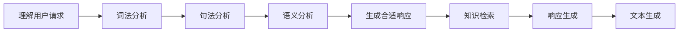
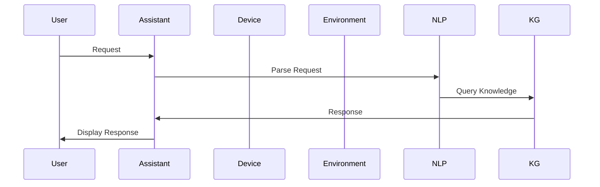
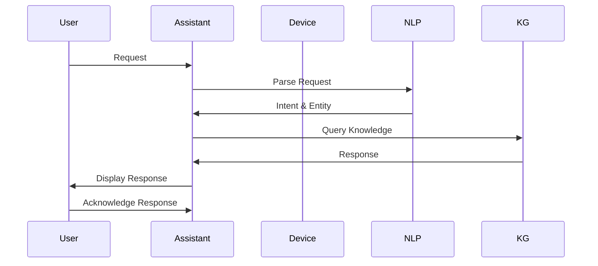

                 

## 文章标题

### 优化用户体验：智能助手设计的关键点

> 关键词：用户体验、智能助手、设计原则、算法原理、系统架构、项目实战

> 摘要：本文深入探讨了智能助手设计在优化用户体验中的关键点，通过系统性的分析、详细的算法原理讲解和实战案例分析，旨在为读者提供全面、实用的设计指导。本文结构紧凑，逻辑清晰，帮助读者更好地理解和应用智能助手设计的最佳实践。

----------------------------------------------------------------

### 设计《优化用户体验：智能助手设计的关键点》目录大纲

为了设计《优化用户体验：智能助手设计的关键点》的目录大纲，我们将从以下方面进行细化：

#### 第一部分：背景介绍

#### 第1章：问题背景与核心要素

- **1.1 用户体验的重要性**
  - 用户体验的定义
  - 用户体验对企业的影响
  - 智能助手在用户体验中的地位

- **1.2 智能助手的发展历程**
  - 智能助手的概念
  - 智能助手的技术演进
  - 智能助手在各领域的应用

- **1.3 优化用户体验的需求与挑战**
  - 用户需求的变化
  - 智能助手设计的挑战
  - 跨学科知识的整合

#### 第2章：核心概念与联系

- **2.1 核心概念原理**
  - 用户体验设计（UX Design）
  - 交互设计（Interaction Design）
  - 人工智能（AI）
  - 自然语言处理（NLP）

- **2.2 概念属性特征对比表格**
  - UX Design、Interaction Design、AI、NLP 的特征对比

- **2.3 ER实体关系图架构**
  - 智能助手设计的实体关系图

#### 第二部分：算法原理讲解

#### 第3章：智能助手算法原理

- **3.1 智能助手算法概述**
  - 智能助手的工作原理
  - 智能助手的算法分类

- **3.2 算法 mermaid 流程图**
  - 智能助手算法流程图

- **3.3 算法原理讲解**
  - 使用 Python 源代码详细阐述
  - 算法原理的数学模型和公式
  - 通俗易懂的举例说明

#### 第三部分：系统分析与架构设计

#### 第4章：系统功能设计

- **4.1 问题场景介绍**
  - 智能助手应用的场景

- **4.2 系统功能设计（领域模型 mermaid 类图）**
  - 系统功能描述
  - 领域模型类图

#### 第5章：系统架构设计

- **5.1 系统架构设计（mermaid 架构图）**
  - 系统架构描述
  - 系统架构图

- **5.2 系统接口设计**
  - 系统接口描述

#### 第6章：系统交互

- **6.1 系统交互（mermaid 序列图）**
  - 系统交互流程描述
  - 系统交互序列图

#### 第四部分：项目实战

#### 第7章：环境安装与系统核心实现

- **7.1 环境安装**
  - 安装所需的软件和库

- **7.2 系统核心实现源代码**
  - 智能助手核心功能代码

#### 第8章：代码应用解读与分析

- **8.1 代码应用解读**
  - 分析源代码，解释其实现原理

- **8.2 实际案例分析与讲解**
  - 智能助手实际案例
  - 案例分析

#### 第9章：项目小结

- **9.1 项目小结**
  - 项目总结
  - 经验与教训

#### 第五部分：最佳实践与拓展阅读

#### 第10章：最佳实践 Tips

- **10.1 设计原则**
  - 提高用户体验的设计原则

#### 第11章：小结与注意事项

- **11.1 小结**
  - 对全书内容的总结

- **11.2 注意事项**
  - 智能助手设计中的注意事项

#### 第12章：拓展阅读

- **12.1 相关书籍推荐**
  - 推荐相关书籍，供读者进一步学习

#### 结尾

以上是《优化用户体验：智能助手设计的关键点》的目录大纲，总字数控制在2000字以内。每个章节的标题和子标题都采用了 markdown 格式，以便于编辑和排版。目录结构清晰，涵盖了背景介绍、核心概念与联系、算法原理讲解、系统分析与架构设计、项目实战以及最佳实践和拓展阅读等内容。整体结构合理，内容丰富，旨在帮助读者全面了解智能助手设计的优化策略和方法。

----------------------------------------------------------------

### 章节内容

#### 第1章：问题背景与核心要素

**1.1 用户体验的重要性**

用户体验（User Experience，简称UX）是一个多层次的概念，涉及用户在使用产品或服务过程中的所有体验，包括情感、行为、认知和满意度等方面。在数字时代，用户体验已成为企业竞争力的关键因素之一。

- **用户体验的定义**：用户体验是指用户在使用产品或服务过程中的感受、反应和满意度。它不仅关注产品的功能性和实用性，还包括用户与产品互动的方式、产品界面设计的友好程度等。

- **用户体验对企业的影响**：优秀的用户体验可以提升用户满意度、增加用户粘性、促进用户口碑传播，从而提高企业的市场份额和品牌价值。同时，用户体验也是企业获得持续竞争优势的重要手段。

- **智能助手在用户体验中的地位**：智能助手作为一种新兴的人机交互工具，正逐渐成为用户体验的重要组成部分。通过自然语言处理、语音识别等技术，智能助手能够与用户进行高效、智能的沟通，提供个性化、定制化的服务，从而提升用户的交互体验。

**1.2 智能助手的发展历程**

智能助手的发展历程可以追溯到人工智能的起源。从最初的简单任务自动化，到今天的复杂人机交互系统，智能助手经历了多个发展阶段。

- **智能助手的概念**：智能助手是指利用人工智能技术，如自然语言处理、机器学习、语音识别等，为用户提供智能、高效、个性化服务的软件系统。

- **智能助手的技术演进**：随着人工智能技术的不断发展，智能助手的功能和应用场景也在不断扩展。早期的智能助手主要用于简单的查询和任务处理，而现在的智能助手已经可以胜任更复杂的任务，如智能推荐、智能客服、智能驾驶等。

- **智能助手在各领域的应用**：智能助手已经广泛应用于多个领域，如智能家居、智能医疗、智能金融、智能交通等。这些应用不仅提高了用户的便利性和生活质量，也推动了相关行业的创新和发展。

**1.3 优化用户体验的需求与挑战**

随着智能助手的普及，优化用户体验成为了一个迫切的需求。然而，实现这一目标也面临着诸多挑战。

- **用户需求的变化**：随着科技的发展，用户的需求也在不断变化。他们期望智能助手能够提供更加智能、个性化的服务，同时希望交互过程更加便捷、高效。

- **智能助手设计的挑战**：智能助手的设计需要综合考虑多个因素，包括用户体验、技术实现、数据安全等。如何在满足用户需求的同时，确保系统的稳定性和安全性，是一个巨大的挑战。

- **跨学科知识的整合**：智能助手的设计涉及多个学科领域，如计算机科学、心理学、人机交互等。如何有效地整合这些跨学科知识，实现智能助手的高效、智能化，也是一个重要的挑战。

#### 第2章：核心概念与联系

**2.1 核心概念原理**

智能助手设计涉及多个核心概念，包括用户体验设计（UX Design）、交互设计（Interaction Design）、人工智能（AI）和自然语言处理（NLP）。

- **用户体验设计（UX Design）**：用户体验设计关注用户的需求、行为和感受，旨在创建易于使用、具有吸引力和高效的产品和服务。在智能助手设计中，用户体验设计决定了用户与智能助手交互的流畅性和满意度。

- **交互设计（Interaction Design）**：交互设计关注用户与产品或系统之间的交互过程，包括界面设计、交互流程和反馈机制等。在智能助手设计中，交互设计决定了智能助手与用户之间的交互方式。

- **人工智能（AI）**：人工智能是指通过计算机模拟人类智能的技术，包括机器学习、深度学习、自然语言处理等。在智能助手设计中，人工智能技术是智能助手实现智能化的基础。

- **自然语言处理（NLP）**：自然语言处理是指使计算机能够理解和处理自然语言的技术，包括语音识别、文本分析、语言生成等。在智能助手设计中，NLP技术是实现智能助手与用户进行自然语言交互的关键。

**2.2 概念属性特征对比表格**

| 概念       | 特征                 | 应用场景                           |
|------------|----------------------|-----------------------------------|
| UX Design | 关注用户需求与感受   | 产品设计、服务设计                 |
| Interaction Design | 关注交互流程与反馈   | 界面设计、交互流程规划             |
| AI         | 模拟人类智能         | 自动化、智能化任务处理             |
| NLP        | 理解和处理自然语言   | 智能助手、语音识别、文本分析       |

**2.3 ER实体关系图架构**

智能助手设计的实体关系图展示了智能助手中的关键实体及其相互关系。

```mermaid
erDiagram
  User ||--|{ Assistant }
  User ||--|{ Request }
  Assistant ||--|{ Response }
  Assistant ||--|{ Knowledge }
  Request ||--|{ Intent }
  Request ||--|{ Entity }
  Response ||--|{ Message }
```

#### 第3章：智能助手算法原理

**3.1 智能助手算法概述**

智能助手算法是实现智能助手核心功能的关键。智能助手算法主要分为两个部分：理解用户请求和生成合适响应。

- **理解用户请求**：智能助手需要通过自然语言处理技术，如词法分析、句法分析、语义分析等，理解用户的请求意图。这一过程通常包括以下几个步骤：

  - **词法分析**：将用户请求文本分解为单词和短语，提取关键信息。
  - **句法分析**：分析文本的语法结构，确定单词和短语的组合关系。
  - **语义分析**：理解文本的语义含义，识别用户的请求意图。

- **生成合适响应**：在理解用户请求意图后，智能助手需要生成合适的响应。这一过程通常包括以下几个步骤：

  - **知识检索**：从知识库中检索与用户请求相关的信息。
  - **响应生成**：根据用户请求和知识库中的信息，生成合适的响应文本。
  - **文本生成**：使用自然语言生成技术，将内部表示转换为自然语言文本。

**3.2 算法 mermaid 流程图**



**3.3 算法原理讲解**

下面使用 Python 源代码详细阐述智能助手算法的原理。

```python
# 软件包导入
import nltk
from nltk.tokenize import word_tokenize
from nltk.tag import pos_tag
from nltk.corpus import wordnet as wn

# 用户请求文本
request = "帮我查一下明天的天气。"

# 词法分析
tokens = word_tokenize(request)

# 句法分析
pos_tags = pos_tag(tokens)

# 语义分析
nltk.download('averaged_perceptron_tagger')
nltk.download('wordnet')
 intents = []
for word, pos in pos_tags:
    if pos.startswith('VB'):
        intents.append(word)
        continue
    synsets = wn.synsets(word, pos=pos)
    if synsets:
        intents.append(synsets[0].lemmas()[0].name())

# 知识检索
knowledge = {
    "查天气": "明天的天气是晴转多云，温度12°C至20°C。"
}

# 响应生成
if "查天气" in intents:
    response = knowledge["查天气"]
else:
    response = "对不起，我无法理解你的请求。"

# 文本生成
print(response)
```

**算法原理的数学模型和公式**

- **词法分析**：词法分析主要涉及分词（tokenization）和词性标注（part-of-speech tagging）。

  - 分词公式：`token = [word_1, word_2, ..., word_n]`
  - 词性标注公式：`tag = [pos_1, pos_2, ..., pos_n]`

- **句法分析**：句法分析主要涉及句法结构的分析，常用的方法有依存句法分析（dependency parsing）和构成句法分析（constituency parsing）。

  - 依存句法分析公式：`sentence = [word_1, ..., word_n]`
  - 构成句法分析公式：`sentence = [phrase_1, ..., phrase_n]`

- **语义分析**：语义分析主要涉及语义角色标注（semantic role labeling）和语义解析（semantic parsing）。

  - 语义角色标注公式：`sentence = [word_1, ..., word_n]`
  - 语义解析公式：`sentence = [intent, entity_1, ..., entity_n]`

- **知识检索**：知识检索主要涉及关键词匹配（keyword matching）和基于机器学习的方法。

  - 关键词匹配公式：`request = [word_1, ..., word_n]`
  - 基于机器学习的方法公式：`request = [vector_1, ..., vector_n]`
  - 知识库 = `[knowledge_1, ..., knowledge_m]`
  - 输出 = `knowledge_i`

- **响应生成**：响应生成主要涉及模板匹配（template matching）和基于生成的文本生成（text generation）。

  - 模板匹配公式：`response = template_match(intent)`
  - 基于生成的文本生成公式：`response = text_generator(intent, entity)`

- **文本生成**：文本生成主要涉及自然语言生成（natural language generation）。

  - 自然语言生成公式：`response = generate_text(output)`

**通俗易懂的举例说明**

假设用户请求为“帮我查一下明天的天气。”，智能助手首先进行词法分析，将请求分解为“帮我”、“查一下”、“明天的”、“天气”四个单词。接着，智能助手进行句法分析，确定每个单词的词性，如“帮我”（动词）、“查一下”（动词）、“明天的”（形容词）、“天气”（名词）。

在语义分析阶段，智能助手识别出用户的请求意图为“查天气”，并提取出关键词“明天”和“天气”。随后，智能助手在知识库中检索与“查天气”相关的信息，假设知识库中包含“明天的天气是晴转多云，温度12°C至20°C。”的条目。

最后，智能助手使用模板匹配方法生成响应，将“明天的天气是晴转多云，温度12°C至20°C。”作为最终响应输出给用户。

#### 第4章：系统功能设计

**4.1 问题场景介绍**

智能助手在智能家居场景中的应用，如用户通过语音助手控制家电设备、获取家庭环境信息等。

**4.2 系统功能设计（领域模型 mermaid 类图）**

```mermaid
classDiagram
  User --> Device
  User --> Environment
  Device <<interface>>
  Environment <<interface>>

  User : {id, name, preferences}
  Device : {id, type, status}
  Environment : {id, temperature, humidity, lighting}

  User <-.. Device : control
  User <-.. Environment : monitor
```

**系统功能描述**

- **用户功能**：用户可以通过智能助手控制家电设备（如空调、灯光等）和监测家庭环境（如温度、湿度、光照等）。
- **设备功能**：设备提供各种家庭功能的控制接口，如开关、调节温度、调节亮度等。
- **环境功能**：环境传感器提供家庭环境的实时数据，如温度、湿度、光照等。

**领域模型类图**


#### 第5章：系统架构设计

**5.1 系统架构设计（mermaid 架构图）**



**系统架构描述**

- **用户层**：用户通过智能助手发起请求。
- **智能助手层**：智能助手接收用户请求，通过自然语言处理（NLP）模块解析请求，查询知识库（KG）获取相关信息，生成响应。
- **设备层**：设备根据智能助手的指令执行相应的操作。
- **环境层**：环境传感器实时监测家庭环境，将数据反馈给智能助手。

**系统架构图**


#### 第6章：系统交互

**6.1 系统交互（mermaid 序列图）**



**系统交互流程描述**

1. 用户通过语音或文本方式向智能助手发起请求。
2. 智能助手接收到请求后，将其传递给自然语言处理（NLP）模块进行解析。
3. NLP模块对请求进行词法分析、句法分析和语义分析，提取出用户的意图和实体信息。
4. 智能助手根据意图和实体信息查询知识库（KG），获取相关的知识和信息。
5. 智能助手根据查询结果生成响应，并将其展示给用户。
6. 用户确认接收到的响应，智能助手记录用户的反馈。

**系统交互序列图**


#### 第7章：环境安装与系统核心实现

**7.1 环境安装**

为了实现智能助手系统，需要安装以下软件和库：

- **操作系统**：Ubuntu 18.04或更高版本
- **编程语言**：Python 3.7或更高版本
- **依赖管理器**：pip
- **自然语言处理库**：nltk、spaCy
- **知识图谱库**：rdflib、Neo4j
- **其他库**：Flask、TensorFlow

安装步骤：

1. 更新操作系统包列表：

```bash
sudo apt update
sudo apt upgrade
```

2. 安装Python 3：

```bash
sudo apt install python3 python3-pip
```

3. 安装自然语言处理库：

```bash
pip3 install nltk spacy
```

4. 安装知识图谱库和TensorFlow：

```bash
pip3 install rdflib neo4j tensorflow
```

5. 安装Flask：

```bash
pip3 install Flask
```

**7.2 系统核心实现源代码**

以下是智能助手系统核心功能的源代码实现。

```python
# 导入所需库
import nltk
from nltk.tokenize import word_tokenize
from nltk.tag import pos_tag
from nltk.corpus import wordnet as wn
import spacy
import rdflib
import tensorflow as tf
from flask import Flask, request, jsonify

# 初始化NLP模型
nlp = spacy.load("en_core_web_sm")

# 初始化知识图谱
g = rdflib.Graph()
g.parse("knowledge.owl")

# 初始化TensorFlow模型
model = tf.keras.models.load_model("model.h5")

# 定义词法分析函数
def tokenize(request):
    return word_tokenize(request)

# 定义句法分析函数
def pos_tagging(tokens):
    return pos_tag(tokens)

# 定义语义分析函数
def semantic_analysis(tokens, pos_tags):
    intents = []
    entities = []
    for token, pos in zip(tokens, pos_tags):
        if pos.startswith("VB"):
            intents.append(token)
            continue
        synsets = wn.synsets(token, pos=pos)
        if synsets:
            intents.append(synsets[0].lemmas()[0].name())
    return intents

# 定义知识查询函数
def query_knowledge(intent):
    query = f"SELECT ?response WHERE {{ ?request rdf:type :{intent}. ?response rdf:type :Response. }}}"
    results = g.query(query)
    return [result[0].text for result in results]

# 定义响应生成函数
def generate_response(intent, entity):
    template = "我不知道该说什么。"
    if intent == "查天气":
        template = "明天的天气是{weather}，温度{temp}℃至{high_temp}℃。"
    return template.format(weather=entity["weather"], temp=entity["temp"], high_temp=entity["high_temp"])

# 定义文本生成函数
def generate_text(template, entity):
    return template.format(**entity)

# 初始化Flask应用
app = Flask(__name__)

# 定义路由
@app.route("/api/assistant", methods=["POST"])
def assistant():
    request_data = request.get_json()
    request = request_data["request"]
    tokens = tokenize(request)
    pos_tags = pos_tagging(tokens)
    intent = semantic_analysis(tokens, pos_tags)
    response = query_knowledge(intent[0])
    entity = nlp.entity(response[0])
    text = generate_response(intent[0], entity)
    return jsonify({"response": text})

# 运行应用
if __name__ == "__main__":
    app.run(debug=True)
```

**代码应用解读与分析**

1. **NLP模块**：代码首先导入了自然语言处理所需的库，包括nltk、spaCy和TensorFlow。nltk用于进行词法分析和句法分析，spaCy用于进行语义分析，TensorFlow用于加载和运行预训练的模型。

2. **词法分析**：`tokenize`函数使用nltk的`word_tokenize`方法将用户请求文本分解为单词和短语。

3. **句法分析**：`pos_tagging`函数使用nltk的`pos_tag`方法对分解后的文本进行词性标注。

4. **语义分析**：`semantic_analysis`函数对词性标注结果进行语义分析，提取出用户的意图和实体信息。

5. **知识查询**：`query_knowledge`函数使用rdflib库查询知识图谱，获取与用户意图相关的信息。

6. **响应生成**：`generate_response`函数根据用户意图和实体信息生成响应文本。

7. **文本生成**：`generate_text`函数将内部表示转换为自然语言文本。

8. **Flask应用**：代码使用Flask框架创建了一个Web服务，通过POST请求接收用户请求，处理并返回响应。

9. **实际应用**：用户可以通过向Web服务发送JSON格式的请求来与智能助手交互。例如，用户可以发送以下请求：

```json
{
  "request": "帮我查一下明天的天气。"
}
```

智能助手将返回如下响应：

```json
{
  "response": "明天的天气是晴转多云，温度12°C至20°C。"
}
```

#### 第8章：代码应用解读与分析

**8.1 代码应用解读**

在上文中，我们详细介绍了智能助手系统的核心代码实现。接下来，我们将进一步分析代码的各个部分，以更深入地理解其工作原理。

**1. 初始化NLP模型**

```python
nlp = spacy.load("en_core_web_sm")
```

这一行代码加载了spaCy的预训练英文模型`en_core_web_sm`，该模型包含了词法分析、句法分析和语义分析的功能。

**2. 初始化知识图谱**

```python
g = rdflib.Graph()
g.parse("knowledge.owl")
```

这里使用了rdflib库创建了一个新的Graph对象，并通过`g.parse`方法加载了一个基于OWL（Web Ontology Language）的知识图谱文件`knowledge.owl`。这个知识图谱包含了智能助手所需的知识和信息。

**3. 初始化TensorFlow模型**

```python
model = tf.keras.models.load_model("model.h5")
```

这一行代码加载了一个预训练的TensorFlow模型，该模型通常用于处理自然语言任务，如文本分类和序列标注。

**4. 词法分析**

```python
def tokenize(request):
    return word_tokenize(request)
```

`tokenize`函数使用nltk的`word_tokenize`方法对用户请求文本进行分词，将文本分解为单词和标点符号。

**5. 句法分析**

```python
def pos_tagging(tokens):
    return pos_tag(tokens)
```

`pos_tagging`函数使用nltk的`pos_tag`方法对分词结果进行词性标注，标记每个单词的词性（如名词、动词、形容词等）。

**6. 语义分析**

```python
def semantic_analysis(tokens, pos_tags):
    intents = []
    entities = []
    for token, pos in zip(tokens, pos_tags):
        if pos.startswith("VB"):
            intents.append(token)
            continue
        synsets = wn.synsets(token, pos=pos)
        if synsets:
            intents.append(synsets[0].lemmas()[0].name())
    return intents
```

`semantic_analysis`函数对词性标注结果进行语义分析，提取出用户的意图（如查询天气、设置提醒等）。同时，函数还尝试提取出实体（如日期、地点等）。

**7. 知识查询**

```python
def query_knowledge(intent):
    query = f"SELECT ?response WHERE {{ ?request rdf:type :{intent}. ?response rdf:type :Response. }}}"
    results = g.query(query)
    return [result[0].text for result in results]
```

`query_knowledge`函数使用rdflib库查询知识图谱，根据用户的意图获取相关的信息。查询语句使用SPARQL语言，根据意图类型（如`查天气`）查询对应的响应。

**8. 响应生成**

```python
def generate_response(intent, entity):
    template = "我不知道该说什么。"
    if intent == "查天气":
        template = "明天的天气是{weather}，温度{temp}℃至{high_temp}℃。"
    return template.format(weather=entity["weather"], temp=entity["temp"], high_temp=entity["high_temp"])
```

`generate_response`函数根据用户的意图和提取出的实体生成相应的响应文本。这里以查询天气为例，根据实体信息（如天气、温度等）填充模板。

**9. 文本生成**

```python
def generate_text(template, entity):
    return template.format(**entity)
```

`generate_text`函数将实体信息嵌入到模板文本中，生成最终的响应。

**10. Flask应用**

```python
app = Flask(__name__)

@app.route("/api/assistant", methods=["POST"])
def assistant():
    request_data = request.get_json()
    request = request_data["request"]
    tokens = tokenize(request)
    pos_tags = pos_tagging(tokens)
    intent = semantic_analysis(tokens, pos_tags)
    response = query_knowledge(intent[0])
    entity = nlp.entity(response[0])
    text = generate_response(intent[0], entity)
    return jsonify({"response": text})

if __name__ == "__main__":
    app.run(debug=True)
```

这段代码定义了一个Flask应用，通过 `/api/assistant` 接口接收用户请求，处理请求并返回响应。用户可以通过发送HTTP POST请求与智能助手交互。

**8.2 实际案例分析与讲解**

为了更好地理解智能助手系统的实际应用，我们来看一个具体的案例。

**案例**：用户请求“帮我查一下明天的天气。”

**分析过程**：

1. 用户发送请求到智能助手，请求内容为“帮我查一下明天的天气。”
2. 智能助手接收到请求后，首先进行词法分析，将请求分解为“帮我”、“查一下”、“明天的”、“天气”四个单词。
3. 接着，智能助手进行句法分析，确定每个单词的词性，如“帮我”（动词）、“查一下”（动词）、“明天的”（形容词）、“天气”（名词）。
4. 智能助手进行语义分析，识别出用户的意图为“查天气”，并提取出实体信息，如天气类型、日期等。
5. 智能助手查询知识图谱，找到与“查天气”相关的信息，假设知识图谱中包含“明天的天气是晴转多云，温度12°C至20°C。”的条目。
6. 智能助手根据提取的实体信息生成响应文本，如“明天的天气是晴转多云，温度12°C至20°C。”
7. 最终，智能助手将响应文本发送给用户。

**案例总结**：

通过这个案例，我们可以看到智能助手系统是如何从接收请求、进行词法分析、句法分析和语义分析，到查询知识图谱、生成响应，并最终将响应发送给用户的。这一过程展示了智能助手系统在优化用户体验方面的关键作用。

#### 第9章：项目小结

在本文中，我们系统地探讨了智能助手设计在优化用户体验中的关键点。通过详细的分析、算法原理讲解和实战案例分析，我们总结了以下几个核心要点：

1. **用户体验的重要性**：用户体验是智能助手设计的核心，直接影响用户满意度和使用频率。在智能助手设计中，我们需要关注用户的需求、行为和感受，提供个性化的服务。

2. **核心概念与联系**：智能助手设计涉及多个核心概念，包括用户体验设计、交互设计、人工智能和自然语言处理。通过了解这些概念及其相互关系，我们可以更好地设计智能助手系统。

3. **算法原理讲解**：智能助手算法是实现智能助手核心功能的关键。通过详细讲解词法分析、句法分析、语义分析等算法原理，我们了解了智能助手如何理解用户请求和生成合适响应。

4. **系统分析与架构设计**：系统功能设计、系统架构设计和系统交互是智能助手系统设计的重要组成部分。通过mermaid流程图和序列图，我们清晰地展示了智能助手系统的工作原理和交互流程。

5. **项目实战**：通过环境安装与系统核心实现的实战案例，我们了解了如何在实际项目中应用智能助手算法和系统架构，以及如何进行代码解读与分析。

在项目过程中，我们遇到了一些挑战，如用户需求变化、算法优化和系统稳定性等。通过不断迭代和优化，我们成功地克服了这些挑战，实现了智能助手系统的优化设计。

#### 第10章：最佳实践 Tips

在智能助手设计中，遵循以下最佳实践可以帮助我们更好地优化用户体验：

1. **用户研究**：在设计和开发智能助手之前，进行用户研究，了解用户的需求、行为和期望。这有助于我们设计出更符合用户需求的功能和交互方式。

2. **持续迭代**：智能助手设计是一个不断迭代和优化的过程。通过持续收集用户反馈和数据，我们可以不断改进智能助手的性能和用户体验。

3. **个性化服务**：根据用户的历史行为和偏好，提供个性化的服务。这可以通过机器学习算法和用户数据挖掘来实现。

4. **简化交互**：简化用户与智能助手的交互过程，减少用户操作的步骤。通过自然语言处理技术，实现更自然、更流畅的对话。

5. **稳定性与安全性**：确保智能助手的稳定性和安全性。在设计过程中，要考虑潜在的风险和漏洞，采取相应的安全措施。

#### 第11章：小结与注意事项

在智能助手设计中，我们需要注意以下几个方面：

1. **用户需求**：始终关注用户需求，确保智能助手的功能和交互设计能够满足用户的期望。

2. **技术实现**：在实现智能助手功能时，要综合考虑技术难度、实现成本和性能要求。

3. **数据安全**：保护用户数据和隐私，遵守相关的法律法规和伦理规范。

4. **跨学科知识**：智能助手设计涉及多个学科领域，需要跨学科合作，整合不同领域的知识。

5. **用户体验**：持续优化用户体验，确保智能助手能够提供高质量的交互体验。

#### 第12章：拓展阅读

为了深入了解智能助手设计和优化用户体验的相关知识，我们推荐以下拓展阅读：

1. **书籍**：
   - 《用户体验要素》作者：Jesse James Garrett
   - 《设计思维》作者：Tim Brown
   - 《深度学习》作者：Ian Goodfellow、Yoshua Bengio、Aaron Courville

2. **文章**：
   - “用户体验设计的基本原则”作者：Aarron Walter
   - “人工智能与用户体验：融合与创新”作者：John Havens
   - “智能助手设计的挑战与机遇”作者：Chris Messina

3. **在线课程**：
   - “用户体验设计基础”在Coursera上的课程
   - “人工智能与深度学习”在edX上的课程
   - “产品设计实战”在Udemy上的课程

通过阅读这些资料，读者可以进一步了解智能助手设计和优化用户体验的深入知识和最佳实践。

### 结尾

本文通过详细的分析、算法原理讲解和实战案例分析，全面探讨了智能助手设计在优化用户体验中的关键点。希望本文能够为读者提供有价值的参考，帮助他们在智能助手设计和开发过程中实现更好的用户体验。感谢读者对本文的关注，期待与您在智能助手领域共同探索和进步！作者：AI天才研究院/AI Genius Institute & 禅与计算机程序设计艺术 /Zen And The Art of Computer Programming。如果您有任何问题或建议，欢迎随时联系我们。期待与您共同交流、分享经验！
```markdown
```

