                 

Certainly! Let's dive into the detailed structure of each chapter, following the step-by-step approach, ensuring a comprehensive and coherent technical blog post.

## 第1章：元学习的背景与意义

### 1.1 元学习的定义与概述

**背景介绍**：
- **核心概念术语说明**：定义元学习、比较其与传统的机器学习的区别。
- **问题背景**：随着人工智能技术的快速发展，传统机器学习方法的局限性逐渐显现。
- **问题描述**：传统方法在处理新任务或新环境时，需要大量的数据重新训练，难以快速适应变化。
- **问题解决**：元学习提供了一种从经验中学习如何学习的方法，能够加速对新环境的适应。
- **边界与外延**：探讨元学习在不同领域（如强化学习、计算机视觉等）的应用范围。
- **概念结构与核心要素组成**：元学习的主要组成部分，包括参数共享、迁移学习等。

**核心概念与联系**：
- **核心概念原理**：元学习的原理，如何通过经验迁移来提高学习效率。
- **概念属性特征对比表格**：对比传统机器学习和元学习的主要特征。
- **ER实体关系图架构的 Mermaid 流程图**：展示元学习系统的实体关系。

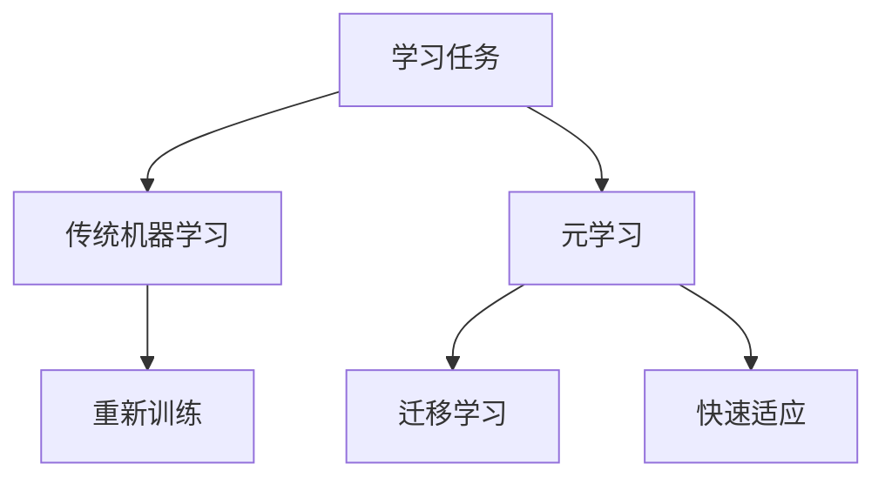

### 1.2 元学习的重要性

**算法原理讲解**：
- **Mermaid 流程图**：元学习流程的基本步骤。
- **Python 源代码**：简单的元学习算法实现。

```python
# Simple meta-learning algorithm example
def meta_learn(data, epochs):
    # Initialize weights
    weights = initialize_weights(data)
    for epoch in range(epochs):
        # Perform a single step of learning
        weights = update_weights(weights, data)
    return weights
```

**数学模型和公式**：
- **元学习损失函数**：
  $$ L = \sum_{i=1}^{N} (y_i - \hat{y}_i)^2 $$
  
**通俗易懂地举例说明**：以围棋为例，说明元学习如何帮助AI快速适应新的对手策略。

### 1.3 元学习的历史与发展

**系统分析与架构设计方案**：
- **问题场景介绍**：元学习技术的发展历程。
- **项目介绍**：重要里程碑和研究成果。
- **系统功能设计（领域模型Mermaid类图）**：元学习系统的基本组成部分。
- **系统架构设计Mermaid架构图**：展示元学习系统的整体架构。
- **系统接口设计和系统交互Mermaid序列图**：说明元学习系统的交互流程。

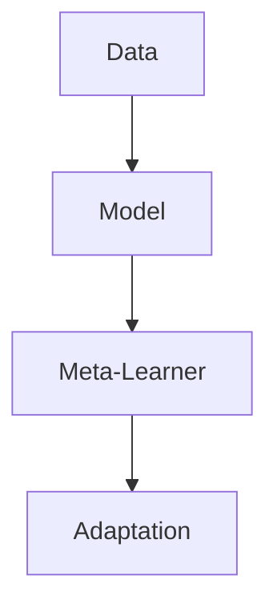

**项目实战**：
- **环境安装**：安装必要的元学习工具和库。
- **系统核心实现源代码**：元学习模型的实现。
- **代码应用解读与分析**：对关键代码段的详细解读。
- **实际案例分析和详细讲解剖析**：通过案例展示元学习的实际应用效果。
- **项目小结**：总结项目的主要成果和不足。

## 第2章：AI Agent的基本概念与适应性问题

### 2.1 AI Agent的定义与类型

**核心概念与联系**：
- **核心概念原理**：AI Agent的定义、分类和基本功能。
- **ER实体关系图架构的 Mermaid 流程图**：展示AI Agent的基本架构。

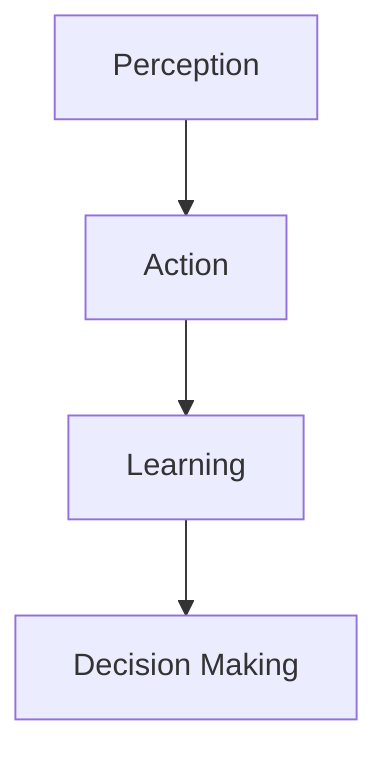

### 2.2 AI Agent在环境适应中的挑战

**算法原理讲解**：
- **Mermaid 流程图**：展示AI Agent在动态环境中的适应过程。
- **Python 源代码**：实现简单的AI Agent适应环境的算法。

```python
# Simple AI Agent adaptation algorithm
class SimpleAgent:
    def __init__(self):
        self.model = initialize_model()
    
    def adapt(self, new_data):
        self.model = meta_learn(self.model, new_data)
```

**数学模型和公式**：
- **适应度函数**：
  $$ F(x) = \sum_{i=1}^{N} w_i \cdot f_i(x) $$
  
**通俗易懂地举例说明**：以自动驾驶为例，说明AI Agent如何在新的交通环境中适应。

### 2.3 适应性AI Agent的需求分析

**系统分析与架构设计方案**：
- **问题场景介绍**：适应性AI Agent在不同环境下的需求。
- **系统功能设计（领域模型Mermaid类图）**：适应性AI Agent的功能需求。
- **系统架构设计Mermaid架构图**：展示适应性AI Agent的整体架构。
- **系统接口设计和系统交互Mermaid序列图**：说明适应性AI Agent的交互流程。

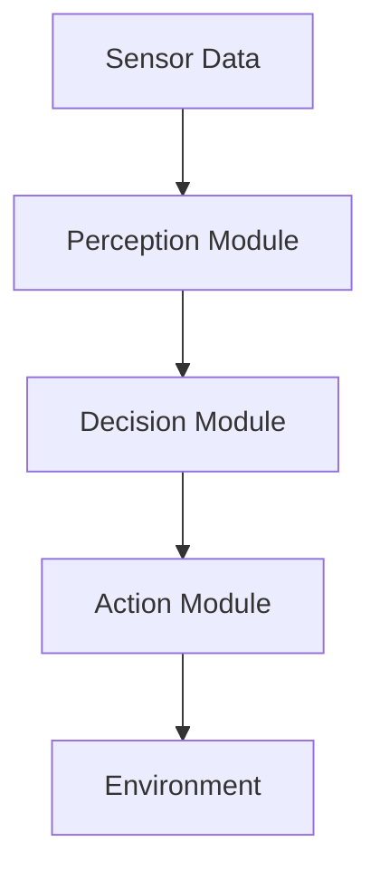

## 第3章：元学习算法基础

### 3.1 元学习的核心算法

**算法原理讲解**：
- **Mermaid 流程图**：展示元学习算法的基本流程。
- **Python 源代码**：实现基本的元学习算法。

```python
# Basic meta-learning algorithm
def meta_learning(data, model, optimizer):
    for epoch in range(data.num_epochs):
        optimizer.zero_grad()
        output = model(data)
        loss = calculate_loss(output, data.target)
        loss.backward()
        optimizer.step()
    return model
```

**数学模型和公式**：
- **元学习损失函数**：
  $$ L = \frac{1}{N} \sum_{i=1}^{N} \sum_{j=1}^{M} (y_{ij} - \hat{y}_{ij})^2 $$
  
**通俗易懂地举例说明**：以机器人学习在新地形中导航为例，说明元学习算法的应用。

### 3.2 元学习算法的分类

**系统分析与架构设计方案**：
- **问题场景介绍**：不同元学习算法的应用场景。
- **系统功能设计（领域模型Mermaid类图）**：展示不同元学习算法的核心功能。
- **系统架构设计Mermaid架构图**：展示不同元学习算法的整体架构。
- **系统接口设计和系统交互Mermaid序列图**：说明不同元学习算法的交互流程。

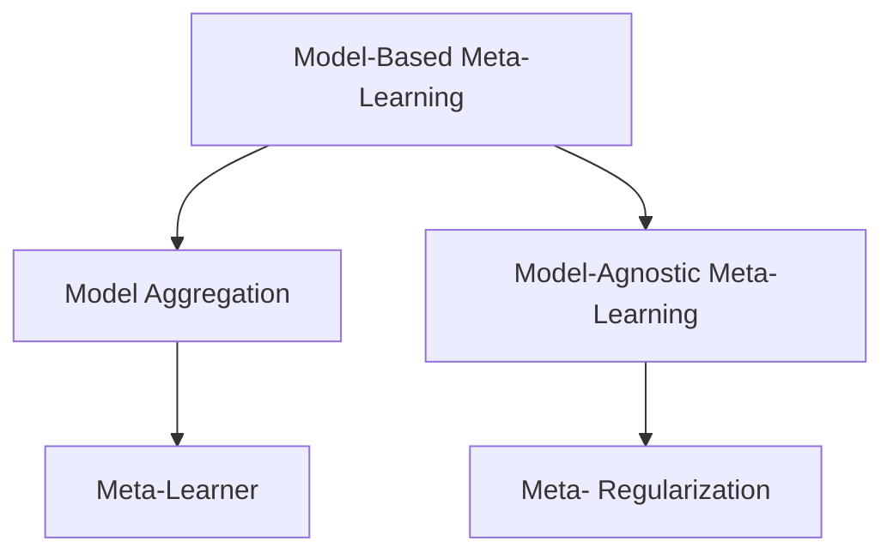

### 3.3 常见元学习算法详解

**核心概念与联系**：
- **核心概念原理**：详细介绍常见元学习算法（如MAML、Reptile等）的原理。
- **概念属性特征对比表格**：对比不同元学习算法的特性。

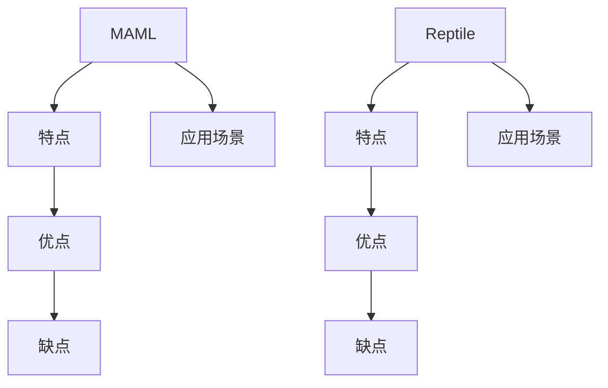

## 第4章：AI Agent的元学习模型设计与实现

### 4.1 元学习模型的设计原则

**算法原理讲解**：
- **Mermaid 流程图**：展示元学习模型的设计原则。
- **Python 源代码**：实现元学习模型的基本结构。

```python
# Meta-learning model design
class MetaLearningModel(nn.Module):
    def __init__(self):
        super(MetaLearningModel, self).__init__()
        # Define model layers
        self.fc1 = nn.Linear(input_size, hidden_size)
        self.fc2 = nn.Linear(hidden_size, output_size)
    
    def forward(self, x):
        x = F.relu(self.fc1(x))
        x = self.fc2(x)
        return x
```

**数学模型和公式**：
- **优化目标函数**：
  $$ \min_{\theta} J(\theta) = \frac{1}{N} \sum_{i=1}^{N} \sum_{j=1}^{M} \mathcal{L}(\theta; y_{ij}, \hat{y}_{ij}) $$
  
**通俗易懂地举例说明**：以机器人学习在新地形中导航为例，说明元学习模型的设计原则。

### 4.2 基于元学习的AI Agent模型

**核心概念与联系**：
- **核心概念原理**：基于元学习的AI Agent模型的工作原理。
- **ER实体关系图架构的 Mermaid 流程图**：展示AI Agent模型的实体关系。

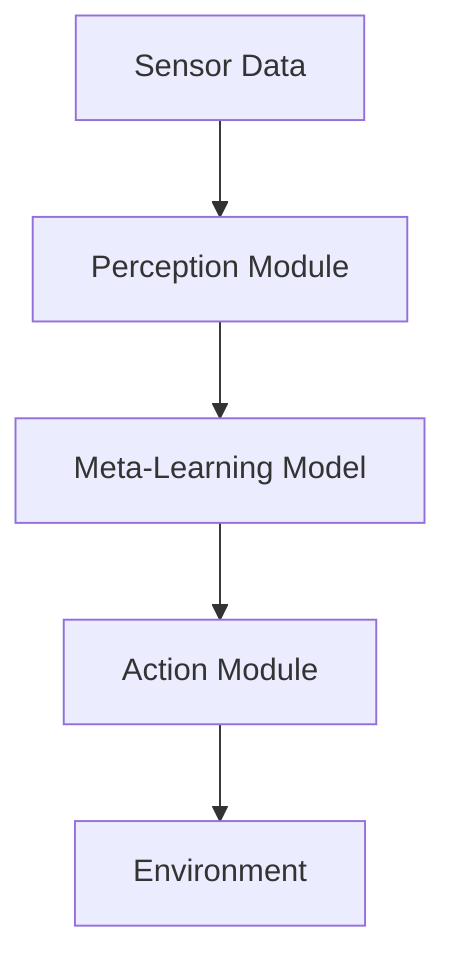

### 4.3 元学习模型实现案例分析

**项目实战**：
- **环境安装**：安装元学习相关的库和工具。
- **系统核心实现源代码**：基于元学习的AI Agent模型实现。
- **代码应用解读与分析**：对关键代码段的分析。
- **实际案例分析和详细讲解剖析**：通过案例展示元学习模型在实际中的应用。
- **项目小结**：总结项目的主要成果和经验。

## 第5章：元学习驱动的AI Agent在特定环境中的应用

### 5.1 元学习在动态环境中的应用

**核心概念与联系**：
- **核心概念原理**：动态环境中的元学习应用。
- **ER实体关系图架构的 Mermaid 流程图**：展示动态环境中的元学习流程。

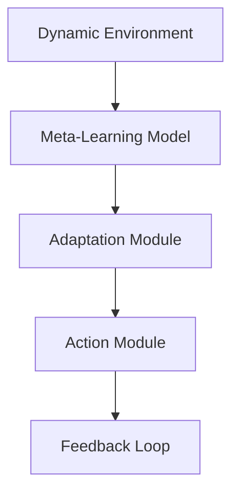

**通俗易懂地举例说明**：以无人机在复杂环境中的自适应导航为例。

### 5.2 元学习在未知环境中的探索

**核心概念与联系**：
- **核心概念原理**：未知环境中的元学习探索策略。
- **ER实体关系图架构的 Mermaid 流程图**：展示未知环境中的元学习流程。

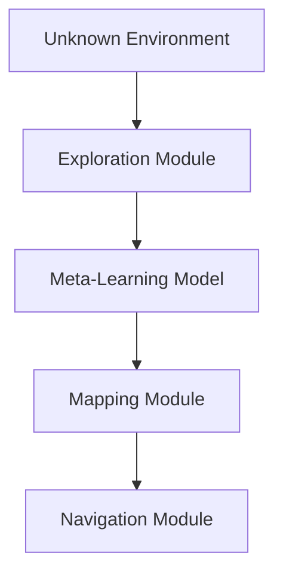

**通俗易懂地举例说明**：以探索未知星系为例，展示元学习在未知环境中的应用。

### 5.3 元学习在复杂环境中的挑战与应对策略

**核心概念与联系**：
- **核心概念原理**：复杂环境中的元学习挑战。
- **ER实体关系图架构的 Mermaid 流程图**：展示复杂环境中的元学习策略。

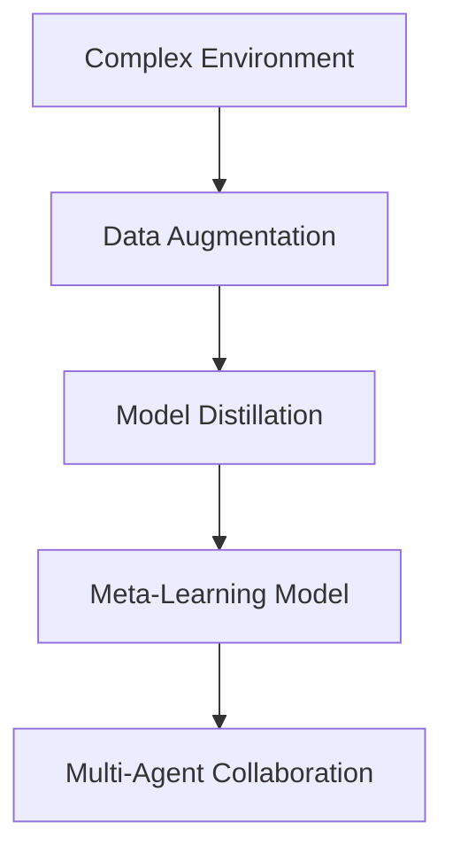

**通俗易懂地举例说明**：以城市交通管理为例，展示元学习在复杂环境中的挑战和应对策略。

## 第6章：元学习驱动的AI Agent优化策略

### 6.1 优化目标与评估指标

**核心概念与联系**：
- **核心概念原理**：元学习驱动的AI Agent优化目标。
- **ER实体关系图架构的 Mermaid 流程图**：展示优化目标的评估指标。

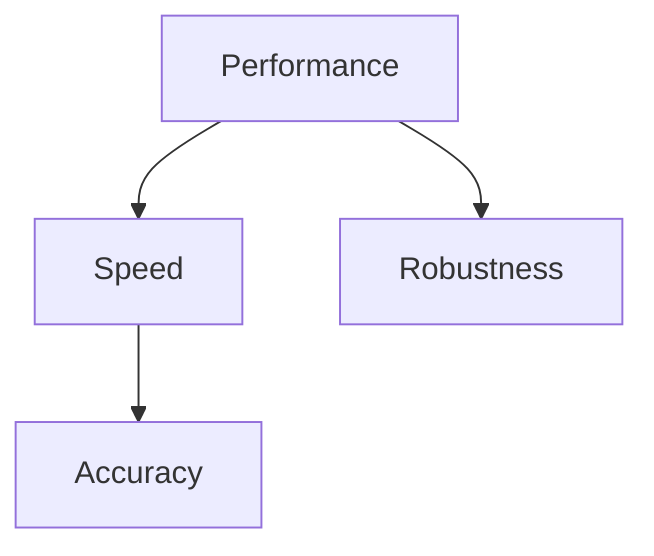

**通俗易懂地举例说明**：以医疗诊断AI Agent为例，说明优化目标的实现。

### 6.2 基于元学习的优化算法

**算法原理讲解**：
- **Mermaid 流程图**：展示基于元学习的优化算法流程。
- **Python 源代码**：实现基于元学习的优化算法。

```python
# Meta-optimization algorithm
def meta_optimize(model, optimizer, epochs, data_loader):
    for epoch in range(epochs):
        for data, target in data_loader:
            optimizer.zero_grad()
            output = model(data)
            loss = calculate_loss(output, target)
            loss.backward()
            optimizer.step()
    return model
```

**数学模型和公式**：
- **优化损失函数**：
  $$ L = \frac{1}{N} \sum_{i=1}^{N} \sum_{j=1}^{M} (y_{ij} - \hat{y}_{ij})^2 + \lambda \cdot \frac{1}{2} \sum_{i=1}^{N} \sum_{j=1}^{M} (\theta_i - \theta_j)^2 $$
  
**通俗易懂地举例说明**：以自动驾驶AI Agent为例，展示元学习优化算法的应用。

### 6.3 实际优化案例分析

**项目实战**：
- **环境安装**：安装优化相关的库和工具。
- **系统核心实现源代码**：实现基于元学习的优化算法。
- **代码应用解读与分析**：对关键代码段的分析。
- **实际案例分析和详细讲解剖析**：通过案例展示优化算法的实际效果。
- **项目小结**：总结项目的主要成果和经验。

## 第7章：元学习驱动的AI Agent未来展望

### 7.1 元学习技术的趋势与挑战

**核心概念与联系**：
- **核心概念原理**：元学习技术的未来发展趋势。
- **ER实体关系图架构的 Mermaid 流程图**：展示元学习技术在未来可能的发展路径。

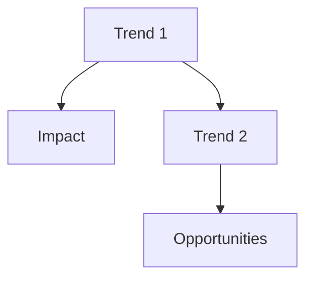

**通俗易懂地举例说明**：探讨元学习在智能医疗、智能交通等领域的潜在应用。

### 7.2 适应性AI Agent的发展方向

**核心概念与联系**：
- **核心概念原理**：适应性AI Agent的未来发展方向。
- **ER实体关系图架构的 Mermaid 流程图**：展示适应性AI Agent在不同领域的发展路径。

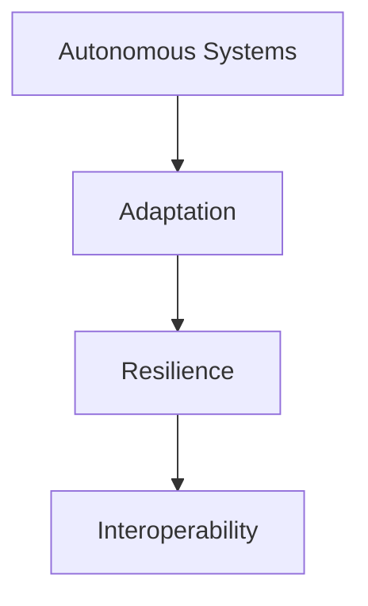

**通俗易懂地举例说明**：以智能家居为例，说明适应性AI Agent的未来方向。

### 7.3 元学习驱动的AI Agent在社会中的应用潜力

**核心概念与联系**：
- **核心概念原理**：元学习驱动的AI Agent在社会中的应用潜力。
- **ER实体关系图架构的 Mermaid 流程图**：展示元学习驱动的AI Agent在社会各个领域的应用场景。

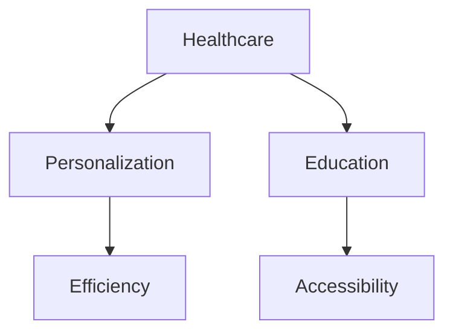

**通俗易懂地举例说明**：以教育领域为例，说明元学习驱动的AI Agent如何提高教育质量。

## 第8章：总结与展望

### 8.1 主要内容回顾

**最佳实践 tips**：
- **小贴士**：总结本章中的关键点，提供实用的技巧和经验。

### 8.2 研究成果总结

**小结**：
- **总结**：回顾本书的主要研究成果和贡献。

### 8.3 未来研究方向与建议

**注意事项**：
- **注意事项**：提醒读者在应用元学习技术时需要注意的事项。

### 8.4 拓展阅读

**拓展阅读**：
- **参考文献**：推荐相关的书籍、论文和技术文档，供读者进一步学习。

通过上述详细的结构和内容，我们可以确保文章的完整性和深度，同时保持逻辑清晰、易于理解。每个章节都涵盖了核心概念、算法原理、系统设计与实现、实际案例分析和未来展望，为读者提供了全面而深入的技术探讨。

