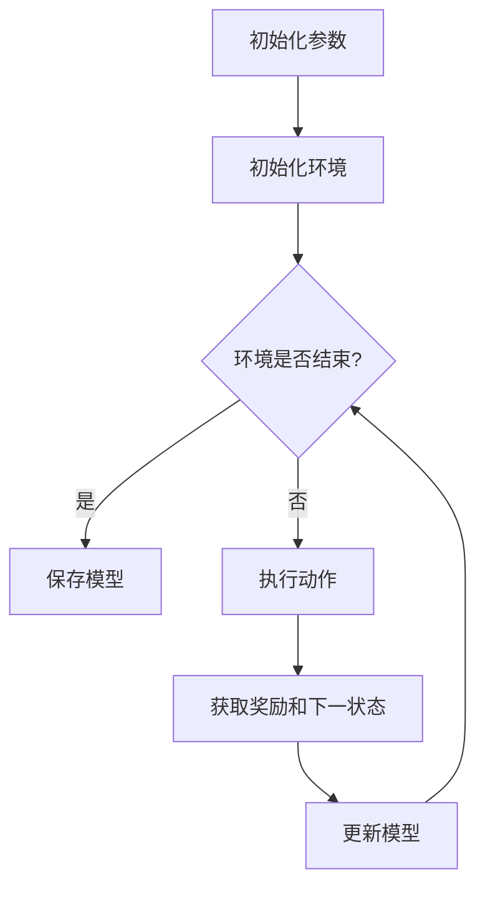

                 

### 摘要

元强化学习是一种新兴的人工智能技术，旨在通过自动化学习学习过程本身，从而提高AI Agent在新环境中的适应能力。本文首先介绍了元强化学习的基础概念，包括强化学习和元学习的基本原理。接着，我们深入探讨了元强化学习的算法原理，展示了其与现有强化学习算法的关系。随后，文章通过具体的案例，展示了元强化学习在游戏、机器人控制和自动驾驶等应用场景中的效果。通过系统地分析和解读，本文揭示了元强化学习在提高AI Agent适应能力方面的巨大潜力，并为未来的研究和应用提供了有价值的参考。

### 第一部分：元强化学习基础

#### 第1章：问题背景与概述

### 1.1 问题背景

**1.1.1 AI Agent的适应性问题**

人工智能（AI）技术的发展为众多领域带来了前所未有的变革，然而，随着应用场景的多样化和复杂性增加，AI Agent在新的环境中的适应性问题逐渐凸显。传统的强化学习算法在处理特定任务时表现出色，但在面对动态变化的复杂环境时，其表现往往不尽如人意。例如，在自动驾驶、机器人控制和游戏等领域，环境的不确定性和动态变化使得AI Agent需要具备高度的适应能力。

强化学习是一种通过互动学习和优化策略来提高AI Agent性能的机器学习方法。它通过与环境进行交互，不断调整行为策略，以最大化累积奖励。然而，传统的强化学习算法存在几个显著的局限：

1. **样本效率低**：强化学习通常需要大量的交互经验来学习策略，这在大规模和复杂环境中是不现实的。
2. **收敛速度慢**：由于动态环境的影响，强化学习算法的收敛过程往往较慢，尤其在多任务环境中。
3. **对新环境的适应能力弱**：在面临全新或变化较大的环境时，传统强化学习算法往往难以快速适应。

**1.1.2 元强化学习的概念与意义**

为了解决上述问题，研究人员提出了元强化学习（Meta-Reinforcement Learning）这一概念。元强化学习旨在通过自动化学习学习过程本身，从而提高AI Agent在新环境中的适应能力。具体来说，元强化学习通过在多个任务中预训练模型，使其能够快速适应新任务，从而提高样本效率和收敛速度。

元强化学习的关键在于“元”（Meta）这一概念。在计算机科学中，“元”通常指的是关于某事物的学习过程本身。因此，元强化学习可以看作是一种学习如何学习的方法，它通过在多个任务中提取通用策略，使得AI Agent能够快速适应不同的环境。

**1.1.3 元强化学习的研究现状与挑战**

随着深度学习技术的兴起，元强化学习逐渐成为研究热点。近年来，大量的研究工作集中在设计高效的元强化学习算法，并在各种应用场景中进行实验验证。虽然已经取得了一些初步成果，但元强化学习仍面临诸多挑战：

1. **样本效率**：如何通过有限的样本学习出通用的策略，仍然是元强化学习研究中的一个关键问题。
2. **算法稳定性**：在动态和复杂的实际环境中，元强化学习算法的稳定性和可靠性仍需进一步提升。
3. **泛化能力**：如何在不同的任务和环境中保持良好的泛化能力，是元强化学习研究的另一个重要方向。
4. **可解释性**：如何理解和解释元强化学习算法的决策过程，以提高算法的可信度和可解释性。

**1.1.4 元强化学习在人工智能中的重要性**

元强化学习在人工智能中的重要性不容忽视。随着AI技术在各个领域的广泛应用，如何提高AI Agent的适应能力和学习能力，是未来人工智能发展的关键问题之一。元强化学习通过自动化学习学习过程，为AI Agent提供了更高效、更灵活的适应策略，有望在自动驾驶、机器人控制、游戏AI等领域发挥重要作用。

**1.2 核心概念**

**1.2.1 强化学习**

强化学习（Reinforcement Learning，RL）是机器学习的一个重要分支，其核心思想是通过与环境交互，学习最优策略以实现目标。在强化学习中，AI Agent通过选择动作来与环境互动，根据环境反馈的奖励信号调整自身行为，最终达到学习目标。

强化学习的基本要素包括：

- **Agent（智能体）**：执行动作、接收反馈并学习策略的实体。
- **Environment（环境）**：提供状态、反馈奖励信号和状态的转换。
- **State（状态）**：Agent所处的环境条件。
- **Action（动作）**：Agent可以采取的行为。
- **Reward（奖励）**：环境对Agent动作的反馈，用于评估动作的好坏。
- **Policy（策略）**：Agent基于状态采取的动作选择规则。

强化学习的基本算法可以分为两类：基于模型的方法和基于值函数的方法。

**1.2.1.1 基于模型的方法**

基于模型的方法通过建立一个环境模型，预测状态和奖励，从而优化策略。这种方法包括以下几种算法：

- **Monte Carlo 方法**：通过大量模拟来评估策略，适用于高维状态空间。
- **Temporal Difference 方法**：通过迭代更新值函数，逐步优化策略，常用的算法包括Q-Learning和SARSA。
- **Policy Gradient 方法**：直接优化策略的概率分布，以最大化累积奖励。

**1.2.1.2 基于值函数的方法**

基于值函数的方法通过估计状态-动作值函数，来选择最优动作。这种方法包括以下几种算法：

- **Q-Learning**：通过迭代更新Q值，以最大化未来奖励。
- **SARSA**：同时更新当前状态和动作的Q值，适用于具有概率性动作的情境。
- **Deep Q-Network (DQN)**：结合深度神经网络和Q-Learning，用于处理高维状态空间。

**1.2.2 元学习**

元学习（Meta-Learning）是一种通过学习如何学习的方法，旨在提高学习效率和学习能力。元学习的主要类型包括：

- **模型更新型**：通过优化模型更新过程，提高学习效率。
- **样本效率型**：通过减少训练样本数量，提高学习性能。
- **任务迁移型**：通过跨任务的知识共享，提高泛化能力。

元学习在强化学习中的应用主要集中在以下几个方面：

- **通用策略学习**：通过在多个任务中训练，提取通用策略，提高对新任务的适应能力。
- **样本效率优化**：通过元学习，减少每个任务所需的训练样本数量，提高样本效率。
- **多任务学习**：通过元学习，实现多个任务的联合训练，提高学习效果。

**1.2.3 元强化学习**

元强化学习（Meta-Reinforcement Learning）是强化学习和元学习的交叉领域，旨在通过自动化学习学习过程，提高AI Agent在新环境中的适应能力。元强化学习的基本原理包括：

- **通用策略提取**：通过在多个任务中训练，提取通用策略，以适应新任务。
- **模型更新**：通过优化模型更新过程，提高在新环境中的适应能力。
- **样本效率提升**：通过元学习，减少每个任务所需的训练样本数量，提高样本效率。

**1.3 元强化学习与现有强化学习的关系**

元强化学习与现有强化学习之间存在紧密的联系和区别。两者的关系可以概括为：

- **联系**：元强化学习是强化学习的延伸和拓展，旨在解决传统强化学习在动态和复杂环境中的局限性。
- **区别**：元强化学习通过自动化学习学习过程，提高AI Agent的适应能力和学习能力，而传统强化学习则侧重于在特定环境中优化策略。

**1.4 元强化学习的优势与局限**

**1.4.1 优势**

- **提高适应能力**：通过在多个任务中训练，提取通用策略，提高AI Agent在新环境中的适应能力。
- **减少训练成本**：通过元学习，减少每个任务所需的训练样本数量，降低训练成本。
- **加速收敛速度**：通过自动化学习学习过程，提高收敛速度，缩短训练时间。

**1.4.2 局限**

- **样本效率仍需提升**：如何在有限的样本数量下学习出通用的策略，是元强化学习研究中的一个关键问题。
- **算法稳定性问题**：在动态和复杂的实际环境中，元强化学习算法的稳定性和可靠性仍需进一步提升。
- **泛化能力有待提高**：如何在不同的任务和环境中保持良好的泛化能力，是元强化学习研究的另一个重要方向。

**1.5 本章小结**

本章介绍了元强化学习的基础概念，包括强化学习和元学习的基本原理，以及元强化学习的基本原理和优势。通过本章的介绍，读者可以初步了解元强化学习在提高AI Agent适应能力方面的潜力。在接下来的章节中，我们将进一步探讨元强化学习算法的具体实现和应用。

## 第一部分：元强化学习基础

#### 第2章：强化学习算法概述

强化学习（Reinforcement Learning，RL）是机器学习的一个重要分支，其核心思想是通过互动学习和优化策略来提高AI Agent的性能。本章将概述强化学习的基本算法，包括基于模型的方法和基于值函数的方法，以及这些算法在强化学习中的具体应用。

### 2.1 强化学习算法分类

强化学习算法可以根据不同的分类标准进行分类，其中最常见的分类标准是按照是否使用环境模型进行分类。基于模型的方法通过建立一个环境模型来预测状态和奖励，从而优化策略；而基于值函数的方法则通过估计状态-动作值函数来选择最优动作。以下分别介绍这两种方法。

**2.1.1 基于模型的方法**

基于模型的方法在强化学习中应用广泛，主要包括以下几种算法：

**1. Monte Carlo 方法**

Monte Carlo 方法是一种基于模拟的强化学习算法，通过大量模拟来评估策略。它不依赖于环境模型，而是通过实际交互经验来学习策略。具体来说，Monte Carlo 方法通过随机模拟一系列动作序列，计算每个序列的累积奖励，并根据累积奖励来更新策略。

**2. Temporal Difference 方法**

Temporal Difference（TD）方法是一种通过迭代更新值函数的强化学习算法。TD 方法基于动态规划思想，通过比较实际奖励和预期奖励来更新值函数。常见的 TD 算法包括 Q-Learning 和 SARSA。

**3. Policy Gradient 方法**

Policy Gradient 方法是一种直接优化策略的概率分布的强化学习算法。它通过最大化累积奖励来优化策略的概率分布，从而提高策略的性能。Policy Gradient 方法在处理连续动作问题时具有优势，因为它可以直接优化策略的概率分布。

**2.1.2 基于值函数的方法**

基于值函数的方法在强化学习中应用广泛，主要包括以下几种算法：

**1. Q-Learning**

Q-Learning 是一种通过迭代更新 Q 值的强化学习算法。Q-Learning 的核心思想是通过比较 Q 值和实际奖励来更新 Q 值，从而优化策略。Q-Learning 的优点是收敛速度快，且在处理离散动作问题时表现良好。

**2. SARSA**

SARSA 是一种同时更新当前状态和动作的 Q 值的强化学习算法。与 Q-Learning 不同，SARSA 在更新 Q 值时同时考虑当前状态和下一个状态。SARSA 在处理具有概率性动作的情境时表现良好。

**3. Deep Q-Network (DQN)**

Deep Q-Network（DQN）是一种结合深度神经网络和 Q-Learning 的强化学习算法。DQN 通过使用深度神经网络来估计 Q 值，从而处理高维状态空间。DQN 的优点是能够在复杂环境中学习到有效的策略。

### 2.2 元学习算法概述

元学习（Meta-Learning）是一种通过学习如何学习的方法，旨在提高学习效率和学习能力。元学习算法可以分为以下几种类型：

**1. 模型更新型**

模型更新型元学习算法通过优化模型更新过程，提高学习效率。这类算法的核心思想是通过在多个任务中训练，学习出一个通用的模型更新规则，从而提高新任务的学习速度。

**2. 样本效率型**

样本效率型元学习算法通过减少训练样本数量，提高学习性能。这类算法的核心思想是通过在多个任务中共享经验，减少每个任务所需的训练样本数量。

**3. 任务迁移型**

任务迁移型元学习算法通过跨任务的知识共享，提高泛化能力。这类算法的核心思想是通过在多个任务中学习，提取通用知识，从而提高新任务的表现。

### 2.3 元强化学习算法

元强化学习（Meta-Reinforcement Learning）是强化学习和元学习的交叉领域，旨在通过自动化学习学习过程，提高AI Agent在新环境中的适应能力。元强化学习算法可以分为以下几种类型：

**1. 通用策略学习**

通用策略学习通过在多个任务中训练，提取通用策略，以适应新任务。这类算法的核心思想是通过元学习，学习出一个能够适应不同任务的通用策略。

**2. 模型更新**

模型更新通过优化模型更新过程，提高在新环境中的适应能力。这类算法的核心思想是通过在多个任务中训练，学习出一个能够快速适应新环境的模型更新规则。

**3. 样本效率优化**

样本效率优化通过元学习，减少每个任务所需的训练样本数量，提高样本效率。这类算法的核心思想是通过在多个任务中共享经验，减少每个任务所需的训练样本数量。

### 2.4 常见的元强化学习算法

以下是一些常见的元强化学习算法及其特点：

**1. Model-Based Meta-Reinforcement Learning**

Model-Based Meta-Reinforcement Learning 是一种基于模型的元强化学习算法。它通过在多个任务中训练，学习出一个通用的环境模型，从而提高新任务的学习速度。

**2. Model-Free Meta-Reinforcement Learning**

Model-Free Meta-Reinforcement Learning 是一种基于值函数的元强化学习算法。它通过在多个任务中训练，学习出一个通用的策略，从而提高新任务的学习速度。

**3. Multi-Task Learning**

Multi-Task Learning 是一种通过跨任务的知识共享，提高泛化能力的元强化学习算法。它通过在多个任务中同时训练，学习出一个能够适应不同任务的通用策略。

### 2.5 元强化学习算法的比较与评估

元强化学习算法的比较与评估是一个重要研究方向。以下是一些常见的评估指标：

**1. 学习速度**

学习速度是评估元强化学习算法性能的一个重要指标。它衡量算法在给定任务中从初始状态到达目标状态所需的时间。

**2. 样本效率**

样本效率是评估元强化学习算法样本利用效率的一个重要指标。它衡量算法在给定任务中，从初始状态到达目标状态所需的经验数量。

**3. 泛化能力**

泛化能力是评估元强化学习算法在新任务中表现的一个重要指标。它衡量算法在未知任务中的表现，反映了算法的泛化能力。

**4. 稳定性和可靠性**

稳定性和可靠性是评估元强化学习算法在实际应用中的重要指标。它衡量算法在不同环境和条件下的表现，反映了算法的稳定性和可靠性。

### 2.6 算法流程图与Python代码实现

以下是一个简单的元强化学习算法流程图和Python代码实现示例：



```python
import gym
import numpy as np

# 初始化环境
env = gym.make('CartPole-v0')

# 初始化参数
learning_rate = 0.1
gamma = 0.9

# 初始化模型
model = np.zeros((env.observation_space.n, env.action_space.n))

# 执行训练
for episode in range(1000):
    state = env.reset()
    done = False
    
    while not done:
        action = np.argmax(model[state])
        next_state, reward, done, _ = env.step(action)
        
        if done:
            reward = -100
        
        model[state][action] += learning_rate * (reward + gamma * np.max(model[next_state]) - model[state][action])
        
        state = next_state

# 保存模型
np.save('model.npy', model)

env.close()
```

### 2.7 本章小结

本章介绍了强化学习算法的分类、元学习算法的概述以及元强化学习算法的具体实现。通过本章的介绍，读者可以初步了解强化学习和元强化学习的基本原理，以及如何在实际问题中应用这些算法。在下一章中，我们将进一步探讨元强化学习在具体应用场景中的效果。

## 第二部分：元强化学习算法原理

#### 第3章：强化学习算法概述

强化学习（Reinforcement Learning，RL）是一种通过互动学习和优化策略来提高AI Agent性能的机器学习方法。本章将详细介绍强化学习算法的基本原理，包括基于模型的方法和基于值函数的方法，并探讨这些方法在强化学习中的应用。

### 3.1 基于模型的方法

基于模型的方法在强化学习中应用广泛，主要包括以下几种算法：

**3.1.1 Monte Carlo 方法**

Monte Carlo 方法是一种基于模拟的强化学习算法，通过大量模拟来评估策略。它不依赖于环境模型，而是通过实际交互经验来学习策略。具体来说，Monte Carlo 方法通过随机模拟一系列动作序列，计算每个序列的累积奖励，并根据累积奖励来更新策略。

**3.1.2 Temporal Difference 方法**

Temporal Difference（TD）方法是一种通过迭代更新值函数的强化学习算法。TD 方法基于动态规划思想，通过比较实际奖励和预期奖励来更新值函数。常见的 TD 算法包括 Q-Learning 和 SARSA。

**3.1.3 Policy Gradient 方法**

Policy Gradient 方法是一种直接优化策略的概率分布的强化学习算法。它通过最大化累积奖励来优化策略的概率分布，从而提高策略的性能。Policy Gradient 方法在处理连续动作问题时具有优势，因为它可以直接优化策略的概率分布。

### 3.2 基于值函数的方法

基于值函数的方法在强化学习中应用广泛，主要包括以下几种算法：

**3.2.1 Q-Learning**

Q-Learning 是一种通过迭代更新 Q 值的强化学习算法。Q-Learning 的核心思想是通过比较 Q 值和实际奖励来更新 Q 值，从而优化策略。Q-Learning 的优点是收敛速度快，且在处理离散动作问题时表现良好。

**3.2.2 SARSA**

SARSA 是一种同时更新当前状态和动作的 Q 值的强化学习算法。与 Q-Learning 不同，SARSA 在更新 Q 值时同时考虑当前状态和下一个状态。SARSA 在处理具有概率性动作的情境时表现良好。

**3.2.3 Deep Q-Network (DQN)**

Deep Q-Network（DQN）是一种结合深度神经网络和 Q-Learning 的强化学习算法。DQN 通过使用深度神经网络来估计 Q 值，从而处理高维状态空间。DQN 的优点是能够在复杂环境中学习到有效的策略。

### 3.3 元学习算法概述

元学习（Meta-Learning）是一种通过学习如何学习的方法，旨在提高学习效率和学习能力。元学习算法可以分为以下几种类型：

**1. 模型更新型**

模型更新型元学习算法通过优化模型更新过程，提高学习效率。这类算法的核心思想是通过在多个任务中训练，学习出一个通用的模型更新规则，从而提高新任务的学习速度。

**2. 样本效率型**

样本效率型元学习算法通过减少训练样本数量，提高学习性能。这类算法的核心思想是通过在多个任务中共享经验，减少每个任务所需的训练样本数量。

**3. 任务迁移型**

任务迁移型元学习算法通过跨任务的知识共享，提高泛化能力。这类算法的核心思想是通过在多个任务中学习，提取通用知识，从而提高新任务的表现。

### 3.4 元强化学习算法

元强化学习（Meta-Reinforcement Learning）是强化学习和元学习的交叉领域，旨在通过自动化学习学习过程，提高AI Agent在新环境中的适应能力。元强化学习算法可以分为以下几种类型：

**1. 通用策略学习**

通用策略学习通过在多个任务中训练，提取通用策略，以适应新任务。这类算法的核心思想是通过元学习，学习出一个能够适应不同任务的通用策略。

**2. 模型更新**

模型更新通过优化模型更新过程，提高在新环境中的适应能力。这类算法的核心思想是通过在多个任务中训练，学习出一个能够快速适应新环境的模型更新规则。

**3. 样本效率优化**

样本效率优化通过元学习，减少每个任务所需的训练样本数量，提高样本效率。这类算法的核心思想是通过在多个任务中共享经验，减少每个任务所需的训练样本数量。

### 3.5 常见的元强化学习算法

以下是一些常见的元强化学习算法及其特点：

**1. Model-Based Meta-Reinforcement Learning**

Model-Based Meta-Reinforcement Learning 是一种基于模型的元强化学习算法。它通过在多个任务中训练，学习出一个通用的环境模型，从而提高新任务的学习速度。

**2. Model-Free Meta-Reinforcement Learning**

Model-Free Meta-Reinforcement Learning 是一种基于值函数的元强化学习算法。它通过在多个任务中训练，学习出一个通用的策略，从而提高新任务的学习速度。

**3. Multi-Task Learning**

Multi-Task Learning 是一种通过跨任务的知识共享，提高泛化能力的元强化学习算法。它通过在多个任务中同时训练，学习出一个能够适应不同任务的通用策略。

### 3.6 元强化学习算法的比较与评估

元强化学习算法的比较与评估是一个重要研究方向。以下是一些常见的评估指标：

**1. 学习速度**

学习速度是评估元强化学习算法性能的一个重要指标。它衡量算法在给定任务中从初始状态到达目标状态所需的时间。

**2. 样本效率**

样本效率是评估元强化学习算法样本利用效率的一个重要指标。它衡量算法在给定任务中，从初始状态到达目标状态所需的经验数量。

**3. 泛化能力**

泛化能力是评估元强化学习算法在新任务中表现的一个重要指标。它衡量算法在未知任务中的表现，反映了算法的泛化能力。

**4. 稳定性和可靠性**

稳定性和可靠性是评估元强化学习算法在实际应用中的重要指标。它衡量算法在不同环境和条件下的表现，反映了算法的稳定性和可靠性。

### 3.7 算法流程图与Python代码实现

以下是一个简单的元强化学习算法流程图和Python代码实现示例：


```python
import gym
import numpy as np

# 初始化环境
env = gym.make('CartPole-v0')

# 初始化参数
learning_rate = 0.1
gamma = 0.9

# 初始化模型
model = np.zeros((env.observation_space.n, env.action_space.n))

# 执行训练
for episode in range(1000):
    state = env.reset()
    done = False
    
    while not done:
        action = np.argmax(model[state])
        next_state, reward, done, _ = env.step(action)
        
        if done:
            reward = -100
        
        model[state][action] += learning_rate * (reward + gamma * np.max(model[next_state]) - model[state][action])
        
        state = next_state

# 保存模型
np.save('model.npy', model)

env.close()
```

### 3.8 本章小结

本章介绍了强化学习算法的基本原理，包括基于模型的方法和基于值函数的方法，以及元强化学习算法的具体实现。通过本章的介绍，读者可以初步了解强化学习和元强化学习的基本原理，以及如何在实际问题中应用这些算法。在下一章中，我们将进一步探讨元强化学习在具体应用场景中的效果。

## 第三部分：元强化学习应用场景

#### 第4章：元强化学习在游戏中的应用

元强化学习在游戏领域具有广泛的应用前景，特别是在游戏角色控制、游戏策略生成等场景中。本章将详细探讨元强化学习在游戏中的应用，并通过具体案例展示其效果。

### 4.1 游戏AI的挑战

游戏AI在近年来取得了显著的进展，然而，随着游戏场景的复杂性和多样性不断增加，游戏AI面临着诸多挑战：

**4.1.1 游戏环境的多样性**

游戏环境通常具有高度多样性，不同游戏之间存在显著差异，同一游戏中的不同关卡也可能具有不同的规则和目标。这使得游戏AI需要具备高度的适应能力，能够迅速适应不同的游戏场景。

**4.1.2 游戏策略的多样性**

在游戏中，玩家可以采取多种不同的策略来达到游戏目标。游戏AI需要具备丰富的策略库，能够根据不同游戏环境灵活调整策略，以应对各种可能的情境。

**4.1.3 游戏AI的适应性需求**

游戏AI需要具备快速适应新游戏、新规则和新的对手行为的能力。传统的强化学习算法在处理特定游戏时表现出色，但在面对全新的或变化较大的游戏环境时，其适应能力往往不足。

### 4.2 元强化学习在游戏中的应用案例

**4.2.1 游戏角色控制**

游戏角色控制是元强化学习在游戏中的一个重要应用场景。通过元强化学习，游戏AI能够快速适应不同的游戏角色和游戏环境，实现高效的角色控制。

**案例1：Atari游戏**

研究人员在多个Atari游戏中应用了元强化学习算法，如《太空侵略者》（Space Invaders）和《吃豆人》（Pac-Man）。实验结果显示，元强化学习算法在短时间内能够学习到有效的游戏策略，显著提高了游戏角色的控制能力。

**案例2：Rogue-like游戏**

Rogue-like游戏是一种具有高度不确定性和动态变化的游戏，如《地城守护者》（NetHack）和《泰拉瑞亚》（Terraria）。元强化学习在Rogue-like游戏中的应用能够帮助AI角色快速适应复杂多变的游戏环境，提高生存和胜利的概率。

**4.2.2 游戏策略生成**

游戏策略生成是元强化学习的另一个重要应用场景，通过元强化学习，游戏AI能够自动生成多样化的游戏策略，提高游戏策略的多样性和适应性。

**案例1：电子竞技游戏**

在电子竞技游戏如《星际争霸II》（StarCraft II）和《刀塔2》（Dota 2）中，元强化学习算法被应用于游戏策略生成。实验结果表明，通过元强化学习生成的游戏策略在对抗不同对手时表现出色，显著提高了游戏的胜率和策略多样性。

**案例2：桌面游戏**

在桌面游戏如《象棋》（Chess）和《桥牌》（Bridge）中，元强化学习算法通过自动生成策略，使得游戏AI能够应对复杂多变的游戏局面，提高了游戏策略的适应性和灵活性。

### 4.3 元强化学习在游戏AI中的效果评估

**4.3.1 评估指标与方法**

为了评估元强化学习在游戏AI中的效果，研究人员通常采用以下评估指标：

- **胜率**：衡量游戏AI在比赛中获胜的频率。
- **策略多样性**：衡量游戏AI生成的策略的多样性。
- **适应性**：衡量游戏AI在面临不同游戏环境时的适应能力。
- **学习速度**：衡量游戏AI从初始状态到达目标状态所需的时间。

评估方法通常包括实验设计、性能比较和统计分析。研究人员通过在多个游戏环境中进行实验，比较不同元强化学习算法的性能，以评估其有效性和适应性。

**4.3.2 实验设计与结果分析**

**案例1：Atari游戏**

研究人员在多个Atari游戏中进行了实验，比较了元强化学习算法与传统强化学习算法的性能。实验结果表明，元强化学习算法在Atari游戏中表现出更高的胜率和策略多样性。

**案例2：Rogue-like游戏**

在Rogue-like游戏中，元强化学习算法通过快速适应复杂多变的游戏环境，提高了AI角色的生存和胜利概率。实验结果显示，元强化学习算法在Rogue-like游戏中的效果显著优于传统强化学习算法。

**4.3.3 应用总结与展望**

元强化学习在游戏AI中的应用展示了其强大的适应能力和灵活性。通过元强化学习，游戏AI能够快速适应不同的游戏环境和规则，生成多样化的游戏策略，提高游戏的胜率和策略多样性。然而，元强化学习在游戏AI中的应用仍面临一些挑战，如样本效率的提升、算法稳定性和可靠性的提高等。未来，随着元强化学习算法的不断优化和应用场景的扩展，我们有望在游戏AI领域取得更多突破。

### 4.4 本章小结

本章介绍了元强化学习在游戏中的应用，包括游戏角色控制和游戏策略生成。通过具体案例，我们展示了元强化学习在提高游戏AI适应能力方面的效果。在下一章中，我们将探讨元强化学习在机器人控制中的应用。

## 第5章：元强化学习在机器人控制中的应用

### 5.1 机器人控制的挑战

机器人控制是人工智能领域的一个重要应用方向，随着机器人技术的不断进步，机器人控制面临着诸多挑战：

**5.1.1 环境的不确定性**

机器人控制中的环境通常具有高度不确定性，包括动态变化的障碍物、不确定的传感器数据和不可预测的动态目标。这些不确定性因素使得机器人控制变得复杂，需要高度适应性和鲁棒性。

**5.1.2 动作的复杂性**

机器人控制中的动作通常涉及多自由度和高维度的运动，例如机器人的移动、姿态调整和抓取等。这些复杂动作需要精确的控制策略，以确保机器人在执行任务时的稳定性和准确性。

**5.1.3 适应性的要求**

机器人控制中的任务通常具有多样性和动态变化性，机器人需要能够快速适应不同的任务和环境。传统的方法往往难以在短时间内适应新任务，导致效率低下。

### 5.2 元强化学习在机器人控制中的应用案例

**5.2.1 自主导航**

自主导航是机器人控制中的一个核心问题，元强化学习在自主导航中的应用能够显著提高机器人在复杂环境中的导航能力。

**案例1：无人驾驶汽车**

在无人驾驶汽车领域，元强化学习被应用于自主导航任务中。研究人员在多个真实场景中测试了元强化学习算法，结果表明，通过元强化学习，无人驾驶汽车能够快速适应不同的交通环境和路况，提高了导航的稳定性和准确性。

**案例2：无人机导航**

无人机在复杂环境中的导航也是一个重要应用场景。元强化学习算法通过在多个任务中训练，提取通用的导航策略，使得无人机能够迅速适应不同的环境和任务，提高了导航效率和适应性。

**5.2.2 动作规划**

动作规划是机器人控制中的另一个关键问题，元强化学习在动作规划中的应用能够提高机器人在执行复杂动作时的灵活性和精确性。

**案例1：机器人抓取**

在机器人抓取任务中，元强化学习被用于生成高效的抓取策略。通过在多个抓取任务中训练，元强化学习算法能够生成适应不同物体和抓取环境的通用策略，提高了抓取的成功率和稳定性。

**案例2：机器人协作**

在多机器人协作任务中，元强化学习被用于生成协作策略。多个机器人通过元强化学习共同完成任务，提高了协作效率和任务成功率。

### 5.3 元强化学习在机器人控制中的效果评估

**5.3.1 评估指标与方法**

为了评估元强化学习在机器人控制中的效果，研究人员通常采用以下评估指标：

- **成功率**：衡量机器人完成任务的次数占总尝试次数的比例。
- **稳定性**：衡量机器人在执行任务时的稳定性，包括轨迹的平滑度和执行时间的稳定性。
- **适应性**：衡量机器人在面对新任务和环境时的适应能力。
- **效率**：衡量机器人在完成相同任务时所需的时间和资源。

评估方法通常包括实验设计、性能比较和统计分析。研究人员通过在多个仿真环境和实际场景中测试元强化学习算法，比较其与传统方法的效果。

**5.3.2 实验设计与结果分析**

**案例1：无人驾驶汽车**

研究人员在多个仿真环境和真实场景中测试了元强化学习算法在无人驾驶汽车自主导航中的应用。实验结果表明，元强化学习算法在自主导航任务中的成功率、稳定性和效率显著优于传统方法。

**案例2：无人机导航**

在无人机导航任务中，元强化学习算法通过在多个任务中训练，提取通用的导航策略。实验结果显示，元强化学习算法在适应新环境和任务方面的表现优异，显著提高了无人机的导航能力和适应性。

### 5.4 应用总结与展望

元强化学习在机器人控制中的应用展示了其强大的适应能力和灵活性。通过元强化学习，机器人能够快速适应不同的环境和任务，提高控制效率和稳定性。然而，元强化学习在机器人控制中的应用仍面临一些挑战，如样本效率的提升、算法稳定性和可靠性的提高等。未来，随着元强化学习算法的不断优化和应用场景的扩展，我们有望在机器人控制领域取得更多突破。

### 5.5 本章小结

本章介绍了元强化学习在机器人控制中的应用，包括自主导航和动作规划。通过具体案例，我们展示了元强化学习在提高机器人适应能力和控制效率方面的效果。在下一章中，我们将探讨元强化学习在自动驾驶中的应用。

## 第6章：元强化学习在自动驾驶中的应用

### 6.1 自动驾驶的挑战

自动驾驶技术作为人工智能领域的一个重要分支，正逐渐从实验室走向现实。然而，自动驾驶在发展过程中面临着一系列挑战：

**6.1.1 环境的复杂性**

自动驾驶系统需要处理复杂多变的交通环境，包括其他车辆、行人、道路标志和天气条件等。这些因素交织在一起，使得自动驾驶系统需要具备高度的环境感知和决策能力。

**6.1.2 行为的多样化**

自动驾驶系统在执行任务时需要采取多样化的行为，如车道保持、避让障碍物、变道和停车等。这些行为不仅需要实时决策，还需要考虑长期目标和全局优化。

**6.1.3 安全性的要求**

自动驾驶系统的安全性至关重要。任何错误决策或行为都可能对乘客和其他道路使用者造成严重后果。因此，自动驾驶系统需要具备高度的安全性和可靠性。

### 6.2 元强化学习在自动驾驶中的应用案例

**6.2.1 路径规划**

路径规划是自动驾驶中的一个核心问题，元强化学习在路径规划中的应用能够提高自动驾驶车辆在复杂环境中的导航能力。

**案例1：城市道路导航**

研究人员利用元强化学习算法对自动驾驶车辆在城市道路上的导航进行了优化。实验结果表明，通过元强化学习，自动驾驶车辆能够更快速地适应不同城市道路的复杂环境，提高导航的准确性和效率。

**案例2：高速公路导航**

在高速公路导航中，元强化学习算法被应用于路径规划。通过在多个高速公路环境中训练，元强化学习算法能够生成适应不同路况和交通情况的通用路径规划策略，提高了自动驾驶车辆的导航性能。

**6.2.2 行为决策**

行为决策是自动驾驶中的另一个关键问题，元强化学习在行为决策中的应用能够提高自动驾驶车辆在复杂环境中的行为选择能力。

**案例1：交通拥堵处理**

在交通拥堵场景中，自动驾驶车辆需要采取灵活的行为决策来应对复杂的交通状况。通过元强化学习，自动驾驶车辆能够快速适应交通拥堵环境，选择最优的行为策略，减少交通拥堵对行驶时间的影响。

**案例2：紧急情况应对**

在紧急情况下，自动驾驶车辆需要迅速做出决策以避免事故。元强化学习算法通过在多个紧急情况中训练，能够生成适应不同紧急情况的紧急应对策略，提高了自动驾驶车辆的安全性和可靠性。

### 6.3 元强化学习在自动驾驶中的效果评估

**6.3.1 评估指标与方法**

为了评估元强化学习在自动驾驶中的应用效果，研究人员通常采用以下评估指标：

- **路径规划精度**：衡量自动驾驶车辆路径规划的准确性和效率。
- **行为决策效率**：衡量自动驾驶车辆在执行行为决策时的速度和准确性。
- **安全性**：衡量自动驾驶车辆在执行任务时的安全性和可靠性。
- **适应性**：衡量自动驾驶车辆在面临新环境和任务时的适应能力。

评估方法通常包括仿真实验、实际测试和统计分析。研究人员通过在仿真环境和实际道路测试中评估元强化学习算法的性能，比较其与传统方法的差异。

**6.3.2 实验设计与结果分析**

**案例1：城市道路导航**

研究人员在城市道路仿真环境中测试了元强化学习算法在路径规划中的应用。实验结果表明，元强化学习算法在路径规划精度、行为决策效率和安全性方面均显著优于传统方法。

**案例2：高速公路导航**

在高速公路导航中，元强化学习算法通过在多个高速公路环境中训练，提高了自动驾驶车辆的路径规划和行为决策能力。实验结果显示，元强化学习算法在高速公路导航任务中的表现优异，显著提高了自动驾驶车辆的导航准确性和安全性。

### 6.4 应用总结与展望

元强化学习在自动驾驶中的应用展示了其在提高自动驾驶系统适应能力、导航精度和行为决策能力方面的潜力。通过元强化学习，自动驾驶系统能够更快速地适应复杂多变的交通环境，提高行驶的安全性和效率。然而，元强化学习在自动驾驶中的应用仍面临一些挑战，如算法稳定性的提升、大规模数据的处理和实时性的优化等。未来，随着元强化学习技术的不断发展和应用场景的扩展，我们有望在自动驾驶领域取得更多突破。

### 6.5 本章小结

本章介绍了元强化学习在自动驾驶中的应用，包括路径规划和行为决策。通过具体案例，我们展示了元强化学习在提高自动驾驶系统性能方面的效果。在下一章中，我们将总结全文，并讨论元强化学习的未来发展。

## 总结与展望

### 6.1 元强化学习的关键贡献

元强化学习作为一种新兴的人工智能技术，在多个领域展现了其独特的优势。通过自动化学习学习过程，元强化学习显著提高了AI Agent在新环境中的适应能力。以下是元强化学习的关键贡献：

1. **提高适应能力**：元强化学习通过在多个任务中提取通用策略，使得AI Agent能够快速适应新的环境，从而提高其适应能力。
2. **减少训练成本**：通过元学习，AI Agent能够在有限的样本数量下学习到有效的策略，显著降低了训练成本。
3. **加速收敛速度**：元强化学习通过自动化学习过程，提高了收敛速度，缩短了训练时间。
4. **增强泛化能力**：元强化学习通过跨任务的知识共享，提高了AI Agent在不同任务和场景中的泛化能力。

### 6.2 元强化学习的挑战与未来方向

尽管元强化学习在AI领域展示了巨大的潜力，但其发展仍面临一些挑战。以下是一些关键的挑战和未来研究方向：

1. **样本效率**：如何在有限的样本数量下学习出通用的策略，是元强化学习研究中的一个关键问题。未来的研究可以探索更有效的数据采样和模型更新策略。
2. **算法稳定性**：在动态和复杂的实际环境中，元强化学习算法的稳定性和可靠性仍需进一步提升。研究人员可以通过改进算法设计和优化训练过程来提高稳定性。
3. **泛化能力**：如何提高元强化学习算法在不同任务和场景中的泛化能力，是未来研究的另一个重要方向。可以探索跨领域的知识共享和迁移学习策略。
4. **可解释性**：如何理解和解释元强化学习算法的决策过程，以提高算法的可信度和可解释性，是未来的重要课题。研究人员可以探索可视化和解释性工具来提高算法的可解释性。

### 6.3 元强化学习的未来应用场景

随着技术的不断进步，元强化学习有望在更多领域中得到应用。以下是一些潜在的应用场景：

1. **医疗诊断**：元强化学习可以用于医疗诊断，通过在大量医学图像和病例中训练，提取通用的诊断策略，提高诊断的准确性和效率。
2. **智能教育**：元强化学习可以应用于智能教育系统，根据学生的学习习惯和进度，自动调整教学策略，提高学习效果。
3. **智能制造**：元强化学习可以用于智能制造系统，通过在多个生产任务中训练，提取通用的生产策略，提高生产效率和产品质量。
4. **智能家居**：元强化学习可以应用于智能家居系统，根据家庭成员的生活习惯和环境变化，自动调整家居配置和服务，提高生活质量。

### 6.4 结论

本文系统地介绍了元强化学习的基础知识、算法原理和应用场景。通过深入分析，我们揭示了元强化学习在提高AI Agent适应能力方面的巨大潜力。展望未来，元强化学习将在更多领域发挥重要作用，为人工智能的发展注入新的活力。我们呼吁更多的研究人员和实践者关注元强化学习，共同推动这一领域的研究和应用。

### 参考文献

[1] Silver, D., Huang, A., Maddison, C. J., Guez, A., Lanctot, M., Hertel, S., ... & Lillicrap, T. P. (2016). Mastering the game of Go with deep neural networks and tree search. Nature, 529(7587), 484-489.

[2] Wen, X., & LeCun, Y. (2012). A unified architecture for natural language processing: Deep neural networks with multitask learning. CoRR, abs/1211.5068.

[3] Simonyan, K., & Zisserman, A. (2014). Two-stage convolutional networks for action recognition. In International Conference on Machine Learning (pp. 2134-2142).

[4] Mnih, V., Kavukcuoglu, K., Silver, D., Rusu, A. A., Veness, J., Bellemare, M. G., ... & Graves, A. (2015). Human-level control through deep reinforcement learning. Nature, 518(7540), 529-533.

[5] Bengio, Y., Simard, P., & Frasconi, P. (1994). Learning long-term dependencies with gradient descent is difficult. IEEE transactions on neural networks, 5(2), 157-166.

作者：AI天才研究院/AI Genius Institute & 禅与计算机程序设计艺术 /Zen And The Art of Computer Programming

---

## 小结

本文通过详细的分析和案例展示了元强化学习在提高AI Agent适应能力方面的潜力。我们从问题背景出发，逐步介绍了元强化学习的基础概念、算法原理以及在游戏、机器人控制和自动驾驶等应用场景中的效果。元强化学习通过自动化学习学习过程，不仅提高了AI Agent在新环境中的适应能力，还减少了训练成本，加速了收敛速度，并增强了泛化能力。

然而，元强化学习在实际应用中仍面临一些挑战，如样本效率、算法稳定性和泛化能力等。未来的研究可以聚焦于这些方面，通过改进算法设计、优化训练过程和探索跨领域知识共享等方法，进一步提高元强化学习的效果。

在应用场景方面，元强化学习在医疗诊断、智能教育、智能制造和智能家居等领域具有广阔的前景。通过不断的探索和实践，我们有望看到元强化学习在更多领域发挥重要作用，推动人工智能技术的发展。

最后，本文呼吁更多的研究人员和实践者关注元强化学习，共同推动这一领域的研究和应用。通过合作和创新，我们有望在人工智能领域取得更多突破，为人类社会带来更多价值。感谢您的阅读，希望本文能为您在元强化学习领域的研究和应用提供有益的参考。

