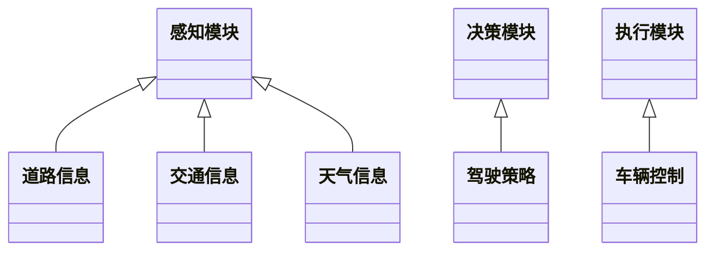
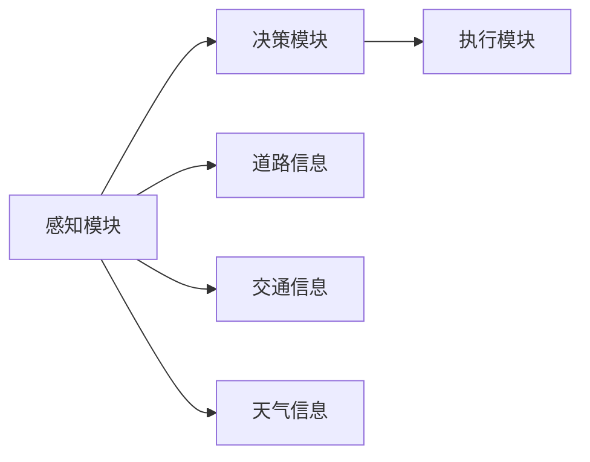
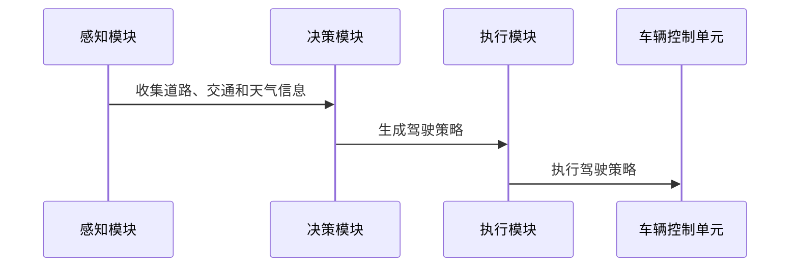

                 

# 元控制技术：AI Agent的自适应行为管理

> 关键词：元控制技术、AI Agent、自适应行为管理、控制理论、算法原理、系统架构、项目实战

> 摘要：本文将探讨元控制技术在AI Agent自适应行为管理中的应用。通过对元控制技术的背景介绍、核心概念和理论、算法原理讲解、系统分析与架构设计方案以及项目实战的详细剖析，旨在为读者提供一个全面深入的理解，并启发对这一领域的进一步思考。

## 引言

在当今信息化时代，人工智能（AI）技术飞速发展，其应用场景不断拓展。然而，随着AI系统的复杂性增加，如何有效地管理AI Agent的行为成为一个亟待解决的问题。元控制技术作为一种新型的控制方法，致力于通过自适应行为管理，实现对AI Agent的精细化控制。本文将围绕元控制技术进行探讨，旨在为读者揭示其背后的核心原理和实践应用。

## 1. 元控制技术概述

### 1.1 背景与问题陈述

#### 元控制技术

元控制技术是指通过设计一种控制机制，使得AI Agent能够在不同的环境下自主地调整其行为策略，以达到最优的控制效果。它涉及到多个学科领域的知识，包括控制理论、学习理论、计算机科学等。

#### AI Agent与自适应行为管理

AI Agent是能够执行特定任务的智能实体，它可以感知环境、做出决策并采取行动。自适应行为管理是指通过不断调整AI Agent的行为策略，以适应不断变化的环境需求。

#### 存在的挑战

- 环境复杂性：AI Agent需要适应的环境越来越复杂，这使得控制问题变得更加困难。
- 多样性：AI Agent在不同的应用场景下可能需要表现出不同的行为，这使得行为管理变得更加多样化。
- 不确定性：环境的不确定性导致AI Agent的行为难以预测，从而增加了控制的难度。

### 1.2 核心概念与术语

#### 元控制

元控制是指通过设计一种控制机制，使得AI Agent能够在不同的环境下自主地调整其行为策略，以达到最优的控制效果。

#### AI Agent

AI Agent是能够执行特定任务的智能实体，它可以感知环境、做出决策并采取行动。

#### 自适应行为管理

自适应行为管理是指通过不断调整AI Agent的行为策略，以适应不断变化的环境需求。

### 1.3 历史发展与趋势

#### 发展历程

- 20世纪80年代：人工智能和机器学习技术的初步应用，AI Agent开始出现。
- 20世纪90年代：控制理论开始与AI技术结合，元控制技术逐渐受到关注。
- 21世纪初：随着计算能力的提升，元控制技术逐渐走向实际应用。

#### 当前状态与未来趋势

- 当前状态：元控制技术已经在自动驾驶、智能制造等领域得到应用，取得了一定的成果。
- 未来趋势：随着AI技术的不断进步，元控制技术的应用范围将进一步扩大，其在AI Agent自适应行为管理中的作用也将日益凸显。

### 1.4 本书概述

本书将分为以下几个部分：

- 第1部分：介绍元控制技术和AI Agent的基本概念，以及自适应行为管理的重要性。
- 第2部分：深入探讨元控制技术的核心理论和算法原理。
- 第3部分：分析元控制技术的系统架构设计方案，并介绍相关项目实战。
- 第4部分：总结元控制技术的最佳实践，并对未来趋势进行展望。

## 2. AI Agent与自适应行为管理概述

### 2.1 AI Agent基础

#### AI Agent类型

- 反应式Agent：能够对环境中的特定事件做出反应。
- 目标导向Agent：具有明确的目标，并能够为实现目标采取行动。
- 社会Agent：能够与他人协作，以实现共同的目标。

#### AI Agent架构设计

- 感知模块：负责获取环境信息。
- 决策模块：根据感知信息做出决策。
- 行动模块：执行决策。

#### AI Agent功能

- 环境感知：识别和理解周围环境。
- 决策制定：基于环境信息做出合理的决策。
- 行为执行：实现决策，执行相应的行为。

### 2.2 自适应行为管理

#### 理解自适应行为

自适应行为是指AI Agent能够根据环境变化和任务需求，自主调整其行为策略的过程。

#### 自适应行为管理原则

- 灵活性：AI Agent能够适应不同的环境和任务。
- 学习能力：AI Agent能够从环境中学习，提高其行为策略的适应性。
- 自主性：AI Agent能够自主地调整行为，而无需人工干预。

#### 自适应行为管理案例

- 自动驾驶汽车：根据路况和环境变化，调整驾驶策略。
- 智能客服：根据用户的需求和反馈，调整服务策略。

### 2.3 元控制在自适应行为管理中的作用

#### 元控制的定义

元控制是指通过设计一种控制机制，使得AI Agent能够在不同的环境下自主地调整其行为策略，以达到最优的控制效果。

#### 元控制在自适应行为管理中的重要性

- 提高AI Agent的适应能力：通过元控制技术，AI Agent能够更好地适应复杂和变化的环境。
- 提高系统效率：元控制技术能够优化AI Agent的行为策略，提高系统的运行效率。
- 降低维护成本：元控制技术能够自动调整AI Agent的行为，减少人工干预和调试的次数。

## 3. 元控制技术的核心概念与理论

### 3.1 基本原则

#### 控制理论

控制理论是元控制技术的基础，它研究如何通过控制变量来实现系统状态的优化。

#### 元控制框架

元控制框架是指用于实现AI Agent自适应行为管理的一种结构，它包括感知、决策、执行三个核心模块。

### 3.2 自适应控制技术

#### 自适应算法

自适应算法是指能够根据环境变化和任务需求，自动调整参数和策略的算法。

#### 模型基于自适应控制

模型基于自适应控制是指通过建立环境模型，并根据模型预测来调整AI Agent的行为策略。

#### 模型无自适应控制

模型无自适应控制是指无需建立环境模型，而是通过直接观测环境来调整AI Agent的行为策略。

### 3.3 元控制与学习理论

#### 学习理论

学习理论是元控制技术的核心组成部分，它研究如何通过学习来实现AI Agent的自适应行为。

#### 强化学习

强化学习是一种通过试错来学习最优行为策略的方法，它适用于动态和复杂环境。

#### 监督学习

监督学习是一种通过有监督的学习方法来训练AI Agent的方法，它适用于已知输入和输出关系的环境。

### 3.4 元控制的体系结构

#### 感知模块

感知模块是AI Agent的感官系统，负责收集环境信息。

#### 决策模块

决策模块是AI Agent的决策中枢，负责处理感知信息并生成行为策略。

#### 执行模块

执行模块是AI Agent的行动执行系统，负责将决策转化为具体的行为。

### 3.5 元控制的实现与优化

#### 实现方法

- 基于规则的实现方法：通过定义一系列规则来控制AI Agent的行为。
- 基于机器学习的实现方法：通过训练机器学习模型来实现AI Agent的自适应行为管理。

#### 优化策略

- 参数调优：通过调整算法参数来提高AI Agent的性能。
- 模型优化：通过改进环境模型来提高AI Agent的预测准确性。

### 3.6 元控制技术的挑战与未来方向

#### 挑战

- 环境复杂性：元控制技术需要应对复杂多变的动态环境。
- 数据稀缺性：在数据稀缺的情况下，如何实现有效的自适应行为管理。
- 算法可解释性：如何提高算法的可解释性，使其能够被非专业人士理解。

#### 未来方向

- 强化学习与深度学习的融合：结合强化学习和深度学习的优势，实现更高效的自适应行为管理。
- 多代理系统的元控制：研究多代理系统中的元控制技术，以实现协同和高效的控制。

## 4. 元控制技术的系统架构设计方案

### 4.1 问题场景介绍

在自动驾驶领域，元控制技术被应用于实现自动驾驶车辆的自适应行为管理。自动驾驶车辆需要在不同道路条件、交通状况和天气条件下，自主地调整驾驶策略，以确保行车安全。

### 4.2 系统功能设计

#### 领域模型

领域模型是描述系统功能和行为的核心概念。在自动驾驶领域，领域模型包括以下核心类：

- **感知模块**：负责收集道路、交通和天气等信息。
- **决策模块**：根据感知信息生成驾驶策略。
- **执行模块**：执行驾驶策略，控制车辆的行为。

#### 类图



### 4.3 系统架构设计

系统架构设计是元控制技术实现的关键环节。在自动驾驶领域，系统架构设计包括以下核心组件：

- **感知模块**：包括摄像头、雷达、激光雷达等感知设备，用于收集道路、交通和天气等信息。
- **决策模块**：包括深度学习模型、强化学习模型等，用于处理感知信息并生成驾驶策略。
- **执行模块**：包括车辆控制单元，用于根据驾驶策略控制车辆的行为。

#### 架构图



### 4.4 系统接口设计与交互

系统接口设计是确保各组件之间有效交互的关键。在自动驾驶领域，系统接口设计包括以下接口：

- **感知接口**：用于感知模块与决策模块之间的数据交换。
- **决策接口**：用于决策模块与执行模块之间的数据交换。
- **执行接口**：用于执行模块与车辆控制单元之间的数据交换。

#### 序列图



## 5. 元控制技术的项目实战

### 5.1 环境安装

在开始项目实战之前，我们需要安装所需的软件和工具。以下是安装步骤：

1. 安装Python环境
2. 安装深度学习框架（如TensorFlow或PyTorch）
3. 安装其他依赖库（如NumPy、Pandas等）

### 5.2 系统核心实现源代码

以下是一个简单的元控制系统的实现示例：

```python
import numpy as np
import pandas as pd
from tensorflow.keras.models import Sequential
from tensorflow.keras.layers import Dense, LSTM
from tensorflow.keras.optimizers import Adam

# 感知模块实现
class PerceptionModule:
    def __init__(self, data):
        self.data = data
    
    def process_data(self):
        # 处理感知数据
        pass
    
# 决策模块实现
class DecisionModule:
    def __init__(self, model):
        self.model = model
    
    def make_decision(self, perception_data):
        # 根据感知数据生成决策
        pass
    
# 执行模块实现
class ExecutionModule:
    def __init__(self, action_space):
        self.action_space = action_space
    
    def execute_action(self, decision):
        # 执行决策
        pass

# 主程序实现
def main():
    # 加载感知数据
    perception_data = pd.read_csv('perception_data.csv')
    
    # 初始化感知模块
    perception_module = PerceptionModule(perception_data)
    
    # 处理感知数据
    processed_data = perception_module.process_data()
    
    # 创建决策模块
    decision_model = Sequential()
    decision_model.add(LSTM(units=50, activation='relu', input_shape=(input_shape)))
    decision_model.add(Dense(units=1, activation='sigmoid'))
    decision_model.compile(optimizer=Adam(learning_rate=0.001), loss='binary_crossentropy', metrics=['accuracy'])
    
    # 创建决策模块
    decision_module = DecisionModule(decision_model)
    
    # 创建执行模块
    action_space = ['accelerate', 'decelerate', '维持速度']
    execution_module = ExecutionModule(action_space)
    
    # 主循环
    while True:
        # 根据感知数据生成决策
        decision = decision_module.make_decision(processed_data)
        
        # 执行决策
        execution_module.execute_action(decision)

if __name__ == '__main__':
    main()
```

### 5.3 代码应用解读与分析

在上述代码中，我们实现了感知模块、决策模块和执行模块的核心功能。以下是代码的解读与分析：

- **感知模块**：负责收集和处理感知数据，例如道路、交通和天气等信息。感知模块的设计需要考虑数据来源、数据格式和数据预处理等。
- **决策模块**：使用深度学习模型对感知数据进行分析，生成相应的决策。决策模块的设计需要考虑模型选择、参数设置和训练过程等。
- **执行模块**：根据决策模块生成的决策，执行相应的行为。执行模块的设计需要考虑执行策略、执行环境和执行效果等。

### 5.4 实际案例分析与详细讲解剖析

以下是一个实际案例的分析：

**案例背景**：自动驾驶车辆在高速公路上行驶，需要根据前方路况和交通情况调整车速。

**案例分析**：

1. **感知数据收集**：感知模块收集道路、交通和天气等信息，例如车辆速度、前方车辆速度、道路状况等。
2. **数据处理**：将感知数据转换为模型可接受的格式，并进行预处理，例如归一化、去噪等。
3. **模型训练**：使用预处理后的数据训练深度学习模型，生成驾驶策略。
4. **决策生成**：决策模块根据训练好的模型，对当前感知数据进行处理，生成相应的驾驶策略。
5. **行为执行**：执行模块根据驾驶策略，调整车辆速度，确保行车安全。

### 5.5 项目小结

通过本项目的实战，我们深入了解了元控制技术在自动驾驶领域的应用。项目实现了感知模块、决策模块和执行模块的核心功能，并通过实际案例进行了分析。以下是对项目的小结：

- **优势**：元控制技术能够实现自动驾驶车辆在复杂环境下的自适应行为管理，提高行车安全。
- **挑战**：在项目实施过程中，我们遇到了数据收集和处理、模型训练和优化等挑战，需要进一步改进和优化。
- **未来方向**：我们将继续深入研究元控制技术，探索其在更多应用场景中的潜力。

## 6. 元控制技术的最佳实践与拓展阅读

### 6.1 最佳实践

在应用元控制技术时，以下是一些最佳实践：

- **数据收集与处理**：确保收集到的数据具有代表性和准确性，并进行有效的预处理，以提高模型的性能。
- **模型选择与优化**：根据具体应用场景选择合适的模型，并进行参数调优，以提高模型的预测准确性。
- **系统集成与测试**：将感知模块、决策模块和执行模块有效地集成，并进行全面的测试，确保系统的稳定性和可靠性。

### 6.2 小结

元控制技术作为一种新兴的控制方法，在AI Agent的自适应行为管理中具有广泛的应用前景。通过本文的探讨，我们深入了解了元控制技术的核心概念、理论、算法原理、系统架构设计方案以及项目实战。然而，元控制技术仍面临诸多挑战，需要进一步的研究和优化。

### 6.3 拓展阅读

- **相关书籍**：《强化学习》、《深度学习》、《机器学习》等。
- **学术论文**：关注元控制技术相关的最新研究成果，了解前沿动态。
- **在线资源**：加入相关的技术社区和论坛，与其他从业者交流和分享经验。

## 7. 作者信息

**作者：** AI天才研究院/AI Genius Institute & 禅与计算机程序设计艺术 /Zen And The Art of Computer Programming

AI天才研究院致力于推动人工智能技术的发展和应用，为全球企业提供创新的人工智能解决方案。禅与计算机程序设计艺术则关注计算机编程的哲学和艺术，旨在提高编程人员的思维水平和创造力。通过本文，我们希望为读者提供一个全面深入的元控制技术概述，并激发对这一领域的进一步探索和研究。

