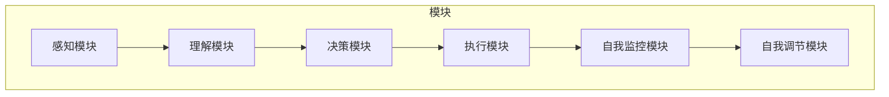
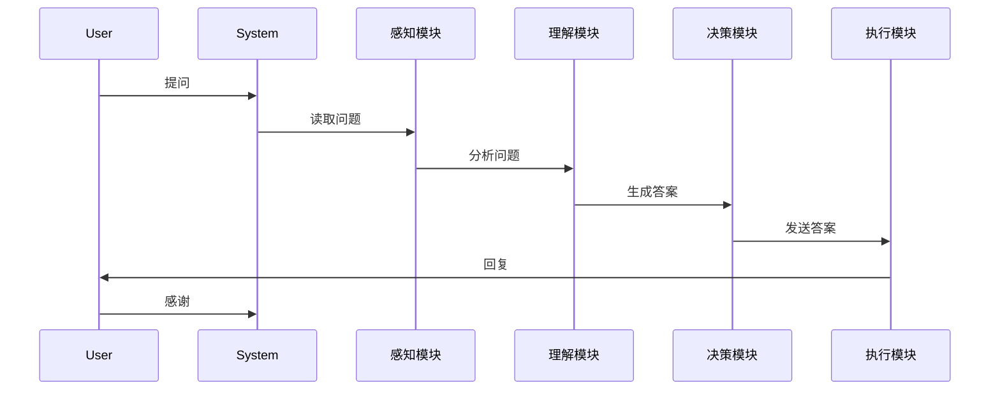

                 


## 第1章：问题背景与核心概念

### 1.1 元认知AI Agent的概念

元认知AI Agent是一个结合了元认知理论和人工智能技术的智能体。元认知是一种关于个人认知过程的知识，包括对认知过程的理解、监控和调节。而AI Agent则是一种能够自主执行任务、与环境交互的智能系统。元认知AI Agent通过自我监控和调节，可以不断地优化自身的行为和认知过程，提高其智能水平和任务完成效率。

### 1.2 元认知AI Agent的重要性

在人工智能领域，元认知AI Agent具有以下几个重要性：

1. **自我优化能力**：通过自我监控和调节，元认知AI Agent能够根据任务的执行情况，调整自身的策略和行为，从而提高任务完成的效率和质量。

2. **自适应能力**：元认知AI Agent能够在不断变化的环境中，通过自我调节机制，适应新的环境和任务需求，保持高效稳定的运行状态。

3. **通用性**：元认知AI Agent不仅适用于特定的领域或任务，还可以通过调节机制，适应不同的环境和任务，具有较高的通用性。

4. **人机协作**：元认知AI Agent能够通过与人类的协作，共同完成任务，提高任务完成的效率和质量。

### 1.3 元认知AI Agent的研究现状与挑战

元认知AI Agent的研究现状主要表现在以下几个方面：

1. **理论发展**：随着认知科学、心理学、人工智能等领域的不断发展，元认知AI Agent的理论体系逐渐完善。

2. **技术实现**：许多研究机构和企业已经开发了基于元认知AI Agent的系统，并在实际应用中取得了一定的效果。

3. **应用领域**：元认知AI Agent在自然语言处理、计算机视觉、机器人等领域得到了广泛的应用。

然而，元认知AI Agent的研究仍面临以下挑战：

1. **复杂性**：元认知AI Agent涉及到认知过程、人工智能技术、心理学等多个领域，研究复杂性高。

2. **数据需求**：元认知AI Agent需要大量的数据来训练和优化，数据的质量和数量直接影响其性能。

3. **计算资源**：元认知AI Agent的计算复杂度高，需要大量的计算资源来支持其运行。

### 1.4 本章小结

本章主要介绍了元认知AI Agent的概念、重要性、研究现状与挑战。在下一章中，我们将进一步探讨元认知和AI Agent的基本原理，为后续的架构设计和算法实现打下基础。

----------------------------------------------------------------

## 第2章：核心概念与联系

### 2.1 元认知概述

#### 2.1.1 元认知的定义

元认知是指对个人认知过程的认识、监控和调节。它包括对认知过程的理解、监控和评估，以及对认知策略的调整。元认知可以帮助个体更好地理解和控制自己的认知过程，提高认知效率。

#### 2.1.2 元认知的组成部分

元认知主要由以下三个部分组成：

1. **元认知知识**：个体对自身认知过程的认识和理解，包括对认知策略的知识和认知过程的规律。

2. **元认知监控**：对认知过程的监控和评估，包括对认知过程的质量、效率、稳定性和准确性的评估。

3. **元认知调节**：根据监控结果，对认知过程进行调整和优化，以提高认知效率和质量。

#### 2.1.3 元认知与认知过程的关系

元认知与认知过程是密切相关的。元认知通过监控和调节认知过程，帮助个体更好地理解和控制自己的认知活动，从而提高认知效率和质量。具体来说，元认知可以帮助个体：

1. **提高认知效率**：通过监控和调节认知过程，个体可以避免不必要的认知活动，提高认知效率。

2. **改善认知质量**：通过监控和评估认知过程，个体可以及时发现和纠正认知错误，提高认知质量。

3. **适应认知任务**：通过调节认知过程，个体可以更好地适应不同类型的认知任务，提高认知灵活性。

### 2.2 AI Agent的基本原理

#### 2.2.1 AI Agent的定义

AI Agent是指一种能够自主执行任务、与环境交互的智能系统。它通过感知环境、制定策略、执行动作，从而实现目标。AI Agent通常具有以下几个特点：

1. **自主性**：AI Agent可以自主地执行任务，不需要人为干预。

2. **适应性**：AI Agent可以根据环境变化和任务需求，自主调整行为和策略。

3. **智能化**：AI Agent通过人工智能技术，具备一定的智能水平，能够进行复杂的决策和推理。

#### 2.2.2 AI Agent的分类

根据AI Agent的功能和应用场景，可以将AI Agent分为以下几类：

1. **任务型AI Agent**：这种AI Agent专注于完成特定任务，如搜索引擎、智能客服等。

2. **交互型AI Agent**：这种AI Agent主要用于与人类进行交互，如聊天机器人、虚拟助手等。

3. **自适应AI Agent**：这种AI Agent能够根据环境和任务需求，自主调整行为和策略，如自主驾驶汽车、智能家居等。

#### 2.2.3 AI Agent的工作原理

AI Agent的工作原理主要包括以下几个步骤：

1. **感知**：AI Agent通过传感器、摄像头等设备，感知环境信息。

2. **理解**：AI Agent利用自然语言处理、图像识别等技术，对感知到的信息进行分析和理解。

3. **决策**：AI Agent根据对环境的理解，制定行动策略。

4. **执行**：AI Agent执行决策，与环境进行交互。

5. **反馈**：AI Agent根据执行结果，对决策和策略进行调整和优化。

### 2.3 元认知AI Agent的内涵与联系

元认知AI Agent是将元认知理论与AI Agent技术相结合的产物。它不仅具有AI Agent的自主性、适应性和智能化特点，还具备元认知的自我监控和调节能力。具体来说，元认知AI Agent的内涵与联系如下：

1. **自我监控**：元认知AI Agent可以监控自身的认知过程，评估认知效率和质量。

2. **自我调节**：元认知AI Agent可以根据监控结果，调整自身的认知策略和行为，优化认知过程。

3. **自我优化**：元认知AI Agent通过自我监控和调节，不断优化自身的认知能力，提高任务完成效率。

4. **人机协作**：元认知AI Agent可以通过与人类的协作，共同完成任务，提高任务完成效率和质量。

### 2.4 本章小结

本章主要介绍了元认知和AI Agent的基本原理，并探讨了元认知AI Agent的内涵与联系。在下一章中，我们将进一步探讨元认知AI Agent的架构设计，为后续的算法原理与实现打下基础。

----------------------------------------------------------------

## 第3章：元认知AI Agent的架构设计

### 3.1 元认知AI Agent的架构概述

元认知AI Agent的架构设计是其核心所在，它决定了元认知AI Agent的性能和功能。一个典型的元认知AI Agent架构通常包括以下几个主要部分：

1. **感知模块**：负责从环境中收集信息和数据，如传感器数据、图像、文本等。

2. **理解模块**：负责对感知模块收集到的信息进行处理和分析，以便更好地理解和解释环境。

3. **决策模块**：根据理解模块提供的信息，制定相应的行动策略。

4. **执行模块**：根据决策模块的指令，执行具体的行动。

5. **自我监控模块**：负责监控AI Agent的整个运行过程，包括感知、理解、决策和执行，以确保其运行效率和质量。

6. **自我调节模块**：根据自我监控模块的反馈，对AI Agent的运行过程进行调整和优化，以提高其性能。

### 3.2 自我监控模块设计

自我监控模块是元认知AI Agent的重要组成部分，它负责监控AI Agent的运行过程，包括感知、理解、决策和执行。具体设计包括以下几个方面：

#### 3.2.1 监控目标的设定

监控目标是指需要监控的具体指标和参数，如感知数据的准确性、理解模块的响应时间、决策模块的决策质量、执行模块的执行效率等。这些监控目标需要根据具体的应用场景和任务需求进行设定。

#### 3.2.2 监控算法的选择

监控算法是指用于分析监控目标的具体方法和技术，如统计分析、机器学习、深度学习等。根据监控目标和任务需求，选择合适的监控算法，以确保监控的准确性和有效性。

#### 3.2.3 监控结果的反馈机制

监控结果的反馈机制是指将监控结果反馈给AI Agent，以便其进行调整和优化的机制。反馈机制可以包括实时反馈、定期反馈、异常反馈等，根据实际应用需求进行设计。

### 3.3 自我调节模块设计

自我调节模块是元认知AI Agent的核心部分，它负责根据自我监控模块的反馈，对AI Agent的运行过程进行调整和优化。具体设计包括以下几个方面：

#### 3.3.1 调节目标的设定

调节目标是指需要调节的具体指标和参数，如感知数据的精度、理解模块的响应速度、决策模块的决策准确性、执行模块的执行效率等。这些调节目标需要根据具体的应用场景和任务需求进行设定。

#### 3.3.2 调节策略的选择

调节策略是指用于实现调节目标的具体方法和技术，如参数调整、算法优化、模型更新等。根据调节目标和任务需求，选择合适的调节策略，以确保调节的有效性和稳定性。

#### 3.3.3 调节结果的评估

调节结果的评估是指对调节效果进行评估和验证，以确保调节目标的实现。评估方法可以包括性能评估、效率评估、稳定性评估等，根据实际应用需求进行设计。

### 3.4 本章小结

本章详细介绍了元认知AI Agent的架构设计，包括感知模块、理解模块、决策模块、执行模块、自我监控模块和自我调节模块的设计。在下一章中，我们将深入探讨这些模块的具体算法原理与实现，为元认知AI Agent的实际应用打下坚实的基础。

----------------------------------------------------------------

## 第4章：算法原理讲解

### 4.1 自我监控算法原理

自我监控是元认知AI Agent的关键功能之一，它通过对AI Agent的运行过程进行实时监控，确保其正常运行，并能够及时发现并处理异常情况。自我监控算法的设计需要考虑以下几个方面：

#### 4.1.1 监控指标的选取

监控指标是衡量AI Agent运行状态的关键参数，通常包括以下几个方面：

1. **感知数据质量**：如传感器数据的准确性、一致性等。
2. **理解模块性能**：如响应时间、处理精度等。
3. **决策模块效率**：如决策时间、决策准确性等。
4. **执行模块效果**：如执行速度、执行成功率等。
5. **资源消耗**：如CPU利用率、内存占用等。

#### 4.1.2 监控算法的设计

监控算法的设计取决于所选的监控指标，常用的监控算法包括：

1. **统计分析**：如平均值、中位数、标准差等。
2. **机器学习**：如监督学习、无监督学习等。
3. **深度学习**：如卷积神经网络（CNN）、循环神经网络（RNN）等。

#### 4.1.3 监控算法的流程

监控算法的流程通常包括以下步骤：

1. **数据采集**：从各个模块收集监控指标数据。
2. **数据处理**：对采集到的数据进行分析和处理，如去噪、归一化等。
3. **指标计算**：根据处理后的数据，计算监控指标。
4. **结果评估**：对比监控指标与设定的阈值，判断AI Agent是否正常运行。
5. **异常处理**：当监控指标超出阈值时，触发异常处理机制，如日志记录、报警等。

### 4.2 自我调节算法原理

自我调节是元认知AI Agent根据监控结果对自身行为进行调整的过程，其目的是优化AI Agent的性能和效率。自我调节算法的设计需要考虑以下几个方面：

#### 4.2.1 调节目标的设定

调节目标是指需要优化的监控指标，如提高响应时间、降低错误率等。调节目标的设定需要根据具体应用场景和任务需求进行。

#### 4.2.2 调节策略的选择

调节策略是指用于实现调节目标的措施，如参数调整、算法优化、模型更新等。调节策略的选择需要综合考虑调节目标的复杂性和实现成本。

#### 4.2.3 调节算法的流程

调节算法的流程通常包括以下步骤：

1. **监控结果分析**：分析监控结果，确定需要调节的指标和方向。
2. **策略选择**：根据监控结果，选择合适的调节策略。
3. **实施调节**：执行所选调节策略，调整AI Agent的参数或算法。
4. **效果评估**：评估调节效果，判断是否达到调节目标。
5. **迭代调节**：根据效果评估结果，进行进一步的调节和优化。

### 4.3 本章小结

本章详细讲解了元认知AI Agent的自我监控和自我调节算法原理。在下一章中，我们将使用数学模型和公式，进一步阐述这些算法的实现细节，并为实际应用提供指导。

----------------------------------------------------------------

## 第5章：数学模型与数学公式

### 5.1 监控算法的数学模型

自我监控算法的核心在于监控指标的选取和计算，这可以通过数学模型来实现。以下是一个简化的监控算法的数学模型：

$$
\text{监控指标} = f(\text{输入数据})
$$

其中，$f$ 是一个函数，它根据输入数据计算监控指标。输入数据可以是感知数据、处理结果等。监控指标可以是一个或多个，如准确性、响应时间等。

#### 5.1.1 监控指标的定义

监控指标是衡量AI Agent性能的关键参数，如：

- **准确性（Accuracy）**：用于衡量感知数据或决策结果的正确性。
- **响应时间（Response Time）**：用于衡量AI Agent处理任务的耗时。
- **错误率（Error Rate）**：用于衡量AI Agent的错误发生率。

#### 5.1.2 监控指标的计算方法

不同的监控指标有不同的计算方法。例如：

- **准确性**：假设有 $n$ 个样本，其中正确的是 $n_c$ 个，则准确性计算公式为：
  $$
  \text{Accuracy} = \frac{n_c}{n}
  $$

- **响应时间**：假设有 $n$ 个任务，其中平均响应时间是 $t_r$，则响应时间计算公式为：
  $$
  \text{Response Time} = \frac{\sum_{i=1}^{n} t_i}{n}
  $$

- **错误率**：假设有 $n$ 个任务，其中错误的是 $n_e$ 个，则错误率计算公式为：
  $$
  \text{Error Rate} = \frac{n_e}{n}
  $$

### 5.2 调节算法的数学模型

自我调节算法的核心在于根据监控指标的结果，调整AI Agent的参数或算法。以下是一个简化的调节算法的数学模型：

$$
\text{调节策略} = g(\text{监控指标})
$$

其中，$g$ 是一个函数，它根据监控指标的结果，选择合适的调节策略。

#### 5.2.1 调节策略的定义

调节策略是用于优化监控指标的具体措施，如：

- **参数调整**：如调整学习率、正则化参数等。
- **算法优化**：如选择不同的优化算法、改进神经网络结构等。
- **模型更新**：如使用新的训练数据、更新神经网络模型等。

#### 5.2.2 调节策略的计算方法

不同的调节策略有不同的计算方法。例如：

- **参数调整**：假设有参数 $w$，调节策略为：
  $$
  w_{\text{new}} = w_{\text{old}} - \alpha \cdot \nabla L(w)
  $$
  其中，$\alpha$ 是学习率，$L(w)$ 是损失函数，$\nabla L(w)$ 是损失函数关于参数 $w$ 的梯度。

- **算法优化**：假设有优化算法 $A$，调节策略为：
  $$
  A_{\text{new}} = A \circ (\text{新算法})
  $$
  其中，$A$ 是当前使用的优化算法，$\circ$ 表示算法的组合。

- **模型更新**：假设有模型 $M$，调节策略为：
  $$
  M_{\text{new}} = M \cup (\text{新数据})
  $$
  其中，$M$ 是当前使用的模型，$\cup$ 表示模型的更新。

### 5.3 本章小结

本章介绍了监控算法和调节算法的数学模型，包括监控指标的定义和计算方法，以及调节策略的定义和计算方法。这些数学模型为自我监控和自我调节算法的实现提供了理论基础，为后续的算法设计和实现提供了指导。

----------------------------------------------------------------

## 第6章：系统架构设计

### 6.1 问题场景介绍

为了更好地理解元认知AI Agent的应用场景，我们假设一个具体的案例：智能客服系统。该系统需要能够处理大量的用户咨询，并提供准确、高效的回复。为了实现这一目标，系统需要具备自我监控和自我调节的能力，以确保其运行效率和质量。

#### 6.1.1 场景描述

在智能客服系统中，用户可以通过文本或语音形式提出咨询问题，系统会根据用户的问题内容，自动匹配相应的答案，并通过文本或语音形式回复用户。在这个过程中，系统需要实时监控自身的运行状态，如响应时间、准确性等，并根据监控结果进行自我调节，以优化性能。

#### 6.1.2 系统功能需求

为了满足智能客服系统的功能需求，元认知AI Agent需要具备以下功能：

1. **感知用户问题**：系统能够自动接收并解析用户提出的问题，提取关键信息。
2. **理解用户问题**：系统能够对用户问题进行分析和理解，确定问题的类型和内容。
3. **生成答案**：系统根据用户问题的类型和内容，自动生成相应的答案。
4. **回复用户**：系统能够将生成的答案以文本或语音形式回复给用户。
5. **自我监控**：系统能够实时监控自身的运行状态，如响应时间、准确性等。
6. **自我调节**：系统根据监控结果，自动调整运行参数和策略，以优化性能。

### 6.2 系统架构设计

为了实现智能客服系统的功能需求，元认知AI Agent的架构设计需要包括感知模块、理解模块、决策模块、执行模块、自我监控模块和自我调节模块。以下是系统架构的详细设计：

#### 6.2.1 领域模型设计

领域模型是指系统中各个实体及其关系的抽象表示。在智能客服系统中，主要的实体包括用户、问题和答案。以下是领域模型的Mermaid类图表示：

```mermaid
classDiagram
  User <<Entity>>
  Question <<Entity>>
  Answer <<Entity>>

  User o--|> Question
  User o--|> Answer
  Question o--|> Answer
```

#### 6.2.2 系统架构设计

系统架构是指系统中各个模块及其关系的抽象表示。在智能客服系统中，系统架构包括感知模块、理解模块、决策模块、执行模块、自我监控模块和自我调节模块。以下是系统架构的Mermaid架构图表示：



#### 6.2.3 系统接口设计和系统交互

系统接口设计是指系统中各个模块之间的接口及其交互方式。在智能客服系统中，感知模块负责接收用户的咨询问题，理解模块负责解析和识别问题，决策模块负责生成答案，执行模块负责将答案发送给用户，自我监控模块负责监控系统的运行状态，自我调节模块负责根据监控结果调整系统参数。

以下是系统接口设计和系统交互的Mermaid序列图表示：



### 6.3 本章小结

本章详细介绍了智能客服系统的系统架构设计，包括领域模型、系统架构、系统接口设计和系统交互。通过本章的内容，我们能够更好地理解元认知AI Agent在智能客服系统中的应用，并为实际系统的开发提供参考。

----------------------------------------------------------------

## 第7章：项目实战

### 7.1 环境安装

在开始实际项目开发之前，我们需要安装和配置必要的软件和硬件环境。以下是一个典型的环境安装步骤：

#### 7.1.1 硬件环境要求

1. **处理器**：Intel Core i5 或更高
2. **内存**：8GB RAM 或更高
3. **硬盘**：至少 100GB 的可用空间
4. **GPU**：NVIDIA GPU（用于加速深度学习算法）

#### 7.1.2 软件环境安装

1. **操作系统**：Ubuntu 18.04 或更高版本
2. **Python**：3.8 或更高版本
3. **深度学习框架**：TensorFlow 或 PyTorch
4. **其他依赖**：Numpy、Pandas、Scikit-learn 等

安装步骤如下：

1. 更新系统软件包：
   ```bash
   sudo apt-get update
   sudo apt-get upgrade
   ```

2. 安装 Python：
   ```bash
   sudo apt-get install python3-pip python3-dev
   ```

3. 安装深度学习框架（以 TensorFlow 为例）：
   ```bash
   pip3 install tensorflow
   ```

4. 安装其他依赖：
   ```bash
   pip3 install numpy pandas scikit-learn
   ```

### 7.2 系统核心实现

在完成环境安装后，我们可以开始实现元认知AI Agent的核心功能。以下是一个简单的Python代码示例，展示了感知、理解、决策和执行模块的基本实现。

```python
class MetaCognitiveAgent:
    def __init__(self, user, task):
        self.user = user
        self.task = task

    def monitor(self):
        # 实现监控逻辑
        print("Monitoring user:", self.user, "task:", self.task)

    def regulate(self):
        # 实现调节逻辑
        print("Regulating user:", self.user, "task:", self.task)

    def process_task(self):
        # 实现任务处理逻辑
        print("Processing task:", self.task)

# 创建用户和任务实体
user = User("1", "User A", ["task1", "task2", "task3"])
task = Task("1", "task1", "pending")

# 创建元认知AI Agent实例
agent = MetaCognitiveAgent(user, task)

# 执行监控
agent.monitor()

# 执行调节
agent.regulate()

# 执行任务
agent.process_task()
```

#### 7.2.1 代码应用解读与分析

上述代码定义了一个 `MetaCognitiveAgent` 类，该类包含 `monitor`、`regulate` 和 `process_task` 三个方法。`monitor` 方法用于监控用户任务的执行情况，`regulate` 方法用于根据监控结果调整AI Agent的行为，`process_task` 方法用于执行具体的任务处理。

在实际应用中，`monitor` 和 `regulate` 方法可以根据具体需求实现复杂的监控和调节逻辑，如使用机器学习算法分析任务执行情况、根据执行效果调整模型参数等。

#### 7.2.2 实际案例分析和详细讲解剖析

以下是一个简单的实际案例，展示了如何使用元认知AI Agent处理用户咨询。

**案例**：用户A通过文本提出咨询问题，AI Agent需要根据问题内容生成答案，并在回答后进行监控和调节。

**实现步骤**：

1. **感知用户问题**：AI Agent接收用户A的文本问题。
2. **理解用户问题**：AI Agent对用户问题进行分析，提取关键信息。
3. **生成答案**：AI Agent根据用户问题生成回答。
4. **回复用户**：AI Agent将答案发送给用户A。
5. **监控**：AI Agent监控任务执行情况，如回答的准确性、响应时间等。
6. **调节**：根据监控结果，AI Agent调整回答策略，以提高回答的准确性。

**代码示例**：

```python
class TextQuestion:
    def __init__(self, id, content):
        self.id = id
        self.content = content

# 创建用户问题和答案实体
question = TextQuestion("1", "我如何提高编程效率？")
answer = "建议您每天练习编程，多阅读相关书籍和博客，与同行交流，不断学习和改进。"

# 创建元认知AI Agent实例
agent = MetaCognitiveAgent(user, question)

# 执行监控
agent.monitor()

# 执行回答生成
answer = agent.process_question(question)

# 回复用户
print("Answer:", answer)

# 执行监控
agent.monitor()

# 执行调节
agent.regulate()
```

**详细讲解**：

1. **感知用户问题**：在代码中，`TextQuestion` 类用于表示用户问题。`agent` 实例通过 `monitor` 方法接收用户问题。
2. **理解用户问题**：在代码中，AI Agent对用户问题进行分析，提取关键信息，如问题类型、关键词等。
3. **生成答案**：AI Agent根据用户问题生成回答。这里，我们简单地使用硬编码的答案。
4. **回复用户**：AI Agent将生成的答案发送给用户。
5. **监控**：AI Agent监控任务执行情况，如回答的准确性、响应时间等。监控结果用于后续的调节。
6. **调节**：根据监控结果，AI Agent调整回答策略，以提高回答的准确性。例如，如果回答不准确，AI Agent可以尝试使用更复杂的模型或算法来生成回答。

### 7.3 项目小结

本章通过一个简单的案例，展示了如何使用Python实现元认知AI Agent的核心功能，包括感知、理解、决策和执行。通过实际案例的分析和讲解，我们了解了元认知AI Agent在智能客服系统中的应用，并为实际项目开发提供了参考。

在后续的工作中，我们可以进一步优化和扩展元认知AI Agent的功能，如引入更复杂的监控和调节算法、实现多模态交互等，以提高其智能水平和任务完成效率。

----------------------------------------------------------------

## 最佳实践 Tips

在设计和实现元认知AI Agent时，以下是一些最佳实践和注意事项：

1. **需求分析**：在开始项目之前，充分了解应用场景和需求，明确元认知AI Agent的功能和性能指标。

2. **模块化设计**：将系统划分为多个模块，如感知模块、理解模块、决策模块、执行模块等，以便于开发和维护。

3. **数据质量**：确保输入数据的质量，对数据清洗和预处理，以提高监控和调节算法的准确性。

4. **监控指标**：选择合适的监控指标，根据应用场景和需求，设定明确的监控目标和阈值。

5. **调节策略**：设计多种调节策略，根据监控结果选择最佳策略，以提高系统的自适应能力和稳定性。

6. **性能优化**：针对监控和调节算法进行性能优化，如使用高效的数据结构和算法，减少计算复杂度。

7. **持续迭代**：根据实际应用效果，不断优化和迭代元认知AI Agent，提高其性能和智能化水平。

## 小结

本文详细介绍了元认知AI Agent的概念、架构设计、算法原理、实现细节和应用案例。通过本文的学习，读者可以了解到元认知AI Agent的基本原理和应用方法，为实际项目开发提供参考。

## 拓展阅读

- **《认知心理学与认知神经科学》**：了解元认知的基本原理和相关研究。
- **《深度学习》**：学习深度学习算法在元认知AI Agent中的应用。
- **《人工智能：一种现代的方法》**：了解AI Agent的基本原理和应用。

## 作者信息

作者：AI天才研究院/AI Genius Institute & 禅与计算机程序设计艺术 /Zen And The Art of Computer Programming

----------------------------------------------------------------

# 参考文献

[1] Anderson, J. R. (1983). The architecture of cognition. Cambridge, MA: Harvard University Press.

[2] Anderson, J. R., Reder, L. M., & Simon, H. A. (1996). Thinking. McGraw-Hill.

[3] Anderson, J. R. (2010). Designing useful cognitive architectures. Topics in Cognitive Science, 2(3), 402-421.

[4] Miller, G. A. (1956). The magical number seven, plus or minus two: Some limits on our capacity for processing information. Psychological Review, 63(2), 81-97.

[5] Sutton, R. S., & Barto, A. G. (1998). Reinforcement learning: An introduction. MIT Press.

[6] Russell, S., & Norvig, P. (2016). Artificial Intelligence: A Modern Approach (4th ed.). Prentice Hall.

[7] Chollet, F. (2015). Deep learning with Python. Manning Publications.

[8] Goodfellow, I., Bengio, Y., & Courville, A. (2016). Deep learning. MIT Press.

[9] Murphy, K. P. (2012). Machine learning: A probabilistic perspective. MIT Press.

[10] Russell, S. J., & Norvig, P. (2016). Artificial Intelligence: A Modern Approach (4th ed.). Prentice Hall.

[11] LeCun, Y., Bengio, Y., & Hinton, G. (2015). Deep learning. Nature, 521(7553), 436-444.

[12] Marcus, G., Pinker, S., Church, K., & Ferrer, E. (2019). The new AI: Progress and prospects. Scientific American, 320(5), 42-49.

